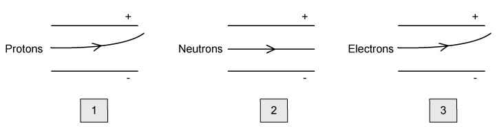
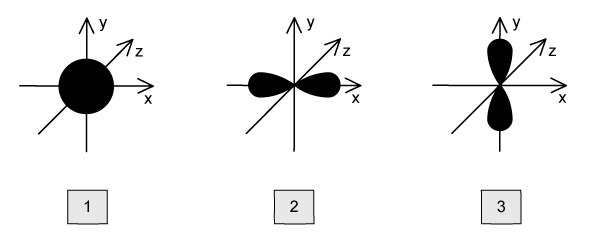
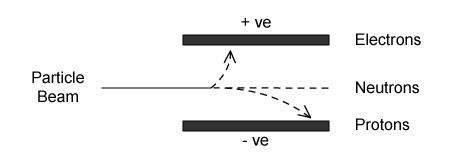

### 1.1 Atomic Structure - Multiple Choice: Easy

::: {.mc-question #atomic-choice-easy-q1 data-answer="B"}
### Question 1 · Atomic theory

Which statement from Dalton's atomic theory is still considered correct today?

<button class="mc-choice" data-choice="A"><strong>A</strong>All matter is made of indivisible atoms.</button>
<button class="mc-choice" data-choice="B"><strong>B</strong>All atoms are very small in size.</button>
<button class="mc-choice" data-choice="C"><strong>C</strong>All atoms of one element have a different mass from atoms of every other element.</button>
<button class="mc-choice" data-choice="D"><strong>D</strong>All atoms of the same element have the same mass.</button>

<button class="check-answer">Check answer</button>

Show explanation

<strong>B.</strong> Atoms are extremely small, but they contain subatomic particles and isotopes exist.

:::

::: {.mc-question #atomic-choice-easy-q2 data-answer="B"}
### Question 2 · The H₃⁺ ion

The reaction $\ce{H2(g) + H2+(g) -> H(g) + H3+(g)}$ occurs in gas clouds. What is the composition of $\ce{H3+}$?

<button class="mc-choice" data-choice="A"><strong>A</strong>3 protons, 0 neutrons, 1 electron</button>
<button class="mc-choice" data-choice="B"><strong>B</strong>3 protons, 0 neutrons, 2 electrons</button>
<button class="mc-choice" data-choice="C"><strong>C</strong>2 protons, 1 neutron, 1 electron</button>
<button class="mc-choice" data-choice="D"><strong>D</strong>2 protons, 1 neutron, 2 electrons</button>

<button class="check-answer">Check answer</button>

Show explanation

<strong>B.</strong> Three hydrogen nuclei give three protons and no neutrons; the $+1$ charge means two electrons remain.

:::

::: {.mc-question #atomic-choice-easy-q3 data-answer="D"}
### Question 3 · Atomic, proton and mass numbers

Which row is correct?

|  | Atomic number is the number of | Proton number is the number of | Mass number is the number of |
|---|---|---|---|
| A | atoms | protons | protons |
| B | electrons | neutrons | nucleons |
| C | electrons | neutrons | protons |
| D | protons | protons | nucleons |

<button class="mc-choice" data-choice="A"><strong>A</strong></button><button class="mc-choice" data-choice="B"><strong>B</strong></button><button class="mc-choice" data-choice="C"><strong>C</strong></button><button class="mc-choice" data-choice="D"><strong>D</strong></button>

<button class="check-answer">Check answer</button>

Show explanation

<strong>D.</strong> Atomic number and proton number are the number of protons; mass number is the number of nucleons.

:::

::: {.mc-question #atomic-choice-easy-q4 data-answer="B"}
### Question 4 · Subatomic particles in $^{32}_{15}\ce{P^{3-}}$

What is the composition of the phosphide ion $^{32}_{15}\ce{P^{3-}}$?

|  | Protons | Neutrons | Electrons |
|---|---:|---:|---:|
| A | 15 | 17 | 32 |
| B | 15 | 17 | 18 |
| C | 17 | 15 | 15 |
| D | 17 | 15 | 32 |

<button class="mc-choice" data-choice="A"><strong>A</strong></button><button class="mc-choice" data-choice="B"><strong>B</strong></button><button class="mc-choice" data-choice="C"><strong>C</strong></button><button class="mc-choice" data-choice="D"><strong>D</strong></button>

<button class="check-answer">Check answer</button>

Show explanation

<strong>B.</strong> Protons $=15$, neutrons $=32-15=17$, and the $3-$ charge gives $15+3=18$ electrons.

:::

::: {.mc-question #atomic-choice-easy-q5 data-answer="C"}
### Question 5 · Relative charge and mass

Which option correctly describes the relative charges and masses of the subatomic particles?

|  | Proton | Neutron | Electron | Relative mass of an electron |
|---|---:|---:|---:|---:|
| A | +1 | 0 | −1 | 1 |
| B | 0 | +1 | +1 | $\frac{1}{1840}$ |
| C | +1 | 0 | −1 | $\frac{1}{1840}$ |
| D | 0 | +1 | −1 | 1 |

<button class="mc-choice" data-choice="A"><strong>A</strong></button><button class="mc-choice" data-choice="B"><strong>B</strong></button><button class="mc-choice" data-choice="C"><strong>C</strong></button><button class="mc-choice" data-choice="D"><strong>D</strong></button>

<button class="check-answer">Check answer</button>

Show explanation

<strong>C.</strong> Protons are $+1$, neutrons are neutral, electrons are $-1$, and an electron has a relative mass of about $1/1840$.

:::

::: {.mc-question #atomic-choice-easy-q6 data-answer="A"}
### Question 6 · Particles in an electric field

The trajectories of protons, neutrons and electrons in an electric field are shown below. Which diagrams are correct?

{.question-figure fig-alt="Electric-field trajectories for protons, neutrons and electrons"}

<button class="mc-choice" data-choice="A"><strong>A</strong>2 and 3</button><button class="mc-choice" data-choice="B"><strong>B</strong>1 and 2</button><button class="mc-choice" data-choice="C"><strong>C</strong>1, 2 and 3</button><button class="mc-choice" data-choice="D"><strong>D</strong>2 only</button>

<button class="check-answer">Check answer</button>

Show explanation

<strong>A.</strong> Neutrons are undeflected; electrons bend towards the positive plate; the proton diagram must bend towards the negative plate.

:::

### 1.1 Atomic Structure - Multiple Choice: Medium

::: {.mc-question #atomic-choice-medium-q1 data-answer="A"}
### Question 1 · Particle counts

In which species are the numbers of protons, neutrons and electrons all different?

<button class="mc-choice" data-choice="A"><strong>A</strong>$^{23}\ce{Na+}$</button><button class="mc-choice" data-choice="B"><strong>B</strong>$^{27}\ce{Al}$</button><button class="mc-choice" data-choice="C"><strong>C</strong>$^{19}\ce{F-}$</button><button class="mc-choice" data-choice="D"><strong>D</strong>$^{32}\ce{S^{2-}}$</button>

<button class="check-answer">Check answer</button>

Show explanation

<strong>A.</strong> $^{23}\ce{Na+}$ has 11 protons, 12 neutrons and 10 electrons.

:::

::: {.mc-question #atomic-choice-medium-q2 data-answer="B"}
### Question 2 · Why atoms are neutral

Which statement explains why atoms are electrically neutral?

<button class="mc-choice" data-choice="A"><strong>A</strong>A proton has a mass 1840 times greater than an electron.</button><button class="mc-choice" data-choice="B"><strong>B</strong>The charge on an electron is equal and opposite to the charge on a proton.</button><button class="mc-choice" data-choice="C"><strong>C</strong>The charge difference is balanced by neutrons.</button><button class="mc-choice" data-choice="D"><strong>D</strong>Electrons are in shells while protons are in the nucleus.</button>

<button class="check-answer">Check answer</button>

Show explanation

<strong>B.</strong> A neutral atom has equal numbers of protons and electrons, whose charges are equal in magnitude and opposite in sign.

:::

::: {.mc-question #atomic-choice-medium-q3 data-answer="C"}
### Question 3 · Metallic radius down Group 1

Which statements correctly describe the trend in metallic radius from Na to Rb?

1. It increases moving down the group. 2. It increases because extra electron shells are added. 3. It decreases because nuclear forces increase.

<button class="mc-choice" data-choice="A"><strong>A</strong>1, 2 and 3</button><button class="mc-choice" data-choice="B"><strong>B</strong>2 and 3</button><button class="mc-choice" data-choice="C"><strong>C</strong>1 and 2</button><button class="mc-choice" data-choice="D"><strong>D</strong>1 only</button>

<button class="check-answer">Check answer</button>

Show explanation

<strong>C.</strong> Each step down adds an occupied shell, increasing the distance of the outer electron from the nucleus.

:::

::: {.mc-question #atomic-choice-medium-q4 data-answer="C"}
### Question 4 · Distribution of mass and charge

Which statements correctly describe the distribution of mass and charge in an atom?

1. Negative charge is concentrated in one area outside the nucleus. 2. Mass is concentrated inside the nucleus. 3. Negative charge is spread around outside the nucleus.

<button class="mc-choice" data-choice="A"><strong>A</strong>1 and 3</button><button class="mc-choice" data-choice="B"><strong>B</strong>1 and 2</button><button class="mc-choice" data-choice="C"><strong>C</strong>2 and 3</button><button class="mc-choice" data-choice="D"><strong>D</strong>1, 2 and 3</button>

<button class="check-answer">Check answer</button>

Show explanation

<strong>C.</strong> Nearly all mass is in the small nucleus, while the electron charge is distributed through the space around it.

:::

::: {.mc-question #atomic-choice-medium-q5 data-answer="D"}
### Question 5 · Unpaired electrons

There are six unpaired electrons in atoms of element Z. What could element Z be?

<button class="mc-choice" data-choice="A"><strong>A</strong>Sulfur</button><button class="mc-choice" data-choice="B"><strong>B</strong>Iron</button><button class="mc-choice" data-choice="C"><strong>C</strong>Carbon</button><button class="mc-choice" data-choice="D"><strong>D</strong>Chromium</button>

<button class="check-answer">Check answer</button>

Show explanation

<strong>D.</strong> Chromium is $[\ce{Ar}]4s^1 3d^5$, giving six unpaired electrons.

:::

::: {.mc-question #atomic-choice-medium-q6 data-answer="B"}
### Question 6 · Second ionisation energy of magnesium

The second ionisation energy of magnesium is $1451\ \mathrm{kJ\ mol^{-1}}$. Which equation represents this statement?

<button class="mc-choice" data-choice="A"><strong>A</strong>$\ce{Mg+(g) -> Mg^{2+}(g) + e-}$, $\Delta H^\ominus=-1451$</button><button class="mc-choice" data-choice="B"><strong>B</strong>$\ce{Mg+(g) -> Mg^{2+}(g) + e-}$, $\Delta H^\ominus=+1451$</button><button class="mc-choice" data-choice="C"><strong>C</strong>$\ce{Mg(g) -> Mg^{2+}(g) + 2e-}$, $\Delta H^\ominus=+1451$</button><button class="mc-choice" data-choice="D"><strong>D</strong>$\ce{Mg(g) -> Mg+(g) + e-}$, $\Delta H^\ominus=-1451$</button>

<button class="check-answer">Check answer</button>

Show explanation

<strong>B.</strong> The second electron is removed from $\ce{Mg+}$, and ionisation is endothermic.

:::

::: {.mc-question #atomic-choice-medium-q7 data-answer="D"}
### Question 7 · Orbital shapes and orientations

The diagram shows three orbitals labelled 1, 2 and 3. What is the correct label for each orbital?

{.question-figure fig-alt="Three labelled s and p orbitals"}

<button class="mc-choice" data-choice="A"><strong>A</strong>$p_x, p_y, p_z$</button><button class="mc-choice" data-choice="B"><strong>B</strong>$s, p_z, p_y$</button><button class="mc-choice" data-choice="C"><strong>C</strong>$s, p_x, p_z$</button><button class="mc-choice" data-choice="D"><strong>D</strong>$s, p_x, p_y$</button>

<button class="check-answer">Check answer</button>

Show explanation

<strong>D.</strong> Orbital 1 is spherical ($s$); orbitals 2 and 3 point along the $x$- and $y$-axes respectively.

:::

### 1.1 Atomic Structure - Multiple Choice: Hard

::: {.mc-question #atomic-choice-hard-q1 data-answer="B"}
### Question 1 · Isoelectronic radii

The species $\ce{Cl-}$, $\ce{K+}$ and Ar are isoelectronic. In which order do their radii decrease?

<button class="mc-choice" data-choice="A"><strong>A</strong>$\ce{K+ > Cl- > Ar}$</button><button class="mc-choice" data-choice="B"><strong>B</strong>$\ce{Cl- > Ar > K+}$</button><button class="mc-choice" data-choice="C"><strong>C</strong>$\ce{K+ > Ar > Cl-}$</button><button class="mc-choice" data-choice="D"><strong>D</strong>$\ce{Ar > K+ > Cl-}$</button>

<button class="check-answer">Check answer</button>

Show explanation

<strong>B.</strong> With the same number of electrons, the species with more protons has the stronger attraction and smaller radius.

:::

::: {.mc-question #atomic-choice-hard-q2 data-answer="A"}
### Question 2 · Deflection in an electric field

The trajectories of subatomic particles moving at the same velocity are shown. Which statements are correct?

{.question-figure fig-alt="Electric-field trajectories of electrons, neutrons and protons"}

1. The proton and electron are deflected because they are charged. 2. Neutrons are undeflected because they have no charge. 3. Electrons are deflected more than protons because they have less mass.

<button class="mc-choice" data-choice="A"><strong>A</strong>1, 2 and 3</button><button class="mc-choice" data-choice="B"><strong>B</strong>1 only</button><button class="mc-choice" data-choice="C"><strong>C</strong>2 and 3</button><button class="mc-choice" data-choice="D"><strong>D</strong>1 and 3</button>

<button class="check-answer">Check answer</button>

Show explanation

<strong>A.</strong> Charged particles are deflected; neutrons are not, and the much smaller electron mass gives a greater deflection.

:::

::: {.mc-question #atomic-choice-hard-q3 data-answer="C"}
### Question 3 · Atomic radius across Period 3

Why does atomic radius decrease across Period 3?

1. Electron shells are added across the period, increasing nuclear attraction. 2. Nuclear charge increases as atomic number increases. 3. There is a greater attraction between the nucleus and the electrons.

<button class="mc-choice" data-choice="A"><strong>A</strong>1 and 2</button><button class="mc-choice" data-choice="B"><strong>B</strong>1, 2 and 3</button><button class="mc-choice" data-choice="C"><strong>C</strong>2 and 3</button><button class="mc-choice" data-choice="D"><strong>D</strong>1 only</button>

<button class="check-answer">Check answer</button>

Show explanation

<strong>C.</strong> Electrons are added to the same shell, not new shells; nuclear charge and attraction increase.

:::

::: {.mc-question #atomic-choice-hard-q4 data-answer="A"}
### Question 4 · Successive ionisation energies

Element X is in Period 2 and has first seven ionisation energies 1300, 3380, 5330, 7460, 11 010, 13 320 and 71 200 $\mathrm{kJ\ mol^{-1}}$. What is its electronic configuration?

<button class="mc-choice" data-choice="A"><strong>A</strong>$1s^2 2s^2 2p^4$</button><button class="mc-choice" data-choice="B"><strong>B</strong>$1s^2 2s^2 2p^2$</button><button class="mc-choice" data-choice="C"><strong>C</strong>$1s^2 2s^2 2p^3$</button><button class="mc-choice" data-choice="D"><strong>D</strong>$1s^2 2s^2 2p^6$</button>

<button class="check-answer">Check answer</button>

Show explanation

<strong>A.</strong> The large jump after the sixth electron shows six outer-shell electrons, so the atom is $1s^2 2s^2 2p^4$.

:::

::: {.mc-question #atomic-choice-hard-q5 data-answer="C"}
### Question 5 · Oxygen ionisation energies

For successive ionisation energies of oxygen, where is the highest jump expected?

<button class="mc-choice" data-choice="A"><strong>A</strong>Second ionisation energy</button><button class="mc-choice" data-choice="B"><strong>B</strong>First ionisation energy</button><button class="mc-choice" data-choice="C"><strong>C</strong>Seventh ionisation energy</button><button class="mc-choice" data-choice="D"><strong>D</strong>Sixth ionisation energy</button>

<button class="check-answer">Check answer</button>

Show explanation

<strong>C.</strong> Oxygen has six outer-shell electrons; the seventh electron is removed from the inner $1s$ shell.

:::

::: {.mc-question #atomic-choice-hard-q6 data-answer="B"}
### Question 6 · Isotopes and chemical behaviour

Which statement explains the similarity in chemical behaviour of isotopes of the same element?

<button class="mc-choice" data-choice="A"><strong>A</strong>They may have the same configuration, depending on the reaction.</button><button class="mc-choice" data-choice="B"><strong>B</strong>They have the same electronic configuration.</button><button class="mc-choice" data-choice="C"><strong>C</strong>Their mass numbers are different.</button><button class="mc-choice" data-choice="D"><strong>D</strong>They have different numbers of neutrons.</button>

<button class="check-answer">Check answer</button>

Show explanation

<strong>B.</strong> Isotopes have the same proton number and, for neutral atoms, the same electron configuration.

:::

::: {.mc-question #atomic-choice-hard-q7 data-answer="D"}
### Question 7 · Half-filled p orbitals

Which species produces a half-filled set of p orbitals on losing one electron?

<button class="mc-choice" data-choice="A"><strong>A</strong>$\ce{Li+}$</button><button class="mc-choice" data-choice="B"><strong>B</strong>F</button><button class="mc-choice" data-choice="C"><strong>C</strong>$\ce{N+}$</button><button class="mc-choice" data-choice="D"><strong>D</strong>$\ce{N-}$</button>

<button class="check-answer">Check answer</button>

Show explanation

<strong>D.</strong> $\ce{N-}$ is $1s^2 2s^2 2p^4$; losing one electron gives nitrogen's half-filled $2p^3$.

:::
