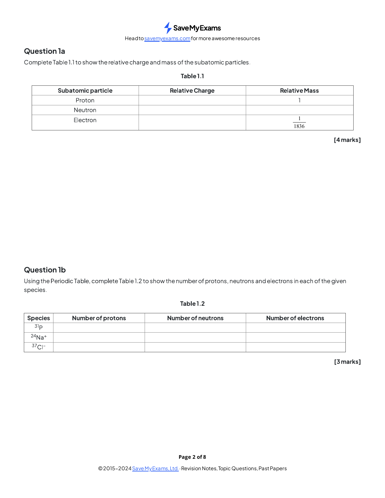
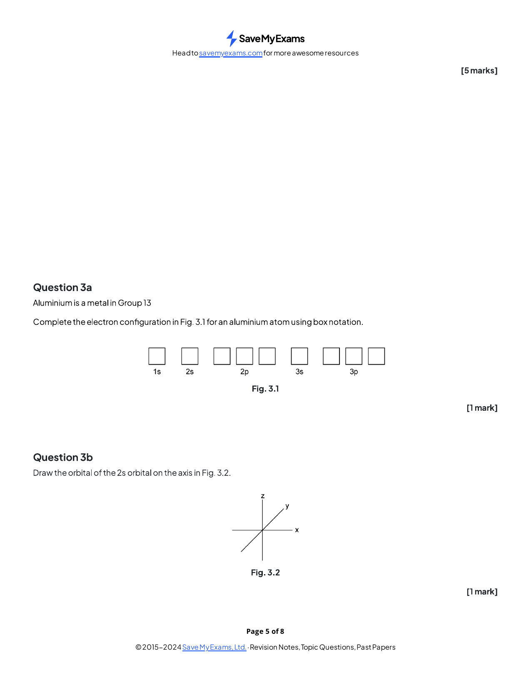
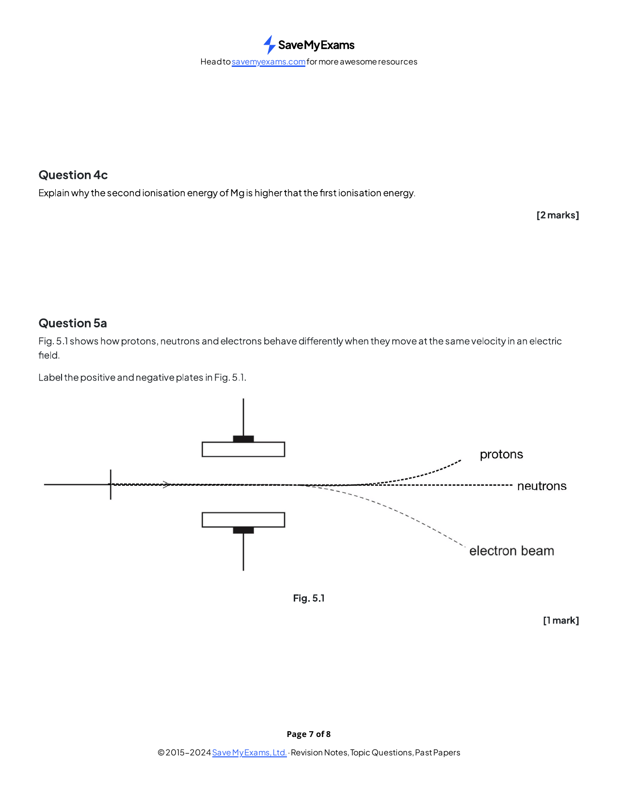
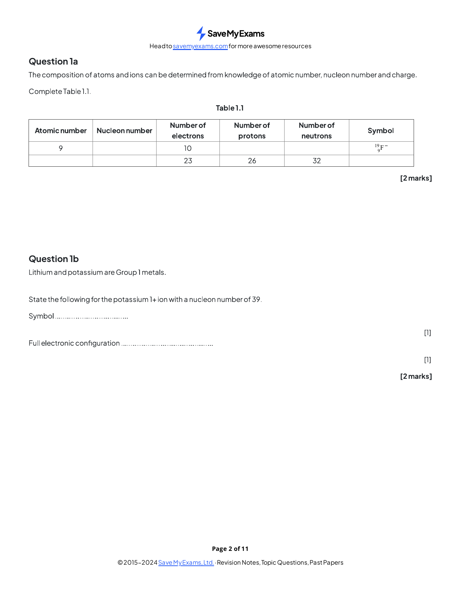
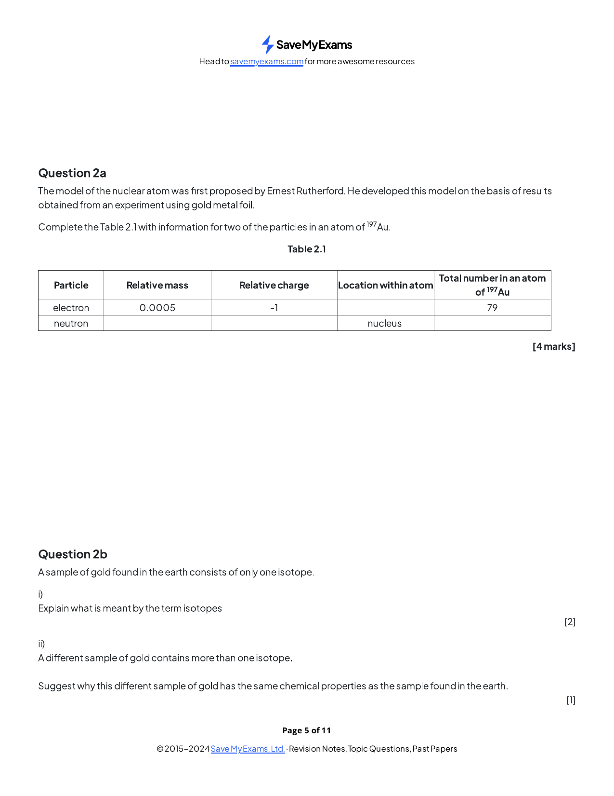
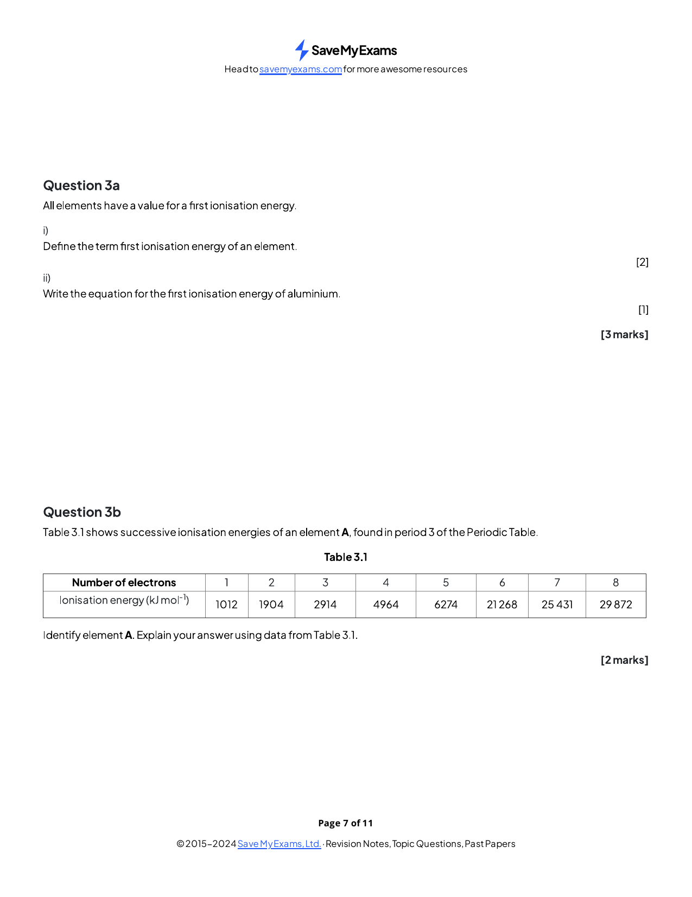
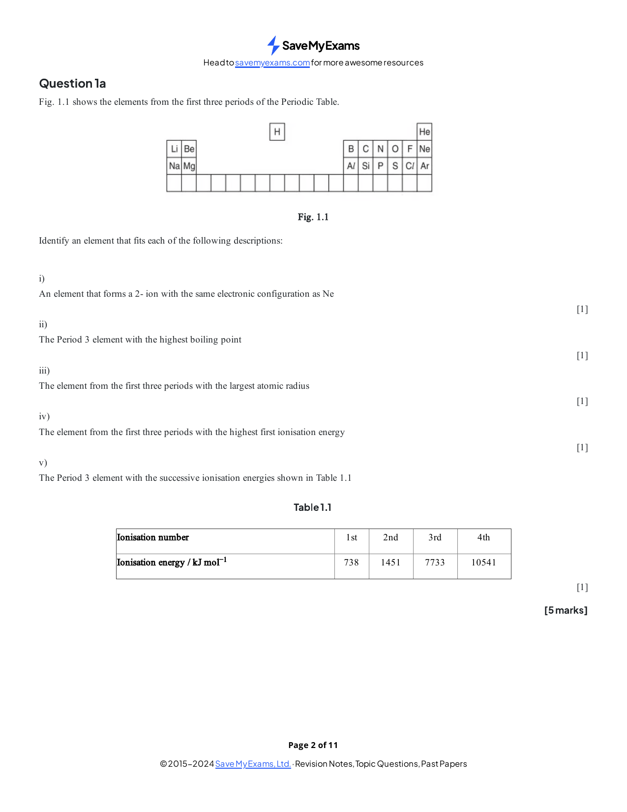
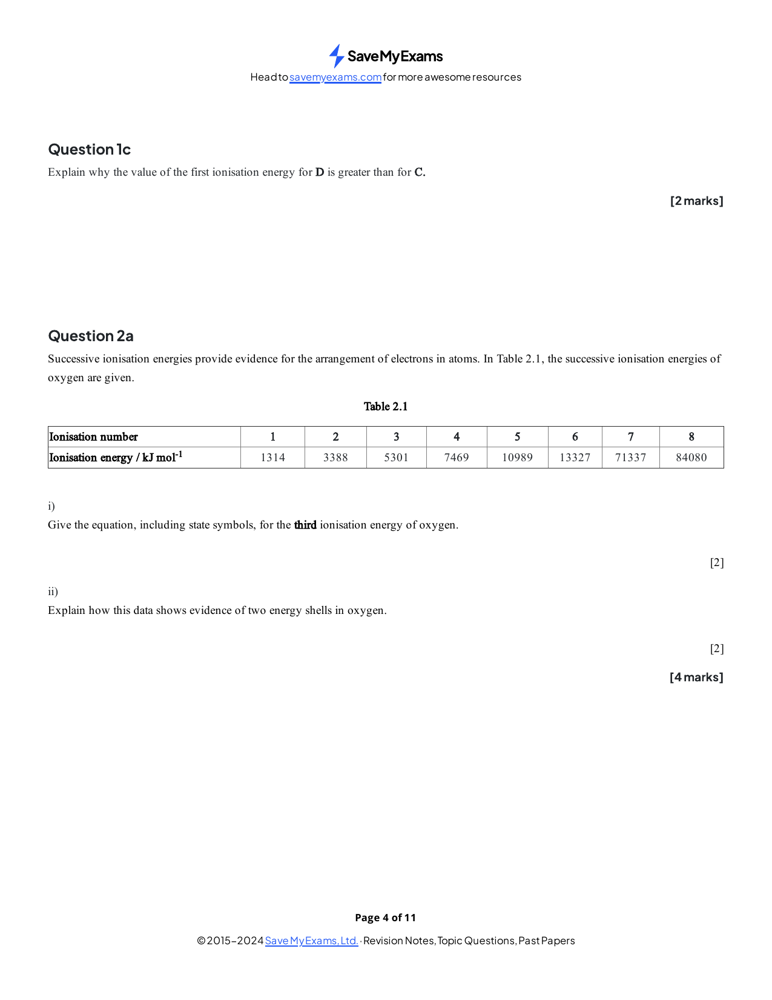
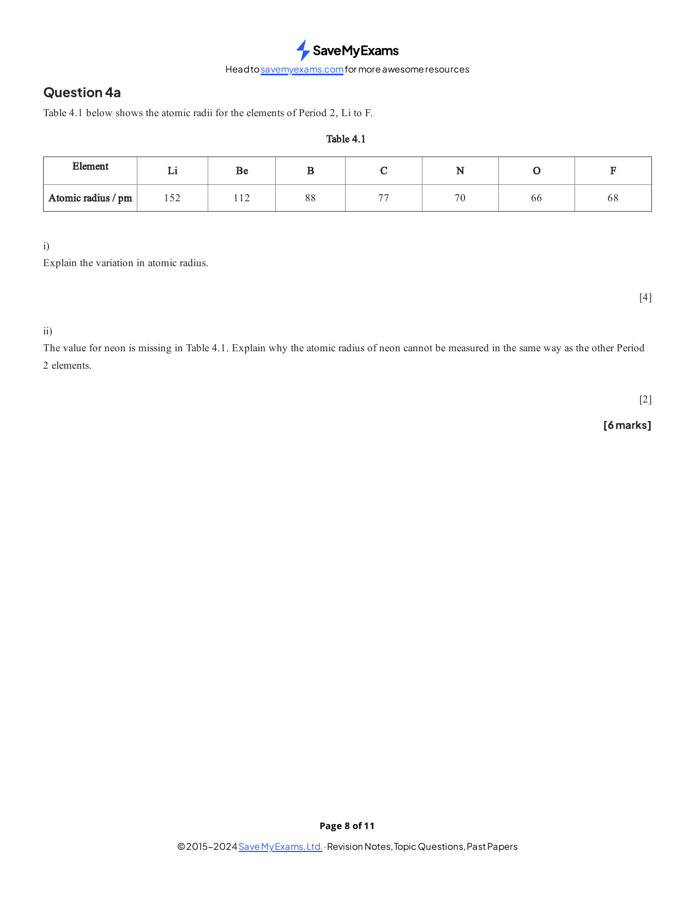
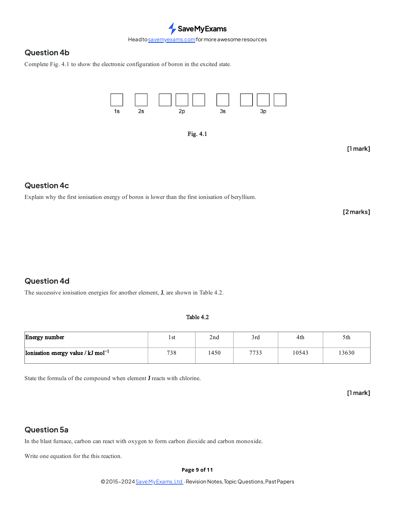

### 1.1 Atomic Structure - Structured Questions: Easy

::: {.question-card}
### Example 1 · Subatomic particles and isotopes · 1.1 SQ Easy Q1

Original question page · 1.1 SQ Easy Q1

{.question-figure fig-alt="Original question page 1.1 SQ Easy Q1"}

**(a)** Complete the relative charge and relative mass of the proton, neutron and electron. `[4 marks]`

**(b)** Complete the numbers of protons, neutrons and electrons in $^{31}_{15}\ce{P}$, $^{24}_{11}\ce{Na+}$ and $^{37}_{17}\ce{Cl-}$. `[3 marks]`

**(c)** State why isotopes have different physical properties. `[2 marks]`

**(d)** Explain why $^{35}\ce{Cl}$ and $^{37}\ce{Cl}$ have similar chemical properties. `[2 marks]`

Show mark scheme / model answer

<ul><li><strong>(a)</strong> Proton: $+1,1$; neutron: $0,1$; electron: $-1,1/1836$.</li><li><strong>(b)</strong> $^{31}_{15}\ce{P}$: 15 p, 16 n, 15 e; $^{24}_{11}\ce{Na+}$: 11 p, 13 n, 10 e; $^{37}_{17}\ce{Cl-}$: 17 p, 20 n, 18 e.</li><li><strong>(c)</strong> Different neutron numbers give different masses and therefore slightly different physical properties.</li><li><strong>(d)</strong> They have the same number of electrons and the same electronic configuration.</li></ul>

:::

::: {.question-card}
### Example 2 · Aluminium and orbitals · 1.1 SQ Easy Q3

Original question page · 1.1 SQ Easy Q3

{.question-figure fig-alt="Original question page 1.1 SQ Easy Q3"}

Aluminium is a Group 13 metal.

**(a)** Complete the electron configuration using box notation. `[1 mark]`

{.question-figure fig-alt="Aluminium box notation"}

**(b)** Draw the $2s$ orbital on the axes. `[1 mark]`

{.question-figure fig-alt="2s orbital drawing axes"}

**(c)** The first ionisation energy of Mg is $738\ \mathrm{kJ\ mol^{-1}}$. Complete the values for Na and Li. `[1 mark]`

**(d)** Explain why the first ionisation energy of aluminium is lower than that of magnesium. `[2 marks]`

Show mark scheme / model answer

<ul><li><strong>(a)</strong> $\ce{Al}:1s^2 2s^2 2p^6 3s^2 3p^1$, with one pair and two single electrons in $2p$.</li><li><strong>(b)</strong> A spherical orbital centred on the nucleus.</li><li><strong>(c)</strong> Na = 496; Li = 520 $\mathrm{kJ\ mol^{-1}}$.</li><li><strong>(d)</strong> Al loses a higher-energy, more shielded $3p$ electron, while Mg loses a $3s$ electron.</li></ul>

:::

::: {.question-card}
### Example 3 · Electric fields and particle counts · 1.1 SQ Easy Q5

Original question page · 1.1 SQ Easy Q5

{.question-figure fig-alt="Original question page 1.1 SQ Easy Q5"}

Particles with the same velocity pass through an electric field.

{.question-figure fig-alt="Paths of protons neutrons and electrons in an electric field"}

**(a)** Label the positive and negative plates. `[1 mark]`

**(b)** Complete the numbers of protons, neutrons and electrons in $^{23}\ce{Na}$, $^{32}\ce{S^{2-}}$ and $^{86}\ce{Sr^{2+}}$. `[3 marks]`

**(c)** Write the electronic configuration of $\ce{S^{2-}}$. `[1 mark]`

Show mark scheme / model answer

<strong>(a)</strong> Upper plate positive; lower plate negative. <strong>(b)</strong> $^{23}\ce{Na}$: 11 p, 12 n, 11 e; $^{32}\ce{S^{2-}}$: 16 p, 16 n, 18 e; $^{86}\ce{Sr^{2+}}$: 38 p, 48 n, 36 e. <strong>(c)</strong> $1s^2 2s^2 2p^6 3s^2 3p^6$.

:::

### 1.1 Atomic Structure - Structured Questions: Medium

::: {.question-card}
### Example 4 · Atomic and nucleon numbers · 1.1 SQ Medium Q1

Original question page · 1.1 SQ Medium Q1

{.question-figure fig-alt="Original question page 1.1 SQ Medium Q1"}

**(a)** Complete the table for atomic number 9, nucleon number 19, 10 electrons and for atomic number 13, nucleon number 27, 13 electrons. `[2 marks]`

**(b)** Give the symbol and full configuration of the potassium $1+$ ion with nucleon number 39. `[2 marks]`

**(c)** Add and label the proton and neutron paths to the electron-beam diagram.

{.question-figure fig-alt="Medium electric field paths"}

**(d)** The fifth to eighth ionisation energies of Y are 7012, 8496, 27107 and 31671 $\mathrm{kJ\ mol^{-1}}$. State its group and explain the large jump. `[1 mark]`

Show mark scheme / model answer
<ul><li><strong>(a)</strong> $^{19}_{9}\ce{F-}$: 9 p, 10 n; $^{27}_{13}\ce{Al}$: 13 p, 14 n.</li><li><strong>(b)</strong> $^{39}_{19}\ce{K+}$; $1s^2 2s^2 2p^6 3s^2 3p^6$.</li><li><strong>(c)</strong> Neutrons pass straight through; protons bend towards the negative plate, less than electrons.</li><li><strong>(d)</strong> Group 16; the jump after the sixth electron shows that the seventh comes from an inner shell.</li></ul>

:::

::: {.question-card}
### Example 5 · Gold atoms, isotopes and orbitals · 1.1 SQ Medium Q2

Original question page · 1.1 SQ Medium Q2

{.question-figure fig-alt="Original question page 1.1 SQ Medium Q2"}

For an atom of $^{197}_{79}\ce{Au}$:

**(a)** Give the relative mass, relative charge, location and total number of neutrons and electrons. `[4 marks]`

**(b)** Explain what is meant by isotopes and why a mixture of gold isotopes has the same chemical properties as a pure isotope. `[3 marks]`

**(c)** Complete chloride-ion box notation.

{.question-figure fig-alt="Chloride ion electron box notation"}

**(d)** Draw and label one $s$ and one $p$ orbital.

{.question-figure fig-alt="s and p orbital shapes question"}

Show mark scheme / model answer
<ul><li><strong>(a)</strong> Neutron: mass 1, charge 0, nucleus, 118; electron: mass $1/1836$, charge −1, outside nucleus, 79.</li><li><strong>(b)</strong> Same proton number but different neutron number; same electron configuration means same chemical properties.</li><li><strong>(c)</strong> $\ce{Cl-}:1s^2 2s^2 2p^6 3s^2 3p^6$.</li><li><strong>(d)</strong> Spherical $s$ and dumbbell-shaped $p$ orbital.</li></ul>

:::

::: {.question-card}
### Example 6 · First ionisation energy and Period 3 · 1.1 SQ Medium Q3

Original question page · 1.1 SQ Medium Q3

{.question-figure fig-alt="Original question page 1.1 SQ Medium Q3"}

**(a)** Define first ionisation energy and write the equation for aluminium. `[3 marks]`

**(b)** Successive ionisation energies for Period 3 element A are 1912, 1904, 2914, 4964, 6274, 21268, 25431 and 29872 $\mathrm{kJ\ mol^{-1}}$. Identify A and explain. `[2 marks]`

**(c)** Explain the general increase across Period 3 and the deviations in the trend.

{.question-figure fig-alt="First ionisation energy across Period 3"}

Show mark scheme / model answer

<strong>(a)</strong> Enthalpy needed to remove one mole of electrons from one mole of gaseous atoms to form gaseous $1+$ ions: $\ce{Al(g) -> Al+(g) + e-}$. <strong>(b)</strong> Phosphorus; the jump after the fifth electron shows five outer electrons. <strong>(c)</strong> Nuclear charge increases, shielding is similar and radius decreases. Al is lower because its electron is in higher-energy $3p$; S is lower than P because of paired-electron repulsion in $3p$.

:::

### 1.1 Atomic Structure - Structured Questions: Hard

::: {.question-card}
### Example 7 · Periodic trends and successive ionisation · 1.1 SQ Hard Q1

Original question page · 1.1 SQ Hard Q1

{.question-figure fig-alt="Original question page 1.1 SQ Hard Q1"}

Identify an element that fits each description: (i) forms a $2-$ ion with the same configuration as Ne; (ii) Period 3 element with the highest boiling point; (iii) largest atomic radius in the first three periods; (iv) highest first ionisation energy; (v) Period 3 element with successive ionisation energies 738, 1451, 7733 and 10541 $\mathrm{kJ\ mol^{-1}}$.

**(b)** Complete the first-ionisation-energy graph for G–K.

{.question-figure fig-alt="First ionisation energy graph G to K"}

**(c)** Explain why the first ionisation energy of D is greater than that of C. `[2 marks]`

Show mark scheme / model answer

<strong>(a)</strong> (i) Oxygen; (ii) silicon; (iii) sodium; (iv) helium; (v) magnesium. <strong>(b)</strong> Continue the Period 3 pattern, including the Al and S dips. <strong>(c)</strong> The electrons are in the same subshell, but D has greater nuclear charge and attraction.

:::

::: {.question-card}
### Example 8 · Oxygen shells and electron configurations · 1.1 SQ Hard Q2

Original question page · 1.1 SQ Hard Q2

{.question-figure fig-alt="Original question page 1.1 SQ Hard Q2"}

Successive ionisation energies of oxygen are 1314, 3388, 5301, 7469, 10989, 13327, 71337 and 84080 $\mathrm{kJ\ mol^{-1}}$.

**(a)** Give the equation for the third ionisation energy of oxygen. `[2 marks]`

**(b)** Explain how the data shows evidence of two energy shells. `[2 marks]`

**(c)** Give full configurations for Te, $\ce{Zn^{2+}}$, $\ce{Cu^{2+}}$, and give $\ce{Zr^{2+}}$ starting with [Kr]. `[4 marks]`

Show mark scheme / model answer

<strong>(a)</strong> $\ce{O^{2+}(g) -> O^{3+}(g) + e-}$. <strong>(b)</strong> The large jump between the sixth and seventh energies shows six outer electrons and then an inner-shell electron. <strong>(c)</strong> $\ce{Te}:1s^2 2s^2 2p^6 3s^2 3p^6 4s^2 3d^{10} 4p^6 5s^2 4d^{10} 5p^4$; $\ce{Zn^{2+}}:[Ar]3d^{10}$; $\ce{Cu^{2+}}:[Ar]3d^9$; $\ce{Zr^{2+}}=[Kr]4d^2$.

:::

::: {.question-card}
### Example 9 · Period 2 radii and Group 2 · 1.1 SQ Hard Q4

Original question page · 1.1 SQ Hard Q4

{.question-figure fig-alt="Original question page 1.1 SQ Hard Q4"}

| Element | Li | Be | B | C | N | O | F |
|---|---:|---:|---:|---:|---:|---:|---:|
| Atomic radius / pm | 152 | 112 | 88 | 77 | 70 | 66 | 68 |

**(a)** Explain the variation in atomic radius. `[4 marks]`

**(b)** Explain why neon's atomic radius cannot be measured in the same way. `[2 marks]`

**(c)** Complete the excited-state configuration of boron and explain why its first ionisation energy is lower than beryllium's.

{.question-figure fig-alt="Period 2 atomic radii table"}

{.question-figure fig-alt="Boron excited state box notation"}

Show mark scheme / model answer

<strong>(a)</strong> Radius decreases across because nuclear charge increases while shielding is similar and electrons enter the same shell. <strong>(b)</strong> Neon is monatomic and does not form covalent or metallic bonds, so the usual radius definition does not apply. <strong>(c)</strong> Excited B is $1s^2 2s^1 2p^2$; the $2p$ electron is higher in energy and more shielded than Be's $2s$ electron.

:::

::: {.question-card}
### Example 10 · Oxygen and carbon orbitals · 1.1 SQ Hard Q5

Original question page · 1.1 SQ Hard Q5

{.question-figure fig-alt="Original question page 1.1 SQ Hard Q5"}

**(a)** Identify and draw the subshell containing the highest-energy occupied electrons in oxygen.

{.question-figure fig-alt="Oxygen highest occupied subshell"}

**(b)** Complete the excited-state configuration of carbon. `[1 mark]`

**(c)** Identify the hybridisation in carbon monoxide for both atoms and explain how it occurs. `[4 marks]`

Show mark scheme / model answer

<strong>(a)</strong> The highest occupied subshell is $2p$, which is dumbbell-shaped. <strong>(b)</strong> $1s^2 2s^1 2p^3$. <strong>(c)</strong> Both atoms use $sp$ hybridisation: one $s$ and one $p$ orbital mix, leaving two unhybridised $p$ orbitals to form two $\pi$ bonds.

:::
