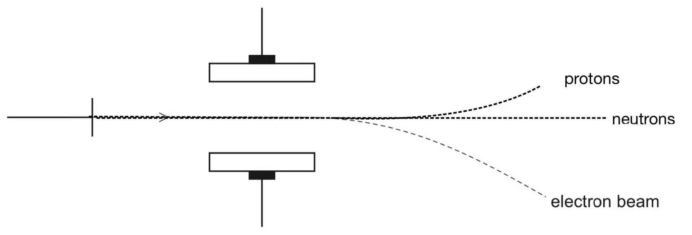
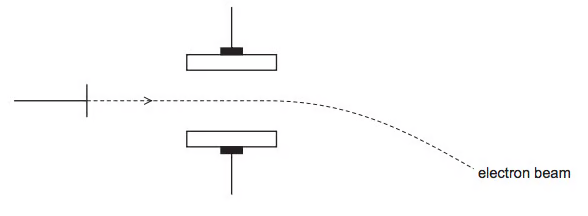
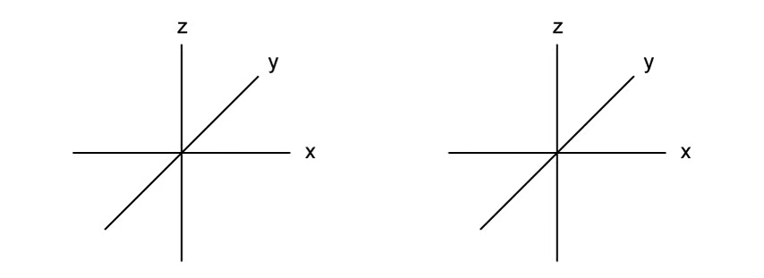
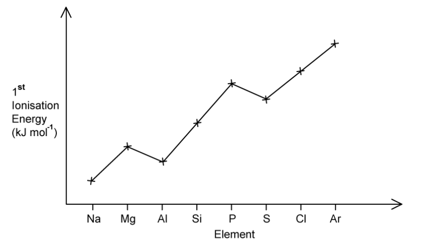
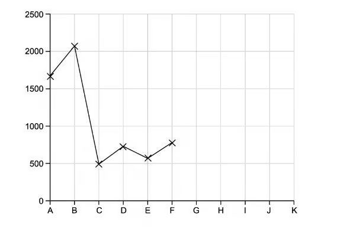
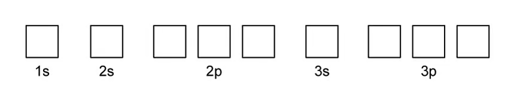

# 1 Atomic structure - Structured Questions

本页保留 `1.1 Atomic Structure` 题包中的全部 Structured Questions，按 Easy、Medium、Hard 分组。题目保留完整英文题干、分问、答案和解题步骤；原 PDF 中可独立提取的图使用局部白底图片。

### 1.1 Atomic Structure - Easy

::: {.question-card}
### Example 1 · Subatomic particles and isotopes · 1.1 SQ Easy Q1

**(a)** Complete Table 1.1 to show the relative charge and mass of the subatomic particles.

| Subatomic particle | Relative charge | Relative mass |
|---|---:|---:|
| Proton |  |  |
| Neutron |  |  |
| Electron |  |  |

`[4 marks]`

**(b)** Using the Periodic Table, complete Table 1.2 to show the number of protons, neutrons and electrons in each species.

| Species | Number of protons | Number of neutrons | Number of electrons |
|---|---:|---:|---:|
| $^{31}_{15}\ce{P}$ |  |  |  |
| $^{24}_{11}\ce{Na+}$ |  |  |  |
| $^{37}_{17}\ce{Cl-}$ |  |  |  |

`[3 marks]`

**(c)** State why the physical properties of isotopes are different. `[2 marks]`

**(d)** Explain why the chemical properties of $^{35}\ce{Cl}$ and $^{37}\ce{Cl}$ are similar. `[2 marks]`

Show mark scheme / model answer

- **(a)** Proton: relative charge $+1$, relative mass $1$; neutron: $0$, $1$; electron: $-1$, $\frac{1}{1836}$. `[4]`
- **(b)**

  | Species | Protons | Neutrons | Electrons |
  |---|---:|---:|---:|
  | $^{31}_{15}\ce{P}$ | 15 | 16 | 15 |
  | $^{24}_{11}\ce{Na+}$ | 11 | 13 | 10 |
  | $^{37}_{17}\ce{Cl-}$ | 17 | 20 | 18 |

- **(c)** Isotopes have different numbers of neutrons, so they have different nucleon numbers and masses. Their physical properties, such as density and boiling point, can therefore differ slightly.
- **(d)** They are isotopes with the same number of protons and electrons. Their electronic configurations are the same, so their chemical properties are similar.

:::

::: {.question-card}
### Example 2 · Potassium and ionisation energy · 1.1 SQ Easy Q2

An isotope of element X has two more protons and two more neutrons than an atom of $^{41}\ce{K}$.

**(a)** Use the Periodic Table to identify element X. `[1 mark]`

**(b)** Give the full electronic configuration of the following species: $\ce{K+}$, Ti and Co. `[3 marks]`

**(c)** Ionisation energy reactions are endothermic processes.

 i. Write the equations for the first ionisation energy of K and the second ionisation energy of Sc. `[2 marks]`

 ii. Give the full electronic configuration of the $\ce{Sc^{2+}}$ ion. `[1 mark]`

**(d)** The fifth to eighth ionisation energies of three elements in the third period are shown below.

| Element | 5th | 6th | 7th | 8th |
|---|---:|---:|---:|---:|
| X | 6274 | 21269 | 25398 | 29855 |
| Y | 7012 | 8496 | 27107 | 31671 |
| Z | 6542 | 9362 | 11018 | 33606 |

 i. State and explain why first ionisation energies generally increase from left to right across the Periodic Table. `[2 marks]`

 ii. Using the data, state the group of element Z and explain your answer. `[3 marks]`

Show mark scheme / model answer

- **(a)** $^{45}_{21}\ce{Sc}$.
- **(b)**

  $$\ce{K+}:1s^2\,2s^2\,2p^6\,3s^2\,3p^6$$

  $$\ce{Ti}:1s^2\,2s^2\,2p^6\,3s^2\,3p^6\,4s^2\,3d^2$$

  $$\ce{Co}:1s^2\,2s^2\,2p^6\,3s^2\,3p^6\,4s^2\,3d^7$$

- **(c)(i)** $\ce{K(g) -> K+(g) + e-}$; $\ce{Sc+(g) -> Sc^{2+}(g) + e-}$.
- **(c)(ii)** $\ce{Sc^{2+}}:1s^2\,2s^2\,2p^6\,3s^2\,3p^6\,3d^1$.
- **(d)(i)** Nuclear charge increases, while electrons are added to the same shell so shielding is similar; the outer electron is attracted more strongly.
- **(d)(ii)** Z is in **Group 4 / Group 14**. The large jump is between the seventh and eighth ionisation energies, so seven electrons are removed before an inner shell is reached.

:::

::: {.question-card}
### Example 3 · Aluminium and orbitals · 1.1 SQ Easy Q3

Aluminium is a metal in Group 13.

**(a)** Complete the electron configuration in Fig. 3.1 for an aluminium atom using box notation. `[1 mark]`

{.question-figure fig-alt="Aluminium box notation"}

**(b)** Draw the orbital of the 2s orbital on the axes in Fig. 3.2. `[1 mark]`

{.question-figure fig-alt="2s orbital drawing axes"}

**(c)** The first ionisation energy values of Li, Mg and Na are shown in Table 3.1. Complete the table. `[1 mark]`

| Element | First ionisation energy / kJ mol$^{-1}$ |
|---|---:|
| Na |  |
| Li |  |
| Mg | 738 |

**(d)** Explain why the first ionisation energy of aluminium is lower than that of magnesium. `[2 marks]`

Show mark scheme / model answer

- **(a)** $\ce{Al}:1s^2 2s^2 2p^6 3s^2 3p^1$; the $2p$ boxes contain one pair and two single electrons, and the $3p$ box contains one single electron.
- **(b)** A spherical orbital centred on the nucleus.
- **(c)** Na = $496$; Li = $520$ kJ mol$^{-1}$.
- **(d)** The electron removed from Al is in the higher-energy, more shielded $3p$ orbital rather than the $3s$ orbital in Mg, so it is easier to remove.

:::

::: {.question-card}
### Example 4 · Magnesium configuration and successive ionisation · 1.1 SQ Easy Q4

**(a)** Give the electron configurations of Mg and $\ce{Mg^{2+}}$. `[2 marks]`

**(b)** Write an equation, including state symbols, to show the first ionisation energy of Mg. `[2 marks]`

**(c)** Explain why the second ionisation energy of Mg is higher than the first ionisation energy. `[2 marks]`

Show mark scheme / model answer

- **(a)** $\ce{Mg}:1s^2 2s^2 2p^6 3s^2$; $\ce{Mg^{2+}}:1s^2 2s^2 2p^6$.
- **(b)** $\ce{Mg(g) -> Mg+(g) + e-}$.
- **(c)** The second electron is removed from a positive $\ce{Mg+}$ ion. It is closer to the nucleus and experiences stronger attraction, so more energy is required.

:::

::: {.question-card}
### Example 5 · Electric fields and particle counts · 1.1 SQ Easy Q5

Fig. 5.1 shows how protons, neutrons and electrons behave differently when they move at the same velocity in an electric field.

{.question-figure fig-alt="Paths of protons neutrons and electrons in an electric field"}

**(a)** Label the positive and negative plates in Fig. 5.1. `[1 mark]`

**(b)** Complete the numbers of protons, neutrons and electrons.

| Species | Protons | Neutrons | Electrons |
|---|---:|---:|---:|
| $^{23}\ce{Na}$ |  |  |  |
| $^{32}\ce{S^{2-}}$ |  |  |  |
| $^{86}\ce{Sr^{2+}}$ |  |  |  |

`[3 marks]`

**(c)** Write the electronic configuration for the $\ce{S^{2-}}$ ion. `[1 mark]`

Show mark scheme / model answer

- **(a)** The upper plate is positive and the lower plate is negative.
- **(b)** $^{23}\ce{Na}$: 11 p, 12 n, 11 e; $^{32}\ce{S^{2-}}$: 16 p, 16 n, 18 e; $^{86}\ce{Sr^{2+}}$: 38 p, 48 n, 36 e.
- **(c)** $\ce{S^{2-}}:1s^2 2s^2 2p^6 3s^2 3p^6$.

:::

### 1.1 Atomic Structure - Medium

::: {.question-card}
### Example 6 · Atomic and nucleon numbers · 1.1 SQ Medium Q1

**(a)** Complete the table.

| Atomic number | Nucleon number | Number of electrons | Number of protons | Number of neutrons | Symbol |
|---:|---:|---:|---:|---:|---|
| 9 | 19 | 10 |  |  |  |
| 13 | 27 | 13 |  |  |  |

`[2 marks]`

**(b)** State the symbol and full electronic configuration for the potassium $1+$ ion with nucleon number 39. `[2 marks]`

**(c)** Add and label the paths of protons and neutrons to the electron-beam diagram.

{.question-figure fig-alt="Medium electric field paths"}

`[3 marks]`

**(d)** The fifth to eighth ionisation energies are shown below.

| Element | 5th | 6th | 7th | 8th |
|---|---:|---:|---:|---:|
| X | 6274 | 21269 | 25398 | 29855 |
| Y | 7012 | 8496 | 27107 | 31671 |
| Z | 6542 | 9362 | 11018 | 33606 |

 i. State and explain the group number of Y. `[1 mark]`
 ii. State and explain the general trend in first ionisation energies across Period 3. `[2 marks]`
 iii. Explain why the first ionisation energy of Y is less than that of X. `[2 marks]`
 iv. Complete the electronic configuration of Z. `[1 mark]`

Show mark scheme / model answer

- **(a)** $^{19}_{9}\ce{F-}$: 9 p, 10 n; $^{27}_{13}\ce{Al}$: 13 p, 14 n.
- **(b)** $^{39}_{19}\ce{K+}$; $1s^2 2s^2 2p^6 3s^2 3p^6$.
- **(c)** Neutrons pass straight through; protons bend towards the negative plate, but less than electrons because protons are much heavier.
- **(d)(i)** Group 16: the large jump is after the sixth electron is removed.
- **(d)(ii)** It increases because nuclear charge increases, shielding is similar and the atomic radius decreases.
- **(d)(iii)** Y has a paired electron in a $3p$ orbital, so electron–electron repulsion makes it easier to remove than an electron from X's half-filled $3p$ arrangement.
- **(d)(iv)** $\ce{Z}:1s^2 2s^2 2p^6 3s^2 3p^5$.

:::

::: {.question-card}
### Example 7 · Gold atoms, isotopes and orbitals · 1.1 SQ Medium Q2

The model of the nuclear atom was first proposed by Ernest Rutherford using results from an experiment with gold foil.

**(a)** Complete the information for two particles in an atom of $^{197}_{79}\ce{Au}$.

| Particle | Relative mass | Relative charge | Location | Total number |
|---|---:|---:|---|---:|
| Neutron |  |  |  |  |
| Electron |  |  |  |  |

`[4 marks]`

**(b)** Explain what is meant by isotopes. Explain why a sample of gold containing more than one isotope has the same chemical properties as a sample containing one isotope. `[3 marks]`

**(c)** Complete the electron configuration for the chloride ion using box notation.

{.question-figure fig-alt="Chloride ion electron box notation"}

`[1 mark]`

**(d)** Draw a sketch of one of each different type of orbital occupied by electrons in a Period 3 element and label each type.

{.question-figure fig-alt="s and p orbital shapes question"}

`[3 marks]`

Show mark scheme / model answer

- **(a)** Neutron: relative mass 1, charge 0, nucleus, 118 neutrons. Electron: relative mass $1/1836$, charge $-1$, outside nucleus, 79 electrons.
- **(b)** Isotopes are atoms of the same element with the same number of protons but different numbers of neutrons. Their electron configurations are the same, so their chemical properties are the same.
- **(c)** Chloride has 18 electrons: $1s^2 2s^2 2p^6 3s^2 3p^6$, with paired opposite-spin arrows in each box.
- **(d)** Draw and label a spherical $s$ orbital and a dumbbell-shaped $p$ orbital.

:::

::: {.question-card}
### Example 8 · First ionisation energy and Period 3 · 1.1 SQ Medium Q3

**(a)** Define first ionisation energy and write the equation for the first ionisation energy of aluminium. `[3 marks]`

**(b)** The successive ionisation energies of a Period 3 element A are 1912, 1904, 2914, 4964, 6274, 21268, 25431 and 29872 kJ mol$^{-1}$. Identify A and explain your answer. `[2 marks]`

**(c)** Explain why first ionisation energy increases across Period 3 and explain the deviations in the trend. `[6 marks]`

{.question-figure fig-alt="First ionisation energy across Period 3"}

**(d)** Explain why the second ionisation energy of aluminium is larger than the first. `[1 mark]`

Show mark scheme / model answer

- **(a)** Enthalpy needed to remove one mole of electrons from one mole of gaseous atoms to form one mole of gaseous $1+$ ions; $\ce{Al(g) -> Al+(g) + e-}$.
- **(b)** A is phosphorus. There is a large jump between the fifth and sixth ionisation energies, indicating five outer electrons.
- **(c)** Nuclear charge increases while shielding stays similar and atomic radius decreases. Al is lower because its outer electron is in the higher-energy $3p$ subshell; S is lower than P because a paired $3p$ electron experiences repulsion.
- **(d)** The second electron is removed from a positive ion and is closer to the nucleus / from the $3s$ subshell, so more energy is required.

:::

::: {.question-card}
### Example 9 · Polonium and thorium isotopes · 1.1 SQ Medium Q4

Iron has three main naturally occurring isotopes and cobalt has one. Explain the meaning of isotope. `[2 marks]`

Polonium has proton number 84 and thorium has proton number 90. Complete the table for $^{213}_{84}\ce{Po}$ and $^{232}_{90}\ce{Th}$.

| Isotope | Protons | Neutrons | Electrons |
|---|---:|---:|---:|
| $^{213}\ce{Po}$ |  |  |  |
| $^{232}\ce{Th}$ |  |  |  |

`[3 marks]`

Explain why isotopes of polonium have the same chemical reactions but slightly different boiling points. `[2 marks]`

Show mark scheme / model answer

- Isotopes have the same number of protons but different numbers of neutrons.
- $^{213}\ce{Po}$: 84 p, 129 n, 84 e. $^{232}\ce{Th}$: 90 p, 142 n, 90 e.
- The electron configurations are the same, so chemical reactions are the same. Different neutron numbers give different masses, causing slightly different physical properties such as boiling point.

:::

::: {.question-card}
### Example 10 · Successive ionisation energies and Group 4 · 1.1 SQ Medium Q5

The first six ionisation energies of element X are 950, 1800, 2700, 4800, 6000 and 12 300 kJ mol$^{-1}$.

**(a)** Write an equation, with state symbols, for the second ionisation energy of X. `[2 marks]`

**(b)** Deduce the group of X and explain your answer. `[3 marks]`

**(c)** The first ionisation energies of Group 4 elements decrease down the group. Explain this trend in terms of atomic structure. `[4 marks]`

**(d)** Write the full electronic configuration for germanium. `[1 mark]`

Show mark scheme / model answer

- **(a)** $\ce{X+(g) -> X^{2+}(g) + e-}$.
- **(b)** Group 5 / Group 15: there is a sharp rise between the fifth and sixth ionisation energies, showing five outer-shell electrons.
- **(c)** Down the group, more shells are occupied, the atomic radius increases and shielding increases. These effects outweigh the increase in nuclear charge, so the outer electron is easier to remove.
- **(d)** $\ce{Ge}:1s^2 2s^2 2p^6 3s^2 3p^6 3d^{10} 4s^2 4p^2$.

:::

### 1.1 Atomic Structure - Hard

::: {.question-card}
### Example 11 · Periodic trends and successive ionisation · 1.1 SQ Hard Q1

Fig. 1.1 shows the elements from the first three periods of the Periodic Table. Identify an element that fits each description:

 i. forms a $2-$ ion with the same electronic configuration as Ne;
 ii. Period 3 element with the highest boiling point;
 iii. largest atomic radius among the first three periods;
 iv. highest first ionisation energy among the first three periods;
 v. Period 3 element with successive ionisation energies 738, 1451, 7733 and 10541 kJ mol$^{-1}$.

**(b)** Complete the first-ionisation-energy graph for elements G–K.

{.question-figure fig-alt="First ionisation energy graph G to K"}

**(c)** Explain why the first ionisation energy of D is greater than that of C. `[2 marks]`

Show mark scheme / model answer

- **(a)** i Oxygen; ii silicon; iii sodium; iv helium; v magnesium.
- **(b)** Continue the Period 3 pattern: G above F, H between G and F, I above H and below A, J above I and below B, K below C.
- **(c)** The outer electron in D is closer to the nucleus, and the electrons removed from C and D are in the same subshell; D has the greater nuclear charge and attraction.

:::

::: {.question-card}
### Example 12 · Oxygen shells and electron configurations · 1.1 SQ Hard Q2

Successive ionisation energies of oxygen are 1314, 3388, 5301, 7469, 10989, 13327, 71337 and 84080 kJ mol$^{-1}$.

**(a)** Give the equation, including state symbols, for the third ionisation energy of oxygen. `[2 marks]`

**(b)** Explain how the data shows evidence of two energy shells in oxygen. `[2 marks]`

**(c)** Give the full electron configurations of Te, $\ce{Zn^{2+}}$ and $\ce{Cu^{2+}}$. `[3 marks]`

**(d)** Give the configuration of $\ce{Zr^{2+}}$ starting with [Kr], and write the equation for the third ionisation energy of Zr. `[2 marks]`

Show mark scheme / model answer

- **(a)** $\ce{O^{2+}(g) -> O^{3+}(g) + e-}$.
- **(b)** There is a large jump between the sixth and seventh ionisation energies. Six electrons are in the outer shell and the seventh is removed from an inner shell; therefore two shells are occupied.
- **(c)**

  $\ce{Te}:1s^2 2s^2 2p^6 3s^2 3p^6 4s^2 3d^{10} 4p^6 5s^2 4d^{10} 5p^4$.

  $\ce{Zn^{2+}}:1s^2 2s^2 2p^6 3s^2 3p^6 3d^{10}$.

  $\ce{Cu^{2+}}:1s^2 2s^2 2p^6 3s^2 3p^6 3d^9$.

- **(d)** $\ce{Zr^{2+}}=[Kr]4d^2$; $\ce{Zr^{2+}(g) -> Zr^{3+}(g) + e-}$.

:::

::: {.question-card}
### Example 13 · Copper isotopes and percentage abundance · 1.1 SQ Hard Q3

**(a)** Complete the table for the copper species shown.

| Species | Protons | Neutrons | Electrons |
|---|---:|---:|---:|
| $^{63}\ce{Cu^{2+}}$ |  | 34 | 27 |
| $^{65}\ce{Cu+}$ | 29 |  |  |

**(b)** Give the full electron configuration of the $\ce{Cu+}$ ion. `[1 mark]`

**(c)** Calculate the percentage abundance of $^{63}\ce{Cu}$ (mass 62.9296) and $^{65}\ce{Cu}$ (mass 64.9278), given an average isotope mass of 63.546. `[3 marks]`

**(d)** Explain why copper isotopes exhibit the same chemical reactions but their densities differ. `[2 marks]`

**(e)** Copper(II) chloride reacts with sodium phosphate to form two salts. Write a balanced equation. `[2 marks]`

Show mark scheme / model answer

- **(a)** $^{63}\ce{Cu^{2+}}$: 29 p, 34 n, 27 e; $^{65}\ce{Cu+}$: 29 p, 36 n, 28 e.
- **(b)** $\ce{Cu+}:1s^2 2s^2 2p^6 3s^2 3p^6 3d^{10}$.
- **(c)** Let $x$ be the abundance of $^{63}\ce{Cu}$:

  $$63.546=(62.9296x)+(64.9278(1-x))$$

  $x=0.69152$, so $^{63}\ce{Cu}=69.152\%$ and $^{65}\ce{Cu}=30.848\%$.

- **(d)** The isotopes have the same electron configuration, so chemical behaviour is the same. Their different neutron numbers give different masses and densities.
- **(e)** $\ce{3CuCl2 + 2Na3PO4 -> Cu3(PO4)2 + 6NaCl}$.

:::

::: {.question-card}
### Example 14 · Period 2 radii and Group 2 · 1.1 SQ Hard Q4

| Element | Li | Be | B | C | N | O | F |
|---|---:|---:|---:|---:|---:|---:|---:|
| Atomic radius / pm | 152 | 112 | 88 | 77 | 70 | 66 | 68 |

**(a)** Explain the variation in atomic radius. `[4 marks]`

**(b)** Explain why the atomic radius of neon cannot be measured in the same way as the other Period 2 elements. `[2 marks]`

**(c)** Complete the excited-state electron configuration of boron and explain why its first ionisation energy is lower than that of beryllium. `[3 marks]`

{.question-figure fig-alt="Period 2 atomic radii table"}

{.question-figure fig-alt="Boron excited state box notation"}

**(d)** Element J has a large jump after its second ionisation energy. State the formula of its compound with chlorine and write one equation for carbon reacting with oxygen in the blast furnace. `[2 marks]`

Show mark scheme / model answer

- **(a)** Radius decreases from Li to F because nuclear charge increases while electrons are added to the same shell; shielding is similar and attraction becomes stronger. The small increase from O to F is due to the data trend / atomic-radius definition used.
- **(b)** Neon is monatomic and does not form covalent or metallic bonds, so the usual covalent or metallic radius cannot be defined in the same way.
- **(c)** Excited B: $1s^2 2s^1 2p^2$. Its outer electron is in the higher-energy, more shielded $2p$ subshell, so it is easier to remove than Be's $2s$ electron.
- **(d)** J is Group 2, so the chloride is $\ce{JCl2}$. One valid equation is $\ce{C + CO2 -> 2CO}$ or $\ce{C + O2 -> CO2}$, depending on the product specified.

:::

::: {.question-card}
### Example 15 · Oxygen and carbon orbitals · 1.1 SQ Hard Q5

**(a)** In an oxygen atom, identify and draw the subshell containing the highest-energy occupied electrons.

{.question-figure fig-alt="Oxygen highest occupied subshell"}

**(b)** Complete the excited-state configuration of a carbon atom. `[1 mark]`

**(c)** Identify the hybridisation in carbon monoxide for both atoms and explain how it occurs. `[4 marks]`

Show mark scheme / model answer

- **(a)** The highest occupied subshell is $2p$; draw a dumbbell-shaped p orbital.
- **(b)** Excited carbon: $1s^2 2s^1 2p^3$.
- **(c)** Both atoms use **sp hybridisation**. One $s$ orbital hybridises with one $p$ orbital, leaving two unhybridised $p$ orbitals on each atom. The hybrid orbitals form the sigma framework and the remaining p orbitals form two pi bonds.

:::
