# 1 Atomic structure

本章对应 CIE 9701 2025–2027 syllabus 的 **1.1–1.4 Atomic structure**。内容覆盖 subatomic particles、isotopes、electron shells and orbitals，以及 first and successive ionisation energies。

## Learning objectives

学完本章后，你应该能够：

- describe the relative charge, relative mass and location of protons, neutrons and electrons;
- use atomic number, nucleon number and ionic charge to calculate numbers of protons, neutrons and electrons;
- define isotopes and explain why isotopes have similar chemical properties but slightly different physical properties;
- write full electronic configurations and use orbital box notation;
- describe the shapes and orientations of s and p orbitals;
- define first ionisation energy and write ionisation-energy equations with state symbols;
- explain periodic trends and anomalies in first and successive ionisation energies.

## 1.1 Particles in the atom and atomic radius

::: {.study-card}
### Subatomic particles

An atom contains a small, dense nucleus surrounded by electrons. The nucleus contains positively charged protons and neutral neutrons; electrons are negatively charged and occupy regions of space described as shells and orbitals.

| Subatomic particle | Relative charge | Relative mass | Location |
|---|---:|---:|---|
| proton | $+1$ | $1$ | nucleus |
| neutron | $0$ | $1$ | nucleus |
| electron | $-1$ | $\frac{1}{1836}$ | outside the nucleus |

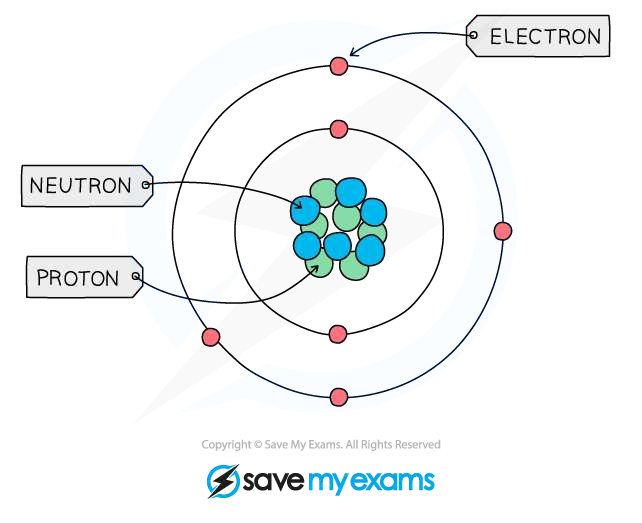{.concept-figure fig-alt="Proton, neutron and electron relative charge and mass"}

The nucleus is very small compared with the atom, but it contains almost all of the atom's mass. Most of the volume of an atom is empty space occupied by the electron cloud.

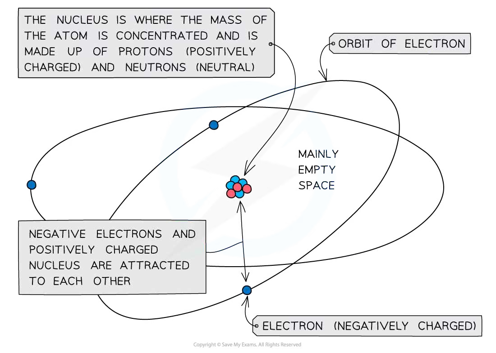{.concept-figure fig-alt="Nucleus and empty space in an atom"}
:::

::: {.study-card}
### Atomic number, nucleon number and atomic radius

The **atomic number**, $Z$, is the number of protons in the nucleus. It identifies the element. The **nucleon number**, $A$, is the total number of protons and neutrons:

$$A = Z + \text{number of neutrons}$$

For a neutral atom, the number of electrons equals the number of protons. For an ion, adjust the number of electrons for the charge:

- a $+1$ ion has one fewer electron than the neutral atom;
- a $2-$ ion has two more electrons than the neutral atom.

Atomic radius generally decreases across a period because nuclear charge increases while electrons are added to the same shell. The stronger attraction pulls the outer electrons closer to the nucleus. Atomic radius increases down a group because an additional occupied shell is added.

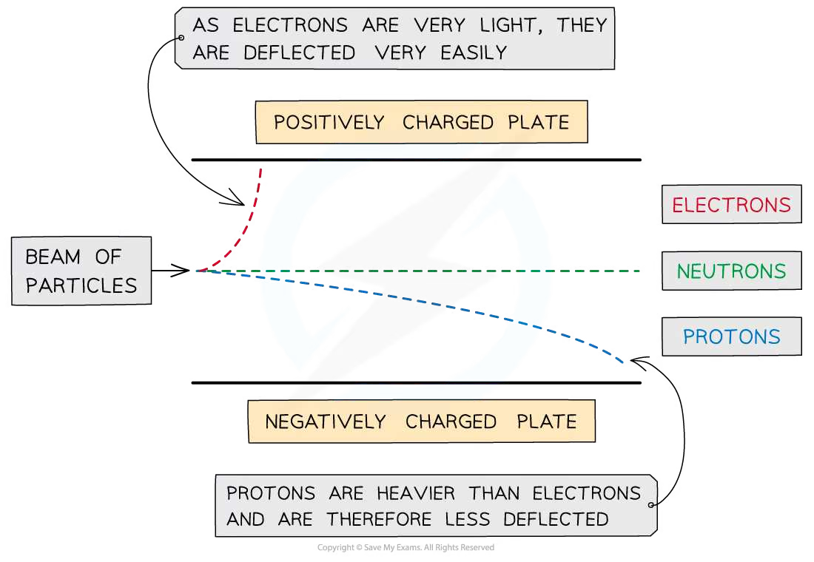{.concept-figure fig-alt="Atomic radius decreases across a period"}
:::

::: {.worked-example}
Worked example · Note knowledge check

### Counting subatomic particles

**Calculate the numbers of protons, neutrons and electrons in $^{32}_{15}\mathrm{P}^{3-}$, and state the electronic configuration of the ion.**

The atomic number is 15, so there are **15 protons**.

$$\text{neutrons}=32-15=17$$

The $3-$ charge means that three electrons have been gained:

$$\text{electrons}=15+3=18$$

The ion has the same number of electrons as argon:

$$\boxed{1s^2\,2s^2\,2p^6\,3s^2\,3p^6}$$

:::

## 1.2 Isotopes

::: {.study-card}
### Definition and properties of isotopes

**Isotopes are atoms of the same element with the same number of protons but different numbers of neutrons.** They therefore have the same atomic number but different nucleon numbers.

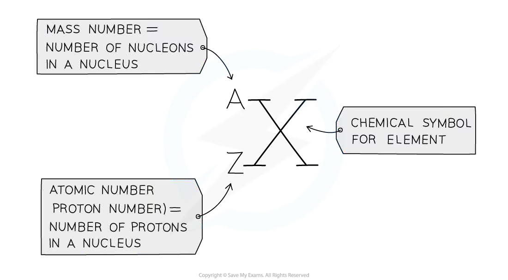{.concept-figure fig-alt="Isotopes have the same proton number and different neutron numbers"}

Because isotopes of an element have the same number of electrons and the same electron configuration, they have the same chemical properties. Their different numbers of neutrons give different masses, so they can have slightly different physical properties such as density, melting point and boiling point.

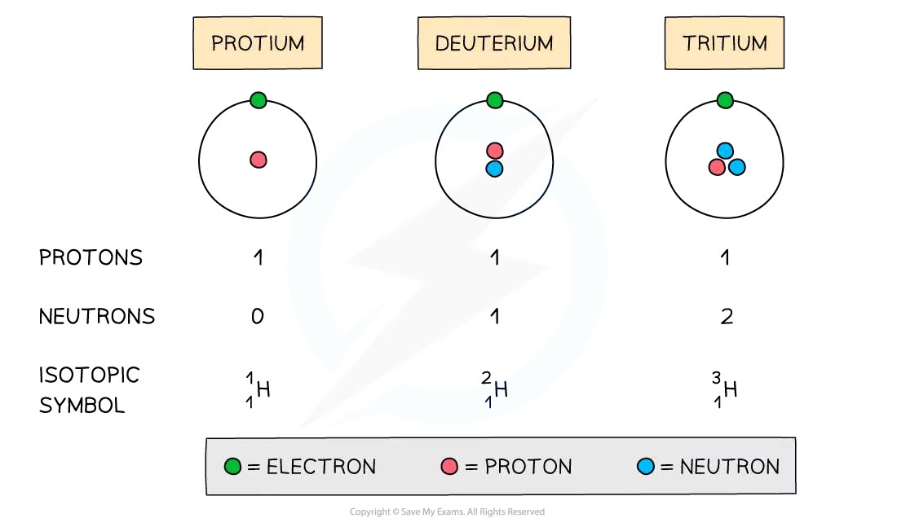{.concept-figure fig-alt="Examples of isotopes of hydrogen and carbon"}
:::

::: {.study-card}
### Ions, isotopes and free radicals

An ion has a net charge because the number of electrons is different from the number of protons. This is different from an isotope, where the difference is in the number of neutrons.

A **free radical** is an atom or group of atoms with one or more unpaired electrons. Free radicals are highly reactive. For example, homolytic fission of chlorine under ultraviolet light produces chlorine radicals:

$$\ce{Cl2 ->[UV] 2Cl^.}$$

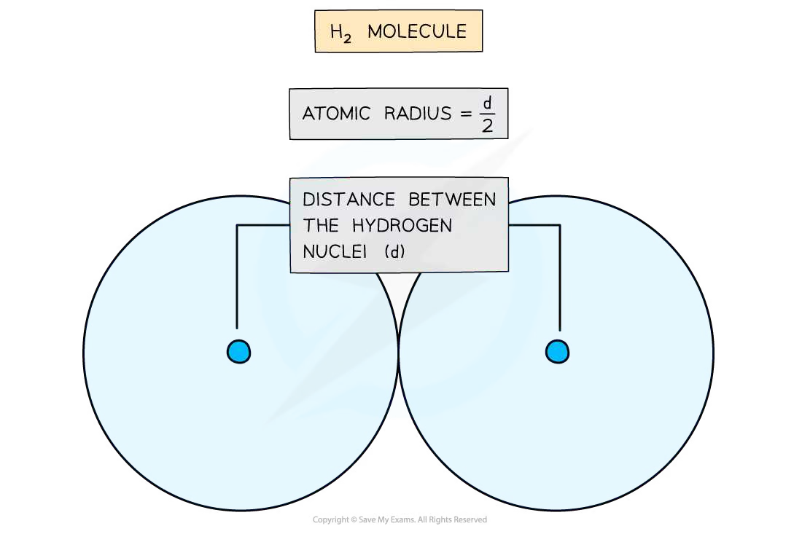{.concept-figure fig-alt="Comparison of ions and isotopes"}

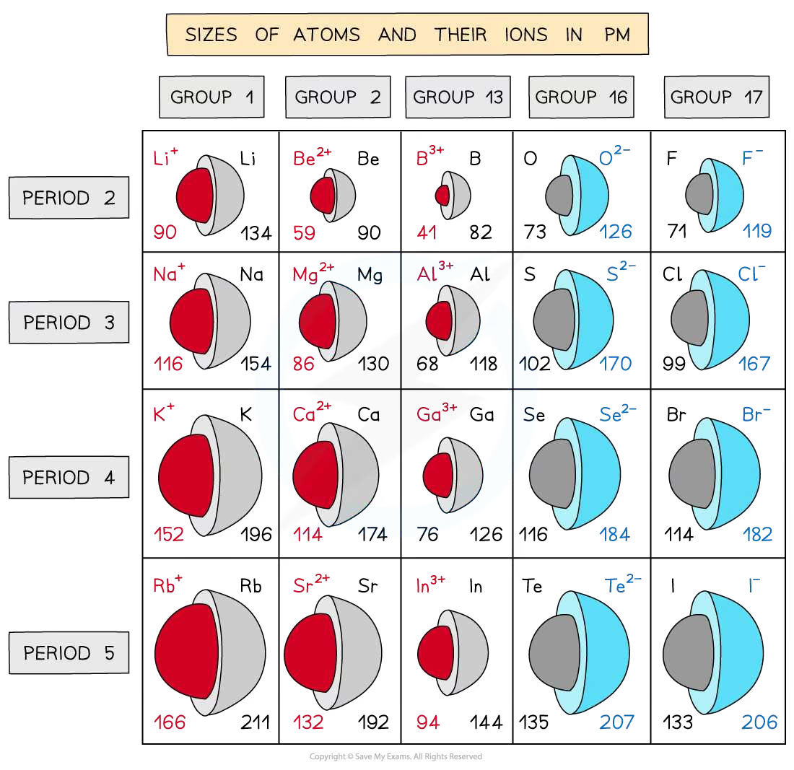{.concept-figure fig-alt="Free radical and unpaired electron"}
:::

::: {.worked-example}
Worked example · Note definition check

### Comparing isotopes

**Explain why $^{35}\mathrm{Cl}$ and $^{37}\mathrm{Cl}$ have similar chemical properties but different physical properties.**

They are isotopes, so they have the same number of protons and the same number of electrons. Their electron configurations are therefore identical, and chemical reactions depend mainly on the outer electrons.

They have different numbers of neutrons and therefore different masses. This produces small differences in physical properties such as density and boiling point.

:::

## 1.3 Electrons, energy levels and atomic orbitals

::: {.study-card}
### Shells, subshells and orbitals

Electrons occupy principal energy levels, or shells, numbered $n=1,2,3,\ldots$. Each shell contains subshells. The subshells used at AS Level are $s$, $p$ and, for transition elements, $d$.

| Subshell | Number of orbitals | Maximum electrons | Shape |
|---|---:|---:|---|
| $s$ | 1 | 2 | spherical |
| $p$ | 3 | 6 | three dumbbell-shaped orbitals |
| $d$ | 5 | 10 | five orbitals |

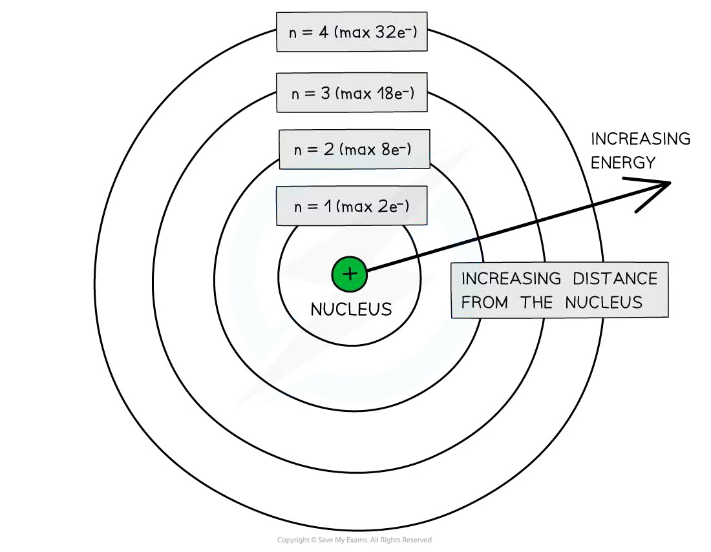{.concept-figure fig-alt="Principal electron energy levels"}

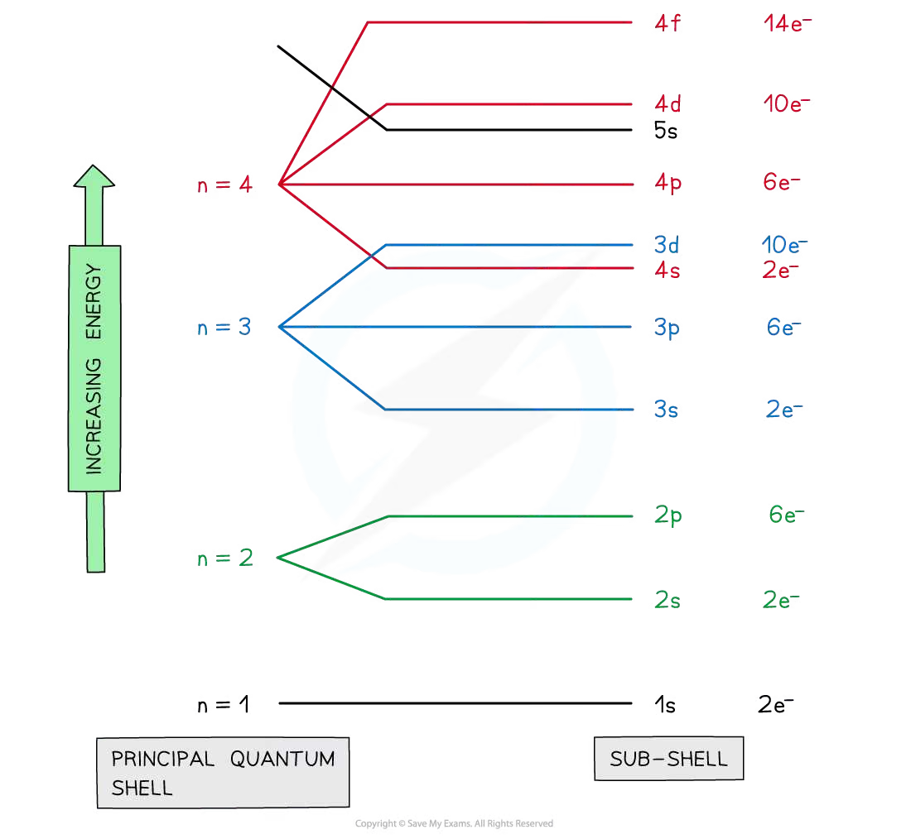{.concept-figure fig-alt="s p and d subshell capacities"}

The three p orbitals are oriented at right angles to one another and are labelled $p_x$, $p_y$ and $p_z$.

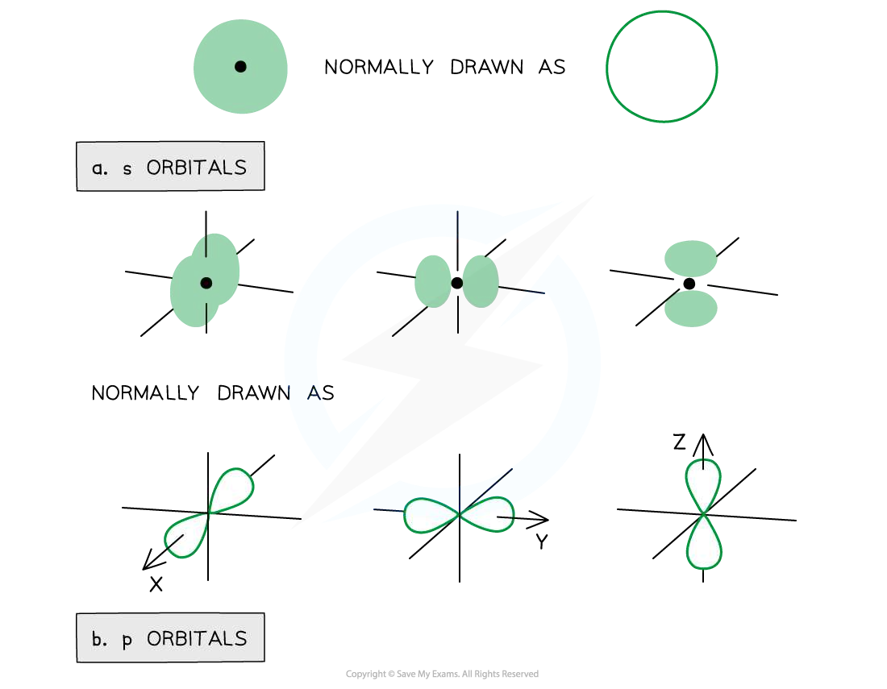{.concept-figure fig-alt="s and p orbital shapes"}

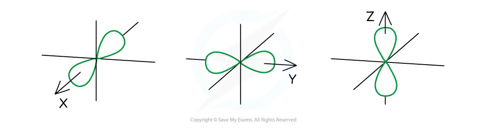{.concept-figure fig-alt="px py and pz orbital orientations"}
:::

::: {.study-card}
### Filling orbitals and writing configurations

Electrons fill the lowest available energy orbitals first. An orbital can contain a maximum of two electrons, which must have opposite spins. In a set of degenerate orbitals, electrons occupy separate orbitals before pairing.

The usual order for the first few subshells is:

$$1s < 2s < 2p < 3s < 3p < 4s < 3d < 4p$$

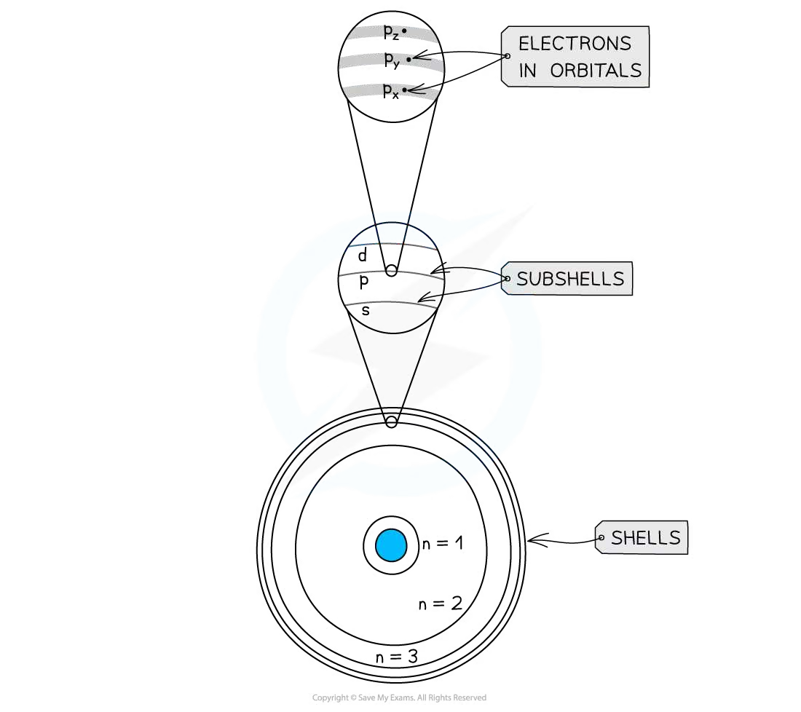{.concept-figure fig-alt="Orbital filling order"}

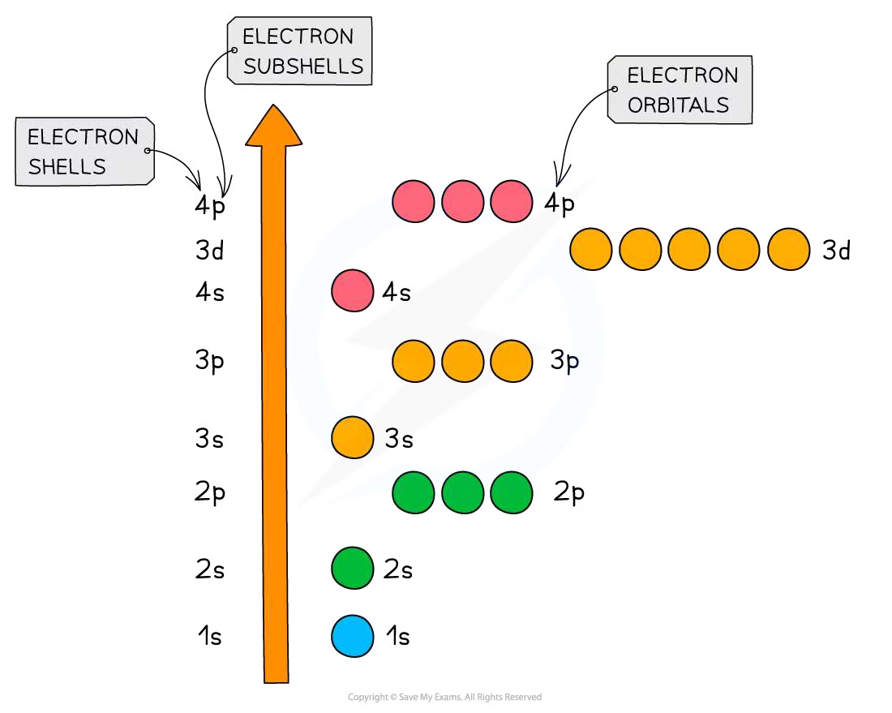{.concept-figure fig-alt="Examples of electronic configurations"}

For example:

$$\ce{Na}:1s^2\,2s^2\,2p^6\,3s^1$$

$$\ce{Cl^-}:1s^2\,2s^2\,2p^6\,3s^2\,3p^6$$

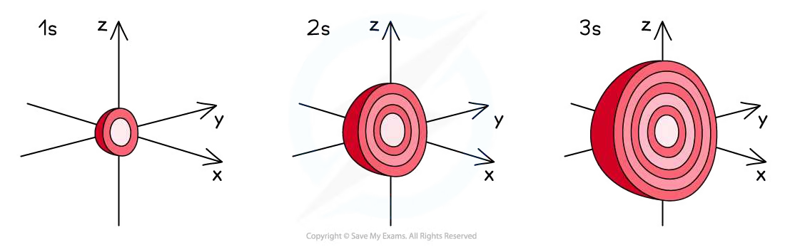{.concept-figure fig-alt="Orbital box notation"}
:::

::: {.study-card}
### Transition-metal configurations and ions

For transition-metal atoms, the $4s$ subshell is filled before $3d$, but the $4s$ electrons are removed first when positive ions form. For example:

$$\ce{Sc}: [Ar]4s^2 3d^1$$

$$\ce{Sc^{2+}}: [Ar]3d^1$$

The chromium and copper atoms are exceptions to the simple filling pattern because half-filled or completely filled $3d$ subshells are more stable:

$$\ce{Cr}: [Ar]4s^1 3d^5$$

$$\ce{Cu}: [Ar]4s^1 3d^{10}$$

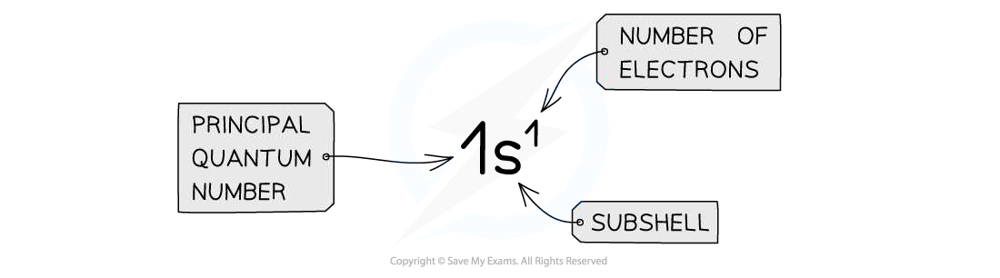{.concept-figure fig-alt="Transition metal electron configurations"}

{.concept-figure fig-alt="Removing 4s electrons before 3d electrons"}
:::

::: {.worked-example}
Worked example · Note electron configuration

### Writing configurations and box notation

**Give the full electronic configurations of $\ce{K+}$, Ti and Co.**

Potassium has atomic number 19. Removing one electron gives:

$$\ce{K+}:1s^2\,2s^2\,2p^6\,3s^2\,3p^6$$

Titanium has 22 electrons:

$$\ce{Ti}:1s^2\,2s^2\,2p^6\,3s^2\,3p^6\,4s^2\,3d^2$$

Cobalt has 27 electrons:

$$\ce{Co}:1s^2\,2s^2\,2p^6\,3s^2\,3p^6\,4s^2\,3d^7$$

:::

## 1.4 Ionisation energy

::: {.study-card}
### First ionisation energy

**The first ionisation energy is the enthalpy change required to remove one mole of electrons from one mole of gaseous atoms to form one mole of gaseous $1+$ ions.**

The equation for the first ionisation energy of magnesium is:

$$\ce{Mg(g) -> Mg+(g) + e-}$$

Ionisation energy is always endothermic because energy is needed to overcome the attraction between the nucleus and the electron being removed.

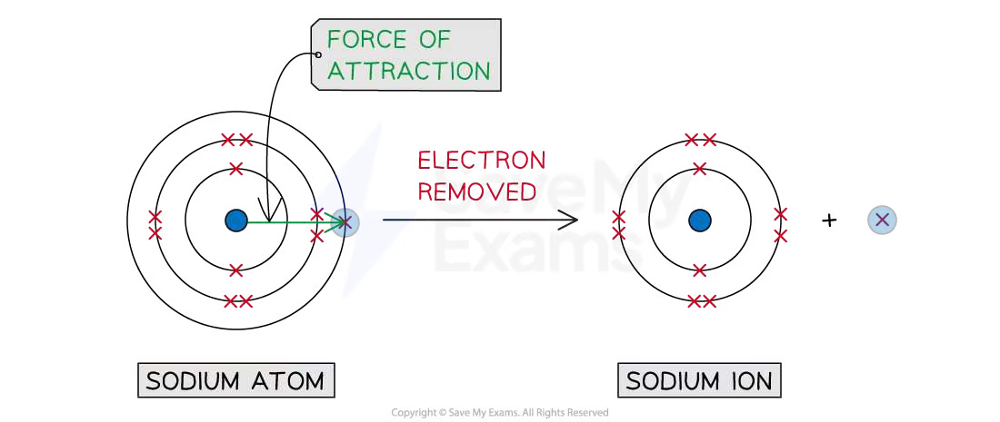{.concept-figure fig-alt="First ionisation energy definition"}
:::

::: {.study-card}
### Trend across a period and down a group

First ionisation energy generally increases across a period because:

1. nuclear charge increases as proton number increases;
2. electrons are added to the same principal shell, so shielding is similar;
3. atomic radius decreases and the attraction between the nucleus and the outer electron increases.

First ionisation energy generally decreases down a group because the outer electron is in a higher shell, farther from the nucleus, and more shielded by inner electrons. The increase in nuclear charge is outweighed by the greater distance and shielding.

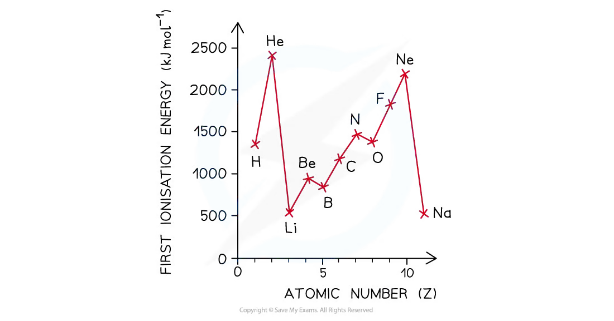{.concept-figure fig-alt="First ionisation energy trend across Period 3"}
:::

::: {.study-card}
### Successive ionisation energies and anomalies

Successive ionisation energies increase because each electron is removed from an increasingly positive ion. A large jump shows that the next electron is being removed from an inner shell. The number of electrons removed before the large jump indicates the number of outer-shell electrons and therefore the group.

{.concept-figure fig-alt="Successive ionisation energies reveal electron shells"}

The small anomalies across Period 3 are important:

- aluminium is lower than magnesium because the electron removed from Al is in the higher-energy, more shielded $3p$ subshell rather than $3s$;
- sulfur is lower than phosphorus because sulfur has a pair of electrons in one $3p$ orbital, so electron–electron repulsion makes one electron easier to remove.

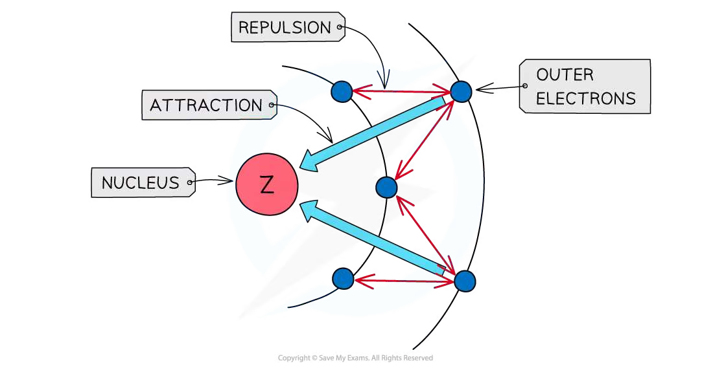{.concept-figure fig-alt="Large jumps in successive ionisation energy"}

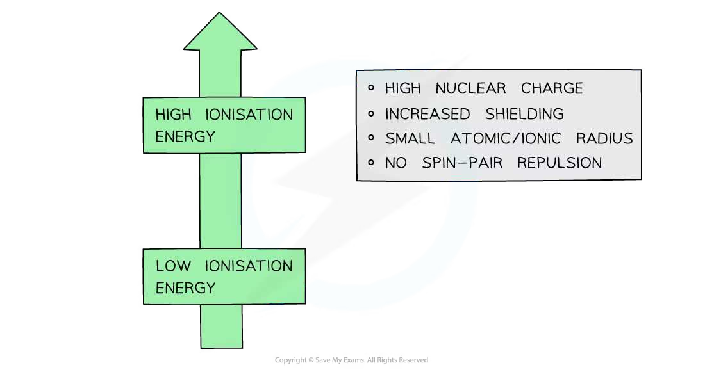{.concept-figure fig-alt="Aluminium and sulfur ionisation energy anomalies"}
:::

::: {.worked-example}
Worked example · Note ionisation-energy calculation

### Interpreting successive ionisation energies

**The successive ionisation energies of an element are 950, 1800, 2700, 4800, 6000 and 12 300 kJ mol$^{-1}$. Deduce the group of the element and explain your answer.**

There is a large jump between the fifth and sixth ionisation energies. The first five electrons are therefore in the outer shell, while the sixth electron is removed from an inner shell.

The element has five outer-shell electrons and is in **Group 15 (Group 5 in the older notation)**.

:::

::: {.worked-example}
Worked example · Note periodic trend

### Explaining an anomaly

**Explain why the first ionisation energy of aluminium is lower than that of magnesium.**

Magnesium loses an electron from the $3s$ subshell, whereas aluminium loses an electron from the $3p$ subshell. The $3p$ electron is at a higher energy and is slightly more shielded, so it is easier to remove. Therefore aluminium has the lower first ionisation energy.

:::

## Chapter checklist

- [ ] 我能写出 proton、neutron 和 electron 的 relative charge、relative mass 与位置。
- [ ] 我能用 atomic number、nucleon number 和 charge 计算粒子数。
- [ ] 我能定义 isotopes，并解释 chemical / physical properties 的差异。
- [ ] 我能写 full electronic configurations 和 orbital box notation。
- [ ] 我能画出并识别 $s$ 和 $p$ orbitals。
- [ ] 我能写出带 state symbols 的 ionisation-energy equations。
- [ ] 我能解释 across a period、down a group、Al / S anomalies 和 successive-ionisation-energy jumps。

## Multiple choice questions



## Structured questions



### Original question PDFs

- [1.1 Atomic Structure – Structured Questions – Easy](https://raw.githubusercontent.com/nanoxsj/CIE-Chemistry-Study/main/resources/original-papers/atomic-structure/1.1-atomic-structure-sq-easy.pdf)
- [1.1 Atomic Structure – Structured Questions – Medium](https://raw.githubusercontent.com/nanoxsj/CIE-Chemistry-Study/main/resources/original-papers/atomic-structure/1.1-atomic-structure-sq-medium.pdf)
- [1.1 Atomic Structure – Structured Questions – Hard](https://raw.githubusercontent.com/nanoxsj/CIE-Chemistry-Study/main/resources/original-papers/atomic-structure/1.1-atomic-structure-sq-hard.pdf)
- [1.1 Atomic Structure – Multiple Choice – Easy](https://raw.githubusercontent.com/nanoxsj/CIE-Chemistry-Study/main/resources/original-papers/atomic-structure/1.1-atomic-structure-choice-easy.pdf)
- [1.1 Atomic Structure – Multiple Choice – Medium](https://raw.githubusercontent.com/nanoxsj/CIE-Chemistry-Study/main/resources/original-papers/atomic-structure/1.1-atomic-structure-choice-medium.pdf)
- [1.1 Atomic Structure – Multiple Choice – Hard](https://raw.githubusercontent.com/nanoxsj/CIE-Chemistry-Study/main/resources/original-papers/atomic-structure/1.1-atomic-structure-choice-hard.pdf)
