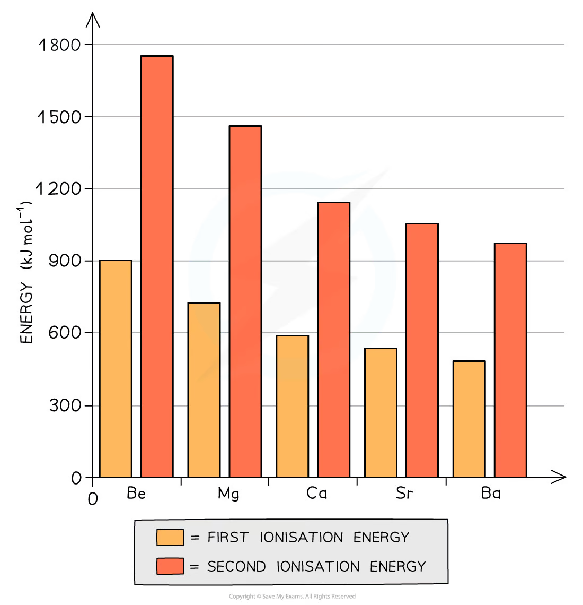
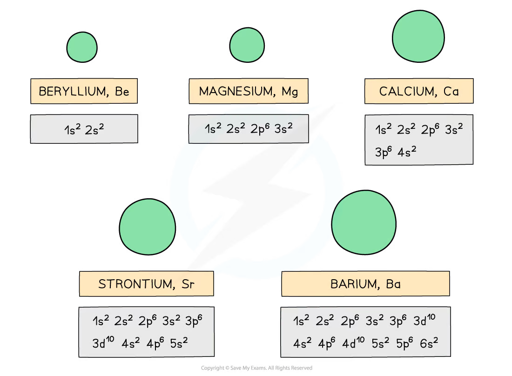
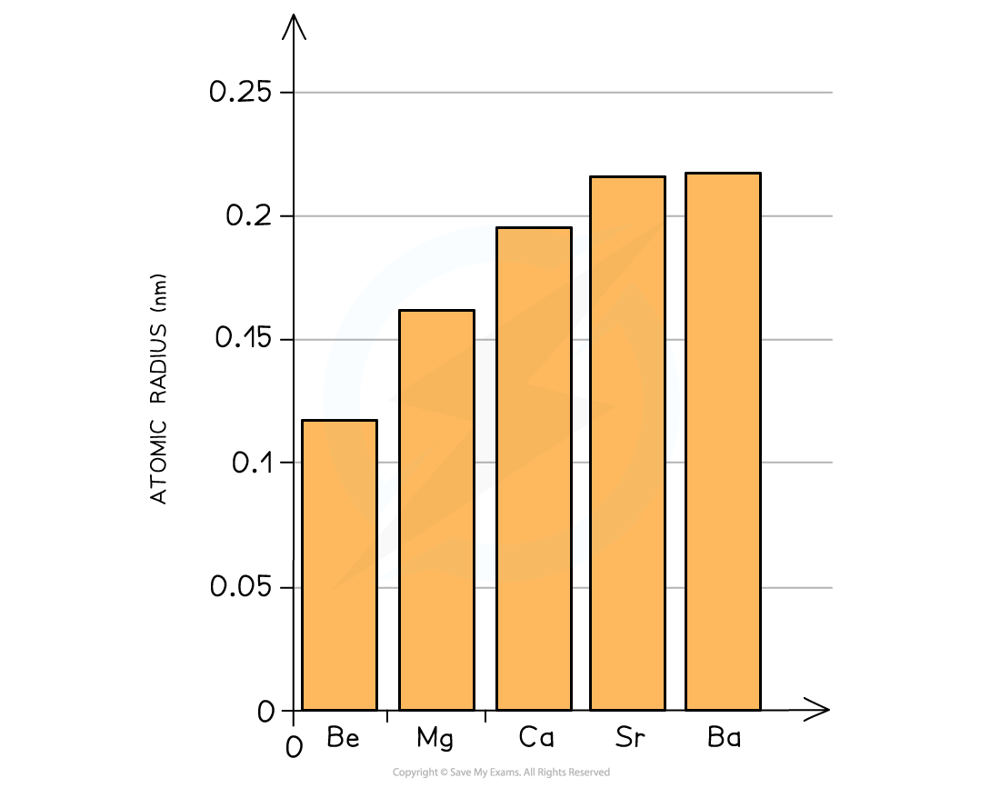
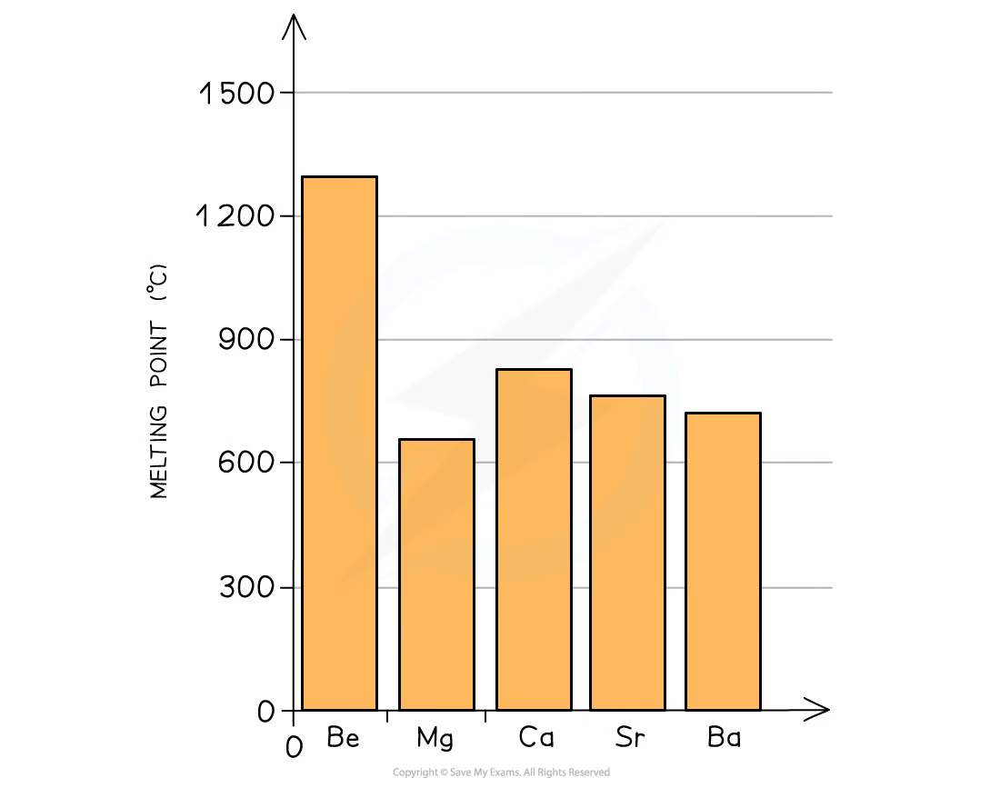
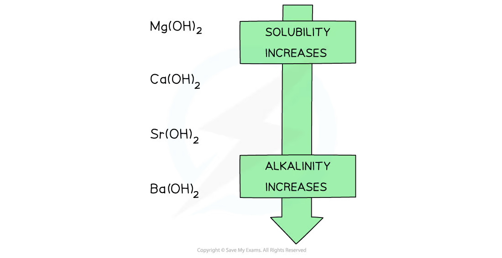
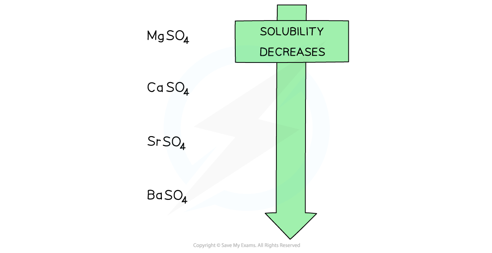
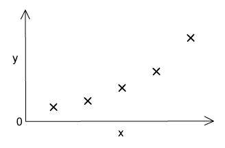
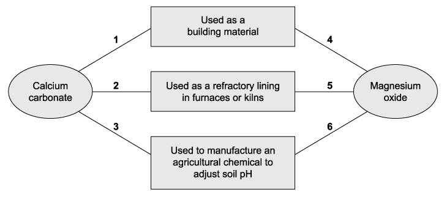

# 10 Group 2

本章围绕 Group 2 metals 及其 compounds 的周期性趋势、与水/氧气/酸的反应、氢氧化物和硫酸盐溶解性，以及硝酸盐和碳酸盐的热分解展开。题目保留 AS topical past paper 的原题表述和来源编号。

## Learning objectives

- explain the trends in atomic radius, first ionisation energy and reactivity down Group 2;
- compare the solubility and alkalinity of Group 2 hydroxides and sulfates;
- write equations for reactions with oxygen, water, acids and heat;
- explain the thermal stability of Group 2 nitrates and carbonates;
- apply observations, formulae, mole ratios and state symbols to unfamiliar compounds.

{.note-figure fig-alt="First and second ionisation energies of beryllium, magnesium, calcium, strontium and barium"}

## Key ideas

- Group 2 metals have an outer configuration of <code>ns2</code> and form M2+ ions by losing both outer electrons.
- Down the group: atomic radius and shielding increase; first and second ionisation energies decrease; metals react more readily with water and acids.
- Solubility of hydroxides increases down the group, while solubility of sulfates decreases down the group.
- Carbonates and nitrates become more thermally stable down the group because the larger M2+ ions have lower polarising power.
- A good trend explanation must state both the observed trend and the particle-level reason; do not write only “more reactive down the group”.

## 10.1 Similarities - Trends in the Properties of the Group 2 Metals, Magnesium to Barium, - Their Compounds

Each Group 2 atom has two electrons in its highest occupied shell. When moving from Mg to Ba, an extra electron shell is added each time. The outer electrons are therefore farther from the nucleus and are more shielded by inner electrons. Although nuclear charge increases, the increased distance and shielding dominate: the attraction between the nucleus and an outer electron is weaker.

{.note-figure fig-alt="Electron configurations and relative atomic radii of beryllium, magnesium, calcium, strontium and barium"}

| Trend down Group 2 | Explanation |
|---|---|
| atomic radius increases | an additional occupied shell is added |
| first and second ionisation energies decrease | outer electrons are farther from the nucleus and more shielded |
| reactivity increases | the two outer electrons are lost more easily to form M2+ |

The melting points are not a simple trend. Metallic bonding depends on the attraction between M2+ ions and delocalised electrons, but also on ion size and crystal structure; answer from data rather than assuming a monotonic pattern.

{.note-figure fig-alt="Density values for Group 2 metals"}

{.note-figure fig-alt="Melting-point values for Group 2 metals"}

## 10.2 Reactions of Group 2 metals

All the metals are reducing agents: the metal loses two electrons and is oxidised from 0 to +2. Their reactions become increasingly vigorous down the group.

| Reagent | Equation / observation |
|---|---|
| oxygen | 2M(s) + O2(g) → 2MO(s). Magnesium burns with an intense white flame to give white MgO. |
| cold water | Ca, Sr and Ba react: M(s) + 2H2O(l) → M(OH)2(aq) + H2(g). Hydrogen gives effervescence; the hydroxide makes the solution alkaline. |
| water or steam with Mg | Mg reacts only very slowly with cold water. With steam: Mg(s) + H2O(g) → MgO(s) + H2(g). |
| dilute acid | M(s) + 2H+(aq) → M2+(aq) + H2(g). The metal is oxidised and H+ is reduced. |

For comparisons, make the observation precise: barium reacts more vigorously and faster than calcium with cold water because Ba atoms lose their outer electrons more readily. Magnesium is also used to reduce titanium(IV) chloride in titanium extraction: TiCl4 + 2Mg → Ti + 2MgCl2.

## 10.3 Hydroxides, sulfates and calcium compounds

The overall enthalpy change of solution depends on lattice breaking and hydration of ions. The balance changes down Group 2, giving two opposite solubility trends.

| Compound family | Trend down Group 2 | Consequence to remember |
|---|---|---|
| M(OH)2 | solubility increases | saturated Ca(OH)2, Sr(OH)2 and Ba(OH)2 become progressively more alkaline |
| MSO4 | solubility decreases | MgSO4 is soluble; CaSO4 is sparingly soluble; BaSO4 is very insoluble |

{.note-figure fig-alt="Solubility and alkalinity of Group 2 hydroxides increase down the group"}

{.note-figure fig-alt="Solubility of Group 2 sulfates decreases down the group"}

The insolubility of BaSO4 explains two common applications. A soluble sulfate can precipitate toxic Ba2+ ions: Ba2+(aq) + SO42−(aq) → BaSO4(s). Conversely, barium sulfate itself is safe enough to swallow as a contrast medium because it is insoluble and is not absorbed significantly by the body.

The lime cycle is a connected set of calcium reactions:

CaCO3(s) → CaO(s) + CO2(g) &nbsp; <em>calcination</em> CaO(s) + H2O(l) → Ca(OH)2(s) &nbsp; <em>slaking</em> Ca(OH)2(aq) + CO2(g) → CaCO3(s) + H2O(l) &nbsp; <em>carbonation</em>

CaO and Ca(OH)2 neutralise acidic soil; CaCO3 is limestone/marble and is used in building materials; CaO is used in cement and glass manufacture. The neutralisation of acidic soil is OH−(aq) + H+(aq) → H2O(l).

## 10.4 Carbonates and nitrates on heating

All Group 2 carbonates decompose on strong heating to the oxide and carbon dioxide. All Group 2 nitrates decompose to the oxide, nitrogen dioxide and oxygen:

MCO3(s) → MO(s) + CO2(g) 2M(NO3)2(s) → 2MO(s) + 4NO2(g) + O2(g)

Thermal stability increases down the group. A small M2+ ion has high charge density and strongly polarises the carbonate or nitrate ion, distorting bonds within the anion and making it easier to decompose. Larger ions such as Ba2+ have lower polarising power, so their salts need more heating.

Useful observations are: CO2 turns limewater milky; NO2 is brown; O2 relights a glowing splint. State the observation and then identify the gas.

## 10.5 Exam method checklist

- Use an ionic equation when the question concerns the reacting ions, for example Ba2+ + SO42− → BaSO4.
- Distinguish “more alkaline saturated solution” from “stronger base”: the pH trend comes from greater solubility and hence a greater concentration of OH−.
- For thermal stability, link smaller cation → greater polarising power → more distortion of the anion → easier decomposition.
- In calculations, write the balanced equation first, then follow the mole ratio and only convert units at the final step.

## Multiple choice questions

::: {.mc-question #group2-mc-01 data-answer="B"}
### Question 1 · 2.2 Choice Easy Q1

Samples of barium and calcium are added separately to beakers of cold water which contain a few drops of litmus solution. Which observations will be made with only the calcium and not with the barium? 1. A gas is evolved 2. A white suspension appears in the water 3. The solution turns blue

<button class="mc-choice" data-choice="A"><strong>A</strong>1 only</button><button class="mc-choice" data-choice="B"><strong>B</strong>2 only</button><button class="mc-choice" data-choice="C"><strong>C</strong>1 and 2</button><button class="mc-choice" data-choice="D"><strong>D</strong>1, 2 and 3</button>

<button class="check-answer">Check answer</button>

Show explanation

<strong>B.</strong> Calcium hydroxide is less soluble than barium hydroxide, so calcium gives the white suspension; both metals give hydrogen and an alkaline solution.

:::

::: {.mc-question #group2-mc-02 data-answer="D"}
### Question 2 · 2.2 Choice Easy Q2

The sketch graph shows the variation of one physical or chemical property with another for the Group 2 elements. What are the correct labels for the axes?

{.question-figure fig-alt="Original Group 2 graph"}

<button class="mc-choice" data-choice="A"><strong>A</strong>First ionisation energy / atomic number</button><button class="mc-choice" data-choice="B"><strong>B</strong>First ionisation energy / atomic radius</button><button class="mc-choice" data-choice="C"><strong>C</strong>Atomic number / melting point</button><button class="mc-choice" data-choice="D"><strong>D</strong>Atomic number / mass number</button>

<button class="check-answer">Check answer</button>

Show explanation

<strong>D.</strong> The plotted trend follows increasing atomic number and increasing mass down Group 2.

:::

::: {.mc-question #group2-mc-03 data-answer="A"}
### Question 3 · 2.2 Choice Easy Q3

X is a Group 2 metal. It forms a hydroxide which is more soluble than calcium hydroxide. It forms a sulfate which is more soluble than barium sulfate. What could be the identity of X? 1. Strontium 2. Beryllium 3. Magnesium

<button class="mc-choice" data-choice="A"><strong>A</strong>1 only</button><button class="mc-choice" data-choice="B"><strong>B</strong>1 and 2</button><button class="mc-choice" data-choice="C"><strong>C</strong>2 and 3</button><button class="mc-choice" data-choice="D"><strong>D</strong>1, 2 and 3</button>

<button class="check-answer">Check answer</button>

Show explanation

<strong>A.</strong> Strontium hydroxide is more soluble than calcium hydroxide and strontium sulfate is more soluble than barium sulfate.

:::

::: {.mc-question #group2-mc-04 data-answer="C"}
### Question 4 · 2.2 Choice Easy Q4

The Group 1 metals have lower melting points than the Group 2 metals. Which factors result in Group 2 metals having higher melting points? 1. Group 1 metals have higher first ionisation energy than the corresponding Group 1 metal 2. There are smaller interatomic distances in the metallic lattices of Group 2 metals 3. More electrons are available from each Group 2 metal atom for bonding the atom into the metallic lattice

<button class="mc-choice" data-choice="A"><strong>A</strong>1 only</button><button class="mc-choice" data-choice="B"><strong>B</strong>1 and 2</button><button class="mc-choice" data-choice="C"><strong>C</strong>2 and 3</button><button class="mc-choice" data-choice="D"><strong>D</strong>1, 2 and 3</button>

<button class="check-answer">Check answer</button>

Show explanation

<strong>C.</strong> The smaller distance and two delocalised electrons strengthen metallic bonding; statement 1 is false.

:::

::: {.mc-question #group2-mc-05 data-answer="D"}
### Question 5 · 2.2 Choice Easy Q5

Pieces of pure solid magnesium and calcium are burned separately with oxygen and then reacted separately with cold water. Which row correctly describes the observations?

<button class="mc-choice" data-choice="A"><strong>A</strong>Mg: white flame; Ca: red flame; Mg + water: rapid bubbling; Ca + water: slow bubbling</button><button class="mc-choice" data-choice="B"><strong>B</strong>Mg: red flame; Ca: white flame; Mg + water: rapid bubbling; Ca + water: slow bubbling</button><button class="mc-choice" data-choice="C"><strong>C</strong>Mg: red flame; Ca: white flame; Mg + water: slow bubbling; Ca + water: rapid bubbling</button><button class="mc-choice" data-choice="D"><strong>D</strong>Mg: white flame; Ca: red flame; Mg + water: slow bubbling; Ca + water: rapid bubbling</button>

<button class="check-answer">Check answer</button>

Show explanation

<strong>D.</strong> Magnesium burns with a bright white flame, calcium gives a brick-red flame, and reactivity with water increases down the group.

:::

::: {.mc-question #group2-mc-06 data-answer="A"}
### Question 6 · 2.2 Choice Easy Q6

What happens when a piece of strontium is placed in cold water?

<button class="mc-choice" data-choice="A"><strong>A</strong>A vigorous effervescence occurs.</button><button class="mc-choice" data-choice="B"><strong>B</strong>Bubbles of gas form slowly on the strontium.</button><button class="mc-choice" data-choice="C"><strong>C</strong>The strontium floats on the surface and reacts quickly.</button><button class="mc-choice" data-choice="D"><strong>D</strong>The strontium glows and a white solid is produced.</button>

<button class="check-answer">Check answer</button>

Show explanation

<strong>A.</strong> Strontium reacts readily with cold water, producing hydrogen and soluble strontium hydroxide.

:::

::: {.mc-question #group2-mc-07 data-answer="C"}
### Question 7 · 2.2 Choice Easy Q7

When barium is burned in oxygen, what colour is the flame?

<button class="mc-choice" data-choice="A"><strong>A</strong>Green</button><button class="mc-choice" data-choice="B"><strong>B</strong>White</button><button class="mc-choice" data-choice="C"><strong>C</strong>Red</button><button class="mc-choice" data-choice="D"><strong>D</strong>Yellow</button>

<button class="check-answer">Check answer</button>

Show explanation

<strong>C.</strong> Barium compounds give a green flame test.

:::

::: {.mc-question #group2-mc-08 data-answer="C"}
### Question 8 · 2.2 Choice Easy Q8

Which statements about calcium oxide are correct? 1. It is produced when calcium nitrate is heated. 2. It can be reduced by heating with magnesium. 3. It reacts with cold water.

<button class="mc-choice" data-choice="A"><strong>A</strong>1 only</button><button class="mc-choice" data-choice="B"><strong>B</strong>1 and 2</button><button class="mc-choice" data-choice="C"><strong>C</strong>1 and 3</button><button class="mc-choice" data-choice="D"><strong>D</strong>2 and 3</button>

<button class="check-answer">Check answer</button>

Show explanation

<strong>C.</strong> Calcium nitrate decomposes to calcium oxide, and calcium oxide reacts with water. Magnesium cannot reduce calcium oxide under these conditions.

:::

::: {.mc-question #group2-mc-09 data-answer="A"}
### Question 9 · 2.2 Choice Easy Q9

The oxides BaO, CaO, MgO and SrO all produce alkaline solutions when added to water. Which oxide produces a saturated solution with the highest pH?

<button class="mc-choice" data-choice="A"><strong>A</strong>BaO</button><button class="mc-choice" data-choice="B"><strong>B</strong>CaO</button><button class="mc-choice" data-choice="C"><strong>C</strong>MgO</button><button class="mc-choice" data-choice="D"><strong>D</strong>SrO</button>

<button class="check-answer">Check answer</button>

Show explanation

<strong>A.</strong> The solubility of Group 2 hydroxides increases down the group, so saturated barium hydroxide has the greatest hydroxide concentration.

:::

::: {.mc-question #group2-mc-10 data-answer="A"}
### Question 10 · 2.2 Choice Easy Q10

Rat poison needs to be insoluble in rainwater but soluble at the low pH of stomach contents. What is a suitable barium compound?

<button class="mc-choice" data-choice="A"><strong>A</strong>Barium carbonate</button><button class="mc-choice" data-choice="B"><strong>B</strong>Barium chloride</button><button class="mc-choice" data-choice="C"><strong>C</strong>Barium hydroxide</button><button class="mc-choice" data-choice="D"><strong>D</strong>Barium sulfate</button>

<button class="check-answer">Check answer</button>

Show explanation

<strong>A.</strong> Barium carbonate is insoluble in water but reacts with acid in the stomach.

:::

::: {.mc-question #group2-mc-11 data-answer="B"}
### Question 11 · 2.2 Choice Medium Q1

In a firework, magnesium is the fuel and barium nitrate is the oxidising agent. Which solid products are produced when the firework is lit? 1. BaO 2. MgO 3. Mg(NO3)2

<button class="mc-choice" data-choice="A"><strong>A</strong>1, 2 and 3</button><button class="mc-choice" data-choice="B"><strong>B</strong>1 and 2</button><button class="mc-choice" data-choice="C"><strong>C</strong>2 and 3</button><button class="mc-choice" data-choice="D"><strong>D</strong>1 only</button>

<button class="check-answer">Check answer</button>

Show explanation

<strong>B.</strong> Barium nitrate supplies oxygen: barium oxide and magnesium oxide are the solid products.

:::

::: {.mc-question #group2-mc-12 data-answer="A"}
### Question 12 · 2.2 Choice Medium Q2

Group 2 nitrates undergo thermal decomposition: X(NO3)2 → XO + 2NO2 + ½O2. Which nitrate requires the highest temperature?

<button class="mc-choice" data-choice="A"><strong>A</strong>Barium nitrate</button><button class="mc-choice" data-choice="B"><strong>B</strong>Calcium nitrate</button><button class="mc-choice" data-choice="C"><strong>C</strong>Magnesium nitrate</button><button class="mc-choice" data-choice="D"><strong>D</strong>Strontium nitrate</button>

<button class="check-answer">Check answer</button>

Show explanation

<strong>A.</strong> Thermal stability increases down Group 2, so barium nitrate requires the strongest heating.

:::

::: {.mc-question #group2-mc-13 data-answer="C"}
### Question 13 · 2.2 Choice Medium Q3

The diagram shows some applications of compounds of Group 2 elements. Which numbered links are correct?

{.question-figure fig-alt="Original Group 2 applications diagram"}

<button class="mc-choice" data-choice="A"><strong>A</strong>4 and 5 only; 1, 2 and 3</button><button class="mc-choice" data-choice="B"><strong>B</strong>4 and 6 only; 1, 2 and 3</button><button class="mc-choice" data-choice="C"><strong>C</strong>5 only; 1 and 3 only</button><button class="mc-choice" data-choice="D"><strong>D</strong>6 only; 1 and 3 only</button>

<button class="check-answer">Check answer</button>

Show explanation

<strong>C.</strong> Calcium carbonate is used as a building material and to adjust soil pH, while magnesium oxide is used as a refractory lining in furnaces or kilns.

:::

::: {.mc-question #group2-mc-14 data-answer="D"}
### Question 14 · 2.2 Choice Medium Q4

Which mass of solid residue is obtained from the thermal decomposition of 5.10 g of anhydrous calcium nitrate?

<button class="mc-choice" data-choice="A"><strong>A</strong>0.70 g</button><button class="mc-choice" data-choice="B"><strong>B</strong>0.87 g</button><button class="mc-choice" data-choice="C"><strong>C</strong>1.40 g</button><button class="mc-choice" data-choice="D"><strong>D</strong>1.74 g</button>

<button class="check-answer">Check answer</button>

Show explanation

<strong>D.</strong> Ca(NO3)2 → CaO + 2NO2 + ½O2; 5.10/164 × 56 = 1.74 g.

:::

::: {.mc-question #group2-mc-15 data-answer="B"}
### Question 15 · 2.2 Choice Medium Q5

32.3 g of anhydrous magnesium nitrate is heated until no further reaction takes place. What mass of oxygen is produced?

<button class="mc-choice" data-choice="A"><strong>A</strong>8.32 g</button><button class="mc-choice" data-choice="B"><strong>B</strong>3.52 g</button><button class="mc-choice" data-choice="C"><strong>C</strong>12.48 g</button><button class="mc-choice" data-choice="D"><strong>D</strong>19.2 g</button>

<button class="check-answer">Check answer</button>

Show explanation

<strong>B.</strong> One mole of Mg(NO3)2 gives half a mole of O2; the calculated mass is about 3.52 g.

:::

::: {.mc-question #group2-mc-16 data-answer="C"}
### Question 16 · 2.2 Choice Medium Q6

Lime is added to damp soil followed by ammonium sulfate. Which substances are formed? 1. Sulfuric acid 2. Calcium sulfate 3. Ammonia

<button class="mc-choice" data-choice="A"><strong>A</strong>1, 2 and 3</button><button class="mc-choice" data-choice="B"><strong>B</strong>1 and 2</button><button class="mc-choice" data-choice="C"><strong>C</strong>2 and 3</button><button class="mc-choice" data-choice="D"><strong>D</strong>1 only</button>

<button class="check-answer">Check answer</button>

Show explanation

<strong>C.</strong> The alkaline lime releases ammonia from ammonium sulfate and forms calcium sulfate.

:::

::: {.mc-question #group2-mc-17 data-answer="D"}
### Question 17 · 2.2 Choice Medium Q7

As you go down Group 2, what are the trends in the properties shown?

<button class="mc-choice" data-choice="A"><strong>A</strong>Carbonate decomposition temperature decreases; first ionisation energy decreases</button><button class="mc-choice" data-choice="B"><strong>B</strong>Carbonate decomposition temperature decreases; first ionisation energy increases</button><button class="mc-choice" data-choice="C"><strong>C</strong>Both increase</button><button class="mc-choice" data-choice="D"><strong>D</strong>Carbonate decomposition temperature increases; first ionisation energy decreases</button>

<button class="check-answer">Check answer</button>

Show explanation

<strong>D.</strong> Carbonate thermal stability increases down the group, while first ionisation energy decreases.

:::

::: {.mc-question #group2-mc-18 data-answer="C"}
### Question 18 · 2.2 Choice Hard Q1

Solids Q, R, S and T are compounds of two different Group 2 metals. A few of the uses of these are detailed below.

Compound Q is used as a refractory lining material in kilns.

Compound R is used as a building material. It can also be heated in a kiln to form compound S. When S is hydrated, it forms compound T, which is used agriculturally to treat soils.

Which statements about these compounds are correct?

<strong>1.</strong> More acid is neutralised by 1.0 g of R than by 1.0 g of Q. <strong>2.</strong> The Mr of R is greater than the Mr of S by 44.0. <strong>3.</strong> The metallic element in S reacts with cold water more rapidly than the metallic element in Q.

<button class="mc-choice" data-choice="A"><strong>A</strong>1, 2 and 3</button><button class="mc-choice" data-choice="B"><strong>B</strong>1 and 2</button><button class="mc-choice" data-choice="C"><strong>C</strong>2 and 3</button><button class="mc-choice" data-choice="D"><strong>D</strong>1 only</button>

<button class="check-answer">Check answer</button>

Show explanation

<strong>C.</strong> Q is MgO, R is CaCO3, S is CaO and T is Ca(OH)2; statements 2 and 3 are correct.

:::

::: {.mc-question #group2-mc-19 data-answer="B"}
### Question 19 · 2.2 Choice Hard Q2

An anhydrous nitrate of a Group 2 metal was thermally decomposed. 6.00 g was used, and 3.06 g of gas was produced. What is the nitrate compound?

<button class="mc-choice" data-choice="A"><strong>A</strong>Beryllium nitrate</button><button class="mc-choice" data-choice="B"><strong>B</strong>Strontium nitrate</button><button class="mc-choice" data-choice="C"><strong>C</strong>Magnesium nitrate</button><button class="mc-choice" data-choice="D"><strong>D</strong>Calcium nitrate</button>

<button class="check-answer">Check answer</button>

Show explanation

<strong>B.</strong> The mass of gas matches the decomposition of strontium nitrate.

:::

::: {.mc-question #group2-mc-20 data-answer="D"}
### Question 20 · 2.2 Choice Hard Q3

A mixture of 2 Group 2 compounds, Y, was thermally decomposed. This reaction produced a white solid and only two gaseous products. One of the gaseous products relights a glowing splint. What could be the components of mixture Y?

<button class="mc-choice" data-choice="A"><strong>A</strong>MgCl2 and CaCO3</button><button class="mc-choice" data-choice="B"><strong>B</strong>MgCO3 and Ca(NO3)2</button><button class="mc-choice" data-choice="C"><strong>C</strong>MgO and CaSO4</button><button class="mc-choice" data-choice="D"><strong>D</strong>Mg(NO3)2 and Ca(NO3)2</button>

<button class="check-answer">Check answer</button>

Show explanation

<strong>D.</strong> Both nitrates decompose to oxides, nitrogen dioxide and oxygen; oxygen relights a glowing splint.

:::

## Structured questions

::: {.question-card #group2-sq-01}
### Question 1 · 2.2 SQ Easy Q1

<strong>(a)</strong> Give the name of a Group 2 element that burns in air to give a white flame and write the balanced equation. [3 marks]

<strong>(b)</strong> Give the reagent and condition required for magnesium to form magnesium hydroxide and write the equation with state symbols. [3 marks]

<strong>(c)</strong> Calcium is added to hydrochloric acid. Give one observation and write the balanced equation with state symbols. [3 marks]

<strong>(d)</strong> Compare the reactions of barium with hydrochloric acid and sulfuric acid, including equations with state symbols. [5 marks]

Show mark scheme / model answer
<ul><li><strong>(a)</strong> Magnesium (or beryllium) burns with a bright white flame: 2Mg(s) + O2(g) → 2MgO(s). The formula and balancing each earn a mark.</li><li><strong>(b)</strong> Use cold water: Mg(s) + 2H2O(l) → Mg(OH)2(s) + H2(g). Magnesium reacts slowly, and the sparingly soluble hydroxide forms a suspension.</li><li><strong>(c)</strong> Expected observation: effervescence and the metal gradually dissolves. Ca(s) + 2HCl(aq) → CaCl2(aq) + H2(g).</li><li><strong>(d)</strong> With hydrochloric acid, barium gives hydrogen and soluble barium chloride: Ba(s) + 2HCl(aq) → BaCl2(aq) + H2(g). With sulfuric acid, a white insoluble BaSO4 coating forms: Ba(s) + H2SO4(aq) → BaSO4(s) + H2(g). The coating limits contact between barium and acid, so the reaction soon slows.</li></ul>

:::

::: {.question-card #group2-sq-02}
### Question 2 · 2.2 SQ Easy Q2

<strong>(a)</strong> Describe the general trends in solubility and pH of Group 2 hydroxides down the group.

<strong>(b)</strong> 3.71 g of Ca(OH)2 is added to hydrochloric acid. Write the equation and calculate the mass of calcium chloride produced.

<strong>(c)</strong> Explain why effervescence stops when strontium carbonate reacts with sulfuric acid. [8 marks]

Show mark scheme / model answer
<ul><li><strong>(a)</strong> Solubility increases down Group 2. A saturated solution therefore contains a greater concentration of OH−, so pH and alkaline strength increase down the group.</li><li><strong>(b)</strong> Ca(OH)2(s) + 2HCl(aq) → CaCl2(aq) + 2H2O(l). n[Ca(OH)2] = 3.71/74.1 = 0.0501 mol. The mole ratio to CaCl2 is 1:1, so m[CaCl2] = 0.0501 × 111.0 = <strong>5.56 g</strong>.</li><li><strong>(c)</strong> SrCO3(s) + H2SO4(aq) → SrSO4(s) + CO2(g) + H2O(l). The insoluble SrSO4 forms a coating on the carbonate, preventing acid from reaching the remaining solid even though reactants remain.</li></ul>

:::

::: {.question-card #group2-sq-medium-q1}
### Question 3 · 2.2 SQ Medium Q1

<strong>(a)</strong> State and explain the trend in atomic radius from beryllium to strontium.

<strong>(b)</strong> Write the equation for magnesium burning in oxygen and state an observation.

<strong>(c)</strong> Write equations for formation of magnesium hydroxide and calcium hydroxide from the metals, then give an approximate pH and one use for each hydroxide.

<strong>(d)</strong> Compare observations when calcium and barium are added separately to water. [12 marks]

Show mark scheme / model answer
<ul><li><strong>(a)</strong> Atomic radius increases from Be to Sr. Each step adds an electron shell; increased shielding and greater distance from the nucleus outweigh the increase in nuclear charge.</li><li><strong>(b)</strong> 2Mg(s) + O2(g) → 2MgO(s). Magnesium burns with an intense bright white light and produces a white solid.</li><li><strong>(c)</strong> Mg(s) + 2H2O(l) → Mg(OH)2(s) + H2(g); Ca(s) + 2H2O(l) → Ca(OH)2(aq) + H2(g). Both are alkaline; calcium hydroxide gives the higher pH. Mg(OH)2 is used as an antacid, while Ca(OH)2 is used to neutralise acidic soil.</li><li><strong>(d)</strong> Both produce effervescence and an alkaline solution. Barium reacts more vigorously: hydrogen is evolved faster and the metal may move/fizz rapidly. Calcium reacts more slowly and can form a white suspension of Ca(OH)2.</li></ul>

:::

::: {.question-card #group2-sq-medium-q2}
### Question 4 · 2.2 SQ Medium Q2

<strong>(a)</strong> Write the equation for barium with cold water.

<strong>(b)</strong> Explain why saturated barium hydroxide is more alkaline than saturated magnesium hydroxide.

<strong>(c)</strong> Write ionic equations for a carbonate test using hydrochloric acid and limewater.

<strong>(d)</strong> Calculate the minimum mass of Mg(OH)2 needed to neutralise 0.210 mol HCl. [8 marks]

Show mark scheme / model answer
<ul><li><strong>(a)</strong> Ba(s) + 2H2O(l) → Ba(OH)2(aq) + H2(g).</li><li><strong>(b)</strong> Ba(OH)2 is much more soluble than Mg(OH)2. Its saturated solution therefore contains more OH− ions per unit volume and has the higher pH.</li><li><strong>(c)</strong> Carbonate test: CO32−(aq) + 2H+(aq) → CO2(g) + H2O(l); limewater test: CO2(g) + Ca(OH)2(aq) → CaCO3(s) + H2O(l). The observation is effervescence followed by cloudy limewater.</li><li><strong>(d)</strong> Mg(OH)2 + 2HCl → MgCl2 + 2H2O. Thus n[Mg(OH)2] = 0.210/2 = 0.105 mol, and m = 0.105 × 58.3 = <strong>6.12 g</strong> (or 6.09 g with the data-booklet Mr).</li></ul>

:::

::: {.question-card #group2-sq-medium-q3}
### Question 5 · 2.2 SQ Medium Q3

<strong>(a)</strong> Calcium carbonate is an insoluble solid that can be used to lower the acidity of lake water. Explain why the rate of this reaction decreases when the water temperature falls. [3 marks]

<strong>(b)</strong> Calcium carbonate reacts with lactic acid to form calcium lactate. State the two other products of the reaction. [1 mark]

<strong>(c)</strong> Magnesium can be used to extract titanium.

<strong>(i)</strong> Write an equation to show how magnesium is used as the reducing agent in the reaction of magnesium with titanium(IV) chloride.

<strong>(ii)</strong> Explain, in terms of oxidation numbers, why magnesium is the reducing agent.

<strong>(iii)</strong> The excess magnesium used in this extraction is removed by reacting it with dilute sulfuric acid to form magnesium sulfate. Explain why the magnesium sulfate formed is easy to separate from the titanium. [4 marks]

<strong>(d)</strong> Strontium metal is used in the manufacture of alloys. Explain why strontium has a higher melting point than barium. [2 marks]

Show mark scheme / model answer
<ul><li><strong>Rate:</strong> when temperature falls, particles have lower average kinetic energy. Fewer collisions have energy greater than or equal to the activation energy, so the successful-collision frequency and reaction rate decrease.</li><li><strong>Products:</strong> calcium lactate, water and carbon dioxide. The carbonate ion is converted into CO2, giving effervescence.</li><li><strong>Extraction:</strong> 2Mg(s) + TiCl4(l) → 2MgCl2(l) + Ti(s). Mg changes from 0 to +2 and is oxidised; Ti changes from +4 to 0 and is reduced, so Mg is the reducing agent. MgCl2 is soluble in dilute sulfuric acid/water while titanium is a solid, so the products can be separated by filtration.</li><li><strong>Melting point:</strong> Sr atoms are smaller than Ba atoms, so the metallic attraction/charge density is greater and more energy is needed to melt strontium.</li></ul>

:::

::: {.question-card #group2-sq-medium-q4}
### Question 6 · 2.2 SQ Medium Q4

<strong>(a)</strong> Calcium carbonate, calcium oxide and calcium hydroxide are connected by the lime cycle. Write three balanced chemical equations to demonstrate the reactions that occur in the lime cycle. Include state symbols. [4 marks]

<strong>(b)</strong>

<strong>(i)</strong> Explain how solid calcium hydroxide increases the pH of acidic soil. [3 marks]

<strong>(ii)</strong> Write an ionic equation to show the reaction that causes the pH of the soil to increase. [1 mark]

<strong>(c)</strong> When calcium carbonate is heated strongly it undergoes a process called calcination.

<strong>(i)</strong> What is the chemical reaction that is described by calcination?

<strong>(ii)</strong> Explain why strontium carbonate has greater thermal stability than calcium carbonate. [4 marks]

<strong>(d)</strong> A sample of hydrated calcium nitrate crystals was gently heated in a test tube. With further heating, a mixture of two gases was evolved.

<strong>(i)</strong> Identify the coloured gas and give its colour.

<strong>(ii)</strong> Identify and describe a test, including the result, for the colourless gas. [2 marks]

Show mark scheme / model answer
<ul><li><strong>Lime cycle:</strong> CaCO3(s) → CaO(s) + CO2(g); CaO(s) + H2O(l) → Ca(OH)2(s); Ca(OH)2(aq) + CO2(g) → CaCO3(s) + H2O(l).</li><li><strong>Soil:</strong> Ca(OH)2 dissolves to provide OH−, which neutralises acidic H+: H+(aq) + OH−(aq) → H2O(l).</li><li><strong>Calcination:</strong> thermal decomposition by strong heating. SrCO3 is more stable because the larger Sr2+ ion has lower charge density and polarises CO32− less than Ca2+.</li><li><strong>Gas tests:</strong> NO2 is the coloured brown gas. O2 is colourless and relights a glowing splint.</li></ul>

:::

::: {.question-card #group2-sq-medium-q5}
### Question 7 · 2.2 SQ Medium Q5

<strong>(a)</strong> Explain why the first ionisation energy of calcium is greater than that of strontium. [2 marks]

<strong>(b)</strong> Strontium chloride is used in toothpaste for sensitive teeth.

<strong>(i)</strong> Write a balanced chemical equation to show the formation of strontium chloride from strontium and hydrochloric acid. Include state symbols.

<strong>(ii)</strong> Suggest why this reaction is not used to produce strontium chloride on an industrial scale. [3 marks]

<strong>(c)</strong> Magnesium sulfate solution can be given as first aid to someone who has accidentally swallowed barium chloride. Explain, with the help of an ionic equation, why drinking magnesium sulfate solution is an effective treatment for barium poisoning. [2 marks]

<strong>(d)</strong> Milk of magnesia, Mg(OH)2, and calcium carbonate can both be used in the effective relief of acid indigestion. By comparing the chemical equations for their reactions with hydrochloric acid, justify which remedy might cause a person taking it to have wind. [2 marks]

Show mark scheme / model answer
<ul><li><strong>(a)</strong> Calcium's outer electron is in a shell closer to the nucleus and experiences less shielding than strontium's. It is therefore held more strongly, so more energy is required: IE(Ca) &gt; IE(Sr).</li><li><strong>(b)</strong> Sr(s) + 2HCl(aq) → SrCl2(aq) + H2(g). This is not an industrial route because the metal is expensive/reactive, the reaction produces flammable hydrogen and the process is difficult to control at scale.</li><li><strong>(c)</strong> Ba2+(aq) + SO42−(aq) → BaSO4(s). Insoluble BaSO4 removes soluble toxic Ba2+ from solution, making magnesium sulfate an effective treatment.</li><li><strong>(d)</strong> Mg(OH)2 + 2HCl → MgCl2 + 2H2O, whereas CaCO3 + 2HCl → CaCl2 + H2O + CO2. Calcium carbonate can cause wind because CO2 gas is produced.</li></ul>

:::

::: {.question-card #group2-sq-hard-q1}
### Question 8 · 2.2 SQ Hard Q1

This question is about Group 2 elements.

Barium is silvery white but blackens when exposed to air. This is due to the formation of barium nitride and one other compound. Write balanced symbol equations for the two separate reactions. Include state symbols. [2 marks]

Barium can also react with water. A student reacted 0.20 g of barium with 250 cm3 of water.

<strong>(a)</strong> Calculate the volume of gas, in cm3, produced in this reaction under standard temperature and pressure.

<strong>(b)</strong> Calculate the concentration, in mol dm−3, of the barium hydroxide solution produced. [4 marks]

<strong>(c)</strong> Describe and explain the trend in the reactivity of Group 2 elements with water. [5 marks]

<strong>(d)</strong> Explain why the reaction of calcium with water is a redox reaction. Use oxidation numbers in your answer. [2 marks]

<strong>(e)</strong> The trend in solubility and strength as a base can also be observed going down Group 2. Explain how these two trends are connected. [3 marks]

Show mark scheme / model answer
<ul><li>2Ba(s) + O2(g) → 2BaO(s), and 3Ba(s) + N2(g) → Ba3N2(s).</li><li>Ba(s) + 2H2O(l) → Ba(OH)2(aq) + H2(g). n(Ba) = 0.20/137.3 = 1.46 × 10−3 mol. The ratio Ba:H2 is 1:1, so V(H2) = 1.46 × 10−3 × 24 000 = <strong>35.0 cm3</strong>. n[Ba(OH)2] = 1.46 × 10−3 mol and c = 0.00146/0.250 = <strong>0.00584 mol dm−3</strong>.</li><li>Reactivity increases down the group. Atomic radius and shielding increase, so the outer electrons are less strongly attracted and are removed more readily.</li><li>Ca changes from oxidation number 0 to +2 and is oxidised. Hydrogen changes from +1 in water to 0 in H2 and is reduced; oxidation and reduction occur together.</li><li>Solubility of the hydroxides increases down the group. More hydroxide dissolves, producing a higher OH− concentration and therefore a stronger alkaline solution.</li></ul>

:::

::: {.question-card #group2-sq-hard-q2}
### Question 9 · 2.2 SQ Hard Q2

Group 2 hydroxides, M(OH)2, can be used to neutralise acids. Samples of calcium, strontium and barium are reacted with water to form their hydroxides. The resulting solutions are then filtered to collect the precipitates.

<strong>(a)</strong> Explain the trend in the expected mass for the precipitates.

<strong>(b)</strong> A student determined that a 50 cm3 solution of an unknown Group 2 metal hydroxide contained 802 mg of the metal hydroxide. Identify the metal hydroxide in the unknown sample. Show your working. [2 marks]

<strong>(c)</strong> Magnesium hydroxide reacts with sulfuric acid. Write the balanced symbol equation, including state symbols.

<strong>(d)</strong> Barium hydroxide also reacts with sulfuric acid. State any differences in the observations, if any, between the reaction of magnesium hydroxide with sulfuric acid and barium hydroxide with sulfuric acid. Explain your answer. [5 marks]

Show mark scheme / model answer
<ul><li>Hydroxide solubility increases from calcium to barium, so the mass of undissolved precipitate decreases down the group.</li><li>802 mg in 50 cm3 = 0.802/0.050 = 16.04 g dm−3. Comparing with the data, this identifies strontium hydroxide.</li><li>Mg(OH)2(s) + H2SO4(aq) → MgSO4(aq) + 2H2O(l).</li><li>With barium hydroxide, a white precipitate of BaSO4 forms: Ba(OH)2(aq) + H2SO4(aq) → BaSO4(s) + 2H2O(l). Magnesium sulfate remains soluble, so no persistent sulfate precipitate is seen in the magnesium reaction.</li></ul>

:::

::: {.question-card #group2-sq-hard-q3}
### Question 10 · 2.2 SQ Hard Q3

This question is about Group 2 compounds.

<strong>(a)</strong> Write an equation showing the thermal decomposition of calcium nitrate, Ca(NO3)2.

<strong>(b)</strong> State and explain how the thermal stabilities of the nitrates vary down Group 2.

<strong>(c)</strong> Predict what you would see if a sample of lithium nitrate was heated. [5 marks]

The nitrates of calcium, strontium or barium are often added to firework mixtures to produce red or green flames. Calculate the volume of gas given off at room temperature and pressure when a 10.0 g sample of the mixture decomposes. Show your working. [3 marks]

One of the major ores of magnesium is dolomite, CaMg(CO3)2. Calculate the percentage loss in mass when a sample of dolomite is heated at a high temperature until the reaction has finished. Show your working. [3 marks]

Show mark scheme / model answer
<ul><li>2Ca(NO3)2(s) → 2CaO(s) + 4NO2(g) + O2(g).</li><li>Thermal stability increases down Group 2 because larger M2+ ions have lower charge density and polarise nitrate ions less.</li><li>Lithium nitrate gives lithium oxide, nitrogen dioxide and oxygen on heating.</li><li>For the firework, n[Sr(NO3)2] = 10.0/211.6 = 0.0473 mol. The original equation gives four moles of gas per mole of mixture, so n(gas) = 0.189 mol and V = 0.189 × 24.0 = <strong>4.54 dm3</strong> at room conditions.</li><li>CaMg(CO3)2 → CaO + MgO + 2CO2. Mr = 184.4 and mass of CO2 lost = 88.0; percentage loss = 88.0/184.4 × 100 = <strong>47.7%</strong>.</li></ul>

:::

## Original question PDFs

- [2.2 Group 2 — Choice — Easy](https://raw.githubusercontent.com/nanoxsj/CIE-Chemistry-Study/main/assets/questions/original-source/2.2_group_2___choice___easy.pdf)
- [2.2 Group 2 — Choice — Medium](https://raw.githubusercontent.com/nanoxsj/CIE-Chemistry-Study/main/assets/questions/original-source/2.2_group_2___choice___medium.pdf)
- [2.2 Group 2 — Choice — Hard](https://raw.githubusercontent.com/nanoxsj/CIE-Chemistry-Study/main/assets/questions/original-source/2.2_group_2___choice___hard.pdf)
- [2.2 Group 2 — SQ — Easy](https://raw.githubusercontent.com/nanoxsj/CIE-Chemistry-Study/main/assets/questions/original-source/2.2_group_2___sq___easy.pdf)
- [2.2 Group 2 — SQ — Medium](https://raw.githubusercontent.com/nanoxsj/CIE-Chemistry-Study/main/assets/questions/original-source/2.2_group_2___sq___medium.pdf)
- [2.2 Group 2 — SQ — Hard](https://raw.githubusercontent.com/nanoxsj/CIE-Chemistry-Study/main/assets/questions/original-source/2.2_group_2___sq___hard.pdf)

## Original note PDF

- [10.1 Similarities - Trends in the Properties of the Group 2 Metals, Magnesium to Barium, - Their Compounds](https://raw.githubusercontent.com/nanoxsj/CIE-Chemistry-Study/main/assets/notes/group2-10-rebuilt/10.1_group2_note.pdf)
