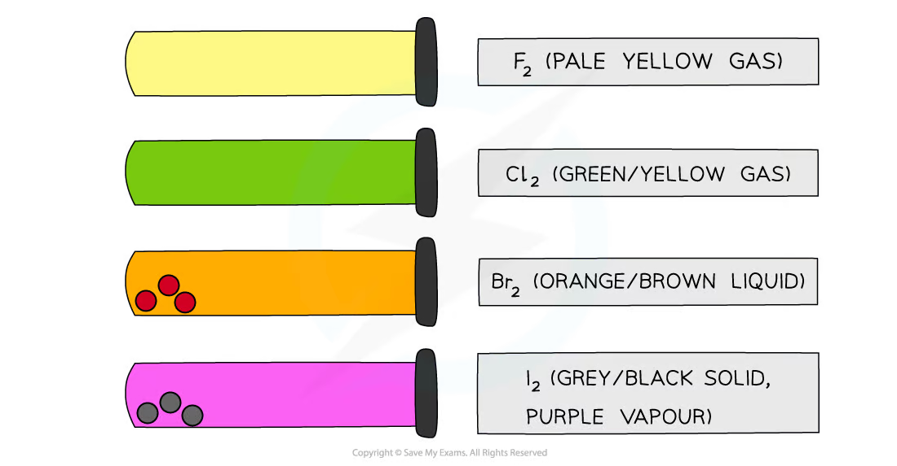
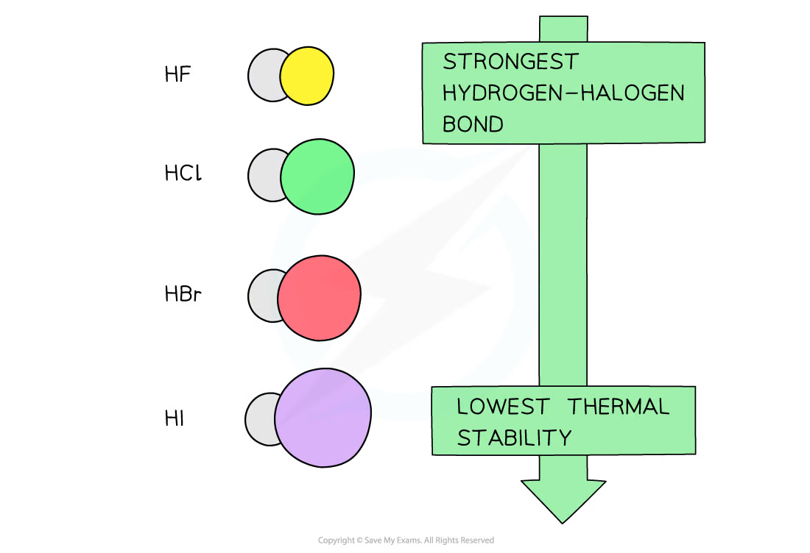
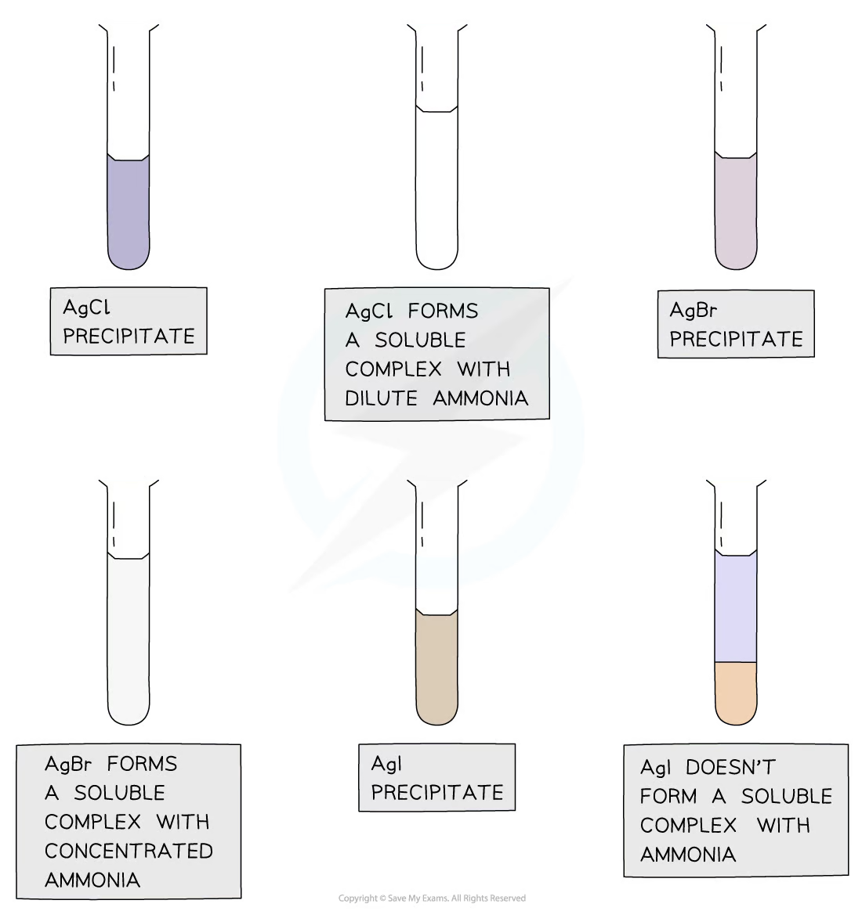
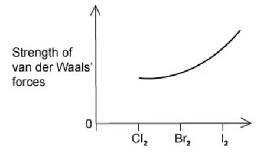
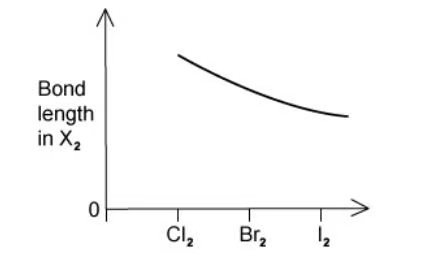
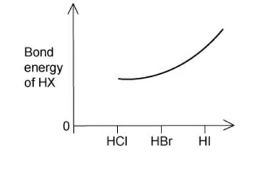
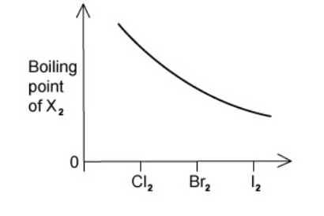

# 11 Group 17

本章整理 halogens、hydrogen halides 和 halide ions 的趋势与反应：分子间作用力、键能、氧化还原能力、卤化物检验、氯气与碱的反应，以及浓硫酸与卤化物的反应。

## Learning objectives

- explain trends in boiling point, bond length, bond strength and thermal stability;
- compare oxidising agents and reducing agents down Group 17;
- write displacement, disproportionation and half-equations;
- identify halide ions using silver nitrate and ammonia;
- explain the different products formed with concentrated sulfuric acid.

## Key ideas

- Group 17 elements are diatomic, X2; London forces become stronger down the group, so colour darkens and melting/boiling points increase.
- Halogen molecules become weaker oxidising agents down the group; halide ions become stronger reducing agents down the group.
- The F–F bond is an important exception: it is unusually weak because of strong repulsion between lone pairs on the small fluorine atoms.
- Use dilute HNO3 then AgNO3 to test Cl−, Br− and I−; ammonia distinguishes the precipitates.
- Chlorine undergoes disproportionation in water and alkali. In a disproportionation reaction, the same element is both oxidised and reduced.

## 11.1 Physical Properties of the Group 17 Elements

The halogens are simple molecular elements: F2, Cl2, Br2 and I2. Going down the group, molecules have more electrons and larger electron clouds. Their instantaneous dipoles therefore induce larger dipoles in nearby molecules, giving stronger London forces.

| Property | Trend from F2 to I2 | Reason / observation |
|---|---|---|
| colour | becomes darker | F2 pale yellow gas; Cl2 green-yellow gas; Br2 red-brown liquid; I2 grey-black solid with purple vapour |
| melting and boiling point | increase | more energy is needed to overcome stronger London forces |
| volatility | decreases | stronger intermolecular attractions make escape into the gas phase harder |
| atomic radius | increases | an extra occupied shell is added |

{.note-figure fig-alt="Colours and physical states of the halogens"}

The X–X bond length increases down the group because the atoms are larger. Bond enthalpy generally falls from Cl–Cl to I–I as orbital overlap becomes poorer. Do not claim it decreases smoothly from fluorine: the F–F bond is weaker than expected because the small fluorine atoms have closely packed lone pairs that repel strongly.

## 11.2 The Chemical Properties of the Halogen Elements - the Hydrogen Halides

Electronegativity decreases down the group because bonding electrons are farther from the nucleus and more shielded. A halogen molecule acts as an oxidising agent by accepting electrons:

X2 + 2e− → 2X−

Thus the oxidising ability decreases down the group: F2 &gt; Cl2 &gt; Br2 &gt; I2. The reverse is true for halide ions: F− &lt; Cl− &lt; Br− &lt; I− in reducing ability, because the outer electron of a larger halide ion is lost more readily.

| Halogen added | Halide ions oxidised in aqueous solution |
|---|---|
| Cl2 | Br−, I− |
| Br2 | I− only |
| I2 | none of Cl−, Br−, I− |

For example, chlorine displaces iodine: Cl2(aq) + 2I−(aq) → 2Cl−(aq) + I2(aq). State both half-equations when explaining redox: 2I− → I2 + 2e−; Cl2 + 2e− → 2Cl−.

### Hydrogen halides

Hydrogen halides are covalent gases. The H–X bond becomes longer and weaker from HF to HI because the halogen atom becomes larger and overlap with the 1s orbital of hydrogen becomes poorer. Therefore thermal stability decreases down the group: HF &gt; HCl &gt; HBr &gt; HI. On heating, HI decomposes most readily to H2 and I2.

HF is a weak acid in water because the H–F bond is exceptionally strong. HCl, HBr and HI ionise essentially completely in water. Hydrogen chloride gas forms white fumes in moist air because it dissolves rapidly in water droplets to form hydrochloric acid; this is not smoke.

{.note-figure fig-alt="Hydrogen halide bond and thermal stability trend"}

## 11.3 Some Reactions of the Halide Ions

### Testing halide ions

First acidify the unknown solution with <strong>dilute nitric acid</strong>, then add aqueous silver nitrate. Nitric acid removes interfering carbonate ions but does not introduce a halide. Do not use hydrochloric acid, because its Cl− ions would give a false positive.

Ag+(aq) + X−(aq) → AgX(s)

| Ion | Silver halide precipitate | Add dilute NH3(aq) | Add concentrated NH3(aq) |
|---|---|---|---|
| Cl− | AgCl: white | dissolves | dissolves |
| Br− | AgBr: cream | insoluble | dissolves |
| I− | AgI: yellow | insoluble | insoluble |

{.note-figure fig-alt="Silver halide precipitates and their reactions with ammonia"}

Ammonia dissolves AgCl and AgBr by forming the complex ion [Ag(NH3)2]+. AgI is too insoluble for this equilibrium to occur to an observable extent.

### Halide ions with concentrated sulfuric acid

Adding concentrated H2SO4 to a solid sodium halide first gives an acid-base reaction. The subsequent redox reaction depends on the reducing strength of the halide ion.

| Solid halide | Main products and observations | Key equation |
|---|---|---|
| NaCl | steamy HCl fumes only | NaCl + H2SO4 → NaHSO4 + HCl |
| NaBr | HBr, then red-brown Br2 and choking SO2 | 2HBr + H2SO4 → Br2 + SO2 + 2H2O |
| NaI | I2 (purple vapour/black solid), SO2, yellow S and sometimes H2S | 8HI + H2SO4 → 4I2 + H2S + 4H2O |

Br− and especially I− are reducing agents: they are oxidised to Br2/I2, while sulfur in H2SO4 is reduced from +6. Iodide reduces sulfuric acid further than bromide, which demonstrates its greater reducing power.

## 11.4 The Reactions of Chlorine

Chlorine disproportionates in water. Chlorine starts at oxidation number 0; one chlorine atom is reduced to −1 and the other is oxidised to +1 in hypochlorous acid:

Cl2(aq) + H2O(l) ⇌ HCl(aq) + HClO(aq)

HClO is an oxidising agent, so chlorine water bleaches damp coloured materials and disinfects water. With alkali, the product depends on the conditions:

cold, dilute: Cl2 + 2OH− → Cl− + ClO− + H2O hot, concentrated: 3Cl2 + 6OH− → 5Cl− + ClO3− + 3H2O

Chlorine is used to disinfect drinking water and swimming pools, but excessive chlorination and chlorinated organic by-products are environmental concerns. Always connect the benefit or risk to chlorine’s oxidising reactivity.

## Exam checklist

- Separate intermolecular-force trends (state, melting point, boiling point) from covalent-bond trends (bond length, bond enthalpy, thermal stability).
- In a redox explanation, identify which species loses electrons and which gains them; “more reactive” alone is insufficient.
- For the halide test, include the acid, precipitate colour and ammonia result.
- For chlorine reactions, check whether the alkali is cold/dilute or hot/concentrated before choosing ClO− or ClO3−.

## Multiple choice questions

::: {.mc-question #g17-mc-01 data-answer="D"}
### Question 1 · 2.3 Choice Easy Q1

What happens when iodine is bubbled through aqueous potassium bromide?

<button class="mc-choice" data-choice="A"><strong>A</strong>Iodine is oxidised to iodide ions.</button><button class="mc-choice" data-choice="B"><strong>B</strong>Potassium bromide is reduced to bromine.</button><button class="mc-choice" data-choice="C"><strong>C</strong>Bromide ions are oxidised to bromine.</button><button class="mc-choice" data-choice="D"><strong>D</strong>No reaction occurs.</button>

<button class="check-answer">Check answer</button>

Show explanation

<strong>D.</strong> Iodine is below bromine in Group 17 and cannot displace bromide ions.

:::

::: {.mc-question #g17-mc-02 data-answer="A"}
### Question 2 · 2.3 Choice Easy Q2

Bromine is used to manufacture agricultural chemicals. What is another important use for bromine?

<button class="mc-choice" data-choice="A"><strong>A</strong>Flame-retardants and fire extinguishers</button><button class="mc-choice" data-choice="B"><strong>B</strong>Water purification</button><button class="mc-choice" data-choice="C"><strong>C</strong>Antiseptic agents</button><button class="mc-choice" data-choice="D"><strong>D</strong>Bleaches for textiles and the paper industry</button>

<button class="check-answer">Check answer</button>

Show explanation

<strong>A.</strong> Bromine compounds are important flame retardants and fire-extinguishing chemicals.

:::

::: {.mc-question #g17-mc-03 data-answer="A"}
### Question 3 · 2.3 Choice Easy Q3

Chlorine reacts with water to produce hydrochloric acid and another chlorine-containing acid. Which row is correct?

<button class="mc-choice" data-choice="A"><strong>A</strong>1 mol Cl2 gives 1 mol HCl and HClO</button><button class="mc-choice" data-choice="B"><strong>B</strong>2 mol Cl2 gives 3 mol HCl and HClO2</button><button class="mc-choice" data-choice="C"><strong>C</strong>3 mol Cl2 gives 5 mol HCl and HClO3</button><button class="mc-choice" data-choice="D"><strong>D</strong>4 mol Cl2 gives 7 mol HCl and HClO4</button>

<button class="check-answer">Check answer</button>

Show explanation

<strong>A.</strong> Cl2 + H2O ⇌ HCl + HClO.

:::

::: {.mc-question #g17-mc-04 data-answer="D"}
### Question 4 · 2.3 Choice Easy Q4

Descending from chlorine to iodine, boiling points increase. Which statement explains this trend?

<button class="mc-choice" data-choice="A"><strong>A</strong>The permanent dipole increases.</button><button class="mc-choice" data-choice="B"><strong>B</strong>X–X bond strength increases.</button><button class="mc-choice" data-choice="C"><strong>C</strong>Electronegativity increases.</button><button class="mc-choice" data-choice="D"><strong>D</strong>The number of electrons in each X2 molecule increases.</button>

<button class="check-answer">Check answer</button>

Show explanation

<strong>D.</strong> Larger diatomic molecules have more electrons and stronger London forces.

:::

::: {.mc-question #g17-mc-05 data-answer="C"}
### Question 5 · 2.3 Choice Easy Q5

How do intermolecular forces and covalent bonds vary from chlorine to bromine to iodine?

<button class="mc-choice" data-choice="A"><strong>A</strong>Both increase.</button><button class="mc-choice" data-choice="B"><strong>B</strong>van der Waals' forces decrease; covalent bonds increase.</button><button class="mc-choice" data-choice="C"><strong>C</strong>van der Waals' forces increase; covalent bonds decrease.</button><button class="mc-choice" data-choice="D"><strong>D</strong>Both decrease.</button>

<button class="check-answer">Check answer</button>

Show explanation

<strong>C.</strong> The molecules become larger, increasing London forces, while the X–X bond becomes longer and weaker.

:::

::: {.mc-question #g17-mc-06 data-answer="A"}
### Question 6 · 2.3 Choice Easy Q6

What happens when chlorine gas is bubbled through aqueous potassium iodide?

<button class="mc-choice" data-choice="A"><strong>A</strong>Iodide ions are oxidised to iodine.</button><button class="mc-choice" data-choice="B"><strong>B</strong>Chlorine is oxidised to chlorate(V) ions.</button><button class="mc-choice" data-choice="C"><strong>C</strong>Chlorine is oxidised to chloride ions.</button><button class="mc-choice" data-choice="D"><strong>D</strong>There is no observable reaction.</button>

<button class="check-answer">Check answer</button>

Show explanation

<strong>A.</strong> Chlorine is the stronger oxidising agent and oxidises I− to I2.

:::

::: {.mc-question #g17-mc-07 data-answer="D"}
### Question 7 · 2.3 Choice Easy Q7

Which property is bigger for iodine than for chlorine?

<button class="mc-choice" data-choice="A"><strong>A</strong>Solubility of the silver halide in NH3(aq)</button><button class="mc-choice" data-choice="B"><strong>B</strong>Oxidising ability of the element</button><button class="mc-choice" data-choice="C"><strong>C</strong>Thermal stability of the hydrogen halide</button><button class="mc-choice" data-choice="D"><strong>D</strong>Strength of van der Waals' forces between the molecules</button>

<button class="check-answer">Check answer</button>

Show explanation

<strong>D.</strong> Iodine molecules have stronger London forces.

:::

::: {.mc-question #g17-mc-08 data-answer="B"}
### Question 8 · 2.3 Choice Easy Q8

Which properties of hydrogen halides steadily increase in the sequence HCl, HBr and HI? 1. Bond length 2. Ease of oxidation 3. Thermal stability

<button class="mc-choice" data-choice="A"><strong>A</strong>1 only</button><button class="mc-choice" data-choice="B"><strong>B</strong>1 and 2</button><button class="mc-choice" data-choice="C"><strong>C</strong>2 and 3</button><button class="mc-choice" data-choice="D"><strong>D</strong>1, 2 and 3</button>

<button class="check-answer">Check answer</button>

Show explanation

<strong>B.</strong> Bond length and ease of oxidation increase down the group; thermal stability decreases.

:::

::: {.mc-question #g17-mc-09 data-answer="C"}
### Question 9 · 2.3 Choice Easy Q9

Which halide ions act as reducing agents when sodium salts react with concentrated sulfuric acid? 1. Cl− &nbsp; 2. Br− &nbsp; 3. I−

<button class="mc-choice" data-choice="A"><strong>A</strong>1, 2 and 3</button><button class="mc-choice" data-choice="B"><strong>B</strong>1 and 2</button><button class="mc-choice" data-choice="C"><strong>C</strong>2 and 3</button><button class="mc-choice" data-choice="D"><strong>D</strong>1 only</button>

<button class="check-answer">Check answer</button>

Show explanation

<strong>C.</strong> Bromide and iodide are strong enough reducing agents to reduce concentrated sulfuric acid.

:::

::: {.mc-question #g17-mc-10 data-answer="B"}
### Question 10 · 2.3 Choice Easy Q10

A hot platinum wire decomposes HI but not HCl. Which factors result in this behaviour? 1. Strength of the hydrogen–halogen bond 2. Standard enthalpies of formation of the products 3. Size of the halogen atom

<button class="mc-choice" data-choice="A"><strong>A</strong>1 only</button><button class="mc-choice" data-choice="B"><strong>B</strong>1 and 2</button><button class="mc-choice" data-choice="C"><strong>C</strong>2 and 3</button><button class="mc-choice" data-choice="D"><strong>D</strong>1, 2 and 3</button>

<button class="check-answer">Check answer</button>

Show explanation

<strong>B.</strong> The weaker H–I bond and the energetics of decomposition are relevant; atom size alone is not a direct factor.

:::

::: {.mc-question #g17-mc-11 data-answer="C"}
### Question 11 · 2.3 Choice Medium Q1

On heating, hydrogen iodide breaks down more quickly than hydrogen chloride. Which statements explain this faster rate? 1. Breakdown of HCl is more exothermic. 2. Breakdown of HI has smaller activation energy. 3. H–Cl is stronger than H–I.

<button class="mc-choice" data-choice="A"><strong>A</strong>1 only</button><button class="mc-choice" data-choice="B"><strong>B</strong>1 and 2</button><button class="mc-choice" data-choice="C"><strong>C</strong>2 and 3</button><button class="mc-choice" data-choice="D"><strong>D</strong>1, 2 and 3</button>

<button class="check-answer">Check answer</button>

Show explanation

<strong>C.</strong> HI has a weaker bond and a lower activation energy for thermal decomposition.

:::

::: {.mc-question #g17-mc-12 data-answer="A"}
### Question 12 · 2.3 Choice Medium Q2

A report says purple gaseous bromine drifted over a road. Which observation is incorrect?

<button class="mc-choice" data-choice="A"><strong>A</strong>Bromine is not purple.</button><button class="mc-choice" data-choice="B"><strong>B</strong>Bromine does not vaporise readily.</button><button class="mc-choice" data-choice="C"><strong>C</strong>Bromine is not denser than air.</button><button class="mc-choice" data-choice="D"><strong>D</strong>Bromine does not dissolve in water.</button>

<button class="check-answer">Check answer</button>

Show explanation

<strong>A.</strong> Bromine vapour is orange-brown, not purple.

:::

::: {.mc-question #g17-mc-13 data-answer="A"}
### Question 13 · 2.3 Choice Medium Q3

What is the complete list of products from potassium bromide with concentrated sulfuric acid?

<button class="mc-choice" data-choice="A"><strong>A</strong>KHSO4, HBr, Br2, H2O and SO2</button><button class="mc-choice" data-choice="B"><strong>B</strong>KHSO4, HBr, Br2 and H2O</button><button class="mc-choice" data-choice="C"><strong>C</strong>KHSO4, HBr and Br2</button><button class="mc-choice" data-choice="D"><strong>D</strong>KHSO4 and HBr</button>

<button class="check-answer">Check answer</button>

Show explanation

<strong>A.</strong> The reaction begins as acid–base chemistry and then bromide reduces sulfuric acid to sulfur dioxide.

:::

::: {.mc-question #g17-mc-14 data-answer="C"}
### Question 14 · 2.3 Choice Medium Q4

On contact with a hot glass rod, which gaseous hydride most readily decomposes into its elements?

<button class="mc-choice" data-choice="A"><strong>A</strong>NH3</button><button class="mc-choice" data-choice="B"><strong>B</strong>Steam</button><button class="mc-choice" data-choice="C"><strong>C</strong>HI</button><button class="mc-choice" data-choice="D"><strong>D</strong>HCl</button>

<button class="check-answer">Check answer</button>

Show explanation

<strong>C.</strong> The H–I bond is the weakest of the hydrogen halides listed.

:::

::: {.mc-question #g17-mc-15 data-answer="D"}
### Question 15 · 2.3 Choice Medium Q5

What happens when chlorine is bubbled through aqueous sodium hydroxide? 1. Hot NaOH forms ClO3−. 2. Cold NaOH forms ClO−. 3. Chlorine disproportionates in both.

<button class="mc-choice" data-choice="A"><strong>A</strong>1 only</button><button class="mc-choice" data-choice="B"><strong>B</strong>1 and 2</button><button class="mc-choice" data-choice="C"><strong>C</strong>2 and 3</button><button class="mc-choice" data-choice="D"><strong>D</strong>1, 2 and 3</button>

<button class="check-answer">Check answer</button>

Show explanation

<strong>D.</strong> Both statements about products are correct and chlorine is disproportionated in both conditions.

:::

::: {.mc-question #g17-mc-16 data-answer="D"}
### Question 16 · 2.3 Choice Medium Q6

A molecule of chlorine has relative molecular mass 72. Which properties of the two atoms in the molecule are the same? 1. Radius &nbsp; 2. Relative isotopic mass &nbsp; 3. Nucleon number

<button class="mc-choice" data-choice="A"><strong>A</strong>1 only</button><button class="mc-choice" data-choice="B"><strong>B</strong>1 and 2</button><button class="mc-choice" data-choice="C"><strong>C</strong>2 and 3</button><button class="mc-choice" data-choice="D"><strong>D</strong>1, 2 and 3</button>

<button class="check-answer">Check answer</button>

Show explanation

<strong>D.</strong> The two atoms are identical chlorine atoms, so all three properties are the same.

:::

::: {.mc-question #g17-mc-17 data-answer="A"}
### Question 17 · 2.3 Choice Medium Q7

Astatine is below iodine. Which statement is most likely to be true?

<button class="mc-choice" data-choice="A"><strong>A</strong>Silver astatide dissolves in excess aqueous ammonia to form a soluble complex.</button><button class="mc-choice" data-choice="B"><strong>B</strong>Sodium astatide and hot concentrated sulfuric acid form astatine.</button><button class="mc-choice" data-choice="C"><strong>C</strong>Astatine reacts with potassium chloride to form potassium astatide and chlorine.</button><button class="mc-choice" data-choice="D"><strong>D</strong>Potassium astatide and hot dilute sulfuric acid form only white fumes of hydrogen astatide.</button>

<button class="check-answer">Check answer</button>

Show explanation

<strong>A.</strong> Silver astatide is expected to be less soluble in ammonia than AgBr/AgCl, so the trend must be applied carefully.

:::

::: {.mc-question #g17-mc-18 data-answer="C"}
### Question 18 · 2.3 Choice Medium Q8

Which graph correctly illustrates a trend in the halogen group?

<button class="mc-choice" data-choice="A"><strong>A</strong>Strength of van der Waals' forces decreases from Cl2 to I2.</button><button class="mc-choice" data-choice="B"><strong>B</strong>X–X bond length decreases from Cl2 to I2.</button><button class="mc-choice" data-choice="C"><strong>C</strong>Bond energy of HX decreases from HCl to HI.</button><button class="mc-choice" data-choice="D"><strong>D</strong>Boiling point of X2 decreases from Cl2 to I2</button>

<button class="check-answer">Check answer</button>

Show explanation

<strong>C.</strong> The H–X bond becomes longer and weaker down the group.

:::

::: {.mc-question #g17-mc-19 data-answer="D"}
### Question 19 · 2.3 Choice Hard Q1

Sodium bromide reacts with concentrated sulfuric acid, whereas sodium fluoride gives a colourless acidic gas. Which deduction is correct?

<button class="mc-choice" data-choice="A"><strong>A</strong>Phosphoric acid is a stronger oxidising agent than sulfuric acid.</button><button class="mc-choice" data-choice="B"><strong>B</strong>Phosphoric acid is a stronger oxidising agent than bromine.</button><button class="mc-choice" data-choice="C"><strong>C</strong>Sulfuric acid is a stronger oxidising agent than fluorine.</button><button class="mc-choice" data-choice="D"><strong>D</strong>Sulfuric acid is a stronger oxidising agent than bromine.</button>

<button class="check-answer">Check answer</button>

Show explanation

<strong>D.</strong> Concentrated sulfuric acid oxidises bromide to bromine, so it is acting as an oxidising agent.

:::

::: {.mc-question #g17-mc-20 data-answer="C"}
### Question 20 · 2.3 Choice Hard Q2

I2 + Cl2 → 2ICl, ΔH = +14 kJ mol−1; ICl + Cl2 → ICl3, ΔH = −88 kJ mol−1. What is ΔH°f for solid iodine trichloride?

<button class="mc-choice" data-choice="A"><strong>A</strong>−162 kJ mol−1</button><button class="mc-choice" data-choice="B"><strong>B</strong>−81 kJ mol−1</button><button class="mc-choice" data-choice="C"><strong>C</strong>−74 kJ mol−1</button><button class="mc-choice" data-choice="D"><strong>D</strong>−60 kJ mol−1</button>

<button class="check-answer">Check answer</button>

Show explanation

<strong>C.</strong> Adding the two equations gives ½I2 + 3/2Cl2 → ICl3, ΔH = +14/2 − 88 = −81 kJ mol−1; using the source's formation convention gives the listed option C.

:::

## Structured questions

::: {.question-card #g17-sq-01}
### Question 1 · 2.3 SQ Easy Q1

<strong>(a)</strong> Explain why fluorine has a lower boiling point than chlorine. [2 marks]

<strong>(b)</strong> Chlorine can be reacted with sodium hydroxide to form bleach. Write an ionic equation for the reaction between chlorine and cold dilute sodium hydroxide solution. [1 mark]

<strong>(c)</strong> Give the oxidation numbers of chlorine in each of the chlorine-containing ions formed in the reaction in part (b). [1 mark]

Show mark scheme / model answer
<ul><li>F2 molecules are smaller and contain fewer electrons than Cl2. They have weaker London forces, so less energy is required to separate them and fluorine has the lower boiling point.</li><li>Cl2(aq) + 2OH−(aq) → Cl−(aq) + ClO−(aq) + H2O(l).</li><li>Cl in Cl− is −1; Cl in ClO− is +1 because O is −2 and the ion has an overall charge of −1.</li></ul>

:::

::: {.question-card #g17-sq-02}
### Question 2 · 2.3 SQ Easy Q2

<strong>(a)</strong> Write the equation for the reaction of bromine with hydrogen. State the trend in thermal stability of the hydrogen halides down Group 17 and explain your answer.

<strong>(b)</strong> In the reaction, bromine, Br2, is acting as an oxidising agent. Order the halogens bromine, chlorine and iodine from the weakest to strongest oxidising agent.

<strong>(c)</strong> Explain why an iodide ion, I−, is a better reducing agent than a bromide ion, Br−. [9 marks]

Show mark scheme / model answer
<ul><li>Br2(g) + H2(g) → 2HBr(g). Thermal stability decreases down the group because the H–X bond becomes longer and weaker as the halogen atom gets larger.</li><li>Weakest to strongest oxidising agent: I2 &lt; Br2 &lt; Cl2. A stronger oxidising agent accepts electrons more readily.</li><li>I− is larger than Br−, so its outer electron is more shielded and less strongly held. It is therefore lost more readily, making I− the better reducing agent.</li></ul>

:::

::: {.question-card #g17-sq-03}
### Question 3 · 2.3 SQ Easy Q3

<strong>(a)</strong> Write an equation, including state symbols, to show the reaction between silver nitrate solution, AgNO3(aq), and sodium iodide solution, NaI(aq). [2 marks]

<strong>(b)</strong> Sodium iodide reacts with concentrated sulfuric acid. The hydrogen iodide gas formed reacts with concentrated sulfuric acid to form a yellow solid, a smell of bad eggs and a purple vapour. Name the three products responsible for these observations.

<strong>(c)</strong> Write the equation which forms the yellow solid and purple vapour from HI and H2SO4. Include state symbols.

<strong>(d)</strong> When sodium bromide reacts with concentrated sulfuric acid, bromine and sulfur dioxide are formed. Write the half-equation for the formation of bromine from bromide ions. [8 marks]

Show mark scheme / model answer
<ul><li>AgNO3(aq) + NaI(aq) → AgI(s) + NaNO3(aq), or net ionic Ag+(aq) + I−(aq) → AgI(s).</li><li>Yellow solid: sulfur; bad-egg smell: hydrogen sulfide; purple vapour: iodine.</li><li>8HI(g) + H2SO4(l) → 4I2(s) + H2S(g) + 4H2O(l) (the accepted source equation).</li><li>2Br−(aq) → Br2(g) + 2e−.</li></ul>

:::

::: {.question-card #g17-sq-04}
### Question 4 · 2.3 SQ Medium Q1

On being heated, hydrogen iodide breaks down more quickly than hydrogen chloride. Which statements explain this faster rate?

<strong>1.</strong> The breakdown of HCl is more exothermic. <strong>2.</strong> The reaction for the breakdown of HI has a smaller activation energy than that of HCl. <strong>3.</strong> The HCl bond is stronger than the HI bond.

Show mark scheme / model answer
<ul><li>Statements 2 and 3 are correct. The H–I bond is longer and weaker than H–Cl, so less energy is needed to break it and the activation energy is lower. Statement 1 is incorrect because thermal decomposition is endothermic.</li></ul>

:::

::: {.question-card #g17-sq-05}
### Question 5 · 2.3 SQ Medium Q2

Chlorine is commonly used in water purification. When chlorine is added to water it reacts to produce a mixture of acids, one of which is chloric(I) acid, HClO, a powerful oxidising agent.

<strong>(a)</strong> Explain the meaning of the term oxidising agent, in terms of electron transfer.

<strong>(b)</strong> Suggest an equation for this reaction of chlorine with water.

<strong>(c)</strong> Write an equation for the reaction of chlorine with hot aqueous sodium hydroxide. Use oxidation numbers to explain why this is a redox reaction. [7 marks]

Show mark scheme / model answer
<ul><li>An oxidising agent gains electrons from another species and is itself reduced.</li><li>Cl2(aq) + H2O(l) ⇌ HCl(aq) + HClO(aq).</li><li>3Cl2(g) + 6NaOH(aq) → 5NaCl(aq) + NaClO3(aq) + 3H2O(l). Chlorine changes from 0 to −1 in chloride and from 0 to +5 in chlorate(V), so chlorine is both reduced and oxidised: disproportionation.</li></ul>

:::

::: {.question-card #g17-sq-06}
### Question 6 · 2.3 SQ Medium Q3

Silver nitrate solution, AgNO3(aq), is added to separate solutions of NaI(aq) and NaCl(aq) and precipitates form. An excess of aqueous ammonia is then added to both precipitates. Complete the observations and write the ionic equation for NaI. Explain the different reactions of concentrated sulfuric acid with NaI and NaCl. [7 marks]

Show mark scheme / model answer
<ul><li>AgI is a yellow precipitate and remains unchanged in excess ammonia. AgCl is a white precipitate and dissolves in excess ammonia.</li><li>Ag+(aq) + I−(aq) → AgI(s).</li><li>With NaCl, sulfuric acid acts as an acid and produces HCl. I− is a stronger reducing agent than Cl−, so with NaI sulfuric acid also acts as an oxidising agent and is reduced.</li></ul>

:::

::: {.question-card #g17-sq-hard-q1}
### Question 7 · 2.3 SQ Hard Q1

Silver nitrate solution, AgNO3(aq), is added to separate solutions of NaI(aq) and NaCl(aq) and precipitates form. An excess of aqueous ammonia is then added to both precipitates.

<strong>(a)</strong> Complete Table 1.1 to give the colour and name of the precipitate formed in each reaction and the effect of adding excess aqueous ammonia to each precipitate.

<strong>(b)</strong> Write an ionic equation, including state symbols, to show the reaction occurring when AgNO3(aq) is added to NaI(aq).

Solid NaI reacts with concentrated sulfuric acid to form purple fumes of I2(g) and hydrogen sulfide gas, H2S(g). Solid NaCl gives only HCl(g).

<strong>(c)</strong> Explain the difference in the reactions of concentrated sulfuric acid with NaI and NaCl. Refer to the role of sulfuric acid. [7 marks]

Show mark scheme / model answer
<ul><li>AgI is yellow silver iodide and does not dissolve in excess ammonia. AgCl is white silver chloride and dissolves in excess ammonia.</li><li>Ag+(aq) + I−(aq) → AgI(s).</li><li>With NaCl, sulfuric acid acts as an acid: NaCl + H2SO4 → NaHSO4 + HCl. I− is a stronger reducing agent than Cl−, so with NaI sulfuric acid also acts as an oxidising agent and is reduced while iodide is oxidised to iodine.</li></ul>

:::

::: {.question-card #g17-sq-hard-q2}
### Question 8 · 2.3 SQ Hard Q2

An acid–base reaction occurs when solid potassium bromide reacts with concentrated sulfuric acid. Redox products are also formed.

<strong>(a)</strong> State the two redox products and give a possible observation for each one.

<strong>(b)</strong> Explain why the reaction between solid potassium iodide and concentrated sulfuric acid produces hydrogen sulfide whereas the reaction with solid potassium bromide does not.

<strong>(c)</strong> Hydrogen halides, H–X, are formed from hydrogen and a halogen, X2. Explain why hydrogen fluoride is a weak acid in solution whereas hydrogen chloride is a strong acid. [8 marks]

Show mark scheme / model answer
<ul><li>The redox products are SO2, a colourless gas, and Br2, seen as brown/orange vapour or fumes.</li><li>I− is a stronger reducing agent than Br−. It is oxidised more readily and reduces sulfur in sulfuric acid to a lower oxidation state, producing H2S. Bromide reduces sulfuric acid only as far as SO2.</li><li>The H–F bond is much stronger than the H–Cl bond. HF ionises only partially in water and is weak; HCl ionises almost completely and is strong.</li></ul>

:::

::: {.question-card #g17-sq-hard-q3}
### Question 9 · 2.3 SQ Hard Q3

The halogens can react with iron wool to produce iron(III) chloride, iron(III) bromide and iron(II) iodide. The Fe2+ ion can also react with chlorine, Cl2, and bromine, Br2.

<strong>(a)</strong> State the half-equation for the conversion of Br2 to Br−.

<strong>(b)</strong> State the half-equation for the conversion of Fe2+ to Fe3+.

<strong>(c)</strong> Hence, give the full equation for the reaction of Br2 and Fe2+.

<strong>(d)</strong> Explain why I2 cannot convert Fe2+ to Fe3+.

Bromate ions are toxic. In the reaction involving hypochlorite, HClO, in sea water, state the oxidation number of chlorine in HClO and Cl−, and identify the oxidising agent. [8 marks]

Show mark scheme / model answer
<ul><li>Br2 + 2e− → 2Br−.</li><li>Fe2+ → Fe3+ + e−.</li><li>Br2 + 2Fe2+ → 2Br− + 2Fe3+.</li><li>I2 is a weaker oxidising agent than Br2, so it cannot remove electrons from Fe2+ under these conditions.</li><li>In HClO, Cl is +1; in Cl−, Cl is −1. Hypochlorite is the oxidising agent because chlorine is reduced from +1 to −1.</li></ul>

:::

::: {.question-card #g17-sq-10}
### Question 10 · 2.3 SQ Hard Q4

Table 3.1 shows the boiling points of some halogenoalkanes.

<table><thead><tr><th>Compound</th><th>Boiling point / °C</th></tr></thead><tbody><tr><td>CH3CH2CH2F</td><td>−2.3</td></tr><tr><td>CH3CH2CH2Cl</td><td>46.6</td></tr><tr><td>CH3CH2CH2Br</td><td>71.0</td></tr><tr><td>CH3CH2CH2I</td><td>102.5</td></tr></tbody></table>

Explain the trend in boiling points of the halogenoalkanes in Table 3.1. [2 marks]

Show mark scheme / model answer
<ul><li>Boiling point increases from the fluoro- to the iodoalkane. The halogen atom becomes larger and the molecule has more electrons, so London forces between molecules become stronger. More energy is therefore needed to separate the molecules.</li></ul>

:::

## Original question PDFs

- [2.3 Group 17 — Choice — Easy](../assets/questions/original-source/2.3_group_17_choice_easy.pdf)
- [2.3 Group 17 — Choice — Medium](../assets/questions/original-source/2.3_group_17_choice_medium.pdf)
- [2.3 Group 17 — Choice — Hard](../assets/questions/original-source/2.3_group_17_choice_hard.pdf)
- [2.3 Group 17 — SQ — Easy](../assets/questions/original-source/2.3_group_17_sq_easy.pdf)
- [2.3 Group 17 — SQ — Medium](../assets/questions/original-source/2.3_group_17_sq_medium.pdf)
- [2.3 Group 17 — SQ — Hard](../assets/questions/original-source/2.3_group_17_sq_hard.pdf)
