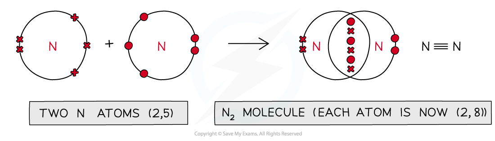
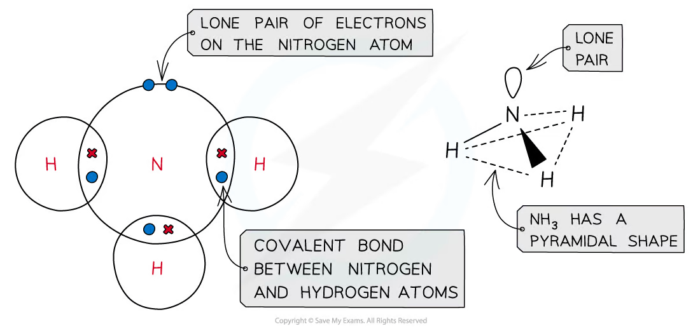
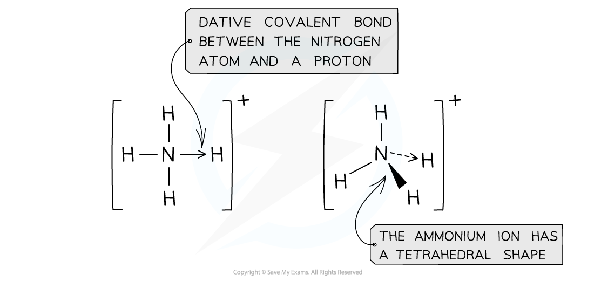
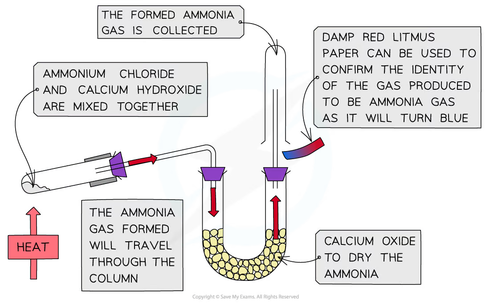
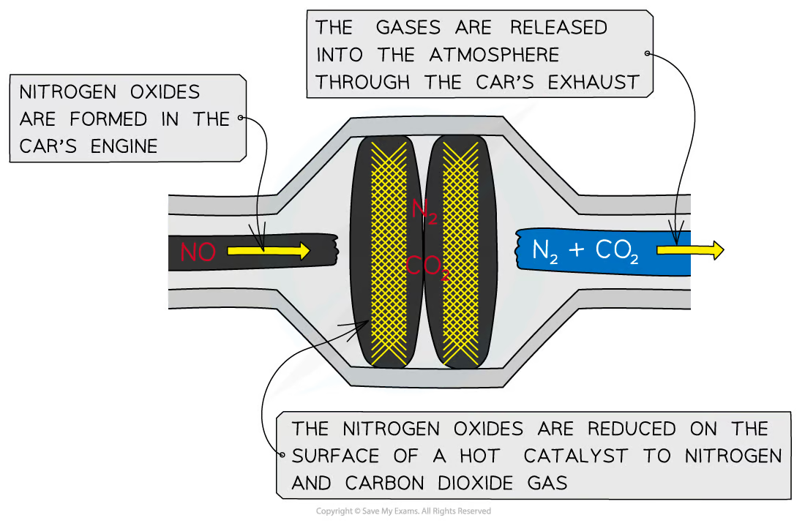
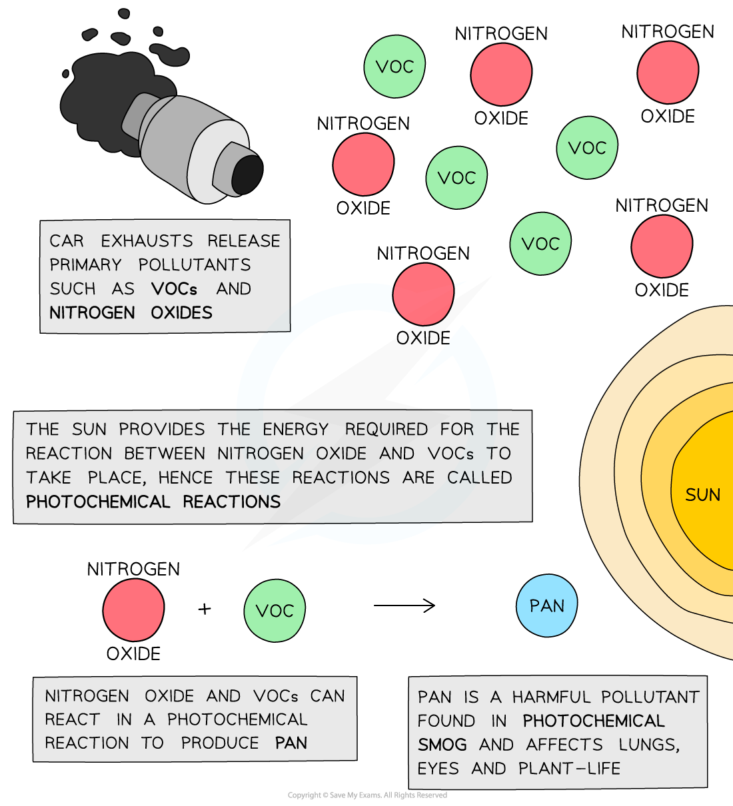
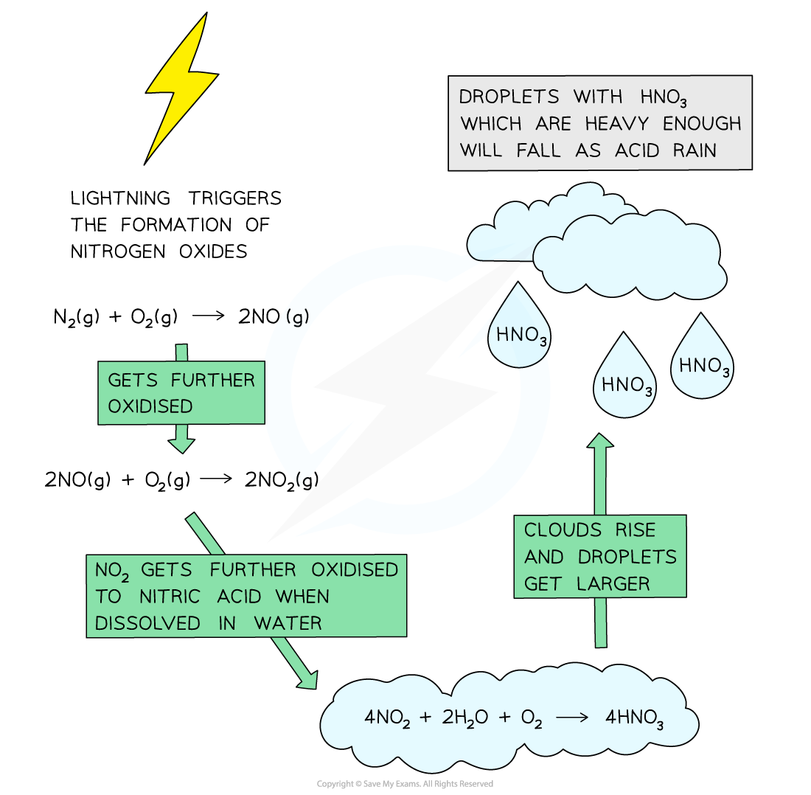
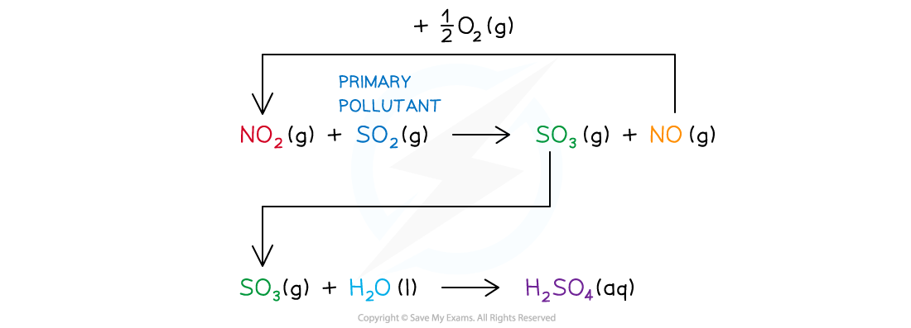

# 12 Nitrogen and sulfur

本章覆盖 nitrogen molecule 的稳定性、ammonia 与 ammonium salts、Haber / nitric acid 相关反应、nitrogen oxides、catalytic converters、photochemical smog、acid rain，以及 sulfur dioxide 在大气中的作用。

## Learning objectives

- explain the strength and non-polarity of the N≡N molecule;
- apply Brønsted–Lowry acid–base theory to ammonia and ammonium ions;
- balance equations for ammonia oxidation and nitrogen-oxide chemistry;
- explain catalytic converters, PAN, photochemical smog and acid rain;
- calculate formulae, oxidation numbers, gas amounts and percentage quantities.

## Key ideas

- N2 is unreactive because it has a strong triple bond and is non-polar.
- NH3 has a lone pair: it is a weak Brønsted–Lowry base, a nucleophile and a ligand; NH4+ is tetrahedral.
- NO and NO2 form at high temperatures in engines. Catalytic converters use redox chemistry to remove NOx, CO and hydrocarbons.
- NOx plus VOCs in sunlight form PAN, a secondary pollutant in photochemical smog.
- NO2 catalyses oxidation of SO2 to SO3; sulfuric and nitric acids formed in air contribute to acid rain.

## 12.1 Nitrogen - Sulfur

Nitrogen is present in air as N2. Each nitrogen atom has five valence electrons. The atoms share three pairs of electrons, forming an N≡N triple bond consisting of one σ bond and two π bonds. Each nitrogen atom also has one lone pair.

The N≡N bond is very short and has a high bond enthalpy, so a large activation energy is needed before nitrogen can react. N2 is also non-polar because the two atoms have identical electronegativity and share bonding electrons equally. It is therefore not strongly attracted to other molecules. These are the two required reasons for its low reactivity.

{.note-figure fig-alt="Formation of an N2 molecule from two nitrogen atoms"}

{.note-figure fig-alt="Orbital overlap and the triple bond in nitrogen"}

At the extreme temperatures in lightning or an internal combustion engine, nitrogen reacts with oxygen:

N2(g) + O2(g) → 2NO(g) 2NO(g) + O2(g) → 2NO2(g)

NO is colourless; NO2 is a brown, toxic gas. In these reactions nitrogen is oxidised from 0 to +2, then from +2 to +4.

## 12.2 Ammonia and ammonium ions

Ammonia is trigonal pyramidal. Nitrogen has three N–H bonding pairs and one lone pair; the lone pair repels more strongly, so the H–N–H bond angle is about 107°, smaller than the tetrahedral angle. The lone pair can be donated to H+, forming a coordinate bond and the ammonium ion:

NH3 + H+ → NH4+

NH4+ is tetrahedral with 109.5° bond angles. After formation, all four N–H bonds have the same length: the coordinate bond is indistinguishable from the other covalent bonds and the positive charge is spread across the ion.

{.note-figure fig-alt="Covalent bonding, lone pair and pyramidal shape of ammonia"}

{.note-figure fig-alt="Dative covalent bond and tetrahedral shape of the ammonium ion"}

Ammonia is a weak Brønsted–Lowry base because it accepts protons only partially in water; the equilibrium lies mainly to the left:

NH3(aq) + H2O(l) ⇌ NH4+(aq) + OH−(aq)

It is also a nucleophile because the nitrogen lone pair can be donated to an electron-deficient atom. Industrially, ammonia is made by the Haber process, N2(g) + 3H2(g) ⇌ 2NH3(g). The reaction is exothermic and produces fewer moles of gas; industry uses a compromise temperature, high pressure, an iron catalyst and continuous removal of NH3.

In the laboratory, heat ammonium chloride and calcium hydroxide:

2NH4Cl(s) + Ca(OH)2(s) → CaCl2(s) + 2NH3(g) + 2H2O(l)

Dry NH3 with CaO, not concentrated H2SO4 or anhydrous CaCl2 because they react with or absorb ammonia. Confirm ammonia by turning damp red litmus paper blue; it also forms dense white fumes with HCl gas.

{.note-figure fig-alt="Laboratory preparation, drying and test of ammonia gas"}

## 12.3 Nitrogen oxides and catalytic converters

NOx means nitrogen oxides, principally NO and NO2. They are primary pollutants released from high-temperature combustion. A catalytic converter provides a large Pt/Rh-coated surface for redox reactions that convert harmful gases into less harmful products:

2NO(g) + 2CO(g) → N2(g) + 2CO2(g) 2CO(g) + O2(g) → 2CO2(g)

CO is oxidised to CO2; NO is reduced to N2. A greater catalyst surface area increases contact and improves removal. Higher engine temperatures increase NO formation because more N2 molecules have sufficient energy to react. Replacing a fossil fuel with hydrogen does not automatically prevent NOx, because the N2 and O2 involved come from air.

{.note-figure fig-alt="Reduction of nitrogen oxides in a catalytic converter"}

## 12.4 Photochemical smog and PAN

Car exhaust supplies NOx and unburnt hydrocarbons/volatile organic compounds (VOCs). These are <strong>primary pollutants</strong> because they are emitted directly. In sunlight they react to form peroxyacetyl nitrate, PAN, which is a <strong>secondary pollutant</strong>. The term <em>photochemical</em> means that light supplies the energy for the reaction.

{.note-figure fig-alt="Photochemical formation of PAN from nitrogen oxides and VOCs"}

PAN and photochemical smog reduce visibility and irritate eyes and the respiratory system; they can also damage plants. Smog is often worse in busy cities on hot, sunny afternoons because both the pollutant concentration and light-driven reaction rate are high.

## 12.5 Sulfur dioxide, nitrogen dioxide and acid rain

SO2 is released when sulfur-containing fuels are burned. It is a respiratory irritant and can be oxidised in the atmosphere. NO2 acts as a homogeneous catalyst because it is consumed in one step and regenerated in the next:

NO2(g) + SO2(g) ⇌ NO(g) + SO3(g) &nbsp; ΔH = −168 kJ mol−1 NO(g) + ½O2(g) → NO2(g) SO3(g) + H2O(l) → H2SO4(aq)

As the first reaction is exothermic, lower atmospheric temperature favours the forward direction. Nitrogen dioxide can also form nitric acid directly:

4NO2(g) + 2H2O(l) + O2(g) → 4HNO3(aq)

{.note-figure fig-alt="Formation of nitric acid from nitrogen oxides and acid rain"}

{.note-figure fig-alt="Nitrogen dioxide catalytic cycle leading to sulfuric acid"}

H2SO4 and HNO3 in rain acidify lakes and soil, harm aquatic organisms, corrode metals and react with carbonate building materials. For example, CaCO3 + H2SO4 → CaSO4 + CO2 + H2O.

## 12.6 Fertilisers and exam connections

Ammonium nitrate and ammonium sulfate supply nitrogen for plant growth. Ammonium salts must not be mixed with alkaline lime: OH− removes a proton from NH4+ and ammonia escapes, reducing fertiliser effectiveness:

NH4+(aq) + OH−(aq) → NH3(g) + H2O(l)

Excess nitrate fertiliser can contaminate water and cause eutrophication. In nitrogen–sulfur redox questions, first balance the equation, then assign oxidation numbers and identify which species is oxidised and reduced. Finally connect the reaction to the named environmental effect.

## Multiple choice questions

::: {.mc-question #ns-mc-01 data-answer="D"}
### Question 1 · 2.4 Choice Easy Q1

Which gas is present in the largest proportion in exhaust fumes of a car engine?

<button class="mc-choice" data-choice="A"><strong>A</strong>Carbon monoxide</button><button class="mc-choice" data-choice="B"><strong>B</strong>Carbon dioxide</button><button class="mc-choice" data-choice="C"><strong>C</strong>Water vapour</button><button class="mc-choice" data-choice="D"><strong>D</strong>Nitrogen</button>

<button class="check-answer">Check answer</button>

Show explanation

<strong>D.</strong> Nitrogen is the major component of the air drawn into the engine.

:::

::: {.mc-question #ns-mc-02 data-answer="A"}
### Question 2 · 2.4 Choice Easy Q2

Oxidation of ammonia by oxygen: wO2 + xNH3 → yNO + zH2O. Which values balance the equation?

<button class="mc-choice" data-choice="A"><strong>A</strong>w=5, x=4, y=4, z=6</button><button class="mc-choice" data-choice="B"><strong>B</strong>w=6, x=4, y=4, z=5</button><button class="mc-choice" data-choice="C"><strong>C</strong>w=6, x=5, y=5, z=4</button><button class="mc-choice" data-choice="D"><strong>D</strong>w=5, x=6, y=6, z=4</button>

<button class="check-answer">Check answer</button>

Show explanation

<strong>A.</strong> 4NH3 + 5O2 → 4NO + 6H2O.

:::

::: {.mc-question #ns-mc-03 data-answer="C"}
### Question 3 · 2.4 Choice Easy Q3

Using the Brønsted–Lowry theory, how is ammonia correctly described?

<button class="mc-choice" data-choice="A"><strong>A</strong>Neutral</button><button class="mc-choice" data-choice="B"><strong>B</strong>Acid</button><button class="mc-choice" data-choice="C"><strong>C</strong>Base</button><button class="mc-choice" data-choice="D"><strong>D</strong>Amphoteric</button>

<button class="check-answer">Check answer</button>

Show explanation

<strong>C.</strong> Ammonia accepts a proton to form NH4+.

:::

::: {.mc-question #ns-mc-04 data-answer="A"}
### Question 4 · 2.4 Choice Easy Q4

Which statement correctly describes an ammonium ion, NH4+?

<button class="mc-choice" data-choice="A"><strong>A</strong>The bonds are all the same length.</button><button class="mc-choice" data-choice="B"><strong>B</strong>All bond angles are 107°.</button><button class="mc-choice" data-choice="C"><strong>C</strong>Ammonium ions are unreactive with NaOH(aq).</button><button class="mc-choice" data-choice="D"><strong>D</strong>Ammonium ions form when ammonia behaves as an acid.</button>

<button class="check-answer">Check answer</button>

Show explanation

<strong>A.</strong> The coordinate bond formed initially becomes equivalent to the other N–H bonds.

:::

::: {.mc-question #ns-mc-05 data-answer="B"}
### Question 5 · 2.4 Choice Easy Q5

Which reaction takes place in the atmosphere?

<button class="mc-choice" data-choice="A"><strong>A</strong>NO2 is reduced to NO by CO.</button><button class="mc-choice" data-choice="B"><strong>B</strong>NO2 is reduced to NO by SO2.</button><button class="mc-choice" data-choice="C"><strong>C</strong>SO2 is oxidised to SO3 by CO2.</button><button class="mc-choice" data-choice="D"><strong>D</strong>CO is spontaneously oxidised to CO2.</button>

<button class="check-answer">Check answer</button>

Show explanation

<strong>B.</strong> SO2 reduces NO2 to NO while being oxidised toward sulfur oxides.

:::

::: {.mc-question #ns-mc-06 data-answer="D"}
### Question 6 · 2.4 Choice Easy Q6

Which reaction in a catalytic converter does not remove hazardous and polluting gases from exhaust fumes?

<button class="mc-choice" data-choice="A"><strong>A</strong>CO + O2 → CO2</button><button class="mc-choice" data-choice="B"><strong>B</strong>CO + NOx → CO2 + N2</button><button class="mc-choice" data-choice="C"><strong>C</strong>HC + NOx → H2O + CO2 + N2</button><button class="mc-choice" data-choice="D"><strong>D</strong>HC + NOx → H2O + CO + N2</button>

<button class="check-answer">Check answer</button>

Show explanation

<strong>D.</strong> The last reaction produces carbon monoxide, which is itself a pollutant.

:::

::: {.mc-question #ns-mc-07 data-answer="C"}
### Question 7 · 2.4 Choice Easy Q7

Phosphorus forms PCl5, but nitrogen cannot form NCl5. Why? 1. Nitrogen is almost inert. 2. Nitrogen cannot have oxidation state +5. 3. Nitrogen's outer shell can contain only eight electrons.

<button class="mc-choice" data-choice="A"><strong>A</strong>1 only</button><button class="mc-choice" data-choice="B"><strong>B</strong>1 and 2</button><button class="mc-choice" data-choice="C"><strong>C</strong>3 only</button><button class="mc-choice" data-choice="D"><strong>D</strong>1, 2 and 3</button>

<button class="check-answer">Check answer</button>

Show explanation

<strong>C.</strong> Nitrogen is a Period 2 element and cannot expand its octet.

:::

::: {.mc-question #ns-mc-08 data-answer="A"}
### Question 8 · 2.4 Choice Easy Q8

Which statement about ammonium nitrate fertiliser is not correct?

<button class="mc-choice" data-choice="A"><strong>A</strong>It is insoluble in water.</button><button class="mc-choice" data-choice="B"><strong>B</strong>It consists of 35% nitrogen by mass.</button><button class="mc-choice" data-choice="C"><strong>C</strong>It can cause environmental problems.</button><button class="mc-choice" data-choice="D"><strong>D</strong>Nitric acid is used in its manufacture.</button>

<button class="check-answer">Check answer</button>

Show explanation

<strong>A.</strong> Ammonium nitrate is soluble in water, so statement A is incorrect.

:::

::: {.mc-question #ns-mc-09 data-answer="B"}
### Question 9 · 2.4 Choice Easy Q9

Which environmental problem is not made worse by nitrogen oxides in car exhaust fumes?

<button class="mc-choice" data-choice="A"><strong>A</strong>Photochemical smog</button><button class="mc-choice" data-choice="B"><strong>B</strong>The hole in the ozone layer</button><button class="mc-choice" data-choice="C"><strong>C</strong>Corrosion of buildings</button><button class="mc-choice" data-choice="D"><strong>D</strong>Acidification of lakes</button>

<button class="check-answer">Check answer</button>

Show explanation

<strong>B.</strong> Nitrogen oxides contribute to smog, acid rain and corrosion, but are not the direct cause of the ozone hole.

:::

::: {.mc-question #ns-mc-10 data-answer="B"}
### Question 10 · 2.4 Choice Easy Q10

Which transformations involve sulfur dioxide under atmospheric conditions? 1. NO2 to NO 2. NO to NO2 3. CO to CO2

<button class="mc-choice" data-choice="A"><strong>A</strong>1 only</button><button class="mc-choice" data-choice="B"><strong>B</strong>1 and 2</button><button class="mc-choice" data-choice="C"><strong>C</strong>2 and 3</button><button class="mc-choice" data-choice="D"><strong>D</strong>1, 2 and 3</button>

<button class="check-answer">Check answer</button>

Show explanation

<strong>B.</strong> SO2 participates in the catalytic cycle involving NO2 and NO; it does not catalyse CO oxidation here.

:::

::: {.mc-question #ns-mc-11 data-answer="D"}
### Question 11 · 2.4 Choice Medium Q1

What happens when silver chloride dissolves in aqueous ammonia? 1. Ammonia forms a complex with Ag+. 2. A redox reaction occurs. 3. Ammonia acts as a Brønsted–Lowry base.

<button class="mc-choice" data-choice="A"><strong>A</strong>1, 2 and 3</button><button class="mc-choice" data-choice="B"><strong>B</strong>1 and 2</button><button class="mc-choice" data-choice="C"><strong>C</strong>2 and 3</button><button class="mc-choice" data-choice="D"><strong>D</strong>1 only</button>

<button class="check-answer">Check answer</button>

Show explanation

<strong>D.</strong> AgCl dissolves by complex formation; there is no redox reaction and no proton transfer.

:::

::: {.mc-question #ns-mc-12 data-answer="B"}
### Question 12 · 2.4 Choice Medium Q2

O2 has bond length 1.21 Å and N2 has bond length 1.09 Å. What best explains the difference?

<button class="mc-choice" data-choice="A"><strong>A</strong>Oxygen atoms are more electronegative.</button><button class="mc-choice" data-choice="B"><strong>B</strong>Nitrogen has more bonding electrons.</button><button class="mc-choice" data-choice="C"><strong>C</strong>Nitrogen has a smaller atomic radius.</button><button class="mc-choice" data-choice="D"><strong>D</strong>The oxygen bond is stronger.</button>

<button class="check-answer">Check answer</button>

Show explanation

<strong>B.</strong> N2 has a triple bond, whereas O2 has a double bond; the stronger bond is shorter.

:::

::: {.mc-question #ns-mc-13 data-answer="B"}
### Question 13 · 2.4 Choice Medium Q3

Which statement about ammonia is completely correct?

<button class="mc-choice" data-choice="A"><strong>A</strong>Ammonia acts as a nucleophile by accepting an electron pair from bromoethane.</button><button class="mc-choice" data-choice="B"><strong>B</strong>Ammonia can form a coordinate bond with H+ to form NH4+.</button><button class="mc-choice" data-choice="C"><strong>C</strong>Ammonia is a base and accepts hydroxide ions.</button><button class="mc-choice" data-choice="D"><strong>D</strong>Ammonia is pyramidal with bond angles of 109.5°.</button>

<button class="check-answer">Check answer</button>

Show explanation

<strong>B.</strong> The lone pair on ammonia forms a coordinate bond to a proton.

:::

::: {.mc-question #ns-mc-14 data-answer="C"}
### Question 14 · 2.4 Choice Medium Q4

Photochemical smog is produced when 1 acts on 2 and 3. Which row is correct?

<button class="mc-choice" data-choice="A"><strong>A</strong>Heat / nitrogen / oxygen</button><button class="mc-choice" data-choice="B"><strong>B</strong>Sunlight / nitrogen oxides / sulfur oxides</button><button class="mc-choice" data-choice="C"><strong>C</strong>Sunlight / nitrogen oxides / hydrocarbons</button><button class="mc-choice" data-choice="D"><strong>D</strong>Heat / hydrocarbons / oxygen</button>

<button class="check-answer">Check answer</button>

Show explanation

<strong>C.</strong> Sunlight drives reactions between nitrogen oxides and unburnt hydrocarbons.

:::

::: {.mc-question #ns-mc-15 data-answer="C"}
### Question 15 · 2.4 Choice Medium Q5

Lime and ammonium nitrate cannot be used in a mixed form because, if damp:

<button class="mc-choice" data-choice="A"><strong>A</strong>Ca(NO3)2 is produced.</button><button class="mc-choice" data-choice="B"><strong>B</strong>The dry mixture is explosive.</button><button class="mc-choice" data-choice="C"><strong>C</strong>Ammonia is given off.</button><button class="mc-choice" data-choice="D"><strong>D</strong>Nitric acid forms.</button>

<button class="check-answer">Check answer</button>

Show explanation

<strong>C.</strong> An alkaline compound releases ammonia from the ammonium ion.

:::

::: {.mc-question #ns-mc-16 data-answer="C"}
### Question 16 · 2.4 Choice Medium Q6

In which reactions does the product turn damp litmus paper blue? 1. NH4NO3 + O2 2. NH4Cl + NaOH 3. NH3 + H2O

<button class="mc-choice" data-choice="A"><strong>A</strong>1 only</button><button class="mc-choice" data-choice="B"><strong>B</strong>1 and 2</button><button class="mc-choice" data-choice="C"><strong>C</strong>2 and 3</button><button class="mc-choice" data-choice="D"><strong>D</strong>1, 2 and 3</button>

<button class="check-answer">Check answer</button>

Show explanation

<strong>C.</strong> Reactions 2 and 3 produce ammonia or an alkaline solution.

:::

::: {.mc-question #ns-mc-17 data-answer="A"}
### Question 17 · 2.4 Choice Medium Q7

Atmospheric oxides and unburned hydrocarbons produce PAN. Which is unaffected by this reaction? 1. Corrosion of architecture 2. Lung irritation and difficulty breathing 3. Reduction of air clarity

<button class="mc-choice" data-choice="A"><strong>A</strong>1 only</button><button class="mc-choice" data-choice="B"><strong>B</strong>1 and 2</button><button class="mc-choice" data-choice="C"><strong>C</strong>2 only</button><button class="mc-choice" data-choice="D"><strong>D</strong>2 and 3</button>

<button class="check-answer">Check answer</button>

Show explanation

<strong>A.</strong> PAN affects respiratory health and visibility; architectural corrosion is associated with acid rain rather than PAN formation.

:::

::: {.mc-question #ns-mc-18 data-answer="C"}
### Question 18 · 2.4 Choice Medium Q8

8NH3 + 3Cl2 → N2 + 6NH4Cl. Which statements are correct? 1. Ammonia behaves as a reducing agent. 2. The oxidation number of hydrogen changes. 3. Ammonia behaves as a base.

<button class="mc-choice" data-choice="A"><strong>A</strong>1 only</button><button class="mc-choice" data-choice="B"><strong>B</strong>1 and 2</button><button class="mc-choice" data-choice="C"><strong>C</strong>1 and 3</button><button class="mc-choice" data-choice="D"><strong>D</strong>1, 2 and 3</button>

<button class="check-answer">Check answer</button>

Show explanation

<strong>C.</strong> Nitrogen in ammonia is oxidised, while hydrogen keeps oxidation number +1; ammonia also acts as a base in acid–base chemistry.

:::

::: {.mc-question #ns-mc-19 data-answer="C"}
### Question 19 · 2.4 Choice Hard Q1

Which reaction in a car exhaust has the highest enthalpy change?

<button class="mc-choice" data-choice="A"><strong>A</strong>S + O2 → SO2</button><button class="mc-choice" data-choice="B"><strong>B</strong>CH4 + 2O2 → CO2 + 2H2O</button><button class="mc-choice" data-choice="C"><strong>C</strong>N2 + O2 → 2NO</button><button class="mc-choice" data-choice="D"><strong>D</strong>2NO + O2 → 2NO2</button>

<button class="check-answer">Check answer</button>

Show explanation

<strong>C.</strong> Breaking the strong N≡N bond makes formation of NO strongly endothermic.

:::

::: {.mc-question #ns-mc-20 data-answer="B"}
### Question 20 · 2.4 Choice Hard Q2

Which reaction using ammonia does not involve the nitrogen atom's non-bonding electron pair?

<button class="mc-choice" data-choice="A"><strong>A</strong>2NH3 + Ag+ → [Ag(NH3)2]+</button><button class="mc-choice" data-choice="B"><strong>B</strong>2NH3 + 2Na → 2NaNH2 + H2</button><button class="mc-choice" data-choice="C"><strong>C</strong>NH3 + HCl → NH4Cl</button><button class="mc-choice" data-choice="D"><strong>D</strong>NH3 + CH3I → CH3NH3I</button>

<button class="check-answer">Check answer</button>

Show explanation

<strong>B.</strong> In the reaction with sodium, the N–H bond is deprotonated while the lone pair is retained.

:::

## Structured questions

::: {.question-card #ns-sq-01}
### Question 1 · 2.4 SQ Easy Q1

<strong>(a)</strong> Extreme conditions are required to synthesise ammonia from nitrogen in the Haber process due to the lack of reactivity of the nitrogen molecule. Give two reasons for the lack of reactivity of the nitrogen molecule, N2.

<strong>(b)</strong> Under conditions of high temperature, nitrogen and oxygen react together to give oxides of nitrogen.

<strong>(i)</strong> Write an equation for a possible reaction between nitrogen and oxygen.

<strong>(ii)</strong> State two situations, one natural and one as a result of human activities, in which nitrogen and oxygen react together.

<strong>(iii)</strong> State the two main environmental effects of the presence of nitrogen oxides in the atmosphere.

<strong>(c)</strong>

<strong>(i)</strong> State how nitrogen monoxide is removed from the exhaust gases of motor vehicles.

<strong>(ii)</strong> Write an equation for this process. [9 marks]

Show mark scheme / model answer
<ol><li><strong>Lack of reactivity:</strong> N2 contains a strong N≡N triple bond with a high bond enthalpy, so considerable energy is needed to break it. The molecule is also non-polar, so it is not strongly attracted to other molecules.</li><li><strong>(b)(i)</strong> A valid balanced equation is N2(g) + O2(g) → 2NO(g). The alternative  N2(g) + 2O2(g) → 2NO2(g) is also balanced.</li><li><strong>(b)(ii)</strong> Natural situation: lightning. Human activity: combustion in a car or aeroplane engine, or burning fuels in a power station.</li><li><strong>(b)(iii)</strong> Nitrogen oxides contribute to photochemical smog and acid rain.</li><li><strong>(c)(i)</strong> Pass the exhaust gases over a hot catalyst in a catalytic converter, usually containing platinum/rhodium.</li><li><strong>(c)(ii)</strong> 2NO(g) + 2CO(g) → N2(g) + 2CO2(g). Nitrogen monoxide is reduced and carbon monoxide is oxidised.</li></ol>

:::

::: {.question-card #ns-sq-02}
### Question 2 · 2.4 SQ Easy Q2

<strong>(a)</strong> Nitrogen oxides can react with substances in the air to make secondary pollutants. One of these secondary pollutants is peroxyacetyl nitrate, commonly known as PAN.

<strong>(i)</strong> State the type of compounds that react with nitrogen oxides to form PAN.

<strong>(ii)</strong> PAN is one of the components found in photochemical smog. Explain why the term photochemical is used to describe smog.

<strong>(b)</strong> One of the main reasons for reducing the amounts of oxides of nitrogen in the atmosphere is their contribution to the formation of acid rain.

<strong>(i)</strong> Write an equation for the formation of nitric acid from nitrogen dioxide, NO2, in the atmosphere.

<strong>(ii)</strong> State the role that nitrogen dioxide, NO2, plays in the oxidation of atmospheric sulfur dioxide, SO2, to form acid rain.

<strong>(c)</strong> State the oxidation number of nitrogen in nitrogen monoxide, NO, and nitrogen dioxide, NO2. [7 marks]

Show mark scheme / model answer
<ol><li><strong>(a)(i)</strong> Unburnt hydrocarbons, also called volatile organic compounds (VOCs), react with nitrogen oxides.</li><li><strong>(a)(ii)</strong> The reactions are initiated or driven by sunlight, so the resulting smog is described as photochemical.</li><li><strong>(b)(i)</strong> 4NO2(g) + 2H2O(l) + O2(g) → 4HNO3(aq).</li><li><strong>(b)(ii)</strong> NO2 acts as a homogeneous catalyst. It reacts with SO2 to form SO3 and NO, then NO is oxidised back to NO2: NO2 + SO2 → NO + SO3; NO + ½O2 → NO2. The regenerated NO2 can repeat the cycle, while SO3 forms sulfuric acid with water.</li><li><strong>(c)</strong> N in NO is +2; N in NO2 is +4.</li></ol>

:::

::: {.question-card #ns-sq-03}
### Question 3 · 2.4 SQ Easy Q3

<strong>(a)</strong> Ammonium sulfate is a fertiliser which is manufactured by the reaction between ammonia and sulfuric acid. Ammonia is described as a weak base and sulfuric acid as a strong acid. By using an equation, explain clearly why ammonia can be described as a weak base.

<strong>(b)</strong>

<strong>(i)</strong> Write the equation for the neutralisation of aqueous ammonia by dilute sulfuric acid.

<strong>(ii)</strong> State the bond angles between N–H bonds in ammonia and the ammonium ion. Explain any differences.

<strong>(c)</strong> Ammonia can be displaced from an ammonium salt by an acid–base reaction. One such reaction is between ammonium chloride and calcium hydroxide.

<strong>(i)</strong> Write the equation for the reaction between ammonium chloride and calcium hydroxide.

<strong>(ii)</strong> Explain how the presence of ammonia gas can be confirmed. [10 marks]

Show mark scheme / model answer
<ol><li><strong>(a)</strong> NH3 accepts a proton only partially in water: NH3(aq) + H2O(l) ⇌ NH4+(aq) + OH−(aq). The equilibrium lies mainly to the left, so only a small proportion of ammonia molecules form NH4+ and OH−; this is why ammonia is a weak base.</li><li><strong>(b)(i)</strong> 2NH3(aq) + H2SO4(aq) → (NH4)2SO4(aq).</li><li><strong>(b)(ii)</strong> NH3 is trigonal pyramidal with an angle of about 107°. NH4+ is tetrahedral with bond angles of 109.5°. In NH3, the lone pair exerts greater repulsion than a bonding pair and compresses the H–N–H angle. NH4+ has four bonding pairs and no lone pair, so the angle is 109.5°.</li><li><strong>(c)(i)</strong> 2NH4Cl(s) + Ca(OH)2(s) → CaCl2(s) + 2NH3(g) + 2H2O(l).</li><li><strong>(c)(ii)</strong> Hold damp red litmus paper in the gas; it turns blue. Alternatively, ammonia gives dense white fumes when mixed with hydrogen chloride gas.</li></ol>

:::

::: {.question-card #ns-sq-04}
### Question 4 · 2.4 SQ Medium Q1

Under conditions of high temperature, nitrogen and oxygen react together to give oxides of nitrogen.

<strong>(a)(i)</strong> Draw the dot-and-cross diagram of a molecule of nitrogen.

<strong>(a)(ii)</strong> Suggest and explain why high temperatures are required for oxides of nitrogen to form.

<strong>(b)(i)</strong> Write an equation for a possible reaction between nitrogen and oxygen.

<strong>(b)(ii)</strong> The bond enthalpy of nitrogen is +1000 kJ mol−1. Suggest the bond enthalpy of oxygen. Possible bond enthalpy of oxygen: ______ kJ mol−1.

<strong>(c)(i)</strong> State two situations, one natural and one as a result of human activities, in which nitrogen and oxygen react together.

<strong>(c)(ii)</strong> State two environmental effects of the presence of nitrogen oxides in the atmosphere.

<strong>(d)</strong> N2O5 is a rare and unstable oxide of nitrogen. State the systematic name of N2O5. [12 marks]

Show mark scheme / model answer
<ol><li><strong>(a)(i)</strong> Show three shared pairs of electrons between the two nitrogen atoms, giving an N≡N triple bond, and one lone pair on each nitrogen atom. Every nitrogen atom must have eight electrons in its outer shell.</li><li><strong>(a)(ii)</strong> Nitrogen is very unreactive because of its strong triple bond, which has a high bond enthalpy and requires much energy to break. N2 is also non-polar and is not strongly attracted to other molecules.</li><li><strong>(b)(i)</strong> N2(g) + O2(g) → 2NO(g).</li><li><strong>(b)(ii)</strong> The O=O bond enthalpy should be positive but less than +1000 kJ mol−1, because the oxygen double bond is weaker than the nitrogen triple bond.</li><li><strong>(c)(i)</strong> Natural: lightning. Human activity: combustion in an engine or burning fossil fuels in a power station.</li><li><strong>(c)(ii)</strong> Formation of acid rain and photochemical smog.</li><li><strong>(d)</strong> Nitrogen(V) oxide. In N2O5, oxygen contributes −10 overall, so the two nitrogen atoms contribute +10 and each nitrogen is +5.</li></ol>

:::

::: {.question-card #ns-sq-05}
### Question 5 · 2.4 SQ Medium Q2

Nitrogen oxides in the atmosphere are homogeneous catalysts in the formation of acid rain.

<strong>(a)</strong> What is meant by the following terms?

<strong>Catalyst:</strong> ________________________________

<strong>Homogeneous:</strong> ________________________________

<strong>(b)</strong> State a major source of nitrogen oxides in the atmosphere, explaining how they are formed.

<strong>(c)</strong> Use equations to describe the chemical role played by nitrogen oxides in the formation of acid rain.

<strong>(d)</strong> Use the following axes in Fig. 1.1 to draw a fully labelled reaction pathway diagram showing the effect of a catalyst on an exothermic reaction. Label the ΔH and Ea values. [11 marks]

Show mark scheme / model answer
<ol><li><strong>(a)</strong> A catalyst increases the rate of a reaction by providing an alternative pathway with a lower activation energy, and is regenerated/not used up. Homogeneous means the catalyst and reactants are in the same phase.</li><li><strong>(b)</strong> A major source is car engines, aircraft engines or power stations. At high temperature, nitrogen and oxygen from air react: N2(g) + O2(g) → 2NO(g), followed by 2NO(g) + O2(g) → 2NO2(g).</li><li><strong>(c)</strong> NO2 + SO2 → NO + SO3; NO + ½O2 → NO2; SO3 + H2O → H2SO4. The NO2 is regenerated and therefore catalyses the oxidation of SO2. An acceptable direct acid-rain equation is 4NO2 + 2H2O + O2 → 4HNO3.</li><li><strong>(d)</strong> Draw two pathways from the same reactants to the same products. The uncatalysed pathway has a higher peak; the catalysed pathway has a lower peak. Label Ea from the reactants to each peak and ΔH from reactants to products. For an exothermic reaction, products are at lower energy and ΔH is negative.</li></ol>

:::

::: {.question-card #ns-sq-06}
### Question 6 · 2.4 SQ Medium Q3

Ammonia, NH3, is a colourless, pungent-smelling gas that has been known to man from the beginning of recorded time. Now ammonia is synthesised from its elements in the Haber process.

<strong>(a)(i)</strong> Write an equation for this process.

<strong>(a)(ii)</strong> State the three usual operating conditions of the Haber process.

<strong>(b)</strong> Ammonia can act as a Brønsted–Lowry base. Explain why.

<strong>(c)</strong> 1.50 dm3 of ammonia gas were dissolved in water to form 300 cm3 of aqueous alkali at room temperature and pressure.

<strong>(i)</strong> Calculate how many moles of NH3(g) were dissolved. Show your working.

<strong>(ii)</strong> Write the equation for the neutralisation of aqueous ammonia by dilute sulfuric acid.

<strong>(iii)</strong> Calculate the volume of 0.80 mol dm−3 sulfuric acid that is required to neutralise the 300 cm3 of aqueous ammonia. Show your working.

<strong>(d)(i)</strong> In the boxes below, draw diagrams to show the shapes of an ammonia molecule and an ammonium ion. Clearly show the bond angles on your diagrams.

<strong>(ii)</strong> State the name of the shape of an ammonia molecule and an ammonium ion. [14 marks]

Show mark scheme / model answer
<ol><li><strong>(a)(i)</strong> N2(g) + 3H2(g) ⇌ 2NH3(g).</li><li><strong>(a)(ii)</strong> The usual compromise conditions are about 450 °C, about 200 atm, and an iron catalyst.</li><li><strong>(b)</strong> NH3 has a lone pair on nitrogen which it donates to H+; therefore it accepts a proton and is a Brønsted–Lowry base. For example, NH3 + H+ → NH4+.</li><li><strong>(c)(i)</strong> At RTP, n = V / Vm = 1.50 / 24.0 = <strong>0.0625 mol</strong> NH3.</li><li><strong>(c)(ii)</strong> 2NH3(aq) + H2SO4(aq) → (NH4)2SO4(aq).</li><li><strong>(c)(iii)</strong> The mole ratio NH3 : H2SO4 is 2 : 1, so n(H2SO4) = 0.0625 / 2 = 0.03125 mol. V = n/c = 0.03125 / 0.80 = 0.03906 dm3 = <strong>39.1 cm3</strong>.</li><li><strong>(d)</strong> NH3 is trigonal pyramidal with H–N–H angles of about 107°. NH4+ is tetrahedral with angles of 109.5°. The lone pair in NH3 repels bonding pairs more strongly and compresses the angle; NH4+ has four bonding pairs and no lone pair.</li></ol>

:::

::: {.question-card #ns-sq-07}
### Question 7 · 2.4 SQ Medium Q4

<strong>(a)</strong> The high temperatures reached in an internal combustion engine cause nitrogen and oxygen from the air to react. Nitrogen monoxide is formed.

<strong>(i)</strong> Give the equation for this reaction.

<strong>(ii)</strong> Show, using oxidation numbers, that nitrogen has been oxidised.

<strong>(iii)</strong> Nitrogen monoxide will react further with oxygen to form nitrogen dioxide. Give the equation for this oxidation reaction.

<strong>(b)</strong> Nitrogen oxides play a role in the formation of photochemical smog. Explain how.

<strong>(c)</strong> The brown haze associated with photochemical smog is typically worse in cities in the afternoons of hot sunny days. Suggest why.

<strong>(d)</strong> Catalytic converters are fitted to exhaust systems to reduce the pollutants emitted by car engines. Nitrogen oxide, NO, and carbon monoxide, CO, are removed in a catalytic converter, forming nitrogen and carbon dioxide, which are less harmful to human health.

<strong>(i)</strong> Give the balanced symbol equation for the removal of NO and CO.

<strong>(ii)</strong> State, using oxidation numbers, what is acting as a reducing agent in this reaction. [12 marks]

Show mark scheme / model answer
<ol><li><strong>(a)(i)</strong> N2(g) + O2(g) → 2NO(g).</li><li><strong>(a)(ii)</strong> Nitrogen is 0 in N2 and +2 in NO, so its oxidation number increases from 0 to +2. Nitrogen has therefore been oxidised.</li><li><strong>(a)(iii)</strong> 2NO(g) + O2(g) → 2NO2(g).</li><li><strong>(b)</strong> Nitrogen oxides react with unburnt hydrocarbons/VOCs in the presence of sunlight to form secondary pollutants such as PAN. These pollutants contribute to photochemical smog.</li><li><strong>(c)</strong> Higher temperature increases reaction rates and strong sunlight provides energy for the photochemical reactions. Pollutants accumulate in cities, where traffic supplies NOx and hydrocarbons, producing the brown haze.</li><li><strong>(d)(i)</strong> 2NO(g) + 2CO(g) → N2(g) + 2CO2(g).</li><li><strong>(d)(ii)</strong> CO is the reducing agent: carbon in CO increases from +2 to +4 in CO2, so CO is oxidised while NO is reduced to N2.</li></ol>

:::

::: {.question-card #ns-sq-hard-q1}
### Question 8 · 2.4 SQ Hard Q1

The combustion of fuels in motor vehicles, trains, aeroplanes and power stations produces the pollutant gas NO2.

<strong>(a)</strong> Write an equation to show how NO2 is formed in these situations.

<strong>(b)(i)</strong> State how NO2 is removed from the exhaust gases of motor vehicles.

<strong>(b)(ii)</strong> Write an equation for this process.

<strong>(c)</strong> Suggest whether production of the pollutant NO2 would be reduced if fossil fuels were replaced by hydrogen as a fuel for combustion. Explain your answer.

<strong>(d)</strong> In the atmosphere, NO2 acts as a catalyst for the oxidation of SO2 to SO3.

NO2(g) SO2(g) + ½O2(g) ⇌ SO3(g)

<strong>(i)</strong> What is the environmental significance of this reaction?

The oxidation takes place in two steps. The initial reaction is between NO2 and SO2.

Reaction 1: NO2(g) + SO2(g) ⇌ NO(g) + SO3(g) &nbsp; ΔH = −168 kJ mol−1

<strong>(ii)</strong> Write an equation to show how the NO2 is regenerated in the second step of the oxidation.

<strong>(iii)</strong> The temperature of the atmosphere decreases with height. Explain how this will affect the position of the equilibrium in reaction 1. [4 marks]

Show mark scheme / model answer
<ul><li>N2(g) + 2O2(g) → 2NO2(g), or N2 + O2 → 2NO followed by 2NO + O2 → 2NO2.</li><li>Use a catalytic converter with a hot Pt/Rh catalyst. For example: 2NO2 + 4CO → N2 + 4CO2.</li><li>Replacing the fuel does not necessarily reduce NO2, because nitrogen and oxygen come from air and react at the high engine temperature.</li><li>SO3 reacts with water to form sulfuric acid and contributes to acid rain. NO2 is regenerated by NO + ½O2 → NO2. The first oxidation step is exothermic, so lowering temperature shifts its equilibrium to the right.</li></ul>

:::

::: {.question-card #ns-sq-hard-q2}
### Question 9 · 2.4 SQ Hard Q2

This question is about ammonia.

<strong>(a)(i)</strong> Explain how ammonia can be prepared from ammonium chloride and calcium hydroxide.

<strong>(a)(ii)</strong> Explain how the presence of ammonia gas can be confirmed.

<strong>(b)</strong> Explain why the reaction between ammonium chloride and calcium hydroxide is an example of an acid–base reaction.

<strong>(c)(i)</strong> Draw a diagram of the ammonium ion showing all of the bonds within the molecule.

<strong>(c)(ii)</strong> The N–H bonds in the ammonium ion have been found to be equal in length. Suggest what this means about the bonds or charge on the ion. [8 marks]

Show mark scheme / model answer
<ul><li>Mix and warm solid NH4Cl and solid Ca(OH)2, then dry the ammonia with CaO: 2NH4Cl + Ca(OH)2 → CaCl2 + 2NH3 + 2H2O.</li><li>Ammonia turns damp red litmus paper blue; white fumes form when it meets HCl.</li><li>NH4+ is an acid because NH4+ donates H+; OH− is a base because it accepts H+ to form water.</li><li>The ion is tetrahedral with one coordinate N→H bond initially. After formation, all four N–H bonds are equivalent and the positive charge is delocalised over the ion.</li></ul>

:::

::: {.question-card #ns-sq-hard-q3}
### Question 10 · 2.4 SQ Hard Q3

A molecule of nitrogen will only react with oxygen under extreme conditions due to the strong triple bond between nitrogen atoms.

<strong>(a)(i)</strong> State another reason why the nitrogen molecule is so unreactive.

<strong>(a)(ii)</strong> State the type of covalent bonds that exist between the two nitrogen atoms.

<strong>(b)(i)</strong> Write three equations to show the formation of nitrogen(II) oxide, nitrogen(IV) oxide and dilute nitric acid. Include state symbols.

<strong>(b)(ii)</strong> Identify the changes in oxidation number of nitrogen in each reaction and use this to state if nitrogen is oxidised or reduced in each reaction.

<strong>(c)</strong> A car travelled one kilometre and released 0.23 g of an oxide of nitrogen, NxOy, which occupies 120 cm3. Calculate x and y. Assume 1 mol of gas molecules occupies 24.0 dm3. [12 marks]

Show mark scheme / model answer
<ul><li>N2 is non-polar. The N≡N triple covalent bond contains one sigma bond and two pi bonds.</li><li>Step 1: N2(g) + O2(g) → 2NO(g). Step 2: 2NO(g) + O2(g) → 2NO2(g). Step 3: 4NO2(g) + 2H2O(l) + O2(g) → 4HNO3(aq).</li><li>N changes 0 to +2 in step 1, +2 to +4 in step 2 and +4 to +5 in the nitric-acid formation step; nitrogen is oxidised in all three steps.</li><li>n(gas) = 0.120/24.0 = 0.00500 mol. Mr(NxOy) = 0.23/0.00500 = 46. The formula is NO2, so x = <strong>1</strong> and y = <strong>2</strong>.</li></ul>

:::

## Original question PDFs

- [2.4 Nitrogen and sulfur — Choice — Easy](https://raw.githubusercontent.com/nanoxsj/CIE-Chemistry-Study/main/assets/questions/original-source/2.4_nitrogen___sulfur___choice___easy.pdf)
- [2.4 Nitrogen and sulfur — Choice — Medium](https://raw.githubusercontent.com/nanoxsj/CIE-Chemistry-Study/main/assets/questions/original-source/2.4_nitrogen___sulfur___choice___medium.pdf)
- [2.4 Nitrogen and sulfur — Choice — Hard](https://raw.githubusercontent.com/nanoxsj/CIE-Chemistry-Study/main/assets/questions/original-source/2.4_nitrogen___sulfur___choice___hard.pdf)
- [2.4 Nitrogen and sulfur — SQ — Easy](https://raw.githubusercontent.com/nanoxsj/CIE-Chemistry-Study/main/assets/questions/original-source/2.4_nitrogen___sulfur___sq___easy.pdf)
- [2.4 Nitrogen and sulfur — SQ — Medium](https://raw.githubusercontent.com/nanoxsj/CIE-Chemistry-Study/main/assets/questions/original-source/2.4_nitrogen___sulfur___sq___medium.pdf)
- [2.4 Nitrogen and sulfur — SQ — Hard](https://raw.githubusercontent.com/nanoxsj/CIE-Chemistry-Study/main/assets/questions/original-source/2.4_nitrogen___sulfur___sq___hard.pdf)

## Original note PDF

- [12.1 Nitrogen - Sulfur](https://raw.githubusercontent.com/nanoxsj/CIE-Chemistry-Study/main/assets/notes/nitrogen-sulfur-12-rebuilt/12.1_nitrogen_sulfur_note.pdf)
