# 13 An introduction to AS Level organic chemistry

本章只覆盖 AS 3.1：有机物的表示法、同系物与官能团、命名、反应类型与试剂角色、σ/π 键和杂化，以及结构异构与立体异构。下方题目均来自 **3.1 An Introduction to AS Level Organic Chemistry** 的 AS 原题；无法独立提取的题图没有以截图方式加入。

## Learning objectives

- use molecular, empirical, structural, displayed and skeletal formulae correctly;
- identify functional groups, homologous series and structural isomerism;
- apply IUPAC naming rules to simple aliphatic compounds;
- distinguish electrophiles, nucleophiles and free radicals, and name the mechanism/reaction type;
- explain σ and π bonds, hybridisation and molecular shape;
- distinguish E/Z (cis-trans) and optical isomerism.

## 13.1 Formulae, homologous series and functional groups

A **molecular formula** gives the actual number of each atom, for example C4H10O. An **empirical formula** gives the simplest whole-number ratio, so the empirical formula of C4H10O is also C4H10O, but that of C6H12O6 is CH2O. A **structural formula** groups atoms along the chain, a **displayed formula** shows every bond, and a **skeletal formula** uses line ends/vertices for carbon atoms and omits C-bound H atoms. Hydrogen attached to a heteroatom, for example the O–H hydrogen in an alcohol, is shown.

A **homologous series** is a family of organic compounds with the same functional group and general formula. Consecutive members differ by CH2; they have similar chemical properties but show a gradual change in physical properties. A **hydrocarbon** contains hydrogen and carbon only. Important AS patterns are:

| Homologous series | Functional group / general formula | Example suffix |
|---|---|---|
| alkane | CnH2n+2, C–C only | -ane |
| alkene | CnH2n, C=C | -ene |
| halogenoalkane | C–X | fluoro-, chloro-, bromo-, iodo- |
| alcohol | –OH | -ol |
| aldehyde | –CHO | -al |
| ketone | >C=O | -one |
| carboxylic acid | –COOH | -oic acid |
| ester | –COO– | alkyl alkanoate |
| nitrile | –C≡N | -nitrile |

## 13.2 Naming aliphatic compounds

Choose the longest carbon chain containing the highest-priority functional group. Number it from the end that gives the functional group the lowest possible number, then give substituents their locants and list them alphabetically. The stem tells the number of C atoms: meth-, eth-, prop-, but-, pent-, hex-. Include a number before -ene, -ol or -one when its position is not fixed.

For example, CH3CH(OH)CH2CH3 is **butan-2-ol**, and CH3CH(Br)CH(CH3)CH2OH is **3-bromo-2-methylbutan-1-ol**. In a carboxylic acid the carboxyl carbon is carbon 1 by definition. In an aldehyde, the –CHO carbon is carbon 1 and its hydrogen must not be omitted from a displayed formula.

## 13.3 Characteristic organic reactions and mechanisms

Organic reactions can be described both by reaction type and by mechanism. **Addition** joins atoms to a molecule (often across C=C); **substitution** replaces one atom/group by another; **elimination** removes a small molecule to form a multiple bond; **hydrolysis** breaks a bond using water; **oxidation** raises the oxidation state / adds oxygen / removes hydrogen.

An **electrophile** accepts an electron pair and attacks an electron-rich region, such as the π bond of an alkene. A **nucleophile** donates an electron pair; OH−, CN− and NH3 are common examples. A **free radical** has an unpaired electron and is shown with a dot, for example Cl·.

Bond fission is central to mechanisms:

- **Homolytic fission:** one electron goes to each atom, forming radicals: Cl–Cl → 2Cl·.
- **Heterolytic fission:** both bonding electrons go to one atom, forming ions: C–Br → C+ + Br− (direction depends on relative electronegativity).

Free-radical substitution of an alkane with chlorine under UV light has three stages: **initiation** (Cl–Cl → 2Cl·), **propagation** (radicals react and a new radical is regenerated), and **termination** (two radicals combine). Electrophilic addition occurs when an electrophile accepts the π electrons of an alkene; nucleophilic substitution occurs when a nucleophile replaces a leaving group such as Br− in a halogenoalkane.

## 13.4 σ bonds, π bonds, hybridisation and shape

A single bond is one **σ bond**, made by end-on overlap. A double bond contains one σ bond and one **π bond**; a triple bond contains one σ bond and two π bonds. A π bond is made by sideways overlap of unhybridised p orbitals and prevents free rotation about the double bond. This restricted rotation is required for E/Z (cis-trans) isomerism.

| Hybridisation at carbon | Typical bonding | Shape and approximate angle |
|---|---|---|
| sp3 | four σ bonds | tetrahedral, 109.5° |
| sp2 | three σ bonds + one unhybridised p orbital | trigonal planar, 120° |
| sp | two σ bonds + two unhybridised p orbitals | linear, 180° |

Thus each carbon of C=C is sp2 and trigonal planar. In C≡C each carbon is sp and linear. In methane, one 2s and three 2p orbitals mix to form four equivalent sp3 orbitals, which repel to a tetrahedral arrangement. Cyclohexane is not planar: sp3 carbon favours angles close to 109.5°, and a puckered conformation reduces strain.

## 13.5 Structural and stereoisomerism

**Structural isomers** have the same molecular formula but different connectivity. The three types are **chain isomerism** (different carbon skeleton), **positional isomerism** (same functional group in a different position) and **functional-group isomerism** (different functional groups).

**Stereoisomers** have the same connectivity but different arrangement in space. E/Z (cis-trans) isomerism requires restricted rotation about C=C and two different groups attached to each carbon of the double bond. A **chiral centre** is usually a tetrahedral carbon attached to four different groups. A chiral molecule can form a pair of non-superimposable mirror images called **enantiomers**; this is optical isomerism. A molecule with an internal plane of symmetry is not chiral.

## Multiple choice questions

::: {.mc-question #aso-mc-01 data-answer="B"}
### Question 1 · 3.1 Choice Easy Q1

Which pairs of homologous series do not have the same carbon:hydrogen ratio?

<button class="mc-choice" data-choice="A"><strong>A</strong>aldehydes and ketones</button><button class="mc-choice" data-choice="B"><strong>B</strong>alkanes and alkenes</button><button class="mc-choice" data-choice="C"><strong>C</strong>carboxylic acids and esters</button><button class="mc-choice" data-choice="D"><strong>D</strong>alkenes and aldehydes</button>

<button class="check-answer">Check answer</button>

Show explanation

<strong>B.</strong> Alkanes have general formula CnH2n+2, whereas alkenes have CnH2n.

:::

::: {.mc-question #aso-mc-02 data-answer="C"}
### Question 2 · 3.1 Choice Easy Q2

Sucrose is hydrolysed to form glucose and fructose. Which statements are correct? 1. Glucose and fructose have the same molecular formula. 2. Glucose and fructose are structural isomers. 3. The hydrolysis of sucrose is an addition reaction. 4. Glucose and fructose have different functional groups.

<button class="mc-choice" data-choice="A"><strong>A</strong>1 and 2 only</button><button class="mc-choice" data-choice="B"><strong>B</strong>1, 2 and 3 only</button><button class="mc-choice" data-choice="C"><strong>C</strong>1, 2 and 4 only</button><button class="mc-choice" data-choice="D"><strong>D</strong>all four statements</button>

<button class="check-answer">Check answer</button>

Show explanation

<strong>C.</strong> Glucose and fructose are functional-group structural isomers. Hydrolysis is not addition.

:::

::: {.mc-question #aso-mc-03 data-answer="B"}
### Question 3 · 3.1 Choice Easy Q3

Propanone reacts with hydrogen cyanide by a nucleophilic addition mechanism. Which statement is incorrect?

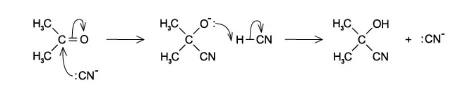{.question-figure fig-alt="Curly-arrow mechanism for cyanide addition to propanone"}

<button class="mc-choice" data-choice="A"><strong>A</strong>The carbonyl carbon is electron deficient.</button><button class="mc-choice" data-choice="B"><strong>B</strong>CN− is an electrophile.</button><button class="mc-choice" data-choice="C"><strong>C</strong>CN− donates an electron pair.</button><button class="mc-choice" data-choice="D"><strong>D</strong>The product contains an additional group.</button>

<button class="check-answer">Check answer</button>

Show explanation

<strong>B.</strong> Cyanide ion is a nucleophile because it donates an electron pair to the δ+ carbonyl carbon.

:::

::: {.mc-question #aso-mc-04 data-answer="A"}
### Question 4 · 3.1 Choice Easy Q4

Which compound can show both optical and geometrical isomerism?

<button class="mc-choice" data-choice="A"><strong>A</strong>CH3CH=C(CH3)CH(OH)CH3</button><button class="mc-choice" data-choice="B"><strong>B</strong>CH2=CHCH(OH)CH3</button><button class="mc-choice" data-choice="C"><strong>C</strong>CH3CH=C(CH3)2</button><button class="mc-choice" data-choice="D"><strong>D</strong>CH3CH2CH(OH)CH3</button>

<button class="check-answer">Check answer</button>

Show explanation

<strong>A.</strong> The C=C has two different groups on each carbon, and the C bearing OH has four different substituents.

:::

::: {.mc-question #aso-mc-05 data-answer="A"}
### Question 5 · 3.1 Choice Easy Q6

Which statement correctly describes electrophilic addition?

<button class="mc-choice" data-choice="A"><strong>A</strong>The organic molecule acts as a nucleophile and becomes more saturated.</button><button class="mc-choice" data-choice="B"><strong>B</strong>The organic molecule acts as an electrophile and becomes more saturated.</button><button class="mc-choice" data-choice="C"><strong>C</strong>The organic molecule acts as a nucleophile and becomes less saturated.</button><button class="mc-choice" data-choice="D"><strong>D</strong>The organic molecule acts as an electrophile and becomes less saturated.</button>

<button class="check-answer">Check answer</button>

Show explanation

<strong>A.</strong> The π electrons of the alkene donate to the electrophile; the double bond becomes a single bond.

:::

::: {.mc-question #aso-mc-06 data-answer="A"}
### Question 6 · 3.1 Choice Easy Q8

Which compound can undergo free-radical substitution with chlorine?

<button class="mc-choice" data-choice="A"><strong>A</strong>ethane only</button><button class="mc-choice" data-choice="B"><strong>B</strong>fluoroethane only</button><button class="mc-choice" data-choice="C"><strong>C</strong>ethene and ethanal only</button><button class="mc-choice" data-choice="D"><strong>D</strong>all four compounds</button>

<button class="check-answer">Check answer</button>

Show explanation

<strong>A.</strong> At this level, free-radical substitution is the replacement of H in an alkane by a halogen under UV light.

:::

::: {.mc-question #aso-mc-07 data-answer="C"}
### Question 7 · 3.1 Choice Easy Q9

Which species is a nucleophile?

<button class="mc-choice" data-choice="A"><strong>A</strong>C2H6</button><button class="mc-choice" data-choice="B"><strong>B</strong>H+</button><button class="mc-choice" data-choice="C"><strong>C</strong>OH−</button><button class="mc-choice" data-choice="D"><strong>D</strong>Cl+</button>

<button class="check-answer">Check answer</button>

Show explanation

<strong>C.</strong> OH− has lone pairs and a negative charge, so it donates an electron pair.

:::

::: {.mc-question #aso-mc-08 data-answer="D"}
### Question 8 · 3.1 Choice Easy Q10

What is the lowest number of carbon atoms in a non-cyclic alkane that can have a chiral carbon atom?

<button class="mc-choice" data-choice="A"><strong>A</strong>4</button><button class="mc-choice" data-choice="B"><strong>B</strong>5</button><button class="mc-choice" data-choice="C"><strong>C</strong>6</button><button class="mc-choice" data-choice="D"><strong>D</strong>7</button>

<button class="check-answer">Check answer</button>

Show explanation

<strong>D.</strong> A carbon needs four different groups; the smallest acyclic alkane able to provide these isomers has seven carbons.

:::

::: {.mc-question #aso-mc-09 data-answer="C"}
### Question 9 · 3.1 Choice Medium Q1

How many stereoisomers are possible for γ-linolenic acid, which has three C=C bonds capable of cis-trans isomerism and no chiral centre?

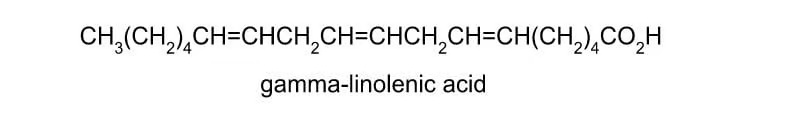{.question-figure fig-alt="Displayed formula of gamma-linolenic acid"}

<button class="mc-choice" data-choice="A"><strong>A</strong>2</button><button class="mc-choice" data-choice="B"><strong>B</strong>4</button><button class="mc-choice" data-choice="C"><strong>C</strong>8</button><button class="mc-choice" data-choice="D"><strong>D</strong>16</button>

<button class="check-answer">Check answer</button>

Show explanation

<strong>C.</strong> Each independent double bond has two arrangements, so 23 = 8.

:::

::: {.mc-question #aso-mc-10 data-answer="B"}
### Question 10 · 3.1 Choice Medium Q2

How many structural isomers of tribromopropane, C3H5Br3, are possible?

<button class="mc-choice" data-choice="A"><strong>A</strong>4</button><button class="mc-choice" data-choice="B"><strong>B</strong>5</button><button class="mc-choice" data-choice="C"><strong>C</strong>6</button><button class="mc-choice" data-choice="D"><strong>D</strong>8</button>

<button class="check-answer">Check answer</button>

Show explanation

<strong>B.</strong> Enumerating distinct placements of the three Br atoms on the three-carbon chain gives five constitutional isomers.

:::

::: {.mc-question #aso-mc-11 data-answer="C"}
### Question 11 · 3.1 Choice Medium Q3

A compound with formula C8H14O is oxidised to C8H12O2. Which functional group was present in the original compound?

<button class="mc-choice" data-choice="A"><strong>A</strong>aldehyde</button><button class="mc-choice" data-choice="B"><strong>B</strong>ketone</button><button class="mc-choice" data-choice="C"><strong>C</strong>alcohol</button><button class="mc-choice" data-choice="D"><strong>D</strong>ester</button>

<button class="check-answer">Check answer</button>

Show explanation

<strong>C.</strong> Oxidation has added one oxygen and removed two hydrogens, consistent with a primary alcohol forming a carboxylic acid.

:::

::: {.mc-question #aso-mc-12 data-answer="C"}
### Question 12 · 3.1 Choice Medium Q4

How many isomeric esters have molecular formula C5H10O2?

<button class="mc-choice" data-choice="A"><strong>A</strong>5</button><button class="mc-choice" data-choice="B"><strong>B</strong>7</button><button class="mc-choice" data-choice="C"><strong>C</strong>9</button><button class="mc-choice" data-choice="D"><strong>D</strong>12</button>

<button class="check-answer">Check answer</button>

Show explanation

<strong>C.</strong> Distribute the five carbons between the alkanoate and alkyl parts, allowing branches where possible.

:::

::: {.mc-question #aso-mc-13 data-answer="B"}
### Question 13 · 3.1 Choice Medium Q5

In methyl isocyanate, CH3NCO, what is the most likely bond angle around the nitrogen atom?

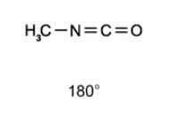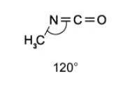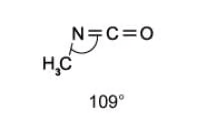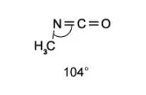

<button class="mc-choice" data-choice="A"><strong>A</strong>90°</button><button class="mc-choice" data-choice="B"><strong>B</strong>120°</button><button class="mc-choice" data-choice="C"><strong>C</strong>109.5°</button><button class="mc-choice" data-choice="D"><strong>D</strong>180°</button>

<button class="check-answer">Check answer</button>

Show explanation

<strong>B.</strong> Nitrogen is sp2 hybridised in the N=C arrangement, giving trigonal-planar electron geometry and about 120°.

:::

::: {.mc-question #aso-mc-14 data-answer="C"}
### Question 14 · 3.1 Choice Medium Q6

On oxidation of xylitol, which types of organic product can be formed?

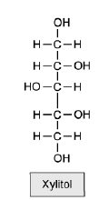{.question-figure fig-alt="Displayed structure of xylitol"}

<button class="mc-choice" data-choice="A"><strong>A</strong>aldehyde only</button><button class="mc-choice" data-choice="B"><strong>B</strong>aldehyde and carboxylic acid only</button><button class="mc-choice" data-choice="C"><strong>C</strong>aldehyde, carboxylic acid and ketone</button><button class="mc-choice" data-choice="D"><strong>D</strong>ketone only</button>

<button class="check-answer">Check answer</button>

Show explanation

<strong>C.</strong> Xylitol has both primary and secondary alcohol groups. Primary alcohol oxidation can give aldehyde/carboxylic acid; secondary alcohol oxidation gives ketone.

:::

::: {.mc-question #aso-mc-15 data-answer="B"}
### Question 15 · 3.1 Choice Medium Q9

1-chloroethane, CH3CH2Cl, reacts with NaOH(aq). What type of reaction is this?

<button class="mc-choice" data-choice="A"><strong>A</strong>nucleophilic addition</button><button class="mc-choice" data-choice="B"><strong>B</strong>nucleophilic substitution</button><button class="mc-choice" data-choice="C"><strong>C</strong>electrophilic addition</button><button class="mc-choice" data-choice="D"><strong>D</strong>electrophilic substitution</button>

<button class="check-answer">Check answer</button>

Show explanation

<strong>B.</strong> OH− donates a lone pair to carbon and replaces the leaving group Cl−.

:::

::: {.mc-question #aso-mc-16 data-answer="C"}
### Question 16 · 3.1 Choice Hard Q1

Methacrylate acrylonitrile contains carbons that are sp, sp2 and sp3 hybridised. What is the most likely bond angle for carbon that is sp2 hybridised?

<button class="mc-choice" data-choice="A"><strong>A</strong>105°</button><button class="mc-choice" data-choice="B"><strong>B</strong>109°</button><button class="mc-choice" data-choice="C"><strong>C</strong>120°</button><button class="mc-choice" data-choice="D"><strong>D</strong>180°</button>

<button class="check-answer">Check answer</button>

Show explanation

<strong>C.</strong> sp2 hybridisation gives three regions of electron density in a trigonal planar arrangement.

:::

::: {.mc-question #aso-mc-17 data-answer="C"}
### Question 17 · 3.1 Choice Hard Q8

Including structural and stereoisomers, how many isomeric products are produced when alcoholic NaOH reacts with 2-bromobutane?

<button class="mc-choice" data-choice="A"><strong>A</strong>1</button><button class="mc-choice" data-choice="B"><strong>B</strong>2</button><button class="mc-choice" data-choice="C"><strong>C</strong>3</button><button class="mc-choice" data-choice="D"><strong>D</strong>4</button>

<button class="check-answer">Check answer</button>

Show explanation

<strong>C.</strong> Elimination gives but-1-ene and but-2-ene; but-2-ene has two E/Z forms.

:::

::: {.mc-question #aso-mc-18 data-answer="D"}
### Question 18 · 3.1 Choice Hard Q9

How many isomers, including structural and stereoisomers, with formula C5H10 have structures that involve π bonding?

<button class="mc-choice" data-choice="A"><strong>A</strong>3</button><button class="mc-choice" data-choice="B"><strong>B</strong>4</button><button class="mc-choice" data-choice="C"><strong>C</strong>5</button><button class="mc-choice" data-choice="D"><strong>D</strong>6</button>

<button class="check-answer">Check answer</button>

Show explanation

<strong>D.</strong> Count the alkene structural isomers and count E/Z forms separately where both double-bond carbons have two different groups.

:::

::: {.mc-question #aso-mc-19 data-answer="D"}
### Question 19 · 3.1 Choice Hard Q2

The reaction sequence CH3CH=CHCH3 → CH3CH2CH(Cl)CH3 → CH3CH2CH(OH)CH3 shows a pair of reaction types. Which row is correct?

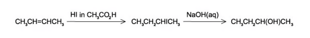{.question-figure fig-alt="Reaction sequence showing electrophilic addition followed by nucleophilic substitution"}

<button class="mc-choice" data-choice="A"><strong>A</strong>electrophilic substitution; nucleophilic addition</button><button class="mc-choice" data-choice="B"><strong>B</strong>nucleophilic addition; electrophilic substitution</button><button class="mc-choice" data-choice="C"><strong>C</strong>nucleophilic substitution; electrophilic addition</button><button class="mc-choice" data-choice="D"><strong>D</strong>electrophilic addition; nucleophilic substitution</button>

<button class="check-answer">Check answer</button>

Show explanation

<strong>D.</strong> HCl adds across C=C by electrophilic addition. Aqueous OH− then replaces Cl− by nucleophilic substitution.

:::

::: {.mc-question #aso-mc-20 data-answer="B"}
### Question 20 · 3.1 Choice Easy Q7

Which formula represents 1-fluoro-3-methylbut-2-ene?

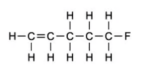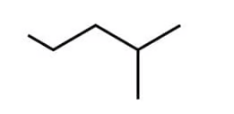

<button class="mc-choice" data-choice="A"><strong>A</strong>CH2FC(CH3)=CHCH3</button><button class="mc-choice" data-choice="B"><strong>B</strong>CH2FCH=C(CH3)CH3</button><button class="mc-choice" data-choice="C"><strong>C</strong>CH3CHFCH=CH2</button><button class="mc-choice" data-choice="D"><strong>D</strong>CH2=C(F)CH(CH3)CH3</button>

<button class="check-answer">Check answer</button>

Show explanation

<strong>B.</strong> The parent chain is but-2-ene; F is at carbon 1 and a methyl substituent is at carbon 3.

:::

## Structured questions

::: {.question-card #aso-sq-01}
### Question 1 · 3.1 SQ Easy Q1(a-b)

<strong>(a)(i)</strong> Define the term hydrocarbon.

<strong>(a)(ii)</strong> Give the general formula for the homologous series of alkanes.

<strong>(a)(iii)</strong> State the formula of an alkane containing five carbon atoms.

<strong>(b)</strong> State three characteristics of a homologous series.

Show mark scheme / model answer
<ol><li>A hydrocarbon is a compound containing carbon and hydrogen only.</li><li>CnH2n+2.</li><li>C5H12.</li><li>Any three: same functional group; same general formula; adjacent members differ by CH2; similar chemical properties; gradual change in physical properties.</li></ol>

:::

::: {.question-card #aso-sq-02}
### Question 2 · 3.1 SQ Easy Q1(e), Q2(a)

The compound 2,2-dimethylpentan-3-ol can be represented using different types of formulae. Its structural formula can be shown as C(CH3)3CH(OH)CH2CH3.

<strong>(a)(i)</strong> Give the empirical formula of 2,2-dimethylpentan-3-ol.

<strong>(a)(ii)</strong> Draw the skeletal formula of 2,2-dimethylpentan-3-ol.

<strong>(b)</strong> State the three different types of structural isomerism.

Show mark scheme / model answer
<ol><li>Count atoms: molecular formula C7H16O, so empirical formula C7H16O.</li><li>A six-carbon zig-zag chain with a methyl branch at C2 and OH at C3; equivalent correctly connected skeletal representation gains credit.</li><li>Chain, positional and functional-group isomerism.</li></ol>

:::

::: {.question-card #aso-sq-03}
### Question 3 · 3.1 SQ Easy Q2(b)

State the type of isomerism that occurs between the following pairs of compounds.

<strong>(i)</strong> 2-methylpentane and 2,3-dimethylbutane.

<strong>(ii)</strong> Butan-1-ol and butan-2-ol.

Show mark scheme / model answer
<ol><li>Chain isomerism: both are alkanes with the same molecular formula but different carbon skeletons.</li><li>Positional isomerism: both contain the alcohol group, but –OH is at carbon 1 or carbon 2.</li></ol>

:::

::: {.question-card #aso-sq-04}
### Question 4 · 3.1 SQ Easy Q3(a-b)

<strong>(a)</strong> Free radical substitution reactions involve hydrogen atoms in alkanes being replaced by halogen atoms. Name the three steps involved in a free radical substitution reaction.

<strong>(b)(i)</strong> When a molecule of chlorine, Cl2, is exposed to UV light two chlorine radicals are formed. Write an equation for this reaction.

<strong>(b)(ii)</strong> State the type of bond fission involved.

Show mark scheme / model answer
<ol><li>Initiation, propagation and termination.</li><li>Cl2 → 2Cl· (under UV light).</li><li>Homolytic fission: one electron from the Cl–Cl bond goes to each chlorine atom.</li></ol>

:::

::: {.question-card #aso-sq-05}
### Question 5 · 3.1 SQ Easy Q3(c-d), Q4(a)

<strong>(a)</strong> A–B → A+ + B−, where the more electronegative atom B has taken both electrons from the bond. State the name of this type of bond fission.

<strong>(b)</strong> Name three other types of reaction mechanism.

<strong>(c)</strong> Aliphatic compounds can be organised into three different categories depending on their structure. One category is straight-chain. Name the other two categories.

Show mark scheme / model answer
<ol><li>Heterolytic fission.</li><li>Any three appropriate mechanisms: free-radical substitution, electrophilic addition, nucleophilic substitution, nucleophilic addition or electrophilic substitution.</li><li>Branched-chain and cyclic.</li></ol>

:::

::: {.question-card #aso-sq-06}
### Question 6 · 3.1 SQ Medium Q2(a)

Explain how the concept of hybridisation can be used to explain the triple bond present in propyne.

Show mark scheme / model answer
<ol><li>Each carbon atom in the C≡C triple bond is sp hybridised: one s orbital mixes with one p orbital to form two sp orbitals.</li><li>End-on overlap of an sp orbital from each carbon gives one σ bond.</li><li>Two unhybridised p orbitals remain on each carbon; sideways overlap in two perpendicular planes gives two π bonds. The carbon atoms are linear, with a bond angle of 180°.</li></ol>

:::

::: {.question-card #aso-sq-07}
### Question 7 · 3.1 SQ Medium Q2(c)

Complete Table 2.1 to show the hybridisation of the nitrogen atoms in NF4+, N2H2 and N2H4.

Show mark scheme / model answer
<ol><li>NF4+: sp3; four σ bonds around N give tetrahedral electron geometry.</li><li>N2H2: sp2 at each N; N=N contains one σ and one π bond and has trigonal-planar arrangement about N.</li><li>N2H4: sp3 at each N; each N has three σ bonds and one lone pair.</li></ol>

:::

::: {.question-card #aso-sq-08}
### Question 8 · 3.1 SQ Medium Q3(c)

There are two possible reactions of 1-bromopropane with sodium hydroxide. Aqueous sodium hydroxide reacts with 1-bromopropane to form compound X and Br−.

<strong>(i)</strong> State the role of the aqueous hydroxide ion in this reaction.

<strong>(ii)</strong> Name compound X.

<strong>(iii)</strong> In different reaction conditions, an alternative reaction occurs between hydroxide ion and 1-bromopropane to form propene and a small molecule. State the reaction conditions and name the type of mechanism used in this alternative reaction.

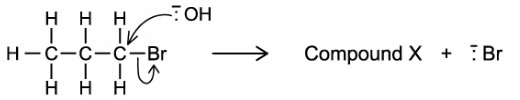{.question-figure fig-alt="Hydroxide ion attacking 1-bromopropane to form compound X and bromide ion"}

Show mark scheme / model answer
<ol><li>OH− acts as a nucleophile (electron-pair donor).</li><li>Propan-1-ol.</li><li>Use hot ethanolic sodium hydroxide; the mechanism is elimination. OH− removes H while Br− leaves, producing H2O and propene.</li></ol>

:::

::: {.question-card #aso-sq-09}
### Question 9 · 3.1 SQ Medium Q4(a-b)

<strong>(a)(i)</strong> Name the shortest straight-chain alkane to have structural isomers and the isomer.

<strong>(a)(ii)</strong> State the type of isomerism shown by the isomers in part (i).

<strong>(b)(i)</strong> C4H8 exists as several isomers. Name the homologous series that C4H8 belongs to.

<strong>(b)(ii)</strong> Draw the skeletal formulae of two cyclic C4H8 isomers and two C4H8 isomers that show cis/trans isomerism.

<strong>(b)(iii)</strong> There are two unsaturated C4H8 isomers that do not show cis/trans isomerism. Name these isomers and explain why they do not show cis/trans isomerism.

Show mark scheme / model answer
<ol><li>Butane and 2-methylpropane; they are chain isomers.</li><li>The homologous series is alkene (although cyclic structural isomers are cycloalkanes).</li><li>Cyclic examples: cyclobutane and methylcyclopropane. Cis/trans examples: cis-but-2-ene and trans-but-2-ene.</li><li>But-1-ene and 2-methylpropene. In each case one carbon of C=C has two identical groups, so two distinct E/Z arrangements are impossible.</li></ol>

:::

::: {.question-card #aso-sq-10}
### Question 10 · 3.1 SQ Medium Q5(a-c)

<strong>(a)</strong> Explain why cyclohexane C6H12 has a puckered, non-planar shape by making reference to the C–C–C bond angles and the type of hybridisation of carbon in the molecule.

<strong>(b)</strong> Urea, CO(NH2)2, is present in solution in animal urine. Describe the hybridisation of C and N in the molecule, giving approximate bond angles.

<strong>(c)</strong> Describe the hybridisation of the carbon atom in methane and explain how the concept of hybridisation can be used to explain the shape of the methane molecule.

Show mark scheme / model answer
<ol><li>Each C in cyclohexane is sp3 hybridised and prefers a tetrahedral angle close to 109.5°. A planar hexagon would force 120° C–C–C angles, so the ring puckers to reduce angle strain.</li><li>Carbonyl C is sp2, trigonal planar, approximately 120°. In the simplified bonding model each N is sp2 because its lone pair is delocalised with the carbonyl group, so the arrangement about N is approximately planar with angles near 120°.</li><li>In methane, one 2s and three 2p orbitals hybridise to form four equivalent sp3 orbitals. They point to the corners of a tetrahedron, giving four C–H σ bonds with H–C–H angles of 109.5°.</li></ol>

:::

## Original question PDFs

- [3.1 Choice Easy](../assets/questions/original-source/3.1_an_introduction_to_as_level_organic_chemistry___choice___easy.pdf)
- [3.1 Choice Medium](../assets/questions/original-source/3.1_an_introduction_to_as_level_organic_chemistry___choice___medium.pdf)
- [3.1 Choice Hard](../assets/questions/original-source/3.1_an_introduction_to_as_level_organic_chemistry___choice___hard.pdf)
- [3.1 SQ Easy](../assets/questions/original-source/3.1_an_introduction_to_as_level_organic_chemistry___sq___easy.pdf)
- [3.1 SQ Medium](../assets/questions/original-source/3.1_an_introduction_to_as_level_organic_chemistry___sq___medium.pdf)
- [3.1 SQ Hard](../assets/questions/original-source/3.1_an_introduction_to_as_level_organic_chemistry___sq___hard.pdf)
