# 13 An introduction to AS Level organic chemistry

本章只覆盖 AS 3.1：有机物的表示法、同系物与官能团、命名、反应类型与试剂角色、σ/π 键和杂化，以及结构异构与立体异构。下方题目均来自 **3.1 An Introduction to AS Level Organic Chemistry** 的 AS 原题；无法独立提取的题图没有以截图方式加入。

## Learning objectives

- use molecular, empirical, structural, displayed and skeletal formulae correctly;
- identify functional groups, homologous series and structural isomerism;
- apply IUPAC naming rules to simple aliphatic compounds;
- distinguish electrophiles, nucleophiles and free radicals, and name the mechanism/reaction type;
- explain σ and π bonds, hybridisation and molecular shape;
- distinguish E/Z (cis-trans) and optical isomerism.

## 13.1 Formulas, Functional Groups - the Naming of Organic Compounds

A **molecular formula** gives the actual number of each atom, for example C4H10O. An **empirical formula** gives the simplest whole-number ratio, so the empirical formula of C4H10O is also C4H10O, but that of C6H12O6 is CH2O. A **structural formula** groups atoms along the chain, a **displayed formula** shows every bond, and a **skeletal formula** uses line ends/vertices for carbon atoms and omits C-bound H atoms. Hydrogen attached to a heteroatom, for example the O–H hydrogen in an alcohol, is shown.

A **homologous series** is a family of organic compounds with the same functional group and general formula. Consecutive members differ by CH2; they have similar chemical properties but show a gradual change in physical properties. A **hydrocarbon** contains hydrogen and carbon only. Important AS patterns are:

| Homologous series | Functional group / general formula | Example suffix |
|---|---|---|
| alkane | CnH2n+2, C–C only | -ane |
| alkene | CnH2n, C=C | -ene |
| halogenoalkane | C–X | fluoro-, chloro-, bromo-, iodo- |
| alcohol | –OH | -ol |
| aldehyde | –CHO | -al |
| ketone | >C=O | -one |
| carboxylic acid | –COOH | -oic acid |
| ester | –COO– | alkyl alkanoate |
| nitrile | –C≡N | -nitrile |

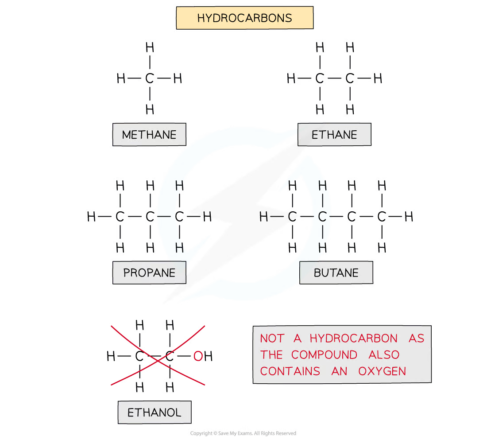{.concept-figure fig-alt="Functional groups in important AS organic families"}

### Naming organic compounds

Choose the longest carbon chain containing the highest-priority functional group. Number it from the end that gives the functional group the lowest possible number, then give substituents their locants and list them alphabetically. The stem tells the number of C atoms: meth-, eth-, prop-, but-, pent-, hex-. Include a number before -ene, -ol or -one when its position is not fixed.

For example, CH3CH(OH)CH2CH3 is **butan-2-ol**, and CH3CH(Br)CH(CH3)CH2OH is **3-bromo-2-methylbutan-1-ol**. In a carboxylic acid the carboxyl carbon is carbon 1 by definition. In an aldehyde, the –CHO carbon is carbon 1 and its hydrogen must not be omitted from a displayed formula.

## 13.2 Characteristic Organic Reactions

Organic reactions can be described both by reaction type and by mechanism. **Addition** joins atoms to a molecule (often across C=C); **substitution** replaces one atom/group by another; **elimination** removes a small molecule to form a multiple bond; **hydrolysis** breaks a bond using water; **oxidation** raises the oxidation state / adds oxygen / removes hydrogen.

An **electrophile** accepts an electron pair and attacks an electron-rich region, such as the π bond of an alkene. A **nucleophile** donates an electron pair; OH−, CN− and NH3 are common examples. A **free radical** has an unpaired electron and is shown with a dot, for example Cl·.

Bond fission is central to mechanisms:

- **Homolytic fission:** one electron goes to each atom, forming radicals: Cl–Cl → 2Cl·.
- **Heterolytic fission:** both bonding electrons go to one atom, forming ions: C–Br → C+ + Br− (direction depends on relative electronegativity).

Free-radical substitution of an alkane with chlorine under UV light has three stages: **initiation** (Cl–Cl → 2Cl·), **propagation** (radicals react and a new radical is regenerated), and **termination** (two radicals combine). Electrophilic addition occurs when an electrophile accepts the π electrons of an alkene; nucleophilic substitution occurs when a nucleophile replaces a leaving group such as Br− in a halogenoalkane.

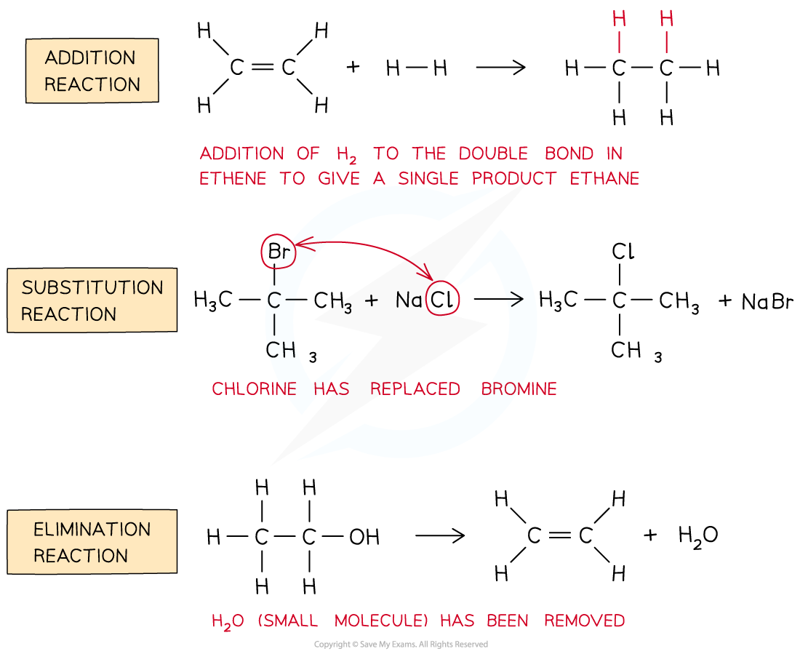{.concept-figure fig-alt="Examples of addition, substitution and elimination reactions"}

## 13.3 Shapes of Organic Molecules; σ - π Bonds

A single bond is one **σ bond**, made by end-on overlap. A double bond contains one σ bond and one **π bond**; a triple bond contains one σ bond and two π bonds. A π bond is made by sideways overlap of unhybridised p orbitals and prevents free rotation about the double bond. This restricted rotation is required for E/Z (cis-trans) isomerism.

| Hybridisation at carbon | Typical bonding | Shape and approximate angle |
|---|---|---|
| sp3 | four σ bonds | tetrahedral, 109.5° |
| sp2 | three σ bonds + one unhybridised p orbital | trigonal planar, 120° |
| sp | two σ bonds + two unhybridised p orbitals | linear, 180° |

Thus each carbon of C=C is sp2 and trigonal planar. In C≡C each carbon is sp and linear. In methane, one 2s and three 2p orbitals mix to form four equivalent sp3 orbitals, which repel to a tetrahedral arrangement. Cyclohexane is not planar: sp3 carbon favours angles close to 109.5°, and a puckered conformation reduces strain.

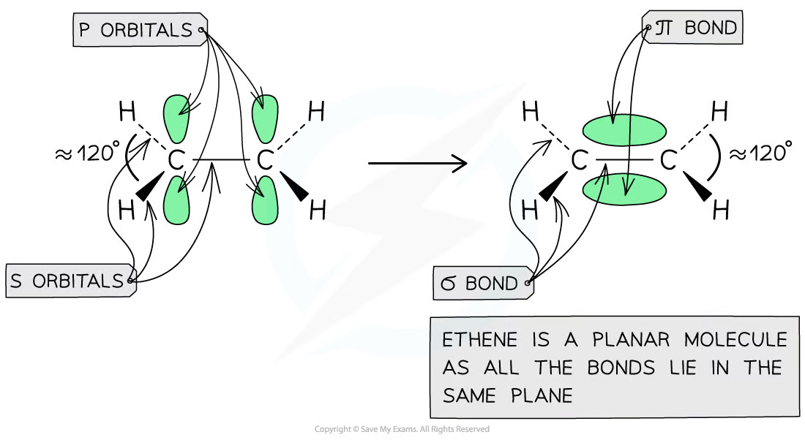{.concept-figure fig-alt="Sigma and pi bonding in ethene"}

## 13.4 Isomerism. Structural Isomerism - Stereoisomerism

**Structural isomers** have the same molecular formula but different connectivity. The three types are **chain isomerism** (different carbon skeleton), **positional isomerism** (same functional group in a different position) and **functional-group isomerism** (different functional groups).

**Stereoisomers** have the same connectivity but different arrangement in space. E/Z (cis-trans) isomerism requires restricted rotation about C=C and two different groups attached to each carbon of the double bond. A **chiral centre** is usually a tetrahedral carbon attached to four different groups. A chiral molecule can form a pair of non-superimposable mirror images called **enantiomers**; this is optical isomerism. A molecule with an internal plane of symmetry is not chiral.

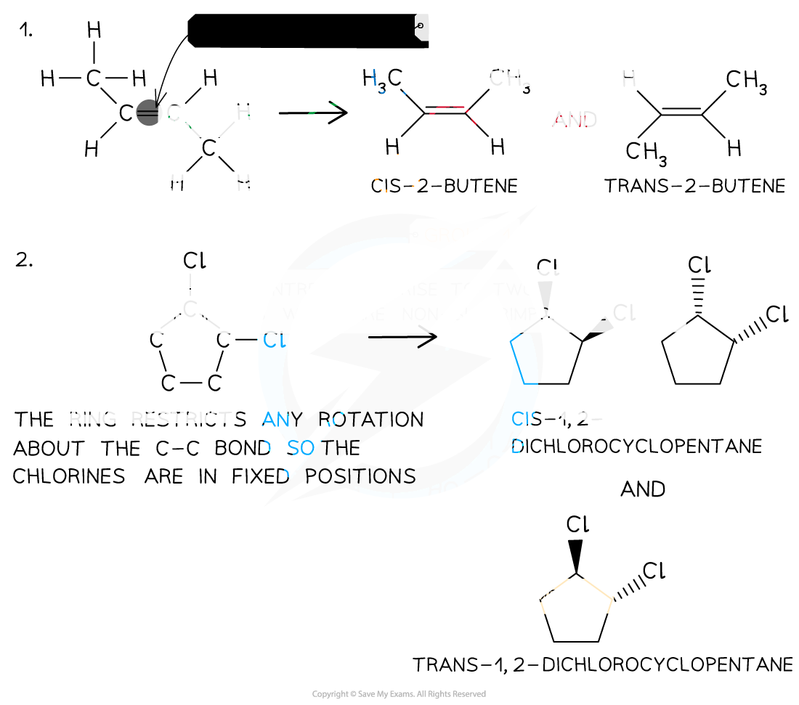{.concept-figure fig-alt="Cis-trans isomerism in alkenes and rings"}

## Multiple choice questions

::: {.mc-question #aso-mc-01 data-answer="B"}
### Question 1 · 3.1 Choice Easy Q1

Which pairs of homologous series do not have the same C:H ratio in their general formulae?

<button class="mc-choice" data-choice="A"><strong>A</strong>Aldehydes and ketones</button><button class="mc-choice" data-choice="B"><strong>B</strong>Alkanes and alkenes</button><button class="mc-choice" data-choice="C"><strong>C</strong>Carboxylic acids and esters</button><button class="mc-choice" data-choice="D"><strong>D</strong>Alkenes and aldehydes</button>

<button class="check-answer">Check answer</button>

Show explanation
<ul><li><strong>B.</strong> Alkanes have CnH2n+2, whereas alkenes have CnH2n.</li></ul>

:::

::: {.mc-question #aso-mc-02 data-answer="C"}
### Question 2 · 3.1 Choice Easy Q2

The disaccharide sucrose, C12H22O11, is found in biscuits and cakes. Inside the body, sucrose is hydrolysed to produce glucose and fructose. Which statements about the hydrolysis products are correct? 1. Glucose and fructose have structural isomers. 2. Glucose and fructose are ketones. 3. Glucose is a carboxylic acid. 4. Glucose and fructose have optical isomers.

<button class="mc-choice" data-choice="A"><strong>A</strong>1 and 2</button><button class="mc-choice" data-choice="B"><strong>B</strong>2 and 4</button><button class="mc-choice" data-choice="C"><strong>C</strong>1 and 4</button><button class="mc-choice" data-choice="D"><strong>D</strong>1, 2 and 4</button>

<button class="check-answer">Check answer</button>

Show explanation
<ul><li><strong>C.</strong> Glucose and fructose are structural isomers and each has chiral centres, so optical isomers are possible; the other statements are false.</li></ul>

:::

::: {.mc-question #aso-mc-03 data-answer="B"}
### Question 3 · 3.1 Choice Easy Q3

The following mechanism shows hydrogen cyanide reacting with propanone. Which of the following statements is incorrect?

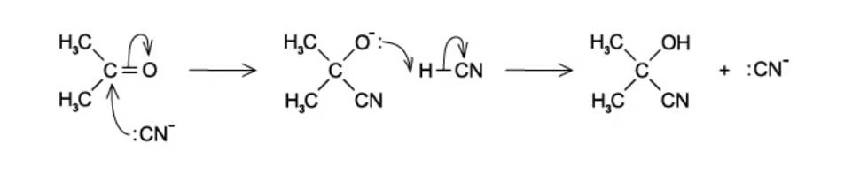{.question-figure fig-alt="Hydrogen cyanide reacting with propanone by nucleophilic addition"}

<button class="mc-choice" data-choice="A"><strong>A</strong>Heterolytic bond breaking is involved.</button><button class="mc-choice" data-choice="B"><strong>B</strong>CN− is an electrophile.</button><button class="mc-choice" data-choice="C"><strong>C</strong>This is an addition reaction.</button><button class="mc-choice" data-choice="D"><strong>D</strong>Propanone is a ketone.</button>

<button class="check-answer">Check answer</button>

Show explanation
<ul><li><strong>B.</strong> CN− donates an electron pair and is therefore a nucleophile, not an electrophile.</li></ul>

:::

::: {.mc-question #aso-mc-04 data-answer="A"}
### Question 4 · 3.1 Choice Easy Q6

Which of the following statements correctly describes electrophilic addition?

<button class="mc-choice" data-choice="A"><strong>A</strong>The organic molecule acts as a nucleophile and becomes more saturated.</button><button class="mc-choice" data-choice="B"><strong>B</strong>The organic molecule acts as an electrophile and becomes more saturated.</button><button class="mc-choice" data-choice="C"><strong>C</strong>The organic molecule acts as a nucleophile and becomes less saturated.</button><button class="mc-choice" data-choice="D"><strong>D</strong>The organic molecule acts as an electrophile and becomes less saturated.</button>

<button class="check-answer">Check answer</button>

Show explanation
<ul><li><strong>A.</strong> The π bond donates electron density to an electrophile and the molecule becomes more saturated.</li></ul>

:::

::: {.mc-question #aso-mc-05 data-answer="A"}
### Question 5 · 3.1 Choice Easy Q8

Which of these organic compounds would undergo free-radical substitution? 1. Ethane 2. Fluoroethane 3. Ethene 4. Ethanal

<button class="mc-choice" data-choice="A"><strong>A</strong>1 only</button><button class="mc-choice" data-choice="B"><strong>B</strong>1 and 2</button><button class="mc-choice" data-choice="C"><strong>C</strong>1, 2 and 3</button><button class="mc-choice" data-choice="D"><strong>D</strong>All of the above</button>

<button class="check-answer">Check answer</button>

Show explanation
<ul><li><strong>A.</strong> At this level the relevant substrate is an alkane; ethane undergoes halogen substitution under UV light.</li></ul>

:::

::: {.mc-question #aso-mc-06 data-answer="C"}
### Question 6 · 3.1 Choice Easy Q9

Which of these compounds would act as a nucleophile?

<button class="mc-choice" data-choice="A"><strong>A</strong>C2H6</button><button class="mc-choice" data-choice="B"><strong>B</strong>H+</button><button class="mc-choice" data-choice="C"><strong>C</strong>OH−</button><button class="mc-choice" data-choice="D"><strong>D</strong>Cl+</button>

<button class="check-answer">Check answer</button>

Show explanation
<ul><li><strong>C.</strong> OH− has a lone pair and a negative charge and can donate an electron pair.</li></ul>

:::

::: {.mc-question #aso-mc-07 data-answer="C"}
### Question 7 · 3.1 Choice Medium Q1

Evening primrose oil has been shown to reduce high blood pressure and improve heart health. The oil is made from seeds, within which the active compound gamma-linolenic acid is found. How many stereoisomers does gamma-linolenic acid have?

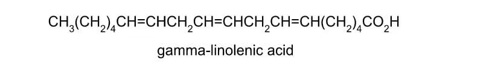{.question-figure fig-alt="Displayed formula of gamma-linolenic acid"}

<button class="mc-choice" data-choice="A"><strong>A</strong>3</button><button class="mc-choice" data-choice="B"><strong>B</strong>6</button><button class="mc-choice" data-choice="C"><strong>C</strong>8</button><button class="mc-choice" data-choice="D"><strong>D</strong>4</button>

<button class="check-answer">Check answer</button>

Show explanation
<ul><li><strong>C.</strong> The molecule has three independent C=C bonds capable of E/Z isomerism, giving 23 = 8 stereoisomers.</li></ul>

:::

::: {.mc-question #aso-mc-08 data-answer="B"}
### Question 8 · 3.1 Choice Medium Q2

How many structural isomers are there of tribromopropane, C3H5Br3?

<button class="mc-choice" data-choice="A"><strong>A</strong>4</button><button class="mc-choice" data-choice="B"><strong>B</strong>5</button><button class="mc-choice" data-choice="C"><strong>C</strong>6</button><button class="mc-choice" data-choice="D"><strong>D</strong>7</button>

<button class="check-answer">Check answer</button>

Show explanation
<ul><li><strong>B.</strong> Counting distinct placements of three bromine atoms on the three-carbon skeleton gives five constitutional isomers.</li></ul>

:::

::: {.mc-question #aso-mc-09 data-answer="C"}
### Question 9 · 3.1 Choice Medium Q5

Methyl isocyanate, CH3NCO, is a toxic liquid used in the production of adhesives. The sequence of atoms is H3C–N=C=O. What is the approximate angle between the bonds formed by the N atom?

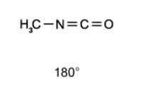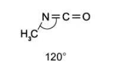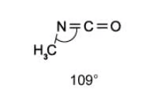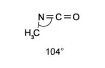

<button class="mc-choice" data-choice="A"><strong>A</strong>180°</button><button class="mc-choice" data-choice="B"><strong>B</strong>109°</button><button class="mc-choice" data-choice="C"><strong>C</strong>120°</button><button class="mc-choice" data-choice="D"><strong>D</strong>104°</button>

<button class="check-answer">Check answer</button>

Show explanation
<ul><li><strong>C.</strong> The nitrogen is approximately sp2 hybridised in the N=C arrangement, so the angle is about 120°.</li></ul>

:::

::: {.mc-question #aso-mc-10 data-answer="C"}
### Question 10 · 3.1 Choice Medium Q6

Xylitol is an artificial sweetener used in toothpastes and chewing gum to improve their taste without impairing dental hygiene. Which functional groups could be produced if xylitol is oxidised under suitable conditions? 1. Alkene 2. Aldehyde 3. Carboxylic acid 4. Ketone

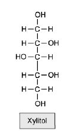{.question-figure fig-alt="Displayed structure of xylitol"}

<button class="mc-choice" data-choice="A"><strong>A</strong>1 only</button><button class="mc-choice" data-choice="B"><strong>B</strong>2 only</button><button class="mc-choice" data-choice="C"><strong>C</strong>2, 3 and 4</button><button class="mc-choice" data-choice="D"><strong>D</strong>2 and 4</button>

<button class="check-answer">Check answer</button>

Show explanation
<ul><li><strong>C.</strong> Primary alcohol groups can oxidise to aldehydes and carboxylic acids, while secondary alcohol groups can oxidise to ketones.</li></ul>

:::

::: {.mc-question #aso-mc-11 data-answer="B"}
### Question 11 · 3.1 Choice Medium Q8

11-cis retinal, C20H28O, is found in the retina of animal eyes and is required for vision. Which letter is associated with the correct pair of the arrangement around C11 and C12 and the total number of carbon-carbon double bonds?

<button class="mc-choice" data-choice="A"><strong>A</strong>Arrangement A; 5 double bonds</button><button class="mc-choice" data-choice="B"><strong>B</strong>Arrangement B; 6 double bonds</button><button class="mc-choice" data-choice="C"><strong>C</strong>Arrangement C; 5 double bonds</button><button class="mc-choice" data-choice="D"><strong>D</strong>Arrangement D; 6 double bonds</button>

<button class="check-answer">Check answer</button>

Show explanation
<ul><li><strong>B.</strong> The molecule contains five C=C bonds in total, and the correct arrangement around C11/C12 is the cis arrangement shown in the source option.</li></ul>

:::

::: {.mc-question #aso-mc-12 data-answer="B"}
### Question 12 · 3.1 Choice Medium Q9

1-chloroethane, CH3CH2Cl, and aqueous NaOH are reagents in a reaction. Which row correctly describes the type of reaction?

<button class="mc-choice" data-choice="A"><strong>A</strong>Nucleophilic addition</button><button class="mc-choice" data-choice="B"><strong>B</strong>Nucleophilic substitution</button><button class="mc-choice" data-choice="C"><strong>C</strong>Electrophilic addition</button><button class="mc-choice" data-choice="D"><strong>D</strong>Electrophilic substitution</button>

<button class="check-answer">Check answer</button>

Show explanation
<ul><li><strong>B.</strong> OH− replaces Cl− at the carbon atom, so the reaction is nucleophilic substitution.</li></ul>

:::

::: {.mc-question #aso-mc-13 data-answer="C"}
### Question 13 · 3.1 Choice Hard Q1

Methacrylate acrylonitrile is an organic molecule that contains carbons that are sp, sp2 and sp3 hybridised. What is the most likely bond angle for carbon that is sp2 hybridised?

<button class="mc-choice" data-choice="A"><strong>A</strong>105°</button><button class="mc-choice" data-choice="B"><strong>B</strong>109°</button><button class="mc-choice" data-choice="C"><strong>C</strong>120°</button><button class="mc-choice" data-choice="D"><strong>D</strong>180°</button>

<button class="check-answer">Check answer</button>

Show explanation
<ul><li><strong>C.</strong> sp2 hybridisation gives trigonal-planar geometry and an angle of approximately 120°.</li></ul>

:::

::: {.mc-question #aso-mc-14 data-answer="D"}
### Question 14 · 3.1 Choice Hard Q2

The reaction sequence below shows a pair of reaction types. CH3CH=CHCH3 → CH3CH2CH(Cl)CH3 → CH3CH2CH(OH)CH3 Which row in the table correctly shows the two reaction types?

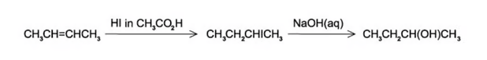{.question-figure fig-alt="Reaction sequence from but-2-ene to a chloroalkane and an alcohol"}

<button class="mc-choice" data-choice="A"><strong>A</strong>Nucleophilic addition; nucleophilic substitution</button><button class="mc-choice" data-choice="B"><strong>B</strong>Electrophilic addition; electrophilic substitution</button><button class="mc-choice" data-choice="C"><strong>C</strong>Nucleophilic addition; electrophilic substitution</button><button class="mc-choice" data-choice="D"><strong>D</strong>Electrophilic addition; nucleophilic substitution</button>

<button class="check-answer">Check answer</button>

Show explanation
<ul><li><strong>D.</strong> Addition of HCl across C=C is electrophilic addition; aqueous OH− replacing Cl− is nucleophilic substitution.</li></ul>

:::

::: {.mc-question #aso-mc-15 data-answer="D"}
### Question 15 · 3.1 Choice Hard Q3

Which of the following compounds is both chiral and acidic?

<button class="mc-choice" data-choice="A"><strong>A</strong>Compound A shown in the source figure</button><button class="mc-choice" data-choice="B"><strong>B</strong>Compound B shown in the source figure</button><button class="mc-choice" data-choice="C"><strong>C</strong>Compound C shown in the source figure</button><button class="mc-choice" data-choice="D"><strong>D</strong>Compound D shown in the source figure</button>

<button class="check-answer">Check answer</button>

Show explanation
<ul><li><strong>D.</strong> Compound D contains a carboxylic acid group and a carbon attached to four different groups.</li></ul>

:::

::: {.mc-question #aso-mc-16 data-answer="C"}
### Question 16 · 3.1 Choice Hard Q4

The amino acid cysteine performs structural and functional roles within proteins and can form disulfide bonds with other cysteine molecules. How many carbon atoms in cysteine are sp2 hybridised?

<button class="mc-choice" data-choice="A"><strong>A</strong>3</button><button class="mc-choice" data-choice="B"><strong>B</strong>2</button><button class="mc-choice" data-choice="C"><strong>C</strong>1</button><button class="mc-choice" data-choice="D"><strong>D</strong>0</button>

<button class="check-answer">Check answer</button>

Show explanation
<ul><li><strong>C.</strong> Only the carboxyl carbon is sp2 hybridised; the other carbon is saturated and sp3 hybridised.</li></ul>

:::

::: {.mc-question #aso-mc-17 data-answer="B"}
### Question 17 · 3.1 Choice Hard Q6

Cholesterol is an important biological molecule produced by the liver. How many chiral centres are there in one molecule of cholesterol?

<button class="mc-choice" data-choice="A"><strong>A</strong>7</button><button class="mc-choice" data-choice="B"><strong>B</strong>8</button><button class="mc-choice" data-choice="C"><strong>C</strong>10</button><button class="mc-choice" data-choice="D"><strong>D</strong>5</button>

<button class="check-answer">Check answer</button>

Show explanation
<ul><li><strong>B.</strong> Counting the stereogenic carbon atoms in the source structure gives eight chiral centres.</li></ul>

:::

::: {.mc-question #aso-mc-18 data-answer="C"}
### Question 18 · 3.1 Choice Hard Q7

Limonene is found in the peel of citrus fruits. How many σ and π bonds are present in this molecule?

<button class="mc-choice" data-choice="A"><strong>A</strong>24 σ and 4 π</button><button class="mc-choice" data-choice="B"><strong>B</strong>12 σ and 2 π</button><button class="mc-choice" data-choice="C"><strong>C</strong>26 σ and 2 π</button><button class="mc-choice" data-choice="D"><strong>D</strong>22 σ and 4 π</button>

<button class="check-answer">Check answer</button>

Show explanation
<ul><li><strong>C.</strong> There are 26 σ bonds and 2 π bonds; each double bond contributes one σ and one π bond.</li></ul>

:::

::: {.mc-question #aso-mc-19 data-answer="C"}
### Question 19 · 3.1 Choice Hard Q8

Including structural and stereoisomers, how many isomeric products are produced when alcoholic NaOH reacts with 2-bromobutane?

<button class="mc-choice" data-choice="A"><strong>A</strong>1</button><button class="mc-choice" data-choice="B"><strong>B</strong>2</button><button class="mc-choice" data-choice="C"><strong>C</strong>3</button><button class="mc-choice" data-choice="D"><strong>D</strong>4</button>

<button class="check-answer">Check answer</button>

Show explanation
<ul><li><strong>C.</strong> Elimination gives but-1-ene and but-2-ene; but-2-ene has cis and trans forms, giving three products.</li></ul>

:::

::: {.mc-question #aso-mc-20 data-answer="D"}
### Question 20 · 3.1 Choice Hard Q9

How many isomers, including structural and stereoisomers, with the formula C5H10 have structures that involve π bonding?

<button class="mc-choice" data-choice="A"><strong>A</strong>3</button><button class="mc-choice" data-choice="B"><strong>B</strong>4</button><button class="mc-choice" data-choice="C"><strong>C</strong>5</button><button class="mc-choice" data-choice="D"><strong>D</strong>6</button>

<button class="check-answer">Check answer</button>

Show explanation
<ul><li><strong>D.</strong> Counting the alkene structures and the E/Z stereoisomers separately gives six.</li></ul>

:::

## Structured questions

::: {.question-card #aso-sq-01}
### Question 1 · 3.1 SQ Easy Q1(a-e)

<strong>(a)</strong> Propane and hexane are part of the alkane homologous series.

<strong>(a)(i)</strong> Define the term hydrocarbon.

<strong>(a)(ii)</strong> Give the general formula for the homologous series of alkanes.

<strong>(a)(iii)</strong> State the formula of an alkane containing five carbon atoms.

<strong>(b)</strong> State three characteristics of a homologous series.

<strong>(c)</strong> Give the IUPAC names for the following aliphatic molecules.

<table><thead><tr><th>Molecule</th><th>Name</th></tr></thead><tbody><tr><td>CH3CH(Cl)CH3</td><td></td></tr><tr><td>CH3CH2CH=CH2</td><td></td></tr><tr><td>CH3CH2CH2OH</td><td></td></tr><tr><td>CH3CH2CH(Br)CH2OH</td><td></td></tr></tbody></table>

<strong>(d)</strong> The structures of four organic compounds are shown in Fig. 1.1. Complete Table 1.2 by naming the organic compounds and their functional groups.

<strong>(e)</strong> The compound 2,2-dimethylpentan-3-ol can be represented using different types of formulae. Its structural formula can be shown as C(CH3)3CH(OH)CH2CH3.

<strong>(e)(i)</strong> Give the empirical formula of 2,2-dimethylpentan-3-ol.

<strong>(e)(ii)</strong> Draw the skeletal formula of 2,2-dimethylpentan-3-ol.

Show mark scheme / model answer
<ul><li><strong>(a)(i)</strong> A hydrocarbon contains carbon and hydrogen only.</li><li><strong>(a)(ii)</strong> CnH2n+2.</li><li><strong>(a)(iii)</strong> C5H12.</li><li><strong>(b)</strong> Any three: the same functional group; the same general formula; adjacent members differ by CH2; similar chemical properties; gradual changes in physical properties.</li><li><strong>(c)</strong> 2-chloropropane; but-1-ene; propan-1-ol; 2-bromo-1-hydroxybutane.</li><li><strong>(e)(i)</strong> C7H16O.</li><li><strong>(e)(ii)</strong> A correctly connected skeletal formula with a six-carbon chain, a methyl branch at C2 and OH at C3.</li></ul>

:::

::: {.question-card #aso-sq-02}
### Question 2 · 3.1 SQ Easy Q2(a-c)

<strong>(a)</strong> State the three different types of structural isomerism.

<strong>(b)</strong> State the type of isomerism that occurs between the following pairs of compounds.

<strong>(b)(i)</strong> 2-methylpentane and 2,3-dimethylbutane.

<strong>(b)(ii)</strong> Butan-1-ol and butan-2-ol.

<strong>(c)</strong> Compounds A to F are shown in Fig. 2.1.

<strong>(c)(i)</strong> State the IUPAC name for compound B.

<strong>(c)(ii)</strong> State the type of structural isomerism that occurs between compounds A and D.

<strong>(c)(iii)</strong> State the type of structural isomerism that occurs between compounds C and E.

Show mark scheme / model answer
<ul><li><strong>(a)</strong> Chain isomerism, positional isomerism and functional-group isomerism.</li><li><strong>(b)(i)</strong> Chain isomerism.</li><li><strong>(b)(ii)</strong> Positional isomerism.</li><li><strong>(c)</strong> Compound B: butanal. A and D: positional isomerism. C and E: functional-group isomerism.</li></ul>

:::

::: {.question-card #aso-sq-03}
### Question 3 · 3.1 SQ Easy Q3(a-d)

<strong>(a)</strong> Free radical substitution reactions involve hydrogen atoms in alkanes being replaced by halogen atoms. Name the three steps involved in a free radical substitution reaction.

<strong>(b)</strong> When a molecule of chlorine, Cl2, is exposed to UV light two chlorine radicals are formed.

<strong>(b)(i)</strong> Write an equation for this reaction.

<strong>(b)(ii)</strong> State the type of bond fission involved.

<strong>(c)</strong> Fig. 3.1 shows the breaking of a covalent bond, where the more electronegative atom B has taken both electrons from the bond to form a negative ion. State the name of this type of bond fission.

<strong>(d)</strong> Name three other types of reaction mechanism.

Show mark scheme / model answer
<ul><li><strong>(a)</strong> Initiation, propagation and termination.</li><li><strong>(b)(i)</strong> Cl2 → 2Cl· under UV light.</li><li><strong>(b)(ii)</strong> Homolytic fission.</li><li><strong>(c)</strong> Heterolytic fission.</li><li><strong>(d)</strong> Any three: free-radical substitution, electrophilic addition, nucleophilic substitution, nucleophilic addition or electrophilic substitution.</li></ul>

:::

::: {.question-card #aso-sq-04}
### Question 4 · 3.1 SQ Easy Q4(a-c)

<strong>(a)</strong> Aliphatic compounds can be organised into three different categories depending on their structure. One of the categories is straight-chain. Name the other two categories of aliphatic compounds.

<strong>(b)</strong> Complete Table 4.1 to show the type and number of bonds in hybridised bonds.

<table><thead><tr><th>Hybridisation</th><th>Number of σ bonds</th><th>Number of π bonds</th></tr></thead><tbody><tr><td>sp3</td><td></td><td></td></tr><tr><td>sp2</td><td></td><td></td></tr><tr><td>sp</td><td></td><td></td></tr></tbody></table>

<strong>(c)</strong> Four compounds are shown in Fig. 4.1. Complete Table 4.2 to name the shapes and bond angles of the four planar molecules.

<table><thead><tr><th>Molecule</th><th>Shape</th><th>Bond angle /°</th></tr></thead><tbody><tr><td>Carbon dioxide</td><td>Linear</td><td></td></tr><tr><td>Water</td><td></td><td>104.5</td></tr><tr><td>Boron trifluoride</td><td></td><td>120</td></tr><tr><td>Cisplatin</td><td>Square planar</td><td></td></tr></tbody></table>

Show mark scheme / model answer
<ul><li><strong>(a)</strong> Branched-chain and cyclic.</li><li><strong>(b)</strong> sp3: 4 σ, 0 π; sp2: 3 σ, 1 π; sp: 2 σ, 2 π.</li><li><strong>(c)</strong> Carbon dioxide: linear, 180°. Water: bent, 104.5°. Boron trifluoride: trigonal planar, 120°. Cisplatin: square planar, 90°.</li></ul>

:::

::: {.question-card #aso-sq-05}
### Question 5 · 3.1 SQ Easy Q5(a-d)

<strong>(a)</strong> Name the two types of stereoisomers.

<strong>(b)</strong> Describe what a chiral centre is.

<strong>(c)</strong> The structure of one optical isomer of a chlorofluorocarbon is shown in Fig. 5.1. Draw the structure of the other enantiomer.

<strong>(d)</strong> The skeletal structure of a halogenoalkane is shown in Fig. 5.2. Explain why the carbon labelled a cannot be a chiral centre.

Show mark scheme / model answer
<ul><li><strong>(a)</strong> Optical isomers and geometrical isomers.</li><li><strong>(b)</strong> A tetrahedral carbon atom attached to four different atoms or groups.</li><li><strong>(c)</strong> Draw the non-superimposable mirror image of the given structure.</li><li><strong>(d)</strong> Carbon a is attached to two identical groups, so it does not have four different substituents.</li></ul>

:::

::: {.question-card #aso-sq-06}
### Question 6 · 3.1 SQ Medium Q1(a-d)

<strong>(a)</strong> A chemist is analysing a collection of organic compounds. Some of these compounds are shown in Table 1.1. Complete Table 1.1.

<table><thead><tr><th>Compound</th><th>IUPAC name</th><th>Displayed formula</th><th>Skeletal formula</th></tr></thead><tbody><tr><td>1</td><td>Z-2-chlorobut-2-en-1-ol</td><td></td><td></td></tr><tr><td>2</td><td>2-chloropropanal</td><td></td><td></td></tr><tr><td>3</td><td></td><td></td><td></td></tr><tr><td>4</td><td></td><td></td><td></td></tr></tbody></table>

<strong>(b)</strong> State the empirical formula of compound 1.

<strong>(c)</strong> Explain why compound 1 exists as two stereoisomers, but compound 4 does not.

<strong>(d)</strong> Compounds 2 and 3 both exhibit the same type of isomerism.

<strong>(d)(i)</strong> State the type of isomerism shown by compounds 2 and 3.

<strong>(d)(ii)</strong> Draw the two isomers of compound 2 to explain how this type of isomerism occurs.

Show mark scheme / model answer
<ul><li><strong>(a)</strong> Complete the displayed and skeletal formulae using the stated IUPAC names and the structures shown in the source table.</li><li><strong>(b)</strong> C4H7ClO.</li><li><strong>(c)</strong> Compound 1 has restricted rotation about C=C and two different groups on each alkene carbon, whereas compound 4 lacks the required pair of different substituents.</li><li><strong>(d)</strong> Geometrical (E/Z) isomerism; draw the two arrangements around the C=C bond.</li></ul>

:::

::: {.question-card #aso-sq-07}
### Question 7 · 3.1 SQ Medium Q2(a-c)

<strong>(a)</strong> Explain how the concept of hybridisation can be used to explain the triple bond present in propyne.

<strong>(b)</strong> Consider the molecule shown in Fig. 2.1 which contains both sigma and pi bonds. State the number of carbon atoms that exhibit sp2 hybridisation in this molecule.

<strong>(c)</strong> Complete Table 2.1 to show the hybridisation of the nitrogen atoms in NF4+, N2H2 and N2H4.

Show mark scheme / model answer
<ul><li><strong>(a)</strong> Each C in C≡C is sp hybridised; one sp orbital from each C forms the σ bond and two unhybridised p orbitals on each C form two perpendicular π bonds. The bond angle is 180°.</li><li><strong>(b)</strong> Count the carbon atoms with three electron-density regions around them, including each C in a C=C bond.</li><li><strong>(c)</strong> NF4+: sp3; N2H2: sp2; N2H4: sp3.</li></ul>

:::

::: {.question-card #aso-sq-08}
### Question 8 · 3.1 SQ Medium Q3(a-d)

<strong>(a)</strong> This question is about the structure and reactions of organic compounds. Fig. 3.1 shows the displayed formula of a type of fuel known as gasoline.

<strong>(a)(i)</strong> State the IUPAC name of gasoline.

<strong>(a)(ii)</strong> Give the general formula for the homologous series to which gasoline belongs.

<strong>(b)</strong> The gasoline shown in Fig. 3.1 can react with chlorine in the presence of UV light to form various chlorinated products.

<strong>(b)(i)</strong> State the type of organic mechanism used in this reaction.

<strong>(b)(ii)</strong> Draw the skeletal formula of the four monochlorinated isomers formed.

<strong>(b)(iii)</strong> State the type of isomerism shown by the isomers in (b)(ii).

<strong>(c)</strong> There are two possible reactions of 1-bromopropane with sodium hydroxide. State the role of the aqueous hydroxide ion, name compound X, and give the conditions and mechanism for the alternative reaction forming propene.

<strong>(d)</strong> Pentanal reacts with hydrogen cyanide ions to form 2-hydroxyhexanenitrile.

<strong>(d)(i)</strong> In terms of orbitals and bonding, explain why the carbonyl carbon is trigonal planar.

<strong>(d)(ii)</strong> State the shape and bond angle adopted by the carbonyl carbon after reaction with hydrogen cyanide.

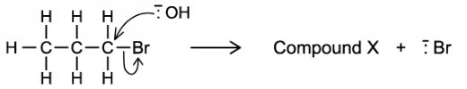

Show mark scheme / model answer
<ul><li><strong>(a)</strong> Gasoline is an alkane; give the name and formula shown in Fig. 3.1.</li><li><strong>(b)</strong> Free-radical substitution; the four products are positional isomers.</li><li><strong>(c)</strong> OH− is a nucleophile; X is propan-1-ol; hot ethanolic hydroxide gives elimination.</li><li><strong>(d)(i)</strong> The carbonyl carbon is sp2 hybridised with three regions of electron density, giving trigonal-planar geometry.</li><li><strong>(d)(ii)</strong> After CN− addition it is sp3, tetrahedral, with an angle close to 109.5°.</li></ul>

:::

::: {.question-card #aso-sq-09}
### Question 9 · 3.1 SQ Medium Q4(a-d)

<strong>(a)(i)</strong> Name the shortest straight-chain alkane to have structural isomers and the isomer.

<strong>(a)(ii)</strong> State the type of isomerism shown by the isomers in part (a)(i).

<strong>(b)(i)</strong> C4H8 exists as several isomers. Name the homologous series that C4H8 belongs to.

<strong>(b)(ii)</strong> Draw the skeletal formulae of two cyclic C4H8 isomers and two C4H8 isomers that show cis/trans isomerism.

<strong>(b)(iii)</strong> There are two unsaturated C4H8 isomers that do not show cis/trans isomerism. Name these isomers and explain why they do not show cis/trans isomerism.

<strong>(c)</strong> Draw the displayed formulae of 2,4-dimethylhexan-3-ol, 2,4-dimethyl-3-chloropentane and 2-aminobutane and, where appropriate, identify any chiral centres.

<strong>(d)</strong> 1-bromopropan-1-ol exhibits optical isomerism. Draw 3D representations of the two enantiomers.

Show mark scheme / model answer
<ul><li><strong>(a)</strong> Butane and 2-methylpropane; chain isomerism.</li><li><strong>(b)</strong> Alkene; cyclic examples include cyclobutane and methylcyclopropane; cis/trans examples include cis- and trans-but-2-ene; but-1-ene and 2-methylpropene do not show cis/trans because one alkene carbon has two identical groups.</li><li><strong>(c)</strong> Draw all three displayed formulae and mark each carbon attached to four different groups.</li><li><strong>(d)</strong> Draw the two non-superimposable mirror-image structures.</li></ul>

:::

::: {.question-card #aso-sq-10}
### Question 10 · 3.1 SQ Medium Q5(a-d)

<strong>(a)</strong> Explain why cyclohexane C6H12 has a puckered, non-planar shape by making reference to the C–C–C bond angles and the type of hybridisation of carbon in the molecule.

<strong>(b)</strong> Urea, CO(NH2)2, is present in solution in animal urine. Describe the hybridisation of C and N in the molecule, giving approximate bond angles.

<strong>(c)</strong> Describe the hybridisation of the carbon atom in methane and explain how the concept of hybridisation can be used to explain the shape of the methane molecule.

<strong>(d)</strong> A molecule of ethanol is shown in Fig. 5.1. Deduce the hybridisation of the carbon atom marked in the diagram.

Show mark scheme / model answer
<ul><li><strong>(a)</strong> Carbon is sp3 hybridised and prefers 109.5°. A planar hexagon would force 120°, so the ring puckers.</li><li><strong>(b)</strong> The carbonyl C is sp2 with angles near 120°; the N atoms are approximately sp2 because their lone pairs are delocalised.</li><li><strong>(c)</strong> Carbon forms four equivalent sp3 orbitals directed tetrahedrally, giving 109.5° H–C–H angles.</li><li><strong>(d)</strong> The marked carbon is classified from its number of electron-density regions; a carbon in a single-bonded saturated environment is sp3.</li></ul>

:::

## Original question PDFs

- [3.1 Choice Easy](../assets/questions/original-source/3.1_organic_as_choice_easy.pdf)
- [3.1 Choice Medium](../assets/questions/original-source/3.1_organic_as_choice_medium.pdf)
- [3.1 Choice Hard](../assets/questions/original-source/3.1_organic_as_choice_hard.pdf)
- [3.1 SQ Easy](../assets/questions/original-source/3.1_organic_as_sq_easy.pdf)
- [3.1 SQ Medium](../assets/questions/original-source/3.1_organic_as_sq_medium.pdf)
- [3.1 SQ Hard](../assets/questions/original-source/3.1_organic_as_sq_hard.pdf)
