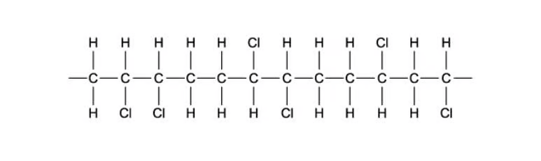
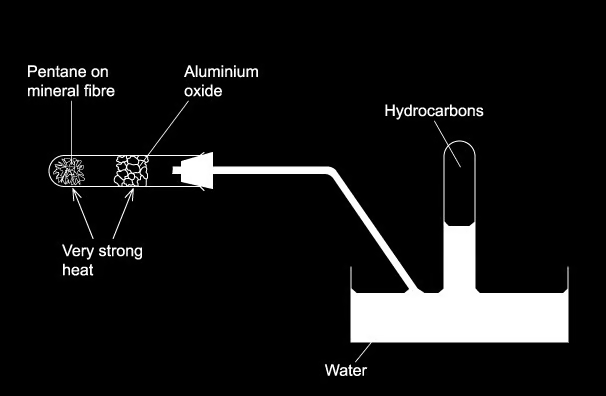
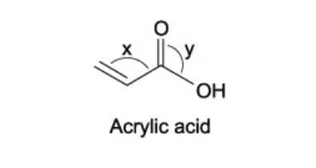
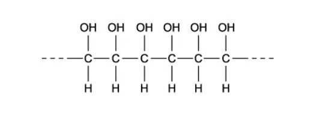
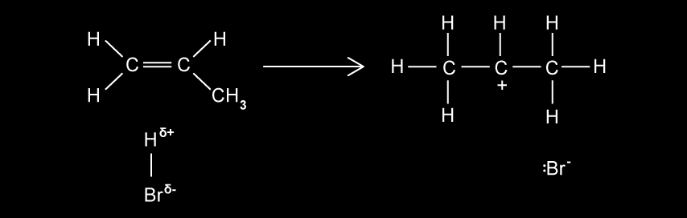
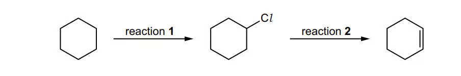
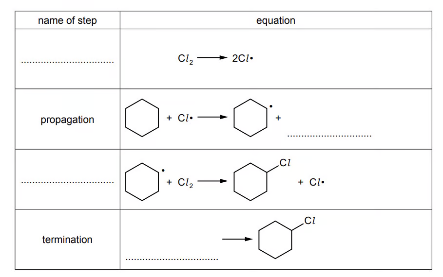
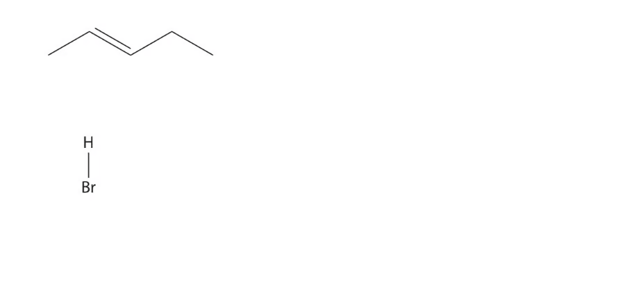
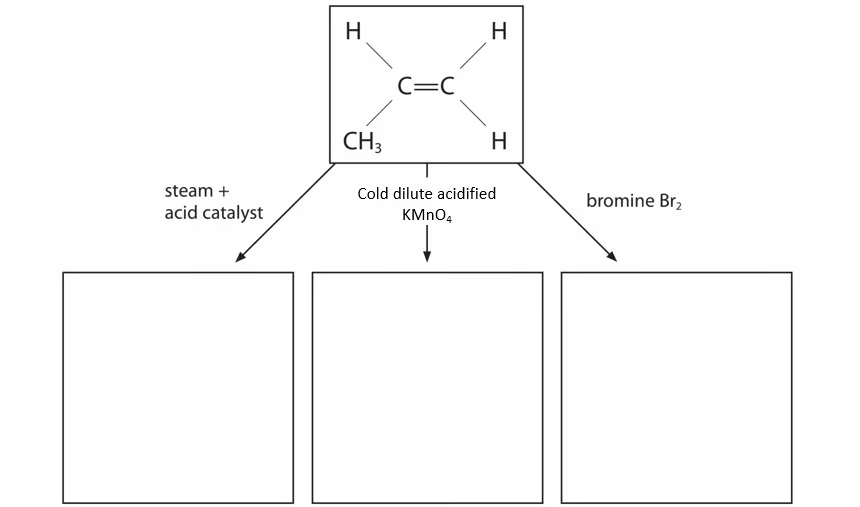
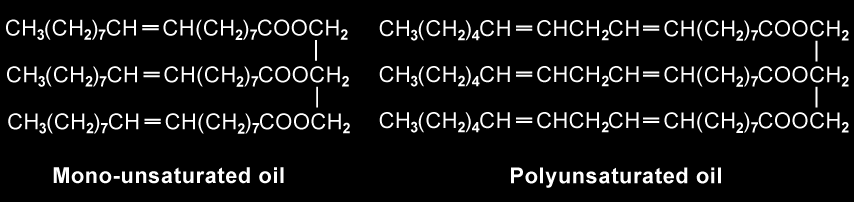

# 14 Hydrocarbons

本章只覆盖 AS 3.2 Hydrocarbons：alkanes、alkenes、crude oil、cracking、combustion、free-radical substitution、electrophilic addition、oxidation 和 addition polymerisation。题目均来自 **3.2 Hydrocarbons** 原题；不能独立提取的题图未使用截图替代。

## Learning objectives

- explain alkane unreactivity and free-radical substitution;
- describe fractional distillation, cracking and combustion of hydrocarbon fuels;
- apply electrophilic addition reactions of alkenes;
- use bromine water and manganate(VII) reactions to identify C=C;
- explain addition polymerisation and environmental effects of vehicle emissions.

## 14.1 Alkanes and free-radical substitution

Alkanes are saturated hydrocarbons with the general formula CnH2n+2. They are relatively unreactive because C–C and C–H bonds have high bond enthalpies and are almost non-polar. They undergo combustion and, with halogens under UV light, free-radical substitution.

For chlorination of methane:

Initiation: Cl2 → 2Cl· Propagation: Cl· + CH4 → HCl + CH3· Propagation: CH3· + Cl2 → CH3Cl + Cl· Termination: CH3· + CH3· → C2H6

Initiation makes radicals, propagation uses and regenerates a radical, and termination removes radicals. Homolytic fission splits the bonding pair equally: Cl–Cl → 2Cl·.

## 14.2 Crude oil, fractionation and cracking

Crude oil is a mixture of hydrocarbons, mainly alkanes. Fractional distillation separates fractions by boiling point: larger molecules have stronger London forces and higher boiling points. A fraction contains hydrocarbons with a range of chain lengths, not one pure compound.

**Cracking** breaks larger saturated hydrocarbons into smaller, more useful molecules, producing alkanes and alkenes. It is carried out by vaporising the fraction and passing it over a hot catalyst such as alumina/silica, or by strong heating. It meets demand for small fuel molecules and for alkene feedstock. For example:

C8H18 → C5H12 + C3H6

## 14.3 Alkenes and electrophilic addition

Alkenes contain C=C and have general formula CnH2n for an open-chain molecule with one double bond. The π bond is electron-rich and weaker than the σ bond, so it reacts with electrophiles. In electrophilic addition, the alkene first donates π electrons to an electrophile, forming a carbocation; a negative ion then bonds to the positive carbon.

| Reagent and conditions | Product / observation |
|---|---|
| Br2 in organic solvent | dibromoalkane; bromine decolourises |
| Br2(aq) | bromoalcohol and dibromoalkane |
| steam, phosphoric acid catalyst, 600 K, high pressure | alcohol |
| HBr | bromoalkane; unsymmetrical alkenes may give major/minor products |
| H2, Ni, heat | alkane |
| cold dilute acidified KMnO4 | vicinal diol; purple decolourises |
| hot concentrated acidified KMnO4 | oxidative cleavage of C=C |

The more stable carbocation is formed more readily; this explains the major product in addition of HBr to an unsymmetrical alkene.

## 14.4 Combustion, emissions and catalytic converters

Complete combustion has excess oxygen and makes CO2 and H2O. Incomplete combustion, when oxygen is limited, produces CO and/or carbon. Carbon monoxide binds strongly to haemoglobin and reduces oxygen transport. High-temperature engines also form NOx; NOx and unburnt hydrocarbons contribute to photochemical smog.

Catalytic converters use redox reactions to reduce NOx to N2 and oxidise CO/hydrocarbons to CO2 and H2O, for example 2CO + 2NO → 2CO2 + N2.

## 14.5 Addition polymerisation

In addition polymerisation, many alkene monomers join when the C=C opens, forming only C–C σ bonds in the backbone. The repeat unit is shown in brackets with continuation bonds, for example poly(propene): [–CH2–CH(CH3)–]n. No small molecule is eliminated.

## Multiple choice questions

::: {.mc-question #hc-mc-01 data-answer="B"}
### Question 1 · 3.2 Choice Easy Q1

Which equation represents a valid propagation step in the free radical reaction between ethane and chlorine?

<button class="mc-choice" data-choice="A"><strong>A</strong>C2H6 + Cl· → C2H5Cl + H·</button><button class="mc-choice" data-choice="B"><strong>B</strong>C2H5Cl + Cl· → C2H4Cl· + HCl</button><button class="mc-choice" data-choice="C"><strong>C</strong>C2H6 + H· → C2H5· + HCl</button><button class="mc-choice" data-choice="D"><strong>D</strong>C2H5· + Cl· → C2H5Cl</button>

<button class="check-answer">Check answer</button>

Show explanation

<strong>B.</strong> It consumes one radical and forms one radical. D is termination because radicals are destroyed.

:::

::: {.mc-question #hc-mc-02 data-answer="B"}
### Question 2 · 3.2 Choice Easy Q2

A fraction of distilled crude oil contains molecules with between 15 and 19 carbon atoms. This fraction is cracked by strong heating. Why is this done? 1 To produce alkenes. 2 To produce smaller molecules which are in higher demand. 3 To insert oxygen atoms into the hydrocarbons.

<button class="mc-choice" data-choice="A"><strong>A</strong>1, 2 and 3</button><button class="mc-choice" data-choice="B"><strong>B</strong>1 and 2</button><button class="mc-choice" data-choice="C"><strong>C</strong>2 and 3</button><button class="mc-choice" data-choice="D"><strong>D</strong>1 only</button>
<button class="check-answer">Check answer</button>

Show explanation

<strong>B.</strong> Cracking produces smaller hydrocarbons including alkenes; it does not insert oxygen.

:::

::: {.mc-question #hc-mc-03 data-answer="B"}
### Question 3 · 3.2 Choice Easy Q3

Ethene reacts with steam in the presence of sulfuric acid: C2H4 + H2O → CH3CH2OH. What type of reaction is this?

<button class="mc-choice" data-choice="A"><strong>A</strong>acid/base</button><button class="mc-choice" data-choice="B"><strong>B</strong>addition</button><button class="mc-choice" data-choice="C"><strong>C</strong>hydrolysis</button><button class="mc-choice" data-choice="D"><strong>D</strong>substitution</button>
<button class="check-answer">Check answer</button>

Show explanation

<strong>B.</strong> H and OH add across the C=C.

:::

::: {.mc-question #hc-mc-04 data-answer="C"}
### Question 4 · 3.2 Choice Easy Q4

Which statements about alkenes are correct? 1 They are less reactive than alkanes towards electrophiles. 2 They are used as monomers for polymerisation. 3 They are formed when higher alkanes are cracked.

<button class="mc-choice" data-choice="A"><strong>A</strong>1, 2 and 3</button><button class="mc-choice" data-choice="B"><strong>B</strong>1 and 2</button><button class="mc-choice" data-choice="C"><strong>C</strong>2 and 3</button><button class="mc-choice" data-choice="D"><strong>D</strong>3 only</button>
<button class="check-answer">Check answer</button>

Show explanation

<strong>C.</strong> Alkenes are more reactive towards electrophiles because of their π bond.

:::

::: {.mc-question #hc-mc-05 data-answer="D"}
### Question 5 · 3.2 Choice Easy Q5

One catalytic-converter reaction is between nitrogen oxide and octane. Which equation gives only non-toxic products?

<button class="mc-choice" data-choice="A"><strong>A</strong>C8H18 + 16NO → 8CO + 8N2 + 9H2O</button><button class="mc-choice" data-choice="B"><strong>B</strong>C8H18 + 24NO → 8CO2 + 12N2 + 8H2O</button><button class="mc-choice" data-choice="C"><strong>C</strong>C8H18 + 17NO → 8CO + 8½N2 + 9H2O</button><button class="mc-choice" data-choice="D"><strong>D</strong>C8H18 + 25NO → 8CO2 + 12½N2 + 9H2O</button>
<button class="check-answer">Check answer</button>

Show explanation

<strong>D.</strong> It is balanced and gives CO2, N2 and water, rather than toxic CO.

:::

::: {.mc-question #hc-mc-06 data-answer="A"}
### Question 6 · 3.2 Choice Easy Q6

When bromine reacts with propene in an organic solvent at room temperature, what is the mechanism by which bromine attacks the propene?

<button class="mc-choice" data-choice="A"><strong>A</strong>electrophilic addition</button><button class="mc-choice" data-choice="B"><strong>B</strong>electrophilic substitution</button><button class="mc-choice" data-choice="C"><strong>C</strong>nucleophilic addition</button><button class="mc-choice" data-choice="D"><strong>D</strong>nucleophilic substitution</button>
<button class="check-answer">Check answer</button>

Show explanation

<strong>A.</strong> The alkene π bond attacks polarised Br2.

:::

::: {.mc-question #hc-mc-07 data-answer="B"}
### Question 7 · 3.2 Choice Easy Q7
{.question-figure fig-alt="Displayed polymer chain with chlorine substituents"}

Which monomer could produce a polymer with repeating unit –CH2–CH(Cl)–?

<button class="mc-choice" data-choice="A"><strong>A</strong>CHCl=CHCl</button><button class="mc-choice" data-choice="B"><strong>B</strong>CH2=CHCl</button><button class="mc-choice" data-choice="C"><strong>C</strong>CH3CCl=CHCl</button><button class="mc-choice" data-choice="D"><strong>D</strong>CH3CCl=CH2</button>
<button class="check-answer">Check answer</button>

Show explanation

<strong>B.</strong> Addition polymerisation opens the double bond while retaining the Cl substituent.

:::

::: {.mc-question #hc-mc-08 data-answer="D"}
### Question 8 · 3.2 Choice Easy Q8

Four students made statements about alkanes and alkenes. W: bromine reacts with alkanes by electrophilic substitution. X: bromine reacts with alkenes by a free-radical addition mechanism. Y: alkenes can be oxidised by acidified manganate(VII) ions. Z: alkenes are formed from alkanes by cracking. Which two students are correct?

<button class="mc-choice" data-choice="A"><strong>A</strong>W and X</button><button class="mc-choice" data-choice="B"><strong>B</strong>W and Z</button><button class="mc-choice" data-choice="C"><strong>C</strong>X and Y</button><button class="mc-choice" data-choice="D"><strong>D</strong>Y and Z</button>
<button class="check-answer">Check answer</button>

Show explanation

<strong>D.</strong> Alkane halogenation is free-radical substitution; alkene bromination is electrophilic addition.

:::

::: {.mc-question #hc-mc-09 data-answer="D"}
### Question 9 · 3.2 Choice Easy Q9

The hydrocarbon C17H36 can be cracked. Which compound is least likely to be produced?

<button class="mc-choice" data-choice="A"><strong>A</strong>C3H8</button><button class="mc-choice" data-choice="B"><strong>B</strong>C4H8</button><button class="mc-choice" data-choice="C"><strong>C</strong>C8H16</button><button class="mc-choice" data-choice="D"><strong>D</strong>C16H34</button>
<button class="check-answer">Check answer</button>

Show explanation

<strong>D.</strong> This would leave only CH2, not a realistic stable hydrocarbon co-product.

:::

::: {.mc-question #hc-mc-10 data-answer="C"}
### Question 10 · 3.2 Choice Easy Q10

In ultraviolet light, ethane and chlorine react to give a mixture of products. Which compound could be present?

<button class="mc-choice" data-choice="A"><strong>A</strong>CH3Cl</button><button class="mc-choice" data-choice="B"><strong>B</strong>CH3CH2CH2Cl</button><button class="mc-choice" data-choice="C"><strong>C</strong>CH3CH2CH2CH3</button><button class="mc-choice" data-choice="D"><strong>D</strong>CH3CH2CH2CH2CH3</button>
<button class="check-answer">Check answer</button>

Show explanation

<strong>C.</strong> Two ethyl radicals can combine in a termination step: C2H5· + C2H5· → C4H10.

:::

::: {.mc-question #hc-mc-11 data-answer="B"}
### Question 11 · 3.2 Choice Medium Q1

The cracking of one CnH2n+2 molecule produces two hydrocarbon molecules only. Each contains the same number of carbon atoms and has non-cyclic structural isomers. What is n?

<button class="mc-choice" data-choice="A"><strong>A</strong>10</button><button class="mc-choice" data-choice="B"><strong>B</strong>8</button><button class="mc-choice" data-choice="C"><strong>C</strong>6</button><button class="mc-choice" data-choice="D"><strong>D</strong>4</button>
<button class="check-answer">Check answer</button>

Show explanation

<strong>B.</strong> Each product must have four carbons (the first chain length with structural isomers), so the parent has eight.

:::

::: {.mc-question #hc-mc-12 data-answer="B"}
### Question 12 · 3.2 Choice Medium Q2

Which reaction would not give propene?

<button class="mc-choice" data-choice="A"><strong>A</strong>hot concentrated sulfuric acid with propan-1-ol</button><button class="mc-choice" data-choice="B"><strong>B</strong>warm aqueous sodium hydroxide with 2-bromopropane</button><button class="mc-choice" data-choice="C"><strong>C</strong>warm ethanolic sodium hydroxide with 1-bromopropane</button><button class="mc-choice" data-choice="D"><strong>D</strong>propan-2-ol vapour over heated aluminium oxide</button>
<button class="check-answer">Check answer</button>

Show explanation

<strong>B.</strong> Aqueous OH− gives substitution to propan-2-ol; ethanolic OH− favours elimination.

:::

::: {.mc-question #hc-mc-13 data-answer="C"}
### Question 13 · 3.2 Choice Medium Q3

Ethene reacts with aqueous bromine to give CH2BrCH2Br and CH2BrCH2OH. Which statement about these products is correct?

<button class="mc-choice" data-choice="A"><strong>A</strong>both form by electrophilic substitution</button><button class="mc-choice" data-choice="B"><strong>B</strong>both form by nucleophilic addition</button><button class="mc-choice" data-choice="C"><strong>C</strong>both can be hydrolysed to form the same organic compound</button><button class="mc-choice" data-choice="D"><strong>D</strong>both form hydrogen bonds with water</button>
<button class="check-answer">Check answer</button>

Show explanation

<strong>C.</strong> Hydrolysis of either can give ethane-1,2-diol; only the bromoalcohol itself has an O–H bond.

:::

::: {.mc-question #hc-mc-14 data-answer="D"}
### Question 14 · 3.2 Choice Medium Q4

Which hydrocarbon would not be collected on heating pentane over aluminium oxide?

<button class="mc-choice" data-choice="A"><strong>A</strong>CH4</button><button class="mc-choice" data-choice="B"><strong>B</strong>CH3CH3</button><button class="mc-choice" data-choice="C"><strong>C</strong>CH3CH2CH=CH2</button><button class="mc-choice" data-choice="D"><strong>D</strong>CH3(CH2)8CH3</button>
<button class="check-answer">Check answer</button>

Show explanation

<strong>D.</strong> A cracking reaction cannot make a ten-carbon product from pentane.

:::

::: {.mc-question #hc-mc-15 data-answer="A"}
### Question 15 · 3.2 Choice Medium Q5

Pent-2-ene reacts with cold, dilute, acidified manganate(VII) ions. What is produced in the greatest amount?

<button class="mc-choice" data-choice="A"><strong>A</strong>CH3CH2CH(OH)CH(OH)CH3</button><button class="mc-choice" data-choice="B"><strong>B</strong>CH3CH2COCOCH3</button><button class="mc-choice" data-choice="C"><strong>C</strong>a mixture of pentanols</button><button class="mc-choice" data-choice="D"><strong>D</strong>CH3CH2COOH and CH3COOH</button>
<button class="check-answer">Check answer</button>

Show explanation

<strong>A.</strong> Mild oxidation adds an OH group to each carbon of C=C, forming a diol.

:::

::: {.mc-question #hc-mc-16 data-answer="C"}
### Question 16 · 3.2 Choice Medium Q8

Which alkenes, on reaction with steam at 600 K and high pressure in the presence of phosphoric acid, could produce an alcohol containing a chiral carbon atom? 1 (CH3)2C=CH2  2 CH3CH=CHCH3  3 CH3CH2CH=CH2

<button class="mc-choice" data-choice="A"><strong>A</strong>1, 2 and 3</button><button class="mc-choice" data-choice="B"><strong>B</strong>1 and 2</button><button class="mc-choice" data-choice="C"><strong>C</strong>2 and 3</button><button class="mc-choice" data-choice="D"><strong>D</strong>1 only</button>
<button class="check-answer">Check answer</button>

Show explanation

<strong>C.</strong> Hydration of but-2-ene or but-1-ene can give butan-2-ol with four different groups at C2.

:::

::: {.mc-question #hc-mc-17 data-answer="D"}
### Question 17 · 3.2 Choice Medium Q9

0.200 mol of a hydrocarbon undergoes complete combustion to give 35.2 g CO2 and 14.4 g H2O. What is its molecular formula?

<button class="mc-choice" data-choice="A"><strong>A</strong>C2H4</button><button class="mc-choice" data-choice="B"><strong>B</strong>C2H6</button><button class="mc-choice" data-choice="C"><strong>C</strong>C4H4</button><button class="mc-choice" data-choice="D"><strong>D</strong>C4H8</button>
<button class="check-answer">Check answer</button>

Show explanation

<strong>D.</strong> n(CO2)=35.2/44.0=0.800 mol, giving 0.800/0.200=4 carbon atoms. n(H2O)=14.4/18.0=0.800 mol, giving 2×0.800/0.200=8 hydrogen atoms.

:::

::: {.mc-question #hc-mc-18 data-answer="C"}
### Question 18 · 3.2 Choice Hard Q3
{.question-figure fig-alt="Displayed structure of acrylic acid with bond angles X and Y"}

Acrylic acid is produced from propene. Which statement about acrylic acid is not correct?

<button class="mc-choice" data-choice="A"><strong>A</strong>Both indicated carbon bond angles are approximately 120°.</button><button class="mc-choice" data-choice="B"><strong>B</strong>It decolourises aqueous bromine.</button><button class="mc-choice" data-choice="C"><strong>C</strong>It gives an orange precipitate with 2,4-dinitrophenylhydrazine reagent.</button><button class="mc-choice" data-choice="D"><strong>D</strong>It reacts with an alcohol to give an ester.</button>
<button class="check-answer">Check answer</button>

Show explanation

<strong>C.</strong> A carboxylic acid does not contain an aldehyde or ketone carbonyl required for the 2,4-DNPH test.

:::

::: {.mc-question #hc-mc-19 data-answer="B"}
### Question 19 · 3.2 Choice Hard Q6

Alkane X has formula C4H10. X reacts with Cl2 in sunlight to produce only two monochloroalkanes. Both form the same alkene Y, and no other organic products, with hot ethanolic KOH. What is produced when Y is treated with hot concentrated acidified KMnO4?

<button class="mc-choice" data-choice="A"><strong>A</strong>CO2 and CH3CH2CO2H</button><button class="mc-choice" data-choice="B"><strong>B</strong>CO2 and CH3COCH3</button><button class="mc-choice" data-choice="C"><strong>C</strong>HCO2H and CH3COCH3</button><button class="mc-choice" data-choice="D"><strong>D</strong>CH3CO2H only</button>
<button class="check-answer">Check answer</button>

Show explanation

<strong>B.</strong> X is 2-methylpropane and Y is 2-methylpropene. Oxidative cleavage gives propanone and CO2.

:::

::: {.mc-question #hc-mc-20 data-answer="C"}
### Question 20 · 3.2 Choice Hard Q7
{.question-figure fig-alt="Polymer chain with hydroxyl groups on alternating carbon atoms"}

A possible polymer has repeat unit –CH2–CH(OH)–. By which method might this polymer be made?

<button class="mc-choice" data-choice="A"><strong>A</strong>polymerise ethene followed by hydration</button><button class="mc-choice" data-choice="B"><strong>B</strong>polymerise ethene followed by oxidation with cold acidified KMnO4</button><button class="mc-choice" data-choice="C"><strong>C</strong>polymerise 1,2-dichloroethene followed by hydrolysis</button><button class="mc-choice" data-choice="D"><strong>D</strong>polymerise 1,2-dichloroethene followed by oxidation with cold acidified KMnO4</button>
<button class="check-answer">Check answer</button>

Show explanation

<strong>C.</strong> Hydrolysis replaces Cl by OH on the polymer chain.

:::

## Structured questions

::: {.question-card #hc-sq-01}
### Question 1 · 3.2 SQ Easy Q1(a-d)

<strong>(a)</strong> State two reasons why alkanes are unreactive.

<strong>(b)(i)</strong> Methane reacts with chlorine to produce chloromethane, CH3Cl. The reaction is initiated by the formation of chlorine radicals. State what is meant by a radical.

<strong>(b)(ii)</strong> State the condition required to form chlorine free radicals from Cl2.

<strong>(c)</strong> State the type of bond fission involved in the reaction in part (b).

<strong>(d)(i)</strong> Chloromethane will be formed via several steps. Write the equations for the two propagation steps.

<strong>(d)(ii)</strong> Write an equation to show how ethane can be formed in this reaction.

Show mark scheme / model answer
<ol><li>C–C/C–H bonds are strong (high bond enthalpy) and almost non-polar.</li><li>A radical is a species with an unpaired electron. UV light is required.</li><li>Homolytic fission: each atom takes one electron from the covalent bond.</li><li>Cl· + CH4 → HCl + CH3·; CH3· + Cl2 → CH3Cl + Cl·.</li><li>CH3· + CH3· → C2H6; this is a termination step.</li></ol>

:::

::: {.question-card #hc-sq-03}
### Question 2 · 3.2 SQ Easy Q2(a-d)

This question is about the reactions of propene. Complete the flowchart below to show the major organic product formed in each of the addition reactions.

<strong>(b)</strong> Use ‘curly’ arrows to complete the mechanism for the formation of the major product when propene, CH3CH=CH2, reacts with hydrogen bromide, HBr.

<strong>(c)</strong> Draw the displayed formula of the minor product formed from the reaction of propene and hydrogen bromide.

<strong>(d)</strong> Explain why there is a major and minor product formed from the reaction between propene and hydrogen bromide.

Show mark scheme / model answer
<ul><li>Flowchart products: propan-2-ol with steam/acid catalyst; 1,2-dibromopropane with Br2; propane with H2/Ni.</li><li>The π bond attacks Hδ+, the H–Br bond breaks to Br−, and Br− attacks the secondary carbocation. The major product is 2-bromopropane.</li><li>The minor product is 1-bromopropane, CH3CH2CH2Br.</li><li>Both carbocations can form, but the secondary carbocation is more stable, so its pathway is favoured.</li></ul>

:::

::: {.question-card #hc-sq-04}
### Question 3 · 3.2 SQ Easy Q3(a-d)

<strong>(a)</strong> State the difference between complete and incomplete combustion of a hydrocarbon fuel, such as octane. Include the balanced symbol equation for each in your answer.

<strong>(b)(i)</strong> Octane is found in petrol. Carbon monoxide is a colourless, odourless and poisonous gas which is emitted in the exhaust fumes of motor vehicles that use a petrol internal combustion engine. State why carbon monoxide can cause dizziness, fainting, loss of consciousness and death in humans.

<strong>(b)(ii)</strong> State another pollutant that is also released in cars’ exhaust fumes. Explain the effect of this pollutant in the atmosphere.

<strong>(c)(i)</strong> Octane can be cracked to form pentane and one other product. Give the balanced symbol equation for this reaction.

<strong>(c)(ii)</strong> Describe how catalytic cracking is carried out.

<strong>(d)</strong> Describe and give the result of a chemical test that would distinguish between the two products.

Show mark scheme / model answer
<ol><li>Complete combustion uses sufficient O2: 2C8H18 + 25O2 → 16CO2 + 18H2O. Incomplete combustion has limited O2, for example 2C8H18 + 17O2 → 16CO + 18H2O.</li><li>CO binds strongly to haemoglobin, reducing oxygen transport in the blood.</li><li>NOx contributes to acid rain/photochemical smog; unburnt hydrocarbons contribute to photochemical smog.</li><li>C8H18 → C5H12 + C3H6; vaporise and pass over hot alumina/silica.</li><li>Bromine water: propene decolourises it; pentane shows no change without UV light.</li></ol>

:::

::: {.question-card #hc-sq-06}
### Question 4 · 3.2 SQ Medium Q1(a-d)
{.question-figure fig-alt="Reaction scheme converting cyclohexane to chlorocyclohexane and then cyclohexene"}
{.question-figure fig-alt="Completion table for initiation, propagation and termination steps"}

A reaction scheme involving cyclohexane is shown in Fig. 4.1. Reaction 1 involves a free radical substitution mechanism.

<strong>(a)</strong> State the essential condition required for reaction 1 to occur.

<strong>(b)</strong> Complete Table 4.1 to give details of the mechanism in reaction 1. Include curly arrows to show the movement of electrons occurring in the termination step.

<strong>(c)</strong> Deduce the type of reaction that occurs in reaction 2.

<strong>(d)</strong> Hex-3-ene is an isomer of cyclohexane. Hex-3-ene can be converted into propanoic acid. Deduce the reagents and conditions for reaction 3.

Show mark scheme / model answer
<ol><li>UV light/sunlight.</li><li>Initiation: Cl2 → 2Cl·. Propagation: Cl· + C6H12 → HCl + C6H11·; C6H11· + Cl2 → C6H11Cl + Cl·. Termination: two radicals combine.</li><li>Elimination (dehydrohalogenation).</li><li>Hot concentrated acidified KMnO4; oxidative cleavage of the central C=C produces two propanoic-acid molecules.</li></ol>

:::

::: {.question-card #hc-sq-07}
### Question 5 · 3.2 SQ Medium Q2(a-d)
{.question-figure fig-alt="Pent-2-ene and hydrogen bromide setup for drawing the electrophilic addition mechanism"}

This question is about alkenes with the molecular formula C5H10.

<strong>(a)</strong> Draw the skeletal formulae of three branched-chain alkenes with the molecular formula C5H10.

<strong>(b)(i)</strong> An alcohol can react with concentrated phosphoric acid, H3PO4, to form pent-2-ene. Give the formula of the alcohol that will form only pent-2-ene during this reaction.

<strong>(b)(ii)</strong> Give a name for this type of reaction.

<strong>(c)</strong> Pent-2-ene reacts with hydrogen bromide, HBr, to form two bromoalkanes. Complete the diagram to show the mechanism for the formation of 2-bromopentane. Include curly arrows, and relevant lone pairs and dipoles.

<strong>(d)</strong> A sample of pent-1-ene, with a mass of 1.33 g, is warmed to 60 °C in a sealed container. The volume of the container is 500 cm3. Calculate the pressure inside the container. Include units and give your answer to an appropriate number of significant figures. (R = 8.31 J mol−1 K−1.)

Show mark scheme / model answer
<ul><li>Draw three valid branched-chain alkenes, for example 2-methylbut-1-ene, 3-methylbut-1-ene and 2-methylbut-2-ene.</li><li>Pentan-3-ol, CH3CH2CH(OH)CH2CH3.</li><li>The reaction is elimination/dehydration.</li><li>Show electrophilic addition: π electrons attack Hδ+, H–Br breaks to Br−, then Br− attacks the carbocation.</li><li>n = 1.33/70.0 = 0.0190 mol; T = 333 K; V = 5.00 × 10−4 m3; p = nRT/V = 1.05 × 105 Pa.</li></ul>

:::

::: {.question-card #hc-sq-08}
### Question 6 · 3.2 SQ Medium Q3(a-d)

Crude oil contains a mixture of hydrocarbons which are separated using fractional distillation. Further processes can then be carried out, including cracking.

<strong>(a)(i)</strong> What is meant by the term ‘cracking’?

<strong>(a)(ii)</strong> Explain why cracking is carried out.

<strong>(b)(i)</strong> State two conditions required for the cracking of alkanes.

<strong>(b)(ii)</strong> Construct a balanced equation for the formation of heptane, C7H16, and two other products, by cracking tetradecane, C14H30.

<strong>(c)(i)</strong> Another alkane, C8H18, is used in gasoline. Explain why carbon monoxide is dangerous if inhaled.

<strong>(c)(ii)</strong> Describe the environmental effect of oxides of nitrogen and unburnt hydrocarbons.

<strong>(d)</strong> Catalytic converters are found in the exhaust system of cars. Use equations to show how a catalytic converter reduces the levels of carbon monoxide and oxides of nitrogen released into the atmosphere.

Show mark scheme / model answer
<ol><li>Cracking is thermal decomposition of large hydrocarbon molecules into smaller hydrocarbons. It is carried out to meet demand for smaller fuels and alkenes.</li><li>High temperature and a catalyst (or strong heating in thermal cracking).</li><li>One valid equation is C14H30 → C7H16 + C4H8 + C3H6.</li><li>CO forms a stable complex with haemoglobin, preventing blood from carrying enough oxygen.</li><li>NOx and hydrocarbons react in sunlight to form photochemical smog; NOx also forms acids in rain.</li><li>2CO + 2NO → 2CO2 + N2; 2CO + O2 → 2CO2.</li></ol>

:::

::: {.question-card #hc-sq-10}
### Question 7 · 3.2 SQ Medium Q4(a-d)
{.question-figure fig-alt="Flowchart showing propene reacting with steam, acidified potassium manganate(VII) and bromine"}

This question is about alkanes and alkenes. Propene and propane can be produced from the cracking of hexane, C6H14.

<strong>(a)</strong> Explain why propane is relatively unreactive.

<strong>(b)</strong> Describe and give the result of a test that can be done to distinguish between the two hydrocarbons.

<strong>(c)(i)</strong> The reagents needed for three reactions of propene are shown in Fig. 4.1. Complete Fig. 4.1 by drawing the structure of the organic product produced in each reaction.

<strong>(c)(ii)</strong> Propene also reacts with hydrogen bromide, HBr. Give the mechanism for this reaction to form the major product. Include curly arrows, and relevant lone pairs and dipoles.

<strong>(d)</strong> Propene reacts by addition polymerisation to form poly(propene). Draw the structure of poly(propene), showing two repeat units.

Show mark scheme / model answer
<ol><li>Propane has strong C–C/C–H σ bonds with low polarity, so much energy is needed to break bonds and it has no electron-rich π bond.</li><li>Add bromine water: propene decolourises it; propane remains orange/brown under these conditions.</li><li>Steam gives propan-2-ol; cold dilute acidified KMnO4 gives propane-1,2-diol; bromine water gives 1-bromopropan-2-ol and 1,2-dibromopropane.</li><li>Correct repeat units are –CH2–CH(CH3)–CH2–CH(CH3)– within continuation bonds.</li></ol>

:::

::: {.question-card #hc-sq-11}
### Question 8 · 3.2 SQ Hard Q1(a-d)

This question is about free radical substitution. 1,2-dibromoethane reacts with bromine in UV light to produce a mixture of further substituted haloalkanes.

<strong>(a)(i)</strong> Write an equation for the initiation step.

<strong>(a)(ii)</strong> Explain why this is an example of homolytic fission.

<strong>(b)</strong> Write two equations showing the propagation of this chain reaction to produce 1,1,2-tribromoethane.

<strong>(c)(i)</strong> Traces of 1,2,3,4-tetrabromobutane are found in the reaction mixture. Write an equation to show how this product is formed.

<strong>(c)(ii)</strong> Write a balanced symbol equation to show the overall reaction between 1,1,2-tribromoethane with bromine in UV light to form hexabromoethane.

<strong>(d)</strong> Using the information from this question and your own knowledge, suggest the limitations of free radical substitution.

Show mark scheme / model answer
<ol><li>Br2 → 2Br· under UV light.</li><li>One electron from Br–Br goes to each Br atom, making two radicals.</li><li>Br· removes H, then the carbon radical reacts with Br2; show correct radical chain equations.</li><li>Radical coupling gives higher-mass products; continued substitution gives heavily brominated products.</li><li>It gives a mixture of products, may substitute at more than one position and makes separation difficult.</li></ol>

:::

::: {.question-card #hc-sq-12}
### Question 9 · 3.2 SQ Hard Q2(a-c)

This question is about hydrocarbons.

<strong>(a)(i)</strong> Write an equation for the reaction between sodium hydroxide and carbon dioxide.

<strong>(a)(ii)</strong> 10 cm3 of a gaseous hydrocarbon, CxHy, is reacted with 100 cm3 of oxygen gas, an excess. The final volume of the gaseous mixture is 95 cm3. After treatment with concentrated, aqueous sodium hydroxide, the volume is 75 cm3. Calculate the volume of carbon dioxide produced and the volume of oxygen used.

<strong>(a)(iii)</strong> Use your answers, together with the initial volume of hydrocarbon, to balance the combustion equation and deduce x, y and z.

<strong>(b)(i)</strong> A branched-chain hydrocarbon, W, with the formula C4H8, reacts with hydrogen bromide, HBr, to give two products X and Y. X and Y are structural isomers of molecular formula C4H9Br. More X is produced than Y. Give the structural formulae and names of W, X and Y.

<strong>(b)(ii)</strong> When W reacts with hydrogen bromide, more X than Y is produced. Explain why.

<strong>(c)</strong> Pent-2-ene will react with HBr. Draw the mechanism for the reaction of pent-2-ene with hydrogen bromide. You do not need to include any partial charges.

Show mark scheme / model answer
<ol><li>CO2 volume is 20 cm3; calculate O2 used from the initial/final gas volumes and balance using volume ratios.</li><li>W is 2-methylpropene. Addition gives 2-bromo-2-methylpropane as the major product through the more stable tertiary carbocation, plus 1-bromo-2-methylpropane.</li><li>Show electrophilic addition: π electrons to H of HBr, C–H bond formation/carbocation, then Br− attack.</li></ol>

:::

::: {.question-card #hc-sq-13}
### Question 10 · 3.2 SQ Hard Q3(a-b)

A student investigates the amount of C=C bonds in a molecule of cooking oil by titrating samples with bromine water.

<strong>(a)</strong> Suggest two improvements that the student could make to the procedure to obtain more consistent results.

<strong>(b)</strong> Use the student’s titration results, the approximate Mr of the cooking oil, its density, the volume of one drop and the concentration of bromine water to deduce the number of C=C double bonds in a molecule of the oil. Show your working.

<strong>(c)(i)</strong> Fig. 3.1 shows the structure of a mono-unsaturated oil and a polyunsaturated oil. Suggest what is meant by the terms mono-unsaturated oil and polyunsaturated.

<strong>(c)(ii)</strong> Suggest the reagent and conditions necessary to produce the mono-unsaturated oil from the polyunsaturated oil.

Show mark scheme / model answer
<ol><li>Use a fixed measured volume/mass of oil rather than drops; repeat titrations and calculate a mean; use a consistent endpoint and accurate volumetric apparatus.</li><li>Find mean moles of Br2, calculate moles of oil from mass/Mr, then use the 1:1 alkene:Br2 ratio to find the number of C=C bonds.</li></ol>

:::

## Original question PDFs

- [3.2 Choice Easy](../assets/questions/original-source/3.2_hydrocarbons___choice___easy.pdf)
- [3.2 Choice Medium](../assets/questions/original-source/3.2_hydrocarbons___choice___medium.pdf)
- [3.2 Choice Hard](../assets/questions/original-source/3.2_hydrocarbons___choice___hard.pdf)
- [3.2 SQ Easy](../assets/questions/original-source/3.2_hydrocarbons___sq___easy.pdf)
- [3.2 SQ Medium](../assets/questions/original-source/3.2_hydrocarbons___sq___medium.pdf)
- [3.2 SQ Hard](../assets/questions/original-source/3.2_hydrocarbons___sq___hard.pdf)
