# 15 Halogen compounds

本章只覆盖 AS 3.3 Halogen Compounds 中的 **15.1 Halogenoalkanes**。题目使用 AS 原题包中的原文，不改写题干；可独立提取的结构式、流程图、曲线图和装置图保留为独立图像。无法独立提取的整页图片不放入页面。

## Learning objectives

- identify primary, secondary and tertiary halogenoalkanes;
- explain nucleophilic substitution and distinguish SN1/SN2;
- predict products with OH−, CN− and NH3;
- use silver nitrate to compare halogenoalkane hydrolysis;
- explain the stability and environmental impact of CFCs.

## 15.1 Halogenoalkanes and the C–X bond

A halogenoalkane has a halogen attached to an alkyl group, R–X. The carbon bonded to the halogen is δ+ because halogen is more electronegative; it is attacked by nucleophiles. A **primary** halogenoalkane has the C–X carbon bonded to one other carbon, a secondary to two, and a tertiary to three.

The C–X bond strength decreases down the group: C–F > C–Cl > C–Br > C–I. Thus iodoalkanes hydrolyse fastest and chloroalkanes slowest (among Cl, Br and I). In warm ethanol/water with aqueous AgNO3, released halide gives AgCl white, AgBr cream, or AgI yellow precipitate. The rate follows RI > RBr > RCl because less bond energy is needed to break C–I.

### Core diagrams from the original 15.1 Note

The following independent diagrams are re-extracted from the original Note PDF and composited onto a white background. They summarise the three classes of halogenoalkane and the polarity of the C–X bond.

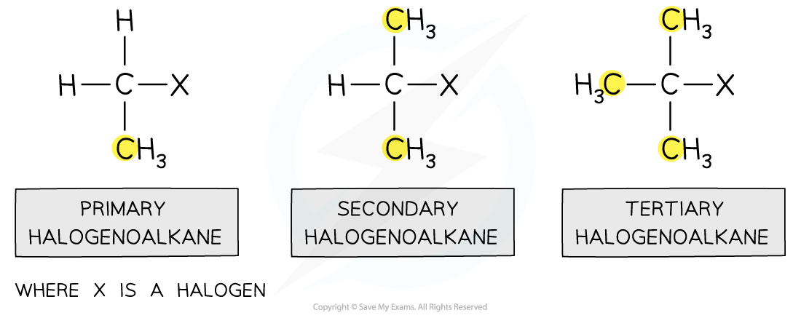{.concept-figure fig-alt="Primary, secondary and tertiary halogenoalkanes"}

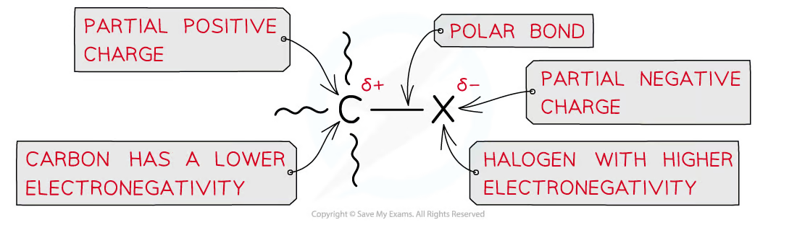{.concept-figure fig-alt="Partial charges and polarity of the C-X bond"}

The carbon atom is δ+ and can be attacked by a nucleophile. When halogenoalkanes are prepared from alkenes, HX undergoes electrophilic addition; the more stable carbocation pathway gives the major product.

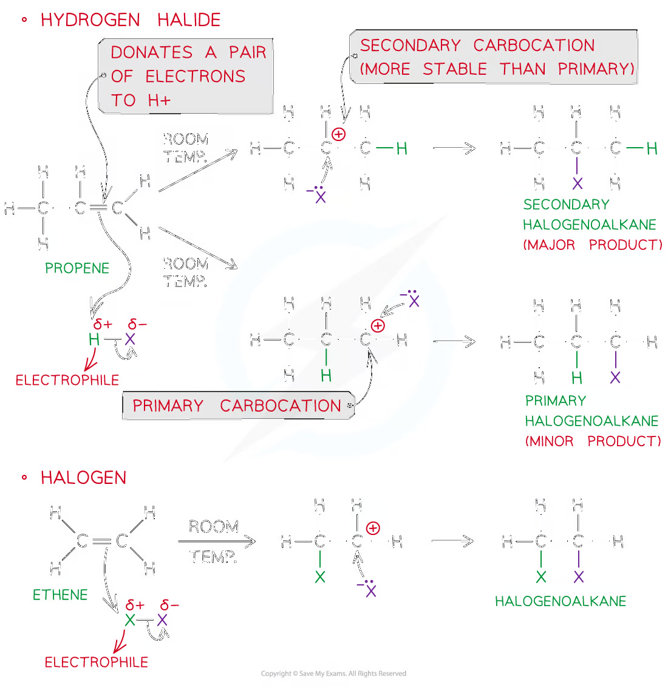{.concept-figure fig-alt="Electrophilic addition to alkenes forming halogenoalkanes"}

## 15.2 Nucleophilic substitution

Nucleophiles donate a lone pair to the δ+ carbon and replace X−. Aqueous OH− gives an alcohol; ethanolic CN− gives a nitrile; excess ethanolic NH3 under pressure gives an amine.

R–Br + OH− → R–OH + Br− R–Br + CN− → R–CN + Br− R–Br + 2NH3 → R–NH2 + NH4+ + Br−

Using CN− is valuable because it adds one carbon atom to the chain. Acid hydrolysis of the nitrile then gives a carboxylic acid.

Primary halogenoalkanes normally react by **SN2**: one concerted step, with nucleophile attack and C–X breaking simultaneously; the rate depends on both halogenoalkane and nucleophile. Tertiary halogenoalkanes usually react by **SN1**: slow heterolytic C–X fission makes a carbocation, then rapid nucleophile attack; the rate depends only on halogenoalkane concentration.

## 15.3 Elimination and preparation

Hot ethanolic OH− promotes elimination: H and X are removed from adjacent atoms to form C=C, for example CH3CH2CH2Br + OH− → CH3CH=CH2 + H2O + Br−. Aqueous OH− instead favours substitution. Halogenoalkanes are also formed by free-radical substitution of alkanes with Cl2/UV, and by electrophilic addition of HX or X2 to alkenes.

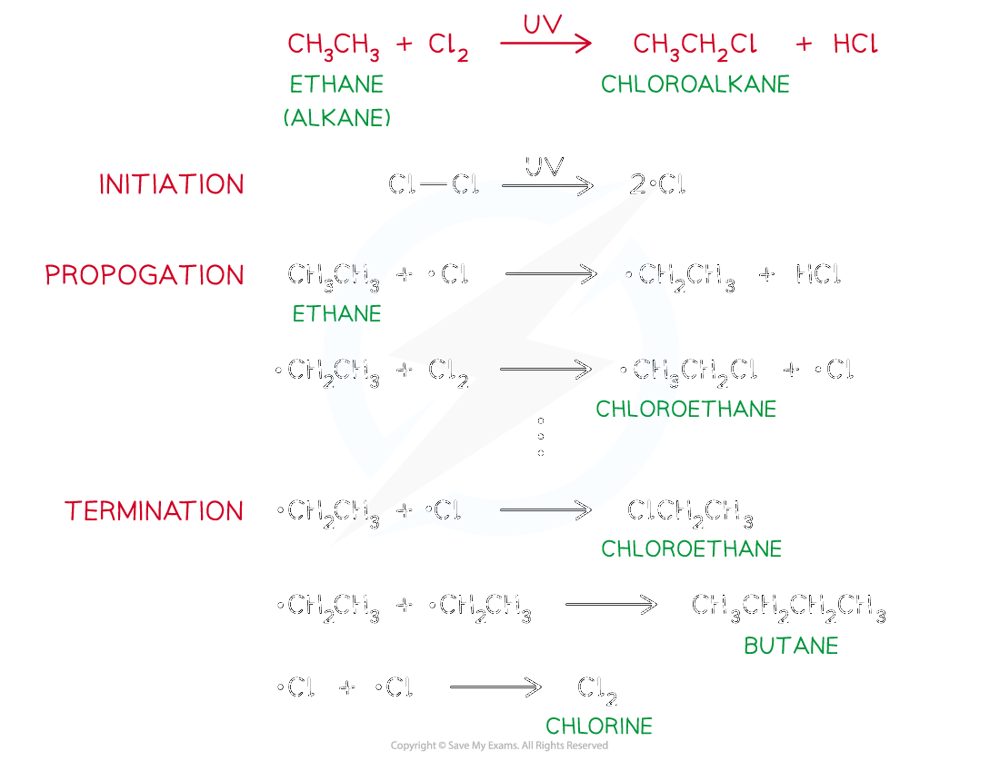{.concept-figure fig-alt="Initiation, propagation and termination in free-radical substitution"}

## 15.4 CFCs and ozone depletion

CFCs were useful as refrigerants and propellants because they are inert, non-flammable and non-toxic at ground level. Strong C–F bonds help their stability. Their long lifetime lets them diffuse to the stratosphere, where UV radiation causes homolytic bond fission and releases chlorine radicals.

CCl2F2 → CClF2· + Cl· Cl· + O3 → ClO· + O2 ClO· + O → Cl· + O2

Chlorine radical is regenerated, so one radical can catalyse the destruction of many ozone molecules. Ozone normally absorbs harmful UV radiation; CFC manufacture has therefore been phased out under the Montreal Protocol.

## Multiple choice questions

::: {.mc-question #hal-mc-01 data-answer="C"}
### Question 1 · 3.3 Choice Easy Q1

X and Y convert 1-bromopropane into butanoic acid via a nitrile. What are X and Y?

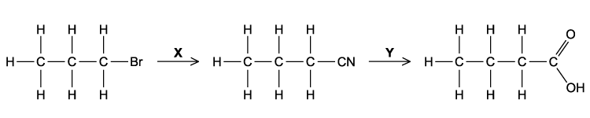

<button class="mc-choice" data-choice="A"><strong>A</strong>NH3; HCl(aq)</button><button class="mc-choice" data-choice="B"><strong>B</strong>KCN in ethanol; NaOH(aq)</button><button class="mc-choice" data-choice="C"><strong>C</strong>KCN in ethanol; HCl(aq)</button><button class="mc-choice" data-choice="D"><strong>D</strong>HCN; NaOH(aq)</button>
<button class="check-answer">Check answer</button>

Show explanation

<strong>C.</strong> CN− substitutes for Br then acid hydrolysis converts –CN into –COOH.

:::

::: {.mc-question #hal-mc-02 data-answer="B"}
### Question 2 · 3.3 Choice Easy Q2

Which reaction occurs when ethane and chlorine are mixed in diffused sunlight?

<button class="mc-choice" data-choice="A"><strong>A</strong>free-radical substitution with hydrogen given off</button><button class="mc-choice" data-choice="B"><strong>B</strong>free-radical substitution with hydrogen chloride given off</button><button class="mc-choice" data-choice="C"><strong>C</strong>free-radical substitution with no gas given off</button><button class="mc-choice" data-choice="D"><strong>D</strong>nucleophilic substitution with hydrogen chloride given off</button>
<button class="check-answer">Check answer</button>

Show explanation

<strong>B.</strong> Chlorine radicals replace H atoms and form HCl.

:::

::: {.mc-question #hal-mc-03 data-answer="C"}
### Question 3 · 3.3 Choice Easy Q3

Why are CFCs such as CCl3F more stable than chloroalkanes such as CCl4?

<button class="mc-choice" data-choice="A"><strong>A</strong>F has a higher first ionisation energy than Cl.</button><button class="mc-choice" data-choice="B"><strong>B</strong>F radicals are more stable than Cl radicals.</button><button class="mc-choice" data-choice="C"><strong>C</strong>The C–F bond energy is larger than the C–Cl bond energy.</button><button class="mc-choice" data-choice="D"><strong>D</strong>The C–F bond is more polar than the C–Cl bond.</button>
<button class="check-answer">Check answer</button>

Show explanation

<strong>C.</strong> The strong C–F bond resists bond breaking.

:::

::: {.mc-question #hal-mc-04 data-answer="D"}
### Question 4 · 3.3 Choice Easy Q4

Light initiates alkane + chlorine → chloroalkane + hydrogen chloride. What happens to chlorine?

<button class="mc-choice" data-choice="A"><strong>A</strong>heterolytic fission to give an electrophile</button><button class="mc-choice" data-choice="B"><strong>B</strong>homolytic fission to give an electrophile</button><button class="mc-choice" data-choice="C"><strong>C</strong>heterolytic fission to give a free radical</button><button class="mc-choice" data-choice="D"><strong>D</strong>homolytic fission to give a free radical</button>
<button class="check-answer">Check answer</button>

Show explanation

<strong>D.</strong> UV light splits Cl–Cl equally to give two Cl· radicals.

:::

::: {.mc-question #hal-mc-05 data-answer="C"}
### Question 5 · 3.3 Choice Easy Q6

Which reaction is an example of nucleophilic substitution?

<button class="mc-choice" data-choice="A"><strong>A</strong>CH3CH2Br → CH2=CH2 + HBr</button><button class="mc-choice" data-choice="B"><strong>B</strong>CH2=CH2 + HBr → CH3CH2Br</button><button class="mc-choice" data-choice="C"><strong>C</strong>C3H7Br + H2O → C3H7OH + HBr</button><button class="mc-choice" data-choice="D"><strong>D</strong>C2H6 + Br2 → C2H5Br + HBr</button>
<button class="check-answer">Check answer</button>

Show explanation

<strong>C.</strong> Water/OH− replaces bromine.

:::

::: {.mc-question #hal-mc-06 data-answer="D"}
### Question 6 · 3.3 Choice Easy Q7

Methanol reacts with HBr: CH3OH + HBr → CH3Br + H2O. What type of reaction is this?

<button class="mc-choice" data-choice="A"><strong>A</strong>condensation</button><button class="mc-choice" data-choice="B"><strong>B</strong>electrophilic substitution</button><button class="mc-choice" data-choice="C"><strong>C</strong>free-radical substitution</button><button class="mc-choice" data-choice="D"><strong>D</strong>nucleophilic substitution</button>
<button class="check-answer">Check answer</button>

Show explanation

<strong>D.</strong> Br− replaces the protonated –OH group.

:::

::: {.mc-question #hal-mc-07 data-answer="A"}
### Question 7 · 3.3 Choice Easy Q8

Which statement helps explain why dichlorodifluoromethane, CCl2F2, is chemically inert?

<button class="mc-choice" data-choice="A"><strong>A</strong>The carbon-fluorine bond energy is large.</button><button class="mc-choice" data-choice="B"><strong>B</strong>The carbon-fluorine bond has low polarity.</button><button class="mc-choice" data-choice="C"><strong>C</strong>Fluorine is highly electronegative.</button><button class="mc-choice" data-choice="D"><strong>D</strong>Fluorine compounds are non-flammable.</button>
<button class="check-answer">Check answer</button>

Show explanation

<strong>A.</strong> High C–F bond enthalpy makes bond breaking difficult.

:::

::: {.mc-question #hal-mc-08 data-answer="B"}
### Question 8 · 3.3 Choice Easy Q9

What is the function of light in the reaction of chlorine with methane?

<button class="mc-choice" data-choice="A"><strong>A</strong>break C–H bonds in methane</button><button class="mc-choice" data-choice="B"><strong>B</strong>break chlorine molecules into radicals</button><button class="mc-choice" data-choice="C"><strong>C</strong>break chlorine molecules into ions</button><button class="mc-choice" data-choice="D"><strong>D</strong>heat the mixture</button>
<button class="check-answer">Check answer</button>

Show explanation

<strong>B.</strong> It supplies energy for homolytic fission of Cl2.

:::

::: {.mc-question #hal-mc-09 data-answer="D"}
### Question 9 · 3.3 Choice Easy Q10

Which reagents and conditions will convert propane into 1-chloropropane? 1 Cl2 and sunlight  2 concentrated HCl, reflux  3 PCl5

<button class="mc-choice" data-choice="A"><strong>A</strong>1, 2 and 3</button><button class="mc-choice" data-choice="B"><strong>B</strong>1 and 2</button><button class="mc-choice" data-choice="C"><strong>C</strong>2 and 3</button><button class="mc-choice" data-choice="D"><strong>D</strong>1 only</button>
<button class="check-answer">Check answer</button>

Show explanation

<strong>D.</strong> Only chlorine/UV substitutes H in propane.

:::

::: {.mc-question #hal-mc-10 data-answer="D"}
### Question 10 · 3.3 Choice Medium Q1

1-chlorobutane, 1-bromobutane and 1-iodobutane hydrolyse at rates RCl &lt; RBr &lt; RI. Why?

<button class="mc-choice" data-choice="A"><strong>A</strong>R–X bond polarity decreases.</button><button class="mc-choice" data-choice="B"><strong>B</strong>AgX solubility decreases.</button><button class="mc-choice" data-choice="C"><strong>C</strong>halogen ionisation energy decreases.</button><button class="mc-choice" data-choice="D"><strong>D</strong>R–X bond energy decreases from RCl to RI.</button>
<button class="check-answer">Check answer</button>

Show explanation

<strong>D.</strong> C–I is weakest, so it breaks most easily.

:::

::: {.mc-question #hal-mc-11 data-answer="B"}
### Question 11 · 3.3 Choice Medium Q2
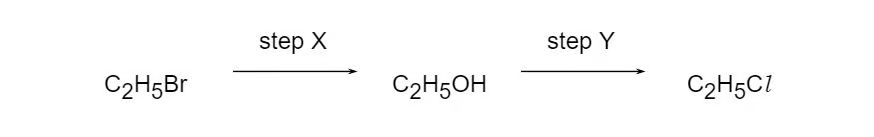{.question-figure fig-alt="Reaction sequence from bromoethane to ethanol to chloroethane"}

Chloroethane is formed from bromoethane in two steps: C2H5Br → C2H5OH → C2H5Cl. Which statements are correct? 1 Step X involves nucleophilic substitution. 2 Hot aqueous sodium hydroxide is used in X. 3 Hot aqueous sodium chloride is the only possible reagent in Y.

<button class="mc-choice" data-choice="A"><strong>A</strong>1, 2 and 3</button><button class="mc-choice" data-choice="B"><strong>B</strong>1 and 2</button><button class="mc-choice" data-choice="C"><strong>C</strong>2 and 3</button><button class="mc-choice" data-choice="D"><strong>D</strong>1 only</button>
<button class="check-answer">Check answer</button>

Show explanation

<strong>B.</strong> The alcohol can be converted with several chlorinating reagents, not only NaCl(aq).

:::

::: {.mc-question #hal-mc-12 data-answer="A"}
### Question 12 · 3.3 Choice Medium Q3

What is involved in the mechanism between aqueous sodium hydroxide and 1-bromobutane?

<button class="mc-choice" data-choice="A"><strong>A</strong>Attack by a nucleophile on a carbon atom with a partial positive charge.</button><button class="mc-choice" data-choice="B"><strong>B</strong>Heterolytic fission and nucleophile attack on a carbocation.</button><button class="mc-choice" data-choice="C"><strong>C</strong>Homolytic fission and electrophile attack on a carbanion.</button><button class="mc-choice" data-choice="D"><strong>D</strong>Homolytic fission and nucleophile attack on a carbocation.</button>
<button class="check-answer">Check answer</button>

Show explanation

<strong>A.</strong> Primary halogenoalkanes react by SN2, without a carbocation intermediate.

:::

::: {.mc-question #hal-mc-13 data-answer="D"}
### Question 13 · 3.3 Choice Medium Q4

Chlorine and propane in UV light produce 1-chloropropane and 2-chloropropane. Which information is correct?

<button class="mc-choice" data-choice="A"><strong>A</strong>heterolytic fission; 1:1</button><button class="mc-choice" data-choice="B"><strong>B</strong>heterolytic fission; 3:1</button><button class="mc-choice" data-choice="C"><strong>C</strong>homolytic fission; 1:1</button><button class="mc-choice" data-choice="D"><strong>D</strong>homolytic fission; 3:1</button>
<button class="check-answer">Check answer</button>

Show explanation

<strong>D.</strong> Six equivalent primary H atoms and two secondary H atoms give a 3:1 statistical ratio.

:::

::: {.mc-question #hal-mc-14 data-answer="C"}
### Question 14 · 3.3 Choice Medium Q5

Bromine and propene undergo addition. Which is a property of the product?

<button class="mc-choice" data-choice="A"><strong>A</strong>It exists in cis-trans isomers.</button><button class="mc-choice" data-choice="B"><strong>B</strong>It is more volatile than propene.</button><button class="mc-choice" data-choice="C"><strong>C</strong>It possesses a chiral centre.</button><button class="mc-choice" data-choice="D"><strong>D</strong>It possesses hydrogen bonding.</button>
<button class="check-answer">Check answer</button>

Show explanation

<strong>C.</strong> 1,2-dibromopropane has a carbon attached to H, Br, CH3 and CH2Br.

:::

::: {.mc-question #hal-mc-15 data-answer="D"}
### Question 15 · 3.3 Choice Medium Q9

In hydrolysis of bromoethane by aqueous sodium hydroxide, what are the attacking group and leaving group?

<button class="mc-choice" data-choice="A"><strong>A</strong>electrophile; electrophile</button><button class="mc-choice" data-choice="B"><strong>B</strong>electrophile; nucleophile</button><button class="mc-choice" data-choice="C"><strong>C</strong>nucleophile; electrophile</button><button class="mc-choice" data-choice="D"><strong>D</strong>nucleophile; nucleophile</button>
<button class="check-answer">Check answer</button>

Show explanation

<strong>D.</strong> OH− donates a pair; Br− leaves with the bonding pair.

:::

::: {.mc-question #hal-mc-16 data-answer="C"}
### Question 16 · 3.3 Choice Medium Q10

Which reaction gives 2-chloropropane in the best yield?

<button class="mc-choice" data-choice="A"><strong>A</strong>propane with chlorine/UV</button><button class="mc-choice" data-choice="B"><strong>B</strong>propan-2-ol with dilute NaCl(aq)</button><button class="mc-choice" data-choice="C"><strong>C</strong>propan-2-ol with SOCl2</button><button class="mc-choice" data-choice="D"><strong>D</strong>propene with dilute HCl(aq)</button>
<button class="check-answer">Check answer</button>

Show explanation

<strong>C.</strong> Thionyl chloride converts the alcohol selectively; the other routes give mixtures/poor reaction.

:::

::: {.mc-question #hal-mc-17 data-answer="A"}
### Question 17 · 3.3 Choice Medium Q11

Aqueous sodium hydroxide reacts with 1-bromopropane to give propan-1-ol. How should the first step be described?

<button class="mc-choice" data-choice="A"><strong>A</strong>Curly arrow from a lone pair on OH− to Cδ+ of 1-bromopropane.</button><button class="mc-choice" data-choice="B"><strong>B</strong>Curly arrow from Cδ+ to OH−.</button><button class="mc-choice" data-choice="C"><strong>C</strong>Curly arrow from C–Br bond to C.</button><button class="mc-choice" data-choice="D"><strong>D</strong>Homolytic fission of C–Br.</button>
<button class="check-answer">Check answer</button>

Show explanation

<strong>A.</strong> Electron pairs move from nucleophile to electrophilic carbon.

:::

::: {.mc-question #hal-mc-18 data-answer="C"}
### Question 18 · 3.3 Choice Hard Q1
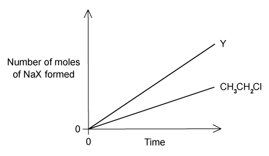

Hydrolysis of CH3CH2Cl and Y gives more sodium halide from Y in the same time. Which compounds could be Y? 1 ClCH2CH2Cl  2 CH3CH2Br  3 CH3CH2I

<button class="mc-choice" data-choice="A"><strong>A</strong>1, 2 and 3</button><button class="mc-choice" data-choice="B"><strong>B</strong>1 and 2</button><button class="mc-choice" data-choice="C"><strong>C</strong>2 and 3</button><button class="mc-choice" data-choice="D"><strong>D</strong>1 only</button>
<button class="check-answer">Check answer</button>

Show explanation

<strong>C.</strong> Bromo- and iodoethane hydrolyse faster because C–Br/C–I are weaker; a dichloro compound does not have a faster C–Cl bond.

:::

::: {.mc-question #hal-mc-19 data-answer="D"}
### Question 19 · 3.3 Choice Hard Q2

An isomer of C4H9Br hydrolyses at a rate unaffected by [OH−]. Which structure is most likely?

<button class="mc-choice" data-choice="A"><strong>A</strong>CH3CH2CH2CH2Br</button><button class="mc-choice" data-choice="B"><strong>B</strong>CH3CH2CHBrCH3</button><button class="mc-choice" data-choice="C"><strong>C</strong>(CH3)2CHCH2Br</button><button class="mc-choice" data-choice="D"><strong>D</strong>(CH3)3CBr</button>
<button class="check-answer">Check answer</button>

Show explanation

<strong>D.</strong> A tertiary halogenoalkane can react by SN1; its rate-determining ionisation does not involve OH−.

:::

::: {.mc-question #hal-mc-20 data-answer="A"}
### Question 20 · 3.3 Choice Hard Q3

Which statements are true for an SN2 reaction? 1 One bond is broken as another forms. 2 The transition state involves collision of two species. 3 A carbon in the transition state is bonded fully or partially to five atoms.

<button class="mc-choice" data-choice="A"><strong>A</strong>1, 2 and 3</button><button class="mc-choice" data-choice="B"><strong>B</strong>1 and 2</button><button class="mc-choice" data-choice="C"><strong>C</strong>2 and 3</button><button class="mc-choice" data-choice="D"><strong>D</strong>1 only</button>
<button class="check-answer">Check answer</button>

Show explanation

<strong>A.</strong> Bond making and breaking are concerted in a five-coordinate transition state.

:::

## Structured questions

::: {.question-card #hal-sq-01}
### Question 1 · 3.3 SQ Easy Q1(a-d)

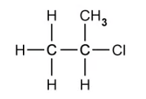{.question-figure fig-alt="Displayed formula of the corresponding chloroalkane"}

<strong>(a)(i)</strong> Name the compound shown in Fig. 1.1.

<strong>(a)(ii)</strong> State the class of halogenoalkane to which this compound belongs.

<strong>(b)</strong> State the colour of the precipitate formed in the reaction between the halogenoalkane in Fig. 1.1 and acidified silver nitrate, AgNO3.

<strong>(c)</strong> The compound drawn in Fig. 1.1 is reacted with alcoholic potassium cyanide, KCN. The reaction is heated under reflux. Draw the product of this nucleophilic substitution reaction.

<strong>(d)</strong> The halogenoalkane drawn in Fig. 1.2 contains a chlorine atom instead of a bromine atom. This halogenoalkane is reacted under the same conditions outlined in part (c). Briefly explain why the reaction with the bromine-containing halogenoalkane would be faster.

Show mark scheme / model answer
<ul><li>The compound is 2-bromopropane, a secondary halogenoalkane.</li><li>The precipitate is cream AgBr.</li><li>CN− replaces Br−, giving butanenitrile, CH3CH(CH3)CN.</li><li>The C–Br bond is weaker than the C–Cl bond, so it breaks more readily and the substitution is faster.</li></ul>

:::

::: {.question-card #hal-sq-02}
### Question 2 · 3.3 SQ Easy Q2(a-c)

Fig. 2.1 shows the reaction profile for the production of propene: propane → 1-chloropropane → propene.

<strong>(a)(i)</strong> State the conditions required for step 1.

<strong>(a)(ii)</strong> Name the mechanism for step 1.

<strong>(b)</strong> The mechanism for step 1 involves initiation, propagation and termination. Write both missing propagation equations.

<strong>(c)(i)</strong> Name the mechanism for step 2.

<strong>(c)(ii)</strong> State the reagent and necessary conditions for step 2.

Show mark scheme / model answer
<ul><li>Use Cl2 and UV light; step 1 is free-radical substitution.</li><li>Cl· + CH3CH2CH3 → HCl + CH3CH2CH2·; CH3CH2CH2· + Cl2 → CH3CH2CH2Cl + Cl·.</li><li>Step 2 is elimination; use concentrated ethanolic NaOH or KOH and heat under reflux.</li></ul>

:::

::: {.question-card #hal-sq-03}
### Question 3 · 3.3 SQ Easy Q3(a-c)
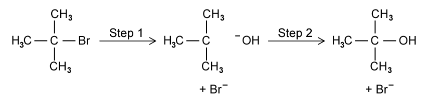

<strong>(a)(i)</strong> State what is meant by the term tertiary halogenoalkane.

<strong>(a)(ii)</strong> Tertiary halogenoalkanes react via an SN1 mechanism, whereas primary halogenoalkanes react via an SN2 mechanism. Explain what the numbers 1 and 2 refer to in SN1 and SN2.

<strong>(b)(i)</strong> 2-bromo-2-methylpropane reacts with hydroxide ions via an SN1 mechanism. Complete the reaction mechanism shown in Fig. 3.1, clearly showing partial charges, full charges and the transfer of electrons.

<strong>(b)(ii)</strong> Identify which, step 1 or step 2, is the rate-determining step.

<strong>(c)(i)</strong> An ethanolic solution of excess ammonia is heated under pressure with 2-bromo-2-methylpropane. Draw the structure of the resulting organic product.

<strong>(c)(ii)</strong> State the name of the functional group of the organic product.

Show mark scheme / model answer
<ul><li>A tertiary halogenoalkane has the carbon bonded to the halogen attached to three other carbon atoms.</li><li>The number gives the number of reacting species in the rate-determining step: one for SN1 and two for SN2.</li><li>Step 1 is heterolytic C–Br fission to form a tertiary carbocation and Br−; step 2 is attack by OH−. Step 1 is rate determining.</li><li>The product is 2-methylpropan-2-amine, (CH3)3CNH2, containing an amine functional group.</li></ul>

:::

::: {.question-card #hal-sq-04}
### Question 4 · 3.3 SQ Medium Q1(a-e)

The molecular formula C3H6 represents propene and cyclopropane, shown in Fig. 1.1.

<strong>(a)</strong> What is the H–C–H bond angle at the terminal =CH2 group in propene?

<strong>(b)(i)</strong> Under suitable conditions, propene and cyclopropane each react with chlorine. With propene, 1,2-dichloropropane, CH3CHClCH2Cl, is formed. State fully what type of reaction this is.

<strong>(b)(ii)</strong> When cyclopropane reacts with chlorine, three different compounds with molecular formula C3H4Cl2 can be formed. Draw displayed structures of each of these three compounds.

<strong>(c)(i)</strong> Ethane reacts with chlorine according to C2H6 + Cl2 → C2H5Cl + HCl. State the conditions needed.

<strong>(c)(ii)</strong> State the type of reaction occurring here.

<strong>(d)(i)</strong> Use the data in Table 1.1 to calculate the enthalpy change for Cl· + CH3CH3 → HCl + CH3CH2·. Show your working.

<strong>(d)(ii)</strong> Use the data in Table 1.1 to calculate the enthalpy change for I· + CH3CH3 → HI + CH3CH2·. Show your working.

<strong>(d)(iii)</strong> Hence suggest why it is not possible to make iodoethane by reacting iodine and ethane.

<strong>(e)</strong> Complete the equations of some possible steps in the formation of chloroethane.

Show mark scheme / model answer
<ul><li>The terminal carbon is sp2; the angle is 120°.</li><li>Propene + chlorine is electrophilic addition. Cyclopropane gives the three displayed C3H4Cl2 structures from addition/substitution at the ring.</li><li>Use chlorine and UV light; the reaction is free-radical substitution.</li><li>Calculate ΔH from bonds broken minus bonds formed. The iodine abstraction step is endothermic, so the chain is not sustained and iodoethane is not formed.</li><li>For propagation, CH3CH2· + Cl2 → CH3CH2Cl + Cl·; termination combines radicals.</li></ul>

:::

::: {.question-card #hal-sq-05}
### Question 5 · 3.3 SQ Medium Q2(a-e)
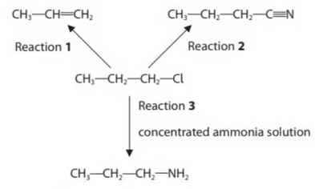{.question-figure fig-alt="Reaction scheme showing 1-chloropropane forming propene, butanenitrile and propan-1-amine"}
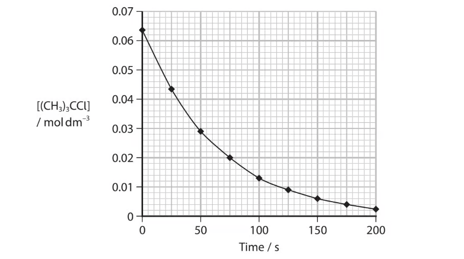{.question-figure fig-alt="Concentration of a tertiary chloroalkane plotted against time"}

1-chloropropane can react to form organic products as shown in the reaction scheme in Fig. 2.1.

<strong>(a)(i)</strong> State the reagent and conditions used in Reaction 1.

<strong>(a)(ii)</strong> Identify a suitable reagent for Reaction 2 and include a reason why this is a particularly useful type of reaction in organic chemistry.

<strong>(a)(iii)</strong> State the conditions used in Reaction 3.

<strong>(a)(iv)</strong> Write the structural formula of the product formed if 1-chloropropane is refluxed with aqueous sodium hydroxide.

<strong>(b)</strong> 2-chloro-2-methylpropane reacts with aqueous alkali to form 2-methylpropan-2-ol. Use the concentration–time graph in Fig. 2.2 to calculate the rate of reaction at 50 s. Show your working and include units.

<strong>(c)</strong> What is the classification of the mechanism for this reaction?

<strong>(d)(i)</strong> State the visible change when 1-bromobutane is added to ethanol and aqueous silver nitrate. Include the formula of the compound responsible.

<strong>(d)(ii)</strong> State the order of decreasing rate for 1-bromobutane, 1-iodobutane and 1-chlorobutane.

<strong>(e)</strong> 2-bromo-2-methylpropane can be prepared by addition of HBr to 2-methylpropene. Draw the mechanism, including curly arrows, relevant dipoles and lone pairs.

Show mark scheme / model answer
<ul><li>Reaction 1: hot ethanolic NaOH/KOH and elimination. Reaction 2: ethanolic KCN under reflux; it adds one carbon and is useful for chain extension. Reaction 3: excess ethanolic ammonia under pressure and heat. Aqueous NaOH gives propan-1-ol, CH3CH2CH2OH.</li><li>Use the tangent gradient at 50 s; report the rate in mol dm−3 s−1.</li><li>SN1.</li><li>AgBr is a cream precipitate; the rate order is 1-iodobutane &gt; 1-bromobutane &gt; 1-chlorobutane.</li><li>Show electrophilic addition through the tertiary carbocation, followed by Br− attack.</li></ul>

:::

::: {.question-card #hal-sq-06}
### Question 6 · 3.3 SQ Hard Q1(a-d)

This question is about halogenoalkanes. A student investigates the rate of reaction of six halogenoalkanes using the method and results in Table 1.1.

<strong>(a)(i)</strong> Suggest how the student could improve the method.

<strong>(a)(ii)</strong> Other than precipitation, state what type of reaction is occurring in this method.

<strong>(b)</strong> Using Table 1.1, describe and explain two factors that influence the rate of this type of reaction in halogenoalkanes.

<strong>(c)(i)</strong> A fresh sample of aqueous 1-bromopentane reacts with an aqueous solution of sodium hydroxide. Fully identify the mechanism for this reaction and state the number of steps in the mechanism.

<strong>(c)(ii)</strong> One of the products contains bromine. Name this product.

<strong>(c)(iii)</strong> The reaction conditions are changed, resulting in the formation of three products, including the product identified in part (c)(ii). Suggest the change made to the conditions.

<strong>(d)(i)</strong> 1-chloropentane was prepared by reaction of an alcohol and thionyl chloride, SOCl2. Give the equation, including state symbols.

<strong>(d)(ii)</strong> Explain one necessary safety precaution and justify your answer.

Show mark scheme / model answer
<ul><li>Use equal measured volumes of ethanol, halogenoalkane and AgNO3; pre-equilibrate all reactants at 50 °C; use a thermostated bath and repeat measurements. The organic reaction is hydrolysis/nucleophilic substitution.</li><li>Iodoalkanes react fastest because C–I is weakest; tertiary/branched halogenoalkanes react faster in SN1 because they form more stable carbocations.</li><li>Aqueous 1-bromopentane reacts by SN2 in one step; the bromine-containing product is NaBr. Ethanolic NaOH permits competing elimination and gives three products overall.</li><li>CH3(CH2)4OH(l) + SOCl2(l) → CH3(CH2)4Cl(l) + SO2(g) + HCl(g). Use a fume cupboard because toxic/acidic gases are evolved.</li></ul>

:::

::: {.question-card #hal-sq-07}
### Question 7 · 3.3 SQ Hard Q2(a-d)

2-bromo-2-methylpropane is refluxed with ethanolic potassium hydroxide, KOH. The result is a mixture of products containing roughly a 4:1 ratio of alkene to alcohol.

<strong>(a)</strong> Complete Table 2.1 to name the organic products and identify the mechanisms involved.

<strong>(b)</strong> Suggest why there is a mixture of an alkene and an alcohol produced in the reaction outlined in part (a).

<strong>(c)</strong> Give the equation for the reaction between butan-2-ol and phosphorus(III) iodide.

<strong>(d)</strong> Explain why sulfuric acid cannot be used in the preparation of an iodoalkane.

Show mark scheme / model answer
<ul><li>The alkene is 2-methylpropene from elimination; the alcohol is 2-methylpropan-2-ol from nucleophilic substitution.</li><li>Ethanolic OH− favours elimination, but nucleophilic substitution also occurs.</li><li>3CH3CH(OH)CH2CH3 + PI3 → 3CH3CH(I)CH2CH3 + H3PO3.</li><li>Concentrated H2SO4 oxidises I−/HI to iodine, so it cannot be used simply to generate HI.</li></ul>

:::

::: {.question-card #hal-sq-08}
### Question 8 · 3.3 SQ Hard Q3(a-c)
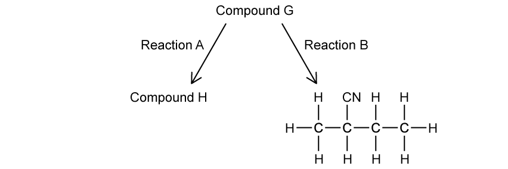

Compound G is a chloroalkane that can undergo two different reactions as outlined in Fig. 3.1. Compound H is an alkene which does not exhibit geometric isomerism.

<strong>(a)</strong> Draw the skeletal structures of compounds G and H.

<strong>(b)</strong> State the reagents and conditions required for reaction A.

<strong>(c)</strong> Name and draw the mechanism for reaction B. Include all charges, partial charges, lone pairs and curly arrows.

Show mark scheme / model answer
<ul><li>Draw the matching chloroalkane G and the alkene H in which one carbon of C=C has two identical groups, so no E/Z isomerism is possible.</li><li>Use hot ethanolic NaOH/KOH for elimination.</li><li>Reaction B is nucleophilic substitution: CN− attacks the δ+ carbon and the C–Cl bond electrons move to Cl−. Use KCN in ethanol under reflux.</li></ul>

:::

::: {.question-card #hal-sq-09}
### Question 9 · 3.3 SQ Hard Q4(a-f)
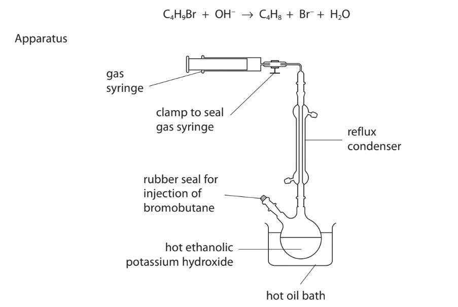{.question-figure fig-alt="Gas syringe and reflux condenser apparatus for producing gaseous butenes"}

Bromobutanes react with hot ethanolic potassium hydroxide solution to produce gaseous butenes. In the experiment, 0.0080 mol of liquid 1-bromobutane is injected into hot ethanolic KOH and 22.0 cm3 of but-1-ene is collected after cooling to 25 °C.

<strong>(a)</strong> State the purpose of the condenser.

<strong>(b)</strong> Describe a chemical test and the expected observation to identify the functional group of the gas.

<strong>(c)</strong> Calculate the percentage of 1-bromobutane converted to but-1-ene.

<strong>(d)</strong> Before cooling, the volume of but-1-ene in the gas syringe was 24.0 cm3. Assuming constant pressure and no loss of but-1-ene, calculate the temperature of the gas before cooling.

<strong>(e)(i)</strong> Another compound formed from 1-bromobutane under these conditions is butan-1-ol. Fully identify the type of reaction taking place.

<strong>(e)(ii)</strong> Draw the mechanism for the reaction of 1-bromobutane with hydroxide ions to form butan-1-ol. Include charges, partial charges, lone pairs and curly arrows.

<strong>(e)(iii)</strong> Describe a chemical test and the expected observations to confirm the presence of the functional group in butan-1-ol.

<strong>(f)</strong> Isomeric alkene molecules are formed in the elimination reaction of 2-bromobutane. Draw the displayed formulae of the isomers formed.

Show mark scheme / model answer
<ul><li>The condenser prevents volatile reactants/ethanol escaping during reflux.</li><li>Bromine water is decolourised, confirming a C=C bond.</li><li>Use n = pV/RT for 22.0 cm3 at 25 °C, divide by 0.0080 mol and multiply by 100.</li><li>At constant pressure, V1/T1 = V2/T2, so use 24.0 cm3 and 22.0 cm3 with 298 K.</li><li>Formation of butan-1-ol is nucleophilic substitution by OH−; acidified dichromate changes orange to green on warming for a primary alcohol.</li><li>The alkene isomers are but-1-ene, cis-but-2-ene and trans-but-2-ene.</li></ul>

:::

::: {.question-card #hal-sq-10}
### Question 10 · 3.3 SQ Medium Q3(a-d)
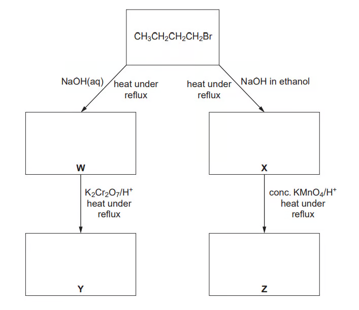{.question-figure fig-alt="Reaction scheme showing reactions of 1-bromobutane with aqueous and ethanolic sodium hydroxide"}

One method of making 1-bromobutane in the laboratory uses powdered potassium bromide, water, butan-1-ol and concentrated sulfuric acid.

<strong>(a)</strong> Write an equation for each of the two stages: formation of HBr, and reaction of butan-1-ol with HBr.

<strong>(b)</strong> State two different ways that 1-bromobutane can be prepared. Include the reagents and conditions.

<strong>(c)(i)</strong> Complete the reaction scheme starting with 1-bromobutane. In each empty box, write the structural formula of the organic compound formed.

<strong>(c)(ii)</strong> State the name of the type of reaction that occurs when X is produced from 1-bromobutane.

<strong>(d)</strong> Compound W can also be formed from 1-bromobutane by heating it under reflux with aqueous silver nitrate. Suggest why formation of W is slower than when aqueous sodium hydroxide is used.

Show mark scheme / model answer
<ul><li>KBr + H2SO4 → KHSO4 + HBr; CH3(CH2)3OH + HBr → CH3(CH2)3Br + H2O.</li><li>Valid alternatives include butan-1-ol with PBr3, or a suitable precursor with HBr under appropriate conditions.</li><li>Aqueous OH− gives butan-1-ol, which can be oxidised to butanoic acid; ethanolic OH− gives but-1-ene and oxidation cleaves the C=C.</li><li>Water is a weaker nucleophile than OH−, so hydrolysis is slower with aqueous AgNO3.</li></ul>

:::

## Original question PDFs

- [3.3 Choice Easy](https://raw.githubusercontent.com/nanoxsj/CIE-Chemistry-Study/main/assets/questions/original-source/3.3_halogen_compounds_choice_easy.pdf)
- [3.3 Choice Medium](https://raw.githubusercontent.com/nanoxsj/CIE-Chemistry-Study/main/assets/questions/original-source/3.3_halogen_compounds_choice_medium.pdf)
- [3.3 Choice Hard](https://raw.githubusercontent.com/nanoxsj/CIE-Chemistry-Study/main/assets/questions/original-source/3.3_halogen_compounds_choice_hard.pdf)
- [3.3 SQ Easy](https://raw.githubusercontent.com/nanoxsj/CIE-Chemistry-Study/main/assets/questions/original-source/3.3_halogen_compounds_sq_easy.pdf)
- [3.3 SQ Medium](https://raw.githubusercontent.com/nanoxsj/CIE-Chemistry-Study/main/assets/questions/original-source/3.3_halogen_compounds_sq_medium.pdf)
- [3.3 SQ Hard](https://raw.githubusercontent.com/nanoxsj/CIE-Chemistry-Study/main/assets/questions/original-source/3.3_halogen_compounds_sq_hard.pdf)
