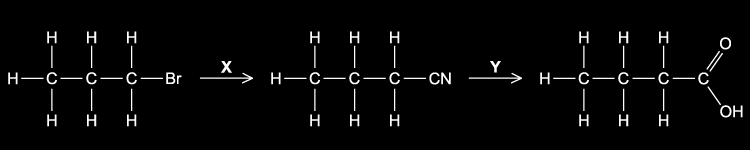
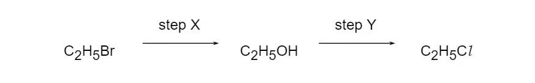
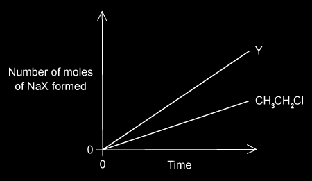
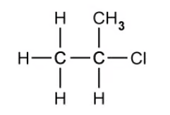
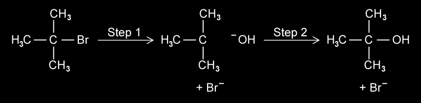
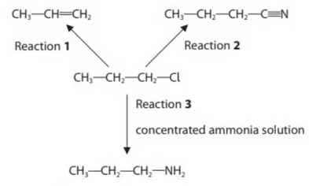
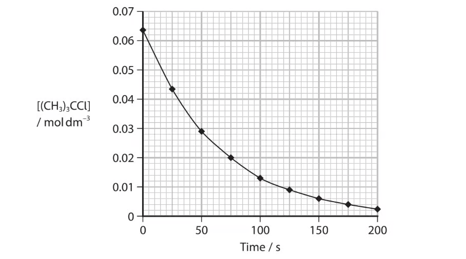
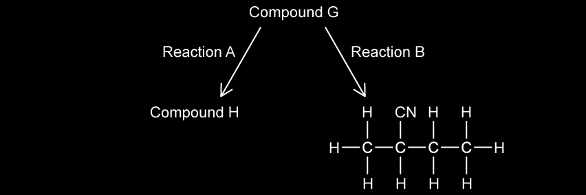
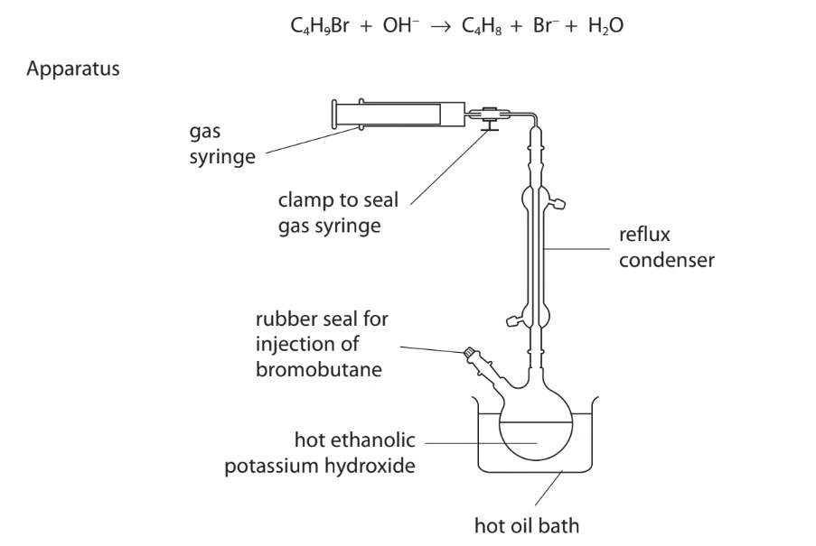
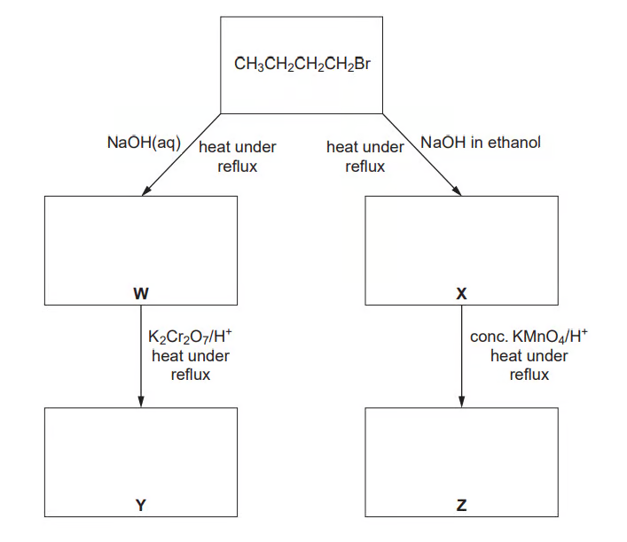

# 15 Halogen compounds

本章只覆盖 AS 3.3 Halogen Compounds：halogenoalkanes 的命名、反应和机制，C–X 键与水解速率，以及 CFCs 和 ozone depletion。下方题目来自 **3.3 Halogen Compounds** 原题；无法独立提取的题图没有截图加入。

## Learning objectives

- identify primary, secondary and tertiary halogenoalkanes;
- explain nucleophilic substitution and distinguish SN1/SN2;
- predict products with OH−, CN− and NH3;
- use silver nitrate to compare halogenoalkane hydrolysis;
- explain the stability and environmental impact of CFCs.

## 15.1 Halogenoalkanes and the C–X bond

A halogenoalkane has a halogen attached to an alkyl group, R–X. The carbon bonded to the halogen is δ+ because halogen is more electronegative; it is attacked by nucleophiles. A **primary** halogenoalkane has the C–X carbon bonded to one other carbon, a secondary to two, and a tertiary to three.

The C–X bond strength decreases down the group: C–F > C–Cl > C–Br > C–I. Thus iodoalkanes hydrolyse fastest and chloroalkanes slowest (among Cl, Br and I). In warm ethanol/water with aqueous AgNO3, released halide gives AgCl white, AgBr cream, or AgI yellow precipitate. The rate follows RI > RBr > RCl because less bond energy is needed to break C–I.

## 15.2 Nucleophilic substitution

Nucleophiles donate a lone pair to the δ+ carbon and replace X−. Aqueous OH− gives an alcohol; ethanolic CN− gives a nitrile; excess ethanolic NH3 under pressure gives an amine.

R–Br + OH− → R–OH + Br− R–Br + CN− → R–CN + Br− R–Br + 2NH3 → R–NH2 + NH4+ + Br−

Using CN− is valuable because it adds one carbon atom to the chain. Acid hydrolysis of the nitrile then gives a carboxylic acid.

Primary halogenoalkanes normally react by **SN2**: one concerted step, with nucleophile attack and C–X breaking simultaneously; the rate depends on both halogenoalkane and nucleophile. Tertiary halogenoalkanes usually react by **SN1**: slow heterolytic C–X fission makes a carbocation, then rapid nucleophile attack; the rate depends only on halogenoalkane concentration.

## 15.3 Elimination and preparation

Hot ethanolic OH− promotes elimination: H and X are removed from adjacent atoms to form C=C, for example CH3CH2CH2Br + OH− → CH3CH=CH2 + H2O + Br−. Aqueous OH− instead favours substitution. Halogenoalkanes are also formed by free-radical substitution of alkanes with Cl2/UV, and by electrophilic addition of HX or X2 to alkenes.

## 15.4 CFCs and ozone depletion

CFCs were useful as refrigerants and propellants because they are inert, non-flammable and non-toxic at ground level. Strong C–F bonds help their stability. Their long lifetime lets them diffuse to the stratosphere, where UV radiation causes homolytic bond fission and releases chlorine radicals.

CCl2F2 → CClF2· + Cl· Cl· + O3 → ClO· + O2 ClO· + O → Cl· + O2

Chlorine radical is regenerated, so one radical can catalyse the destruction of many ozone molecules. Ozone normally absorbs harmful UV radiation; CFC manufacture has therefore been phased out under the Montreal Protocol.

## Multiple choice questions

::: {.mc-question #hal-mc-01 data-answer="C"}
### Question 1 · 3.3 Choice Easy Q1

X and Y convert 1-bromopropane into butanoic acid via a nitrile. What are X and Y?

{.question-figure fig-alt="Reaction sequence from 1-bromopropane to butanoic acid via a nitrile" style="filter: invert(1);"}

<button class="mc-choice" data-choice="A"><strong>A</strong>NH3; HCl(aq)</button><button class="mc-choice" data-choice="B"><strong>B</strong>KCN in ethanol; NaOH(aq)</button><button class="mc-choice" data-choice="C"><strong>C</strong>KCN in ethanol; HCl(aq)</button><button class="mc-choice" data-choice="D"><strong>D</strong>HCN; NaOH(aq)</button>
<button class="check-answer">Check answer</button>

Show explanation

<strong>C.</strong> CN− substitutes for Br then acid hydrolysis converts –CN into –COOH.

:::

::: {.mc-question #hal-mc-02 data-answer="B"}
### Question 2 · 3.3 Choice Easy Q2

Which reaction occurs when ethane and chlorine are mixed in diffused sunlight?

<button class="mc-choice" data-choice="A"><strong>A</strong>free-radical substitution with hydrogen given off</button><button class="mc-choice" data-choice="B"><strong>B</strong>free-radical substitution with hydrogen chloride given off</button><button class="mc-choice" data-choice="C"><strong>C</strong>free-radical substitution with no gas given off</button><button class="mc-choice" data-choice="D"><strong>D</strong>nucleophilic substitution with hydrogen chloride given off</button>
<button class="check-answer">Check answer</button>

Show explanation

<strong>B.</strong> Chlorine radicals replace H atoms and form HCl.

:::

::: {.mc-question #hal-mc-03 data-answer="C"}
### Question 3 · 3.3 Choice Easy Q3

Why are CFCs such as CCl3F more stable than chloroalkanes such as CCl4?

<button class="mc-choice" data-choice="A"><strong>A</strong>F has a higher first ionisation energy than Cl.</button><button class="mc-choice" data-choice="B"><strong>B</strong>F radicals are more stable than Cl radicals.</button><button class="mc-choice" data-choice="C"><strong>C</strong>The C–F bond energy is larger than the C–Cl bond energy.</button><button class="mc-choice" data-choice="D"><strong>D</strong>The C–F bond is more polar than the C–Cl bond.</button>
<button class="check-answer">Check answer</button>

Show explanation

<strong>C.</strong> The strong C–F bond resists bond breaking.

:::

::: {.mc-question #hal-mc-04 data-answer="D"}
### Question 4 · 3.3 Choice Easy Q4

Light initiates alkane + chlorine → chloroalkane + hydrogen chloride. What happens to chlorine?

<button class="mc-choice" data-choice="A"><strong>A</strong>heterolytic fission to give an electrophile</button><button class="mc-choice" data-choice="B"><strong>B</strong>homolytic fission to give an electrophile</button><button class="mc-choice" data-choice="C"><strong>C</strong>heterolytic fission to give a free radical</button><button class="mc-choice" data-choice="D"><strong>D</strong>homolytic fission to give a free radical</button>
<button class="check-answer">Check answer</button>

Show explanation

<strong>D.</strong> UV light splits Cl–Cl equally to give two Cl· radicals.

:::

::: {.mc-question #hal-mc-05 data-answer="C"}
### Question 5 · 3.3 Choice Easy Q6

Which reaction is an example of nucleophilic substitution?

<button class="mc-choice" data-choice="A"><strong>A</strong>CH3CH2Br → CH2=CH2 + HBr</button><button class="mc-choice" data-choice="B"><strong>B</strong>CH2=CH2 + HBr → CH3CH2Br</button><button class="mc-choice" data-choice="C"><strong>C</strong>C3H7Br + H2O → C3H7OH + HBr</button><button class="mc-choice" data-choice="D"><strong>D</strong>C2H6 + Br2 → C2H5Br + HBr</button>
<button class="check-answer">Check answer</button>

Show explanation

<strong>C.</strong> Water/OH− replaces bromine.

:::

::: {.mc-question #hal-mc-06 data-answer="D"}
### Question 6 · 3.3 Choice Easy Q7

Methanol reacts with HBr: CH3OH + HBr → CH3Br + H2O. What type of reaction is this?

<button class="mc-choice" data-choice="A"><strong>A</strong>condensation</button><button class="mc-choice" data-choice="B"><strong>B</strong>electrophilic substitution</button><button class="mc-choice" data-choice="C"><strong>C</strong>free-radical substitution</button><button class="mc-choice" data-choice="D"><strong>D</strong>nucleophilic substitution</button>
<button class="check-answer">Check answer</button>

Show explanation

<strong>D.</strong> Br− replaces the protonated –OH group.

:::

::: {.mc-question #hal-mc-07 data-answer="A"}
### Question 7 · 3.3 Choice Easy Q8

Which statement helps explain why dichlorodifluoromethane, CCl2F2, is chemically inert?

<button class="mc-choice" data-choice="A"><strong>A</strong>The carbon-fluorine bond energy is large.</button><button class="mc-choice" data-choice="B"><strong>B</strong>The carbon-fluorine bond has low polarity.</button><button class="mc-choice" data-choice="C"><strong>C</strong>Fluorine is highly electronegative.</button><button class="mc-choice" data-choice="D"><strong>D</strong>Fluorine compounds are non-flammable.</button>
<button class="check-answer">Check answer</button>

Show explanation

<strong>A.</strong> High C–F bond enthalpy makes bond breaking difficult.

:::

::: {.mc-question #hal-mc-08 data-answer="B"}
### Question 8 · 3.3 Choice Easy Q9

What is the function of light in the reaction of chlorine with methane?

<button class="mc-choice" data-choice="A"><strong>A</strong>break C–H bonds in methane</button><button class="mc-choice" data-choice="B"><strong>B</strong>break chlorine molecules into radicals</button><button class="mc-choice" data-choice="C"><strong>C</strong>break chlorine molecules into ions</button><button class="mc-choice" data-choice="D"><strong>D</strong>heat the mixture</button>
<button class="check-answer">Check answer</button>

Show explanation

<strong>B.</strong> It supplies energy for homolytic fission of Cl2.

:::

::: {.mc-question #hal-mc-09 data-answer="D"}
### Question 9 · 3.3 Choice Easy Q10

Which reagents and conditions will convert propane into 1-chloropropane? 1 Cl2 and sunlight  2 concentrated HCl, reflux  3 PCl5

<button class="mc-choice" data-choice="A"><strong>A</strong>1, 2 and 3</button><button class="mc-choice" data-choice="B"><strong>B</strong>1 and 2</button><button class="mc-choice" data-choice="C"><strong>C</strong>2 and 3</button><button class="mc-choice" data-choice="D"><strong>D</strong>1 only</button>
<button class="check-answer">Check answer</button>

Show explanation

<strong>D.</strong> Only chlorine/UV substitutes H in propane.

:::

::: {.mc-question #hal-mc-10 data-answer="D"}
### Question 10 · 3.3 Choice Medium Q1

1-chlorobutane, 1-bromobutane and 1-iodobutane hydrolyse at rates RCl &lt; RBr &lt; RI. Why?

<button class="mc-choice" data-choice="A"><strong>A</strong>R–X bond polarity decreases.</button><button class="mc-choice" data-choice="B"><strong>B</strong>AgX solubility decreases.</button><button class="mc-choice" data-choice="C"><strong>C</strong>halogen ionisation energy decreases.</button><button class="mc-choice" data-choice="D"><strong>D</strong>R–X bond energy decreases from RCl to RI.</button>
<button class="check-answer">Check answer</button>

Show explanation

<strong>D.</strong> C–I is weakest, so it breaks most easily.

:::

::: {.mc-question #hal-mc-11 data-answer="B"}
### Question 11 · 3.3 Choice Medium Q2
{.question-figure fig-alt="Reaction sequence from bromoethane to ethanol to chloroethane"}

Chloroethane is formed from bromoethane in two steps: C2H5Br → C2H5OH → C2H5Cl. Which statements are correct? 1 Step X involves nucleophilic substitution. 2 Hot aqueous sodium hydroxide is used in X. 3 Hot aqueous sodium chloride is the only possible reagent in Y.

<button class="mc-choice" data-choice="A"><strong>A</strong>1, 2 and 3</button><button class="mc-choice" data-choice="B"><strong>B</strong>1 and 2</button><button class="mc-choice" data-choice="C"><strong>C</strong>2 and 3</button><button class="mc-choice" data-choice="D"><strong>D</strong>1 only</button>
<button class="check-answer">Check answer</button>

Show explanation

<strong>B.</strong> The alcohol can be converted with several chlorinating reagents, not only NaCl(aq).

:::

::: {.mc-question #hal-mc-12 data-answer="A"}
### Question 12 · 3.3 Choice Medium Q3

What is involved in the mechanism between aqueous sodium hydroxide and 1-bromobutane?

<button class="mc-choice" data-choice="A"><strong>A</strong>Attack by a nucleophile on a carbon atom with a partial positive charge.</button><button class="mc-choice" data-choice="B"><strong>B</strong>Heterolytic fission and nucleophile attack on a carbocation.</button><button class="mc-choice" data-choice="C"><strong>C</strong>Homolytic fission and electrophile attack on a carbanion.</button><button class="mc-choice" data-choice="D"><strong>D</strong>Homolytic fission and nucleophile attack on a carbocation.</button>
<button class="check-answer">Check answer</button>

Show explanation

<strong>A.</strong> Primary halogenoalkanes react by SN2, without a carbocation intermediate.

:::

::: {.mc-question #hal-mc-13 data-answer="D"}
### Question 13 · 3.3 Choice Medium Q4

Chlorine and propane in UV light produce 1-chloropropane and 2-chloropropane. Which information is correct?

<button class="mc-choice" data-choice="A"><strong>A</strong>heterolytic fission; 1:1</button><button class="mc-choice" data-choice="B"><strong>B</strong>heterolytic fission; 3:1</button><button class="mc-choice" data-choice="C"><strong>C</strong>homolytic fission; 1:1</button><button class="mc-choice" data-choice="D"><strong>D</strong>homolytic fission; 3:1</button>
<button class="check-answer">Check answer</button>

Show explanation

<strong>D.</strong> Six equivalent primary H atoms and two secondary H atoms give a 3:1 statistical ratio.

:::

::: {.mc-question #hal-mc-14 data-answer="C"}
### Question 14 · 3.3 Choice Medium Q5

Bromine and propene undergo addition. Which is a property of the product?

<button class="mc-choice" data-choice="A"><strong>A</strong>It exists in cis-trans isomers.</button><button class="mc-choice" data-choice="B"><strong>B</strong>It is more volatile than propene.</button><button class="mc-choice" data-choice="C"><strong>C</strong>It possesses a chiral centre.</button><button class="mc-choice" data-choice="D"><strong>D</strong>It possesses hydrogen bonding.</button>
<button class="check-answer">Check answer</button>

Show explanation

<strong>C.</strong> 1,2-dibromopropane has a carbon attached to H, Br, CH3 and CH2Br.

:::

::: {.mc-question #hal-mc-15 data-answer="D"}
### Question 15 · 3.3 Choice Medium Q9

In hydrolysis of bromoethane by aqueous sodium hydroxide, what are the attacking group and leaving group?

<button class="mc-choice" data-choice="A"><strong>A</strong>electrophile; electrophile</button><button class="mc-choice" data-choice="B"><strong>B</strong>electrophile; nucleophile</button><button class="mc-choice" data-choice="C"><strong>C</strong>nucleophile; electrophile</button><button class="mc-choice" data-choice="D"><strong>D</strong>nucleophile; nucleophile</button>
<button class="check-answer">Check answer</button>

Show explanation

<strong>D.</strong> OH− donates a pair; Br− leaves with the bonding pair.

:::

::: {.mc-question #hal-mc-16 data-answer="C"}
### Question 16 · 3.3 Choice Medium Q10

Which reaction gives 2-chloropropane in the best yield?

<button class="mc-choice" data-choice="A"><strong>A</strong>propane with chlorine/UV</button><button class="mc-choice" data-choice="B"><strong>B</strong>propan-2-ol with dilute NaCl(aq)</button><button class="mc-choice" data-choice="C"><strong>C</strong>propan-2-ol with SOCl2</button><button class="mc-choice" data-choice="D"><strong>D</strong>propene with dilute HCl(aq)</button>
<button class="check-answer">Check answer</button>

Show explanation

<strong>C.</strong> Thionyl chloride converts the alcohol selectively; the other routes give mixtures/poor reaction.

:::

::: {.mc-question #hal-mc-17 data-answer="A"}
### Question 17 · 3.3 Choice Medium Q11

Aqueous sodium hydroxide reacts with 1-bromopropane to give propan-1-ol. How should the first step be described?

<button class="mc-choice" data-choice="A"><strong>A</strong>Curly arrow from a lone pair on OH− to Cδ+ of 1-bromopropane.</button><button class="mc-choice" data-choice="B"><strong>B</strong>Curly arrow from Cδ+ to OH−.</button><button class="mc-choice" data-choice="C"><strong>C</strong>Curly arrow from C–Br bond to C.</button><button class="mc-choice" data-choice="D"><strong>D</strong>Homolytic fission of C–Br.</button>
<button class="check-answer">Check answer</button>

Show explanation

<strong>A.</strong> Electron pairs move from nucleophile to electrophilic carbon.

:::

::: {.mc-question #hal-mc-18 data-answer="C"}
### Question 18 · 3.3 Choice Hard Q1
{.question-figure fig-alt="Graph comparing moles of sodium halide formed from Y and chloroethane over time" style="filter: invert(1);"}

Hydrolysis of CH3CH2Cl and Y gives more sodium halide from Y in the same time. Which compounds could be Y? 1 ClCH2CH2Cl  2 CH3CH2Br  3 CH3CH2I

<button class="mc-choice" data-choice="A"><strong>A</strong>1, 2 and 3</button><button class="mc-choice" data-choice="B"><strong>B</strong>1 and 2</button><button class="mc-choice" data-choice="C"><strong>C</strong>2 and 3</button><button class="mc-choice" data-choice="D"><strong>D</strong>1 only</button>
<button class="check-answer">Check answer</button>

Show explanation

<strong>C.</strong> Bromo- and iodoethane hydrolyse faster because C–Br/C–I are weaker; a dichloro compound does not have a faster C–Cl bond.

:::

::: {.mc-question #hal-mc-19 data-answer="D"}
### Question 19 · 3.3 Choice Hard Q2

An isomer of C4H9Br hydrolyses at a rate unaffected by [OH−]. Which structure is most likely?

<button class="mc-choice" data-choice="A"><strong>A</strong>CH3CH2CH2CH2Br</button><button class="mc-choice" data-choice="B"><strong>B</strong>CH3CH2CHBrCH3</button><button class="mc-choice" data-choice="C"><strong>C</strong>(CH3)2CHCH2Br</button><button class="mc-choice" data-choice="D"><strong>D</strong>(CH3)3CBr</button>
<button class="check-answer">Check answer</button>

Show explanation

<strong>D.</strong> A tertiary halogenoalkane can react by SN1; its rate-determining ionisation does not involve OH−.

:::

::: {.mc-question #hal-mc-20 data-answer="A"}
### Question 20 · 3.3 Choice Hard Q3

Which statements are true for an SN2 reaction? 1 One bond is broken as another forms. 2 The transition state involves collision of two species. 3 A carbon in the transition state is bonded fully or partially to five atoms.

<button class="mc-choice" data-choice="A"><strong>A</strong>1, 2 and 3</button><button class="mc-choice" data-choice="B"><strong>B</strong>1 and 2</button><button class="mc-choice" data-choice="C"><strong>C</strong>2 and 3</button><button class="mc-choice" data-choice="D"><strong>D</strong>1 only</button>
<button class="check-answer">Check answer</button>

Show explanation

<strong>A.</strong> Bond making and breaking are concerted in a five-coordinate transition state.

:::

## Structured questions

::: {.question-card #hal-sq-01}
### Question 1 · 3.3 SQ Easy Q1(a-d)
{.question-figure fig-alt="Displayed formula of a bromoalkane" style="filter: invert(1);"}
{.question-figure fig-alt="Displayed formula of the corresponding chloroalkane"}

<strong>(a)</strong> Name the bromoalkane shown and state its class.

<strong>(b)</strong> State the colour of precipitate formed with acidified AgNO3.

<strong>(c)</strong> The halogenoalkane is heated under reflux with alcoholic KCN: draw the product.

<strong>(d)</strong> Explain why the corresponding chloroalkane reacts more slowly under the same conditions.

Show mark scheme / model answer
<ol><li>Use the longest chain and identify whether the C–Br carbon is primary, secondary or tertiary.</li><li>AgBr is cream.</li><li>CN− replaces Br; the product is the one-carbon-longer nitrile.</li><li>C–Br has lower bond enthalpy than C–Cl and therefore breaks more readily.</li></ol>

:::

::: {.question-card #hal-sq-02}
### Question 2 · 3.3 SQ Easy Q2(a-c)

Propane is converted into 1-chloropropane (step 1), then propene (step 2).

<strong>(a)</strong> State conditions and mechanism for step 1.

<strong>(b)</strong> Write both propagation equations.

<strong>(c)</strong> Name the mechanism in step 2 and state reagent and conditions.

Show mark scheme / model answer
<ol><li>Cl2, UV light; free-radical substitution.</li><li>Cl· + CH3CH2CH3 → HCl + CH3CH2CH2·; CH3CH2CH2· + Cl2 → CH3CH2CH2Cl + Cl·.</li><li>Elimination; hot ethanolic KOH/NaOH.</li></ol>

:::

::: {.question-card #hal-sq-03}
### Question 3 · 3.3 SQ Easy Q3(a-c)
{.question-figure fig-alt="Incomplete two-step SN1 mechanism for 2-bromo-2-methylpropane with hydroxide ions" style="filter: invert(1);"}

<strong>(a)</strong> State what is meant by a tertiary halogenoalkane and what the numbers 1 and 2 refer to in SN1 and SN2.

<strong>(b)</strong> Complete the SN1 mechanism for 2-bromo-2-methylpropane with hydroxide ions and identify the rate-determining step.

<strong>(c)</strong> Excess ethanolic ammonia is heated under pressure with 2-bromo-2-methylpropane: draw the product and state its functional group.

Show mark scheme / model answer
<ol><li>The C bonded to X is attached to three carbon atoms; 1/2 indicate the number of species in the rate-determining step.</li><li>Slow C–Br heterolytic fission forms a tertiary carbocation and Br−; rapid OH− attack follows. Step 1 is rate determining.</li><li>(CH3)3CNH2, a primary amine.</li></ol>

:::

::: {.question-card #hal-sq-04}
### Question 4 · 3.3 SQ Medium Q1(a-e)

<strong>(a)</strong> State the H–C–H bond angle at terminal =CH2 in propene.

<strong>(b)</strong> State fully the type of reaction when propene forms 1,2-dichloropropane.

<strong>(c)</strong> State conditions and type of reaction for ethane + chlorine → chloroethane + HCl.

<strong>(d)</strong> Use bond enthalpy ideas to explain why iodine does not make iodoethane from ethane.

<strong>(e)</strong> Complete possible radical equations in formation of chloroethane.

Show mark scheme / model answer
<ol><li>120°.</li><li>Electrophilic addition.</li><li>UV light; free-radical substitution.</li><li>H abstraction by I· is energetically unfavourable, so the chain process is not sustained.</li><li>CH3CH2· + Cl2 → CH3CH2Cl + Cl·; valid termination equations combine radicals.</li></ol>

:::

::: {.question-card #hal-sq-05}
### Question 5 · 3.3 SQ Medium Q2(a-e)
{.question-figure fig-alt="Reaction scheme showing 1-chloropropane forming propene, butanenitrile and propan-1-amine"}
{.question-figure fig-alt="Concentration of a tertiary chloroalkane plotted against time"}

1-chloropropane reacts to form propene, butanenitrile and propan-1-amine.

<strong>(a)</strong> State reagents/conditions for each, including the product with aqueous NaOH.

<strong>(b)</strong> A tertiary chloroalkane reacts with aqueous alkali: calculate rate from the given concentration graph.

<strong>(c)</strong> Classify its mechanism.

<strong>(d)</strong> Give AgNO3/ethanol observations and rate order for 1-chloro-, 1-bromo- and 1-iodobutane.

<strong>(e)</strong> Draw the HBr addition mechanism to 2-methylpropene.

Show mark scheme / model answer
<ol><li>Hot ethanolic OH− gives propene; KCN/ethanol under reflux gives butanenitrile; excess ethanolic NH3 under pressure gives propan-1-amine; aqueous OH− under reflux gives propan-1-ol.</li><li>Use gradient of tangent at 50 s, with units mol dm−3 s−1.</li><li>SN1.</li><li>AgBr is cream; RI &gt; RBr &gt; RCl.</li><li>Electrophilic addition via tertiary carbocation, then Br− attack.</li></ol>

:::

::: {.question-card #hal-sq-06}
### Question 6 · 3.3 SQ Hard Q1(a-d)

A student compares rates of hydrolysis of six halogenoalkanes using ethanol, a 50 °C water bath and AgNO3.

<strong>(a)</strong> Suggest improvements to the method and state the reaction type other than precipitation.

<strong>(b)</strong> Describe/explain two factors that affect rate.

<strong>(c)</strong> Aqueous 1-bromopentane reacts with aqueous NaOH: identify the mechanism, number of steps, bromine-containing product and changed conditions that give three products.

<strong>(d)</strong> 1-chloropentane is prepared from an alcohol and SOCl2: give equation/state symbols and a justified safety precaution.

Show mark scheme / model answer
<ol><li><strong>(a)</strong> Control volumes/concentrations, use identical apparatus and a thermostated bath, repeat trials. The organic reaction is hydrolysis/nucleophilic substitution.</li><li><strong>(b)</strong> Rate increases with weaker C–X bond and with less steric hindrance / a more stable carbocation where SN1 applies.</li><li><strong>(c)</strong> SN2, one step; NaBr; using ethanolic NaOH also permits elimination.</li><li><strong>(d)</strong> CH3(CH2)4OH(l) + SOCl2(l) → CH3(CH2)4Cl(l) + SO2(g) + HCl(g). Use a fume cupboard because acidic/toxic gases are released.</li></ol>

:::

::: {.question-card #hal-sq-07}
### Question 7 · 3.3 SQ Hard Q2(a-d)

2-bromo-2-methylpropane is refluxed with ethanolic KOH.

<strong>(a)</strong> Name products and mechanisms.

<strong>(b)</strong> Explain the mixture of alkene and alcohol.

<strong>(c)</strong> Give the equation between butan-2-ol and PI3.

<strong>(d)</strong> Explain why sulfuric acid cannot be used to prepare an iodoalkane.

Show mark scheme / model answer
<ol><li>2-methylpropene by elimination and 2-methylpropan-2-ol by nucleophilic substitution.</li><li>Ethanolic OH− favours elimination but water present can act as nucleophile, producing some alcohol.</li><li>3CH3CH(OH)CH2CH3 + PI3 → 3CH3CH(I)CH2CH3 + H3PO3.</li><li>Concentrated H2SO4 oxidises I−/HI to I2 rather than only generating HI.</li></ol>

:::

::: {.question-card #hal-sq-08}
### Question 8 · 3.3 SQ Hard Q3(a-c)
{.question-figure fig-alt="Reaction scheme showing compound G forming compound H and a nitrile" style="filter: invert(1);"}

A chloroalkane G forms an alkene H and a nitrile. H does not show geometrical isomerism.

<strong>(a)</strong> Draw G and H.

<strong>(b)</strong> State reagents/conditions for reaction A.

<strong>(c)</strong> Name and draw the mechanism for reaction B, including charges, lone pairs and curly arrows.

Show mark scheme / model answer
<ol><li>H is an alkene in which one C of C=C has two identical groups; G is the matching chloroalkane.</li><li>Reaction A uses hot ethanolic OH− for elimination.</li><li>Reaction B is nucleophilic substitution with KCN in ethanol under reflux: the CN− lone pair attacks Cδ+ and the C–Cl bond electrons move to Cl.</li></ol>

:::

::: {.question-card #hal-sq-09}
### Question 9 · 3.3 SQ Hard Q4(a-f)
{.question-figure fig-alt="Gas syringe and reflux condenser apparatus for producing gaseous butenes"}

Bromobutanes react with hot ethanolic KOH to produce gaseous butenes.

<strong>(a)</strong> State purpose of the condenser.

<strong>(b)</strong> Give a test for the functional group in the gas.

<strong>(c)</strong> Calculate percentage conversion from given amount and gas volume.

<strong>(d)</strong> Use gas volumes before/after cooling to calculate temperature.

<strong>(e)</strong> Identify reaction/mechanism forming butan-1-ol and give an alcohol test.

<strong>(f)</strong> Draw alkene isomers from 2-bromobutane.

Show mark scheme / model answer
<ol><li>The condenser prevents loss of volatile ethanol/reactants while heating under reflux.</li><li>Bromine water decolourises, confirming C=C.</li><li>Use pV=nRT at the stated conditions, then compare moles of alkene with initial 0.0080 mol.</li><li>At constant pressure, V/T is constant.</li><li>Nucleophilic substitution by OH−; use acidified dichromate(VI), orange to green on warming, to confirm a primary alcohol.</li><li>But-1-ene, cis-but-2-ene and trans-but-2-ene.</li></ol>

:::

::: {.question-card #hal-sq-10}
### Question 10 · 3.3 SQ Medium Q3(a-d)
{.question-figure fig-alt="Reaction scheme showing reactions of 1-bromobutane with aqueous and ethanolic sodium hydroxide"}

1-bromobutane is prepared from KBr, H2SO4 and butan-1-ol.

<strong>(a)</strong> Write the equations for HBr formation and the alcohol reaction.

<strong>(b)</strong> State two other preparations of 1-bromobutane.

<strong>(c)</strong> Complete the reaction scheme from 1-bromobutane using aqueous/ethanolic NaOH and oxidation.

<strong>(d)</strong> Explain why hydrolysis with aqueous AgNO3 is slower than with aqueous NaOH.

Show mark scheme / model answer
<ol><li>KBr + H2SO4 → KHSO4 + HBr; CH3(CH2)3OH + HBr → CH3(CH2)3Br + H2O.</li><li>For example butan-1-ol with PBr3, or substitution of a suitable butane derivative under stated conditions.</li><li>Aqueous OH− gives butan-1-ol then oxidation gives butanoic acid; ethanolic OH− gives but-1-ene, then hot acidified KMnO4 cleaves it.</li><li>AgNO3 provides only water as the attacking nucleophile, whereas OH− is a stronger, negatively charged nucleophile.</li></ol>

:::

## Original question PDFs

- [3.3 Choice Easy](../assets/questions/original-source/3.3_halogen_compounds___choice___easy.pdf)
- [3.3 Choice Medium](../assets/questions/original-source/3.3_halogen_compounds___choice___medium.pdf)
- [3.3 Choice Hard](../assets/questions/original-source/3.3_halogen_compounds___choice___hard.pdf)
- [3.3 SQ Easy](../assets/questions/original-source/3.3_halogen_compounds___sq___easy.pdf)
- [3.3 SQ Medium](../assets/questions/original-source/3.3_halogen_compounds___sq___medium.pdf)
- [3.3 SQ Hard](../assets/questions/original-source/3.3_halogen_compounds___sq___hard.pdf)
