# 16 Hydroxy compounds

本章只覆盖 AS 3.4 Hydroxy compounds，重点是 **alcohols**。题目使用 AS 原题包中的原文，不改写题干；可独立提取的结构式、流程图和装置图保留为独立图像。A2 的 phenol、diazonium coupling、mesalamine 等内容不放在本章。

## Learning objectives

学完本章后，你应该能够：

- classify alcohols as primary, secondary or tertiary;
- explain the solubility and weak acidity of alcohols;
- write equations for combustion and reactions with sodium, hydrogen halides, phosphorus halides and thionyl chloride;
- distinguish oxidation of primary, secondary and tertiary alcohols;
- select reflux or distillation conditions for controlled oxidation;
- describe dehydration as an elimination reaction and predict alkene products;
- explain esterification, optical isomerism and the triiodomethane test.

## 16.1 Classification and properties of alcohols

An alcohol contains a hydroxyl group, `−OH`, bonded to a saturated carbon atom. The class depends on the number of carbon atoms attached to the carbon bearing `−OH`:

| Class | Carbon attached to `−OH` | Example |
|---|---:|---|
| primary | one other carbon | propan-1-ol, `CH3CH2CH2OH` |
| secondary | two other carbons | propan-2-ol, `CH3CH(OH)CH3` |
| tertiary | three other carbons | 2-methylpropan-2-ol, `(CH3)3COH` |

The oxygen atom in an alcohol is electronegative and has two lone pairs. Alcohol molecules can form hydrogen bonds with water, so lower alcohols are soluble in water. The alkyl group is electron-donating; this makes the alkoxide ion more likely to accept a proton, so alcohols are weaker acids than water.

$$\ce{ROH(aq) <=> RO-(aq) + H+(aq)}$$

## 16.2 Reactions of alcohols

Alcohols burn completely in oxygen to form carbon dioxide and water. They react with sodium to give a sodium alkoxide and hydrogen:

$$\ce{2ROH + 2Na -> 2RONa + H2}$$

Hydrogen halides and phosphorus halides convert alcohols into halogenoalkanes by substitution. For example, phosphorus pentachloride gives hydrogen chloride and phosphoryl chloride:

$$\ce{ROH + PCl5 -> RCl + HCl + POCl3}$$

Alcohols react with carboxylic acids in the presence of concentrated sulfuric acid and heat to form esters and water. The reaction is reversible and is a condensation reaction.

## 16.3 Oxidation of alcohols

Primary alcohols oxidise first to aldehydes and then to carboxylic acids. Distilling the aldehyde off as it forms limits further oxidation; heating under reflux gives the carboxylic acid. Secondary alcohols oxidise to ketones. Tertiary alcohols are not oxidised by acidified dichromate(VI) or manganate(VII) under these conditions because no hydrogen is attached to the carbon bearing `−OH`.

Acidified potassium dichromate(VI) changes from orange to green. Acidified potassium manganate(VII) changes from purple/pink to colourless.

## 16.4 Dehydration, stereoisomerism and tests

Dehydration removes water from one alcohol molecule to form an alkene. Suitable conditions include passing alcohol vapour over hot aluminium oxide or heating with concentrated phosphoric acid/sulfuric acid. A secondary alcohol may form more than one alkene; but-2-ene gives cis–trans isomers because the double bond cannot rotate.

The triiodomethane test is positive for ethanol and alcohols containing the `CH3CH(OH)−` group. A pale yellow precipitate of `CHI3` forms.

## Chapter checklist

- [ ] I can classify an alcohol from its displayed or structural formula.
- [ ] I can write the balanced equation for complete combustion.
- [ ] I can distinguish the products of primary, secondary and tertiary alcohol oxidation.
- [ ] I can choose reflux or distillation conditions for oxidation.
- [ ] I can write substitution equations using `PCl5`, `PBr3` or hydrogen halides.
- [ ] I can explain dehydration and identify possible alkene products.
- [ ] I can use the triiodomethane test and identify a chiral alcohol.

## Multiple choice questions

### 16 Hydroxy compounds — Multiple Choice: Easy

::: {.mc-question #hc16-mc-e1 data-answer="A"}
### Question 1 · 3.4 Choice Easy Q1

Compound X produces a carboxylic acid when heated under reflux with acidified potassium dichromate (VI). Compound X has no reaction with sodium metal.

What could be the identity of compound X?

<button class="mc-choice" data-choice="A"><strong>A</strong>Propanal</button><button class="mc-choice" data-choice="B"><strong>B</strong>Propanone</button><button class="mc-choice" data-choice="C"><strong>C</strong>Propan-1-ol</button><button class="mc-choice" data-choice="D"><strong>D</strong>Propan-2-ol</button>

<button class="check-answer">Check answer</button>

Show explanation

<strong>A.</strong> Propanal oxidises to a carboxylic acid and is not an alcohol, so it does not react with sodium.

:::

::: {.mc-question #hc16-mc-e2 data-answer="C"}
### Question 2 · 3.4 Choice Easy Q2

Considering only structural isomers, what is the number of alcohols of each type with the formula  C5H12O?

|  | Primary | Secondary | Tertiary |
|---|---:|---:|---:|
| A | 3 | 3 | 2 |
| B | 4 | 2 | 2 |
| C | 4 | 3 | 1 |
| D | 5 | 2 | 1 |

<button class="mc-choice" data-choice="A"><strong>A</strong>3, 3, 2</button><button class="mc-choice" data-choice="B"><strong>B</strong>4, 2, 2</button><button class="mc-choice" data-choice="C"><strong>C</strong>4, 3, 1</button><button class="mc-choice" data-choice="D"><strong>D</strong>5, 2, 1</button>

<button class="check-answer">Check answer</button>

Show explanation

<strong>C.</strong> The structural-isomer count is four primary, three secondary and one tertiary alcohol; stereoisomers are not counted separately.

:::

::: {.mc-question #hc16-mc-e3 data-answer="B"}
### Question 3 · 3.4 Choice Easy Q3

Which sequence of reagents may be used in the laboratory to convert propan-1-ol into 2-bromopropane?

<button class="mc-choice" data-choice="A"><strong>A</strong>Concentrated sulfuric acid, followed by bromine</button><button class="mc-choice" data-choice="B"><strong>B</strong>Concentrated sulfuric acid, followed by potassium bromide</button><button class="mc-choice" data-choice="C"><strong>C</strong>Ethanolic sodium hydroxide, followed by bromine</button><button class="mc-choice" data-choice="D"><strong>D</strong>Ethanolic sodium hydroxide, followed by potassium bromide</button>

<button class="check-answer">Check answer</button>

Show explanation

<strong>B.</strong> Concentrated sulfuric acid with potassium bromide generates hydrogen bromide, which substitutes the alcohol group.

:::

::: {.mc-question #hc16-mc-e4 data-answer="D"}
### Question 4 · 3.4 Choice Easy Q4

Which diagram gives the skeletal formula of 4-chloropentan-2-ol?

<strong>A</strong>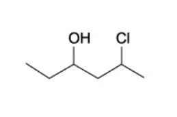<strong>B</strong>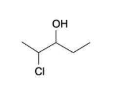<strong>C</strong>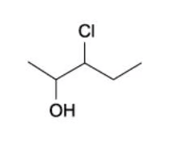<strong>D</strong>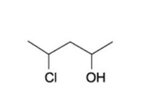

<button class="mc-choice" data-choice="A"><strong>A</strong>Diagram A</button><button class="mc-choice" data-choice="B"><strong>B</strong>Diagram B</button><button class="mc-choice" data-choice="C"><strong>C</strong>Diagram C</button><button class="mc-choice" data-choice="D"><strong>D</strong>Diagram D</button>

<button class="check-answer">Check answer</button>

Show explanation

<strong>D.</strong> Numbering gives the hydroxyl group the lowest locant: OH at carbon 2 and chlorine at carbon 4.

:::

::: {.mc-question #hc16-mc-e5 data-answer="D"}
### Question 5 · 3.4 Choice Easy Q5

What can be produced when an aqueous solution of butan-2-ol is oxidised under suitable conditions?

1. Butanone 2. Butanoic acid 3. Butanal

<button class="mc-choice" data-choice="A"><strong>A</strong>1, 2 and 3</button><button class="mc-choice" data-choice="B"><strong>B</strong>1 and 2</button><button class="mc-choice" data-choice="C"><strong>C</strong>2 and 3</button><button class="mc-choice" data-choice="D"><strong>D</strong>1 only</button>

<button class="check-answer">Check answer</button>

Show explanation

<strong>D.</strong> Butan-2-ol is a secondary alcohol and oxidises to butanone only.

:::

::: {.mc-question #hc16-mc-e6 data-answer="D"}
### Question 6 · 3.4 Choice Easy Q6

Which structures show a primary alcohol that cannot be dehydrated to form an alkene?

1. CH3OH 2. CH3CH2OH 3. CH3CH(OH)CH3

<button class="mc-choice" data-choice="A"><strong>A</strong>1, 2 and 3</button><button class="mc-choice" data-choice="B"><strong>B</strong>1 and 2</button><button class="mc-choice" data-choice="C"><strong>C</strong>2 and 3</button><button class="mc-choice" data-choice="D"><strong>D</strong>1 only</button>

<button class="check-answer">Check answer</button>

Show explanation

<strong>D.</strong> Methanol has no adjacent carbon from which a hydrogen can be removed to form a C=C bond.

:::

### 16 Hydroxy compounds — Multiple Choice: Medium

::: {.mc-question #hc16-mc-m1 data-answer="B"}
### Question 7 · 3.4 Choice Medium Q1

Which isomer of C4H10O forms three alkenes on dehydration?

<button class="mc-choice" data-choice="A"><strong>A</strong>Butan-1-ol</button><button class="mc-choice" data-choice="B"><strong>B</strong>Butan-2-ol</button><button class="mc-choice" data-choice="C"><strong>C</strong>2-methylpropan-1-ol</button><button class="mc-choice" data-choice="D"><strong>D</strong>2-methylpropan-2-ol</button>

<button class="check-answer">Check answer</button>

Show explanation

<strong>B.</strong> Butan-2-ol gives but-1-ene, cis-but-2-ene and trans-but-2-ene.

:::

::: {.mc-question #hc16-mc-m2 data-answer="C"}
### Question 8 · 3.4 Choice Medium Q2

Primary alcohols can be oxidised to aldehydes using either acidified potassium dichromate (VI) or acidified potassium manganate (VII). Both these oxidising agents change colour as they are reduced.

What is the colour of each oxidising agent before and after it has reacted?

|  | Acidified potassium dichromate (VI) before | after | Acidified potassium manganate (VII) before | after |
|---|---|---|---|---|
| A | Green | Orange | Purple | Colourless |
| B | Orange | Green | Colourless | Purple |
| C | Orange | Green | Purple | Colourless |
| D | Purple | Colourless | Orange | Green |

<button class="mc-choice" data-choice="A"><strong>A</strong>Green → orange; purple → colourless</button><button class="mc-choice" data-choice="B"><strong>B</strong>Orange → green; colourless → purple</button><button class="mc-choice" data-choice="C"><strong>C</strong>Orange → green; purple → colourless</button><button class="mc-choice" data-choice="D"><strong>D</strong>Purple → colourless; orange → green</button>

<button class="check-answer">Check answer</button>

Show explanation

<strong>C.</strong> Dichromate(VI) is orange and is reduced to green chromium(III); manganate(VII) is purple and is reduced to colourless manganate(II).

:::

::: {.mc-question #hc16-mc-m3 data-answer="C"}
### Question 9 · 3.4 Choice Medium Q3

Lactic acid, CH3CH(OH)CO2H, causes pain when it builds up in muscles.

Which reagent reacts with both of the `−OH` groups in lactic acid?

<button class="mc-choice" data-choice="A"><strong>A</strong>Acidified potassium dichromate (VI)</button><button class="mc-choice" data-choice="B"><strong>B</strong>Ethanol</button><button class="mc-choice" data-choice="C"><strong>C</strong>Sodium</button><button class="mc-choice" data-choice="D"><strong>D</strong>Sodium hydroxide</button>

<button class="check-answer">Check answer</button>

Show explanation

<strong>C.</strong> Sodium reacts with both the alcohol `−OH` and the carboxylic acid `−OH`; sodium hydroxide reacts with the acid group only.

:::

::: {.mc-question #hc16-mc-m4 data-answer="A"}
### Question 10 · 3.4 Choice Medium Q4

Which reagent could detect the presence of alcohol in a petrol consisting mainly of a mixture of alkanes and alkenes?

<button class="mc-choice" data-choice="A"><strong>A</strong>Na</button><button class="mc-choice" data-choice="B"><strong>B</strong>Br2 (in CCl4)</button><button class="mc-choice" data-choice="C"><strong>C</strong>KMnO4 (aq)</button><button class="mc-choice" data-choice="D"><strong>D</strong>2,4-dinitrophenylhydrazine</button>

<button class="check-answer">Check answer</button>

Show explanation

<strong>A.</strong> Sodium reacts with an alcohol to produce hydrogen; alkanes and alkenes do not give this test.

:::

::: {.mc-question #hc16-mc-m5 data-answer="B"}
### Question 11 · 3.4 Choice Medium Q5

Which reagent reacts with ethanol and also reacts with ethanoic acid?

<button class="mc-choice" data-choice="A"><strong>A</strong>Acidified potassium dichromate (VI)</button><button class="mc-choice" data-choice="B"><strong>B</strong>Sodium</button><button class="mc-choice" data-choice="C"><strong>C</strong>Sodium carbonate</button><button class="mc-choice" data-choice="D"><strong>D</strong>Sodium hydroxide</button>

<button class="check-answer">Check answer</button>

Show explanation

<strong>B.</strong> Both ethanol and ethanoic acid react with sodium to form hydrogen.

:::

::: {.mc-question #hc16-mc-m6 data-answer="C"}
### Question 12 · 3.4 Choice Medium Q6

Prop-2-en-1-ol, also known as allyl alcohol, reacts to form a product that can exist as optical isomers.

Which reagent would produce optical isomers from allyl alcohol?

<button class="mc-choice" data-choice="A"><strong>A</strong>Phosphorus pentachloride</button><button class="mc-choice" data-choice="B"><strong>B</strong>Sodium</button><button class="mc-choice" data-choice="C"><strong>C</strong>Bromine</button><button class="mc-choice" data-choice="D"><strong>D</strong>Hydrogen and nickel</button>

<button class="check-answer">Check answer</button>

Show explanation

<strong>C.</strong> Addition of bromine to the double bond gives a molecule with a chiral carbon atom.

:::

### 16 Hydroxy compounds — Multiple Choice: Hard

::: {.mc-question #hc16-mc-h1 data-answer="B"}
### Question 13 · 3.4 Choice Hard Q1

Which of the following alcohols would give a positive triiodomethane reaction?

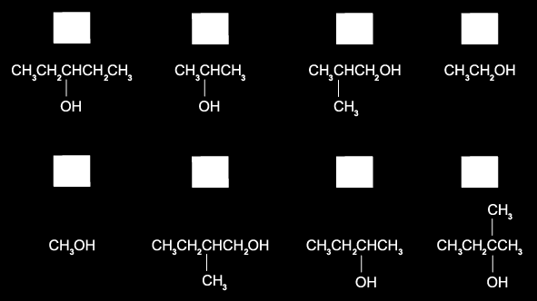

<button class="mc-choice" data-choice="A"><strong>A</strong>1, 2 and 7</button><button class="mc-choice" data-choice="B"><strong>B</strong>2, 4 and 7</button><button class="mc-choice" data-choice="C"><strong>C</strong>3, 4 and 5</button><button class="mc-choice" data-choice="D"><strong>D</strong>6, 7 and 8</button>

<button class="check-answer">Check answer</button>

Show explanation

<strong>B.</strong> The triiodomethane test is positive for ethanol and alcohols containing the `CH3CH(OH)−` group.

:::

::: {.mc-question #hc16-mc-h2 data-answer="C"}
### Question 14 · 3.4 Choice Hard Q2

An organic compound J reacts with sodium to produce an organic ion with a charge of −3. J reacts with NaOH (aq) to produce an organic ion with a charge of −1.

What could be the structural formula of J?

<button class="mc-choice" data-choice="A"><strong>A</strong>HO2CCH(OH)CH2CO2H</button><button class="mc-choice" data-choice="B"><strong>B</strong>HO2CCH(OH)CH2CHO</button><button class="mc-choice" data-choice="C"><strong>C</strong>HOCH2CH(OH)CH2CO2H</button><button class="mc-choice" data-choice="D"><strong>D</strong>HOCH2COCH2CHO</button>

<button class="check-answer">Check answer</button>

Show explanation

<strong>C.</strong> It contains two alcohol groups and one carboxylic acid group: sodium reacts with all three, whereas aqueous sodium hydroxide reacts with the carboxylic acid group only.

:::

::: {.mc-question #hc16-mc-h3 data-answer="C"}
### Question 15 · 3.4 Choice Hard Q3

The apparatus below shows an organic synthesis reaction:

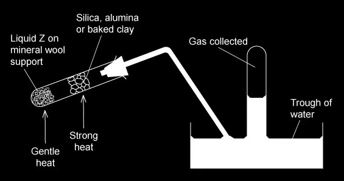

Which processes could be shown using the above apparatus?

1. Dehydration of ethanol (liquid Z) 2. Oxidation of ethanol (liquid Z) 3. Cracking of paraffin (liquid Z)

<button class="mc-choice" data-choice="A"><strong>A</strong>1, 2 and 3</button><button class="mc-choice" data-choice="B"><strong>B</strong>1 and 2</button><button class="mc-choice" data-choice="C"><strong>C</strong>1 and 3</button><button class="mc-choice" data-choice="D"><strong>D</strong>1 only</button>

<button class="check-answer">Check answer</button>

Show explanation

<strong>C.</strong> Alcohol dehydration and paraffin cracking can produce gases over a heated catalyst. The apparatus is not the oxidation setup for ethanol.

:::

::: {.mc-question #hc16-mc-h4 data-answer="A"}
### Question 16 · 3.4 Choice Hard Q4

An organic compound Y with molecular formula C5H12O is oxidised to compound Z with molecular formula C5H10O2.

What could be the structural formula of Y?

1. CH3(CH2)4OH 2. CH3CH2CH(CH2OH)CH3 3. CH3C(CH3)2CH2OH

<button class="mc-choice" data-choice="A"><strong>A</strong>1, 2 and 3</button><button class="mc-choice" data-choice="B"><strong>B</strong>1 and 3</button><button class="mc-choice" data-choice="C"><strong>C</strong>2 and 3</button><button class="mc-choice" data-choice="D"><strong>D</strong>3 only</button>

<button class="check-answer">Check answer</button>

Show explanation

<strong>A.</strong> Each structure is a primary alcohol and can be oxidised to a carboxylic acid with formula C5H10O2.

:::

::: {.mc-question #hc16-mc-h5 data-answer="A"}
### Question 17 · 3.4 Choice Hard Q5

Anumber of alcohols with the formula C4H10O are separately oxidised. Using 65 g of the alcohols a 55% yield of organic product is achieved.

What mass of product could be obtained?

1. 42.6 g of butanoic acid 2. 42.6 g of 2-methylpropanoic acid 3. 34.6 g of butanone

<button class="mc-choice" data-choice="A"><strong>A</strong>1, 2 and 3</button><button class="mc-choice" data-choice="B"><strong>B</strong>1 and 2</button><button class="mc-choice" data-choice="C"><strong>C</strong>2 and 3</button><button class="mc-choice" data-choice="D"><strong>D</strong>1 only</button>

<button class="check-answer">Check answer</button>

Show explanation

<strong>A.</strong> The two primary alcohol isomers give acids of the stated mass at 55% yield; the secondary alcohol gives butanone with the stated mass.

:::

::: {.mc-question #hc16-mc-h6 data-answer="B"}
### Question 18 · 3.4 Choice Hard Q6

In a multi-step synthesis reaction, butanal is converted into a compound Z.

CH3(CH2)2CHO → **HCN, NaCN** → X → **hot dilute H2SO4** → Y → **CH3CH2OH, heat, trace of concentrated H2SO4** → Z

What could Z be?

<button class="mc-choice" data-choice="A"><strong>A</strong>CH3(CH2)3COOCH2CH3</button><button class="mc-choice" data-choice="B"><strong>B</strong>CH3(CH2)2CH(OH)COOCH2CH3</button><button class="mc-choice" data-choice="C"><strong>C</strong>CH3(CH2)CH(OH)COCH2CH3</button><button class="mc-choice" data-choice="D"><strong>D</strong>CH3(CH2)2CH(OCH2CH3)COOH</button>

<button class="check-answer">Check answer</button>

Show explanation

<strong>B.</strong> Butanal forms a hydroxynitrile, hydrolysis gives 2-hydroxypentanoic acid, and ethanol esterifies the acid.

:::

::: {.mc-question #hc16-mc-h7 data-answer="D"}
### Question 19 · 3.4 Choice Hard Q7

What will react differently with the two isomeric alcohols, (CH3)3CCH2OH and (CH3)2CHCH2CH2OH?

<button class="mc-choice" data-choice="A"><strong>A</strong>Sodium</button><button class="mc-choice" data-choice="B"><strong>B</strong>Acidified aqueous potassium dichromate (VI)</button><button class="mc-choice" data-choice="C"><strong>C</strong>Phosphorus pentachloride</button><button class="mc-choice" data-choice="D"><strong>D</strong>Concentrated sulfuric acid</button>

<button class="check-answer">Check answer</button>

Show explanation

<strong>D.</strong> Both are primary alcohols, but their dehydration products differ because the available adjacent carbons differ.

:::

::: {.mc-question #hc16-mc-h8 data-answer="C"}
### Question 20 · 3.4 Choice Hard Q8

Compound Q has the molecular formula C10H14O and is unreactive towards mild oxidising agents.

Which structure formed by the dehydration of compound Q?

<strong>A</strong>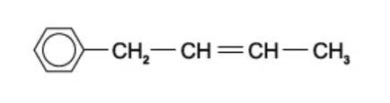<strong>B</strong>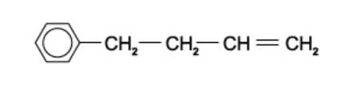<strong>C</strong>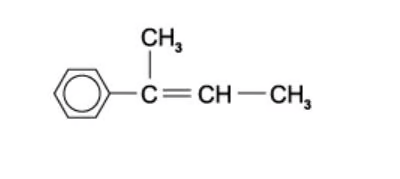<strong>D</strong>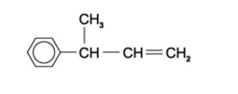

<button class="mc-choice" data-choice="A"><strong>A</strong>Structure A</button><button class="mc-choice" data-choice="B"><strong>B</strong>Structure B</button><button class="mc-choice" data-choice="C"><strong>C</strong>Structure C</button><button class="mc-choice" data-choice="D"><strong>D</strong>Structure D</button>

<button class="check-answer">Check answer</button>

Show explanation

<strong>C.</strong> Q is a tertiary alcohol, so dehydration gives the more substituted alkene shown in structure C.

:::

## Structured questions

### 3.4 Hydroxy Compounds — Structured Questions: Easy

::: {.question-card #hc16-sq-e1}
### Question 1 · 3.4 SQ Easy Q1

**(a)** Butan-1-ol can undergo different reactions, State the equation for the combustion of butan-1-ol. `[2 marks]`

**(b)** A flow chart for some reactions of butan-2-ol is shown below.

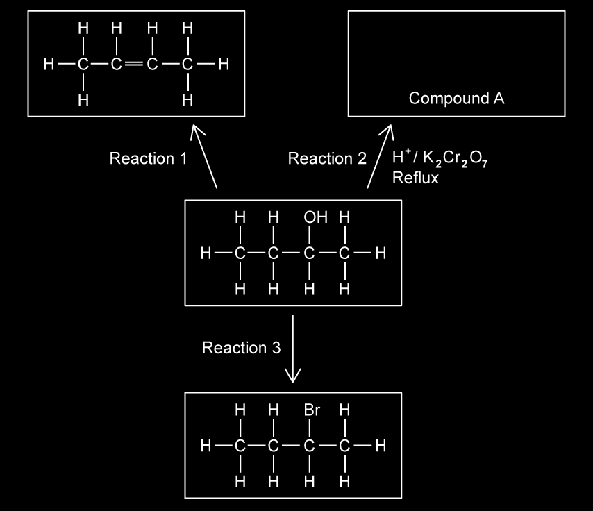

State the reagents and conditions required for reactions 1 and 3. `[3 marks]`

**(c)** Name compound A. `[1 mark]`

Show mark scheme / model answer
<ul><li>**(a)** $\ce{C4H9OH + 6O2 -> 4CO2 + 5H2O}$.</li><li>**(b)** Reaction 1: hot aluminium oxide catalyst, or concentrated sulfuric/phosphoric acid and heat. Reaction 3: sodium or potassium bromide with concentrated acid, or HBr at room temperature, or PBr3 with heat.</li><li>**(c)** Butanone.</li></ul>

:::

::: {.question-card #hc16-sq-e2}
### Question 2 · 3.4 SQ Easy Q2

**(a)** State to which class of alcohol the following alcohols belong to in Table 2.1.

| Alcohol | Class of Alcohol |
|---|---|
| 2-methylpropan-2-ol | |
| Butan-1-ol | |
| Butan-2-ol | |
| 2-methylpropan-1-ol | |

`[4 marks]`

**(b)** Write equations for

1. The dissociation of water
2. The dissociation of butan-1-ol

`[2 marks]`

**(c)** Explain why alcohols are weaker acids than water. `[3 marks]`

Show mark scheme / model answer
<ul><li>**(a)** Tertiary; primary; secondary; primary.</li><li>**(b)** $\ce{H2O(l) <=> H+(aq) + OH-(aq)}$; $\ce{CH3CH2CH2CH2OH(aq) <=> CH3CH2CH2CH2O-(aq) + H+(aq)}$.</li><li>**(c)** Alkyl groups have a positive inductive effect and donate electron density to the negatively charged oxygen in the alkoxide ion. The alkoxide ion is more likely to accept H+ and reform the alcohol.</li></ul>

:::

::: {.question-card #hc16-sq-e3}
### Question 3 · 3.4 SQ Easy Q3

Three different alcohols, A, B and C are shown in Fig. 3.1.

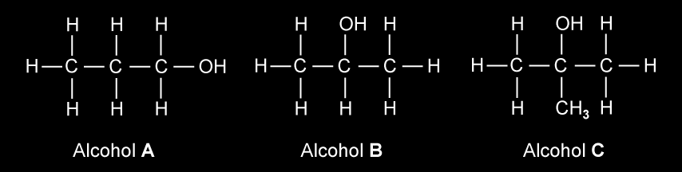

**(a)** Name alcohol C and state the class of alcohol to which it belongs. `[2 marks]`

**(b)** Alcohol A is refluxed with acidified potassium dichromate.

1. Name the organic product formed.
2. State the colour change observed in this reaction.

`[2 marks]`

**(c)** Alcohols A, B and C are heated separately with an alkaline solution of iodine. State which alcohol will give a yellow precipitate during this reaction. `[1 mark]`

Show mark scheme / model answer
<ul><li>**(a)** 2-methylpropan-2-ol; tertiary alcohol.</li><li>**(b)** Propanoic acid; orange to green.</li><li>**(c)** Alcohol B.</li></ul>

:::

### 3.4 Hydroxy Compounds — Structured Questions: Medium

::: {.question-card #hc16-sq-m1}
### Question 4 · 3.4 SQ Medium Q1

Alcohol A has the formula (CH3)3CCH(OH)CH3 and alcohol B has the formula (CH3)3CCH2CH2OH.

**(a)(i)** Draw the displayed formula of alcohol A and state its name in Table 1.1. `[2 marks]`

**(a)(ii)** In Table 1.2 draw the displayed formula of the organic product formed when alcohol A is heated under reflux with acidified potassium dichromate(VI). `[1 mark]`

**(a)(iii)** When alcohol B is heated under reflux with acidified potassium dichromate(VI), a different organic product is formed. Draw the displayed formula of this product in Table 1.3. Explain why this product is different to the one formed in part (ii). `[4 marks]`

**(b)** 2-bromobutane can be prepared by the following reaction:

$\ce{CH3CH(OH)CH2CH3 + Br- -> CH3CH(Br)CH2CH3 + OH-}$

1. Name the type of reaction occurring.
2. Suggest suitable reagents for this reaction.

`[3 marks]`

**(c)** Explain why both alcohols A and B are soluble in water. `[2 marks]`

**(d)** Alcohols A and B are heated with an alkaline solution of iodine. Complete Table 1.4 stating the observations for each alcohol. `[2 marks]`

Show mark scheme / model answer
<ul><li>**(a)** A is 4,4-dimethylpentan-2-ol and gives the ketone 4,4-dimethylpentan-2-one. B is a primary alcohol and gives 3,3-dimethylbutanal, then the carboxylic acid on reflux; the products differ because A is secondary and B is primary.</li><li>**(b)** Nucleophilic substitution; aqueous bromide / concentrated sulfuric acid to generate HBr, or another suitable source of HBr.</li><li>**(c)** The polar `−OH` group forms hydrogen bonds with water.</li><li>**(d)** Alcohol A: no yellow precipitate. Alcohol B: no yellow precipitate.</li></ul>

:::

::: {.question-card #hc16-sq-m2}
### Question 5 · 3.4 SQ Medium Q2

**(a)** When pentan-2-ol reacts with concentrated phosphoric acid under reflux, three alkenes are formed, X, Y and Z. X and Y are stereoisomers of one another. Draw the structures of alkenes, X, Y and Z. `[3 marks]`

**(b)** State how the stereoisomers formed in part (a) arise. `[2 marks]`

**(c)** Pentan-2-ol can undergo different reactions. Write the equations for the reaction of pentan-2-ol with the following reagents. You do not need to include state symbols. `[6 marks]`

1. Oxygen
2. Sodium
3. Phosphorus(V) chloride

**(d)** Pentan-2-ol can undergo oxidation when reacted with potassium dichromate(VI) to form a ketone. Draw and label the apparatus which would be necessary to ensure that pentan-2-ol was oxidised to the ketone. `[4 marks]`

Show mark scheme / model answer
<ul><li>**(a)** The three products are pent-1-ene, cis-pent-2-ene and trans-pent-2-ene.</li><li>**(b)** Each carbon of the C=C bond has two different atoms/groups attached and the double bond cannot rotate.</li><li>**(c)** $\ce{2CH3CH(OH)CH2CH2CH3 + 15O2 -> 10CO2 + 12H2O}$; $\ce{2CH3CH(OH)CH2CH2CH3 + 2Na -> 2CH3CH(ONa)CH2CH2CH3 + H2}$; $\ce{CH3CH(OH)CH2CH2CH3 + PCl5 -> CH3CH(Cl)CH2CH2CH3 + HCl + POCl3}$.</li><li>**(d)** Use a distillation apparatus: heat the alcohol and oxidising mixture, with a thermometer and condenser leading to a receiving flask, so the ketone distils off before further oxidation.</li></ul>

:::

::: {.question-card #hc16-sq-m3}
### Question 6 · 3.4 SQ Medium Q3

This question is about the formation of alcohols.

2-bromobutane reacts with OH− in aqueous conditions to produce alcohol A.

**(a)** Draw the structure of alcohol A. `[1 mark]`

**(b)** Draw the reaction mechanism for the formation of alcohol A in part (a). `[3 marks]`

**(c)** Alcohol A reacts with ethanoic acid in the presence of concentrated sulfuric acid to form compound B. Draw the structure of compound B. `[1 mark]`

**(d)** Both alcohol A and water can act as weak acids. Explain why alcohol A is a weaker acid than water. `[3 marks]`

Show mark scheme / model answer
<ul><li>**(a)** Butan-2-ol, CH3CH(OH)CH2CH3.</li><li>**(b)** Nucleophilic substitution: the lone pair on OH− attacks the δ+ carbon and the C–Br bond breaks to Br−.</li><li>**(c)** Butan-2-yl ethanoate, CH3COOCH(CH3)CH2CH3.</li><li>**(d)** The alkyl groups have a positive inductive effect and increase electron density on oxygen in the alkoxide ion. The alkoxide ion therefore accepts H+ more readily than hydroxide, so alcohol A is the weaker acid.</li></ul>

:::

::: {.question-card #hc16-sq-m4}
### Question 7 · 3.4 SQ Medium Q4

Butan-1-ol can be oxidised by acidified potassium manganate(VII), KMnO4, using two different methods.

In the first method, butan-1-ol is added dropwise to acidified potassium manganate(VII), KMnO4, and the product is distilled off immediately.

**(a)** Using the symbol `[O]` for the oxidising agent, write an equation for this oxidation of butan-1-ol, showing clearly the structure of the product. State what colour change you would observe. `[2 marks]`

**(b)** In a second method, the mixture of butan-1-ol and acidified potassium manganate(VII), KMnO4, is heated under reflux. Identify the product which is obtained by this reaction. `[1 mark]`

**(c)** Give the structures and names of two branched chain alcohols which are both isomers of butan-1-ol. Only Isomer 1 is oxidised when warmed with acidified potassium manganate(VII). `[4 marks]`

**(d)** Write the half equation for the reduction of MnO4− in this reaction. `[2 marks]`

Show mark scheme / model answer
<ul><li>**(a)** $\ce{CH3CH2CH2CH2OH + [O] -> CH3CH2CH2CHO + H2O}$; purple/pink to colourless.</li><li>**(b)** Butanoic acid.</li><li>**(c)** Isomer 1: 2-methylpropan-1-ol, which is primary and oxidises. Isomer 2: 2-methylpropan-2-ol, which is tertiary and does not oxidise under these conditions.</li><li>**(d)** $\ce{MnO4^- + 8H+ + 5e^- -> Mn^{2+} + 4H2O}$.</li></ul>

:::

### 3.4 Hydroxy Compounds — Structured Questions: Hard

::: {.question-card #hc16-sq-h1}
### Question 8 · 3.4 SQ Hard Q1

Four reactions on butan-2-ol are shown below.

| Reaction | Scheme |
|---|---|
| Reaction 1 | Butan-2-ol —H3PO4, heat→ compound A |
| Reaction 2 | Butan-2-ol —reagent X→ compound B + HCl + SO2 |
| Reaction 3 | Butan-2-ol —PBr3, room temp→ compound C |
| Reaction 4 | Butan-2-ol —reagent Y, room temp→ 2-chlorobutane |

Compound A is a stereoisomer of cis-but-2-ene.

**(a)(i)** Draw the structure of the stereoisomer of cis-but-2-ene. `[1 mark]`

**(a)(ii)** Explain why compound A is less soluble than butan-2-ol. `[2 marks]`

**(b)(i)** The reaction to form 2-chlorobutane produces three products. State the name of reagent Y. `[1 mark]`

**(b)(ii)** Give the formulae of the two other products formed in this reaction. `[2 marks]`

**(c)** Give the equation for the overall reaction between butan-2-ol and phosphorus tribromide which occurs at room temperature. `[2 marks]`

**(d)** Draw the structure of compound B and identify reagent X. `[2 marks]`

Show mark scheme / model answer
<ul><li>**(a)** Draw trans-but-2-ene. Compound A has no polar `−OH` group and cannot hydrogen-bond with water.</li><li>**(b)** Y is phosphorus pentachloride; the other products are HCl and POCl3.</li><li>**(c)** $\ce{3CH3CH(OH)CH2CH3 + PBr3 -> 3CH3CH(Br)CH2CH3 + H3PO3}$.</li><li>**(d)** B is 2-chlorobutane and X is thionyl chloride, SOCl2.</li></ul>

:::

::: {.question-card #hc16-sq-h2}
### Question 9 · 3.4 SQ Hard Q2

The structure of glycolic acid is shown in Fig. 2.1.

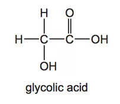{.question-figure fig-alt="Displayed structure of glycolic acid"}

**(a)** Complete Table 2.1 to show what you would observe when an aqueous solution of glycolic acid is added separately to each of the reagents. If a reaction occurs, state the functional group of glycolic acid that is responsible for the reaction.

| Reagent | Observation with glycolic acid | Functional group |
|---|---|---|
| Mg(s) | | |
| 2,4-DNPH | | |
| Acidified KMnO4 | | |

`[3 marks]`

**(b)** Glycolic acid can also be made by reacting glyoxylic acid with NaBH4 as shown in Fig. 2.2.

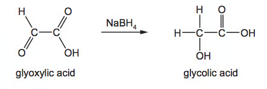{.question-figure fig-alt="Reduction of glyoxylic acid to glycolic acid"}

1. State the role of NaBH4 in this reaction.
2. Write an equation for this reaction using molecular formulae. Use `[H]` to represent NaBH4.
3. Explain why NaBH4 is a suitable reducing agent for this reaction.

`[4 marks]`

**(c)** When glycolic acid is heated in the presence of a sulfuric acid catalyst, a new compound, Y, C4H4O4, is formed. The equation for the reaction is given.

$\ce{2CH2(OH)CO2H -> C4H4O4 + 2H2O}$

The infrared spectrum of Y is shown in Fig. 2.3.

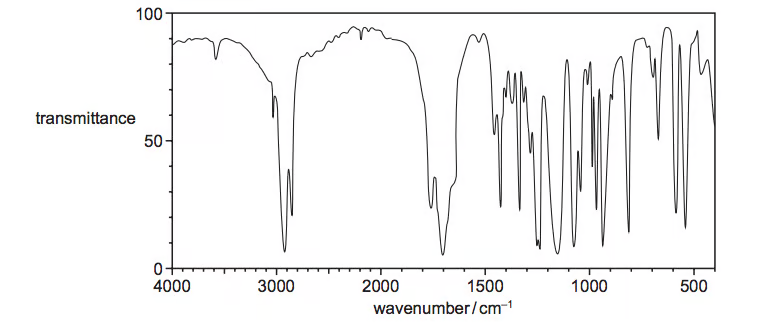{.question-figure fig-alt="Infrared spectrum of compound Y"}

1. State how this spectrum differs from an infrared spectrum of glycolic acid. Using Table 2.1, explain your answer with particular reference to the peaks within the range 1500–4000 cm−1.
2. Suggest a structure for Y.

`[4 marks]`

Show mark scheme / model answer
<ul><li>**(a)** Mg: effervescence, carboxylic acid group; 2,4-DNPH: no visible reaction; acidified KMnO4: purple to colourless, alcohol group.</li><li>**(b)** NaBH4 is a reducing agent. $\ce{C2H2O3 + 2[H] -> C2H4O3}$. It reduces the aldehyde group but not the carboxylic acid group.</li><li>**(c)** Y has no carboxylic-acid O–H absorption at 2500–3000 cm−1 and no alcohol O–H absorption at 3200–3600 cm−1; it has an ester C=O absorption. A valid structure is the cyclic diester 1,4-dioxane-2,5-dione.</li></ul>

:::

::: {.question-card #hc16-sq-h3}
### Question 10 · 3.4 SQ Hard Q3

Compounds W, X and Y are all straight chain carbohydrates with X and Y each containing five carbons. Compound W and a by-product, compound Z, are formed from the reaction between compound X and Y.

Compound X can be fully oxidised by the reaction with acidified potassium manganate(VII) to give compound Y. 5.508 g of compound Y contains 0.054 moles.

**(a)** State the name of compound Y. Justify your answer. `[3 marks]`

**(b)(i)** Draw the full displayed formula of compound W. `[1 mark]`

**(b)(ii)** Explain how compound Z is formed in the reaction. `[1 mark]`

**(c)** Compound X will oxidise to compound Y if allowed to fully oxidise. Explain how a student could stop the full oxidation of compound X. `[4 marks]`

**(d)(i)** Write the structural formula of an isomer of compound X that will not react with acidified potassium manganate(VII). `[1 mark]`

**(d)(ii)** Using your knowledge of bonds present in the oxidation products of different classes of alcohols, suggest why the isomer you have drawn will not react with acidified potassium manganate(VII). `[4 marks]`

Show mark scheme / model answer
<ul><li>**(a)** Y is pentanoic acid. Its molar mass is 5.508 ÷ 0.054 = 102.0, matching C5H10O2; full oxidation of pentan-1-ol gives pentanoic acid.</li><li>**(b)** W is pentyl pentanoate, CH3(CH2)3COOCH2(CH2)3CH3. Z is water, formed by condensation of the alcohol and carboxylic acid.</li><li>**(c)** Use excess pentan-1-ol and distil off pentanal immediately as it forms, using a Liebig condenser / a temperature above the aldehyde boiling point.</li><li>**(d)** One valid isomer is 2-methylbutan-2-ol, CH3C(OH)(CH3)CH2CH3. A tertiary alcohol has no C–H bond on the carbon attached to OH, so it cannot form a C=O bond by oxidation.</li></ul>

:::

## Original question PDFs

- [3.4 Hydroxy Compounds — Choice — Easy](../assets/questions/original-source/3.4_hydroxy_compounds___choice___easy.pdf)
- [3.4 Hydroxy Compounds — Choice — Medium](../assets/questions/original-source/3.4_hydroxy_compounds___choice___medium.pdf)
- [3.4 Hydroxy Compounds — Choice — Hard](../assets/questions/original-source/3.4_hydroxy_compounds___choice___hard.pdf)
- [3.4 Hydroxy Compounds — Structured Questions — Easy](../assets/questions/original-source/3.4_hydroxy_compounds___sq___easy.pdf)
- [3.4 Hydroxy Compounds — Structured Questions — Medium](../assets/questions/original-source/3.4_hydroxy_compounds___sq___medium.pdf)
- [3.4 Hydroxy Compounds — Structured Questions — Hard](../assets/questions/original-source/3.4_hydroxy_compounds___sq___hard.pdf)
