# 17 Carbonyl compounds

本章只覆盖 Cambridge International AS Level Chemistry 9701 的 **3.5 Carbonyl compounds**。题干与选项通过 OCR 录入；原题中的结构式、反应图和表格按原 PDF 中的独立图像对象提取。无法独立提取的页面截图不放入本页；本页不加入 A2 内容。

## Learning objectives

学完本章后，你应该能够：

- identify aldehydes and ketones from their structural and displayed formulae;
- explain the polarity of the carbonyl group and describe nucleophilic addition with hydrogen cyanide;
- distinguish aldehydes from ketones using Tollens' reagent, Fehling's solution and 2,4-DNPH;
- describe oxidation of aldehydes and reduction of aldehydes and ketones;
- select suitable conditions for controlled oxidation;
- apply the triiodomethane test and carbonyl reaction pathways.

## 17.1 Structure and properties

The carbonyl group is a carbon atom double-bonded to an oxygen atom, `C=O`. Oxygen is more electronegative than carbon, so the bond is polarised:

$$\ce{C^{delta+}=O^{delta-}}$$

The carbonyl carbon is electron-deficient and is attacked by nucleophiles. The carbonyl carbon is trigonal planar, with bond angles close to 120°. The C=O bond consists of one sigma bond and one pi bond; the pi bond is the part that is broken when a nucleophile adds to the carbonyl group.

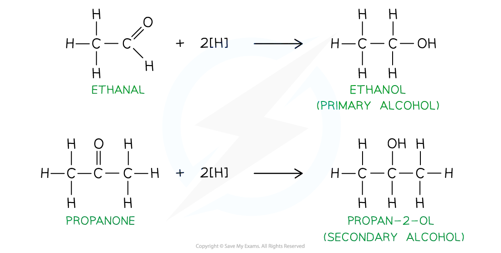{.question-figure fig-alt="Extracted reduction overview for aldehydes and ketones"}

An aldehyde has the general formula `RCHO`; its carbonyl group is at the end of a carbon chain. A ketone has the general formula `RR'CO`; its carbonyl group is between two carbon atoms.

| Type | General structure | Example |
|---|---|---|
| aldehyde | `RCHO` | methanal, `HCHO`; ethanal, `CH3CHO` |
| ketone | `RR'CO` | propanone, `CH3COCH3`; butanone, `CH3COCH2CH3` |

The suffix for an aldehyde is **-al** and the suffix for a ketone is **-one**. The carbonyl carbon in an aldehyde is carbon 1. In a ketone, the chain is numbered so that the carbonyl carbon has the lowest possible number.

## 17.2 Nucleophilic addition of hydrogen cyanide

### Reaction and conditions

Hydrogen cyanide adds across the C=O bond of both aldehydes and ketones. The reaction uses HCN with a small amount of soluble cyanide, such as KCN or NaCN, as a catalyst. The product is a **hydroxynitrile** (also called a cyanohydrin):

$$\ce{RCHO + HCN -> RCH(OH)CN}$$

$$\ce{RR'CO + HCN -> RR'C(OH)CN}$$

The reaction produces a new C–C bond and converts the planar carbonyl carbon into a tetrahedral carbon atom. If the product carbon is attached to four different groups, a pair of optical isomers can form. The planar carbonyl group can be attacked from either side, so the products are normally formed as a racemic mixture.

### Mechanism

1. The cyanide ion, `CN−`, is the nucleophile. Its lone pair attacks the `δ+` carbonyl carbon.
2. The C=O pi-electron pair moves onto oxygen, forming an alkoxide ion.
3. The alkoxide ion accepts a proton from HCN, producing the hydroxyl group and regenerating `CN−`.

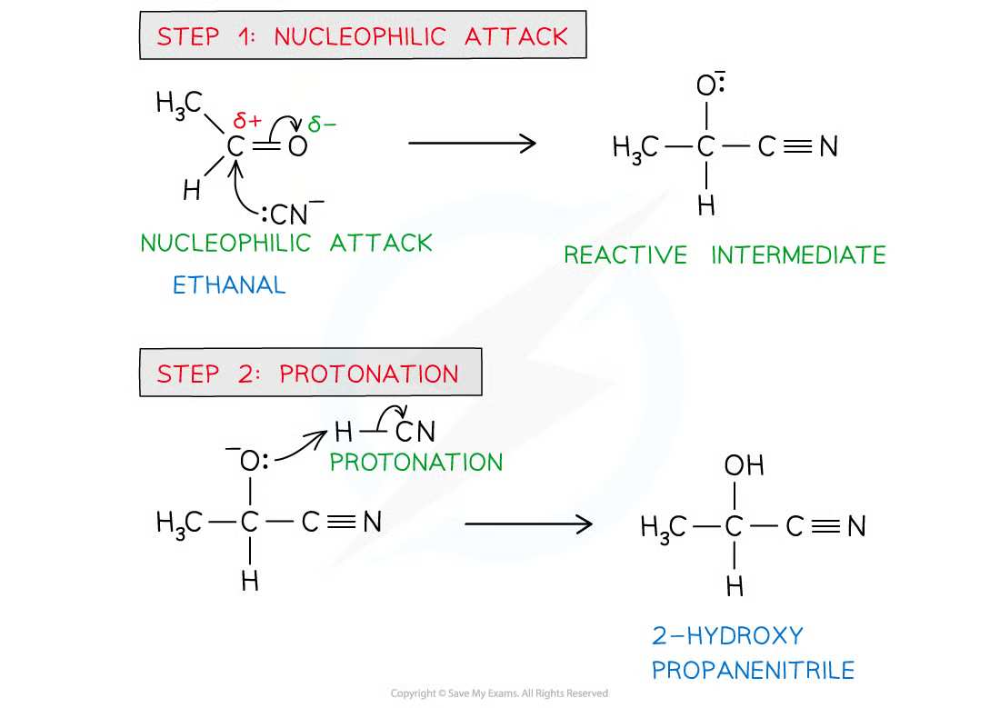{.question-figure fig-alt="Extracted HCN nucleophilic addition mechanism"}

The reaction is called **nucleophilic addition** because a nucleophile adds to a polar multiple bond and only one organic product is formed. It is not nucleophilic substitution: no atom or group is replaced.

## 17.3 Oxidation of aldehydes and ketones

Aldehydes are readily oxidised to carboxylic acids:

$$\ce{RCHO + [O] -> RCOOH}$$

For example:

$$\ce{CH3CHO + [O] -> CH3COOH}$$

Acidified potassium dichromate(VI) changes from orange to green. Acidified potassium manganate(VII) changes from purple to colourless. When a primary alcohol is oxidised, distillation removes the aldehyde as it forms and limits further oxidation. Refluxing allows the aldehyde to remain in the flask and gives the carboxylic acid.

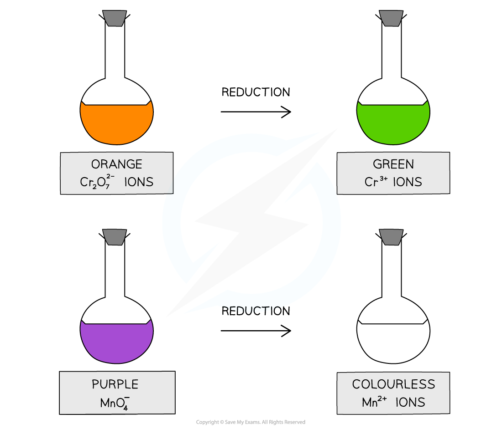{.question-figure fig-alt="Extracted colour changes for dichromate and manganate oxidising agents"}

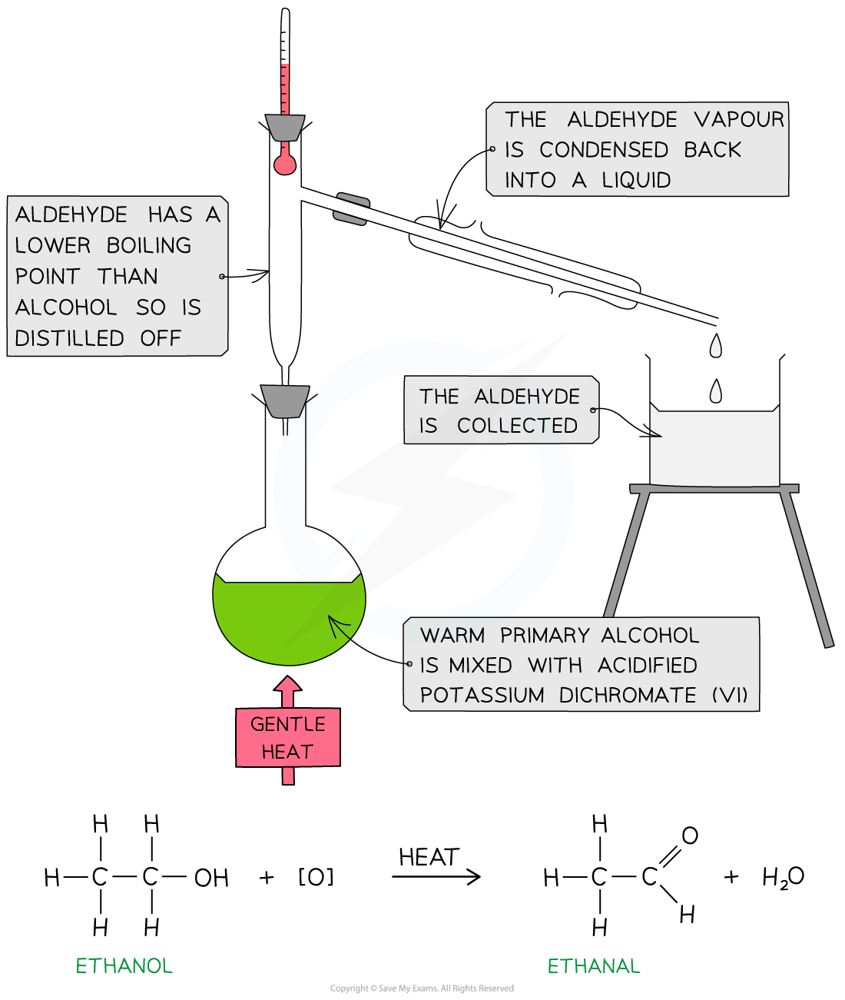{.question-figure fig-alt="Extracted distillation method for controlled oxidation"}

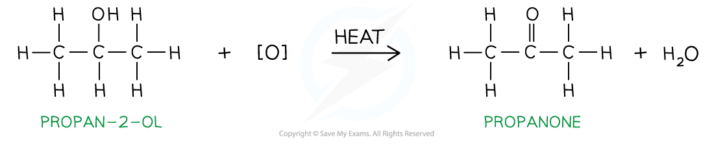{.question-figure fig-alt="Extracted oxidation of propan-2-ol to propanone"}

Ketones do not oxidise under the usual AS test conditions. Oxidising a ketone requires breaking carbon–carbon bonds, so ketones do not give the aldehyde oxidation tests.

The oxidation distinction is important:

| Compound | Acidified dichromate(VI) / manganate(VII) | Tollens' reagent | Fehling's solution |
|---|---|---|---|
| aldehyde | oxidised; oxidising agent changes colour | silver mirror | blue solution gives red precipitate |
| ketone | no reaction under AS conditions | no visible change | solution remains blue |

## 17.4 Reduction of aldehydes and ketones

The AS reducing agent is aqueous sodium tetrahydridoborate(III), NaBH4, usually warmed in aqueous or aqueous-ethanolic solution. In equations, `[H]` may be used to represent the reducing agent.

An aldehyde is reduced to a primary alcohol:

$$\ce{RCHO + 2[H] -> RCH2OH}$$

A ketone is reduced to a secondary alcohol:

$$\ce{RR'CO + 2[H] -> RR'CHOH}$$

The carbonyl carbon becomes tetrahedral. A ketone reduction product may contain a chiral carbon if the two groups originally attached to the carbonyl carbon are different. An aldehyde reduction product has two hydrogen atoms attached to the new alcohol carbon and therefore cannot have a chiral centre at that carbon.

The following extracted note diagram summarises reduction of aldehydes and ketones:

{.question-figure fig-alt="Extracted comparison of aldehyde and ketone reduction products"}

## 17.5 Chemical tests

### 2,4-dinitrophenylhydrazine (2,4-DNPH)

Add 2,4-DNPH reagent to the carbonyl compound. An aldehyde or ketone gives an orange or deep-orange precipitate of a 2,4-DNPH derivative. A precipitate confirms a carbonyl group but does not distinguish an aldehyde from a ketone.

The derivative can be purified by filtration and recrystallisation. Its melting point can then be compared with reference melting-point data to identify the original carbonyl compound.

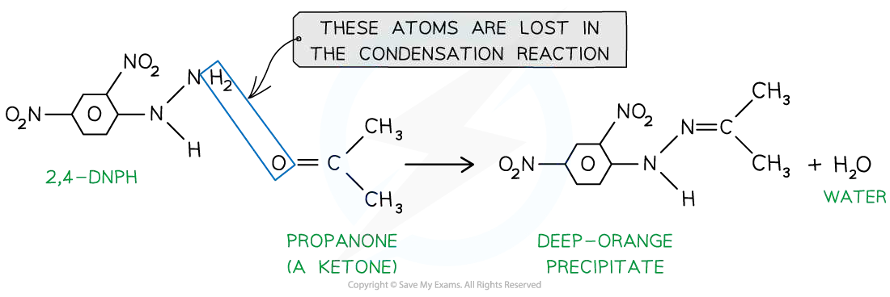{.question-figure fig-alt="Extracted 2,4-DNPH condensation reaction"}

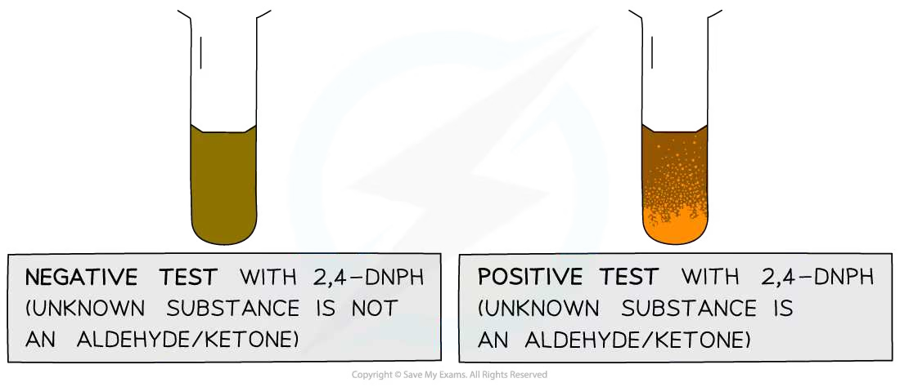{.question-figure fig-alt="Extracted positive and negative 2,4-DNPH test observations"}

### Tollens' reagent

Tollens' reagent is an alkaline solution containing the diamminesilver(I) complex, `[Ag(NH3)2]+`. Warm the compound with the reagent in a clean test tube:

- an aldehyde is oxidised to a carboxylate ion and silver(I) is reduced to silver, producing a silver mirror;
- a ketone gives no visible change.

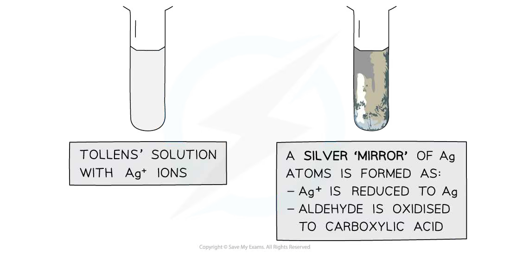{.question-figure fig-alt="Extracted Tollens' reagent silver mirror test"}

### Fehling's solution

Warm the carbonyl compound with Fehling's solution:

- an aldehyde reduces blue `Cu2+` ions to red copper(I) oxide, `Cu2O`;
- a ketone gives no reaction and the solution remains blue.

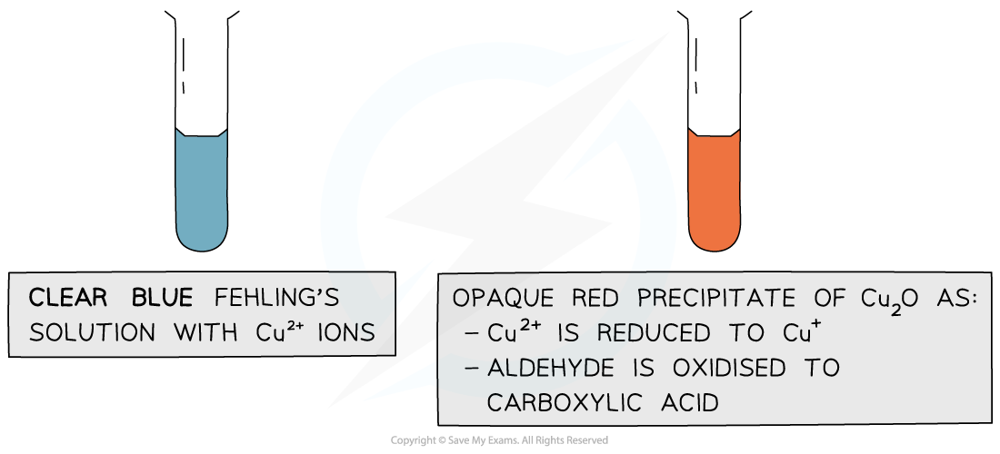{.question-figure fig-alt="Extracted Fehling's solution test"}

### Triiodomethane test

Warm the compound with alkaline iodine solution. A pale-yellow precipitate of triiodomethane, `CHI3`, indicates either a methyl ketone group, `CH3CO−`, or the related `CH3CH(OH)−` group after oxidation. Propanone and ethanal-derived ethanol-type structures can therefore give a positive result, but not every aldehyde or ketone does.

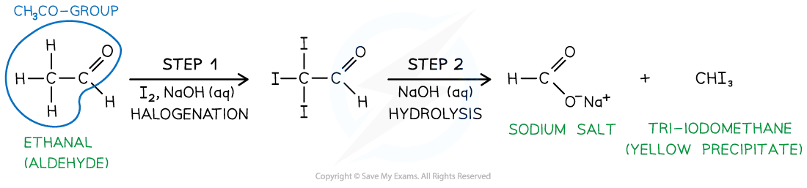{.question-figure fig-alt="Extracted triiodomethane test for a methyl carbonyl group"}

## 17.6 Reaction pathways and identification strategy

For an unknown organic compound, use the tests in a logical order:

1. Use 2,4-DNPH to establish whether an aldehyde or ketone carbonyl group is present.
2. If the 2,4-DNPH test is positive, use Tollens' reagent or Fehling's solution to distinguish aldehyde from ketone.
3. Use acidified dichromate(VI) or manganate(VII) to confirm oxidation of an aldehyde, and record the colour change.
4. Use NaBH4 to reduce the carbonyl compound and identify whether the product is a primary or secondary alcohol.
5. Use the triiodomethane test when a `CH3CO−` or `CH3CH(OH)−` group is suspected.
6. For a full identification, purify a 2,4-DNPH derivative and compare its melting point with data for known derivatives.

Hydroxynitriles can be hydrolysed under acidic conditions to form an alpha-hydroxycarboxylic acid. Reaction pathways may therefore combine nucleophilic addition, hydrolysis, oxidation, reduction, tests, stereoisomerism and percentage-yield calculations.

## Chapter checklist

- [ ] I can identify aldehydes and ketones.
- [ ] I can describe HCN nucleophilic addition.
- [ ] I can distinguish aldehydes and ketones with the standard AS tests.
- [ ] I can write oxidation and reduction products.
- [ ] I can apply carbonyl chemistry to reaction pathways and calculations.

## Multiple choice questions

以下 20 道选择题的文字来自原题 OCR；结构式和图示使用完整的独立原图，不使用整页题纸截图。

### 17 Carbonyl compounds — Multiple Choice: Easy

::: {.mc-question #cc17-mc-e1 data-answer="C"}
### Question 1 · 3.5 Choice Easy Q1

What is formed when butanone is refluxed with a solution of NaBH4?

<button class="mc-choice" data-choice="A"><strong>A</strong>Butane</button><button class="mc-choice" data-choice="B"><strong>B</strong>Butan-1-ol</button><button class="mc-choice" data-choice="C"><strong>C</strong>Butan-2-ol</button><button class="mc-choice" data-choice="D"><strong>D</strong>Butanal</button>

<button class="check-answer">Check answer</button>

Show explanation

<strong>C. Butan-2-ol.</strong> NaBH4 reduces a ketone to a secondary alcohol. In butanone the carbonyl carbon is carbon 2, so the product is butan-2-ol. The carbon skeleton is not broken and the carbonyl group is converted from C=O to C-OH.

:::

::: {.mc-question #cc17-mc-e2 data-answer="B"}
### Question 2 · 3.5 Choice Easy Q2

In 1903 Arthur Lapworth became the first chemist to investigate a reaction mechanism. The reaction of hydrogen cyanide with propanone.

What do we now call the mechanism of this reaction?

<button class="mc-choice" data-choice="A"><strong>A</strong>Nucleophilic substitution</button><button class="mc-choice" data-choice="B"><strong>B</strong>Nucleophilic addition</button><button class="mc-choice" data-choice="C"><strong>C</strong>Electrophilic substitution</button><button class="mc-choice" data-choice="D"><strong>D</strong>Electrophilic addition</button>

<button class="check-answer">Check answer</button>

Show explanation

<strong>B. Nucleophilic addition.</strong> The carbonyl bond is polarised, so CN- attacks the δ+ carbonyl carbon. The C=O π electrons move onto oxygen and a hydroxynitrile is formed. No atom or group is replaced, so this is addition rather than substitution.

:::

::: {.mc-question #cc17-mc-e3 data-answer="B"}
### Question 3 · 3.5 Choice Easy Q3

Which carbonyl compound(s) react with both LiAlH4 and Tollens' reagent?

<button class="mc-choice" data-choice="A"><strong>A</strong>Ketones only</button><button class="mc-choice" data-choice="B"><strong>B</strong>Aldehydes only</button><button class="mc-choice" data-choice="C"><strong>C</strong>Both aldehydes and ketones</button><button class="mc-choice" data-choice="D"><strong>D</strong>Neither aldehydes nor ketones</button>

<button class="check-answer">Check answer</button>

Show explanation

<strong>B. Aldehydes only.</strong> LiAlH4 reduces both aldehydes and ketones, but Tollens' reagent oxidises aldehydes to carboxylates and forms a silver mirror. Ketones do not react under the usual Tollens' test conditions.

:::

::: {.mc-question #cc17-mc-e4 data-answer="C"}
### Question 4 · 3.5 Choice Easy Q4

In a nucleophilic addition reaction, aqueous methanolic solution of NaBH4 acts as a reducing agent when added to propanal, CH3CH2CHO.

What is the first step of this mechanism?

<button class="mc-choice" data-choice="A"><strong>A</strong>Attack of an H− ion at the oxygen atom of the carbonyl group</button><button class="mc-choice" data-choice="B"><strong>B</strong>Attack of an H+ ion at the oxygen atom of the carbonyl group</button><button class="mc-choice" data-choice="C"><strong>C</strong>Attack of an H− ion at the carbon atom of the carbonyl group</button><button class="mc-choice" data-choice="D"><strong>D</strong>Attack of an H+ ion at the carbon atom of the carbonyl group</button>

<button class="check-answer">Check answer</button>

Show explanation

<strong>C. Hydride attacks the carbonyl carbon.</strong> H- is the nucleophile. It attacks the δ+ carbon atom, while the C=O π electrons move to the δ- oxygen atom. Protonation of the alkoxide occurs afterwards.

:::

::: {.mc-question #cc17-mc-e5 data-answer="B"}
### Question 5 · 3.5 Choice Easy Q5

The characteristic smell of burnt sugar is partly caused by the following compound.

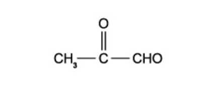{.question-figure fig-alt="Complete original structure of the carbonyl compound"}

There are two functional groups in the compound. Which reagent will react with both functional groups?

<button class="mc-choice" data-choice="A"><strong>A</strong>Sodium hydroxide</button><button class="mc-choice" data-choice="B"><strong>B</strong>Hydrogen cyanide</button><button class="mc-choice" data-choice="C"><strong>C</strong>Fehling's solution</button><button class="mc-choice" data-choice="D"><strong>D</strong>Acidified potassium dichromate (VI)</button>

<button class="check-answer">Check answer</button>

Show explanation

<strong>B. Hydrogen cyanide.</strong> The molecule contains an aldehyde carbonyl and a ketone carbonyl. HCN undergoes nucleophilic addition at both carbonyl groups. Fehling's solution and acidified dichromate distinguish or oxidise the aldehyde part, but do not react with the ketone part in the same way.

:::

::: {.mc-question #cc17-mc-e6 data-answer="B"}
### Question 6 · 3.5 Choice Easy Q6

In which reaction is the organic compound oxidised?

<button class="mc-choice" data-choice="A"><strong>A</strong>CH3CH2CN + dilute H2SO4</button><button class="mc-choice" data-choice="B"><strong>B</strong>CH3CH2CHO + Tollens' reagent</button><button class="mc-choice" data-choice="C"><strong>C</strong>CH3COCH2CH3 + 2,4-dinitrophenylhydrazine reagent</button><button class="mc-choice" data-choice="D"><strong>D</strong>CH3CH2CH2OH + concentrated H3PO4</button>

<button class="check-answer">Check answer</button>

Show explanation

<strong>B.</strong> Ethanal is oxidised by Tollens' reagent to ethanoate, while Ag+ is reduced to Ag, producing a silver mirror. A is nitrile hydrolysis, C is condensation with 2,4-DNPH, and D is dehydration of an alcohol; these are not oxidation of the organic compound.

:::

### 17 Carbonyl compounds — Multiple Choice: Medium

::: {.mc-question #cc17-mc-m1 data-answer="B"}
### Question 7 · 3.5 Choice Medium Q1

The compounds are:

1. CH3COCH2CHO &nbsp;&nbsp; 2. CH3COCH2CH2OH &nbsp;&nbsp; 3. CH3CH2CH2CHO &nbsp;&nbsp; 4. CH3CH(OH)CH2CH3

Which of these compounds gives a positive response to Tollens' reagent and can also be oxidised by acidified dichromate (VI) solution?

<button class="mc-choice" data-choice="A"><strong>A</strong>1 and 2</button><button class="mc-choice" data-choice="B"><strong>B</strong>1 and 3</button><button class="mc-choice" data-choice="C"><strong>C</strong>2 and 3</button><button class="mc-choice" data-choice="D"><strong>D</strong>3 and 4</button>

<button class="check-answer">Check answer</button>

Show explanation

<strong>B. 1 and 3.</strong> Compound 1 contains an aldehyde group as well as a ketone group, and compound 3 is an aldehyde. Both aldehyde groups give a positive Tollens' test and can be oxidised by acidified dichromate(VI). Compound 2 is an alcohol with no aldehyde, and compound 4 is a secondary alcohol.

:::

::: {.mc-question #cc17-mc-m2 data-answer="D"}
### Question 8 · 3.5 Choice Medium Q2

When alkaline I2 solution is added to butanone, a yellow precipitate is formed. Which of the following compounds is responsible for the precipitate?

<button class="mc-choice" data-choice="A"><strong>A</strong>CH3CH2COCH3</button><button class="mc-choice" data-choice="B"><strong>B</strong>CH3CH2CO−</button><button class="mc-choice" data-choice="C"><strong>C</strong>CH3CH(I)COCH3</button><button class="mc-choice" data-choice="D"><strong>D</strong>CHI3</button>

<button class="check-answer">Check answer</button>

Show explanation

<strong>D. CHI3.</strong> Butanone contains the methyl carbonyl group, CH3CO-. In alkaline iodine, the methyl group is halogenated and the C-C bond is cleaved; the yellow precipitate is triiodomethane, CHI3.

:::

::: {.mc-question #cc17-mc-m3 data-answer="D"}
### Question 9 · 3.5 Choice Medium Q3

Liquid L is known to be either a single organic compound or a mixture of organic compounds. Two tests were done on liquid L:

- When treated with sodium, L gives off hydrogen gas.
- When treated with 2,4-dinitrophenylhydrazine reagent, L gives orange crystals.

Which deductions about L can definitely be made?

1. At least one component of L is an alcohol.
2. At least one component of L is a carbonyl compound.
3. Only one of the components of L is a carbonyl compound.

<button class="mc-choice" data-choice="A"><strong>A</strong>1, 2 and 3</button><button class="mc-choice" data-choice="B"><strong>B</strong>1 and 2</button><button class="mc-choice" data-choice="C"><strong>C</strong>2 and 3</button><button class="mc-choice" data-choice="D"><strong>D</strong>2 only</button>

<button class="check-answer">Check answer</button>

Show explanation

<strong>D. 2 only.</strong> Sodium producing hydrogen shows that at least one component has an acidic O-H group, but it does not prove that an alcohol is present because other acidic compounds can also react. 2,4-DNPH gives orange crystals, proving that at least one aldehyde or ketone is present. The test cannot show that there is only one carbonyl compound.

:::

::: {.mc-question #cc17-mc-m4 data-answer="C"}
### Question 10 · 3.5 Choice Medium Q4

The colour of warm acidified sodium dichromate (VI) changes from orange to green when added to compound Y. 1 mol of Y reacts with 2 mol of hydrogen cyanide in the presence of potassium cyanide. What could Y be?

<button class="mc-choice" data-choice="A"><strong>A</strong>H2C=CHCH2CHO</button><button class="mc-choice" data-choice="B"><strong>B</strong>CH3CH2CH2CHO</button><button class="mc-choice" data-choice="C"><strong>C</strong>OHCCH2CH2CHO</button><button class="mc-choice" data-choice="D"><strong>D</strong>CH3COCH2COCH3</button>

<button class="check-answer">Check answer</button>

Show explanation

<strong>C. OHCCH2CH2CHO.</strong> The orange-to-green change shows oxidation by dichromate(VI), so aldehyde or alcohol groups are present. Two moles of HCN reacting with one mole of Y means that Y has two carbonyl groups. The dialdehyde has two aldehyde groups and is therefore oxidised and reacts twice with HCN.

:::

::: {.mc-question #cc17-mc-m5 data-answer="C"}
### Question 11 · 3.5 Choice Medium Q5

Hydroxyethanal has the structural formula HOCH2CHO. In an experiment hydroxyethanal is heated under reflux with an excess of acidified potassium dichromate (VI) until no further oxidation takes place.

What is the skeletal formula of the organic product formed in the experiment?

<strong>A</strong>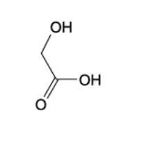<strong>B</strong>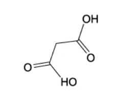<strong>C</strong>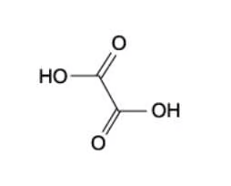<strong>D</strong>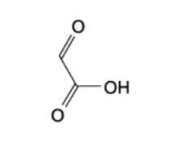

<button class="mc-choice" data-choice="A"><strong>A</strong>Structure A</button><button class="mc-choice" data-choice="B"><strong>B</strong>Structure B</button><button class="mc-choice" data-choice="C"><strong>C</strong>Structure C</button><button class="mc-choice" data-choice="D"><strong>D</strong>Structure D</button>

<button class="check-answer">Check answer</button>

Show explanation

<strong>C.</strong> Under reflux with excess acidified dichromate, both the primary alcohol group and the aldehyde group of HOCH2CHO are oxidised fully. The product is ethanedioic acid, HOOC-COOH, which corresponds to structure C.

:::

::: {.mc-question #cc17-mc-m6 data-answer="A"}
### Question 12 · 3.5 Choice Medium Q6

Which reagent will give similar results with both propanone and propanal?

<button class="mc-choice" data-choice="A"><strong>A</strong>2,4-dinitrophenylhydrazine reagent</button><button class="mc-choice" data-choice="B"><strong>B</strong>Acidified aqueous potassium dichromate (VI)</button><button class="mc-choice" data-choice="C"><strong>C</strong>An aqueous solution containing [Ag(NH3)2]+ (Tollens' reagent)</button><button class="mc-choice" data-choice="D"><strong>D</strong>An alkaline solution containing complexed Cu2+ ions (Fehling's solution)</button>

<button class="check-answer">Check answer</button>

Show explanation

<strong>A. 2,4-dinitrophenylhydrazine.</strong> Both propanone and propanal contain a carbonyl group, so both form an orange or deep-orange 2,4-DNPH precipitate. Tollens' reagent, Fehling's solution and acidified dichromate distinguish aldehydes from ketones.

:::

### 17 Carbonyl compounds — Multiple Choice: Hard

::: {.mc-question #cc17-mc-h1 data-answer="C"}
### Question 13 · 3.5 Choice Hard Q1

When HCN reacts with butanal, CH3CH2CH2CHO, product X is formed. If X is then hydrolysed by aqueous acid, product Y is produced. When pentanal, C4H9CHO, is heated under reflux with acidified potassium dichromate (VI), product Z is formed. What is the difference in relative molecular mass of products Y and Z?

<button class="mc-choice" data-choice="A"><strong>A</strong>12</button><button class="mc-choice" data-choice="B"><strong>B</strong>14</button><button class="mc-choice" data-choice="C"><strong>C</strong>16</button><button class="mc-choice" data-choice="D"><strong>D</strong>18</button>

<button class="check-answer">Check answer</button>

Show explanation

<strong>C. Relative molecular mass difference = 16.</strong> Butanal reacts with HCN and the nitrile group is then hydrolysed to give 2-hydroxypentanoic acid, C5H10O3, Mr = 118. Pentanal is oxidised to pentanoic acid, C5H10O2, Mr = 102. The difference is 118 - 102 = 16.

:::

::: {.mc-question #cc17-mc-h2 data-answer="C"}
### Question 14 · 3.5 Choice Hard Q2

Cyanohydrins, also called hydroxynitriles, can be made from carbonyl compounds by generating CN− ions from HCN in the presence of a weak base.

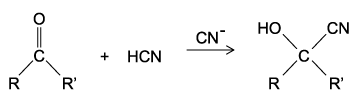{.question-figure fig-alt="Complete original cyanohydrin reaction scheme"}

In a similar reaction, CH2CO2CH3− ions are generated from CH3CO2CH3 by strong bases. Which compound can be made from an aldehyde and CH3CO2CH3 in the presence of a strong base?

<button class="mc-choice" data-choice="A"><strong>A</strong>CH3CH(OH)CO2CH3</button><button class="mc-choice" data-choice="B"><strong>B</strong>CH3CO2CH2CH(OH)CH3</button><button class="mc-choice" data-choice="C"><strong>C</strong>CH3CH2CH(OH)CH2CO2CH3</button><button class="mc-choice" data-choice="D"><strong>D</strong>(CH3)2C(OH)CH2CO2CH3</button>

<button class="check-answer">Check answer</button>

Show explanation

<strong>C.</strong> Strong base removes a hydrogen from methyl acetate to form an enolate, CH2CO2CH3-. The enolate attacks the aldehyde carbonyl and, after protonation, gives a β-hydroxy ester. The structure in C has the correct carbon skeleton and hydroxyl position.

:::

::: {.mc-question #cc17-mc-h3 data-answer="C"}
### Question 15 · 3.5 Choice Hard Q3

When compound T reacts with its own oxidation product, a sweet-smelling liquid is produced. What is the identity of compound T?

<button class="mc-choice" data-choice="A"><strong>A</strong>Butanal</button><button class="mc-choice" data-choice="B"><strong>B</strong>Butanone</button><button class="mc-choice" data-choice="C"><strong>C</strong>Butan-1-ol</button><button class="mc-choice" data-choice="D"><strong>D</strong>Butanoic acid</button>

<button class="check-answer">Check answer</button>

Show explanation

<strong>C. Butan-1-ol.</strong> Butan-1-ol is oxidised to butanoic acid. The alcohol and acid then react in an esterification reaction to form butyl butanoate, which has a sweet smell. Butanal and butanoic acid alone cannot provide this alcohol-plus-acid esterification pair.

:::

::: {.mc-question #cc17-mc-h4 data-answer="B"}
### Question 16 · 3.5 Choice Hard Q4

Three separate test tubes, 1, 2 and 3, each contain 1 mol of compound X. An excess of sodium borohydride is added to test tube 1 and an excess of acidified sodium permanganate is added to test tube 2. No reagent is added to test tube 3. Following this, 2 mol of HCN(g) is added to each test tube and the HCN completely reacts in all 3. What could X be?

<button class="mc-choice" data-choice="A"><strong>A</strong>CH3COCH2CH2CHO</button><button class="mc-choice" data-choice="B"><strong>B</strong>CH3CH(OH)COCH3</button><button class="mc-choice" data-choice="C"><strong>C</strong>H2C=CHCH2CHO</button><button class="mc-choice" data-choice="D"><strong>D</strong>HOCH3CH2CH2CHO</button>

<button class="check-answer">Check answer</button>

Show explanation

<strong>B.</strong> The molecule has a ketone and a secondary alcohol. In test tube 1, NaBH4 reduces the ketone to a second secondary alcohol, leaving two groups that each react with HCN. In test tube 2, acidified permanganate oxidises the secondary alcohol to a ketone, again leaving two carbonyl groups. Thus 2 mol HCN reacts in all three tubes.

:::

::: {.mc-question #cc17-mc-h5 data-answer="B"}
### Question 17 · 3.5 Choice Hard Q5

Glyceraldehyde, HOCH2CH(OH)CHO, is formed during photosynthesis on the pathway to glucose production. Which reagents produce an organic product without a chiral carbon atom when reacted with glyceraldehyde?

1. Warmed acidified K2Cr2O7
2. Fehling's reagent
3. NaBH4

<button class="mc-choice" data-choice="A"><strong>A</strong>1, 2 and 3</button><button class="mc-choice" data-choice="B"><strong>B</strong>1 and 3</button><button class="mc-choice" data-choice="C"><strong>C</strong>2 and 3</button><button class="mc-choice" data-choice="D"><strong>D</strong>1 only</button>

<button class="check-answer">Check answer</button>

Show explanation

<strong>B. 1 and 3.</strong> Oxidation of glyceraldehyde by acidified dichromate converts the primary alcohol and aldehyde to carboxylic acids, leaving no chiral carbon. NaBH4 converts the aldehyde to a primary alcohol; the two ends of the resulting molecule are identical, so the central carbon is not chiral. Fehling's reagent oxidises only the aldehyde, leaving a chiral centre at the secondary alcohol carbon.

:::

::: {.mc-question #cc17-mc-h6 data-answer="B"}
### Question 18 · 3.5 Choice Hard Q6

Which of the following techniques will increase the rate of reaction between ethanal and aqueous hydrogen cyanide?

1. Increasing the temperature.
2. Performing the reaction under ultraviolet light.
3. Adding a small quantity of aqueous sodium cyanide.

<button class="mc-choice" data-choice="A"><strong>A</strong>1 only</button><button class="mc-choice" data-choice="B"><strong>B</strong>1 and 3</button><button class="mc-choice" data-choice="C"><strong>C</strong>2 and 3</button><button class="mc-choice" data-choice="D"><strong>D</strong>1, 2 and 3</button>

<button class="check-answer">Check answer</button>

Show explanation

<strong>B. 1 and 3.</strong> Increasing temperature gives more particles enough energy to overcome the activation energy and increases effective collision frequency. A small amount of aqueous NaCN supplies CN- and catalyses the reaction. UV light is not required because this is not a photochemical free-radical reaction.

:::

::: {.mc-question #cc17-mc-h7 data-answer="C"}
### Question 19 · 3.5 Choice Hard Q7

Hydrocarbons 1, 2 and 3 all occur naturally.

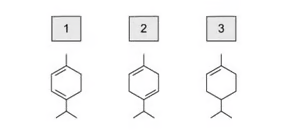{.question-figure fig-alt="Complete original structures of hydrocarbons 1, 2 and 3"}

All three are treated with hot acidified potassium manganate (VII) separately. Which of the hydrocarbons 1, 2 and 3 will be split into two organic compounds, both containing a ketone group?

<button class="mc-choice" data-choice="A"><strong>A</strong>1 only</button><button class="mc-choice" data-choice="B"><strong>B</strong>1 and 2</button><button class="mc-choice" data-choice="C"><strong>C</strong>2 only</button><button class="mc-choice" data-choice="D"><strong>D</strong>1 and 3</button>

<button class="check-answer">Check answer</button>

Show explanation

<strong>C. 2 only.</strong> Hot acidified manganate(VII) cleaves the C=C bond. For hydrocarbon 2, both alkene carbons have the carbon substituents needed to form ketone groups, so the two products are ketones. Structures 1 and 3 give at least one aldehyde or acid product rather than two ketones.

:::

::: {.mc-question #cc17-mc-h8 data-answer="D"}
### Question 20 · 3.5 Choice Hard Q8

Which carbonyl compounds can be easily oxidised to carboxylic acids that are readily soluble in water?

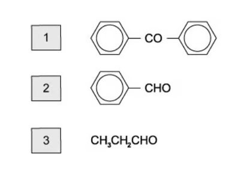{.question-figure fig-alt="Complete original structures of carbonyl compounds 1, 2 and 3"}

<button class="mc-choice" data-choice="A"><strong>A</strong>1 only</button><button class="mc-choice" data-choice="B"><strong>B</strong>1 and 2</button><button class="mc-choice" data-choice="C"><strong>C</strong>2 and 3</button><button class="mc-choice" data-choice="D"><strong>D</strong>3 only</button>

<button class="check-answer">Check answer</button>

Show explanation

<strong>D. 3 only.</strong> Compound 3 is an aldehyde, so oxidation gives a carboxylic acid. The small carboxylic acid is readily soluble in water because the polar -COOH group forms hydrogen bonds with water. Compounds containing a ketone are not easily oxidised, and the aromatic carboxylic acid in the other option is much less soluble.

:::

## Structured questions

以下 10 道结构题的题干与小问使用 OCR 文字；仅保留能从原 PDF 独立提取的完整图像对象。

### 17 Carbonyl compounds — Structured Questions: Easy

::: {.question-card #cc17-sq-e1}
### Question 1 · 3.5 SQ Easy Q1

**(a)** State the reactants that can be oxidised to give an aldehyde and a ketone as products. `[2 marks]`

**(b)** State the oxidation products, where appropriate, of an aldehyde and a ketone. `[2 marks]`

**(c)** Describe how you could use 2,4-DNPH and melting point data to determine the identity of an unknown compound. `[3 marks]`

Show detailed reference answer

<strong>(a)</strong> A primary alcohol is oxidised to an aldehyde, while a secondary alcohol is oxidised to a ketone.

<strong>(b)</strong> An aldehyde is oxidised to a carboxylic acid. A ketone does not undergo further oxidation under normal AS conditions unless carbon-carbon bonds are broken.

<strong>(c)</strong> Add 2,4-DNPH to the unknown. An aldehyde or ketone gives an orange or deep-orange crystalline precipitate. Filter the derivative and purify it by recrystallisation. Measure its melting point and compare the value with data for known 2,4-DNPH derivatives. A close match identifies the original carbonyl compound.

<strong>Marking points:</strong> positive precipitate; purification/recrystallisation; comparison of melting-point data.

:::

::: {.question-card #cc17-sq-e2}
### Question 2 · 3.5 SQ Easy Q2

Butanone can react with HCN. Complete the reaction mechanism shown in Fig. 2.1 by drawing four curly arrows.

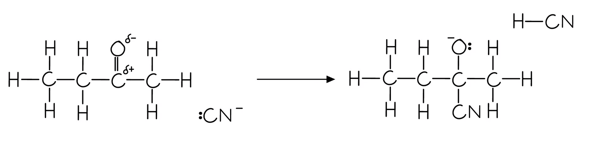{.question-figure fig-alt="Complete original mechanism figure for reaction of butanone with HCN"}

**(b)** Name the organic product produced in part (a). `[1 mark]`

**(c)** Explain why butanone has no positional isomers. `[1 mark]`

Show detailed reference answer

<strong>(a)</strong> The four arrows should show: the lone pair on CN- attacking the δ+ carbonyl carbon; the C=O π bond moving to oxygen; a lone pair on the negatively charged oxygen accepting H+ from HCN; and the H-CN bond breaking towards the cyanide carbon.

<strong>(b)</strong> The product is <strong>2-hydroxy-2-methylbutanenitrile</strong>.

<strong>(c)</strong> A ketone carbonyl must be attached to two carbon atoms. In butanone it can only occupy carbon 2; numbering from the other end gives the same structure, not a different positional isomer.

<strong>Mechanism check:</strong> include the carbonyl dipoles and the negative charge/lone pair on the cyanide ion. Curly arrows must start from an electron pair or bond and point towards an electron-deficient atom.

:::

::: {.question-card #cc17-sq-e3}
### Question 3 · 3.5 SQ Easy Q3

Table 3.1 shows the initial observations for the reaction of Tollens' reagent with aldehydes and ketones. Complete the final observations for aldehydes and ketones. `[2 marks]`

|  | Ketone: initial observation | Ketone: final observation | Aldehyde: initial observation | Aldehyde: final observation |
|---|---|---|---|---|
| Tollens' reagent | Colourless solution |  | Colourless solution |  |

Table 3.2 shows the initial observations for the reaction of Fehling's solution with aldehydes and ketones. Complete the final observations for aldehydes and ketones. `[2 marks]`

|  | Ketone: initial observation | Ketone: final observation | Aldehyde: initial observation | Aldehyde: final observation |
|---|---|---|---|---|
| Fehling's solution | Blue solution |  | Blue solution |  |

**(c)** Ethanal and propanal are reacted separately and heated with an alkaline solution of iodine.

1. State which aldehyde will give a yellow precipitate.
2. Explain your answer to part (c)(i). `[2 marks]`

Show detailed reference answer

<strong>(a) Tollens' reagent:</strong> the ketone remains a colourless solution with no visible change; the aldehyde gives a silver mirror.

<strong>(b) Fehling's solution:</strong> the ketone remains blue; the aldehyde gives an opaque red precipitate of Cu2O as Cu2+ is reduced to Cu+.

<strong>(c)</strong> Ethanal gives the yellow precipitate. It contains the CH3CO- group required for the iodoform reaction, so CHI3 is formed. Propanal does not contain this methyl carbonyl group.

<strong>Marking points:</strong> state the observation for both aldehyde/ketone tests, identify ethanal, and link the yellow precipitate to CHI3.

:::

### 17 Carbonyl compounds — Structured Questions: Medium

::: {.question-card #cc17-sq-m1}
### Question 4 · 3.5 SQ Medium Q1

Calcium and its compounds have a large variety of applications. Calcium metal reacts readily with most acids. When calcium metal is placed in dilute sulfuric acid, it reacts vigorously at first. After a short time, a layer of calcium sulfate forms on the calcium metal and the reaction stops. Some of the calcium metal and dilute sulfuric acid remain unreacted.

**(a)** Suggest an explanation for these observations. `[1 mark]`

**(b)** Calcium ethanedioate is formed when calcium reacts with ethanedioic acid, HOOCCOOH. Calcium ethanedioate contains one cation and one anion.

1. State the full electronic configuration of the cation in calcium ethanedioate.
2. Deduce the charge on the cation.
3. Draw the fully displayed formula of ethanedioic acid. `[3 marks]`

**(c)** Calcium chlorate(I), Ca(ClO)2, is used as an alternative to sodium chlorate(I), NaClO, in some household products.

1. Write an ionic equation for the formation of chlorate(I) ion when cold aqueous sodium hydroxide reacts with chlorine. State symbols are not required.
2. The chlorate(I) ion is unstable and decomposes when heated: 3ClO− → 2Cl− + ClO3−. Describe what is meant by disproportionation reaction.
3. Deduce the oxidation number of chlorine in each species in the equation. `[3 marks]`

**(d)** Calcium carbonate reacts with 2-hydroxypropanoic acid to form product Y.

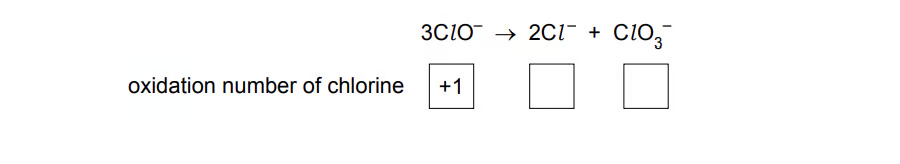{.question-figure fig-alt="Complete original Fig. 1.1"}

1. Identify the two other products of the reaction of 2-hydroxypropanoic acid with calcium carbonate.

Two possible methods of making 2-hydroxypropanoic acid are shown in Fig. 1.2.

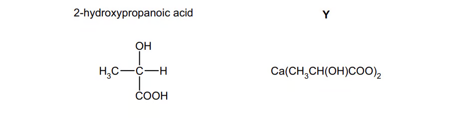{.question-figure fig-alt="Complete original Fig. 1.2 first image"}

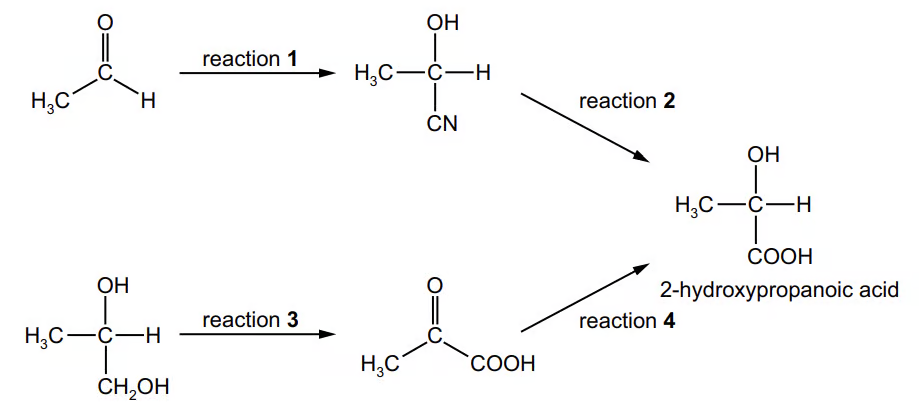{.question-figure fig-alt="Complete original Fig. 1.2 second image"}

2. State suitable reagents and conditions for reactions 1 and 3. `[4 marks]`

Show detailed reference answer

<strong>(a)</strong> The initial reaction is vigorous because calcium reacts with sulfuric acid. The insoluble CaSO4 formed coats the calcium and prevents further contact between the metal and acid, so the reaction becomes passivated while some reactants remain.

<strong>(b)</strong> The cation is Ca2+, with full electronic configuration <code>1s2 2s2 2p6 3s2 3p6</code>. The fully displayed formula of ethanedioic acid is HO-C(=O)-C(=O)-OH.

<strong>(c)</strong> <code>Cl2 + 2OH- -&gt; Cl- + ClO- + H2O</code>. Disproportionation means that the same element is simultaneously oxidised and reduced. The chlorine oxidation numbers are +1 in ClO-, -1 in Cl-, and +5 in ClO3-.

<strong>(d)</strong> The other products are carbon dioxide and water. Reaction 1 uses KCN or NaCN with dilute acid/catalyst to generate HCN in situ. Reaction 3 uses acidified potassium dichromate(VI), heated under reflux.

<strong>Marking points:</strong> passivation by CaSO4; Ca2+ configuration and charge; balanced ionic equation; definition and oxidation numbers; correct reagents/conditions.

:::

::: {.question-card #cc17-sq-m2}
### Question 5 · 3.5 SQ Medium Q2

Two isomeric compounds are shown below in Fig. 2.1.

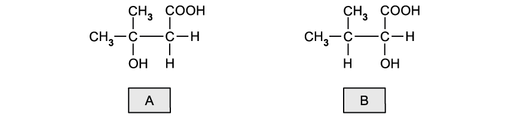{.question-figure fig-alt="Complete original Fig. 2.1 showing isomers A and B"}

1. State the name of each isomer.
2. Suggest a chemical reagent to distinguish between these isomers and deduce the type of reaction taking place.
3. State the observations made in each case. `[5 marks]`

**(b)** Compound B, CH3CH(CH3)CH(OH)COOH, can be oxidised into compound C.

1. Deduce the half-equation for the conversion of compound B into C.
2. The half-equation for the oxidation reaction using acidified potassium dichromate(VI) is Cr2O72−(aq) + 14H+(aq) + 6e− → 2Cr3+(aq) + 7H2O(l). Deduce the overall redox equation for the conversion of B into C. `[3 marks]`

**(c)** The same reaction in part (b) can be used to oxidise ethanol into ethanal or ethanoic acid, depending on the reaction conditions. Outline how the reaction conditions can be changed to produce ethanal or ethanoic acid. `[2 marks]`

**(d)** Under the right conditions, the two molecules of compound A can react together to produce a dimer.

1. Name the type of reaction taking place and state the reaction conditions.
2. Draw the structure of the product, showing clearly how the two molecules are joined. `[3 marks]`

Show detailed reference answer

<strong>(a)</strong> From the structures in Fig. 2.1, A is 3-hydroxy-3-methylbutanoic acid and B is 2-hydroxy-3-methylbutanoic acid. Use acidified potassium dichromate(VI) or acidified manganate(VII). A gives no change because its tertiary alcohol carbon has no hydrogen; B is oxidised and the dichromate changes orange to green, or manganate changes purple to colourless.

<strong>(b)</strong> B is a secondary alcohol, so its oxidation gives the ketone:

<code>CH3CH(CH3)CH(OH)COOH -&gt; CH3CH(CH3)COCOOH + 2H+ + 2e-</code>

Combining this with the dichromate half-equation gives:

<code>3CH3CH(CH3)CH(OH)COOH + Cr2O7^2- + 8H+ -&gt; 3CH3CH(CH3)COCOOH + 2Cr^3+ + 7H2O</code>

<strong>(c)</strong> To obtain ethanal, use simple distillation so the aldehyde is removed as it forms. To obtain ethanoic acid, heat under reflux and use excess oxidising agent so the aldehyde remains in the flask and is oxidised further.

<strong>(d)</strong> The dimer forms by esterification/condensation: the carboxylic acid group of one molecule reacts with the hydroxyl group of another, forming an ester link -COO- and eliminating water. Heat with concentrated sulfuric acid; the answer drawing must show the two A units connected through the ester group.

:::

::: {.question-card #cc17-sq-m3}
### Question 6 · 3.5 SQ Medium Q3

Compound W can be converted into three different organic compounds as shown by the reaction scheme in Fig. 3.1.

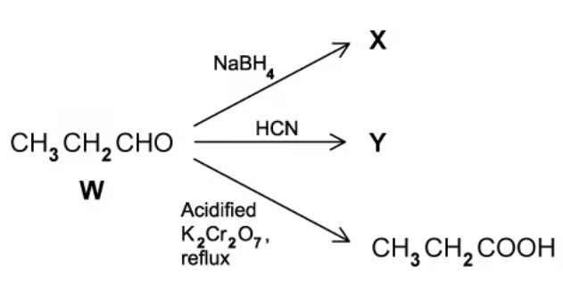{.question-figure fig-alt="Complete original reaction scheme Fig. 3.1"}

**(a)** Write an equation for the formation of X. Use `[H]` to represent the reagent in the equation. `[1 mark]`

**(b)** Identify the specific type of isomerism shown by the product Y in Fig. 3.1. Draw the mechanism to show the formation of Y and explain how this leads to the isomers of Y. `[5 marks]`

**(c)** When 5.00 cm3 of propanal (Mr = 58.0) were reacted with an excess of acidified potassium dichromate (VI) solution, 4.25 g of propanoic acid (Mr = 74.0) were obtained. The density of propanal is 0.810 g cm−3. Calculate the percentage yield for this reaction. `[3 marks]`

**(d)** A different carbonyl compound, Q (Mr = 72), reacts with 2,4-dinitrophenylhydrazine but not with Tollens' reagent.

1. State what you would see when Q reacts with 2,4-dinitrophenylhydrazine reagent.
2. State what functional group is present in Q.
3. Identify Q either by name or by its structural formula. `[3 marks]`

**(e)** Q can be reduced to compound R.

1. State a suitable reducing agent.
2. Name the functional group in R (two words are required).
3. Give the structural formula of R. `[3 marks]`

Show detailed reference answer

<strong>(a)</strong> W is propanal. NaBH4 reduces it to propan-1-ol:

<code>CH3CH2CHO + 2[H] -&gt; CH3CH2CH2OH</code>

<strong>(b)</strong> Y shows optical isomerism. CN- attacks the planar carbonyl carbon from either side, so two arrangements can form when the product carbon is attached to four different groups. The mechanism must show the CN- attack and movement of the C=O π electrons to oxygen, followed by protonation.

<strong>(c)</strong> Mass of propanal = 5.00 × 0.810 = 4.05 g. Moles of propanal = 4.05/58.0 = 0.0698 mol. The theoretical mass of propanoic acid is 0.0698 × 74.0 = 5.17 g. Percentage yield = (4.25/5.17) × 100 = <strong>82.3%</strong>.

<strong>(d)</strong> Q gives an orange 2,4-DNPH precipitate, so it contains C=O. It does not react with Tollens' reagent, so it is a ketone rather than an aldehyde. Mr = 72 gives <strong>butanone, CH3COCH2CH3</strong>.

<strong>(e)</strong> A suitable reducing agent is NaBH4. R contains a <strong>secondary alcohol</strong> and its structural formula is <strong>CH3CH2CH(OH)CH3</strong>.

:::

::: {.question-card #cc17-sq-m4}
### Question 7 · 3.5 SQ Medium Q4

2-hydroxybutanoic acid can be made from propanal via a reaction with hydrogen cyanide and the subsequent hydrolysis of 2-hydroxybutanenitrile. A possible pathway is shown in Fig. 4.1. The incomplete mechanism for reaction 2 is shown in Fig. 4.2.

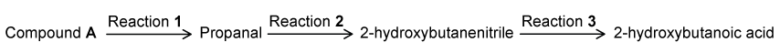{.question-figure fig-alt="Complete original pathway Fig. 4.1"}

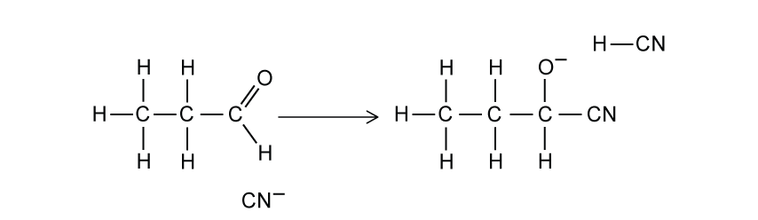{.question-figure fig-alt="Complete original mechanism Fig. 4.2"}

1. State the reagents and conditions required for reaction 2.
2. Complete the mechanism for this reaction. `[7 marks]`

**(b)** 2-hydroxybutanenitrile contains a chiral centre. Draw the three-dimensional structures of the two optical isomers. `[2 marks]`

**(c)** State the reagent(s) for reaction 3. `[1 mark]`

**(d)** Compound A forms propanal when reacted with acidified potassium dichromate. Give the structural formula of compound A. `[1 mark]`

**(e)** Compound A and propanal were tested using a series of reagents. For each test, state the positive result and identify which compound(s) would give a positive result. `[6 marks]`

Show detailed reference answer

<strong>(a)</strong> Reaction 2 is the hydrolysis of the nitrile group. Heat with KCN and dilute sulfuric acid/catalyst to generate HCN in situ and complete nucleophilic addition.

<strong>Mechanism:</strong> show :CN- attacking the δ+ carbonyl carbon, the C=O π electrons moving to oxygen, and the correctly charged alkoxide intermediate. Include the C≡N triple bond, lone pairs and partial charges. The two optical isomers of 2-hydroxybutanenitrile differ in the three-dimensional arrangement around carbon 2, which is attached to H, OH, CN and C2H5.

<strong>(c)</strong> Hydrolyse with dilute acid, or with dilute alkali followed by acidification.

<strong>(d)</strong> Compound A is propan-1-ol, <code>CH3CH2CH2OH</code>, because a primary alcohol is oxidised to propanal.

<strong>(e)</strong> According to the reference answer: I2/NaOH gives a yellow CHI3 precipitate for propanol and propanal; Na2CO3 gives no positive result; 2,4-DNPH gives an orange precipitate for propanal only. The key explanations are that the iodoform test detects the relevant methyl-containing arrangement, carbonate detects a carboxylic acid, and 2,4-DNPH detects a carbonyl group.

<strong>Marking points:</strong> hydrolysis conditions; all required mechanism arrows/charges; two optical isomers; correct reagent for reaction 3; propan-1-ol; each observation and compound assignment.

:::

### 17 Carbonyl compounds — Structured Questions: Hard

::: {.question-card #cc17-sq-h1}
### Question 8 · 3.5 SQ Hard Q1

**(a)** Aqueous sodium tetrahydridoborate, NaBH4, is a common reducing agent. Identify two isomers with the formula C3H6O that cannot be reduced by aqueous NaBH4. `[2 marks]`

**(b)** Identify the two isomers with the formula C3H6O that can be reduced by aqueous NaBH4. `[2 marks]`

**(c)** When NaBH4 is used as a reducing agent followed by the addition of acid, the reduction products of ketones can exhibit optical isomerism, while the reduction products of aldehydes cannot.

1. Classify the reduction products of aldehydes and ketones.
2. Explain why the reduction products of ketones can exhibit optical isomerism, while those of aldehydes cannot. `[4 marks]`

**(d)** Explain why the reduction product of a carbonyl compound, by NaBH4 and acid, cannot be a tertiary alcohol. `[2 marks]`

Show detailed reference answer

<strong>(a)</strong> Any two suitable non-carbonyl isomers from the reference set are methoxyethene, oxetane and 1,2-epoxypropane. They cannot be reduced by aqueous NaBH4 because they do not contain an aldehyde or ketone carbonyl group.

<strong>(b)</strong> The two reducible isomers are propanal and propanone. An aldehyde gives a primary alcohol and a ketone gives a secondary alcohol.

<strong>(c)</strong> Ketone reduction products are secondary alcohols and can be chiral when the alcohol carbon has four different groups. Aldehyde reduction products are primary alcohols and have two H atoms attached to the alcohol carbon, so that carbon cannot be chiral.

<strong>(d)</strong> A carbonyl compound has the form R2C=O or RCHO. Reduction gives R2CHOH or RCH2OH, so at least one hydrogen is attached to the alcohol carbon. A tertiary alcohol has R3COH and no C-H bond at that carbon; it cannot be formed by NaBH4 reduction of an aldehyde or ketone.

:::

::: {.question-card #cc17-sq-h2}
### Question 9 · 3.5 SQ Hard Q2

**(a)** Analysis of 15.0 g of an organic compound, R, showed it to contain 69.8% carbon, 2.79 g of oxygen and the remaining mass was hydrogen.

1. Calculate the empirical formula of the organic compound R.
2. Compound R has a molecular mass of 86.0 g mol−1. Deduce the molecular formula of compound R. `[4 marks]`

**(b)** Compound R is a straight-chain organic compound. One isomer of compound R produces optical isomers of compound S when reacted with hydrogen cyanide followed by dilute acid.

Compounds R and S were tested with acidified potassium dichromate(VI) and Tollens' reagent. The results are shown in Table 2.1.

| Test | R | S |
|---|---|---|
| Acidified potassium dichromate(VI) | Green solution | Green solution |
| Tollens' reagent | Silver mirror formed | No visible change |

Using this information and your answer from part (a), identify compounds R and S. Justify your answer. `[4 marks]`

**(c)** Draw 3D representations of the two optical isomers of compound S. `[1 mark]`

**(d)** There are some isomers of compound S that do not display optical isomerism. Draw the skeletal formula of these isomers. `[1 mark]`

Show detailed reference answer

<strong>(a)</strong> Carbon mass = 15.0 × 69.8/100 = 10.47 g. Hydrogen mass = 15.0 - 10.47 - 2.79 = 1.74 g. Amounts are C: 10.47/12.0 = 0.8725, H: 1.74/1.0 = 1.74, O: 2.79/16.0 = 0.174. Dividing by 0.174 gives C:H:O = 5:10:1, so the empirical formula is C5H10O. Its formula mass is 86.0, equal to the molecular mass, so the molecular formula is also C5H10O.

<strong>(b)</strong> R gives a silver mirror and is oxidised by dichromate, so R is an aldehyde. As a straight-chain C5H10O compound, R is pentanal. Addition of HCN gives S = 2-hydroxyhexanenitrile. S is oxidised by dichromate but does not give Tollens' test because it contains a secondary alcohol, not an aldehyde.

<strong>(c)</strong> Draw the two enantiomers of 2-hydroxyhexanenitrile. Carbon 2 is attached to H, OH, CN and C2H5; use opposite wedge/dash arrangements around this carbon.

<strong>(d)</strong> Any two structures in which the OH-bearing carbon does not have four different groups receive the mark. The reference set includes structures with two identical methyl or ethyl groups attached to that carbon. The test is simple: if two of the four groups are identical, the carbon is not chiral and no optical isomerism is shown.

:::

::: {.question-card #cc17-sq-h3}
### Question 10 · 3.5 SQ Hard Q3

**(a)** LiAlH4 is a reducing agent. LiAlH4 cannot be used in aqueous solution because it reacts with water to produce LiOH(aq), H2(g) and a white precipitate which is soluble in excess sodium hydroxide. Identify the white precipitate. `[1 mark]`

**(b)** Two students try to prepare 2-hydroxybutanoic acid in the laboratory as shown in Fig. 3.1. Both students oxidise butane-1,2-diol to form P in reaction 1. One student then reduces P using LiAlH4. Q is formed. The other student reduces P using NaBH4. R is formed.

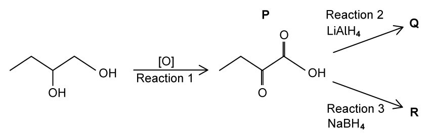{.question-figure fig-alt="Complete original preparation scheme Fig. 3.1"}

1. State the reagents and conditions required for reaction 1.
2. Identify which of Q or R is 2-hydroxybutanoic acid and explain the difference between reactions 2 and 3. `[4 marks]`

**(c)** A third student prepares 2-hydroxybutanoic acid using propanal as the starting material as shown in Fig. 3.2. In step 1 the student reacts propanal with a mixture of NaCN and HCN.

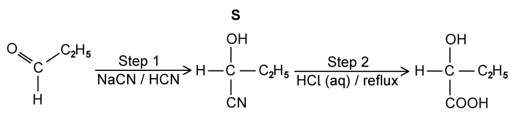{.question-figure fig-alt="Complete original preparation scheme Fig. 3.2"}

Draw the mechanism for the reaction of propanal with the mixture of NaCN and HCN to form S. Identify the ion that reacts with propanal. Draw the structure of the intermediate of the reaction. Include all charges, partial charges, lone pairs and curly arrows. `[4 marks]`

**(d)** Complete the equation for the reaction in step 2, when S is heated under reflux with HCl(aq). `[1 mark]`

Show detailed reference answer

<strong>(a)</strong> The white precipitate is aluminium hydroxide, Al(OH)3. Aluminium from LiAlH4 reacts with water to form the hydroxide; Al(OH)3 is amphoteric and dissolves in excess NaOH.

<strong>(b)</strong> Reaction 1: acidified potassium dichromate(VI), heated under reflux. R is 2-hydroxybutanoic acid because NaBH4 reduces only the ketone in P; it does not reduce the carboxylic acid group. LiAlH4 is stronger and reduces both the ketone and carboxylic acid.

<strong>(c)</strong> The reacting ion is CN-. Show its lone pair attacking the δ+ carbonyl carbon and the C=O π electrons moving to oxygen, giving the alkoxide intermediate <code>C2H5CH(O-)CN</code> with the correct charges and partial charges.

<strong>(d)</strong> <code>C2H5CH(OH)CN + HCl + 2H2O -&gt; C2H5CH(OH)COOH + NH4Cl</code>.

:::

## Original question PDFs

- [3.5 Carbonyl compounds — Choice — Easy](https://raw.githubusercontent.com/nanoxsj/CIE-Chemistry-Study/main/assets/questions/original-source/3.5_carbonyl_compounds___choice___easy.pdf)
- [3.5 Carbonyl compounds — Choice — Medium](https://raw.githubusercontent.com/nanoxsj/CIE-Chemistry-Study/main/assets/questions/original-source/3.5_carbonyl_compounds___choice___medium.pdf)
- [3.5 Carbonyl compounds — Choice — Hard](https://raw.githubusercontent.com/nanoxsj/CIE-Chemistry-Study/main/assets/questions/original-source/3.5_carbonyl_compounds___choice___hard.pdf)
- [3.5 Carbonyl compounds — Structured Questions — Easy](https://raw.githubusercontent.com/nanoxsj/CIE-Chemistry-Study/main/assets/questions/original-source/3.5_carbonyl_compounds___sq___easy.pdf)
- [3.5 Carbonyl compounds — Structured Questions — Medium](https://raw.githubusercontent.com/nanoxsj/CIE-Chemistry-Study/main/assets/questions/original-source/3.5_carbonyl_compounds___sq___medium.pdf)
- [3.5 Carbonyl compounds — Structured Questions — Hard](https://raw.githubusercontent.com/nanoxsj/CIE-Chemistry-Study/main/assets/questions/original-source/3.5_carbonyl_compounds___sq___hard.pdf)
