# 18 Carboxylic acids and derivatives

本章只覆盖 Cambridge International AS Level Chemistry 9701 的 **3.6 Carboxylic acids and derivatives**。Note 内容来自 `18.1 Carboxylic Acids.pdf.pdf` 和 `18.2 Esters.pdf.pdf`；题目来自 `Topical Past Papers/AS` 中的 `3.6 Carboxylic Acids - Derivatives - Choice - Easy/Medium/Hard` 与对应的 `SQ - Easy/Medium/Hard`。题目文字保持原题顺序与含义；无法从 PDF 独立提取的整页图不放入页面。

## Learning objectives

学完本章后，你应该能够：

- identify carboxylic acids and esters from displayed, structural and skeletal formulae;
- explain why carboxylic acids are weak acids and write their dissociation equations;
- describe the reactions of carboxylic acids with reactive metals, alkalis and carbonates;
- explain oxidation of primary alcohols to carboxylic acids and hydrolysis of nitriles;
- describe esterification and distinguish acid hydrolysis from alkaline hydrolysis;
- name esters, draw their structures and identify the alcohol and carboxylic acid used to make them;
- apply the reactions to multistep pathways, stereoisomerism, formula calculations and percentage calculations.

## 18.1 Carboxylic acids

### Structure, naming and general formula

Carboxylic acids contain the **carboxyl group**, `-COOH`, which consists of a carbonyl group, `C=O`, and a hydroxyl group, `-OH`, attached to the same carbon atom. For a saturated monocarboxylic acid with (n) carbon atoms in the hydrocarbon part, the general formula is:

$$\ce{C_nH_{2n+1}COOH}$$

The carbon atom in `-COOH` is carbon 1. The suffix is **-oic acid**: methanoic acid, ethanoic acid, propanoic acid and butanoic acid. Substituents are numbered from the carboxyl carbon.

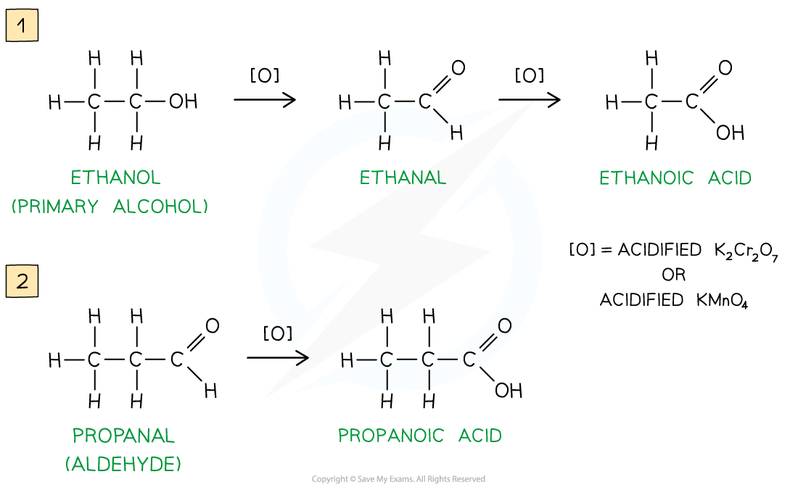{.concept-figure fig-alt="Oxidation of ethanol and propanal to carboxylic acids"}

### Acidity and equilibrium

Carboxylic acids are weak acids. They only partially dissociate in water, so the equilibrium lies mainly to the left:

$$\ce{RCOOH(aq) <=> RCOO^-(aq) + H^+(aq)}$$

For example:

$$\ce{CH3CH2COOH(aq) <=> CH3CH2COO^-(aq) + H^+(aq)}$$

The concentration of hydrogen ions is much smaller than the concentration of undissociated acid molecules. A strong acid dissociates almost completely and has an equilibrium position far to the right; a carboxylic acid has an equilibrium position far to the left.

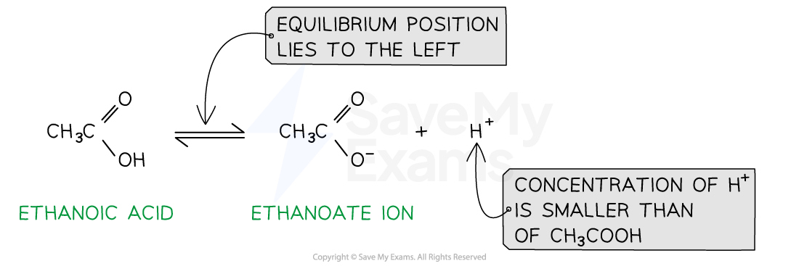{.concept-figure fig-alt="Weak acid equilibrium lies to the left"}

### Reactions with reactive metals

Carboxylic acids react with reactive metals in a redox reaction. The products are a carboxylate salt and hydrogen gas:

$$\ce{2RCOOH + 2Na -> 2RCOONa + H2}$$

For example:

$$\ce{2CH3COOH + 2Na -> 2CH3COONa + H2}$$

The acid supplies H+, which is reduced to H2; the metal is oxidised to form the cation in the salt.

### Neutralisation with alkalis

With aqueous sodium hydroxide, the acid forms a soluble sodium carboxylate and water:

$$\ce{RCOOH + NaOH -> RCOONa + H2O}$$

The product is the salt of the carboxylic acid. Acidification of the salt with a dilute acid regenerates the carboxylic acid:

$$\ce{RCOO^- + H^+ -> RCOOH}$$

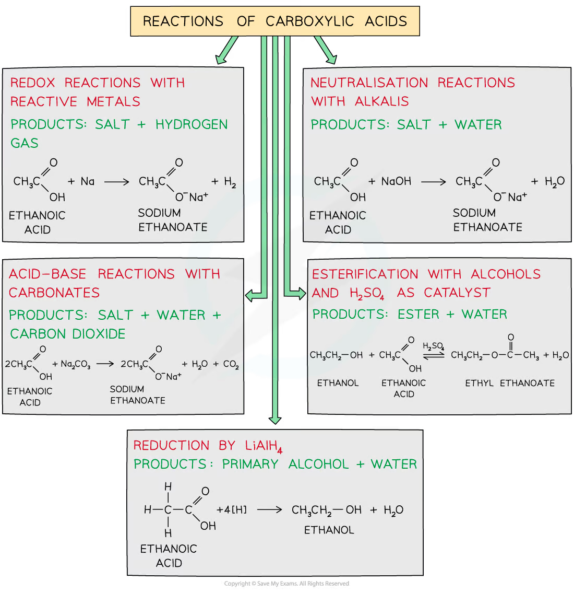{.concept-figure fig-alt="Reactions of carboxylic acids with metals, alkalis, carbonates, alcohols and lithium aluminium hydride"}

### Reactions with carbonates and hydrogen carbonates

Carboxylic acids react with carbonates and hydrogen carbonates to form a salt, water and carbon dioxide. Effervescence is caused by CO2:

$$\ce{2RCOOH + Na2CO3 -> 2RCOONa + H2O + CO2}$$

$$\ce{RCOOH + NaHCO3 -> RCOONa + H2O + CO2}$$

For propanoic acid, including states:

$$\ce{CH3CH2COOH(aq) + NaHCO3(s) -> CH3CH2COONa(aq) + H2O(l) + CO2(g)}$$

### Oxidation of primary alcohols

A primary alcohol can be oxidised first to an aldehyde and then to a carboxylic acid:

$$\ce{RCH2OH ->[O] RCHO ->[O] RCOOH}$$

Use acidified potassium dichromate(VI), K2Cr2O7/H+, or acidified potassium manganate(VII), KMnO4/H+. Acidified dichromate changes **orange to green**; acidified manganate changes **purple to colourless**.

- Use **distillation** to remove the aldehyde as soon as it forms and limit further oxidation.
- Use **reflux** with excess oxidising agent to keep the aldehyde in the flask and oxidise it further to the carboxylic acid.

### Hydrolysis of nitriles

Nitriles contain the `-C≡N` group and can be hydrolysed to carboxylic acids or carboxylate salts.

Acid hydrolysis, using dilute aqueous acid and heat under reflux, gives the carboxylic acid and an ammonium salt:

$$\ce{R-C#N + 2H2O + HCl ->[heat] RCOOH + NH4Cl}$$

Alkaline hydrolysis, using aqueous sodium hydroxide and heat under reflux, gives a carboxylate salt and ammonia:

$$\ce{R-C#N + 2H2O + NaOH ->[heat] RCOONa + NH3}$$

The carboxylic acid is obtained from the sodium carboxylate by acidification.

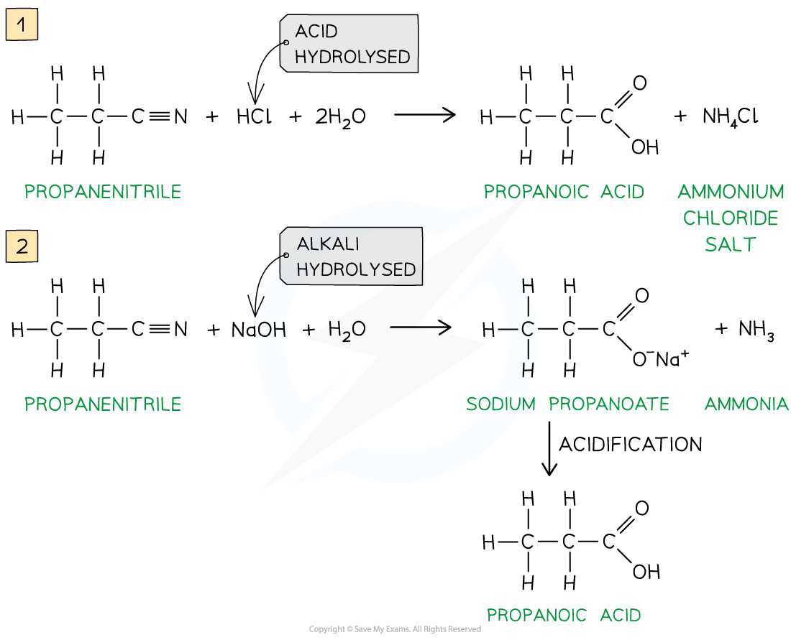{.concept-figure fig-alt="Acid and alkaline hydrolysis of propanenitrile"}

### Reduction of carboxylic acids

Lithium aluminium hydride, LiAlH4, reduces a carboxylic acid to a primary alcohol. In simplified equations, `[H]` represents hydrogen from the reducing agent:

$$\ce{RCOOH + 4[H] -> RCH2OH + H2O}$$

LiAlH4 reacts violently with water, so it is used in a dry ether solvent followed by aqueous work-up. Sodium tetrahydridoborate(III), NaBH4, is a milder reducing agent and is not normally used to reduce carboxylic acids at AS level.

## 18.2 Esters

### Structure and naming

Esters contain the functional group `-COO-`:

$$\ce{RCOOR'}$$

The name has two parts:

1. the alkyl group from the alcohol, followed by
2. the alkanoate group from the carboxylic acid.

For example, CH3COOCH2CH3 is **ethyl ethanoate**: `ethyl` comes from ethanol and `ethanoate` comes from ethanoic acid.

| Alcohol | Carboxylic acid | Ester |
|---|---|---|
| methanol | ethanoic acid | methyl ethanoate |
| ethanol | propanoic acid | ethyl propanoate |
| propan-1-ol | butanoic acid | propyl butanoate |

### Esterification

An ester is formed when a carboxylic acid reacts with an alcohol. The reaction is a condensation reaction because water is eliminated, and it is reversible:

$$\ce{RCOOH + R'OH <=>[conc. H2SO4][heat/reflux] RCOOR' + H2O}$$

Concentrated sulfuric acid acts as an acid catalyst and also helps remove water. The ester can be separated from the reaction mixture by distillation or other purification methods.

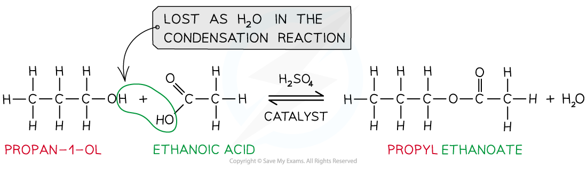{.concept-figure fig-alt="Esterification of propan-1-ol and ethanoic acid"}

### Hydrolysis of esters

Acid hydrolysis uses dilute aqueous acid and heat under reflux. It is reversible and reforms the carboxylic acid and alcohol:

$$\ce{RCOOR' + H2O <=>[dilute H+][heat] RCOOH + R'OH}$$

Alkaline hydrolysis uses aqueous sodium hydroxide and heat under reflux. It gives the sodium carboxylate and alcohol:

$$\ce{RCOOR' + NaOH ->[heat] RCOONa + R'OH}$$

Alkaline hydrolysis is effectively irreversible because the carboxylic acid product is immediately neutralised to the carboxylate salt. Acidification is needed to convert the salt into the free carboxylic acid.

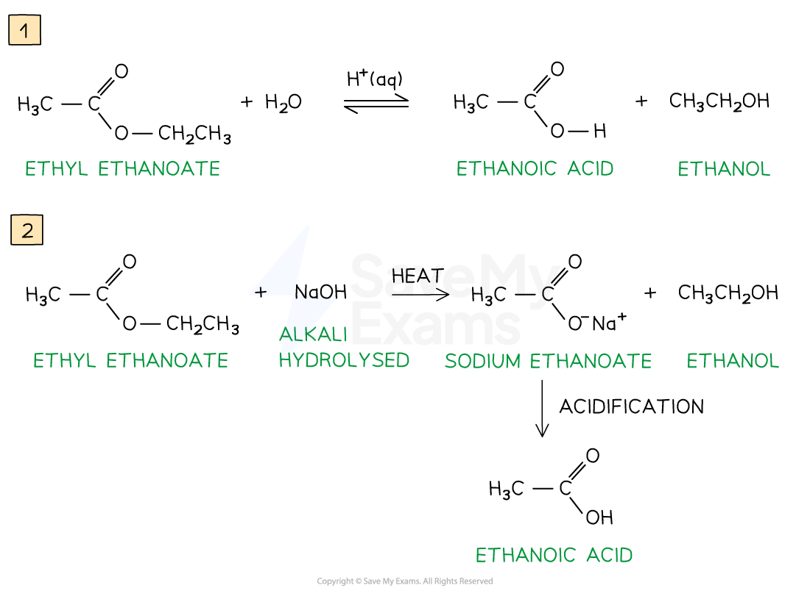{.concept-figure fig-alt="Acid and alkaline hydrolysis of ethyl ethanoate"}

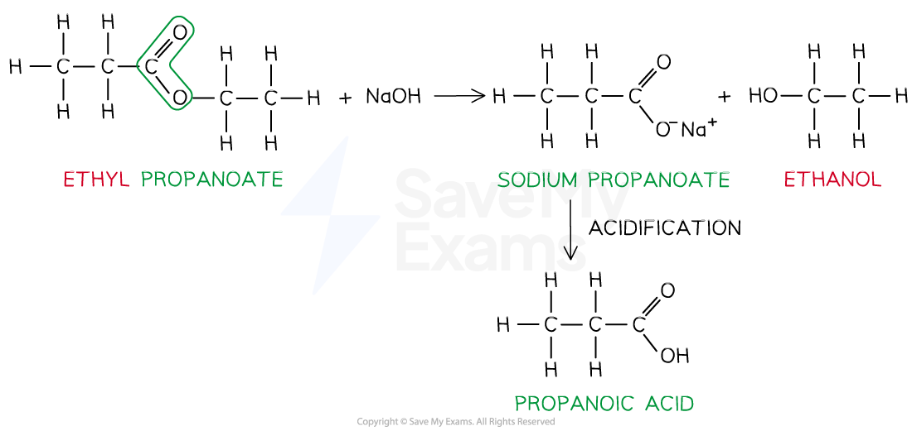{.concept-figure fig-alt="Acid and alkaline hydrolysis of ethyl propanoate"}

### Uses, isomers and calculations

Esters often have pleasant fruity smells and are used as food flavourings and perfumes. They are also used as solvents, in plastics and in other commercial products.

When counting ester isomers:

- keep the ester functional group `-COO-`;
- distribute the carbon atoms between the acid side and alcohol side;
- include branching and, where relevant, stereoisomers;
- check the molecular formula and degree of unsaturation.

For a hydrolysis calculation, first write the balanced equation and identify the two products. For a percentage-by-mass question, calculate the relative mass of each product and divide by the total mass of products.

## Common traps

- `NaOH` hydrolysis gives a **carboxylate salt**, not the free acid, unless the mixture is subsequently acidified.
- A nitrile hydrolysed with alkali also gives a carboxylate salt; acid hydrolysis gives the acid directly.
- Acidified dichromate is orange initially and green after reduction; the colour change is not reversed.
- The alcohol part of an ester name is written first; the acid part is changed from `-ic acid` to `-ate`.
- In an ester structure, the group attached to the single-bond oxygen comes from the alcohol.
- A carboxylic acid contains a hydroxyl group, but its `-OH` is not an alcohol functional group for oxidation questions.

## Multiple choice questions

以下 20 道选择题来自 `3.6 Carboxylic Acids - Derivatives - Choice - Easy/Medium/Hard`。图像只使用可独立提取的原图对象，不使用整页 PDF 截图。

### 18 Carboxylic acids and derivatives — Multiple Choice: Easy

::: {.mc-question #ca18-mc-e1 data-answer="A"}
### Question 1 · 3.6 Choice Easy Q1

Propanoic acid can be made from which of the following starting materials?

1. CH3CH2CN
2. CH3CH2CHO
3. CH3CH2CH2OH

<button class="mc-choice" data-choice="A"><strong>A</strong>1, 2 and 3</button><button class="mc-choice" data-choice="B"><strong>B</strong>1 and 2</button><button class="mc-choice" data-choice="C"><strong>C</strong>2 and 3</button><button class="mc-choice" data-choice="D"><strong>D</strong>1 only</button>

<button class="check-answer">Check answer</button>

Show detailed explanation

<strong>A.</strong> Propanenitrile is hydrolysed to propanoic acid. Propanal is oxidised to propanoic acid, and propan-1-ol is oxidised first to propanal and then to propanoic acid when heated under reflux with an acidified oxidising agent. Therefore all three starting materials can give propanoic acid.

:::

::: {.mc-question #ca18-mc-e2 data-answer="A"}
### Question 2 · 3.6 Choice Easy Q2

Which processes can be used to make ethanoic acid?

1. oxidation of ethanol
2. oxidation of ethanal
3. hydrolysis of ethanenitrile

<button class="mc-choice" data-choice="A"><strong>A</strong>1, 2 and 3</button><button class="mc-choice" data-choice="B"><strong>B</strong>1 and 2</button><button class="mc-choice" data-choice="C"><strong>C</strong>2 and 3</button><button class="mc-choice" data-choice="D"><strong>D</strong>1 only</button>

<button class="check-answer">Check answer</button>

Show detailed explanation

<strong>A.</strong> Ethanol can be oxidised to ethanal and then ethanoic acid. Ethanal is oxidised directly to ethanoic acid. Ethanenitrile is hydrolysed under acidic conditions to ethanoic acid, or under alkaline conditions to sodium ethanoate followed by acidification.

:::

::: {.mc-question #ca18-mc-e3 data-answer="C"}
### Question 3 · 3.6 Choice Easy Q3

Which diagram shows an optically active ‘trans fat’?

<strong>A</strong>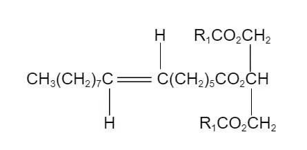<strong>B</strong>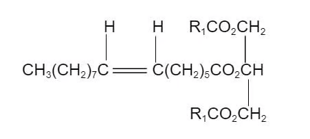<strong>C</strong>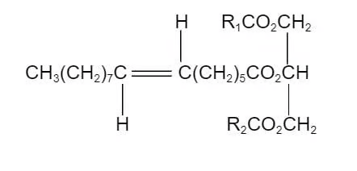<strong>D</strong>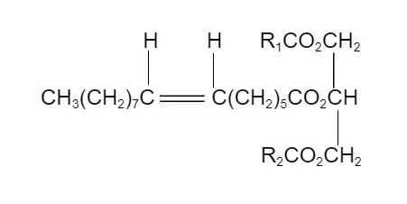

<button class="mc-choice" data-choice="A"><strong>A</strong>Diagram A</button><button class="mc-choice" data-choice="B"><strong>B</strong>Diagram B</button><button class="mc-choice" data-choice="C"><strong>C</strong>Diagram C</button><button class="mc-choice" data-choice="D"><strong>D</strong>Diagram D</button>

<button class="check-answer">Check answer</button>

Show detailed explanation

<strong>C.</strong> A trans alkene has the relevant groups on opposite sides of the carbon–carbon double bond. Optical activity also requires a chiral carbon attached to four different groups. Option C satisfies both conditions; the other diagrams either lack a chiral centre or show the cis arrangement.

:::

::: {.mc-question #ca18-mc-e4 data-answer="B"}
### Question 4 · 3.6 Choice Easy Q4

Methanoic acid is one of the two reactants used to produce an ester with the molecular formula C5H10O2.

How many isomeric esters, including structural isomers and stereoisomers, could be made with this molecular formula?

<button class="mc-choice" data-choice="A"><strong>A</strong>3</button><button class="mc-choice" data-choice="B"><strong>B</strong>4</button><button class="mc-choice" data-choice="C"><strong>C</strong>5</button><button class="mc-choice" data-choice="D"><strong>D</strong>6</button>

<button class="check-answer">Check answer</button>

Show detailed explanation

<strong>B.</strong> Methanoic acid supplies the HCOO− part, so the alcohol-derived part must be C4H9. There are four structural isomeric butyl groups that can form the ester. No additional stereoisomer increases the count for this set, so the total is four.

:::

::: {.mc-question #ca18-mc-e5 data-answer="B"}
### Question 5 · 3.6 Choice Easy Q5

The structure of ester E is shown in the diagram below.

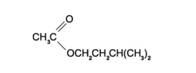{.question-figure fig-alt="Ester E structure"}

E is hydrolysed in the presence of hydrochloric acid.

Which are the products of this hydrolysis?

<button class="mc-choice" data-choice="A"><strong>A</strong>CH3CO2H and (CH3)2CHCH2CH2CHO</button><button class="mc-choice" data-choice="B"><strong>B</strong>CH3CO2H and (CH3)2CHCH2CH2OH</button><button class="mc-choice" data-choice="C"><strong>C</strong>CH3COCl and (CH3)2CHCH2CH2OH</button><button class="mc-choice" data-choice="D"><strong>D</strong>CH3CHO and (CH3)2CHCH2CH2OH</button>

<button class="check-answer">Check answer</button>

Show detailed explanation

<strong>B.</strong> Acid hydrolysis breaks the ester into the original carboxylic acid and alcohol. The CH3CO− part gives ethanoic acid, and the group attached to the ester oxygen gives the primary alcohol. Hydrochloric acid does not produce an acyl chloride, aldehyde or ketone in this hydrolysis.

:::

::: {.mc-question #ca18-mc-e6 data-answer="C"}
### Question 6 · 3.6 Choice Easy Q6

The ester in the diagram below has an odour of banana.

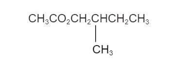{.question-figure fig-alt="Banana odour ester"}

Which pair of reactants can be used to produce this ester under suitable conditions?

<strong>A</strong>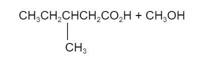<strong>B</strong>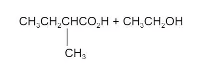<strong>C</strong>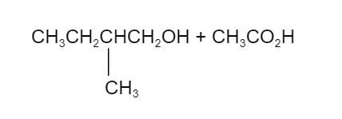<strong>D</strong>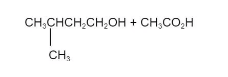

<button class="mc-choice" data-choice="A"><strong>A</strong>Reactants shown in diagram A</button><button class="mc-choice" data-choice="B"><strong>B</strong>Reactants shown in diagram B</button><button class="mc-choice" data-choice="C"><strong>C</strong>Reactants shown in diagram C</button><button class="mc-choice" data-choice="D"><strong>D</strong>Reactants shown in diagram D</button>

<button class="check-answer">Check answer</button>

Show detailed explanation

<strong>C.</strong> Split the ester at the C(=O)−O bond. The acid part is ethanoic acid, CH3CO2H, and the alcohol part is the branched primary alcohol shown in option C. Esterification requires exactly this carboxylic acid–alcohol pair; the other options place the methyl group or the chain length incorrectly.

:::

### 18 Carboxylic acids and derivatives — Multiple Choice: Medium

::: {.mc-question #ca18-mc-m1 data-answer="C"}
### Question 7 · 3.6 Choice Medium Q1

P is the only organic material required to produce the ester CH3CH2CO2CH2CH2CH3 through a sequence of reactions.

What might be the identity of compound P?

1. CH3COCH3
2. CH3CH2CHO
3. CH3CH2CH2OH

<button class="mc-choice" data-choice="A"><strong>A</strong>1, 2 and 3</button><button class="mc-choice" data-choice="B"><strong>B</strong>1 and 2</button><button class="mc-choice" data-choice="C"><strong>C</strong>2 and 3</button><button class="mc-choice" data-choice="D"><strong>D</strong>1 only</button>

<button class="check-answer">Check answer</button>

Show detailed explanation

<strong>C.</strong> The ester needs propanoic acid and propan-1-ol. Propanal can be reduced to propan-1-ol or oxidised to propanoic acid, so compound 2 can supply both components. Propan-1-ol can be oxidised to propanoic acid, so compound 3 also works. Propanone is a ketone and is not oxidised to the required carboxylic acid under these conditions.

:::

::: {.mc-question #ca18-mc-m2 data-answer="B"}
### Question 8 · 3.6 Choice Medium Q2

Lactic acid, CH3CH(OH)CO2H, can undergo which reaction?

<button class="mc-choice" data-choice="A"><strong>A</strong>Reaction with chlorine to replace the secondary alcohol group directly</button><button class="mc-choice" data-choice="B"><strong>B</strong>Reaction with methanoic acid to form an ester from the secondary alcohol group</button><button class="mc-choice" data-choice="C"><strong>C</strong>Reaction with methanol to form an ester from the alcohol group</button><button class="mc-choice" data-choice="D"><strong>D</strong>Reaction with sodium hydroxide to replace the alcohol group by ONa</button>

<button class="check-answer">Check answer</button>

Show detailed explanation

<strong>B.</strong> Lactic acid has both a secondary alcohol and a carboxylic acid group. In the presence of concentrated sulfuric acid and heat, the alcohol group can react with methanoic acid to form an ester and water. Methanol would esterify the carboxylic acid group instead; sodium hydroxide neutralises the acid group rather than replacing the alcohol group.

:::

::: {.mc-question #ca18-mc-m3 data-answer="B"}
### Question 9 · 3.6 Choice Medium Q3

Compound C reacts with calcium to form a salt with empirical formula CaC2H3O2.

Which compounds could C be?

1. ethanoic acid
2. butanedioic acid
3. 2-methylpropanedioic acid

<button class="mc-choice" data-choice="A"><strong>A</strong>1, 2 and 3</button><button class="mc-choice" data-choice="B"><strong>B</strong>1 and 2</button><button class="mc-choice" data-choice="C"><strong>C</strong>2 and 3</button><button class="mc-choice" data-choice="D"><strong>D</strong>1 only</button>

<button class="check-answer">Check answer</button>

Show detailed explanation

<strong>B.</strong> Ethanoic acid forms calcium ethanoate, whose formula is already CaC2H3O2. Butanedioic acid has two acidic groups and forms a calcium salt with formula Ca2C4H6O4, which simplifies to the same empirical formula. 2-Methylpropanedioic acid gives a different calcium salt ratio, so it is excluded.

:::

::: {.mc-question #ca18-mc-m4 data-answer="A"}
### Question 10 · 3.6 Choice Medium Q4

Cetyl palmitate has the formula C15H31CO2C16H33. It is heated with aqueous sodium hydroxide. Which products are formed?

<button class="mc-choice" data-choice="A"><strong>A</strong>C15H31CO2Na and C16H33OH</button><button class="mc-choice" data-choice="B"><strong>B</strong>C15H31CO2Na and C16H33ONa</button><button class="mc-choice" data-choice="C"><strong>C</strong>C15H31OH and C16H33CO2Na</button><button class="mc-choice" data-choice="D"><strong>D</strong>C15H31ONa and C16H33CO2Na</button>

<button class="check-answer">Check answer</button>

Show detailed explanation

<strong>A.</strong> Alkaline hydrolysis splits the ester into the alcohol part and the sodium carboxylate part. The C16H33O− part becomes the alcohol C16H33OH, while the palmitate part is neutralised to C15H31CO2Na. Sodium does not replace the hydrogen in the alcohol under these hydrolysis conditions.

:::

::: {.mc-question #ca18-mc-m5 data-answer="B"}
### Question 11 · 3.6 Choice Medium Q5

The diagram shows the structure of ethanedioic acid.

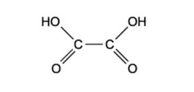{.question-figure fig-alt="Ethanedioic acid structure"}

Ethanedioic acid reacts with ethanol in the presence of a few drops of concentrated sulfuric acid to form a diester. The molecular formula of the diester is C6H10O4.

What is the structural formula of the diester?

<button class="mc-choice" data-choice="A"><strong>A</strong>CH3CH2CO2CO2CH2CH3</button><button class="mc-choice" data-choice="B"><strong>B</strong>CH3CH2OCOCO2CH2CH3</button><button class="mc-choice" data-choice="C"><strong>C</strong>CH3CH2O2CO2CH2CH3</button><button class="mc-choice" data-choice="D"><strong>D</strong>CH3CO2CH2CH2OCOCH3</button>

<button class="check-answer">Check answer</button>

Show detailed explanation

<strong>B.</strong> Both carboxyl groups of ethanedioic acid are esterified by ethanol. The product is diethyl ethanedioate, CH3CH2OCOCO2CH2CH3, with two ester links and molecular formula C6H10O4. The other options have the wrong acid skeleton or only one ester group.

:::

::: {.mc-question #ca18-mc-m6 data-answer="D"}
### Question 12 · 3.6 Choice Medium Q6

Apples contain a compound called malic acid.

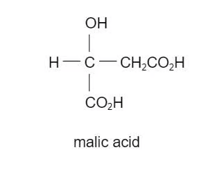{.question-figure fig-alt="Malic acid structure"}

Which substance will react with only one hydroxyl group in malic acid under suitable conditions?

<button class="mc-choice" data-choice="A"><strong>A</strong>Na(s)</button><button class="mc-choice" data-choice="B"><strong>B</strong>PCl5</button><button class="mc-choice" data-choice="C"><strong>C</strong>NaOH(aq)</button><button class="mc-choice" data-choice="D"><strong>D</strong>Cr2O72-/H+(aq)</button>

<button class="check-answer">Check answer</button>

Show detailed explanation

<strong>D.</strong> Malic acid contains two carboxylic acid `-OH` groups and one alcohol `-OH` group. Acidified dichromate oxidises the secondary alcohol group, but the carboxylic acid groups are already at their highest usual oxidation state. Sodium, phosphorus pentachloride and sodium hydroxide can also react with the carboxylic acid groups, so they do not react with only one hydroxyl group.

:::

### 18 Carboxylic acids and derivatives — Multiple Choice: Hard

::: {.mc-question #ca18-mc-h1 data-answer="B"}
### Question 13 · 3.6 Choice Hard Q1

In the presence of an H+ catalyst, compound X reacts with ethanoic acid to produce the compound below.

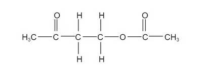{.question-figure fig-alt="Product formed from compound X and ethanoic acid"}

What is the molecular formula of compound X?

<button class="mc-choice" data-choice="A"><strong>A</strong>C4H8O</button><button class="mc-choice" data-choice="B"><strong>B</strong>C4H8O2</button><button class="mc-choice" data-choice="C"><strong>C</strong>C2H6O2</button><button class="mc-choice" data-choice="D"><strong>D</strong>C2H6O3</button>

<button class="check-answer">Check answer</button>

Show detailed explanation

<strong>B.</strong> Split the product at the ester bond. The ethanoic-acid part is CH3CO−, while the other part is a four-carbon chain containing a ketone and an alcohol: CH3COCH2CH2OH. Therefore compound X contains four carbon atoms, eight hydrogen atoms and two oxygen atoms, so its formula is C4H8O2.

:::

::: {.mc-question #ca18-mc-h2 data-answer="C"}
### Question 14 · 3.6 Choice Hard Q2

Sirolimus is a drug used to treat patients after kidney transplants. Sirolimus produces an equimolar mixture of two organic products on reaction with hot aqueous sodium hydroxide. What is the structural formula of the product with the lower relative molecular mass?

<strong>A</strong>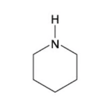<strong>B</strong>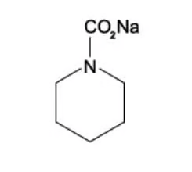<strong>C</strong>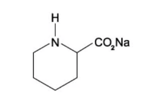<strong>D</strong>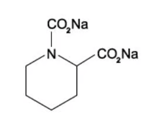

<button class="mc-choice" data-choice="A"><strong>A</strong>Structure A</button><button class="mc-choice" data-choice="B"><strong>B</strong>Structure B</button><button class="mc-choice" data-choice="C"><strong>C</strong>Structure C</button><button class="mc-choice" data-choice="D"><strong>D</strong>Structure D</button>

<button class="check-answer">Check answer</button>

Show detailed explanation

<strong>C.</strong> Hot aqueous sodium hydroxide hydrolyses the ester and amide groups. The ester part gives a sodium carboxylate, while the amide part gives the corresponding amine. Comparing the structures, option C is the lower-mass organic product; the sodium carboxylate-containing alternatives retain extra CO2Na groups and therefore have larger relative molecular masses.

:::

::: {.mc-question #ca18-mc-h3 data-answer="C"}
### Question 15 · 3.6 Choice Hard Q3

Compound K, C5H12O, is oxidised by acidified sodium dichromate(VI) to compound L. Compound L reacts with butan-2-ol in the presence of a little concentrated sulfuric acid to give liquid M. What could be the formula of liquid M?

<button class="mc-choice" data-choice="A"><strong>A</strong>(CH3)2CHCH2CO2C(CH3)3</button><button class="mc-choice" data-choice="B"><strong>B</strong>CH3(CH2)3CO2(CH2)3CH3</button><button class="mc-choice" data-choice="C"><strong>C</strong>CH3(CH2)3CO2CH(CH3)CH2CH3</button><button class="mc-choice" data-choice="D"><strong>D</strong>CH3(CH2)2CO2CH2CH2(CH3)2</button>

<button class="check-answer">Check answer</button>

Show detailed explanation

<strong>C.</strong> C5H12O must be pentan-1-ol because it must oxidise to a carboxylic acid, so L is pentanoic acid, CH3(CH2)3CO2H. Esterification with butan-2-ol gives CH3(CH2)3CO2CH(CH3)CH2CH3, which is option C. The alcohol-derived part must be the butan-2-yl group.

:::

::: {.mc-question #ca18-mc-h4 data-answer="B"}
### Question 16 · 3.6 Choice Hard Q4

Compound X can be made from 2-hydroxybutanoic acid.

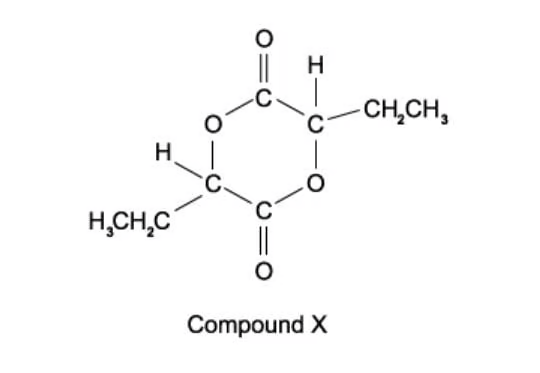{.question-figure fig-alt="Cyclic diester compound X"}

What should be heated with 2-hydroxybutanoic acid in order to make compound X?

<button class="mc-choice" data-choice="A"><strong>A</strong>Aluminium oxide</button><button class="mc-choice" data-choice="B"><strong>B</strong>Concentrated sulfuric acid</button><button class="mc-choice" data-choice="C"><strong>C</strong>Dilute sodium hydroxide</button><button class="mc-choice" data-choice="D"><strong>D</strong>Acidified potassium manganate under reflux</button>

<button class="check-answer">Check answer</button>

Show detailed explanation

<strong>B.</strong> 2-Hydroxybutanoic acid contains both a carboxylic acid and an alcohol group. Two molecules can undergo condensation, forming two ester links in the cyclic diester and eliminating water. Concentrated sulfuric acid catalyses esterification. Aluminium oxide promotes dehydration of alcohols, while sodium hydroxide neutralises the acid and manganate oxidises the alcohol.

:::

::: {.mc-question #ca18-mc-h5 data-answer="B"}
### Question 17 · 3.6 Choice Hard Q5

Oxaloacetic acid can be synthesised from fumaric acid in a two-step process involving the intermediate Z.

HO2CCH=CHCO2H → step 1 → Z → step 2 → HO2CCOCH2CO2H

What could be the intermediate Z and the reagent for step 2?

<button class="mc-choice" data-choice="A"><strong>A</strong>Z = HO2CCH(OH)CH2CO2H; Fehling’s solution</button><button class="mc-choice" data-choice="B"><strong>B</strong>Z = HO2CCH(OH)CH2CO2H; warm acidified K2Cr2O7</button><button class="mc-choice" data-choice="C"><strong>C</strong>Z = HO2CCHBrCH2CO2H; warm acidified KMnO4</button><button class="mc-choice" data-choice="D"><strong>D</strong>Z = HO2CCHBrCH(OH)CO2H; warm NaOH(aq)</button>

<button class="check-answer">Check answer</button>

Show detailed explanation

<strong>B.</strong> Step 1 hydrates the alkene to give a hydroxy dicarboxylic acid, HO2CCH(OH)CH2CO2H. Step 2 oxidises the secondary alcohol to a ketone using warm acidified dichromate(VI), giving oxaloacetic acid. Fehling’s solution is an aldehyde test and the other options have the wrong intermediate or reaction.

:::

::: {.mc-question #ca18-mc-h6 data-answer="C"}
### Question 18 · 3.6 Choice Hard Q6

Ethyl propanoate is heated under reflux with aqueous sodium hydroxide. Out of the total mass of products obtained, what is the percentage by mass of each product?

<button class="mc-choice" data-choice="A"><strong>A</strong>50.0% and 50.0%</button><button class="mc-choice" data-choice="B"><strong>B</strong>57.7% and 42.3%</button><button class="mc-choice" data-choice="C"><strong>C</strong>61.7% and 38.3%</button><button class="mc-choice" data-choice="D"><strong>D</strong>67.6% and 32.4%</button>

<button class="check-answer">Check answer</button>

Show detailed explanation

<strong>C.</strong> Alkaline hydrolysis gives propanoic acid after acidification and ethanol. Mr(ethanol) = 46; Mr(propanoic acid) = 74; total product mass for one mole is 120. Therefore ethanol is 46/120 × 100 = 38.3% and propanoic acid is 74/120 × 100 = 61.7%.

:::

::: {.mc-question #ca18-mc-h7 data-answer="C"}
### Question 19 · 3.6 Choice Hard Q7

Citric acid, HO2CCH2C(OH)(CO2H)CH2CO2H, is triprotic. What volume of 0.2 mol dm−3 sodium hydroxide solution is required to neutralise a solution containing 0.008 mol of citric acid?

<button class="mc-choice" data-choice="A"><strong>A</strong>0.040 dm3</button><button class="mc-choice" data-choice="B"><strong>B</strong>0.080 dm3</button><button class="mc-choice" data-choice="C"><strong>C</strong>0.120 dm3</button><button class="mc-choice" data-choice="D"><strong>D</strong>0.160 dm3</button>

<button class="check-answer">Check answer</button>

Show detailed explanation

<strong>C.</strong> Each citric acid molecule has three carboxylic acid groups, so 1 mol requires 3 mol NaOH. Moles NaOH = 0.008 × 3 = 0.024 mol. Volume = n/c = 0.024/0.2 = 0.120 dm3.

:::

::: {.mc-question #ca18-mc-h8 data-answer="A"}
### Question 20 · 3.6 Choice Hard Q8

The compound 2-ethyl-3-methylbutanoic acid gives rum its signature smell.

Which compound will produce 2-ethyl-3-methylbutanoic acid by heating under reflux with alcoholic sodium cyanide and subsequent acid hydrolysis of the reaction product?

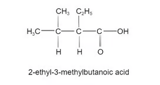{.question-figure fig-alt="2-ethyl-3-methylbutanoic acid structure"}

<strong>A</strong>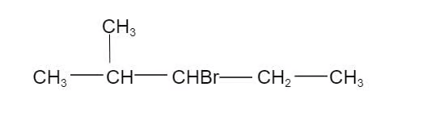<strong>B</strong>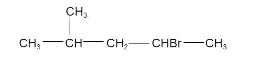<strong>C</strong>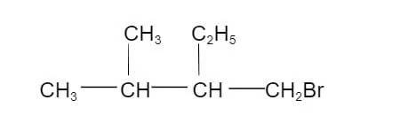<strong>D</strong>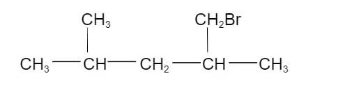

<button class="mc-choice" data-choice="A"><strong>A</strong>Structure A</button><button class="mc-choice" data-choice="B"><strong>B</strong>Structure B</button><button class="mc-choice" data-choice="C"><strong>C</strong>Structure C</button><button class="mc-choice" data-choice="D"><strong>D</strong>Structure D</button>

<button class="check-answer">Check answer</button>

Show detailed explanation

<strong>A.</strong> Replacing the halogen atom by `CN` adds one carbon. After acid hydrolysis of the nitrile, the carbon of `CN` becomes the carboxyl carbon. The correct starting halogenoalkane must therefore have the same branched carbon skeleton with bromine on the carbon that becomes carbon 1 of the acid; this is option A.

:::

## Structured questions

以下 10 道结构题来自对应的 `SQ - Easy/Medium/Hard` PDF。答案按每份题目 PDF 后半部分的 Model Answers 整理，并补充反应理由、方程式和易错点。

### 18 Carboxylic acids and derivatives — Structured Questions: Easy

::: {.question-card #ca18-sq-e1}
### Question 1 · 3.6 SQ Easy Q1

This question is about carboxylic acids.

**(a)** State the general formula of a carboxylic acid. `[1 mark]`

**(b)** Name the carboxylic acid shown in Fig. 1.1.

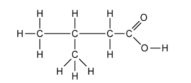{.question-figure fig-alt="Carboxylic acid structure in Fig. 1.1"}

**(c)**

i. Write a balanced symbol equation to show the dissociation of the acid from part (b).

ii. State where the position of the equilibrium lies and what this says about the strength of the acid. `[3 marks]`

**(d)** Write a balanced symbol equation, including state symbols, for the reaction of propanoic acid with sodium hydrogen carbonate powder to form the soluble sodium propanoate salt and two other products. `[3 marks]`

Show detailed reference answer

<strong>(a)</strong> CnH2n+1COOH.

<strong>(b)</strong> 3-methylbutanoic acid. The longest chain containing the carboxyl carbon has four carbons, and the methyl substituent is on carbon 3.

<strong>(c)</strong> CH3CH(CH3)CH2COOH ⇌ CH3CH(CH3)CH2COO− + H+. The equilibrium lies to the left, showing that the acid is weak and only partially dissociates.

<strong>(d)</strong> CH3CH2COOH(aq) + NaHCO3(s) → CH3CH2COONa(aq) + H2O(l) + CO2(g). The three marking points are correct reactants, correct products and correct state symbols.

:::

::: {.question-card #ca18-sq-e2}
### Question 2 · 3.6 SQ Easy Q2

This question is about esters.

**(a)** Complete the table to show how some common esters are formed.

| Carboxylic acid | Alcohol | Ester |
|---|---|---|
| ethanoic acid |  | methyl ethanoate |
|  | ethanol | ethyl propanoate |
| butanoic acid | propan-1-ol |  |

**(b)** All of the esters in part (a) are formed via a condensation reaction. State the conditions needed for this reaction. `[2 marks]`

**(c)** Each of the esters in part (a) can be hydrolysed to reform the carboxylic acid and alcohol. Give the reagents and conditions needed for this reaction. `[2 marks]`

**(d)** Suggest why esters are used in the manufacture of foods. `[1 mark]`

Show detailed reference answer

<strong>(a)</strong> The missing entries are methanol; propanoic acid; and propyl butanoate. The alcohol supplies the first part of the ester name and the carboxylic acid supplies the second part.

<strong>(b)</strong> Heat under reflux with concentrated sulfuric acid as an acid catalyst.

<strong>(c)</strong> Use dilute aqueous acid or dilute aqueous alkali and heat under reflux. Acid hydrolysis gives the acid and alcohol; alkali hydrolysis gives the carboxylate salt and alcohol.

<strong>(d)</strong> Esters often have pleasant fruity smells and flavours, so they are useful as artificial flavourings.

:::

::: {.question-card #ca18-sq-e3}
### Question 3 · 3.6 SQ Easy Q3

This question is about carboxylic acids and esters.

**(a)** Draw the structures of:

i. 3-methylbutanoic acid

ii. methyl ethanoate `[2 marks]`

**(b)** 2-methylbutanoic acid can be produced by the oxidation of 2-methylbutan-1-ol using acidified K2Cr2O7. Give the colour change that would be observed during this reaction. `[1 mark]`

**(c)** Name the products formed when methyl ethanoate is hydrolysed under acidic conditions. `[1 mark]`

**(d)** Methyl ethanoate can also be hydrolysed under alkaline conditions using sodium hydroxide.

i. Draw the displayed formula of the salt and alcohol formed in this reaction.

ii. How is the salt converted into carboxylic acid?

iii. Apart from the conditions, and products made, give one other difference between acid and alkaline hydrolysis. `[4 marks]`

Show detailed reference answer

<strong>(a)</strong> 3-methylbutanoic acid is CH3CH(CH3)CH2CO2H; methyl ethanoate is CH3CO2CH3.

<strong>(b)</strong> Orange to green. Dichromate(VI) is reduced to Cr3+ while the primary alcohol is oxidised to the carboxylic acid.

<strong>(c)</strong> Methanol and ethanoic acid.

<strong>(d)</strong> Alkaline hydrolysis gives sodium ethanoate, CH3CO2−Na+, and methanol, CH3OH. Add a dilute acid to protonate the ethanoate ion and form ethanoic acid. Acid hydrolysis is reversible, whereas alkaline hydrolysis is effectively irreversible.

:::

### 18 Carboxylic acids and derivatives — Structured Questions: Medium

::: {.question-card #ca18-sq-m1}
### Question 4 · 3.6 SQ Medium Q1

A series of reactions based on propanoic acid is shown.

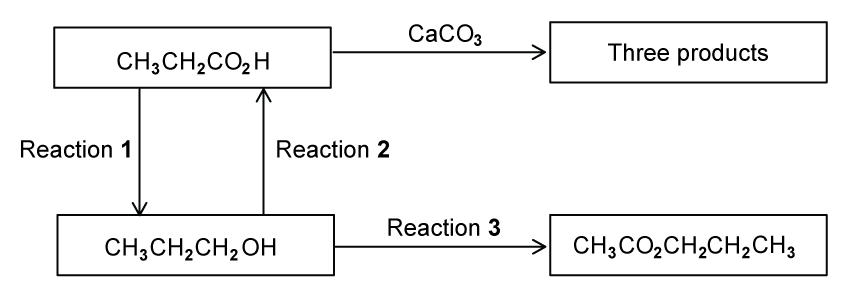{.question-figure fig-alt="Reaction scheme based on propanoic acid"}

**(a)** Write an equation for reaction 1, using `[H]` to represent the reducing agent. `[2 marks]`

**(b)**

i. What type of reaction is reaction 2?

ii. Suggest a suitable reagent and conditions for reaction 2. `[3 marks]`

**(c)** Write an equation for the reaction of propanoic acid with calcium carbonate, CaCO3. `[2 marks]`

**(d)**

i. Suggest a suitable reagent and conditions for reaction 3.

ii. Identify the other product of reaction 3. `[3 marks]`

Show detailed reference answer

<strong>(a)</strong> CH3CH2CO2H + 4[H] → CH3CH2CH2OH + H2O. This is reduction of the carboxylic acid to a primary alcohol.

<strong>(b)</strong> Reaction 2 is oxidation. Use acidified potassium dichromate(VI) or acidified potassium manganate(VII), heated under reflux. Reflux ensures the propan-1-ol remains in the flask and is oxidised fully.

<strong>(c)</strong> 2CH3CH2CO2H + CaCO3 → (CH3CH2CO2)2Ca + H2O + CO2. The salt is calcium propanoate.

<strong>(d)</strong> Use ethanoic acid, heat and concentrated sulfuric acid to esterify propan-1-ol and form propyl ethanoate. The other product is water.

:::

::: {.question-card #ca18-sq-m2}
### Question 5 · 3.6 SQ Medium Q2

An organic ester, B, has the empirical formula C2H4O. An experiment by a student in a college gave a value of 87.5 for Mr of B.

**(a)** What is the molecular formula of B? `[1 mark]`

**(b)** In the boxes below, draw the structural formulae of four isomers of B that are esters. `[4 marks]`

**(c)** The student hydrolysed his sample of B by heating with aqueous mineral acid and then separating the alcohol, C, that was formed. He heated the alcohol C under reflux with acidified dichromate(VI) ions and collected the product D. A sample of D gave an orange precipitate with 2,4-dinitrophenylhydrazine reagent. A second sample of D gave no reaction with Tollens’ reagent.

i. What group does the reaction with 2,4-dinitrophenylhydrazine reagent show to be present in D?

ii. What does the result of the test with Tollens’ reagent show about D?

iii. What is the structural formula of the alcohol C?

iv. Which of your esters, W, X, Y, or Z has the same structure as that of the ester B? `[4 marks]`

**(d)** Which, if any of your esters, W, X, Y, or Z is chiral? Explain your answer.

Show detailed reference answer

<strong>(a)</strong> The empirical formula mass is 2(12) + 4(1) + 16 = 44. 87.5/44 ≈ 2, so the molecular formula is C4H8O2.

<strong>(b)</strong> The four ester isomers are HCO2CH(CH3)2, HCO2CH2CH2CH3, CH3CO2CH2CH3 and CH3CH2CO2CH3.

<strong>(c)</strong> 2,4-DNPH shows that D contains a carbonyl group. No Tollens’ reaction shows that D is not an aldehyde, so it is a ketone. Therefore C is propan-2-ol, (CH3)2CHOH, which oxidises to propanone. Ester B is the ester made from propan-2-ol, namely HCO2CH(CH3)2 (ester W, depending on the labels used in the student’s boxes).

<strong>(d)</strong> None is chiral. A chiral centre requires a carbon atom bonded to four different atoms or groups; none of the four ester structures has such a carbon.

:::

::: {.question-card #ca18-sq-m3}
### Question 6 · 3.6 SQ Medium Q3

Esters are compounds which provide the flavour of many fruits and the perfumes of many flowers.

The ester CH3(CH2)2CO2CH3 contributes to the aroma of apples.

**(a)**

i. State the reagents and conditions needed for the hydrolysis of this ester.

ii. Write the equation for the hydrolysis of this ester.

iii. Apart from their use as perfumes and food flavourings, state one major commercial use of esters. `[4 marks]`

**(b)** Leaf alcohol is a stereoisomer that can form when insects such as caterpillars eat green leaves.

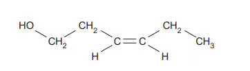{.question-figure fig-alt="Leaf alcohol structure"}

i. Draw the other stereo-isomer of leaf alcohol.

ii. Draw the structure for the ester formed when leaf alcohol reacts with ethanoic acid. Show all the bonds in the ester group. `[3 marks]`

**(c)**

i. Deduce the relative molecular mass, Mr, for leaf alcohol.

ii. Leaf alcohol was reacted to form a product with an Mr value 18 units less. Suggest a structure for this product and deduce the type of reaction that took place. `[3 marks]`

**(d)** Describe a simple chemical test to distinguish between leaf alcohol and your product in part (c)(ii). `[2 marks]`

Show detailed reference answer

<strong>(a)</strong> Use dilute acid or dilute sodium hydroxide and heat under reflux. With acid hydrolysis: CH3(CH2)2CO2CH3 + H2O ⇌ CH3(CH2)2CO2H + CH3OH. A major commercial use is as solvents, plastics or textiles.

<strong>(b)</strong> The other stereo-isomer is the mirror-image arrangement about the carbon–carbon double bond. For the ester, replace the alcohol hydrogen by COCH3 and show the complete −O−C(=O)− ester link.

<strong>(c)</strong> Mr = 100. A product 18 units lower has lost water, so an alkene such as CH2=CH−CH=CH−CH2CH3 can form by dehydration/elimination.

<strong>(d)</strong> Add acidified dichromate and warm: the alcohol-containing leaf alcohol gives orange to green, while the alkene product does not give this alcohol oxidation test. Alternatively add sodium to the alcohol and observe effervescence.

:::

::: {.question-card #ca18-sq-m4}
### Question 7 · 3.6 SQ Medium Q4

Fermentation of sugars by bacteria or moulds produces many different organic compounds. One compound present in fermented molasses is 2-ethyl-3-methylbutanoic acid which gives a distinctive aroma to rum.

(CH3)2CHCH(C2H5)CO2H

**(a)**

i. What is the molecular formula of 2-ethyl-3-methylbutanoic acid?

ii. How many chiral carbon atoms are present in a molecule of 2-ethyl-3-methylbutanoic acid? If none write ‘none’. `[2 marks]`

**(b)** A sample of 2-ethyl-3-methylbutanoic acid may be prepared in a school or college laboratory by the oxidation of 2-ethyl-3-methylbutan-1-ol.

i. State the reagent(s) that would be used for this oxidation. Describe what colour change would be seen.

ii. This reaction is carried out by heating the reacting chemicals together. What could be the main organic impurity present in the sample of the acid? Explain your answer.

iii. State whether a distillation apparatus or a reflux apparatus should be used. Explain your answer. `[6 marks]`

**(c)** A structural isomer of 2-ethyl-3-methylbutan-1-ol is 2-ethyl-3-methylbutan-2-ol. What colour change would be seen if this were heated with the reagents you have given in part (b)(i)? Explain your answer as clearly as you can. `[3 marks]`

**(d)** An isomer of 2-ethyl-3-methylbutanoic acid which is an ethyl ester is a very strong smelling compound which is found in some wines. This ethyl ester contains a branched hydrocarbon chain and is chiral. Draw the displayed formula of this ethyl ester. Identify the chiral carbon atom with an asterisk (*). `[3 marks]`

Show detailed reference answer

<strong>(a)</strong> The formula is C7H14O2. There is one chiral carbon: the carbon next to the carboxyl group is attached to H, CO2H, ethyl and the branched alkyl group.

<strong>(b)</strong> Use acidified K2Cr2O7 and heat under reflux; orange changes to green. The main impurity may be the aldehyde 2-ethyl-3-methylbutanal because partial oxidation stops at the aldehyde. Reflux is used to keep the primary alcohol and aldehyde in the flask so oxidation proceeds to the carboxylic acid.

<strong>(c)</strong> No colour change. The −OH carbon is tertiary and has no hydrogen attached, so it cannot be oxidised by acidified dichromate.

<strong>(d)</strong> Start with the ethyl group on the oxygen side of −COO−; use a branched four-carbon acid-side skeleton and mark the carbon attached to H, ethyl, the branched group and CO2C2H5 with an asterisk.

:::

### 18 Carboxylic acids and derivatives — Structured Questions: Hard

::: {.question-card #ca18-sq-h1}
### Question 8 · 3.6 SQ Hard Q1

Esters have important commercial uses, such as artificial flavourings in food. They can be prepared in several ways, including through the reactions of alcohols with carboxylic acids, as well as the carboxylic acid derivatives, acid anhydrides and acyl chlorides.

Ester S, CH3CH2COOCH2CH(CH3)2, is used in rum flavouring.

**(a)** Outline how you could obtain a sample of ester S, beginning with a named alcohol and carboxylic acid. Include any essential reaction conditions and write an equation for the reaction. You do not need to include details of the separation or purification methods involved. `[6 marks]`

**(b)** Ester S can undergo acid or alkaline hydrolysis. The products formed depends on the type of hydrolysis that has taken place. Compare the two types of hydrolysis. `[4 marks]`

**(c)** A second ester, Ester T, is responsible for a raspberry scent and has the molecular formula C5H10O2. Ester T can be produced by the reaction of an acid with a branched primary alcohol. Identify the acid and alcohol used to prepare ester T. Draw and name ester T. `[4 marks]`

**(d)** Lactic acid, 2-hydroxypropanoic acid, CH3CH(OH)COOH, occurs naturally in sour milk and in our muscles when we take hard exercise. Lactic acid is chiral and shows stereoisomerism. Draw fully displayed structures of the two optical isomers of lactic acid. Circle the chiral carbon atom in the lactic acid molecule. `[3 marks]`

Show detailed reference answer

<strong>(a)</strong> Use propanoic acid and 2-methylpropan-1-ol. Heat under reflux with concentrated sulfuric acid:

CH3CH2COOH + (CH3)2CHCH2OH ⇌ CH3CH2COOCH2CH(CH3)2 + H2O.

<strong>(b)</strong> Both types use heat under reflux and both produce 2-methylpropan-1-ol. Acid hydrolysis uses dilute acid and gives propanoic acid plus the alcohol; it is reversible and reaches an equilibrium. Alkaline hydrolysis uses dilute aqueous alkali and gives sodium propanoate plus the alcohol; it is effectively irreversible because the acid is converted to its salt.

<strong>(c)</strong> The acid is methanoic acid and the branched primary alcohol is 2-methylpropan-1-ol. The ester is 2-methylpropyl methanoate, HCOOCH2CH(CH3)2.

<strong>(d)</strong> The two structures are mirror images with opposite wedge/dash arrangement around the carbon attached to H, OH, CH3 and COOH. That carbon is the chiral centre; the carboxyl carbon is not chiral.

:::

::: {.question-card #ca18-sq-h2}
### Question 9 · 3.6 SQ Hard Q2

Lactic acid may be synthesised from ethanol by the following route.

CH3CH2OH → Step 1 → CH3CHO → Step 2 → CH3CH(OH)CN → Step 3 → CH3CH(OH)CO2H

Give the reagent(s) and essential condition(s) for each step. `[6 marks]`

**(b)** Lactic acid, CH3CH(OH)COOH, can be reduced by LiAlH4.

i. Write an equation to show this reaction using `[H]` to represent an atom of hydrogen from the reducing agent.

ii. Name the organic product formed in this reaction. `[2 marks]`

Show detailed reference answer

<strong>Step 1:</strong> acidified potassium dichromate(VI) or acidified potassium manganate(VII), distilling the ethanal as it forms. Distillation prevents further oxidation to ethanoic acid. <strong>Step 2:</strong> HCN in the presence of CN−, or KCN with dilute acid, at room temperature; this is nucleophilic addition to the planar carbonyl group. <strong>Step 3:</strong> dilute acid and heat under reflux, giving the carboxylic acid directly. Alkaline hydrolysis would first give the carboxylate salt and would require acidification.

<strong>(b)</strong> CH3CH(OH)COOH + 4[H] → CH3CH(OH)CH2OH + H2O. The organic product is propane-1,2-diol. LiAlH4 reduces the carboxylic acid group to a primary alcohol but leaves the existing alcohol group present.

:::

::: {.question-card #ca18-sq-h3}
### Question 10 · 3.6 SQ Hard Q3

Glycolic acid is commonly used in skin care products. The structure is shown in Fig. 3.1.

{.question-figure fig-alt="Glycolic acid in Fig. 3.1"}

**(a)** Glycolic acid is added separately to each of the three reagents below. Complete the table to show what you would observe. If a reaction occurs, state the functional group of glycolic acid that is responsible for the reaction.

| Reagent | Observation with glycolic acid | Does a reaction occur? | Functional group |
|---|---|---|---|
| Na2CO3 |  |  |  |
| 2,4-DNPH |  |  |  |
| acidified Cr2O72− |  |  |  |

**(b)** Two reaction sequences to produce glycolic acid are shown.

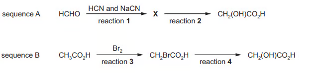{.question-figure fig-alt="Two sequences for producing glycolic acid"}

i. Draw the structure of X.

ii. Name the reagent used for reaction 2.

iii. Name the mechanism for reaction 3.

iv. Suggest the essential condition for reaction 3.

v. Reaction 4 occurs via an SN2 mechanism. Complete the diagram for the mechanism for reaction 4. Include all relevant charges, partial charges, curly arrows and lone pairs.

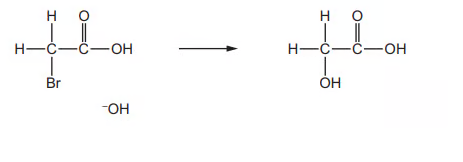{.question-figure fig-alt="SN2 mechanism for reaction 4"}

**(c)** Glycolic acid can also be made by reacting glyoxylic acid with NaBH4.

i. State the role of NaBH4 in this reaction.

ii. Write an equation for this reaction using molecular formulae. Use `[H]` to represent NaBH4. `[3 marks]`

Show detailed reference answer

<strong>(a)</strong> Sodium carbonate gives effervescence because the carboxylic acid group reacts to form carbon dioxide; the responsible group is −COOH. 2,4-DNPH gives no visible reaction because glycolic acid has no aldehyde or ketone carbonyl; there is no carbonyl group of the required type. Acidified dichromate changes orange to green because the alcohol group is oxidised; the responsible group is −OH.

<strong>(b)</strong> In sequence A, methanal reacts with HCN/CN− by nucleophilic addition to give HOCH2CN; reaction 2 is hydrolysis with dilute acid. In sequence B, reaction 3 is free-radical substitution of a hydrogen by bromine and requires UV light or sunlight. Reaction 4 is nucleophilic substitution: OH− attacks the carbon attached to Br, the C–Br bond breaks towards Br, and Br− leaves. Include the negative charge and lone pairs on hydroxide, the partial charges on C–Br and the two curly arrows.

<strong>(c)</strong> NaBH4 is a reducing agent. Using molecular formulae: C2H2O3 + 2[H] → C2H4O3. The equation is balanced and represents reduction of the aldehyde group in glyoxylic acid to an alcohol.

:::

## Chapter checklist

- [ ] I can name carboxylic acids and identify the `-COOH` group.
- [ ] I can explain weak-acid equilibrium and write equations for acid–carbonate reactions.
- [ ] I can choose distillation or reflux for controlled oxidation.
- [ ] I can distinguish acid and alkaline hydrolysis of nitriles and esters.
- [ ] I can name esters by separating the alcohol and acid parts.
- [ ] I can use formulae, stereochemistry and mole calculations in unfamiliar pathways.

## Original question PDFs

- [3.6 Carboxylic acids and derivatives — Choice — Easy](../assets/questions/original-source/3.6_carboxylic_acids___derivatives___choice___easy.pdf)
- [3.6 Carboxylic acids and derivatives — Choice — Medium](../assets/questions/original-source/3.6_carboxylic_acids___derivatives___choice___medium.pdf)
- [3.6 Carboxylic acids and derivatives — Choice — Hard](../assets/questions/original-source/3.6_carboxylic_acids___derivatives___choice___hard.pdf)
- [3.6 Carboxylic acids and derivatives — SQ — Easy](../assets/questions/original-source/3.6_carboxylic_acids___derivatives___sq___easy.pdf)
- [3.6 Carboxylic acids and derivatives — SQ — Medium](../assets/questions/original-source/3.6_carboxylic_acids___derivatives___sq___medium.pdf)
- [3.6 Carboxylic acids and derivatives — SQ — Hard](../assets/questions/original-source/3.6_carboxylic_acids___derivatives___sq___hard.pdf)
