# 19 Nitrogen compounds

本章只覆盖 Cambridge International AS Level Chemistry 9701 的 **3.7 Nitrogen compounds**，内容对应 **19.1 Primary Amines** 和 **19.2 Nitriles - Hydroxynitriles**。题目来自 Topical Past Papers/AS 中的 3.7 Nitrogen Compounds 题库；题目文字、选项、小问编号和分值均按原题保留。页面包含 20 道 multiple-choice questions 和 10 道 structured questions。无法独立提取的整页图不放入页面。

## Learning objectives

学完本章后，你应该能够：

- identify primary amines and nitriles from displayed, structural and skeletal formulae;
- explain the role of ammonia as a nucleophile in the formation of primary amines;
- state the reagents and conditions for making primary amines from halogenoalkanes;
- explain why excess ammonia favours formation of a primary amine;
- describe the nucleophilic substitution mechanism of halogenoalkanes with cyanide ions;
- explain why forming a nitrile lengthens a carbon chain by one carbon atom;
- describe acid and alkaline hydrolysis of nitriles and distinguish their products;
- explain nucleophilic addition of HCN to aldehydes and ketones to form hydroxynitriles;
- draw or describe the mechanism of hydroxynitrile formation, including charges and curly arrows;
- apply naming, bond-angle, hybridisation and stereoisomerism ideas to nitrogen compounds.

## 19.1 Primary amines

### Structure and naming

A primary amine contains one alkyl or aryl group attached to nitrogen and has the general structure RNH2. The nitrogen atom has a lone pair of electrons. For example, CH3CH2NH2 is **ethylamine** and CH3CH2CH2NH2 is **propylamine**.

The suffix **-amine** identifies the functional group. The alkyl group is named first, followed by amine. The carbon chain is numbered from the end nearest the amino group when a locant is required.

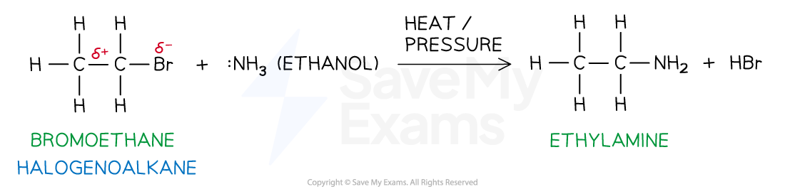{.concept-figure fig-alt="Formation of ethylamine from bromoethane using ammonia"}

### Formation from halogenoalkanes

Heat a halogenoalkane with **excess ammonia in ethanol under pressure**. The ammonia acts as a nucleophile: its lone pair attacks the carbon atom bonded to the halogen, and the halide ion leaves.

For bromoethane:

$$\ce{CH3CH2Br + NH3 -> CH3CH2NH2 + HBr}$$

The reaction is **nucleophilic substitution**. An excess of ammonia reduces the chance that the primary amine will act as a nucleophile and react with another halogenoalkane molecule. If ammonia is not in excess, further substitution can produce secondary and tertiary amines and eventually quaternary ammonium salts.

For a primary halogenoalkane, the mechanism is usually described as an SN2 nucleophilic substitution: bond making and bond breaking occur in the same step. The carbon of the C-X bond is δ+, the halogen is δ−, and the nitrogen lone pair attacks the carbon.

### Basicity of primary amines

The lone pair on nitrogen can accept a proton. Therefore a primary amine is a Brønsted-Lowry base:

$$\ce{CH3CH2CH2NH2 + H2O <=> CH3CH2CH2NH3+ + OH-}$$

The equilibrium lies to the left because primary amines are weak bases. The amine accepts H+ from water, while water acts as the Brønsted-Lowry acid.

In ammonia and a primary amine, three bonds and one lone pair surround nitrogen, so the shape is pyramidal and the bond angle is about 107°. In the positively charged intermediate formed during nucleophilic substitution, nitrogen has four bonding pairs and no lone pair, so the arrangement is tetrahedral and the bond angle is about 109.5°.

## 19.2 Nitriles and hydroxynitriles

### Nitrile group and naming

Nitriles contain the functional group −C≡N. The carbon atom of the nitrile group is included in the parent chain when naming the compound. Thus CH3CH2CN is **propanenitrile**, not ethanenitrile.

The nitrile carbon is carbon 1. A nitrile carbon is linear because it is triple-bonded to nitrogen; the C≡N bond contains one σ bond and two π bonds.

{.concept-figure fig-alt="Displayed formula of a nitrile"}

### Formation from halogenoalkanes

Reflux a halogenoalkane with potassium cyanide or sodium cyanide in ethanol. In AS questions the required condition is normally **KCN in ethanol, heated under reflux**:

$$\ce{CH3CH2CH2Br + CN- -> CH3CH2CH2CN + Br-}$$

The cyanide ion is the nucleophile. It replaces the halide ion by nucleophilic substitution. The carbon atom in CN− becomes the nitrile carbon, so the product has **one more carbon atom** than the starting halogenoalkane.

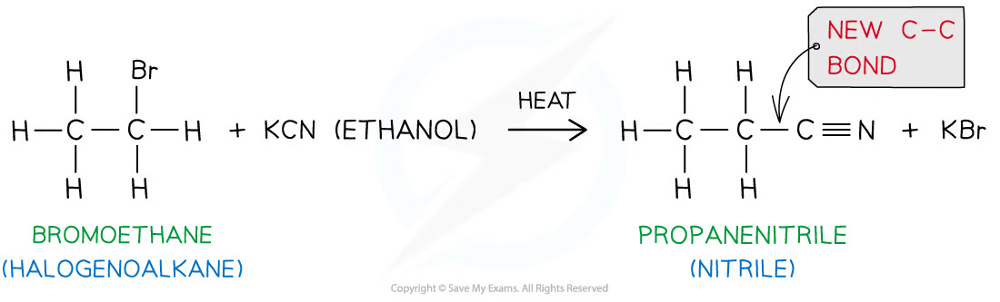{.concept-figure fig-alt="Nucleophilic substitution of bromoethane by cyanide ion"}

This reaction is useful in synthesis because it forms a new C-C bond and increases the carbon-chain length by one carbon atom.

### Hydrolysis of nitriles

Acid hydrolysis uses dilute hydrochloric acid and heat under reflux. It forms a carboxylic acid and an ammonium salt:

$$\ce{R-C#N + 2H2O + HCl -> R-COOH + NH4Cl}$$

For propanenitrile:

$$\ce{CH3CH2CN + 2H2O + HCl -> CH3CH2COOH + NH4Cl}$$

Alkaline hydrolysis uses aqueous sodium hydroxide and heat under reflux. It forms a sodium carboxylate and ammonia:

$$\ce{R-C#N + 2H2O + NaOH -> R-COONa + NH3}$$

The sodium carboxylate must be acidified to produce the free carboxylic acid:

$$\ce{R-COO-Na+ + H+ -> R-COOH + Na+}$$

{.concept-figure fig-alt="Acid and alkaline hydrolysis of propanenitrile"}

### Hydroxynitriles

Hydroxynitriles contain both a hydroxyl group and a nitrile group. They are formed when an aldehyde or ketone reacts with hydrogen cyanide. A small amount of KCN is used to generate HCN and act as a catalyst; the mixture is warmed.

$$\ce{RCHO + HCN -> RCH(OH)CN}$$

$$\ce{R2CO + HCN -> R2C(OH)CN}$$

{.concept-figure fig-alt="Hydroxynitrile structure and numbering"}

The mechanism is nucleophilic addition:

1. CN− attacks the δ+ carbonyl carbon using a lone pair.
2. The C=O π bond breaks heterolytically towards oxygen, giving an intermediate with O−.
3. The oxygen lone pair takes a proton from HCN; the H-CN bond breaks towards carbon, regenerating CN−.

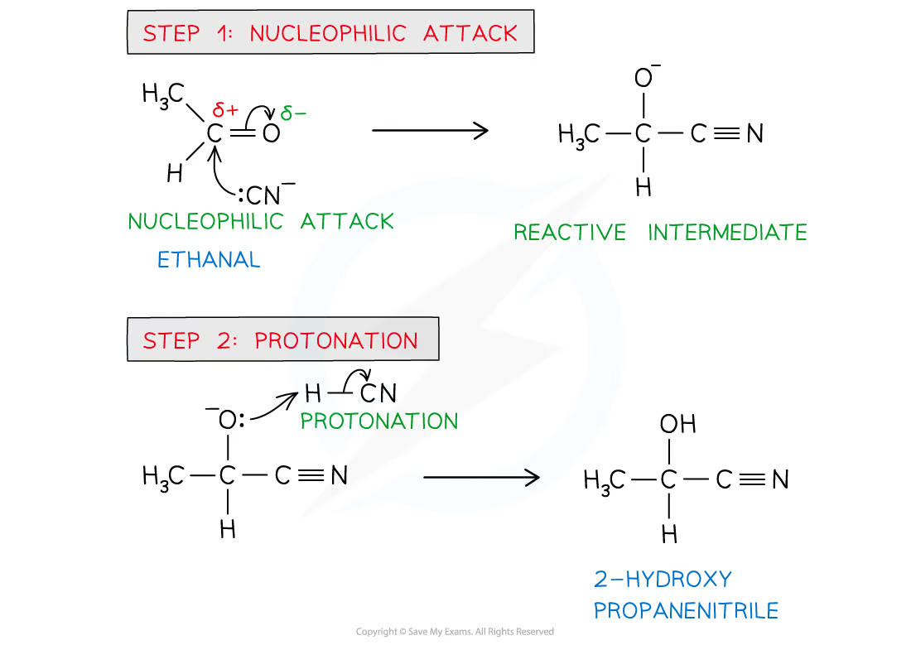{.concept-figure fig-alt="Nucleophilic addition mechanism of HCN to a carbonyl compound"}

The carbonyl carbon is planar before addition, while the carbon attached to OH, CN, H and the alkyl group is tetrahedral after addition. If it has four different groups, it is a chiral centre and the product exists as a pair of optical isomers.

### Synthetic routes to hydroxynitriles

An alcohol can first be oxidised to an aldehyde or ketone, then the carbonyl compound undergoes nucleophilic addition with HCN. For a primary alcohol, distillation is used to remove the aldehyde and prevent further oxidation. For a secondary alcohol, heating under reflux produces a ketone; further oxidation does not normally occur under these conditions.

## Common traps

- In a nitrile name, count the nitrile carbon in the parent chain.
- Formation of a nitrile from a halogenoalkane adds one carbon; hydrolysis does not change the carbon count.
- KCN in ethanol and heat gives nucleophilic substitution to form a nitrile; aqueous conditions can lead to competing hydrolysis.
- Acid hydrolysis gives a carboxylic acid and an ammonium salt, whereas alkaline hydrolysis gives a carboxylate salt and ammonia.
- A hydroxynitrile is formed from an aldehyde or ketone by nucleophilic addition with HCN, not by substitution.
- Curly arrows must start from a lone pair or a bond and point to an electron-deficient atom or bond.
- Excess ammonia is needed to favour a primary amine and reduce further substitution.
- A primary amine is a weak base because the nitrogen lone pair accepts a proton only partially in water.

## Multiple choice questions

以下 20 道选择题来自 3.7 Nitrogen Compounds - Choice - Easy/Medium/Hard。题目文字和选项保持原题；化学式使用规范上下标，图片仅使用独立提取的原图对象。

### 19 Nitrogen compounds — Multiple Choice: Easy

::: {.mc-question #n19-mc-e1 data-answer="A"}
### Question 1 · 3.7 Choice Easy Q1

Which of the following is the displayed formula for ethylamine?

<strong>A</strong>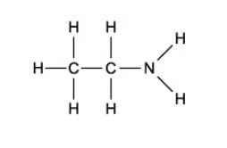<strong>B</strong>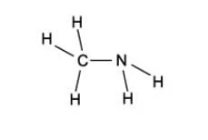<strong>C</strong>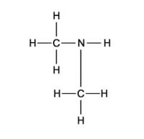<strong>D</strong>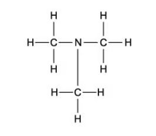

<button class="check-answer">Check answer</button>

Show detailed explanation

<strong>A.</strong> Ethylamine is CH3CH2NH2: the ethyl group has two carbon atoms and the nitrogen has two hydrogen atoms. B is methylamine, C is a secondary amine, and D is a tertiary amine.

:::

::: {.mc-question #n19-mc-e2 data-answer="C"}
### Question 2 · 3.7 Choice Easy Q2

What type of reaction makes ethylamine from bromoethane?

<button class="mc-choice" data-choice="A"><strong>A</strong>Oxidation</button><button class="mc-choice" data-choice="B"><strong>B</strong>Reduction</button><button class="mc-choice" data-choice="C"><strong>C</strong>Nucleophilic substitution</button><button class="mc-choice" data-choice="D"><strong>D</strong>Electrophilic substitution</button>

<button class="check-answer">Check answer</button>

Show detailed explanation

<strong>C.</strong> Ammonia supplies a lone pair and acts as the nucleophile. It replaces Br in CH3CH2Br, forming ethylamine. This is nucleophilic substitution; it is not oxidation, reduction or electrophilic substitution.

:::

::: {.mc-question #n19-mc-e3 data-answer="C"}
### Question 3 · 3.7 Choice Easy Q3

CH3CH2Cl reacts with an excess of ethanolic NH3.

Which compound is the main organic product?

<button class="mc-choice" data-choice="A"><strong>A</strong>(CH3CH2)3N</button><button class="mc-choice" data-choice="B"><strong>B</strong>(CH3CH2)2NH</button><button class="mc-choice" data-choice="C"><strong>C</strong>CH3CH2NH2</button><button class="mc-choice" data-choice="D"><strong>D</strong>(CH3CH2)4N+</button>

<button class="check-answer">Check answer</button>

Show detailed explanation

<strong>C.</strong> Excess ammonia favours one substitution, so chloroethane gives the primary amine ethylamine. If ammonia were not in excess, ethylamine could act as a nucleophile and further substitution could produce secondary, tertiary and quaternary nitrogen products.

:::

::: {.mc-question #n19-mc-e4 data-answer="C"}
### Question 4 · 3.7 Choice Easy Q4

Hydrolysis of CH3CH2CN with dilute HCl produces which compound?

<button class="mc-choice" data-choice="A"><strong>A</strong>CH3COOH</button><button class="mc-choice" data-choice="B"><strong>B</strong>CH3CH2CH2NH3</button><button class="mc-choice" data-choice="C"><strong>C</strong>CH3CH2COOH</button><button class="mc-choice" data-choice="D"><strong>D</strong>CH3CH2COH</button>

<button class="check-answer">Check answer</button>

Show detailed explanation

<strong>C.</strong> Acid hydrolysis changes the −CN group into −COOH. The nitrile carbon is retained, so propanenitrile gives propanoic acid, CH3CH2COOH, together with ammonium chloride.

:::

::: {.mc-question #n19-mc-e5 data-answer="A"}
### Question 5 · 3.7 Choice Easy Q5

When 1-bromoethane reacts with an equal amount of X. What would X be and what is the product of this reaction?

|  | X | Product |
|---|---|---|
| A | Ammonia | Amine |
| B | Methylamine | Amide |
| C | Water | Weak acid |
| D | Methanol | Ethyl methanoate |

<button class="mc-choice" data-choice="A"><strong>A</strong>Ammonia; amine</button><button class="mc-choice" data-choice="B"><strong>B</strong>Methylamine; amide</button><button class="mc-choice" data-choice="C"><strong>C</strong>Water; weak acid</button><button class="mc-choice" data-choice="D"><strong>D</strong>Methanol; ethyl methanoate</button>

<button class="check-answer">Check answer</button>

Show detailed explanation

<strong>A.</strong> Ammonia reacts with a halogenoalkane by nucleophilic substitution to give an amine. Methylamine would give a secondary amine, not an amide; water gives ethanol; methanol gives an ether under substitution conditions, not ethyl methanoate.

:::

::: {.mc-question #n19-mc-e6 data-answer="A"}
### Question 6 · 3.7 Choice Easy Q6

The equation shows a chemical reaction:

CH3CH2CHClCH3 + CN− → CH3CH2CH(CH3)CN + Cl−

What is the name for this type of reaction?

<button class="mc-choice" data-choice="A"><strong>A</strong>Nucleophilic substitution</button><button class="mc-choice" data-choice="B"><strong>B</strong>Electrophilic substitution</button><button class="mc-choice" data-choice="C"><strong>C</strong>Free radical substitution</button><button class="mc-choice" data-choice="D"><strong>D</strong>Nucleophilic addition</button>

<button class="check-answer">Check answer</button>

Show detailed explanation

<strong>A.</strong> CN− is a nucleophile and replaces Cl on a secondary halogenoalkane. The carbon chain gains one carbon because the carbon of the cyanide ion becomes the nitrile carbon.

:::

::: {.mc-question #n19-mc-e7 data-answer="C"}
### Question 7 · 3.7 Choice Easy Q7

What are the reagents needed in the reaction of 1-bromopropane to butanenitrile?

<button class="mc-choice" data-choice="A"><strong>A</strong>KCN</button><button class="mc-choice" data-choice="B"><strong>B</strong>Ethanol and heat</button><button class="mc-choice" data-choice="C"><strong>C</strong>KCN, ethanol and heat</button><button class="mc-choice" data-choice="D"><strong>D</strong>KCN and ethanol</button>

<button class="check-answer">Check answer</button>

Show detailed explanation

<strong>C.</strong> Use KCN in ethanol and heat under reflux. Ethanol provides the solvent and heating supplies the conditions for nucleophilic substitution. The product is butanenitrile because the cyanide carbon adds one carbon to the chain.

:::

::: {.mc-question #n19-mc-e8 data-answer="D"}
### Question 8 · 3.7 Choice Easy Q8

What are the products in the reaction of ethanenitrile and hydrochloric acid?

<button class="mc-choice" data-choice="A"><strong>A</strong>Propanoic acid and ammonia</button><button class="mc-choice" data-choice="B"><strong>B</strong>Propanoic acid and ammonium chloride</button><button class="mc-choice" data-choice="C"><strong>C</strong>Ethanoic acid and ammonia</button><button class="mc-choice" data-choice="D"><strong>D</strong>Ethanoic acid and ammonium chloride</button>

<button class="check-answer">Check answer</button>

Show detailed explanation

<strong>D.</strong> Acid hydrolysis of ethanenitrile keeps the two-carbon chain and gives ethanoic acid. The nitrogen-containing product is protonated in acidic solution, so the salt is ammonium chloride rather than ammonia.

:::

::: {.mc-question #n19-mc-e9 data-answer="C"}
### Question 9 · 3.7 Choice Easy Q9

What are the products in the reaction of ethanenitrile and sodium hydroxide?

<button class="mc-choice" data-choice="A"><strong>A</strong>Sodium propanoate and ammonia</button><button class="mc-choice" data-choice="B"><strong>B</strong>Sodium propanoate and ammonium chloride</button><button class="mc-choice" data-choice="C"><strong>C</strong>Sodium ethanoate and ammonia</button><button class="mc-choice" data-choice="D"><strong>D</strong>Sodium ethanoate and ammonium chloride</button>

<button class="check-answer">Check answer</button>

Show detailed explanation

<strong>C.</strong> Alkaline hydrolysis gives the sodium carboxylate and ammonia. The two-carbon nitrile therefore gives sodium ethanoate, not sodium propanoate; ammonium chloride is associated with acid hydrolysis.

:::

::: {.mc-question #n19-mc-e10 data-answer="D"}
### Question 10 · 3.7 Choice Easy Q10

Which one of the following reactants would not produce a nitrile in a one-step reaction?

<button class="mc-choice" data-choice="A"><strong>A</strong>Amides</button><button class="mc-choice" data-choice="B"><strong>B</strong>Aldehydes</button><button class="mc-choice" data-choice="C"><strong>C</strong>Halogenoalkanes</button><button class="mc-choice" data-choice="D"><strong>D</strong>Alkanes</button>

<button class="check-answer">Check answer</button>

Show detailed explanation

<strong>D.</strong> Alkanes are unreactive because their C-H bonds are non-polar. Amides can be dehydrated to nitriles, aldehydes can form hydroxynitriles with HCN, and halogenoalkanes can undergo substitution with cyanide ions.

:::

### 19 Nitrogen compounds — Multiple Choice: Medium

::: {.mc-question #n19-mc-m1 data-answer="D"}
### Question 11 · 3.7 Choice Medium Q1

Methyl iodide can be heated with ammonia. Which of the options describes the products of this reaction?

<button class="mc-choice" data-choice="A"><strong>A</strong>Methylamine</button><button class="mc-choice" data-choice="B"><strong>B</strong>Dimethylamine</button><button class="mc-choice" data-choice="C"><strong>C</strong>Trimethylamine</button><button class="mc-choice" data-choice="D"><strong>D</strong>All of the above</button>

<button class="check-answer">Check answer</button>

Show detailed explanation

<strong>D.</strong> Ammonia first forms methylamine. If ammonia is not in excess, the amine nitrogen remains nucleophilic and can react with further methyl iodide to form dimethylamine and then trimethylamine. Therefore a mixture containing all three can form.

:::

::: {.mc-question #n19-mc-m2 data-answer="B"}
### Question 12 · 3.7 Choice Medium Q2

Which of the following reactions would produce 2-hydroxy-2-methylpropanenitrile?

<button class="mc-choice" data-choice="A"><strong>A</strong>Ethanal + sulfuric acid</button><button class="mc-choice" data-choice="B"><strong>B</strong>Propanone + hydrogen cyanide</button><button class="mc-choice" data-choice="C"><strong>C</strong>Ethanal + ammonia</button><button class="mc-choice" data-choice="D"><strong>D</strong>Propanone + ammonia</button>

<button class="check-answer">Check answer</button>

Show detailed explanation

<strong>B.</strong> Propanone reacts with HCN by nucleophilic addition. Addition of CN to the carbonyl carbon and protonation of oxygen gives 2-hydroxy-2-methylpropanenitrile. Ammonia and sulfuric acid do not provide the cyanide nucleophile required.

:::

::: {.mc-question #n19-mc-m3 data-answer="D"}
### Question 13 · 3.7 Choice Medium Q3

Reactions were carried out to produce nitriles. Which combination of reactants and reagents is not correct?

|  | Reactant | Reagent |
|---|---|---|
| A | Halogenoalkane | Potassium cyanide and ethanol |
| B | Amide | Phosphorus(V) oxide |
| C | Aldehyde | Hydrogen cyanide |
| D | Ketone | Ammonia |

<button class="mc-choice" data-choice="A"><strong>A</strong>Halogenoalkane; potassium cyanide and ethanol</button><button class="mc-choice" data-choice="B"><strong>B</strong>Amide; phosphorus(V) oxide</button><button class="mc-choice" data-choice="C"><strong>C</strong>Aldehyde; hydrogen cyanide</button><button class="mc-choice" data-choice="D"><strong>D</strong>Ketone; ammonia</button>

<button class="check-answer">Check answer</button>

Show detailed explanation

<strong>D.</strong> A ketone can react with HCN to form a hydroxynitrile, but ammonia is not the reagent for this reaction. The other combinations are valid routes: KCN/ethanol gives substitution, phosphorus(V) oxide dehydrates an amide, and HCN adds to an aldehyde.

:::

::: {.mc-question #n19-mc-m4 data-answer="B"}
### Question 14 · 3.7 Choice Medium Q4

The following equations show reactions with nitrogen compounds. Which one correctly shows the hydrolysis of nitriles with dilute acid?

<button class="mc-choice" data-choice="A"><strong>A</strong>CH3CN + HCl + 2H2O → CH3COOH + NH3Cl</button><button class="mc-choice" data-choice="B"><strong>B</strong>CH3CN + HCl + 2H2O → CH3COOH + NH4Cl</button><button class="mc-choice" data-choice="C"><strong>C</strong>CH3CN + HCl + H2O → CH3COOH + NH4Cl</button><button class="mc-choice" data-choice="D"><strong>D</strong>CH3CN + HCl + 2H2O → CH3COOHCl + NH3</button>

<button class="check-answer">Check answer</button>

Show detailed explanation

<strong>B.</strong> Acid hydrolysis uses two water molecules and gives the carboxylic acid plus ammonium chloride. The nitrogen becomes NH4+ in acidic solution, so A and D have incorrect products and C is not balanced.

:::

::: {.mc-question #n19-mc-m5 data-answer="A"}
### Question 15 · 3.7 Choice Medium Q5

The following equations show reactions with nitrogen compounds. Which one correctly shows the hydrolysis of nitriles with dilute sodium hydroxide?

<button class="mc-choice" data-choice="A"><strong>A</strong>CH3CN + NaOH + H2O → CH3COONa + NH3</button><button class="mc-choice" data-choice="B"><strong>B</strong>CH3CN + NaOH + 2H2O → CH3COONa + NH3</button><button class="mc-choice" data-choice="C"><strong>C</strong>CH3CN + NaOH + H2O → CH3COONa + NH4</button><button class="mc-choice" data-choice="D"><strong>D</strong>CH3CN + NaOH + 2H2O → CH3COONa + NH4</button>

<button class="check-answer">Check answer</button>

Show detailed explanation

<strong>A (the answer marked in the source PDF).</strong> The source answer identifies A because alkaline hydrolysis gives sodium ethanoate and ammonia, not an ammonium salt. However, the printed option A omits one water molecule: the balanced molecular equation is CH3CN + NaOH + 2H2O → CH3COONa + NH3, which is option B as printed. This is an apparent error in the source question/answer pair; the chemical products and conditions are unambiguous.

:::

### 19 Nitrogen compounds — Multiple Choice: Hard

::: {.mc-question #n19-mc-h1 data-answer="D"}
### Question 16 · 3.7 Choice Hard Q1

What is the correct two-step synthesis to produce 2-hydroxybutanenitrile from propan-1-ol?

<button class="mc-choice" data-choice="A"><strong>A</strong>1) NaCl/H2SO4 2) NaCN/ethanol</button><button class="mc-choice" data-choice="B"><strong>B</strong>1) NaCN/ethanol 2) NaCl/H2SO4</button><button class="mc-choice" data-choice="C"><strong>C</strong>1) NaCN(aq)/H+(aq) 2) K2Cr2O7/H2SO4 under distillation</button><button class="mc-choice" data-choice="D"><strong>D</strong>1) K2Cr2O7/H2SO4 under distillation 2) NaCN(aq)/H+(aq)</button>

<button class="check-answer">Check answer</button>

Show detailed explanation

<strong>D.</strong> Propan-1-ol must first be oxidised to propanal using acidified dichromate under distillation. The aldehyde then reacts with HCN generated from acidified cyanide to give 2-hydroxybutanenitrile. The order cannot be reversed because cyanide adds to a carbonyl group, not to an alcohol.

:::

::: {.mc-question #n19-mc-h2 data-answer="C"}
### Question 17 · 3.7 Choice Hard Q2

Butanone can undergo addition when mixed with NaCN(aq)/H+(aq), forming product Z. Product Z can then undergo hydrolysis when heated with dilute HCl, forming product Y.

Which compound is product Y?

<button class="mc-choice" data-choice="A"><strong>A</strong>2-hydroxypentanoic acid</button><button class="mc-choice" data-choice="B"><strong>B</strong>2-hydroxybutylamine</button><button class="mc-choice" data-choice="C"><strong>C</strong>2-methyl-2-hydroxybutanoic acid</button><button class="mc-choice" data-choice="D"><strong>D</strong>2-ethyl-2-hydroxypropylamine</button>

<button class="check-answer">Check answer</button>

Show detailed explanation

<strong>C.</strong> Butanone reacts with HCN to form a hydroxynitrile. The nitrile group is then hydrolysed to a carboxylic acid, so the product is 2-methyl-2-hydroxybutanoic acid. Acid hydrolysis does not form an amine as the organic product.

:::

::: {.mc-question #n19-mc-h3 data-answer="D"}
### Question 18 · 3.7 Choice Hard Q3

What is the correct set of reagents and conditions for the two reactions shown?

(CH3)2CO → (CH3)2CHCN; CH3CHClCH3 → CH3CH(NH2)CH3

|  | First reaction | Second reaction |
|---|---|---|
| A | Sn/conc. H2SO4 | Dilute ethanolic NH3 |
| B | Sn/conc. HCl | Excess ethanolic NH3 |
| C | NH3 | Nitric acid/50 °C |
| D | KCN, H2SO4 | Excess ethanolic NH3 |

<button class="mc-choice" data-choice="A"><strong>A</strong>Sn/conc. H2SO4; dilute ethanolic NH3</button><button class="mc-choice" data-choice="B"><strong>B</strong>Sn/conc. HCl; excess ethanolic NH3</button><button class="mc-choice" data-choice="C"><strong>C</strong>NH3; nitric acid/50 °C</button><button class="mc-choice" data-choice="D"><strong>D</strong>KCN, H2SO4; excess ethanolic NH3</button>

<button class="check-answer">Check answer</button>

Show detailed explanation

<strong>D.</strong> Propanone undergoes nucleophilic addition with HCN generated from KCN and acid. The secondary halogenoalkane then reacts with excess ethanolic ammonia by nucleophilic substitution to form propan-2-amine.

:::

::: {.mc-question #n19-mc-h4 data-answer="A"}
### Question 19 · 3.7 Choice Hard Q4

A student wanted to produce a hydroxynitrile. Which types of reactions, reactants and reagents are shown in the table that would correctly describe this reaction?

|  | Type of reaction | Reactants | Reagents |
|---|---|---|---|
| A | Addition | Aldehyde | HCN |
| B | Hydrolysis | Halogenoalkane | Ethanolic NH3 |
| C | Substitution | Ketone | HCN |
| D | Addition | Halogenoalkane | KCN, ethanol |

<button class="mc-choice" data-choice="A"><strong>A</strong>Addition; aldehyde; HCN</button><button class="mc-choice" data-choice="B"><strong>B</strong>Hydrolysis; halogenoalkane; ethanolic NH3</button><button class="mc-choice" data-choice="C"><strong>C</strong>Substitution; ketone; HCN</button><button class="mc-choice" data-choice="D"><strong>D</strong>Addition; halogenoalkane; KCN, ethanol</button>

<button class="check-answer">Check answer</button>

Show detailed explanation

<strong>A.</strong> Hydroxynitriles form by nucleophilic addition of HCN to an aldehyde or ketone carbonyl group. KCN in ethanol with a halogenoalkane gives a nitrile by substitution, not a hydroxynitrile.

:::

::: {.mc-question #n19-mc-h5 data-answer="B"}
### Question 20 · 3.7 Choice Hard Q5

What would X, Y and Z be in the following reaction sequence?

CH3CH2CH2Br →[KCN + ethanol + heat] X →[NaOH + H2O + heat] Y →[dilute HCl] Z

|  | X | Y | Z |
|---|---|---|---|
| A | CH3CH2CH2K | CH3CH2CH2COONa | CH3CH2CH2COOH |
| B | CH3CH2CH2CN | CH3CH2CH2COONa | CH3CH2CH2COOH |
| C | CH3CH2CH2K | CH3CH2CH2COOH | CH3CH2CH2COONa |
| D | CH3CH2CH2CN | CH3CH2CH2COOH | CH3CH2CH2COONa |

<button class="mc-choice" data-choice="A"><strong>A</strong>X: propyl potassium; Y: sodium butanoate; Z: butanoic acid</button><button class="mc-choice" data-choice="B"><strong>B</strong>X: butanenitrile; Y: sodium butanoate; Z: butanoic acid</button><button class="mc-choice" data-choice="C"><strong>C</strong>X: propyl potassium; Y: butanoic acid; Z: sodium butanoate</button><button class="mc-choice" data-choice="D"><strong>D</strong>X: butanenitrile; Y: butanoic acid; Z: sodium butanoate</button>

<button class="check-answer">Check answer</button>

Show detailed explanation

<strong>B.</strong> KCN substitutes Br and adds the cyanide carbon, giving butanenitrile. Alkaline hydrolysis gives sodium butanoate. Dilute acid then acidifies the carboxylate salt to butanoic acid.

:::

## Structured questions

以下 10 道 SQ 依次取 Easy 3 题、Medium 4 题和 Hard 3 题。每道题的参考答案依据对应 PDF 后半部分的 model answers，并补充方程式、机理得分点和判断理由。

### 19 Nitrogen compounds — Structured: Easy

::: {.question-card #n19-sq-e1}
### Question 1 · 3.7 SQ Easy Q1

Propylamine can be produced from 1-bromopropane.

Complete the equation for the formation of propylamine.

CH3CH2CH2Br + __________ → __________ + HBr

**(b)** State the necessary reagents and conditions to produce propylamine from 1-bromopropane. [3 marks]

**(c)** Name the reaction mechanism that takes place when propylamine is produced from 1-bromopropane. [1 mark]

Show detailed reference answer

<strong>(a)</strong> CH3CH2CH2Br + NH3 → CH3CH2CH2NH2 + HBr. Ammonia supplies the nitrogen atom and its lone pair.

<strong>(b)</strong> Use excess ammonia in ethanol as the solvent, heated under pressure or in a sealed tube. Excess ammonia reduces further substitution of the primary amine.

<strong>(c)</strong> Nucleophilic substitution. The nitrogen lone pair attacks the δ+ carbon of the C-Br bond, while the C-Br bond breaks towards bromine.

:::

::: {.question-card #n19-sq-e2}
### Question 2 · 3.7 SQ Easy Q2

When 1-chloropropane is heated under reflux with ethanolic potassium cyanide, KCN, the following reaction occurs:

CH3CH2CH2Cl + KCN → CH3CH2CH2CN + KCl

**(a)**

i. Draw the displayed formula of the organic product formed in this reaction.

ii. State the IUPAC name of this organic product. [2 marks]

**(b)** Suggest why this reaction is useful to chemists during the synthesis of other organic compounds. [1 mark]

**(c)** The CH3CH2CH2CN can undergo hydrolysis.

i. Write the equation for the acid hydrolysis of CH3CH2CH2CN.

ii. Draw the displayed formula of the intermediate formed when CH3CH2CH2CN is hydrolysed by sodium hydroxide. [3 marks]

Show detailed reference answer

<strong>(a)</strong> The displayed product is CH3CH2CH2−C≡N, named <strong>butanenitrile</strong>. The nitrile carbon must be included in the parent chain.

<strong>(b)</strong> The reaction forms a new C-C bond and lengthens the carbon chain by one carbon atom.

<strong>(c)(i)</strong> CH3CH2CH2CN + HCl + 2H2O → CH3CH2CH2COOH + NH4Cl.

<strong>(c)(ii)</strong> The intermediate is sodium butanoate, CH3CH2CH2COO−Na+. Acidification would then give butanoic acid. Hydrolysis does not change the number of carbon atoms.

:::

::: {.question-card #n19-sq-e3}
### Question 3 · 3.7 SQ Easy Q3

This question is about hydroxynitriles.

The hydroxynitrile shown in Fig. 3.1 can be prepared from the reaction between propanal and hydrogen cyanide.

{.question-figure fig-alt="Hydroxynitrile structure in Fig. 3.1"}

**(a)** Give the IUPAC name of this hydroxynitrile. [1 mark]

**(b)** Using “curly arrows”, complete the reaction mechanism shown in Fig. 3.2 for the reaction between propanal and the cyanide ion, CN−. Include any lone pairs of electrons and partial or whole charges. [4 marks]

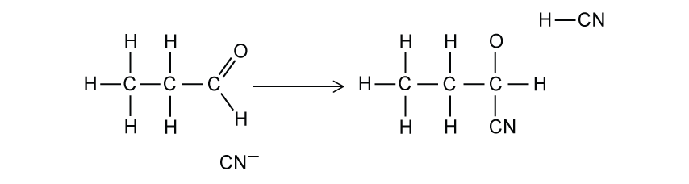{.question-figure fig-alt="Reaction mechanism figure for hydroxynitrile formation"}

**(c)** Name the type of reaction mechanism shown in Fig. 3.2. [1 mark]

Show detailed reference answer

<strong>(a)</strong> 2-hydroxybutanenitrile. Count the nitrile carbon as carbon 1; the hydroxy group is on carbon 2.

<strong>(b)</strong> Show a lone pair on the carbon of :CN− and a curly arrow to the δ+ carbonyl carbon. Show a curly arrow from the C=O π bond to oxygen, leaving an O− intermediate with its lone pairs. Then show a curly arrow from the oxygen lone pair to the H of HCN and a curly arrow from the H-CN bond back to carbon, regenerating CN−. Curly arrows must start from an electron pair or a bond.

<strong>(c)</strong> Nucleophilic addition.

:::

### 19 Nitrogen compounds — Structured: Medium

::: {.question-card #n19-sq-m1}
### Question 4 · 3.7 SQ Medium Q1

Propylamine is a colourless liquid that is used to manufacture variety of chemicals including textile resins, drugs and pesticides. It can be produced by the reaction of 1-chloropropane with ammonia.

{.question-figure fig-alt="Formation of propylamine from 1-chloropropane"}

**(a)**

i. State the role of the ammonia in this reaction.

ii. Name the type of reaction that occurs in this synthesis of propylamine. [2 marks]

**(b)** Use an appropriate chemical equation to explain why propylamine can be described as a Brønsted-Lowry base with water. [3 marks]

**(c)** The reaction between 1-chloropropane and ammonia proceeds in two steps. Step 1 involves the formation of an intermediate. Step 2 forms the final propylamine product. As the reaction proceeds, the bond angles around the nitrogen atom change. Explain these changes in the bond angles around the nitrogen atom. [3 marks]

Show detailed reference answer

<strong>(a)</strong> Ammonia is the nucleophile; the overall reaction is nucleophilic substitution.

<strong>(b)</strong> Propylamine has a lone pair on nitrogen that can accept a proton from water: CH3CH2CH2NH2 + H2O ⇌ CH3CH2CH2NH3+ + OH−.

<strong>(c)</strong> In ammonia and propylamine, nitrogen has three bonding pairs and one lone pair. Lone-pair repulsion gives a pyramidal arrangement and a bond angle of about 107°. In the intermediate, nitrogen has four bonding pairs and no lone pair, so it is tetrahedral with a bond angle of about 109.5°.

:::

::: {.question-card #n19-sq-m2}
### Question 5 · 3.7 SQ Medium Q2

Fig. 1.1 shows a reaction sequence to form an amine.

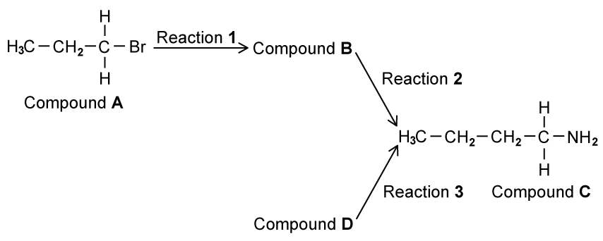{.question-figure fig-alt="Reaction sequence from 1-bromopropane to butylamine"}

**(a)**

i. Name compound A.

ii. Reaction 1 heats compound A under reflux with an ethanolic solution of potassium cyanide. Draw the mechanism for the reaction of compound A with the ethanolic solution of potassium cyanide to form compound B. Identify the ion that reacts with compound A, draw compound B, and include all charges, partial charges, lone pairs and curly arrows. [5 marks]

**(b)** In reaction 2, vapours of compound B are converted into compound C by reacting them with hydrogen gas over a nickel catalyst. Name the type of reaction that occurs in reaction 2. [1 mark]

**(c)** Compound C can also be produced in a single step from compound D.

i. Draw the displayed formula of compound D.

ii. State suitable reagents and conditions for reaction 3. [3 marks]

**(d)** Compound C is a primary amine as there is one alkyl chain attached to the nitrogen atom. Draw the skeletal formula of compound C’s two isomers, which are also primary amines. [2 marks]

Show detailed reference answer

<strong>(a)</strong> Compound A is 1-bromopropane. The reacting ion is :CN−; the negative charge may be shown on carbon or over the ion. Put δ+ on the carbon of C-Br and δ− on Br. Draw a curly arrow from the cyanide lone pair to the carbon and another from the C-Br bond to Br−. The product B is butanenitrile, CH3CH2CH2CN.

<strong>(b)</strong> Reduction: compound B gains hydrogen to form a primary amine.

<strong>(c)</strong> Compound D is 1-bromobutane, CH3CH2CH2CH2Br. Use excess ammonia in ethanol, heated under pressure.

<strong>(d)</strong> Any two valid primary-amine isomers of butylamine, for example butan-2-amine, 2-methylpropan-1-amine and 2-methylpropan-2-amine. Their structures must have the same formula but only one alkyl chain attached to nitrogen.

:::

::: {.question-card #n19-sq-m3}
### Question 6 · 3.7 SQ Medium Q3

Propanal undergoes nucleophilic addition with a mixture of HCN and NaCN to make 2-hydroxybutanenitrile, CH3CH2CH(OH)CN.

The mechanism for this reaction occurs in two main steps. The first step involves a nucleophile attacking the carbonyl carbon of propanal.

**(a)** Explain which species acts as the nucleophile during this reaction. [2 marks]

**(b)** The second step in the mechanism involves an intermediate species, CH3CH2C(O−H)CN, reacting with HCN to form 2-hydroxybutanenitrile. Draw the mechanism for this step. Identify the intermediate species that reacts with HCN. Include all charges, partial charges, lone pairs and curly arrows. [3 marks]

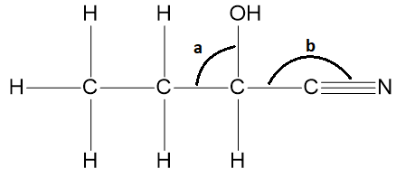{.question-figure fig-alt="Bond angles a and b in 2-hydroxybutanenitrile"}

**(c)** Predict the values for the bond angles a and b shown in the diagram. [2 marks]

**(d)** The product 2-hydroxybutanenitrile exists as a pair of stereoisomers.

i. Name the type of stereoisomerism shown by 2-hydroxybutanenitrile.

ii. Draw three-dimensional diagrams of this pair of stereoisomers. Indicate with an asterisk (*) the chiral centre on one of the structures drawn. [4 marks]

Show detailed reference answer

<strong>(a)</strong> The cyanide ion, CN−, is the nucleophile because it has an available lone pair and can donate an electron pair to the δ+ carbonyl carbon.

<strong>(b)</strong> The oxygen anion in the intermediate uses a lone pair to take a proton from HCN. Draw a curly arrow from oxygen to H, and a curly arrow from the H-CN bond back to carbon, regenerating CN−. The intermediate must show the negative charge and lone pair on oxygen.

<strong>(c)</strong> <strong>a = 109.5°</strong> because the carbon is tetrahedral; <strong>b = 180°</strong> because the nitrile carbon is linear and has a C≡N bond.

<strong>(d)</strong> Optical stereoisomerism. The chiral centre is attached to OH, CN, H and the ethyl group. Draw one three-dimensional arrangement and its mirror image; mark the chiral centre with an asterisk.

:::

::: {.question-card #n19-sq-m4}
### Question 7 · 3.7 SQ Medium Q4

Two students try to prepare butanoic acid from a halogenoalkane. Both students perform a nucleophilic substitution reaction to form P in reaction 1 of Fig. 1.1. They both form butanoic acid from P but student A uses a single reaction, while student B uses two reactions.

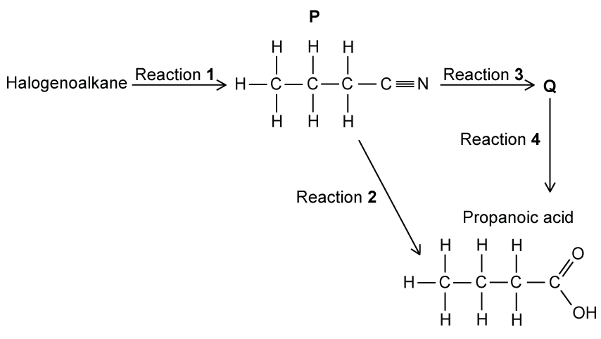{.question-figure fig-alt="Routes from a halogenoalkane through a nitrile to butanoic acid"}

**(a)**

i. State the reagents and conditions required for reaction 1.

ii. Student A uses 1-bromopropane to form P. Student B uses a different halogenoalkane which forms P at a slower rate. Suggest the identity of the halogenoalkane that student B uses. Explain your answer. [4 marks]

**(b)** Student A converts P into butanoic acid in a single step, reaction 2.

i. Name the type of reaction occurring in reaction 2.

ii. State an appropriate reagent for reaction 2 and name the other product of the reaction. [2 marks]

**(c)** Student B converts P into Q using dilute sodium hydroxide in reaction 3. This is followed by acidification of the product in reaction 4 to form butanoic acid. Draw the structural formula of Q. [1 mark]

**(d)** Explain why it is likely that student A will have a higher overall yield of butanoic acid from their halogenoalkane than student B. [2 marks]

Show detailed reference answer

<strong>(a)</strong> Heat under reflux with KCN or NaCN in ethanol. Student B could use 1-chloropropane, because the C-Cl bond is stronger than the C-Br bond; therefore it reacts more slowly in nucleophilic substitution.

<strong>(b)</strong> Acid hydrolysis. Use dilute hydrochloric acid and heat under reflux; the other product is ammonium chloride. Sulfuric acid/ammonium sulfate or nitric acid/ammonium nitrate are also acceptable acid/salt pairs.

<strong>(c)</strong> Q is sodium butanoate, CH3CH2CH2COO−Na+.

<strong>(d)</strong> Student A uses fewer reaction steps. Product is lost in each step, so the route with more steps is expected to have the lower overall yield.

:::

### 19 Nitrogen compounds — Structured: Hard

::: {.question-card #n19-sq-h1}
### Question 8 · 3.7 SQ Hard Q1

Compound X is produced from cyclohexene. An amine which is a relatively weak base containing one nitrogen atom can be produced from compound X in one step.

**(a)** Outline a mechanism for the formation of compound X from cyclohexene. You will need to give suitable reagents in your answer. [3 marks]

**(b)** One condition that is needed to convert compound X into the amine molecule is that the reagent needs to be in excess.

i. State the reagent and any other required conditions for the reaction.

ii. Suggest why the reagent needs to be in excess. [4 marks]

**(c)** Propylamine acts as a Brønsted-Lowry base when it reacts with water. Suggest an equation to show how propylamine reacts when mixed with water. [1 mark]

Show detailed reference answer

<strong>(a)</strong> Use HBr, HCl or HI. The alkene π bond attacks H+ from the hydrogen halide, the H-X bond breaks towards X, and the resulting carbocation is attacked by X−. The product X is a halogenoalkane such as bromocyclohexane.

<strong>(b)</strong> Use excess ammonia in ethanol under pressure or in a sealed tube. Excess ammonia prevents the amine product from attacking another molecule of the halogenoalkane, reducing formation of secondary amines.

<strong>(c)</strong> CH3CH2CH2NH2 + H2O ⇌ CH3CH2CH2NH3+ + OH−.

:::

::: {.question-card #n19-sq-h2}
### Question 9 · 3.7 SQ Hard Q2

2-hydroxy-2-phenylpropanenitrile is shown in Fig. 2.1.

{.question-figure fig-alt="2-hydroxy-2-phenylpropanenitrile in Fig. 2.1"}

**(a)** Deduce the number of sigma (σ) and pi (π) bonds in 2-hydroxy-2-phenylpropanenitrile. [2 marks]

**(b)** A molecule of 2-hydroxy-2-phenylpropanenitrile contains sp and sp2 hybridised carbon atoms. State the number of sp, sp2 and sp3 hybridised carbon atoms in a molecule of 2-hydroxy-2-phenylpropanenitrile. [3 marks]

**(c)** 2-hydroxy-2-phenylpropanenitrile can be produced from compound X, a secondary alcohol, in a two-step synthesis.

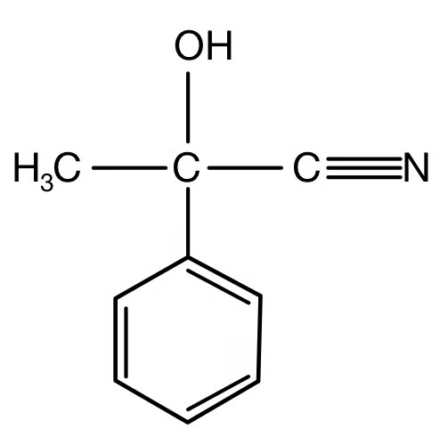{.question-figure fig-alt="Product structure shown beside the two-step synthesis"}

State the reagents and conditions required for step 1 and step 2. [4 marks]

**(d)**

i. Draw the mechanism for the second step in the synthesis of 2-hydroxy-2-phenylpropanenitrile. Clearly show the structure of compound Y and any intermediate formed and include all relevant charges, partial charges, curly arrows and lone pairs.

ii. Draw the structure of compound X. [7 marks]

Show detailed reference answer

<strong>(a)</strong> σ = 20 and π = 5. Count every single bond as one σ bond; each double bond contributes one σ and one π bond; the triple C≡N contributes one σ and two π bonds.

<strong>(b)</strong> sp = 1, sp2 = 6 and sp3 = 2. The nitrile carbon is sp; the six aromatic carbons are sp2; the methyl carbon and the tetrahedral carbon bearing OH and CN are sp3.

<strong>(c)</strong> Step 1: acidified potassium dichromate(VI) or acidified potassium manganate(VII), heated, to oxidise the secondary alcohol to a ketone. Step 2: HCN with KCN as catalyst, heated, to add CN and H across the carbonyl group.

<strong>(d)</strong> Compound Y is the ketone. Draw CN− attacking the δ+ carbonyl carbon, the C=O π bond moving to oxygen, the negatively charged oxygen intermediate, then proton transfer from HCN with regeneration of CN−. Compound X is the corresponding secondary alcohol, obtained by replacing C=O in Y with C(OH)H.

:::

::: {.question-card #n19-sq-h3}
### Question 10 · 3.7 SQ Hard Q3

2,2-dimethylpentanenitrile is useful in the synthesis of a variety of medicines and pharmaceuticals.

**(a)** Draw the skeletal formula of 2,2-dimethylpentanenitrile. [1 mark]

**(b)** 2,2-dimethylpentanenitrile undergoes hydrolysis when heated with dilute hydrochloric acid. Write an equation for the hydrolysis of 2,2-dimethylpentanenitrile. [2 marks]

**(c)** 2,2-dimethylpentanoic acid can also be produced by the hydrolysis of 2,2-dimethylpentanenitrile using sodium hydroxide but this occurs in two steps.

i. Draw the fully displayed formula of the intermediate organic product.

ii. State the other product formed with this intermediate organic product.

iii. State the type of reaction that is required to produce 2,2-dimethylpentanoic acid from this intermediate organic product. [3 marks]

Show detailed reference answer

<strong>(a)</strong> The nitrile carbon is carbon 1 and is included in the pentanenitrile chain. A suitable condensed representation is CH3CH2CH2C(CH3)2CN; the skeletal drawing must show two methyl branches on carbon 2.

<strong>(b)</strong> CH3CH2CH2C(CH3)2CN + HCl + 2H2O → CH3CH2CH2C(CH3)2COOH + NH4Cl.

<strong>(c)</strong> The intermediate is the sodium carboxylate, CH3CH2CH2C(CH3)2COO−Na+. The other product is ammonia. The final step is acidification, converting the carboxylate ion into 2,2-dimethylpentanoic acid.

:::

## Chapter checklist

- [ ] I can identify and name primary amines and nitriles.
- [ ] I can state the reagents and conditions for forming a primary amine.
- [ ] I can explain nucleophilic substitution by ammonia or cyanide ions.
- [ ] I can count the extra carbon introduced by cyanide substitution.
- [ ] I can distinguish acid and alkaline nitrile hydrolysis.
- [ ] I can describe nucleophilic addition of HCN and the associated mechanism.
- [ ] I can identify chiral centres, optical isomerism, bond angles and hybridisation.

## Original question PDFs

- [3.7 Nitrogen compounds - Choice - Easy](../assets/questions/original-source/3.7_nitrogen_compounds___choice___easy.pdf)
- [3.7 Nitrogen compounds - Choice - Medium](../assets/questions/original-source/3.7_nitrogen_compounds___choice___medium.pdf)
- [3.7 Nitrogen compounds - Choice - Hard](../assets/questions/original-source/3.7_nitrogen_compounds___choice___hard.pdf)
- [3.7 Nitrogen compounds - SQ - Easy](../assets/questions/original-source/3.7_nitrogen_compounds___sq___easy.pdf)
- [3.7 Nitrogen compounds - SQ - Medium](../assets/questions/original-source/3.7_nitrogen_compounds___sq___medium.pdf)
- [3.7 Nitrogen compounds - SQ - Hard](../assets/questions/original-source/3.7_nitrogen_compounds___sq___hard.pdf)
