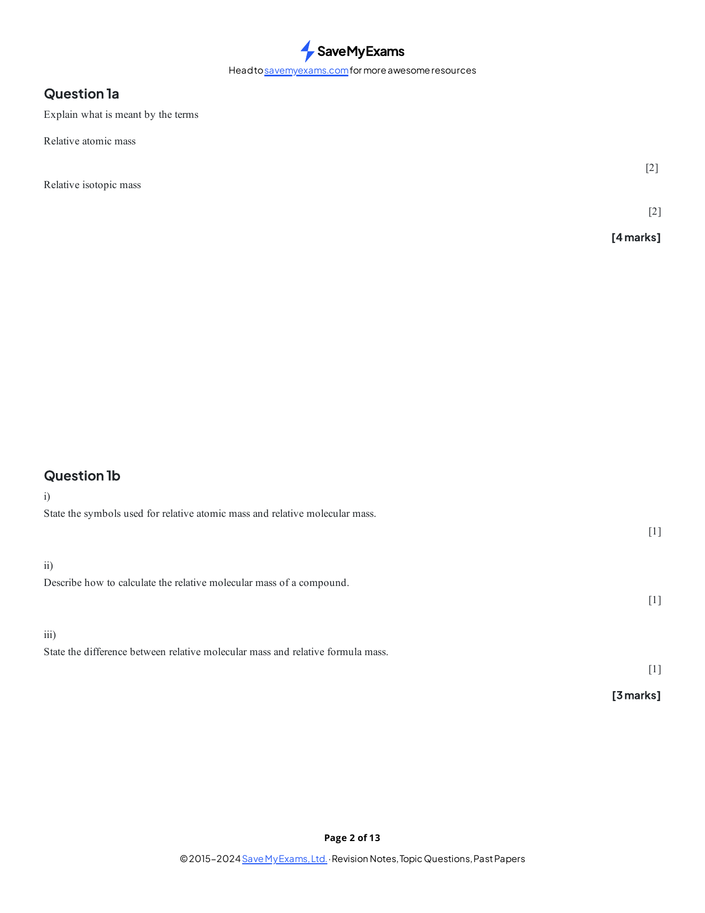
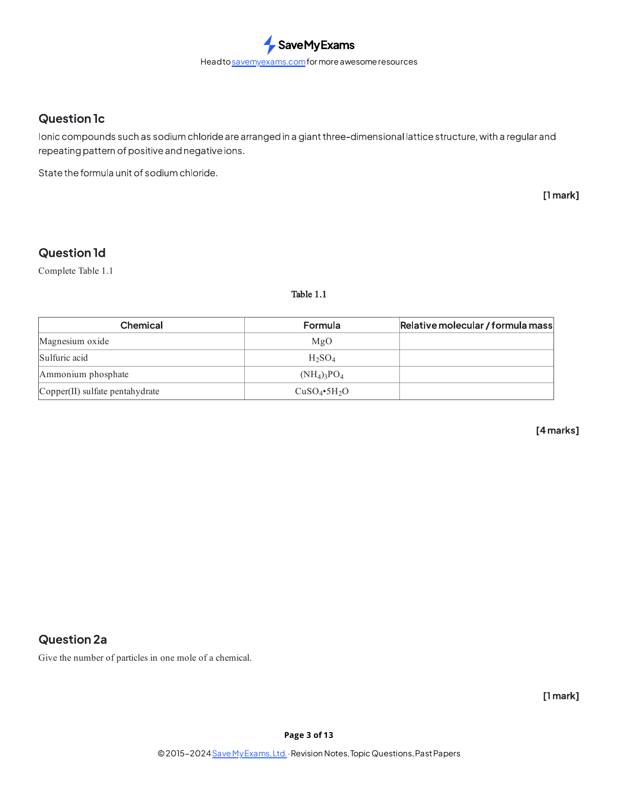
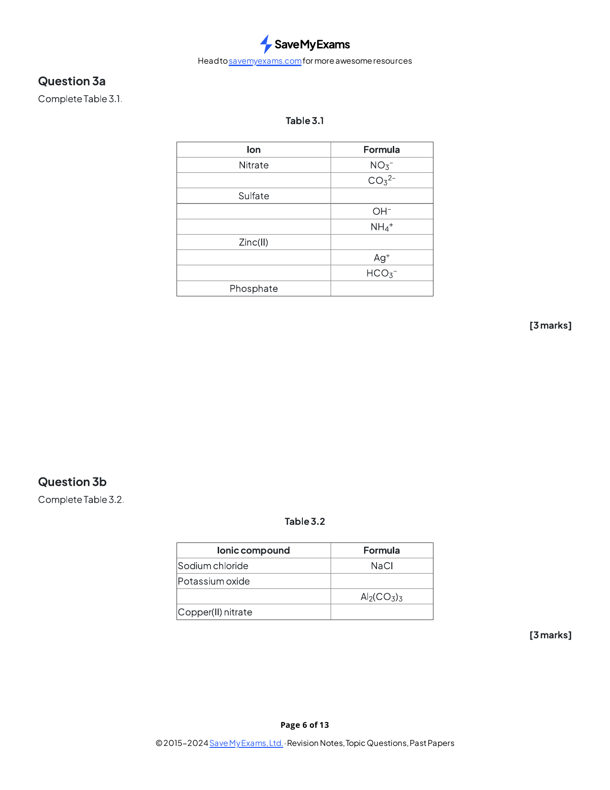
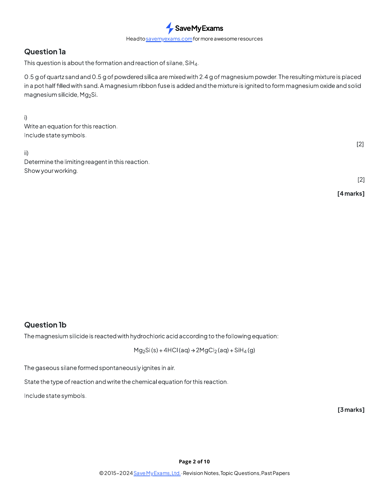
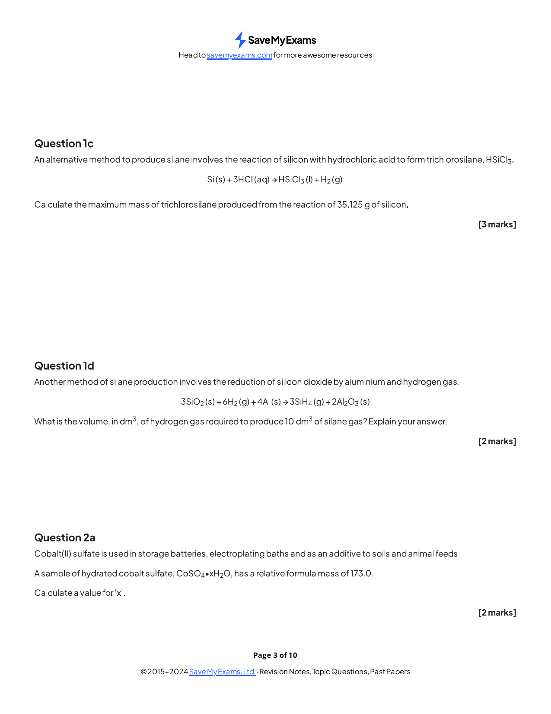
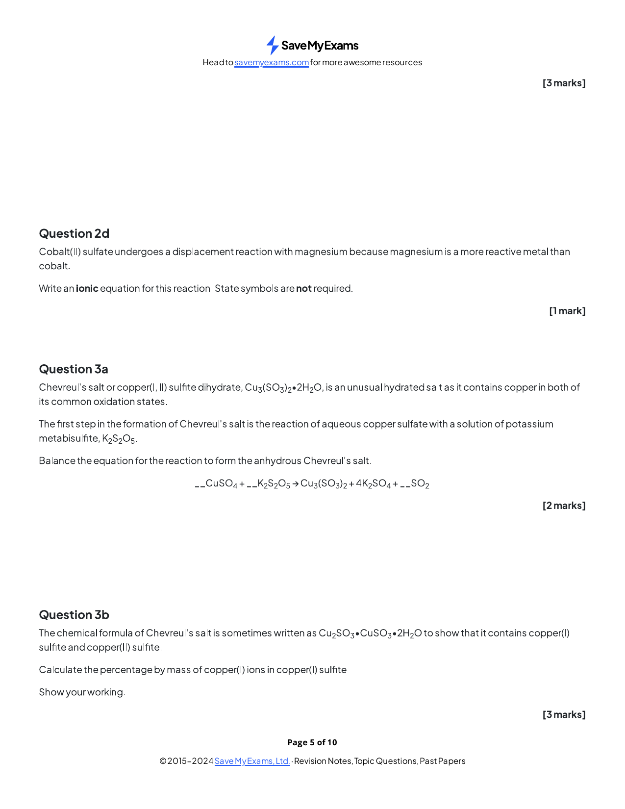
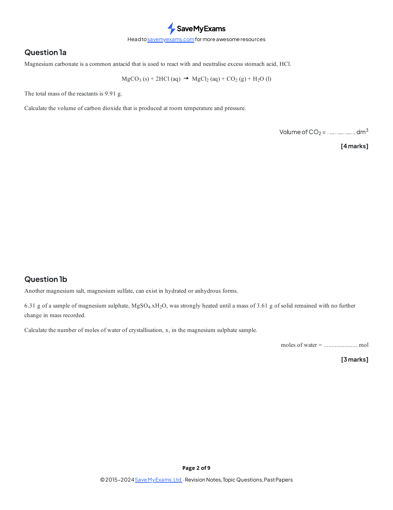
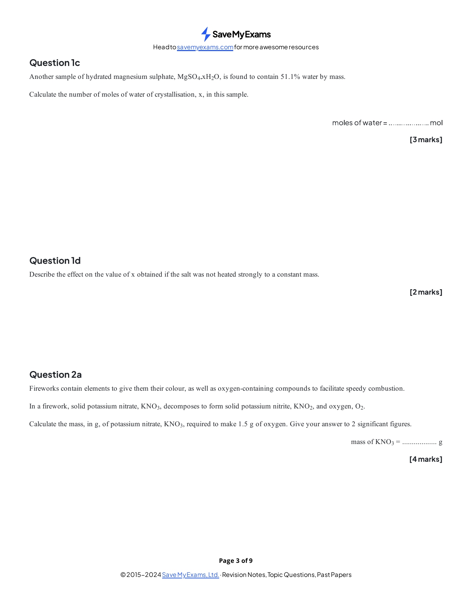
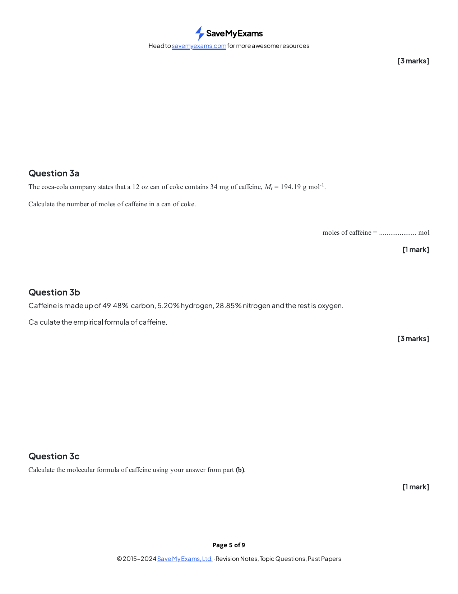
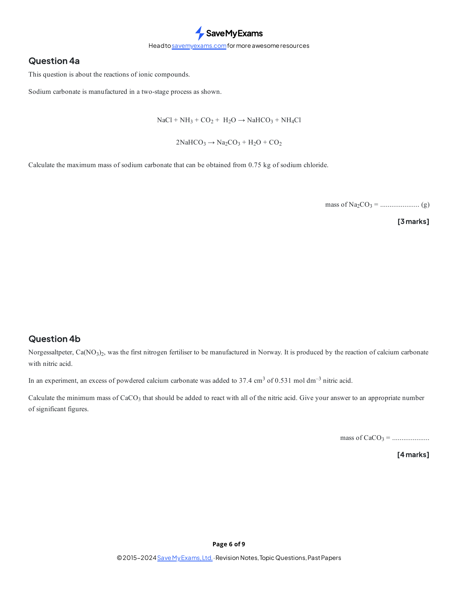

### 2 Atoms, molecules and stoichiometry - Structured Questions: Easy

::: {.question-card}
### Example 1 · Relative masses and formula units · 1.2 SQ Easy Q1

Original question page · 1.2 SQ Easy Q1

{.question-figure fig-alt="Original question page 1.2 SQ Easy Q1"}

**(a)** Define relative isotopic mass and relative atomic mass. `[2 marks]`

**(b)** State what the symbols $A_r$ and $M_r$ represent. Explain the difference between relative molecular mass and relative formula mass. `[3 marks]`

**(c)** Calculate the relative formula mass of $\ce{MgO}$, $\ce{H2SO4}$, $(\ce{NH4})3\ce{PO4}$ and $\ce{CuSO4.5H2O}$. Use $A_r$: H = 1.0, C = 12.0, N = 14.0, O = 16.0, P = 31.0, S = 32.1, Mg = 24.3, Cu = 63.5. `[4 marks]`

Show mark scheme / model answer
<ul><li><strong>(a)</strong> Relative isotopic mass compares an isotope with $\frac{1}{12}$ of a carbon-12 atom. Relative atomic mass is the weighted mean of the isotopic masses of an element on the same scale.</li><li><strong>(b)</strong> $A_r$ is relative atomic mass and $M_r$ is relative molecular or formula mass. A molecular mass refers to one molecule; a formula mass is used for an ionic lattice or giant structure.</li><li><strong>(c)</strong> $M_r(\ce{MgO})=40.3$; $M_r(\ce{H2SO4})=98.1$; $M_r((\ce{NH4})3\ce{PO4})=149.0$; $M_r(\ce{CuSO4.5H2O})=249.5$.</li></ul>

:::

::: {.question-card}
### Example 2 · Moles and particles · 1.2 SQ Easy Q2

Original question page · 1.2 SQ Easy Q2

{.question-figure fig-alt="Original question page 1.2 SQ Easy Q2"}

**(a)** State the Avogadro constant and explain what one mole of a substance contains. `[2 marks]`

**(b)** Calculate the number of molecules and the total number of atoms in $1.00\ \mathrm{mol}$ of water. `[3 marks]`

**(c)** Calculate the number of sodium ions, carbonate ions and total ions in $1.00\ \mathrm{mol}$ of $\ce{Na2CO3}$. `[3 marks]`

Show mark scheme / model answer
<ul><li><strong>(a)</strong> $L=6.02\times10^{23}\ \mathrm{mol^{-1}}$; one mole contains $6.02\times10^{23}$ specified particles.</li><li><strong>(b)</strong> $6.02\times10^{23}$ water molecules. Each has three atoms, so total atoms $=1.806\times10^{24}$.</li><li><strong>(c)</strong> There are $2\times6.02\times10^{23}=1.204\times10^{24}$ sodium ions and $6.02\times10^{23}$ carbonate ions. Total ions $=1.806\times10^{24}$.</li></ul>

:::

::: {.question-card}
### Example 3 · Empirical and molecular formulae · 1.2 SQ Easy Q3

Original question page · 1.2 SQ Easy Q3

{.question-figure fig-alt="Original question page 1.2 SQ Easy Q3"}

A compound contains 40.0% carbon, 6.7% hydrogen and 53.3% oxygen by mass. Its relative molecular mass is 180.

**(a)** Determine its empirical formula. `[3 marks]`

**(b)** Determine its molecular formula. `[2 marks]`

**(c)** Explain why percentages can be treated as masses in a 100 g sample. `[1 mark]`

Show mark scheme / model answer
<ul><li><strong>(a)</strong> For 100 g: C $=40.0/12.0=3.33$; H $=6.7/1.0=6.70$; O $=53.3/16.0=3.33$. Divide by 3.33 to obtain $\ce{CH2O}$.</li><li><strong>(b)</strong> Empirical formula mass $=30.0$; multiplier $=180/30.0=6$, so molecular formula $\ce{C6H12O6}$.</li><li><strong>(c)</strong> In a 100 g sample, each percentage has the same numerical value in grams.</li></ul>

:::

### 2 Atoms, molecules and stoichiometry - Structured Questions: Medium

::: {.question-card}
### Example 4 · Limiting reagent and silane · 1.2 SQ Medium Q1

Original question page · 1.2 SQ Medium Q1

{.question-figure fig-alt="Original question page 1.2 SQ Medium Q1"}

Magnesium reacts with a mixture containing $0.500\ \mathrm{g}$ of quartz sand, $0.500\ \mathrm{g}$ of powdered silica and $2.40\ \mathrm{g}$ of magnesium. The silica is represented by $\ce{SiO2}$.

**(a)** Write an equation for the formation of magnesium oxide from silica and identify the limiting reagent using amounts in moles. `[4 marks]`

**(b)** Silicon magnesium, $\ce{Mg2Si}$, reacts with hydrochloric acid to form silane, $\ce{SiH4}$. Write the balanced equation and classify the reaction of silane with oxygen as combustion, redox or neutralisation. `[3 marks]`

**(c)** Calculate the maximum mass of $\ce{HSiCl3}$ formed if $35.125\ \mathrm{g}$ of silicon reacts according to $\ce{Si + 3HCl -> HSiCl3 + H2}$. `[3 marks]`

Show mark scheme / model answer
<ul><li><strong>(a)</strong> $\ce{2Mg + SiO2 -> 2MgO + Si}$. $n(\ce{Mg})=2.40/24.3=0.0988\ \mathrm{mol}$; $n(\ce{SiO2})$ in the two samples is about $0.0167\ \mathrm{mol}$. Magnesium is in excess for this equation; silica is limiting.</li><li><strong>(b)</strong> $\ce{Mg2Si + 4HCl -> 2MgCl2 + SiH4}$. Burning silane is a combustion reaction and also a redox reaction.</li><li><strong>(c)</strong> $n(\ce{Si})=35.125/28.1=1.25\ \mathrm{mol}$. The equation gives $1.25\ \mathrm{mol}$ $\ce{HSiCl3}$; mass $=1.25\times135.5=169\ \mathrm{g}$.</li></ul>

:::

::: {.question-card}
### Example 5 · Hydrated salts · 1.2 SQ Medium Q2

Original question page · 1.2 SQ Medium Q2

{.question-figure fig-alt="Original question page 1.2 SQ Medium Q2"}

A hydrated cobalt sulfate has formula $\ce{CoSO4.xH2O}$ and relative formula mass 173.0. Use $A_r$: Co = 59.0, S = 32.0, O = 16.0 and H = 1.0.

**(a)** Calculate the value of $x$. `[3 marks]`

**(b)** A $2.00\ \mathrm{g}$ sample of the hydrate is heated to constant mass. The residue is $1.09\ \mathrm{g}$. Calculate the amount of water removed. `[2 marks]`

**(c)** State why heating is continued to constant mass. `[1 mark]`

Show mark scheme / model answer
<ul><li><strong>(a)</strong> The anhydrous part has mass $59.0+32.0+64.0=155.0$. Water contributes $18.0x=173.0-155.0=18.0$, so $x=1$ and the formula is $\ce{CoSO4.H2O}$.</li><li><strong>(b)</strong> Water lost $=0.91\ \mathrm{g}$; amount $=0.91/18.0=0.0506\ \mathrm{mol}$.</li><li><strong>(c)</strong> To ensure all water of crystallisation has been removed and the mass is no longer changing.</li></ul>

:::

::: {.question-card}
### Example 6 · Concentration and gas volume · 1.2 SQ Medium Q3

Original question page · 1.2 SQ Medium Q3

{.question-figure fig-alt="Original question page 1.2 SQ Medium Q3"}

Hydrogen reacts with nitrogen:

$$\ce{N2 + 3H2 -> 2NH3}$$

**(a)** Calculate the amount of nitrogen in $10.0\ \mathrm{dm^3}$ of nitrogen gas at RTP. `[1 mark]`

**(b)** Calculate the volume of hydrogen needed for complete reaction with this nitrogen. `[2 marks]`

**(c)** A solution contains $0.250\ \mathrm{mol}$ of ammonia in $500\ \mathrm{cm^3}$. Calculate its concentration in $\mathrm{mol\ dm^{-3}}$. `[2 marks]`

Show mark scheme / model answer
<ul><li><strong>(a)</strong> $n=10.0/24.0=0.417\ \mathrm{mol}$.</li><li><strong>(b)</strong> $n(\ce{H2})=3\times0.417=1.25\ \mathrm{mol}$; volume $=1.25\times24.0=30.0\ \mathrm{dm^3}$.</li><li><strong>(c)</strong> $500\ \mathrm{cm^3}=0.500\ \mathrm{dm^3}$, so $c=0.250/0.500=0.500\ \mathrm{mol\ dm^{-3}}$.</li></ul>

:::

### 2 Atoms, molecules and stoichiometry - Structured Questions: Hard

::: {.question-card}
### Example 7 · Combustion with a limiting gas · 1.2 SQ Hard Q1

Original question page · 1.2 SQ Hard Q1

{.question-figure fig-alt="Original question page 1.2 SQ Hard Q1"}

A $1.00\ \mathrm{g}$ sample of carbon reacts with a limited amount of oxygen. Half of the carbon forms $\ce{CO2}$ and half forms $\ce{CO}$.

**(a)** Write the two balanced equations for the reactions. `[2 marks]`

**(b)** Calculate the total amount of oxygen atoms used. `[2 marks]`

**(c)** The mixture of carbon oxides is passed through excess sodium hydroxide solution. Calculate the volume of gas remaining at RTP. `[2 marks]`

Show mark scheme / model answer
<ul><li><strong>(a)</strong> $\ce{C + O2 -> CO2}$ and $\ce{2C + O2 -> 2CO}$.</li><li><strong>(b)</strong> Carbon amount is $1.00/12.0=0.0833\ \mathrm{mol}$; half forms each oxide. Oxygen atoms used $=0.0417\times2+0.0417\times1=0.125\ \mathrm{mol}$.</li><li><strong>(c)</strong> Sodium hydroxide absorbs $\ce{CO2}$ while $\ce{CO}$ remains. The remaining amount is $0.0417\ \mathrm{mol}$, so its volume is $0.0417\times24.0=1.00\ \mathrm{dm^3}$.</li></ul>

:::

::: {.question-card}
### Example 8 · Carbonate neutralisation · 1.2 SQ Hard Q2

Original question page · 1.2 SQ Hard Q2

{.question-figure fig-alt="Original question page 1.2 SQ Hard Q2"}

An eggshell contains 5.0% $\ce{CaCO3}$ by mass. Ethanoic acid reacts with the carbonate:

$$\ce{CaCO3 + 2CH3COOH -> Ca(CH3COO)2 + H2O + CO2}$$

**(a)** Calculate the amount of ethanoic acid in $50.0\ \mathrm{cm^3}$ of $2.00\ \mathrm{mol\ dm^{-3}}$ solution. `[1 mark]`

**(b)** Calculate the mass of $\ce{CaCO3}$ neutralised. `[2 marks]`

**(c)** If each eggshell has mass $50.0\ \mathrm{g}$, calculate the number of eggshells needed. `[2 marks]`

Show mark scheme / model answer
<ul><li><strong>(a)</strong> $n=cV=2.00\times0.0500=0.100\ \mathrm{mol}$.</li><li><strong>(b)</strong> Carbonate amount $=0.100/2=0.0500\ \mathrm{mol}$; mass $=0.0500\times100=5.00\ \mathrm{g}$.</li><li><strong>(c)</strong> One shell contains $0.050\times50.0=2.50\ \mathrm{g}$ $\ce{CaCO3}$, so $5.00/2.50=2$ shells.</li></ul>

:::

::: {.question-card}
### Example 9 · Titration of potassium oxide · 1.2 SQ Hard Q3

Original question page · 1.2 SQ Hard Q3

{.question-figure fig-alt="Original question page 1.2 SQ Hard Q3"}

A sample of $\ce{K2O}$ is dissolved and made up to $250\ \mathrm{cm^3}$. A $25.0\ \mathrm{cm^3}$ portion requires $15.0\ \mathrm{cm^3}$ of $2.00\ \mathrm{mol\ dm^{-3}}$ sulfuric acid.

$$\ce{K2O + H2SO4 -> K2SO4 + H2O}$$

**(a)** Calculate the amount of sulfuric acid used in the aliquot. `[1 mark]`

**(b)** Calculate the amount and mass of $\ce{K2O}$ in the original sample. `[4 marks]`

**(c)** Explain why the aliquot volume must be converted to $\mathrm{dm^3}$ before using $n=cV$. `[1 mark]`

Show mark scheme / model answer
<ul><li><strong>(a)</strong> $n=2.00\times0.0150=0.0300\ \mathrm{mol}$.</li><li><strong>(b)</strong> The equation is 1:1, so the aliquot contains $0.0300\ \mathrm{mol}$ $\ce{K2O}$. The full solution contains $10\times0.0300=0.300\ \mathrm{mol}$; mass $=0.300\times94.2=28.3\ \mathrm{g}$.</li><li><strong>(c)</strong> The concentration unit is $\mathrm{mol\ dm^{-3}}$, so the volume must be in $\mathrm{dm^3}$ for the units to cancel correctly.</li></ul>

:::

::: {.question-card}
### Example 10 · Iron percentage by redox titration · 1.2 SQ Hard Q4

Original question page · 1.2 SQ Hard Q4

{.question-figure fig-alt="Original question page 1.2 SQ Hard Q4"}

A $1.00\ \mathrm{g}$ ferrochrome sample is dissolved. The iron(II) ions require $13.1\ \mathrm{cm^3}$ of $0.100\ \mathrm{mol\ dm^{-3}}$ dichromate solution. In the redox reaction, one mole of dichromate reacts with six moles of iron(II).

**(a)** Calculate the amount of dichromate used. `[1 mark]`

**(b)** Calculate the amount and mass of iron in the sample. `[3 marks]`

**(c)** Calculate the percentage by mass of iron. `[1 mark]`

Show mark scheme / model answer
<ul><li><strong>(a)</strong> $n=0.100\times0.0131=0.00131\ \mathrm{mol}$.</li><li><strong>(b)</strong> $n(\ce{Fe^{2+}})=6\times0.00131=0.00786\ \mathrm{mol}$; mass of iron $=0.00786\times55.8=0.439\ \mathrm{g}$.</li><li><strong>(c)</strong> Percentage $=(0.439/1.00)\times100=43.9\%$.</li></ul>

:::
