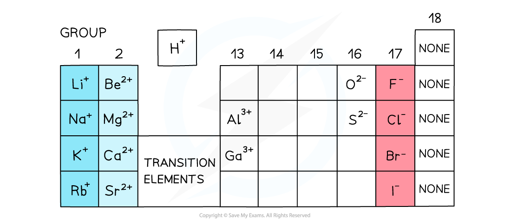

# 2 Atoms, molecules and stoichiometry

本章对应 CIE 9701 AS Chemistry 的 **Atoms, molecules and stoichiometry**。内容覆盖 relative atomic / molecular / formula mass、the mole、Avogadro constant、empirical and molecular formulae，以及 reacting masses、limiting reagents、solutions、gas volumes 与 percentage yield。

## Learning objectives

学完本章后，你应该能够：

- define and calculate relative isotopic mass, relative atomic mass, relative molecular mass and relative formula mass;
- use the mole and Avogadro constant to convert between mass, amount and number of particles;
- calculate the volume of a gas at room temperature and pressure;
- determine empirical and molecular formulae from composition data;
- write formulae for ionic compounds and balance chemical equations;
- use balanced equations to calculate reacting masses, solution concentrations and gas volumes;
- identify a limiting reagent and calculate theoretical yield and percentage yield;
- write net ionic equations by removing spectator ions.

## 2.1 Relative Masses of Atoms - Molecules

::: {.study-card}
### Relative isotopic mass and relative atomic mass

The **relative isotopic mass** of an isotope is its mass compared with $\frac{1}{12}$ of the mass of one carbon-12 atom. It has no unit.

The **relative atomic mass**, $A_r$, is the weighted mean mass of an atom of an element compared with $\frac{1}{12}$ of the mass of one carbon-12 atom. It takes account of the abundance of each isotope:

$$A_r=\frac{\sum(\text{isotopic mass}\times\text{percentage abundance})}{100}$$

For example, if an element has isotope masses 10.0 and 11.0 with abundances 20% and 80%:

$$A_r=\frac{(10.0\times20)+(11.0\times80)}{100}=10.8$$

Do not use a simple arithmetic mean unless the isotopes have equal abundance.
:::

::: {.worked-example}
Worked example · Weighted isotope average

### Calculating the relative atomic mass of chlorine

Chlorine contains $^{35}\ce{Cl}$ with abundance 75.8% and $^{37}\ce{Cl}$ with abundance 24.2%. Calculate $A_r(\ce{Cl})$.

$$A_r(\ce{Cl})=\frac{(35\times75.8)+(37\times24.2)}{100}=35.48\approx35.5$$

:::

::: {.study-card}
### Relative molecular mass and relative formula mass

The **relative molecular mass**, $M_r$, is the sum of the relative atomic masses of all atoms in one molecule. For water:

$$M_r(\ce{H2O})=(2\times1.0)+16.0=18.0$$

The **relative formula mass** is used for ionic compounds and giant covalent structures, which do not contain separate molecules. It is calculated in the same way from the formula unit. For ammonium sulfate:

$$M_r[\ce{(NH4)2SO4}]=(2\times14.0)+(8\times1.0)+32.1+(4\times16.0)=132.1$$

Relative masses are ratios, so they have no units.
:::

## 2.2 The Mole - the Avogadro Constant

::: {.formula-panel}
### The mole

One mole of any substance contains the same number of specified particles. This number is the **Avogadro constant**, $L$ or $N_A$:

$$L=6.02\times10^{23}\ \mathrm{mol^{-1}}$$

The particles may be atoms, molecules, ions, electrons or formula units. Always state which particles are being counted.

$$n=\frac{N}{L}\qquad N=nL$$

where $n$ is amount in mol and $N$ is number of particles.
:::

::: {.study-card}
### Moles, mass and molar mass

The molar mass has the same numerical value as $A_r$ or $M_r$, but its unit is $\mathrm{g\ mol^{-1}}$:

$$n=\frac{m}{M}\qquad m=nM$$

For a compound, use its relative molecular or formula mass as the numerical value of $M$. For example, 0.250 mol of $\ce{CO2}$ has mass:

$$m=0.250\times44.0=11.0\ \mathrm{g}$$
:::

::: {.worked-example}
Worked example · Atoms in a compound

### Counting atoms in water

Calculate the total number of atoms in 1.00 mol of water.

One water molecule contains 3 atoms. One mole contains $6.02\times10^{23}$ molecules:

$$N(\text{atoms})=3\times6.02\times10^{23}=1.806\times10^{24}\ \text{atoms}$$

:::

::: {.study-card}
### Molar gas volume at RTP

At room temperature and pressure (RTP), one mole of any gas occupies **24.0 dm$^3$**. Therefore:

$$n(\text{gas})=\frac{V(\text{gas in dm}^3)}{24.0}$$

Use $24.0\ \mathrm{dm^3\ mol^{-1}}$ for RTP questions. Convert $\mathrm{cm^3}$ to $\mathrm{dm^3}$ by dividing by 1000.
:::

## 2.3 Formulas

::: {.study-card}
### Empirical and molecular formulae

The **empirical formula** is the simplest whole-number ratio of atoms in a compound. The **molecular formula** shows the actual number of each atom in one molecule.

To determine an empirical formula from masses or percentages:

1. convert each mass or percentage to moles by dividing by $A_r$;
2. divide every value by the smallest value;
3. multiply all ratios by a small integer if necessary to obtain whole numbers;
4. write the empirical formula.

If the molecular mass is known:

$$\text{multiplier}=\frac{M_r(\text{compound})}{M_r(\text{empirical formula})}$$

Then multiply every subscript in the empirical formula by this integer.
:::

::: {.worked-example}
Worked example · Empirical formula

### Finding the formula from composition

A compound contains 52.2% carbon, 13.0% hydrogen and 34.8% oxygen by mass. Find its empirical formula.

For a 100 g sample:

$$n(\ce{C})=\frac{52.2}{12.0}=4.35,\quad n(\ce{H})=\frac{13.0}{1.0}=13.0,\quad n(\ce{O})=\frac{34.8}{16.0}=2.175$$

Divide by 2.175: $\ce{C2H6O}$. If $M_r=92$, the multiplier is $92/46=2$, so the molecular formula is $\ce{C4H12O2}$.

:::

::: {.study-card}
### Formulae of ions and compounds

An ionic compound is electrically neutral. Combine ions in the smallest whole-number ratio that makes the total charge zero:

| Ions | Formula |
|---|---|
| $\ce{Na+}$ and $\ce{Cl-}$ | $\ce{NaCl}$ |
| $\ce{Mg^{2+}}$ and $\ce{Cl-}$ | $\ce{MgCl2}$ |
| $\ce{Al^{3+}}$ and $\ce{SO4^{2-}}$ | $\ce{Al2(SO4)3}$ |
| $\ce{Ca^{2+}}$ and $\ce{PO4^{3-}}$ | $\ce{Ca3(PO4)2}$ |

Use brackets around a polyatomic ion when more than one copy is needed. A formula unit is the simplest ratio of ions in the lattice.

{.note-figure fig-alt="Common ion charges and formula patterns from the periodic table"}
:::

::: {.study-card}
### Balanced symbol equations and ionic equations

Balance equations by changing coefficients, never subscripts. The coefficients give mole ratios. Include state symbols when requested: $\ce{(s)}$, $\ce{(l)}$, $\ce{(g)}$, and $\ce{(aq)}$.

An ionic equation includes only the reacting particles. Remove spectator ions that are unchanged on both sides. For precipitation of silver chloride:

$$\ce{Ag+(aq)+Cl-(aq)->AgCl(s)}$$

Weak electrolytes such as ethanoic acid are normally kept as molecules in ionic equations.
:::

## 2.4 Reacting Masses - Volumes (of Solutions - Gases)

::: {.formula-panel}
### The stoichiometry pathway

For every reacting-quantity calculation:

1. write and balance the equation;
2. convert the known quantity to moles;
3. use the coefficient ratio to find the required moles;
4. convert to the requested mass, concentration, volume or number of particles.

$$n=\frac{m}{M}\qquad n=cV\qquad n=\frac{V_{gas}}{24.0}$$

For solution concentration, $V$ must be in $\mathrm{dm^3}$:

$$c=\frac{n}{V}$$
:::

::: {.study-card}
### Limiting reagent

The limiting reagent is completely used up first and determines the maximum amount of product. Do not choose the reactant with the smallest mass; compare the available moles with the mole ratio in the balanced equation.

For $\ce{2H2+O2->2H2O}$, 1 mol $\ce{O2}$ requires 2 mol $\ce{H2}$. If less than 2 mol $\ce{H2}$ is available per mol $\ce{O2}$, hydrogen is limiting.
:::

::: {.worked-example}
Worked example · Limiting reagent and yield

### Percentage yield

The **percentage yield** compares the actual product obtained with the theoretical product:

$$\%\text{ yield}=\frac{\text{actual yield}}{\text{theoretical yield}}\times100$$

If the theoretical mass is 4.86 g and the actual mass is 2.61 g:

$$\%\text{ yield}=\frac{2.61}{4.86}\times100=53.7\%$$

Use the theoretical yield from the balanced equation as the denominator; the actual yield cannot exceed it in a correctly measured experiment.

:::

::: {.study-card}
### Common unit conversions and checks

- $1000\ \mathrm{cm^3}=1.00\ \mathrm{dm^3}$;
- $1\ \mathrm{dm^3}=1\ \mathrm{L}$;
- at RTP, $24.0\ \mathrm{dm^3}$ gas = 1 mol;
- concentration in $\mathrm{mol\ dm^{-3}}$ multiplied by volume in $\mathrm{dm^3}$ gives moles;
- keep extra figures during calculations and round the final answer appropriately.

The most common errors are forgetting to balance first, using $\mathrm{cm^3}$ in $cV$, using 24.0 for a volume already in $\mathrm{cm^3}$, and ignoring the limiting reagent.
:::

## Chapter checklist

- [ ] 我能计算 relative isotopic / atomic / molecular / formula mass。
- [ ] 我能在 mass、moles、particles 与 gas volume 之间转换。
- [ ] 我能从组成数据求 empirical formula 和 molecular formula。
- [ ] 我能写 ionic compound formulae 并配平 equations。
- [ ] 我能判断 limiting reagent 并计算 percentage yield。
- [ ] 我能用 $c=n/V$ 和 $V_{gas}=24.0n$ 处理 solutions 与 gases。

## Multiple choice questions



## Structured questions



## Original note PDFs

- [2.1 Relative Masses of Atoms - Molecules](https://raw.githubusercontent.com/nanoxsj/CIE-Chemistry-Study/main/assets/notes/stoichiometry-2-rebuilt/2.1_relative_masses_atoms_molecules.pdf)
- [2.2 The Mole - the Avogadro Constant](https://raw.githubusercontent.com/nanoxsj/CIE-Chemistry-Study/main/assets/notes/stoichiometry-2-rebuilt/2.2_mole_avogadro_constant.pdf)
- [2.3 Formulas](https://raw.githubusercontent.com/nanoxsj/CIE-Chemistry-Study/main/assets/notes/stoichiometry-2-rebuilt/2.3_formulas.pdf)
- [2.4 Reacting Masses - Volumes (of Solutions - Gases)](https://raw.githubusercontent.com/nanoxsj/CIE-Chemistry-Study/main/assets/notes/stoichiometry-2-rebuilt/2.4_reacting_masses_volumes.pdf)

## Original question PDFs

- [1.2 Atoms, Molecules - Stoichiometry - Structured Questions - Easy](https://raw.githubusercontent.com/nanoxsj/CIE-Chemistry-Study/main/assets/questions/original-source/1.2_atoms_molecules_stoichiometry_sq_easy.pdf)
- [1.2 Atoms, Molecules - Stoichiometry - Structured Questions - Medium](https://raw.githubusercontent.com/nanoxsj/CIE-Chemistry-Study/main/assets/questions/original-source/1.2_atoms_molecules_stoichiometry_sq_medium.pdf)
- [1.2 Atoms, Molecules - Stoichiometry - Structured Questions - Hard](https://raw.githubusercontent.com/nanoxsj/CIE-Chemistry-Study/main/assets/questions/original-source/1.2_atoms_molecules_stoichiometry_sq_hard.pdf)
- [1.2 Atoms, Molecules - Stoichiometry - Multiple Choice - Easy](https://raw.githubusercontent.com/nanoxsj/CIE-Chemistry-Study/main/assets/questions/original-source/1.2_atoms_molecules_stoichiometry_choice_easy.pdf)
- [1.2 Atoms, Molecules - Stoichiometry - Multiple Choice - Medium](https://raw.githubusercontent.com/nanoxsj/CIE-Chemistry-Study/main/assets/questions/original-source/1.2_atoms_molecules_stoichiometry_choice_medium.pdf)
- [1.2 Atoms, Molecules - Stoichiometry - Multiple Choice - Hard](https://raw.githubusercontent.com/nanoxsj/CIE-Chemistry-Study/main/assets/questions/original-source/1.2_atoms_molecules_stoichiometry_choice_hard.pdf)
