# 20 Polymerisation

本章只覆盖 Cambridge International AS Level Chemistry 9701 的 **3.8 Polymerisation**，知识点对应 **20.1 Addition Polymerisation**。题目来自 Topical Past Papers/AS 中的 3.8 Polymerisation 题库；题目文字、选项、小问编号和分值均按原题保留。页面包含 20 道 multiple-choice questions 和 10 道 structured questions。不能独立提取的整页图不放入页面。

## Learning objectives

- define monomers, polymers, repeating units and addition polymerisation;
- identify a monomer from a polymer section and draw the repeat unit;
- explain that the alkene π bond opens and new C–C σ bonds join monomers;
- write polymerisation equations and name common addition polymers;
- explain saturation, bond angles, intermolecular forces, density and solubility;
- evaluate recycling, incineration and landfill;
- explain the environmental problems caused by PVC combustion.

## 20.1 Addition polymerisation

### Monomers, polymers and repeating units

Addition polymerisation occurs when many monomers containing at least one C=C bond join to form a long-chain polymer as the only product. The monomer is the small reactive molecule; the polymer contains many repeating units. The π part of each C=C is used to form new C–C σ bonds, while the carbon atoms remain connected by the original σ bond.

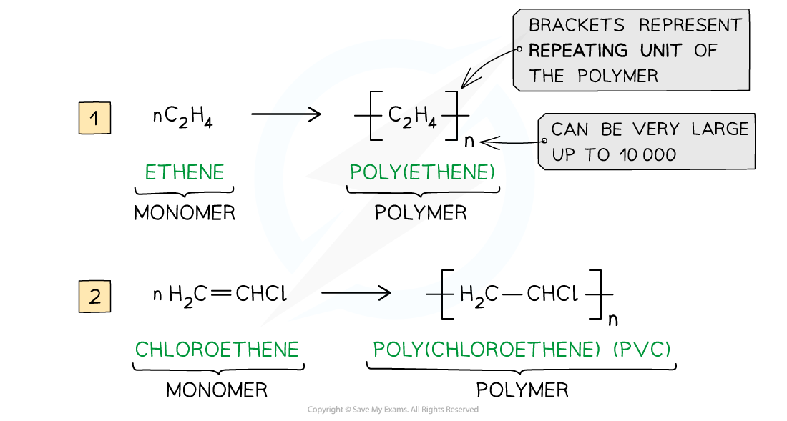{.concept-figure fig-alt="General addition polymerisation examples"}

The repeating unit is the smallest group of atoms that repeats along the chain. For a polymer made from one substituted alkene, it contains the two alkene carbons in the main chain. The groups attached to those carbons remain attached; only C=C changes to C–C.

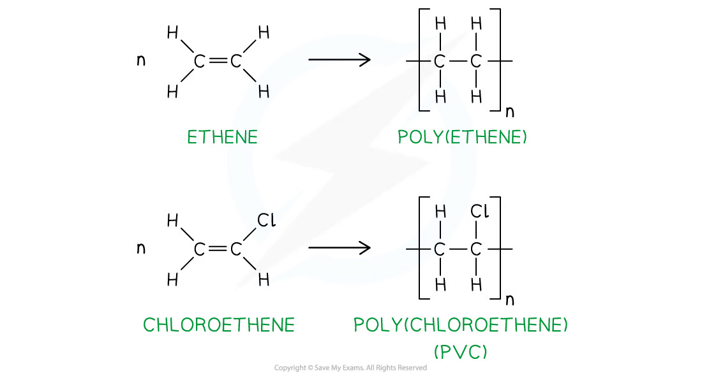{.concept-figure fig-alt="Displayed formulae showing C=C changing to C-C"}

Examples:

- CH2=CH2 gives [−CH2−CH2−]n, poly(ethene);
- CH2=CHCH3 gives [−CH2−CH(CH3)−]n, poly(propene);
- CH2=CHCl gives [−CH2−CHCl−]n, poly(chloroethene), PVC;
- CH2=C(CH3)2 gives [−CH2−C(CH3)2−]n.

The brackets and subscript n show that the chain continues. An addition-polymer repeat unit does not contain a C=C bond, and monomer residues are joined by C–C bonds rather than O or OH links.

### Working backwards from a polymer

Find the shortest repeating pattern in the carbon backbone, keep substituents attached to the same carbon, remove the continuation bonds, then change the backbone C–C single bond back to C=C.

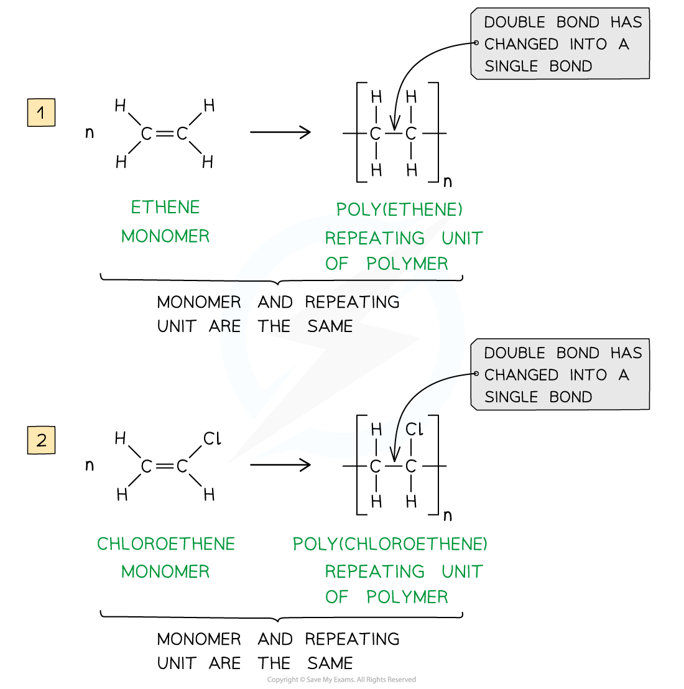{.concept-figure fig-alt="Examples showing repeat units and corresponding monomers"}

For poly(ethenol), the monomer is CH2=CH(OH) and the repeat unit is [−CH2−CH(OH)−]n. For poly(prop-2-enoic acid), the monomer is CH2=CHCO2H; the hydroxyl or carboxylic acid group is not part of the addition reaction.

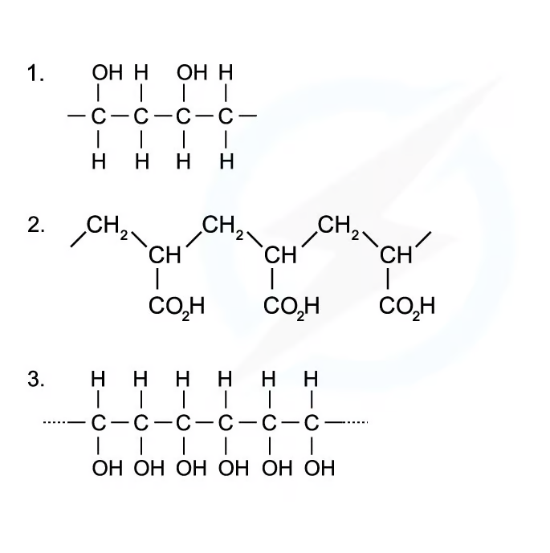{.concept-figure fig-alt="Worked examples of identifying monomers"}

Ethene-1,2-diol, CH(OH)=CH(OH), forms [−CH(OH)−CH(OH)−]n.

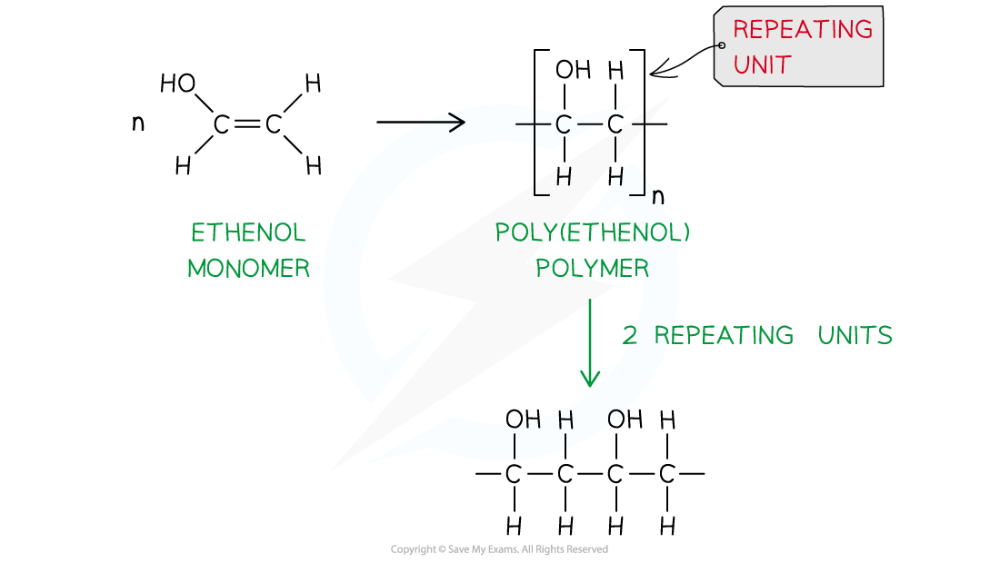{.concept-figure fig-alt="Ethenol forming poly(ethenol)"}

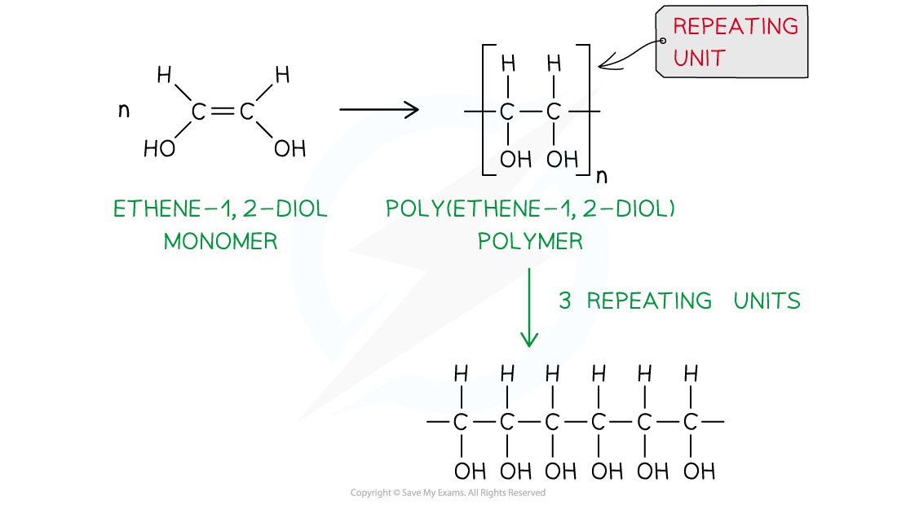{.concept-figure fig-alt="Ethene-1,2-diol forming poly(ethene-1,2-diol)"}

### Structure and disposal

The saturated polymer backbone has tetrahedral carbon atoms, so C–C–C angles are about 109.5°. The alkene monomer has trigonal-planar carbons and angles about 120°. Long chains have many electrons and strong London dispersion forces; branching reduces close packing and density. Non-polar addition polymers are usually insoluble in water and unreactive. Polymers with –OH groups can hydrogen-bond with water.

Geometric isomerism in trans-hept-2-ene comes from restricted rotation around C=C. After polymerisation, rotation about C–C is possible, so the product is poly(hept-2-ene), not poly(trans-hept-2-ene).

Poly(alkenes) are resistant to chemical attack and microorganisms, so they are non-biodegradable and remain in landfill for a long time. Incineration can recover heat but releases carbon dioxide and possibly toxic gases. PVC contains chlorine and can form acidic hydrogen chloride and toxic products such as dioxins. HCl can be removed from waste gas with a base or carbonate. Recycling reduces landfill, emissions and use of fossil-fuel raw materials, but sorting different polymers can be difficult and expensive. Photodegradable polymers absorb light that weakens bonds, but may not receive enough sunlight and may still be oil-based. Biodegradable polyesters contain hydrolysable ester links.

## Multiple choice questions

以下 20 道选择题来自 Easy、Medium、Hard 三份 3.8 Polymerisation Choice 题；答案和解析均根据各自 PDF 后半部分 Model Answers 核对。

### Easy

::: {.mc-question #n20-mc-e1 data-answer="A"}
### Question 1
Poly(ethenol) is a polymer used to make dissolvable plastic bags. It can be made by addition polymerisation of CH2=CH(OH).

Which structure shows a polymer chain consisting of two monomer residues?

<strong>A</strong>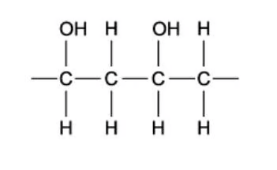<strong>B</strong>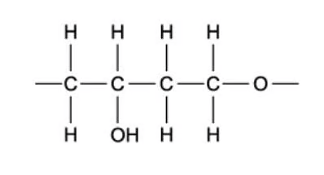<strong>C</strong>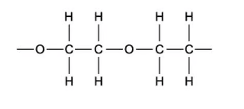<strong>D</strong>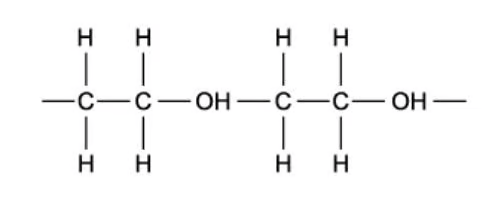

<button class="check-answer">Check answer</button>

Show detailed explanation

<strong>A.</strong> Opening the C=C of CH(OH)=CH2 gives −CH(OH)−CH2−. The two residues are joined only by C–C bonds; the OH groups remain side groups. The other options introduce an incorrect residue or an O/OH link in the main chain.

:::

::: {.mc-question #n20-mc-e2 data-answer="B"}
### Question 2
Plastic waste can be incinerated to provide heat for power stations.

Why is PVC, polyvinylchloride, removed from any plastic waste that is to be incinerated?

<button class="mc-choice" data-choice="A"><strong>A</strong>It does not burn easily</button><button class="mc-choice" data-choice="B"><strong>B</strong>Its combustion products are harmful</button><button class="mc-choice" data-choice="C"><strong>C</strong>It is easily biodegradable</button><button class="mc-choice" data-choice="D"><strong>D</strong>It destroys the ozone layer</button>

<button class="check-answer">Check answer</button>

Show detailed explanation

<strong>B.</strong> PVC combustion can produce acidic HCl and toxic products including dioxins and carbon monoxide. PVC burns readily, is not biodegradable, and its incineration does not create the chlorine-radical mechanism responsible for ozone destruction.

:::

::: {.mc-question #n20-mc-e3 data-answer="B"}
### Question 3
The diagram below shows 2-methylpropene, C4H8, a monomer used in the production of synthetic rubber.

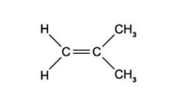{.question-figure fig-alt="2-methylpropene monomer"}

What is the compound formed by 2-methylpropene when it undergoes addition polymerisation?

<button class="mc-choice" data-choice="A"><strong>A</strong>[−CH(CH3)−CH(CH3)−]n</button><button class="mc-choice" data-choice="B"><strong>B</strong>[−CH2−C(CH3)2−]n</button><button class="mc-choice" data-choice="C"><strong>C</strong>[−CH2−CH(CH2CH3)−]n</button><button class="mc-choice" data-choice="D"><strong>D</strong>A repeat unit containing C=C</button>

<button class="check-answer">Check answer</button>

Show detailed explanation

<strong>B.</strong> The C=C opens and the second alkene carbon has two methyl groups, giving [−CH2−C(CH3)2−]n. A is the repeat unit of poly(but-2-ene), C has the wrong side group, and D incorrectly retains C=C.

:::

::: {.mc-question #n20-mc-e4 data-answer="B"}
### Question 4
Why is it difficult to dispose of plastics such as poly(alkenes) and PVC?

1 PVC produces harmful combustion products 2 Poly(alkenes) are non-biodegradable 3 Poly(alkenes) are highly flammable

<button class="mc-choice" data-choice="A"><strong>A</strong>1, 2 and 3</button><button class="mc-choice" data-choice="B"><strong>B</strong>1 and 2</button><button class="mc-choice" data-choice="C"><strong>C</strong>2 and 3</button><button class="mc-choice" data-choice="D"><strong>D</strong>1 only</button>

<button class="check-answer">Check answer</button>

Show detailed explanation

<strong>B.</strong> PVC combustion gives harmful products and poly(alkenes) are non-biodegradable. Flammability makes incineration possible, so statement 3 is not a disposal difficulty.

:::

::: {.mc-question #n20-mc-e5 data-answer="A"}
### Question 5
What is the repeating unit of PVC?

<strong>A</strong>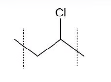<strong>B</strong>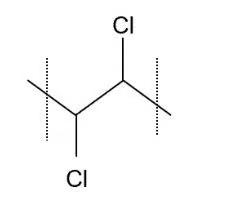<strong>C</strong>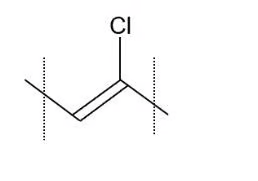<strong>D</strong>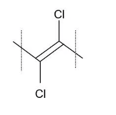

<button class="check-answer">Check answer</button>

Show detailed explanation

<strong>A.</strong> PVC is poly(chloroethene). CH2=CHCl becomes [−CH2−CHCl−]n; the repeat unit is saturated and has no C=C.

:::

### Medium

::: {.mc-question #n20-mc-m1 data-answer="A"}
### Question 6
Plasticisers, resins and many other chemicals can be made synthetically by polymerisation of a variety of monomers including but-2-en-1-ol, CH3CH=CHCH2OH.

Which structure is the repeating unit in poly(but-2-en-1-ol)?

<strong>A</strong>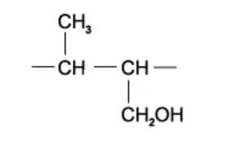<strong>B</strong>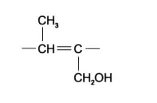<strong>C</strong>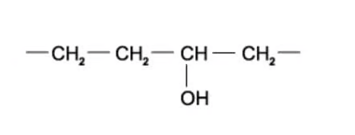<strong>D</strong>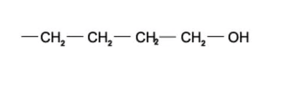

<button class="check-answer">Check answer</button>

Show detailed explanation

<strong>A.</strong> The C=C is between carbons 2 and 3. Those two carbons form the backbone; CH3 and CH2OH remain substituents. The repeat unit has no C=C.

:::

::: {.mc-question #n20-mc-m2 data-answer="B"}
### Question 7
Which statement about PVC is incorrect?

<button class="mc-choice" data-choice="A"><strong>A</strong>PVC molecules are saturated</button><button class="mc-choice" data-choice="B"><strong>B</strong>The repeat unit of PVC is (CHClCHCl)−</button><button class="mc-choice" data-choice="C"><strong>C</strong>Combustion of PVC waste produces a highly acidic gas</button><button class="mc-choice" data-choice="D"><strong>D</strong>The empirical formula of PVC is the same as the empirical formula of its monomer</button>

<button class="check-answer">Check answer</button>

Show detailed explanation

<strong>B.</strong> The correct repeat unit is [−CH2−CHCl−]n. PVC is saturated, it can produce acidic HCl on combustion, and an addition polymer has the same empirical formula as its monomer.

:::

::: {.mc-question #n20-mc-m3 data-answer="C"}
### Question 8
PVC is produced through the polymerisation of chloroethene. How does the carbon-carbon bond in chloroethene compare with that in PVC?

<button class="mc-choice" data-choice="A"><strong>A</strong>Longer and stronger</button><button class="mc-choice" data-choice="B"><strong>B</strong>Longer and weaker</button><button class="mc-choice" data-choice="C"><strong>C</strong>Shorter and stronger</button><button class="mc-choice" data-choice="D"><strong>D</strong>Shorter and weaker</button>

<button class="check-answer">Check answer</button>

Show detailed explanation

<strong>C.</strong> Chloroethene has C=C; PVC has C–C. The double bond has greater bond order, so it is shorter and stronger.

:::

::: {.mc-question #n20-mc-m4 data-answer="B"}
### Question 9
What are the C–C–C bond angles along the polymeric chain in PVC?

<button class="mc-choice" data-choice="A"><strong>A</strong>Half are 109.5° and half are 120°</button><button class="mc-choice" data-choice="B"><strong>B</strong>They are all 109.5°</button><button class="mc-choice" data-choice="C"><strong>C</strong>They are all 120°</button><button class="mc-choice" data-choice="D"><strong>D</strong>They are all 180°</button>

<button class="check-answer">Check answer</button>

Show detailed explanation

<strong>B.</strong> The PVC chain is saturated; each backbone carbon is tetrahedral and the C–C–C angle is about 109.5°. 120° belongs to the planar alkene monomer.

:::

::: {.mc-question #n20-mc-m5 data-answer="D"}
### Question 10
The absorbent material in babies’ disposable nappies is made from the addition polymer shown.

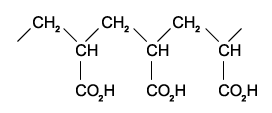{.question-figure fig-alt="Polymer with carboxylic acid side groups"}

From which monomer could this addition polymer be obtained?

<button class="mc-choice" data-choice="A"><strong>A</strong>HOCH2CH2CO2H</button><button class="mc-choice" data-choice="B"><strong>B</strong>HO2CCH=CHCO2H</button><button class="mc-choice" data-choice="C"><strong>C</strong>CH3CH(OH)CO2H</button><button class="mc-choice" data-choice="D"><strong>D</strong>CH2=CHCO2H</button>

<button class="check-answer">Check answer</button>

Show detailed explanation

<strong>D.</strong> The repeat unit has two backbone carbons and one CO2H side group. Restoring C=C gives CH2=CHCO2H.

:::

::: {.mc-question #n20-mc-m6 data-answer="C"}
### Question 11
In the addition polymerisation of alkenes, which types of bond breakage and bond formation occur?

| | Bond breakage | Bond formation |
|---|---|---|
| A | σ and π only | σ only |
| B | σ and π | σ and π |
| C | π only | σ only |
| D | π only | σ and π |

<button class="mc-choice" data-choice="A"><strong>A</strong>Option A</button><button class="mc-choice" data-choice="B"><strong>B</strong>Option B</button><button class="mc-choice" data-choice="C"><strong>C</strong>Option C</button><button class="mc-choice" data-choice="D"><strong>D</strong>Option D</button>

<button class="check-answer">Check answer</button>

Show detailed explanation

<strong>C.</strong> The π part opens; the C–C σ bond remains. New links between monomer residues are C–C σ bonds.

:::

::: {.mc-question #n20-mc-m7 data-answer="D"}
### Question 12
Cling film is made through the polymerisation of 1,1-dichloroethene. The product is dense with a high melting point and does not allow gases to pass through which makes it ideal for preserving food.

Which sequence appears in a short length of the polymer chain?

<button class="mc-choice" data-choice="A"><strong>A</strong>−[CH2−CCl−CHCl−CH2−]−</button><button class="mc-choice" data-choice="B"><strong>B</strong>A sequence containing only CCl2 groups</button><button class="mc-choice" data-choice="C"><strong>C</strong>A sequence containing alternating CHCl groups</button><button class="mc-choice" data-choice="D"><strong>D</strong>−[CH2−CCl2−CH2−CCl2]−</button>

<button class="check-answer">Check answer</button>

Show detailed explanation

<strong>D.</strong> 1,1-Dichloroethene is CH2=CCl2; its repeat unit is −CH2−CCl2−.

:::

::: {.mc-question #n20-mc-m8 data-answer="C"}
### Question 13
Which polymer is not made when 1-hydroxyethene and propene undergo addition polymerisation?

<button class="mc-choice" data-choice="A"><strong>A</strong>A chain containing CH2CH(OH) and CH2CH(CH3) residues</button><button class="mc-choice" data-choice="B"><strong>B</strong>A different sequence of those two residues</button><button class="mc-choice" data-choice="C"><strong>C</strong>A chain whose backbone bond is formed through a carbon not from either C=C</button><button class="mc-choice" data-choice="D"><strong>D</strong>A homopolymer of 1-hydroxyethene</button>

<button class="check-answer">Check answer</button>

Show detailed explanation

<strong>C.</strong> Every backbone carbon must come from one of the original alkene C=C bonds. A structure introducing a backbone carbon from elsewhere cannot be formed by addition polymerisation.

:::

::: {.mc-question #n20-mc-m9 data-answer="B"}
### Question 14
The diagram shows a short length of an addition polymer chain. The polymer has a relative molecular mass of approximately 10 000. Approximately how many monomer units are joined together in each polymer molecule?

The repeat unit contains −CH(OH)−CH(OH)−.

<button class="mc-choice" data-choice="A"><strong>A</strong>80</button><button class="mc-choice" data-choice="B"><strong>B</strong>160</button><button class="mc-choice" data-choice="C"><strong>C</strong>240</button><button class="mc-choice" data-choice="D"><strong>D</strong>320</button>

<button class="check-answer">Check answer</button>

Show detailed explanation

<strong>B.</strong> Ethene-1,2-diol is C2H4O2, Mr=60. 10 000 ÷ 60 ≈ 167, closest to 160.

:::

::: {.mc-question #n20-mc-m10 data-answer="D"}
### Question 15
The addition of four identical monomer molecules produces the naturally occurring molecule shown below. What could be the structural formula of the monomer?

<button class="mc-choice" data-choice="A"><strong>A</strong>CH2=C(CH3)CH2CH3</button><button class="mc-choice" data-choice="B"><strong>B</strong>CH3CH=CHCH=CH2</button><button class="mc-choice" data-choice="C"><strong>C</strong>CH3CH2CH2CH=CH2</button><button class="mc-choice" data-choice="D"><strong>D</strong>CH2=C(CH3)CH=CH2</button>

<button class="check-answer">Check answer</button>

Show detailed explanation

<strong>D.</strong> The product is formed from a diene: one C=C participates in addition while the second can remain in the product. The suitable monomer is isoprene, CH2=C(CH3)CH=CH2.

:::

### Hard

::: {.mc-question #n20-mc-h1 data-answer="C"}
### Question 16
Kevlar has the structure below. A Kevlar rope is both lighter and stronger when compared to a steel rope of similar dimensions. Which properties of Kevlar are responsible?

1 The Kevlar molecule has no permanent dipole. 2 The fibres of Kevlar align due to hydrogen bonding 3 The mass per unit length is less in a Kevlar rope than in a steel rope

<button class="mc-choice" data-choice="A"><strong>A</strong>1, 2 and 3</button><button class="mc-choice" data-choice="B"><strong>B</strong>1 and 2</button><button class="mc-choice" data-choice="C"><strong>C</strong>2 and 3</button><button class="mc-choice" data-choice="D"><strong>D</strong>1 only</button>

<button class="check-answer">Check answer</button>

Show detailed explanation

<strong>C.</strong> Kevlar does have permanent dipoles from carbonyl and N–H groups, so 1 is false. Hydrogen bonding aligns fibres, and C/N/O atoms give lower mass per unit length than steel.

:::

::: {.mc-question #n20-mc-h2 data-answer="C"}
### Question 17
Which row correctly describes what happens when poly(propene), (C3H6)n, is burned in an excess of air?

<button class="mc-choice" data-choice="A"><strong>A</strong>Poly(propene) does not burn</button><button class="mc-choice" data-choice="B"><strong>B</strong>n moles O2; 3nC+3nH2O</button><button class="mc-choice" data-choice="C"><strong>C</strong>4½n moles O2; 3nCO2+3nH2O</button><button class="mc-choice" data-choice="D"><strong>D</strong>6n moles O2; 3nCO2+3nH2O</button>

<button class="check-answer">Check answer</button>

Show detailed explanation

<strong>C.</strong> C3H6+4½O2→3CO2+3H2O; multiply every coefficient by n. Excess air means complete combustion.

:::

::: {.mc-question #n20-mc-h3 data-answer="B"}
### Question 18
The following diagram represents the structure of a polymer: [−CH2−CH(OH)−CH2−CH(OH)−]n.

By which method can this polymer be made?

<button class="mc-choice" data-choice="A"><strong>A</strong>Polymerise ethene; hydration</button><button class="mc-choice" data-choice="B"><strong>B</strong>Polymerise 1,2-dichloroethene; hydrolysis</button><button class="mc-choice" data-choice="C"><strong>C</strong>Polymerise ethene; oxidation with H+/KMnO4</button><button class="mc-choice" data-choice="D"><strong>D</strong>Polymerise 1,2-dichloroethene; oxidation with H+/KMnO4</button>

<button class="check-answer">Check answer</button>

Show detailed explanation

<strong>B.</strong> Polymerise 1,2-dichloroethene to give a chain with C–Cl substituents, then hydrolyse C–Cl to C–OH. Ethene does not supply the substituents and oxidation is not the appropriate conversion.

:::

::: {.mc-question #n20-mc-h4 data-answer="C"}
### Question 19
A 1 mol sample of a monomer undergoes addition polymerisation and is completely polymerised. How many moles of polymer might, theoretically, be formed?

1 1 2 10−6 3 1/(6.02 × 1023)

<button class="mc-choice" data-choice="A"><strong>A</strong>1 only</button><button class="mc-choice" data-choice="B"><strong>B</strong>1 and 2</button><button class="mc-choice" data-choice="C"><strong>C</strong>2 and 3</button><button class="mc-choice" data-choice="D"><strong>D</strong>1, 2 and 3</button>

<button class="check-answer">Check answer</button>

Show detailed explanation

<strong>C.</strong> A polymer molecule contains many monomer units, so the amount of polymer is less than 1 mol. Both 10−6 mol and 1/(6.02×1023) mol are theoretically possible.

:::

::: {.mc-question #n20-mc-h5 data-answer="C"}
### Question 20
Some micro-organisms naturally produce a polymer called PHB (polyhydroxybutyric acid). PHB is readily biodegradable.

What type of reaction will cause PHB to break down?

<button class="mc-choice" data-choice="A"><strong>A</strong>Addition</button><button class="mc-choice" data-choice="B"><strong>B</strong>Reduction</button><button class="mc-choice" data-choice="C"><strong>C</strong>Hydrolysis</button><button class="mc-choice" data-choice="D"><strong>D</strong>Substitution</button>

<button class="check-answer">Check answer</button>

Show detailed explanation

<strong>C.</strong> PHB contains ester links, and hydrolysis uses water to break ester bonds into smaller molecules. Addition, reduction and substitution do not describe this chain breakdown.

:::

## Structured questions

本节从 Easy、Medium、Hard 各组按原题顺序选取 10 道 SQ。答案参考对应 PDF 后半部分的 Model Answers，并补充每个小问的得分点。

### Easy

::: {.question-card #n20-sq-e1}
### Question 1
This question is about different polymers. Polymer X can be formed from an alkene. The structure of polymer X is shown in Fig. 1.1.

{.question-figure fig-alt="Polymer X"}

**(a)** State type polymerisation. [1 mark] **(b)** (i) Draw monomer. (ii) Name polymer X. [2 marks] **(c)** Suggest three reasons why disposal of polymer X challenge. [3 marks]

Show detailed reference answer

<strong>(a)</strong> Addition polymerisation. <strong>(b)</strong> Monomer propene, CH2=CHCH3; polymer X is poly(propene), [−CH2−CH(CH3)−]n. <strong>(c)</strong> Any three: unreactive/resistant to chemical attack; non-biodegradable and persistent in landfill; combustion produces pollutants or carbon dioxide. The key points are three distinct disposal problems.

:::

::: {.question-card #n20-sq-e2}
### Question 2
Butene, C4H8, can exist as three isomers. Isomer A is a position isomer of isomers B and C and does not show geometric isomerism. B and C are geometric isomers. B cis, C trans.

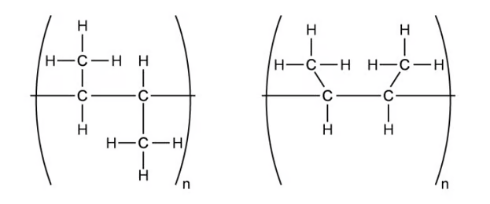{.question-figure fig-alt="Butene isomers"}

**(a)** (i) Draw displayed formulae of A, B, C. (ii) Name all three. [6 marks] **(b)** Draw displayed formula of addition polymer formed by isomer A. [1 mark] **(c)** State why two suggested structures are the same addition polymer. [1 mark]

Show detailed reference answer

<strong>(a)</strong> A: but-1-ene, CH2=CHCH2CH3. B: cis-but-2-ene. C: trans-but-2-ene. <strong>(b)</strong> [−CH2−CH(CH2CH3)−]n. <strong>(c)</strong> The C=C opens to C–C; free rotation about C–C means the drawings are conformations of the same polymer, not cis/trans polymers.

:::

::: {.question-card #n20-sq-e3}
### Question 3
The molecule chloroethene is shown in Fig. 3.1.

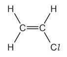{.question-figure fig-alt="Chloroethene"}

Chloroethene is polymerised to poly(chloroethene). **(a)** Give an alternative name. [1 mark] **(b)** Draw the structure including three repeat units. [1 mark] **(c)** State a problem caused by combustion and suggest how effects are reduced. [2 marks]

Show detailed reference answer

<strong>(a)</strong> PVC/polyvinylchloride. <strong>(b)</strong> −CH2−CHCl−CH2−CHCl−CH2−CHCl−, with continuation bonds. <strong>(c)</strong> Acidic/toxic HCl and other toxic products can be formed; scrub HCl with a base/carbonate or recycle rather than incinerate.

:::

### Medium

::: {.question-card #n20-sq-m1}
### Question 4
Addition polymers are made by polymerisation of alkenes. **(a)** Explain addition polymerisation. [2 marks] **(b)** Trans-hept-2-ene can be made into an addition polymer. (i) Give displayed formula. (ii) Draw poly(hept-2-ene) showing two repeat units. [2 marks] **(c)** Suggest why the polymer is not called poly(trans-hept-2-ene). [2 marks] **(d)** Trans-hept-2-ene is a liquid at room temperature and pressure but poly(hept-2-ene) is a solid. Explain the difference. [3 marks]

Show detailed reference answer

<strong>(a)</strong> Many C=C-containing monomers join to form a long chain as the only product; the π bond opens and new C–C σ bonds form. <strong>(b)</strong> trans-hept-2-ene is CH3CH=CHCH2CH2CH2CH3 with H atoms on opposite sides. Two repeat units: −[CH(CH3)−CH(CH2CH2CH2CH3)]2−. <strong>(c)</strong> The polymer has no C=C and can rotate about C–C, so no geometric isomerism exists. <strong>(d)</strong> The polymer has more electrons and stronger London forces; more energy is needed to separate chains, giving higher melting/boiling temperatures and a solid state.

:::

::: {.question-card #n20-sq-m2}
### Question 5
Polyvinyl chloride (PVC) is a polymer which is rigid enough for use as a drainpipe and flexible enough for plastic aprons. State the IUPAC name of PVC. Fig. 2.1 shows a section of the PVC polymer.

{.question-figure fig-alt="PVC section"}

**(b)** (i) Draw repeating unit. (ii) Draw structure and state name of monomer. (iii) Write equation for formation of PVC. [4 marks]

Show detailed reference answer

<strong>(a)</strong> Poly(chloroethene). <strong>(b)</strong> Repeat unit [−CH2−CHCl−]n; monomer CH2=CHCl, chloroethene; equation nCH2=CHCl → [−CH2−CHCl−]n. Use square brackets, continuation bonds and subscript n.

:::

::: {.question-card #n20-sq-m3}
### Question 6
The polymer poly(propene) is formed from the monomer propene. (i) Draw the repeating unit. (ii) Complete Table 2.1 for poly(methylpropene) and poly(ethene): insoluble in water, unreactive, high density. (iii) Explain why the melting point of poly(methylpropene) is much higher than that of methylpropene. [6 marks]

{.question-figure fig-alt="Poly(propene)"}

Show detailed reference answer

<strong>(i)</strong> [−CH2−CH(CH3)−]n. <strong>(ii)</strong> Both polymers are insoluble and unreactive; only poly(ethene) is marked high density because branching makes poly(methylpropene) pack less efficiently. <strong>(iii)</strong> The polymer has longer chains and more electrons, so there are more/stronger London dispersion forces. More energy is needed to overcome them, so its melting point is much higher than that of small methylpropene molecules.

:::

::: {.question-card #n20-sq-m4}
### Question 7
Polymers are unreactive compounds due to their long non-polar chain of saturated carbon-carbon and carbon-hydrogen bonds. Though this means that they are safe to use it also means that they are non-biodegradable as they are not attacked by biological agents such as enzymes.

Table 2.2 shows three different ways in which polymers can be disposed of. State the disadvantage of recycling, incineration and landfill. [3 marks]

Show detailed reference answer

<strong>Recycling:</strong> expensive/difficult separation of different polymers. <strong>Incineration:</strong> pollutants/CO2/greenhouse gases, or high energy and temperature required. <strong>Landfill:</strong> polymers remain for many years because microorganisms cannot break them down.

:::

### Hard

::: {.question-card #n20-sq-h1}
### Question 8
Poly(methyl methacrylate) is used as a glass substitute in Perspex. A section of the polymer chain is shown in Fig. 1.1.

{.question-figure fig-alt="Poly(methyl methacrylate) section"}

**(a)** Draw skeletal formula of monomer. [1 mark] **(b)** Explain why poly(methyl methacrylate) is fairly unreactive. [2 marks] **(c)** (i) Explain how photodegradable polymers are broken down. (ii) Suggest two disadvantages. [3 marks]

Show detailed reference answer

<strong>(a)</strong> Methyl methacrylate: CH2=C(CH3)CO2CH3, drawn as a skeletal formula. <strong>(b)</strong> The chain is saturated/has only C–C single bonds and its hydrocarbon chain is non-polar. <strong>(c)</strong> It absorbs light that weakens polymer bonds; disadvantages include insufficient sunlight exposure and the fact that it may still be oil-based.

:::

::: {.question-card #n20-sq-h2}
### Question 9
**(a)** Explain how p-orbitals are involved in formation of C=C in chloroalkenes. Include a sketch. [2 marks]

Compound Y has six possible structural isomers of C3H3Cl3. Two are shown in Fig. 2.1.

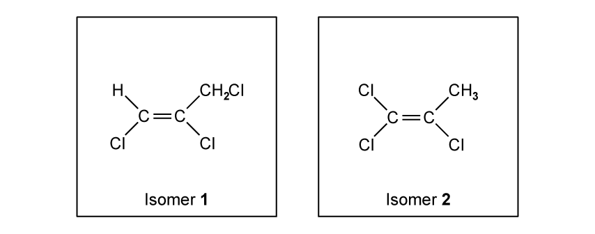{.question-figure fig-alt="Trichloropropene isomers"}

**(b)** (i) State IUPAC name of isomer 1. (ii) Draw three other structural isomers that are chloroalkenes. (iii) Show two repeat units for polymer formed by isomer 2. [5 marks]

Show detailed reference answer

<strong>(a)</strong> Each carbon has an unhybridised p orbital perpendicular to its σ-bond plane. Sideways overlap of the adjacent parallel p orbitals forms the π part of C=C; C=C contains one σ and one π bond. <strong>(b)(i)</strong> 1,2,3-trichloropropene. <strong>(ii)</strong> Any three of 1,1,3-trichloropropene, 2,3,3-trichloropropene, 3,3,3-trichloropropene and 1,3,3-trichloropropene, with correct structures. <strong>(iii)</strong> Draw four saturated backbone carbons, retain the chlorine substituents inherited from isomer 2, and show two repeat units with continuation bonds.

:::

::: {.question-card #n20-sq-h3}
### Question 10
But-2-ene, CH3CH=CHCH3, is an important compound obtained from cracking hydrocarbons in crude oil. Some reactions are shown in Fig. 3.1.

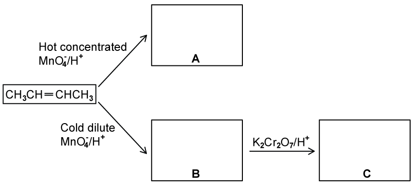{.question-figure fig-alt="Reactions of but-2-ene"}

**(a)** Give structural formulae of organic compounds A to C. [3 marks] **(b)** Draw a portion of poly(butene) showing two repeat units. [1 mark] **(c)** Explain why there is an increasing demand for polymers to be recycled rather than incinerated. [3 marks]

Show detailed reference answer

<strong>(a)</strong> A CH3CO2H; B CH3CH(OH)CH(OH)CH3; C CH3COCOCH3. Hot concentrated acidified KMnO4 cleaves and oxidises to ethanoic acid; cold dilute acidified KMnO4 gives a diol; further oxidation gives butane-2,3-dione. <strong>(b)</strong> −[CH(CH3)−CH(CH3)]2−. <strong>(c)</strong> Recycling releases fewer pollutants/greenhouse gases/CO2, uses less energy and conserves oil/fossil-fuel raw materials.

:::

## Original question PDFs

- [3.8 Polymerisation — Choice — Easy](../assets/questions/original-source/3.8_polymerisation_choice_easy.pdf)
- [3.8 Polymerisation — Choice — Medium](../assets/questions/original-source/3.8_polymerisation_choice_medium.pdf)
- [3.8 Polymerisation — Choice — Hard](../assets/questions/original-source/3.8_polymerisation_choice_hard.pdf)
- [3.8 Polymerisation — SQ — Easy](../assets/questions/original-source/3.8_polymerisation_sq_easy.pdf)
- [3.8 Polymerisation — SQ — Medium](../assets/questions/original-source/3.8_polymerisation_sq_medium.pdf)
- [3.8 Polymerisation — SQ — Hard](../assets/questions/original-source/3.8_polymerisation_sq_hard.pdf)
