# 21 Organic synthesis

本章只覆盖 Cambridge International AS Level Chemistry 9701 的 **3.9 Organic Synthesis**，知识点对应 **21.1 Organic Synthesis**。题目来自 Topical Past Papers/AS 中的 3.9 Organic Synthesis 题库；题目文字、选项、小问编号和分值按原题保留。页面包含 20 道 multiple-choice questions 和 10 道 structured questions。不能独立提取的整页图不放入页面。

## Learning objectives

- identify common organic functional groups and their characteristic reactions;
- select suitable reagents and conditions for converting one functional group into another;
- distinguish compounds using Fehling's solution, Tollens' reagent, bromine water, 2,4-DNPH, sodium carbonate and silver nitrate;
- distinguish oxidation, reduction, hydrolysis, condensation, elimination, electrophilic addition and nucleophilic substitution;
- plan multi-step routes and choose reagents in the correct order;
- explain how chain length is increased using cyanide ions;
- use distillation and reflux correctly in oxidation and hydrolysis reactions.

## 21.1 Organic synthesis

### Functional groups and tests

Organic synthesis begins by recognising the functional group and then matching it to a reaction. The key tests are:

| Functional group | Test and observation |
|---|---|
| Alkene | Bromine water changes from orange/yellow to colourless |
| Aldehyde | Fehling's solution changes from clear blue to brick-red/orange precipitate; Tollens' reagent gives a silver mirror |
| Ketone or aldehyde | Warm with 2,4-dinitrophenylhydrazine (2,4-DNPH): orange precipitate |
| Carboxylic acid | Sodium carbonate gives effervescence of carbon dioxide; the gas turns limewater cloudy |
| Halogenoalkane | Hydrolyse with aqueous hydroxide, then acidify and add silver nitrate: AgCl white, AgBr cream, AgI yellow |
| Methyl ketone | Iodoform test gives a pale yellow precipitate |

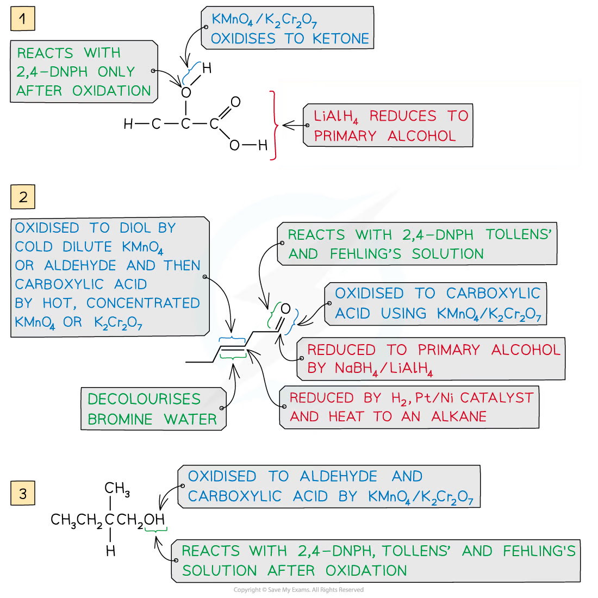{.concept-figure fig-alt="Worked functional-group tests"}

### Oxidation and reduction

Acidified potassium dichromate(VI), K2Cr2O7/H2SO4, changes orange to green. Acidified potassium manganate(VII), KMnO4, changes purple to colourless.

- a primary alcohol gives an aldehyde by controlled oxidation and a carboxylic acid by further oxidation;
- a secondary alcohol gives a ketone;
- a tertiary alcohol is not oxidised under these conditions;
- aldehydes oxidise to carboxylic acids;
- cold, dilute acidified KMnO4 oxidises an alkene to a diol;
- hot, concentrated acidified KMnO4 cleaves the C=C bond, giving ketones, aldehydes or carboxylic acids;
- NaBH4 reduces aldehydes to primary alcohols and ketones to secondary alcohols;
- H2 with a Pt/Ni catalyst hydrogenates C=C bonds but does not reduce a carbonyl group in these AS routes.

Use **distillation** when the aldehyde must be removed as it forms, preventing further oxidation. Use **reflux** when complete oxidation to a carboxylic acid is required.

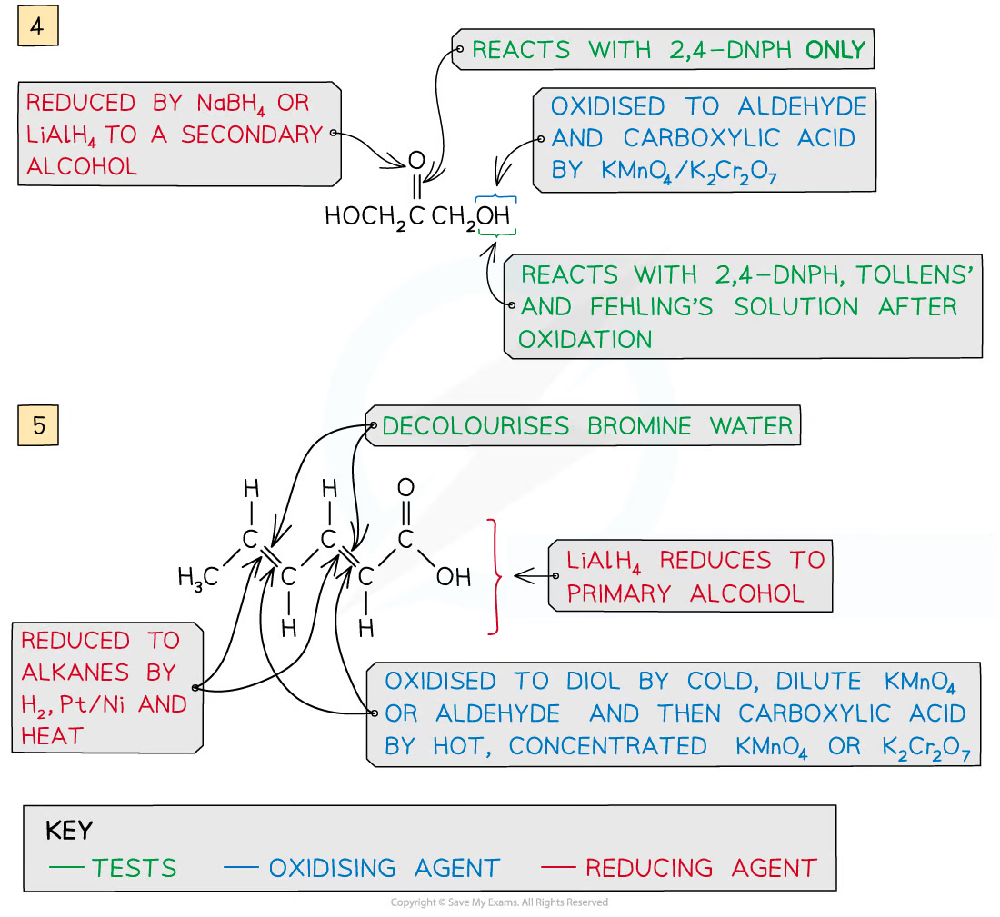{.concept-figure fig-alt="Oxidation and reduction of organic compounds"}

### Reactions used in synthesis

| Reaction | Reagents and conditions | Main product |
|---|---|---|
| Hydrogenation | H2, Pt/Ni catalyst, heat | Alkane |
| Elimination/dehydration | Hot concentrated acid, or hot Al2O3 | Alkene |
| Electrophilic addition | HBr, Br2, or steam across C=C | Halogenoalkane, dibromoalkane or alcohol |
| Nucleophilic substitution | Aqueous NaOH/KOH, heat/reflux | Alcohol |
| Nucleophilic substitution | KCN in ethanol, heat/reflux | Nitrile; chain length increases by one carbon |
| Nucleophilic addition | HCN with a small amount of NaCN/KCN | Hydroxynitrile |
| Hydrolysis of nitrile | Dilute acid or alkali, heat/reflux | Carboxylic acid or carboxylate |
| Esterification | Carboxylic acid + alcohol, hot concentrated H2SO4 | Ester + water |

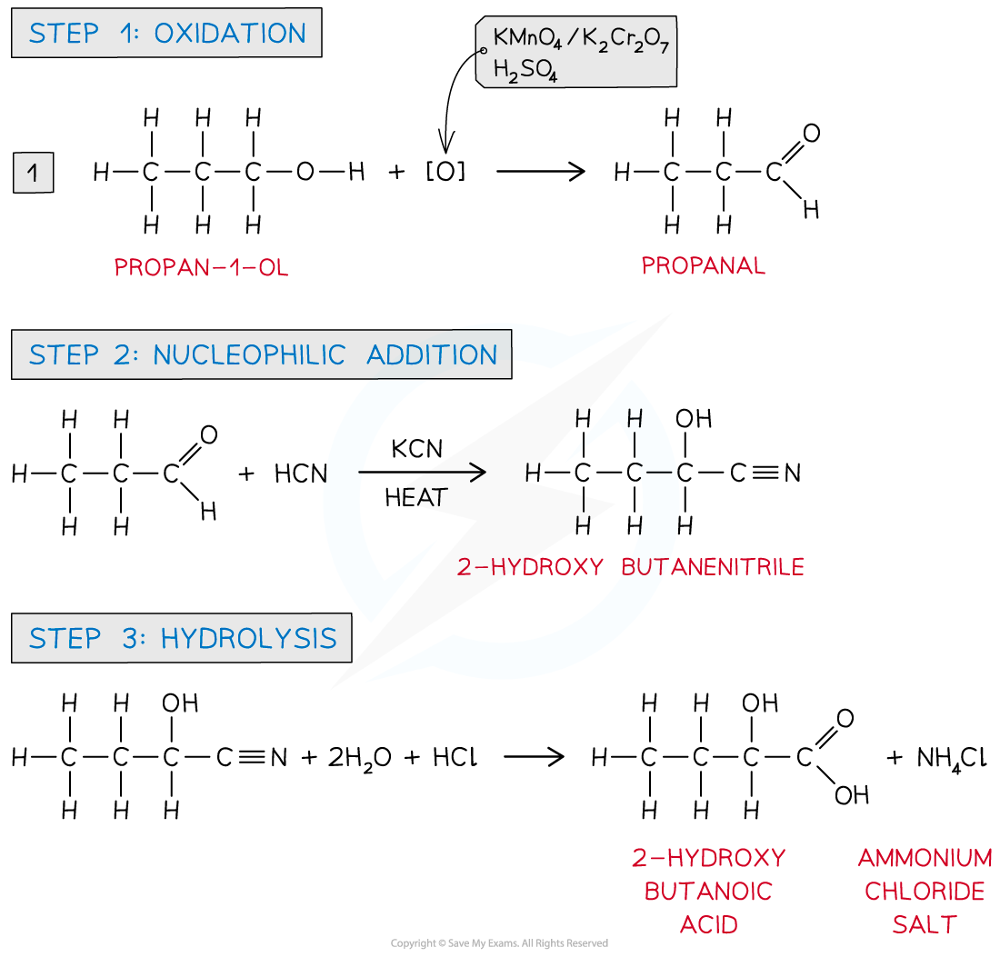{.concept-figure fig-alt="Multi-step synthesis of 2-hydroxybutanoic acid"}

### Multi-step synthetic routes

Plan a route backwards from the target:

1. identify the target functional group and a suitable immediate precursor;
2. choose the reaction that makes that functional group;
3. work backwards until the starting material is reached;
4. write each reagent, condition and product in order, checking that later reagents do not destroy an earlier functional group.

For example, propan-1-ol can be oxidised to propanoic acid, esterified with ethanol to ethyl propanoate, and hydrolysed with aqueous sodium hydroxide to sodium propanoate.

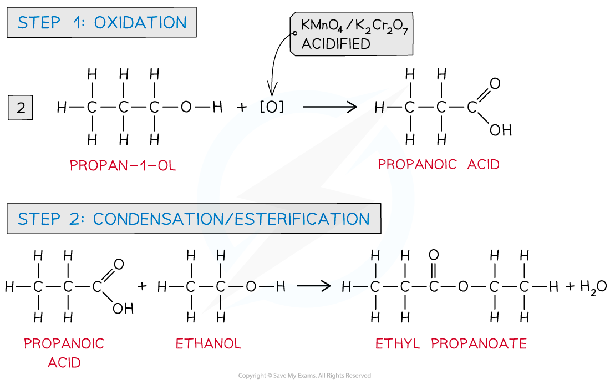{.concept-figure fig-alt="Synthesis of ethyl propanoate and sodium propanoate"}

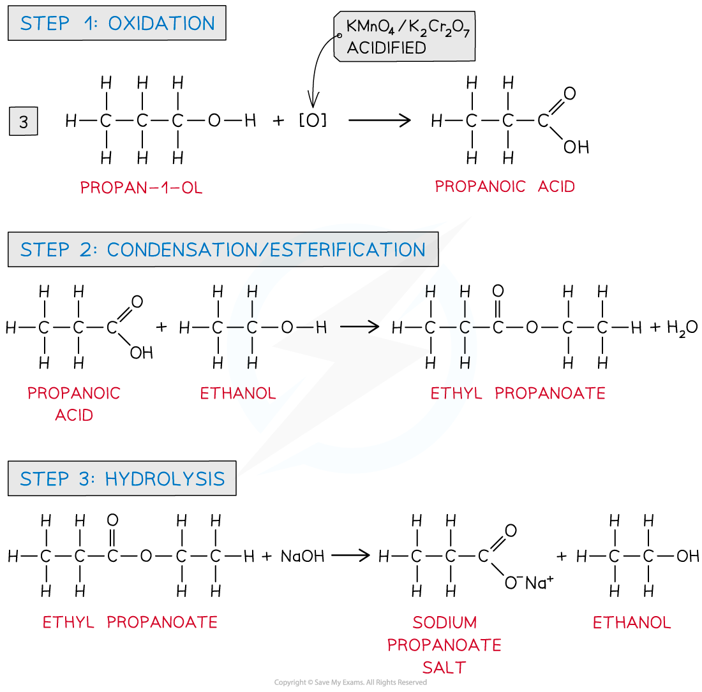{.concept-figure fig-alt="Additional synthetic routes"}

Hydroxynitrile synthesis is another useful route. HCN adds to an aldehyde or ketone, then the nitrile group can be hydrolysed to a carboxylic acid. Each nitrile group adds one carbon to the chain.

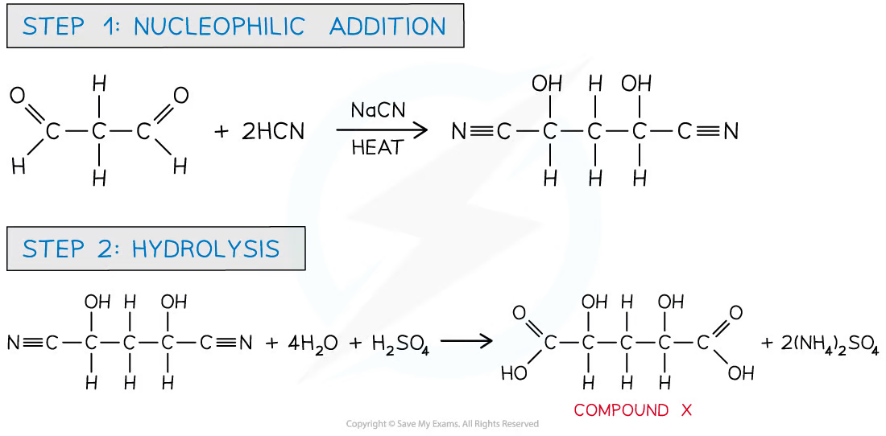{.concept-figure fig-alt="Nucleophilic addition of HCN followed by nitrile hydrolysis"}

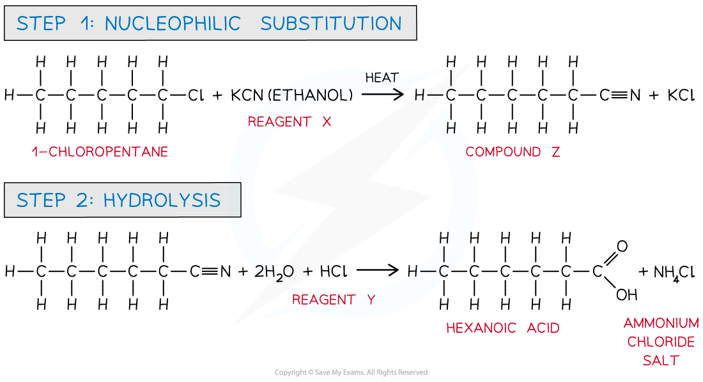{.concept-figure fig-alt="Conversion of a halogenoalkane to hexanoic acid"}

### Common traps

- Acidified dichromate oxidises primary and secondary alcohols but not tertiary alcohols.
- Distillation gives an aldehyde from a primary alcohol; reflux gives the carboxylic acid.
- A ketone does not give a positive Fehling's or Tollens' test.
- 2,4-DNPH identifies aldehydes and ketones, not alkenes or carboxylic acids.
- Aqueous KOH gives substitution to an alcohol; ethanolic KOH favours elimination to an alkene.
- KCN in ethanol adds one carbon; hydrolysis of the nitrile gives the acid or carboxylate.
- A condensation reaction eliminates a small molecule, usually water; it does not mean that water is formed as the main product.

## Multiple choice questions

以下 20 道选择题来自 3.9 Organic Synthesis - Choice - Easy/Medium/Hard。每题答案和解释均根据对应 PDF 后半部分的 Model Answers 核对。

### Easy

::: {.mc-question #n21-mc-e1 data-answer="D"}
### Question 1
Lactic acid occurs naturally, for example in sour milk.

What is a property of lactic acid?

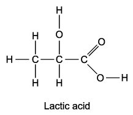{.question-figure fig-alt="Lactic acid structure"}

<button class="mc-choice" data-choice="A"><strong>A</strong>It decolourises aqueous bromine rapidly.</button><button class="mc-choice" data-choice="B"><strong>B</strong>It is insoluble in water.</button><button class="mc-choice" data-choice="C"><strong>C</strong>It reduces Fehling's reagent.</button><button class="mc-choice" data-choice="D"><strong>D</strong>It reacts with sodium carbonate.</button>

<button class="check-answer">Check answer</button>

Show detailed explanation

<strong>D.</strong> Lactic acid contains −COOH, so it reacts with carbonate to form a lactate salt, carbon dioxide and water. It is soluble because both −COOH and −OH can hydrogen-bond with water. It has no C=C and is not an aldehyde, so A and C are false.

:::

::: {.mc-question #n21-mc-e2 data-answer="A"}
### Question 2
Which reagent can be used to convert CH3CH2CO2CH3 into CH3CH2CO2CH2Cl?

<button class="mc-choice" data-choice="A"><strong>A</strong>Chlorine in bright sunlight at 100 °C</button><button class="mc-choice" data-choice="B"><strong>B</strong>Concentrated hydrochloric acid at 100 °C</button><button class="mc-choice" data-choice="C"><strong>C</strong>Phosphorus pentachloride at room temperature</button><button class="mc-choice" data-choice="D"><strong>D</strong>Sulfur dichloride oxide (thionyl chloride, SOCl2) at 50 °C</button>

<button class="check-answer">Check answer</button>

Show detailed explanation

<strong>A.</strong> Chlorine under bright sunlight gives free-radical substitution of a hydrogen atom in the methyl group of methyl propanoate, forming −CH2Cl. The other reagents are used for converting alcohols or related functional groups, not for this ester halogenation.

:::

::: {.mc-question #n21-mc-e3 data-answer="C"}
### Question 3
Which reactions produce a coloured organic compound? 1 Ethene + cold dilute acidified potassium manganate(VII) 2 Ethanol + acidified potassium dichromate(VI) 3 Ethanal + 2,4-dinitrophenylhydrazine reagent

<button class="mc-choice" data-choice="A"><strong>A</strong>1 only</button><button class="mc-choice" data-choice="B"><strong>B</strong>1 and 2</button><button class="mc-choice" data-choice="C"><strong>C</strong>3 only</button><button class="mc-choice" data-choice="D"><strong>D</strong>2 and 3</button>

<button class="check-answer">Check answer</button>

Show detailed explanation

<strong>C.</strong> Ethanal reacts with 2,4-DNPH to produce a deep-orange hydrazone precipitate, which is an organic product. The permanganate and dichromate colour changes are inorganic reagent changes; they do not make a coloured organic product.

:::

::: {.mc-question #n21-mc-e4 data-answer="B"}
### Question 4
The characteristic smell of cut grass is due to trans-hex-3-enal.

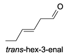{.question-figure fig-alt="trans-hex-3-enal"}

Which reagents will react with trans-hex-3-enal? 1 Fehling's reagent 2 Sodium borohydride 3 Sodium

<button class="mc-choice" data-choice="A"><strong>A</strong>1 only</button><button class="mc-choice" data-choice="B"><strong>B</strong>1 and 2</button><button class="mc-choice" data-choice="C"><strong>C</strong>2 only</button><button class="mc-choice" data-choice="D"><strong>D</strong>2 and 3</button>

<button class="check-answer">Check answer</button>

Show detailed explanation

<strong>B.</strong> The aldehyde group is oxidised by Fehling's reagent and reduced by NaBH4 to a primary alcohol. The molecule has neither an alcohol nor carboxylic acid group, so it does not react with sodium metal to release hydrogen.

:::

::: {.mc-question #n21-mc-e5 data-answer="C"}
### Question 5
A compound C has the following properties: liquid at room temperature; soluble in water; reacts with aqueous sodium hydroxide. What could C be?

<button class="mc-choice" data-choice="A"><strong>A</strong>Propene</button><button class="mc-choice" data-choice="B"><strong>B</strong>Propanol</button><button class="mc-choice" data-choice="C"><strong>C</strong>Propanoic acid</button><button class="mc-choice" data-choice="D"><strong>D</strong>Propyl propanoate</button>

<button class="check-answer">Check answer</button>

Show detailed explanation

<strong>C.</strong> Propanoic acid is a liquid, is water-soluble because of its polar −COOH group, and neutralises aqueous sodium hydroxide. Propene is a gas, propanol is not neutralised by sodium hydroxide, and the ester is less water-soluble.

:::

### Medium

::: {.mc-question #n21-mc-m1 data-answer="A"}
### Question 6
Sorbic acid reacts with bromine in an organic solvent and hydrogen in the presence of a Pt/Ni catalyst. How many moles of bromine and hydrogen will be incorporated into one mole of sorbic acid?

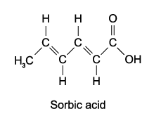{.question-figure fig-alt="Sorbic acid"}

<button class="mc-choice" data-choice="A"><strong>A</strong>2 mol Br2 and 2 mol H2</button><button class="mc-choice" data-choice="B"><strong>B</strong>2 mol Br2 and 3 mol H2</button><button class="mc-choice" data-choice="C"><strong>C</strong>1 mol Br2 and 2 mol H2</button><button class="mc-choice" data-choice="D"><strong>D</strong>1 mol Br2 and 3 mol H2</button>

<button class="check-answer">Check answer</button>

Show detailed explanation

<strong>A.</strong> Sorbic acid contains two C=C bonds. Each undergoes electrophilic addition with one Br2 or one H2, so two moles of each reagent react per mole of acid.

:::

::: {.mc-question #n21-mc-m2 data-answer="A"}
### Question 7
The naturally-occurring molecule civetone was one of the first known ingredients used in perfumery. Which reagent will not react with civetone?

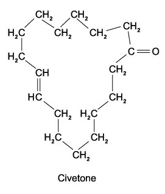{.question-figure fig-alt="Civetone"}

<button class="mc-choice" data-choice="A"><strong>A</strong>Fehling's reagent</button><button class="mc-choice" data-choice="B"><strong>B</strong>Hydrogen bromide</button><button class="mc-choice" data-choice="C"><strong>C</strong>2,4-dinitrophenylhydrazine reagent</button><button class="mc-choice" data-choice="D"><strong>D</strong>Sodium tetrahydridoborate(III), NaBH4</button>

<button class="check-answer">Check answer</button>

Show detailed explanation

<strong>A.</strong> Civetone contains a ketone and an alkene, but no aldehyde. Fehling's reagent tests aldehydes; HBr adds to the alkene, 2,4-DNPH reacts with the ketone, and NaBH4 reduces the ketone.

:::

::: {.mc-question #n21-mc-m3 data-answer="D"}
### Question 8
Compound X has formula C8H18O and is unreactive towards mild oxidising agents. What is the structure of the compound formed by dehydration of X?

<button class="mc-choice" data-choice="A"><strong>A</strong>Compound 3 only</button><button class="mc-choice" data-choice="B"><strong>B</strong>Compounds 1 and 2</button><button class="mc-choice" data-choice="C"><strong>C</strong>Compounds 1, 2 and 3</button><button class="mc-choice" data-choice="D"><strong>D</strong>Compounds 3 and 4</button>

<button class="check-answer">Check answer</button>

Show detailed explanation

<strong>D.</strong> Unreactivity toward mild oxidation identifies a tertiary alcohol. Acid-catalysed dehydration forms a tertiary carbocation, and loss of a proton from either adjacent alkyl group gives compounds 3 and 4, which are the same structure drawn in different orientations.

:::

::: {.mc-question #n21-mc-m4 data-answer="C"}
### Question 9
A student carried out a series of tests on the compound shown. Which pairs of reagents would both give a positive result? 1 Sodium carbonate and 2,4-DNPH 2 Fehling's reagent and aqueous bromine 3 Tollens' reagent and acidified dichromate(VI) ions

<button class="mc-choice" data-choice="A"><strong>A</strong>1 only</button><button class="mc-choice" data-choice="B"><strong>B</strong>1 and 2</button><button class="mc-choice" data-choice="C"><strong>C</strong>2 and 3</button><button class="mc-choice" data-choice="D"><strong>D</strong>1, 2 and 3</button>

<button class="check-answer">Check answer</button>

Show detailed explanation

<strong>C.</strong> The compound contains an aldehyde and an alkene. Both Fehling's/Tollens' and acidified dichromate react with the aldehyde; bromine reacts with the alkene. It has no carboxylic acid, so sodium carbonate is negative, and 2,4-DNPH is not paired with a positive test in statement 1.

:::

::: {.mc-question #n21-mc-m5 data-answer="B"}
### Question 10
1, 2 and 3 give the molecular formula of organic compounds. Which would cause decolourisation of aqueous bromine and react with sodium to evolve hydrogen gas?

1 C3H6O &nbsp; 2 C3H8O &nbsp; 3 C3H4O2

<button class="mc-choice" data-choice="A"><strong>A</strong>1, 2 and 3</button><button class="mc-choice" data-choice="B"><strong>B</strong>1 and 3</button><button class="mc-choice" data-choice="C"><strong>C</strong>2 and 3</button><button class="mc-choice" data-choice="D"><strong>D</strong>2 only</button>

<button class="check-answer">Check answer</button>

Show detailed explanation

<strong>B.</strong> Compounds 1 and 3 contain both an alkene and an alcohol or carboxylic acid group. They decolourise bromine and release hydrogen with sodium. Compound 2 contains an alcohol but no C=C.

:::

::: {.mc-question #n21-mc-m6 data-answer="C"}
### Question 11
The structure of monosodium glutamate (MSG) is shown. Which set of reagents and conditions could be used to prepare it? 1 Heat under reflux with NaOH(aq) 2 Heat with sodium methanoate, HCO2−Na+ 3 Heat under reflux with ethanolic KCN followed by hydrolysis with NaOH(aq)

<button class="mc-choice" data-choice="A"><strong>A</strong>1, 2 and 3</button><button class="mc-choice" data-choice="B"><strong>B</strong>1 and 2</button><button class="mc-choice" data-choice="C"><strong>C</strong>2 and 3</button><button class="mc-choice" data-choice="D"><strong>D</strong>1 only</button>

<button class="check-answer">Check answer</button>

Show detailed explanation

<strong>C.</strong> Methanoate can substitute a halogen to give the required carboxylate group. Ethanolic KCN substitutes the halogen to give a nitrile, and alkaline hydrolysis converts the nitrile into the carboxylate salt. Aqueous NaOH alone would make an alcohol.

:::

::: {.mc-question #n21-mc-m7 data-answer="A"}
### Question 12
An alkene reacts with acidified manganate(VII) ions. The organic product has a relative molecular mass greater than that of the alkene by 34. What are the specific conditions?

<button class="mc-choice" data-choice="A"><strong>A</strong>Cold, dilute MnO4−</button><button class="mc-choice" data-choice="B"><strong>B</strong>Cold, concentrated MnO4−</button><button class="mc-choice" data-choice="C"><strong>C</strong>Hot, dilute MnO4−</button><button class="mc-choice" data-choice="D"><strong>D</strong>Hot, concentrated MnO4−</button>

<button class="check-answer">Check answer</button>

Show detailed explanation

<strong>A.</strong> An increase of 34 corresponds to adding two −OH groups, 2(16+1)=34. Cold, dilute acidified permanganate converts an alkene to a diol; hot concentrated reagent cleaves the double bond.

:::

::: {.mc-question #n21-mc-m8 data-answer="C"}
### Question 13
Pentanoic acid can be produced from 1-bromobutane using reagents Y and Z. What could be reagents Y and Z?

<button class="mc-choice" data-choice="A"><strong>A</strong>Y NaOH(aq); Z HCl(aq)</button><button class="mc-choice" data-choice="B"><strong>B</strong>Y NH3 in ethanol; Z H+/Cr2O72−(aq)</button><button class="mc-choice" data-choice="C"><strong>C</strong>Y KCN in ethanol; Z HCl(aq)</button><button class="mc-choice" data-choice="D"><strong>D</strong>Y KCN in ethanol; Z NaOH(aq)</button>

<button class="check-answer">Check answer</button>

Show detailed explanation

<strong>C.</strong> Ethanolic KCN substitutes Br and adds one carbon, forming pentanenitrile. Acid hydrolysis of the nitrile gives pentanoic acid and an ammonium salt. Alkaline hydrolysis would initially give the carboxylate salt.

:::

::: {.mc-question #n21-mc-m9 data-answer="B"}
### Question 14
In which reaction has a carbocation intermediate?

<button class="mc-choice" data-choice="A"><strong>A</strong>CH3CH2Br + NaOH → CH3CH2OH + NaBr</button><button class="mc-choice" data-choice="B"><strong>B</strong>CH2=CH2 + Br2 → CH2BrCH2Br</button><button class="mc-choice" data-choice="C"><strong>C</strong>CH3CH3 + Cl2 → CH3CH2Cl + HCl</button><button class="mc-choice" data-choice="D"><strong>D</strong>CH3CHO + HCN → CH3CH(OH)CN</button>

<button class="check-answer">Check answer</button>

Show detailed explanation

<strong>B.</strong> Electrophilic addition of bromine to the alkene proceeds through an intermediate before bromide attacks. A is nucleophilic substitution, C is free-radical substitution, and D is nucleophilic addition to a carbonyl group.

:::

::: {.mc-question #n21-mc-m10 data-answer="D"}
### Question 15
Hept-4-enal, CH3CH2CH=CHCH2CH2CHO, is reduced with either hydrogen/Ni or sodium borohydride. What organic product is formed?

<button class="mc-choice" data-choice="A"><strong>A</strong>CH3(CH2)5CH3 with H2/Ni</button><button class="mc-choice" data-choice="B"><strong>B</strong>CH3(CH2)5CHO with NaBH4</button><button class="mc-choice" data-choice="C"><strong>C</strong>Alcohol product with H2/Ni</button><button class="mc-choice" data-choice="D"><strong>D</strong>CH3CH2CH2CH(OH)CH2CH2CH3 with NaBH4</button>

<button class="check-answer">Check answer</button>

Show detailed explanation

<strong>D.</strong> NaBH4 reduces the aldehyde to a primary alcohol while leaving the C=C unchanged. Hydrogenation with Ni reduces the alkene but does not reduce the aldehyde in this AS comparison.

:::

### Hard

::: {.mc-question #n21-mc-h1 data-answer="C"}
### Question 16
The diagram shows cholesterol. Cold dilute acidified KMnO4 and hot concentrated acidified KMnO4 are used. Which row correctly describes the changes?

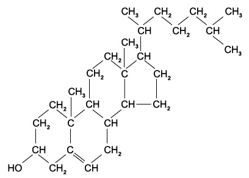{.question-figure fig-alt="Cholesterol structure"}

<button class="mc-choice" data-choice="A"><strong>A</strong>+1 chiral carbon; 1 hydroxy group; −1 chiral carbon; 2 six-membered rings</button><button class="mc-choice" data-choice="B"><strong>B</strong>+1 chiral carbon; 1 hydroxy group; −1 chiral carbon; 3 six-membered rings</button><button class="mc-choice" data-choice="C"><strong>C</strong>+2 chiral carbons; 3 hydroxy groups; −1 chiral carbon; 2 six-membered rings</button><button class="mc-choice" data-choice="D"><strong>D</strong>+2 chiral carbons; 3 hydroxy groups; no chiral-carbon decrease; 3 six-membered rings</button>

<button class="check-answer">Check answer</button>

Show detailed explanation

<strong>C.</strong> Cold dilute permanganate converts C=C into a vicinal diol, adding two chiral centres and giving three OH groups in total. Hot concentrated permanganate cleaves C=C and oxidises the existing secondary alcohol; one chiral centre is lost and two six-membered rings remain.

:::

::: {.mc-question #n21-mc-h2 data-answer="D"}
### Question 17
The cyclic compound G is heated with dilute hydrochloric acid. What are the products?

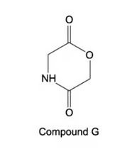{.question-figure fig-alt="Cyclic compound G"}

<button class="mc-choice" data-choice="A"><strong>A</strong>HOCH2CO2H and H2NCH2CO2H</button><button class="mc-choice" data-choice="B"><strong>B</strong>H2NCOCH2OH and HOCH2CHO</button><button class="mc-choice" data-choice="C"><strong>C</strong>HOCH2CONH3+ and HOCH2CHO</button><button class="mc-choice" data-choice="D"><strong>D</strong>HO2CCH2NH3+ and HO2CCH2OH</button>

<button class="check-answer">Check answer</button>

Show detailed explanation

<strong>D.</strong> Acidic hydrolysis breaks both amide and ester links. The amine is protonated to an ammonium ion, and the ester gives a carboxylic acid plus an alcohol; hence both products contain carboxylic acid groups in acidic solution.

:::

::: {.mc-question #n21-mc-h3 data-answer="C"}
### Question 18
Cholesterol has the following structure. Which statements are correct? 1 It forms an aldehyde after oxidation by acidified sodium dichromate(VI). 2 It reacts with bromine to form a compound which has two new chiral centres. 3 It reacts with a mixture of concentrated sulfuric acid and ethanoic acid.

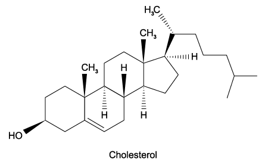{.question-figure fig-alt="Cholesterol structure"}

<button class="mc-choice" data-choice="A"><strong>A</strong>1, 2 and 3</button><button class="mc-choice" data-choice="B"><strong>B</strong>1 and 2</button><button class="mc-choice" data-choice="C"><strong>C</strong>2 and 3</button><button class="mc-choice" data-choice="D"><strong>D</strong>1 only</button>

<button class="check-answer">Check answer</button>

Show detailed explanation

<strong>C.</strong> Bromine adds across the alkene; the two formerly trigonal carbons become tetrahedral and two new chiral centres can result. The alcohol group reacts in acid with concentrated sulfuric and ethanoic acids. Dichromate oxidises the secondary alcohol to a ketone, not an aldehyde.

:::

::: {.mc-question #n21-mc-h4 data-answer="D"}
### Question 19
Student 1 says cholesterol displays cis-trans isomerism at the C=C double bond. Student 2 says all carbon atoms within the rings of cholesterol lie in the same plane. Which students are correct?

<button class="mc-choice" data-choice="A"><strong>A</strong>Both 1 and 2</button><button class="mc-choice" data-choice="B"><strong>B</strong>1 only</button><button class="mc-choice" data-choice="C"><strong>C</strong>2 only</button><button class="mc-choice" data-choice="D"><strong>D</strong>Neither 1 nor 2</button>

<button class="check-answer">Check answer</button>

Show detailed explanation

<strong>D.</strong> The C=C is inside a six-membered ring, which fixes the geometry and prevents cis-trans isomerism. Only atoms involved in a C=C or C≡C are planar; the saturated ring carbons are tetrahedral and are not all in one plane.

:::

::: {.mc-question #n21-mc-h5 data-answer="D"}
### Question 20
Santonin is first treated with warm dilute H2SO4, then with cold acidified KMnO4. How many atoms of hydrogen in each molecule of product Y could be displaced by sodium metal?

<button class="mc-choice" data-choice="A"><strong>A</strong>2</button><button class="mc-choice" data-choice="B"><strong>B</strong>4</button><button class="mc-choice" data-choice="C"><strong>C</strong>5</button><button class="mc-choice" data-choice="D"><strong>D</strong>6</button>

<button class="check-answer">Check answer</button>

Show detailed explanation

<strong>D.</strong> Ester hydrolysis gives one alcohol and one carboxylic acid hydrogen. The two alkene bonds each become diols under cold dilute permanganate, adding four OH hydrogens. Total acidic OH hydrogens that react with sodium: 4+1+1=6.

:::

## Structured questions

从 Easy、Medium、Hard 各组按原题顺序选取 10 道 structured questions。答案根据对应 PDF 后半部分 Model Answers 展开，并保留原小问编号和分值。

### Easy

::: {.question-card #n21-sq-e1}
### Question 1
Alcohols and alkenes are versatile chemicals that are often involved in many organic synthetic reaction schemes.

Butan-1-ol can be converted directly into 1-bromobutane.

State the reagents and conditions required for this conversion. [3 marks]

Heating butan-1-ol with concentrated sulfuric acid causes the loss of a small molecule. State the type of reaction involved and name the resulting alkene. [2 marks]

The alkene formed can react with hydrogen bromide to form 1-bromobutane, however there will be a second organic product. Name the second organic product formed. [1 mark]

Show detailed reference answer

<strong>(a)</strong> Use NaBr and concentrated H2SO4, heat under reflux. An alternative is PBr3, added dropwise. <strong>(b)</strong> Elimination/dehydration; water is lost and but-1-ene forms. <strong>(c)</strong> 2-bromobutane. HBr adds across but-1-ene; the secondary carbocation pathway is favoured, so 2-bromobutane is the major product and 1-bromobutane the minor product.

:::

::: {.question-card #n21-sq-e2}
### Question 2
Describe one simple test-tube reaction that allows you to distinguish between compounds G and H shown in Fig. 2.1. Your answer should include a suitable reagent and the expected observations when each compound is tested separately with this reagent.

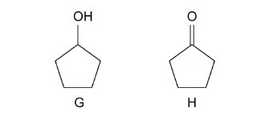{.question-figure fig-alt="Compounds G and H"}

Describe one simple test-tube reaction that allows you to distinguish between compounds I and J, shown in Fig. 2.2.

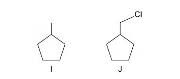{.question-figure fig-alt="Compounds I and J"}

Describe one simple test-tube reaction that allows you to distinguish between compounds K and L, shown in Fig. 2.3. The test-tube reaction should not convert compound K into compound L.

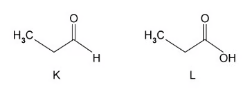{.question-figure fig-alt="Compounds K and L"}

Show detailed reference answer

<strong>G/H:</strong> Add acidified potassium dichromate(VI). G changes orange to green because a secondary alcohol oxidises to a ketone; H shows no visible change because a ketone is not oxidised. Acidified permanganate, purple to colourless for G and no change for H, is also valid.

<strong>I/J:</strong> Heat with aqueous sodium hydroxide, then acidify and add silver nitrate. I gives no precipitate; J gives a white AgCl precipitate because nucleophilic substitution releases chloride.

<strong>K/L:</strong> Add sodium carbonate solution. K gives no visible change; L gives effervescence because L is a carboxylic acid and releases carbon dioxide. This does not oxidise K into L.

:::

::: {.question-card #n21-sq-e3}
### Question 3
A reaction pathway is shown in Fig. 3.1.

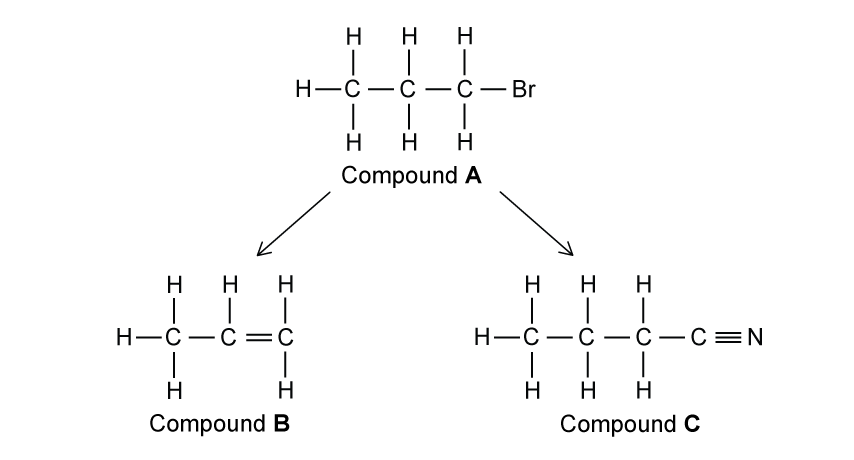{.question-figure fig-alt="Reaction pathway from compound A to C"}

State the reagents and conditions required for the conversion of compounds A to B and B to C. [6 marks] Name compound C. [1 mark] Compound B reacts with cold dilute potassium manganate(VII) to form compound D. Draw D. Compound B also reacts with hot concentrated potassium manganate(VII) to form compounds E and F. Draw E and F. [3 marks]

Show detailed reference answer

<strong>A to B:</strong> heat with aqueous KOH/NaOH under reflux; this is nucleophilic substitution of Br by OH. <strong>B to C:</strong> heat with ethanolic KCN under reflux; this is nucleophilic substitution and forms a nitrile. <strong>C:</strong> 2-hydroxybutanenitrile. <strong>D:</strong> the vicinal diol formed by adding OH to both alkene carbons. <strong>E/F:</strong> hot concentrated permanganate cleaves the C=C; draw the corresponding aldehyde/ketone or carboxylic-acid products shown by the two alkene carbons in Fig. 3.1.

<strong>Marking points:</strong> aqueous hydroxide and reflux; ethanolic KCN and reflux; correct nitrile name; correct cold-dilute diol and hot-concentrated cleavage products.

:::

### Medium

::: {.question-card #n21-sq-m1}
### Question 4
But-2-ene can be converted into butan-2-ol by two different synthetic routes. One route can be carried out as a one-step process whilst the other requires two steps.

State reagents and provide an equation, using structural formulae, for the one-step process. [3 marks]

Draw a reaction scheme, including reagents and conditions for the two step process. [3 marks]

But-1-ene can be used to form butan-2-ol by both the one-step and two-step reaction schemes. Explain why using but-1-ene gives a lower yield of butan-2-ol. [2 marks]

Give the displayed formula of the organic compounds formed when but-2-ene is reacted with cold dilute MnO4− ions and hot concentrated MnO4− ions. [2 marks]

Show detailed reference answer

<strong>One-step:</strong> steam, phosphoric acid catalyst, high temperature and pressure; CH3CH=CHCH3 + H2O → CH3CH(OH)CH2CH3. <strong>Two-step:</strong> add Br2 to form 2,3-dibromobutane, then heat with aqueous NaOH to substitute both Br atoms by OH. <strong>But-1-ene:</strong> addition can give 1- or 2-bromobutane/1- or 2-butanol; competing products reduce the yield of butan-2-ol. <strong>Cold dilute:</strong> butane-2,3-diol. <strong>Hot concentrated:</strong> cleavage gives two molecules of ethanoic acid.

:::

::: {.question-card #n21-sq-m2}
### Question 5
A series of reactions based on butan-1-ol is shown in Fig. 2.1.

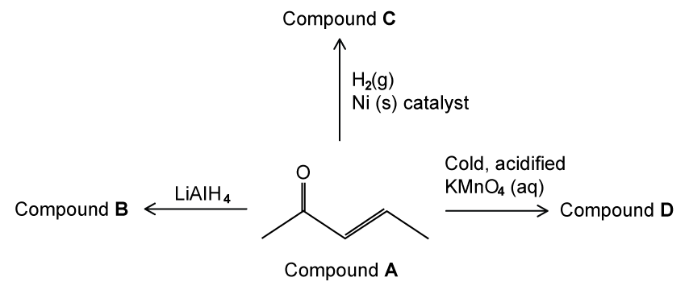{.question-figure fig-alt="Reaction scheme based on butan-1-ol"}

Suggest a suitable reagent and conditions for reaction 1. [2 marks] Write an equation for reaction 2 using [O]. Suggest a suitable reagent and conditions for reaction 2. [2 marks] Give structural formulae of U and V. [2 marks] Suggest a suitable reagent and conditions for reaction 3. [2 marks]

Show detailed reference answer

<strong>Reaction 1:</strong> hot concentrated sulfuric acid or hot Al2O3; dehydration gives but-1-ene. <strong>Reaction 2:</strong> CH3CH2CH2CH2OH + 2[O] → CH3CH2CH2CO2H + H2O; use acidified K2Cr2O7 or KMnO4, heat under reflux. <strong>U:</strong> butan-1-ol. <strong>V:</strong> butanoic acid. <strong>Reaction 3:</strong> aqueous NaOH/KOH, heat under reflux; this hydrolyses the ester to the carboxylate salt and alcohol.

:::

::: {.question-card #n21-sq-m3}
### Question 6
Some reactions of compound A are shown in Fig. 3.1. Draw skeletal structures of compounds B, C and D. State the colour change when compound D is formed. Compound A reacts with iodine and sodium hydroxide ions to give two products. Draw the skeletal structures of these two products. State the name of compound A.

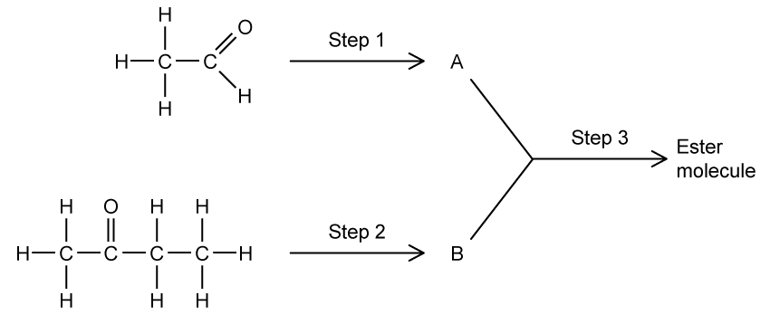{.question-figure fig-alt="Reactions of compound A"}

Show detailed reference answer

<strong>B:</strong> the alkane formed by hydrogenation with H2/Ni. <strong>C:</strong> the secondary alcohol formed by LiAlH4 reduction of the ketone. <strong>D:</strong> the vicinal diol formed with cold acidified KMnO4; the colour changes purple to colourless. The iodine/NaOH reaction gives the iodoform precipitate, CHI3, and the carboxylate salt. Compound A is a methyl ketone, named from the structure shown in Fig. 3.1.

:::

::: {.question-card #n21-sq-m4}
### Question 7
The reaction scheme shows three steps to synthesise 2-hydroxy-2-methylpropanenitrile.

Name the type of mechanism that occurs in reaction 1 and reaction 3. State the reagents and conditions required for reaction 1 and reaction 2. Draw the mechanism that occurs in reaction 3. Explain why 2-hydroxy-2-methylpropanenitrile does not exhibit optical isomerism.

Show detailed reference answer

<strong>Mechanisms:</strong> reaction 1 is nucleophilic substitution; reaction 3 is nucleophilic addition. <strong>Reagents:</strong> reaction 1 uses aqueous NaOH/KOH, heat/reflux; reaction 2 uses acidified dichromate or permanganate and heat to oxidise propan-2-ol to propanone. <strong>Reaction 3 mechanism:</strong> CN− attacks the δ+ carbonyl carbon; the C=O π bond moves to oxygen, forming an alkoxide; the oxygen is protonated by HCN and CN− is regenerated. <strong>Optical isomerism:</strong> the carbon attached to OH and CN has two identical methyl groups, so it does not have four different groups and is not chiral.

:::

### Hard

::: {.question-card #n21-sq-h1}
### Question 8
This question is about a reaction pathway to produce 1-bromo-1-methylcyclohexane. Name and outline the mechanism for the reaction between compound E and hydrogen bromide, HBr. In your answer, draw the major product. [6 marks] Explain why a major product and minor product are produced. [3 marks] Suggest a possible starting molecule and give the reagents required for step 1. [2 marks]

Show detailed reference answer

<strong>Mechanism:</strong> electrophilic addition. Show a curly arrow from C=C to H in HBr, δ+ H and δ− Br, and the H–Br bond breaking to Br. H adds to the less substituted carbon to give the more stable tertiary carbocation; Br− attacks it to form major 1-bromo-1-methylcyclohexane. <strong>Products:</strong> a tertiary-carbocation pathway gives the major product, while a secondary-carbocation pathway gives the minor product; this is the Markovnikov preference. <strong>Starting molecule:</strong> 1- or 2-methylcyclohexanol; dehydrate using hot Al2O3 or concentrated acid to form the alkene.

:::

::: {.question-card #n21-sq-h2}
### Question 9
This question is about reaction profiles using chloroalkanes. For the reaction profile in Fig. 2.1, state the mechanism or type of reaction for each step. Step 2 is carried out by heating under reflux. Identify compound H. 1-chlorobutane can be produced from an alkene. Identify the alkene and give the reagent required. Explain how the functional group of the final compound would differ if 2-chlorobutane was used.

Show detailed reference answer

<strong>(a)</strong> Step 1 is nucleophilic substitution; step 2 is oxidation. <strong>(b)</strong> 1-chlorobutane becomes butan-1-ol, then reflux oxidation gives butanoic acid. <strong>(c)</strong> Alkene but-1-ene with HCl gives 1-chlorobutane as the minor product; but-2-ene with HCl gives 2-chlorobutane. <strong>(d)</strong> Starting with 2-chlorobutane gives butan-2-ol after substitution, which oxidises under reflux to a ketone rather than a carboxylic acid.

:::

::: {.question-card #n21-sq-h3}
### Question 10
Compounds W, X and Y contain carbon, hydrogen and oxygen only. X and Y are straight-chain compounds, each containing five carbons. W and a byproduct Z are formed from X and Y. X can be oxidised by acidified potassium dichromate to give Y. 2.754 g of Y contains 0.027 moles. Using the information given, state the name of Y. Deduce the structural formula of W and explain how Z is formed. Explain how a student could stop the full oxidation of X. Deduce the formula of an isomer of X that will not react with acidified potassium dichromate.

Show detailed reference answer

<strong>Y:</strong> M=2.754/0.027=102.00 g mol−1. A five-carbon oxidation product with this molar mass is pentanoic acid, CH3CH2CH2CH2CO2H. <strong>W:</strong> pentyl pentanoate, CH3CH2CH2CH2COOCH2CH2CH2CH2CH3. <strong>Z:</strong> water, eliminated in condensation of pentanoic acid and pentanol. <strong>Prevent full oxidation:</strong> distil off the aldehyde as soon as it forms, above its boiling point. <strong>Unreactive isomer:</strong> 2-methylbutan-2-ol, CH3C(CH3)(OH)CH2CH3, because it is a tertiary alcohol.

:::

## Original question PDFs

- [3.9 Organic Synthesis — Choice — Easy](https://raw.githubusercontent.com/nanoxsj/CIE-Chemistry-Study/main/assets/questions/original-source/3.9_organic_synthesis_choice_easy.pdf)
- [3.9 Organic Synthesis — Choice — Medium](https://raw.githubusercontent.com/nanoxsj/CIE-Chemistry-Study/main/assets/questions/original-source/3.9_organic_synthesis_choice_medium.pdf)
- [3.9 Organic Synthesis — Choice — Hard](https://raw.githubusercontent.com/nanoxsj/CIE-Chemistry-Study/main/assets/questions/original-source/3.9_organic_synthesis_choice_hard.pdf)
- [3.9 Organic Synthesis — SQ — Easy](https://raw.githubusercontent.com/nanoxsj/CIE-Chemistry-Study/main/assets/questions/original-source/3.9_organic_synthesis_sq_easy.pdf)
- [3.9 Organic Synthesis — SQ — Medium](https://raw.githubusercontent.com/nanoxsj/CIE-Chemistry-Study/main/assets/questions/original-source/3.9_organic_synthesis_sq_medium.pdf)
- [3.9 Organic Synthesis — SQ — Hard](https://raw.githubusercontent.com/nanoxsj/CIE-Chemistry-Study/main/assets/questions/original-source/3.9_organic_synthesis_sq_hard.pdf)
