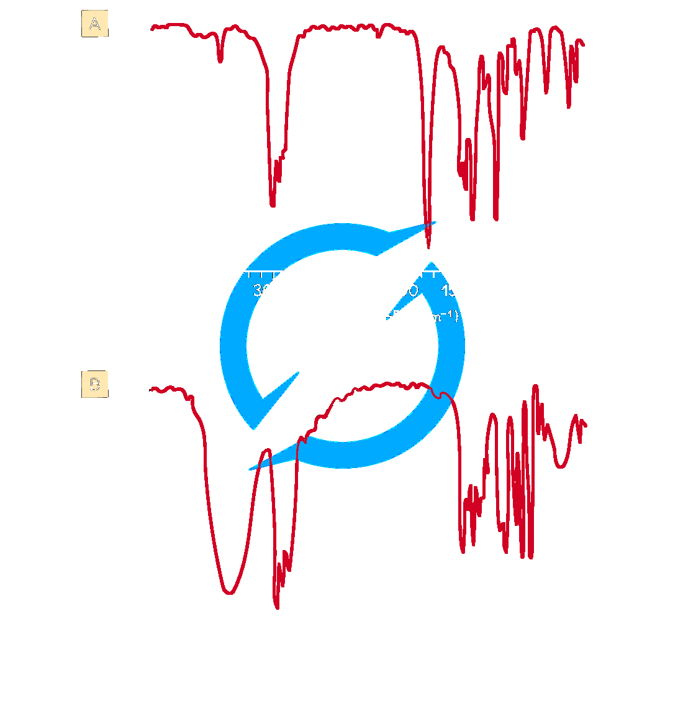
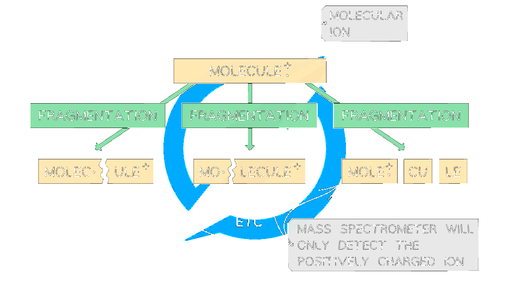

# 22 Analytical techniques

本章只覆盖 Cambridge International AS Level Chemistry 9701 的 **4.1 Analytical Techniques**，知识点对应 **22.1 Infrared Spectroscopy** 和 **22.2 Mass Spectrometry**。题目来自 Topical Past Papers/AS 的 4.1 Analytical Techniques 题库；题目保留原题问法、选项结构和小问分值。共 20 道 multiple-choice questions 和 10 道 structured questions。无法独立提取的整页题图不放入页面。

## Learning objectives

- use IR wavenumber ranges to identify functional groups;
- explain broad and sharp absorptions and the fingerprint region;
- explain electron bombardment, molecular ions, fragments, base peak and m/e;
- calculate relative atomic mass from isotope abundance;
- use M+, M+1 and M+2 peaks to deduce molecular mass, carbon number and halogen isotopes;
- combine IR and mass-spectrometry evidence to identify an unknown.

## 22.1 Infrared Spectroscopy

Infrared spectroscopy identifies compounds from changes in atomic vibrations when bonds absorb IR radiation. A spectrophotometer passes IR radiation through a sample and records transmitted intensity. Different bonds absorb at characteristic wavenumbers because vibration depends on bond strength and the masses of the bonded atoms. The spectrum is plotted as transmittance against wavenumber in cm−1; an absorption is usually a downward peak.

{.concept-figure fig-alt="IR spectra of propanone and propan-2-ol"}

| Bond | Functional group(s) | Characteristic range / cm−1 |
|---|---|---:|
| C–O | hydroxy, ester | 1040–1300 |
| C=C | aromatic compound, alkene | 1500–1680 |
| C=O | amide | 1640–1690 |
| C=O | carbonyl, carboxyl | 1670–1740 |
| C=O | ester | 1710–1750 |
| C≡N | nitrile | 2200–2250 |
| C–H | alkane | 2850–2950 |
| O–H | carboxyl | 2500–3000 |
| N–H | amine, amide | 3300–3500 |
| O–H | hydroxy | 3200–3600 |

Hydrogen bonding makes O–H absorptions broad. Carbonyl absorptions are normally strong and sharp. IR is excellent for functional groups but is not always sufficient for a complete structure: bands may overlap, while the fingerprint region below about 1500 cm−1 is most useful by comparison with a reference spectrum. A strong sharp peak near 1710 cm−1 indicates C=O in propanone; a broad peak near 3200–3500 cm−1 indicates O–H in propan-2-ol.

## 22.2 Mass Spectrometry

High-energy electrons remove an electron from a molecule:

M → M•+ + e−

The positively charged molecular ion can fragment into positive ions, neutral molecules and radicals. Only positive ions reach the detector. Ions are separated by their mass-to-charge ratio, m/e; a smaller value is deflected more strongly. The base peak is the most abundant ion and is assigned 100%, not necessarily the molecular ion.

{.concept-figure fig-alt="Mass spectrometry ion formation"}

For isotopes:

Ar = ((abundance1 × mass1) + (abundance2 × mass2) + …) ÷ total abundance

The molecular ion peak normally has the highest m/e, ignoring heavier-isotope peaks, and gives the relative molecular mass. Common fragments include CH3+ (15), C2H5+ (29), C3H7+ (43), C4H9+ (57), and CH2OH+ (31).

The M+1 peak is mainly caused by 13C (about 1.1%). Thus:

number of C atoms = (100 × abundance of M+1) ÷ (1.1 × abundance of M+)

One chlorine atom gives M and M+2 in a 3:1 ratio; two chlorine atoms give M, M+2 and M+4 in a 9:6:1 ratio. One bromine atom gives two approximately equal peaks; two bromine atoms give 1:2:1.

## Multiple-choice questions

以下 20 道选择题按 Easy、Medium、Hard 题库选取；答案和解释均根据对应 PDF 后半部分 Model Answers 核对。

### Easy

::: {.mc-question #n22-mc-e1 data-answer="D"}
### Question 1
Which of the following corresponds to the base peak in a mass spectrum?

<button class="mc-choice" data-choice="A"><strong>A</strong>The ion with the lowest m/e</button><button class="mc-choice" data-choice="B"><strong>B</strong>The molecular ion</button><button class="mc-choice" data-choice="C"><strong>C</strong>Any fragment ion</button><button class="mc-choice" data-choice="D"><strong>D</strong>The most abundant ion</button>

<button class="check-answer">Check answer</button>

Show detailed explanation

<strong>D.</strong> The base peak is the most abundant positive ion and is assigned 100% relative abundance. It is not necessarily the molecular ion.

:::

::: {.mc-question #n22-mc-e2 data-answer="C"}
### Question 2
Which fragment would produce the tallest peak at m/e=55 in the mass spectrum of ricinoleic acid?

<button class="mc-choice" data-choice="A"><strong>A</strong>CH2CO2+</button><button class="mc-choice" data-choice="B"><strong>B</strong>CH=CHCHOH+</button><button class="mc-choice" data-choice="C"><strong>C</strong>C4H7+</button><button class="mc-choice" data-choice="D"><strong>D</strong>COOH+</button>

<button class="check-answer">Check answer</button>

Show detailed explanation

<strong>C.</strong> C4H7+ has mass 4(12)+7=55; the other choices have masses 58, 56 and 45.

:::

::: {.mc-question #n22-mc-e3 data-answer="D"}
### Question 3
In a mass spectrometer, the ions are separated. Which species will be deflected to the greatest extent?

<button class="mc-choice" data-choice="A"><strong>A</strong>37Na+</button><button class="mc-choice" data-choice="B"><strong>B</strong>35Na+</button><button class="mc-choice" data-choice="C"><strong>C</strong>37Na</button><button class="mc-choice" data-choice="D"><strong>D</strong>35Na2+</button>

<button class="check-answer">Check answer</button>

Show detailed explanation

<strong>D.</strong> Deflection depends on m/e. 35Na2+ has 35÷2=17.5, the smallest value; neutral Na is not deflected.

:::

::: {.mc-question #n22-mc-e4 data-answer="A"}
### Question 4
Which statement about propanal, CH3CH2CHO, and propanone, CH3COCH3, is not correct?

<button class="mc-choice" data-choice="A"><strong>A</strong>The molecular ion peaks have different m/e values</button><button class="mc-choice" data-choice="B"><strong>B</strong>They have different fragmentation patterns</button><button class="mc-choice" data-choice="C"><strong>C</strong>Both show IR absorption due to a carbonyl group</button><button class="mc-choice" data-choice="D"><strong>D</strong>They have different fingerprint regions</button>

<button class="check-answer">Check answer</button>

Show detailed explanation

<strong>A.</strong> Both have formula C3H6O, so both molecular ions are at m/e=58. Their fragments and fingerprint regions can differ.

:::

::: {.mc-question #n22-mc-e5 data-answer="C"}
### Question 5
Silicon has isotopes 28Si (81.21%), 29Si (14.10%) and 30Si (4.69%). What is its relative atomic mass to 1 decimal place?

<button class="mc-choice" data-choice="A"><strong>A</strong>29.8</button><button class="mc-choice" data-choice="B"><strong>B</strong>29.0</button><button class="mc-choice" data-choice="C"><strong>C</strong>28.2</button><button class="mc-choice" data-choice="D"><strong>D</strong>28.0</button>

<button class="check-answer">Check answer</button>

Show detailed explanation

<strong>C.</strong> Ar=(81.21×28+14.10×29+4.69×30)÷100=28.2348≈28.2.

:::

### Medium

::: {.mc-question #n22-mc-m1 data-answer="D"}
### Question 6
Which alcohol is not likely to have a fragment ion at m/e=43?

<button class="mc-choice" data-choice="A"><strong>A</strong>(CH3)2CHCH2OH</button><button class="mc-choice" data-choice="B"><strong>B</strong>CH3CH(OH)CH2CH2CH3</button><button class="mc-choice" data-choice="C"><strong>C</strong>CH3CH2CH2CH2OH</button><button class="mc-choice" data-choice="D"><strong>D</strong>CH3CH2CH(OH)CH3</button>

<button class="check-answer">Check answer</button>

Show detailed explanation

<strong>D.</strong> A 43 ion can be C3H7+, such as CH3CH2CH2+ or (CH3)2CH+. Butan-2-ol contains neither fragment.

:::

::: {.mc-question #n22-mc-m2 data-answer="A"}
### Question 7
Which compound is not likely to have a fragment ion at m/e=43?

<button class="mc-choice" data-choice="A"><strong>A</strong>Propanoic acid</button><button class="mc-choice" data-choice="B"><strong>B</strong>Propanal</button><button class="mc-choice" data-choice="C"><strong>C</strong>Propanone</button><button class="mc-choice" data-choice="D"><strong>D</strong>Propan-1-ol</button>

<button class="check-answer">Check answer</button>

Show detailed explanation

<strong>A.</strong> The common 43 ions include C3H7+ and CH3CO+. Propanoic acid does not contain a suitable three-carbon or acetyl fragment; it can give a 57 ion.

:::

::: {.mc-question #n22-mc-m3 data-answer="A"}
### Question 8
How many molecular ion peaks are possible for C4H8Cl4, if only chlorine isotopes are considered?

<button class="mc-choice" data-choice="A"><strong>A</strong>5</button><button class="mc-choice" data-choice="B"><strong>B</strong>4</button><button class="mc-choice" data-choice="C"><strong>C</strong>3</button><button class="mc-choice" data-choice="D"><strong>D</strong>2</button>

<button class="check-answer">Check answer</button>

Show detailed explanation

<strong>A.</strong> Four chlorine atoms can contain 0, 1, 2, 3 or 4 atoms of 37Cl, giving five mass groups from M to M+8.

:::

::: {.mc-question #n22-mc-m4 data-answer="B"}
### Question 9
Bromine isotopes 79Br and 81Br have almost equal abundances. Which statement is correct for C3H7Br?

<button class="mc-choice" data-choice="A"><strong>A</strong>79Br is more reactive</button><button class="mc-choice" data-choice="B"><strong>B</strong>There are two molecular ion peaks at 122 and 124</button><button class="mc-choice" data-choice="C"><strong>C</strong>The atomic radius of 79Br is smaller</button><button class="mc-choice" data-choice="D"><strong>D</strong>The first ionisation energy of 79Br is lower</button>

<button class="check-answer">Check answer</button>

Show detailed explanation

<strong>B.</strong> 79Br gives molecular ion m/e=122 and 81Br gives 124; their heights are similar. Isotopes have essentially identical chemical and atomic properties.

:::

::: {.mc-question #n22-mc-m5 data-answer="A"}
### Question 10
Which alcohol is likely to have a fragment ion at m/e=31?

<button class="mc-choice" data-choice="A"><strong>A</strong>(CH3)2CHCH2OH</button><button class="mc-choice" data-choice="B"><strong>B</strong>CH3CH(OH)CH2CH2CH3</button><button class="mc-choice" data-choice="C"><strong>C</strong>CH3CH2CH2C(OH)(CH3)2</button><button class="mc-choice" data-choice="D"><strong>D</strong>CH3CH2CH(OH)CH3</button>

<button class="check-answer">Check answer</button>

Show detailed explanation

<strong>A.</strong> CH2OH+ has mass 31 and is present at the end of 2-methylpropan-1-ol.

:::

::: {.mc-question #n22-mc-m6 data-answer="A"}
### Question 11
Which pair of compounds both have a singly charged peak at m/e=29?

<button class="mc-choice" data-choice="A"><strong>A</strong>Propan-1-ol and propanal</button><button class="mc-choice" data-choice="B"><strong>B</strong>Propanal and propanone</button><button class="mc-choice" data-choice="C"><strong>C</strong>Propan-2-ol and propanal</button><button class="mc-choice" data-choice="D"><strong>D</strong>Propan-1-ol and propan-2-ol</button>

<button class="check-answer">Check answer</button>

Show detailed explanation

<strong>A.</strong> Both can form C2H5+, whose mass is 29. Propanone cannot form this ethyl fragment.

:::

::: {.mc-question #n22-mc-m7 data-answer="D"}
### Question 12
An IR spectrum has a peak at 1680–1695 cm−1 and no broad peak at 3200–3600 cm−1. Which compound is consistent with the spectrum?

<button class="mc-choice" data-choice="A"><strong>A</strong>Propan-1-ol</button><button class="mc-choice" data-choice="B"><strong>B</strong>Propan-2-ol</button><button class="mc-choice" data-choice="C"><strong>C</strong>Propanal</button><button class="mc-choice" data-choice="D"><strong>D</strong>Propanone</button>

<button class="check-answer">Check answer</button>

Show detailed explanation

<strong>D.</strong> The peak is C=O; no broad O–H peak excludes both alcohols. The data match propanone.

:::

::: {.mc-question #n22-mc-m8 data-answer="C"}
### Question 13
Which ketone is not expected to have a fragment ion at m/e=57?

<button class="mc-choice" data-choice="A"><strong>A</strong>Hexan-3-one</button><button class="mc-choice" data-choice="B"><strong>B</strong>Pentan-3-one</button><button class="mc-choice" data-choice="C"><strong>C</strong>3-methylbutanone</button><button class="mc-choice" data-choice="D"><strong>D</strong>Butanone</button>

<button class="check-answer">Check answer</button>

Show detailed explanation

<strong>C.</strong> The 57 ion can be C4H9+ or C2H5CO+; 3-methylbutanone cannot form either fragment.

:::

::: {.mc-question #n22-mc-m9 data-answer="C"}
### Question 14
How many molecular ion peaks are possible for Cl2?

<button class="mc-choice" data-choice="A"><strong>A</strong>5</button><button class="mc-choice" data-choice="B"><strong>B</strong>4</button><button class="mc-choice" data-choice="C"><strong>C</strong>3</button><button class="mc-choice" data-choice="D"><strong>D</strong>2</button>

<button class="check-answer">Check answer</button>

Show detailed explanation

<strong>C.</strong> The isotope combinations are 35–35, 35–37 and 37–37, giving M, M+2 and M+4.

:::

::: {.mc-question #n22-mc-m10 data-answer="D"}
### Question 15
Which statement about CH3Br is correct?

<button class="mc-choice" data-choice="A"><strong>A</strong>One molecular ion peak at 44</button><button class="mc-choice" data-choice="B"><strong>B</strong>One molecular ion peak at 95</button><button class="mc-choice" data-choice="C"><strong>C</strong>The last two peaks have a 3:1 ratio at 94 and 96</button><button class="mc-choice" data-choice="D"><strong>D</strong>The last two peaks are equal in size at 94 and 96</button>

<button class="check-answer">Check answer</button>

Show detailed explanation

<strong>D.</strong> 79Br gives 94 and 81Br gives 96; their abundances are approximately equal, so the molecular-ion peaks are equal.

:::

### Hard

::: {.mc-question #n22-mc-h1 data-answer="C"}
### Question 16
Which species produces a peak at m/e=28 in a mass spectrum of iron?

<button class="mc-choice" data-choice="A"><strong>A</strong>84Kr3+</button><button class="mc-choice" data-choice="B"><strong>B</strong>28Si+</button><button class="mc-choice" data-choice="C"><strong>C</strong>56Fe2+</button><button class="mc-choice" data-choice="D"><strong>D</strong>58Fe+</button>

<button class="check-answer">Check answer</button>

Show detailed explanation

<strong>C.</strong> m/e=56÷2=28. A pure iron sample excludes krypton and silicon; 58Fe+ would be at 58.

:::

::: {.mc-question #n22-mc-h2 data-answer="D"}
### Question 17
Two stable isotopes of bromine have relative masses 79 and 81. Which is the correct pattern of peaks in the mass spectrum of molecular bromine?

<button class="mc-choice" data-choice="A"><strong>A</strong>Only one molecular-ion peak at 160</button><button class="mc-choice" data-choice="B"><strong>B</strong>Two molecular-ion peaks at 158 and 162 only</button><button class="mc-choice" data-choice="C"><strong>C</strong>Three molecular-ion peaks with equal abundance</button><button class="mc-choice" data-choice="D"><strong>D</strong>Peaks at 158, 160 and 162 in a 1:2:1 pattern</button>

<button class="check-answer">Check answer</button>

Show detailed explanation

<strong>D.</strong> The combinations 79+79, 79+81 and 81+81 give 158, 160 and 162. The middle combination has twice the probability. Br+ fragments also give 79 and 81.

:::

::: {.mc-question #n22-mc-h3 data-answer="A"}
### Question 18
Three mass spectra are shown for compounds with formula C4H10O. Which feature confirms the molecular formula?

<button class="mc-choice" data-choice="A"><strong>A</strong>All three molecular-ion peaks occur at 74</button><button class="mc-choice" data-choice="B"><strong>B</strong>All spectra have a peak at 13</button><button class="mc-choice" data-choice="C"><strong>C</strong>All molecular-ion peaks occur at 73</button><button class="mc-choice" data-choice="D"><strong>D</strong>All spectra have a peak at 33</button>

<button class="check-answer">Check answer</button>

Show detailed explanation

<strong>A.</strong> Mr=4(12)+10+16=74, so the molecular-ion peak is at 74. Fragment peaks do not establish the complete formula.

:::

::: {.mc-question #n22-mc-h4 data-answer="B"}
### Question 19
An IR spectrum has strong absorption at 1670–1740 cm−1 and a broad absorption at 3200–3600 cm−1, but not at 2500–3000 cm−1. Which functional-group combination is present?

<button class="mc-choice" data-choice="A"><strong>A</strong>Carboxylic acid only</button><button class="mc-choice" data-choice="B"><strong>B</strong>Separate C=O and O–H groups</button><button class="mc-choice" data-choice="C"><strong>C</strong>C=C and C=O only</button><button class="mc-choice" data-choice="D"><strong>D</strong>C=C and O–H only</button>

<button class="check-answer">Check answer</button>

Show detailed explanation

<strong>B.</strong> The strong peak is C=O and the broad 3200–3600 cm−1 peak is alcohol O–H. A carboxylic-acid O–H would be in the lower 2500–3000 cm−1 range.

:::

::: {.mc-question #n22-mc-h5 data-answer="D"}
### Question 20
In the mass spectrum of trifluoroacetic acid, CF3CO2H, intense peaks occur at m/e=69 and 45. The 69 peak has an M+1 peak at 70 of about 1.1%. Which statement is not supported?

<button class="mc-choice" data-choice="A"><strong>A</strong>C–C bond cleavage occurs</button><button class="mc-choice" data-choice="B"><strong>B</strong>Fluorine is monoisotopic</button><button class="mc-choice" data-choice="C"><strong>C</strong>[HO2C]+ is a fragment ion</button><button class="mc-choice" data-choice="D"><strong>D</strong>The molecule fragments by sequential loss of F atoms</button>

<button class="check-answer">Check answer</button>

Show detailed explanation

<strong>D.</strong> The peaks are explained by C–C cleavage into [CF3]+ and [HO2C]+. The M+1 peak is consistent with 13C, not sequential loss of F atoms.

:::

## Structured questions

以下 10 道大题按 Easy 3 题、Medium 4 题、Hard 3 题选取；小问与分值保留，解答根据各 PDF 后半部分 Model Answers 展开。

### Easy

::: {.question-card #n22-sq-e1}
### Question 1 — Easy
There are three possible isomers, A, B and C, with the molecular formula C3H8O. Isomers A and B are positional isomers of each other. Isomer C is a functional group isomer of A and B. A student calculates that the percentage by mass of carbon in all three isomers is 60.0%. Calculate the percentage by mass of hydrogen and oxygen in all three isomers. **[2 marks]** The infrared spectrum of isomer C does not have a peak in 3200–3600 cm−1. (i) Using the spectrum and Table 1.1, suggest a structure for C. (ii) Suggest which bonds the highlighted peak around 1130 cm−1 could represent. **[2 marks]** Isomers A and B both have a peak at 3200–3600 cm−1. State two possible chemical names. **[1 mark]** Isomer A has a major peak at m/e=31. Suggest, with a reason, which compound is A. **[2 marks]**

Show detailed explanation

Mr=60. H: (8÷60)×100=13.3%; O: (16÷60)×100=26.7%. With no O–H peak, C is CH3CH2OCH3; the 1130 cm−1 peak is C–O. A and B are propan-1-ol and propan-2-ol. A is propan-1-ol because it forms CH2OH+ at 31.

:::

::: {.question-card #n22-sq-e2}
### Question 2 — Easy
Using mass spectroscopy, a sample of boron was found to contain 10B and 11B with relative abundance 20% and 80%. Calculate the relative atomic mass. **[2 marks]** Write the equation for formation of the molecular ion of octane and predict its m/e. **[2 marks]** Butane has a molecular ion peak at 58.0. Explain the smaller peak at 59.0. **[2 marks]** Which alkane has the higher M+1 peak, octane or butane? Give a reason. **[1 mark]**

Show detailed explanation

Ar=(20×10+80×11)÷100=10.8. C8H18→C8H18•++e−; m/e=114. The 59 peak is M+1 from one 13C atom. Octane has the larger M+1 because it has more carbon atoms.

:::

::: {.question-card #n22-sq-e3}
### Question 3 — Easy
Spectrum Y has an absorption at 1700–1750 cm−1. Spectrum Z has absorptions at 2500–3000 cm−1 and 1700–1750 cm−1. Identify the type of compound responsible for each spectrum and the bonds responsible. **[2 marks]** Explain how IR confirms a carbonyl group. **[1 mark]** State the bonds responsible for the absorptions at 3400 cm−1 in ethanol and 1720 cm−1 in ethanal. Explain why 3400 cm−1 does not appear in ethanal. **[2 marks]**

Show detailed explanation

Y is an aldehyde or ketone: C=O at 1700–1750 cm−1. Z is a carboxylic acid: C=O and carboxyl O–H at 2500–3000 cm−1. C=O is confirmed by absorption in its characteristic range. Ethanol gives O–H at 3400; ethanal gives C=O at 1720 and has no O–H bond.

:::

### Medium

::: {.question-card #n22-sq-m1}
### Question 4 — Medium
Compound X contains carbon, hydrogen and oxygen only. Its mass spectrum has peaks at 102 (100) and 103 (6.5). A molecule contains 6 carbon atoms. Demonstrate this using the figure. Suggest its molecular formula, the fragment formula at m/e=31, and the functional group using the IR spectrum. **[2+1+1+1 marks]**

Show detailed explanation

n=(100×6.5)÷(1.1×100)=5.91≈6. Mass 102 minus 72 for six C leaves 30: one O and 14 H, so C6H14O. The 31 ion is CH2OH+. A broad peak near 3300 shows hydroxy; one oxygen excludes carboxyl.

:::

::: {.question-card #n22-sq-m2}
### Question 5 — Medium
From the mass spectrum of magnesium, complete the relative abundances of 24Mg, 25Mg and 26Mg. Calculate Ar to two decimal places. Give the full electronic configuration of 26Mg2+. Boron has 10B and 11B and Ar=10.8; deduce each abundance. **[1+1+1+3 marks]**

Show detailed explanation

Read approximately 78–79%, 10% and 11–12%. Using 78%, 10%, 12%: Ar=(0.78×24)+(0.10×25)+(0.12×26)=24.34. Configuration: 1s22s22p6. Let 10B be x%: 10x+11(100−x)=1080, so x=20%; 11B=80%.

:::

::: {.question-card #n22-sq-m3}
### Question 6 — Medium
Three compounds X, Y and Z have the same molecular formula. Explain why exact mass would not distinguish them. Identify which compound gives the IR spectrum and explain. Explain why IR alone cannot distinguish X and Y. Explain how mass spectrometry can distinguish X and Y. **[2+2+2+3 marks]**

Show detailed explanation

The molecular ions have the same mass because the formula is the same. The spectrum is Z because it has O–H at 3200–3600 and/or C=C at 1620–1680. X and Y both show the same C=O absorption, so IR has no key distinguishing peak. Their fragment patterns differ: X can give 15, 29, 43, 57, while Y can give 13, 15, 28, 29, 42, 43, 57.

:::

::: {.question-card #n22-sq-m4}
### Question 7 — Medium
The isomers A and B, C3H6O, both form an orange precipitate with 2,4-DNPH. A is unbranched and reacts with alkaline aqueous iodine to produce a yellow precipitate. B does not react with alkaline aqueous iodine. It contains a chiral centre and produces a silver mirror with Tollens’ reagent. Draw the yellow precipitate. Give structural formulae of A and B. Explain chiral centre. **[1+2+3 marks]**

Show detailed explanation

The yellow precipitate is tri-iodomethane, CHI3. A is propan-2-one, CH3COCH3, consistent with the iodoform test. B is propanal, CH3CH2CHO, consistent with Tollens’ test; use the source figure when checking the chiral-centre wording. A chiral centre is a tetrahedral atom bonded to four different groups, giving non-superimposable mirror images.

:::

### Hard

::: {.question-card #n22-sq-h1}
### Question 8 — Hard
Compound B contains carbon, hydrogen and oxygen. Its composition is 69.7% carbon, 18.6% oxygen and the remainder hydrogen. The M+1 peak is at m/z=87. Calculate the molecular formula. Its IR has a sharp peak at 1705 cm−1 and its mass spectrum has a fragment at m/e=28. Give two possible structures and explain. Identify the ion at m/e=29 and explain how its abundance distinguishes the isomers. **[3+3+3 marks]**

Show detailed explanation

H=11.7%; moles C=5.80, O=1.16, H=11.7, ratio 5:1:10, so C5H10O, mass 86 and M+1=87. C=O at 1705 and the 28 carbonyl fragment support pentan-2-one or pentan-3-one. The 29 ion is C2H5+; pentan-3-one can form two such fragments and should have the higher peak.

:::

::: {.question-card #n22-sq-h2}
### Question 9 — Hard
Compound C has an IR peak near 2250 cm−1 and molecular ion at m/e=55. Identify it and explain. Give two ways M+1 at 56 could form. Calculate the elemental composition of an 8.0 g sample. Suggest reagents for conversion into D and justify using IR. **[3+1+2+2 marks]**

Show detailed explanation

2250 cm−1 indicates C≡N. 55−26=29 gives an ethyl group, so C is propanenitrile, C2H5CN. M+1 can be 13C or proton addition. Percentages are C 65.45%, H 9.09%, N 25.45%; in 8.0 g: 5.24 g C, 0.73 g H, 2.04 g N. Use H2/Ni or LiAlH4/dry ether; C≡N disappears and N–H at 3300–3500 appears.

:::

::: {.question-card #n22-sq-h3}
### Question 10 — Hard
Alcohol E oxidises to form a carboxylic acid. Suggest what this tells you about its structure. Draw fully displayed formulae and give systematic names of the four possible primary-alcohol isomers. A major mass-spectrum peak is at m/e=45; draw the species responsible. E has a branched chain: identify the isomer and explain. **[1+4+1+1 marks]**

Show detailed explanation

E is a primary alcohol. The four isomers are pentan-1-ol, 3-methylbutan-1-ol, 2-methylbutan-1-ol and 2,2-dimethylpropan-1-ol. The 45 ion is CH2CH2OH+. The branched isomer that contains this sequence is 3-methylbutan-1-ol.

:::

## Source PDFs

- [4.1 Analytical Techniques — Choice Easy](https://raw.githubusercontent.com/nanoxsj/CIE-Chemistry-Study/main/assets/questions/original-source/4.1_analytical_techniques_choice_easy.pdf)
- [4.1 Analytical Techniques — Choice Medium](https://raw.githubusercontent.com/nanoxsj/CIE-Chemistry-Study/main/assets/questions/original-source/4.1_analytical_techniques_choice_medium.pdf)
- [4.1 Analytical Techniques — Choice Hard](https://raw.githubusercontent.com/nanoxsj/CIE-Chemistry-Study/main/assets/questions/original-source/4.1_analytical_techniques_choice_hard.pdf)
- [4.1 Analytical Techniques — SQ Easy](https://raw.githubusercontent.com/nanoxsj/CIE-Chemistry-Study/main/assets/questions/original-source/4.1_analytical_techniques_sq_easy.pdf)
- [4.1 Analytical Techniques — SQ Medium](https://raw.githubusercontent.com/nanoxsj/CIE-Chemistry-Study/main/assets/questions/original-source/4.1_analytical_techniques_sq_medium.pdf)
- [4.1 Analytical Techniques — SQ Hard](https://raw.githubusercontent.com/nanoxsj/CIE-Chemistry-Study/main/assets/questions/original-source/4.1_analytical_techniques_sq_hard.pdf)
