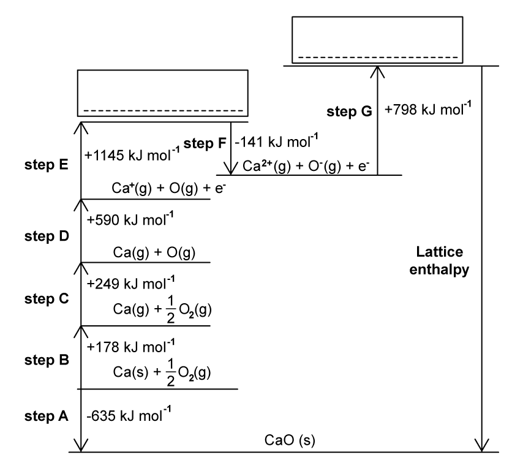
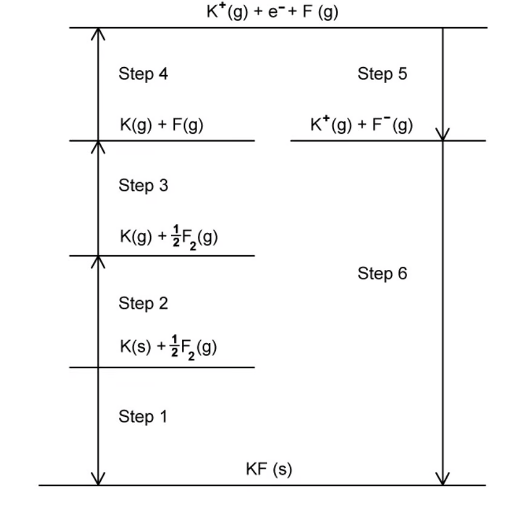
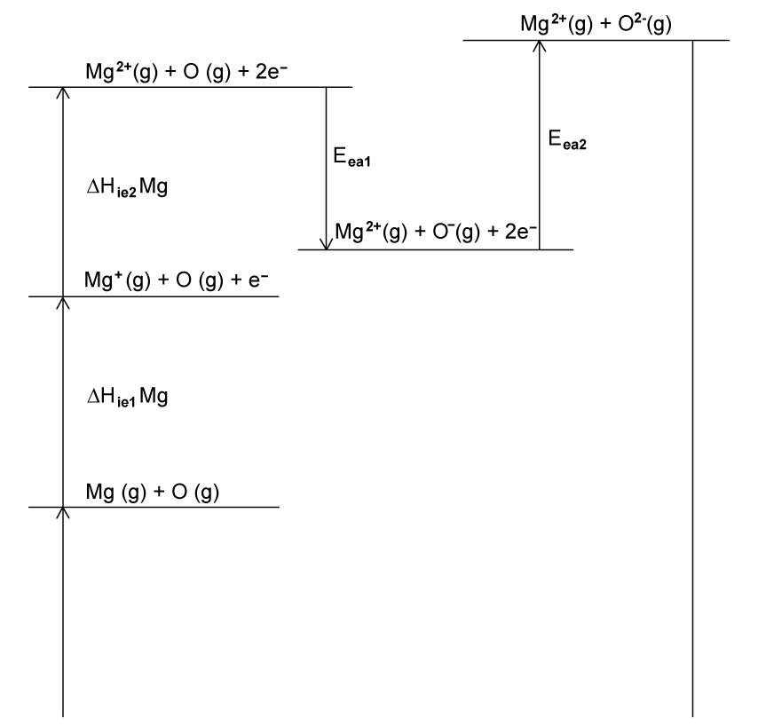
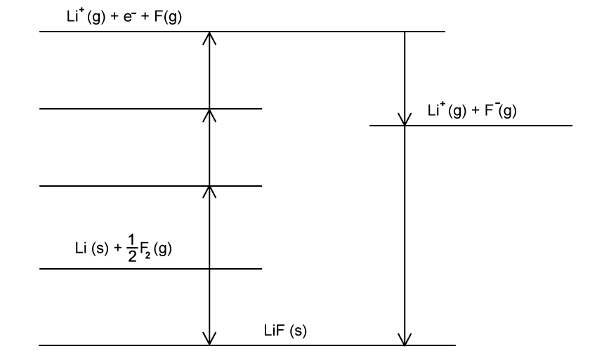
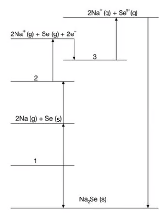

### 5.1 Chemical Energetics - Easy

::: {.question-card}
### Example 1 · Lattice energy and the CaO Born–Haber cycle · 5.1 SQ Easy Q1

This question is about the formation of calcium oxide.

**(a)** Explain the meaning of the term **lattice energy**. `[3 marks]`

**(b)** The Born–Haber cycle in Fig. 1.1 can be used to determine the lattice enthalpy of calcium oxide. Steps A–G include the values for enthalpy changes.

Complete the Born–Haber cycle by adding the species present on the two dotted lines. Include state symbols.

{.question-figure fig-alt="Born-Haber cycle for calcium oxide with dotted lines at steps E and G"}

`[2 marks]`

**(c)** Name the enthalpy changes for the following steps in the Born–Haber cycle.

- Step B
- Step D
- Step F

`[3 marks]`

**(d)** Step C represents the enthalpy change of atomisation of oxygen. Why is the enthalpy change of atomisation always a positive value? `[2 marks]`

Show mark scheme / model answer

- **(a)** The formation of 1 mole of an ionic lattice `[1]` from gaseous ions `[1]` under standard conditions. `[1]`
- **(b)** Step E: $\mathrm{Ca^{2+}(g) + O(g) + 2e^-}$ `[1]`; Step G: $\mathrm{Ca^{2+}(g) + O^{2-}(g)}$. `[1]`
- **(c)** Step B: enthalpy of atomisation (of calcium) `[1]`; Step D: first ionisation energy of calcium `[1]`; Step F: first electron affinity of oxygen. `[1]`
- **(d)** Energy is taken in to break the bonds `[1]`; (so) the process is endothermic. `[1]`

:::

::: {.question-card}
### Example 2 · Potassium fluoride cycle and enthalpy of solution · 5.1 SQ Easy Q2

This question is about lattice enthalpy.

**(a)** Write one equation to represent the following changes:

- atomisation of sodium;
- second ionisation energy of magnesium;
- first electron affinity of chlorine.

`[3 marks]`

**(b)** The Born–Haber cycle for the formation of potassium fluoride is shown in Fig. 2.1.

{.question-figure fig-alt="Born-Haber cycle for potassium fluoride with steps 1 to 6 labelled"}

Complete Table 2.1 by naming the enthalpy changes associated with the identified steps.

| Step | Name of the enthalpy change |
|---|---|
| 1 | |
| 2 | Atomisation of potassium |
| 3 | |
| 4 | First ionisation energy of potassium |
| 5 | |
| 6 | Lattice enthalpy of formation |

`[3 marks]`

**(c)** The enthalpies of lattice formation for potassium fluoride and caesium fluoride are $-830\ \mathrm{kJ\,mol^{-1}}$ and $-730\ \mathrm{kJ\,mol^{-1}}$ respectively.

Explain why the enthalpy of lattice formation is more exothermic for potassium fluoride. `[3 marks]`

**(d)** Use the data in Table 2.2 to calculate the enthalpy of solution of potassium fluoride.

| Enthalpy change | Enthalpy change / $\mathrm{kJ\,mol^{-1}}$ |
|---|---|
| $\Delta H^\ominus_{\mathrm{latt}}$ KF | −830 |
| $\Delta H^\ominus_{\mathrm{hyd}}$ K⁺ | −351 |
| $\Delta H^\ominus_{\mathrm{hyd}}$ F⁻ | −504 |
| $\Delta H^\ominus_{\mathrm{sol}}$ KF | $x$ |

`[3 marks]`

Show mark scheme / model answer

- **(a)** $\mathrm{Na(s) \rightarrow Na(g)}$ `[1]`; $\mathrm{Mg^{+}(g) \rightarrow Mg^{2+}(g) + e^-}$ `[1]`; $\mathrm{Cl(g) + e^- \rightarrow Cl^{-}(g)}$. `[1]`
- **(b)** Step 1: enthalpy change of formation `[1]`; Step 3: atomisation of fluorine `[1]`; Step 5: first electron affinity of fluorine. `[1]`
- **(c)** The potassium ion is smaller than the caesium ion / K⁺ has fewer electron shells `[1]`; the distance between the potassium ion and fluoride ion is shorter `[1]`; so the K–F bonding is stronger. `[1]`
- **(d)** $\Delta H^\ominus_{\mathrm{sol}} = \Delta H^\ominus_{\mathrm{hyd}}(K^+) + \Delta H^\ominus_{\mathrm{hyd}}(F^-) - \Delta H^\ominus_{\mathrm{latt}}$ `[1]` $= (-351) + (-504) - (-830)$ `[1]` $= -25\ \mathrm{kJ\,mol^{-1}}$. `[1]`

:::

::: {.question-card}
### Example 3 · NaCl lattice enthalpy, electron affinity and the arrows for oxygen · 5.1 SQ Easy Q3

This question is about enthalpy changes and calculations.

**(a)** Table 3.1 shows the enthalpy data for the formation of sodium chloride.

| Enthalpy change | Equation | Enthalpy change / $\mathrm{kJ\,mol^{-1}}$ |
|---|---|---:|
| $\Delta H^\ominus_{\mathrm{f}}$ NaCl | $\mathrm{Na(s) + \tfrac{1}{2}Cl_2(g) \rightarrow NaCl(s)}$ | −411 |
| $\Delta H^\ominus_{\mathrm{at}}$ Cl | $\mathrm{\tfrac{1}{2}Cl_2(g) \rightarrow Cl(g)}$ | +121 |
| $\Delta H^\ominus_{\mathrm{at}}$ Na | $\mathrm{Na(s) \rightarrow Na(g)}$ | +108 |
| $E_{ea}$ Cl | $\mathrm{Cl(g) \rightarrow Cl^{-}(g)}$ | −349 |
| $\Delta H^\ominus_{ie}$ Na | $\mathrm{Na(g) \rightarrow Na^{+}(g)}$ | +496 |
| $\Delta H^\ominus_{\mathrm{latt}}$ NaCl | $\mathrm{Na^{+}(g) + Cl^{-}(g) \rightarrow NaCl(s)}$ | to be calculated |

Calculate the enthalpy of lattice formation of sodium chloride. `[3 marks]`

**(b)** State the definition of electron affinity. `[3 marks]`

**(c)** A section of the Born–Haber cycle for the formation of magnesium oxide is shown in Fig. 3.1.

{.question-figure fig-alt="Section of the Born-Haber cycle for magnesium oxide showing first and second electron affinity arrows for oxygen"}

The first electron affinity of oxygen has a negative value so the arrow points downwards. The second electron affinity of oxygen has a positive value so the arrow points upwards.

Explain why the arrows point in different directions. `[3 marks]`

Show mark scheme / model answer

- **(a)** $\Delta H^\ominus_{\mathrm{latt}}(NaCl) = \Delta H^\ominus_{\mathrm{f}} - [\Delta H^\ominus_{\mathrm{at}}(Na) + \Delta H^\ominus_{\mathrm{at}}(Cl) + \Delta H^\ominus_{ie}(Na) + E_{ea}(Cl)]$ `[1]` $= -411 - (108 + 121 + 496 - 349)$ `[1]` $= -787\ \mathrm{kJ\,mol^{-1}}$. `[1]`
- **(b)** The electron affinity of an element is the energy change when 1 mole of electrons is gained `[1]` by 1 mole of gaseous atoms to form 1 mole of gaseous 1− ions `[1]` under standard conditions. `[1]`
- **(c)** The first electron affinity of oxygen is exothermic `[1]`; the second electron affinity of oxygen is endothermic `[1]`; because the repulsion between the incoming electron and the negative ion must be overcome. `[1]`

:::

### 5.1 Chemical Energetics - Medium

::: {.question-card}
### Example 4 · Lattice energy of potassium oxide · 5.1 SQ Medium Q1

Lattice energies are always negative showing that they represent exothermic changes.

**(a)**

**(i)** Explain what is meant by lattice energy. `[2]`

**(ii)** Explain why lattice energy is an exothermic process. `[1]`

`[3 marks]`

**(b)**

**(i)** Use relevant data from Table 5.1 to calculate the lattice energy, $\Delta H^\ominus_{\mathrm{latt}}$, of potassium oxide, $\mathrm{K_2O(s)}$. Show your working.

| Energy change | Value / $\mathrm{kJ\,mol^{-1}}$ |
|---|---:|
| Standard enthalpy change of atomisation of potassium | +89 |
| Electron affinity of $\mathrm{O(g)}$ | −141 |
| Electron affinity of $\mathrm{O^-(g)}$ | +798 |
| Standard enthalpy change of formation of potassium oxide | −361 |
| First ionisation energy of potassium | +418 |
| Second ionisation energy of potassium | +3070 |
| First ionisation energy of oxygen | +1310 |
| Second ionisation energy of oxygen | +3390 |
| O=O bond energy (diatomic molecule) | +496 |
| O–O bond energy (polyatomic molecule) | +150 |

$\Delta H^\ominus_{\mathrm{latt}}$ of $\mathrm{K_2O(s)} = \underline{\hspace{6em}}\ \mathrm{kJ\,mol^{-1}}$ `[3]`

**(ii)** State how $\Delta H^\ominus_{\mathrm{latt}}$ $\mathrm{Na_2O(s)}$ differs from $\Delta H^\ominus_{\mathrm{latt}}$ $\mathrm{K_2O(s)}$. Indicate this by placing one tick (✓) in the appropriate box in Table 5.2. Explain your answer.

| $\Delta H^\ominus_{\mathrm{latt}}$ $\mathrm{Na_2O(s)}$ is less negative than $\Delta H^\ominus_{\mathrm{latt}}$ $\mathrm{K_2O(s)}$ | $\Delta H^\ominus_{\mathrm{latt}}$ $\mathrm{Na_2O(s)}$ is the same as $\Delta H^\ominus_{\mathrm{latt}}$ $\mathrm{K_2O(s)}$ | $\Delta H^\ominus_{\mathrm{latt}}$ $\mathrm{Na_2O(s)}$ is more negative than $\Delta H^\ominus_{\mathrm{latt}}$ $\mathrm{K_2O(s)}$ |
|---|---|---|
| | | |

`[4 marks]`

Show mark scheme / model answer

- **(a)(i)** (The energy change) when 1 mole of an ionic compound is formed `[1]` from gaseous ions (under standard conditions). `[1]`
- **(a)(ii)** Forming an ionic bond `[1]` releases a large amount of energy.
- **(b)(i)** $\Delta H^\ominus_{\mathrm{latt}} = -361 - [2(+89) + \tfrac{1}{2}(+496) + 2(+418) + (-141) + (+798)]$ — correct data extraction and multipliers `[1]` $= -361 - 1919$ `[1]` $= -2280\ \mathrm{kJ\,mol^{-1}}$. `[1]`
- **(b)(ii)** Tick the third box: $\Delta H^\ominus_{\mathrm{latt}}$ $\mathrm{Na_2O(s)}$ is more negative `[1]` because sodium has a smaller ionic radius `[1]`, so there is greater attraction between the ions. `[1]`

:::

::: {.question-card}
### Example 5 · Lithium fluoride Born–Haber cycle and solution enthalpies · 5.1 SQ Medium Q2

One use of pure crystals of lithium fluoride is in X-ray monochromators.

**(a)** The Born–Haber cycle for lithium fluoride is shown in Fig. 2.1.

{.question-figure fig-alt="Born-Haber cycle for lithium fluoride with dotted lines to complete"}

**(i)** Define the term enthalpy of atomisation. `[1]`

**(ii)** Explain why the enthalpy of atomisation of fluorine is positive. `[1]`

**(iii)** Complete the Born–Haber cycle for lithium fluoride in Fig. 2.1 by adding the missing species on the lines. `[2]`

`[4 marks]`

**(b)** Use the data in Table 2.1 and your completed Born–Haber cycle from part (a) to answer the questions below.

| Name of enthalpy change | Energy change / $\mathrm{kJ\,mol^{-1}}$ |
|---|---:|
| $\mathrm{Li(s) \rightarrow Li(g)}$ | +216 |
| $\mathrm{Li(g) \rightarrow Li^{+}(g) + e^-}$ | +520 |
| $\mathrm{F_2(g) \rightarrow 2F(g)}$ | +158 |
| $\mathrm{F(g) + e^- \rightarrow F^{-}(g)}$ | −348 |
| $\mathrm{Li(s) + \tfrac{1}{2}F_2(g) \rightarrow LiF(s)}$ | −594 |

**(i)** Calculate the enthalpy of lattice formation of lithium fluoride. `[2]`

**(ii)** Explain and justify how the enthalpy of lattice formation of LiBr compares with that of LiF. You must refer to the size of the ions in your answer. `[3]`

`[5 marks]`

**(c)** This question is about enthalpy changes in solution.

**(i)** Write the equation for the process showing the enthalpy of solution of potassium fluoride. Include state symbols in your answer. `[1]`

**(ii)** Use the data in Table 2.2 to calculate the standard enthalpy of solution of potassium fluoride. `[2]`

| Name of enthalpy change in solution | Enthalpy change / $\mathrm{kJ\,mol^{-1}}$ |
|---|---:|
| Enthalpy of lattice dissociation of potassium fluoride | +829 |
| Enthalpy of hydration of potassium ions | −340 |
| Enthalpy of hydration of fluoride ions | −504 |

`[3 marks]`

**(d)** Explain why the value for the enthalpy of hydration, $\Delta H^\ominus_{\mathrm{hyd}}$, of Group 1 ions increases from lithium to caesium. `[2 marks]`

Show mark scheme / model answer

- **(a)(i)** The enthalpy change when one mole of gaseous atoms is formed from its elements under standard conditions. `[1]`
- **(a)(ii)** Energy is always required to break any bonds between the atoms in the element. `[1]`
- **(a)(iii)** Atomisation of Li: $\mathrm{Li(g) + \tfrac{1}{2}F_2(g)}$ written on the correct line `[1]`; first ionisation of Li: $\mathrm{Li^{+}(g) + e^- + \tfrac{1}{2}F_2(g)}$ written on the correct line. `[1]`
- **(b)(i)** $\Delta H^\ominus_{\mathrm{latt}}(LiF) = -594 - [216 + 79 + 520 + (-348)]$ (79 = half of +158, one mole of F atoms) `[1]` $= -1061\ \mathrm{kJ\,mol^{-1}}$. `[1]`
- **(b)(ii)** LiBr enthalpy of lattice formation is less negative / less exothermic `[1]`; Br⁻ is bigger (than F⁻) / has more electron shells `[1]`; so the attraction of bromide ion to lithium ion is weaker. `[1]`
- **(c)(i)** $\mathrm{KF(s) \rightarrow K^{+}(aq) + F^{-}(aq)}$. `[1]`
- **(c)(ii)** $\Delta H^\ominus_{\mathrm{sol}} = (+829) + (-340) + (-504)$ `[1]` $= -15\ \mathrm{kJ\,mol^{-1}}$. `[1]`
- **(d)** Ionic radius increases down the group `[1]`; therefore the attraction between the larger ion and the $\delta^-$ O atoms in the water molecule decreases. `[1]`

:::

::: {.question-card}
### Example 6 · Calcium chloride lattice energy and calcium malonate · 5.1 SQ Medium Q3

Calcium chloride, $\mathrm{CaCl_2}$, is an important industrial chemical used in refrigeration plants, for de-icing roads and for giving greater strength to concrete.

**(a)** Use an equation to show what is meant by the lattice energy of calcium chloride. `[1 mark]`

**(b)** Explain how the lattice energies of the following salts compare in magnitude with that of calcium chloride:

- calcium fluoride;
- calcium sulfide.

`[3 marks]`

**(c)** Use the data in Table 3.1 to calculate the lattice energy of $\mathrm{CaCl_2}$.

| Enthalpy change | Enthalpy change / $\mathrm{kJ\,mol^{-1}}$ |
|---|---:|
| Standard enthalpy change of formation | −796 |
| Standard enthalpy change of atomisation of $\mathrm{Ca(s)}$ | +178 |
| Electron affinity per mole of chlorine atoms | −349 |
| First ionisation energy of Ca | +590 |
| Second ionisation energy of Ca | +1150 |
| Standard enthalpy change of atomisation of $\mathrm{Cl_2(g)}$ | +244 |

`[3 marks]`

**(d)** When a solution of $\mathrm{CaCl_2}$ is added to a solution of the dicarboxylic acid, malonic acid, the salt calcium malonate is precipitated as a white solid. The solid has the following composition by mass: Ca, 28.2%; C, 25.2%; H, 1.4%; O, 45.2%.

**(i)** Calculate the empirical formula of calcium malonate. `[2]`

**(ii)** Suggest the structural formula of malonic acid. `[1]`

`[3 marks]`

Show mark scheme / model answer

- **(a)** $\mathrm{Ca^{2+}(g) + 2Cl^{-}(g) \rightarrow CaCl_2(s)}$. `[1]`
- **(b)** Both have larger (more exothermic) lattice enthalpies than $\mathrm{CaCl_2}$ `[1]`; F⁻ is smaller than Cl⁻ `[1]`; S²⁻ is more highly charged than Cl⁻. `[1]`
- **(c)** Lattice energy $= -796 - (178 + 244 + 590 + 1150 + 2 \times (-349))$ `[1]` $= -2260\ \mathrm{kJ\,mol^{-1}}$ `[1]`; the answer must be negative. `[1]`
- **(d)(i)** Moles: Ca $28.2/40.1 = 0.703$; C $25.2/12.0 = 2.10$; H $1.4/1.0 = 1.4$; O $45.2/16.0 = 2.83$; divide by 0.703 gives the ratio CaC₃H₂O₄ `[2]`.
- **(d)(ii)** $\mathrm{CH_2(CO_2H)_2}$. `[1]`

:::

::: {.question-card}
### Example 7 · Hydration enthalpy and the experimental determination of $\Delta H_{\mathrm{sol}}$ · 5.1 SQ Medium Q4

This question is about enthalpy change of hydration.

**(a)** Explain what is meant by the term enthalpy change of hydration, $\Delta H^\ominus_{\mathrm{hyd}}$. `[1 mark]`

**(b)**

**(i)** Write an equation that represents the $\Delta H^\ominus_{\mathrm{hyd}}$ of the $\mathrm{Mg^{2+}}$ ions. `[1]`

**(ii)** Suggest a reason why the $\Delta H^\ominus_{\mathrm{hyd}}$ of the $\mathrm{Mg^{2+}}$ ion is greater than $\Delta H^\ominus_{\mathrm{hyd}}$ of the $\mathrm{Ca^{2+}}$ ion. `[1]`

`[2 marks]`

**(c)** The enthalpy change of solution for $\mathrm{MgCl_2}$, ($\mathrm{MgCl_2(s)}$), is represented by the following equation:

$$\mathrm{MgCl_2(s) + aq \rightarrow Mg^{2+}(aq) + 2Cl^{-}(aq)}$$

Describe the simple apparatus you could use, and the measurements you would make, in order to determine a value for $\Delta H^\ominus_{\mathrm{sol}}(\mathrm{MgCl_2(s)})$ in the laboratory. `[4 marks]`

**(d)** Use the data in Table 4.1 to calculate the value for the enthalpy change of solution for magnesium chloride.

| Enthalpy change | Enthalpy change / $\mathrm{kJ\,mol^{-1}}$ |
|---|---:|
| $\Delta H^\ominus_{\mathrm{latt}}$ $\mathrm{MgCl_2(s)}$ | −2526 |
| $\Delta H^\ominus_{\mathrm{hyd}}(\mathrm{Mg^{2+}(g)})$ | −1890 |
| $\Delta H^\ominus_{\mathrm{hyd}}(\mathrm{Cl^{-}(g)})$ | −398 |

`[3 marks]`

Show mark scheme / model answer

- **(a)** The enthalpy change when 1 mole of gaseous ions dissolves in water. `[1]`
- **(b)(i)** $\mathrm{Mg^{2+}(g) + aq \rightarrow Mg^{2+}(aq)}$ (or $\mathrm{Mg^{2+}(g) + 6H_2O \rightarrow [Mg(H_2O)_6]^{2+}}$). `[1]`
- **(b)(ii)** $\mathrm{Mg^{2+}}$ has a smaller radius / size compared to $\mathrm{Ca^{2+}}$, or a greater charge density. `[1]`
- **(c)** Measure a known volume / mass of water into a calorimeter `[1]`; take the temperature of the water `[1]`; weigh out a known mass of $\mathrm{MgCl_2}$ `[1]`; take the final / highest temperature, or record the temperature change. `[1]`
- **(d)** $\Delta H^\ominus_{\mathrm{sol}} = \Delta H^\ominus_{\mathrm{hyd}}(Mg^{2+}) + 2 \times \Delta H^\ominus_{\mathrm{hyd}}(Cl^-) - \Delta H^\ominus_{\mathrm{latt}}$ `[1]` $= (-1890) + 2 \times (-398) - (-2526)$ `[1]` $= -160\ \mathrm{kJ\,mol^{-1}}$. `[1]`

:::

::: {.question-card}
### Example 8 · Electron affinity and the electron affinity of fluorine · 5.1 SQ Medium Q5

Magnesium reacts with fluorine to form magnesium fluoride.

**(a)** Explain what is meant by the term first electron affinity. `[2 marks]`

**(b)**

**(i)** Write an equation for the second electron affinity of fluorine. `[1]`

**(ii)** Suggest why the second electron affinity for fluorine is endothermic. `[1]`

`[2 marks]`

**(c)** Determine the electron affinity of a fluorine atom, $\Delta H^\ominus_{ea}$, using Table 5.1.

| Name of enthalpy change | Energy change / $\mathrm{kJ\,mol^{-1}}$ |
|---|---:|
| Enthalpy of atomisation of magnesium | +150 |
| Second ionisation energy of magnesium | +1450 |
| Enthalpy of formation of magnesium fluoride | −642 |
| Lattice enthalpy of formation of magnesium fluoride | −2493 |

`[3 marks]`

**(d)** Explain the trend in the first electron affinities going from fluorine to iodine. `[3 marks]`

Show mark scheme / model answer

- **(a)** The enthalpy change when 1 mole of electrons is added `[1]` to 1 mole of gaseous atoms to form 1 mole of gaseous ions with a single negative charge, under standard conditions. `[1]`
- **(b)(i)** $\mathrm{F^{-}(g) + e^- \rightarrow F^{2-}(g)}$. `[1]`
- **(b)(ii)** Energy is needed to add electrons to the already negative ion / to overcome repulsion. `[1]`
- **(c)** $2\Delta H^\ominus_{ea}(F) = \Delta H^\ominus_f(MgF_2) - \Delta H^\ominus_{at}(Mg) - \Delta H^\ominus_{ie1}(Mg) - \Delta H^\ominus_{ie2}(Mg) - 2\Delta H^\ominus_{at}(F) - \Delta H^\ominus_{latt}(MgF_2)$ `[1]` $= -642 - 150 - 738 - 1450 - 159 - (-2493) = -646$ `[1]`, so $\Delta H^\ominus_{ea}(F) = -323\ \mathrm{kJ\,mol^{-1}}$. `[1]`
- **(d)** (Electron affinity) decreases `[1]`; there is more shielding by inner electrons and the number of shells / ionic radius increases `[1]`; so there is less attraction between the electron being gained and the positively charged nucleus. `[1]`

:::

::: {.small-note}
**Source check:** the printed Table 5.1 in the question paper shows only four rows; the model answer also uses $\Delta H^\ominus_{ie1}(Mg) = +738\ \mathrm{kJ\,mol^{-1}}$ and atomisation of fluorine $2\Delta H^\ominus_{at}(F) = +159\ \mathrm{kJ\,mol^{-1}}$, which are missing from the printed table.
:::

### 5.1 Chemical Energetics - Hard

::: {.question-card}
### Example 9 · Drawing the K₂S Born–Haber cycle and calculating lattice enthalpy · 5.1 SQ Hard Q1

Potassium sulfide is a reagent used in analytical chemistry and pharmaceutical preparations.

**(a)** Draw a fully labelled Born–Haber cycle for the formation of solid potassium sulfide from its elements. Include state symbols for all species involved. `[7 marks]`

**(b)** Use the data in Table 1.1 to calculate the lattice enthalpy of potassium sulfide, $\Delta H^\ominus_{\mathrm{latt}}$. Show your working.

| Enthalpy change | Enthalpy change / $\mathrm{kJ\,mol^{-1}}$ |
|---|---:|
| Formation of potassium sulfide | −381 |
| 1st electron affinity of sulfur | −200 |
| 2nd electron affinity of sulfur | +640 |
| Atomisation of sulfur | +279 |
| 1st ionisation energy of potassium | +419 |
| Atomisation of potassium | +89 |

$\Delta H^\ominus_{\mathrm{latt}} = \underline{\hspace{6em}}\ \mathrm{kJ\,mol^{-1}}$ `[3 marks]`

**(c)** Explain the difference in values between the first and second electron affinities of sulfur. `[2 marks]`

Show mark scheme / model answer

- **(a)** The cycle must show, on the correct energy levels:
  - $\Delta H^\ominus_f$ (K₂S) and $2K(s) + S(s)$ `[1]`;
  - $\Delta H^\ominus_{at}$ (S) and $2K(s) + S(g)$ `[1]`;
  - $2\Delta H^\ominus_{at}$ (K) and $2K(g) + S(g)$ `[1]`;
  - $2IE_1$ (K) and $2K^{+}(g) + S(g) + 2e^-$ `[1]`;
  - $EA_1$ (S) and $2K^{+}(g) + S^{-}(g) + e^-$ `[1]`;
  - $EA_2$ (S) and $2K^{+}(g) + S^{2-}(g)$ `[1]`;
  - $\mathrm{K_2S(s)}$ and $\Delta H^\ominus_{latt}$ (downward arrow). `[1]`
- **(b)** $\Delta H^\ominus_{latt} = \Delta H^\ominus_f - [\Delta H^\ominus_{at}(S) + 2\Delta H^\ominus_{at}(K) + 2\Delta H^\ominus_{ie}(K) + EA_1(S) + EA_2(S)]$ `[1]` $= -381 - (279 + 178 + 838 - 200 + 640)$ `[1]` $= -2116\ \mathrm{kJ\,mol^{-1}}$. `[1]`
- **(c)** The first electron affinity is exothermic and the second is endothermic `[1]`; because there is repulsion between the negative ion and the incoming negative electron. `[1]`

:::

::: {.question-card}
### Example 10 · Magnesium oxide and the second ionisation energy of magnesium · 5.1 SQ Hard Q2

Magnesium oxide is often used in optical applications due to its light-reflecting properties in crystal form.

**(a)** Write an equation to represent the lattice energy of $\mathrm{MgO}$. `[1 mark]`

**(b)** Use the data in Table 2.1 to calculate a value for the second ionisation energy of magnesium, $\Delta H^\ominus_{ie2}$. Show your working.

| Enthalpy change | Enthalpy change / $\mathrm{kJ\,mol^{-1}}$ |
|---|---:|
| Lattice energy of $\mathrm{MgO(s)}$ | −3791 |
| Enthalpy change of atomisation of Mg | +148 |
| Enthalpy of atomisation of oxygen | +248 |
| Electron affinity of the oxygen atom | −141 |
| Electron affinity of the oxygen anion, O⁻ | +798 |
| First ionisation energy of Mg | +736 |
| Enthalpy of formation of MgO | −552 |

Second ionisation energy of Mg $= \underline{\hspace{6em}}\ \mathrm{kJ\,mol^{-1}}$ `[3 marks]`

**(c)** Magnesium oxide is generally insoluble in water whereas calcium oxide is sparingly soluble. Explain why there is no enthalpy of solution data for calcium oxide. `[1 mark]`

Show mark scheme / model answer

- **(a)** $\mathrm{Mg^{2+}(g) + O^{2-}(g) \rightarrow MgO(s)}$. `[1]`
- **(b)** $\Delta H^\ominus_{ie2}(Mg) = \Delta H^\ominus_f(MgO) - [\Delta H^\ominus_{at}(Mg) + \Delta H^\ominus_{ie1}(Mg) + \Delta H^\ominus_{at}(O) + EA_1(O) + EA_2(O) + \Delta H^\ominus_{latt}(MgO)]$ `[1]` $= -552 - (148 + 736 + 248 - 141 + 798 - 3791)$ `[1]` $= +1450\ \mathrm{kJ\,mol^{-1}}$. `[1]`
- **(c)** Calcium oxide reacts with water to produce OH⁻ ions in solution. `[1]`

:::

::: {.question-card}
### Example 11 · Sodium selenide cycle and the lattice energy of aluminium oxide · 5.1 SQ Hard Q3

**(a)** The incomplete Born–Haber cycle for sodium selenide is shown in Fig. 3.1.

{.question-figure fig-alt="Incomplete Born-Haber cycle for sodium selenide with processes 1, 2 and 3 to complete"}

Write the equations for processes 1, 2 and 3. `[3 marks]`

**(b)** If sulfur is used as opposed to selenium in the lattice, suggest the change in value of the lattice energy, $\Delta H^\ominus_{\mathrm{latt}}$. Explain your answer. `[3 marks]`

**(c)** Use the data in Table 3.1 to calculate the lattice energy of aluminium oxide, $\Delta H^\ominus_{\mathrm{latt}}$. Show your working.

| Enthalpy change | Enthalpy change / $\mathrm{kJ\,mol^{-1}}$ |
|---|---:|
| Atomisation of aluminium | +326 |
| Atomisation of oxygen | +249 |
| First ionisation energy of aluminium | +578 |
| Second ionisation energy of aluminium | +1817 |
| Third ionisation energy of aluminium | +2745 |
| Electron affinity of O atom | −141 |
| Electron affinity of O⁻ | +753 |
| Formation of aluminium oxide | −1670 |

$\Delta H^\ominus_{\mathrm{latt}}(\mathrm{Al_2O_3}) = \underline{\hspace{6em}}\ \mathrm{kJ\,mol^{-1}}$ `[3 marks]`

Show mark scheme / model answer

- **(a)** 1: $2\mathrm{Na(s) + Se(s)}$ `[1]`; 2: $2\mathrm{Na(g) + Se(g)}$ `[1]`; 3: $2\mathrm{Na(g) + Se(g) \rightarrow 2Na^{+}(g) + Se(g) + 2e^-}$ (first ionisation of both Na atoms). `[1]`
- **(b)** Become more negative / more exothermic `[1]`; the S²⁻ ion is smaller than the Se²⁻ ion / has fewer electron shells `[1]`; so the attraction between Na⁺ and S²⁻ is stronger. `[1]`
- **(c)** $\Delta H^\ominus_{latt} = \Delta H^\ominus_f - [2\Delta H^\ominus_{at}(Al) + 3\Delta H^\ominus_{at}(O) + 2IE_1(Al) + 2IE_2(Al) + 2IE_3(Al) + 3EA_1(O) + 3EA_2(O)]$ `[1]` $= -1670 - [652 + 747 + 1156 + 3634 + 5490 - 423 + 2259]$ `[1]` $= -15185\ \mathrm{kJ\,mol^{-1}}$. `[1]`

:::

::: {.question-card}
### Example 12 · Identifying a Group 1 ion from solution data · 5.1 SQ Hard Q4

A Group 1 metal, M, formed an ionic compound with chlorine.

The enthalpy of lattice dissociation for this compound is $+773\ \mathrm{kJ\,mol^{-1}}$ and the hydration enthalpy of a chloride ion is $-363\ \mathrm{kJ\,mol^{-1}}$.

The enthalpy of solution of the Group 1 chloride is $+4\ \mathrm{kJ\,mol^{-1}}$.

**(a)** Using the information in Table 4.1, identify the Group 1 ion, M⁺. Show your working.

| Group 1 ion | Enthalpy of hydration / $\mathrm{kJ\,mol^{-1}}$ |
|---|---:|
| Li⁺ | −519 |
| Na⁺ | −406 |
| K⁺ | −321 |
| Rb⁺ | −296 |

Identity of M⁺ = $\underline{\hspace{5em}}$ `[2 marks]`

**(b)** The same Group 1 metal from part (a) forms an ionic lattice with another halide ion. This new ionic compound has an enthalpy of lattice formation of $-705\ \mathrm{kJ\,mol^{-1}}$.

Using M to represent the Group 1 metal, suggest a formula for the new ionic lattice and explain your answer. `[4 marks]`

**(c)** The enthalpy of hydration becomes less exothermic as you go down Group 1. Using the values in part (a):

**(i)** Explain why the enthalpy of hydration of Group 1 ions is negative. `[3]`

**(ii)** Explain why the enthalpies of hydration become less negative as you go down the group. `[2]`

`[5 marks]`

Show mark scheme / model answer

- **(a)** $\Delta H^\ominus_{sol} = \Delta H^\ominus_{latt}(dissociation) + \Sigma \Delta H^\ominus_{hyd}$ `[1]`; $\Delta H^\ominus_{hyd}(M^+) = 4 - 773 - (-363) = -406\ \mathrm{kJ\,mol^{-1}}$, which matches Na⁺. `[1]`
- **(b)** MBr(s) or MI(s) `[1]`; the new ionic lattice has a less negative (less exothermic) lattice enthalpy `[1]`; so the new halide ion must be bigger than Cl⁻ / have more electron shells `[1]`; the attraction between M⁺ and the new halide ion is weaker. `[1]`
- **(c)(i)** Water is polar / the oxygen in water has $\delta^-$ charges `[1]`; Group 1 ions attract the $\delta^-$ oxygen `[1]`; bonds are formed between the ions and polar water molecules. `[1]`
- **(c)(ii)** The size of the ions increases down the group / more electron shells `[1]`; the attraction between the positive Group 1 ion and the $\delta^-$ oxygen decreases down the group. `[1]`

:::

### 5.2 Entropy - Easy

::: {.question-card}
### Example 13 · The Gibbs equation, $\Delta S$ and minimum temperature · 5.2 SQ Easy Q1

The feasibility of a reaction is determined by the relationship between enthalpy change and entropy change.

**(a)** Write the equation that shows the relationship between $\Delta G$, $\Delta H$ and $\Delta S$. `[1 mark]`

**(b)** What is the requirement for a reaction to be feasible? `[1 mark]`

**(c)** Chlorine can be formed in the following reversible reaction:

$$\mathrm{4HCl(g) + O_2(g) \rightleftharpoons 2Cl_2(g) + 2H_2O(g)}$$

Use the following data to calculate the standard entropy change, $\Delta S^\ominus$, for this reaction.

| | HCl(g) | O₂(g) | Cl₂(g) | H₂O(g) |
|---|---:|---:|---:|---:|
| $S^\ominus$ / $\mathrm{J\,K^{-1}\,mol^{-1}}$ | 187 | 205 | 223 | 189 |

The equation to calculate standard entropy change is:

$$\Delta S^\ominus = \Sigma\, S^\ominus_{products} - \Sigma\, S^\ominus_{reactants}$$

`[3 marks]`

**(d)** The standard enthalpy change for the reaction in (c) is $-116\ \mathrm{kJ\,mol^{-1}}$.

Calculate the minimum temperature at which this reaction is feasible. `[2 marks]`

Show mark scheme / model answer

- **(a)** $\Delta G = \Delta H - T\Delta S$ (equivalently $\Delta H = \Delta G + T\Delta S$). `[1]`
- **(b)** $\Delta G$ is less than or equal to zero ($\Delta G \leq 0$). `[1]`
- **(c)** $\Delta S^\ominus = (2 \times 223 + 2 \times 189) - (205 + 4 \times 187)$ `[1]` $= 824 - 953$ `[1]` $= -129\ \mathrm{J\,K^{-1}\,mol^{-1}}$. `[1]`
- **(d)** $T = \dfrac{\Delta H}{\Delta S} = \dfrac{-116 \times 1000}{-129}$ `[1]` $= 899\ \mathrm{K}$. `[1]`

:::

::: {.question-card}
### Example 14 · Ammonium chloride dissociation and feasibility · 5.2 SQ Easy Q2

Ammonium chloride, $\mathrm{NH_4Cl}$, can dissociate to form ammonia, $\mathrm{NH_3}$, and hydrogen chloride, HCl.

$$\mathrm{NH_4Cl(s) \rightarrow NH_3(g) + HCl(g)}$$

**(a)** Explain whether entropy increases or decreases in this reaction. `[3 marks]`

**(b)** At 298 K, $\Delta H = +176\ \mathrm{kJ\,mol^{-1}}$ and $\Delta S = +285\ \mathrm{J\,mol^{-1}\,K^{-1}}$.

Calculate $\Delta G$ for this reaction at 298 K. `[3 marks]`

**(c)** Explain whether the reaction is feasible under standard conditions. `[2 marks]`

**(d)** State and explain how the feasibility of the reaction will change with increasing temperature. `[2 marks]`

Show mark scheme / model answer

- **(a)** Entropy increases `[1]`; a gas is formed from a solid `[1]`; gases are more disordered / random / chaotic. `[1]`
- **(b)** Convert $\Delta S$: $285/1000 = 0.285\ \mathrm{kJ\,K^{-1}\,mol^{-1}}$ `[1]`; $\Delta G = (+176) - (298 \times 0.285)$ `[1]` $= +91.1\ \mathrm{kJ\,mol^{-1}}$. `[1]`
- **(c)** Not feasible `[1]`; (because) $\Delta G^\ominus$ is positive. `[1]`
- **(d)** Feasibility increases / the reaction becomes (more) feasible `[1]`; (because) $\Delta G$ will decrease (as $T\Delta S$ grows). `[1]`

:::

::: {.question-card}
### Example 15 · Melting of ice · 5.2 SQ Easy Q3

The following equation represents the melting of ice:

$$\mathrm{H_2O(s) \rightarrow H_2O(l)} \qquad \Delta H^\ominus = +6.03\ \mathrm{kJ\,mol^{-1}}, \quad \Delta S^\ominus = +22.1\ \mathrm{J\,K^{-1}\,mol^{-1}}$$

**(a)** State the meaning of the symbol $\ominus$ in $\Delta H^\ominus$. `[1 mark]`

**(b)** Explain whether the entropy of the system increases or decreases. `[3 marks]`

**(c)** Calculate the temperature at which $\Delta G^\ominus = 0$ for this process. Show your working. `[3 marks]`

Show mark scheme / model answer

- **(a)** Standard conditions (101 kPa, 298 K). `[1]`
- **(b)** Entropy increases `[1]`; because a liquid is formed `[1]`; (liquids are) more disordered / chaotic (than solids). `[1]`
- **(c)** $T = \dfrac{\Delta H}{\Delta S} = \dfrac{6.03 \times 1000}{22.1}$ `[1+1]` $= 273\ \mathrm{K}$. `[1]`

:::

### 5.2 Entropy - Medium

::: {.question-card}
### Example 16 · Entropy changes and the decomposition of calcium carbonate · 5.2 SQ Medium Q1

The spontaneity of a chemical reaction depends on the standard Gibbs free energy change, $\Delta G^\ominus$.

**(a)** State and explain whether the following processes will lead to an increase or decrease in entropy.

**(i)** Steam condensing to water `[1]`

**(ii)** Zinc reacting with nitric acid `[1]`

**(iii)** Sodium chloride dissolving in water `[1]`

`[3 marks]`

**(b)** Calcium carbonate thermally decomposes to form calcium oxide and carbon dioxide, as shown below:

$$\mathrm{CaCO_3(s) \rightarrow CaO(s) + CO_2(g)}$$

The enthalpy change of the above reaction is $\Delta H^\ominus = +178\ \mathrm{kJ\,mol^{-1}}$.

Standard entropies are shown in Table 1.1.

| Substance | CaCO₃(s) | CaO(s) | CO₂(g) |
|---|---:|---:|---:|
| $S^\ominus$ / $\mathrm{J\,K^{-1}\,mol^{-1}}$ | +92.9 | +39.8 | +214 |

Calculate the free energy change, $\Delta G^\ominus$, at 298 K for this process. Include the relevant sign and give your answer to three significant figures. Show your working. `[3 marks]`

**(c)** Explain, with reference to $\Delta G^\ominus$, why this reaction becomes more feasible at higher temperatures. `[1 mark]`

**(d)** On heating, sodium hydrogencarbonate decomposes into sodium carbonate as shown:

$$\mathrm{2NaHCO_3(s) \rightarrow Na_2CO_3(s) + CO_2(g) + H_2O(g)} \qquad \Delta H^\ominus = +130\ \mathrm{kJ\,mol^{-1}}, \quad \Delta S^\ominus = +316\ \mathrm{J\,mol^{-1}\,K^{-1}}$$

Calculate the minimum temperature at which the reaction becomes spontaneous. Show your working. `[3 marks]`

Show mark scheme / model answer

- **(a)(i)** Decreases / is negative, because a gas turns into a liquid (decrease in gas). `[1]`
- **(a)(ii)** Increases / is positive, because $\mathrm{H_2}$ gas is formed. `[1]`
- **(a)(iii)** Increases / is positive, because the NaCl(aq) solution has free-moving / mobile aqueous ions. `[1]`
- **(b)** $\Delta S^\ominus = (39.8 + 214) - 92.9 = +160.9\ \mathrm{J\,K^{-1}\,mol^{-1}}$ `[1]`; $\Delta G^\ominus = 178 - 298 \times 0.1609$ `[1]` $= +130\ \mathrm{kJ\,mol^{-1}}$ (3 s.f.). `[1]`
- **(c)** At higher temperatures $T\Delta S^\ominus$ is more positive than $\Delta H^\ominus$ `[1]`, so $\Delta G^\ominus$ is negative / decreases / becomes less positive.
- **(d)** $\Delta G^\ominus = \Delta H^\ominus - T\Delta S^\ominus = 0$, so $T = \dfrac{\Delta H}{\Delta S} = \dfrac{130\,000}{316}$ `[1+1]` $= 411\ \mathrm{K}$ (410–412 K accepted). `[1]`

:::

::: {.question-card}
### Example 17 · The Ostwald process · 5.2 SQ Medium Q2

Ammonia, $\mathrm{NH_3}$, is produced by the Haber process and is an important chemical in the manufacture of fertilisers and cleaning products.

Ammonia gas can react with oxygen to produce nitrogen monoxide and steam, and is the first step in the Ostwald process which produces nitric acid.

**(a)**

**(i)** Write an equation for the reaction of ammonia with oxygen to produce nitrogen monoxide and steam. `[2]`

**(ii)** Table 2.1 shows the entropy values for the species involved in the reaction.

| Substance | Entropy values / $\mathrm{J\,K^{-1}\,mol^{-1}}$ |
|---|---:|
| NH₃(g) | 192.8 |
| O₂(g) | 205.2 |
| H₂O(g) | 188.8 |
| NO(g) | 210.8 |

Use the data in Table 2.1 to determine the entropy change for this reaction at 298 K. `[3]`

`[5 marks]`

**(b)** Explain why the standard entropy change for the reaction in part (a) is positive. `[1 mark]`

**(c)** The second step in the Ostwald process produces nitrogen dioxide as shown in the equation:

$$\mathrm{2NO(g) + O_2(g) \rightarrow 2NO_2(g)} \qquad \Delta H^\ominus = -112\ \mathrm{kJ\,mol^{-1}}$$

The standard entropy for $\mathrm{NO_2(g)}$ is $240.0\ \mathrm{J\,K^{-1}\,mol^{-1}}$.

Use Table 2.1 to determine the value for the free energy change, $\Delta G^\ominus$, for this reaction at 298 K. Show your working. `[6 marks]`

**(d)** Explain whether changing the temperature for the production of nitrogen dioxide will alter the spontaneity of the reaction. `[2 marks]`

Show mark scheme / model answer

- **(a)(i)** $\mathrm{4NH_3(g) + 5O_2(g) \rightarrow 4NO(g) + 6H_2O(g)}$: correct reactants, products and balancing `[1]`; correct state symbols. `[1]`
- **(a)(ii)** $\Delta S^\ominus = [(4 \times 210.8) + (6 \times 188.8)] - [(4 \times 192.8) + (5 \times 205.2)]$ `[1]` $= 1976 - 1797.2$ `[1]` $= +178.8\ \mathrm{J\,K^{-1}\,mol^{-1}}$. `[1]`
- **(b)** There are 10 moles of gas in the products and 9 moles of gas in the reactants (more moles of gas in the products). `[1]`
- **(c)** $\Delta S^\ominus = (2 \times 240.0) - (2 \times 210.8 + 205.2)$ `[1]` $= 480 - 626.8 = -146.8\ \mathrm{J\,K^{-1}\,mol^{-1}}$ `[1]`; $\Delta G^\ominus = \Delta H^\ominus - T\Delta S^\ominus$ `[1]` $= -112 - 298 \times (-0.1468)$ `[1]` $= -68.3\ \mathrm{kJ\,mol^{-1}}$. `[1+1]`
- **(d)** Yes — the spontaneity is dependent on temperature `[1]`; decreasing the temperature makes $\Delta G^\ominus$ more negative (increasing the temperature makes it more positive). `[1]`

:::

::: {.question-card}
### Example 18 · Potassium nitrate dissolving · 5.2 SQ Medium Q3

Potassium nitrate is a soluble salt. When it dissolves in water the value of the enthalpy change $\Delta H^\ominus = +34.9\ \mathrm{kJ\,mol^{-1}}$ and the value of the entropy change $\Delta S^\ominus = +117\ \mathrm{J\,K^{-1}\,mol^{-1}}$.

**(a)** Write an equation, including state symbols, for the process that occurs when potassium nitrate dissolves in water. `[1 mark]`

**(b)** Explain why $\Delta S^\ominus$ is positive for this process. `[1 mark]`

**(c)** Calculate the minimum temperature at which the reaction will become feasible. Show your working. `[3 marks]`

**(d)**

**(i)** Deduce what happens to the value of $\Delta G^\ominus$ when potassium nitrate dissolves in water at a temperature lower than your answer to part (c). `[1]`

**(ii)** What does this new value of $\Delta G^\ominus$ suggest about the dissolving of potassium nitrate at this lower temperature? `[1]`

`[2 marks]`

Show mark scheme / model answer

- **(a)** $\mathrm{KNO_3(s) \rightarrow K^{+}(aq) + NO_3^{-}(aq)}$ (or with $+ aq$ on the left). `[1]`
- **(b)** Increase in disorder because a solid becomes an aqueous solution / the number of particles per mole of solution increases. `[1]`
- **(c)** $\Delta G^\ominus = \Delta H^\ominus - T\Delta S^\ominus = 0$, so $T = \dfrac{\Delta H}{\Delta S} = \dfrac{34.9}{(117/1000)}$ `[1+1]` $= 298\ \mathrm{K}$. `[1]`
- **(d)(i)** $\Delta G^\ominus$ becomes positive / increases ($\Delta G^\ominus > 0$). `[1]`
- **(d)(ii)** Dissolving is no longer spontaneous / no longer feasible / potassium nitrate does not dissolve (or dissolves less). `[1]`

:::

::: {.small-note}
**Source check:** the model answer in the original PDF mistakenly writes KBr; the correct salt in the question is potassium nitrate, $\mathrm{KNO_3}$.
:::

::: {.question-card}
### Example 19 · Combustion of ethanol · 5.2 SQ Medium Q4

Ethanol is used in large quantities in the production of alcoholic beverages and as a fuel.

The combustion of ethanol is represented by the equation:

$$\mathrm{CH_3CH_2OH(l) + 3O_2(g) \rightarrow 2CO_2(g) + 3H_2O(g)} \qquad \Delta H^\ominus = -1367\ \mathrm{kJ\,mol^{-1}}$$

**(a)** Using Table 4.1, determine the entropy change, $\Delta S^\ominus$, for the combustion of ethanol at 298 K. Show your working.

| Substance | CH₃CH₂OH(l) | 3O₂(g) | 2CO₂(g) | 3H₂O(g) |
|---|---:|---:|---:|---:|
| $S^\ominus$ / $\mathrm{J\,K^{-1}\,mol^{-1}}$ | +161 | +205.2 | +213.8 | +188.8 |

`[3 marks]`

**(b)** Calculate the free energy change, $\Delta G^\ominus$, for the combustion of ethanol using $\Delta S^\ominus$ determined in part (a). `[3 marks]`

**(c)** Explain whether changing the temperature for the combustion of ethanol will alter the spontaneity of the reaction. `[3 marks]`

Show mark scheme / model answer

- **(a)** $\Delta S^\ominus = [(2 \times 213.8) + (3 \times 188.8)] - [(1 \times 161) + (3 \times 205.2)]$ `[1]` $= 994 - 776.6$ `[1]` $= +217.4\ \mathrm{J\,K^{-1}\,mol^{-1}}$. `[1]`
- **(b)** $\Delta G^\ominus = \Delta H^\ominus - T\Delta S^\ominus$ `[1]` $= -1367 - (298 \times 0.2174)$ `[1]` $= -1432\ \mathrm{kJ\,mol^{-1}}$. `[1]`
- **(c)** Changing the temperature does not alter the spontaneity `[1]`; $\Delta H^\ominus$ for this reaction is always negative and $\Delta S^\ominus$ is always positive `[1]`; so $\Delta G^\ominus$ is always negative at any temperature. `[1]`

:::

### 5.2 Entropy - Hard

::: {.question-card}
### Example 20 · Methanol synthesis at 790 K · 5.2 SQ Hard Q1

Carbon dioxide and hydrogen can react to form methanol.

$$\mathrm{CO_2(g) + 3H_2(g) \rightleftharpoons CH_3OH(g) + H_2O(g)}$$

Data for enthalpy of formation and entropy is shown in Table 1.1.

| | CO₂(g) | H₂(g) | CH₃OH(g) | H₂O(g) |
|---|---:|---:|---:|---:|
| $\Delta H^\ominus_f$ / $\mathrm{kJ\,mol^{-1}}$ | −394 | 0 | −201 | −242 |
| $S^\ominus$ / $\mathrm{J\,K^{-1}\,mol^{-1}}$ | 214 | 131 | 238 | 189 |

**(a)** Calculate the Gibbs free-energy change, $\Delta G$, in $\mathrm{kJ\,mol^{-1}}$, for this reaction at 790 K. `[4 marks]`

**(b)** Explain whether this reaction is feasible at 790 K. `[1 mark]`

**(c)** Use your values of $\Delta H$ and $\Delta S$ from part (a) to calculate the temperature above which this reaction is feasible. `[3 marks]`

**(d)** Explain why the reaction in part (a) has a negative entropy change. `[1 mark]`

Show mark scheme / model answer

- **(a)** $\Delta H^\ominus = (-201 + -242) - (-394) = -49\ \mathrm{kJ\,mol^{-1}}$ `[1]`; $\Delta S^\ominus = (238 + 189) - (3 \times 131 + 214) = -180\ \mathrm{J\,K^{-1}\,mol^{-1}}$ `[1]`; $\Delta G = -49 - (790 \times -0.180)$ `[1]` $= +93.2\ \mathrm{kJ\,mol^{-1}}$. `[1]`
- **(b)** Not feasible, as $\Delta G$ is positive / more than zero. `[1]`
- **(c)** $T = \dfrac{\Delta H}{\Delta S} = \dfrac{-49}{-0.180}$ `[1+1]` $= 272\ \mathrm{K}$; the reaction is feasible at $T < 272\ \mathrm{K}$. `[1]`
- **(d)** Fewer molecules / moles of gas are formed in the reaction (4 mol gas → 2 mol gas), so the system becomes less disordered. `[1]`

:::

::: {.question-card}
### Example 21 · Calcium carbonate stability and the temperature limits of feasibility · 5.2 SQ Hard Q2

This question is about the feasibility of a reaction.

Calcium carbonate can be thermally decomposed to make calcium oxide.

$$\mathrm{CaCO_3(s) \rightarrow CaO(s) + CO_2(g)} \qquad \Delta H = +178\ \mathrm{kJ\,mol^{-1}}$$

Table 2.1 shows the standard entropies of each substance.

| Substance | CaCO₃(s) | CaO(s) | CO₂(g) |
|---|---:|---:|---:|
| $S^\ominus$ / $\mathrm{J\,K^{-1}\,mol^{-1}}$ | 89 | 40 | 214 |

**(a)**

**(i)** Use the information in Table 2.1 to show that calcium carbonate is stable at room temperature (25 °C). `[4]`

**(ii)** Calculate the minimum temperature needed to decompose calcium carbonate. `[2]`

`[6 marks]`

**(b)** Explain how the conditions can be changed for the reaction in (a) to make the reaction feasible. `[3 marks]`

**(c)** The evaporation of water is an endothermic reaction but also a spontaneous reaction.

Explain why. Refer to the entropy change that occurs and the change in the arrangement of water molecules. `[4 marks]`

**(d)** Use the information in Table 2.2 to calculate the temperature above which the reaction between hydrogen and oxygen to form gaseous water is not feasible.

| | $S^\ominus$ / $\mathrm{J\,K^{-1}\,mol^{-1}}$ | $\Delta H^\ominus_f$ / $\mathrm{kJ\,mol^{-1}}$ |
|---|---:|---:|
| H₂(g) | 131 | 0 |
| O₂(g) | 205 | 0 |
| H₂O(g) | 189 | −242 |

`[4 marks]`

**(e)** Explain what would happen to the sample of gaseous water if it was heated to a higher temperature than that calculated in part (d). `[2 marks]`

Show mark scheme / model answer

- **(a)(i)** $\Delta S^\ominus = 40 + 214 - 89 = +165\ \mathrm{J\,K^{-1}\,mol^{-1}}$ `[1]`; $\Delta G^\ominus = 178 - (298 \times 0.165)$ `[1]` $= +129\ \mathrm{kJ\,mol^{-1}}$ `[1]`; $\Delta G^\ominus$ is positive, so the reaction is not feasible and CaCO₃ is stable. `[1]`
- **(a)(ii)** $T = \dfrac{\Delta H}{\Delta S} = \dfrac{178}{0.165}$ `[1]` $= 1079\ \mathrm{K}$ (806 °C). `[1]`
- **(b)** Increase the temperature `[1]`; so that $T\Delta S > \Delta H$ `[1]`; and $\Delta G < 0$. `[1]`
- **(c)** The molecules become more disordered when evaporation occurs `[1]`; the entropy change is positive `[1]`; $T\Delta S > \Delta H$ `[1]`; (so) $\Delta G < 0$ and the process is spontaneous. `[1]`
- **(d)** $\Delta S^\ominus = 189 - (131 + \tfrac{1}{2} \times 205) = -44.5\ \mathrm{J\,K^{-1}\,mol^{-1}}$ `[1]`; $T = \dfrac{\Delta H}{\Delta S}$ `[1]` $= \dfrac{-242 \times 1000}{-44.5}$ `[1]` $= 5438\ \mathrm{K}$ (5165 °C; 5400–5500 K accepted). `[1]`
- **(e)** The water would decompose into hydrogen and oxygen `[1]`; because $\Delta G$ for the decomposition is less than zero / the reverse reaction is feasible. `[1]`

:::

::: {.question-card}
### Example 22 · Predicting signs of $\Delta S$ and the temperature for SO₂ oxidation · 5.2 SQ Hard Q3

Free energy changes can be used to predict the feasibility of chemical reactions and processes.

**(a)** Table 3.1 shows the equations of five different chemical reactions or processes.

Complete the table by predicting the sign of $\Delta S$ for each chemical reaction and process.

| Chemical reaction or process | Sign of $\Delta S$ |
|---|---|
| $\mathrm{MgCl_2(s) + aq \rightarrow MgCl_2(aq)}$ | |
| $\mathrm{Ca(s) + H_2SO_4(aq) \rightarrow CaSO_4(aq) + H_2(g)}$ | |
| $\mathrm{Na_2SO_4(s) + 10H_2O(l) \rightarrow Na_2SO_4\cdot10H_2O(s)}$ | |
| $\mathrm{2CO(g) + O_2(g) \rightarrow 2CO_2(g)}$ | |
| $\mathrm{C_2H_5OH(g) \rightarrow C_2H_5OH(l)}$ | |

`[2 marks]`

**(b)** The enthalpy and entropy changes of a reaction are both negative.

Explain how the feasibility of this reaction will change as the temperature decreases. `[2 marks]`

**(c)** The equation of a reversible reaction is shown below:

$$\mathrm{2SO_2(g) + O_2(g) \rightleftharpoons 2SO_3(g)}$$

Use the information in Table 3.2 to determine the temperature at which the reaction becomes feasible. Show your working.

| | SO₂ | O₂ | SO₃ |
|---|---:|---:|---:|
| $\Delta H^\ominus_f$ / $\mathrm{kJ\,mol^{-1}}$ | −296.8 | 0 | −395.7 |
| $S^\ominus$ / $\mathrm{J\,K^{-1}\,mol^{-1}}$ | 248.2 | 205.1 | 256.8 |

`[6 marks]`

Show mark scheme / model answer

- **(a)** Signs in order: +, +, −, −, − `[2 marks for all five correct; 1 mark for three or four correct]`.
- **(b)** As the temperature decreases, $\Delta G$ decreases and the reaction is more feasible `[1]`; because $T\Delta S$ decreases in magnitude / becomes less negative. `[1]`
- **(c)** $\Delta H^\ominus = (2 \times -395.7) - (2 \times -296.8 + 0) = -197.8\ \mathrm{kJ\,mol^{-1}}$ `[1]`; $\Delta S^\ominus = (2 \times 256.8) - (2 \times 248.2 + 205.1) = -187.9\ \mathrm{J\,K^{-1}\,mol^{-1}}$ `[1]`; convert: $\Delta S^\ominus = -0.1879\ \mathrm{kJ\,K^{-1}\,mol^{-1}}$ `[1]`; $T = \dfrac{\Delta H}{\Delta S} = \dfrac{197.8}{0.1879}$ `[1+1]` $= 1053\ \mathrm{K}$. `[1]`

:::
