## Learning objectives

学完本章后，你应该能够：

- define and use enthalpy change of atomisation, lattice energy, electron affinity, enthalpy of solution and enthalpy of hydration;
- construct and interpret Born–Haber cycles, and use them to calculate lattice energy;
- explain the factors affecting lattice energy and enthalpy of hydration (ionic charge and ionic radius);
- define entropy and predict whether entropy increases or decreases in a given process;
- calculate standard entropy change $\Delta S^\ominus$ from standard entropy values;
- use the Gibbs equation $\Delta G^\ominus=\Delta H^\ominus-T\Delta S^\ominus$ and judge reaction feasibility;
- explain how temperature affects feasibility for different signs of $\Delta H^\ominus$ and $\Delta S^\ominus$.

---

## 23.1 Lattice energy and Born–Haber cycles

::: {.study-card}
### Enthalpy change of atomisation（原子化焓变）

**The standard enthalpy change of atomisation, $\Delta H^\ominus_{\mathrm{at}}$, is the enthalpy change when 1 mole of gaseous atoms is formed from its element under standard conditions (298 K and 101 kPa).**

标准条件是本考纲统一使用的 298 K 温度与 101 kPa 压力。由于把元素拆成单个气态原子必然要破坏原子之间的键，$\Delta H^\ominus_{\mathrm{at}}$ **总是吸热（endothermic）、恒为正**。

例如：

$$\mathrm{Na(s) \rightarrow Na(g)} \qquad \Delta H^\ominus_{\mathrm{at}}=+107\ \mathrm{kJ\,mol^{-1}}$$

$$\mathrm{Hg(l) \rightarrow Hg(g)} \qquad \Delta H^\ominus_{\mathrm{at}}=+61\ \mathrm{kJ\,mol^{-1}}$$

注意汞在标准状态下是液体，因此它的原子化焓是从液态变为气态。
:::

::: {.worked-example}
Worked example · 笔记例题

### 写出原子化焓变的方程

写出以下元素的 standard enthalpy change of atomisation 的方程：

1. Potassium（钾）
2. Mercury（汞）

**Answer:**

1. $\mathrm{K(s) \rightarrow K(g)}$：钾在标准状态下是固体；
2. $\mathrm{Hg(l) \rightarrow Hg(g)}$：汞在标准状态下是液体。

:::

::: {.study-card}
### Lattice energy（晶格能 / 晶格焓）

**The lattice energy, $\Delta H^\ominus_{\mathrm{latt}}$, is the enthalpy change when 1 mole of an ionic compound is formed from its gaseous ions, under standard conditions.**

晶格能描述的是「气态离子结合成 1 mol 离子晶体」这一过程。因为正负离子之间极强的静电吸引会释放大量能量，所以晶格能**总是放热（exothermic）、恒为很大的负值**。晶格能数值越负，说明晶格内离子键越强、晶体越稳定。

晶格能无法通过单一实验直接测定，需要用能量循环（energy cycle）间接计算。用方程式表示时，必须写对状态符号（state symbols）与离子电荷：

$$\mathrm{Mg^{2+}(g) + 2Cl^{-}(g) \rightarrow MgCl_2(s)} \qquad \Delta H^\ominus_{\mathrm{latt}} < 0$$
:::

::: {.worked-example}
Worked example · 笔记例题

### 写出晶格能的方程

写出表示以下离子化合物 lattice energy 的方程：

1. Magnesium oxide（氧化镁）
2. Lithium chloride（氯化锂）

**Answer:**

1. $\mathrm{Mg^{2+}(g) + O^{2-}(g) \rightarrow MgO(s)}$；
2. $\mathrm{Li^{+}(g) + Cl^{-}(g) \rightarrow LiCl(s)}$。

:::

::: {.formula-panel}
### Electron affinity（电子亲和能）

**The first electron affinity, $EA_1$, is the enthalpy change when 1 mole of electrons is added to 1 mole of gaseous atoms to form 1 mole of gaseous ions with a single negative charge, under standard conditions.**

$$X(g)+e^- \rightarrow X^-(g)$$

第一电子亲和能通常放热（exothermic、为负值），因为电子被原子核吸引会释放能量。

**The second electron affinity, $EA_2$, is the enthalpy change when 1 mole of electrons is added to 1 mole of gaseous 1− ions to form 1 mole of gaseous 2− ions.**

第二、第三电子亲和能**吸热（endothermic、为正值）**，因为要把电子加到已经带负电的离子上，需要克服电子与负离子之间的斥力。
:::

::: {.study-card}
### 影响电子亲和能的因素

与电离能类似，电子亲和能的大小取决于原子核对外来电子的吸引强弱，受三个因素影响：

- **Nuclear charge（核电荷）**：核电荷越大，吸引越强，$EA_1$ 越放热；
- **Distance（距离）**：外层电子离核越远，吸引越弱；
- **Shielding（屏蔽效应）**：电子层越多，屏蔽越强，吸引越弱。

**Group 16 / 17 的纵向趋势**：往下走 $EA_1$ 一般越来越不活泼（less exothermic），因为离子半径增大、屏蔽增强。例外是每族的第一个元素（氧、氟）：氟的原子半径很小、电子密度高，加入的电子与已有电子斥力大，所以 $EA_1$ 比氯更不活泼。
:::

::: {.study-card}
### Born–Haber cycles（Born–Haber 循环）

**A Born–Haber cycle is a specific application of Hess's Law to ionic compounds, used to calculate the lattice enthalpy which cannot be measured directly by experiment.**

循环的基本规则：

- 图中能量向上增加（energy increases going up）；
- **向上的箭头 = 吸热（endothermic），向下的箭头 = 放热（exothermic）**；
- 起点通常画在约三分之一高度处，即元素在标准状态下的能量水平线；
- 循环通常包含：formation（生成）、atomisation（原子化）、ionisation（电离能）、electron affinity（电子亲和能）、lattice enthalpy（晶格焓）。

下面是氯化钠的完整 Born–Haber 循环：

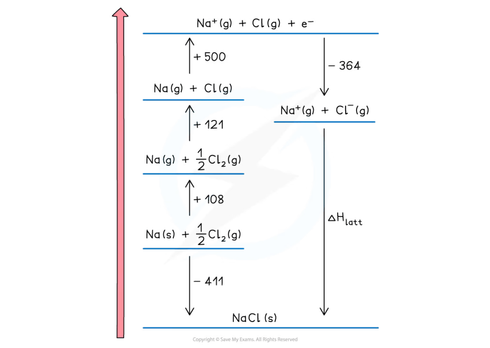{.question-figure fig-alt="Complete Born-Haber cycle for sodium chloride with labelled enthalpy changes"}
:::

::: {.worked-example}
Worked example · 笔记例题

### 构造 KCl 的 Born–Haber 循环

构造一个可用于计算氯化钾晶格能的 Born–Haber 循环。每一步的焓变类型如下：

| Step | Enthalpy change |
|---|---|
| $\mathrm{K(s) \rightarrow K(g)}$ | $\Delta H^\ominus_{\mathrm{at}}(K)$ |
| $\mathrm{K(g) \rightarrow K^{+}(g) + e^-}$ | first ionisation energy |
| $\mathrm{\tfrac{1}{2}Cl_2(g) \rightarrow Cl(g)}$ | $\Delta H^\ominus_{\mathrm{at}}(Cl)$ |
| $\mathrm{Cl(g) + e^- \rightarrow Cl^{-}(g)}$ | first electron affinity |
| 求和 | $\Sigma\, \Delta H$（原子化 + 电离能 + 电子亲和能） |

再对晶格焓应用 Hess's Law 即可求出 $\Delta H^\ominus_{\mathrm{latt}}$。

**Answer:**

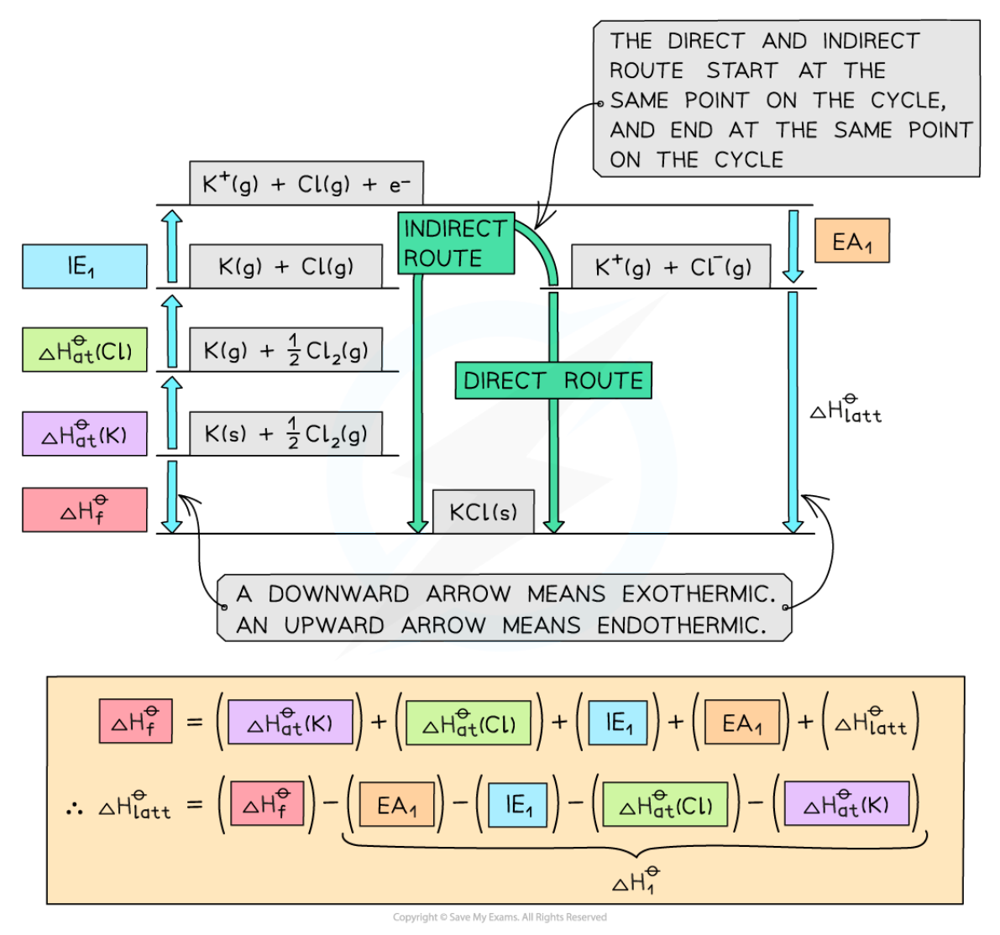{.question-figure fig-alt="Born-Haber cycle for potassium chloride"}

向上箭头代表吸热，向下箭头代表放热。直接路径（formation）与间接路径的焓变相等。

:::

::: {.worked-example}
Worked example · 笔记例题

### 构造 MgO 的 Born–Haber 循环

氧化镁涉及两个电离能和两个电子亲和能（氧的 $EA_1$ 与 $EA_2$），循环比 KCl 多两步：

| Step | Enthalpy change |
|---|---|
| $\mathrm{Mg(s) \rightarrow Mg(g)}$ | $\Delta H^\ominus_{\mathrm{at}}(Mg)$ |
| $\mathrm{Mg(g) \rightarrow Mg^{+}(g) + e^-}$ | $IE_1$ |
| $\mathrm{Mg^{+}(g) \rightarrow Mg^{2+}(g) + e^-}$ | $IE_2$ |
| $\mathrm{\tfrac{1}{2}O_2(g) \rightarrow O(g)}$ | $\Delta H^\ominus_{\mathrm{at}}(O)$ |
| $\mathrm{O(g) + e^- \rightarrow O^{-}(g)}$ | $EA_1$ |
| $\mathrm{O^{-}(g) + e^- \rightarrow O^{2-}(g)}$ | $EA_2$ |
| 求和后再对晶格焓应用 Hess's Law | $\Delta H^\ominus_{\mathrm{latt}}$ |

**Answer:**

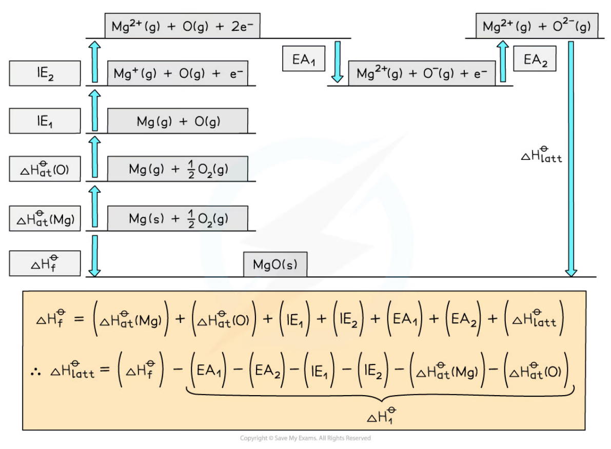{.question-figure fig-alt="Born-Haber cycle for magnesium oxide"}

:::

::: {.formula-panel}
### Calculations using Born–Haber cycles（Born–Haber 循环计算）

根据 Hess's Law，直接路径（formation）与间接路径（各分步焓变之和）相等：

$$\Delta H^\ominus_{\mathrm{f}} = \Delta H^\ominus_{\mathrm{at}} + \sum IE + \sum EA + \Delta H^\ominus_{\mathrm{latt}}$$

整理得：

$$\Delta H^\ominus_{\mathrm{latt}} = \Delta H^\ominus_{\mathrm{f}} - \Delta H^\ominus_{g \rightarrow \text{ions}}$$

其中 $\Delta H^\ominus_{g \rightarrow \text{ions}}$ 是所有把标准态元素变为气态离子的焓变之和（原子化 + 电离能 + 电子亲和能）。计算时**务必按化学式的计量数乘以对应数值**，例如 MgCl₂ 中有 2 mol 氯原子，氯的电子亲和能要乘 2。

以 KCl 为例：

$$\Delta H^\ominus_{\mathrm{latt}}(KCl) = (-437) - [(+90) + (+122) + (+418) + (-349)] = -718\ \mathrm{kJ\,mol^{-1}}$$

括号能避免漏掉正负号，这是考试中最常见的失分点。
:::

::: {.worked-example}
Worked example · 笔记例题

### 用数据计算 KCl 的晶格能

用下面的数据计算氯化钾的晶格能 $\Delta H^\ominus_{\mathrm{latt}}(KCl)$：

| | $\Delta H^\ominus_{\mathrm{at}}$ / $\mathrm{kJ\,mol^{-1}}$ | $IE_1$ / $\mathrm{kJ\,mol^{-1}}$ | $EA_1$ / $\mathrm{kJ\,mol^{-1}}$ | $\Delta H^\ominus_f$ / $\mathrm{kJ\,mol^{-1}}$ |
|---|---:|---:|---:|---:|
| K | +90 | +418 | — | — |
| Cl | +122 | — | −349 | — |
| KCl | — | — | — | −437 |

**Answer:**

$$\Delta H^\ominus_{\mathrm{latt}}(KCl) = \Delta H^\ominus_f - [\Delta H^\ominus_{at}(K) + \Delta H^\ominus_{at}(Cl) + IE_1(K) + EA_1(Cl)]$$

$$\Delta H^\ominus_{\mathrm{latt}}(KCl) = (-437) - [(+90) + (+122) + (+418) + (-349)] = -718\ \mathrm{kJ\,mol^{-1}}$$

:::

::: {.worked-example}
Worked example · 笔记例题

### 用数据计算 MgO 的晶格能

用下面的数据计算氧化镁的晶格能 $\Delta H^\ominus_{\mathrm{latt}}(MgO)$：

| | $\Delta H^\ominus_{\mathrm{at}}$ / $\mathrm{kJ\,mol^{-1}}$ | $IE_1$ / $IE_2$ / $\mathrm{kJ\,mol^{-1}}$ | $EA_1$ / $EA_2$ / $\mathrm{kJ\,mol^{-1}}$ | $\Delta H^\ominus_f$ / $\mathrm{kJ\,mol^{-1}}$ |
|---|---:|---:|---:|---:|
| Mg | +148 | +736 / +1450 | — | — |
| O | +248 | — | −142 / +770 | — |
| MgO | — | — | — | −602 |

**Answer:**

$$\Delta H^\ominus_{\mathrm{latt}}(MgO) = \Delta H^\ominus_f - [\Delta H^\ominus_{at}(Mg) + \Delta H^\ominus_{at}(O) + IE_1(Mg) + IE_2(Mg) + EA_1(O) + EA_2(O)]$$

$$\Delta H^\ominus_{\mathrm{latt}}(MgO) = (-602) - [(+148) + (+248) + (+736) + (+1450) + (-142) + (+770)] = -3812\ \mathrm{kJ\,mol^{-1}}$$

:::

::: {.study-card}
### 影响晶格能的因素：离子电荷与离子半径

- **Ionic radius（离子半径）**：离子半径越大，晶格能越不活泼（less exothermic）。大离子电荷分布更分散，且离子中心间距更大，正负离子间静电吸引更弱；
- **Ionic charge（离子电荷）**：离子电荷越高，charge density 越大，静电吸引越强，晶格能越活泼（more exothermic）。

例如 CsF 的晶格能（−730 kJ mol⁻¹）比 KF（−830 kJ mol⁻¹）不活泼，因为 Cs⁺ 比 K⁺ 大、与 F⁻ 的距离更远；而 CaO（2+ / 2− 离子）比 KCl（1+ / 1−）活泼得多。

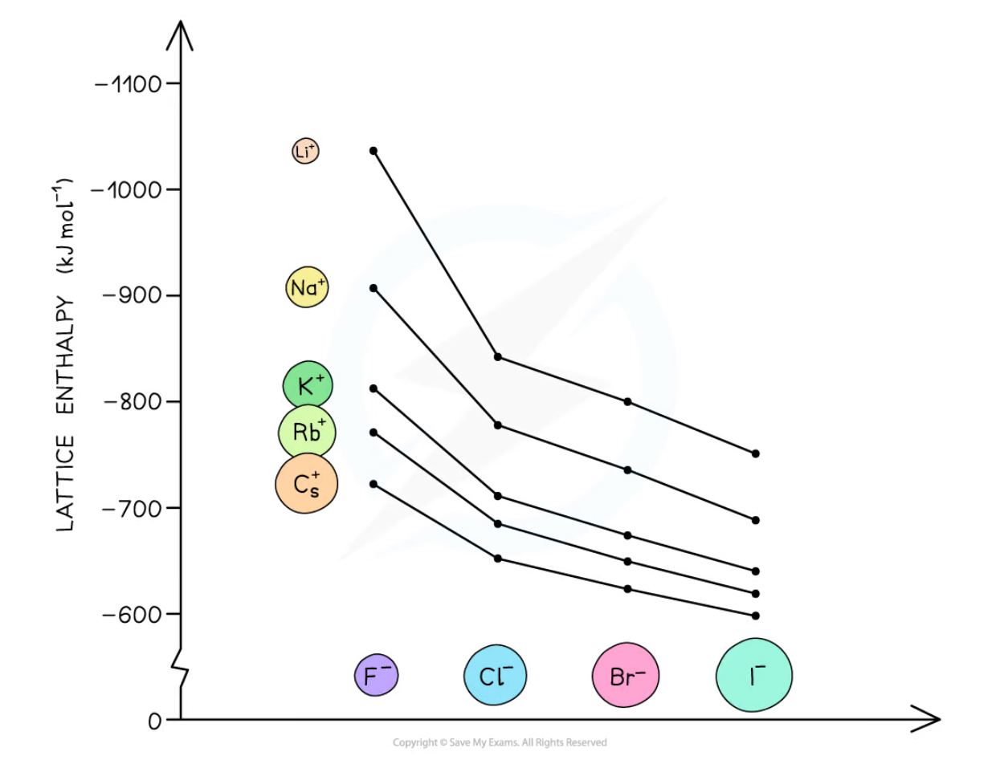{.question-figure fig-alt="Lattice energy becomes less exothermic as ionic radius increases"}
:::

---

## 23.2 Enthalpies of solution and hydration

::: {.study-card}
### Enthalpy change of solution（溶解焓变）

**The standard enthalpy change of solution, $\Delta H^\ominus_{\mathrm{sol}}$, is the enthalpy change when 1 mole of an ionic substance dissolves in sufficient water to form a very dilute solution.**

$$\mathrm{KCl(s) + aq \rightarrow K^+(aq) + Cl^-(aq)}$$

$\Delta H^\ominus_{\mathrm{sol}}$ 可正可负（放热或吸热溶解）。
:::

::: {.study-card}
### Enthalpy change of hydration（水合焓变）

**The standard enthalpy change of hydration, $\Delta H^\ominus_{\mathrm{hyd}}$, is the enthalpy change when 1 mole of a specified gaseous ion dissolves in sufficient water to form a very dilute solution.**

$$\mathrm{Mg^{2+}(g) + aq \rightarrow Mg^{2+}(aq)}$$

水是极性分子，氧端带 $\delta^-$、氢端带 $\delta^+$。正离子吸引水中带 $\delta^-$ 的氧，负离子吸引带 $\delta^+$ 的氢，形成 ion–dipole attractions。**水合焓总是放热（exothermic、为负值）**。

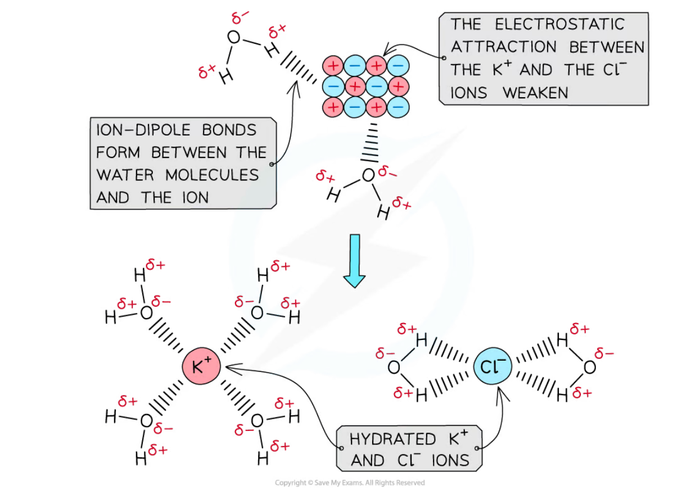{.question-figure fig-alt="Polar water molecules form ion-dipole bonds with K+ and Cl- ions"}
:::

::: {.formula-panel}
### 溶解焓与水合焓的能量循环

离子晶体溶于水可以走两条路径：

- 直接路径：$\mathrm{ionic\ lattice \rightarrow hydrated\ ions}$，即 $\Delta H^\ominus_{\mathrm{sol}}$；
- 间接路径：先破坏晶格（lattice dissociation，$-\Delta H^\ominus_{\mathrm{latt}}$，吸热），再让气态离子水合（hydration，$\Delta H^\ominus_{\mathrm{hyd}}$，放热）。

由 Hess's Law：

$$\Delta H^\ominus_{\mathrm{sol}} = -\Delta H^\ominus_{\mathrm{latt}} + \Sigma\, \Delta H^\ominus_{\mathrm{hyd}}$$

注意：总水合焓要**把每种离子的水合焓加起来**，并乘以化学式中的离子个数。例如 MgCl₂ 中有 2 mol Cl⁻，氯离子水合焓要乘 2。

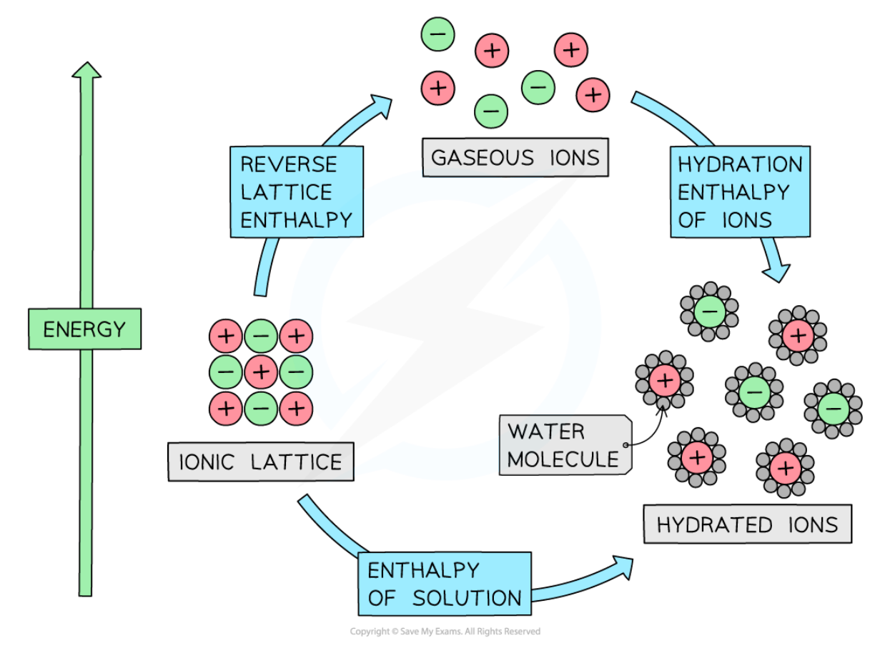{.question-figure fig-alt="Energy cycle linking lattice energy, hydration enthalpies and enthalpy of solution"}
:::

::: {.worked-example}
Worked example · 笔记例题

### 用能量循环求 KCl 中氯离子的水合焓

构造能量循环与能量水平图，计算氯化钾中 $\mathrm{Cl^-}$ 离子的 $\Delta H^\ominus_{\mathrm{hyd}}$。

已知：$\Delta H^\ominus_{\mathrm{latt}}(KCl) = -711\ \mathrm{kJ\,mol^{-1}}$，$\Delta H^\ominus_{\mathrm{sol}}(KCl) = +26\ \mathrm{kJ\,mol^{-1}}$，$\Delta H^\ominus_{\mathrm{hyd}}(K^+) = -322\ \mathrm{kJ\,mol^{-1}}$。

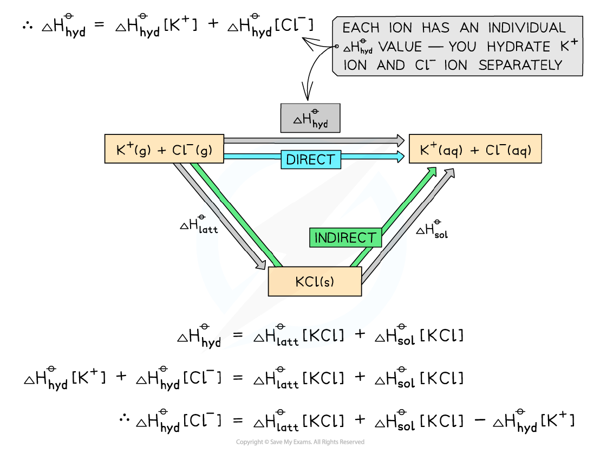{.question-figure fig-alt="Energy cycle for the hydration of potassium chloride"}

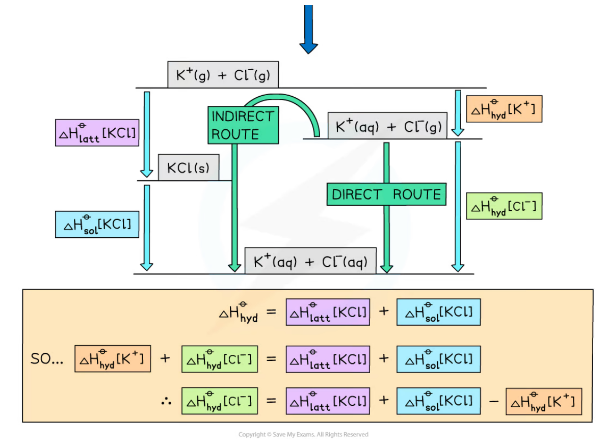{.question-figure fig-alt="Energy level diagram for the hydration of potassium chloride"}

**Answer:**

$$\Delta H^\ominus_{\mathrm{hyd}}(Cl^-) = \Delta H^\ominus_{\mathrm{sol}} + \Delta H^\ominus_{\mathrm{latt}} - \Delta H^\ominus_{\mathrm{hyd}}(K^+)$$

$$\Delta H^\ominus_{\mathrm{hyd}}(Cl^-) = (+26) + (-711) - (-322) = -363\ \mathrm{kJ\,mol^{-1}}$$

:::

::: {.worked-example}
Worked example · 笔记例题

### 用能量循环求 MgCl₂ 中镁离子的水合焓

构造能量循环与能量水平图，计算 $\mathrm{MgCl_2}$ 中 $\mathrm{Mg^{2+}}$ 离子的 $\Delta H^\ominus_{\mathrm{hyd}}$。

已知：$\Delta H^\ominus_{\mathrm{latt}}(MgCl_2) = -2592\ \mathrm{kJ\,mol^{-1}}$，$\Delta H^\ominus_{\mathrm{sol}}(MgCl_2) = -55\ \mathrm{kJ\,mol^{-1}}$，$\Delta H^\ominus_{\mathrm{hyd}}(Cl^-) = -363\ \mathrm{kJ\,mol^{-1}}$。

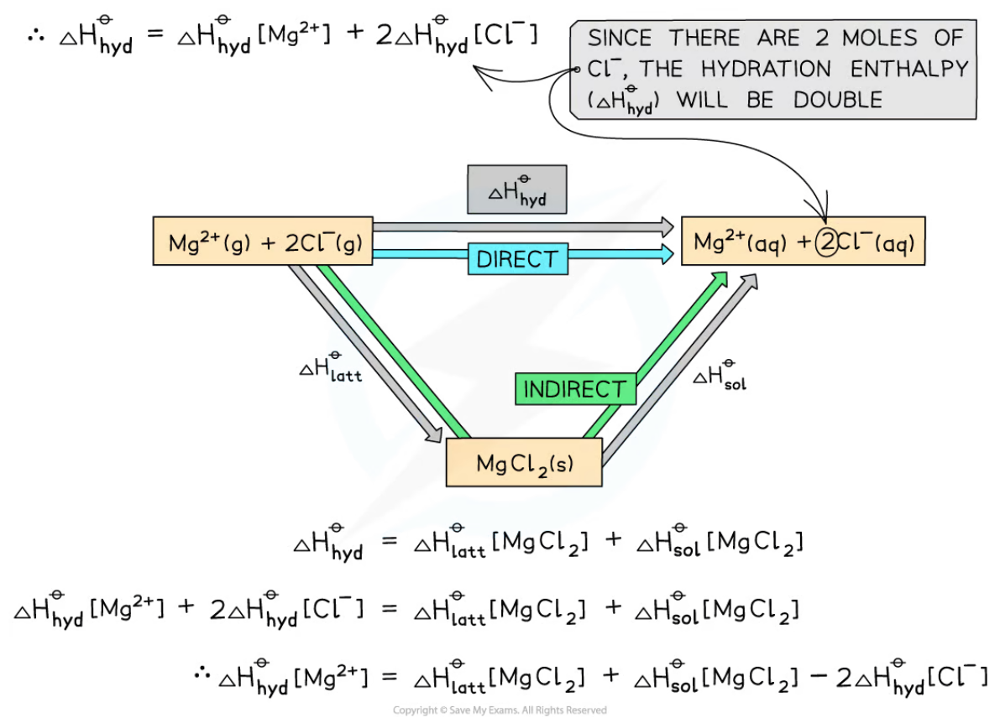{.question-figure fig-alt="Energy cycle for the hydration of magnesium chloride"}

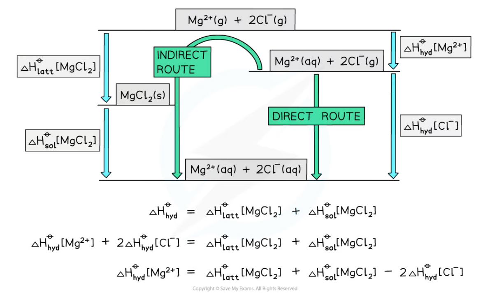{.question-figure fig-alt="Energy level diagram for the hydration of magnesium chloride"}

**Answer:**

$$\Delta H^\ominus_{\mathrm{hyd}}(Mg^{2+}) = \Delta H^\ominus_{\mathrm{sol}} + \Delta H^\ominus_{\mathrm{latt}} - 2 \times \Delta H^\ominus_{\mathrm{hyd}}(Cl^-)$$

$$\Delta H^\ominus_{\mathrm{hyd}}(Mg^{2+}) = (-55) + (-2592) - 2 \times (-363) = -1921\ \mathrm{kJ\,mol^{-1}}$$

:::

::: {.study-card}
### 影响水合焓的因素

- **Ionic radius**：离子越小，charge density 越大，与水分子之间的 ion–dipole 吸引越强，水合焓越活泼（more exothermic）；
- **Ionic charge**：离子电荷越高，水合焓越活泼。

例如 Mg²⁺ 比 Ca²⁺ 小，Mg²⁺ 的水合焓更活泼；MgSO₄ 比 BaSO₄ 的水合焓更活泼（SO₄²⁻ 相同，Mg²⁺ 更小）。

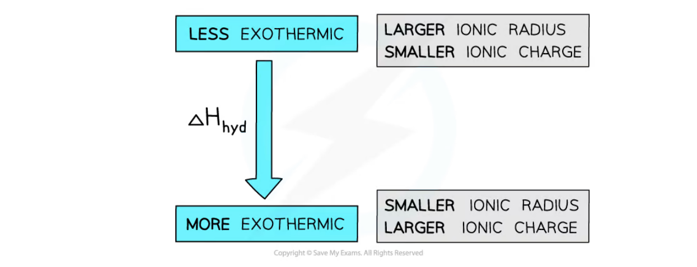{.question-figure fig-alt="Hydration enthalpy is more exothermic for smaller ions and ions with larger charge"}
:::

---

## 23.3 Entropy change

::: {.study-card}
### Entropy（熵）

**Entropy, $S$, is the number of possible arrangements of the particles and their energy in a given system — in other words, a measure of how disordered a system is.**

系统越无序，熵越大；系统越无序，能量上越稳定。不同状态的熵大小顺序为：

$$\mathrm{gas > liquid > solid}$$

典型规律：

- 熔化（solid → liquid）与沸腾（liquid → gas）：熵增加；
- 凝固与冷凝：熵减少；
- 固体溶解成稀溶液：熵增加（粒子更分散、排列能量方式更多）；
- 从溶液中结晶析出：熵减少；
- 反应中气体分子数增加：熵增加；气体分子数减少：熵减少。例如 $\mathrm{N_2(g)+3H_2(g)\rightleftharpoons 2NH_3(g)}$，4 mol 气体变成 2 mol 气体，熵减少。

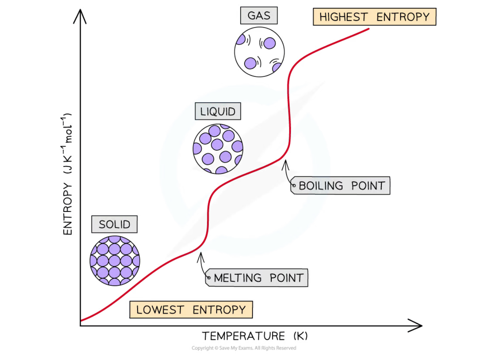{.question-figure fig-alt="Graph of entropy against temperature showing melting and boiling points"}

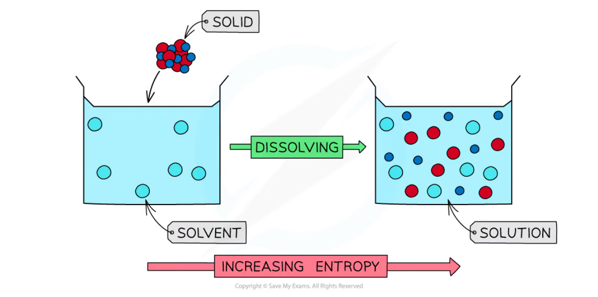{.question-figure fig-alt="Dissolving a solid in a solvent increases entropy"}
:::

::: {.formula-panel}
### 标准熵变计算

$$\Delta S^\ominus_{\mathrm{system}} = \Sigma\, S^\ominus_{\mathrm{products}} - \Sigma\, S^\ominus_{\mathrm{reactants}}$$

计算时按方程式计量数乘以对应物质的 $S^\ominus$，并注意物质的状态。
:::

::: {.worked-example}
Worked example · 笔记例题

### 计算反应的熵变

计算 $\mathrm{2Mg(s) + O_2(g) \rightarrow 2MgO(s)}$ 的熵变：

$S^\ominus[\mathrm{Mg(s)}] = 32.60\ \mathrm{J\,K^{-1}\,mol^{-1}}$，$S^\ominus[\mathrm{O_2(g)}] = 205.0\ \mathrm{J\,K^{-1}\,mol^{-1}}$，$S^\ominus[\mathrm{MgO(s)}] = 38.20\ \mathrm{J\,K^{-1}\,mol^{-1}}$。

**Answer:**

$$\Delta S^\ominus_{\mathrm{system}} = \Sigma\, S^\ominus_{products} - \Sigma\, S^\ominus_{reactants}$$

$$\Delta S^\ominus_{\mathrm{system}} = (2 \times 38.20) - (2 \times 32.60 + 205.0) = -193.8\ \mathrm{J\,K^{-1}\,mol^{-1}}$$

反应中 3 mol 气体变成 2 mol 固体，气体分子数减少，所以熵变是负的。

:::

---

## 23.4 Gibbs free energy change

::: {.formula-panel}
### The Gibbs equation（Gibbs 方程）

$$\Delta G^\ominus = \Delta H^\ominus_{\mathrm{reaction}} - T\Delta S^\ominus_{\mathrm{system}}$$

单位：$\Delta G^\ominus$ 与 $\Delta H^\ominus$ 用 $\mathrm{kJ\,mol^{-1}}$，$T$ 用 K，$\Delta S^\ominus$ 用 $\mathrm{J\,K^{-1}\,mol^{-1}}$。**代入前必须把 $\Delta S^\ominus$ 除以 1000 换成 $\mathrm{kJ\,K^{-1}\,mol^{-1}}$**，这是最常见的失分点。
:::

::: {.worked-example}
Worked example · 笔记例题

### 计算碳酸氢钠分解的 $\Delta G^\ominus$

$$\mathrm{2NaHCO_3(s) \rightarrow Na_2CO_3(s) + H_2O(l) + CO_2(g)}$$

已知 $\Delta H^\ominus = +135\ \mathrm{kJ\,mol^{-1}}$，$\Delta S^\ominus = +344\ \mathrm{J\,K^{-1}\,mol^{-1}}$，计算 298 K 下的 $\Delta G^\ominus$。

**Answer:**

先把熵变换成 $\mathrm{kJ}$：$\Delta S^\ominus = 344/1000 = +0.344\ \mathrm{kJ\,K^{-1}\,mol^{-1}}$；

$$\Delta G^\ominus = \Delta H^\ominus - T\Delta S^\ominus = +135 - (298 \times 0.344) = +32.49\ \mathrm{kJ\,mol^{-1}}$$

:::

::: {.worked-example}
Worked example · 笔记例题

### 计算甲醇与 HBr 反应的 $\Delta G^\ominus$

$$\mathrm{CH_3OH(l) + HBr(g) \rightarrow CH_3Br(g) + H_2O(l)}$$

$S^\ominus[\mathrm{CH_3OH(l)}] = +240\ \mathrm{J\,K^{-1}\,mol^{-1}}$，$S^\ominus[\mathrm{HBr(g)}] = +99.0\ \mathrm{J\,K^{-1}\,mol^{-1}}$，$S^\ominus[\mathrm{H_2O(l)}] = +70.0\ \mathrm{J\,K^{-1}\,mol^{-1}}$，$S^\ominus[\mathrm{CH_3Br(g)}] = +246\ \mathrm{J\,K^{-1}\,mol^{-1}}$，$\Delta H^\ominus = -47\ \mathrm{kJ\,mol^{-1}}$。

**Answer:**

$$\Delta S^\ominus_{\mathrm{system}} = (246 + 70.0) - (240 + 99.0) = -23.0\ \mathrm{J\,K^{-1}\,mol^{-1}}$$

$$\Delta G^\ominus = (-47) - 298 \times (-0.023) = -40.1\ \mathrm{kJ\,mol^{-1}}$$

:::

::: {.study-card}
### Reaction feasibility（反应可行性）

**When $\Delta G^\ominus$ is negative, the reaction is feasible and likely to occur; when $\Delta G^\ominus$ is positive, the reaction is not feasible and unlikely to occur.**

仅看熵变不足以判断可行性，必须同时考虑焓变，Gibbs 方程把两者合在一起。

温度对可行性的影响由 $\Delta H^\ominus$ 与 $\Delta S^\ominus$ 的符号决定，共四种情况：

| $\Delta H^\ominus$ | $\Delta S^\ominus$ | $\Delta G^\ominus$ | 可行性 |
|---|---|---|---|
| negative（放热） | positive（更无序） | 任何温度都为负 | **任何温度都可行** |
| negative（放热） | negative（更有序） | 低温为负、高温为正 | 只在低温可行 |
| positive（吸热） | negative（更有序） | 任何温度都为正 | **任何温度都不可行** |
| positive（吸热） | positive（更无序） | 高温为负、低温为正 | 只在高温可行 |

例如碳酸钙热分解 $\mathrm{CaCO_3(s)\rightarrow CaO(s)+CO_2(g)}$，$\Delta H^\ominus=+178\ \mathrm{kJ\,mol^{-1}}$、$\Delta S^\ominus=+160.9\ \mathrm{J\,K^{-1}\,mol^{-1}}$，两者都为正，所以只有高温才可行——升高温度后 $T\Delta S$ 超过 $\Delta H$，$\Delta G$ 变为负。

{.question-figure fig-alt="Summary of factors affecting Gibbs free energy for exothermic reactions"}
:::

::: {.worked-example}
Worked example · 笔记例题

### 判断 2Ca + O₂ 反应的可行性

$$\mathrm{2Ca(s) + O_2(g) \rightarrow 2CaO(s)} \qquad \Delta H^\ominus = -635.5\ \mathrm{kJ\,mol^{-1}}$$

$S^\ominus[\mathrm{Ca(s)}] = 41.00\ \mathrm{J\,K^{-1}\,mol^{-1}}$，$S^\ominus[\mathrm{O_2(g)}] = 205.0\ \mathrm{J\,K^{-1}\,mol^{-1}}$，$S^\ominus[\mathrm{CaO(s)}] = 40.00\ \mathrm{J\,K^{-1}\,mol^{-1}}$。

**Answer:**

$$\Delta S^\ominus_{\mathrm{system}} = (2 \times 40.00) - (2 \times 41.00 + 205.0) = -207.0\ \mathrm{J\,K^{-1}\,mol^{-1}}$$

$$\Delta G^\ominus = (-635.5) - 298 \times (-0.207) = -573.8\ \mathrm{kJ\,mol^{-1}}$$

$\Delta G^\ominus$ 为负，所以该反应可行（feasible），且任何温度下都可行。

:::

---

## Structured Questions



## Chapter checklist

- [ ] 我能准确说出 lattice energy、enthalpy of atomisation、electron affinity、enthalpy of solution、enthalpy of hydration 的定义。
- [ ] 我能画出并补全 Born–Haber cycle，识别每一步的焓变。
- [ ] 我能用 Born–Haber cycle 计算晶格能（注意计量数倍率）。
- [ ] 我能用离子电荷与离子半径解释晶格能和水合焓的大小比较。
- [ ] 我能判断一个过程的熵增/熵减，并计算 $\Delta S^\ominus$。
- [ ] 我能用 $\Delta G^\ominus=\Delta H^\ominus-T\Delta S^\ominus$ 判断可行性并换算单位。
- [ ] 我能说明温度对四种 $\Delta H^\ominus / \Delta S^\ominus$ 组合下可行性的影响。

### Original question PDFs

- [23.1 Lattice Energy and Born–Haber Cycles – Easy](https://raw.githubusercontent.com/nanoxsj/CIE-Chemistry-Study/main/resources/original-papers/chemical-energetics/23.1-lattice-energy-born-haber-easy.pdf)
- [23.1 Lattice Energy and Born–Haber Cycles – Medium](https://raw.githubusercontent.com/nanoxsj/CIE-Chemistry-Study/main/resources/original-papers/chemical-energetics/23.1-lattice-energy-born-haber-medium.pdf)
- [23.1 Lattice Energy and Born–Haber Cycles – Hard](https://raw.githubusercontent.com/nanoxsj/CIE-Chemistry-Study/main/resources/original-papers/chemical-energetics/23.1-lattice-energy-born-haber-hard.pdf)
- [23.2 Entropy – Easy](https://raw.githubusercontent.com/nanoxsj/CIE-Chemistry-Study/main/resources/original-papers/chemical-energetics/23.2-entropy-easy.pdf)
- [23.2 Entropy – Medium](https://raw.githubusercontent.com/nanoxsj/CIE-Chemistry-Study/main/resources/original-papers/chemical-energetics/23.2-entropy-medium.pdf)
- [23.2 Entropy – Hard](https://raw.githubusercontent.com/nanoxsj/CIE-Chemistry-Study/main/resources/original-papers/chemical-energetics/23.2-entropy-hard.pdf)
