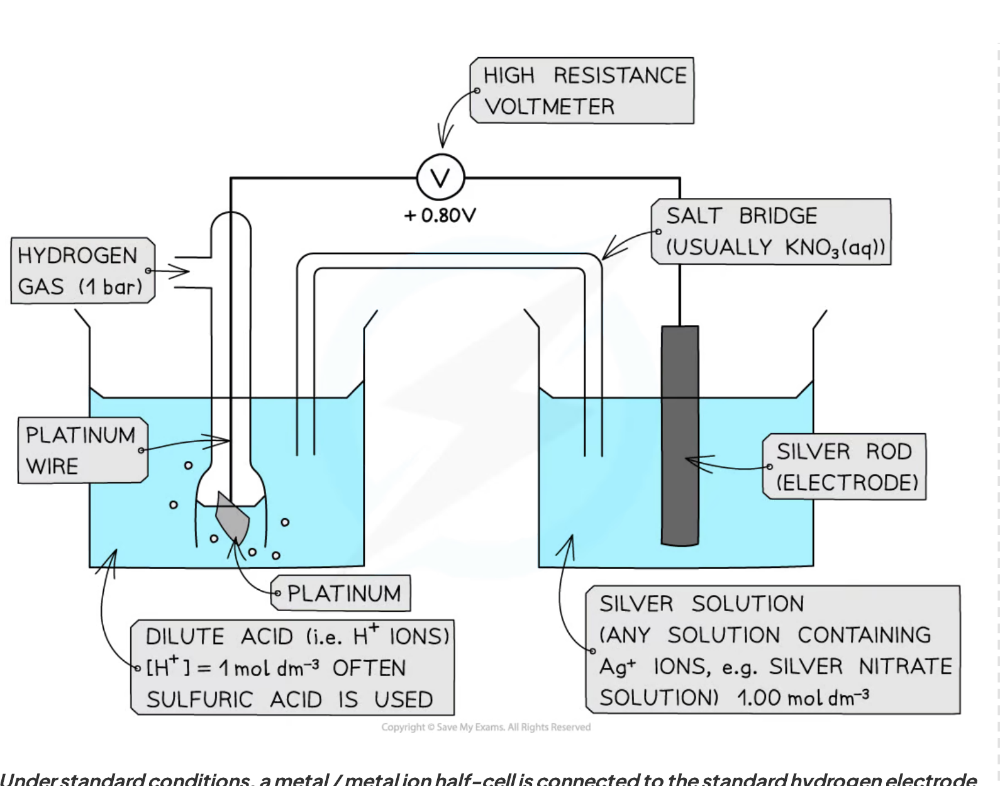
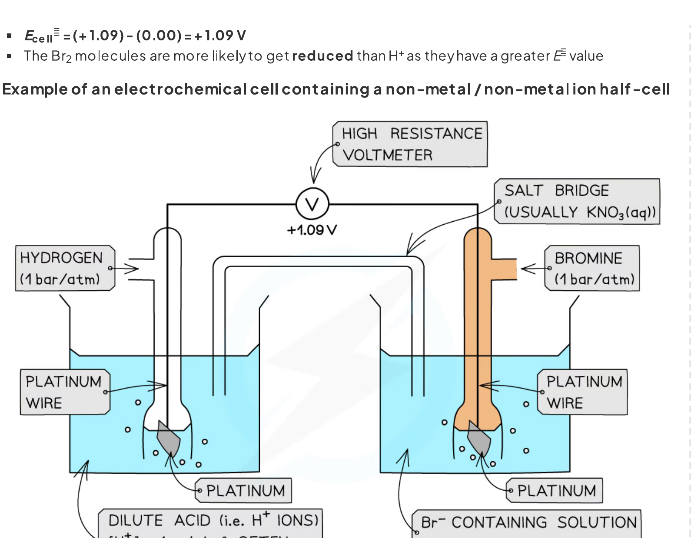
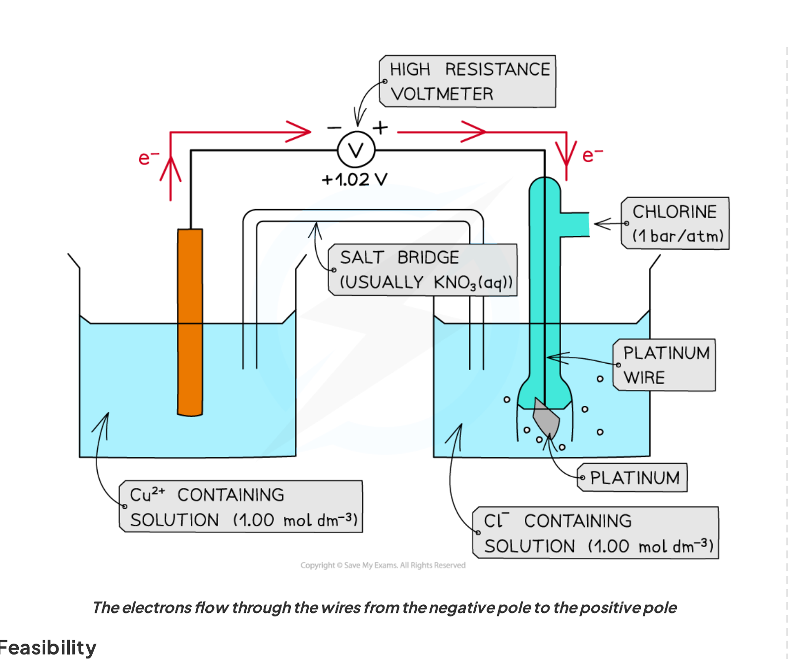
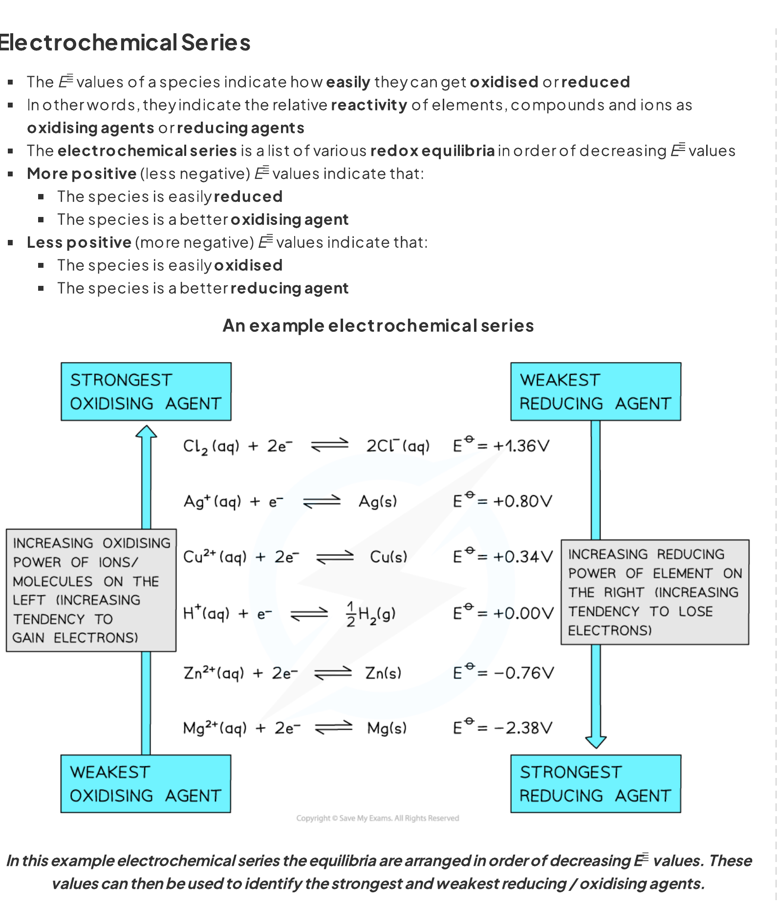
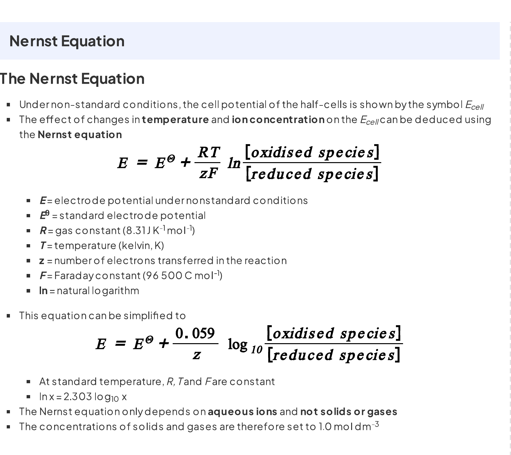
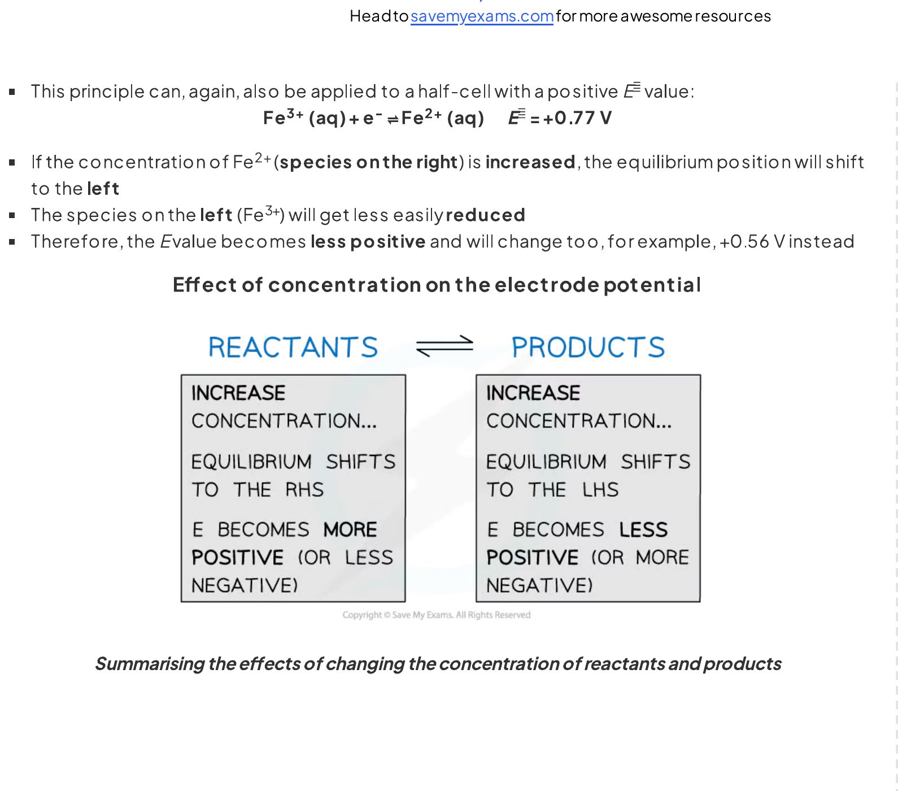
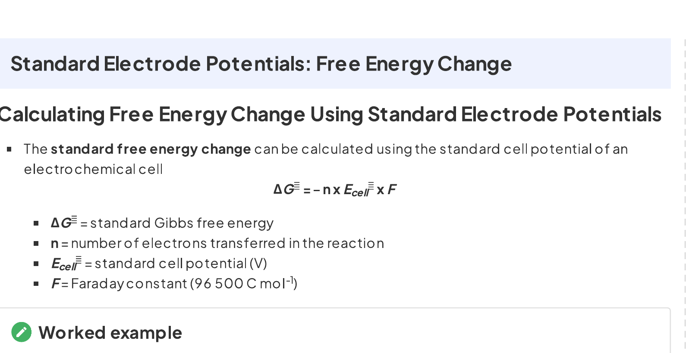
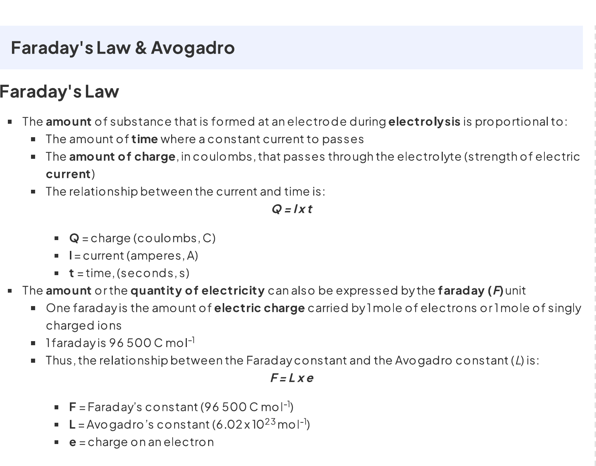
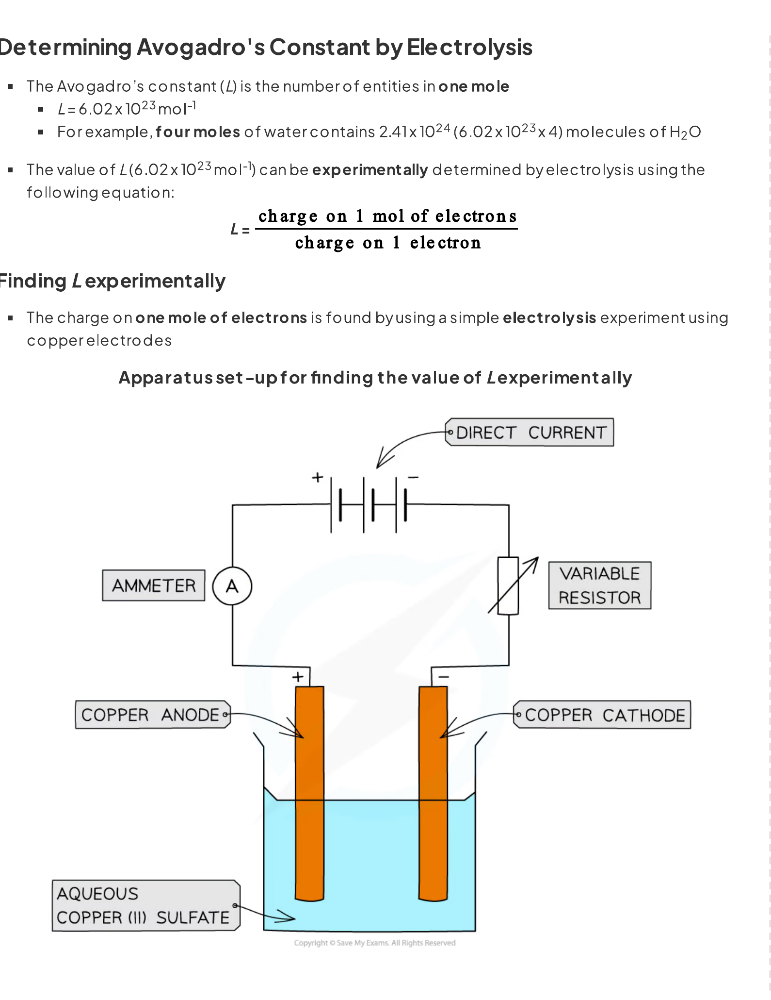

# 24 Electrochemistry

本章覆盖标准电极电势、电化学电池、Nernst equation、Gibbs energy，以及考纲中与 Faraday 定律、电镀和 Avogadro constant 相关的计算应用。独立的定性 Electrolysis 知识（例如熔融/水溶液中产物判断和离子放电顺序）不在本页范围内。

## Learning objectives

学完本章后，你应该能够：

- explain electrode potential as the tendency of a redox system to undergo reduction;
- state the standard conditions and describe the standard hydrogen electrode (SHE);
- draw and interpret conventional cell diagrams, including salt bridge, platinum electrode and electron flow;
- calculate $E^\ominus_{\mathrm{cell}}$ and use its sign to assess feasibility;
- identify oxidising agents, reducing agents, anodes, cathodes, positive poles and negative poles;
- balance ionic redox equations using half-equations and electron transfer;
- use the Nernst equation at 298 K and at other temperatures;
- calculate $\Delta G^\ominus$ from $E^\ominus_{\mathrm{cell}}$;
- apply Faraday's law to electroplating and the experimental determination of the Avogadro constant.

## 24.2 Standard electrode potentials, standard cell potentials and the Nernst equation

::: {.study-card}
### Electrode potential（电极电势）

把金属棒插入含有该金属离子的溶液时，会同时发生氧化和还原：

$$\ce{M(s) <=> M^{z+}(aq) + z e-}$$

金属原子失去电子进入溶液，金属离子得到电子沉积到电极上。当两个速率相等时达到动态平衡。这个氧化还原平衡的位置取决于物质本身，因此不同的 half-cell 有不同的 electrode potential。

在本章中半方程式统一写成 reduction half-equation，电子写在左侧：

$$\ce{M^{z+}(aq) + z e- <=> M(s)}$$

**The electrode potential is a measure of how readily the species on the left-hand side of a reduction half-equation accepts electrons.**

- $E$ 越正：越容易发生还原，左侧物种是更强的 oxidising agent；
- $E$ 越负：越不容易发生还原，右侧还原态物种通常是更强的 reducing agent；
- electrode potential 不能单独直接测量，必须与另一个 half-cell 比较。
:::

::: {.formula-panel}
### Standard conditions and $E^\ominus$

**The standard electrode potential, $E^\ominus$, is the potential of a half-cell measured relative to the standard hydrogen electrode under standard conditions.**

| 条件 | 数值 |
|---|---:|
| Temperature | $298\ \mathrm{K}$ |
| Pressure of gases | $101\ \mathrm{kPa}$（题目数据表若指定 $100\ \mathrm{kPa}$，按题目使用） |
| Concentration of aqueous ions | $1.00\ \mathrm{mol\ dm^{-3}}$ |
| Current during measurement | 接近零电流，使用 high-resistance voltmeter |

标准电极电势的单位是 volt（V）。所有 $E^\ominus$ 都是 reduction potentials；如果某个半方程式反向作为 oxidation half-equation，数值符号必须反过来。
:::

::: {.study-card}
### Standard hydrogen electrode（SHE）

SHE 是测量其他标准电极电势的 primary reference electrode：

$$\ce{2H+(aq) + 2e- <=> H2(g)} \qquad E^\ominus = 0.00\ \mathrm{V}$$

它包括 inert platinum electrode、标准压力的 hydrogen gas、$[\ce{H+}]=1.00\ \mathrm{mol\ dm^{-3}}$ 的酸性溶液和 $298\ \mathrm{K}$。与另一个 half-cell 连接时还需要 salt bridge 和 high-resistance voltmeter。

{.concept-figure fig-alt="High-resolution note diagram of a standard hydrogen electrode connected to another half-cell"}
:::

::: {.worked-example}
Worked example · 判断与解释

### 判断 $E^\ominus$ 对平衡位置的影响

比较 $\ce{Ag+ + e- <=> Ag}$（$E^\ominus=+0.80\ \mathrm{V}$）和 $\ce{2H2O + 2e- <=> H2 + 2OH-}$（$E^\ominus=-0.83\ \mathrm{V}$）。

$E^\ominus$ 更正的 Ag$^+$/Ag 平衡最靠右，因为 Ag$^+$ 最容易得到电子；水/H$_2$ 平衡的 $E^\ominus$ 更负，平衡更靠左。

:::

### Half-cells, cell diagrams and electron flow

::: {.study-card}
### Three types of half-cell

| Half-cell type | Example | Electrode needed |
|---|---|---|
| metal / metal ion | $\ce{Cu^{2+}(aq) / Cu(s)}$ | Cu metal electrode |
| non-metal / non-metal ion | $\ce{Br2(l) / Br-(aq)}$ | inert Pt electrode |
| ion / ion with different oxidation states | $\ce{MnO4-(aq), Mn^{2+}(aq), H+(aq)}$ | inert Pt electrode |

当 half-cell 中没有能导电且参与平衡的固体电极时，必须用 platinum。Pt 是 inert conductor，不应写成反应物或生成物。Salt bridge 让离子移动、维持两侧电中性并闭合内电路；若一侧有 $\ce{Ag+}$，不要使用含 $\ce{Cl-}$ 的 KCl，因为会生成 $\ce{AgCl(s)}$。

{.concept-figure fig-alt="High-resolution note diagram of a non-metal and non-metal ion half-cell connected to the standard hydrogen electrode"}
:::

::: {.formula-panel}
### Conventional cell diagram

以 Zn/Cu galvanic cell 为例：

$$\ce{Zn(s) | Zn^{2+}(aq) || Cu^{2+}(aq) | Cu(s)}$$

左侧写 oxidation half-cell，通常是负极（negative pole / anode）；右侧写 reduction half-cell，通常是正极（positive pole / cathode）。单竖线表示 phase boundary，双竖线表示 salt bridge；电子由 **negative pole to positive pole**。
:::

{.concept-figure fig-alt="High-resolution note diagram showing a galvanic cell, salt bridge, electron flow and electrode polarity"}

::: {.worked-example}
Worked example · 计算电池电势

### 写出 Zn/Cu cell 的反应

$$\ce{Cu^{2+} + 2e- <=> Cu} \qquad E^\ominus = +0.34\ \mathrm{V}$$

$$\ce{Zn^{2+} + 2e- <=> Zn} \qquad E^\ominus = -0.76\ \mathrm{V}$$

铜半电池作 reduction、正极，锌半电池反向作 oxidation、负极：

$$E^\ominus_{\mathrm{cell}}=(+0.34)-(-0.76)=+1.10\ \mathrm{V}$$

$$\ce{Zn -> Zn^{2+} + 2e-}$$

$$\ce{Cu^{2+} + 2e- -> Cu}$$

$$\ce{Zn(s) + Cu^{2+}(aq) -> Zn^{2+}(aq) + Cu(s)}$$

:::

### Standard cell potential and feasibility

::: {.formula-panel}
### Calculating $E^\ominus_{\mathrm{cell}}$

$$E^\ominus_{\mathrm{cell}} = E^\ominus_{\mathrm{reduction}} - E^\ominus_{\mathrm{oxidation}}$$

也可以说是 more positive $E^\ominus$ 减去 less positive $E^\ominus$。不要把两个 reduction potentials 相加，也不要在已经反向写出 oxidation equation 后忘记变号。

| $E^\ominus_{\mathrm{cell}}$ | 意义 |
|---:|---|
| positive | reaction is feasible under standard conditions |
| zero | no net driving force at equilibrium |
| negative | written forward reaction is not feasible under standard conditions |
:::

**Feasible** 表示热力学上有可能发生，不等于反应一定快速发生；速率还可能受 activation energy 和其他动力学因素影响。

::: {.study-card}
### Oxidising and reducing agents

- **Oxidising agent** accepts electrons and is reduced；在 reduction half-equation 左侧寻找；
- **Reducing agent** donates electrons and is oxidised；在 reduction half-equation 右侧寻找；
- 较正的左侧物种通常是较强 oxidising agent；较负半方程式右侧物种通常是较强 reducing agent。

{.concept-figure fig-alt="High-resolution note diagram of an electrochemical series showing oxidising and reducing agent strength"}
:::

::: {.worked-example}
Worked example · 判断可行性

### 用 electrochemical series 判断反应

$$\ce{Cl2(g) + 2e- <=> 2Cl-(aq)} \qquad E^\ominus=+1.36\ \mathrm{V}$$

$$\ce{Cu^{2+}(aq) + 2e- <=> Cu(s)} \qquad E^\ominus=+0.34\ \mathrm{V}$$

氯气作 reduction，铜反向氧化：$\ce{Cl2 + Cu -> 2Cl- + Cu^{2+}}$。

$$E^\ominus_{\mathrm{cell}}=+1.36-(+0.34)=+1.02\ \mathrm{V}$$

因为 $E^\ominus_{\mathrm{cell}}>0$，正向反应在标准条件下 feasible。

:::

### Balancing ionic redox equations

::: {.study-card}
### Half-equation method

根据 $E^\ominus$ 选 reduction；反转另一个方程式作 oxidation；配平电子数；相加并约去电子；检查原子、电荷和状态符号。酸性条件下可以使用 $\ce{H+}$、$\ce{H2O}$ 配平；不要把电子写在最终 overall equation 中。
:::

::: {.worked-example}
Worked example · 配平氧化还原方程式

### Dichromate oxidises bromide

$$\ce{Cr2O7^{2-} + 14H+ + 6e- -> 2Cr^{3+} + 7H2O} \qquad E^\ominus=+1.36\ \mathrm{V}$$

$$\ce{Br2(l) + 2e- -> 2Br-(aq)} \qquad E^\ominus=+1.09\ \mathrm{V}$$

溴离子氧化，$\ce{2Br- -> Br2 + 2e-}$ 乘以 3 后相加：

$$\ce{Cr2O7^{2-} + 14H+ + 6Br- -> 2Cr^{3+} + 3Br2 + 7H2O}$$

$$E^\ominus_{\mathrm{cell}}=+1.36-(+1.09)=+0.27\ \mathrm{V}$$

:::

### Nernst equation and non-standard conditions

标准电极电势只适用于标准条件。改变 ion concentration、gas pressure 或 temperature 后，要使用实际 electrode potential $E$。

::: {.formula-panel}
### Nernst equation

$$E=E^\ominus-\frac{RT}{nF}\ln Q$$

对 reduction half-equation $\ce{Ox + n e- <=> Red}$：

$$E=E^\ominus+\frac{RT}{nF}\ln\left(\frac{[\mathrm{Ox}]}{[\mathrm{Red}]}\right)$$

298 K 时：

$$E=E^\ominus+\frac{0.059}{n}\log_{10}\left(\frac{[\mathrm{oxidised\ species}]}{[\mathrm{reduced\ species}]}\right)$$

其中 $R=8.31\ \mathrm{J\ K^{-1}\ mol^{-1}}$，$F=96500\ \mathrm{C\ mol^{-1}}$，$n$ 是转移电子数。纯固体和纯液体的 activity 取 1，不写入浓度比。

{.concept-figure fig-alt="High-resolution note summary of the Nernst equation and its variables"}
:::

::: {.study-card}
### 浓度变化的方向判断

对 $\ce{Ox + n e- <=> Red}$，增加 $[\ce{Ox}]$ 会使平衡右移、$E$ 变得更正；增加 $[\ce{Red}]$ 会使平衡左移、$E$ 变得更负。Common-ion effect 可能通过沉淀降低某个 ion 的浓度，进而改变 $E$。

{.concept-figure fig-alt="High-resolution note diagram showing how changing reactant and product concentrations affects electrode potential"}
:::

::: {.worked-example}
Worked example · Nernst calculation

### 计算 $\ce{Fe^{3+}/Fe^{2+}}$ 的电极电势

在 298 K，$[\ce{Fe^{3+}}]=0.034\ \mathrm{mol\ dm^{-3}}$，$[\ce{Fe^{2+}}]=0.64\ \mathrm{mol\ dm^{-3}}$，$E^\ominus=+0.77\ \mathrm{V}$。

$$E=0.77+\frac{0.059}{1}\log_{10}\left(\frac{0.034}{0.64}\right)=+0.69\ \mathrm{V}$$

:::

::: {.worked-example}
Worked example · Nernst calculation

### 计算 $\ce{Cu^{2+}/Cu}$ 的电极电势

298 K 时 $[\ce{Cu^{2+}}]=0.0010\ \mathrm{mol\ dm^{-3}}$，$E^\ominus=+0.34\ \mathrm{V}$。

固体铜的 activity 为 1：

$$E=0.34+\frac{0.059}{2}\log_{10}(0.0010/1)=+0.25\ \mathrm{V}$$

:::

::: {.formula-panel}
### Linking $E^\ominus_{\mathrm{cell}}$ and $\Delta G^\ominus$

$$\Delta G^\ominus=-nFE^\ominus_{\mathrm{cell}}$$

$\Delta G^\ominus$ 的单位先得到 $\mathrm{J\ mol^{-1}}$；若题目要求 $\mathrm{kJ\ mol^{-1}}$，最后除以 1000。$E^\ominus_{\mathrm{cell}}>0$ 时，$\Delta G^\ominus<0$，正向反应 thermodynamically feasible。

{.concept-figure fig-alt="High-resolution note summary of the Gibbs free energy relationship with standard cell potential"}
:::

::: {.worked-example}
Worked example · Gibbs energy calculation

### 由 $E^\ominus_{\mathrm{cell}}$ 计算 Gibbs energy

对于 $\ce{2Fe^{3+}(aq) + Cu(s) -> 2Fe^{2+}(aq) + Cu^{2+}(aq)}$，已知 $E^\ominus(\ce{Fe^{3+}/Fe^{2+}})=+0.77\ \mathrm{V}$，$E^\ominus(\ce{Cu^{2+}/Cu})=+0.34\ \mathrm{V}$。

$$E^\ominus_{\mathrm{cell}}=0.77-0.34=+0.43\ \mathrm{V}$$

$$\Delta G^\ominus=-2\times96500\times0.43\approx -83.0\ \mathrm{kJ\ mol^{-1}}$$

:::

## 24.1 Electrolysis

::: {.study-card}
### Faraday's law and electrochemical calculations

考纲中的 Electrolysis calculations 包括电量、电子数、沉积质量和 Avogadro constant；本页只讲这些计算应用，不展开定性电解产物的章节内容：

$$Q=It \qquad Q=n(e^-)F \qquad F=96500\ \mathrm{C\ mol^{-1}}$$

若金属离子为 $\ce{M^{z+}}$，则 1 mol 金属需要 $z$ mol electrons。气体体积计算要先由半方程式确定 gas 与 electrons 的 mole ratio，再使用题目给出的 molar gas volume。

{.concept-figure fig-alt="High-resolution note summary showing Faraday's law, Q=It and F=Le"}
:::

::: {.worked-example}
Worked example · Faraday calculation

### Faraday calculation: deposition of copper

电流 $1.65\ \mathrm{A}$ 通过含有 $\ce{Cu^{2+}}$ 的电解液，持续 $10.0\ \mathrm{min}$。求 cathode 沉积的铜质量。取 $A_r(\ce{Cu})=63.5$。

$$\ce{Cu^{2+}+2e- -> Cu}$$

$$Q=1.65\times(10.0\times60)=990\ \mathrm{C}$$

$$n(\ce{Cu})=\frac{990}{2\times96500}=5.13\times10^{-3}\ \mathrm{mol}$$

$$m=5.13\times10^{-3}\times63.5=0.326\ \mathrm{g}$$

:::

::: {.study-card}
### Applications: electroplating and determining $L$

电镀时，被镀物体连接为 cathode，使金属离子在其表面还原沉积。电解液必须含有待沉积金属的 ions，例如镀铜可用 $\ce{CuSO4(aq)}$。实验测定 Avogadro constant 时使用：

$$F=Le \qquad L=\frac{F}{e}$$

实验题常见得分点：电源、ammeter 串联、正负极、anode/cathode、含目标离子的 electrolyte，以及准确测量 current、time 和 electrode mass。

{.concept-figure fig-alt="High-resolution note apparatus diagram for copper electroplating and determining the Avogadro constant"}
:::

## Structured Questions



## Chapter checklist

- [ ] 我能解释 electrode potential 和 $E^\ominus$ 的含义。
- [ ] 我能写出 SHE 的组成、标准条件和 $E^\ominus=0.00\ \mathrm{V}$。
- [ ] 我能识别三类 half-cell，知道何时需要 Pt electrode。
- [ ] 我能画 conventional cell diagram，写出 salt bridge、positive/negative pole 和 electron flow。
- [ ] 我能用 $E^\ominus_{\mathrm{cell}}=E^\ominus_{\mathrm{reduction}}-E^\ominus_{\mathrm{oxidation}}$ 判断可行性。
- [ ] 我能从 electrochemical series 找出 oxidising agent 和 reducing agent。
- [ ] 我能用 half-equation method 配平 ionic redox equation。
- [ ] 我能在 298 K 和非 298 K 条件下正确使用 Nernst equation。
- [ ] 我能用 $\Delta G^\ominus=-nFE^\ominus_{\mathrm{cell}}$ 做单位正确的计算。
- [ ] 我能用 $Q=It$、$Q=nF$ 完成电镀、沉积和气体生成计算。

### Original question PDFs

- [24.2 Standard electrode potentials - Easy](https://raw.githubusercontent.com/nanoxsj/CIE-Chemistry-Study/main/resources/original-papers/electrochemistry/24.2-standard-electrode-potentials-easy.pdf)
- [24.2 Standard electrode potentials - Medium](https://raw.githubusercontent.com/nanoxsj/CIE-Chemistry-Study/main/resources/original-papers/electrochemistry/24.2-standard-electrode-potentials-medium.pdf)
- [24.2 Standard electrode potentials - Hard](https://raw.githubusercontent.com/nanoxsj/CIE-Chemistry-Study/main/resources/original-papers/electrochemistry/24.2-standard-electrode-potentials-hard.pdf)
- [24.1 Electrolysis calculations - Easy](https://raw.githubusercontent.com/nanoxsj/CIE-Chemistry-Study/main/resources/original-papers/electrochemistry/24.1-electrolysis-calculations-easy.pdf)
- [24.1 Electrolysis calculations - Medium](https://raw.githubusercontent.com/nanoxsj/CIE-Chemistry-Study/main/resources/original-papers/electrochemistry/24.1-electrolysis-calculations-medium.pdf)
- [24.1 Electrolysis calculations - Hard](https://raw.githubusercontent.com/nanoxsj/CIE-Chemistry-Study/main/resources/original-papers/electrochemistry/24.1-electrolysis-calculations-hard.pdf)
