# 24 Electrochemistry

本章按 CIE 2025–2027 syllabus 的顺序组织为 **24.1 Electrolysis** 和 **24.2 Standard electrode potentials, standard cell potentials and the Nernst equation**。24.1 只保留考纲要求的 Faraday、$Q=It$、$F=Le$、electroplating 和 Avogadro constant 计算；不展开 AS 1.6 的定性 electrolysis 产物判断。

## Learning objectives

学完本章后，你应该能够：

- use $Q=It$, $Q=nF$ and $F=Le$ in electrolysis calculations;
- use half-equations to calculate the mass of a deposited substance and the volume of a gas;
- describe copper electroplating and the experiment used to determine the Avogadro constant;
- state the standard conditions and describe the standard hydrogen electrode (SHE);
- explain electrode potential as the tendency of a redox system to undergo reduction;
- identify the electrode required for different types of half-cell;
- draw and interpret conventional cell diagrams, including the salt bridge and electron flow;
- calculate $E^\ominus_{\mathrm{cell}}$ and use its sign to assess feasibility;
- identify oxidising agents, reducing agents, anodes, cathodes, positive poles and negative poles;
- use the Nernst equation at 298 K and at other temperatures;
- calculate $\Delta G^\ominus$ from $E^\ominus_{\mathrm{cell}}$.

## 24.1 Electrolysis

::: {.study-card}
### Faraday's law and electrochemical calculations

Faraday's law relates the charge passed through an electrolytic cell to the amount of chemical change. The first step in every calculation is to write the relevant half-equation and identify the mole ratio between the required product and electrons.

$$Q=It$$

$$Q=n(e^-)F$$

$$F=96500\ \mathrm{C\ mol^{-1}}$$

where $Q$ is charge in coulombs, $I$ is current in amperes, $t$ is time in seconds, and $n(e^-)$ is the amount of electrons in moles.

对于金属离子 $\ce{M^{z+}}$：

$$\ce{M^{z+} + z e- -> M}$$

所以生成 1 mol 金属需要 $z$ mol electrons。气体体积则要先由 half-equation 确定 gas 与 electrons 的 mole ratio，再使用题目给出的 molar gas volume。

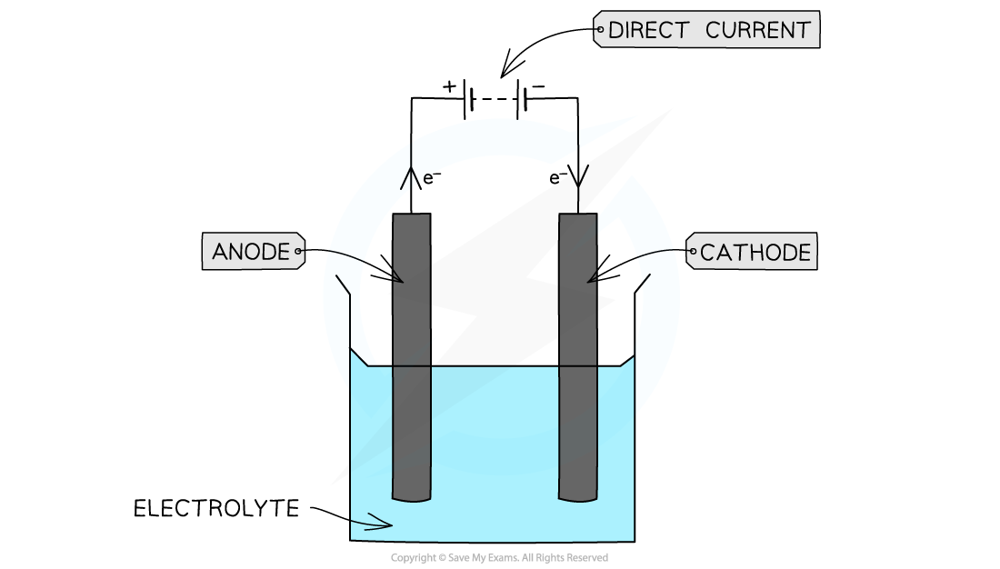{.concept-figure fig-alt="Electrolysis apparatus with direct current, anode, cathode and electrolyte"}
:::

::: {.worked-example}
Worked example · Faraday's law

### Amount of electricity required for electrochemical reactions

**Determine the amount of electricity required for the following reactions:**

1. To deposit 1 mol of sodium  
   $\ce{Na+(aq) + e- -> Na(s)}$
2. To deposit 1 mol of magnesium  
   $\ce{Mg2+(aq) + 2e- -> Mg(s)}$
3. To form 1 mole of fluorine gas  
   $\ce{2F-(aq) -> F2(g) + 2e-}$
4. To form 1 mole of oxygen  
   $\ce{4OH-(aq) -> O2(g) + 2H2O(l) + 4e-}$

One Faraday is the amount of charge, $96\,500\ \mathrm{C}$, carried by one mole of electrons.

1. For sodium, the half-equation shows that one mole of electrons is required:

   $$1\ F=96\,500\ \mathrm{C}$$

2. For magnesium, two moles of electrons are required:

   $$2\ F=2\times96\,500=193\,000\ \mathrm{C}$$

3. For fluorine, two moles of electrons are released when one mole of fluorine gas is formed:

   $$2\ F=193\,000\ \mathrm{C}$$

4. For oxygen, four moles of electrons are released when one mole of oxygen is formed:

   $$4\ F=386\,000\ \mathrm{C}$$

:::

::: {.worked-example}
Worked example · Electrolysis calculation

### Deposition of magnesium

**Calculate the amount of magnesium deposited when a current of 2.20 A flows through the molten bromide for 15 minutes.**

1. Write the cathode half-equation:

   $$\ce{Mg2+(aq) + 2e- -> Mg(s)}$$

2. Calculate the charge needed to deposit one mole of magnesium:

   $$F=2\times96\,500=193\,000\ \mathrm{C\ mol^{-1}}$$

3. Calculate the charge transferred. Convert minutes to seconds:

   $$Q=I\times t=2.20\times(60\times15)=1980\ \mathrm{C}$$

4. Calculate the amount of magnesium deposited:

   $$n(\ce{Mg})=\frac{1980}{193\,000}=0.0103\ \mathrm{mol}$$

   $$m=0.0103\times24=0.25\ \mathrm{g}$$

5. **Final answer:** $0.25\ \mathrm{g}$ of magnesium is deposited at the cathode.

:::

::: {.worked-example}
Worked example · Electrolysis calculation

### Production of oxygen gas

**Calculate the volume of oxygen gas produced at room temperature, when a concentrated aqueous solution of sulfuric acid, H₂SO₄, is electrolysed for 35.0 minutes using a current of 0.75 A.**

1. Write the anode half-equation:

   $$\ce{4OH-(aq) -> O2(g) + 2H2O(l) + 4e-}$$

2. Calculate the charge required to form one mole of oxygen:

   $$F=4\times96\,500=386\,000\ \mathrm{C\ mol^{-1}}$$

3. Calculate the charge transferred:

   $$Q=0.75\times(60\times35)=1575\ \mathrm{C}$$

4. Calculate the amount of oxygen:

   $$n(\ce{O2})=\frac{1575}{386\,000}=4.08\times10^{-3}\ \mathrm{mol}$$

5. At room temperature, one mole of gas occupies $24.0\ \mathrm{dm^3}$:

   $$V=4.08\times10^{-3}\times24=0.0979\ \mathrm{dm^3}$$

6. **Final answer:** $0.0979\ \mathrm{dm^3}$ of oxygen is formed at the anode.

:::

::: {.worked-example}
Worked example · Electrolysis calculation

### Production of hydrogen gas

**Calculate the volume of hydrogen gas produced at room temperature, when a concentrated aqueous solution of sodium sulfate, Na₂SO₄, is electrolysed for 17.5 minutes using a current of 3.25 A.**

1. Write the cathode half-equation:

   $$\ce{2H+(aq) + 2e- -> H2(g)}$$

2. Calculate the charge required to form one mole of hydrogen:

   $$F=2\times96\,500=193\,000\ \mathrm{C\ mol^{-1}}$$

3. Calculate the charge transferred:

   $$Q=3.25\times(60\times17.5)=3413\ \mathrm{C}$$

4. Calculate the amount of hydrogen:

   $$n(\ce{H2})=\frac{3413}{193\,000}=1.76\times10^{-2}\ \mathrm{mol}$$

5. Calculate the volume at room temperature:

   $$V=1.76\times10^{-2}\times24=0.42\ \mathrm{dm^3}$$

6. **Final answer:** $0.42\ \mathrm{dm^3}$ of hydrogen is formed at the cathode.

:::

::: {.study-card}
### Electroplating and the Avogadro constant

In electroplating, the object to be coated is connected as the **cathode**. Metal ions in the electrolyte are reduced and deposited on its surface. For copper electroplating, the electrolyte may be aqueous copper(II) sulfate, with a copper anode and the object being plated as the cathode.

$$\ce{Cu2+(aq) + 2e- -> Cu(s)}$$

The Faraday constant can be related to the electronic charge and the Avogadro constant:

$$F=Le$$

$$L=\frac{F}{e}$$

实验中要准确测量 current、time 和 electrode mass。电极在实验前后应清洗、用 propanone 干燥并称量；cathode gains mass，而 anode loses mass。

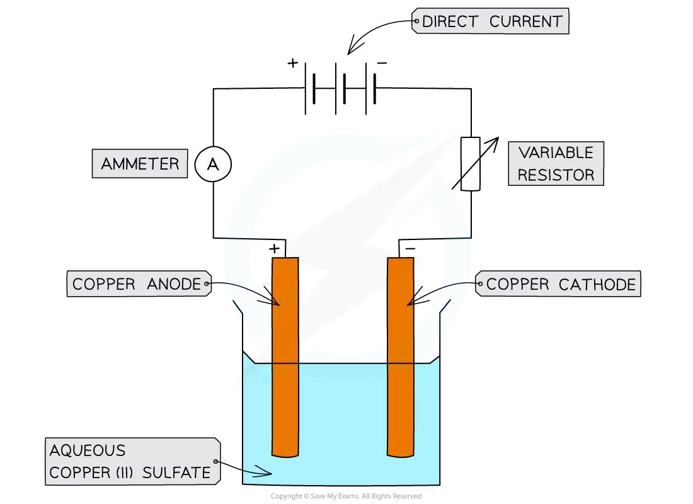{.concept-figure fig-alt="Copper electroplating apparatus with ammeter, variable resistor, copper electrodes and copper(II) sulfate solution"}
:::

::: {.worked-example}
Worked example · Avogadro constant experiment

### Determining the Avogadro constant from copper electroplating

**A copper anode and cathode are weighed. A variable resistor is used to maintain a current of about 0.17 A. Current passes for 40 minutes. The electrodes are washed with distilled water, dried with propanone and reweighed. The cathode gains mass and the anode loses mass. In one experiment the mass change is 0.13 g Cu. Determine the Avogadro constant.**

1. Calculate the charge passed:

   $$Q=I\times t=0.17\times(60\times40)=408\ \mathrm{C}$$

2. Convert the mass of copper to an amount of copper:

   $$n(\ce{Cu})=\frac{0.13}{63.5}=2.0\times10^{-3}\ \mathrm{mol}$$

3. Calculate the charge required for one mole of copper:

   $$\frac{408}{0.13/63.5}=199\,292\ \mathrm{C\ mol^{-1}}$$

4. Use the copper half-equation:

   $$\ce{Cu2+(aq) + 2e- -> Cu(s)}$$

   Two moles of electrons are needed per mole of copper, so the charge on one mole of electrons is:

   $$F=\frac{199\,292}{2}=99\,646\ \mathrm{C\ mol^{-1}}$$

5. Use $F=Le$, where $e=1.60\times10^{-19}\ \mathrm{C}$:

   $$L=\frac{99\,646}{1.60\times10^{-19}}\approx6.23\times10^{23}\ \mathrm{mol^{-1}}$$

6. **Final answer:** $L\approx6.23\times10^{23}\ \mathrm{mol^{-1}}$, which is close to the theoretical value $6.02\times10^{23}\ \mathrm{mol^{-1}}$.

:::

## 24.2 Standard electrode potentials, standard cell potentials and the Nernst equation

::: {.study-card}
### Electrode potential and reduction half-equations

把金属棒插入含有该金属离子的溶液时，会同时发生氧化和还原：

$$\ce{M(s) <=> M^{z+}(aq) + z e-}$$

在本章中 half-equation 统一写成 reduction half-equation：

$$\ce{M^{z+}(aq) + z e- <=> M(s)}$$

**The electrode potential is a measure of how readily the species on the left-hand side of a reduction half-equation accepts electrons.**

- $E$ 越正，越容易发生 reduction；左侧物种是更强的 oxidising agent。
- $E$ 越负，左侧物种越不容易发生 reduction；右侧还原态物种通常是更强的 reducing agent。
- Electrode potential 不能单独直接测量，必须与另一个 half-cell 比较。

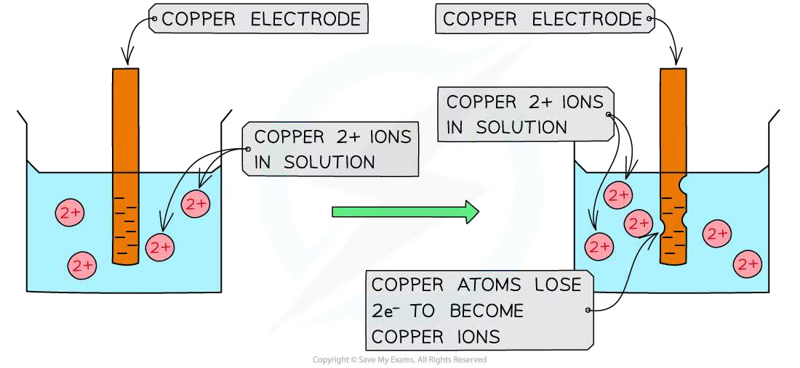{.concept-figure fig-alt="Copper atoms undergoing oxidation to copper ions at an electrode"}

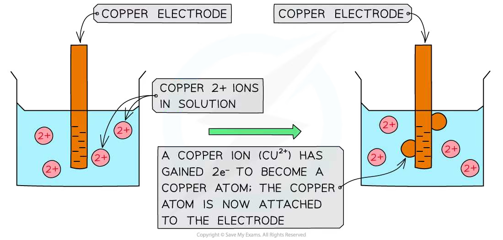{.concept-figure fig-alt="Copper ions undergoing reduction to copper atoms at an electrode"}
:::

::: {.formula-panel}
### Standard conditions and $E^\ominus$

**The standard electrode potential, $E^\ominus$, is the potential of a half-cell measured relative to the standard hydrogen electrode under standard conditions.**

| Condition | Standard value |
|---|---:|
| Temperature | $298\ \mathrm{K}$ |
| Pressure of gases | $101\ \mathrm{kPa}$ |
| Concentration of aqueous ions | $1.00\ \mathrm{mol\ dm^{-3}}$ |
| Current during measurement | approximately zero; use a high-resistance voltmeter |

所有 $E^\ominus$ 都是 reduction potentials。如果半方程式反向作为 oxidation half-equation，数值符号必须反过来。
:::

::: {.study-card}
### Standard hydrogen electrode (SHE)

SHE 是测量其他标准电极电势的 primary reference electrode：

$$\ce{2H+(aq) + 2e- <=> H2(g)}\qquad E^\ominus=0.00\ \mathrm{V}$$

它包括 inert platinum electrode、标准压力的 hydrogen gas、$[\ce{H+}]=1.00\ \mathrm{mol\ dm^{-3}}$ 的酸性溶液和 $298\ \mathrm{K}$。与另一个 half-cell 连接时还需要 salt bridge 和 high-resistance voltmeter。

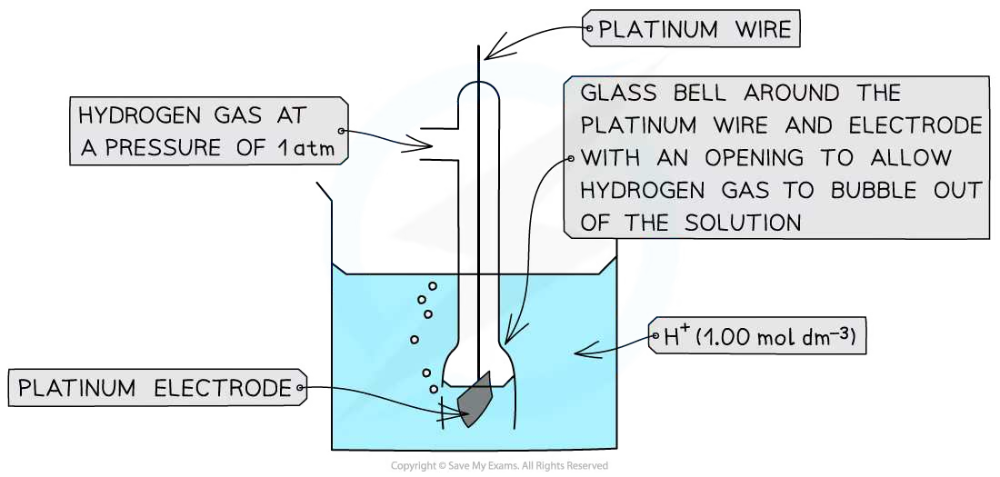{.concept-figure fig-alt="Standard hydrogen electrode with platinum electrode, hydrogen gas and acidic solution"}
:::

::: {.study-card}
### Types of half-cell and the electrode required

| Half-cell type | Example | Electrode needed |
|---|---|---|
| metal / metal ion | $\ce{Cu^{2+}(aq) / Cu(s)}$ | Cu metal electrode |
| non-metal / non-metal ion | $\ce{Br2(l) / Br-(aq)}$ | inert Pt electrode |
| ions with different oxidation states | $\ce{MnO4-(aq), Mn^{2+}(aq), H+(aq)}$ | inert Pt electrode |

当 half-cell 中没有能导电且参与平衡的固体电极时，必须使用 platinum。Pt 是 inert conductor，不应写成反应物或生成物。

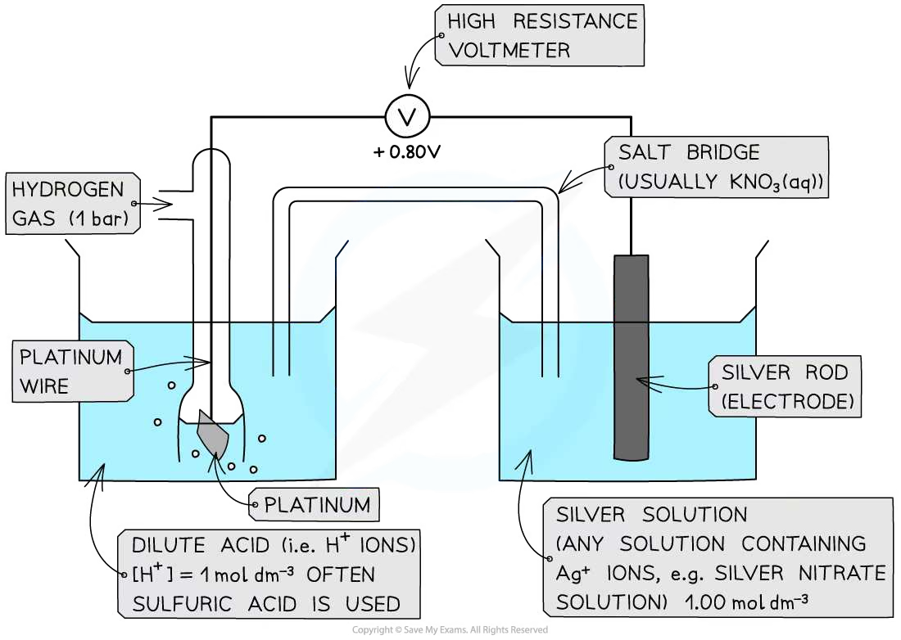{.concept-figure fig-alt="Silver and silver-ion half-cell connected to the standard hydrogen electrode"}

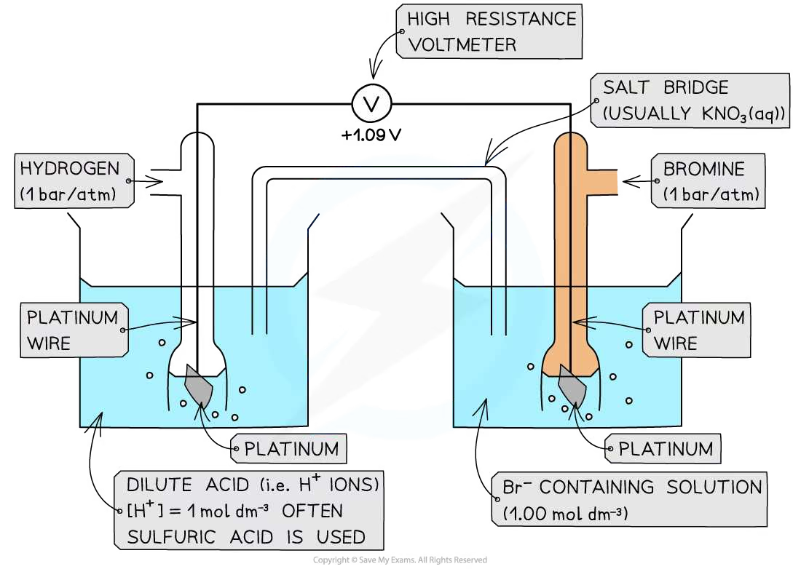{.concept-figure fig-alt="Bromine and bromide half-cell with an inert platinum electrode connected to the standard hydrogen electrode"}

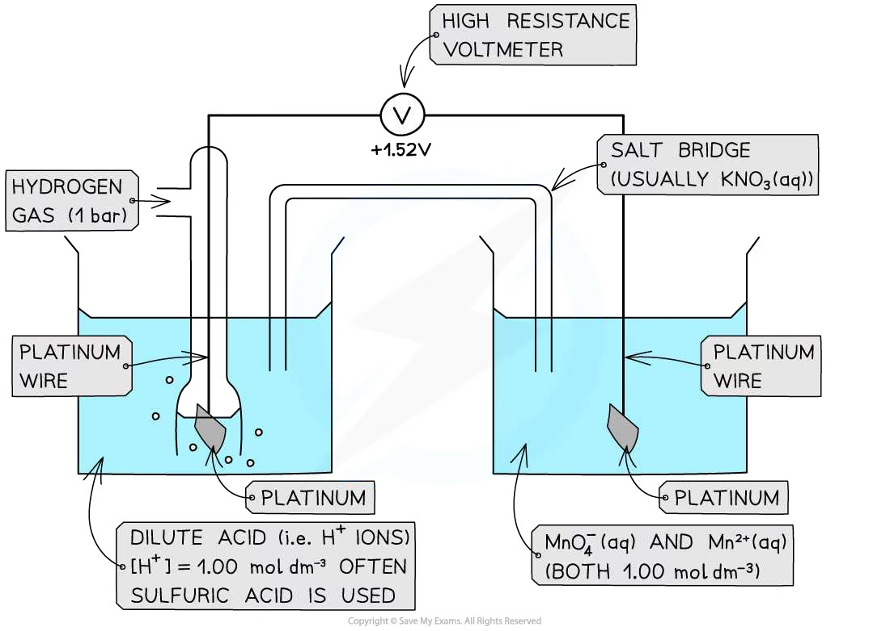{.concept-figure fig-alt="Permanganate and manganese(II) half-cell with an inert platinum electrode"}
:::

::: {.formula-panel}
### Salt bridge and conventional cell diagrams

Salt bridge 让离子移动、维持两侧电中性并闭合内电路。若一侧有 $\ce{Ag+}$，不要使用含 $\ce{Cl-}$ 的 KCl，因为会生成 $\ce{AgCl(s)}$。

以 Zn/Cu galvanic cell 为例：

$$\ce{Zn(s) | Zn^{2+}(aq) || Cu^{2+}(aq) | Cu(s)}$$

左侧写 oxidation half-cell，通常是 negative pole / anode；右侧写 reduction half-cell，通常是 positive pole / cathode。电子由 **negative pole to positive pole**。

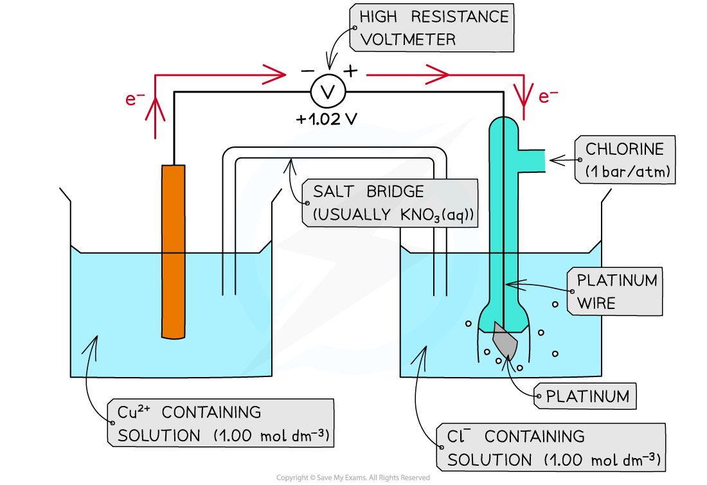{.concept-figure fig-alt="Electron flow and electrode processes in an electrochemical cell"}

{.concept-figure fig-alt="Electrochemical cell used to assess the feasibility of a copper and chlorine reaction"}

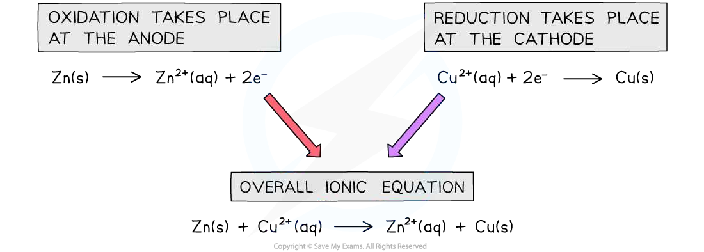{.concept-figure fig-alt="Zinc and copper galvanic cell showing oxidation at zinc and reduction at copper"}
:::

::: {.formula-panel}
### Calculating $E^\ominus_{\mathrm{cell}}$ and feasibility

$$E^\ominus_{\mathrm{cell}}=E^\ominus_{\mathrm{reduction}}-E^\ominus_{\mathrm{oxidation}}$$

也可以说是 more positive $E^\ominus$ 减去 less positive $E^\ominus$。不要把两个 reduction potentials 相加，也不要在已经反向写出 oxidation equation 后忘记变号。

| $E^\ominus_{\mathrm{cell}}$ | Meaning |
|---:|---|
| positive | reaction is feasible under standard conditions |
| zero | no net driving force at equilibrium |
| negative | written forward reaction is not feasible under standard conditions |

**Feasible** 表示热力学上有可能发生，不等于反应一定快速发生；速率还可能受 activation energy 和其他动力学因素影响。

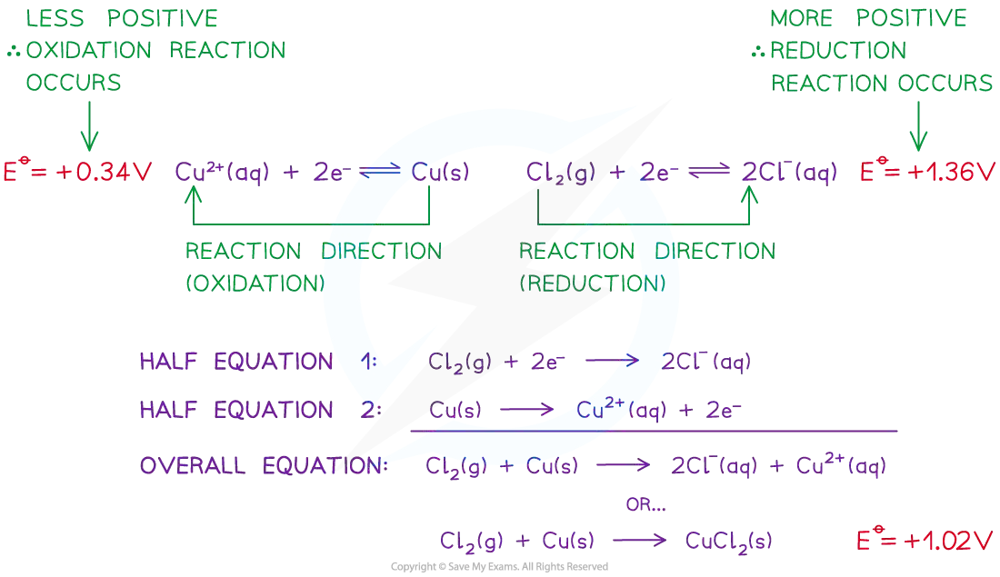{.concept-figure fig-alt="Oxidation and reduction directions with the overall electrochemical equation"}
:::

::: {.study-card}
### Oxidising and reducing agents

- **Oxidising agent** accepts electrons and is reduced；在 reduction half-equation 左侧寻找。
- **Reducing agent** donates electrons and is oxidised；在 reduction half-equation 右侧寻找。
- 较正的左侧物种通常是较强 oxidising agent；较负半方程式右侧物种通常是较强 reducing agent。

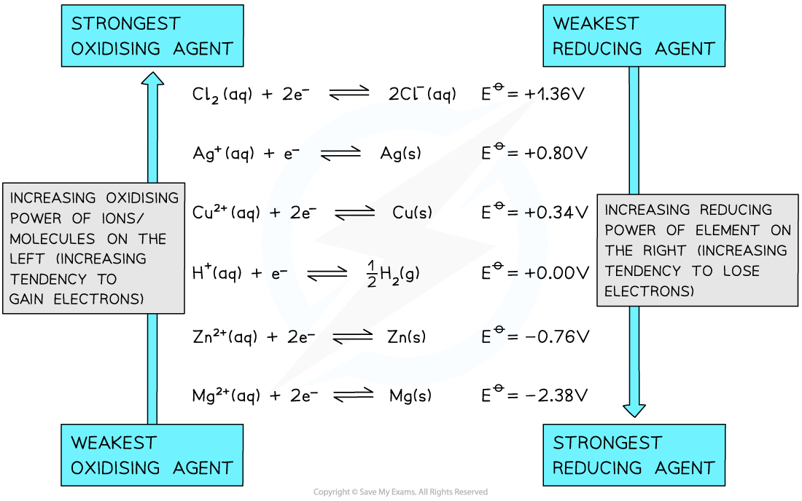{.concept-figure fig-alt="Electrochemical series showing the relative strength of oxidising and reducing agents"}
:::

::: {.study-card}
### Balancing ionic redox equations

根据 $E^\ominus$ 选 reduction；反转另一个方程式作 oxidation；配平电子数；相加并约去电子；检查原子、电荷和状态符号。酸性条件下可以使用 $\ce{H+}$、$\ce{H2O}$ 配平；不要把电子写在最终 overall equation 中。
:::

::: {.formula-panel}
### Nernst equation and non-standard conditions

标准电极电势只适用于 standard conditions。改变 ion concentration、gas pressure 或 temperature 后，要使用实际 electrode potential $E$。

$$E=E^\ominus-\frac{RT}{nF}\ln Q$$

对于 reduction half-equation $\ce{Ox + n e- <=> Red}$：

$$E=E^\ominus+\frac{RT}{nF}\ln\left(\frac{[\mathrm{Ox}]}{[\mathrm{Red}]}\right)$$

298 K 时：

$$E=E^\ominus+\frac{0.059}{n}\log_{10}\left(\frac{[\mathrm{oxidised\ species}]}{[\mathrm{reduced\ species}]}\right)$$

其中 $R=8.31\ \mathrm{J\ K^{-1}\ mol^{-1}}$，$F=96500\ \mathrm{C\ mol^{-1}}$，$n$ 是转移电子数。纯固体和纯液体的 activity 取 1，不写入 concentration quotient。

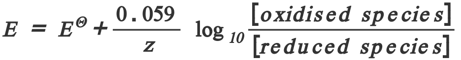{.concept-figure fig-alt="Nernst equation formula for calculating electrode potential"}
:::

::: {.study-card}
### Effect of concentration on electrode potential

对 $\ce{Ox + n e- <=> Red}$，增加 $[\ce{Ox}]$ 会使平衡右移、$E$ 变得更正；增加 $[\ce{Red}]$ 会使平衡左移、$E$ 变得更负。Common-ion effect 可能通过沉淀降低某个 ion 的浓度，进而改变 $E$。

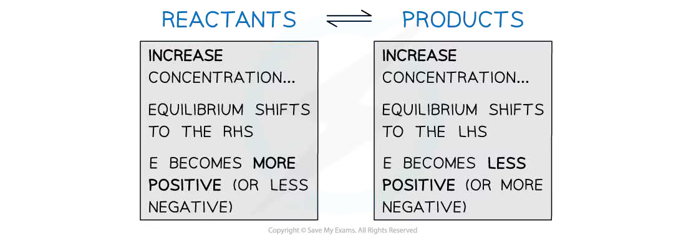{.concept-figure fig-alt="Effect of changing concentration on electrode potential"}
:::

::: {.formula-panel}
### Linking $E^\ominus_{\mathrm{cell}}$ and $\Delta G^\ominus$

$$\Delta G^\ominus=-nFE^\ominus_{\mathrm{cell}}$$

$\Delta G^\ominus$ 的单位先得到 $\mathrm{J\ mol^{-1}}$；若题目要求 $\mathrm{kJ\ mol^{-1}}$，最后除以 1000。$E^\ominus_{\mathrm{cell}}>0$ 时，$\Delta G^\ominus<0$，正向反应 thermodynamically feasible。

{.concept-figure fig-alt="Electrochemical cell reaction and electron flow used when linking cell potential to Gibbs energy"}
:::

::: {.worked-example}
Worked example · Nernst equation

### Fe³⁺/Fe²⁺ half-cell

**Calculate the electrode potential at 298 K of a Fe³⁺/Fe²⁺ half-cell.**

$$\ce{Fe3+(aq) + e- <=> Fe2+(aq)}$$

$$[\ce{Fe3+}]=0.034\ \mathrm{mol\ dm^{-3}}$$

$$[\ce{Fe2+}]=0.64\ \mathrm{mol\ dm^{-3}}$$

$$E^\ominus=+0.77\ \mathrm{V}$$

- Oxidised species: $\ce{Fe3+}$.
- Reduced species: $\ce{Fe2+}$.
- $z=1$.
- Use the Nernst equation:

  $$E=E^\ominus+\frac{0.059}{z}\log_{10}\left(\frac{[\mathrm{oxidised\ species}]}{[\mathrm{reduced\ species}]}\right)$$

- Substitute the values:

  $$E=(+0.77)+\frac{0.059}{1}\log_{10}\left(\frac{0.034}{0.64}\right)$$

  $$E=(+0.77)+(-0.075)$$

- **Final answer:** $E=+0.69\ \mathrm{V}$.

:::

::: {.worked-example}
Worked example · Nernst equation

### Cu²⁺/Cu half-cell

**Calculate the electrode potential at 298 K of a Cu²⁺/Cu half-cell.**

$$\ce{Cu2+(aq) + 2e- <=> Cu(s)}$$

$$[\ce{Cu2+}]=0.0010\ \mathrm{mol\ dm^{-3}}$$

$$E^\ominus=+0.34\ \mathrm{V}$$

- Oxidised species: $\ce{Cu2+}$.
- Reduced species: $\ce{Cu(s)}$.
- Solid Cu is not included in the Nernst quotient; its activity is fixed at 1.0.
- $z=2$.
- Substitute the values:

  $$E=0.34+\frac{0.059}{2}\log_{10}\left(\frac{0.0010}{1.0}\right)$$

  $$E=(+0.34)+(-0.089)$$

- **Final answer:** $E=+0.25\ \mathrm{V}$.

**Exam tip:** use the full Nernst equation if the temperature is not 298 K; the simplified equation above is the syllabus form for 298 K.

:::

::: {.worked-example}
Worked example · Gibbs energy

### Standard Gibbs free energy change for an electrochemical cell

**Calculate the standard Gibbs free energy change for the following electrochemical cell:**

$$\ce{2Fe3+(aq) + Cu(s) -> 2Fe2+(aq) + Cu2+(aq)}$$

1. Write the relevant half-equations and their standard electrode potentials:

   $$\ce{Fe3+(aq) + e- <=> Fe2+(aq)}\qquad E^\ominus=+0.77\ \mathrm{V}$$

   $$\ce{Cu2+(aq) + 2e- <=> Cu(s)}\qquad E^\ominus=+0.34\ \mathrm{V}$$

2. Calculate the standard cell potential:

   $$E^\ominus_{\mathrm{cell}}=E^\ominus_{\mathrm{red}}-E^\ominus_{\mathrm{ox}}=(+0.77)-(+0.34)=+0.43\ \mathrm{V}$$

3. The $\ce{Cu2+/Cu}$ half-cell has the smaller $E^\ominus$, so Cu is oxidised and transfers two electrons to two $\ce{Fe3+}$ ions. Therefore, $n=2$.

4. Use:

   $$\Delta G^\ominus=-n\times E^\ominus_{\mathrm{cell}}\times F$$

5. Substitute $F=96\,500\ \mathrm{C\ mol^{-1}}$:

   $$\Delta G^\ominus=-2\times(+0.43)\times96\,500$$

   $$\Delta G^\ominus=-82\,990\ \mathrm{J\ mol^{-1}}$$

6. **Final answer:** $\Delta G^\ominus\approx-83\ \mathrm{kJ\ mol^{-1}}$.

:::

## Structured Questions



## Chapter checklist

- [ ] 我能用 $Q=It$、$Q=nF$ 和 $F=Le$ 完成 electrolysis calculations。
- [ ] 我能从 half-equation 判断 electrons 与 product 的 mole ratio。
- [ ] 我能解释 electroplating 中 cathode、anode 和 electrolyte 的作用。
- [ ] 我能描述用 copper electroplating 测定 Avogadro constant 的实验步骤。
- [ ] 我能解释 electrode potential 和 $E^\ominus$ 的含义。
- [ ] 我能写出 SHE 的组成、标准条件和 $E^\ominus=0.00\ \mathrm{V}$。
- [ ] 我能识别三类 half-cell，知道何时需要 Pt electrode。
- [ ] 我能画 conventional cell diagram，写出 salt bridge、positive/negative pole 和 electron flow。
- [ ] 我能用 $E^\ominus_{\mathrm{cell}}=E^\ominus_{\mathrm{reduction}}-E^\ominus_{\mathrm{oxidation}}$ 判断可行性。
- [ ] 我能从 electrochemical series 找出 oxidising agent 和 reducing agent。
- [ ] 我能用 half-equation method 配平 ionic redox equation。
- [ ] 我能在 298 K 和非 298 K 条件下正确使用 Nernst equation。
- [ ] 我能用 $\Delta G^\ominus=-nFE^\ominus_{\mathrm{cell}}$ 做单位正确的计算。

### Original question PDFs

- [24.1 Electrolysis calculations - Easy](https://raw.githubusercontent.com/nanoxsj/CIE-Chemistry-Study/main/resources/original-papers/electrochemistry/24.1-electrolysis-calculations-easy.pdf)
- [24.1 Electrolysis calculations - Medium](https://raw.githubusercontent.com/nanoxsj/CIE-Chemistry-Study/main/resources/original-papers/electrochemistry/24.1-electrolysis-calculations-medium.pdf)
- [24.1 Electrolysis calculations - Hard](https://raw.githubusercontent.com/nanoxsj/CIE-Chemistry-Study/main/resources/original-papers/electrochemistry/24.1-electrolysis-calculations-hard.pdf)
- [24.2 Standard electrode potentials - Easy](https://raw.githubusercontent.com/nanoxsj/CIE-Chemistry-Study/main/resources/original-papers/electrochemistry/24.2-standard-electrode-potentials-easy.pdf)
- [24.2 Standard electrode potentials - Medium](https://raw.githubusercontent.com/nanoxsj/CIE-Chemistry-Study/main/resources/original-papers/electrochemistry/24.2-standard-electrode-potentials-medium.pdf)
- [24.2 Standard electrode potentials - Hard](https://raw.githubusercontent.com/nanoxsj/CIE-Chemistry-Study/main/resources/original-papers/electrochemistry/24.2-standard-electrode-potentials-hard.pdf)
