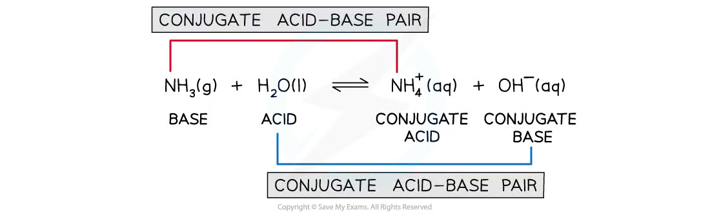
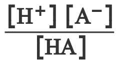
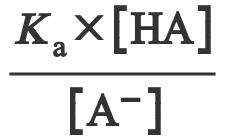
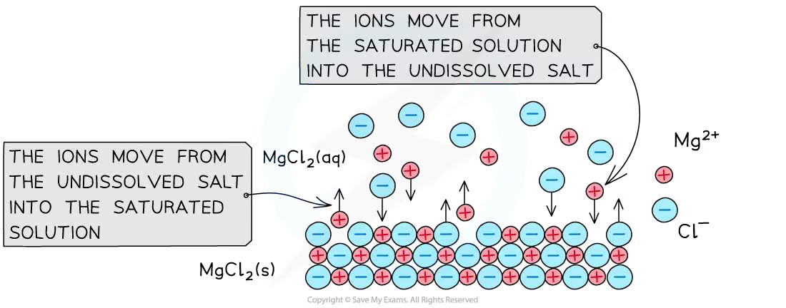
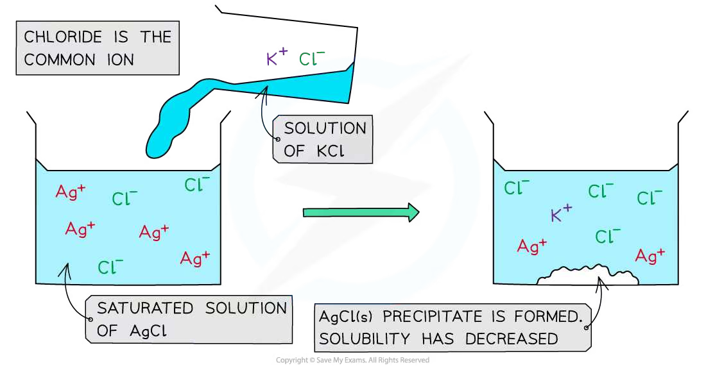
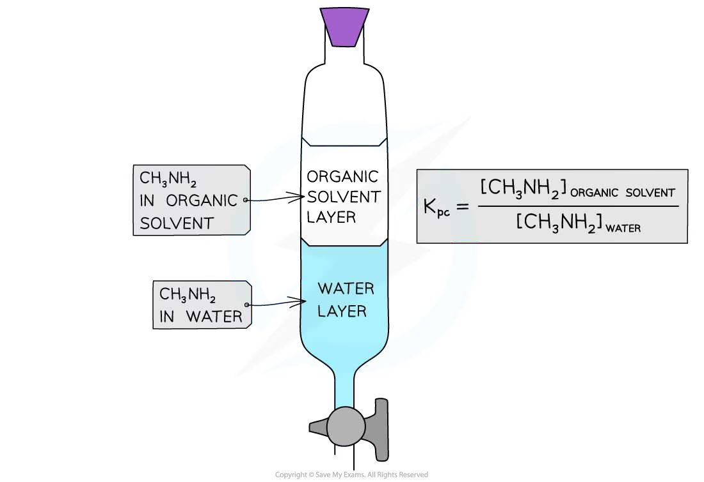

# 25 Equilibria

本章按 CIE 2025–2027 syllabus 的章节编号组织为 **25.1 Acids and bases** 与 **25.2 Partition coefficients**。题目来源仍保留旧专题题包的 `5.5 Equilibria (A Level Only)` 作为 source label，但页面知识点使用新考纲编号；不混入 AS 7.1 Chemical Equilibria，也不加入不属于 25 的旧题主题。

## Learning objectives

学完本章后，你应该能够：

- explain Brønsted–Lowry acids and bases and identify conjugate acid–base pairs;
- use $pH=-\log_{10}[\ce{H+}]$, $K_a$, p$K_a$ and $K_w$;
- distinguish strong acids, strong alkalis and weak acids, and calculate their pH values;
- define buffer solutions, explain how they resist pH change and calculate their pH;
- explain the bicarbonate buffer system in blood;
- write $K_{sp}$ expressions, calculate $K_{sp}$ or solubility, and use the common-ion effect;
- decide whether a precipitate forms by comparing the ionic product with $K_{sp}$;
- define $K_{pc}$, calculate it from equilibrium concentrations and explain its value using solute and solvent polarity.

## 25.1 Acids and bases

::: {.study-card}
### Brønsted–Lowry acids, bases and conjugate pairs

在 Brønsted–Lowry 定义中，**an acid is a proton donor**，而 **a base is a proton acceptor**。酸失去一个质子后形成它的 **conjugate base**；碱接受一个质子后形成它的 **conjugate acid**。

例如：

$$\ce{HCl + H2O -> Cl- + H3O+}$$

这里 $\ce{HCl/Cl-}$ 是一对 conjugate acid–base pair，$\ce{H2O/H3O+}$ 是另一对。conjugate pair 只相差一个 $\ce{H+}$。

对弱酸：

$$\ce{HA(aq) <=> H+(aq) + A-(aq)}$$

$\ce{HA}$ 是 acid，$\ce{A-}$ 是 conjugate base。平衡向右的程度越大，酸越强。

{.concept-figure fig-alt="Conjugate acid-base pairs and proton transfer"}
:::

::: {.worked-example}
Worked example · 笔记例题

### Identifying conjugate acid–base pairs

**Identify the conjugate acid-base pairs in the following equilibrium reaction:**

$$\ce{NH3(g) + H2O(l) <=> NH4+(aq) + OH-(aq)}$$

**Forward reaction:**

1. $\ce{NH3}$ accepts a proton to form $\ce{NH4+}$. Therefore, $\ce{NH4+}$ is the conjugate acid of $\ce{NH3}$.
2. $\ce{H2O}$ donates a proton to form $\ce{OH-}$. Therefore, $\ce{OH-}$ is the conjugate base of $\ce{H2O}$.

**Reverse reaction:**

3. $\ce{NH4+}$ donates a proton to form $\ce{NH3}$. Therefore, $\ce{NH3}$ is the conjugate base of $\ce{NH4+}$.
4. $\ce{OH-}$ accepts a proton to form $\ce{H2O}$. Therefore, $\ce{H2O}$ is the conjugate acid of $\ce{OH-}$.

**Final answer:** the conjugate acid-base pairs are $\ce{NH3/NH4+}$ and $\ce{H2O/OH-}$.

:::

::: {.study-card}
### pH, $K_a$, p$K_a$ and $K_w$

对水溶液：

$$pH=-\log_{10}[\ce{H+}]$$

$$[\ce{H+}]=10^{-pH}$$

弱酸的 acid dissociation constant 为：

$$K_a=\frac{[\ce{H+}][\ce{A-}]}{[\ce{HA}]}$$

$$pK_a=-\log_{10}K_a$$

$K_a$ 越大，酸越强；p$K_a$ 越小，酸越强。水的离子积为：

$$K_w=[\ce{H+}][\ce{OH-}]=1.00\times10^{-14}\quad (298\ \mathrm{K})$$

因此：

$$[\ce{OH-}]=\frac{K_w}{[\ce{H+}]}$$

考纲本节不要求使用 $K_b$，也不要求使用 $K_w=K_aK_b$。
:::

::: {.worked-example}
Worked example · 笔记例题

### Calculating the pH of acids

**Calculate the pH of ethanoic acid, at 298 K, when the hydrogen ion concentration is $1.32\times10^{-3}\ \mathrm{mol\,dm^{-3}}$.**

Use the definition of pH:

$$pH=-\log_{10}[\ce{H+}]$$

Substitute the hydrogen ion concentration:

$$pH=-\log(1.32\times10^{-3})$$

$$pH=2.9$$

**Final answer:** $pH=2.9$.

:::

::: {.worked-example}
Worked example · 笔记例题

### Calculating $K_a$ and p$K_a$ of a weak acid

**Calculate the $K_a$ and p$K_a$ values of $0.100\ \mathrm{mol\,dm^{-3}}$ ethanoic acid at 298 K which forms $1.32\times10^{-3}\ \mathrm{mol\,dm^{-3}}$ of $\ce{H+}$ ions in solution.**

Write the dissociation equilibrium:

$$\ce{CH3COOH(aq) <=> H+(aq) + CH3COO-(aq)}$$

Write the expression for $K_a$:

$$K_a=\frac{[\ce{H+}][\ce{CH3COO-}]}{[\ce{CH3COOH}]}$$

The ratio of $\ce{H+}$ to $\ce{CH3COO-}$ formed is 1:1, so:

$$K_a=\frac{[\ce{H+}]^2}{[\ce{CH3COOH}]}$$

Substitute the concentrations:

$$K_a=\frac{(1.32\times10^{-3})^2}{0.100}$$

$$K_a=1.74\times10^{-5}\ \mathrm{mol\,dm^{-3}}$$

The units are:

$$K_a=\frac{(\mathrm{mol\,dm^{-3}})^2}{\mathrm{mol\,dm^{-3}}}=\mathrm{mol\,dm^{-3}}$$

Now calculate p$K_a$:

$$pK_a=-\log_{10}K_a$$

$$pK_a=-\log_{10}(1.74\times10^{-5})=4.76$$

**Final answer:** $K_a=1.74\times10^{-5}\ \mathrm{mol\,dm^{-3}}$ and p$K_a=4.76$.

:::

::: {.worked-example}
Worked example · 笔记例题

### Calculating the concentration of $\ce{H+}$ in pure water

**Calculate the concentration of $\ce{H+}$ in pure water, using the ionic product of water.**

The ionisation of water is:

$$\ce{H2O(l) <=> H+(aq) + OH-(aq)}$$

The ionic product of water is:

$$K_w=\frac{[\ce{H+}][\ce{OH-}]}{[\ce{H2O}]}$$

Because the concentration of water is approximately constant, it is included in the constant:

$$K_w=[\ce{H+}][\ce{OH-}]$$

In pure water, $[\ce{H+}]=[\ce{OH-}]$, so:

$$K_w=[\ce{H+}]^2$$

Rearrange and substitute:

$$[\ce{H+}]=\sqrt{K_w}=\sqrt{1.00\times10^{-14}}$$

$$[\ce{H+}]=1.00\times10^{-7}\ \mathrm{mol\,dm^{-3}}$$

**Final answer:** $[\ce{H+}]=1.00\times10^{-7}\ \mathrm{mol\,dm^{-3}}$.

:::

::: {.worked-example}
Worked example · 笔记例题

### pH calculations of a strong acid

**For a solution of hydrochloric acid, calculate the following:**

**1. The pH when the hydrogen ion concentration is $1.6\times10^{-4}\ \mathrm{mol\,dm^{-3}}$.**

**2. The hydrogen ion concentration when the pH is 3.1.**

Hydrochloric acid is a strong monobasic acid:

$$\ce{HCl(aq) -> H+(aq) + Cl-(aq)}$$

**1. Calculate the pH:**

$$pH=-\log[\ce{H+}]$$

$$pH=-\log(1.6\times10^{-4})$$

$$pH=3.80$$

**2. Calculate the hydrogen ion concentration:**

$$pH=-\log[\ce{H+}]$$

$$[\ce{H+}]=10^{-pH}$$

$$[\ce{H+}]=10^{-3.1}$$

$$[\ce{H+}]=7.9\times10^{-4}\ \mathrm{mol\,dm^{-3}}$$

**Final answer:** 1. $pH=3.80$; 2. $[\ce{H+}]=7.9\times10^{-4}\ \mathrm{mol\,dm^{-3}}$.

:::

::: {.worked-example}
Worked example · 笔记例题

### pH calculations of a strong alkali

**For a solution of sodium hydroxide, calculate the following:**

**1. The pH when the hydrogen ion concentration is $3.5\times10^{-11}\ \mathrm{mol\,dm^{-3}}$.**

**2. The hydroxide ion concentration when the pH is 12.3.**

Sodium hydroxide is a strong base:

$$\ce{NaOH(aq) -> Na+(aq) + OH-(aq)}$$

**1. Calculate the pH:**

$$pH=-\log[\ce{H+}]$$

$$pH=-\log(3.5\times10^{-11})$$

$$pH=10.5$$

**2. Calculate the hydroxide ion concentration:**

First calculate $[\ce{H+}]$ from the pH:

$$[\ce{H+}]=10^{-pH}=10^{-12.3}=5.01\times10^{-13}\ \mathrm{mol\,dm^{-3}}$$

Use the ionic product of water:

$$K_w=[\ce{H+}][\ce{OH-}]$$

$$[\ce{OH-}]=\frac{K_w}{[\ce{H+}]}$$

$$[\ce{OH-}]=\frac{1.00\times10^{-14}}{5.01\times10^{-13}}$$

$$[\ce{OH-}]=0.0199\ \mathrm{mol\,dm^{-3}}$$

**Final answer:** 1. $pH=10.5$; 2. $[\ce{OH-}]=0.0199\ \mathrm{mol\,dm^{-3}}$.

:::

::: {.worked-example}
Worked example · 笔记例题

### pH calculations of weak acids

**Calculate the pH of $0.100\ \mathrm{mol\,dm^{-3}}$ ethanoic acid at 298 K with a $K_a$ value of $1.74\times10^{-5}\ \mathrm{mol\,dm^{-3}}$.**

Write the dissociation equilibrium:

$$\ce{CH3COOH(aq) <=> H+(aq) + CH3COO-(aq)}$$

Write the expression for $K_a$:

$$K_a=\frac{[\ce{H+}][\ce{CH3COO-}]}{[\ce{CH3COOH}]}$$

As the ions are formed in a 1:1 ratio, $[\ce{H+}]=[\ce{CH3COO-}]$:

$$K_a=\frac{[\ce{H+}]^2}{[\ce{CH3COOH}]}$$

Rearrange and substitute:

$$[\ce{H+}]=\sqrt{K_a[\ce{CH3COOH}]}$$

$$[\ce{H+}]=\sqrt{(1.74\times10^{-5})(0.100)}=1.32\times10^{-3}\ \mathrm{mol\,dm^{-3}}$$

$$pH=-\log_{10}(1.32\times10^{-3})=2.88$$

**Final answer:** $[\ce{H+}]=1.32\times10^{-3}\ \mathrm{mol\,dm^{-3}}$ and $pH=2.88$.

:::

::: {.study-card}
### Buffer solutions

**A buffer solution resists changes in pH when small amounts of acid or alkali are added.**

An acidic buffer contains a weak acid, $\ce{HA}$, and a soluble salt containing its conjugate base, $\ce{A-}$, for example ethanoic acid and sodium ethanoate:

$$\ce{CH3COOH(aq) <=> H+(aq) + CH3COO-(aq)}$$

$$\ce{CH3COONa(aq) -> Na+(aq) + CH3COO-(aq)}$$

When a small amount of acid is added, the conjugate base removes most of the added $\ce{H+}$:

$$\ce{CH3COO-(aq) + H+(aq) -> CH3COOH(aq)}$$

When a small amount of alkali is added, the weak acid removes most of the added $\ce{OH-}$:

$$\ce{CH3COOH(aq) + OH-(aq) -> CH3COO-(aq) + H2O(l)}$$

因此 $[\ce{H+}]$ 变化很小，pH 只发生小幅变化。血液中的 bicarbonate buffer 可用下列平衡表示：

$$\ce{CO2(g) + H2O(l) <=> H+(aq) + HCO3-(aq)}$$

加入少量酸时，$\ce{HCO3-}$ 消耗 $\ce{H+}$；加入少量碱时，碳酸体系补充 $\ce{H+}$，从而减小 pH 变化。
:::

::: {.formula-panel}
### Buffer calculation formula

在弱酸 dissociation 的近似下：

$$K_a=\frac{[\ce{H+}][\ce{A-}]}{[\ce{HA}]}$$

$$[\ce{H+}]=K_a\frac{[\ce{HA}]}{[\ce{A-}]}$$

$$pH=pK_a+\log_{10}\frac{[\ce{A-}]}{[\ce{HA}]}$$

这里 $[\ce{A-}]$ 可用 soluble salt 的浓度表示，$[\ce{HA}]$ 可用 weak acid 的浓度表示。使用这些式子时，需要假设 weak acid 的 dissociation 很小，且盐完全 dissociate。

{.concept-figure fig-alt="Buffer equilibrium expression"}

{.concept-figure fig-alt="Henderson-Hasselbalch buffer equation"}
:::

::: {.worked-example}
Worked example · 笔记例题

### Calculating the pH of a buffer solution

**A buffer solution contains ethanoic acid at $0.305\ \mathrm{mol\,dm^{-3}}$ and sodium ethanoate at $0.520\ \mathrm{mol\,dm^{-3}}$. The value of $K_a$ for ethanoic acid is $1.43\times10^{-5}\ \mathrm{mol\,dm^{-3}}$. Calculate the pH of the buffer solution.**

Use the buffer equation:

$$[\ce{H+}]=K_a\frac{[\ce{CH3COOH}]}{[\ce{CH3COO-}]}$$

$$[\ce{H+}]=(1.43\times10^{-5})\frac{0.305}{0.520}=8.39\times10^{-6}\ \mathrm{mol\,dm^{-3}}$$

$$pH=-\log_{10}(8.39\times10^{-6})=5.08$$

**Final answer:** $pH=5.08$.

:::

::: {.study-card}
### Solubility products and the common-ion effect

For a sparingly soluble ionic compound, the saturated solution is in dynamic equilibrium with the solid. For example:

$$\ce{AgCl(s) <=> Ag+(aq) + Cl-(aq)}$$

$$K_{sp}=[\ce{Ag+}][\ce{Cl-}]$$

Pure solids are not included in the expression. If the dissolution produces unequal numbers of ions, use the stoichiometric coefficients as powers:

$$\ce{Ca(OH)2(s) <=> Ca^{2+}(aq) + 2OH-(aq)}$$

$$K_{sp}=[\ce{Ca^{2+}}][\ce{OH-}]^2$$

The common-ion effect is explained by Le Chatelier’s principle. Adding a common ion shifts the equilibrium to the left and decreases solubility. Removing one of the dissolved ions can shift the equilibrium to the right and increase solubility.

{.concept-figure fig-alt="Solubility equilibrium and solubility product"}

{.concept-figure fig-alt="Common-ion effect on solubility equilibrium"}
:::

::: {.worked-example}
Worked example · 笔记例题

### Expressing $K_{sp}$ of ionic compounds

**Give the equilibrium expressions, including units, for the solubility products of the following ionic compounds:**

**1. $\ce{Ca(OH)2}$**

**2. $\ce{Fe2O3}$**

**3. $\ce{SnCO3}$**

1. $$\ce{Ca(OH)2(s) <=> Ca^{2+}(aq) + 2OH-(aq)}$$

   $$K_{sp}=[\ce{Ca^{2+}}][\ce{OH-}]^2$$

   $$K_{sp}=(\mathrm{mol\,dm^{-3}})(\mathrm{mol\,dm^{-3}})^2
   =\mathrm{mol^3\,dm^{-9}}$$

2. $$\ce{Fe2O3(s) <=> 2Fe^{3+}(aq) + 3O^{2-}(aq)}$$

   $$K_{sp}=[\ce{Fe^{3+}}]^2[\ce{O^{2-}}]^3$$

   $$K_{sp}=(\mathrm{mol\,dm^{-3}})^2(\mathrm{mol\,dm^{-3}})^3
   =\mathrm{mol^5\,dm^{-15}}$$

3. $$\ce{SnCO3(s) <=> Sn^{2+}(aq) + CO3^{2-}(aq)}$$

   $$K_{sp}=[\ce{Sn^{2+}}][\ce{CO3^{2-}}]$$

   $$K_{sp}=(\mathrm{mol\,dm^{-3}})(\mathrm{mol\,dm^{-3}})
   =\mathrm{mol^2\,dm^{-6}}$$

**Final answer:**

1. $K_{sp}= [\ce{Ca^{2+}}][\ce{OH-}]^2$, with units $\mathrm{mol^3\,dm^{-9}}$.
2. $K_{sp}= [\ce{Fe^{3+}}]^2[\ce{O^{2-}}]^3$, with units $\mathrm{mol^5\,dm^{-15}}$.
3. $K_{sp}= [\ce{Sn^{2+}}][\ce{CO3^{2-}}]$, with units $\mathrm{mol^2\,dm^{-6}}$.

:::

::: {.worked-example}
Worked example · 笔记例题

### Calculating $K_{sp}$ from solubility

**Calculate the solubility product of a saturated solution of lead(II) bromide, $\ce{PbBr2}$, with a solubility of $1.39\times10^{-3}\ \mathrm{mol\,dm^{-3}}$.**

$$\ce{PbBr2(s) <=> Pb^{2+}(aq) + 2Br-(aq)}$$

The solubility of $\ce{PbBr2}$ is:

$$[\ce{PbBr2}]=1.39\times10^{-3}\ \mathrm{mol\,dm^{-3}}$$

Therefore:

$$[\ce{Pb^{2+}}]=1.39\times10^{-3}\ \mathrm{mol\,dm^{-3}}$$

$$[\ce{Br-}]=2\times1.39\times10^{-3}=2.78\times10^{-3}\ \mathrm{mol\,dm^{-3}}$$

Use the solubility product expression:

$$K_{sp}=[\ce{Pb^{2+}}][\ce{Br-}]^2$$

$$K_{sp}=(1.39\times10^{-3})(2.78\times10^{-3})^2$$

$$K_{sp}=1.07\times10^{-8}\ \mathrm{mol^3\,dm^{-9}}$$

**Final answer:** $K_{sp}=1.07\times10^{-8}\ \mathrm{mol^3\,dm^{-9}}$.

:::

::: {.worked-example}
Worked example · 笔记例题

### Calculating solubility from $K_{sp}$

**Calculate the solubility of a saturated solution of copper(II) oxide, $\ce{CuO}$, with a solubility product of $5.9\times10^{-36}\ \mathrm{mol^2\,dm^{-6}}$.**

$$\ce{CuO(s) <=> Cu^{2+}(aq) + O^{2-}(aq)}$$

The two ions are formed in a 1:1 ratio, so:

$$[\ce{Cu^{2+}}]=[\ce{O^{2-}}]$$

$$K_{sp}=[\ce{Cu^{2+}}][\ce{O^{2-}}]=[\ce{Cu^{2+}}]^2$$

Substitute the given $K_{sp}$ value:

$$5.9\times10^{-36}=[\ce{Cu^{2+}}]^2$$

$$[\ce{Cu^{2+}}]=\sqrt{5.9\times10^{-36}}
=2.4\times10^{-18}\ \mathrm{mol\,dm^{-3}}$$

Since $[\ce{CuO(s)}]=[\ce{Cu^{2+}(aq)}]$ on a molar basis, the solubility of $\ce{CuO}$ is the same value.

**Final answer:** the solubility is $2.4\times10^{-18}\ \mathrm{mol\,dm^{-3}}$.

:::

::: {.worked-example}
Worked example · 笔记例题

### Calculating precipitate formation using $K_{sp}$ and a common ion

**Predict whether a precipitate of $\ce{CaSO4}$ will form if a saturated solution of $1.0\times10^{-3}\ \mathrm{mol\,dm^{-3}}$ $\ce{CaSO4}$ is mixed with an equal volume of $1.0\times10^{-3}\ \mathrm{mol\,dm^{-3}}$ $\ce{Na2SO4}$.**

**$K_{sp}$ for $\ce{CaSO4}=2.0\times10^{-5}\ \mathrm{mol^2\,dm^{-6}}$.**

Write the equilibrium and $K_{sp}$ expression:

$$\ce{CaSO4(s) <=> Ca^{2+}(aq) + SO4^{2-}(aq)}$$

$$K_{sp}=[\ce{Ca^{2+}}][\ce{SO4^{2-}}]$$

Equal volumes mean that the total solution volume doubles, so the calcium ion concentration is halved:

$$[\ce{Ca^{2+}}]=\frac{1.0\times10^{-3}}{2}=5.0\times10^{-4}\ \mathrm{mol\,dm^{-3}}$$

Sulfate is the common ion. Its concentration is:

$$[\ce{SO4^{2-}}]=1.0\times10^{-3}\ \mathrm{mol\,dm^{-3}}$$

Calculate the ionic product:

$$[\ce{Ca^{2+}}][\ce{SO4^{2-}}]
=(5.0\times10^{-4})(1.0\times10^{-3})
=5.0\times10^{-7}\ \mathrm{mol^2\,dm^{-6}}$$

Compare $Q_{sp}$ with $K_{sp}$:

$$5.0\times10^{-7}<2.0\times10^{-5}$$

Because the ionic product is less than $K_{sp}$, the solution is not saturated with respect to $\ce{CaSO4}$.

**Final answer:** no precipitate forms.

:::

## 25.2 Partition coefficients

::: {.study-card}
### Definition and calculation of $K_{pc}$

When a solute is shaken with two immiscible solvents, it distributes between the two layers and reaches equilibrium. At a fixed temperature:

**The partition coefficient, $K_{pc}$, is the ratio of the equilibrium concentrations of a solute in two immiscible solvents.**

For organic solvent / aqueous solvent, the convention used here is:

$$K_{pc}=\frac{[\text{solute}]_{\text{organic}}}{[\text{solute}]_{\text{aqueous}}}$$

Both concentrations must use the same units, normally mol dm$^{-3}$. If $K_{pc}>1$, the solute is more concentrated in the organic layer under the stated conditions; if $K_{pc}<1$, it is more concentrated in the aqueous layer.

The value depends on the polarity of both solute and solvent. Polar solutes generally interact more strongly with polar water; less-polar or hydrophobic parts of a molecule favour a less-polar organic solvent. The layers must be allowed to reach equilibrium, and the temperature should be kept constant.

{.concept-figure fig-alt="Partition coefficient between aqueous and organic layers"}
:::

::: {.worked-example}
Worked example · 笔记例题

### Methylamine partition coefficient between water and an organic solvent

**A mixture contains $100\ \mathrm{cm^3}$ of aqueous methylamine and $75.0\ \mathrm{cm^3}$ of an organic solvent. The original aqueous methylamine concentration is $0.150\ \mathrm{mol\,dm^{-3}}$. A $50.0\ \mathrm{cm^3}$ sample of the aqueous layer requires $14.1\ \mathrm{cm^3}$ of $0.225\ \mathrm{mol\,dm^{-3}}$ hydrochloric acid for complete reaction. Calculate the partition coefficient of methylamine between the organic solvent and water.**

The reaction with hydrochloric acid is 1:1:

$$\ce{CH3NH2 + HCl -> CH3NH3+ + Cl-}$$

1. Moles of methylamine in the $50.0\ \mathrm{cm^3}$ aqueous sample:

   $$n(\ce{HCl})=0.225\times\frac{14.1}{1000}=3.17\times10^{-3}\ \mathrm{mol}$$

   Therefore $n(\ce{CH3NH2})=3.17\times10^{-3}\ \mathrm{mol}$ in $50.0\ \mathrm{cm^3}$.

2. Moles in the full $100\ \mathrm{cm^3}$ aqueous layer:

   $$n_{\mathrm{aqueous}}=2(3.17\times10^{-3})=6.34\times10^{-3}\ \mathrm{mol}$$

3. Total moles initially present:

   $$n_{\mathrm{initial}}=0.150\times\frac{100}{1000}=0.0150\ \mathrm{mol}$$

   Moles in the organic layer:

   $$n_{\mathrm{organic}}=0.0150-0.00634=8.67\times10^{-3}\ \mathrm{mol}$$

4. Equilibrium concentrations:

   $$[\ce{CH3NH2}]_{\mathrm{aqueous}}=\frac{6.34\times10^{-3}}{0.100}=0.0634\ \mathrm{mol\,dm^{-3}}$$

   $$[\ce{CH3NH2}]_{\mathrm{organic}}=\frac{8.67\times10^{-3}}{0.0750}=0.116\ \mathrm{mol\,dm^{-3}}$$

5. Calculate $K_{pc}$:

   $$K_{pc}=\frac{0.116}{0.0634}=1.83$$

**Final answer:** $K_{pc}=1.83$ for organic solvent / water, so methylamine is more concentrated in the organic layer in this experiment.

:::

## Chapter checklist

- [ ] 我能用 Brønsted–Lowry 定义识别 acid、base 和 conjugate pairs。
- [ ] 我能使用 $pH$、$K_a$、p$K_a$ 和 $K_w$ 公式。
- [ ] 我能区分 strong acid、strong alkali 和 weak acid，并完成 pH 计算。
- [ ] 我能解释 buffer 如何抵抗少量 acid 或 alkali 的加入，并完成 buffer pH 计算。
- [ ] 我能写出 bicarbonate buffer 的相关平衡和反应。
- [ ] 我能写出不同 ionic compounds 的 $K_{sp}$ expression，并处理离子计量数。
- [ ] 我能由 solubility 计算 $K_{sp}$，或由 $K_{sp}$ 反推 solubility。
- [ ] 我能使用 $Q_{sp}$ 与 $K_{sp}$ 判断是否形成 precipitate，并解释 common-ion effect。
- [ ] 我能定义和计算 $K_{pc}$，并根据 polarity 解释分配趋势。

## Structured questions



### Original question PDFs

- [5.5 Equilibria (A Level Only) – Easy](https://raw.githubusercontent.com/nanoxsj/CIE-Chemistry-Study/main/resources/original-papers/equilibria/25-equilibria-5.5-easy.pdf)
- [5.5 Equilibria (A Level Only) – Medium](https://raw.githubusercontent.com/nanoxsj/CIE-Chemistry-Study/main/resources/original-papers/equilibria/25-equilibria-5.5-medium.pdf)
- [5.5 Equilibria (A Level Only) – Hard](https://raw.githubusercontent.com/nanoxsj/CIE-Chemistry-Study/main/resources/original-papers/equilibria/25-equilibria-5.5-hard.pdf)
