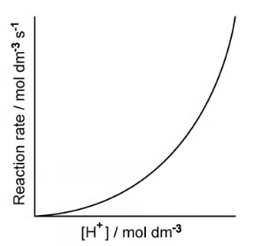
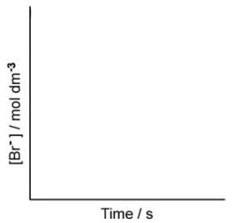
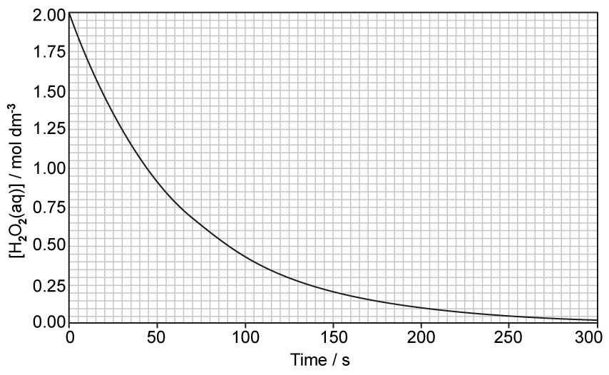
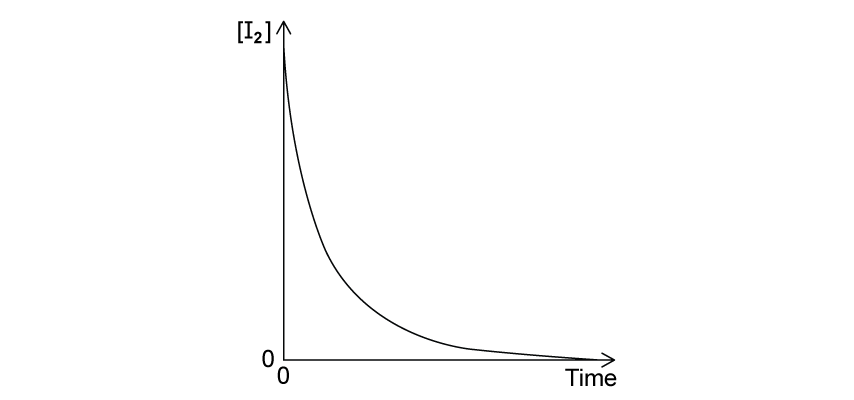
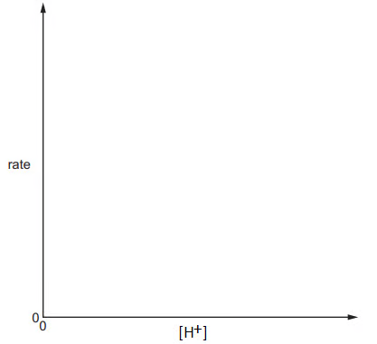
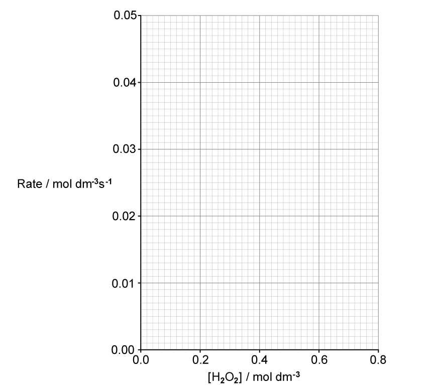
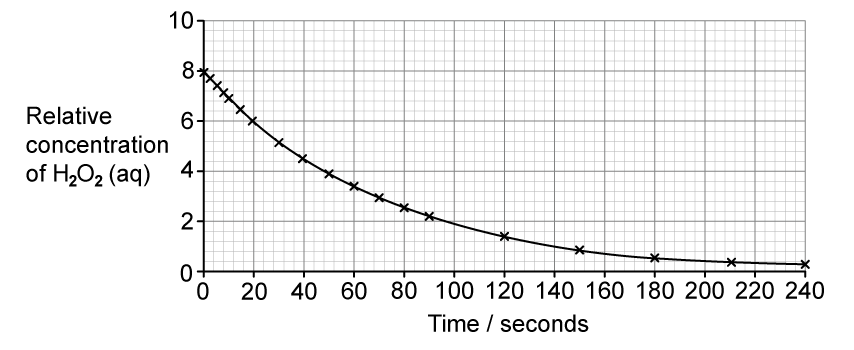
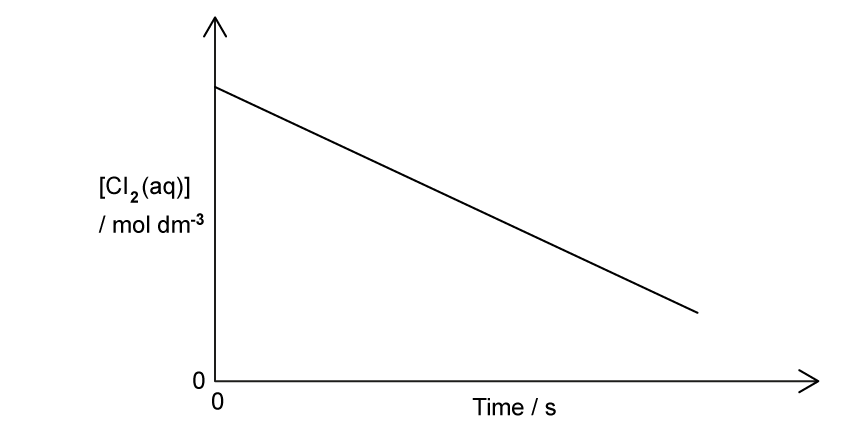
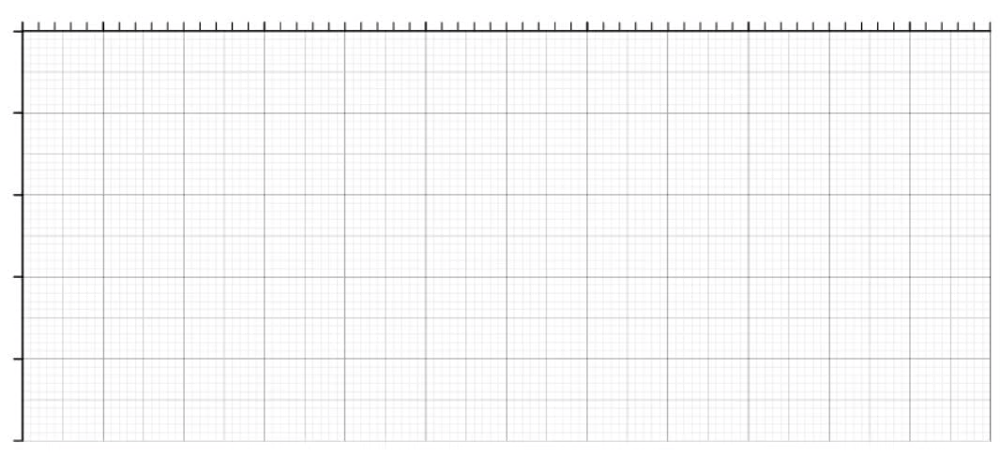

# 26 Reaction kinetics - Structured Questions

本页保留 `5.6 Reaction Kinetics (A Level Only)` 题包中的 Structured Questions，按 Easy、Medium、Hard 分组。每题保留完整英文题目、分问、题目所需的图和完整 model-answer steps。

### 5.6 Reaction Kinetics (A Level Only) - Easy

::: {.question-card}
### Example 1 · Rate equation and orders · 5.6 SQ Easy Q1

The rate equation for the reaction between reactants X, Y and Z is shown below.

$$\text{rate}=k[X]^2[Y]$$

**(a)** State the orders with respect to X, Y and Z. `[3 marks]`

**(b)** State the overall order of this reaction. `[1 mark]`

**(c)** The rate of reaction is $3.72\times10^{-5}\ \mathrm{mol\,dm^{-3}\,s^{-1}}$ when the concentrations of X, Y and Z are $0.01$, $0.02$ and $0.04\ \mathrm{mol\,dm^{-3}}$, respectively. Calculate the rate constant, $k$, including the units. `[3 marks]`

**(d)** The experiment was repeated but the initial concentration of X was doubled, all other concentrations remaining the same. State the effect on the rate of reaction and explain your answer. `[2 marks]`

Show mark scheme / model answer

- **(a)** X is second-order, Y is first-order and Z is zero-order. The power of $[X]$ is 2, the power of $[Y]$ is 1, and Z is absent from the rate equation so its order is 0. `[3]`
- **(b)** Overall order $=2+1+0=3$, so the reaction is third-order overall. `[1]`
- **(c)**

  $$3.72\times10^{-5}=k(0.01)^2(0.02)$$

  $$k=\frac{3.72\times10^{-5}}{2.00\times10^{-6}}=18.6$$

  $$k=18.6\ \mathrm{dm^6\,mol^{-2}\,s^{-1}}$$

  For the units:

  $$k=\frac{\mathrm{mol\,dm^{-3}\,s^{-1}}}{(\mathrm{mol\,dm^{-3}})^3}=\mathrm{dm^6\,mol^{-2}\,s^{-1}}$$ `[3]`
- **(d)** The rate quadruples. The reaction is second-order with respect to X, so doubling $[X]$ changes the rate by $2^2=4$. The new rate is $1.488\times10^{-4}\ \mathrm{mol\,dm^{-3}\,s^{-1}}$. `[2]`

:::

::: {.question-card}
### Example 2 · Orders from graphs and half-life · 5.6 SQ Easy Q2

Bromide ions and bromate(V) ions react in acidic conditions to form aqueous bromine:

$$\ce{5Br- (aq) + BrO3- (aq) + 6H+ (aq) -> 3Br2(aq) + 3H2O(l)}$$

**(a)** A rate-concentration graph obtained using different hydrogen ion concentrations is shown below. Use the graph to determine the order with respect to hydrogen ions.

{.question-figure fig-alt="Hydrogen ion rate-concentration graph"}

`[1 mark]`

**(b)** Experiments using different bromide concentrations showed that the order with respect to bromide ions was first order. On the graph, sketch how the concentration of bromide ions would change during the course of a reaction. `[1 mark]`

{.question-figure fig-alt="Bromide ion concentration-time graph"}

**(c)** Overall, the reaction is fourth order.

1. Deduce the order with respect to bromate(V) ions.
2. Using your answer to part (a) and the information in part (b), write the rate equation. `[2 marks]`

**(d)**

1. Using your answer to part (c), write an expression for the rate constant.
2. Suggest suitable units for the rate constant. `[2 marks]`

Show mark scheme / model answer

- **(a)** The graph is curved, so the reaction is second-order with respect to hydrogen ions. `[1]`
- **(b)** Draw a shallow decreasing curve: the concentration falls as time increases, with a constant half-life. `[1]`
- **(c)(1)**

  $$1+n+2=4$$

  $$n=1$$

  Bromate(V) ions are first-order. `[1]`

  **(c)(2)**

  $$\text{rate}=k[\ce{Br-}][\ce{BrO3-}][\ce{H+}]^2$$ `[1]`
- **(d)(1)**

  $$k=\frac{\text{rate}}{[\ce{Br-}][\ce{BrO3-}][\ce{H+}]^2}$$ `[1]`

  **(d)(2)**

  $$k=\frac{\mathrm{mol\,dm^{-3}\,s^{-1}}}{(\mathrm{mol\,dm^{-3}})^4}=\mathrm{dm^9\,mol^{-3}\,s^{-1}}$$ `[1]`

:::

::: {.question-card}
### Example 3 · Hydrogen peroxide kinetics · 5.6 SQ Easy Q3

Hydrogen peroxide decomposes in the presence of manganese(IV) oxide:

$$\ce{2H2O2(aq) -> 2H2O(l) + O2(g)}$$

The graph in Fig. 3.1 shows how hydrogen peroxide decomposes.

{.question-figure fig-alt="Hydrogen peroxide concentration-time graph"}

**(a)** State what is meant by the half-life of a reaction. `[1 mark]`

**(b)** Use the graph to show that this reaction is first order with respect to hydrogen peroxide. Deduce the rate equation. `[3 marks]`

**(c)** Using the graph in Fig. 3.2, determine:

1. the rate of reaction, in $\mathrm{mol\,dm^{-3}\,s^{-1}}$, at 100 seconds;
2. the rate constant for this reaction. State the units.

Your answer must show full working on the graph.

{.question-figure fig-alt="Hydrogen peroxide tangent graph"}

`[4 marks]`

**(d)** When the initial concentration of hydrogen peroxide was halved, state the effect, if any, on the half-life. `[1 mark]`

Show mark scheme / model answer

- **(a)** The half-life is the time taken for half of a reactant to be used up, or for its concentration to fall to half its value. `[1]`
- **(b)** Show two successive half-lives on the graph. Each is approximately $45\pm2\ \mathrm{s}$, so the half-life is constant. Therefore the reaction is first-order with respect to $\ce{H2O2}$:

  $$\text{rate}=k[\ce{H2O2}]$$ `[3]`
- **(c)(1)** Draw a tangent at $t=100\ \mathrm{s}$. A suitable gradient is:

  $$\text{rate}=\frac{0.65\ \mathrm{mol\,dm^{-3}}}{1000\ \mathrm{s}}=6.5\times10^{-4}\ \mathrm{mol\,dm^{-3}\,s^{-1}}$$

  Acceptable values are approximately $6.0$--$7.0\times10^{-4}\ \mathrm{mol\,dm^{-3}\,s^{-1}}$. `[2]`

  **(c)(2)** At 100 s, $[\ce{H2O2}]\approx0.425\ \mathrm{mol\,dm^{-3}}$:

  $$k=\frac{\text{rate}}{[\ce{H2O2}]}=\frac{6.5\times10^{-4}}{0.425}=1.53\times10^{-2}\ \mathrm{s^{-1}}$$

  Alternatively, using $k=0.693/45=1.54\times10^{-2}\ \mathrm{s^{-1}}$ if the graph's half-life is read as 45 s. The small difference is due to reading the graph. `[2]`
- **(d)** No effect. The half-life of a first-order reaction is independent of the initial concentration. `[1]`

:::

### 5.6 Reaction Kinetics (A Level Only) - Medium

::: {.question-card}
### Example 4 · Initial rates and mechanism · 5.6 SQ Medium Q1

The initial rate of the reaction of chlorine dioxide, $\ce{ClO2}$, and fluorine, $\ce{F2}$, is measured at constant temperature:

$$\ce{2ClO2 + F2 -> 2ClO2F}$$

The rate equation is $\text{rate}=k[\ce{ClO2}][\ce{F2}]$.

| Experiment | $[\ce{ClO2}]$ / mol dm$^{-3}$ | $[\ce{F2}]$ / mol dm$^{-3}$ | Initial rate / mol dm$^{-3}$ s$^{-1}$ |
|---:|---:|---:|---:|
| 1 | 0.010 | 0.060 | $2.20\times10^{-3}$ |
| 2 | 0.025 | 0.060 | to be calculated |
| 3 | to be calculated | 0.040 | $7.04\times10^{-5}$ |

**(a)**

1. Explain what is meant by order of reaction with respect to a particular reagent.
2. Use experiment 1 to calculate $k$, including units.
3. Calculate the initial rate in experiment 2.
4. Calculate $[\ce{ClO2}]$ in experiment 3. `[5 marks]`

**(b)**

1. Explain what is meant by rate-determining step.
2. The mechanism has two steps. Suggest equations for the two steps.
3. State and explain which step is rate-determining. `[3 marks]`

**(c)** Describe the effect of an increase in temperature on the rate and rate constant. `[1 mark]`

Show mark scheme / model answer

- **(a)(1)** The order is the power to which the concentration of that reagent is raised in the rate equation. `[1]`
- **(a)(2)**

  $$k=\frac{2.20\times10^{-3}}{(0.010)(0.060)}=3.67\approx3.7$$

  $$k=3.7\ \mathrm{mol^{-1}\,dm^3\,s^{-1}}$$ `[2]`
- **(a)(3)**

  $$\text{rate}=3.7(0.025)(0.060)=5.50\times10^{-3}\ \mathrm{mol\,dm^{-3}\,s^{-1}}$$ `[1]`
- **(a)(4)**

  $$[\ce{ClO2}]=\frac{7.04\times10^{-5}}{3.7(0.040)}=0.048\ \mathrm{mol\,dm^{-3}}$$ `[1]`
- **(b)(1)** The rate-determining step is the slowest step in a multi-step reaction. `[1]`
- **(b)(2)** One acceptable mechanism is:

  $$\ce{ClO2 + F2 -> ClO2F2}\quad\text{step 1}$$

  $$\ce{ClO2 + ClO2F2 -> 2ClO2F}\quad\text{step 2}$$ `[1]`
- **(b)(3)** Step 1 is rate-determining because it contains one $\ce{ClO2}$ and one $\ce{F2}$, matching the rate equation. `[1]`
- **(c)** Increasing temperature increases the rate constant and therefore increases the rate, because a greater fraction of molecules have energy equal to or greater than the activation energy. `[1]`

:::

::: {.question-card}
### Example 5 · Determining orders from initial rates · 5.6 SQ Medium Q2

**(a)** Two compounds X and Y were reacted together at constant temperature.

| Experiment | $[X]$ / mol dm$^{-3}$ | $[Y]$ / mol dm$^{-3}$ | Rate / mol dm$^{-3}$ s$^{-1}$ |
|---:|---:|---:|---:|
| 1 | 0.030 | 0.040 | $4.0\times10^{-4}$ |
| 2 | 0.045 | 0.040 | $6.0\times10^{-4}$ |
| 3 | 0.045 | 0.060 | $9.0\times10^{-4}$ |
| 4 | 0.060 | 0.120 | $2.4\times10^{-3}$ |

Deduce the order with respect to X, the order with respect to Y, the overall order and the rate equation. `[4 marks]`

**(b)** Three experiments were carried out at 400 K.

| Experiment | $[A]$ / mol dm$^{-3}$ | $[B]$ / mol dm$^{-3}$ | Rate / mol dm$^{-3}$ s$^{-1}$ |
|---:|---:|---:|---:|
| 1 | 0.50 | 0.30 | $7.6\times10^{-4}$ |
| 2 | 0.25 | 0.30 | $1.9\times10^{-4}$ |
| 3 | 0.25 | 0.60 | $3.8\times10^{-4}$ |

Deduce the order with respect to each reactant. State the rate equation and calculate $k$, including units. `[6 marks]`

**(c)** For $\text{rate}=k[P]^2[Q]$:

1. State the units of $k$.
2. State the overall order. `[2 marks]`

**(d)**

| Experiment | $[C]$ / mol dm$^{-3}$ | $[D]$ / mol dm$^{-3}$ | Rate / mol dm$^{-3}$ s$^{-1}$ |
|---:|---:|---:|---:|
| 1 | 0.13 | 0.12 | $0.32\times10^{-3}$ |
| 2 | 0.39 | 0.12 | $2.88\times10^{-3}$ |
| 3 | 0.78 | 0.24 | $11.52\times10^{-3}$ |

Deduce the order with respect to C and D and write the overall rate equation. `[2 marks]`

Show mark scheme / model answer

- **(a)** Comparing experiments 1 and 2, $[X]$ increases by 1.5 and the rate increases by 1.5, so X is first-order. Comparing experiments 2 and 3, $[Y]$ increases by 1.5 and the rate increases by 1.5, so Y is first-order. Overall order $=2$:

  $$\text{rate}=k[X][Y]$$ `[4]`
- **(b)** Halving $[A]$ changes the rate by a factor of 4, so A is second-order. Doubling $[B]$ doubles the rate, so B is first-order:

  $$\text{rate}=k[A]^2[B]$$

  $$k=\frac{7.6\times10^{-4}}{(0.50)^2(0.30)}=1.01\times10^{-2}\ \mathrm{mol^{-2}\,dm^6\,s^{-1}}$$ `[6]`
- **(c)** Overall order $=2+1=3$.

  $$k=\frac{\mathrm{mol\,dm^{-3}\,s^{-1}}}{(\mathrm{mol\,dm^{-3}})^3}=\mathrm{mol^{-2}\,dm^6\,s^{-1}}$$ `[2]`
- **(d)** Comparing experiments 1 and 2, tripling C increases the rate nine-fold, so C is second-order. Between experiments 2 and 3, doubling C alone would increase rate four-fold, which accounts for the observed change; D is zero-order. Therefore:

  $$\text{rate}=k[C]^2$$ `[2]`

:::

::: {.question-card}
### Example 6 · Iodination of propanone · 5.6 SQ Medium Q3

The reaction of iodine and propanone in acid solution is:

$$\ce{CH3COCH3 + I2 -> CH3COCH2I + HI}$$

The experimentally determined rate equation is:

$$\text{rate}=k[\ce{CH3COCH3}][\ce{H+}]$$

**(a)** State the order with respect to propanone, iodine and hydrogen ions, and state the overall order. Explain the role of the acid. `[4 marks]`

**(b)** The rate is $5.40\times10^{-5}\ \mathrm{mol\,dm^{-3}\,s^{-1}}$ when $[\ce{CH3COCH3}]=1.50\times10^{-1}$, $[\ce{I2}]=1.25\times10^{-2}$ and $[\ce{H+}]=7.75\times10^{-1}\ \mathrm{mol\,dm^{-3}}$.

1. Calculate $k$ and state the units.
2. Complete a table showing the effect of increasing temperature on the rate constant and rate of reaction. `[3 marks]`

**(c)** A graph shows how the concentration of iodine changes during the reaction. Describe how it can be used to determine the initial rate. `[2 marks]`

{.question-figure fig-alt="Iodine concentration-time graph"}

**(d)** Sketch how the initial rate changes with different initial concentrations of $\ce{H+}$. `[1 mark]`

{.question-figure fig-alt="Initial rate against hydrogen ion concentration graph"}

Show mark scheme / model answer

- **(a)** Propanone is first-order, iodine is zero-order because it is absent from the rate equation, and $\ce{H+}$ is first-order. Overall order $=1+0+1=2$. The acid is a catalyst because it appears in the rate equation but is not a reactant in the overall equation. `[4]`
- **(b)(1)**

  $$k=\frac{5.40\times10^{-5}}{(1.50\times10^{-1})(7.75\times10^{-1})}=4.65\times10^{-4}\ \mathrm{dm^3\,mol^{-1}\,s^{-1}}$$ `[2]`

  **(b)(2)** Increasing temperature increases both the rate constant and the rate of reaction. `[1]`
- **(c)** Draw a tangent to the concentration-time curve at $t=0$. Calculate the magnitude of its gradient; this is the initial rate. `[2]`
- **(d)** Draw a straight line through the origin because the reaction is first-order with respect to $\ce{H+}$. `[1]`

:::

::: {.question-card}
### Example 7 · Hydrogen peroxide order and temperature · 5.6 SQ Medium Q4

Hydrogen peroxide decomposes as follows:

$$\ce{2H2O2(aq) -> 2H2O(l) + O2(g)}$$

**(a)** A student suggests that $\text{rate}=k[\ce{H2O2}]^2$. Explain whether the student is correct. `[2 marks]`

**(b)** Initial-rate data are:

| $[\ce{H2O2}]$ / mol dm$^{-3}$ | 0.100 | 0.210 | 0.285 | 0.420 | 0.540 | 0.700 |
|---:|---:|---:|---:|---:|---:|---:|
| Rate / mol dm$^{-3}$ s$^{-1}$ | 0.0055 | 0.0116 | 0.0157 | 0.0230 | 0.0297 | 0.0385 |

Plot $[\ce{H2O2}]$ against rate and state the rate equation. `[3 marks]`

{.question-figure fig-alt="Hydrogen peroxide rate-concentration grid"}

**(c)** A concentration-time graph is shown. Explain how to use it to prove the order with respect to $\ce{H2O2}$. `[2 marks]`

{.question-figure fig-alt="Hydrogen peroxide half-life graph"}

**(d)** Under certain conditions the reaction is first-order with $k=2.0\times10^{-6}\ \mathrm{s^{-1}}$.

1. Calculate the initial rate of a $0.65\ \mathrm{mol\,dm^{-3}}$ solution.
2. Explain the effect of decreasing temperature on $k$ and the rate. `[3 marks]`

Show mark scheme / model answer

- **(a)** The student is not correct. The rate equation cannot be deduced from the chemical equation or stoichiometry; it must be determined experimentally. `[2]`
- **(b)** The plotted points lie on a straight line through the origin, so the reaction is first-order:

  $$\text{rate}=k[\ce{H2O2}]$$ `[3]`
- **(c)** Measure two or more successive half-lives. For example, relative concentration 8 to 4 takes about 47 s, and 4 to 2 takes about 47 s. Constant half-life proves first-order behaviour. `[2]`
- **(d)(1)**

  $$\text{initial rate}=k[\ce{H2O2}]=(2.0\times10^{-6})(0.65)=1.3\times10^{-6}\ \mathrm{mol\,dm^{-3}\,s^{-1}}$$ `[1]`

  **(d)(2)** Lower temperature decreases $k$ and decreases the rate because a smaller fraction of molecules has energy equal to or greater than the activation energy. `[2]`

:::

::: {.question-card}
### Example 8 · Nitrogen oxides and rate-determining step · 5.6 SQ Medium Q5

**(a)** Nitrogen monoxide is involved in the formation of ozone:

$$\ce{NO + 1/2O2 -> NO2}$$
$$\ce{NO2 -> NO + O}$$
$$\ce{O2 + O -> O3}$$

1. What is the overall equation?
2. Explain why NO is acting as a catalyst. `[2 marks]`

**(b)** The rate equation for NO reacting with oxygen is:

$$\text{rate}=k[\ce{NO}]^2[\ce{O2}]$$

An experiment gives rate $6.5\times10^{-4}\ \mathrm{mol\,dm^{-3}\,s^{-1}}$, $[\ce{NO}]=5.0\times10^{-2}\ \mathrm{mol\,dm^{-3}}$ and $[\ce{O2}]=1.0\times10^{-2}\ \mathrm{mol\,dm^{-3}}$. Calculate $k$ and its units. `[2 marks]`

**(c)** Nitrogen dioxide reacts with carbon monoxide:

$$\ce{2NO2(g) + CO(g) -> 2NO(g) + CO2(g)}$$

The rate equation is $\text{rate}=k[\ce{NO2}]^2$.

| Experiment | $[\ce{NO2}]$ / mol dm$^{-3}$ | $[\ce{CO}]$ / mol dm$^{-3}$ | Initial rate / mol dm$^{-3}$ s$^{-1}$ |
|---:|---:|---:|---:|
| 1 | $4.1\times10^{-2}$ | $2.8\times10^{-3}$ | $3.3\times10^{-5}$ |
| 2 | $7.8\times10^{-2}$ | $2.8\times10^{-3}$ | to be calculated |
| 3 | to be calculated | $1.8\times10^{-4}$ | $1.8\times10^{-4}$ |

Calculate $k$ and complete the table. `[4 marks]`

**(d)** For the reaction $\ce{2NO + 2H2 -> N2 + 2H2O}$, the rate equation is $\text{rate}=k[\ce{NO}]^2[\ce{H2}]$. A proposed mechanism is:

1. $\ce{2NO + H2 -> N2O + H2O}$
2. $\ce{N2O + H2 -> N2 + 2H2O}$

Explain which step is rate-determining. `[2 marks]`

Show mark scheme / model answer

- **(a)(1)**

  $$\ce{1/2O2 -> O3}$$

  or $\ce{3O2 -> 2O3}$. `[1]`
- **(a)(2)** NO is used in the first step and regenerated in the second step, so it is not consumed overall. `[1]`
- **(b)**

  $$k=\frac{6.5\times10^{-4}}{(5.0\times10^{-2})^2(1.0\times10^{-2})}=26$$

  $$k=26\ \mathrm{mol^{-2}\,dm^6\,s^{-1}}$$ `[2]`
- **(c)**

  $$k=\frac{3.3\times10^{-5}}{(4.1\times10^{-2})^2}=1.96\times10^{-2}\ \mathrm{mol^{-1}\,dm^3\,s^{-1}}$$

  Experiment 2:

  $$\text{rate}=k(7.8\times10^{-2})^2=1.19\times10^{-4}\ \mathrm{mol\,dm^{-3}\,s^{-1}}$$

  Experiment 3:

  $$[\ce{NO2}]=\sqrt{\frac{1.8\times10^{-4}}{1.96\times10^{-2}}}=9.58\times10^{-2}\ \mathrm{mol\,dm^{-3}}$$ `[4]`
- **(d)** Step 1 is rate-determining because it contains both NO and $\ce{H2}$ with the correct powers shown in the rate equation. `[2]`

:::

### 5.6 Reaction Kinetics (A Level Only) - Hard

::: {.question-card}
### Example 9 · Chlorination of propanone · 5.6 SQ Hard Q1

In the presence of acid, chlorine and propanone react:

$$\ce{CH3COCH3(aq) + Cl2(aq) -> CH3COCH2Cl(aq) + HCl(aq)}$$

The concentration-time graph for chlorine is shown below.

{.question-figure fig-alt="Chlorine concentration-time graph"}

| Experiment | $[\ce{Cl2}]$ / mol dm$^{-3}$ | $[\ce{CH3COCH3}]$ / mol dm$^{-3}$ | $[\ce{H+}]$ / mol dm$^{-3}$ | Initial rate / mol dm$^{-3}$ s$^{-1}$ |
|---:|---:|---:|---:|---:|
| 1 | 0.003 | 0.75 | 0.05 | $0.18\times10^{-5}$ |
| 2 | 0.003 | 1.50 | 0.15 | $1.08\times10^{-5}$ |
| 3 | 0.003 | 1.50 | 0.30 | $2.16\times10^{-5}$ |

**(a)** Use the results to determine the reaction orders and explain your answer. `[4 marks]`

**(b)** Deduce the rate equation and calculate $k$, including units. `[4 marks]`

**(c)** A reaction mixture has rate $0.26\times10^{-5}\ \mathrm{mol\,dm^{-3}\,s^{-1}}$ at pH 2. Calculate the rate if the pH is changed to 1, with all other conditions unchanged. `[1 mark]`

**(d)** State the effect of repeating the experiment at a lower temperature on rate and rate constant. `[2 marks]`

Show mark scheme / model answer

- **(a)** Chlorine is zero-order because the concentration-time graph has a constant negative gradient. Hydrogen ions are first-order because doubling $[\ce{H+}]$ from experiment 2 to 3 doubles the rate. Propanone is first-order because between experiments 1 and 2, doubling propanone and tripling hydrogen ions gives a six-fold rate increase; the factor of 3 is due to $\ce{H+}$, leaving a factor of 2 due to propanone. `[4]`
- **(b)**

  $$\text{rate}=k[\ce{CH3COCH3}][\ce{H+}]$$

  $$k=\frac{0.18\times10^{-5}}{(0.75)(0.05)}=4.80\times10^{-5}\ \mathrm{dm^3\,mol^{-1}\,s^{-1}}$$ `[4]`
- **(c)** At pH 2, $[\ce{H+}]=10^{-2}$; at pH 1, $[\ce{H+}]=10^{-1}$, so $[\ce{H+}]$ increases ten-fold. The reaction is first-order in $\ce{H+}$, so:

  $$\text{rate}=0.26\times10^{-5}\times10=2.60\times10^{-5}\ \mathrm{mol\,dm^{-3}\,s^{-1}}$$ `[1]`
- **(d)** Lower temperature decreases the rate and decreases $k$, because fewer molecules have energy equal to or greater than the activation energy. `[2]`

:::

::: {.question-card}
### Example 10 · Nitrogen monoxide and ozone catalysis · 5.6 SQ Hard Q2

The rate equation for nitrogen monoxide reacting with oxygen is $\text{rate}=k[\ce{NO}]^2[\ce{O2}]$.

**(a)** State what happens to the rate if the initial concentration of NO is tripled and the initial concentration of oxygen is halved. `[1 mark]`

**(b)** The formation of ozone involves:

$$\ce{NO + 1/2O2 -> NO2}$$
$$\ce{NO2 -> NO + O}$$
$$\ce{O2 + O -> O3}$$

1. Write the overall equation.
2. Explain why NO is a homogeneous catalyst. `[2 marks]`

**(c)** In the upper atmosphere, ozone is removed:

$$\ce{O + O3 -> 2O2}$$

The rate equation is $\text{rate}=k[\ce{NO}][\ce{O3}]$.

1. State how the overall equation and rate equation show that the mechanism contains more than one step.
2. Deduce a possible two-step mechanism. `[3 marks]`

**(d)** Ozone reacts with ethene:

$$\ce{O3 + C2H4 -> 2CH2O + O2}$$

The order with respect to both reactants is first-order. The initial rate of methanal formation is $2.0\times10^{-10}\ \mathrm{mol\,dm^{-3}\,s^{-1}}$. Ozone is doubled and ethene is tripled. Calculate the initial rate of oxygen formation. `[2 marks]`

Show mark scheme / model answer

- **(a)** NO contributes a factor of $3^2=9$ and oxygen contributes a factor of $1/2$, so the rate increases by $9\times1/2=4.5$. `[1]`
- **(b)(1)**

  $$\ce{1/2O2 -> O3}$$

  or $\ce{3O2 -> 2O3}$. `[1]`

  **(b)(2)** NO is in the gas phase, the same phase as the reaction mixture, and is used in one step and regenerated in a later step. `[1]`
- **(c)(1)** The overall equation does not match the rate equation, showing that the reaction cannot occur in a single elementary step. `[1]`
- **(c)(2)** One possible mechanism is:

  $$\ce{NO + O3 -> NO2 + O2}$$

  $$\ce{O + NO2 -> NO + O2}$$

  Adding the steps gives the overall equation and cancels the intermediates. `[2]`
- **(d)** Doubling ozone and tripling ethene gives a six-fold rate increase:

  $$2.0\times10^{-10}\times2\times3=1.2\times10^{-9}$$

  This is the rate of methanal formation. From the equation, 2 mol methanal form for every 1 mol oxygen, so:

  $$\text{rate of oxygen formation}=\frac{1.2\times10^{-9}}{2}=6.0\times10^{-10}\ \mathrm{mol\,dm^{-3}\,s^{-1}}$$ `[2]`

:::

::: {.question-card}
### Example 11 · Arrhenius plot and activation energy · 5.6 SQ Hard Q3

Bromate(V) ions and bromide ions react in acid. The time taken for a fixed amount of bromine to form was measured:

| $T$ / K | $1/T\times10^3$ / K$^{-1}$ | $t$ / s | $1/t$ / s$^{-1}$ | $\ln(1/t)$ |
|---:|---:|---:|---:|---:|
| 408 | 2.451 | 21.14 | 0.0473 | -3.051 |
| 428 | 2.336 | 10.57 | 0.0946 | -2.358 |
| 448 | 2.232 | 5.54 | 0.1805 | -1.712 |
| 468 | 2.137 | 3.02 | 0.3309 | -1.106 |
| 488 | 2.049 | 1.71 | 0.5851 | -0.536 |

**(a)** Calculate the missing values in the table. `[3 marks]`

**(b)** Plot $\ln(1/t)$ against $1/T\times10^3$ and draw a straight line of best fit.

{.question-figure fig-alt="Arrhenius plot grid"}

`[4 marks]`

**(c)** Use the graph and $R=8.31\ \mathrm{J\,K^{-1}\,mol^{-1}}$ to calculate the activation energy in kJ mol$^{-1}$. `[4 marks]`

Show mark scheme / model answer

- **(a)**

  $$1/428=2.336\times10^{-3}\ \mathrm{K^{-1}}$$

  $$1/5.54=0.1805\ \mathrm{s^{-1}}$$

  $$\ln(0.1805)=-1.712$$

  $$1/3.02=0.3309\ \mathrm{s^{-1}}$$ `[3]`
- **(b)** Label the x-axis $1/T\times10^3\ /\mathrm{K^{-1}}$ and the y-axis $\ln(1/t)$. Plot all five points using a suitable scale and draw a straight line of best fit. `[4]`
- **(c)** Use two points on the best-fit line. Since the horizontal axis is labelled $1/T\times10^3$, the plotted horizontal change is $0.2\times10^{-3}\ \mathrm{K^{-1}}$:

  $$m=\frac{\Delta y}{\Delta x}=\frac{-2.2-(-0.9)}{0.2\times10^{-3}}=-6.50\times10^3$$

  From the Arrhenius relationship, $m=-E_a/R$:

  $$E_a=-mR=-(-6.50\times10^3)(8.31)=5.40\times10^4\ \mathrm{J\,mol^{-1}}$$

  $$E_a=54.0\ \mathrm{kJ\,mol^{-1}}$$ `[4]`

:::
