# 26 Reaction kinetics

本章按 CIE 2025–2027 syllabus 的章节编号组织为 **26.1 Simple rate equations, orders of reaction and rate constants** 与 **26.2 Homogeneous and heterogeneous catalysts (AL)**。题目来源仍保留旧专题题包的 `5.6 Reaction Kinetics (A Level Only)` 作为 source label。

## Learning objectives

学完本章后，你应该能够：

- define rate of reaction, rate equation, order of reaction, overall order, rate constant, half-life, rate-determining step and intermediate;
- construct and use $	ext{rate}=k[A]^m[B]^n$, where $m$ and $n$ are found experimentally;
- use initial rates, concentration-time graphs, rate-concentration graphs and half-lives to determine reaction order;
- calculate an initial rate, rate constant and the correct units for $k$;
- use $k=0.693/t_{1/2}$ for a first-order reaction;
- propose mechanisms consistent with an overall equation and rate equation, and identify the rate-determining step, intermediates and catalysts;
- explain qualitatively how temperature changes affect $k$ and rate, and interpret an Arrhenius plot;
- distinguish homogeneous and heterogeneous catalysts;
- explain adsorption, bond weakening and desorption in heterogeneous catalysis;
- describe iron in the Haber process, platinum/palladium/rhodium in catalytic converters, and the Fe$^{2+}$/Fe$^{3+}$ homogeneous catalytic cycle.

## 26.1 Simple rate equations, orders of reaction and rate constants

::: {.study-card}
### Rate of reaction and rate equations

The **rate of reaction** is the change in concentration of a reactant or product per unit time. For a reactant, the concentration decreases, so the rate may be written using the magnitude of the negative gradient:

$$\text{rate}=-\frac{\Delta[\text{reactant}]}{\Delta t}$$

For a product:

$$\text{rate}=\frac{\Delta[\text{product}]}{\Delta t}$$

The usual units are $\mathrm{mol\,dm^{-3}\,s^{-1}}$.

The rate equation is determined experimentally and cannot be deduced from the stoichiometric equation:

$$\text{rate}=k[A]^m[B]^n$$

Here $k$ is the rate constant, and $m$ and $n$ are the orders with respect to $A$ and $B$. A reactant may be zero-, first- or second-order in the CIE syllabus. A zero-order reactant is omitted from the written rate equation because $[A]^0=1$.

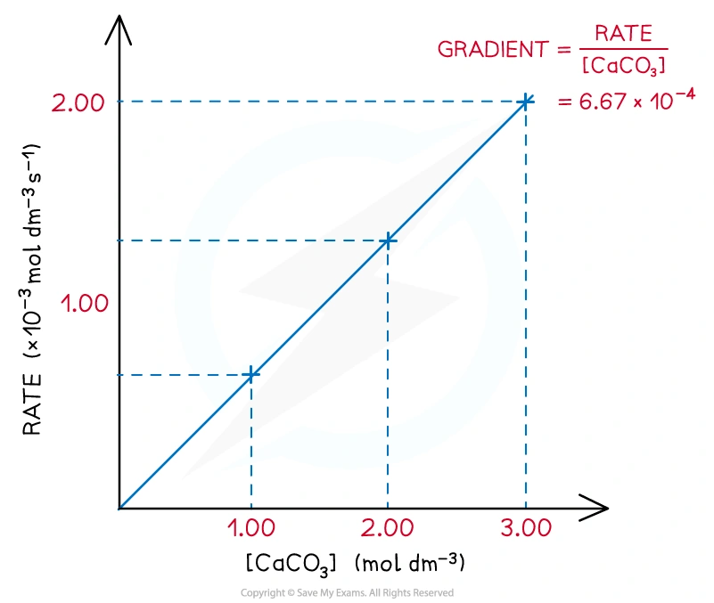{.concept-figure fig-alt="Rate-concentration graph"}
:::

::: {.study-card}
### Orders of reaction and overall order

The **order with respect to a reactant** is the power to which its concentration is raised in the rate equation. The **overall order** is the sum of all individual orders.

For example:

$$\text{rate}=k[\ce{NO2}]^2[\ce{H2}]$$

- second-order with respect to $\ce{NO2}$;
- first-order with respect to $\ce{H2}$;
- third-order overall.

The stoichiometric coefficients in an overall equation do not automatically give the reaction orders. They only show the mole ratio in the overall chemical change.

Rate-concentration graphs are useful when the concentration of only one reactant is changed:

| Order | Relationship | Shape of rate-concentration graph |
|---|---|---|
| zero | rate is independent of concentration | horizontal line |
| first | rate is directly proportional to concentration | straight line through the origin |
| second | rate increases with the square of concentration | upward-curving line |

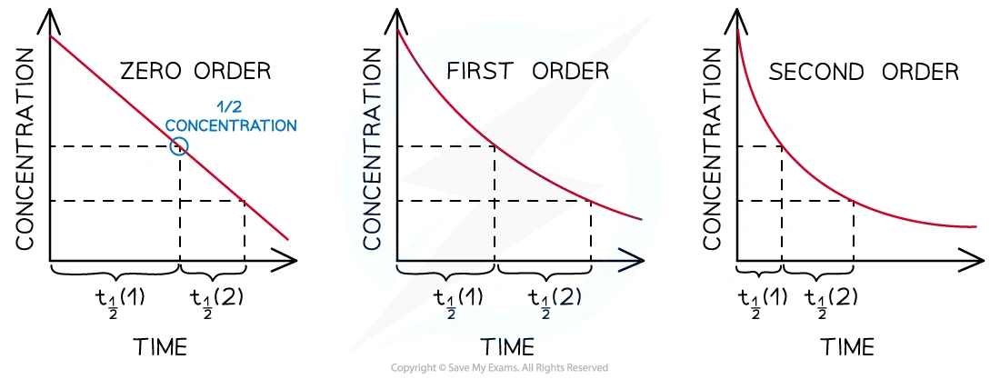{.concept-figure fig-alt="Half-life behaviour for zero, first and second order reactions"}
:::

::: {.worked-example}
Worked example · Note calculation

### Calculating an initial rate

**The reaction between bromomethane and hydroxide ions is:**

$$\ce{CH3Br + OH- -> CH3OH + Br-}$$

**The rate equation is $\text{rate}=k[\ce{CH3Br}][\ce{OH-}]$. The rate constant is $1.75\times10^2\ \mathrm{dm^3\,mol^{-1}\,s^{-1}}$. Calculate the initial rate when $[\ce{CH3Br}]=0.0200\ \mathrm{mol\,dm^{-3}}$ and $[\ce{OH-}]=0.0100\ \mathrm{mol\,dm^{-3}}$.**

Substitute the values into the rate equation:

$$\text{initial rate}=k[\ce{CH3Br}][\ce{OH-}]$$

$$\text{initial rate}=(1.75\times10^2)(0.0200)(0.0100)$$

$$\text{initial rate}=3.50\times10^{-2}\ \mathrm{mol\,dm^{-3}\,s^{-1}}$$

**Final answer:** $3.50\times10^{-2}\ \mathrm{mol\,dm^{-3}\,s^{-1}}$.

:::

::: {.study-card}
### Determining order from experimental data

For the **initial rates method**, compare two experiments in which the concentration of one reactant changes while the other concentrations stay constant.

If doubling $[A]$:

- leaves the rate unchanged, the reaction is zero-order in $A$;
- doubles the rate, the reaction is first-order in $A$;
- makes the rate four times larger, the reaction is second-order in $A$.

The same reasoning can be applied to concentration-time graphs and rate-concentration graphs. A concentration-time graph is interpreted through its shape and gradient. For zero order it is a straight line with a constant negative gradient; for first order it is a decreasing curve with a constant half-life; for second order it is a steeper decreasing curve whose successive half-lives increase.

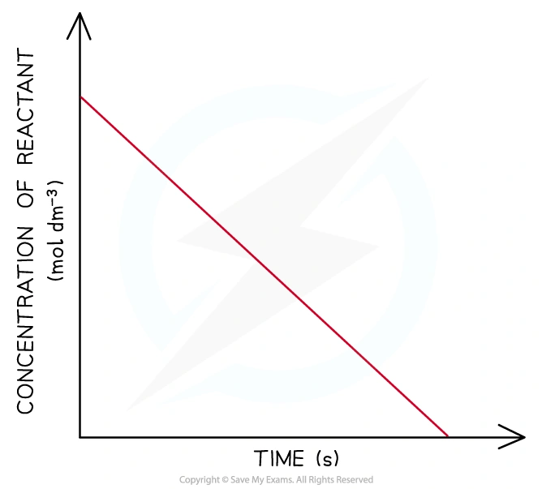{.concept-figure fig-alt="Zero-order concentration-time graph"}

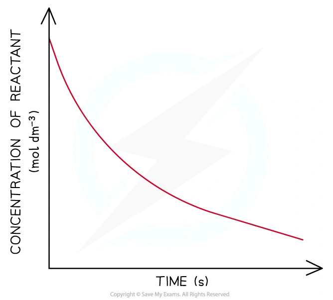{.concept-figure fig-alt="First-order concentration-time graph"}

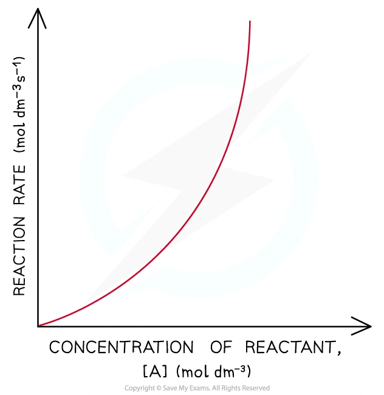{.concept-figure fig-alt="Second-order graph"}
:::

::: {.worked-example}
Worked example · Note graph interpretation

### Determining order from successive half-lives

**The change in concentration of a reactant over time is recorded in the following table. Draw a graph of concentration against time. Determine the first and second half-lives and hence determine the order of the reaction.**

| Time / s | 0 | 200 | 400 | 600 | 800 | 1000 | 1200 | 1400 | 1600 |
|---:|---:|---:|---:|---:|---:|---:|---:|---:|---:|
| $[\text{reactant}]\times10^4$ / mol dm$^{-3}$ | 5.8 | 4.4 | 3.2 | 2.5 | 1.7 | 1.2 | 0.8 | 0.5 | 0.3 |

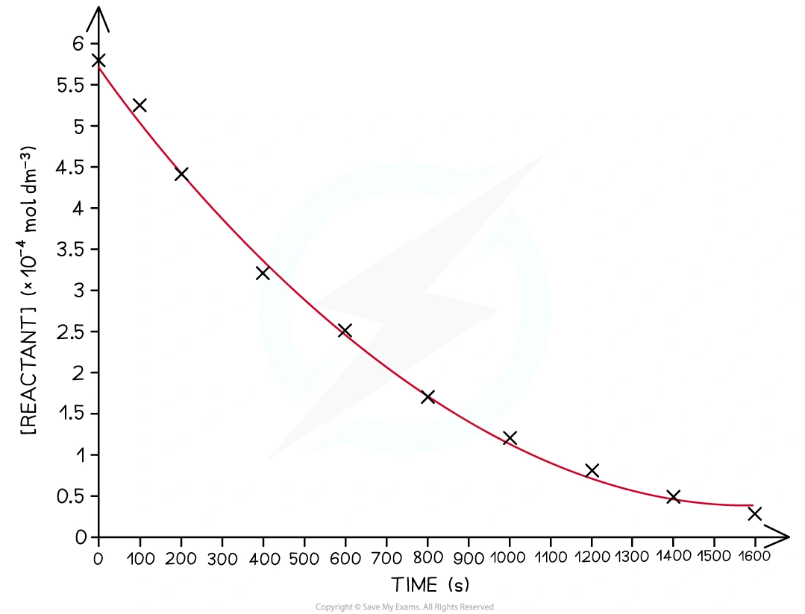{.concept-figure fig-alt="Worked-example concentration-time graph"}

The first half-life is the time for the concentration to decrease from $5.80$ to $2.90\times10^{-4}\ \mathrm{mol\,dm^{-3}}$.

From the graph, this takes approximately $470\ \mathrm{s}$.

The second half-life is the time for the concentration to decrease from $2.90$ to $1.45\times10^{-4}\ \mathrm{mol\,dm^{-3}}$.

From the graph, this takes approximately:

$$920-470=450\ \mathrm{s}$$

The successive half-lives are reasonably constant, both being about $450$--$470\ \mathrm{s}$.

**Final answer:** the reaction is **first order**, because its half-life remains approximately constant.

:::

::: {.study-card}
### Half-life and first-order reactions

The **half-life**, $t_{1/2}$, is the time taken for the concentration of a limiting reactant to fall to half its initial value.

| Order | Successive half-lives |
|---|---|
| zero | decrease as the reaction proceeds |
| first | remain constant |
| second | increase as the reaction proceeds |

For a first-order reaction the half-life is independent of the initial concentration:

$$k=\frac{0.693}{t_{1/2}}$$

The half-life must be expressed in seconds if $k$ is required in $\mathrm{s^{-1}}$.

For example, the rearrangement of ethanenitrile is first-order:

$$\ce{CH3CN(g) -> CH3NC(g)}$$

If $t_{1/2}$ is about $10.0$ minutes, it is about the same for each successive halving.

{.concept-figure fig-alt="First-order half-life graph"}
:::

::: {.worked-example}
Worked example · First-order half-life

### Calculating a rate constant from half-life

**The rearrangement of the methyl group in ethanenitrile, $\ce{CH3CN(g) -> CH3NC(g)}$, has a half-life of $10.0$ minutes. Calculate the rate constant.**

Convert the half-life to seconds:

$$t_{1/2}=10.0\times60=600\ \mathrm{s}$$

Use the first-order expression:

$$k=\frac{0.693}{t_{1/2}}=\frac{0.693}{600}$$

$$k=1.16\times10^{-3}\ \mathrm{s^{-1}}$$

**Final answer:** $k=1.16\times10^{-3}\ \mathrm{s^{-1}}$.

:::

::: {.study-card}
### Units of the rate constant

The units of $k$ depend on the overall order of the reaction. They are obtained by rearranging the rate equation and substituting the units of rate and concentration. For a second-order rate equation such as $\text{rate}=k[A][B]$:

$$
k=\frac{\text{rate}}{[A][B]}
$$

Therefore:

$$
k=\frac{\mathrm{mol\,dm^{-3}\,s^{-1}}}{(\mathrm{mol\,dm^{-3}})(\mathrm{mol\,dm^{-3}})}
=\mathrm{dm^3\,mol^{-1}\,s^{-1}}
$$

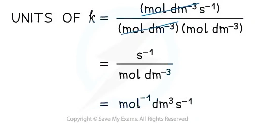{.concept-figure fig-alt="Units of the rate constant"}
:::

::: {.worked-example}
Worked example · Rate constant from initial rate

### Calculating $k$ from an initial rate

**Calcium carbonate reacts with chloride ions and hydrogen ions according to:**

$$\ce{CaCO3(s) + 2Cl-(aq) + 2H+(aq) -> CaCl2(aq) + CO2(g) + H2O(l)}$$

**The experimentally determined rate equation is $\text{rate}=k[\ce{CaCO3}][\ce{Cl-}]$. In experiment 1, $[\ce{CaCO3}]=0.0250\ \mathrm{mol\,dm^{-3}}$, $[\ce{Cl-}]=0.0125\ \mathrm{mol\,dm^{-3}}$ and the initial rate is $4.38\times10^{-5}\ \mathrm{mol\,dm^{-3}\,s^{-1}}$. Calculate $k$ and its units.**

Rearrange the rate equation:

$$k=\frac{\text{rate}}{[\ce{CaCO3}][\ce{Cl-}]}$$

Substitute the values:

$$k=\frac{4.38\times10^{-5}}{(0.0250)(0.0125)}$$

$$k=1.40\times10^{-1}\ \mathrm{dm^3\,mol^{-1}\,s^{-1}}$$

For the units:

$$k=\frac{\mathrm{mol\,dm^{-3}\,s^{-1}}}{(\mathrm{mol\,dm^{-3}})(\mathrm{mol\,dm^{-3}})}$$

$$k=\mathrm{dm^3\,mol^{-1}\,s^{-1}}$$

**Final answer:** $k=1.40\times10^{-1}\ \mathrm{dm^3\,mol^{-1}\,s^{-1}}$.

:::

::: {.study-card}
### Rate-determining steps, mechanisms and intermediates

A **reaction mechanism** describes the individual steps by which bonds are broken and formed. The **rate-determining step** is the slowest step. It controls the rate and contains the reactants whose concentrations appear with non-zero orders in the rate equation.

An **intermediate** is formed in one step and used up in a later step, so it does not appear in the overall equation. A catalyst is also involved in the mechanism but is regenerated and therefore does not appear in the overall equation. In a proposed mechanism:

- adding the steps must give the overall equation;
- species that cancel between steps are intermediates or catalysts;
- the reactants in the slow step should agree with the experimentally determined rate equation.

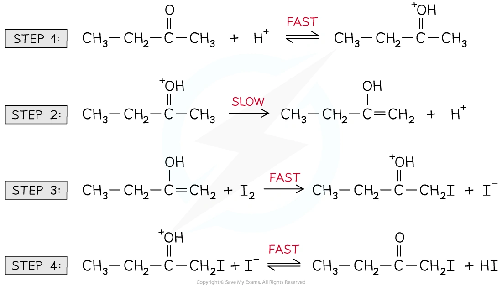{.concept-figure fig-alt="Rate-determining step and intermediate"}
:::

::: {.worked-example}
Worked example · Predicting a mechanism

### A mechanism consistent with a rate equation

**Nitrogen dioxide and carbon monoxide react according to:**

$$\ce{NO2(g) + CO(g) -> NO(g) + CO2(g)}$$

**The rate equation is $\text{rate}=k[\ce{NO2}]^2$. Suggest a possible two-step mechanism.**

Because the reaction is second-order with respect to $\ce{NO2}$ and zero-order with respect to $\ce{CO}$, a suitable slow step contains two $\ce{NO2}$ molecules and does not contain $\ce{CO}$:

**Step 1, slow:**

$$\ce{2NO2(g) -> NO(g) + NO3(g)}$$

**Step 2, fast:**

$$\ce{NO3(g) + CO(g) -> NO2(g) + CO2(g)}$$

Adding the steps and cancelling $\ce{NO3}$ and one $\ce{NO2}$ gives:

$$\ce{NO2(g) + CO(g) -> NO(g) + CO2(g)}$$

**Final answer:** the slow first step is consistent with $\text{rate}=k[\ce{NO2}]^2$; $\ce{NO3}$ is an intermediate.

:::

::: {.worked-example}
Worked example · Deducing a rate equation

### Predicting reaction order from a mechanism

**Nitrogen monoxide reacts with hydrogen:**

$$\ce{2NO(g) + 2H2(g) -> N2(g) + 2H2O(l)}$$

**The mechanism is:**

$$\ce{NO + NO -> N2O2}\quad\text{fast}$$

$$\ce{N2O2 + H2 -> H2O + N2O}\quad\text{slow}$$

$$\ce{N2O + H2 -> N2 + H2O}\quad\text{fast}$$

**Deduce the rate equation and overall order.**

The second step is the rate-determining step. It contains one $\ce{N2O2}$ intermediate and one $\ce{H2}$ molecule.

The intermediate $\ce{N2O2}$ is formed from two $\ce{NO}$ molecules in the fast first step. Therefore the experimentally relevant rate equation is:

$$\text{rate}=k[\ce{NO}]^2[\ce{H2}]$$

The reaction is second-order with respect to $\ce{NO}$ and first-order with respect to $\ce{H2}$.

**Final answer:** third-order overall.

:::

::: {.worked-example}
Worked example · Identifying a rate-determining step

### Bromination mechanism

**Propane undergoes bromination under alkaline conditions. The experimentally determined rate equation is:**

$$\text{rate}=k[\ce{CH3CH2CH3}][\ce{OH-}]$$

**The proposed mechanism contains a slow step in which propane reacts with hydroxide, followed by fast reaction of the intermediate with bromine. Identify the rate-determining step.**

The rate equation contains propane and hydroxide, but not bromine. Therefore the slow step must contain $\ce{CH3CH2CH3}$ and $\ce{OH-}$:

$$\ce{CH3CH2CH3 + OH- -> intermediate + H2O}\quad\text{slow}$$

The intermediate then reacts quickly with $\ce{Br2}$ to form the bromoalkane product.

**Final answer:** the first step is the rate-determining step, because it contains both species in the rate equation.

:::

::: {.study-card}
### Temperature and the rate constant

At a higher temperature, a greater proportion of molecules have energy equal to or greater than the activation energy. Therefore the rate constant $k$ increases, and the rate increases when concentrations are unchanged.

The Arrhenius relationship is:

$$\ln k=\ln A-\frac{E_a}{RT}$$

where $A$ is related to collision frequency and orientation, $E_a$ is activation energy in $\mathrm{J\,mol^{-1}}$, $R=8.31\ \mathrm{J\,K^{-1}\,mol^{-1}}$ and $T$ is in kelvin.

For a graph of $\ln k$ against $1/T$:

$$\text{gradient}=-\frac{E_a}{R}$$

The syllabus mainly requires the qualitative temperature effect, but this relationship explains why the graph is a straight line.

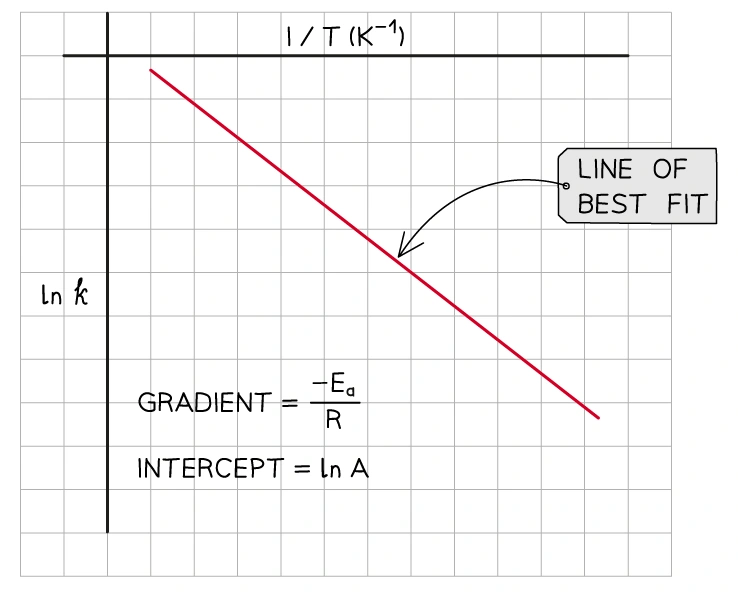{.concept-figure fig-alt="Arrhenius plot of ln k against 1/T"}
:::

## 26.2 Homogeneous and heterogeneous catalysts (AL)

::: {.study-card}
### What catalysts do

A catalyst increases the rate of reaction by providing an alternative pathway with a lower activation energy. It is not used up overall and does not change the position of equilibrium.

A **homogeneous catalyst** is in the same phase as the reaction mixture. A **heterogeneous catalyst** is in a different phase from the reactants and products.

For example, acid-catalysed esterification uses $\ce{H+ (aq)}$ in an aqueous reaction mixture, so it is homogeneous. In the Haber process, $\ce{N2(g)}$ and $\ce{H2(g)}$ react over solid iron, so iron is heterogeneous.
:::

::: {.study-card}
### Heterogeneous catalysis: adsorption and desorption

Heterogeneous reactions occur at the surface of a solid catalyst:

1. reactant molecules diffuse to the catalyst surface;
2. reactants are adsorbed, first by weak physical forces and then by stronger chemisorption;
3. bonds within the reactants are weakened and the particles are held close together in suitable orientations;
4. new bonds form and products are produced;
5. products desorb when the bonds between the products and the catalyst weaken, then diffuse away.

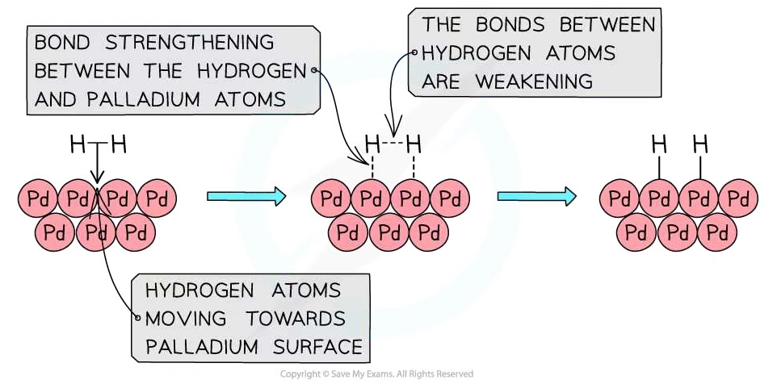{.concept-figure fig-alt="Heterogeneous catalysis on palladium"}
:::

::: {.study-card}
### Iron in the Haber process

The Haber process is:

$$\ce{N2(g) + 3H2(g) <=> 2NH3(g)}$$

Solid iron is a heterogeneous catalyst. Nitrogen and hydrogen diffuse to the iron surface and are adsorbed. Bonds in $\ce{N2}$ and $\ce{H2}$ are weakened, allowing adsorbed atoms to react in steps. Ammonia then desorbs and diffuses away from the surface.

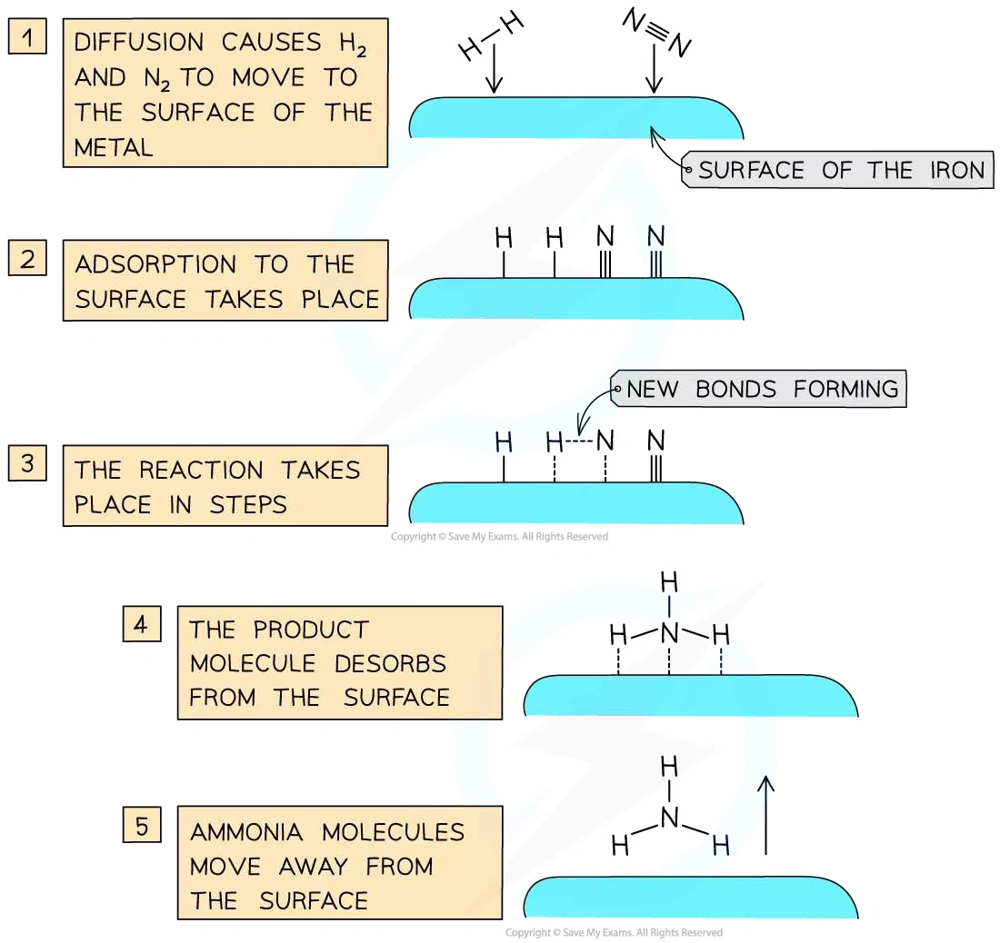{.concept-figure fig-alt="Iron heterogeneous catalyst in the Haber process"}
:::

::: {.study-card}
### Catalytic converters

The honeycomb in a catalytic converter is coated with platinum, palladium and rhodium. These metals are heterogeneous catalysts because the exhaust gases are gaseous but the catalyst is solid.

The surface adsorbs nitrogen oxides and carbon monoxide. Bonds in the adsorbed molecules weaken; nitrogen atoms form $\ce{N2}$ and carbon monoxide is oxidised to $\ce{CO2}$. The products desorb and leave the surface.

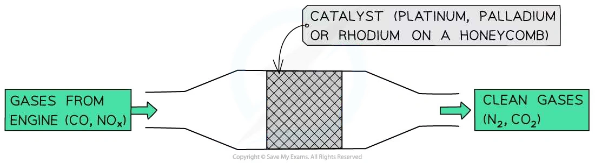{.concept-figure fig-alt="Catalytic converter heterogeneous catalysts"}
:::

::: {.study-card}
### Homogeneous catalysis and regenerated catalysts

Homogeneous catalysis often involves transition-metal ions because they can change oxidation number. The catalyst is used in one step and regenerated in a later step.

For the oxidation of iodide ions by peroxydisulfate ions, $\ce{Fe^{2+}}$ and $\ce{Fe^{3+}}$ form a homogeneous catalytic cycle:

$$\ce{2Fe^{3+}(aq) + 2I-(aq) -> 2Fe^{2+}(aq) + I2(aq)}$$

$$\ce{2Fe^{2+}(aq) + S2O8^{2-}(aq) -> 2Fe^{3+}(aq) + 2SO4^{2-}(aq)}$$

The iron ion provides a lower-energy route and is regenerated. The positive iron ions also reduce the electrostatic repulsion between the negative reactant ions.

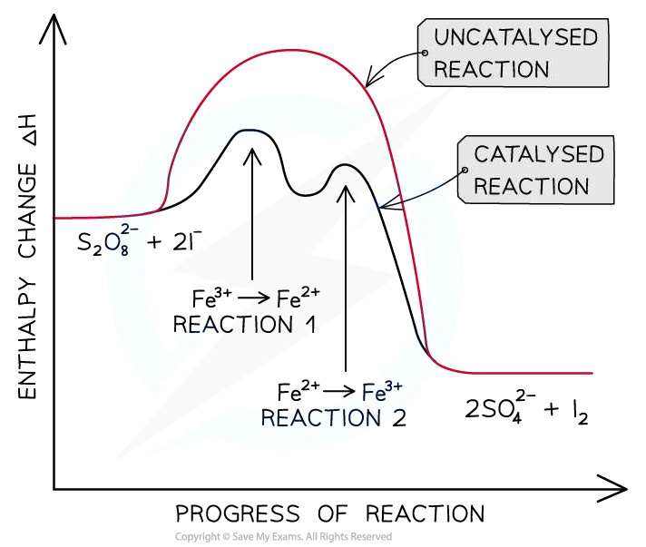{.concept-figure fig-alt="Fe2+ and Fe3+ homogeneous catalytic pathway"}
:::

::: {.worked-example}
Worked example · Homogeneous catalyst

### Nitrogen oxides and acid rain

**Nitrogen oxides catalyse the oxidation of sulfur dioxide in the atmosphere. The steps are:**

$$\ce{NO2(g) + SO2(g) -> SO3(g) + NO(g)}$$

$$\ce{NO(g) + 1/2O2(g) -> NO2(g)}$$

**Explain why nitrogen dioxide is a catalyst and write the overall equation.**

Add the two equations:

$$\ce{NO2 + SO2 + NO + 1/2O2 -> SO3 + NO + NO2}$$

Cancel $\ce{NO2}$ and $\ce{NO}$ because each appears on both sides:

$$\ce{SO2(g) + 1/2O2(g) -> SO3(g)}$$

$\ce{NO2}$ is used in the first step and regenerated in the second step, so it is not consumed overall. Both reactants and the catalyst are gases, so this is homogeneous catalysis.

**Final answer:** $\ce{NO2}$ is a homogeneous catalyst and the overall equation is $\ce{SO2 + 1/2O2 -> SO3}$.

:::

## Structured Questions



## Chapter checklist

- [ ] 我能解释 rate equation 只能由实验确定，不能直接由 stoichiometric equation 得到。
- [ ] 我能判断每个 reactant 的 order 和 overall order。
- [ ] 我能用 initial rates、concentration-time graphs、rate-concentration graphs 和 half-life 判断 order。
- [ ] 我能计算 initial rate、rate constant 和 $k$ 的 units。
- [ ] 我能用 $k=0.693/t_{1/2}$ 计算 first-order rate constant。
- [ ] 我能根据 rate equation 和 mechanism 判断 rate-determining step 与 intermediate。
- [ ] 我能解释 temperature 对 $k$ 和 rate 的影响，并读懂 Arrhenius plot。
- [ ] 我能区分 homogeneous 与 heterogeneous catalysts。
- [ ] 我能解释 adsorption、bond weakening 和 desorption。
- [ ] 我能描述 Haber process、catalytic converter、Fe$^{2+}$/Fe$^{3+}$ cycle 和 nitrogen oxides catalysis。

### Original question PDFs

- [5.6 Reaction Kinetics (A Level Only) - Easy](https://raw.githubusercontent.com/nanoxsj/CIE-Chemistry-Study/main/resources/original-papers/reaction-kinetics/5.6-reaction-kinetics-easy.pdf)
- [5.6 Reaction Kinetics (A Level Only) - Medium](https://raw.githubusercontent.com/nanoxsj/CIE-Chemistry-Study/main/resources/original-papers/reaction-kinetics/5.6-reaction-kinetics-medium.pdf)
- [5.6 Reaction Kinetics (A Level Only) - Hard](https://raw.githubusercontent.com/nanoxsj/CIE-Chemistry-Study/main/resources/original-papers/reaction-kinetics/5.6-reaction-kinetics-hard.pdf)
