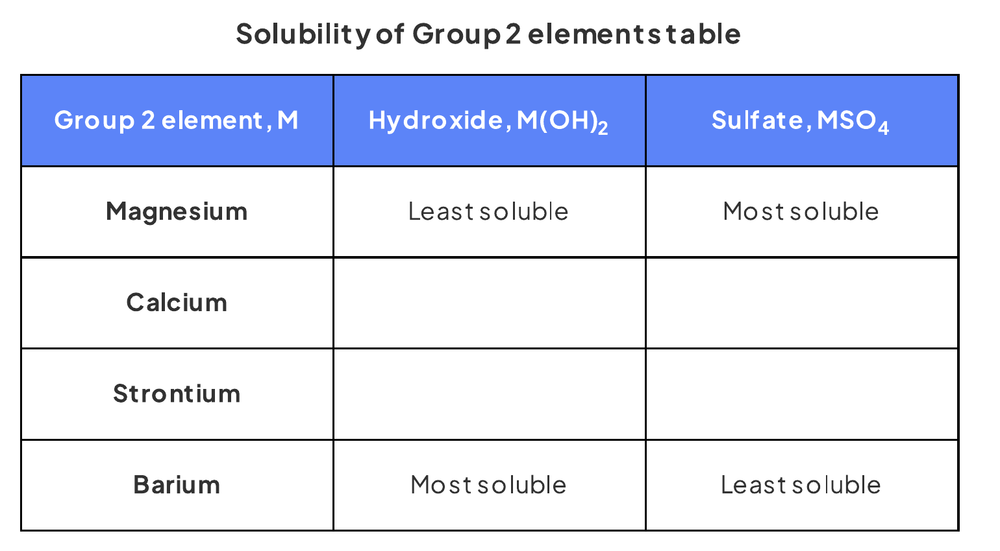

# 27 Group 2

本章对应 CIE 9701 2025–2027 syllabus 的 **27.1 Similarities - Trends in the Properties of the Group 2 Metals, Magnesium to Barium, - Their Compounds (AL)**。重点是 Group 2 离子半径、极化作用、热稳定性、溶解度以及 lattice energy / hydration enthalpy 对溶解焓的影响。

## Learning objectives

学完本章后，你应该能够：

- describe and explain the trend in thermal stability of Group 2 nitrates and carbonates;
- explain the trend using ionic radius, charge density and polarisation of the large anion;
- describe and explain the variation in solubility and $\Delta H^\ominus_{\mathrm{sol}}$ of Group 2 hydroxides and sulfates;
- use the relative changes in lattice energy and hydration enthalpy to explain these solubility trends;
- write equations for Group 2 reactions with oxygen, water, steam, dilute acids and thermal decomposition of their compounds;
- apply the trends to unfamiliar ions and compounds, including peroxides and transition-element comparisons.

## 27.1 Group 2 ions and thermal stability

::: {.study-card}
### Ionic radius, charge density and polarisation

All Group 2 metals form $\ce{M^{2+}}$ ions by losing the two electrons in their outer shell. Ionic radius increases down the group because each successive element has an additional occupied electron shell. The charge remains $+2$, so the charge density decreases down the group.

The small, high-charge-density cations near the top of the group have a strong **polarising effect** on large anions such as $\ce{NO3^-}$ and $\ce{CO3^{2-}}$. The cation attracts electron density towards itself and distorts the anion. This weakens the N–O or C–O bonds, making thermal decomposition easier.

Down Group 2, the cation becomes larger and its charge density falls. Its polarising effect becomes weaker, so the anion is less distorted and the compound is more thermally stable.
:::

::: {.study-card}
### Thermal stability of nitrates and carbonates

Both Group 2 nitrates and carbonates become **more thermally stable down the group**. More heat is therefore needed to decompose the compounds further down the group.

The common explanation is:

1. ionic radius of $\ce{M^{2+}}$ increases;
2. charge density decreases;
3. polarisation of the nitrate or carbonate ion decreases;
4. the N–O or C–O bonds are less weakened;
5. a higher temperature is required for decomposition.

Typical equations are:

$$\ce{MCO3(s) -> MO(s) + CO2(g)}$$

$$\ce{2M(NO3)2(s) -> 2MO(s) + 4NO2(g) + O2(g)}$$

The oxidation number of nitrogen in a nitrate ion is $+5$; in the nitrogen dioxide product it is $+4$.
:::

::: {.worked-example}
Worked example · Note knowledge check

### Predicting relative thermal stability

**Zinc carbonate and lead carbonate are compared with calcium carbonate. The ionic radii are $\ce{Ca^{2+}}$: 0.099 nm, $\ce{Zn^{2+}}$: 0.074 nm and $\ce{Pb^{2+}}$: 0.120 nm. Predict the relative thermal stability of zinc carbonate and lead carbonate.**

Zinc ions have a smaller radius and higher charge density than calcium ions, so $\ce{Zn^{2+}}$ polarises the carbonate ion more strongly. Zinc carbonate is therefore **less thermally stable** than calcium carbonate.

Lead ions have a larger radius and lower charge density, so $\ce{Pb^{2+}}$ polarises the carbonate ion less strongly. Lead carbonate is therefore **more thermally stable** than calcium carbonate.

**Final answer:** $\ce{ZnCO3}$ is less stable and $\ce{PbCO3}$ is more stable than $\ce{CaCO3}$.

:::

## 27.2 Reactions and compounds of Group 2

::: {.study-card}
### Reactions of the metals

Reactivity with water increases down Group 2. Beryllium does not react with water under ordinary conditions, magnesium reacts slowly with hot water and more readily with steam, while calcium, strontium and barium react with cold water.

Useful equations include:

$$\ce{M(s) + 2H2O(l) -> M(OH)2(s) + H2(g)}$$

$$\ce{Mg(s) + H2O(g) -> MgO(s) + H2(g)}$$

$$\ce{M(s) + 2HCl(aq) -> MCl2(aq) + H2(g)}$$

The hydroxide formed makes the solution alkaline, commonly giving a pH around 10–12. Hydrogen is identified with a lighted splint, which gives a squeaky pop.
:::

::: {.study-card}
### Formulae and reactions of Group 2 compounds

Group 2 ions have charge $+2$, so their common compounds have these formulae:

| Compound | General formula | Example |
|---|---|---|
| oxide | $\ce{MO}$ | $\ce{MgO}$ |
| hydroxide | $\ce{M(OH)2}$ | $\ce{Ba(OH)2}$ |
| carbonate | $\ce{MCO3}$ | $\ce{CaCO3}$ |
| nitrate | $\ce{M(NO3)2}$ | $\ce{Sr(NO3)2}$ |
| sulfate | $\ce{MSO4}$ | $\ce{MgSO4}$ |

With acids:

$$\ce{MCO3(s) + 2HCl(aq) -> MCl2(aq) + H2O(l) + CO2(g)}$$

$$\ce{M(OH)2(s) + H2SO4(aq) -> MSO4(aq) + 2H2O(l)}$$

Calcium sulfate is sparingly soluble, so $\ce{CaCO3}$ can become coated with $\ce{CaSO4}$ when sulfuric acid is used. The coating can slow or stop further reaction.
:::

## 27.3 Solubility and enthalpy change of solution

::: {.study-card}
### Hydroxides and sulfates: opposite solubility trends

The solubility of Group 2 hydroxides **increases down the group**, while the solubility of Group 2 sulfates **decreases down the group**. Magnesium hydroxide is sparingly soluble; barium hydroxide is the most soluble hydroxide. Barium sulfate is insoluble; magnesium sulfate is the most soluble sulfate.

{.concept-figure fig-alt="Solubility trends of Group 2 hydroxides and sulfates"}
:::

::: {.study-card}
### Lattice energy, hydration enthalpy and $\Delta H^\ominus_{\mathrm{sol}}$

**The standard enthalpy of solution, $\Delta H^\ominus_{\mathrm{sol}}$, is the enthalpy change when one mole of an ionic solid dissolves in sufficient water to form a dilute solution under standard conditions.**

The energy relationship is:

$$\Delta H^\ominus_{\mathrm{sol}} = \Delta H^\ominus_{\mathrm{hyd}} - \Delta H^\ominus_{\mathrm{latt}}$$

Here $\Delta H^\ominus_{\mathrm{latt}}$ is the lattice enthalpy of formation, so it is negative, while hydration enthalpies are also negative. As ions become larger down the group, both lattice enthalpy and hydration enthalpy become less exothermic.

For hydroxides, the lattice enthalpy falls faster than the hydration enthalpy of the cation. The enthalpy of solution becomes more negative or less positive, so solubility increases.

For sulfates, the large sulfate ion changes the balance: the hydration enthalpy of the cation falls more than the lattice enthalpy. The enthalpy of solution becomes more positive or less negative, so solubility decreases.
:::

::: {.worked-example}
Worked example · Note calculation

### Calculating enthalpy changes of solution

**The lattice enthalpies of $\ce{Mg(OH)2}$ and $\ce{Sr(OH)2}$ are $-2993$ and $-2467\ \mathrm{kJ\,mol^{-1}}$. The hydration enthalpies of $\ce{Mg^{2+}}$ and $\ce{Sr^{2+}}$ are $-1890$ and $-1414\ \mathrm{kJ\,mol^{-1}}$, and $\ce{OH^-}$ is $-550\ \mathrm{kJ\,mol^{-1}}$. Calculate $\Delta H^\ominus_{\mathrm{sol}}$ for each hydroxide.**

Use:

$$\Delta H^\ominus_{\mathrm{sol}} = \sum\Delta H^\ominus_{\mathrm{hyd}} - \Delta H^\ominus_{\mathrm{latt}}$$

For magnesium hydroxide, there are two hydroxide ions:

$$\Delta H^\ominus_{\mathrm{sol}} = [-1890 + 2(-550)] - (-2993)$$

$$\Delta H^\ominus_{\mathrm{sol}} = +3\ \mathrm{kJ\,mol^{-1}}$$

For strontium hydroxide:

$$\Delta H^\ominus_{\mathrm{sol}} = [-1414 + 2(-550)] - (-2467)$$

$$\Delta H^\ominus_{\mathrm{sol}} = -47\ \mathrm{kJ\,mol^{-1}}$$

**Final answer:** $\ce{Mg(OH)2}$: $+3\ \mathrm{kJ\,mol^{-1}}$; $\ce{Sr(OH)2}$: $-47\ \mathrm{kJ\,mol^{-1}}$.

:::

## Chapter checklist

- [ ] 我能解释 Group 2 nitrates 和 carbonates 的热稳定性沿族向下增加。
- [ ] 我能用 ionic radius、charge density 和 polarisation 写出完整因果链。
- [ ] 我能写出 Group 2 金属与 water、steam、dilute acid 的方程式。
- [ ] 我能比较 hydroxides 与 sulfates 的溶解度趋势。
- [ ] 我能用 lattice energy、hydration enthalpy 和 $\Delta H^\ominus_{\mathrm{sol}}$ 解释溶解度。
- [ ] 我能处理新情境中的 thermal stability、$K_{sp}$ 和相关计算。

## Structured questions



### Original question PDFs

- [6.1 Group 2 (A Level Only) – Easy](https://raw.githubusercontent.com/nanoxsj/CIE-Chemistry-Study/main/resources/original-papers/group-2/6.1-group-2-easy.pdf)
- [6.1 Group 2 (A Level Only) – Medium](https://raw.githubusercontent.com/nanoxsj/CIE-Chemistry-Study/main/resources/original-papers/group-2/6.1-group-2-medium.pdf)
- [6.1 Group 2 (A Level Only) – Hard](https://raw.githubusercontent.com/nanoxsj/CIE-Chemistry-Study/main/resources/original-papers/group-2/6.1-group-2-hard.pdf)
