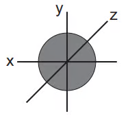
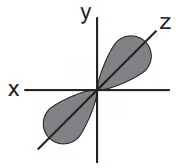
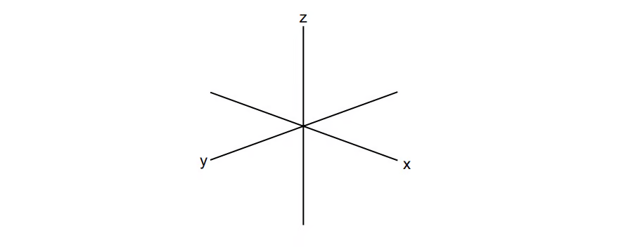
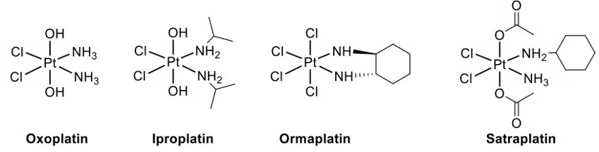
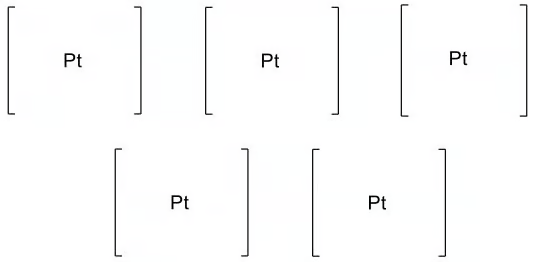
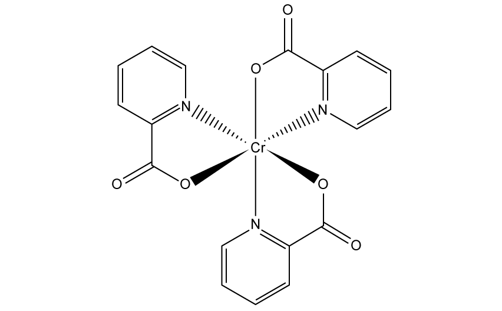
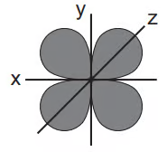
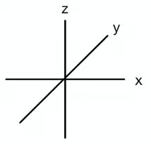
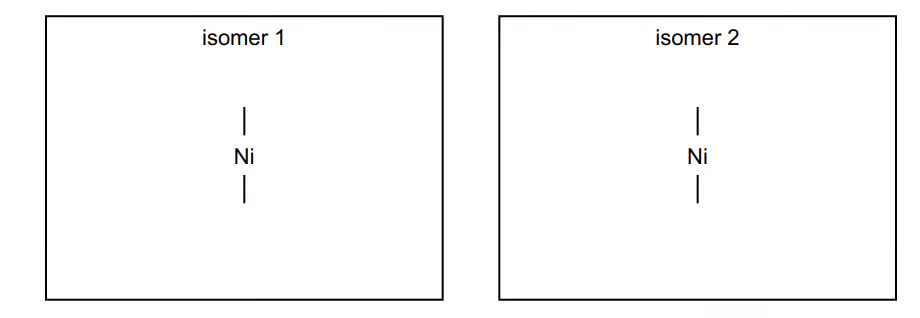
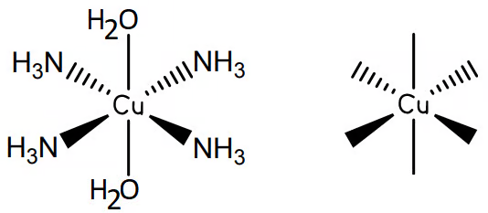

# 28 Chemistry of transition elements — Structured Questions

本页保留题包中 6.2 与 6.3 的全部 Structured Questions。每题保留英文题干、所有分问、题目中可独立提取的局部图，以及完整 model-answer steps。

### 6.2 Properties of Transition Elements (A Level Only) - Easy

::: {.question-card}
### Example 1 · Definitions and electron configurations · 6.2 SQ Easy Q1

This question is about transition metals.

**(a)** Explain what is meant by a transition metal. `[1 mark]`

**(b)**

1. State the electronic configuration of $\ce{Ti^{2+}}$. `[1 mark]`
2. Explain, using the electronic configuration, why zinc is found in the d-block of the periodic table but is not classed as a transition metal. `[1 mark]`

**(c)** Table 1.1 shows sketches of the shapes of some atomic orbitals. Identify the type of orbital, s, p or d, for each sketch.

{.question-figure fig-alt="Extracted s orbital diagram"}
{.question-figure fig-alt="Extracted p orbital diagram"}
{.question-figure fig-alt="Extracted d orbital diagram"}

`[3 marks]`

**(d)** Transition metals have characteristic properties. One of these properties is that they form coloured ions. State two other properties that transition metals or their ions exhibit. `[2 marks]`

Show mark scheme / model answer

- **(a)** A transition metal is a metal or element which forms one or more stable ions with an incomplete or partially filled d orbital / d subshell. `[1]`
- **(b)(1)** $\ce{Ti^{2+}}$: $\ce{1s^2 2s^2 2p^6 3s^2 3p^6 3d^2}$ or $\ce{[Ar]3d^2}$. `[1]`
- **(b)(2)** $\ce{Zn^{2+}}$ has a complete $3d^{10}$ subshell, so zinc does not form a stable ion with an incomplete d subshell. `[1]`
- **(c)** The orbital sketches are, respectively, d, s and p. `[3]`
- **(d)** Any two: forms complexes / complex ions; shows variable oxidation states; behaves as a catalyst. `[2]`

:::

### 6.3 Transition Element Complexes: Isomers, Reactions & Stability (A Level Only) - Medium

::: {.question-card}
### Example 10 · Catalysis and redox potentials · 6.3 SQ Medium Q1

**(a)** Sketch the shape of a $3d_{xy}$ orbital. `[1 mark]`

**(b)**

1. Some transition elements and their compounds behave as catalysts. Explain why transition elements behave as catalysts. `[2 marks]`
2. Catalysis can be heterogeneous or homogeneous. Complete the table by identifying the type of catalysis in each reaction.

| Reaction | Heterogeneous | Homogeneous |
|---|---|---|
| Fe in the Haber process |  |  |
| $\ce{Fe^{2+}}$ in the $\ce{I^- / S2O8^{2-}}$ reaction |  |  |
| $\ce{NO2}$ in the oxidation of $\ce{SO2}$ |  |  |

`[3 marks]`

**(c)** A solution containing a mixture of $\ce{Sn^{2+}(aq)}$ and $\ce{Sn^{4+}(aq)}$ is added to a solution containing a mixture of $\ce{Fe^{2+}(aq)}$ and $\ce{Fe^{3+}(aq)}$. The relevant standard electrode potentials are:

| Electrode reaction | $E^\ominus$/V |
|---|---:|
| $\ce{Fe^{2+}+2e^- <=> Fe}$ | $-0.44$ |
| $\ce{Fe^{3+}+3e^- <=> Fe}$ | $-0.04$ |
| $\ce{Fe^{3+}+e^- <=> Fe^{2+}}$ | $+0.77$ |
| $\ce{Sn^{2+}+2e^- <=> Sn}$ | $-0.14$ |
| $\ce{Sn^{4+}+2e^- <=> Sn^{2+}}$ | $+0.15$ |

1. Write an equation for the reaction. `[1 mark]`
2. Calculate $E^\ominus_{\mathrm{cell}}$ for the reaction. `[1 mark]`

**(d)** Hexaaquairon(III) ions are pale violet. They form a colourless complex with fluoride and a deep-red complex with thiocyanate:

$$\ce{[Fe(H2O)6]^3+ + F^- <=> [Fe(H2O)5F]^2+ + H2O}\quad K_{\mathrm{stab}}=2.0\times10^5$$
$$\ce{[Fe(H2O)6]^3+ + SCN^- <=> [Fe(H2O)5SCN]^2+ + H2O}\quad K_{\mathrm{stab}}=1.0\times10^3$$

1. Predict and explain the sequence of colour changes when KSCN is added first to $\ce{Fe^{3+}}$ and then KF is added, and when KF is added first and then KSCN. `[4 marks]`
2. Name the type of reaction occurring. `[1 mark]`

**(e)** Solutions of iron(III) salts are acidic due to:

$$\ce{[Fe(H2O)6]^3+ <=> [Fe(H2O)5(OH)]^2+ + H+}\quad K_a=8.9\times10^{-4}\ \mathrm{mol\,dm^{-3}}$$

Calculate the pH of a $0.25\ \mathrm{mol\,dm^{-3}}$ $\ce{FeCl3}$ solution. Show your working. `[2 marks]`

{.question-figure fig-alt="Extracted catalysis table"}

Show mark scheme / model answer

- **(a)** Four lobes lying between the x- and y-axes, in the xy-plane. `[1]`
- **(b)(1)** Transition elements have more than one stable oxidation state and accessible orbitals / can form dative bonds, allowing temporary intermediates and an alternative lower-activation-energy pathway. `[2]`
- **(b)(2)** Haber process: heterogeneous. $\ce{Fe^{2+}}$ iodide–peroxodisulfate reaction: homogeneous. $\ce{NO2}$ oxidation of sulfur dioxide: homogeneous. `[3]`
- **(c)(1)** $\ce{Sn^{2+} + 2Fe^{3+} -> Sn^{4+} + 2Fe^{2+}}$. `[1]`
- **(c)(2)** $E^\ominus_{\mathrm{cell}}=+0.77-(+0.15)=+0.62\ \mathrm{V}$. `[1]`
- **(d)(1)** Experiment 1: violet $$ deep-red after KSCN, then colourless after KF. Experiment 2: violet $$ colourless after KF, and remains colourless after KSCN. This is because $K_{\mathrm{stab}}$ for the fluoride complex is larger. `[4]`
- **(d)(2)** Ligand exchange / ligand displacement / ligand substitution. `[1]`
- **(e)** For the weak-acid equilibrium, let $x=[\ce{H+}]$. The weak-acid approximation gives:

  $$[\ce{H+}]=\sqrt{K_a[\ce{Fe^{3+}}]}=\sqrt{8.9\times10^{-4}\times0.25}=1.49\times10^{-2}\ \mathrm{mol\,dm^{-3}}$$

  $$\mathrm{pH}=-\log(1.49\times10^{-2})=1.83$$

  **Final answer:** $\mathrm{pH}=1.8$ (approximately). `[2]`

:::

::: {.question-card}
### Example 11 · Complex ions and stereoisomerism · 6.3 SQ Medium Q2

**(a)** An aqueous solution of copper(II) contains $\ce{[Cu(H2O)6]^2+}$. Define the term complex ion. `[1 mark]`

**(b)** Give the following information for these reactions.

1. Reaction of $\ce{[Cu(H2O)6]^2+}$ with aqueous sodium hydroxide: colour and state of the copper-containing species, ionic equation, and type of reaction. `[3 marks]`
2. Reaction of $\ce{[Co(H2O)6]^2+}$ with excess aqueous ammonia: colour and state of the cobalt-containing species, ionic equation, and type of reaction. `[3 marks]`

**(c)** The $\ce{[Fe(NH3)2CN4]^-}$ complex shows stereoisomerism. Complete the three-dimensional diagrams to show the two isomers and suggest the type of stereoisomers. `[3 marks]`

{.question-figure fig-alt="Extracted cis-trans iron complex diagram"}

**(d)** Compound A, $\ce{C4H13N3}$, is a tridentate ligand.

1. Suggest why one molecule of A can form three dative bonds. `[1 mark]`
2. $\ce{C4H13N3}$ reacts with aqueous chromium(III) ions, $\ce{[Cr(H2O)6]^{3+}}$, in a 2:1 ratio to form a new complex ion. Construct an equation. `[1 mark]`

{.question-figure fig-alt="Extracted tridentate ligand structure"}

Show mark scheme / model answer

- **(a)** A molecule or ion formed by a central metal atom or ion being surrounded by / bonded to one or more ligands. `[1]`
- **(b)(1)** Blue precipitate / solid; $\ce{[Cu(H2O)6]^2+ + 2OH^- -> Cu(OH)2(s) + 6H2O}$; precipitation or acid–base reaction. `[3]`
- **(b)(2)** Straw-yellow / brown solution; $\ce{[Co(H2O)6]^2+ + 6NH3 -> [Co(NH3)6]^2+ + 6H2O}$; ligand exchange / displacement / substitution. `[3]`
- **(c)** One cis isomer with the two $\ce{NH3}$ ligands at $90^\circ$ and one trans isomer with them at $180^\circ$, both with overall $1-$ charge. The isomerism is geometrical / cis–trans. `[3]`
- **(d)(1)** Each of the three nitrogen atoms has a lone pair available to donate. `[1]`
- **(d)(2)** $\ce{[Cr(H2O)6]^3+ + 2C4H13N3 -> [Cr(C4H13N3)2]^3+ + 6H2O}$. `[1]`

:::

::: {.question-card}
### Example 12 · Cobalt complexes and ligand exchange · 6.3 SQ Medium Q3

Cobalt is a transition element with atomic number 27.

**(a)** Complete the electronic configurations of a Co atom and a $\ce{Co^{2+}}$ ion. `[2 marks]`

**(b)** $\ce{Co^{2+}}$ ions form a linear complex with chloride ions, which are monodentate ligands. Draw the structure and include the overall charge. `[2 marks]`

**(c)** $\ce{Co^{2+}}$ ions exist as $\ce{[Co(H2O)6]^{2+}}$ in aqueous solution. Complete a three-dimensional diagram, name its shape, and label two bond angles. `[2 marks]`

**(d)** When ammonia is added to $\ce{Co^{2+}}$ dropwise and then in excess, two reactions occur:

$$\ce{[Co(H2O)6]^2+ ->[dropwise\ NH3] A ->[excess\ NH3] B}$$

For each reaction, describe what you see and write an equation. `[4 marks]`

**(e)** EDTA$^{4-}$ is a hexadentate ligand. Addition of EDTA$^{4-}$ to $\ce{[Co(H2O)6]^{2+}}$ forms $\ce{[CoEDTA]^{2-}}$.

1. Explain what is meant by hexadentate ligand. `[2 marks]`
2. Name the type of reaction. `[1 mark]`
3. Write an expression for $K_{\mathrm{stab}}$. `[1 mark]`
4. $K_{\mathrm{stab}}=7.7\times10^4\ \mathrm{mol^{-6}\,dm^{18}}$ at 298 K. State what this tells you about the complex ion. `[1 mark]`

{.question-figure fig-alt="Extracted cobalt complex diagram"}

Show mark scheme / model answer

- **(a)** Co atom: $\ce{1s^2 2s^2 2p^6 3s^2 3p^6 3d^7 4s^2}$; $\ce{Co^{2+}}$: $\ce{1s^2 2s^2 2p^6 3s^2 3p^6 3d^7}$. `[2]`
- **(b)** $\ce{Cl^- - Co^{2+} - Cl^-}$, linear, overall charge zero. `[2]`
- **(c)** Octahedral; bond angles include $90^\circ$ and $180^\circ$. `[2]`
- **(d)** Reaction 1: a blue precipitate forms, $\ce{[Co(H2O)6]^2+ + 2NH3 -> Co(OH)2(s) + 2NH4+ + 4H2O}$ (equivalent ionic forms accepted). Reaction 2: the precipitate dissolves to form a straw-yellow / brown solution, $\ce{[Co(H2O)6]^2+ + 6NH3 -> [Co(NH3)6]^2+ + 6H2O}$. `[4]`
- **(e)(1)** A ligand which forms six coordinate bonds to the central metal ion, using six donor atoms / lone pairs. `[2]`
- **(e)(2)** Ligand exchange / substitution. `[1]`
- **(e)(3)** $\displaystyle K_{\mathrm{stab}}=\frac{[\ce{[CoEDTA]^{2-}}]}{[\ce{[Co(H2O)6]^{2+}}][\ce{EDTA^{4-}}]}$. Water is omitted. `[1]`
- **(e)(4)** The relatively large value means the equilibrium is product-favoured and $\ce{[CoEDTA]^{2-}}$ is relatively stable. `[1]`

:::

::: {.question-card}
### Example 13 · Cobalt stereoisomerism and colour · 6.3 SQ Medium Q4

**(a)** When concentrated hydrochloric acid is added to $\ce{[Co(H2O)6]^{2+}(aq)}$, the water ligands are replaced.

1. Suggest an equation for the reaction. `[2 marks]`
2. Draw the three-dimensional diagram of the complex formed. `[2 marks]`

**(b)** $\ce{[Co(NH3)4Cl2]^+}$ is an octahedral complex which exhibits cis–trans isomerism.

1. Deduce the oxidation state of cobalt and explain. `[2 marks]`
2. Draw structures of the cis and trans isomers, clearly identifying each. `[3 marks]`

**(c)** Explain the origin of colour in a transition-element complex such as $\ce{[Co(NH3)4Cl2]^+}$. `[3 marks]`

**(d)** 1,2-diaminoethane is a bidentate ligand. When added to $\ce{[Cu(H2O)6]^{2+}}$, all other ligands are replaced and two optical isomers form.

1. Suggest an equation for the reaction. `[2 marks]`
2. Draw the two isomeric forms. `[3 marks]`

Show mark scheme / model answer

- **(a)(1)** $\ce{[Co(H2O)6]^2+ + 4Cl^- -> [CoCl4]^2- + 6H2O}$. `[2]`
- **(a)(2)** Tetrahedral structure around cobalt, with four chloride ligands. `[2]`
- **(b)(1)** Cobalt is $+3$: $x+4(0)+2(-1)=+1$, so $x=+3$. `[2]`
- **(b)(2)** Draw octahedral cis and trans forms; in cis the chloride ligands are adjacent ($90^\circ$), in trans they are opposite ($180^\circ$). `[3]`
- **(c)** Ligands split the d orbitals into two levels; visible light is absorbed for a d–d transition; the complementary colour is seen. `[3]`
- **(d)(1)** $\ce{[Cu(H2O)6]^2+ + 3en -> [Cu(en)3]^2+ + 6H2O}$. `[2]`
- **(d)(2)** Draw two non-superimposable mirror-image octahedral complexes with three bidentate en ligands. `[3]`

:::

### 6.3 Transition Element Complexes: Isomers, Reactions & Stability (A Level Only) - Hard

::: {.question-card}
### Example 14 · Platinum complexes and stereoisomerism · 6.3 SQ Hard Q1

Carboplatin and oxaliplatin are platinum(II) diamines similar to cisplatin. Oxoplatin, iproplatin, ormaplatin and satraplatin are Pt complexes shown in Fig. 1.1. The central platinum ions have the same oxidation number and the complexes have the same shape.

**(a)** Give the oxidation number of platinum and the shape of the complexes. `[2 marks]`

{.question-figure fig-alt="Extracted oxoplatin and related platinum complexes"}

**(b)** One isomer of $\ce{[Pt(NH3)2Cl2(OH)2]}$ is shown in Fig. 1.1. Complete diagrams to show the other oxoplatin stereoisomers and indicate the chiral one(s). `[4 marks]`

{.question-figure fig-alt="Extracted oxoplatin stereoisomer prompts"}

**(c)** Cisplatin can be produced by reduction of the prodrug cis,trans,cis-$\ce{[PtCl2(OCOCH3)2(NH3)2]}$. Draw its structure. `[1 mark]`

Show mark scheme / model answer

- **(a)** Platinum oxidation number $+4$; octahedral because there are six coordinate bonds. `[2]`
- **(b)** Draw all four distinct octahedral arrangements required by the prompt; the pair with no symmetry plane are non-superimposable mirror images and are the chiral isomers. `[4]`
- **(c)** Draw an octahedral complex with the two $\ce{Cl}$ ligands cis, the two acetate ligands trans, and the two $\ce{NH3}$ ligands cis. `[1]`

:::

::: {.question-card}
### Example 15 · Chromium complexes, EDTA and empirical formulae · 6.3 SQ Hard Q2

When chromium(III) sulfate dissolves in water, a green solution containing $\ce{[Cr(H2O)6]^{3+}}$ forms.

**(a)**

1. State the bond angles in this complex. `[1 mark]`
2. Explain why the chromium(III) complex is coloured. `[3 marks]`

**(b)** EDTA$^{4-}$ is a polydentate ligand. When added to $\ce{[Cr(H2O)6]^{3+}}$:

$$\ce{[Cr(H2O)6]^3+ + EDTA^{4-} -> [Cr(EDTA)]^- + 6H2O}$$

1. Name the type of reaction. `[1 mark]`
2. Write an expression for $K_{\mathrm{stab}}$ of $\ce{[Cr(EDTA)]^-}$. `[1 mark]`
3. $K_{\mathrm{stab}}=2.51\times10^{23}$ in this reaction. Suggest what this indicates about the position and entropy of the equilibrium. `[3 marks]`

{.question-figure fig-alt="Extracted EDTA structure on white background"}

**(c)** Compound L has empirical formula $\ce{CrN4H12Cl3}$. It contains one chloride ion and a complex ion M, which has two stereoisomers. Complete three-dimensional diagrams to show the stereoisomers of M. `[3 marks]`

**(d)** Chromium(III) picolinate is a neutral complex prepared from picolinic acid.

1. Draw the structure of the ligand in chromium(III) picolinate. `[1 mark]`
2. A typical tablet contains $200\ \mu\mathrm{g}$ chromium. Calculate the mass, in grams, of chromium(III) picolinate. Give three significant figures. `[2 marks]`

{.question-figure fig-alt="Extracted chromium picolinate structure on white background"}

Show mark scheme / model answer

- **(a)(1)** $90^\circ$ angles (and $180^\circ$ between opposite ligands). `[1]`
- **(a)(2)** The ligands split the d orbitals into two levels; visible light is absorbed to promote electrons; the complementary colour is transmitted / observed. `[3]`
- **(b)(1)** Ligand exchange / substitution. `[1]`
- **(b)(2)** $\displaystyle K_{\mathrm{stab}}=\frac{[\ce{[Cr(EDTA)]^-}]}{[\ce{[Cr(H2O)6]^{3+}}][\ce{EDTA^{4-}}]}$. `[1]`
- **(b)(3)** The very large stability constant places the equilibrium far to the right and indicates a stable product. The forward reaction increases entropy because one complex ion plus one ligand forms one complex ion plus six water molecules; the number of particles increases, so $\Delta S_{\mathrm{system}}>0$. `[3]`
- **(c)** The complex ion is $\ce{[Cr(NH3)4Cl2]^+}$, giving cis and trans octahedral stereoisomers. `[3]`
- **(d)(1)** Picolinate is the deprotonated ligand with a pyridine nitrogen donor and a carboxylate oxygen donor. `[1]`
- **(d)(2)** Chromium(III) picolinate has $M_r=418.0$ and contains one Cr atom per formula unit:

  $$n(\ce{Cr})=\frac{200\times10^{-6}}{52.0}=3.85\times10^{-6}\ \mathrm{mol}$$
  $$m=3.85\times10^{-6}\times418.0=1.61\times10^{-3}\ \mathrm{g}$$

  **Final answer:** $1.61\times10^{-3}\ \mathrm{g}$. `[2]`

:::

::: {.question-card}
### Example 16 · Iron supplements and redox titration · 6.3 SQ Hard Q3

Iron(II) gluconate, $\ce{C12H22FeO14}$, is the active ingredient in some iron supplements.

A student crushes two tablets, dissolves them in dilute sulfuric acid, makes the solution to $250.0\ \mathrm{cm^3}$, and titrates $25.0\ \mathrm{cm^3}$ portions with $0.00200\ \mathrm{mol\,dm^{-3}}$ potassium manganate(VII). The mean titre is $13.50\ \mathrm{cm^3}$. One mole of manganate(VII) reacts with five moles of iron(II).

**(a)** Determine the mass, in mg, of iron(II) gluconate in one tablet. Give three significant figures. `[4 marks]`

**(b)** A typical potassium manganate(VII) concentration is $0.0200\ \mathrm{mol\,dm^{-3}}$. Use the information in part (a) to explain quantitatively why the student used $0.00200\ \mathrm{mol\,dm^{-3}}$. `[2 marks]`

**(c)** Iron supplements A and B have the following label data:

| Supplement | Compound | Mass of compound in one tablet |
|---|---|---:|
| A | $\ce{FeSO4}$ | $180\ \mathrm{mg}$ |
| B | $\ce{C4H2FeO4}$ | $210\ \mathrm{mg}$ |

State which provides the greater mass of iron per tablet and show your workings. `[1 mark]`

Show mark scheme / model answer

- **(a)**

  $$n(\ce{MnO4^-})=\frac{13.50}{1000}\times0.00200=2.70\times10^{-5}\ \mathrm{mol}$$
  $$n(\ce{Fe^{2+}})_{25.0}=5(2.70\times10^{-5})=1.35\times10^{-4}\ \mathrm{mol}$$
  $$n(\ce{Fe^{2+}})_{250.0}=10(1.35\times10^{-4})=1.35\times10^{-3}\ \mathrm{mol}$$
  $M_r(\ce{C12H22FeO14})=445.8$.
  $$m_{\text{two tablets}}=1.35\times10^{-3}\times445.8=0.6018\ \mathrm{g}$$
  $$m_{\text{one tablet}}=0.3009\ \mathrm{g}=301\ \mathrm{mg}$$

  **Final answer:** $301\ \mathrm{mg}$. `[4]`
- **(b)** A $0.0200\ \mathrm{mol\,dm^{-3}}$ solution is ten times more concentrated, so the titre would be $13.50/10=1.35\ \mathrm{cm^3}$. This is too small to measure accurately and gives a high percentage uncertainty. `[2]`
- **(c)**

  $$M_r(\ce{FeSO4})=151.9,\quad \%\ce{Fe}=\frac{55.8}{151.9}\times100=36.7\%$$
  $$m_\ce{Fe,A}=180\times0.367=66.1\ \mathrm{mg}$$

  $$M_r(\ce{C4H2FeO4})=169.8,\quad \%\ce{Fe}=\frac{55.8}{169.8}\times100=32.9\%$$
  $$m_\ce{Fe,B}=210\times0.329=69.0\ \mathrm{mg}$$

  **Final answer:** supplement B. `[1]`

:::

::: {.question-card}
### Example 17 · Ethanedioic acid and permanganate titration · 6.3 SQ Hard Q4

**(a)** Write an equation for the reaction between ethanedioic acid, $\ce{H2C2O4}$, and sodium hydroxide, $\ce{NaOH}$. `[1 mark]`

**(b)** $15.00\ \mathrm{cm^3}$ of $\ce{H2C2O4(aq)}$ requires $10.30\ \mathrm{cm^3}$ of $0.25\ \mathrm{mol\,dm^{-3}}$ NaOH for complete neutralisation using phenolphthalein. The same $15.00\ \mathrm{cm^3}$ requires $12.35\ \mathrm{cm^3}$ of potassium manganate(VII) solution for complete oxidation to carbon dioxide and water in dilute sulfuric acid.

Calculate the moles of $\ce{H2C2O4}$ in the sample and hence the concentration of the solution. `[3 marks]`

**(c)** Write the full redox equation, including state symbols, for this redox titration. `[3 marks]`

**(d)** Calculate the concentration of the potassium manganate(VII) solution. `[2 marks]`

Show mark scheme / model answer

- **(a)** $\ce{H2C2O4 + 2NaOH -> Na2C2O4 + 2H2O}$. `[1]`
- **(b)**

  Neutralisation gives:
  $$n(\ce{NaOH})=0.01030\times0.25=2.575\times10^{-3}\ \mathrm{mol}$$
  $$n(\ce{H2C2O4})=\frac{2.575\times10^{-3}}{2}=1.2875\times10^{-3}\ \mathrm{mol}$$
  $$c(\ce{H2C2O4})=\frac{1.2875\times10^{-3}}{0.01500}=0.0858\ \mathrm{mol\,dm^{-3}}$$

  **Final answer:** $1.29\times10^{-3}\ \mathrm{mol}$ in the aliquot and $0.0858\ \mathrm{mol\,dm^{-3}}$. `[3]`
- **(c)** $\ce{2MnO4^-(aq) + 16H+(aq) + 5H2C2O4(aq) -> 2Mn^{2+}(aq) + 8H2O(l) + 10CO2(g)}$. `[3]`
- **(d)** The aliquot contains $1.2875\times10^{-3}\ \mathrm{mol}$ oxalic acid. The ratio is $2\ce{MnO4^-}:5\ce{H2C2O4}$, so:

  $$n(\ce{MnO4^-})=\frac{2}{5}(1.2875\times10^{-3})=5.15\times10^{-4}\ \mathrm{mol}$$
  $$c(\ce{MnO4^-})=\frac{5.15\times10^{-4}}{0.01235}=0.0417\ \mathrm{mol\,dm^{-3}}$$

  **Final answer:** $0.0417\ \mathrm{mol\,dm^{-3}}$. `[2]`

:::

::: {.question-card}
### Example 2 · Ligands and geometries · 6.2 SQ Easy Q2

This question is about transition metal complexes.

**(a)** Define the terms ligand and complex. `[2 marks]`

**(b)** Transition metals can form complexes with different ligands. Identify one species from the following list that does not act as a ligand. Explain your answer.

$$\ce{CO\quad H2O\quad SCN^-\quad H2}$$

`[1 mark]`

**(c)** A complex contains one $\ce{Co^{2+}}$ ion, four ammonia molecules and two chloride ions.

1. State the formula of this complex. `[1 mark]`
2. State the shape of this complex. `[1 mark]`

**(d)** The $\ce{H2O}$ ligands in $\ce{[Fe(H2O)6]^{3+}}$ can be exchanged for other ligands. Predict the shape of the complex ions formed after:

1. all the $\ce{H2O}$ ligands are exchanged for $\ce{OH^-}$ ligands; `[1 mark]`
2. the six $\ce{H2O}$ ligands are exchanged for four $\ce{Cl^-}$ ligands. `[1 mark]`

**(e)** Cisplatin can be used to treat some types of cancer. It is a square-planar transition-metal complex with a central platinum(II) ion, two chloride ligands and two ammonia ligands. Complete the three-dimensional diagram to show the shape of cisplatin. Label and state the value of one bond angle. `[2 marks]`

Show mark scheme / model answer

- **(a)** A ligand is a molecule or ion with one or more lone pairs of electrons which can be donated to a central metal atom or ion to form a coordinate bond. A complex is a molecule or ion formed by a central metal atom or ion surrounded by one or more ligands. `[2]`
- **(b)** $\ce{H2}$ / hydrogen. It has no lone pair of electrons available to donate. `[1]`
- **(c)(1)** $\ce{[Co(NH3)4Cl2]}$. The charges balance: $+2+2(-1)=0$. `[1]`
- **(c)(2)** Octahedral; there are six ligands around the metal ion. `[1]`
- **(d)(1)** Octahedral; there are still six monodentate ligands. `[1]`
- **(d)(2)** Tetrahedral; four larger chloride ligands occupy the coordination sites. `[1]`
- **(e)** Draw a square-planar arrangement around Pt with the two ammonia ligands and two chloride ligands in the same plane. One correct angle is $90^\circ$ (the opposite angle is $180^\circ$). `[2]`

:::

::: {.question-card}
### Example 3 · d orbitals and splitting · 6.2 SQ Easy Q3

The d orbitals of a transition metal are involved in the formation of complexes.

**(a)** In terms of energy, explain what is meant by degenerate orbitals. `[1 mark]`

**(b)** The $d_{xy}$ orbital has four lobes between the x- and y-axes.

1. State the difference between the shape of a $d_{xy}$ orbital and the shape of a $d_{x^2-y^2}$ orbital. `[1 mark]`
2. Complete the three-dimensional diagram to show the shape of a $d_{z^2}$ orbital. `[2 marks]`

{.question-figure fig-alt="Extracted dxy orbital diagram"}
{.question-figure fig-alt="Extracted dz2 orbital diagram"}

**(c)** Suggest what causes d orbitals in a transition-metal ion to change from degenerate to non-degenerate. `[1 mark]`

**(d)** The splitting of degenerate d orbitals gives two sets of non-degenerate d orbitals at different energy levels. Complete the following description of the energy levels in octahedral and tetrahedral complexes.

| Geometry | Higher-energy orbitals | Lower-energy orbitals |
|---|---|---|
| Octahedral |  |  |
| Tetrahedral |  |  |

`[2 marks]`

Show mark scheme / model answer

- **(a)** Degenerate orbitals have the same energy. `[1]`
- **(b)(1)** In $d_{xy}$ the lobes lie between the axes; in $d_{x^2-y^2}$ the lobes lie along the x- and y-axes. `[1]`
- **(b)(2)** Draw two lobes along the z-axis and a torus / doughnut around the centre in the xy-plane. `[2]`
- **(c)** Repulsion between the ligand electron pairs and the d electrons causes the orbitals to split. `[1]`
- **(d)** Octahedral: higher $d_{x^2-y^2}$ and $d_{z^2}$; lower $d_{xy}$, $d_{xz}$ and $d_{yz}$. Tetrahedral: higher $d_{xy}$, $d_{xz}$ and $d_{yz}$; lower $d_{x^2-y^2}$ and $d_{z^2}$. `[2]`

:::

### 6.2 Properties of Transition Elements (A Level Only) - Medium

::: {.question-card}
### Example 4 · Monodentate ligands, colour and isomerism · 6.2 SQ Medium Q1

**(a)** Define a transition element. `[1 mark]`

**(b)**

1. $\ce{NH3}$ acts as a monodentate ligand. State what is meant by monodentate ligand. `[2 marks]`
2. Aqueous silver ions, $\ce{Ag^+(aq)}$, react with aqueous ammonia, $\ce{NH3(aq)}$, to form a linear complex. Suggest the formula of this complex, including its charge. `[1 mark]`

**(c)** There are two isomeric complex ions with the formula $\ce{[Cr(NH3)4Cl2]^+}$. One is green and the other is violet.

1. Suggest the type of isomerism shown. `[1 mark]`
2. Explain why the two complex ions are coloured and why they have different colours. `[4 marks]`

{.question-figure fig-alt="Extracted complex-isomer diagram"}

**(d)** Ethane-1,2-diamine, $\ce{H2NCH2CH2NH2}$, is represented by en. Nickel forms $\ce{[Ni(en)3]^{2+}}$, in which it is surrounded octahedrally by six nitrogen atoms. Draw three-dimensional diagrams to show the stereoisomers. `[2 marks]`

**(e)**

1. Explain how the amino groups in ethane-1,2-diamine allow the molecule to act as a Brønsted–Lowry base. `[2 marks]`
2. Write an equation for the reaction of ethane-1,2-diamine with an excess of hydrochloric acid. `[1 mark]`

**(f)**

1. Under certain conditions ethane-1,2-diamine reacts with ethanedioic acid, $\ce{HOOCCOOH}$, to form polymer Z. Draw the structure of polymer Z, showing two repeat units. `[2 marks]`
2. Name the type of reaction occurring during this polymerisation. `[1 mark]`

Show mark scheme / model answer

- **(a)** An element which forms one or more stable ions with an incomplete d subshell. `[1]`
- **(b)(1)** A ligand which forms one coordinate bond, using one lone pair, to the metal atom or ion. `[2]`
- **(b)(2)** $\ce{[Ag(NH3)2]^+}$. `[1]`
- **(c)(1)** Cis–trans or geometrical isomerism. `[1]`
- **(c)(2)** Ligands split the d orbitals into two energy levels; visible light is absorbed; an electron is promoted between the levels; the energy gap differs for the two isomers, so different wavelengths are absorbed and different complementary colours are seen. `[4]`
- **(d)** Draw two non-superimposable mirror-image octahedral structures, each with three bidentate en ligands around Ni. `[2]`
- **(e)(1)** Each nitrogen has a lone pair which accepts a proton. `[2]`
- **(e)(2)** $\ce{H2NCH2CH2NH2 + 2HCl -> [H3NCH2CH2NH3]Cl2}$, or $\ce{H2NCH2CH2NH2 + 2H+ -> [H3NCH2CH2NH3]^{2+}}$. `[1]`
- **(f)(1)** Two repeat units of $\ce{[-NHCH2CH2NHCOCO-]}_n$, with continuation bonds at both ends and the amide links shown. `[2]`
- **(f)(2)** Condensation polymerisation. `[1]`

:::

::: {.question-card}
### Example 5 · Copper complexes and catalysis · 6.2 SQ Medium Q2

Copper, vanadium and iron are all transition elements.

**(a)**

1. Give the full electronic configuration of a Cu atom and a $\ce{Cu^{2+}}$ ion. `[2 marks]`
2. State four characteristic features of the chemistry of copper and its compounds. `[4 marks]`

**(b)** Chloride is a monodentate ligand. When concentrated hydrochloric acid is added to $\ce{[Cu(H2O)6]^{2+}(aq)}$, the water ligands are replaced.

1. Define monodentate ligand. `[1 mark]`
2. Write an equation for the reaction. `[1 mark]`
3. Draw the structure of the complex ion formed and name its shape. `[2 marks]`
4. State the change in coordination number. `[1 mark]`

**(c)** Vanadium(V) oxide is the catalyst used in the Contact process:

$$\ce{SO2 + V2O5 -> SO3 + V2O4}$$
$$\ce{V2O4 + 1/2O2 -> V2O5}$$

1. Write the overall equation. `[1 mark]`
2. Explain why $\ce{V2O5}$ is a catalyst. `[1 mark]`
3. Explain why $\ce{V2O5}$ is able to act as a catalyst in this reaction. `[1 mark]`

**(d)** When iron(II) compounds dissolve in water they form $\ce{[Fe(H2O)6]^{2+}}$.

1. State the full electronic configuration of an iron(II) ion. `[1 mark]`
2. Predict the shape and bond angle. `[2 marks]`

Show mark scheme / model answer

- **(a)(1)** $\ce{Cu}:1s^2 2s^2 2p^6 3s^2 3p^6 3d^{10}4s^1$; $\ce{Cu^{2+}}:1s^2 2s^2 2p^6 3s^2 3p^6 3d^9$. `[2]`
- **(a)(2)** Any four: variable oxidation states; coloured ions/compounds; complex ions; catalytic behaviour. `[4]`
- **(b)(1)** A ligand forming one coordinate bond / donating one lone pair. `[1]`
- **(b)(2)** $\ce{[Cu(H2O)6]^2+ + 4Cl^- -> [CuCl4]^2- + 6H2O}$. `[1]`
- **(b)(3)** Correct four-coordinate structure and tetrahedral shape. `[2]`
- **(b)(4)** Coordination number changes from 6 to 4. `[1]`
- **(c)(1)** $\ce{SO2 + 1/2O2 -> SO3}$. `[1]`
- **(c)(2)** $\ce{V2O5}$ is used and regenerated, so it is not consumed overall. `[1]`
- **(c)(3)** Vanadium has variable oxidation states and can transfer oxygen / form intermediates, giving an alternative lower-activation-energy pathway. `[1]`
- **(d)(1)** $\ce{1s^2 2s^2 2p^6 3s^2 3p^6 3d^6}$. `[1]`
- **(d)(2)** Octahedral, with $90^\circ$ bond angles. `[2]`

:::

::: {.question-card}
### Example 6 · Stability constants and copper colours · 6.2 SQ Medium Q3

A solution is made by dissolving $\ce{CuSO4.5H2O}$ in excess aqueous ammonia. It contains $\ce{[Cu(NH3)4]^{2+}}$.

**(a)**

1. Write an expression for $K_{\mathrm{stab}}$ of $\ce{[Cu(NH3)4]^{2+}}$. `[1 mark]`
2. State the colour of the solution. `[1 mark]`

The solution is heated gently so that ammonia is released. Some ammonia remains in solution and some forms ammonia gas. The colour changes; a precipitate of $\ce{Cu(OH)2}$ forms and is collected. A sample of $\ce{Cu(OH)2}$ is added to concentrated hydrochloric acid to form coloured complex Y. A sample is added to dilute sulfuric acid to form coloured complex Z. The three complexes have different colours.

**(b)** Suggest an equation for formation of $\ce{Cu(OH)2}$ as $\ce{[Cu(NH3)4]^{2+}}$ is heated. `[1 mark]`

**(c)** Suggest an equation for reaction of $\ce{Cu(OH)2}$ with concentrated hydrochloric acid, forming Y. `[2 marks]`

**(d)** Complete the table with the colour and geometry of Y and the colour, geometry and formula of Z. `[2 marks]`

**(e)** Explain why Y and Z are coloured and why their colours are different. `[5 marks]`

Show mark scheme / model answer

- **(a)(1)** $\displaystyle K_{\mathrm{stab}}=\frac{[\ce{[Cu(NH3)4]^{2+}}]}{[\ce{Cu^{2+}}][\ce{NH3}]^4}$, or with the aquo complex as reactant, omit water from the denominator. `[1]`
- **(a)(2)** Deep / royal blue. `[1]`
- **(b)** One acceptable ionic equation is $\ce{[Cu(NH3)4]^2+ + 2OH^- -> Cu(OH)2(s) + 4NH3(aq)}$. `[1]`
- **(c)** $\ce{Cu(OH)2(s) + 4Cl^- -> [CuCl4]^2-(aq) + 2OH^-}$, with excess concentrated chloride / acid conditions understood; alternatively show the acid–base neutralisation followed by ligand exchange. `[2]`
- **(d)** Y: yellow, tetrahedral, $\ce{[CuCl4]^{2-}}$; Z: pale blue, octahedral, $\ce{[Cu(H2O)6]^{2+}}$. `[2]`
- **(e)** The ligand field splits the d orbitals; visible light is absorbed to promote an electron; the unabsorbed complementary colour is observed. Y and Z have different ligands and geometries, so their d-orbital splitting and absorbed wavelengths differ. `[5]`

:::

::: {.question-card}
### Example 7 · Variable oxidation states and coloured complexes · 6.2 SQ Medium Q4

**(a)** Explain why transition metals exhibit variable oxidation states compared with Group 1 elements. `[2 marks]`

**(b)** Transition-metal compounds and ions are often coloured. For example, $\ce{[Cr(H2O)6]^{3+}}$ is green. Explain why $\ce{[Cr(H2O)6]^{3+}}$ and other complex ions are coloured. `[3 marks]`

**(c)** Zinc and cobalt ions react with water to form $\ce{[Zn(H2O)4]^{2+}}$ and $\ce{[Co(H2O)6]^{2+}}$.

1. Explain how water acts as a ligand. `[2 marks]`
2. Predict the shape of $\ce{[Co(H2O)6]^{2+}}$. `[1 mark]`

**(d)** Explain why solutions containing $\ce{[Co(H2O)6]^{2+}}$ are coloured but solutions containing $\ce{[Zn(H2O)4]^{2+}}$ are not. `[4 marks]`

Show mark scheme / model answer

- **(a)** The 3d and 4s electrons are close in energy, so different numbers of these electrons can be removed or used in bonding. Group 1 has one outer electron and normally forms only $+1$ ions. `[2]`
- **(b)** Water ligands cause d-orbital splitting; visible light is absorbed to promote electrons between the levels; the complementary colour is transmitted / observed. `[3]`
- **(c)(1)** An oxygen lone pair on each water molecule is donated to the metal ion to form a coordinate bond. `[2]`
- **(c)(2)** Octahedral. `[1]`
- **(d)** $\ce{Co^{2+}}$ has an incomplete d subshell, so d–d transitions absorb visible light. $\ce{Zn^{2+}}$ has a full $3d^{10}$ subshell, so there is no d–d transition and the complex is colourless. `[4]`

:::

### 6.2 Properties of Transition Elements (A Level Only) - Hard

::: {.small-note}
The local question set contains Easy and Medium PDFs for 6.2, but no corresponding 6.2 Hard PDF. No fictitious questions have been added.
:::

### 6.3 Transition Element Complexes: Isomers, Reactions & Stability (A Level Only) - Easy

::: {.question-card}
### Example 8 · Copper ligand exchange · 6.3 SQ Easy Q1

This question is about ligand exchange in copper(II) complexes.

**(a)** Complete Table 1.1 to show whether the coordination number and shape change for ligand exchange of similarly sized ligands and differently sized ligands. `[2 marks]`

**(b)** When copper(II) sulfate dissolves in water, state the formula of the hexaaquacopper(II) complex represented by $\ce{Cu^{2+}(aq)}$. `[1 mark]`

**(c)** Complete the three-dimensional diagram to show the hexaaquacopper(II) complex. `[2 marks]`

{.question-figure fig-alt="Extracted copper complex diagram"}

**(d)** Hexaaquacopper(II) ions react with concentrated hydrochloric acid to form complex A. Complete the table with the colour and geometry of the hexaaquacopper(II) complex and the colour, geometry and formula of A. `[2 marks]`

**(e)** In concentrated ammonia, hexaaquacopper(II) initially forms $\ce{Cu(OH)2(H2O)4}$.

1. Give the colour and state of $\ce{Cu(OH)2(H2O)4}$. `[1 mark]`
2. In excess concentrated ammonia it forms $\ce{[Cu(NH3)4(H2O)2]^{2+}}$. Give the colour and state. `[1 mark]`
3. The product is a mixture of two geometrical isomers. The trans isomer is shown in the question. Complete the diagram to show the cis isomer. `[1 mark]`

Show mark scheme / model answer

- **(a)** Similarly sized ligands: coordination number no change, shape no change. Differently sized ligands: coordination number changes, shape changes. `[2]`
- **(b)** $\ce{[Cu(H2O)6]^{2+}(aq)}$. `[1]`
- **(c)** Central Cu surrounded by six water ligands with correct three-dimensional bond conventions; square brackets and $2+$ charge. `[2]`
- **(d)** Hexaaquacopper(II): pale blue, octahedral. A: yellow, tetrahedral, $\ce{[CuCl4]^{2-}}$. `[2]`
- **(e)(1)** Pale blue solid / precipitate. `[1]`
- **(e)(2)** Deep / dark / royal blue aqueous solution. `[1]`
- **(e)(3)** The two water ligands are adjacent in the cis isomer rather than opposite as in the given trans isomer. `[1]`

:::

::: {.question-card}
### Example 9 · Electrode potentials and permanganate · 6.3 SQ Easy Q2–Q3

The feasibility of redox reactions can be determined using standard electrode potential, $E^\ominus$, values. The cell reaction is:

$$\ce{Pb^{4+}(aq) + 2Mn^{2+}(aq) -> 2Mn^{3+}(aq) + Pb^{2+}(aq)}$$

Table 2.1 gives:

| Electrode reaction | $E^\ominus$/V |
|---|---:|
| $\ce{Mn^{2+}+2e^- <=> Mn}$ | $-1.18$ |
| $\ce{Mn^{3+}+e^- <=> Mn^{2+}}$ | $+1.49$ |
| $\ce{Pb^{2+}+2e^- <=> Pb}$ | $-0.13$ |
| $\ce{Pb^{4+}+2e^- <=> Pb^{2+}}$ | $+1.69$ |

**(a)** Use the table to determine the reduction and oxidation half-equations, written in conventional reduction format. `[2 marks]`

**(b)** Calculate $E^\ominus_{\mathrm{cell}}$. `[1 mark]`

**(c)** Suggest whether the reaction is feasible and explain. `[1 mark]`

Potassium manganate(VII) can be used to titrate iron(II).

**(d)**

1. Complete the half-equation for reduction of $\ce{MnO4^-}$ to $\ce{Mn^{2+}}$ in acid solution. `[1 mark]`
2. Explain whether this is oxidation or reduction. `[1 mark]`

**(e)**

1. Write the half-equation for oxidation of $\ce{Fe^{2+}}$ to $\ce{Fe^{3+}}$, with state symbols. `[1 mark]`
2. Explain whether this is oxidation or reduction. `[1 mark]`

**(f)** Using the half-equations, write the full equation for reaction between $\ce{Fe^{2+}}$ and $\ce{MnO4^-}$. `[2 marks]`

Show mark scheme / model answer

- **(a)** Reduction: $\ce{Pb^{4+}+2e^- <=> Pb^{2+}}$. Oxidation, written in reduction format: $\ce{Mn^{3+}+e^- <=> Mn^{2+}}$ (the reaction runs in the reverse direction). `[2]`
- **(b)** $E^\ominus_{\mathrm{cell}}=+1.69-(+1.49)=+0.20\ \mathrm{V}$. `[1]`
- **(c)** Feasible because $E^\ominus_{\mathrm{cell}}$ is positive. `[1]`
- **(d)(1)** $\ce{MnO4^- + 8H+ + 5e^- -> Mn^{2+} + 4H2O}$. `[1]`
- **(d)(2)** Reduction because electrons are gained. `[1]`
- **(e)(1)** $\ce{Fe^{2+}(aq) -> Fe^{3+}(aq) + e^-}$. `[1]`
- **(e)(2)** Oxidation because electrons are lost. `[1]`
- **(f)** $\ce{MnO4^- + 8H+ + 5Fe^{2+} -> Mn^{2+} + 4H2O + 5Fe^{3+}}$. `[2]`

:::
