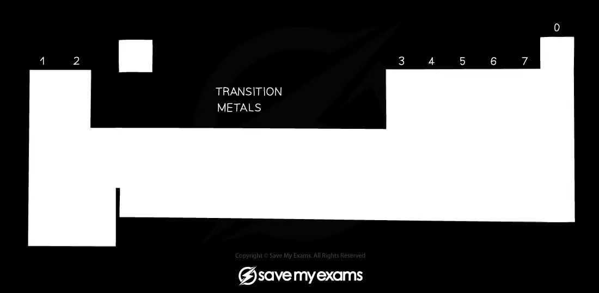
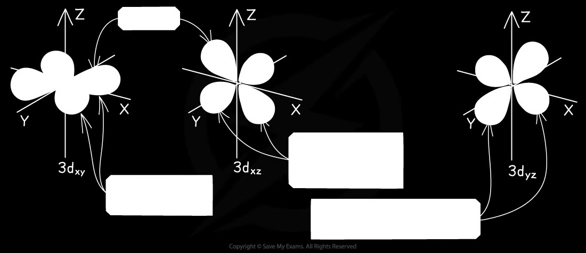
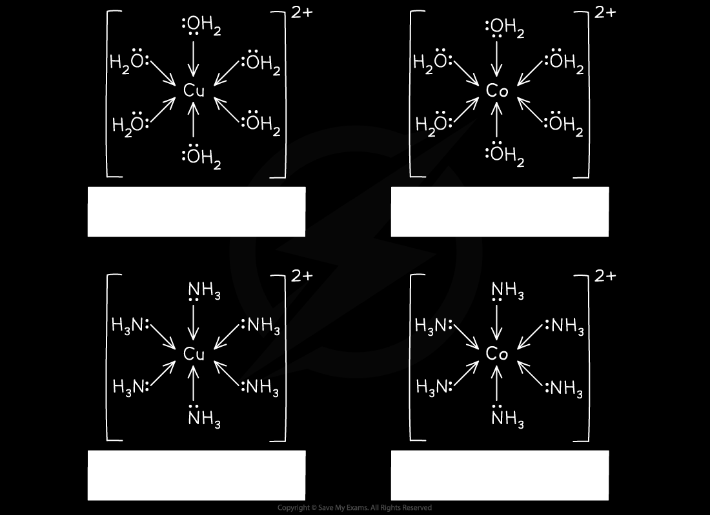
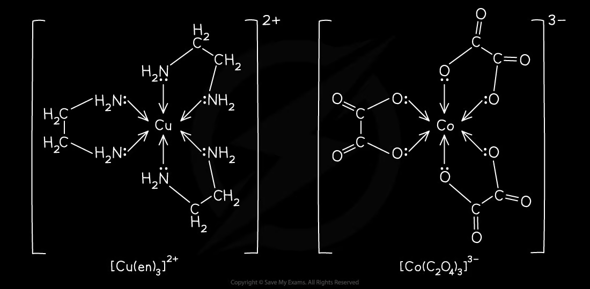
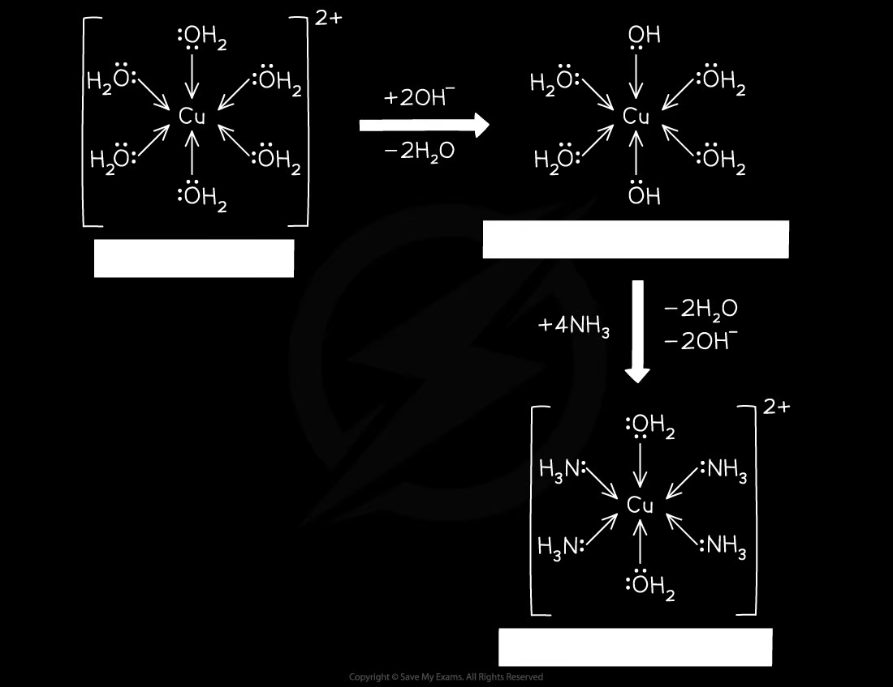
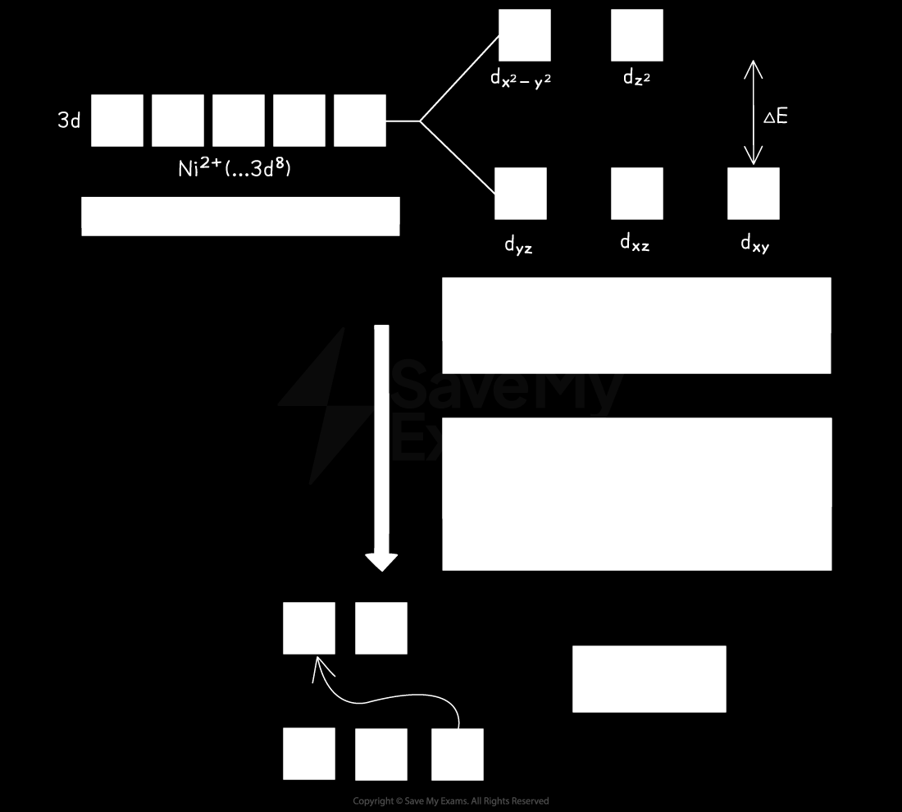
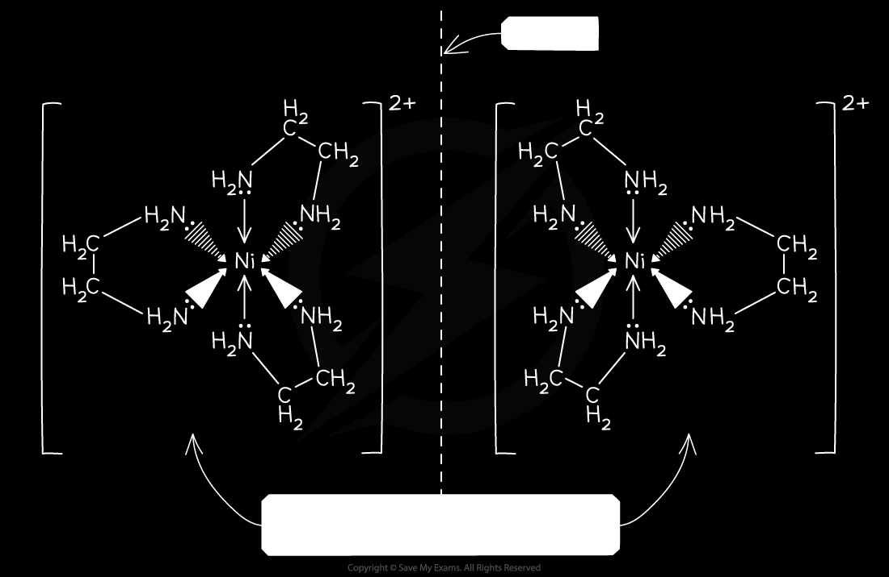
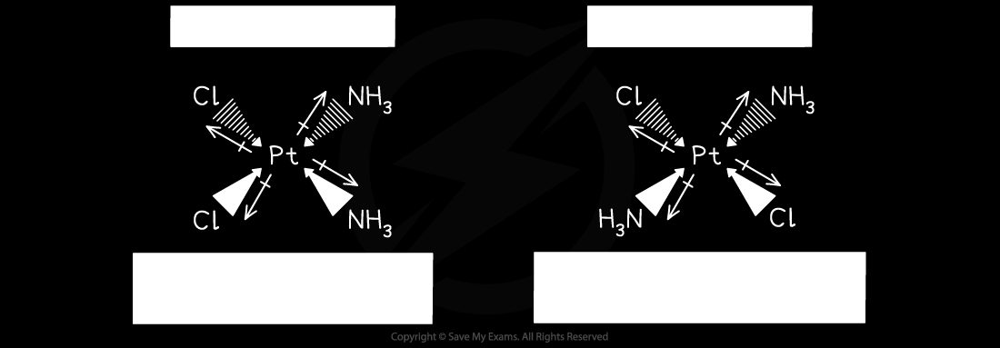
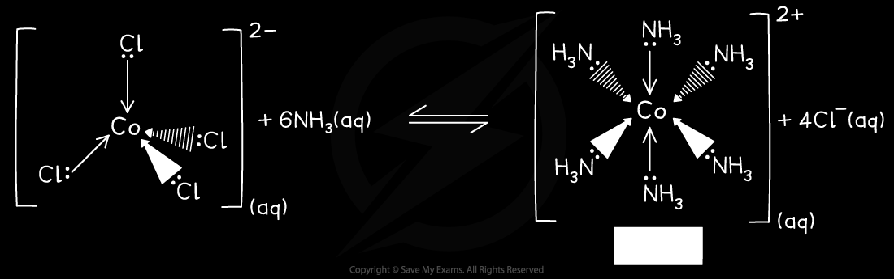

# 28 Chemistry of transition elements

本章对应 CIE 9701 2025–2027 syllabus 的 **28.1–28.5 Chemistry of transition elements**。题目部分对应专题题包中的 **6.2 Properties of Transition Elements (A Level Only)** 和 **6.3 Transition Element Complexes: Isomers, Reactions & Stability (A Level Only)**。

## Learning objectives

学完本章后，你应该能够：

- define a transition element and explain its characteristic properties;
- write electronic configurations for transition atoms and ions;
- define ligands, complex ions, coordination number and coordination geometries;
- explain ligand exchange, catalysis and variable oxidation states;
- explain the colour of transition-metal complexes using d-orbital splitting;
- identify and draw cis–trans and optical isomers;
- write and use expressions for stability constants, $K_{\mathrm{stab}}$.

## 28.1 General physical and chemical properties of transition elements

::: {.study-card}
### Definition and electronic configurations

**A transition element is an element which forms one or more stable ions with an incomplete d subshell.**

The first-row transition elements are in the d-block. When forming ions, the $4s$ electrons are removed before the $3d$ electrons. For example:

$$\ce{Ti}: [Ar]3d^24s^2$$
$$\ce{Ti^{2+}}: [Ar]3d^2$$
$$\ce{Fe^{2+}}: [Ar]3d^6$$
$$\ce{Fe^{3+}}: [Ar]3d^5$$
$$\ce{Cu}: [Ar]3d^{10}4s^1$$
$$\ce{Cu^{2+}}: [Ar]3d^9$$

Zinc is in the d-block but is not a transition element because $\ce{Zn^{2+}}$ has a complete $3d^{10}$ subshell, not an incomplete d subshell.

{.concept-figure fig-alt="Definition of transition elements and the d-block"}
:::

::: {.worked-example}
Worked example · Electronic configuration

### Why is zinc not a transition element?

**Explain, using electronic configurations, why zinc is found in the d-block but is not classed as a transition element.**

Zinc is in the d-block because the differentiating electrons enter the $3d$ subshell. However, zinc forms $\ce{Zn^{2+}}$ with the configuration $\ce{[Ar]3d^{10}}$. The d subshell is complete, so zinc does not form a stable ion with an incomplete d subshell.

**Final answer:** zinc is a d-block element but not a transition element because $\ce{Zn^{2+}}$ has a complete $3d^{10}$ subshell.

:::

::: {.study-card}
### Characteristic properties

Transition elements and their compounds commonly:

- show variable oxidation states, because the $3d$ and $4s$ levels are close in energy;
- form complex ions with ligands;
- form coloured ions and compounds;
- act as catalysts, often by changing oxidation state or forming temporary coordinate bonds.

These are characteristic properties rather than four independent definitions: a particular metal does not need to show every property in every compound.

{.concept-figure fig-alt="Electronic configurations of transition elements"}
:::

## 28.2 General characteristic chemical properties of transition elements

::: {.study-card}
### Ligands, coordinate bonds and complex ions

**A ligand is a molecule or ion which has at least one lone pair of electrons that can be donated to a central metal atom or ion to form a coordinate bond.**

**A complex ion is a molecule or ion formed by a central metal atom or ion surrounded by one or more ligands.**

The number of coordinate bonds from ligands to the central metal is the **coordination number**. Common geometries are:

| Coordination number | Geometry | Typical example |
|---:|---|---|
| 2 | linear, $180^\circ$ | $\ce{[Ag(NH3)2]+}$ |
| 4 | tetrahedral | $\ce{[CuCl4]^{2-}}$ |
| 4 | square planar | cisplatin, $\ce{[Pt(NH3)2Cl2]}$ |
| 6 | octahedral | $\ce{[Fe(H2O)6]^{2+}}$ |

Monodentate ligands donate one lone pair to make one coordinate bond. Bidentate ligands, such as ethane-1,2-diamine ($\ce{en}$), make two coordinate bonds. EDTA$^{4-}$ is hexadentate.

{.concept-figure fig-alt="Linear, tetrahedral, square-planar and octahedral complex geometries"}
:::

::: {.study-card}
### Ligand exchange

Ligand exchange is a substitution reaction in which one or more ligands in a complex are replaced by other ligands. For example:

$$\ce{[Cu(H2O)6]^2+ + 4Cl^- <=> [CuCl4]^2- + 6H2O}$$

The number and size of ligands affect both coordination number and shape. Six small water ligands can be replaced by four larger chloride ligands, giving a change from octahedral to tetrahedral.

With ammonia, copper(II) first forms a pale-blue hydroxide precipitate, then excess ammonia forms a deep-blue complex:

$$\ce{[Cu(H2O)6]^2+ + 2OH^- -> Cu(OH)2(s) + 6H2O}$$
$$\ce{[Cu(H2O)6]^2+ + 6NH3 -> [Cu(NH3)6]^2+ + 6H2O}$$

{.concept-figure fig-alt="Ligand exchange reactions of transition-metal complexes"}
:::

::: {.study-card}
### Catalytic behaviour

Transition metals can catalyse reactions because they have variable oxidation states and accessible orbitals. They can provide an alternative pathway with lower activation energy, often through temporary intermediate complexes.

For the Contact process:

$$\ce{SO2 + V2O5 -> SO3 + V2O4}$$
$$\ce{V2O4 + 1/2O2 -> V2O5}$$

Adding the equations gives:

$$\ce{SO2 + 1/2O2 -> SO3}$$

$\ce{V2O5}$ is regenerated and is therefore a catalyst. Iron in the Haber process is heterogeneous, while aqueous $\ce{Fe^{2+}}$ in the iodide–peroxodisulfate reaction and gaseous $\ce{NO2}$ in sulfur dioxide oxidation are homogeneous catalysts.

{.concept-figure fig-alt="Transition-metal redox cycles and catalysis"}
:::

## 28.3 Colour of transition-metal complexes

::: {.study-card}
### d-orbital splitting and absorption of light

In an isolated transition-metal ion, the five $d$ orbitals are **degenerate**, meaning that they have the same energy. When ligands approach, electron repulsion is different for orbitals pointing towards ligands and orbitals pointing between ligands. The d orbitals therefore split into two non-degenerate energy levels.

In an octahedral complex, the two orbitals pointing more directly towards ligands are higher in energy. In a tetrahedral complex, the ordering is reversed.

If the energy gap matches the energy of visible light, an electron absorbs that wavelength and is promoted to the higher d level. The complex appears the complementary colour of the absorbed light. Different ligands and different geometries cause different splitting energies, so related complexes can have different colours.

{.concept-figure fig-alt="d-orbital splitting in octahedral and tetrahedral complexes"}
{.concept-figure fig-alt="Visible-light absorption and complementary colour"}
:::

::: {.worked-example}
Worked example · Explaining colour

### Why are cobalt(II) and zinc(II) complexes different in colour?

**Explain why solutions containing $\ce{[Co(H2O)6]^2+}$ are coloured but solutions containing $\ce{[Zn(H2O)4]^2+}$ are not.**

$\ce{Co^{2+}}$ has an incomplete $3d$ subshell. The water ligands split the d orbitals into two energy levels, and visible light can promote an electron between these levels. The unabsorbed complementary light gives the solution its colour.

$\ce{Zn^{2+}}$ has a full $3d^{10}$ subshell. There is no partially filled d subshell and hence no suitable d–d transition in the visible region, so the complex is colourless.

:::

## 28.4 Stereoisomerism

::: {.study-card}
### Geometrical isomerism

Octahedral complexes with two or more kinds of ligand can show cis–trans isomerism. In a cis isomer, identical ligands are adjacent and make a $90^\circ$ angle. In a trans isomer, identical ligands are opposite and make a $180^\circ$ angle.

For example, $\ce{[Co(NH3)4Cl2]+}$ has cis and trans forms. The same principle applies to square-planar complexes such as cisplatin.

{.concept-figure fig-alt="Cis-trans geometrical isomerism"}
:::

::: {.study-card}
### Optical isomerism

Some octahedral complexes containing bidentate ligands exist as non-superimposable mirror images. These are optical isomers, or enantiomers. A common example is $\ce{[Ni(en)3]^2+}$.

The two structures have the same connectivity and chemical formula but rotate plane-polarised light in opposite directions. A mirror image that can be rotated to coincide with the original is not a separate optical isomer.

{.concept-figure fig-alt="Optical isomers of an octahedral complex"}
:::

## 28.5 Stability constants, $K_{\mathrm{stab}}$

::: {.study-card}
### Definition and expressions

For a ligand exchange reaction, the stability constant is the equilibrium constant for formation of the complex from the free metal ion and free ligand. For example:

$$\ce{[Cu(H2O)6]^2+ + 4NH3 <=> [Cu(NH3)4]^2+ + 6H2O}$$

$$K_{\mathrm{stab}}=\frac{[\ce{[Cu(NH3)4]^2+}]}{[\ce{[Cu(H2O)6]^2+}][\ce{NH3}]^4}$$

Water is omitted because it is the solvent and is present in large excess. A larger $K_{\mathrm{stab}}$ means that the product complex is more stable and the equilibrium lies further to the right.

{.concept-figure fig-alt="Stability constant expression for complex formation"}
:::

::: {.worked-example}
Worked example · Stability constant

### Comparing two ligand-exchange equilibria

**The stability constants for formation of $\ce{[Fe(H2O)5F]^2+}$ and $\ce{[Fe(H2O)5SCN]^2+}$ are $2.0\times10^5$ and $1.0\times10^3$ respectively. Predict what happens when fluoride is added to a solution containing the thiocyanate complex.**

The fluoride complex has the larger stability constant:

$$2.0\times10^5 > 1.0\times10^3$$

Therefore fluoride displaces thiocyanate from the complex. The deep-red thiocyanate complex is replaced by the colourless fluoride complex. This is a ligand-exchange (ligand-displacement) reaction.

:::

## Chapter checklist

- [ ] 我能定义 transition element，并解释 zinc 为什么不属于 transition element。
- [ ] 我能写出过渡元素原子和离子的电子排布。
- [ ] 我能定义 ligand、complex ion、coordination number，并判断常见几何构型。
- [ ] 我能解释 ligand exchange、variable oxidation states 和 transition-metal catalysis。
- [ ] 我能用 d-orbital splitting 和 complementary colour 解释配合物颜色。
- [ ] 我能判断和绘制 cis–trans 与 optical isomers。
- [ ] 我能写出 $K_{\mathrm{stab}}$ 表达式并比较配合物稳定性。

## Structured questions



### Original question PDFs

- [6.2 Properties of Transition Elements – Easy](https://raw.githubusercontent.com/nanoxsj/CIE-Chemistry-Study/main/resources/original-papers/transition-elements/6.2-properties-of-transition-elements-easy.pdf)
- [6.2 Properties of Transition Elements – Medium](https://raw.githubusercontent.com/nanoxsj/CIE-Chemistry-Study/main/resources/original-papers/transition-elements/6.2-properties-of-transition-elements-medium.pdf)
- [6.3 Transition Element Complexes – Easy](https://raw.githubusercontent.com/nanoxsj/CIE-Chemistry-Study/main/resources/original-papers/transition-elements/6.3-transition-complexes-easy.pdf)
- [6.3 Transition Element Complexes – Medium](https://raw.githubusercontent.com/nanoxsj/CIE-Chemistry-Study/main/resources/original-papers/transition-elements/6.3-transition-complexes-medium.pdf)
- [6.3 Transition Element Complexes – Hard](https://raw.githubusercontent.com/nanoxsj/CIE-Chemistry-Study/main/resources/original-papers/transition-elements/6.3-transition-complexes-hard.pdf)


