# 7.1 An Introduction to A Level Organic Chemistry (A Level Only) - Structured Questions

本页保留题包中的全部 Structured Questions，按 Easy、Medium、Hard 分组。题目保留完整英文题干、所有分问和题目中的局部图；答案按 Model Answers 整理，并补全计算与结构说明。

### 7.1 An Introduction to A Level Organic Chemistry (A Level Only) - Easy

::: {.question-card}
### Example 1 · Formulae, naming and mechanisms · 7.1 SQ Easy Q1

The structural formulae of four different organic compounds are shown in Table 1.1.

| Structural formula | IUPAC name |
|---|---|
| `C6H5CH3` |  |
| `CH3CH2CH2CH2CHO` |  |
| `CH3NHCH3` |  |
| `CH3CH(NH2)CO2H` |  |

**(a)** Complete Table 1.1 by writing the systematic name for each compound. `[4 marks]`

**(b)** Draw the fully displayed formula for butanoyl chloride. `[1 mark]`

**(c)** Butanoyl chloride can react with water to form butanoic acid. State the type of mechanism that this reaction involves. `[1 mark]`

Show mark scheme / model answer

- **(a)** In order: **methylbenzene**; **pentanal**; **dimethylamine**; **2-aminopropanoic acid**. `[4]`
- **(b)** The fully displayed formula must show the four-carbon chain and the acyl chloride group, $\text{CH}_3\text{CH}_2\text{CH}_2\text{C(=O)Cl}$. `[1]`
- **(c)** **Addition-elimination**. Water adds across the C=O bond and HCl is eliminated; the overall reaction is hydrolysis. `[1]`

:::

::: {.question-card}
### Example 2 · Benzene structure · 7.1 SQ Easy Q2

This question is about benzene.

**(a)** Draw the displayed formula for benzene. `[2 marks]`

**(b)** State the bond angle in the planar regular hexagon structure of benzene. `[1 mark]`

**(c)** State the type of hybridisation of the carbon atoms in benzene. `[1 mark]`

Show mark scheme / model answer

- **(a)** Draw a planar hexagonal ring showing the six carbon atoms, the C-H bonds and the delocalised electron ring. Equivalent displayed representations with alternating double bonds are accepted. `[2]`
- **(b)** $120^\circ$. `[1]`
- **(c)** $sp^2$ hybridisation. `[1]`

:::

::: {.question-card}
### Example 3 · Position and optical isomerism · 7.1 SQ Easy Q3

This question is about isomerism in different acids.

**(a)** Hydroxypropanoic acid has two position isomers.

1. Draw and name the two position isomers of hydroxypropanoic acid. `[2 marks]`
2. Identify which isomer is optically active. `[1 mark]`

**(b)** There are 20 amino acids used by the cells in the human body for protein synthesis. There is only one amino acid that is not optically active. Three amino acids are shown in Fig. 3.1.

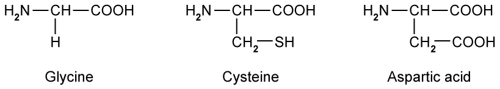{.question-figure fig-alt="Structures of glycine, cysteine and aspartic acid"}

Identify the amino acid that does not have any effect on plane-polarised light. `[1 mark]`

**(c)** Serine, shown in Fig. 3.2, exhibits optical activity.

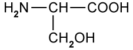{.question-figure fig-alt="Structural formula of serine"}

Draw three-dimensional representations of the two isomers to show the relationship between them. `[2 marks]`

Show mark scheme / model answer

- **(a)(1)** The two position isomers are **2-hydroxypropanoic acid**, $\text{CH}_3\text{CH(OH)COOH}$, and **3-hydroxypropanoic acid**, $\text{HOCH}_2\text{CH}_2\text{COOH}$. `[2]`
- **(a)(2)** **2-hydroxypropanoic acid** is optically active because C-2 is attached to four different groups: H, OH, CH$_3$ and COOH. `[1]`
- **(b)** **Glycine**. Its central carbon is attached to two H atoms, so it is not a chiral centre. `[1]`
- **(c)** Draw two non-superimposable mirror images of serine. The chiral carbon is bonded to H, NH$_2$, COOH and CH$_2$OH; the two structures must have opposite three-dimensional arrangements. `[2]`

:::

::: {.question-card}
### Example 4 · Friedel-Crafts alkylation · 7.1 SQ Easy Q4

Benzene can react with aluminium bromide, $\text{AlBr}_3$, and bromoethane, $\text{CH}_3\text{CH}_2\text{Br}$, to form ethylbenzene.

**(a)** Write the equation for the formation of the $\text{CH}_3\text{CH}_2^+$ species. `[1 mark]`

**(b)** Name the mechanism for the formation of ethylbenzene from benzene and aluminium bromide. `[1 mark]`

**(c)** Using the $\text{CH}_3\text{CH}_2^+$ electrophile, draw the mechanism for the conversion of benzene into ethylbenzene. Include all necessary curly arrows and charges. `[3 marks]`

**(d)** State the type of reaction that occurs in part (c). `[1 mark]`

Show mark scheme / model answer

- **(a)**

  $$\ce{CH3CH2Br + AlBr3 -> CH3CH2+ + AlBr4-}$$

  `[1]`
- **(b)** **Electrophilic substitution**. `[1]`
- **(c)** The curly arrow from the benzene $\pi$-electron ring goes to the carbon of $\text{CH}_3\text{CH}_2^+$. This forms the positively charged cyclohexadienyl intermediate. A curly arrow from the C-H bond returns into the ring to restore aromaticity and form ethylbenzene. The positive charge and both arrows must be shown in the correct places. `[3]`
- **(d)** **Friedel-Crafts alkylation**. `[1]`

:::

::: {.question-card}
### Example 5 · Aromatic, aliphatic and stereoisomeric compounds · 7.1 SQ Easy Q5

Compounds K, L and M are organic compounds with different properties.

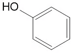{.question-figure fig-alt="Structure of compound K"}
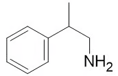{.question-figure fig-alt="Structure of compound M"}

**(a)** Give the systematic name of compounds K, L and M. `[3 marks]`

**(b)** Complete Table 5.1 to identify if compounds K, L and M are aliphatic or aromatic. `[2 marks]`

|  | Aliphatic | Aromatic |
|---|---|---|
| compound K |  |  |
| compound L |  |  |
| compound M |  |  |

**(c)**

1. State what is meant by structural isomerism and give three specific types of structural isomerism. `[2 marks]`
2. State what is meant by stereoisomerism and give two specific types of stereoisomerism. `[2 marks]`

**(d)** Draw three-dimensional diagrams to show the stereoisomers of compound M.

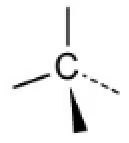{.question-figure fig-alt="Three-dimensional template for first isomer"}
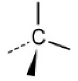{.question-figure fig-alt="Three-dimensional template for second isomer"}

`[2 marks]`

Show mark scheme / model answer

- **(a)** K = **phenol**; L = **ethanoyl chloride**; M = **2-phenylpropylamine**. `[3]`
- **(b)** K is aromatic only; L is aliphatic only; M is both aliphatic and aromatic. Aromatic compounds contain a benzene ring; aliphatic compounds do not. `[2]`
- **(c)(1)** Structural isomerism is when compounds have the same molecular formula but different structural formulae. Three types are **chain**, **positional** and **functional-group** isomerism. `[2]`
- **(c)(2)** Stereoisomerism is when compounds have the same molecular formula and structural formula but a different arrangement of atoms in space. Two types are **geometrical** and **optical** isomerism. `[2]`
- **(d)** Draw the two non-superimposable mirror images. The chiral carbon is attached to CH$_3$, H, CH$_2$NH$_2$ and phenyl; the second drawing must be the mirror image of the first. `[2]`

:::

### 7.1 An Introduction to A Level Organic Chemistry (A Level Only) - Medium

::: {.question-card}
### Example 6 · Acyl chlorides, amides and amino acids · 7.1 SQ Medium Q1

Organic compounds can be represented using skeletal formula.

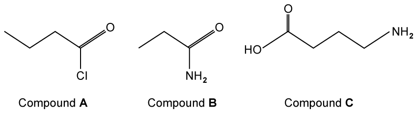{.question-figure fig-alt="Skeletal formulae of compounds A, B and C"}

**(a)** Give the IUPAC names of compounds A, B and C. `[3 marks]`

**(b)** Compound A can undergo hydrolysis to form a carboxylic acid.

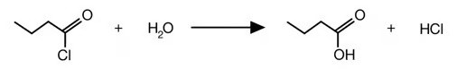{.question-figure fig-alt="Hydrolysis reaction of an acyl chloride"}

Explain why this is an example of an addition-elimination reaction. `[2 marks]`

**(c)** When heated, compound A will also react with phenol in the presence of a base to produce phenyl butanoate. Draw the displayed formula of phenyl butanoate. `[2 marks]`

**(d)** State whether any of compounds A, B or C can form optical isomers. Explain your answer. `[2 marks]`

Show mark scheme / model answer

- **(a)** A = **butanoyl chloride**; B = **propanamide**; C = **4-aminobutanoic acid**. `[3]`
- **(b)** Water adds across the C=O bond and HCl is eliminated. `[2]`
- **(c)** The displayed formula is the ester $\text{C}_6\text{H}_5\text{OCOCH}_2\text{CH}_2\text{CH}_3$, with the $\text{-COO-}$ ester link shown correctly. `[2]`
- **(d)** None of A, B or C forms optical isomers because none contains a carbon atom attached to four different atoms or groups of atoms, i.e. none has a chiral centre. `[2]`

:::

::: {.question-card}
### Example 7 · Aromatic naming and bonding · 7.1 SQ Medium Q2

Benzene can exist as $\text{C}_6\text{H}_6$ or be substituted in a number of different ways to form aromatic compounds.

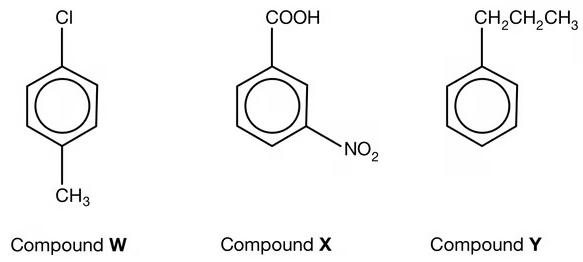{.question-figure fig-alt="Aromatic compounds W, X and Y"}

**(a)** State the IUPAC name for compounds W, X and Y. `[3 marks]`

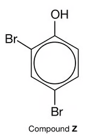{.question-figure fig-alt="Aromatic compound Z"}

**(b)** State the IUPAC name for compound Z. `[1 mark]`

**(c)** State the bond angle that is present in the benzene molecule. `[1 mark]`

**(d)** In benzene, each of the carbon atoms is $sp^2$ hybridised.

1. Explain how neighbouring carbon atoms form $\sigma$ bonds. `[1 mark]`
2. Neighbouring carbon atoms also form $\pi$ bonds. Explain how these $\pi$ bonds are formed. `[1 mark]`

Show mark scheme / model answer

- **(a)** W = **4-chloromethylbenzene**; X = **3-nitrobenzoic acid**; Y = **propylbenzene**. `[3]`
- **(b)** **2,4-dibromophenol**. `[1]`
- **(c)** $120^\circ$. `[1]`
- **(d)(1)** $\sigma$ bonds form by direct overlap of neighbouring $sp^2$ hybrid orbitals along the internuclear axis. `[1]`
- **(d)(2)** $\pi$ bonds form by sideways overlap of adjacent, parallel unhybridised p orbitals. `[1]`

:::

::: {.question-card}
### Example 8 · Benzene, nitration and functional groups · 7.1 SQ Medium Q3

This question is about benzene.

**(a)**

1. Explain why the benzene molecule is planar. `[2 marks]`
2. Explain why all of the carbon-carbon bonds in benzene are the same length. `[1 mark]`

**(b)** Benzene can be nitrated by warming it with a mixture of concentrated sulfuric acid and concentrated nitric acid. The mechanism for the reaction is shown in Fig. 3.1.

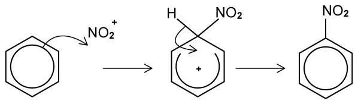{.question-figure fig-alt="Electrophilic substitution mechanism for nitration of benzene"}

Name the type of mechanism for this nitration reaction. Explain your answer. `[3 marks]`

**(c)** Benzene can be used to synthesise (4-aminophenyl)ethanoic acid, a drug that can be used to treat chronic inflammation of the intestines.

1. Draw the structural formula of (4-aminophenyl)ethanoic acid. `[1 mark]`
2. One intermediate product made during the synthesis is shown in Fig. 3.2. Give its IUPAC name. `[1 mark]`

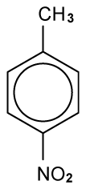{.question-figure fig-alt="Intermediate aromatic compound"}

**(d)** Noradrenaline is shown in Fig. 3.3. Other than the arene functional group, state the names of three functional groups in the molecule. `[3 marks]`

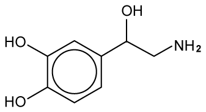{.question-figure fig-alt="Structure of noradrenaline"}

Show mark scheme / model answer

- **(a)(1)** The carbon atoms are $sp^2$ hybridised / trigonal planar and the p orbitals overlap most effectively when all six carbon atoms are in one plane. `[2]`
- **(a)(2)** The $\pi$ electrons are delocalised and evenly distributed around the ring, so all C-C bonds have the same intermediate bond order and length. `[1]`
- **(b)** **Electrophilic substitution**. The $\text{NO}_2^+$ species is an electrophile and a nitro group substitutes for a hydrogen atom on the benzene ring. `[3]`
- **(c)(1)** $\text{NH}_2\text{-C}_6\text{H}_4\text{-CH}_2\text{COOH}$ with NH$_2$ para to CH$_2$COOH, i.e. **(4-aminophenyl)ethanoic acid**. `[1]`
- **(c)(2)** **4-nitromethylbenzene**. `[1]`
- **(d)** **Phenol**, **secondary alcohol** and **primary amine**. `[3]`

:::

::: {.question-card}
### Example 9 · Leucine and stereoisomers · 7.1 SQ Medium Q4

Leucine is an optically active amino acid with the molecular formula $(\text{CH}_3)_2\text{CHCH}_2\text{CH(NH}_2\text{)COOH}$.

**(a)** Draw the displayed formula of leucine. `[1 mark]`

**(b)** Leucine exists as stereoisomers.

1. Explain the meaning of the term stereoisomers. `[2 marks]`
2. Explain how you can distinguish between the isomers. `[2 marks]`

**(c)** The two optical isomers of leucine taste different. One isomer has a bitter taste and the other is sweet. Draw the three-dimensional arrangement of the two optical isomers. `[2 marks]`

**(d)** Give the IUPAC name of leucine. `[1 mark]`

Show mark scheme / model answer

- **(a)** $\text{HOOC-CH(NH}_2\text{)-CH}_2\text{-CH(CH}_3)_2$. `[1]`
- **(b)(1)** Stereoisomers have the same molecular formula and structural formula but a different arrangement of atoms in space. `[2]`
- **(b)(2)** Use plane-polarised light. The two enantiomers rotate the plane by equal amounts in opposite directions. `[2]`
- **(c)** Draw two non-superimposable mirror images with the chiral carbon attached to H, NH$_2$, COOH and CH$_2$CH(CH$_3$)$_2$. `[2]`
- **(d)** **2-amino-4-methylpentanoic acid**. `[1]`

:::

::: {.question-card}
### Example 10 · Propranolol and chiral catalysts · 7.1 SQ Medium Q5

Propranolol is an optically active drug used to treat hypertension. Its structure is shown in Fig. 5.1.

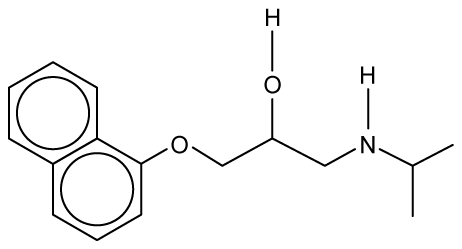{.question-figure fig-alt="Structure of propranolol"}

**(a)**

1. Give the molecular formula of propranolol. `[1 mark]`
2. Circle the chiral centre of propranolol in Fig. 5.1. `[1 mark]`

**(b)** Explain why a racemic mixture of propranolol has no effect on plane-polarised light. `[3 marks]`

**(c)** Explain why it is important to separate a racemic mixture of propranolol into pure single enantiomers. `[1 mark]`

**(d)** Chiral catalysts are often used in the manufacturing process of drugs.

1. What is the purpose of a chiral catalyst? `[1 mark]`
2. Give one advantage and one disadvantage of using a chiral catalyst. `[2 marks]`

Show mark scheme / model answer

- **(a)(1)** $\text{C}_{16}\text{H}_{21}\text{NO}_2$. `[1]`
- **(a)(2)** The chiral centre is the carbon in the side chain bonded to OH, H, CH$_2$O- and CH$_2$NH- groups. `[1]`
- **(b)** A racemic mixture contains equal amounts of the two enantiomers. They rotate plane-polarised light by equal angles in opposite directions, so the rotations cancel. `[3]`
- **(c)** Enantiomers can have different biological effects because biological receptors and enzymes are chiral. `[1]`
- **(d)(1)** To favour formation of one enantiomer rather than an equal racemic mixture. `[1]`
- **(d)(2)** Advantage: improved selectivity and less unwanted enantiomer to separate. Disadvantage: chiral catalysts can be expensive to prepare or use. `[2]`

:::

### 7.1 An Introduction to A Level Organic Chemistry (A Level Only) - Hard

::: {.question-card}
### Example 11 · Aldehydes and optical isomerism · 7.1 SQ Hard Q1

This question is about aldehydes.

**(a)** Draw the displayed formula and three-dimensional representations of the smallest aldehyde that can form optical isomers. `[3 marks]`

**(b)**

1. Draw the fully displayed formula of the oxidation product of the aldehyde identified in part (a). `[1 mark]`
2. State a suitable reagent, including observations, for the oxidation of the aldehyde identified in part (a). `[1 mark]`

**(c)**

1. Write a balanced symbol equation, using structural formulae, to show the reduction of the aldehyde identified in part (a). You should use `[H]` to show the reducing agent. `[1 mark]`
2. State a suitable reducing agent. `[1 mark]`

**(d)** Name the organic compound formed by the reaction of the oxidation product in part (b) and the reduction product in part (c). `[1 mark]`

Show mark scheme / model answer

- **(a)** The smallest aldehyde is **2-methylbutanal**, $\text{C}_2\text{H}_5\text{CH(CH}_3\text{)CHO}$. The carbon next to the aldehyde group is chiral because it is attached to H, CH$_3$, C$_2$H$_5$ and CHO. Draw the two non-superimposable mirror images. `[3]`
- **(b)(1)** The oxidation product is **2-methylbutanoic acid**, $\text{C}_2\text{H}_5\text{CH(CH}_3\text{)COOH}$. `[1]`
- **(b)(2)** Any one of: Fehling's solution, blue to brick-red precipitate; Tollens' reagent, silver mirror; acidified potassium dichromate(VI) under reflux, orange to green. `[1]`
- **(c)(1)**

  $$\ce{C2H5CH(CH3)CHO + 2[H] -> C2H5CH(CH3)CH2OH}$$

  `[1]`
- **(c)(2)** Sodium tetrahydridoborate(III) / sodium borohydride, NaBH$_4$, or lithium tetrahydridoaluminate(III) / lithium aluminium hydride, LiAlH$_4$. `[1]`
- **(d)** **2-methylbutyl 2-methylbutanoate**. `[1]`

:::

::: {.question-card}
### Example 12 · Limonene, hydrogenation and reduction · 7.1 SQ Hard Q2

This question is about the chemistry of limonene. Limonene is commonly found in the rinds of citrus fruits such as grapefruit, lemon, lime and oranges. It is a naturally occurring hydrocarbon with molecular formula $\text{C}_{10}\text{H}_{16}$.

Limonene exists as a pair of enantiomers. One enantiomer is responsible for a strong orange smell and the other enantiomer is responsible for a lemon smell.

**(a)** Draw three-dimensional representations of the two enantiomers of limonene. `[2 marks]`

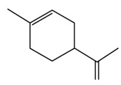{.question-figure fig-alt="Limonene structure"}

**(b)** Suggest why receptors in the human nose can distinguish between the orange and lemon enantiomers of limonene. `[3 marks]`

**(c)** Limonene can undergo full hydrogenation to form menthane as shown. For the complete hydrogenation of an impure sample of 3.00 g of limonene at room temperature and pressure, 870 cm$^3$ of hydrogen was required. Calculate the percentage purity of limonene. One mole of hydrogen occupies 24.0 dm$^3$ at room temperature and pressure. `[4 marks]`

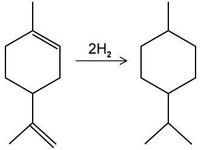{.question-figure fig-alt="Hydrogenation of limonene to menthane"}

**(d)** The final step of the multi-step synthetic conversion of limonene to menthol is shown. State the reagent for this reaction and the type of reaction. `[2 marks]`

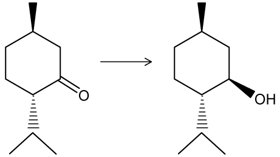{.question-figure fig-alt="Reduction of menthone to menthol"}

Show mark scheme / model answer

- **(a)** Draw the two non-superimposable mirror images of limonene. `[2]`
- **(b)** Olfactory receptors have specific three-dimensional shapes. The two enantiomers have different three-dimensional shapes, so one fits a receptor more effectively than the other. Different receptor interactions produce different smell signals. `[3]`
- **(c)**

  $$870\ \text{cm}^3=0.870\ \text{dm}^3$$

  $$n(\ce{H2})=\frac{0.870}{24.0}=0.03625\ \text{mol}$$

  Two moles of hydrogen add per mole of limonene, so:

  $$n(\text{limonene})=\frac{0.03625}{2}=0.018125\ \text{mol}$$

  $$m(\text{pure limonene})=0.018125\times136=2.465\ \text{g}$$

  $$\text{percentage purity}=\frac{2.465}{3.00}\times100=82.2\%$$

  `[4]`
- **(d)** Reagent: sodium tetrahydridoborate(III), sodium borohydride or NaBH$_4$. Reaction type: **reduction**. `[2]`

:::

::: {.question-card}
### Example 13 · HCN addition, chirality and isomerism · 7.1 SQ Hard Q3

“Aldehydes and ketones always react with HCN to form optical isomers.” Discuss this statement, using the general formulae RCHO and R'COR''. Your answer should include equations where appropriate. `[4 marks]`

**(b)** Acidified $\text{K}_2\text{Cr}_2\text{O}_7$(aq) was heated under reflux with the following beta-hydroxyaldehyde shown in Fig. 3.1.

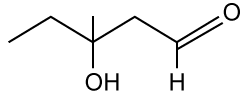{.question-figure fig-alt="Beta-hydroxyaldehyde with a tertiary alcohol and aldehyde group"}

Explain the change in chirality, if any, between the beta-hydroxyaldehyde and its organic product. `[3 marks]`

**(c)** Explain the change in chirality, if any, when pent-1-en-3-ol is hydrogenated. `[3 marks]`

**(d)** Other isomers of pent-1-en-3-ol, $\text{C}_5\text{H}_{10}\text{O}$, exist.

1. Draw the displayed formula of the secondary alcohol isomer of pent-1-en-3-ol that exhibits both stereoisomerism and optical isomerism, and identify the chiral centre. `[2 marks]`
2. Give the IUPAC name for this isomer. `[1 mark]`

Show mark scheme / model answer

- **(a)** The statement is not always correct.

  For an aldehyde:

  $$\ce{RCHO + HCN -> RCH(OH)CN}$$

  If R = H, the product has two H atoms attached to the carbon and is not chiral. If R is an alkyl group, the product may have four different groups attached to the new carbon and can form optical isomers.

  For a ketone:

  $$\ce{R'COR'' + HCN -> R'C(OH)(CN)R''}$$

  If R' and R'' are identical, the product is not chiral. If R' and R'' are different, the product can have a chiral carbon and form optical isomers. `[4]`
- **(b)** The tertiary alcohol group is not oxidised. The aldehyde group is oxidised to a carboxylic acid. The chiral centre remains attached to four different groups, so chirality is retained. `[3]`
- **(c)** Hydrogenation converts pent-1-en-3-ol into pentan-3-ol. The carbon at position 3 then has two identical ethyl groups, so it is no longer a chiral centre; optical activity is lost. `[3]`
- **(d)(1)** A suitable displayed formula is $\text{CH}_3\text{CH(OH)CH=CHCH}_3$; identify C-2, the carbon bearing OH, as the chiral centre. It has both geometrical isomerism from C=C and optical isomerism from the chiral carbon. `[2]`
- **(d)(2)** **pent-3-en-2-ol**. `[1]`

:::
