# 29 An introduction to A Level organic chemistry

本章对应 CIE 9701 2025–2027 syllabus 的 **29.1–29.4 An introduction to A Level organic chemistry**。知识点按考纲组织；题目部分对应专题题包 **7.1 An Introduction to A Level Organic Chemistry (A Level Only)** 的 Easy、Medium 与 Hard Structured Questions。

## Learning objectives

学完本章后，你应该能够：

- identify common functional groups and write general, structural, displayed and skeletal formulae;
- name simple aliphatic and aromatic organic compounds systematically;
- use the terms electrophilic substitution and addition–elimination correctly;
- explain the planar shape of benzene using $sp^2$ hybridisation, $\sigma$ bonds and the delocalised $\pi$ system;
- define chiral centres, enantiomers, optical activity and racemic mixtures;
- explain why enantiomers can have different biological activity and why chiral catalysts are useful.

## 29.1 Formulas, Functional Groups - the Naming of Organic Compounds (AL)

::: {.study-card}
### Functional groups and formula types

**A functional group is an atom or group of atoms in an organic molecule that determines its characteristic chemical and physical properties.**

Useful formula conventions are:

| Formula type | What it shows | Example |
|---|---|---|
| General formula | the composition of a homologous series | alkanes: $\ce{C_nH_{2n+2}}$ |
| Structural formula | how atoms are arranged in groups | $\ce{CH3CH2OH}$ |
| Displayed formula | every atom and every covalent bond | all C–H and C–C bonds are drawn |
| Skeletal formula | the carbon skeleton using lines; carbon-bound H atoms are omitted | line-angle formula |

The functional group is the chemically important part of the molecule. For example, alcohols contain $\ce{-OH}$, amines contain $\ce{-NH2}$ or substituted amino groups, carboxylic acids contain $\ce{-COOH}$, and acyl chlorides contain $\ce{-COCl}$.

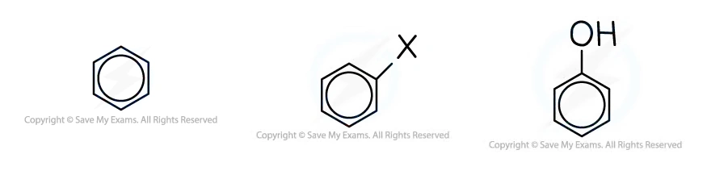{.concept-figure fig-alt="Functional groups, arenes and halogenoarenes"}
:::

::: {.worked-example}
Worked example · Formula types and functional groups

### Identifying the formula type and functional group

**A compound is written as $\ce{CH3CH2CH2CHO}$. Identify its functional group and give its IUPAC name.**

The terminal $\ce{-CHO}$ group is an aldehyde. The longest carbon chain contains four carbon atoms, so the stem is **butan-**. An aldehyde has the suffix **-al**.

**Answer:** the compound is **butanal**, and its functional group is the aldehyde group, $\ce{-CHO}$.

:::

::: {.study-card}
### Naming simple aliphatic compounds

For a simple aliphatic compound:

1. identify the principal functional group and its suffix;
2. choose the longest carbon chain containing that group;
3. number the chain from the end that gives the principal group the lowest number;
4. identify substituents and their positions;
5. assemble the name using the correct prefixes and suffix.

Examples include **pentanal**, **dimethylamine**, **2-aminopropanoic acid**, **butanoyl chloride** and **2-amino-4-methylpentanoic acid**. The carbon of a carboxylic acid group is carbon 1; the carbonyl carbon of an acyl chloride is included in the main chain.

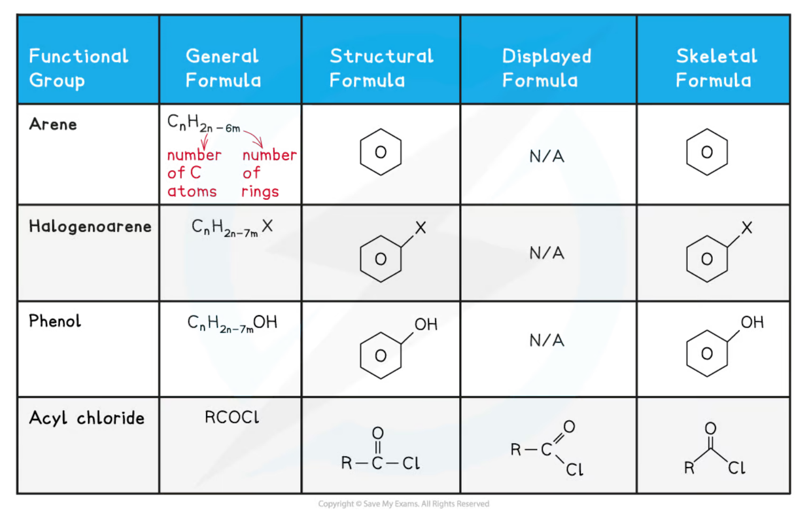{.concept-figure fig-alt="General, structural, displayed and skeletal formula types"}
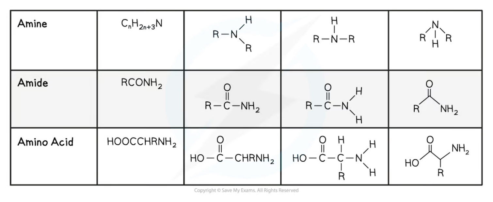{.concept-figure fig-alt="Naming examples for acyl chlorides, amides, amines and carboxylic acids"}
:::

::: {.worked-example}
Worked example · Systematic naming

### Naming four compounds

**Give the systematic names of $\ce{C6H5CH3}$, $\ce{CH3CH2CH2CH2CHO}$, $\ce{CH3NHCH3}$ and $\ce{CH3CH(NH2)CO2H}$.**

- $\ce{C6H5CH3}$ contains a benzene ring with a methyl substituent: **methylbenzene**.
- $\ce{CH3CH2CH2CH2CHO}$ contains five carbon atoms and an aldehyde group: **pentanal**.
- $\ce{CH3NHCH3}$ is an amine with two methyl groups attached to nitrogen: **dimethylamine**.
- $\ce{CH3CH(NH2)CO2H}$ is a three-carbon carboxylic acid with an amino group on carbon 2: **2-aminopropanoic acid**.

:::

::: {.study-card}
### Simple aromatic compound names

An **arene** is an aromatic compound containing a benzene ring. In a substituted benzene, choose the principal functional group as the parent name where appropriate: for example, **benzoic acid** and **phenol**. Substituent positions are numbered to give the lowest possible set of locants.

Examples from the syllabus and questions include **3-nitrobenzoic acid**, **2,4,6-tribromophenol**, **4-chloromethylbenzene** and **propylbenzene**.

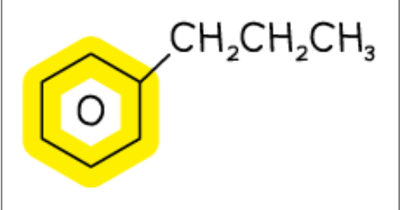{.concept-figure fig-alt="Examples of aromatic compound nomenclature"}
:::

## 29.2 Characteristic Organic Reactions (AL)

::: {.study-card}
### Mechanism vocabulary in the syllabus

The A Level syllabus requires the following mechanism terms in this section:

- **Electrophilic substitution:** an electron-rich aromatic ring reacts with an electrophile; one hydrogen atom on the ring is substituted, while aromatic stability is restored.
- **Addition–elimination:** a molecule adds across a polar multiple bond or carbonyl group, followed by elimination of a small molecule such as HCl.

For example, benzene reacts with an electrophile in nitration and Friedel–Crafts alkylation. An acyl chloride reacting with water is an addition–elimination reaction: water adds at the carbonyl carbon and HCl is eliminated.

{.concept-figure fig-alt="Characteristic organic reaction terminology"}
:::

::: {.worked-example}
Worked example · Addition–elimination

### Hydrolysis of an acyl chloride

**Butanoyl chloride reacts with water to form butanoic acid. State the mechanism type and explain the name.**

The mechanism is **addition–elimination**. A water molecule adds at the carbonyl group and **HCl is eliminated**. The overall reaction is hydrolysis.

$$\ce{CH3CH2CH2COCl + H2O -> CH3CH2CH2COOH + HCl}$$

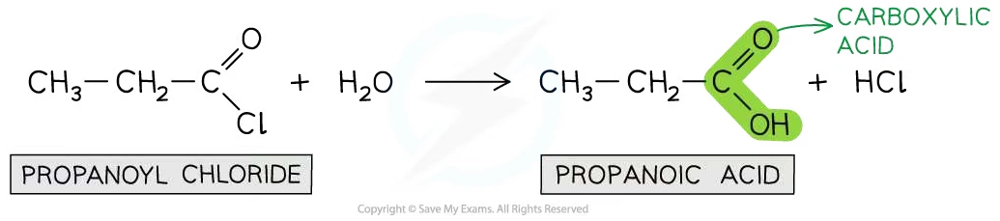{.concept-figure fig-alt="Hydrolysis of an acyl chloride by addition-elimination"}

:::

::: {.study-card}
### Electrophilic substitution of benzene

Benzene is electron-rich because of its delocalised $\pi$ electron system. In an electrophilic substitution, the electrophile attacks the ring, a temporary intermediate forms, and loss of $\ce{H+}$ restores the delocalised aromatic system. The ring therefore undergoes substitution rather than ordinary addition, which would destroy aromatic stabilisation.

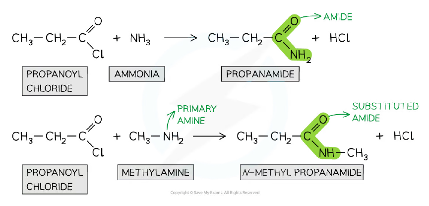{.concept-figure fig-alt="Electrophilic substitution of an aromatic ring"}
:::

::: {.worked-example}
Worked example · Friedel–Crafts alkylation

### Formation of ethylbenzene

**Benzene reacts with bromoethane and aluminium bromide to form ethylbenzene. Write the equation for the electrophile, name the mechanism and state the reaction type.**

1. The electrophile is formed by heterolytic cleavage assisted by aluminium bromide:

   $$\ce{CH3CH2Br + AlBr3 -> CH3CH2+ + AlBr4-}$$

2. The mechanism is **electrophilic substitution**.
3. The overall reaction is a **Friedel–Crafts alkylation**. The ethyl electrophile substitutes for a hydrogen atom on benzene, and the aromatic system is restored.

:::

## 29.3 Shapes of Aromatic Organic Molecules; $\sigma$ - $\pi$ Bonds

::: {.study-card}
### Benzene is planar and has a delocalised $\pi$ system

Each carbon atom in benzene is **$sp^2$ hybridised**. Three $sp^2$ orbitals form three $\sigma$ bonds in a trigonal-planar arrangement, giving bond angles of approximately **$120^\circ$**. The remaining unhybridised p orbital on each carbon is perpendicular to the plane of the ring.

The six p orbitals overlap sideways to form one continuous **delocalised $\pi$ system** above and below the plane of the ring. This explains why all six C–C bonds are the same length: the bonding is not a set of three isolated single bonds and three isolated double bonds.

{.concept-figure fig-alt="Planar shape of aromatic molecules"}
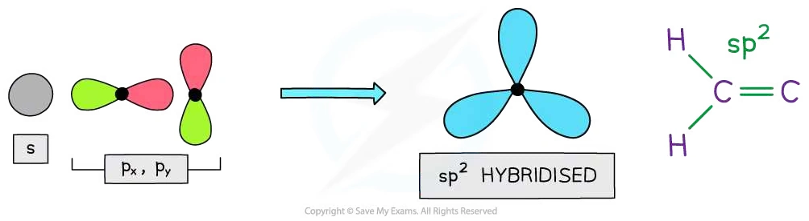{.concept-figure fig-alt="sp2 hybridisation and sigma bonding"}
:::

::: {.worked-example}
Worked example · Benzene bonding

### Explaining bond angle and bond length

**State the bond angle in benzene, state the hybridisation of its carbon atoms, and explain why all the C–C bonds have the same length.**

- The bond angle is **$120^\circ$**.
- Each carbon atom is **$sp^2$ hybridised**.
- The unhybridised p orbitals overlap sideways around the ring to form a **delocalised $\pi$ system**. Each C–C bond therefore has the same intermediate bond order and the same length.

:::

::: {.study-card}
### $\sigma$ bonds, $\pi$ bonds and aromatic stability

A $\sigma$ bond is formed by direct overlap along the internuclear axis. In benzene, neighbouring carbon atoms form $\sigma$ bonds using overlapping $sp^2$ hybrid orbitals. A $\pi$ bond is formed by sideways overlap of parallel p orbitals. Because the p orbitals overlap around the entire ring, the $\pi$ electrons are delocalised.

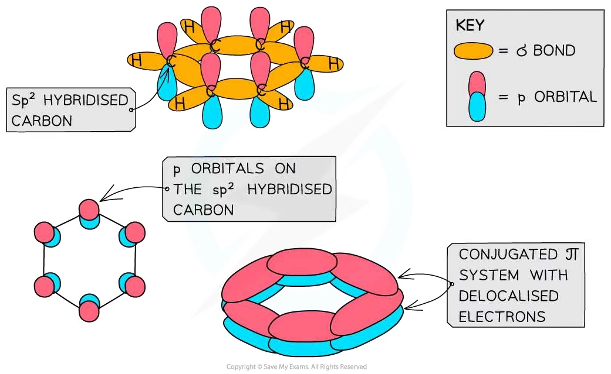{.concept-figure fig-alt="Sigma bonds, pi bonds and delocalised electrons in an aromatic molecule"}
:::

## 29.4 Isomerism Optical

::: {.study-card}
### Chiral centres and enantiomers

A **chiral centre** is usually a carbon atom bonded to four different atoms or groups of atoms. A molecule containing a chiral centre can have two non-superimposable mirror images called **enantiomers**.

Enantiomers have the same structural formula and many of the same physical properties, but they rotate plane-polarised light in opposite directions. A substance that rotates plane-polarised light is **optically active**.

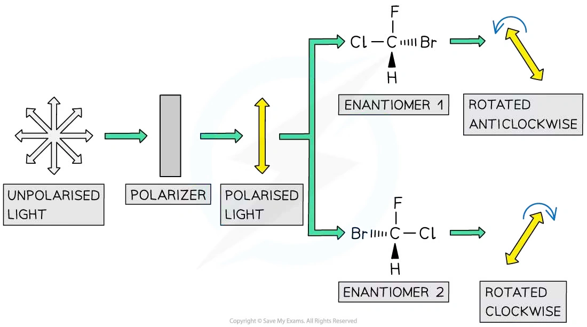{.concept-figure fig-alt="Chiral centre and non-superimposable enantiomers"}
:::

::: {.worked-example}
Worked example · Optical activity

### Why glycine is not optically active

**Glycine, cysteine and aspartic acid are amino acids. Identify the one that does not affect plane-polarised light and explain why.**

The answer is **glycine**. Its central carbon is attached to $\ce{NH2}$, $\ce{COOH}$, H and another H. Because two groups are identical, it is not attached to four different groups and is not a chiral centre. Glycine therefore has no pair of enantiomers and is not optically active.

:::

::: {.study-card}
### Plane-polarised light and racemic mixtures

An optical isomer rotates plane-polarised light clockwise or anticlockwise. A **racemic mixture** contains equal amounts of the two enantiomers. The equal and opposite rotations cancel, so the mixture has no net effect on plane-polarised light.

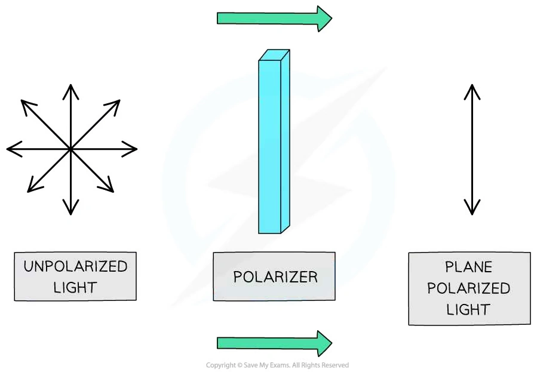{.concept-figure fig-alt="Production of plane-polarised light"}
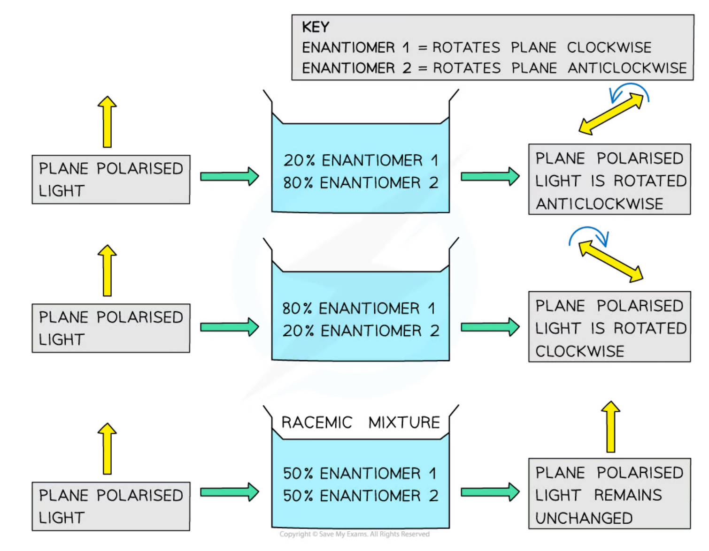{.concept-figure fig-alt="Optical activity and cancellation in a racemic mixture"}
:::

::: {.worked-example}
Worked example · Enantiomers and biology

### Why two limonene enantiomers smell different

**One limonene enantiomer smells of oranges and the other smells of lemons. Explain how receptors in the nose distinguish them.**

Each enantiomer has a specific three-dimensional shape. Olfactory receptors also have specific three-dimensional shapes and are stereospecific. One enantiomer fits one receptor more effectively, while its mirror image does not fit that receptor in the same way. Different receptor interactions produce different smell signals.

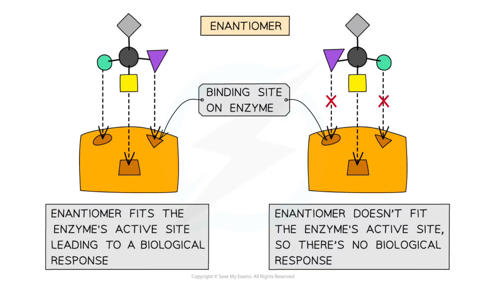{.concept-figure fig-alt="Stereospecific receptors distinguish enantiomers"}

:::

::: {.study-card}
### Optical isomerism in drug synthesis

Two enantiomers can have different biological activity because biological receptors and enzymes are themselves three-dimensional and chiral. Consequently, a racemic drug may contain one useful enantiomer and one less useful or unwanted enantiomer. The two enantiomers may need to be separated.

A **chiral catalyst** is used to favour formation of one enantiomer in a reaction. This can improve selectivity and reduce the amount of unwanted enantiomer. The main disadvantage is that chiral catalysts can be expensive and may require specialised preparation.

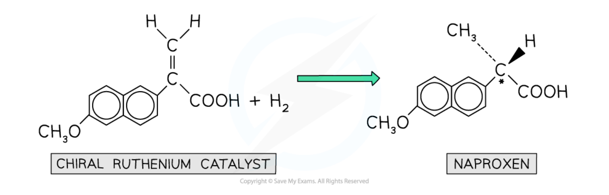{.concept-figure fig-alt="Chiral catalyst favouring one enantiomer in drug production"}
:::

::: {.worked-example}
Worked example · Chiral catalysts

### The purpose of a chiral catalyst

**State the purpose of a chiral catalyst in drug manufacture and give one advantage and one disadvantage.**

The purpose is to **produce predominantly one enantiomer** rather than an equal racemic mixture. An advantage is improved selectivity, so less unwanted enantiomer needs to be removed; a catalyst may also be used repeatedly. A disadvantage is that the catalyst may be expensive to make or use.

:::

## Chapter checklist

- [ ] 我能区分 general, structural, displayed 和 skeletal formula。
- [ ] 我能识别常见 functional groups，并给简单脂肪族和芳香族化合物命名。
- [ ] 我能正确使用 electrophilic substitution 与 addition–elimination。
- [ ] 我能用 $sp^2$ hybridisation、$\sigma$ bonds 和 delocalised $\pi$ system 解释 benzene 的平面结构与等长 C–C bonds。
- [ ] 我能定义 chiral centre、enantiomer、optically active 和 racemic mixture。
- [ ] 我能解释 enantiomers 在生物体系中可能有不同作用，并说明 chiral catalysts 的用途。

## Structured questions



### Original question PDFs

- [7.1 An Introduction to A Level Organic Chemistry - Easy](https://raw.githubusercontent.com/nanoxsj/CIE-Chemistry-Study/main/resources/original-papers/organic-chemistry/7.1-an-introduction-to-a-level-organic-chemistry-easy.pdf)
- [7.1 An Introduction to A Level Organic Chemistry - Medium](https://raw.githubusercontent.com/nanoxsj/CIE-Chemistry-Study/main/resources/original-papers/organic-chemistry/7.1-an-introduction-to-a-level-organic-chemistry-medium.pdf)
- [7.1 An Introduction to A Level Organic Chemistry - Hard](https://raw.githubusercontent.com/nanoxsj/CIE-Chemistry-Study/main/resources/original-papers/organic-chemistry/7.1-an-introduction-to-a-level-organic-chemistry-hard.pdf)
