### 3 Chemical bonding - Multiple Choice: Easy

::: {.mc-question #bonding-choice-easy-q1 data-answer="B"}
### Question 1 · Coordinate bonding · 1.3 Choice Easy Q1

Original question page · 1.3 Choice Easy Q1

{.question-figure fig-alt="Original question page 1.3 Choice Easy Q1"}

Phosphine, $\ce{PH3}$, reacts with a hydrogen ion to form $\ce{PH4+}$. Which type of bond is formed between P and H in this reaction?

<button class="mc-choice" data-choice="A"><strong>A</strong>Hydrogen bond</button><button class="mc-choice" data-choice="B"><strong>B</strong>Coordinate covalent bond</button><button class="mc-choice" data-choice="C"><strong>C</strong>Ionic bond</button><button class="mc-choice" data-choice="D"><strong>D</strong>Metallic bond</button>

<button class="check-answer">Check answer</button>

Show explanation

<strong>B.</strong> The lone pair on phosphorus is donated to the electron-deficient $\ce{H+}$ ion.

:::

::: {.mc-question #bonding-choice-easy-q2 data-answer="D"}
### Question 2 · Bonding in iodine and silver · 1.3 Choice Easy Q2

Original question page · 1.3 Choice Easy Q2

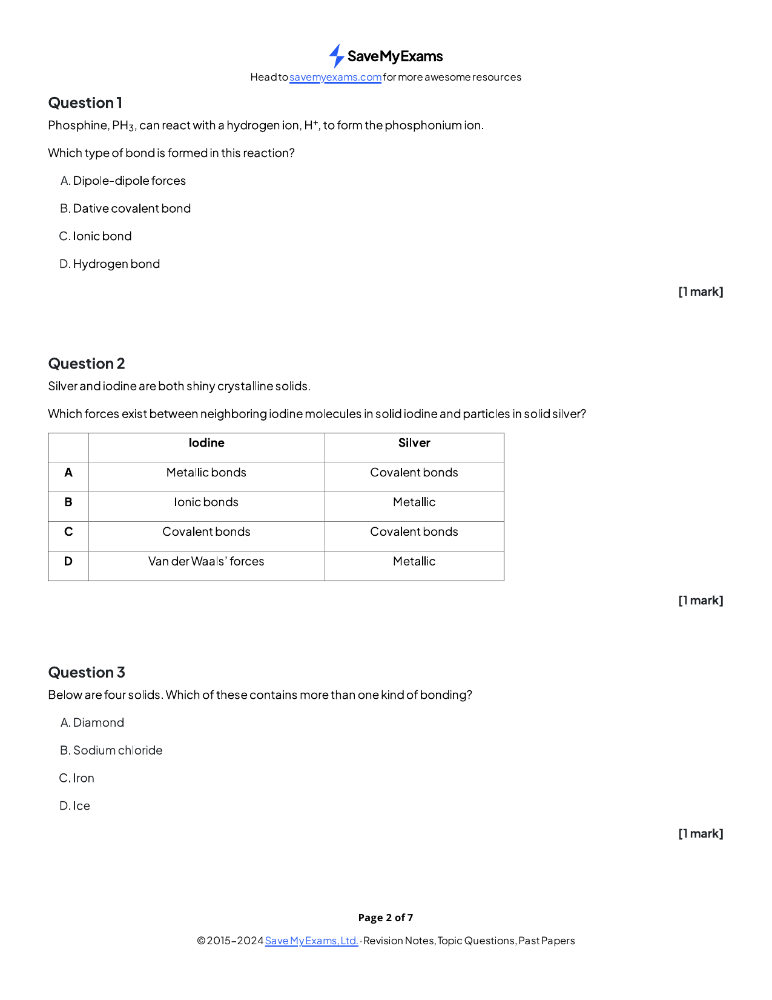{.question-figure fig-alt="Original question page 1.3 Choice Easy Q2"}

Which forces act between neighbouring iodine molecules in solid iodine and between particles in solid silver?

<button class="mc-choice" data-choice="A"><strong>A</strong>Metallic bonds; covalent bonds</button><button class="mc-choice" data-choice="B"><strong>B</strong>Ionic bonds; metallic bonds</button><button class="mc-choice" data-choice="C"><strong>C</strong>Covalent bonds; covalent bonds</button><button class="mc-choice" data-choice="D"><strong>D</strong>London dispersion forces; metallic bonds</button>

<button class="check-answer">Check answer</button>

Show explanation

<strong>D.</strong> $\ce{I2}$ molecules are held together by London forces; silver has a lattice of metal ions and delocalised electrons.

:::

::: {.mc-question #bonding-choice-easy-q3 data-answer="D"}
### Question 3 · More than one type of bonding · 1.3 Choice Easy Q3

Original question page · 1.3 Choice Easy Q3

{.question-figure fig-alt="Original question page 1.3 Choice Easy Q3"}

Which solid contains more than one type of bonding?

<button class="mc-choice" data-choice="A"><strong>A</strong>Diamond</button><button class="mc-choice" data-choice="B"><strong>B</strong>Sodium chloride</button><button class="mc-choice" data-choice="C"><strong>C</strong>Iron</button><button class="mc-choice" data-choice="D"><strong>D</strong>Ice</button>

<button class="check-answer">Check answer</button>

Show explanation

<strong>D.</strong> Ice contains covalent bonds within water molecules and hydrogen bonds between molecules.

:::

::: {.mc-question #bonding-choice-easy-q4 data-answer="B"}
### Question 4 · Shape of hydrazine · 1.3 Choice Easy Q4

Original question page · 1.3 Choice Easy Q4

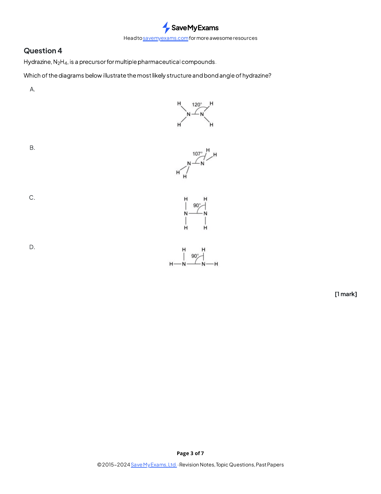{.question-figure fig-alt="Original question page 1.3 Choice Easy Q4"}

What is the shape around each nitrogen atom in hydrazine, $\ce{N2H4}$?

<button class="mc-choice" data-choice="A"><strong>A</strong>Trigonal planar, $120^\circ$</button><button class="mc-choice" data-choice="B"><strong>B</strong>Trigonal pyramidal, about $107^\circ$</button><button class="mc-choice" data-choice="C"><strong>C</strong>Linear, $180^\circ$</button><button class="mc-choice" data-choice="D"><strong>D</strong>Square planar, $90^\circ$</button>

<button class="check-answer">Check answer</button>

Show explanation

<strong>B.</strong> Each N has three bonding pairs and one lone pair. Lone-pair repulsion reduces the tetrahedral angle to about $107^\circ$.

:::

::: {.mc-question #bonding-choice-easy-q5 data-answer="C"}
### Question 5 · Bond dipoles · 1.3 Choice Easy Q5

Original question page · 1.3 Choice Easy Q5

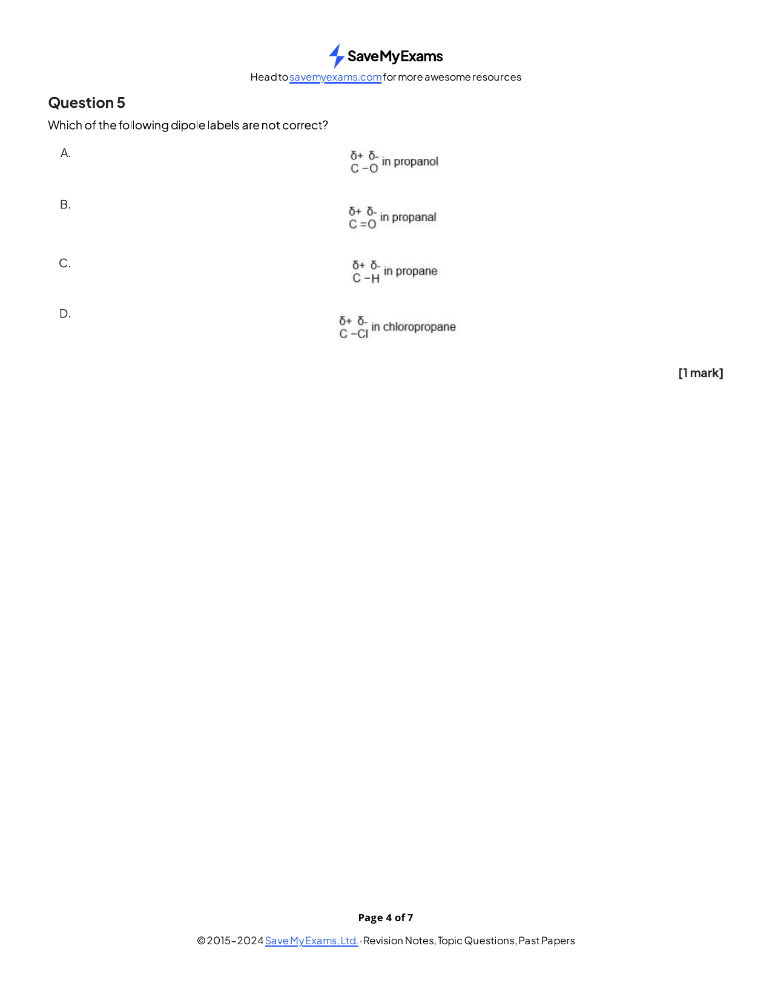{.question-figure fig-alt="Original question page 1.3 Choice Easy Q5"}

Which bond polarity assignment is not correct?

<button class="mc-choice" data-choice="A"><strong>A</strong>$\ce{C^{\delta+}-O^{\delta-}}$ in propanol</button><button class="mc-choice" data-choice="B"><strong>B</strong>$\ce{C^{\delta+}=O^{\delta-}}$ in propanal</button><button class="mc-choice" data-choice="C"><strong>C</strong>$\ce{C^{\delta+}-H^{\delta-}}$ in propane</button><button class="mc-choice" data-choice="D"><strong>D</strong>$\ce{C^{\delta+}-Cl^{\delta-}}$ in chloropropane</button>

<button class="check-answer">Check answer</button>

Show explanation

<strong>C.</strong> Carbon is slightly more electronegative than hydrogen, so the C--H bond is treated as approximately non-polar rather than with H as $\delta-$.

:::

::: {.mc-question #bonding-choice-easy-q6 data-answer="B"}
### Question 6 · Formation of ammonium · 1.3 Choice Easy Q6

Original question page · 1.3 Choice Easy Q6

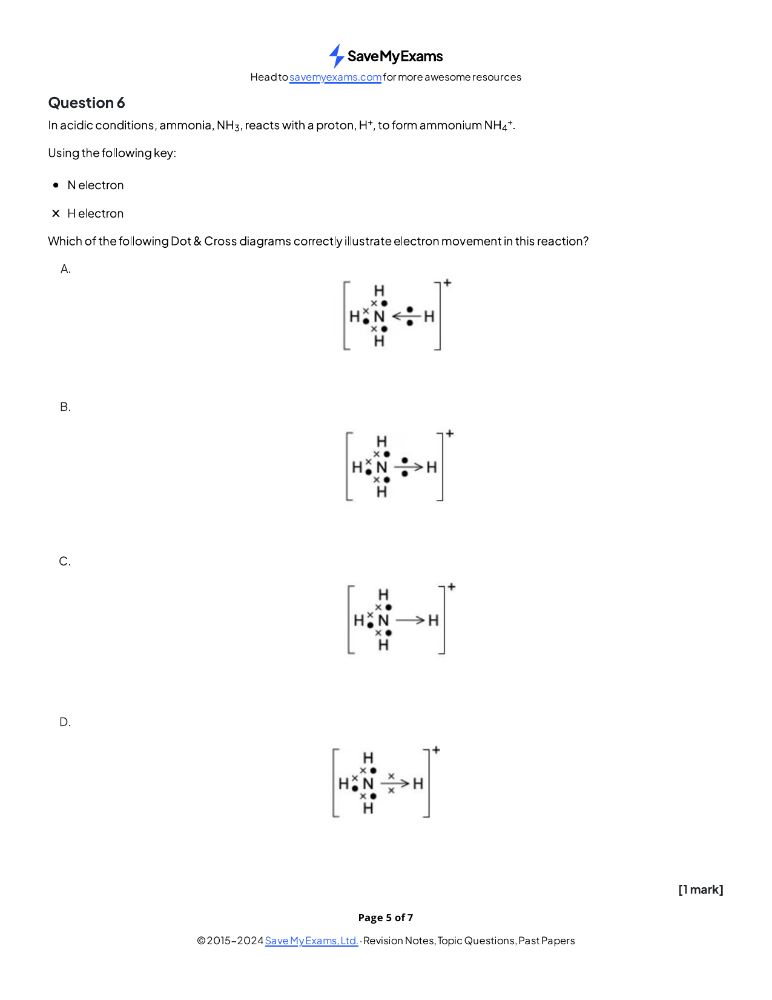{.question-figure fig-alt="Original question page 1.3 Choice Easy Q6"}

Which statement correctly describes the formation of $\ce{NH4+}$ from $\ce{NH3}$ and $\ce{H+}$?

<button class="mc-choice" data-choice="A"><strong>A</strong>Hydrogen donates one electron to nitrogen.</button><button class="mc-choice" data-choice="B"><strong>B</strong>Nitrogen donates its lone pair to hydrogen.</button><button class="mc-choice" data-choice="C"><strong>C</strong>Four electrons are transferred from nitrogen to hydrogen.</button><button class="mc-choice" data-choice="D"><strong>D</strong>The hydrogen ion supplies a lone pair.</button>

<button class="check-answer">Check answer</button>

Show explanation

<strong>B.</strong> The N lone pair forms the fourth N--H coordinate bond.

:::

::: {.mc-question #bonding-choice-easy-q7 data-answer="C"}
### Question 7 · Shapes of boron compounds · 1.3 Choice Easy Q7

Original question page · 1.3 Choice Easy Q7

{.question-figure fig-alt="Original question page 1.3 Choice Easy Q7"}

What are the shapes around boron in $\ce{BF3}$ and $\ce{BH4-}$?

<button class="mc-choice" data-choice="A"><strong>A</strong>Pyramidal; tetrahedral</button><button class="mc-choice" data-choice="B"><strong>B</strong>Pyramidal; square planar</button><button class="mc-choice" data-choice="C"><strong>C</strong>Trigonal planar; tetrahedral</button><button class="mc-choice" data-choice="D"><strong>D</strong>Trigonal planar; square planar</button>

<button class="check-answer">Check answer</button>

Show explanation

<strong>C.</strong> $\ce{BF3}$ has three bonding pairs; $\ce{BH4-}$ has four.

:::

::: {.mc-question #bonding-choice-easy-q8 data-answer="A"}
### Question 8 · Electronegativity trend · 1.3 Choice Easy Q8

Original question page · 1.3 Choice Easy Q8

{.question-figure fig-alt="Original question page 1.3 Choice Easy Q8"}

Which atom is most electronegative?

<button class="mc-choice" data-choice="A"><strong>A</strong>Cl</button><button class="mc-choice" data-choice="B"><strong>B</strong>Mg</button><button class="mc-choice" data-choice="C"><strong>C</strong>Br</button><button class="mc-choice" data-choice="D"><strong>D</strong>Na</button>

<button class="check-answer">Check answer</button>

Show explanation

<strong>A.</strong> Electronegativity decreases down Group 17, so chlorine is more electronegative than bromine.

:::

::: {.mc-question #bonding-choice-easy-q9 data-answer="B"}
### Question 9 · Ionic or covalent · 1.3 Choice Easy Q9

Original question page · 1.3 Choice Easy Q9

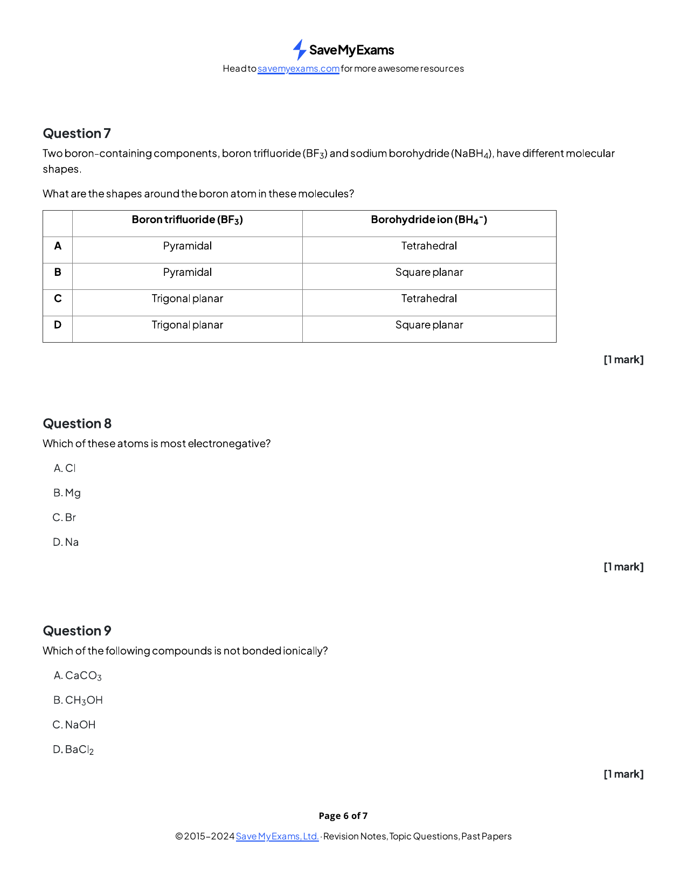{.question-figure fig-alt="Original question page 1.3 Choice Easy Q9"}

Which compound is not an ionic compound?

<button class="mc-choice" data-choice="A"><strong>A</strong>$\ce{CaCO3}$</button><button class="mc-choice" data-choice="B"><strong>B</strong>$\ce{CH3OH}$</button><button class="mc-choice" data-choice="C"><strong>C</strong>$\ce{NaOH}$</button><button class="mc-choice" data-choice="D"><strong>D</strong>$\ce{BaCl2}$</button>

<button class="check-answer">Check answer</button>

Show explanation

<strong>B.</strong> Methanol is a molecular covalent substance. The other compounds contain ions, even though carbonate or hydroxide also contain covalent bonds internally.

:::

::: {.mc-question #bonding-choice-easy-q10 data-answer="D"}
### Question 10 · Metallic bonding definition · 1.3 Choice Easy Q10

Original question page · 1.3 Choice Easy Q10

{.question-figure fig-alt="Original question page 1.3 Choice Easy Q10"}

Which statement describes metallic bonding?

<button class="mc-choice" data-choice="A"><strong>A</strong>Attraction between oppositely charged ions</button><button class="mc-choice" data-choice="B"><strong>B</strong>Attraction between permanent molecular dipoles</button><button class="mc-choice" data-choice="C"><strong>C</strong>Attraction between shared pairs and two nuclei only</button><button class="mc-choice" data-choice="D"><strong>D</strong>Attraction between positive metal ions and delocalised electrons</button>

<button class="check-answer">Check answer</button>

Show explanation

<strong>D.</strong> This is the definition of metallic bonding.

:::

::: {.mc-question #bonding-choice-easy-q11 data-answer="B"}
### Question 11 · Number of bonding types · 1.3 Choice Easy Q11

Original question page · 1.3 Choice Easy Q11

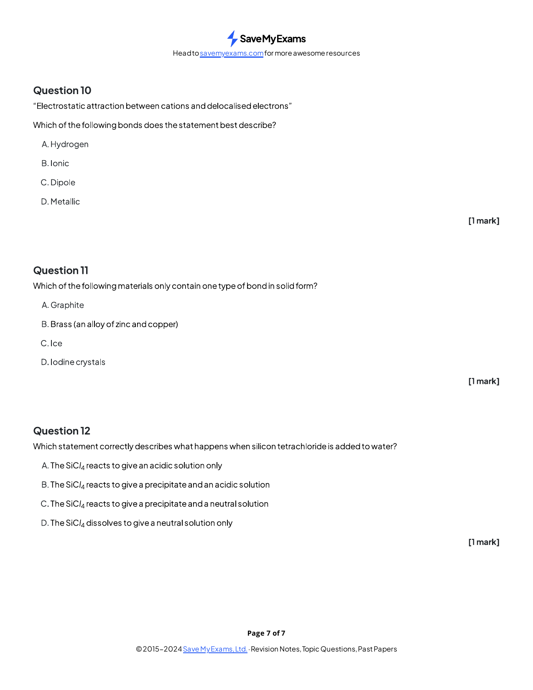{.question-figure fig-alt="Original question page 1.3 Choice Easy Q11"}

Which material contains only one main type of bonding in its solid structure?

<button class="mc-choice" data-choice="A"><strong>A</strong>Graphite</button><button class="mc-choice" data-choice="B"><strong>B</strong>Brass</button><button class="mc-choice" data-choice="C"><strong>C</strong>Ice</button><button class="mc-choice" data-choice="D"><strong>D</strong>Iodine crystals</button>

<button class="check-answer">Check answer</button>

Show explanation

<strong>B.</strong> Brass is an alloy with metallic bonding. Graphite, ice and iodine have bonding within particles plus intermolecular attractions.

:::

::: {.mc-question #bonding-choice-easy-q12 data-answer="B"}
### Question 12 · Hydrolysis of silicon tetrachloride · 1.3 Choice Easy Q12

Original question page · 1.3 Choice Easy Q12

{.question-figure fig-alt="Original question page 1.3 Choice Easy Q12"}

What happens when $\ce{SiCl4}$ is added to water?

<button class="mc-choice" data-choice="A"><strong>A</strong>It reacts to give only an acidic solution.</button><button class="mc-choice" data-choice="B"><strong>B</strong>It reacts to give a precipitate and an acidic solution.</button><button class="mc-choice" data-choice="C"><strong>C</strong>It reacts to give a precipitate and a neutral solution.</button><button class="mc-choice" data-choice="D"><strong>D</strong>It dissolves to give only a neutral solution.</button>

<button class="check-answer">Check answer</button>

Show explanation

<strong>B.</strong> Hydrolysis forms solid $\ce{SiO2}$ and hydrochloric acid.

:::

### 3 Chemical bonding - Multiple Choice: Medium

::: {.mc-question #bonding-choice-medium-q1 data-answer="C"}
### Question 15 · Equilibrium and molecular shape · 1.3 Choice Medium Q1

Original question page · 1.3 Choice Medium Q1

{.question-figure fig-alt="Original question page 1.3 Choice Medium Q1"}

For $\ce{PCl5(g) <=> PCl3(g) + Cl2(g)}$, the percentage yield of $\ce{PCl3}$ increases from 13% at $160^\circ\mathrm{C}$ to 100% at $300^\circ\mathrm{C}$. What is correct?

<button class="mc-choice" data-choice="A"><strong>A</strong>The reaction is exothermic; $\ce{PCl3}$ is pyramidal.</button><button class="mc-choice" data-choice="B"><strong>B</strong>The reaction is exothermic; $\ce{PCl3}$ is trigonal planar.</button><button class="mc-choice" data-choice="C"><strong>C</strong>The reaction is endothermic; $\ce{PCl3}$ is pyramidal.</button><button class="mc-choice" data-choice="D"><strong>D</strong>The reaction is endothermic; $\ce{PCl3}$ is trigonal planar.</button>

<button class="check-answer">Check answer</button>

Show explanation

<strong>C.</strong> Higher temperature favours the endothermic forward reaction. $\ce{PCl3}$ has three bonds and one lone pair, giving a pyramidal shape.

:::

::: {.mc-question #bonding-choice-medium-q2 data-answer="C"}
### Question 16 · Bonding in nitrogen · 1.3 Choice Medium Q2

Original question page · 1.3 Choice Medium Q2

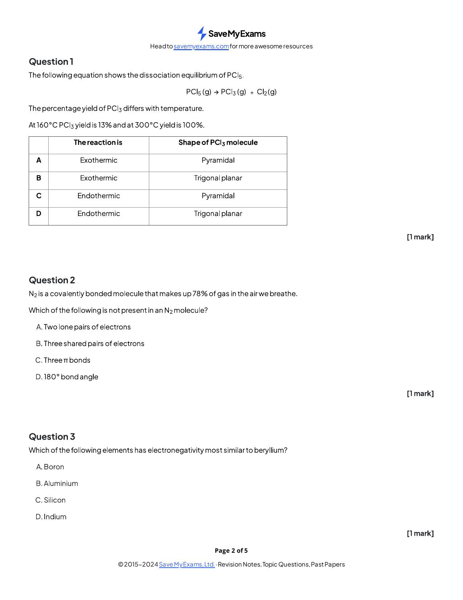{.question-figure fig-alt="Original question page 1.3 Choice Medium Q2"}

Which feature is not present in a nitrogen molecule, $\ce{N2}$?

<button class="mc-choice" data-choice="A"><strong>A</strong>Two lone pairs in total</button><button class="mc-choice" data-choice="B"><strong>B</strong>Three shared electron pairs</button><button class="mc-choice" data-choice="C"><strong>C</strong>Three $\pi$ bonds</button><button class="mc-choice" data-choice="D"><strong>D</strong>A bond angle of $180^\circ$</button>

<button class="check-answer">Check answer</button>

Show explanation

<strong>C.</strong> A triple bond contains one $\sigma$ bond and two $\pi$ bonds.

:::

::: {.mc-question #bonding-choice-medium-q4 data-answer="B"}
### Question 18 · Lone pairs on a central atom · 1.3 Choice Medium Q4

Original question page · 1.3 Choice Medium Q4

{.question-figure fig-alt="Original question page 1.3 Choice Medium Q4"}

Which ion has three lone pairs around its central atom?

<button class="mc-choice" data-choice="A"><strong>A</strong>$\ce{PF6-}$</button><button class="mc-choice" data-choice="B"><strong>B</strong>$\ce{ClF2-}$</button><button class="mc-choice" data-choice="C"><strong>C</strong>$\ce{BF4-}$</button><button class="mc-choice" data-choice="D"><strong>D</strong>$\ce{SF6}$</button>

<button class="check-answer">Check answer</button>

Show explanation

<strong>B.</strong> In $\ce{ClF2-}$, chlorine has two bonding pairs and three lone pairs.

:::

::: {.mc-question #bonding-choice-medium-q5 data-answer="B"}
### Question 19 · London forces only · 1.3 Choice Medium Q5

Original question page · 1.3 Choice Medium Q5

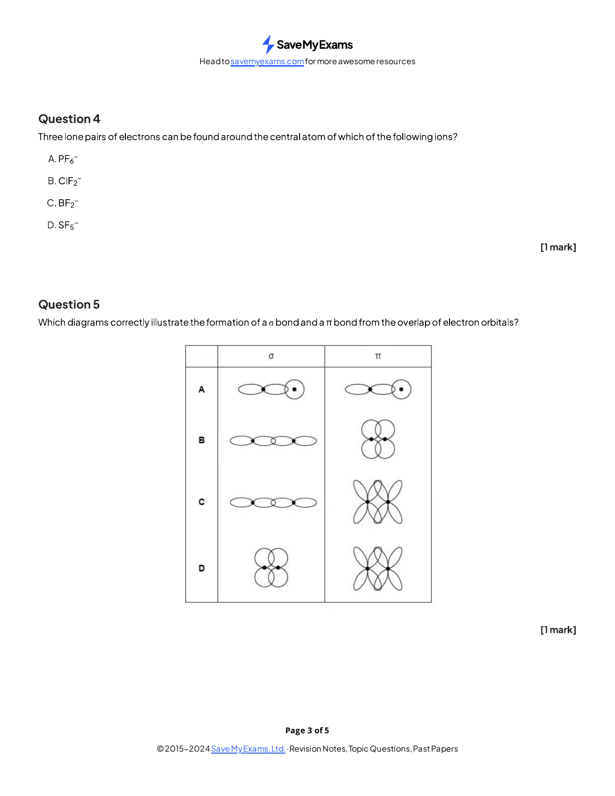{.question-figure fig-alt="Original question page 1.3 Choice Medium Q5"}

Which change of state involves overcoming only London dispersion forces?

<button class="mc-choice" data-choice="A"><strong>A</strong>$\ce{C3H6(l) -> C3H6(s)}$</button><button class="mc-choice" data-choice="B"><strong>B</strong>$\ce{CO2(l) -> CO2(g)}$</button><button class="mc-choice" data-choice="C"><strong>C</strong>$\ce{H2O(s) -> H2O(l)}$</button><button class="mc-choice" data-choice="D"><strong>D</strong>$\ce{C2H5OH(l) -> C2H5OH(g)}$</button>

<button class="check-answer">Check answer</button>

Show explanation

<strong>B.</strong> Carbon dioxide is non-polar and has no permanent dipole or hydrogen bonding.

:::

::: {.mc-question #bonding-choice-medium-q6 data-answer="C"}
### Question 20 · Cyanate ion · 1.3 Choice Medium Q6

Original question page · 1.3 Choice Medium Q6

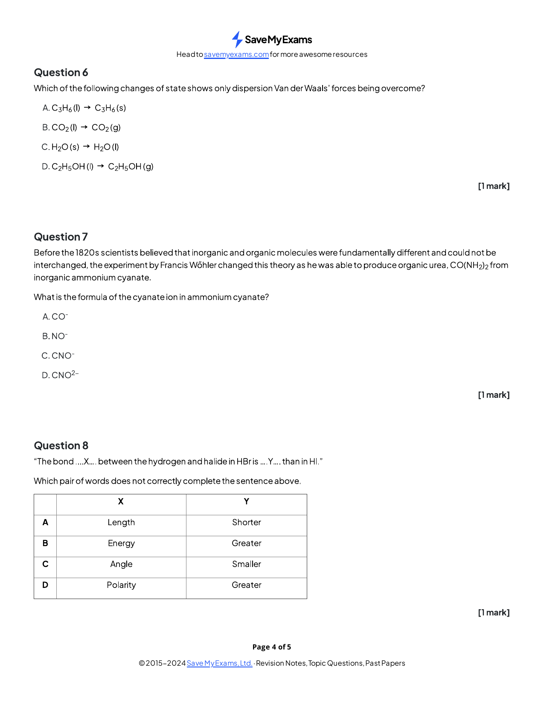{.question-figure fig-alt="Original question page 1.3 Choice Medium Q6"}

What is the formula of the cyanate ion in ammonium cyanate?

<button class="mc-choice" data-choice="A"><strong>A</strong>$\ce{CO-}$</button><button class="mc-choice" data-choice="B"><strong>B</strong>$\ce{NO-}$</button><button class="mc-choice" data-choice="C"><strong>C</strong>$\ce{CNO-}$</button><button class="mc-choice" data-choice="D"><strong>D</strong>$\ce{CNO2-}$</button>

<button class="check-answer">Check answer</button>

Show explanation

<strong>C.</strong> Ammonium cyanate is $\ce{NH4OCN}$ and contains the cyanate ion $\ce{OCN-}$, written here as $\ce{CNO-}$.

:::

::: {.mc-question #bonding-choice-medium-q7 data-answer="C"}
### Question 21 · Bond comparison in hydrogen halides · 1.3 Choice Medium Q7

Original question page · 1.3 Choice Medium Q7

{.question-figure fig-alt="Original question page 1.3 Choice Medium Q7"}

Which pair of words does not correctly complete the statement: “The bond ___ between H and the halogen in HBr is ___ than in HI”?

<button class="mc-choice" data-choice="A"><strong>A</strong>length; shorter</button><button class="mc-choice" data-choice="B"><strong>B</strong>energy; greater</button><button class="mc-choice" data-choice="C"><strong>C</strong>angle; smaller</button><button class="mc-choice" data-choice="D"><strong>D</strong>polarity; greater</button>

<button class="check-answer">Check answer</button>

Show explanation

<strong>C.</strong> Hydrogen halides are diatomic, so a bond angle is not defined.

:::

::: {.mc-question #bonding-choice-medium-q9 data-answer="B"}
### Question 23 · Sigma and pi bonds · 1.3 Choice Medium Q9

Original question page · 1.3 Choice Medium Q9

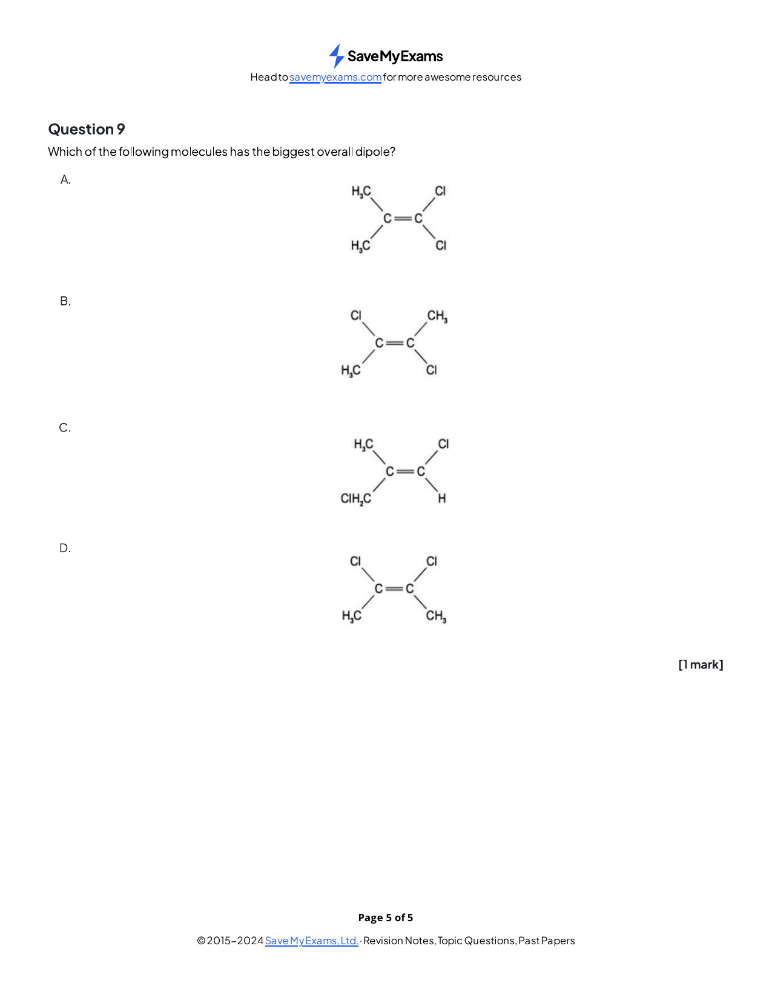{.question-figure fig-alt="Original question page 1.3 Choice Medium Q9"}

How many $\sigma$ and $\pi$ bonds are in ethene, $\ce{C2H4}$?

<button class="mc-choice" data-choice="A"><strong>A</strong>4 $\sigma$, 1 $\pi$</button><button class="mc-choice" data-choice="B"><strong>B</strong>5 $\sigma$, 1 $\pi$</button><button class="mc-choice" data-choice="C"><strong>C</strong>5 $\sigma$, 2 $\pi$</button><button class="mc-choice" data-choice="D"><strong>D</strong>6 $\sigma$, 1 $\pi$</button>

<button class="check-answer">Check answer</button>

Show explanation

<strong>B.</strong> There are four C--H $\sigma$ bonds and one C--C $\sigma$ bond, plus one C--C $\pi$ bond.

:::

### 3 Chemical bonding - Multiple Choice: Hard

::: {.mc-question #bonding-choice-hard-q1 data-answer="B"}
### Question 28 · Hydrogen bonding with methanal · 1.3 Choice Hard Q1

Original question page · 1.3 Choice Hard Q1

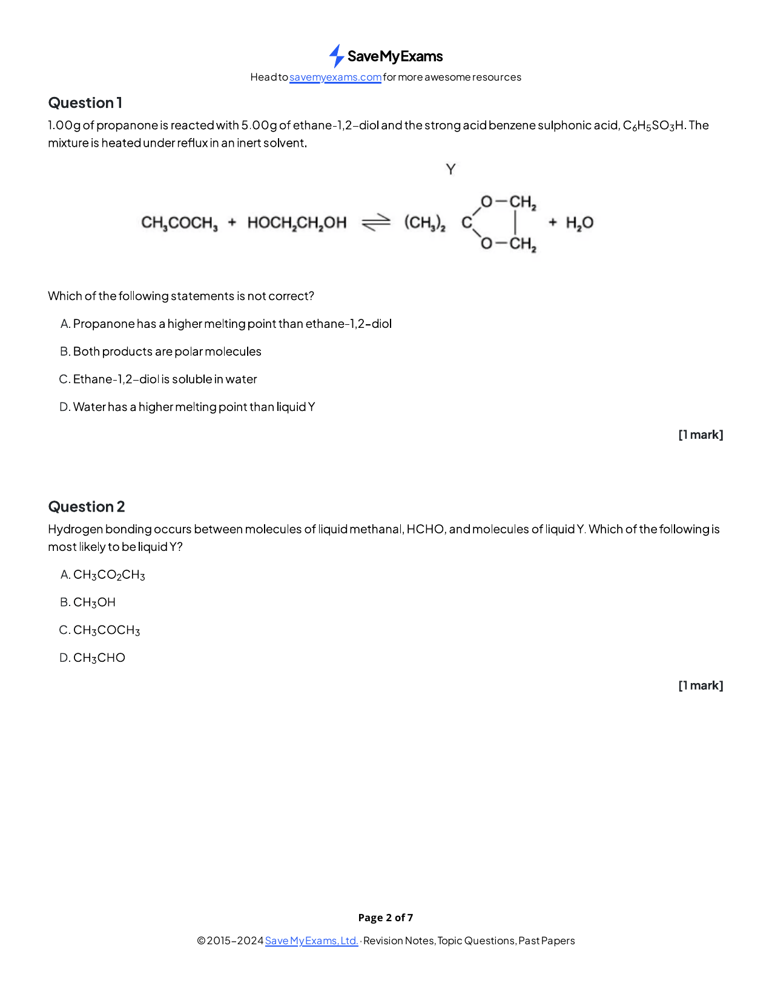{.question-figure fig-alt="Original question page 1.3 Choice Hard Q1"}

Hydrogen bonding occurs between liquid methanal, $\ce{HCHO}$, and a second liquid $Y$. Which substance is most likely to be $Y$?

<button class="mc-choice" data-choice="A"><strong>A</strong>$\ce{CH3CO2CH3}$</button><button class="mc-choice" data-choice="B"><strong>B</strong>$\ce{CH3OH}$</button><button class="mc-choice" data-choice="C"><strong>C</strong>$\ce{CH3COCH3}$</button><button class="mc-choice" data-choice="D"><strong>D</strong>$\ce{CH3CHO}$</button>

<button class="check-answer">Check answer</button>

Show explanation

<strong>B.</strong> Methanol has an O--H hydrogen-bond donor and oxygen lone pairs; the carbonyl oxygen of methanal can accept the hydrogen bond.

:::

::: {.mc-question #bonding-choice-hard-q2 data-answer="C"}
### Question 29 · Bond energy down a group · 1.3 Choice Hard Q2

Original question page · 1.3 Choice Hard Q2

{.question-figure fig-alt="Original question page 1.3 Choice Hard Q2"}

Why does the rate of hydrolysis of $\ce{R-Cl}$, $\ce{R-Br}$ and $\ce{R-I}$ generally increase from chlorine to iodine?

<button class="mc-choice" data-choice="A"><strong>A</strong>The first ionisation energy of the halogen increases.</button><button class="mc-choice" data-choice="B"><strong>B</strong>The silver halide solubility increases from chloride to iodide.</button><button class="mc-choice" data-choice="C"><strong>C</strong>The R--X bond energy decreases from R--Cl to R--I.</button><button class="mc-choice" data-choice="D"><strong>D</strong>The R--X bond polarity increases from R--Cl to R--I.</button>

<button class="check-answer">Check answer</button>

Show explanation

<strong>C.</strong> The larger iodine atom forms a longer, weaker R--I bond that breaks more readily.

:::

::: {.mc-question #bonding-choice-hard-q3 data-answer="A"}
### Question 30 · Electronegativity and covalent bonding · 1.3 Choice Hard Q3

Original question page · 1.3 Choice Hard Q3

{.question-figure fig-alt="Original question page 1.3 Choice Hard Q3"}

Which atom is most likely to form a covalent bond with fluorine rather than an ionic bond, based on the smallest electronegativity difference?

<button class="mc-choice" data-choice="A"><strong>A</strong>H, $\chi=2.20$</button><button class="mc-choice" data-choice="B"><strong>B</strong>Cu, $\chi=1.95$</button><button class="mc-choice" data-choice="C"><strong>C</strong>Mg, $\chi=1.30$</button><button class="mc-choice" data-choice="D"><strong>D</strong>K, $\chi=0.82$</button>

<button class="check-answer">Check answer</button>

Show explanation

<strong>A.</strong> Hydrogen has the closest electronegativity to fluorine among the options, so the H--F bond is covalent and strongly polar.

:::

::: {.mc-question #bonding-choice-hard-q4 data-answer="D"}
### Question 31 · Dipoles in molecules · 1.3 Choice Hard Q4

Original question page · 1.3 Choice Hard Q4

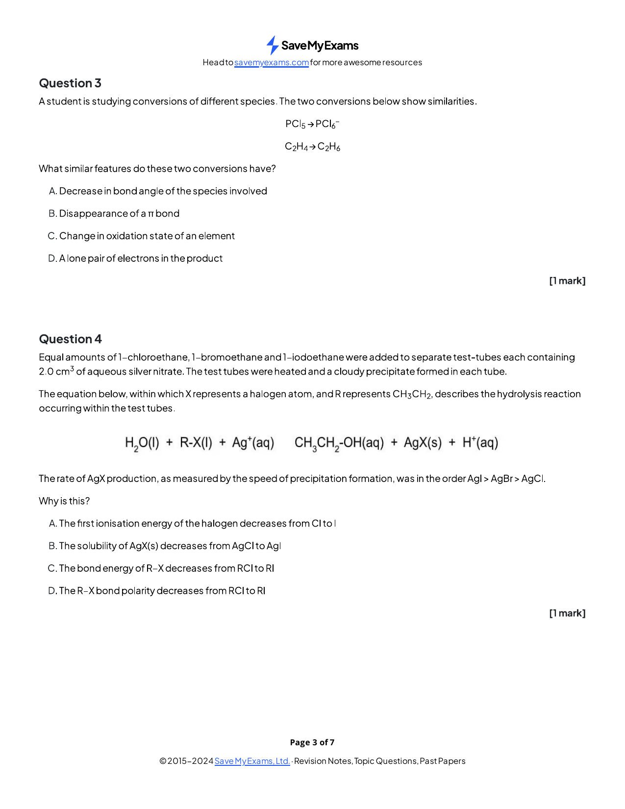{.question-figure fig-alt="Original question page 1.3 Choice Hard Q4"}

Which description of dipoles in $\ce{CHCl3}$ and $\ce{Br2}$ is correct?

<button class="mc-choice" data-choice="A"><strong>A</strong>Induced only in both molecules</button><button class="mc-choice" data-choice="B"><strong>B</strong>Induced only in $\ce{CHCl3}$; induced and permanent in $\ce{Br2}$</button><button class="mc-choice" data-choice="C"><strong>C</strong>Induced and permanent in both</button><button class="mc-choice" data-choice="D"><strong>D</strong>Induced and permanent in $\ce{CHCl3}$; induced only in $\ce{Br2}$</button>

<button class="check-answer">Check answer</button>

Show explanation

<strong>D.</strong> $\ce{CHCl3}$ is polar, while symmetrical $\ce{Br2}$ is non-polar but still has temporary dipoles.

:::

::: {.mc-question #bonding-choice-hard-q5 data-answer="C"}
### Question 32 · Ionic lattice and bonding types · 1.3 Choice Hard Q5

Original question page · 1.3 Choice Hard Q5

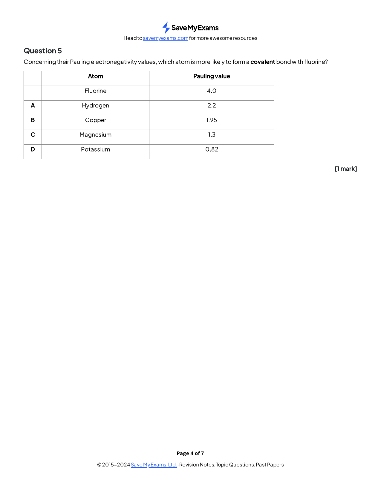{.question-figure fig-alt="Original question page 1.3 Choice Hard Q5"}

Hydroxyapatite contains calcium, hydroxide and phosphate ions. Which statement is correct?

<button class="mc-choice" data-choice="A"><strong>A</strong>It contains only metallic bonding.</button><button class="mc-choice" data-choice="B"><strong>B</strong>Strontium forms covalent bonds with phosphate ions.</button><button class="mc-choice" data-choice="C"><strong>C</strong>Strontium ions are similar enough in size to replace calcium ions in the lattice.</button><button class="mc-choice" data-choice="D"><strong>D</strong>Phosphate ions are held together by metallic bonding.</button>

<button class="check-answer">Check answer</button>

Show explanation

<strong>C.</strong> Similar-sized ions can occupy similar lattice sites; the bonding between calcium/strontium ions and anions is ionic.

:::

::: {.mc-question #bonding-choice-hard-q6 data-answer="A"}
### Question 33 · Conductivity and lattice structure · 1.3 Choice Hard Q6

Original question page · 1.3 Choice Hard Q6

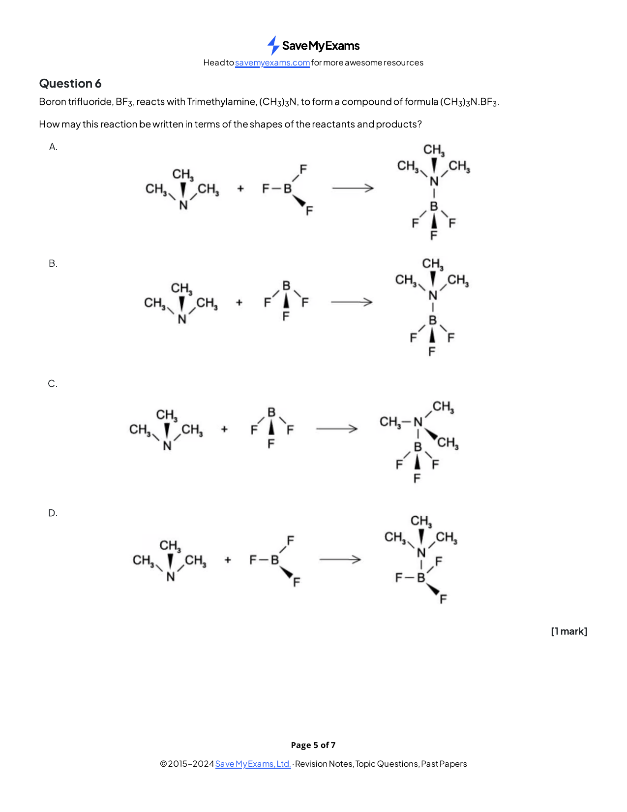{.question-figure fig-alt="Original question page 1.3 Choice Hard Q6"}

Which substance is expected to have a high melting point and conduct electricity when molten but not when solid?

<button class="mc-choice" data-choice="A"><strong>A</strong>A giant ionic compound</button><button class="mc-choice" data-choice="B"><strong>B</strong>A simple molecular compound</button><button class="mc-choice" data-choice="C"><strong>C</strong>A noble gas</button><button class="mc-choice" data-choice="D"><strong>D</strong>A molecular non-polar liquid</button>

<button class="check-answer">Check answer</button>

Show explanation

<strong>A.</strong> Strong ionic attractions give a high melting point; mobile ions in the molten state carry charge.

:::

::: {.mc-question #bonding-choice-hard-q7 data-answer="D"}
### Question 34 · Expanded electron-pair arrangement · 1.3 Choice Hard Q7

Original question page · 1.3 Choice Hard Q7

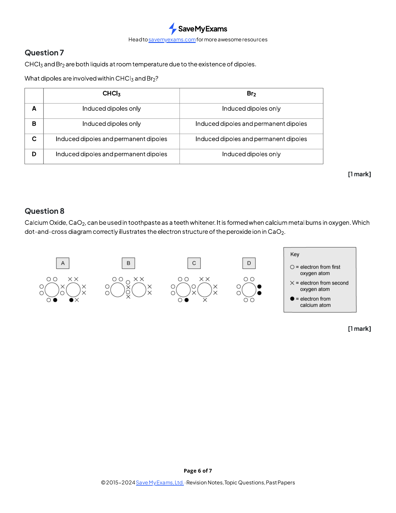{.question-figure fig-alt="Original question page 1.3 Choice Hard Q7"}

What is the shape of $\ce{PF6-}$?

<button class="mc-choice" data-choice="A"><strong>A</strong>Tetrahedral</button><button class="mc-choice" data-choice="B"><strong>B</strong>Trigonal pyramidal</button><button class="mc-choice" data-choice="C"><strong>C</strong>Trigonal bipyramidal</button><button class="mc-choice" data-choice="D"><strong>D</strong>Octahedral</button>

<button class="check-answer">Check answer</button>

Show explanation

<strong>D.</strong> Six bonding pairs around phosphorus repel to an octahedral arrangement.

:::

::: {.mc-question #bonding-choice-hard-q8 data-answer="B"}
### Question 35 · Hydrogenation of an alkene · 1.3 Choice Hard Q8

Original question page · 1.3 Choice Hard Q8

{.question-figure fig-alt="Original question page 1.3 Choice Hard Q8"}

Which feature disappears when $\ce{C2H4}$ is converted to $\ce{C2H6}$ by hydrogenation?

<button class="mc-choice" data-choice="A"><strong>A</strong>The C--C $\sigma$ bond</button><button class="mc-choice" data-choice="B"><strong>B</strong>The C--C $\pi$ bond</button><button class="mc-choice" data-choice="C"><strong>C</strong>All C--H $\sigma$ bonds</button><button class="mc-choice" data-choice="D"><strong>D</strong>All electron pairs on carbon</button>

<button class="check-answer">Check answer</button>

Show explanation

<strong>B.</strong> Hydrogen adds across the double bond, converting the $\pi$ component into two new C--H bonds.

:::

::: {.mc-question #bonding-choice-hard-q9 data-answer="B"}
### Question 36 · Overall dipole and symmetry · 1.3 Choice Hard Q9

Original question page · 1.3 Choice Hard Q9

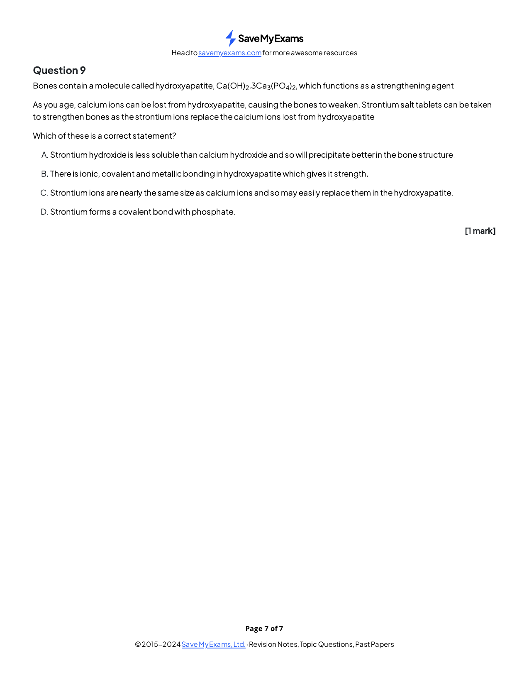{.question-figure fig-alt="Original question page 1.3 Choice Hard Q9"}

Which molecule has the largest overall dipole?

<button class="mc-choice" data-choice="A"><strong>A</strong>$\ce{CCl4}$</button><button class="mc-choice" data-choice="B"><strong>B</strong>$\ce{CH2Cl2}$</button><button class="mc-choice" data-choice="C"><strong>C</strong>$\ce{BF3}$</button><button class="mc-choice" data-choice="D"><strong>D</strong>$\ce{CO2}$</button>

<button class="check-answer">Check answer</button>

Show explanation

<strong>B.</strong> The tetrahedral $\ce{CH2Cl2}$ molecule is not symmetrical enough for its bond dipoles to cancel.

:::

