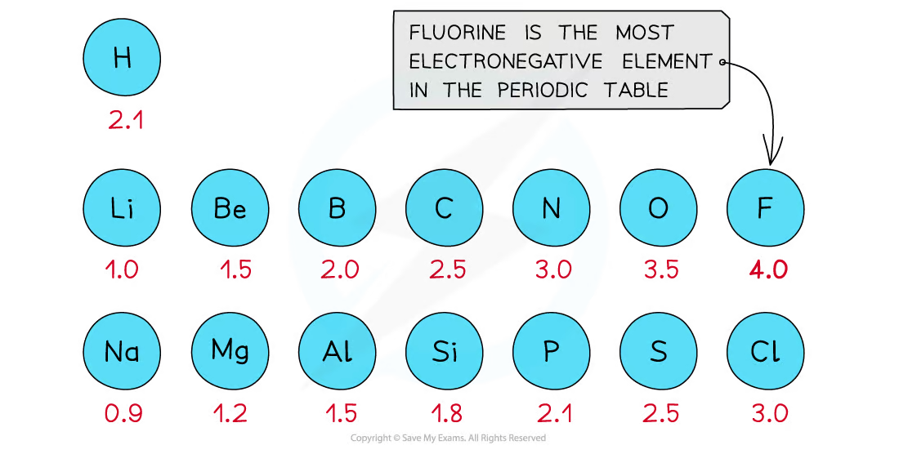
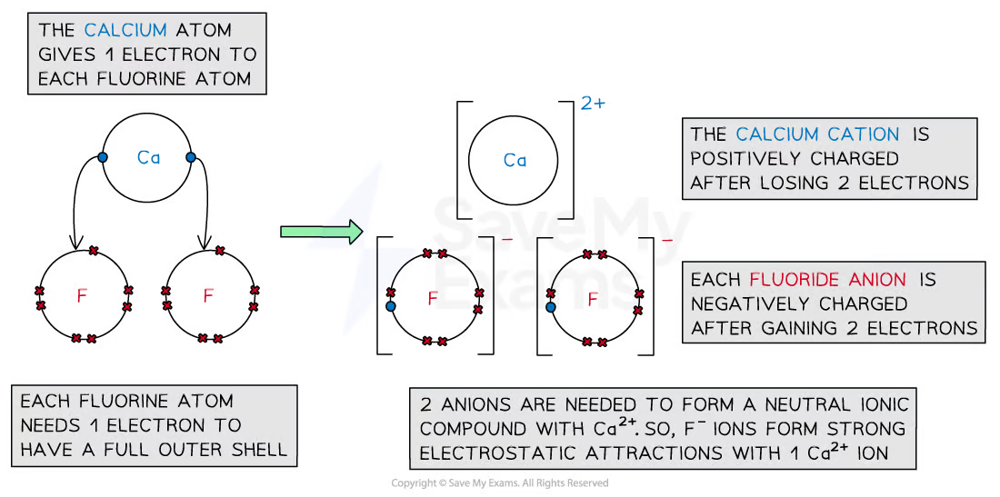
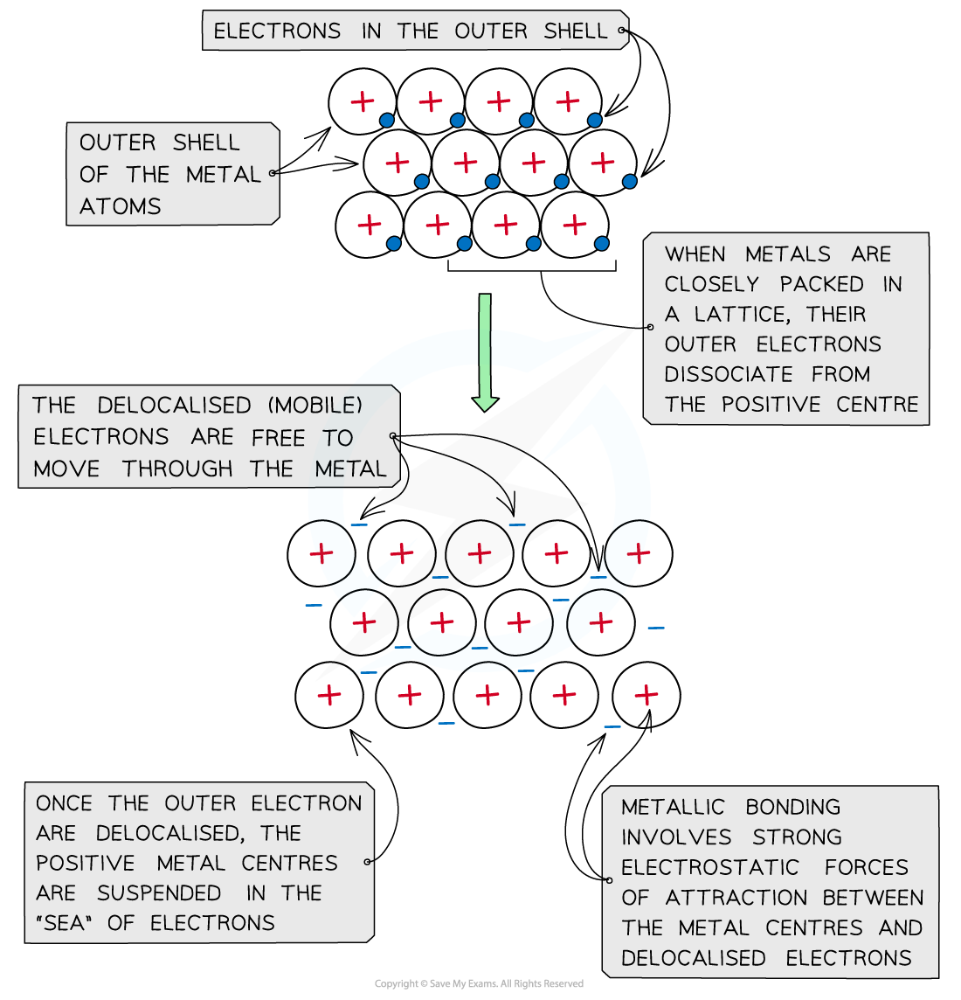
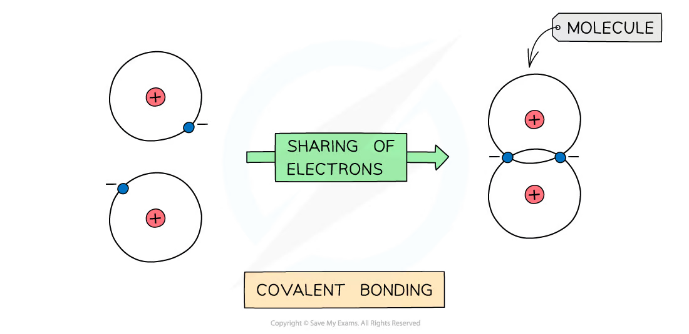
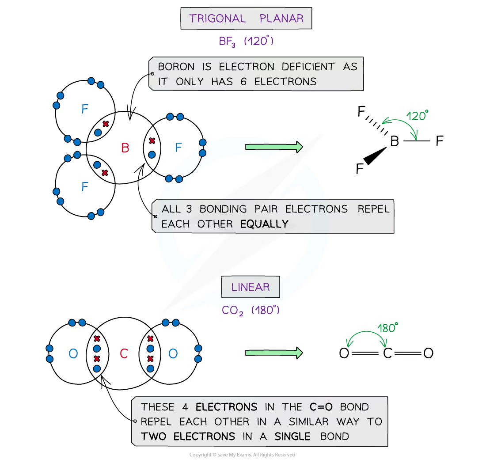
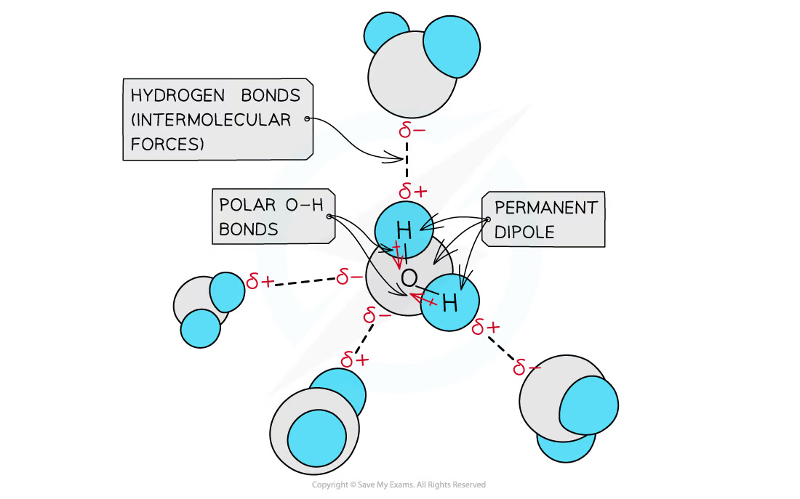
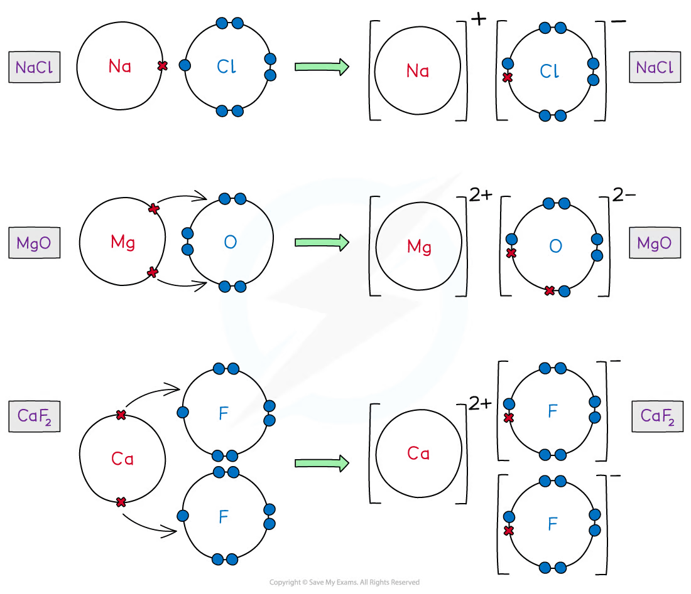

# 3 Chemical bonding

本章对应 CIE 9701 AS Chemistry 的 **Chemical bonding**。内容覆盖 electronegativity、ionic bonding、metallic bonding、covalent and coordinate bonding、shapes of molecules、intermolecular forces、bond properties 以及 dot-and-cross diagrams。

## Learning objectives

学完本章后，你应该能够：

- define electronegativity and explain trends across a period and down a group;
- describe ionic, metallic, covalent and coordinate bonding;
- explain how bonding and structure determine physical properties;
- draw dot-and-cross diagrams for atoms, ions, molecules and polyatomic ions;
- use electron-pair repulsion to predict molecular shapes and bond angles;
- distinguish sigma and pi bonds;
- explain London dispersion forces, permanent dipole forces and hydrogen bonding;
- relate bond polarity, bond length and bond energy to electronegativity and atomic size.

## Key ideas

- Bonding explains structure; structure explains melting point, conductivity, solubility and mechanical properties.
- A polar bond does not guarantee a polar molecule: draw the shape and decide whether bond dipoles cancel.
- A covalent bond is an intramolecular bond; London forces, permanent dipole forces and hydrogen bonds are intermolecular attractions.
- In an ionic lattice, greater ionic charge and smaller ionic radius generally give stronger electrostatic attraction.

## 3.1 Electronegativity - Bonding

::: {.study-card}
### Electronegativity

**Electronegativity** is the ability of an atom to attract the bonding pair of electrons in a covalent bond.

Across a period, electronegativity generally increases because nuclear charge increases while the bonding electrons remain in the same principal shell. Atomic radius decreases and the attraction for the bonding pair becomes stronger.

Down a group, electronegativity generally decreases because the bonding pair is further from the nucleus and more inner shells shield the nuclear charge.

Fluorine is the most electronegative element in the usual CIE scale. The noble gases are normally omitted because they do not commonly form covalent bonds in the AS syllabus.
:::

::: {.formula-panel}
### Bond polarity and dipoles

If two bonded atoms have different electronegativities, the bonding electrons are attracted more strongly to one atom. The more electronegative atom carries a partial negative charge, $\delta-$, and the other atom carries a partial positive charge, $\delta+$.

The C--H bond is treated as approximately non-polar at this level. C--O, C--F and C--Cl bonds are polar with the carbon atom as $\delta+$ and the more electronegative atom as $\delta-$.

Bond polarity is not the same as molecular polarity. A molecule can contain polar bonds but have no overall dipole if the bond dipoles cancel because of its symmetrical shape, as in $\ce{CO2}$.
:::

To decide molecular polarity, use this order: identify polar bonds, draw the 3-D shape, then add the bond dipoles as vectors. CO2, BF3 and CCl4 are symmetrical and non-polar overall; H2O, NH3 and CH2Cl2 have a net dipole.

{.concept-figure fig-alt="Electronegativity values across periods 2 and 3"}

## 3.2 Ionic Bonding

::: {.study-card}
### Formation of ions and ionic lattices

An ionic bond is the strong electrostatic attraction between oppositely charged ions. A metal atom forms a positive ion by losing one or more outer-shell electrons; a non-metal atom forms a negative ion by gaining electrons.

The ions arrange themselves in a giant three-dimensional lattice. Each ion is surrounded by oppositely charged ions, so the attraction acts in all directions. The formula of an ionic compound gives the simplest whole-number ratio of ions that makes the compound electrically neutral.

Examples:

| Ions | Formula |
|---|---|
| $\ce{Na+}$ and $\ce{Cl-}$ | $\ce{NaCl}$ |
| $\ce{Mg^{2+}}$ and $\ce{Cl-}$ | $\ce{MgCl2}$ |
| $\ce{Al^{3+}}$ and $\ce{O^{2-}}$ | $\ce{Al2O3}$ |
| $\ce{Ca^{2+}}$ and $\ce{PO4^{3-}}$ | $\ce{Ca3(PO4)2}$ |
:::

::: {.study-card}
### Properties of ionic compounds

Ionic compounds usually have high melting and boiling points because many strong electrostatic attractions must be overcome.

They do not conduct electricity when solid because the ions are fixed in position. They conduct when molten or dissolved in water because the ions are then mobile.

An ionic crystal is brittle. When a layer shifts, ions of the same charge can become adjacent and repel strongly, causing the crystal to split.
:::

For a comparison of melting points, state both factors: attraction is stronger when ion charges are larger and when ionic radii are smaller, because oppositely charged ions are closer together. This explains why MgO has much stronger ionic bonding and a higher melting point than NaCl.

{.concept-figure fig-alt="Formation of positive and negative ions in an ionic compound"}

## 3.3 Metallic Bonding

::: {.study-card}
### Metallic structure

Metallic bonding is the strong electrostatic attraction between a lattice of positive metal ions and a sea of delocalised electrons. The outer electrons are not associated with one particular atom and can move through the structure.

Metals conduct electricity because delocalised electrons carry charge. They conduct heat because mobile electrons transfer energy rapidly through the lattice.

Metallic bonding is non-directional. Layers of metal ions can slide while the attraction to the delocalised electrons remains, so metals are malleable and ductile.
:::

::: {.study-card}
### Alloys

An alloy contains atoms of different elements. The different-sized atoms distort the layers of the metal lattice and make it more difficult for the layers to slide. Alloys are therefore usually harder than pure metals.

Increasing the number of delocalised electrons or increasing the charge density of the metal ions generally strengthens metallic bonding, although the exact properties depend on the alloy structure.
:::

{.concept-figure fig-alt="Metallic lattice and delocalised electrons"}

## 3.4 Covalent Bonding - Coordinate (Dative Covalent) Bonding

::: {.study-card}
### Covalent bonding

A covalent bond is the strong electrostatic attraction between a shared pair of electrons and the nuclei of the bonded atoms. A single covalent bond contains one shared pair; a double bond contains two shared pairs and a triple bond contains three shared pairs.

The shared pair is formed by overlap of atomic orbitals. A sigma ($\sigma$) bond is formed by end-on overlap along the line joining the nuclei. A pi ($\pi$) bond is formed by sideways overlap of parallel p orbitals and has electron density above and below the internuclear axis.

A double bond contains one $\sigma$ bond and one $\pi$ bond. A triple bond contains one $\sigma$ bond and two $\pi$ bonds.
:::

::: {.study-card}
### Coordinate (dative covalent) bonding

A coordinate bond is a covalent bond in which both electrons in the shared pair come from the same atom. The donor must have a lone pair and the acceptor must have an empty orbital or be electron-deficient.

Examples include:

$$\ce{NH3 + H+ -> NH4+}$$

$$\ce{H2O + H+ -> H3O+}$$

The bond is represented by an arrow from the donor atom to the acceptor atom. Once formed, a coordinate bond behaves like an ordinary covalent bond.
:::

::: {.study-card}
### Bond length and bond energy

A shorter covalent bond is generally stronger and has a greater bond energy. Between the same two elements, bond length decreases and bond energy increases in the order single bond < double bond < triple bond.

Down a group, larger atoms usually form longer, weaker bonds because the bonding pair is further from the nuclei. A large electronegativity difference increases bond polarity but does not by itself mean that a bond is fully ionic.
:::

{.concept-figure fig-alt="Covalent bonding by sharing electrons"}

## 3.5 Shapes of Molecules

::: {.formula-panel}
### Electron-pair repulsion

Electron pairs around a central atom repel one another and arrange themselves as far apart as possible. Lone pairs repel more strongly than bonding pairs because their electron density is concentrated closer to the central atom.

The repulsion order is:

$$\text{lone pair--lone pair} > \text{lone pair--bond pair} > \text{bond pair--bond pair}$$

Multiple bonds are treated as one region of electron density, but they repel slightly more strongly than a single bond.
:::

| Electron regions around central atom | Shape | Typical angle |
|---:|---|---:|
| 2 bonding pairs | linear | $180^\circ$ |
| 3 bonding pairs | trigonal planar | $120^\circ$ |
| 4 bonding pairs | tetrahedral | $109.5^\circ$ |
| 3 bonding pairs + 1 lone pair | trigonal pyramidal | about $107^\circ$ |
| 2 bonding pairs + 2 lone pairs | bent / V-shaped | about $104.5^\circ$ |
| 5 bonding pairs | trigonal bipyramidal | $90^\circ$ and $120^\circ$ |
| 6 bonding pairs | octahedral | $90^\circ$ |

Examples include $\ce{CO2}$ linear, $\ce{BF3}$ trigonal planar, $\ce{CH4}$ tetrahedral, $\ce{NH3}$ trigonal pyramidal and $\ce{H2O}$ bent.

The shape is named from the positions of bonded atoms, not lone pairs. For example NH3 has four electron regions but is trigonal pyramidal, while H2O has four electron regions but is bent. In PCl5, three bonds are equatorial (120°) and two are axial (90° to the equatorial bonds); in SF6 all adjacent bonds are 90°.

{.concept-figure fig-alt="Trigonal planar BF3 and linear CO2 molecular shapes"}

## 3.6 Intermolecular Forces, Electronegativity - Bond Properties

::: {.study-card}
### London dispersion forces

London dispersion forces arise from temporary fluctuations in electron density. A temporary dipole can induce a dipole in a neighbouring particle.

They act between all atoms and molecules. They become stronger when there are more electrons and a larger, more easily polarised electron cloud. Long molecules can also have stronger dispersion forces because they have a larger contact surface.
:::

::: {.study-card}
### Permanent dipole forces

Polar molecules have permanent partial charges. The $\delta+$ end of one molecule attracts the $\delta-$ end of another. Permanent dipole--permanent dipole forces are stronger than dispersion forces for molecules of similar size.

The overall dipole depends on both bond polarity and molecular shape. The polar bonds in $\ce{CO2}$ cancel, whereas the polar bonds in $\ce{H2O}$ do not.
:::

::: {.study-card}
### Hydrogen bonding

Hydrogen bonding is a particularly strong permanent dipole attraction. It occurs when hydrogen is covalently bonded to N, O or F and is attracted to a lone pair on N, O or F in a neighbouring molecule.

Hydrogen bonding explains the relatively high boiling point of water and the high solubility of small alcohols and ammonia in water. It also contributes to the high surface tension of water.
:::

Hydrogen bonding requires H directly bonded to N, O or F. It is not caused merely by the presence of hydrogen in a molecule; CH4 cannot hydrogen bond. When comparing boiling points, first compare molecular size/London forces, then polarity, then check for hydrogen bonding.

{.concept-figure fig-alt="Hydrogen bonds between water molecules"}

::: {.study-card}
### Comparing physical properties

Boiling a molecular substance involves overcoming intermolecular forces, not breaking the covalent bonds inside each molecule. Larger molecules often have higher boiling points because their dispersion forces are stronger.

For molecules with similar size, a polar molecule generally has a higher boiling point than a non-polar molecule. Hydrogen bonding usually gives the largest increase among the intermolecular forces in this syllabus.
:::

## 3.7 Dot---Cross Diagrams

::: {.study-card}
### A reliable drawing method

1. Count the total valence electrons, adjusting for the charge of an ion.
2. Choose a central atom; hydrogen is never central and the least electronegative suitable atom is usually central.
3. Add single bonds and complete the outer atoms' octets.
4. Place remaining electrons on the central atom.
5. If the central atom lacks an octet, form multiple bonds where appropriate.
6. Put brackets around a polyatomic ion and write its charge outside the bracket.

In a dot-and-cross diagram, dots and crosses distinguish electrons contributed by different atoms. A shared pair must contain two electrons, while a lone pair remains on one atom.

{.concept-figure fig-alt="Dot-and-cross diagrams for sodium chloride, magnesium oxide and calcium fluoride"}
:::

::: {.worked-example}
Worked example · Ammonium ion

### Formation of $\ce{NH4+}$

Ammonia has a lone pair on nitrogen. The hydrogen ion has no electrons. The lone pair is donated to $\ce{H+}$ to form a coordinate bond, giving four N--H bonds and an overall $1+$ charge.

The nitrogen atom has no lone pair remaining in $\ce{NH4+}$, and the ion is drawn in square brackets with the charge outside.
:::

## Chapter checklist

- [ ] I can define electronegativity and assign $\delta+$ and $\delta-$ correctly.
- [ ] I can compare ionic, metallic and covalent structures.
- [ ] I can explain conductivity, melting point, brittleness and malleability from structure.
- [ ] I can identify coordinate bonds and count $\sigma$ and $\pi$ bonds.
- [ ] I can predict shapes and bond angles using electron-pair repulsion.
- [ ] I can distinguish London, permanent dipole and hydrogen-bond attractions.
- [ ] I can draw dot-and-cross diagrams and polyatomic ions.

## Multiple choice questions



## Structured questions





## Original question PDFs

- [1.3 Chemical Bonding - Choice - Easy](https://raw.githubusercontent.com/nanoxsj/CIE-Chemistry-Study/main/assets/questions/original-source/1.3_chemical_bonding_choice_easy.pdf)
- [1.3 Chemical Bonding - Choice - Medium](https://raw.githubusercontent.com/nanoxsj/CIE-Chemistry-Study/main/assets/questions/original-source/1.3_chemical_bonding_choice_medium.pdf)
- [1.3 Chemical Bonding - Choice - Hard](https://raw.githubusercontent.com/nanoxsj/CIE-Chemistry-Study/main/assets/questions/original-source/1.3_chemical_bonding_choice_hard.pdf)
- [1.3 Chemical Bonding - Structured Questions - Easy](https://raw.githubusercontent.com/nanoxsj/CIE-Chemistry-Study/main/assets/questions/original-source/1.3_chemical_bonding_sq_easy.pdf)
- [1.3 Chemical Bonding - Structured Questions - Medium](https://raw.githubusercontent.com/nanoxsj/CIE-Chemistry-Study/main/assets/questions/original-source/1.3_chemical_bonding_sq_medium.pdf)
- [1.3 Chemical Bonding - Structured Questions - Hard](https://raw.githubusercontent.com/nanoxsj/CIE-Chemistry-Study/main/assets/questions/original-source/1.3_chemical_bonding_sq_hard.pdf)
