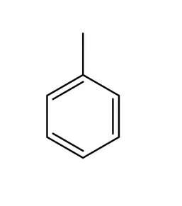
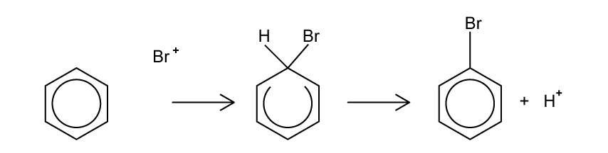
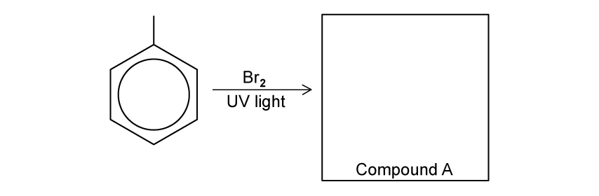
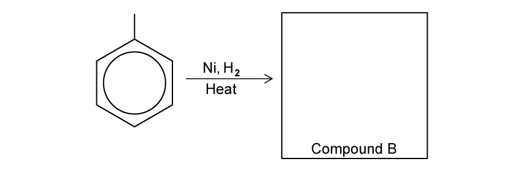
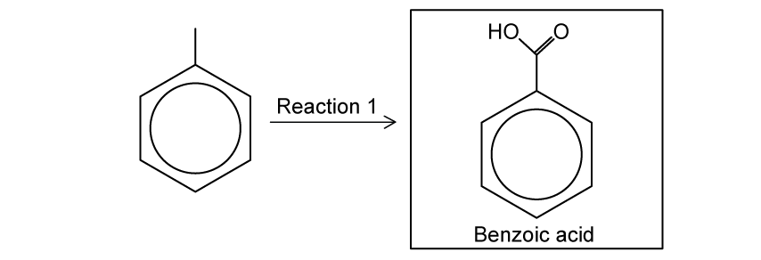
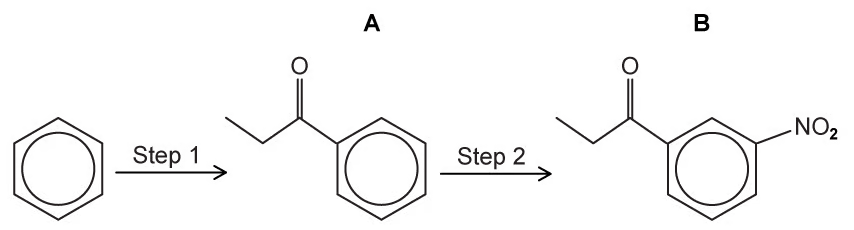
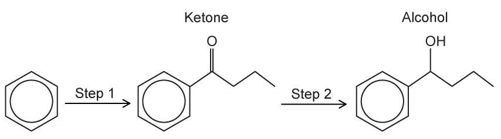
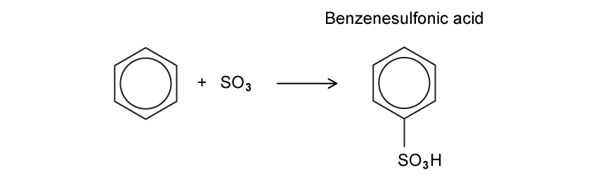
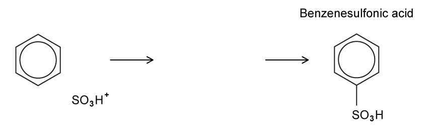
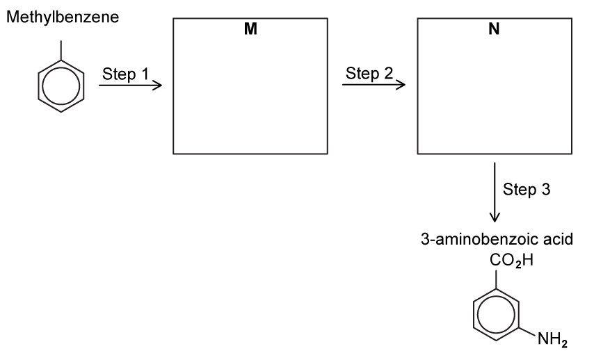

# 7.2 Hydrocarbons (A Level Only) - Structured Questions

本页保留题包中的全部 Structured Questions，按 Easy、Hard 分组。当前题包没有 Medium PDF，因此不虚构 Medium 题目。题目保留完整英文题干、所有分问、原始分值和题目中的局部图；答案保留完整解题步骤。

### 7.2 Hydrocarbons (A Level Only) - Easy

::: {.question-card}
### Example 1 · Benzene and methylbenzene substitution · 7.2 SQ Easy Q1

Benzene and methylbenzene undergo electrophilic substitution reactions.

**(a)** Benzene reacts with concentrated nitric acid in the presence of concentrated sulfuric acid.

1. Write an equation for the reaction of benzene with nitric acid. `[1 mark]`
2. State the type of reaction. `[1 mark]`

**(b)** Methylbenzene reacts with chlorine in the presence of aluminium chloride.

{.question-figure fig-alt="Methylbenzene and its possible ring-substitution products"}

1. Draw the two major organic products. `[2 marks]`
2. State the type of mechanism involved. `[1 mark]`

Show mark scheme / model answer

- **(a)(1)**

  $$\ce{C6H6 + HNO3 -> C6H5NO2 + H2O}$$

  `[1]`
- **(a)(2)** **Electrophilic substitution**. `[1]`
- **(b)(1)** The two products are **2-chloromethylbenzene** and **4-chloromethylbenzene**. `[2]`
- **(b)(2)** **Electrophilic substitution**. The methyl group is 2,4-directing. `[1]`

:::

::: {.question-card}
### Example 2 · Bromination of benzene · 7.2 SQ Easy Q2

Benzene reacts with bromine in the presence of a halogen carrier.

{.question-figure fig-alt="Bromination mechanism with electrophile generation and curly-arrow prompts"}

**(a)** State the name of the mechanism. `[1 mark]`

**(b)** Write an equation showing how the electrophile is formed when aluminium bromide is used. `[1 mark]`

**(c)** Fig. 2.1 shows part of the mechanism for the reaction of benzene with bromine. Complete the mechanism by adding the curly arrows and charges. `[3 marks]`

Show mark scheme / model answer

- **(a)** **Electrophilic substitution**. `[1]`
- **(b)**

  $$\ce{AlBr3 + Br2 -> AlBr4- + Br+}$$

  `[1]`
- **(c)** The benzene $\pi$ electrons attack $\ce{Br+}$, forming a C–Br bond and a positively charged arenium intermediate. The C–H bond then donates its electrons back into the ring, removing $\ce{H+}$ and restoring the delocalised aromatic system. The curly arrows and charge must be placed correctly. `[3]`

:::

::: {.question-card}
### Example 3 · Reactions of methylbenzene · 7.2 SQ Easy Q3

Methylbenzene reacts under three different sets of conditions.

{.question-figure fig-alt="Methylbenzene treated with bromine and ultraviolet light"}
{.question-figure fig-alt="Methylbenzene hydrogenation reaction"}
{.question-figure fig-alt="Methylbenzene oxidation reaction"}

**(a)** Methylbenzene is reacted with bromine in the presence of ultraviolet light to form compound A. Identify A and give its structural formula. `[2 marks]`

**(b)** Methylbenzene is reacted with hydrogen in the presence of a nickel catalyst and heat to form compound B. Identify B. `[1 mark]`

**(c)** Methylbenzene is oxidised to benzoic acid. State suitable reagents and conditions. `[2 marks]`

Show mark scheme / model answer

- **(a)** A is **benzyl bromide / bromomethylbenzene**, $\ce{C6H5CH2Br}$. UV light causes free-radical substitution at the benzylic side-chain carbon. `[2]`
- **(b)** B is **methylcyclohexane**. `[1]`
- **(c)** Use hot alkaline potassium manganate(VII), $\ce{KMnO4}$ / $\ce{MnO4-}$, under reflux. Acidify the product with dilute sulfuric acid to obtain benzoic acid. `[2]`

:::

### 7.2 Hydrocarbons (A Level Only) - Hard

::: {.question-card}
### Example 4 · Nitration and Friedel–Crafts acylation · 7.2 SQ Hard Q1

This question is about electrophilic substitution reactions of benzene.

{.question-figure fig-alt="Nitration and Friedel-Crafts acylation question diagrams"}

**(a)** Concentrated sulfuric acid and concentrated nitric acid are mixed to generate the electrophile for nitration.

1. Write an equation for the formation of the electrophile. `[1 mark]`
2. Explain why nitric acid acts as a Brønsted–Lowry base in this reaction. `[1 mark]`
3. State the conjugate acids formed. `[1 mark]`

**(b)** Benzene is converted into compound A and then compound B by Friedel–Crafts acylation.

1. State the reagent used in step 1. `[1 mark]`
2. Name the acyl chloride required to form compound A. `[1 mark]`
3. Give the formula of the electrophile formed from the acyl chloride. `[1 mark]`
4. Describe the mechanism for the conversion of benzene into compound A, including the role of the counter-ion. `[3 marks]`

**(c)** Draw a dot-and-cross diagram for the aluminium chloride catalyst, showing the bonding and lone pairs on chlorine. `[2 marks]`

**(d)** Explain why electrophilic substitution is favoured over electrophilic addition in benzene. `[2 marks]`

Show mark scheme / model answer

- **(a)(1)**

  $$\ce{2H2SO4 + HNO3 -> 2HSO4- + H3O+ + NO2+}$$

  `[1]`
- **(a)(2)** $\ce{HNO3}$ accepts a proton from $\ce{H2SO4}$, so it is a Brønsted–Lowry base. `[1]`
- **(a)(3)** The conjugate acids are $\ce{H3O+}$ and $\ce{NO2+}$. `[1]`
- **(b)(1)** Anhydrous $\ce{AlCl3}$. `[1]`
- **(b)(2)** **Propanoyl chloride**, $\ce{CH3CH2COCl}$. `[1]`
- **(b)(3)** $\ce{CH3CH2CO+}$, the propanoyl cation / acylium ion. `[1]`
- **(b)(4)** The acyl chloride coordinates to $\ce{AlCl3}$ and forms $\ce{CH3CH2CO+}$ and $\ce{AlCl4-}$. Benzene $\pi$ electrons attack the acyl cation to form a positively charged arenium intermediate. A C–H bond then donates electrons back into the ring, restoring aromaticity. The $\ce{AlCl4-}$ counter-ion accepts the proton and participates in catalyst regeneration. `[3]`
- **(c)** The diagram should show an electron pair donated from chlorine to electron-deficient aluminium, with the chlorine lone pairs drawn correctly. `[2]`
- **(d)** Addition would destroy the delocalised aromatic stabilisation by converting ring $\pi$ bonding into localised bonds. Substitution replaces a hydrogen atom; loss of $\ce{H+}$ restores the aromatic system. `[2]`

:::

::: {.question-card}
### Example 5 · Friedel–Crafts acylation followed by reduction · 7.2 SQ Hard Q2

Benzene is converted into an aromatic ketone by Friedel–Crafts acylation. The ketone is then reduced to an alcohol.

{.question-figure fig-alt="Friedel-Crafts acylation and reduction of a ketone to an alcohol"}

**(a)** Describe the mechanism for the formation of the catalyst complex from the acyl chloride and aluminium chloride. `[2 marks]`

**(b)** Describe the mechanism for formation of the ketone, including regeneration of the catalyst. `[5 marks]`

**(c)** State the reagents and conditions for step 2, the reduction of the ketone to the alcohol. `[2 marks]`

Show mark scheme / model answer

- **(a)** A curly arrow from the C–Cl bond points to chlorine. A lone pair on chlorine then forms a coordinate bond to electron-deficient aluminium, giving the catalyst complex. `[2]`
- **(b)** The electrophile is generated as:

  $$\ce{CH3CH2CH2COCl + AlCl3 -> CH3CH2CH2CO+ + AlCl4-}$$

  Benzene $\pi$ electrons attack the acylium ion, forming an arenium intermediate. Electrons from the C–H bond return to the ring to restore aromaticity. The $\ce{Al-Cl}$ bond then breaks to chlorine, and the chloride ion removes the proton from the intermediate. This forms the ketone and regenerates $\ce{AlCl3}$; $\ce{HCl}$ is also produced. `[5]`
- **(c)** Use sodium tetrahydridoborate(III), $\ce{NaBH4}$, in ethanol, $\ce{CH3CH2OH}$; warm if required. `[2]`

:::

::: {.question-card}
### Example 6 · Hydrogenation, sulfonation and synthesis · 7.2 SQ Hard Q3

This question is about further reactions of benzene and methylbenzene.

{.question-figure fig-alt="Hydrogenation of benzene to cyclohexane"}
{.question-figure fig-alt="Sulfonation electrophile generation"}
{.question-figure fig-alt="Electrophilic substitution mechanism for sulfonation"}
{.question-figure fig-alt="Three-step synthesis from methylbenzene to aminobenzoic acid"}

**(a)** Benzene is converted into cyclohexane.

1. State the type of reaction. `[1 mark]`
2. State the reagent and conditions. `[2 marks]`
3. State the bond angle in benzene and in cyclohexane. `[2 marks]`
4. Explain the change in bonding and geometry. `[2 marks]`

**(b)** Benzene reacts with sulfur trioxide in sulfuric acid to form benzenesulfonic acid.

1. Use the equation shown to identify the electrophile. `[1 mark]`
2. Describe the electrophilic substitution mechanism. `[3 marks]`
3. Write an equation showing regeneration of the sulfuric acid catalyst. `[1 mark]`

**(c)** Methylbenzene is converted into 3-aminobenzoic acid in three steps. The original question labels the intermediate compounds M and N.

1. Identify M and N. `[2 marks]`
2. State reagents and conditions for steps 1, 2 and 3. `[3 marks]`

`[Total: 2 marks]`

Show mark scheme / model answer

- **(a)(1)** **Reduction / hydrogenation**. `[1]`
- **(a)(2)** Hydrogen gas with a nickel or platinum catalyst, on heating. `[2]`
- **(a)(3)** Benzene: **$120^\circ$**. Cyclohexane: **$109.5^\circ$**. `[2]`
- **(a)(4)** The ring $\pi$ bonds are converted into C–H $\sigma$ bonds. Benzene carbon atoms are $sp^2$ hybridised and trigonal planar; cyclohexane carbon atoms have tetrahedral geometry. `[2]`
- **(b)(1)** From

  $$\ce{SO3 + H2SO4 -> SO3H+ + HSO4-}$$

  the electrophile is $\ce{SO3H+}$. `[1]`
- **(b)(2)** Benzene $\pi$ electrons attack the sulfur atom of $\ce{SO3H+}$, forming a positively charged arenium intermediate. The C–H bond electrons then return to the ring, restoring aromaticity and forming $\ce{H+}$. `[3]`
- **(b)(3)**

  $$\ce{HSO4- + H+ -> H2SO4}$$

  `[1]`
- **(c)(1)** **M = benzoic acid**; **N = 3-nitrobenzoic acid**. `[2]`
- **(c)(2)** Step 1: hot alkaline $\ce{KMnO4}$ / $\ce{MnO4-}$ under reflux, then acidify. Step 2: concentrated $\ce{HNO3}$ and concentrated $\ce{H2SO4}$. Step 3: tin, concentrated hydrochloric acid and heat. `[3]`

The PDF prints `[Total: 2 marks]`; that original text is retained above even though the listed reagent sequence contains more than two answer points.

:::
