# 30 Hydrocarbons

本章对应 CIE 9701 2025–2027 syllabus 的 **30.1 Arenes**。题目部分对应专题题包 **7.2 Hydrocarbons (A Level Only)**；当前资源包含 Easy 与 Hard 两组 Structured Questions。

## Learning objectives

学完本章后，你应该能够：

- explain the structure and stability of benzene using $sp^2$ hybridisation, $\sigma$ bonds and a delocalised $\pi$ system;
- describe electrophilic substitution in benzene and write equations for the formation of common electrophiles;
- explain nitration, halogenation and Friedel–Crafts alkylation/acylation;
- predict the effect of an alkyl group on the orientation of further substitution;
- distinguish reactions of the benzene ring from reactions at the side-chain of methylbenzene;
- describe oxidation of alkylbenzenes, hydrogenation of benzene and the preparation of aryl halides;
- use these reactions to propose short synthetic routes.

## 30.1 Arenes

::: {.study-card}
### Benzene: structure and aromatic stability

An **arene** is an aromatic hydrocarbon containing one or more benzene rings. Benzene is planar and each carbon atom is $sp^2$ hybridised. The three $sp^2$ orbitals on each carbon form $\sigma$ bonds in a trigonal-planar arrangement, so the bond angles are approximately $120^\circ$.

The remaining unhybridised p orbital on every carbon is perpendicular to the ring. Sideways overlap of these six p orbitals produces one continuous delocalised $\pi$ system above and below the plane of the ring. The six $\pi$ electrons are spread over the whole ring rather than being confined to three separate C=C bonds. All six C–C bonds consequently have the same intermediate bond order and length.

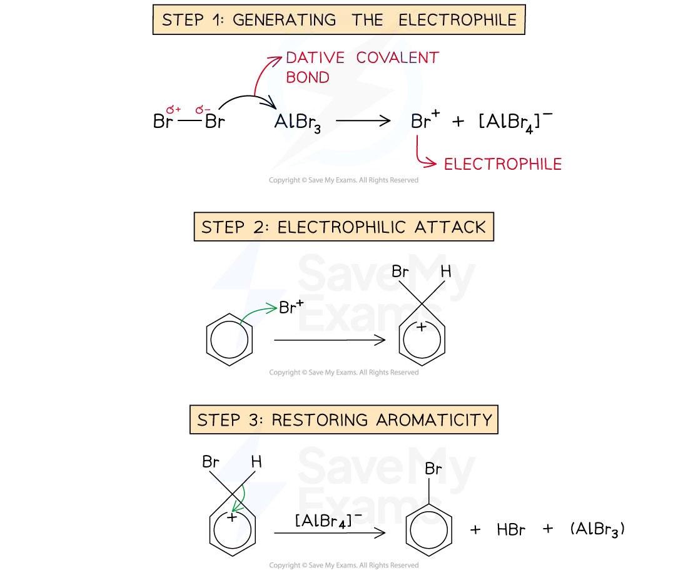{.concept-figure fig-alt="Benzene ring and electrophilic substitution overview"}
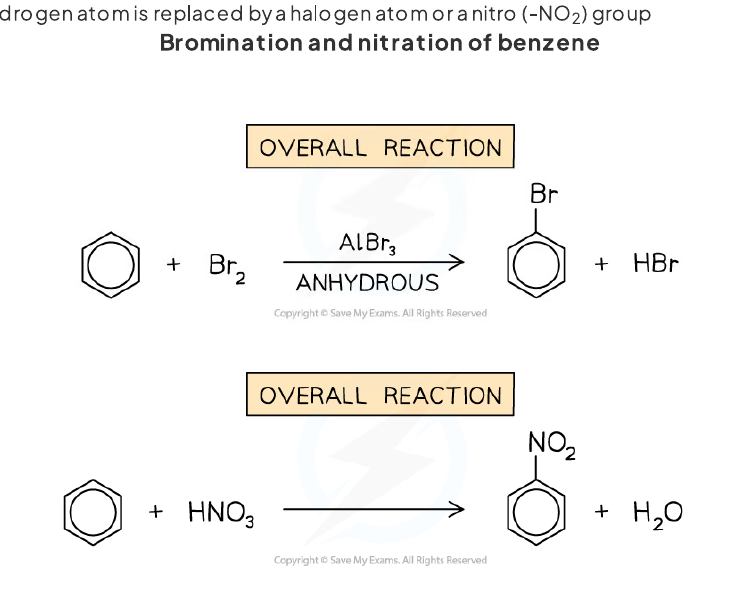{.concept-figure fig-alt="Benzene bonding and aromatic substitution examples"}
:::

::: {.worked-example}
Worked example · Benzene bonding

### Bond angle, hybridisation and bond length

**State the bond angle in benzene, state the hybridisation of its carbon atoms, and explain why all the C–C bonds have the same length.**

- The bond angle is **$120^\circ$**.
- Each carbon atom is **$sp^2$ hybridised**.
- The unhybridised p orbitals overlap sideways around the ring to form a **delocalised $	heta$ system**. The bonding is therefore spread evenly around the ring, giving all six C–C bonds the same intermediate bond order and length.

:::

::: {.study-card}
### Electrophilic substitution

Benzene is electron-rich because of its delocalised $	heta$ electrons. In an electrophilic substitution:

1. an electrophile is generated;
2. the benzene $	heta$ system attacks the electrophile and a positively charged arenium ion forms;
3. a proton is removed from the carbon bearing the new substituent;
4. the delocalised aromatic system is restored.

The reaction is called **substitution** because a hydrogen atom on the ring is replaced. Electrophilic addition would leave the ring without its aromatic stabilisation, so it is less favourable under these conditions.

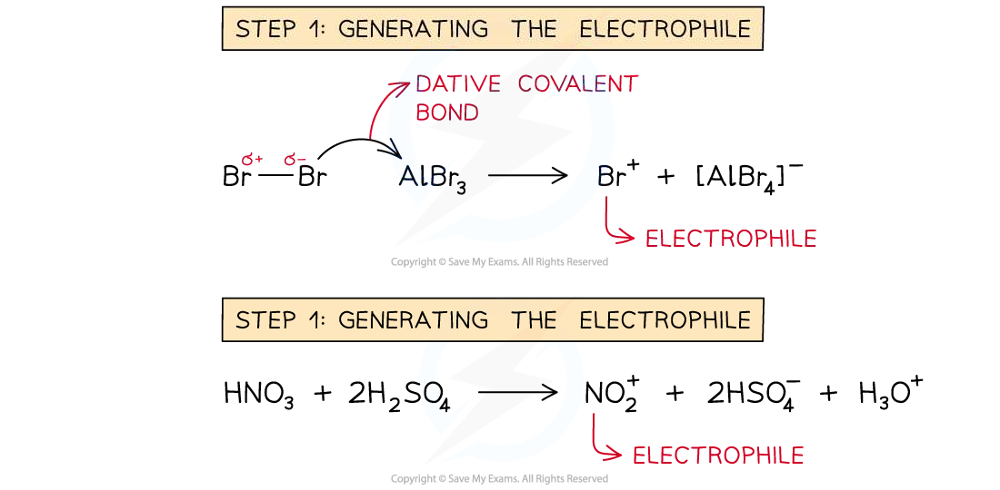{.concept-figure fig-alt="Generation of an electrophile for electrophilic substitution"}
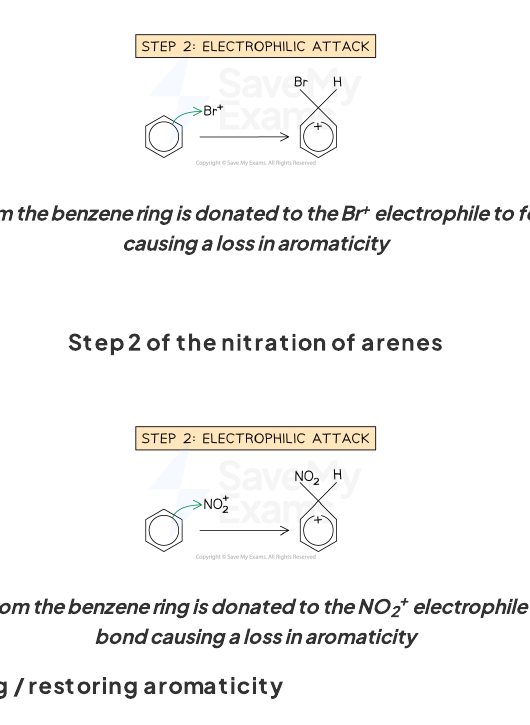{.concept-figure fig-alt="Electrophilic attack on benzene and restoration of aromaticity"}
:::

::: {.worked-example}
Worked example · Nitration of benzene

### Formation of the nitronium ion

**Concentrated nitric acid is mixed with concentrated sulfuric acid before benzene is added. Write an equation for the formation of the electrophile and explain the role of nitric acid.**

The electrophile is the nitronium ion, $\ce{NO2+}$:

$$\ce{2H2SO4 + HNO3 -> 2HSO4- + H3O+ + NO2+}$$

Nitric acid acts as a **Brønsted–Lowry base** because it accepts a proton from sulfuric acid. The resulting $\ce{NO2+}$ ion attacks the electron-rich benzene ring.

:::

::: {.study-card}
### Halogenation of benzene

Benzene reacts with chlorine or bromine in the presence of a halogen carrier such as $\ce{AlCl3}$ or $\ce{AlBr3}$. The carrier polarises the halogen molecule and helps generate a strong electrophile:

$$\ce{AlBr3 + Br2 -> AlBr4- + Br+}$$

The ring attacks $\ce{Br+}$, an arenium ion forms, and loss of $\ce{H+}$ restores the aromatic ring. The product is bromobenzene. The same overall pattern applies to chlorination, using $\ce{Cl2}$ and $\ce{AlCl3}$.

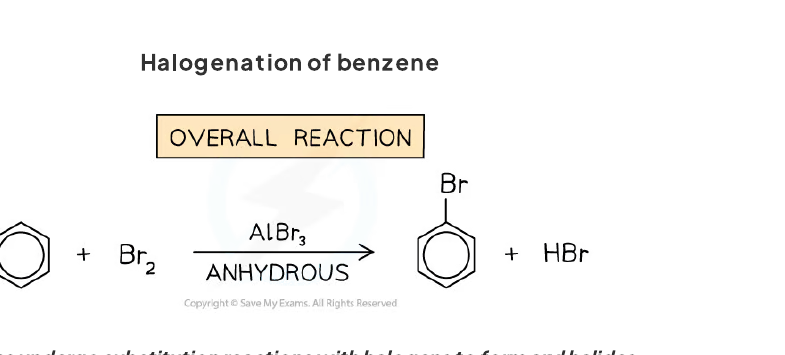{.concept-figure fig-alt="Electrophilic bromination of benzene"}
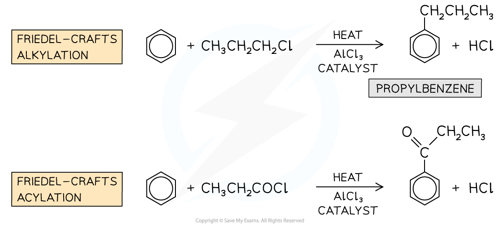{.concept-figure fig-alt="Overview of electrophilic substitution mechanisms"}
:::

::: {.worked-example}
Worked example · Bromination mechanism

### Curly arrows in bromination

**Benzene reacts with bromine in the presence of aluminium bromide. Write the equation for formation of the electrophile and describe the two curly arrows needed in the substitution mechanism.**

The electrophile-generation equation is:

$$\ce{AlBr3 + Br2 -> AlBr4- + Br+}$$

The first curly arrow starts from the benzene $\pi$-electron ring and points to $\ce{Br+}$, forming a C–Br bond and a positively charged arenium intermediate. The second curly arrow starts at the C–H bond on the carbon bearing bromine and points back into the ring. This removes $\ce{H+}$ and restores the delocalised aromatic system.

:::

::: {.study-card}
### Nitration of benzene and methylbenzene

Benzene is warmed with a mixture of concentrated nitric acid and concentrated sulfuric acid. The product is **nitrobenzene**:

$$\ce{C6H6 + HNO3 -> C6H5NO2 + H2O}$$

Methylbenzene is more reactive than benzene because the methyl group releases electron density towards the ring. Nitration therefore gives mainly the **2-** and **4-nitro** isomers. Alkyl groups are called **2,4-directing** or **ortho/para-directing** groups because they increase electron density at those positions relative to the 3-position.

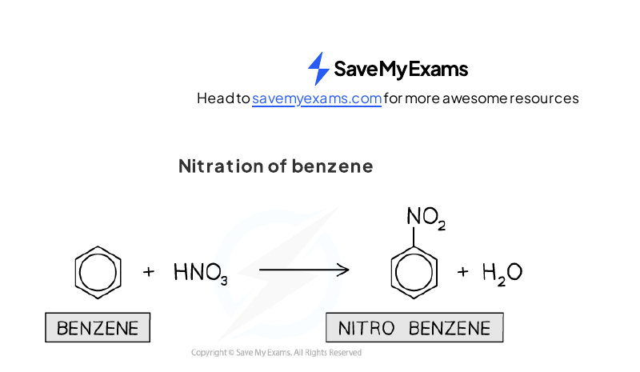{.concept-figure fig-alt="Nitration of benzene with concentrated acids"}
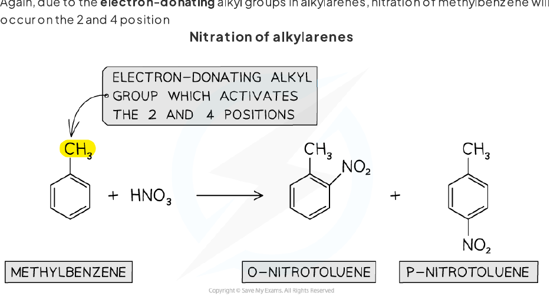{.concept-figure fig-alt="Nitration of methylbenzene at the 2 and 4 positions"}
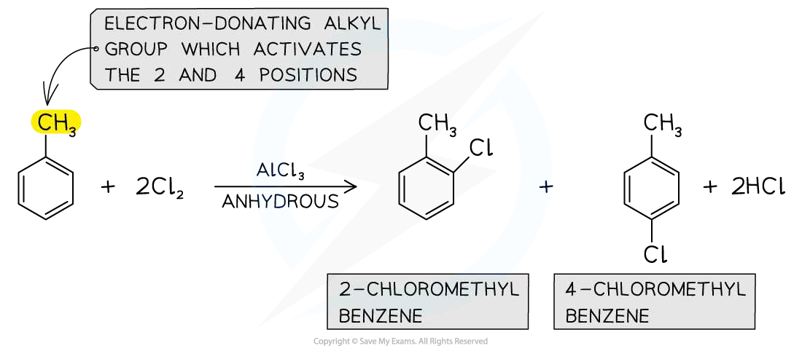{.concept-figure fig-alt="Directing effects in substituted benzene"}
:::

::: {.worked-example}
Worked example · Substitution of methylbenzene

### Ring substitution and directing effects

**Methylbenzene reacts with chlorine in the presence of aluminium chloride. State the two major ring-substitution products and explain why these positions are favoured.**

The major products are **2-chloromethylbenzene** and **4-chloromethylbenzene**. The methyl group releases electron density towards the ring, making the 2- and 4-positions more electron-rich and more favourable for attack by the electrophile. The 3-isomer is formed in much smaller amount.

:::

::: {.study-card}
### Friedel–Crafts alkylation and acylation

In a Friedel–Crafts **alkylation**, an alkyl halide reacts with a halogen carrier to generate an alkyl electrophile. For example:

$$\ce{CH3CH2Br + AlBr3 -> CH3CH2+ + AlBr4-}$$

The alkyl electrophile substitutes for a hydrogen atom on benzene, producing an alkylbenzene. In a Friedel–Crafts **acylation**, an acyl chloride reacts with anhydrous $\ce{AlCl3}$ to form an acylium ion, $\ce{RCO+}$. The product is an aromatic ketone.

The catalyst is a Lewis acid: it accepts an electron pair from the halogen atom and helps the C–X bond break heterolytically.

{.concept-figure fig-alt="Friedel-Crafts alkylation and acylation overview"}
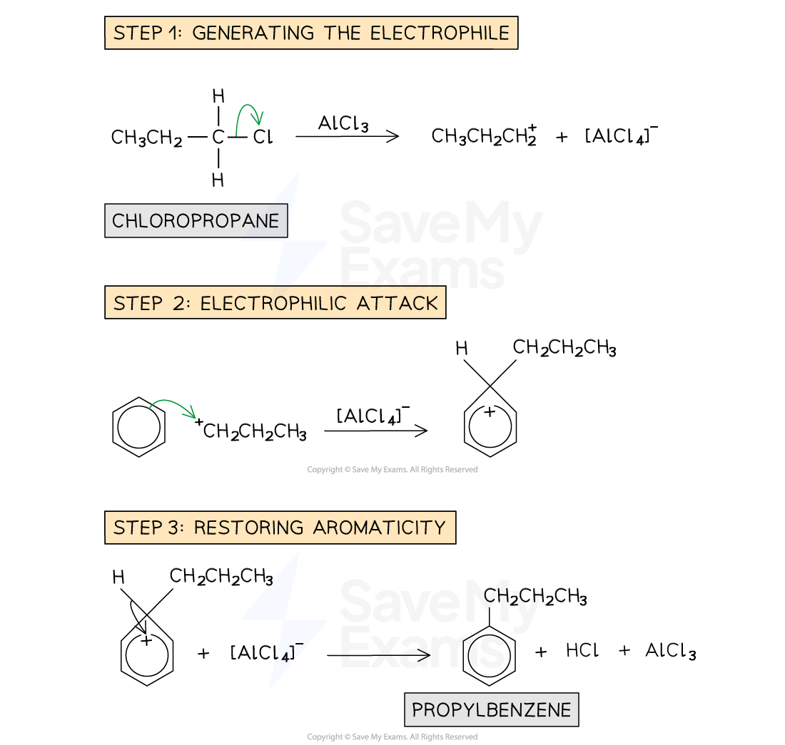{.concept-figure fig-alt="Friedel-Crafts alkylation mechanism"}
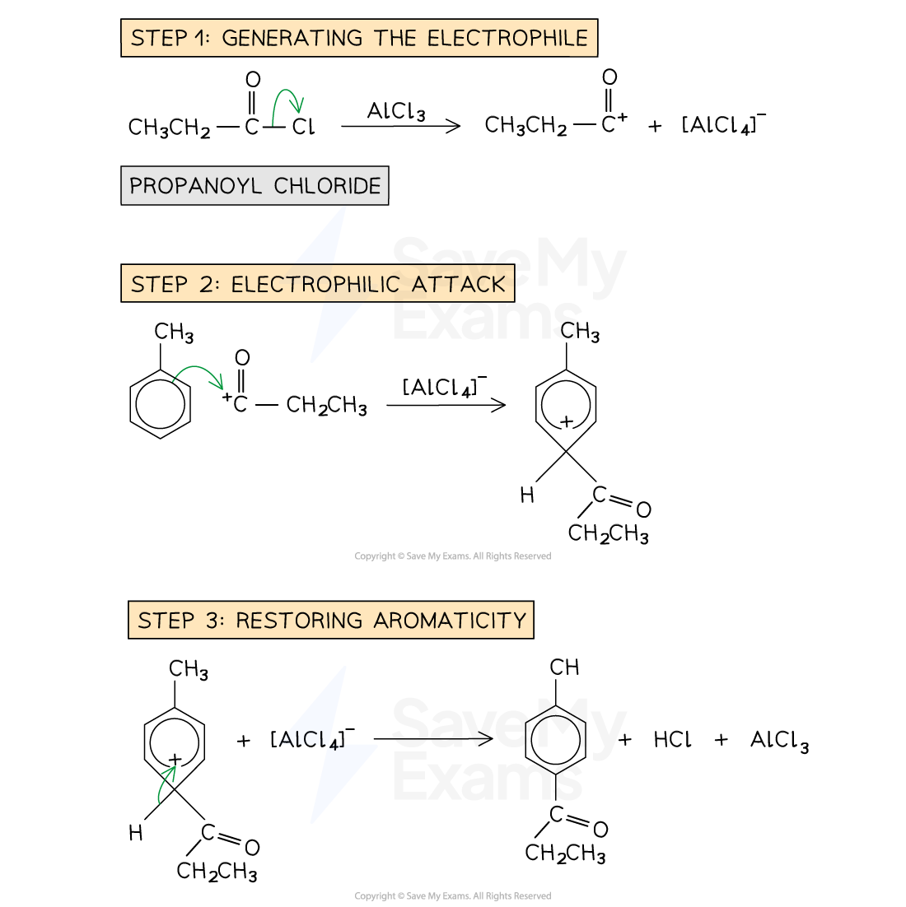{.concept-figure fig-alt="Friedel-Crafts acylation mechanism"}
:::

::: {.worked-example}
Worked example · Friedel–Crafts acylation

### Formation of a ketone

**Benzene reacts with propanoyl chloride in the presence of anhydrous aluminium chloride. Identify the electrophile, write its formation equation, and state the reaction type.**

The acyl chloride is $\ce{CH3CH2COCl}$ and the electrophile is the **propanoyl cation**, $\ce{CH3CH2CO+}$:

$$\ce{CH3CH2COCl + AlCl3 -> CH3CH2CO+ + AlCl4-}$$

The benzene ring undergoes **electrophilic substitution**. The product is the aromatic ketone $\ce{C6H5COCH2CH3}$ (propiophenone / 1-phenylpropan-1-one), and aromaticity is restored when $\ce{H+}$ is removed.

:::

::: {.study-card}
### Reactions of the side-chain of methylbenzene

The conditions determine whether the ring or the side-chain reacts.

| Conditions | Main transformation |
|---|---|
| $\ce{Cl2}$ or $\ce{Br2}$ with a halogen carrier | electrophilic substitution on the ring |
| $\ce{Cl2}$ or $\ce{Br2}$ with UV light | free-radical substitution at the side-chain |
| hot alkaline $\ce{KMnO4}$ under reflux, then acidification | oxidation of an alkyl side-chain to $\ce{-COOH}$ |
| $\ce{H2}$, Ni/Pt catalyst, heat | hydrogenation of the aromatic ring |

For oxidation, any alkyl side-chain with at least one benzylic hydrogen is oxidised fully to a carboxylic acid. Methylbenzene therefore gives benzoic acid:

$$\ce{C6H5CH3 ->[hot\ KMnO4][H+,\ reflux] C6H5COOH}$$

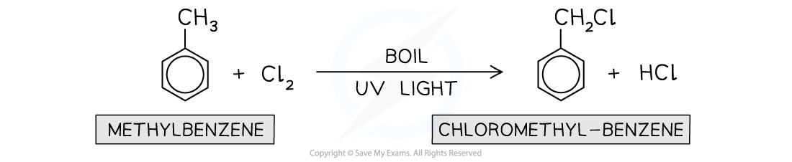{.concept-figure fig-alt="Free-radical halogenation at the side-chain of methylbenzene"}
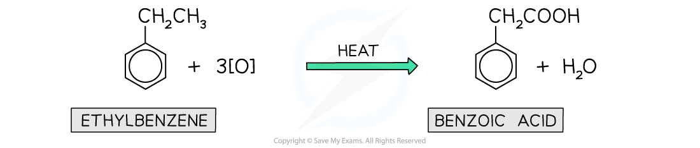{.concept-figure fig-alt="Oxidation of an alkylbenzene to a benzoic acid"}
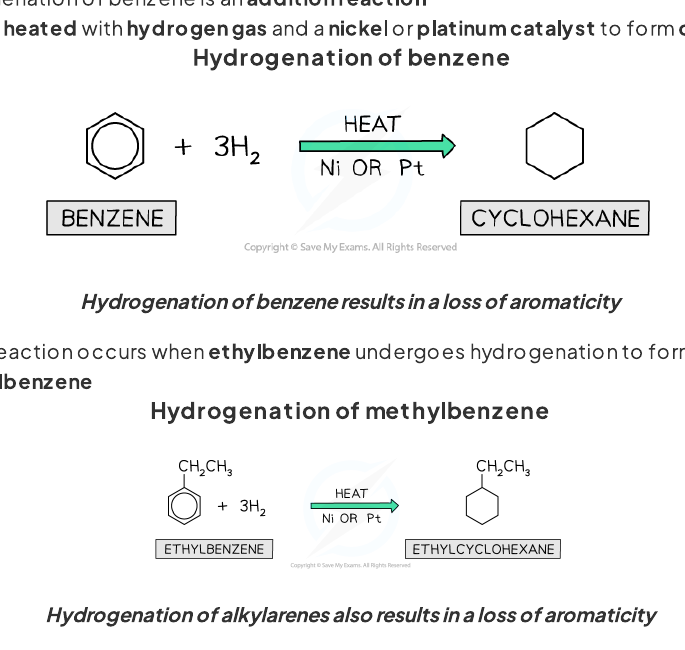{.concept-figure fig-alt="Hydrogenation of benzene to cyclohexane"}
:::

::: {.worked-example}
Worked example · Side-chain reactions

### Bromination, hydrogenation and oxidation

**Methylbenzene is treated separately with (i) bromine and UV light, (ii) hydrogen with a nickel catalyst and heat, and (iii) hot alkaline potassium manganate(VII) under reflux followed by acidification. State the organic product in each case.**

1. UV light causes free-radical substitution at the benzylic carbon. The product is **benzyl bromide / bromomethylbenzene**, $\ce{C6H5CH2Br}$.
2. Hydrogenation reduces the ring to give **methylcyclohexane**.
3. Oxidation of the side-chain gives **benzoic acid**, $\ce{C6H5COOH}$. The reaction mixture is acidified after reflux.

:::

::: {.study-card}
### Further halogenation and aryl halides

Under UV light, the benzylic hydrogen atoms are substituted first because the benzyl radical is resonance-stabilised. With excess halogen, further side-chain substitution can occur, giving compounds such as $\ce{C6H5CHCl2}$ and $\ce{C6H5CCl3}$.

An aryl halide contains a halogen directly bonded to an aromatic ring. The C–X bond is stronger than a typical halogenoalkane C–X bond because the halogen lone pair can overlap with the ring $\pi$ system. This partial delocalisation gives the C–X bond some double-bond character and makes aryl halides resistant to nucleophilic substitution.

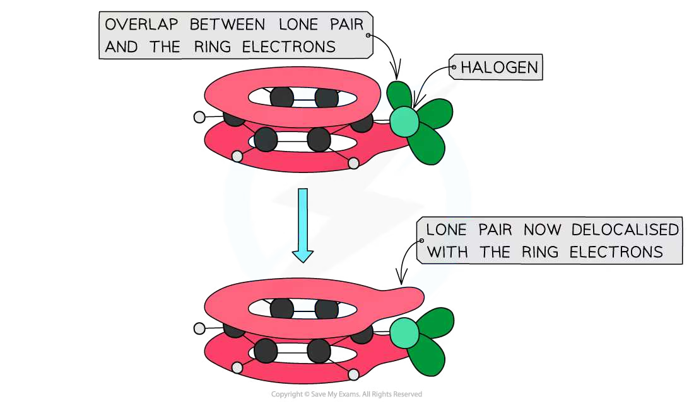{.concept-figure fig-alt="Partial delocalisation in an aryl halide C-X bond"}
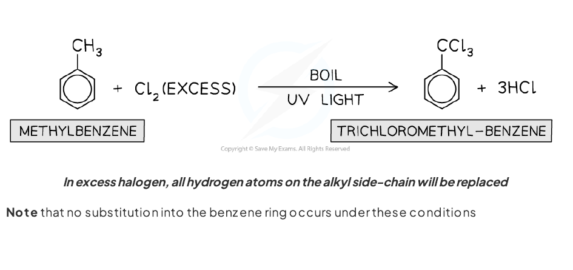{.concept-figure fig-alt="Further free-radical substitution at a methylbenzene side-chain"}
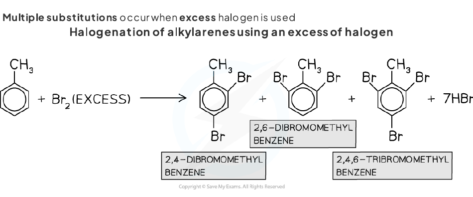{.concept-figure fig-alt="Further electrophilic ring halogenation of an alkyl arene"}
:::

::: {.worked-example}
Worked example · Aryl halides

### Comparing chlorobenzene and chloromethane

**Explain why chlorobenzene is less reactive than chloromethane towards aqueous hydroxide ions.**

In chlorobenzene, a lone pair on chlorine overlaps with the delocalised $\pi$ system of the benzene ring. The C–Cl bond therefore has partial double-bond character and is shorter and stronger. The carbon is also $sp^2$ hybridised. In chloromethane the C–Cl bond is a normal single bond, so it breaks more readily in nucleophilic substitution.

:::

::: {.study-card}
### Synthesis and reaction planning

Useful synthetic sequences include:

- methylbenzene $\rightarrow$ benzoic acid by hot alkaline manganate(VII), reflux and acidification;
- benzoic acid $\rightarrow$ 3-nitrobenzoic acid by nitration, because the $\ce{-COOH}$ group is meta-directing;
- a nitro group $\rightarrow$ an amino group using tin and concentrated hydrochloric acid on heating;
- an alkylbenzene $\rightarrow$ a ring-substituted product by electrophilic substitution;
- benzene $\rightarrow$ an aromatic ketone by Friedel–Crafts acylation.

When planning a route, identify which functional group controls orientation and choose conditions that react at the ring or side-chain selectively.

{.concept-figure fig-alt="Directing effects used in aromatic synthesis"}
:::

::: {.worked-example}
Worked example · Three-step synthesis

### Methylbenzene to 3-aminobenzoic acid

**Methylbenzene is converted into 3-aminobenzoic acid in three steps. Identify the intermediate products and state suitable reagents and conditions for each step.**

- **Step 1:** oxidise the methyl side-chain using hot alkaline $\ce{KMnO4}$ under reflux, then acidify. The intermediate **M is benzoic acid**.
- **Step 2:** nitrate M using concentrated nitric acid and concentrated sulfuric acid, warming if necessary. The carboxylic acid group is meta-directing, so **N is 3-nitrobenzoic acid**.
- **Step 3:** reduce the nitro group using tin and concentrated hydrochloric acid on heating. This gives **3-aminobenzoic acid**.

:::

## Chapter checklist

- [ ] 我能用 $sp^2$ hybridisation、$	heta$ bonds 和 delocalised $	heta$ electrons 解释 benzene 的平面结构和等长 C–C bonds。
- [ ] 我能写出 nitration、halogenation 和 Friedel–Crafts 反应中 electrophile 的生成方程。
- [ ] 我能完整描述 electrophilic substitution 的 curly arrows、arenium intermediate 和 aromaticity restoration。
- [ ] 我能区分 benzene ring substitution、side-chain free-radical substitution、oxidation 和 hydrogenation。
- [ ] 我能解释 alkyl groups 的 directing effects 以及 aryl halide C–X bond 的稳定性。
- [ ] 我能设计从 methylbenzene 到 substituted benzoic acid 的合成路线。

## Structured questions



### Original question PDFs

- [7.2 Hydrocarbons (A Level Only) - Easy](https://raw.githubusercontent.com/nanoxsj/CIE-Chemistry-Study/publish-chemistry-study/resources/original-papers/hydrocarbons/7.2-hydrocarbons-easy.pdf)
- [7.2 Hydrocarbons (A Level Only) - Hard](https://raw.githubusercontent.com/nanoxsj/CIE-Chemistry-Study/publish-chemistry-study/resources/original-papers/hydrocarbons/7.2-hydrocarbons-hard.pdf)
