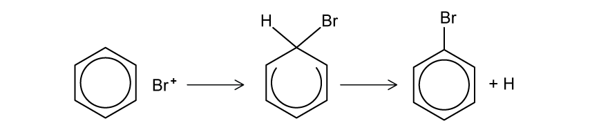
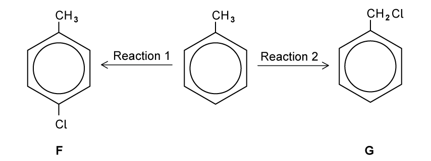
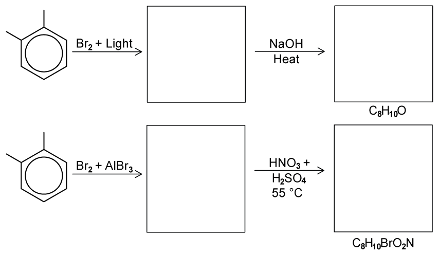
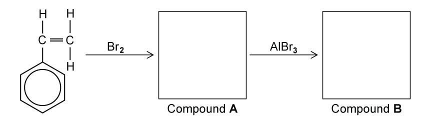
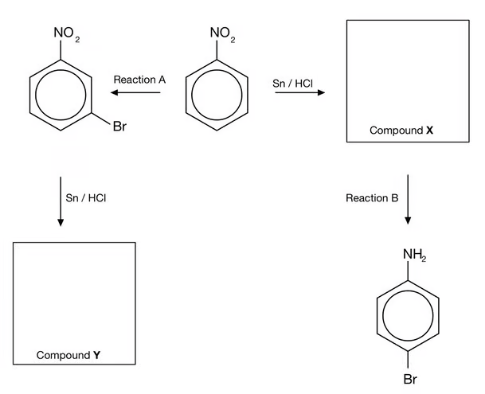
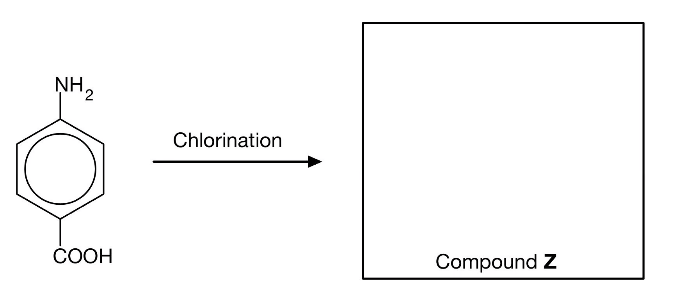
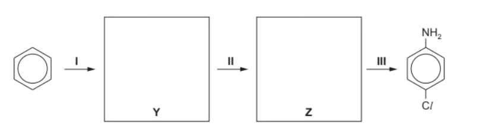
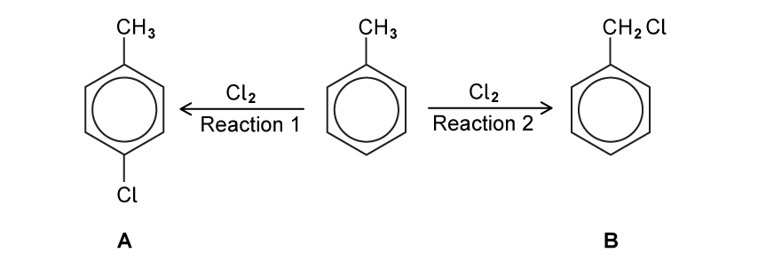

# 7.3 Halogen Compounds (A Level Only) - Structured Questions

本页保留 Easy、Medium 与 Hard 题包中的全部 Structured Questions。题目保留完整英文题干、所有分问、原始分值和题目中的独立图；答案按 Model Answers 整理，并把机制题与合成题的解答步骤完整呈现。

### 7.3 Halogen Compounds (A Level Only) - Easy

::: {.question-card}
### Example 1 · Bromination of benzene · 7.3 SQ Easy Q1

At room temperature and pressure, bromine reacts with benzene, in the presence of a halogen carrier to produce bromobenzene. This is an electrophilic substitution reaction.

The electrophile is the bromonium ion, $\ce{Br+}$, and is generated when bromine reacts with the halogen carrier, e.g. $\ce{AlBr3}$.

{.question-figure fig-alt="Bromine and aluminium bromide generating the bromonium ion"}

**(a)** Complete the mechanism in Fig. 1.1 to show how the bromonium ion is produced by adding any full and partial charges and curly arrows. `[2 marks]`

{.question-figure fig-alt="Electrophilic substitution mechanism forming bromobenzene from bromonium ion and benzene"}

**(b)** Complete the mechanism in Fig. 1.2 to show how bromobenzene is produced from $\ce{Br+}$ and benzene. Include any relevant charges and curly arrows. `[3 marks]`

**(c)** Write an equation to show the regeneration of the catalyst. `[1 mark]`

Show mark scheme / model answer

- **(a)** A lone pair on one bromine atom in $\ce{Br2}$ is donated to electron-deficient aluminium in $\ce{AlBr3}$, forming a coordinate bond. The Br–Br bond breaks heterolytically. Show partial charges on the bromine molecule and full charges on $\ce{Br+}$ and $\ce{[AlBr4]-}$:

  $$\ce{Br2 + AlBr3 -> Br+ + [AlBr4]-}$$

  The curly arrow goes from the Br–Br bond / bromine lone pair towards aluminium. `[2]`
- **(b)** A curly arrow goes from the benzene $\pi$ system to $\ce{Br+}$, forming a C–Br bond. The intermediate has a positive charge in the ring. A curly arrow then goes from the C–H bond towards the positive charge in the ring, restoring aromaticity and giving bromobenzene plus $\ce{H+}$. The positive charge on the proton must also be shown. `[3]`
- **(c)**

  $$\ce{H+ + [AlBr4]- -> HBr + AlBr3}$$

  `[1]`

:::

::: {.question-card}
### Example 2 · Ring and side-chain chlorination · 7.3 SQ Easy Q2

Methylbenzene can react with chlorine under different conditions to give the monochloro derivatives F and G, shown in Fig. 2.1.

{.question-figure fig-alt="Methylbenzene giving a ring-chloro product or a side-chain chloromethyl product"}

**(a)** Suggest reagents and conditions for each reaction. `[2 marks]`

**(b)** Identify the type of reaction mechanism that occurs in each reaction in Fig. 2.1. `[2 marks]`

**(c)** When the reagent used in Reaction 1 is present in excess, further organic products are formed. Draw the structure of one of these organic products and give its name. `[2 marks]`

Show mark scheme / model answer

- **(a)**
  - Reaction 1: $\ce{Cl2}$ and anhydrous $\ce{AlCl3}$ (a suitable halogen carrier), at room temperature. `[1]`
  - Reaction 2: $\ce{Cl2}$ and ultraviolet light; heating / boiling methylbenzene is acceptable. `[1]`
- **(b)**
  - Reaction 1: **electrophilic substitution**. `[1]`
  - Reaction 2: **free-radical substitution**. `[1]`
- **(c)** Any one correct further ring-substitution product and name is acceptable, for example **2,4-dichloromethylbenzene** or **2,6-dichloromethylbenzene**. The second chlorine replaces a ring hydrogen at another activated 2- or 4-position. `[2]`

:::

::: {.question-card}
### Example 3 · Halogenoalkane and halogenoarene reactivity · 7.3 SQ Easy Q3

2-bromopentane is a halogenoalkane and bromobenzene is a halogenoarene.

**(a)** State which is the most reactive compound. `[1 mark]`

**(b)** The average bond enthalpy of a C–Br bond is 276 kJ mol$^{-1}$. Suggest whether the bond enthalpy of the C–Br bond in bromobenzene is greater or less than the average bond enthalpy and state what this means about the strength of the C–Br bond in bromobenzene. `[1 mark]`

**(c)** 2-bromopentane readily undergoes nucleophilic substitution with a hydroxide ion, $\ce{OH-}$, to form pentan-2-ol whereas bromobenzene requires extreme conditions to react when attacked by a nucleophile, such as $\ce{OH-}$. Suggest what happens, under standard conditions, as a hydroxide ion approaches a molecule of bromobenzene. `[1 mark]`

Show mark scheme / model answer

- **(a)** 2-bromopentane is the more reactive compound. `[1]`
- **(b)** The C–Br bond enthalpy in bromobenzene is **greater** than 276 kJ mol$^{-1}$. It has partial double-bond character and is therefore stronger than an ordinary C–Br single bond. `[1]`
- **(c)** The hydroxide ion is repelled by the delocalised electron density of the benzene ring. The strong C–Br bond is not broken, so nucleophilic substitution does not readily occur under standard conditions. `[1]`

:::

### 7.3 Halogen Compounds (A Level Only) - Medium

::: {.question-card}
### Example 4 · Chlorination of benzene · 7.3 SQ Medium Q1

This question is about halogenoarene compounds.

**(a)** State the reagents and name the mechanism used to convert benzene into chlorobenzene. `[2 marks]`

**(b)** Using your answer to (a), write the equation for the generation of the ion which reacts with benzene. `[1 mark]`

**(c)** Draw the mechanism for the chlorination of benzene. `[4 marks]`

**(d)** Explain how the carbon–chlorine bond in chlorobenzene prevents nucleophilic substitution from occurring. `[3 marks]`

Show mark scheme / model answer

- **(a)** Reagents: $\ce{Cl2}$ and anhydrous $\ce{AlCl3}$ (a halogen carrier). Mechanism: **electrophilic substitution**. `[2]`
- **(b)**

  $$\ce{Cl2 + AlCl3 -> Cl+ + [AlCl4]-}$$

  `[1]`
- **(c)** A curly arrow goes from the benzene ring to $\ce{Cl+}$, forming a positively charged arenium intermediate. A curly arrow goes from the C–H bond back into the ring, restoring the delocalised $\pi$ system. The products are chlorobenzene and $\ce{H+}$, with the correct positive charge shown on the intermediate and proton. `[4]`
- **(d)** A lone pair on chlorine overlaps with the delocalised $\pi$ system of the benzene ring. The C–Cl bond therefore has partial double-bond character and is very strong, so it is difficult to break in nucleophilic substitution. `[3]`

:::

::: {.question-card}
### Example 5 · 1,2-Dimethylbenzene reaction sequences · 7.3 SQ Medium Q2

Predict the products of the following reactions in Fig. 2.1 and draw their structures in the boxes provided. The starting compound is 1,2-dimethylbenzene, and the molecular formula of the final product is given in each case.

{.question-figure fig-alt="1,2-dimethylbenzene reaction sequences involving side-chain bromination, hydrolysis, ring bromination and nitration"}

**(a)** Predict and draw the products in both reaction sequences. `[4 marks]`

**(b)** Write the equation for the generation of the electrophile when methylbenzene reacts with bromine and aluminium bromide. `[1 mark]`

**(c)** Draw the reaction mechanism for the reaction of methylbenzene with bromine and aluminium bromide. `[4 marks]`

**(d)** Explain why halogenoalkanes such as bromopropane are more reactive than halogenoarenes such as bromobenzene. `[4 marks]`

Show mark scheme / model answer

- **(a)**
  - In the first sequence, $\ce{Br2/light}$ gives side-chain bromination of one methyl group of 1,2-dimethylbenzene. The intermediate is **(bromomethyl)methylbenzene**, $\ce{C6H4(CH3)(CH2Br)}$. Heating with $\ce{NaOH}$ gives **(hydroxymethyl)methylbenzene**, $\ce{C6H4(CH3)(CH2OH)}$, with formula $\ce{C8H10O}$.
  - In the second sequence, $\ce{Br2/AlBr3}$ gives a ring-substituted bromo-1,2-dimethylbenzene. Nitration with concentrated $\ce{HNO3/H2SO4}$ at 55 °C gives the corresponding nitro derivative, with formula $\ce{C8H10BrO2N}$. The methyl groups are electron-donating and direct electrophilic substitution to the available 2, 4 and 6 positions; any correctly drawn structure consistent with the printed reaction sequence is accepted. `[4]`
- **(b)**

  $$\ce{Br2 + AlBr3 -> Br+ + [AlBr4]-}$$

  `[1]`
- **(c)** The benzene $\pi$ system attacks $\ce{Br+}$, forming a positively charged arenium intermediate. A curly arrow from the C–H bond returns electrons to the ring, restoring aromaticity. The product is 2-bromomethylbenzene or 4-bromomethylbenzene plus $\ce{H+}$. `[4]`
- **(d)** Bromopropane has a polar C–Br bond, so the carbon is slightly positive and can be attacked by a nucleophile. In bromobenzene, a bromine lone pair overlaps with the benzene $\pi$ system, giving the C–Br bond partial double-bond character. This bond is stronger and more difficult to break, so bromobenzene is less reactive. `[4]`

:::

::: {.question-card}
### Example 6 · Phenylethene and directing effects · 7.3 SQ Medium Q3

A student investigated two reactions of phenylethene, $\ce{C6H5CH=CH2}$, as shown in Fig. 3.1. First she reacted phenylethene with excess bromine at room temperature to form Compound A. She then added aluminium bromide, $\ce{AlBr3}$, to the reaction mixture to form Compound B.

{.question-figure fig-alt="Phenylethene reacting with bromine and then aluminium bromide"}

**(a)** Draw the structures of Compound A and Compound B. `[2 marks]`

**(b)** Name and outline the mechanism for the formation of Compound B from Compound A. `[4 marks]`

**(c)** Nitrobenzene was reacted with aluminium chloride and chlorine. Name and draw the structure of the aromatic product formed in this reaction. `[2 marks]`

Show mark scheme / model answer

- **(a)** Compound A is the vicinal dibromoalkane formed by addition of bromine across the C=C bond: $\ce{C6H5CHBrCH2Br}$. Compound B is formed by electrophilic substitution of a ring hydrogen by bromine. Any correctly drawn 2-, 3- or 4-bromo derivative of A is accepted. `[2]`
- **(b)** Mechanism: **electrophilic substitution**. $\ce{AlBr3}$ reacts with $\ce{Br2}$ to form $\ce{Br+}$ and $\ce{[AlBr4]-}$. The benzene ring attacks $\ce{Br+}$, forming a positively charged arenium intermediate. The C–H bond then donates electrons back into the ring, restoring aromaticity and forming Compound B plus $\ce{H+}$. `[4]`
- **(c)** The nitro group is 3-directing, so the product is **3-chloronitrobenzene** (5-chloronitrobenzene is the equivalent numbering description). `[2]`

:::

### 7.3 Halogen Compounds (A Level Only) - Hard

::: {.question-card}
### Example 7 · Directing effects and reaction order · 7.3 SQ Hard Q1

Nitration of a benzene ring forms nitrobenzene. The subsequent reactions of nitrobenzene are shown in Fig. 1.1.

{.question-figure fig-alt="Nitrobenzene undergoing bromination and nitro reduction in two different orders"}

The structures of the products have the same molecular formula. Explain why these products are different. In your answer include the structures of compounds X and Y and reagents for reactions A and B. `[5 marks]`

**(a)** Answer the question above. `[5 marks]`

**(b)** Using curly arrows, describe the mechanism for Reaction A. `[3 marks]`

{.question-figure fig-alt="Chlorination of an aminobenzoic acid to form Compound Z"}

**(c)** State the IUPAC name of Compound Z and draw the structure. `[2 marks]`

Show mark scheme / model answer

- **(a)** Reaction A and Reaction B both use $\ce{Br2}$ and anhydrous $\ce{AlBr3}$. In Reaction A, bromination occurs before reduction. The $\ce{-NO2}$ group is 3-directing, so bromine is introduced at the 3-position; reduction with $\ce{Sn/HCl}$ then gives Compound Y. In the other route, reduction occurs first, producing Compound X with an amino group. The $\ce{-NH2}$ group is 2,4-directing, so bromination occurs at the 4-position. The products have the same molecular formula but different positions of the substituents, so they are positional isomers. `[5]`
- **(b)** $\ce{Br2/AlBr3}$ generates $\ce{Br+}$. The benzene $\pi$ electrons attack $\ce{Br+}$, forming an arenium ion with the positive charge in the ring. A curly arrow from the C–H bond returns electrons into the ring, restoring aromaticity and forming the bromo-nitrobenzene product plus $\ce{H+}$. `[3]`
- **(c)** Compound Z is **4-amino-3,5-dichlorobenzoic acid**. The $\ce{-NH2}$ group is 2,4-directing and the $\ce{-COOH}$ group is 3-directing; the 4-position relative to $\ce{-NH2}$ is occupied by the carboxylic acid group, so chlorine enters at positions 3 and 5. `[2]`

:::

::: {.question-card}
### Example 8 · Catalyst cycle and synthesis of an aryl amine · 7.3 SQ Hard Q2

**(a)** Chlorobenzene is formed by bubbling chlorine gas into benzene at room temperature in the presence of anhydrous $\ce{AlCl3}$. Explain, by the use of equations, how $\ce{AlCl3}$ acts as a catalyst in the chlorination of benzene. `[4 marks]`

Nitrobenzene undergoes further substitution considerably more slowly than chlorobenzene. In nitrobenzene, the incoming group joins the benzene ring in the 3-position, whereas in chlorobenzene the incoming group joins to the benzene ring in the 4-position.

**(b)** Use these ideas to suggest the structures of the intermediate compounds Y and Z in the following synthesis of 4-chlorophenylamine. `[2 marks]`

{.question-figure fig-alt="Synthesis route from benzene through chlorobenzene and nitro compounds to 4-chlorophenylamine"}

**(c)** Suggest the structure of the organic product formed when 4-chlorophenylamine reacts with bromine water. `[1 mark]`

Show mark scheme / model answer

- **(a)**

  $$\ce{Cl2 + AlCl3 -> Cl+ + [AlCl4]-}$$

  $$\ce{Cl+ + C6H6 -> C6H5Cl + H+}$$

  $$\ce{H+ + [AlCl4]- -> HCl + AlCl3}$$

  $\ce{AlCl3}$ is used in the first step to generate the electrophile and is regenerated in the final step, so it acts as a catalyst. The overall equation is $\ce{Cl2 + C6H6 -> C6H5Cl + HCl}$. `[4]`
- **(b)** Y is **chlorobenzene**. Z is **4-chloronitrobenzene**. Chlorination occurs before nitration so the nitro group is introduced at the 4-position; reduction with $\ce{Sn/HCl}$ then gives 4-chlorophenylamine. `[2]`
- **(c)** The product is **2,6-dibromo-4-chlorophenylamine**, because the amino group directs bromination to the two available 2- and 6-positions. `[1]`

:::

::: {.question-card}
### Example 9 · Selective halogenation and hydrolysis rates · 7.3 SQ Hard Q3

Fig. 3.1 shows two reactions of methylbenzene.

{.question-figure fig-alt="Methylbenzene undergoing ring chlorination and side-chain chlorination"}

**(a)**

1. State the conditions required for Reaction 1. `[1 mark]`
2. State the conditions required for Reaction 2. `[1 mark]`

{.question-figure fig-alt="Conversion of a carboxylic acid into an acyl chloride"}

**(b)** State the reagent needed to carry out the reaction shown in Fig. 3.2. `[1 mark]`

The three chloro-compounds A, B and C vary in their ease of hydrolysis.

**(c)**

1. Place a tick in the box in Table 3.1 corresponding to the correct relative rates of hydrolysis. The symbol “>” means “faster than”. `[1 mark]`
2. Suggest an explanation for these differences in reactivity. `[2 marks]`

Show mark scheme / model answer

- **(a)(1)** Reaction 1: $\ce{Cl2}$ and anhydrous $\ce{AlCl3}$ (or another suitable chlorine halogen carrier), at room temperature. `[1]`
- **(a)(2)** Reaction 2: ultraviolet light / sunlight / $h\nu$. `[1]`
- **(b)** Any one of $\ce{SOCl2}$, $\ce{PCl3}$ or $\ce{PCl5}$. `[1]`
- **(c)(1)** The correct order is **C > B > A**. `[1]`
- **(c)(2)** Compound C is the most reactive because its carbonyl carbon is strongly $\delta+$ and can undergo addition–elimination readily. Compound A is the least reactive because it is a halogenoarene: a halogen lone pair delocalises into the benzene ring, giving the C–Cl bond partial double-bond character and making it stronger. Compound B is intermediate. `[2]`

:::
