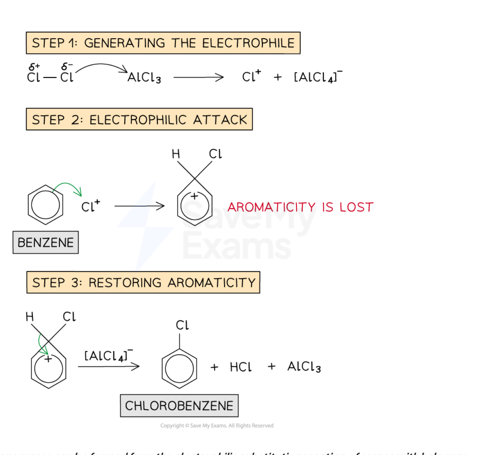
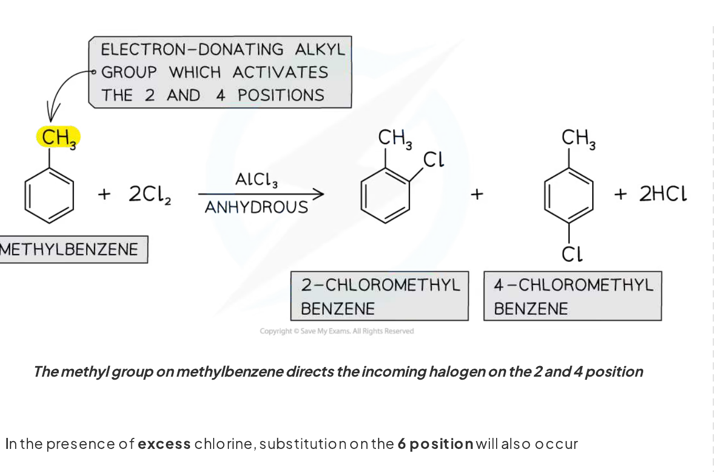
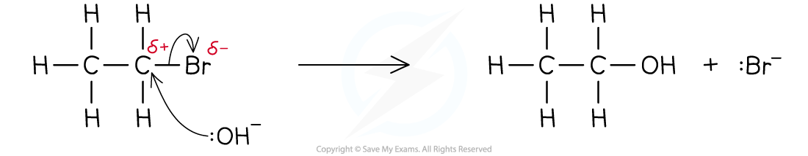
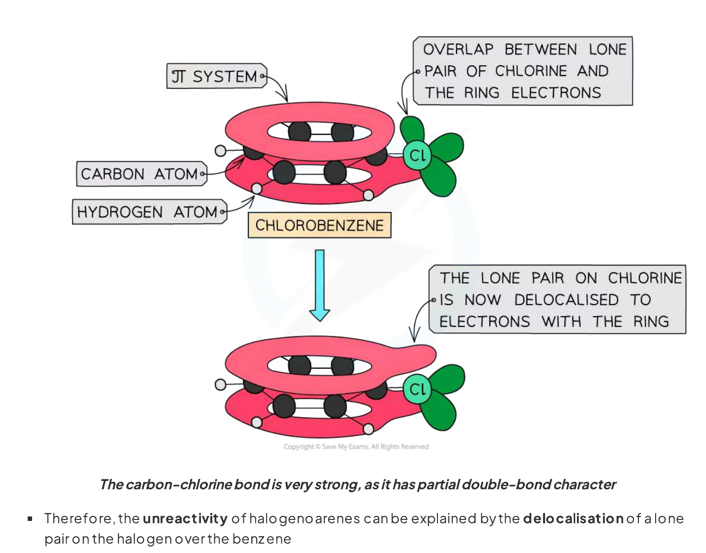

# 31 Halogen compounds

本章对应 CIE 9701 2025–2027 syllabus 的 **31.1 Halogen compounds**。题目部分对应专题题包 **7.3 Halogen Compounds (A Level Only)** 的 Easy、Medium 与 Hard Structured Questions。

## Learning objectives

学完本章后，你应该能够：

- describe the preparation of halogenoarenes from benzene and methylbenzene;
- write equations for the formation of the electrophile in halogenation;
- describe the electrophilic substitution mechanism, including curly arrows, charges and catalyst regeneration;
- explain why the methyl group is 2,4-directing and predict the major products of ring substitution;
- distinguish ring halogenation from free-radical side-chain halogenation;
- compare the reactivity of halogenoalkanes and halogenoarenes towards nucleophiles;
- explain the partial double-bond character of the C–X bond in a halogenoarene;
- use directing effects to plan short aromatic synthesis routes.

## 31.1 Halogen compounds

::: {.study-card}
### Halogenoarenes and electrophilic substitution

A **halogenoarene** is an aromatic compound in which a halogen atom is bonded directly to a benzene ring. Chlorobenzene and bromobenzene are examples. They are prepared by reacting benzene with chlorine or bromine in the presence of an anhydrous halogen carrier:

$$\ce{C6H6 + Cl2 ->[anhydrous\ AlCl3] C6H5Cl + HCl}$$

$$\ce{C6H6 + Br2 ->[anhydrous\ AlBr3] C6H5Br + HBr}$$

The halogen carrier is a Lewis acid. It accepts an electron pair from the halogen molecule and polarises the X–X bond, producing a strong electrophile. For chlorination:

$$\ce{Cl2 + AlCl3 -> Cl+ + [AlCl4]-}$$

The benzene ring attacks the electrophile, forming a positively charged arenium ion. Loss of a proton restores the delocalised aromatic system. The reaction is therefore **electrophilic substitution**: a hydrogen atom on the ring is replaced by a halogen atom.

{.concept-figure fig-alt="Electrophilic substitution of benzene by chlorine with electrophile generation and catalyst regeneration"}
:::

::: {.worked-example}
Worked example · Electrophilic substitution of benzene

### Bromination mechanism and catalyst regeneration

**At room temperature and pressure, bromine reacts with benzene, in the presence of a halogen carrier to produce bromobenzene. This is an electrophilic substitution reaction. The electrophile is the bromonium ion, Br⁺, and is generated when bromine reacts with the halogen carrier, e.g. AlBr₃. Complete the mechanism to show how the bromonium ion is produced, how bromobenzene is formed from Br⁺ and benzene, and how the catalyst is regenerated.**

1. A lone pair on one bromine atom coordinates to aluminium. The Br–Br bond breaks heterolytically:

   $$\ce{Br2 + AlBr3 -> Br+ + [AlBr4]-}$$

2. A pair of electrons from the benzene $\pi$ system forms a bond to $\ce{Br+}$. A positively charged arenium ion forms and aromaticity is temporarily lost.

3. Electrons from the C–H bond on the carbon bearing bromine move back into the ring. Bromobenzene and $\ce{H+}$ form:

   $$\ce{C6H6 + Br+ -> C6H5Br + H+}$$

4. The proton reacts with the counter-ion and regenerates the catalyst:

   $$\ce{H+ + [AlBr4]- -> HBr + AlBr3}$$

   Overall:

   $$\ce{C6H6 + Br2 ->[AlBr3] C6H5Br + HBr}$$

:::

::: {.study-card}
### Halogenation of methylbenzene and directing effects

The methyl group is an electron-donating alkyl group. It pushes electron density into the benzene ring, making methylbenzene more reactive towards electrophilic substitution than benzene. It is **2,4-directing**: substitution is favoured at the positions adjacent to the methyl group (2- and 6-, which are equivalent) and opposite the methyl group (4-).

Chlorination of methylbenzene in the presence of anhydrous aluminium chloride therefore gives mainly **2-chloromethylbenzene** and **4-chloromethylbenzene**:

$$\ce{C6H5CH3 + Cl2 ->[anhydrous\ AlCl3] 2\text{-}ClC6H4CH3 + 4\text{-}ClC6H4CH3 + HCl}$$

The same electrophilic substitution mechanism applies to bromination with $\ce{Br2/AlBr3}$. With excess halogen, further substitution can occur at the remaining activated positions, producing compounds such as 2,4-dichloromethylbenzene or 2,6-dichloromethylbenzene.

{.concept-figure fig-alt="Methyl group directing electrophilic substitution to the 2 and 4 positions"}
:::

::: {.worked-example}
Worked example · Ring versus side-chain halogenation

### Choosing conditions for methylbenzene

**Methylbenzene can react with chlorine under different conditions to give the monochloro derivatives F and G, shown in Fig. 2.1. Suggest reagents and conditions for each reaction, identify the type of reaction mechanism in each case, and, when the reagent used in Reaction 1 is present in excess, draw and name one further organic product.**

- **Reaction 1: ring substitution.** Use $\ce{Cl2}$ and anhydrous $\ce{AlCl3}$, at room temperature. The mechanism is **electrophilic substitution**. The products are mainly 2-chloromethylbenzene and 4-chloromethylbenzene.
- **Reaction 2: side-chain substitution.** Use $\ce{Cl2}$ and ultraviolet light; heating or boiling methylbenzene is acceptable. The mechanism is **free-radical substitution**. The product is benzyl chloride, $\ce{C6H5CH2Cl}$.
- With excess chlorine in Reaction 1, one acceptable product is **2,4-dichloromethylbenzene**. **2,6-dichloromethylbenzene** is also acceptable.

:::

::: {.study-card}
### Halogenoalkanes: nucleophilic substitution

In a halogenoalkane, the C–X bond is polar because the halogen is more electronegative than carbon:

$$\ce{C^{\delta+}-X^{\delta-}}$$

A nucleophile such as $\ce{OH-}$ is attracted to the slightly positive carbon atom. It donates a lone pair to carbon and the C–X bond breaks, so the halogen is replaced:

$$\ce{CH3CH2Br + OH- -> CH3CH2OH + Br-}$$

This is **nucleophilic substitution**. The nucleophile forms a new covalent bond while the leaving group departs with the bonding electron pair.

{.concept-figure fig-alt="Hydroxide ion attacking a halogenoalkane and replacing bromine"}
:::

::: {.worked-example}
Worked example · Comparing halogenoalkanes and halogenoarenes

### Reactivity towards hydroxide ions

**2-bromopentane is a halogenoalkane and bromobenzene is a halogenoarene. State which is the most reactive compound. Explain why 2-bromopentane readily undergoes nucleophilic substitution with hydroxide ions whereas bromobenzene requires extreme conditions.**

1. 2-bromopentane is the more reactive compound.
2. In 2-bromopentane, the polar C–Br bond leaves the carbon atom slightly positive. The hydroxide ion can attack this carbon and displace $\ce{Br-}$.
3. In bromobenzene, one lone pair on bromine overlaps with the delocalised $\pi$ system of the benzene ring. The C–Br bond therefore has **partial double-bond character** and is shorter and stronger than an ordinary C–Br single bond.
4. The $sp^2$ carbon in bromobenzene also holds the bond more strongly. Consequently, the C–Br bond is difficult to break and nucleophilic substitution occurs only under extreme conditions.

:::

::: {.study-card}
### Why halogenoarenes are less reactive

Halogenoarenes such as chlorobenzene do not readily undergo nucleophilic substitution. A lone pair on chlorine overlaps sideways with the p orbitals in the benzene ring. This lone pair becomes partly delocalised over the aromatic $\pi$ system:

- the C–Cl bond gains partial double-bond character;
- the C–Cl bond becomes shorter and stronger;
- the carbon is $sp^2$ hybridised rather than $sp^3$ hybridised;
- an incoming negative nucleophile is not readily able to displace the halogen under standard conditions.

The important distinction is that a halogenoalkane has a normal polar C–X single bond, whereas a halogenoarene has a resonance-stabilised C–X bond with partial double-bond character.

{.concept-figure fig-alt="Overlap of a chlorine lone pair with the benzene pi system in chlorobenzene"}
:::

::: {.worked-example}
Worked example · C–Br bond strength

### Using bond enthalpy to compare compounds

**The average bond enthalpy of a C–Br bond is 276 kJ mol⁻¹. Suggest whether the bond enthalpy of the C–Br bond in bromobenzene is greater or less than the average bond enthalpy and state what this means about the strength of the C–Br bond in bromobenzene. Then suggest what happens as OH⁻ approaches bromobenzene under standard conditions.**

- The C–Br bond enthalpy in bromobenzene is **greater than 276 kJ mol⁻¹** because the bond has partial double-bond character.
- Therefore the C–Br bond in bromobenzene is **stronger** than the average C–Br bond in a halogenoalkane.
- As $\ce{OH-}$ approaches, it is repelled by the delocalised electron density of the benzene ring. The strong C–Br bond is not readily broken, so no significant nucleophilic substitution occurs under standard conditions.

:::

::: {.study-card}
### Directing effects in aromatic synthesis

Directing effects are useful when more than one substituent must be introduced into a benzene ring:

| Substituent already on the ring | Effect on incoming electrophile |
|---|---|
| alkyl group such as $\ce{-CH3}$ | 2,4-directing; activates the ring |
| amino group, $\ce{-NH2}$ | 2,4-directing; activates the ring |
| nitro group, $\ce{-NO2}$ | 3-directing; deactivates the ring |
| carboxylic acid group, $\ce{-COOH}$ | 3-directing; deactivates the ring |

The order of steps matters. To make 4-chlorophenylamine, introduce chlorine before nitration, because the nitro group would direct chlorination to the 3-position. Reduce $\ce{-NO2}$ to $\ce{-NH2}$ only after the required ring substitution, because $\ce{-NH2}$ is strongly 2,4-directing.

::: {.formula-panel}
### Useful preparation reactions

- arene halogenation: $\ce{X2/AlX3}$, electrophilic substitution;
- side-chain halogenation: $\ce{X2/UV}$, free-radical substitution;
- nitro group reduction: $\ce{Sn/HCl}$ and heat;
- carboxylic acid to acyl chloride: $\ce{SOCl2}$, $\ce{PCl3}$ or $\ce{PCl5}$.
:::
:::

::: {.worked-example}
Worked example · Planning a substituted arene

### Making 4-amino-3,5-dichlorobenzoic acid

**A benzoic acid derivative containing an amino group and two chlorine atoms is prepared by chlorination of an aromatic ring. State the IUPAC name of the product and explain why chlorine is introduced after the nitro group has been reduced to an amino group.**

1. The carboxylic acid carbon is carbon 1. The amino group is at carbon 4 and the chlorine atoms are at carbons 3 and 5.
2. The product is **4-amino-3,5-dichlorobenzoic acid**.
3. The $\ce{-NH2}$ group is electron-donating and directs incoming electrophiles to the 2- and 4-positions relative to itself. The 4-position is already occupied by $\ce{-COOH}$, so further chlorination occurs at positions 3 and 5, which are also favoured by the 3-directing $\ce{-COOH}$ group.

:::

## Chapter checklist

- [ ] 我能写出 benzene / methylbenzene 的 ring halogenation 条件和 electrophilic substitution 机制。
- [ ] 我能写出 $\ce{X2 + AlX3}$ 生成 $\ce{X+}$ 和 $\ce{[AlX4]-}$ 的方程式。
- [ ] 我能区分 ring substitution 与 side-chain free-radical substitution。
- [ ] 我能解释 methyl group、amino group、nitro group 和 carboxylic acid group 的 directing effects。
- [ ] 我能解释 halogenoalkanes 比 halogenoarenes 更容易发生 nucleophilic substitution 的原因。
- [ ] 我能用 lone-pair overlap 和 partial double-bond character 解释 aryl C–X bond 的强度。

## Structured questions



### Original question PDFs

- [7.3 Halogen Compounds (A Level Only) - Easy](https://raw.githubusercontent.com/nanoxsj/CIE-Chemistry-Study/publish-chemistry-study/resources/original-papers/halogen-compounds/7.3-halogen-compounds-easy.pdf)
- [7.3 Halogen Compounds (A Level Only) - Medium](https://raw.githubusercontent.com/nanoxsj/CIE-Chemistry-Study/publish-chemistry-study/resources/original-papers/halogen-compounds/7.3-halogen-compounds-medium.pdf)
- [7.3 Halogen Compounds (A Level Only) - Hard](https://raw.githubusercontent.com/nanoxsj/CIE-Chemistry-Study/publish-chemistry-study/resources/original-papers/halogen-compounds/7.3-halogen-compounds-hard.pdf)
