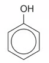
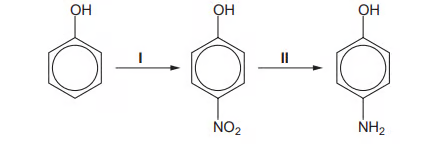
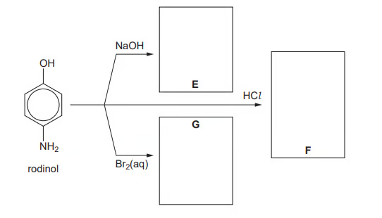
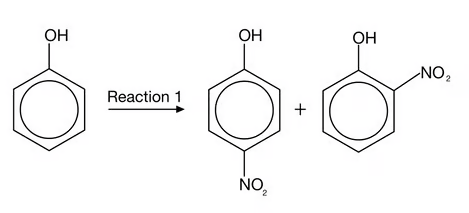
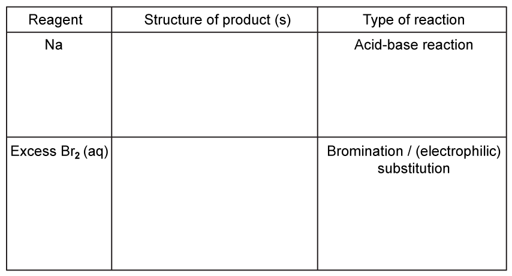
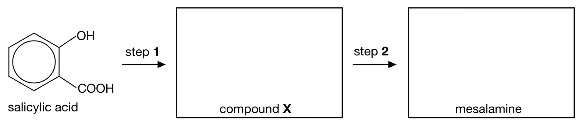

### 7.4 Hydroxy Compounds (A Level Only) - Easy

::: {.question-card}
### Example 1 · Reactions of phenol · 7.4 SQ Easy Q1

Phenol, $\ce{C6H5OH}$, undergoes many different reactions.

**Complete the equations in Fig. 1.1 showing all the products of each of these reactions of phenol. If no reaction occurs write no reaction in the products box.**

{fig-alt="Phenol reacting with sodium"}
{fig-alt="Reaction arrow"}

{fig-alt="Phenol reacting with sodium hydroxide"}
{fig-alt="Reaction arrow"}

{fig-alt="Phenol reacting with ethanoic acid"}
{fig-alt="Reaction arrow"}

{fig-alt="Phenol reacting with bromine water"}
{fig-alt="Reaction arrow"}

The corresponding reagent labels and product boxes are shown in the extracted figure elements above. **[4 marks]**

**(b)** State the reaction mechanism that occurs when phenol reacts with bromine water. **[1 mark]**

**(c)** Phenol undergoes bromination when reacted with bromine water. Benzene also undergoes bromination but requires different reaction conditions. State any other necessary conditions for the bromination of phenol and give the necessary reaction conditions for the bromination of benzene. **[2 marks]**

Show mark scheme / model answer

**(a)**

- With sodium: $\ce{2C6H5OH + 2Na -> 2C6H5O^-Na^+ + H2}$ (the unbalanced form showing sodium phenoxide and hydrogen also identifies the products).
- With sodium hydroxide: $\ce{C6H5OH + NaOH -> C6H5O^-Na^+ + H2O}$.
- With ethanoic acid: **no reaction**, because both phenol and ethanoic acid are weak acids.
- With bromine water: $\ce{C6H5OH + 3Br2(aq) -> C6H2Br3OH + 3HBr}$, forming 2,4,6-tribromophenol.

Each correct equation or correct “no reaction”: **[1]** each.

**(b)** The mechanism is **electrophilic substitution**. The oxygen lone pair is delocalised into the aromatic ring, increasing its electron density and making it susceptible to attack by an electrophile. **[1]**

**(c)**

- Phenol: room temperature; bromine water is sufficient and no halogen carrier is needed. **[1]**
- Benzene: pure bromine and an anhydrous halogen carrier such as $\ce{AlBr3}$ (or $\ce{FeBr3}$), usually at room temperature. **[1]**

:::

::: {.question-card}
### Example 2 · Preparation of phenol and ester formation · 7.4 SQ Easy Q2

Phenol can be prepared by the reaction of phenylamine with nitric(III) acid. This reaction involves three steps.

**(a)** In the first step, nitric(III) acid, $\ce{HNO2}$, is prepared.

**(i)** Complete the equation to show the formation of nitric(III) acid:

$$\ce{\rule{2.5cm}{0.15mm} + HCl -> HNO2 + \rule{2.5cm}{0.15mm}}$$

**(ii)** State the necessary condition for this reaction. **[2 marks]**

**(b)** In the second step in the production of phenol, the diazonium salt shown below is formed. In the final step, the diazonium salt is decomposed by warming with water to produce phenol. State the formula of any other products.

{.question-figure fig-alt="Benzenediazonium chloride"}

**[2 marks]**

**(c)** Phenol will react with ethanoyl chloride in the presence of sodium hydroxide and heat. Draw the displayed formula of the organic product and state its name. **[2 marks]**

Show mark scheme / model answer

**(a)**

**(i)**

$$\ce{NaNO2 + HCl -> HNO2 + NaCl}$$

Correct reactants and product $\ce{NaCl}$: **[1]**.

**(ii)** Prepare the acid freshly in ice / keep the mixture below $10\,^{\circ}\mathrm{C}$, because nitric(III) acid is unstable. **[1]**

**(b)** The other products are $\ce{HCl}$ and $\ce{N2}$:

$$\ce{C6H5N2+Cl^- + H2O ->[warm] C6H5OH + HCl + N2}$$

Formula $\ce{HCl}$: **[1]**; formula $\ce{N2}$: **[1]**.

**(c)** The organic product is phenyl ethanoate:

$$\ce{C6H5OH + CH3COCl ->[NaOH,\ heat] CH3COOC6H5 + HCl}$$

The displayed structure must show the phenyl group bonded through oxygen to the ethanoyl group; name: **phenyl ethanoate**. **[2]**

:::

::: {.question-card}
### Example 3 · 1-Naphthol · 7.4 SQ Easy Q3

1-Naphthol is a phenolic compound. Its structure is shown below.

{.question-figure fig-alt="Structure of 1-naphthol"}

**(a)** Give the molecular formula of 1-naphthol. **[1 mark]**

**(b)** Like phenol, 1-naphthol is a weak acid. Write an equation to show how 1-naphthol acts as a weak acid. **[1 mark]**

**(c)** 1-Naphthol undergoes similar reactions to phenol. Suggest the structure of the organic compound that is produced when 1-naphthol reacts with bromine water. **[1 mark]**

Show mark scheme / model answer

**(a)** Molecular formula: **$\ce{C10H8O}$**. **[1]**

**(b)** If $\ce{ArOH}$ represents 1-naphthol:

$$\ce{C10H8O <=> C10H7O^- + H^+}$$

or, using the structural shorthand for 1-naphthol, $\ce{C10H7OH <=> C10H7O^- + H^+}$. **[1]**

**(c)** Bromine substitutes at the positions activated and directed by the hydroxyl group. The product is a brominated 1-naphthol, with bromine entering the available activated position(s); the structure must show substitution on the aromatic ring and retention of the $\ce{-OH}$ group. **[1]**

:::

### 7.4 Hydroxy Compounds (A Level Only) - Medium

::: {.question-card}
### Example 4 · Phenol reactions and directing effects · 7.4 SQ Medium Q1

This question is about the reactions of the aromatic alcohol, phenol. Phenol behaves as a weak acid.

**(a)**

**(i)** Write the equation for phenol reacting with sodium hydroxide. **[2]**

**(ii)** Write the equation for phenol reacting with sodium metal. **[3]**

**(b)** Phenols also undergo electrophilic substitution reactions when reacted with bromine water at room temperature. Describe two observations that can be made during this reaction. **[1 mark]**

**(c)** Draw the structures of the two possible products from the reaction of phenol with dilute nitric acid. **[2 marks]**

**(d)** Explain why 3-nitrophenol is not formed when phenol reacts with dilute nitric acid. **[1 mark]**

Show mark scheme / model answer

**(a)**

**(i)**

$$\ce{C6H5OH + NaOH -> C6H5O^-Na^+ + H2O}$$

Correct reactants: **[1]**; correct products: **[1]**.

**(ii)**

$$\ce{2C6H5OH + 2Na -> 2C6H5O^-Na^+ + H2}$$

Correct reactants: **[1]**; correct products: **[1]**; correctly balanced: **[1]**.

**(b)** The orange bromine water is decolourised and a white precipitate forms. **[2]**

**(c)** The two products are **2-nitrophenol** and **4-nitrophenol**. In each structure, $\ce{-NO2}$ is at the 2- or 4-position relative to $\ce{-OH}$.

**(d)** The $\ce{-OH}$ group is a **2,4,6-directing** group. Its oxygen lone pair donates electron density into the ring, so the incoming electrophile is directed to positions 2, 4 and 6 rather than position 3. **[1]**

:::

::: {.question-card}
### Example 5 · Formula and acidity of phenol · 7.4 SQ Medium Q2

This question is about phenol. Phenol is an aryl compound.

**(a)**

**(i)** Give the molecular formula of phenol. **[1]**

**(ii)** Give the empirical formula of phenol. **[1]**

**(b)** Explain why phenol is a weak acid. You should include an equation in your answer. **[3 marks]**

**(c)** Describe and explain how the acidities of ethanol and phenol compare to that of water. **[4 marks]**

**(d)** Phenol reacts with bromine water.

**(i)** Give the name of the product formed by this reaction. **[1]**

**(ii)** Write a balanced chemical equation for this reaction. **[1]**

**(e)** Explain how the reactions of phenol and benzene with bromine can show that phenol is more reactive than benzene. **[3 marks]**

Show mark scheme / model answer

**(a)**

- Molecular formula: **$\ce{C6H6O}$**. **[1]**
- Empirical formula: **$\ce{C6H6O}$**, because the molecular formula cannot be simplified. **[1]**

**(b)** Phenol can donate the hydrogen ion from its $\ce{-OH}$ group. The ionisation is incomplete:

$$\ce{C6H5OH <=> C6H5O^- + H^+}$$

The phenoxide ion is stabilised because its negative charge is spread out by delocalisation over the oxygen and aromatic ring. This makes the equilibrium favour ionisation more than it would for an aliphatic alcohol, but it does not make phenol a strong acid. **[3]**

**(c)** The order of acidity is:

$$\textbf{ethanol < water < phenol}$$

- Ethanol is less acidic than water because the electron-donating ethyl group concentrates negative charge on oxygen in the ethoxide ion. **[2]**
- Phenol is more acidic than water because the negative charge in phenoxide is spread out and the conjugate base is more stable. **[2]**

**(d)**

- Product: **2,4,6-tribromophenol**. **[1]**
- Balanced equation:

  $$\ce{C6H5OH + 3Br2(aq) -> C6H2Br3OH + 3HBr}$$

  **[1]**

**(e)** Any three relevant comparisons: benzene requires liquid / pure bromine and an anhydrous halogen carrier such as $\ce{AlBr3}$, whereas phenol reacts with bromine water without a catalyst; benzene normally monosubstitutes, whereas phenol readily trisubstitutes to form 2,4,6-tribromophenol. These show that phenol reacts more readily with electrophiles. **[3]**

:::

::: {.question-card}
### Example 6 · Phenol preparation and diazonium coupling · 7.4 SQ Medium Q3

Phenol can be prepared from phenylamine. There are three stages:

- Stage 1: prepare nitric(III) acid using sodium nitrite and hydrochloric acid.
- Stage 2: react phenylamine with nitric(III) acid and hydrochloric acid to form a diazonium salt.
- Stage 3: thermally decompose the diazonium salt to form phenol, hydrochloric acid and nitrogen gas.

**(a)**

**(i)** Give the essential conditions for the reaction in stage 2. **[1]**

**(ii)** Draw the displayed formula of the diazonium salt formed in stage 2. **[3]**

**(b)** Write balanced symbol equations for the reactions that occur at each stage. **[3 marks]**

**(c)** The diazonium salt formed during stage 2 can also react with phenol to form a useful substance, Z.

**(i)** Give the displayed formula of Z. **[2]**

**(ii)** Suggest a possible use for Z. **[1]**

**(d)** The first step of substance Z involves creating the diazonium ion. Explain why the reaction to produce the diazonium ion is carried out at below $10\,^{\circ}\mathrm{C}$. **[1 mark]**

Show mark scheme / model answer

**(a)**

- Keep the reaction mixture below $10\,^{\circ}\mathrm{C}$, usually in ice. **[1]**
- The salt is benzenediazonium chloride, $\ce{C6H5-N#N^+ Cl^-}$. The displayed formula must show the phenyl group, the $\ce{N#N}$ unit, the positive charge and the chloride ion. **[3]**

**(b)**

Stage 1:

$$\ce{NaNO2 + HCl -> HNO2 + NaCl}$$

Stage 2:

$$\ce{C6H5NH2 + HNO2 + HCl -> C6H5N2+Cl^- + 2H2O}$$

An equivalent equation using sodium nitrite directly is:

$$\ce{C6H5NH2 + NaNO2 + 2HCl -> C6H5N2+Cl^- + 2H2O + NaCl}$$

Stage 3:

$$\ce{C6H5N2+Cl^- + H2O ->[warm] C6H5OH + HCl + N2}$$

One correct balanced equation for each stage: **[3]**.

**(c)** The diazonium ion couples with phenoxide mainly at the para position to the hydroxyl group. Z is an azo compound containing two arene rings joined by $\ce{-N=N-}$ and a phenolic $\ce{-OH}$ group. **[2]** A possible use is as a coloured azo dye. **[1]**

**(d)** The diazonium ion is unstable and would decompose at higher temperature, so cooling prevents premature decomposition before coupling. **[1]**

:::

::: {.question-card}
### Example 7 · Rodinol synthesis and reactions · 7.4 SQ Medium Q4

Rodinol is used as a photographic developer. It can be synthesised from phenol by the route shown below.

{.question-figure fig-alt="Synthesis route from phenol through nitrophenol to rodinol"}

**(a)**

**(i)** Suggest reagents and conditions for step I. **[1]**

**(ii)** Name the mechanism by which this reaction occurs. **[1]**

**(b)**

**(i)** What type of reaction is step II? **[1]**

**(ii)** Give suitable reagents that could be used in step II. **[2]**

**(c)** Rodinol can undergo many reactions. Suggest the structural formulae for the compounds E, F and G in the reaction chart.

{.question-figure fig-alt="Reaction chart for rodinol with sodium hydroxide hydrochloric acid and bromine water"}

**[3 marks]**

Show mark scheme / model answer

**(a)**

- Step I: dilute nitric acid, $\ce{HNO3(aq)}$, at room temperature. **[1]**
- Mechanism: electrophilic substitution. **[1]**

**(b)**

- Step II is reduction of the nitro group to an amino group. **[1]**
- Use tin and concentrated hydrochloric acid, $\ce{Sn/conc. HCl}$, heat under reflux. **[2]**

**(c)** Rodinol is 1,3-dihydroxy-4-aminobenzene in the scheme.

- E: the sodium phenoxide salt, $\ce{H2N-C6H3(OH)(ONa)}$, with the sodium replacing the phenolic hydrogen; water is also formed.
- F: the hydrochloride salt after acidification, $\ce{[H3N^+-C6H3(OH)2]Cl^-}$, or the equivalent displayed positional structure.
- G: a brominated rodinol. Bromine substitutes on the activated ring, preferentially at positions directed by the two hydroxyl groups; an acceptable major structure is a monobromorodinol such as $\ce{H2N-C6H2Br(OH)2}$.

Each correct structural formula: **[1]**.

:::

::: {.question-card}
### Example 8 · Esters and phenyl benzoate · 7.4 SQ Medium Q5

Acyl chlorides are useful reagents in synthesis. They react with aromatic compounds and also with alcohols.

**(a)**

**(i)** Give the reagents and conditions required to make ethyl ethanoate directly from a carboxylic acid. **[3]**

**(ii)** Write an equation to show the formation of ethyl ethanoate in part (a)(i). **[1]**

**(b)** Phenyl benzoate is made from the reaction between benzoyl chloride and phenol. Its structure is shown below.

{.question-figure fig-alt="Structure of phenyl benzoate"}

What is the molecular formula of phenyl benzoate? **[1 mark]**

**(c)**

**(i)** Give the essential conditions needed for the reaction in part (b). **[2]**

**(ii)** Describe one observation you would make in this reaction. **[1]**

**(d)** During the initial reaction to produce phenyl benzoate, the phenoxide ion is formed.

**(i)** Draw the structure of this ion. **[1]**

**(ii)** Explain why this ion is formed. **[1]**

**(iii)** Write an equation for the overall reaction. **[1]**

Show mark scheme / model answer

**(a)**

- Ethanol and ethanoic acid, concentrated sulfuric acid catalyst, heat under reflux. **[3]**
- $$\ce{CH3COOH + CH3CH2OH <=>[conc. H2SO4][heat] CH3COOCH2CH3 + H2O}$$ **[1]**

**(b)** Molecular formula: **$\ce{C13H10O2}$**. **[1]**

**(c)** Use aqueous $\ce{NaOH}$ and heat / warm conditions. **[2]** Steamy white fumes of hydrogen chloride may be observed, or formation of the ester product may be noted according to the observation requested. **[1]**

**(d)**

- Phenoxide: $\ce{C6H5O^-}$ (often shown with $\ce{Na^+}$ as sodium phenoxide). **[1]**
- It is formed by deprotonation of phenol by the base; the negatively charged phenoxide ion is a better nucleophile and attacks the carbonyl carbon of benzoyl chloride. **[1]**
- $$\ce{C6H5OH + C6H5COCl ->[NaOH,\ heat] C6H5COOC6H5 + HCl}$$ **[1]**

:::

### 7.4 Hydroxy Compounds (A Level Only) - Hard

::: {.question-card}
### Example 9 · Bromination, nitration and acidity · 7.4 SQ Hard Q1

This question is about the reactions of phenol and benzene.

**(a)** Explain the difference in bromination of phenol and benzene. In your answer, include structures of any organic products formed in the reaction. **[7 marks]**

**(b)** A mixture of 2-nitrophenol and 4-nitrophenol can be formed via the pathway shown below.

{.question-figure fig-alt="Phenol nitration pathway to 2-nitrophenol and 4-nitrophenol"}

**(i)** State the reagents required for reaction 1. **[1]**

**(ii)** Calculate the mass, in grams, of phenol required to form 30 g of 2-nitrophenol assuming a 35% yield. Give your answer to three significant figures and show your working. **[4]**

**(c)** Phenol reacts with sodium to form a salt and hydrogen gas in an acid-base reaction. Explain why phenol behaves as a weak acid. **[3 marks]**

Show mark scheme / model answer

**(a)**

- In phenol, an oxygen lone pair is partially delocalised into the benzene ring. **[1]**
- Benzene has only the delocalised ring $\pi$ electrons; phenol therefore has a higher electron density in the ring. **[1]**
- Phenol can polarise the $\ce{Br-Br}$ bond and generate an electrophile more readily. **[1]**
- Benzene cannot polarise bromine sufficiently and therefore requires a halogen carrier such as $\ce{AlBr3}$ or $\ce{FeBr3}$. **[1]**
- Phenol reacts with bromine water at room temperature without a catalyst. **[1]**
- Phenol forms 2,4,6-tribromophenol. **[1]**
- $$\ce{C6H5OH + 3Br2(aq) -> C6H2Br3OH + 3HBr}$$ and the product has bromine at the 2, 4 and 6 positions. **[1]**

**(b)**

**(i)** Use dilute nitric acid at room temperature. **[1]**

**(ii)**

The reaction is 1:1 in moles:

$$m_{\text{theoretical}}(\ce{2-nitrophenol})=\frac{30.0}{0.35}=85.714\ \mathrm{g}$$

$$n(\ce{2-nitrophenol})=\frac{85.714}{139.0}=0.617\ \mathrm{mol}$$

Therefore:

$$m(\ce{phenol})=0.617\times 94.0=58.0\ \mathrm{g}$$

Answer: **$58.0\ \mathrm{g}$** to three significant figures. **[4]**

**(c)** Phenol can donate $\ce{H+}$ from the hydroxyl group, forming phenoxide. Oxygen is electronegative and attracts the negative charge, while the negative charge on oxygen attracts $\ce{H+}$ back. Ionisation is therefore incomplete:

$$\ce{C6H5OH <=> C6H5O^- + H^+}$$

This incomplete ionisation is why phenol is a weak acid. **[3]**

:::

::: {.question-card}
### Example 10 · Phenyl 2-hydroxybenzoate · 7.4 SQ Hard Q2

Phenyl 2-hydroxybenzoate is an antiseptic and is shown below. A molecule of phenyl 2-hydroxybenzoate has 13 carbon atoms.

{.question-figure fig-alt="Phenyl 2-hydroxybenzoate structure and hybridisation question"}

**(a)**

**(i)** State the number of carbon atoms that are $\ce{sp}$, $\ce{sp2}$ and $\ce{sp3}$ hybridised, if any, in phenyl 2-hydroxybenzoate. **[1]**

**(ii)** Complete the table showing the reactions of phenyl 2-hydroxybenzoate with the three reagents.

{.question-figure fig-alt="Reaction table with sodium and excess bromine water"}

**[4 marks]**

**(b)** Phenyl 2-hydroxybenzoate can be made from 2-hydroxybenzoic acid and phenol by heating the two compounds strongly together. Write an equation, using the displayed formula, for this reaction. **[2 marks]**

**(c)** Complete and balance the equation for the alkaline hydrolysis of phenyl 2-hydroxybenzoate. **[3 marks]**

Show mark scheme / model answer

**(a)**

**(i)** There are no triple bonds and no saturated carbon atoms:

- $\ce{sp}$ carbon atoms = **0**;
- $\ce{sp2}$ carbon atoms = **13**;
- $\ce{sp3}$ carbon atoms = **0**. **[1]**

**(ii)**

- With sodium, the phenolic $\ce{-OH}$ group reacts in an acid-base reaction to form the sodium phenoxide derivative and hydrogen. **[1]**
- With excess $\ce{Br2(aq)}$, bromination occurs by electrophilic substitution on the activated aromatic ring(s); the product structure must show the appropriate brominated phenyl 2-hydroxybenzoate. **[1]**
- Reaction types: sodium = acid-base; excess bromine water = bromination / electrophilic substitution. **[2]**

**(b)** This is esterification between 2-hydroxybenzoic acid and phenol:

$$\ce{2-HOC6H4COOH + C6H5OH ->[heat] 2-HOC6H4COOC6H5 + H2O}$$

The displayed formula must show the carboxyl group converted into an ester linked to phenoxy. **[2]**

**(c)** Alkaline hydrolysis gives the carboxylate salt and phenol / phenoxide. A balanced ionic form is:

$$\ce{2-HOC6H4COOC6H5 + 3OH^- -> 2-HOC6H4COO^- + C6H5O^- + 2H2O}$$

The three hydroxide ions neutralise the carboxylic acid group and both phenolic groups in the products; correct products, ionisation and balance: **[3]**.

:::

::: {.question-card}
### Example 11 · Salicylic acid and mesalamine synthesis · 7.4 SQ Hard Q3

This question is about a drug called mesalamine, also known as 5-aminosalicylic acid, which is used to treat bowel disease. It can be synthesised from salicylic acid.

**(a)** State the systematic IUPAC name for salicylic acid and deduce the two positional isomers possible, giving their names and structures. **[3 marks]**

**(b)** A possible two-step synthesis of mesalamine is shown below.

{.question-figure fig-alt="Two-step synthesis route from salicylic acid through compound X to mesalamine"}

Draw the structures of compound X and mesalamine. **[2 marks]**

**(c)** State the reagents and conditions required for steps 1 and 2 in part (b). **[5 marks]**

Show mark scheme / model answer

**(a)**

- Salicylic acid: **2-hydroxybenzoic acid**. **[1]**
- The other positional isomers are **3-hydroxybenzoic acid** and **4-hydroxybenzoic acid**. **[2]**

In each structure, the carboxylic acid group is carbon 1 and the hydroxyl group is at carbon 3 or 4.

**(b)**

- Compound X: **2-hydroxy-5-nitrobenzoic acid**, with $\ce{-OH}$ at position 2, $\ce{-COOH}$ at position 1 and $\ce{-NO2}$ at position 5.
- Mesalamine: **2-hydroxy-5-aminobenzoic acid**, with $\ce{-OH}$ at position 2, $\ce{-COOH}$ at position 1 and $\ce{-NH2}$ at position 5.

**(c)**

- Step 1 reagent: dilute nitric acid, $\ce{HNO3(aq)}$. **[1]**
- Step 1 condition: room temperature. **[1]**
- Step 2 reagent: $\ce{Sn/HCl}$ (or an equivalent suitable reducing system). **[1]**
- Step 2 condition: heat under reflux. **[1]**
- Add excess aqueous $\ce{NaOH}$ after reduction to liberate the free amine from its hydrochloride salt. **[1]**

:::
