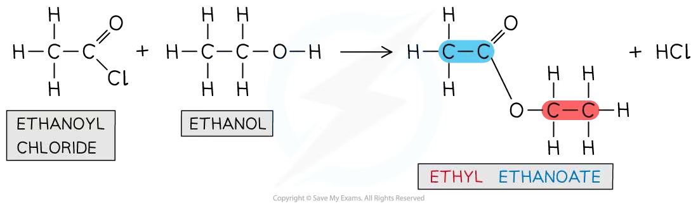
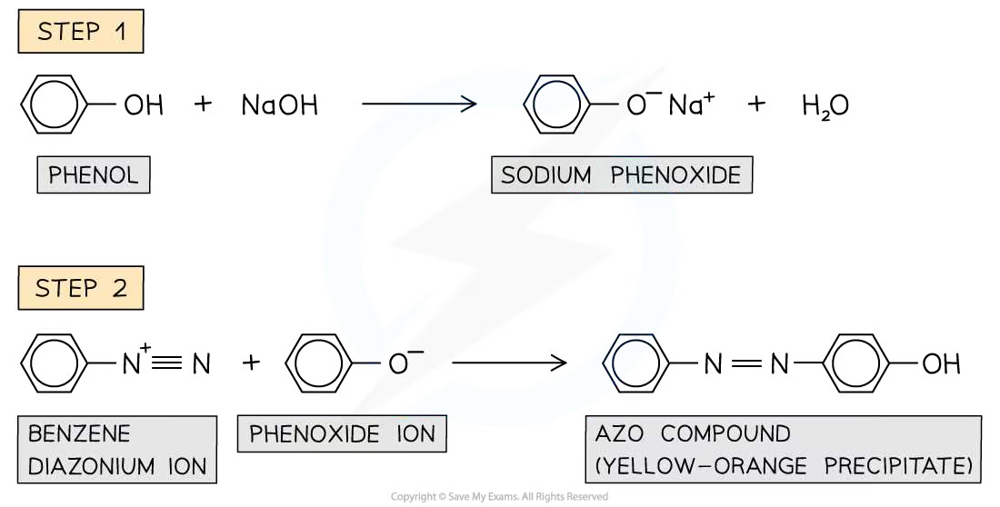
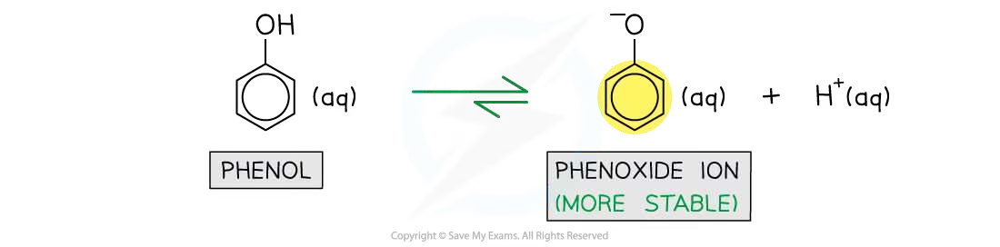
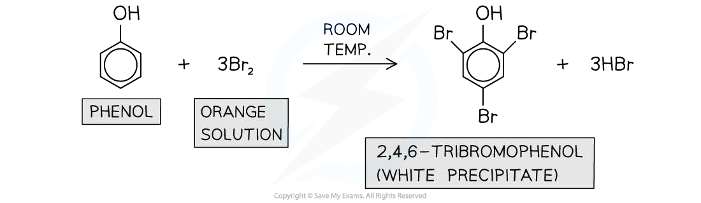
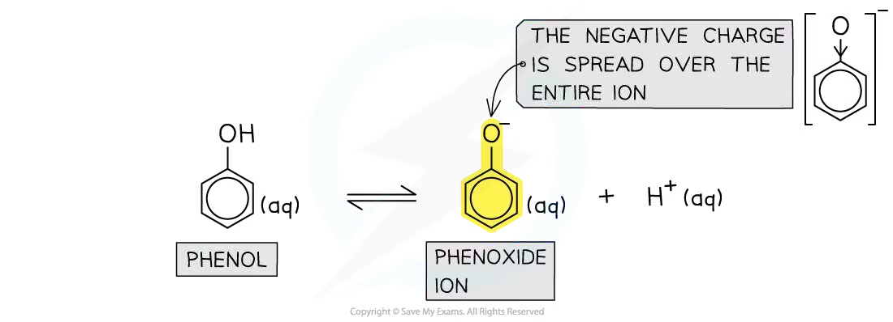
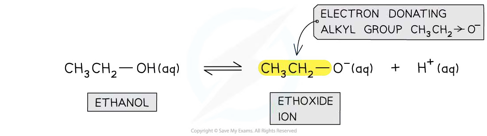

# 32 Hydroxy compounds

本章对应 CIE 9701 2025–2027 syllabus 的 **32.1 Alcohols (AL)** 与 **32.2 Phenol**。题目部分对应专题题包 **7.4 Hydroxy Compounds (A Level Only)** 的 Easy、Medium 与 Hard Structured Questions。

## Learning objectives

学完本章后，你应该能够：

- explain why acyl chlorides are reactive towards nucleophiles and write esterification equations;
- distinguish phenols from aliphatic alcohols and describe the preparation of phenol from phenylamine;
- write equations for phenol reacting with sodium, sodium hydroxide and acyl chlorides;
- explain why phenol is a weak acid and compare its acidity with water and ethanol;
- describe the activating and 2,4,6-directing effect of the hydroxyl group;
- predict the products and conditions for nitration, bromination and diazonium coupling;
- apply these ideas to substituted phenols, 1-naphthol and short synthesis routes.

## 32.1 Alcohols (AL)

::: {.study-card}
### Acyl chlorides and nucleophilic acyl substitution

An acyl chloride contains the functional group **$\ce{RCOCl}$**. The carbonyl carbon is electron-deficient because the $\ce{C=O}$ bond is polar, so it is susceptible to nucleophilic attack. When an alcohol attacks the carbonyl carbon, chloride is displaced and an ester forms. The reaction is vigorous and steamy white fumes of $\ce{HCl}$ are produced.

$$\ce{RCOCl + R'OH -> RCOOR' + HCl}$$

Acyl chlorides are more reactive than carboxylic acids: the reaction is rapid and effectively goes to completion, so a high yield of ester can be obtained.

{.concept-figure fig-alt="Ethanoyl chloride and ethanol forming ethyl ethanoate"}
:::

::: {.worked-example}
Worked example · Alcohol with an acyl chloride

### Completing an esterification equation

**Ethanoyl chloride reacts with ethanol. Complete the displayed equation, name the organic product and state one observation.**

1. The alcohol oxygen acts as the nucleophile and attacks the electron-deficient carbonyl carbon.
2. The $\ce{C-Cl}$ bond breaks and chloride leaves.
3. The equation is:

   $$\ce{CH3COCl + CH3CH2OH -> CH3COOCH2CH3 + HCl}$$

4. The organic product is **ethyl ethanoate**.
5. Steamy white fumes of hydrogen chloride are observed.

:::

::: {.study-card}
### Alcohols and phenols with acyl chlorides

Alcohols react directly and vigorously with acyl chlorides. Phenols are less effective nucleophiles because the oxygen lone pair is partly delocalised into the aromatic ring. For a phenol, heating and a base such as $\ce{NaOH}$ are required. The base removes the proton from the $\ce{-OH}$ group to form a phenoxide ion, which is a better nucleophile.

$$\ce{C6H5OH + NaOH -> C6H5O^-Na^+ + H2O}$$

$$\ce{C6H5OH + CH3COCl ->[NaOH,\ heat] CH3COOC6H5 + HCl}$$

The ester formed from phenol and ethanoyl chloride is **phenyl ethanoate**.

{.concept-figure fig-alt="Phenol reacting with ethanoyl chloride in the presence of sodium hydroxide to form phenyl ethanoate"}
:::

::: {.worked-example}
Worked example · Phenyl ester formation

### Explaining the role of the base

**Phenol reacts with ethanoyl chloride in the presence of sodium hydroxide and heat. Explain why the base is needed and give the name of the organic product.**

1. $\ce{NaOH}$ deprotonates phenol:

   $$\ce{C6H5OH + OH^- -> C6H5O^- + H2O}$$

2. The phenoxide ion has a negative charge on oxygen and is a better nucleophile than neutral phenol.
3. It attacks the carbonyl carbon of ethanoyl chloride; chloride is displaced.
4. The organic product is **phenyl ethanoate**, $\ce{CH3COOC6H5}$.
5. The reaction is nucleophilic substitution at the acyl carbon and produces $\ce{HCl}$, which is neutralised by the base.

:::

## 32.2 Phenol

::: {.study-card}
### Producing phenol from phenylamine

Phenol is an organic compound in which an $\ce{-OH}$ group is attached directly to a benzene ring. It can be prepared from phenylamine in three stages.

**Stage 1: prepare nitrous acid.** Sodium nitrite reacts with dilute hydrochloric acid. Nitrous acid is unstable, so it is prepared freshly and kept below $10\,^{\circ}\mathrm{C}$ in an ice bath.

$$\ce{NaNO2 + HCl -> HNO2 + NaCl}$$

**Stage 2: form benzenediazonium chloride.**

$$\ce{C6H5NH2 + HNO2 + HCl -> C6H5N2+Cl^- + 2H2O}$$

**Stage 3: hydrolyse the diazonium salt.** Warming the unstable diazonium salt with water gives phenol, hydrochloric acid and nitrogen gas:

$$\ce{C6H5N2+Cl^- + H2O ->[warm] C6H5OH + HCl + N2}$$

{.concept-figure fig-alt="Formation of phenol from benzenediazonium chloride by warming with water"}
:::

::: {.worked-example}
Worked example · Preparation of phenol

### Why the temperature is controlled

**Phenol is prepared from phenylamine using nitrous acid. State the conditions for forming the diazonium salt and explain why the reaction mixture is kept below $10\,^{\circ}\mathrm{C}$.**

1. Use $\ce{NaNO2}$ and dilute $\ce{HCl}$ to produce $\ce{HNO2}$ in situ.
2. Keep the mixture in ice at below $10\,^{\circ}\mathrm{C}$.
3. Add phenylamine and dilute hydrochloric acid to form benzenediazonium chloride.
4. The diazonium ion is unstable and decomposes at higher temperature. Cooling prevents premature decomposition before the diazonium salt can be used in the next reaction.
5. On warming with water, it decomposes to phenol and $\ce{N2}$.

:::

::: {.study-card}
### Phenol as a weak acid

Phenol is only slightly soluble in water, but it dissolves in alkaline solution because it reacts with $\ce{NaOH}$ to form soluble sodium phenoxide:

$$\ce{C6H5OH + NaOH -> C6H5O^-Na^+ + H2O}$$

It also reacts with sodium metal to form sodium phenoxide and hydrogen gas:

$$\ce{2C6H5OH + 2Na -> 2C6H5O^-Na^+ + H2}$$

Phenol does not react with ethanoic acid because both are weak acids. Phenol is a weak acid because it can donate the hydrogen ion from its $\ce{-OH}$ group, but ionisation is incomplete:

$$\ce{C6H5OH(aq) <=> C6H5O^-(aq) + H^+(aq)}$$

The conjugate base, the **phenoxide ion**, is stabilised because the negative charge is delocalised from oxygen into the aromatic $\ce{\pi}$ system. The lower charge density makes the ion less likely to accept $\ce{H+}$ again.

{.concept-figure fig-alt="Phenol ionising to form the phenoxide ion with delocalised negative charge"}
:::

::: {.formula-panel}
### Comparing acidity

At $25\,^{\circ}\mathrm{C}$, the approximate p$K_a$ values are:

| Acid | Conjugate base | p$K_a$ |
|---|---|---:|
| Ethanol | Ethoxide ion | 16 |
| Water | Hydroxide ion | 14 |
| Phenol | Phenoxide ion | 10 |

Therefore, acidity increases in the order **ethanol < water < phenol**. The ethyl group is electron-donating and concentrates negative charge on oxygen in ethoxide, making ethoxide a stronger base. In phenoxide, the charge is spread over the ion by delocalisation.
:::

::: {.worked-example}
Worked example · Comparing weak acids

### Ethanol, water and phenol

**Describe and explain how the acidities of ethanol and phenol compare with that of water.**

1. Ethanol is less acidic than water.
2. The ethyl group is electron-donating and increases the negative charge density on oxygen in the ethoxide ion. Ethoxide therefore attracts $\ce{H+}$ more strongly.
3. Phenol is more acidic than water.
4. The negative charge in the phenoxide ion is delocalised over the aromatic ring, so the conjugate base is more stable and less likely to accept $\ce{H+}$.
5. The order is **ethanol < water < phenol**.

:::

::: {.study-card}
### Reactions of the aromatic ring: bromination and nitration

The oxygen lone pair in phenol overlaps with the delocalised $\ce{\pi}$ system. This donates electron density into the ring, activates it towards electrophiles and directs substitution to the **2, 4 and 6 positions**.

Phenol reacts with bromine water at room temperature without a halogen carrier. The orange bromine solution is decolourised and a white precipitate of 2,4,6-tribromophenol forms:

$$\ce{C6H5OH + 3Br2(aq) -> C6H2Br3OH + 3HBr}$$

With dilute nitric acid at room temperature, a mixture of 2-nitrophenol and 4-nitrophenol forms. Concentrated nitric acid gives 2,4,6-trinitrophenol instead.

{.concept-figure fig-alt="Nitration of phenol with dilute and concentrated nitric acid"}

{.concept-figure fig-alt="Bromination of phenol to form 2,4,6-tribromophenol"}
:::

::: {.worked-example}
Worked example · Electrophilic substitution of phenol

### Choosing conditions and products

**Phenol and benzene both undergo bromination. State the conditions for each reaction, explain the difference in reactivity and identify the product from phenol.**

1. Phenol reacts with bromine water at room temperature and does not require a catalyst. It forms 2,4,6-tribromophenol, a white precipitate.
2. Benzene requires pure bromine and anhydrous $\ce{AlBr3}$ (or another suitable halogen carrier) at room temperature.
3. The lone pair on oxygen in phenol is delocalised into the ring, increasing electron density and allowing the ring to polarise $\ce{Br2}$.
4. Benzene has a lower electron density and cannot polarise $\ce{Br2}$ sufficiently, so a halogen carrier is needed to generate a stronger electrophile.
5. The hydroxyl group is 2,4,6-directing, so substitution occurs at those positions.

:::

::: {.study-card}
### Diazonium coupling and other phenolic compounds

When phenol is dissolved in sodium hydroxide, sodium phenoxide forms. Cooling this solution and adding a cold diazonium ion produces an azo compound. The two benzene rings are joined by an $\ce{-N=N-}$ bridge and the product is often a yellow-orange dye or precipitate.

{.concept-figure fig-alt="Diazonium ion coupling with phenoxide to form an azo compound"}

1-Naphthol is a phenolic compound. Its formula is $\ce{C10H8O}$, and it undergoes similar electrophilic substitution reactions. The hydroxyl group directs electrophiles towards the 2 and 4 positions.

{.concept-figure fig-alt="Structure and directing effects of 1-naphthol"}
:::

## Chapter checklist

- [ ] I can explain why acyl chlorides undergo nucleophilic substitution and write esterification equations.
- [ ] I can explain why phenol needs heat and a base to react with an acyl chloride.
- [ ] I can write all three equations in the preparation of phenol from phenylamine.
- [ ] I can explain phenol's weak acidity using the stability and delocalisation of phenoxide.
- [ ] I can compare the acidity of ethanol, water and phenol.
- [ ] I can predict phenol bromination and nitration products and conditions.
- [ ] I can explain the 2,4,6-directing effect and describe diazonium coupling.
- [ ] I can apply these ideas to 1-naphthol and substituted phenols.

## Structured questions



### Original question PDFs

- [7.4 Hydroxy Compounds (A Level Only) - Easy](https://raw.githubusercontent.com/nanoxsj/CIE-Chemistry-Study/publish-chemistry-study/resources/original-papers/hydroxy-compounds/7.4-hydroxy-compounds-easy.pdf)
- [7.4 Hydroxy Compounds (A Level Only) - Medium](https://raw.githubusercontent.com/nanoxsj/CIE-Chemistry-Study/publish-chemistry-study/resources/original-papers/hydroxy-compounds/7.4-hydroxy-compounds-medium.pdf)
- [7.4 Hydroxy Compounds (A Level Only) - Hard](https://raw.githubusercontent.com/nanoxsj/CIE-Chemistry-Study/publish-chemistry-study/resources/original-papers/hydroxy-compounds/7.4-hydroxy-compounds-hard.pdf)
