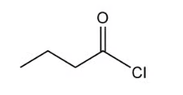
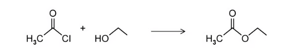

# 7.5 Carboxylic Acids & Derivatives (A Level Only) - Structured Questions

本页保留题包中的全部 Structured Questions。当前题包包含 Easy 与 Medium，没有独立 Hard PDF，因此不虚构 Hard 题目。题目保留完整英文题干、所有分问、原始分值和题目中的独立图；答案按 Model Answers 整理，并把机制题、计算/合成题和观察题的解答步骤完整呈现。

### 7.5 Carboxylic Acids & Derivatives (A Level Only) - Easy

::: {.question-card}
### Example 1 · Acyl chloride reactions · 7.5 SQ Easy Q1

This question is about acyl chlorides.

**(a)** Fig. 1.1 shows the displayed formula of an organic compound.

{.question-figure fig-alt="Displayed formula of butanoyl chloride"}

Name the organic compound. `[1 mark]`

**(b)** Ethanoyl chloride reacts with ethanol as shown in Fig. 1.2.

{.question-figure fig-alt="Ethanoyl chloride reacting with ethanol to form ethyl ethanoate"}

State the name of the other product. `[1 mark]`

State the type of reaction. `[1 mark]`

Ethanoyl chloride reacts with ammonia. Write an equation for this reaction. `[2 marks]`

Propanoyl chloride can be prepared from propanoic acid. State a reagent that can be used and write the equation for the reaction. `[3 marks]`

Show mark scheme / model answer

- **(a)** The compound is **butanoyl chloride**. `[1]`
- **(b)** The other product is **hydrogen chloride**, $\ce{HCl}$. The reaction is a **condensation reaction** because a small molecule is eliminated when the larger ester molecule forms. `[2]`
- With ammonia:

  $$\ce{CH3COCl + 2NH3 -> CH3CONH2 + NH4Cl}$$

  Ethanamide and ammonium chloride are formed. The second ammonia molecule neutralises the hydrogen chloride produced in the substitution step. `[2]`
- One suitable reagent is thionyl chloride, $\ce{SOCl2}$:

  $$\ce{CH3CH2COOH + SOCl2 -> CH3CH2COCl + SO2 + HCl}$$

  Phosphorus(V) chloride, $\ce{PCl5}$, or phosphorus(III) chloride, $\ce{PCl3}$, is also acceptable with the appropriate balanced equation. `[3]`

:::

::: {.question-card}
### Example 2 · Oxidation and acidity of benzoic acid · 7.5 SQ Easy Q2

This question is about benzoic acid.

**(a)** Draw the displayed formula of benzoic acid. `[1 mark]`

Methylbenzene can be oxidised to benzoic acid.

**(b)** State the reagents and conditions for this reaction. `[3 marks]`

**(c)** State two observations during the oxidation. `[2 marks]`

Benzoic acid is a weak acid.

**(d)** Write an equation for the reaction of benzoic acid with water. `[1 mark]`

Show mark scheme / model answer

- **(a)** Benzoic acid is $\ce{C6H5COOH}$; the displayed formula shows a benzene ring bonded directly to $\ce{COOH}$. `[1]`
- **(b)** Use hot alkaline potassium manganate(VII), $\ce{KMnO4}$, heat under reflux, then acidify the benzoate product with dilute hydrochloric acid or another dilute mineral acid. `[3]`
- **(c)** The purple colour of manganate(VII) disappears and a brown precipitate of $\ce{MnO2}$ forms. `[2]`
- **(d)**

  $$\ce{C6H5COOH(aq) <=> C6H5COO^-(aq) + H^+(aq)}$$

  `[1]`

:::

::: {.question-card}
### Example 3 · Hydrolysis and relative reactivity · 7.5 SQ Easy Q3

This question is about propanoyl chloride.

**(a)** Draw the skeletal formula of propanoyl chloride. `[1 mark]`

Propanoyl chloride reacts with water.

**(b)** Give the names of the two products formed. `[2 marks]`

**(c)** Name the mechanism for the reaction of propanoyl chloride with water. `[1 mark]`

Propanoyl chloride hydrolyses more readily than 2-chloropropane.

**(d)** Explain why propanoyl chloride hydrolyses more readily than 2-chloropropane. `[3 marks]`

Show mark scheme / model answer

- **(a)** The skeletal formula is $\ce{CH3CH2COCl}$. `[1]`
- **(b)** The products are **propanoic acid** and **hydrogen chloride**:

  $$\ce{CH3CH2COCl + H2O -> CH3CH2COOH + HCl}$$

  `[2]`
- **(c)** The mechanism is **nucleophilic addition–elimination**. `[1]`
- **(d)** In propanoyl chloride, the carbonyl carbon is electron deficient and strongly $\delta+$, so water can attack it as a nucleophile. The tetrahedral intermediate then eliminates chloride and reforms the carbonyl group. In 2-chloropropane, there is no electron-deficient carbonyl carbon; the C–Cl bond is an ordinary polar bond and hydrolysis is less readily initiated. `[3]`

:::

### 7.5 Carboxylic Acids & Derivatives (A Level Only) - Medium

::: {.question-card}
### Example 4 · Amide and ester formation · 7.5 SQ Medium Q1

This question is about reactions of ethanoyl chloride.

**(a)** Ethanoyl chloride reacts with an excess of ammonia. Write an equation for the reaction. Explain why an excess of ammonia is used. `[3 marks]`

**(b)** Ethanoyl chloride reacts with methylamine. Draw the displayed formula of the organic product and write an equation for the reaction. `[3 marks]`

**(c)** Ethanoyl chloride reacts with 2-methylpropan-1-ol. Name the organic product. `[1 mark]`

Show mark scheme / model answer

- **(a)**

  $$\ce{CH3COCl + 2NH3 -> CH3CONH2 + NH4Cl}$$

  One ammonia molecule is the nucleophile. The second ammonia molecule neutralises the hydrogen chloride formed, producing ammonium chloride. `[3]`
- **(b)** The product is **N-methylethanamide**, $\ce{CH3CONHCH3}$:

  $$\ce{CH3COCl + 2CH3NH2 -> CH3CONHCH3 + CH3NH3Cl}$$

  The second methylamine molecule removes the hydrogen chloride as methylammonium chloride. `[3]`
- **(c)** The product is **2-methylpropyl ethanoate**. `[1]`

:::

::: {.question-card}
### Example 5 · Carboxylic acid versus acyl chloride · 7.5 SQ Medium Q2

This question is about the preparation of esters and acyl chlorides.

**(a)** Methanol reacts with propanoic acid. Write an equation for the reaction. `[2 marks]`

**(b)** Propanoic acid can be converted into propanoyl chloride using phosphorus(V) chloride. Write an equation for this reaction and state one observation. `[3 marks]`

**(c)** Describe the mechanism for the reaction of propanoyl chloride with methanol. `[3 marks]`

**(d)** State two advantages of using propanoyl chloride instead of propanoic acid to prepare methyl propanoate. `[2 marks]`

Show mark scheme / model answer

- **(a)**

  $$\ce{CH3OH + CH3CH2COOH <=>[conc.\ H2SO4][heat] CH3CH2COOCH3 + H2O}$$

  `[2]`
- **(b)**

  $$\ce{CH3CH2COOH + PCl5 -> CH3CH2COCl + POCl3 + HCl}$$

  Steamy white fumes of hydrogen chloride are observed. `[3]`
- **(c)** The mechanism is **nucleophilic addition–elimination**. Methanol attacks the electron-deficient carbonyl carbon; the $\ce{C=O}$ bond opens to give a tetrahedral intermediate; the carbonyl bond reforms and chloride is eliminated. `[3]`
- **(d)** Acyl chloride reacts faster and the reaction effectively goes to completion, giving a higher yield. Direct esterification of propanoic acid is slower and reversible, so the equilibrium yield is lower. `[2]`

:::

::: {.question-card}
### Example 6 · Oxidation and relative acidity · 7.5 SQ Medium Q3

Methylbenzene is converted into benzoic acid through an intermediate potassium salt.

**(a)** Name the reaction in step 1. `[1 mark]`

**(b)** State the reagents and conditions for step 1. `[2 marks]`

**(c)** State the reagent for step 2. `[1 mark]`

**(d)** State two observations during step 1. `[2 marks]`

Benzoic acid and phenol are both weak acids.

**(e)** Explain why benzoic acid is a stronger acid than phenol. `[2 marks]`

Show mark scheme / model answer

- **(a)** Step 1 is **oxidation**. `[1]`
- **(b)** Use hot alkaline potassium manganate(VII), $\ce{KMnO4}$, heat under reflux. `[2]`
- **(c)** Add a dilute acid, such as dilute hydrochloric acid, to convert potassium benzoate into benzoic acid. `[1]`
- **(d)** The purple colour disappears and a brown precipitate forms. `[2]`
- **(e)** The carbonyl group in the carboxylate ion withdraws electron density and helps to stabilise the negative charge. In phenoxide, the negative charge is delocalised into the benzene ring but is less strongly stabilised than in the carboxylate ion. Benzoic acid therefore loses $\ce{H+}$ more readily. `[2]`

:::

::: {.question-card}
### Example 7 · Butanoyl chloride and acid strength · 7.5 SQ Medium Q4

This question is about butanoyl chloride.

**(a)** Butanoyl chloride can be produced from butanoic acid.

1. Draw the displayed formula of butanoyl chloride. `[1 mark]`
2. Give the name and formula of a reagent that produces butanoic acid from butanoyl chloride. `[2 marks]`

**(b)**

1. Explain why butanoic acid is a weaker acid than 2-chlorobutanoic acid. `[2 marks]`
2. Draw the skeletal formula for 2-chlorobutanoic acid. `[1 mark]`

**(c)** Draw the skeletal formula of a stronger acid than 2-chlorobutanoic acid. `[1 mark]`

**(d)** Name the mechanism for the hydrolysis of butanoyl chloride. `[1 mark]`

**(e)** The ease of hydrolysis of three chloro-compounds is compared. Place the compounds in order of decreasing ease of hydrolysis: butanoyl chloride, 1-chlorobutane and chlorobenzene. Explain the order. `[5 marks]`

Show mark scheme / model answer

- **(a)(1)** The displayed formula is $\ce{CH3CH2CH2COCl}$. `[1]`
- **(a)(2)** For hydrolysis, the chemically correct reagent is **water**, $\ce{H2O}$:

  $$\ce{CH3CH2CH2COCl + H2O -> CH3CH2CH2COOH + HCl}$$

  **Source check:** the supplied mark scheme lists chlorinating reagents such as $\ce{PCl5}$, $\ce{PCl3}$ or $\ce{SOCl2}$, which prepare butanoyl chloride from butanoic acid rather than hydrolyse it. The equation above follows the wording “produces butanoic acid from butanoyl chloride”. `[2]`
- **(b)(1)** Chlorine withdraws electron density by induction. It makes the O–H bond more polar and stabilises the negative charge in the 2-chlorobutanoate ion, so 2-chlorobutanoic acid is stronger. `[2]`
- **(b)(2)** The skeletal formula is $\ce{CH3CH2CH(Cl)COOH}$. `[1]`
- **(c)** One acceptable answer is 2,2-dichlorobutanoic acid or 2,3-dichlorobutanoic acid. The additional chlorine atom gives a further electron-withdrawing inductive effect. `[1]`
- **(d)** **Nucleophilic addition–elimination**. `[1]`
- **(e)**

  $$\text{butanoyl chloride} > \text{1-chlorobutane} > \text{chlorobenzene}$$

  The carbonyl carbon of butanoyl chloride is strongly electron deficient, so nucleophilic addition occurs readily and chloride is eliminated. In chlorobenzene, a chlorine lone pair is delocalised into the benzene $\pi$ system, giving the C–Cl bond partial double-bond character and making it strong. 1-Chlorobutane has an ordinary polar C–Cl single bond and is intermediate in reactivity. `[5]`

:::

::: {.question-card}
### Example 8 · Identifying acids and planning a synthesis · 7.5 SQ Medium Q5

This question is about carboxylic acids, phenols and esters.

**(a)** Suggest a reagent that distinguishes methanoic acid from propanoic acid. State the observations for each acid. `[3 marks]`

**(b)** Describe how to prepare phenyl propanoate from propanoic acid and phenol. `[5 marks]`

**(c)** Explain why propanoyl chloride is prepared before phenol is added. `[2 marks]`

Show mark scheme / model answer

- **(a)** Use Tollens’ reagent. Methanoic acid gives a silver mirror because it is readily oxidised, while propanoic acid gives no visible reaction. Fehling’s solution is also acceptable: methanoic acid gives a red/orange precipitate, while propanoic acid gives no precipitate. `[3]`
- **(b)**
  1. Convert propanoic acid into propanoyl chloride using $\ce{PCl5}$, $\ce{PCl3}$ or $\ce{SOCl2}$:

     $$\ce{CH3CH2COOH + PCl5 -> CH3CH2COCl + POCl3 + HCl}$$

  2. React propanoyl chloride with phenol in the presence of sodium hydroxide and heat.
  3. Phenol is converted into phenoxide, which attacks the electron-deficient carbonyl carbon; chloride is eliminated.
  4. The product is **phenyl propanoate**, $\ce{CH3CH2COOC6H5}$. `[5]`
- **(c)** Acyl chloride reacts rapidly and the reaction effectively goes to completion, giving a high yield. Direct esterification of propanoic acid with phenol is slow and reversible, so it gives a lower equilibrium yield. `[2]`

:::
