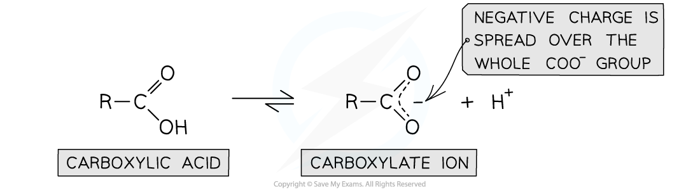
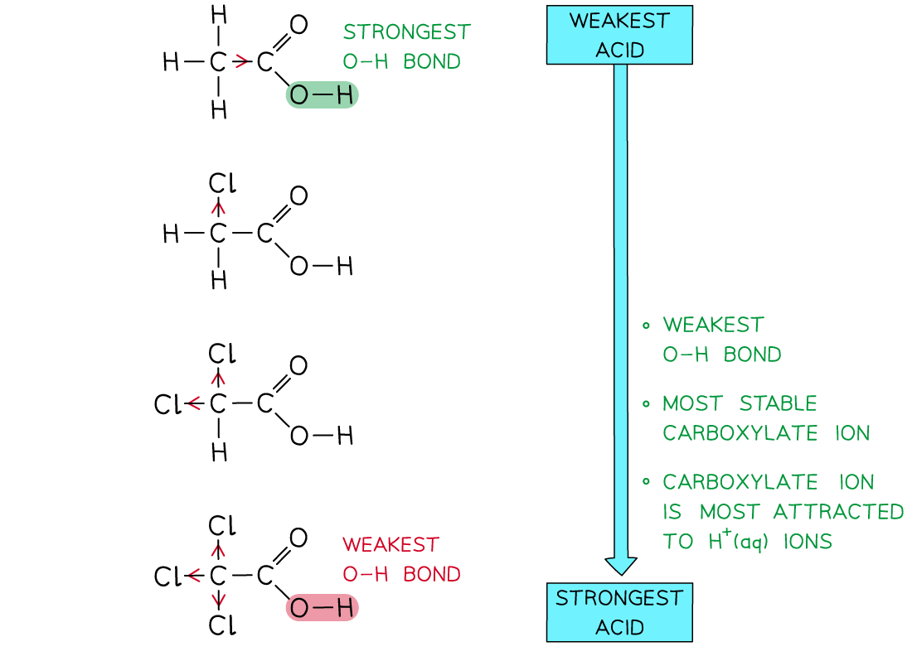
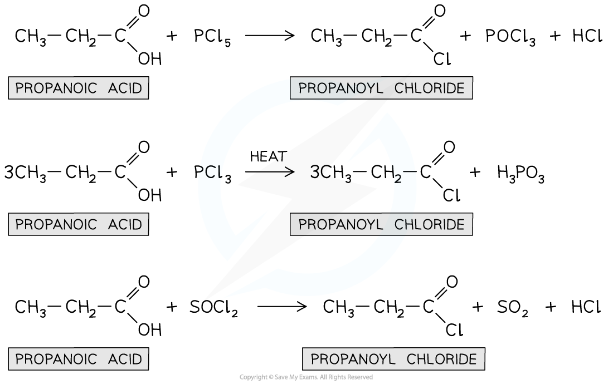
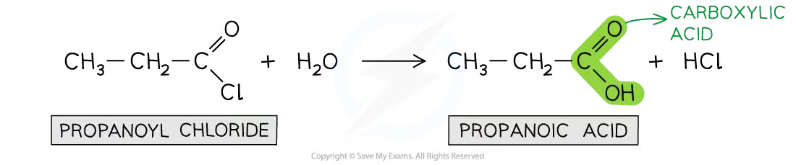
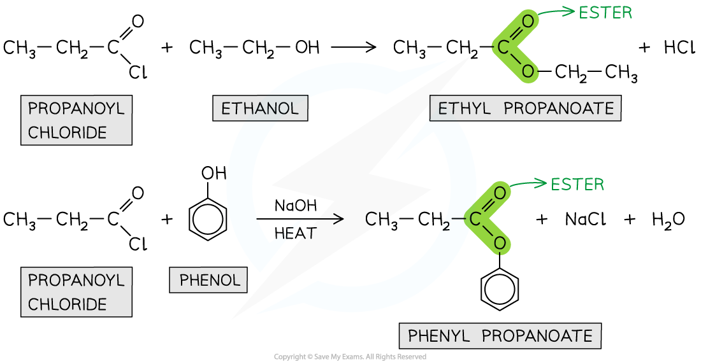
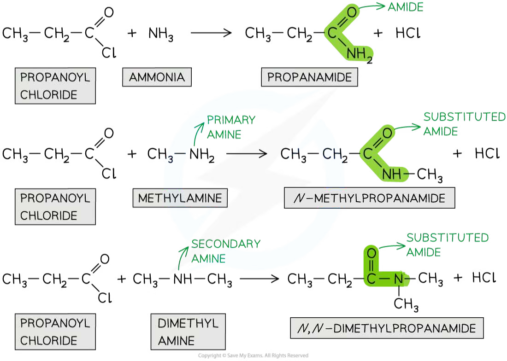
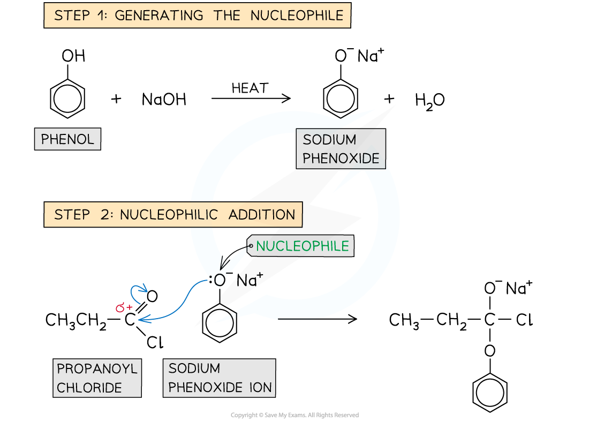
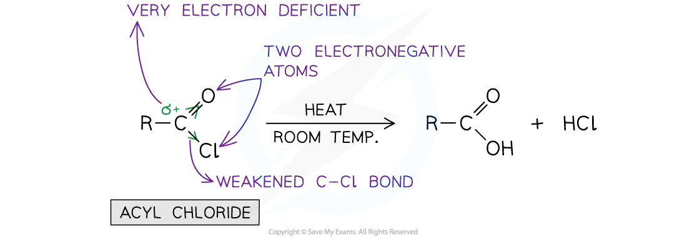

# 33 Carboxylic acids and derivatives

本章对应 CIE 9701 2025–2027 syllabus 的 **33.1 Carboxylic acids**、**33.2 Esters** 与 **33.3 Acyl chlorides**。题目部分对应专题题包 **7.5 Carboxylic Acids & Derivatives (A Level Only)**；本地题包包含 Easy 与 Medium 两组 Structured Questions。

## Learning objectives

学完本章后，你应该能够：

- describe the reactions and preparation of carboxylic acids, including oxidation of primary alcohols and alkylbenzenes;
- explain why carboxylic acids are weak acids and compare the acidities of substituted carboxylic acids;
- write equations for esterification and explain why the reaction is reversible;
- describe the preparation, reactions and relative reactivity of acyl chlorides;
- write complete equations for acyl chlorides reacting with water, alcohols, phenol and ammonia;
- describe the addition–elimination mechanism of nucleophilic acyl substitution;
- use reaction conditions and observations to identify suitable reagents in synthesis routes.

## 33.1 Carboxylic acids

::: {.study-card}
### Structure, naming and oxidation

A **carboxylic acid** contains the functional group $\text{–COOH}$, also written as $\text{–C(=O)OH}$. The carbonyl carbon is attached directly to a hydroxyl group. Examples include methanoic acid, $\text{HCOOH}$, ethanoic acid, $\text{CH}_3\text{COOH}$, and benzoic acid, $\text{C}_6\text{H}_5\text{COOH}$.

Primary alcohols can be oxidised first to aldehydes and then to carboxylic acids. To obtain the acid, use acidified potassium manganate(VII) or potassium dichromate(VI), heat under reflux and use excess oxidising agent:

$$\ce{RCH2OH + 2[O] ->[acidified\ KMnO4][reflux] RCOOH + H2O}$$

An alkylbenzene with at least one benzylic hydrogen can also be oxidised all the way to a benzoic acid derivative. The side chain is oxidised, even if it contains more than one carbon atom:

$$\ce{C6H5CH3 ->[hot\ alkaline\ KMnO4][reflux] C6H5COO^- ->[dilute\ acid] C6H5COOH}$$

The purple manganate(VII) colour disappears. Depending on the conditions and the exact oxidising system, brown $\ce{MnO2}$ may be observed as a precipitate. Acidification of the soluble benzoate gives benzoic acid.

{.concept-figure fig-alt="Oxidation of methylbenzene to benzoic acid using hot alkaline potassium manganate(VII) followed by acidification"}
:::

::: {.worked-example}
Worked example · Oxidation of methylbenzene

### Conditions, observations and product

**Methylbenzene is oxidised to benzoic acid. State suitable reagents and conditions, and state the observations.**

1. Heat methylbenzene under reflux with hot alkaline potassium manganate(VII), $\ce{KMnO4}$, using excess oxidising agent.
2. The purple colour of manganate(VII) disappears. A brown precipitate of $\ce{MnO2}$ may form when manganate(VII) is reduced under alkaline conditions.
3. Acidify the benzoate product with dilute hydrochloric acid or another dilute mineral acid:

   $$\ce{C6H5COO^- + H+ -> C6H5COOH}$$

4. The organic product is **benzoic acid**, $\ce{C6H5COOH}$.

:::

::: {.study-card}
### Weak acidity and the carboxylate ion

Carboxylic acids are **weak acids** because they ionise only partially in aqueous solution:

$$\ce{RCOOH(aq) <=> RCOO^-(aq) + H^+(aq)}$$

The conjugate base is a carboxylate ion. Its negative charge is delocalised over both oxygen atoms, so the ion is more stable than an alkoxide ion. This stabilisation makes loss of $\ce{H+}$ more favourable, but the equilibrium still lies mainly to the left.

{.concept-figure fig-alt="Delocalisation of negative charge over the two oxygen atoms of a carboxylate ion"}

The strength of a carboxylic acid depends on substituents. Electron-withdrawing groups such as chlorine pull electron density away from the carboxyl group and stabilise the negative charge in the conjugate base. Therefore, 2-chloropropanoic acid is stronger than propanoic acid. Electron-donating alkyl groups have the opposite effect.

$$\ce{CH3CHClCOOH(aq) <=> CH3CHClCOO^-(aq) + H^+(aq)}$$

The closer the electron-withdrawing group is to the carboxyl group, the greater its inductive effect. Multiple chlorine atoms generally increase the acid strength further.

{.concept-figure fig-alt="Comparison of carboxylic acid strength for chloro-substituted acids"}
:::

::: {.worked-example}
Worked example · Comparing carboxylic acid strength

### Why chloro-substituted acids are stronger

**Explain why 2-chlorobutanoic acid is a stronger acid than butanoic acid. Draw the skeletal formula of 2-chlorobutanoic acid and name a stronger chloro-substituted acid.**

1. Chlorine is more electronegative than carbon and has an electron-withdrawing inductive effect.
2. It pulls electron density away from the carboxyl group and helps to disperse/stabilise the negative charge on the carboxylate ion.
3. The O–H bond is therefore more polar and the acid loses $\ce{H+}$ more readily.
4. The skeletal formula is $\ce{CH3CH2CH(Cl)COOH}$, with chlorine on the carbon next to the carboxyl group.
5. One acceptable stronger acid is 2,2-dichlorobutanoic acid or 2,3-dichlorobutanoic acid, because it contains an additional electron-withdrawing chlorine atom.

:::

::: {.study-card}
### Preparation of acyl chlorides from carboxylic acids

Carboxylic acids can be converted into acyl chlorides using reagents such as thionyl chloride, $\ce{SOCl2}$, phosphorus(V) chloride, $\ce{PCl5}$, or phosphorus(III) chloride, $\ce{PCl3}$. For example:

$$\ce{CH3CH2COOH + SOCl2 -> CH3CH2COCl + SO2 + HCl}$$

$$\ce{CH3CH2COOH + PCl5 -> CH3CH2COCl + POCl3 + HCl}$$

With $\ce{PCl5}$, steamy white fumes of hydrogen chloride are produced. Acyl chlorides are often prepared because they react more rapidly and more completely than the corresponding carboxylic acid in subsequent acylation reactions.

{.concept-figure fig-alt="Conversion of a carboxylic acid into an acyl chloride using chlorinating reagents"}
:::

## 33.2 Esters

::: {.study-card}
### Esterification of a carboxylic acid and an alcohol

An **ester** contains the functional group $\text{–COO–}$. Esters can be prepared by heating a carboxylic acid with an alcohol in the presence of concentrated sulfuric acid as a catalyst:

$$\ce{RCOOH + R'OH <=>[conc.\ H2SO4][heat] RCOOR' + H2O}$$

For example:

$$\ce{CH3CH2COOH + CH3OH <=>[conc.\ H2SO4][heat] CH3CH2COOCH3 + H2O}$$

The reaction is a condensation reaction because a small molecule, water, is eliminated. It is reversible, so the equilibrium does not give complete conversion. The ester is separated by distillation or another suitable purification method.

{.concept-figure fig-alt="Formation of an ester from a carboxylic acid and an alcohol with water as the eliminated molecule"}
:::

::: {.worked-example}
Worked example · Naming and writing an esterification equation

### Methanol and propanoic acid

**Methanol reacts with propanoic acid in the presence of concentrated sulfuric acid. Write the equation, name the organic product and explain why an acyl chloride can be used instead.**

1. The alcohol contributes the alkyl group, methyl, and the acid contributes the carboxylate part, propanoate.
2. The equation is:

   $$\ce{CH3OH + CH3CH2COOH <=>[conc.\ H2SO4][heat] CH3CH2COOCH3 + H2O}$$

3. The ester is **methyl propanoate**.
4. The carboxylic-acid esterification is slow and reversible, so the yield is limited by equilibrium.
5. Propanoyl chloride reacts much faster with methanol and the reaction effectively goes to completion, giving a higher yield. The by-product is $\ce{HCl}$ rather than water.

:::

::: {.study-card}
### Hydrolysis of esters

Esters can be hydrolysed using dilute acid and heat. The reaction is the reverse of esterification and is reversible:

$$\ce{RCOOR' + H2O <=>[dilute\ acid][heat] RCOOH + R'OH}$$

Alkaline hydrolysis uses aqueous sodium hydroxide and heat. It is effectively complete because the carboxylic acid is converted into a carboxylate salt:

$$\ce{RCOOR' + NaOH ->[heat] RCOO^-Na^+ + R'OH}$$

Acidification of the carboxylate gives the carboxylic acid:

$$\ce{RCOO^-Na^+ + H+ -> RCOOH + Na+}$$

The two parts of an ester are therefore identified by the acid-derived part ending in **-oate** and the alcohol-derived alkyl group.
:::

## 33.3 Acyl chlorides

::: {.study-card}
### Structure, preparation and reactivity

An **acyl chloride** has the general formula $\ce{RCOCl}$. It contains a strongly polar carbonyl group and a chlorine atom attached to the carbonyl carbon. The carbonyl carbon is electron deficient, so nucleophiles attack it readily.

Acyl chlorides are more reactive than esters, amides and carboxylic acids. Their general reaction with a nucleophile is **nucleophilic addition–elimination**:

1. the nucleophile attacks the electron-deficient carbonyl carbon;
2. the $\ce{C=O}$ double bond opens temporarily to form a tetrahedral intermediate;
3. the carbonyl bond reforms and a leaving group is eliminated.

{.concept-figure fig-alt="Preparation and key reactions of an acyl chloride"}
:::

::: {.study-card}
### Reactions with water and alcohols

Acyl chlorides react vigorously with water at room temperature to form a carboxylic acid and hydrogen chloride:

$$\ce{RCOCl + H2O -> RCOOH + HCl}$$

They react with alcohols to form esters and hydrogen chloride:

$$\ce{RCOCl + R'OH -> RCOOR' + HCl}$$

For example:

$$\ce{CH3COCl + CH3CH2OH -> CH3COOCH2CH3 + HCl}$$

The reaction is faster and gives a more complete conversion than direct esterification of a carboxylic acid. Steamy white fumes of hydrogen chloride are produced.

{.concept-figure fig-alt="Hydrolysis of an acyl chloride and reaction with an alcohol to form an ester"}

{.concept-figure fig-alt="Ester formation from acyl chlorides and alcohols"}
:::

::: {.worked-example}
Worked example · Acyl chloride with an alcohol

### Ethanoyl chloride and ethanol

**Ethanoyl chloride reacts with ethanol. Complete the equation, name the organic product and state the other product. Explain why this is a condensation reaction.**

1. Ethanol is the nucleophile and its oxygen attacks the electron-deficient carbonyl carbon.
2. Chloride is eliminated and the carbonyl group reforms.
3. The equation is:

   $$\ce{CH3COCl + CH3CH2OH -> CH3COOCH2CH3 + HCl}$$

4. The organic product is **ethyl ethanoate**.
5. The other product is hydrogen chloride, $\ce{HCl}$.
6. It is a condensation reaction because two molecules combine to form one larger organic molecule and a small molecule, $\ce{HCl}$, is eliminated.

:::

::: {.study-card}
### Reactions with ammonia and amines

Acyl chlorides react with ammonia to form primary amides. Two moles of ammonia are needed: one reacts as the nucleophile and the other neutralises the hydrogen chloride produced:

$$\ce{RCOCl + 2NH3 -> RCONH2 + NH4Cl}$$

With a primary amine, the product is an $N$-substituted amide and the second amine molecule forms an alkylammonium chloride salt:

$$\ce{CH3COCl + 2CH3NH2 -> CH3CONHCH3 + CH3NH3Cl}$$

The amide functional group is $\ce{RCONH2}$ or a substituted form such as $\ce{RCONHR'}$.

{.concept-figure fig-alt="Reaction of an acyl chloride with ammonia or an amine to form an amide"}
:::

::: {.worked-example}
Worked example · Amide formation

### Ethanoyl chloride with excess ammonia

**Ethanoyl chloride reacts with an excess of ammonia. Write the equation and explain why two moles of ammonia are required.**

1. The first ammonia molecule attacks the carbonyl carbon and chloride is eliminated, forming ethanamide.
2. Hydrogen chloride is produced in the substitution step.
3. A second ammonia molecule acts as a base and accepts the proton from hydrogen chloride.
4. The overall equation is:

   $$\ce{CH3COCl + 2NH3 -> CH3CONH2 + NH4Cl}$$

5. The products are **ethanamide** and ammonium chloride. The second ammonia molecule prevents hydrogen chloride from remaining in the reaction mixture.

:::

::: {.study-card}
### Reaction with phenol and relative hydrolysis rates

Phenol is a weaker nucleophile than an aliphatic alcohol because its oxygen lone pair is partly delocalised into the benzene ring. In alkaline solution, phenol is converted into phenoxide, which is a stronger nucleophile:

$$\ce{C6H5OH + NaOH -> C6H5O^-Na^+ + H2O}$$

The phenoxide ion reacts with an acyl chloride to form a phenyl ester:

$$\ce{CH3CH2COCl + C6H5O^- -> CH3CH2COOC6H5 + Cl^-}$$

The relative ease of hydrolysis is:

$$\text{acyl chloride} > \text{halogenoalkane} > \text{halogenoarene}$$

The acyl chloride is most reactive because the carbonyl carbon is strongly $\delta+$ and the leaving group is chloride. In a halogenoarene, a halogen lone pair is delocalised into the aromatic $\pi$ system, giving the C–Cl bond partial double-bond character. The aryl C–Cl bond is therefore stronger and harder to break.

{.concept-figure fig-alt="Phenoxide attacking an acyl chloride to form a phenyl ester"}

{.concept-figure fig-alt="Relative ease of hydrolysis for acyl chloride, halogenoalkane and halogenoarene compounds"}

{.concept-figure fig-alt="Comparison of hydrolysis reactivity for halogenoalkanes and halogenoarenes"}
:::

::: {.worked-example}
Worked example · Planning a phenyl ester synthesis

### Phenyl propanoate

**Describe how to prepare phenyl propanoate from propanoic acid and phenol. Explain why the acyl chloride is prepared before the phenol is added.**

1. Convert propanoic acid into propanoyl chloride using $\ce{PCl5}$, $\ce{PCl3}$ or $\ce{SOCl2}$:

   $$\ce{CH3CH2COOH + PCl5 -> CH3CH2COCl + POCl3 + HCl}$$

2. Add the propanoyl chloride to phenol in the presence of aqueous sodium hydroxide and heat.
3. Phenol is converted into phenoxide, which attacks the electron-deficient carbonyl carbon.
4. The product is **phenyl propanoate**, $\ce{CH3CH2COOC6H5}$.
5. The acyl chloride route is used because it reacts rapidly and effectively goes to completion. Direct reaction of propanoic acid with phenol is slow and reversible, so it gives a lower equilibrium yield.

:::

::: {.formula-panel}
### Relative reactivity summary

For nucleophilic acyl substitution, learn the following order:

$$\text{acyl chloride} > \text{ester} > \text{amide}$$

For the chloro-compound comparison used in structured questions:

$$\text{acyl chloride} > \text{halogenoalkane} > \text{halogenoarene}$$

Always identify the electron-deficient carbon, the nucleophile, the leaving group and the product functional group.
:::

## Chapter checklist

- [ ] I can oxidise a primary alcohol or alkylbenzene to a carboxylic acid and state the conditions and observations.
- [ ] I can explain weak acidity using carboxylate-ion delocalisation.
- [ ] I can explain how electron-withdrawing groups affect carboxylic acid strength.
- [ ] I can write and name the products of acid–alcohol esterification and ester hydrolysis.
- [ ] I can prepare an acyl chloride using $\ce{SOCl2}$, $\ce{PCl3}$ or $\ce{PCl5}$.
- [ ] I can write the reactions of acyl chlorides with water, alcohols, ammonia, amines and phenoxide.
- [ ] I can describe nucleophilic addition–elimination and compare the relative reactivity of acyl compounds.

## Structured questions



### Original question PDFs

- [7.5 Carboxylic Acids & Derivatives (A Level Only) - Easy](https://raw.githubusercontent.com/nanoxsj/CIE-Chemistry-Study/publish-chemistry-study/resources/original-papers/carboxylic-acids-and-derivatives/7.5-carboxylic-acids-derivatives-easy.pdf)
- [7.5 Carboxylic Acids & Derivatives (A Level Only) - Medium](https://raw.githubusercontent.com/nanoxsj/CIE-Chemistry-Study/publish-chemistry-study/resources/original-papers/carboxylic-acids-and-derivatives/7.5-carboxylic-acids-derivatives-medium.pdf)
