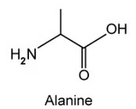
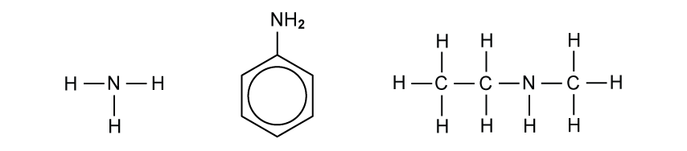
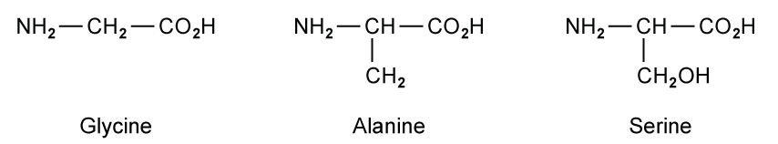
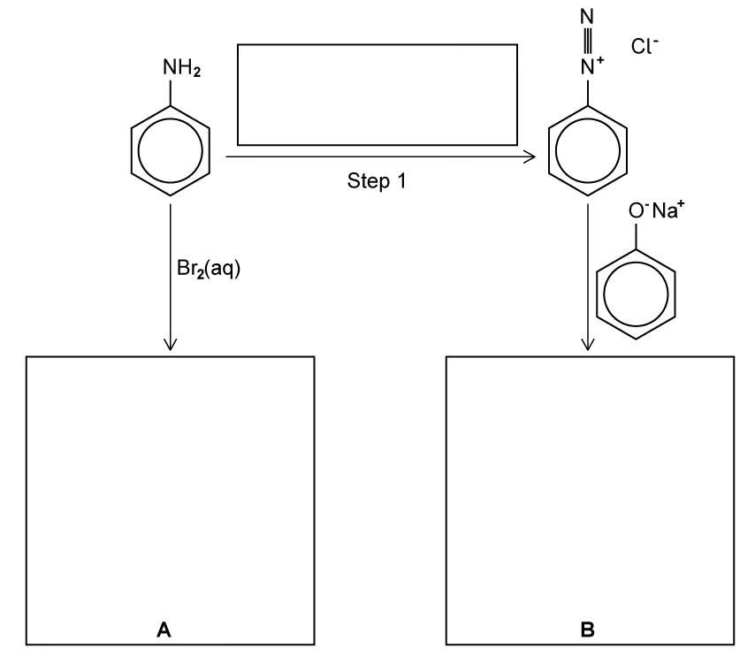
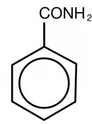
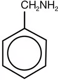
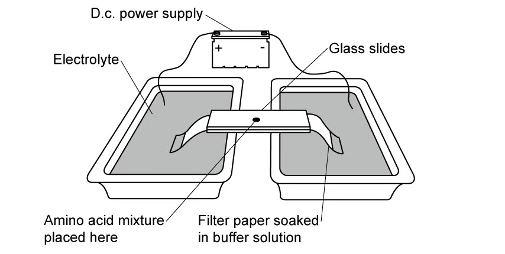
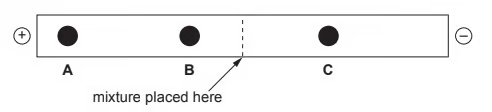

# 7.6 Nitrogen Compounds (A Level Only) - Structured Questions

本页保留题包中的全部 Structured Questions。当前题包包含 Easy 与 Medium，没有独立 Hard PDF，因此不虚构 Hard 题目。题目保留完整英文题干、所有分问、原始分值和题目中的独立图；答案按 Model Answers 整理，并把机制题、计算题和结构题的解答步骤完整呈现。

### 7.6 Nitrogen Compounds (A Level Only) - Easy

::: {.question-card}
### Example 1 · Amines and basicity · 7.6 SQ Easy Q1

This question is about the synthesis and nature of amines.

**(a)** State the reagents and conditions required for the conversion of 1-bromobutane into butylamine. `[3 marks]`

**(b)** Explain why amines can act as bases. `[1 mark]`

**(c)** Write an equation to show how ethylamine acts as a base when reacted with hydrochloric acid and give the name of the product formed in this reaction. `[2 marks]`

Show mark scheme / model answer

- **(a)** Use excess ammonia, ethanolic/ethanol solvent, and heat under pressure. `[3]`
- **(b)** Amines can act as proton acceptors by donating the lone pair of electrons on nitrogen to an H⁺ ion and forming a dative covalent bond. `[1]`
- **(c)**

  $$\ce{CH3CH2NH2 + HCl -> CH3CH2NH3+Cl-}$$

  The product is **ethylammonium chloride**. `[2]`

:::

::: {.question-card}
### Example 2 · Amino acids and electrophoresis · 7.6 SQ Easy Q2

This question is about amino acids.

**(a)** State the general formula for an amino acid. `[1 mark]`

The amino acid alanine is shown in Fig. 2.1.

{.question-figure fig-alt="Displayed structure of alanine from the question paper"}

**(b)** Draw the two structures of alanine in acidic and basic conditions. `[2 marks]`

**(c)** Electrophoresis is an analytical technique which separates ions by placing them in an electrical field. Describe briefly how a sample of an amino acid can be separated using this technique. `[1 mark]`

Show mark scheme / model answer

- **(a)** The general formula is **RCH(NH₂)COOH**. `[1]`
- **(b)** acidic conditions: `CH₃CH(NH₃⁺)COOH`; basic conditions: `CH₃CH(NH₂)COO⁻`. `[2]`
- **(c)** Place the sample between two oppositely charged electrodes. Positively charged ions move towards the negative electrode and negatively charged ions move towards the positive electrode; differences in movement separate the amino acid species. `[1]`

:::

::: {.question-card}
### Example 3 · Amides and reduction · 7.6 SQ Easy Q3

Amides can be formed from amines. An example is shown in the following reaction scheme where compound X reacts with methylamine to form N-methylpropanamide and hydrogen chloride.

`compound X + CH₃NH₂ → CH₃CH₂CONHCH₃ + HCl`

**(a)** State the structural formula of compound X. `[1 mark]`

**(b)** N-methylpropanamide can undergo reduction forming compound Y and water. State the reagent required for this reaction. `[1 mark]`

**(c)** A different amide, ethanamide, was heated with sodium hydroxide. The gas ammonia is formed along with one other product.

**(i)** Write the equation for this reaction. `[1 mark]`

**(ii)** Explain how this reaction could be used as a test for an amide. `[1 mark]`

Show mark scheme / model answer

- **(a)** Compound X is **propanoyl chloride**, `CH₃CH₂COCl`. `[1]`
- **(b)** Use **lithium aluminium hydride**, LiAlH₄, usually in dry ether followed by hydrolysis. `[1]`
- **(c)(i)**

  $$\ce{CH3CONH2 + NaOH -> CH3CO2Na + NH3}$$

  `[1]`

- **(c)(ii)** Heat the unknown amide with aqueous sodium hydroxide and test the gas produced. Ammonia turns damp red litmus paper blue. `[1]`

:::

### 7.6 Nitrogen Compounds (A Level Only) - Medium

::: {.question-card}
### Example 4 · Basicity, phenylamine and azo compounds · 7.6 SQ Medium Q1

Three nitrogen-containing molecules, ammonia, NH₃, phenylamine, C₆H₅NH₂ and N-methylethylamine, CH₃CH₂NHCH₃, are drawn below respectively in Fig. 1.1.

{.question-figure fig-alt="Structures of ammonia, phenylamine and N-methylethylamine"}

**(a)(i)** List the three amine molecules drawn in Fig. 1.1 in order of increasing base strength. `[1 mark]`

**(a)(ii)** Explain your answer to part (a)(i). `[6 marks]`

**(b)** Phenylamine, C₆H₅NH₂, shown in Fig. 1.1 can be produced from nitrobenzene, C₆H₅NO₂. Name the type of reaction and suggest suitable reagents and conditions for this conversion. `[3 marks]`

**(c)** Azo dyes are organic compounds, which are largely used in the treatment of textiles and leather products, as well as in food. Phenylamine, C₆H₅NH₂, can be used in the manufacture of azo dyes. The manufacturing process is outlined below.

Step 1: Phenylamine is dissolved in HCl to produce a diazonium salt. A diazonium salt contains two nitrogen atoms joined together by a triple bond. The reaction for this process is:

`C₆H₅NH₂ + HCl + HNO₂ → C₆H₅N₂⁺Cl⁻ + 2H₂O`

Step 2: This solution is then slowly added to an alkaline solution of a phenol coupling agent to form the dye.

**(c)(i)** The diazonium salt, C₆H₅N₂⁺Cl⁻, is an unstable compound. Suggest a condition that could be added to ensure that the salt would not break down during the reaction. `[1 mark]`

**(c)(ii)** Draw the structure of the diazonium salt formed in Step 1, showing the displayed formula of the nitrogen-containing group. `[1 mark]`

**(d)** Phenol, C₆H₅OH, is an aromatic organic compound which is also crucial in the manufacture of azo dyes. The final step of the azo dye production involves pairing up the diazonium salt with a phenol compound as a coupling agent. Suggest a structure for the azo dye if the coupling agent used is 2,6-dimethylphenol. `[2 marks]`

Show mark scheme / model answer

- **(a)(i)** `phenylamine < ammonia < N-methylethylamine`. `[1]`
- **(a)(ii)** Base strength depends on the availability of the lone pair on nitrogen. The two alkyl groups in N-methylethylamine have a positive inductive effect and push electron density towards nitrogen, so its lone pair is most available. In phenylamine, the lone pair is delocalised into the benzene ring and is less available to accept H⁺. `[6]`
- **(b)** The reaction is a **reduction**. Suitable methods include tin/concentrated HCl/heat followed by aqueous NaOH; H₂ with a Ni/Pt/Pd catalyst; or LiAlH₄ in dry ether. `[3]`
- **(c)(i)** Keep the mixture at low temperature, in ice-cold conditions or below 10 °C. `[1]`
- **(c)(ii)** `C₆H₅–N≡N⁺ Cl⁻`, with the positive charge on the correct nitrogen. `[1]`
- **(d)** Couple the diazonium ion to the position para to the OH group of 2,6-dimethylphenol. A correct product contains `C₆H₅–N=N–C₆H₂(CH₃)₂OH`, with the OH group opposite the azo link. `[2]`

:::

::: {.question-card}
### Example 5 · Acyl chlorides and amines · 7.6 SQ Medium Q2

Amines will react with acid chlorides to produce a different nitrogen-containing product.

**(a)(i)** Name and outline the mechanism between ethanoyl chloride, CH₃COCl, and methylamine, CH₃NH₂. `[5 marks]`

**(a)(ii)** Give the IUPAC name of the compound formed in the reaction. `[1 mark]`

**(b)(i)** Methylamine can be prepared from chloromethane. Give the other reagent, and any reaction conditions necessary for the preparation of methylamine. `[3 marks]`

**(b)(ii)** Give the name of the mechanism between chloromethane and the other reagent to form methylamine. `[1 mark]`

**(c)(i)** Chloroethane can also react with methylamine. Draw the displayed formula of the organic compound formed in this reaction. `[1 mark]`

**(c)(ii)** Give the classification of this compound. `[1 mark]`

**(d)(i)** Two separate solutions of methylamine, CH₃NH₂, and dimethylamine, (CH₃)₂NH, were left unlabelled in a laboratory. Suggest how, other than smell, they could be distinguished from one another. `[2 marks]`

**(d)(ii)** Give an explanation to your answer to part (d)(i). `[2 marks]`

Show mark scheme / model answer

- **(a)(i)** The mechanism is **nucleophilic addition–elimination**: the nitrogen lone pair attacks the δ⁺ carbonyl carbon; the C=O bond opens to give a tetrahedral intermediate; the C=O bond reforms and Cl⁻ leaves; finally a proton is removed from nitrogen. The intermediate has N⁺ and O⁻. `[5]`
- **(a)(ii)** The product is **N-methylethanamide**. `[1]`
- **(b)(i)** Use ammonia, NH₃; excess hot ethanolic ammonia; and pressure. `[3]`
- **(b)(ii)** **Nucleophilic substitution**. `[1]`
- **(c)(i)** `CH₃CH₂–NH–CH₃`. `[1]`
- **(c)(ii)** It is a **secondary amine**. `[1]`
- **(d)(i)** Use a pH meter. Dimethylamine gives the higher pH reading. `[2]`
- **(d)(ii)** Two alkyl groups in dimethylamine have a positive inductive/electron-donating effect, making its lone pair more available than in methylamine. `[2]`

:::

::: {.question-card}
### Example 6 · Amino acids and silk protein · 7.6 SQ Medium Q3

Much research has been carried out in recent years investigating the exact structure of silk. The silk of a spider's web is at least five times as strong as steel, and twice as elastic as nylon. A silk fibre is composed of many identical protein chains, which are mainly made from the amino acids glycine, alanine and serine, shown in Fig. 3.1, with smaller amounts of four other amino acids.

{.question-figure fig-alt="Structures of glycine, alanine and serine"}

**(a)** Amino acids can exist as zwitterions. Draw the zwitterion structure for glycine. `[1 mark]`

**(b)** Amino acids can act as acids or bases. Write equations to show (i) the reaction between alanine and HCl(aq), and (ii) the reaction between serine and NaOH(aq). `[2 marks]`

**(c)(i)** Draw the structural formula of a portion of the silk protein, showing three main acid residues. Label a peptide bond on your structure. `[3 marks]`

**(c)(ii)** State the polymer type of silk protein. `[1 mark]`

**(d)** The Mᵣ of a silk protein molecule is about 600 000. Assuming it is made from equal amounts of the three amino acids in Fig. 3.1, calculate the average number of amino acid residues in the protein chain. Show your working. [Mᵣ(glycine) = 75; Mᵣ(alanine) = 89; Mᵣ(serine) = 105] `[3 marks]`

Show mark scheme / model answer

- **(a)** `⁺NH₃CH₂COO⁻`. `[1]`
- **(b)**
  - `NH₂CH(CH₃)CO₂H + HCl → Cl⁻ NH₃⁺CH(CH₃)CO₂H`. `[1]`
  - `NH₂CH(CH₂OH)CO₂H + NaOH → NH₂CH(CH₂OH)CO₂Na + H₂O`. `[1]`
- **(c)(i)** One acceptable portion is `–NH–CH(CH₃)–CO–NH–CH(CH₂OH)–CO–NH–CH₂–CO–`. It contains three glycine/alanine/serine residues, two C(O)–NH peptide bonds, and at least one labelled peptide bond. `[3]`
- **(c)(ii)** Silk is a **condensation polymer**, or **polyamide**. `[1]`
- **(d)** Subtract 18 for each water molecule lost: glycine residue = 57, alanine residue = 71, serine residue = 87. One set has Mᵣ = 215; 600 000 ÷ 215 = 2791 sets; total residues = 2791 × 3 = **8372**. `[3]`

:::

::: {.question-card}
### Example 7 · Phenylamine and amides · 7.6 SQ Medium Q4

Phenylamine can be converted into the organic compounds A and B as shown in Fig. 4.1.

{.question-figure fig-alt="Phenylamine reaction scheme showing bromination and diazonium coupling"}

**(a)(i)** Suggest the structural formulae of A and B in the boxes in Fig. 4.1. `[2 marks]`

**(a)(ii)** Suggest suitable reagents and conditions for step 1, and write them in the box over the arrow in Fig. 4.1. `[2 marks]`

**(b)** When phenylamine is treated with propanoyl chloride a white crystalline compound, C, C₉H₁₁NO, is formed.

**(i)** Name the functional group formed in this reaction. `[1 mark]`

**(ii)** Calculate the percentage by mass of nitrogen in C. `[1 mark]`

**(iii)** Draw the structural formula of C. `[1 mark]`

**(c)** Benzamide can be reduced to form benzylamine.

{.question-figure fig-alt="Structure of benzamide"}

{.question-figure fig-alt="Structure of benzylamine"}

**(i)** State which is the weaker base, benzamide or benzylamine. Explain your answer. `[3 marks]`

**(ii)** Give a suitable reducing agent required for this reduction. `[1 mark]`

**(d)** When benzamide is refluxed with acid, hydrolysis occurs.

**(i)** Draw the structural formula of the resulting organic compound. `[1 mark]`

**(ii)** State the name of the other product formed during this hydrolysis reaction. `[1 mark]`

Show mark scheme / model answer

- **(a)(i)** A is 2,4,6-tribromophenylamine, `C₆H₂Br₃NH₂`. B is the para-coupling product from phenyl diazonium chloride and phenoxide, with `–N=N–` para to `–O⁻Na⁺`. `[2]`
- **(a)(ii)** Use sodium nitrite and dilute acid, such as HCl or H₂SO₄, at a temperature of 10 °C or below. `[2]`
- **(b)(i)** The functional group is an **amide**. `[1]`
- **(b)(ii)** `Mᵣ = (9 × 12) + (11 × 1) + 14 + 16 = 149`; `%N = (14/149) × 100 = 9.4%`. `[1]`
- **(b)(iii)** C is **N-phenylpropanamide**, `CH₃CH₂CONHC₆H₅`. `[1]`
- **(c)(i)** **Benzamide** is the weaker base. The carbonyl oxygen withdraws electron density and the nitrogen lone pair is delocalised into the C=O group, so it is less available to accept a proton. `[3]`
- **(c)(ii)** Use **lithium aluminium hydride**, LiAlH₄. `[1]`
- **(d)(i)** The organic product is **benzoic acid**, C₆H₅COOH. `[1]`
- **(d)(ii)** The other product is **ammonia** (or ammonium ion in acidic solution). `[1]`

:::

::: {.question-card}
### Example 8 · Electrophoresis and peptides · 7.6 SQ Medium Q5

**(a)** A mixture of amino acids may be separated using electrophoresis. A typical practical set-up is shown in the diagram.

{.question-figure fig-alt="Electrophoresis set-up with a DC power supply, glass slides and buffer-soaked filter paper"}

When the power supply is switched on, some amino acids may not move, but remain stationary. Suggest an explanation for this observation. `[2 marks]`

**(b)** The amino acid glycine has the formula H₂NCH₂CO₂H. Identify the species formed on the filter paper if glycine moves to the left (positive) end of the filter paper. `[1 mark]`

**(c)** The result shown in Fig. 5.1 was obtained from another electrophoresis.

{.question-figure fig-alt="Electrophoresis results showing amino acid species A, B and C"}

What can be deduced about the relative sizes of, and charges on, the amino acid species A, B and C? `[3 marks]`

**(d)** A tripeptide was formed from three different amino acids, alanine, serine and valine.

The structural formulae of the amino acids are shown in Table 5.1.

| Amino acid | Structural formula |
|---|---|
| alanine | `NH₂CH(CH₃)CO₂H` |
| serine | `NH₂CH(CH₂OH)CO₂H` |
| valine | `NH₂CH(CH(CH₃)₂)CO₂H` |

**(i)** How many different tripeptides can be made using one molecule of each of the amino acids? `[2 marks]`

**(ii)** Draw the tripeptide, showing the peptide bonds in displayed form. `[1 mark]`

Show mark scheme / model answer

- **(a)** The amino acid is uncharged/neutral, or is present as a zwitterion with equal positive and negative charges. It is at its isoelectric point, so it is attracted equally by both electrodes (or by neither electrode) and remains stationary. `[2]`
- **(b)** Because the left end is positive, the species must be negative: `H₂NCH₂COO⁻`. `[1]`
- **(c)**

  | Species | Relative size | Charge |
  |---|---|---|
  | A | smallest / 1 | negative |
  | B | largest / 3 | negative |
  | C | intermediate / 2 | positive |

  Each row earns one mark. Smaller ions move faster/further, and the direction of movement identifies the charge. `[3]`
- **(d)(i)** `3! = 3 × 2 × 1 = 6`. `[2]`
- **(d)(ii)** Any correct tripeptide is acceptable, for example `H₂N–CH(CH₃)–CO–NH–CH(CH₂OH)–CO–NH–CH(CH(CH₃)₂)–COOH`, containing three residues and two `–CO–NH–` peptide bonds. `[1]`

:::
