# 34 Nitrogen compounds

本章对应 CIE 9701 2025–2027 syllabus 的 **34.1 Primary and secondary amines**、**34.2 Phenylamine and azo compounds**、**34.3 Amides** 与 **34.4 Amino acids**。题目部分对应专题题包 **7.6 Nitrogen Compounds (A Level Only)**；当前题包包含 Easy 与 Medium 两组 Structured Questions。

## Learning objectives

学完本章后，你应该能够：

- explain why aqueous amines are bases and compare the basicity of ammonia, aliphatic amines and phenylamine;
- describe the preparation of primary and secondary amines from halogenoalkanes, and the reduction of nitriles and amides;
- describe the preparation of phenylamine, diazonium salts and azo compounds;
- write equations for the formation, hydrolysis and reduction of amides;
- explain why amides are much weaker bases than amines;
- describe zwitterions, isoelectric points, peptide bonds and the separation of amino acids by electrophoresis.

## 34.1 Primary and secondary amines

::: {.study-card}
### Structures and basicity

An amine contains a nitrogen atom with a lone pair. A primary amine has one carbon-containing group attached to nitrogen, while a secondary amine has two:

$$RNH₂ \qquad \text{primary amine}$$

$$R₂NH \qquad \text{secondary amine}$$

The lone pair makes amines **Brønsted–Lowry bases**: they accept a proton by forming a dative covalent bond to H⁺.

$$RNH₂ + H₂O ⇌ RNH₃⁺ + OH⁻$$

$$RNH₂ + HCl → RNH₃⁺Cl⁻$$

Alkyl groups have a positive inductive effect and push electron density towards nitrogen. This generally makes an aliphatic secondary amine more basic than ammonia. In phenylamine, the nitrogen lone pair is delocalised into the benzene ring, so it is less available to accept a proton. A typical order is:

$$\text{phenylamine} < \text{ammonia} < \text{primary amine} < \text{secondary amine}$$

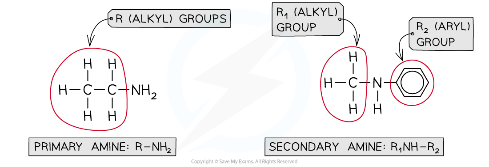{.concept-figure fig-alt="Structures of ammonia, phenylamine and N-methylethylamine"}

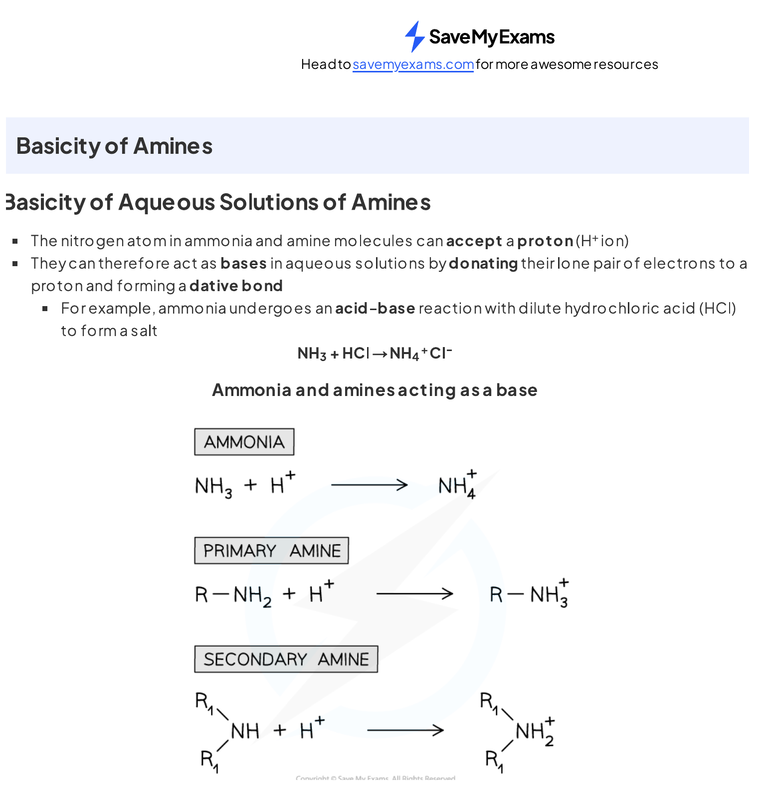{.concept-figure fig-alt="Factors affecting the basicity of ammonia and amines"}
:::

::: {.worked-example}
Worked example · Comparing amine basicity

### Phenylamine, ammonia and an aliphatic secondary amine

**Explain why phenylamine is a weaker base than ammonia, whereas an aliphatic secondary amine is a stronger base than ammonia.**

1. Base strength depends on the availability of the lone pair on nitrogen to accept H⁺.
2. In phenylamine, the nitrogen lone pair overlaps with the benzene ring and is delocalised into the ring. It is therefore less available to accept a proton.
3. Alkyl groups have a positive inductive effect and push electron density towards nitrogen.
4. In an aliphatic secondary amine, two alkyl groups increase the electron density on nitrogen, making the lone pair more available.
5. Therefore phenylamine is less basic than ammonia, while an aliphatic secondary amine is more basic than ammonia.

:::

::: {.study-card}
### Preparation of primary and secondary amines

Halogenoalkanes react with ammonia by nucleophilic substitution. Use **excess ethanolic ammonia**, heat and pressure in a sealed tube. Excess ammonia reduces further reaction of the primary amine product:

$$CH₃CH₂CH₂CH₂Br + 2NH₃ → CH₃CH₂CH₂CH₂NH₂ + NH₄Br$$

A primary amine can also react with a halogenoalkane to give a secondary amine:

$$RBr + R'NH₂ → R–NHR' + HBr$$

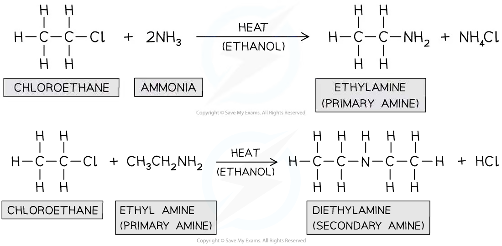{.concept-figure fig-alt="Preparation of primary and secondary amines using ammonia and primary amines"}
:::

::: {.worked-example}
Worked example · Preparing an amine

### 1-bromobutane to butylamine

**State the reagents and conditions required for the conversion of 1-bromobutane into butylamine.**

1. Use **excess ammonia**, NH₃.
2. Use **ethanol** as the solvent.
3. Heat the mixture **under pressure**, usually in a sealed tube.
4. The reaction is nucleophilic substitution, replacing bromine with NH₂.

:::

::: {.study-card}
### Reduction of amides and nitriles

Amides are reduced to amines using lithium aluminium hydride, LiAlH₄, usually in dry ether followed by hydrolysis. An N-substituted amide gives a secondary amine:

$$RCONH₂ → RCH₂NH₂ + H₂O$$

$$RCONHR' → RCH₂NHR' + H₂O$$

Nitriles can be reduced to primary amines using LiAlH₄ in dry ether or H₂ with a nickel catalyst:

$$RCN + 2H₂ → RCH₂NH₂$$

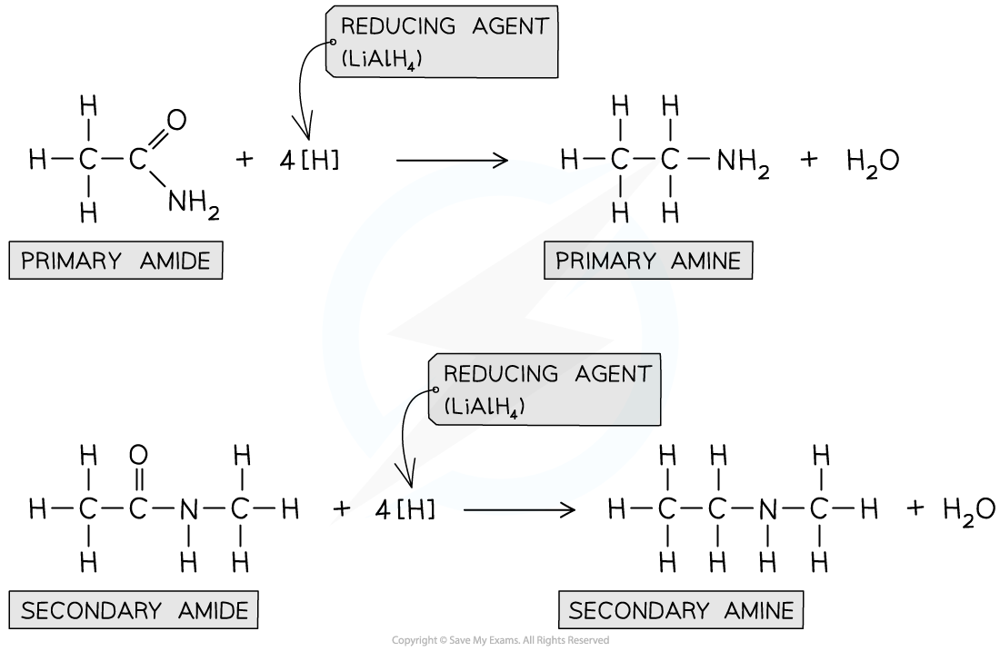{.concept-figure fig-alt="Reduction of an amide using lithium aluminium hydride to form an amine"}

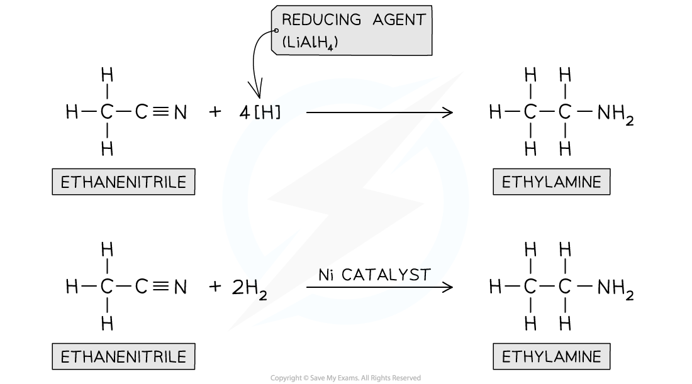{.concept-figure fig-alt="Reduction of a nitrile using lithium aluminium hydride or hydrogen and nickel"}
:::

::: {.worked-example}
Worked example · Reducing an amide

### N-methylpropanamide

**N-methylpropanamide can undergo reduction forming compound Y and water. State the reagent required and identify the type of amine formed.**

1. Use **lithium aluminium hydride**, LiAlH₄, in dry ether, followed by hydrolysis.
2. The carbonyl group CONH is reduced to CH₂NH.
3. Because the nitrogen remains attached to a methyl group and an alkyl chain, compound Y is a **secondary amine**.

:::

::: {.study-card}
### Reaction with acyl chlorides

Ammonia and primary amines react with acyl chlorides by nucleophilic addition–elimination. The nitrogen lone pair attacks the electron-deficient carbonyl carbon, chloride is eliminated and the carbonyl group reforms. A second molecule of ammonia or amine neutralises the hydrogen chloride formed:

$$RCOCl + 2NH₃ → RCONH₂ + NH₄Cl$$

$$RCOCl + 2R'NH₂ → RCONHR' + R'NH₃Cl$$

For example:

$$CH₃COCl + 2CH₃NH₂ → CH₃CONHCH₃ + CH₃NH₃Cl$$

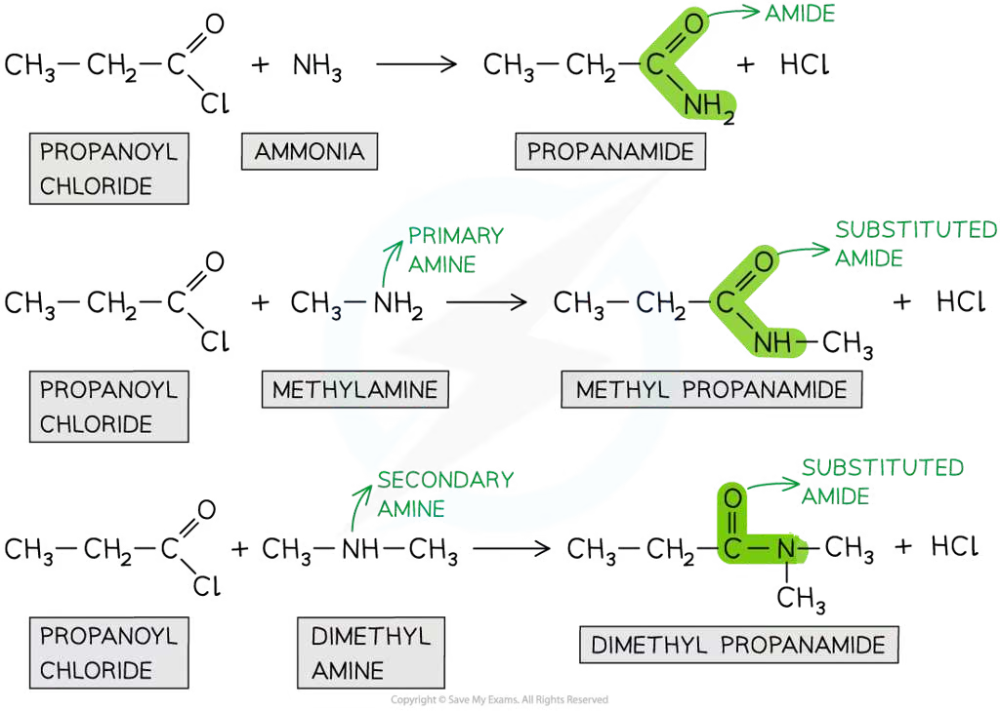{.concept-figure fig-alt="Formation of amides from acyl chlorides and ammonia or primary amines"}
:::

## 34.2 Phenylamine and azo compounds

::: {.study-card}
### Preparation and reactions of phenylamine

Phenylamine, C₆H₅NH₂, is prepared from nitrobenzene by reduction. The syllabus method uses tin and concentrated hydrochloric acid, with heat, followed by aqueous sodium hydroxide to liberate the free amine:

$$C₆H₅NO₂ → C₆H₅NH₃⁺Cl⁻ → C₆H₅NH₂$$

Hydrogen with a nickel, platinum or palladium catalyst, or LiAlH₄ in dry ether, are also suitable reducing systems.

Phenylamine reacts readily with bromine water because the NH₂ group activates the benzene ring and directs substitution to the 2-, 4- and 6-positions:

$$C₆H₅NH₂ + 3Br₂ → C₆H₂Br₃NH₂ + 3HBr$$

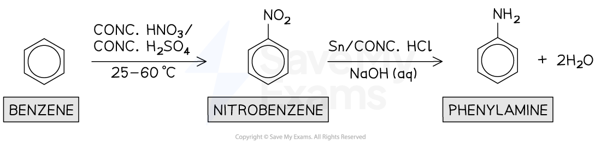{.concept-figure fig-alt="Preparation of phenylamine from nitrobenzene"}

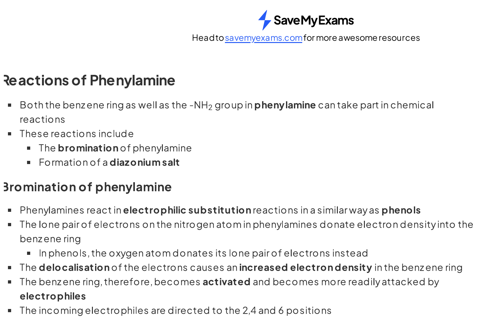{.concept-figure fig-alt="Reaction of phenylamine with bromine water"}
:::

::: {.worked-example}
Worked example · Phenylamine synthesis

### Nitrobenzene to phenylamine

**Name the type of reaction and suggest suitable reagents and conditions for the conversion of nitrobenzene into phenylamine.**

1. The reaction is a **reduction**.
2. Heat nitrobenzene with **tin and concentrated hydrochloric acid**.
3. Add aqueous sodium hydroxide after the reduction to release phenylamine from its salt.
4. An alternative is H₂ with a nickel catalyst, or LiAlH₄ in dry ether.

:::

::: {.study-card}
### Diazonium salts and azo dyes

Phenylamine reacts with nitrous acid below 10 °C to form a diazonium salt. Nitrous acid is made in situ from sodium nitrite and dilute hydrochloric acid:

$$NaNO₂ + HCl → HNO₂ + NaCl$$

$$C₆H₅NH₂ + HCl + HNO₂ → C₆H₅N₂⁺Cl⁻ + 2H₂O$$

The diazonium ion contains the group –N≡N⁺ and is unstable at higher temperatures, so the reaction mixture is kept ice-cold or below 10 °C.

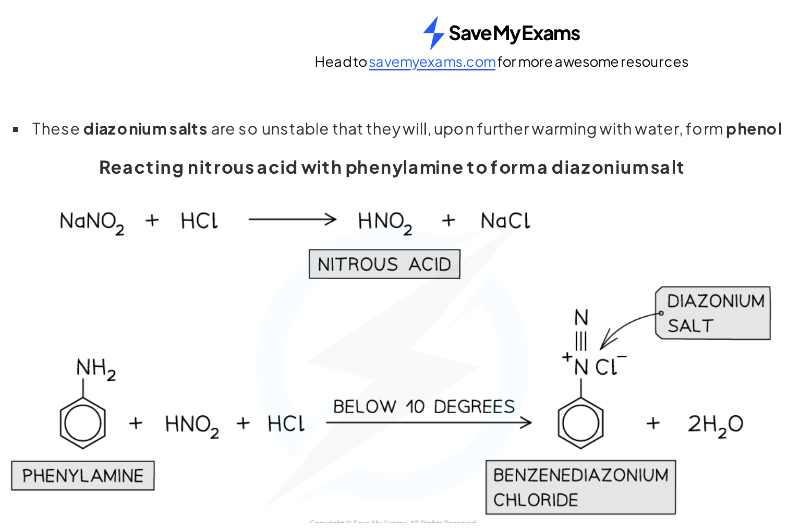{.concept-figure fig-alt="Formation and structure of a phenyl diazonium salt at low temperature"}

The diazonium ion acts as an electrophile and couples with a phenol or phenoxide ion. Coupling usually occurs at the position para to the hydroxyl group. The product contains the **azo group**, –N=N–, which extends conjugation between aromatic rings and gives intensely coloured azo dyes.

$$C₆H₅N₂⁺ + C₆H₅O⁻ → C₆H₅–N=N–C₆H₄–OH$$

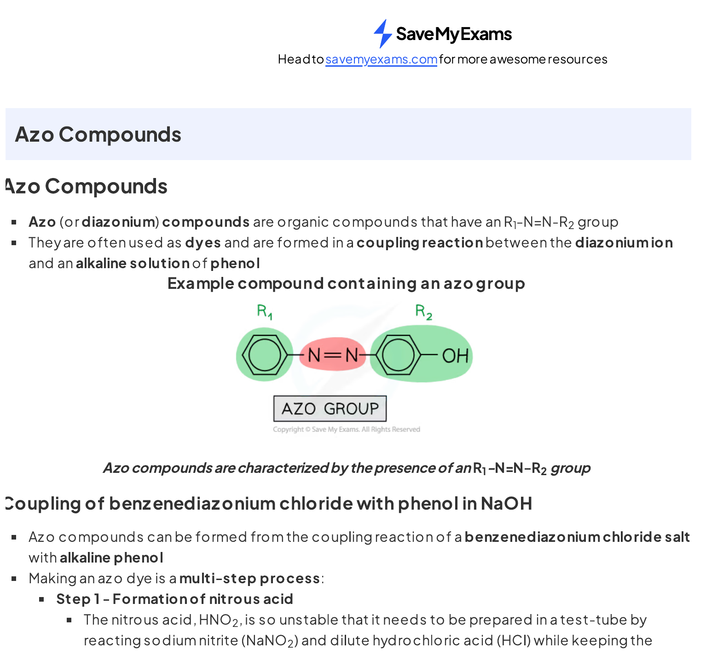{.concept-figure fig-alt="Azo coupling between a diazonium ion and phenol"}

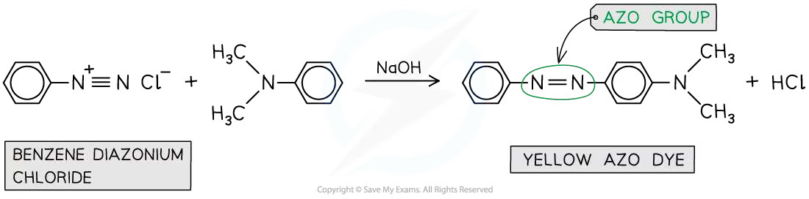{.concept-figure fig-alt="Preparation of an azo dye from phenylamine through diazotisation and coupling"}
:::

::: {.worked-example}
Worked example · Stabilising a diazonium salt

### Diazotisation and coupling

**Phenylamine is converted into a diazonium salt before it is coupled with an alkaline phenol solution. State a condition that prevents the diazonium salt from decomposing and explain the role of the azo group in the dye.**

1. Keep the reaction mixture **ice-cold**, or below 10 °C.
2. The low temperature prevents the unstable diazonium salt from decomposing.
3. The diazonium ion is an electrophile and reacts with the electron-rich phenoxide ring.
4. The product contains –N=N–, the **azo group**, which connects two aromatic systems.
5. The extended delocalised system absorbs visible light, so the azo compound is strongly coloured.

:::

## 34.3 Amides

::: {.study-card}
### Formation and hydrolysis

Amides contain the functional group –CONH₂ or a substituted form such as –CONHR. They are formed when ammonia or a primary amine reacts with an acyl chloride:

$$RCOCl + 2NH₃ → RCONH₂ + NH₄Cl$$

$$RCOCl + 2R'NH₂ → RCONHR' + R'NH₃Cl$$

Amides are hydrolysed by aqueous acid or alkali on heating. Acid hydrolysis gives a carboxylic acid and an ammonium ion; alkaline hydrolysis gives a carboxylate salt and ammonia:

$$RCONH₂ + H₂O + H⁺ → RCOOH + NH₄⁺$$

$$RCONH₂ + NaOH → RCOONa + NH₃$$

For example, heating ethanamide with sodium hydroxide produces sodium ethanoate and ammonia. The ammonia turns damp red litmus paper blue, providing a test for an amide.

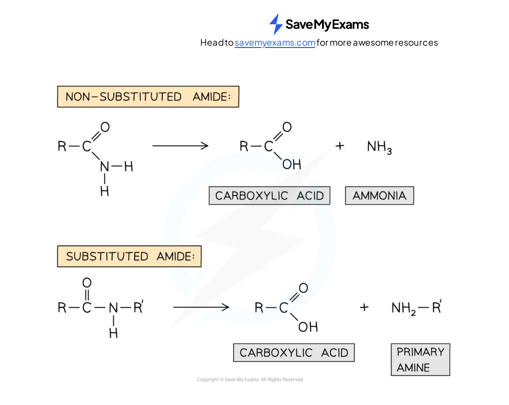{.concept-figure fig-alt="Formation of primary and substituted amides from acyl chlorides"}

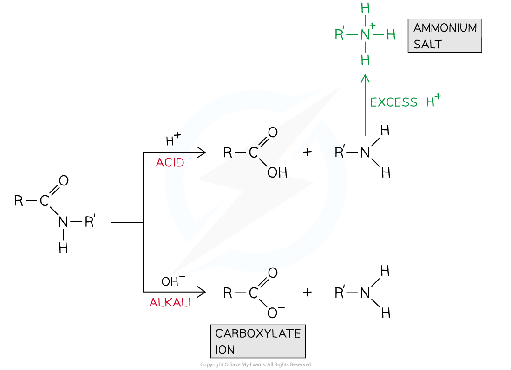{.concept-figure fig-alt="Acid and alkaline hydrolysis of an amide"}
:::

::: {.worked-example}
Worked example · Testing for an amide

### Ethanamide and sodium hydroxide

**Ethanamide is heated with sodium hydroxide. Write the equation and explain how this reaction can be used as a test for an amide.**

1. The equation is:

   $$CH₃CONH₂ + NaOH → CH₃COONa + NH₃$$

2. Heat the unknown amide with aqueous sodium hydroxide.
3. Test the gas produced with damp red litmus paper.
4. Ammonia is released and turns damp red litmus paper blue.

:::

::: {.study-card}
### Reduction and weak basicity of amides

Amides can be reduced with LiAlH₄ to give amines:

$$RCONH₂ → RCH₂NH₂ + H₂O$$

Amides are much weaker bases than amines. The nitrogen lone pair is delocalised into the carbonyl group. It is therefore less available to accept a proton. The electronegative oxygen atom also withdraws electron density from nitrogen.

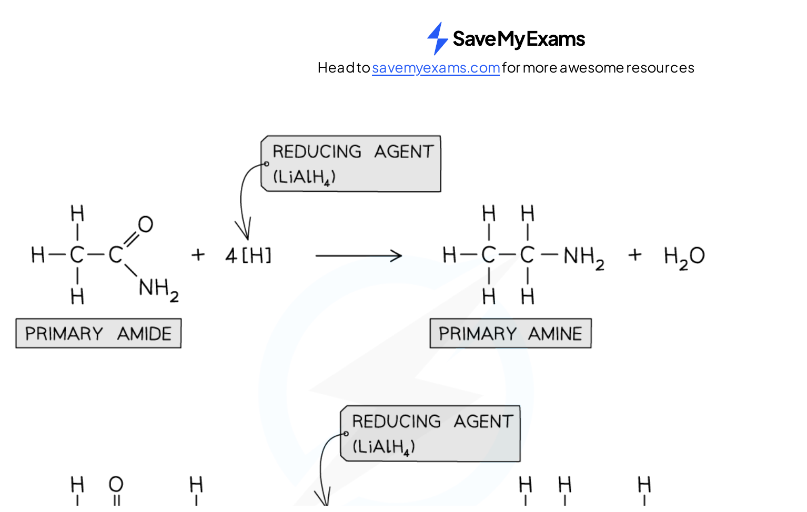{.concept-figure fig-alt="Reduction of an amide to an amine using lithium aluminium hydride"}
:::

::: {.worked-example}
Worked example · Comparing amide and amine basicity

### Benzamide and benzylamine

**State which is the weaker base, benzamide or benzylamine, and explain your answer. State a suitable reducing agent for converting benzamide into benzylamine.**

1. **Benzamide** is the weaker base.
2. In benzamide, the nitrogen lone pair is delocalised into the carbonyl group.
3. The carbonyl oxygen withdraws electron density, so the lone pair is less available to accept a proton.
4. Use **lithium aluminium hydride**, LiAlH₄, in dry ether.

:::

## 34.4 Amino acids

::: {.study-card}
### General structure, acid–base behaviour and zwitterions

An α-amino acid has the general formula RCH(NH₂)COOH. It contains both an acidic carboxylic acid group and a basic amino group.

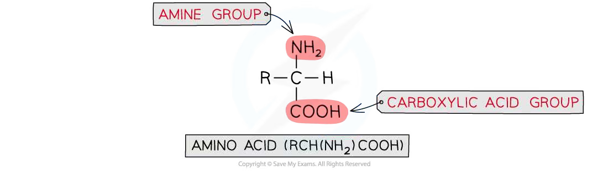{.concept-figure fig-alt="General structure of an alpha amino acid with amino and carboxylic acid groups"}

In the solid state and in aqueous solution near neutral pH, the proton can transfer internally from –COOH to –NH₂. The resulting dipolar ion is a **zwitterion**:

$$RCH(NH₃⁺)COO⁻$$

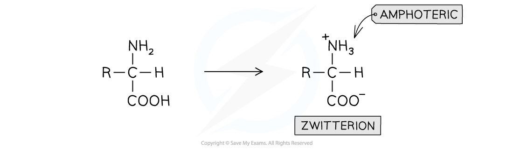{.concept-figure fig-alt="Formation of a zwitterion from an amino acid"}

In acidic solution the amino group is protonated, RCH(NH₃⁺)COOH. In alkaline solution the carboxyl group is deprotonated, RCH(NH₂)COO⁻.

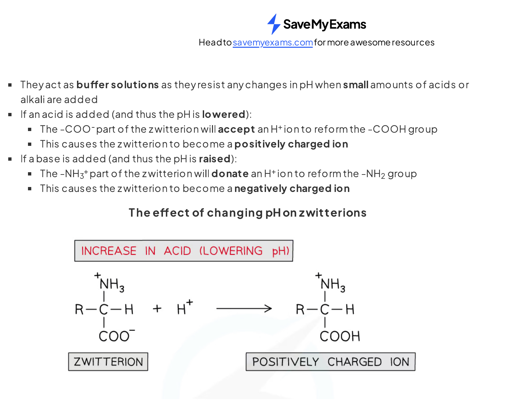{.concept-figure fig-alt="Cationic zwitterionic and anionic forms of an amino acid at different pH values"}
:::

::: {.worked-example}
Worked example · Amino acid acid–base reactions

### Alanine in acidic and basic conditions

**Draw the structures of alanine in acidic and basic conditions. Write equations showing the reactions of alanine with hydrochloric acid and serine with aqueous sodium hydroxide.**

1. In acidic conditions, alanine is protonated at nitrogen: CH₃CH(NH₃⁺)COOH.
2. In basic conditions, alanine is deprotonated at the carboxyl group: CH₃CH(NH₂)COO⁻.
3. With hydrochloric acid:

   $$CH₃CH(NH₂)COOH + HCl → CH₃CH(NH₃⁺)COOH + Cl⁻$$

4. With sodium hydroxide, serine reacts as:

   $$NH₂CH(CH₂OH)COOH + NaOH → NH₂CH(CH₂OH)COONa + H₂O$$

:::

::: {.study-card}
### Isoelectric point and electrophoresis

The **isoelectric point**, pI, is the pH at which an amino acid has zero net charge. At this pH it is present mainly as a zwitterion and does not move in an electric field.

In electrophoresis, a mixture is placed on buffer-soaked paper between two electrodes. Positive ions move towards the negative electrode, and negative ions move towards the positive electrode. The distance travelled depends on charge and size: highly charged and small ions generally move further and faster than weakly charged and large ions.

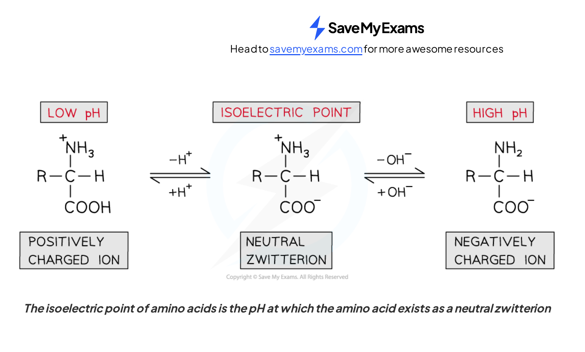{.concept-figure fig-alt="Relationship between amino acid charge and pH at the isoelectric point"}

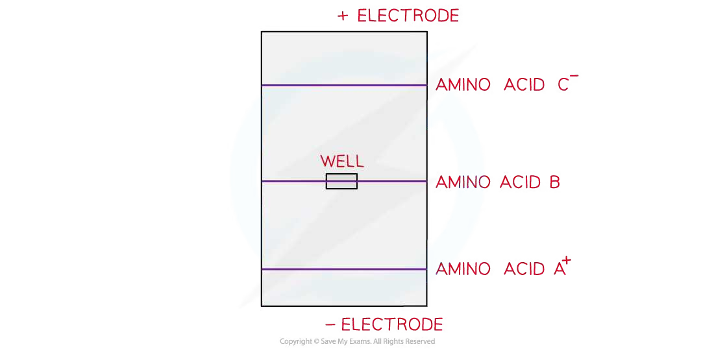{.concept-figure fig-alt="Electrophoresis arrangement for separating amino acids"}

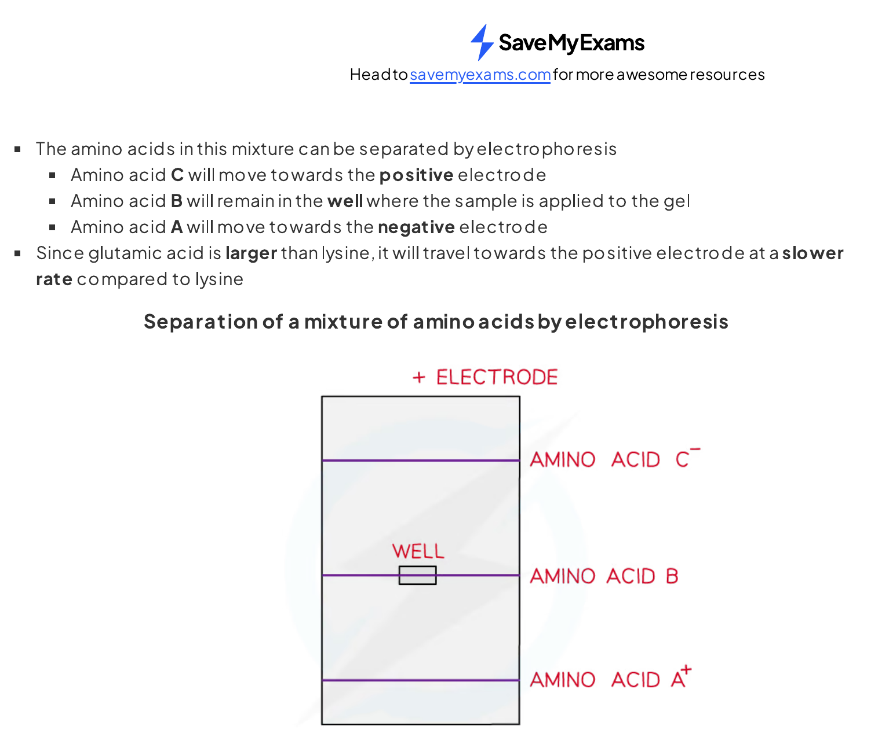{.concept-figure fig-alt="Separation of amino acid species by electrophoresis"}
:::

::: {.worked-example}
Worked example · Interpreting electrophoresis

### Charge and relative size

**An amino acid moves towards the positive electrode during electrophoresis. State the charge on the species. Explain why another amino acid may remain stationary.**

1. A species moving towards the positive electrode must be **negatively charged**.
2. It is attracted to the positive electrode because opposite charges attract.
3. An amino acid may remain stationary if it has zero net charge.
4. This occurs when the buffer pH equals the amino acid's isoelectric point; the amino acid is present as a zwitterion and has no net movement.

:::

::: {.study-card}
### Peptide bonds and proteins

Two amino acids form a dipeptide by a condensation reaction between the amino group of one molecule and the carboxyl group of another. Water is eliminated and a **peptide bond**, –CO–NH–, forms:

$$H₂N–CHR–COOH + H₂N–CHR'–COOH → H₂N–CHR–CO–NH–CHR'–COOH + H₂O$$

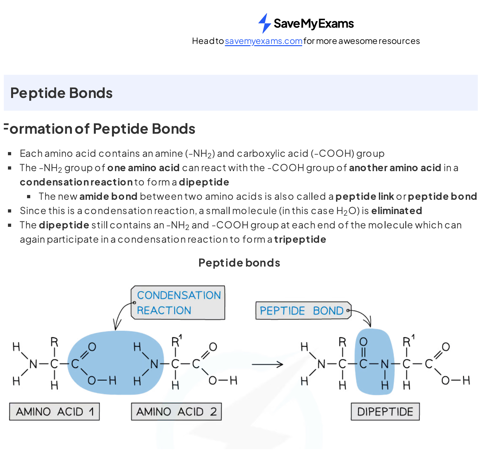{.concept-figure fig-alt="Condensation between two amino acids to form a peptide bond"}

A tripeptide contains three amino acid residues and two peptide bonds. Proteins are condensation polymers, also called **polyamides**, made from many amino acid residues.

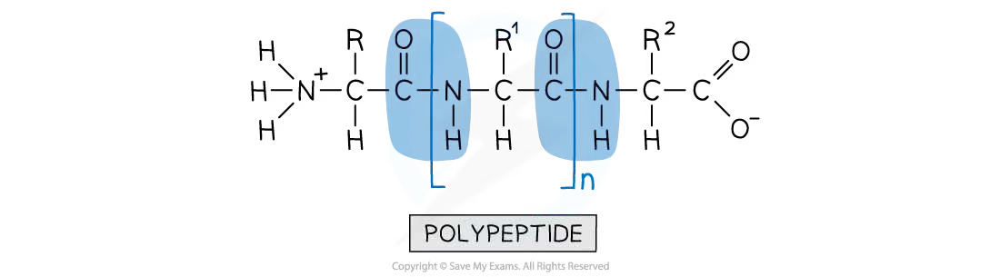{.concept-figure fig-alt="A polypeptide chain containing repeated peptide bonds"}
:::

::: {.worked-example}
Worked example · Counting amino acid residues

### Silk protein

**A silk protein has Mᵣ about 600 000 and is made from equal amounts of glycine, alanine and serine. Given Mᵣ values 75, 89 and 105, calculate the average number of amino acid residues.**

1. Each amino acid loses H₂O when a peptide bond forms, so subtract 18 from each Mᵣ:
   - glycine residue: 75 − 18 = 57
   - alanine residue: 89 − 18 = 71
   - serine residue: 105 − 18 = 87
2. One set containing one residue of each amino acid has Mᵣ = 57 + 71 + 87 = 215.
3. Number of sets = 600 000 ÷ 215 = 2791.
4. Each set contains three residues, so total residues = 2791 × 3 = **8372**.

:::

## Chapter checklist

- [ ] I can explain the basicity of ammonia, primary/secondary amines and phenylamine.
- [ ] I can prepare primary and secondary amines from halogenoalkanes and reduce nitriles/amides.
- [ ] I can prepare phenylamine and describe bromination, diazotisation and azo coupling.
- [ ] I can write the formation, hydrolysis and reduction equations for amides.
- [ ] I can explain why amides are weaker bases than amines.
- [ ] I can draw amino acid forms, zwitterions and peptide bonds.
- [ ] I can use isoelectric points and electrophoresis results to infer charge and relative size.

## Structured questions



### Original question PDFs

- [7.6 Nitrogen Compounds (A Level Only) - Easy](https://raw.githubusercontent.com/nanoxsj/CIE-Chemistry-Study/publish-chemistry-study/resources/original-papers/nitrogen-compounds/34-7.6-nitrogen-compounds-easy.pdf)
- [7.6 Nitrogen Compounds (A Level Only) - Medium](https://raw.githubusercontent.com/nanoxsj/CIE-Chemistry-Study/publish-chemistry-study/resources/original-papers/nitrogen-compounds/34-7.6-nitrogen-compounds-medium.pdf)
