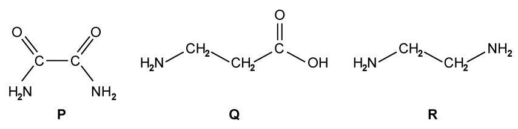
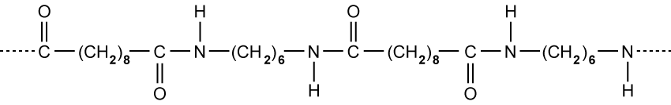
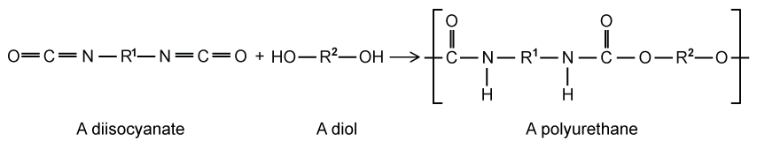
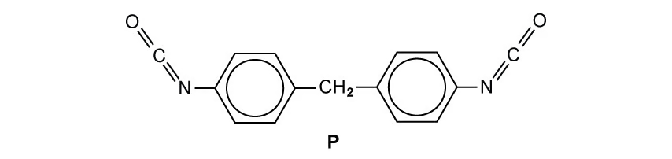
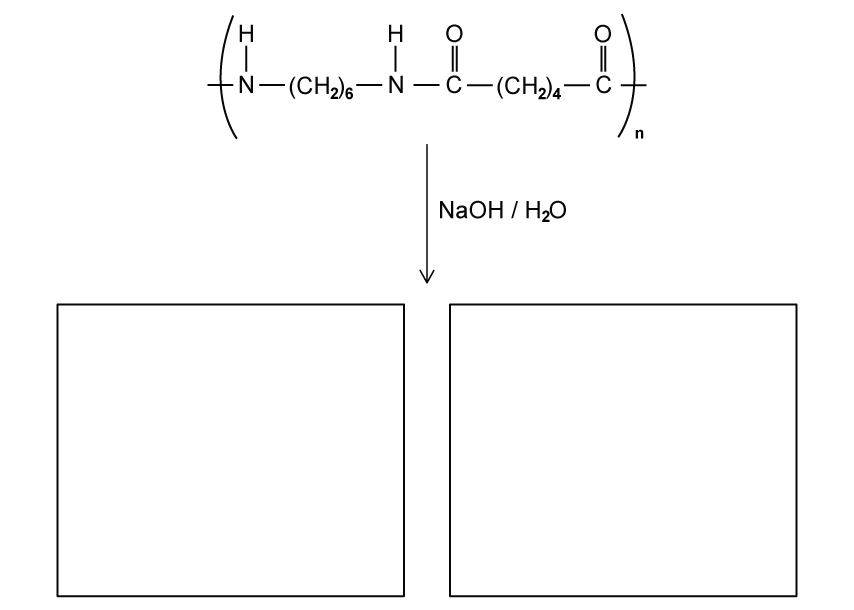
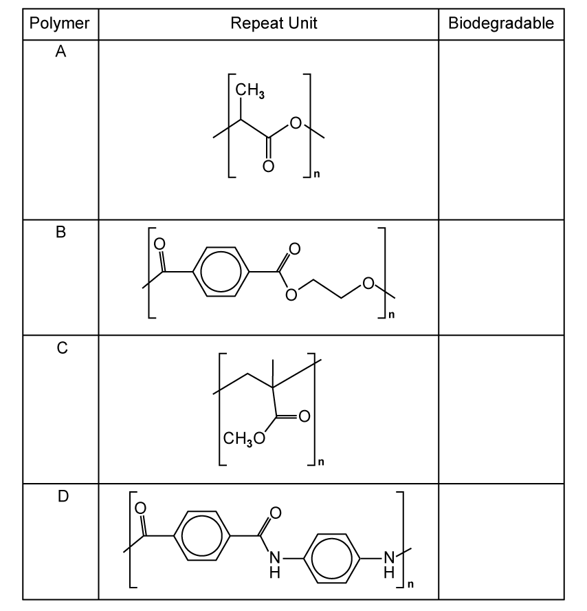

# 7.7 Polymerisation (A Level Only) - Structured Questions

本页保留 7.7 题包中的全部 Structured Questions：Easy 3 题、Medium 4 题和 Hard 3 题。题目保留完整英文题干、所有分问、原始分值和题目中的独立图；答案按 Model Answers 整理，计算题、结构题和解释题均呈现完整步骤。

### 7.7 Polymerisation (A Level Only) - Easy

::: {.question-card}
### Example 1 · Condensation polymer monomers · 7.7 SQ Easy Q1

This question is about condensation polymers.

**(a)** State the names of two classes of organic molecules that can take part in condensation polymerisation. `[2 marks]`

**(b)** Draw the structure of the dicarboxylic acid whose formula is C$_4$H$_6$O$_4$. The functional groups should be displayed clearly. `[1 mark]`

**(c)** State the IUPAC name of the dicarboxylic acid in part (b). `[1 mark]`

**(d)** Draw one repeat unit of the polymer formed when C$_4$H$_6$O$_4$ polymerises with diethylamine, H$_2$NCH$_2$CH$_2$NH$_2$. `[2 marks]`

Show mark scheme / model answer

- **(a)** Any two from: **dicarboxylic acids**, **diols**, **diamines**, **amino acids**, **dioyl chlorides** or hydroxyl-carboxylic acids. `[2]`
- **(b)** The displayed structure is

  $$\ce{HO-C(=O)-CH2-CH2-C(=O)-OH}$$

- **(c)** **Butane-1,4-dioic acid** (succinic acid). `[1]`
- **(d)** The carboxylic acid groups react with the amine groups to form amide links. One acceptable repeat unit is

  $$\ce{[-NH-CH2-CH2-NH-C(=O)-CH2-CH2-C(=O)-]_{n}}$$

  The unit must have continuation bonds at both ends and show the $\ce{-C(=O)-NH-}$ amide links. `[2]`

:::

::: {.question-card}
### Example 2 · Deducing monomers and hydrolysis · 7.7 SQ Easy Q2

The structure of a synthetic polyester is shown below.

{.question-figure fig-alt="A synthetic polyester repeat unit with benzene and ethane sections"}

**(a)** Deduce the structures of the two monomers used to make this polyester. `[2 marks]`

**(b)** One of the monomers is called benzene-1,4-dicarboxylic acid. State the name of the other one. `[1 mark]`

**(c)** Name the other product of the reaction between the two monomers in part (b). `[1 mark]`

Benzene-1,4-dicarboxylic acid will also react to form a polyamide. Which of the three molecules P, Q and R could react with benzene-1,4-dicarboxylic acid to form a polyamide?

{.question-figure fig-alt="Three possible co-monomers labelled P, Q and R"}

**(d)** Select the correct molecule. `[1 mark]`

Show mark scheme / model answer

- **(a)** The two monomers are **benzene-1,4-dicarboxylic acid**, $\ce{HOOC-C6H4-COOH}$, and **ethane-1,2-diol**, $\ce{HO-CH2-CH2-OH}$. `[2]`
- **(b)** The other monomer is **ethane-1,2-diol**. `[1]`
- **(c)** The other product is **water**, H$_2$O. `[1]`
- **(d)** The correct molecule is **R**, because it is a diamine with two $\ce{-NH2}$ groups. A diamine can form amide links with the two carboxylic acid groups. `[1]`

:::

::: {.question-card}
### Example 3 · Hydrolysis of polymers · 7.7 SQ Easy Q3

This question is about hydrolysis of polymers.

**(a)** What is meant by a hydrolysis reaction? `[1 mark]`

**(b)** Describe the reaction conditions and state what occurs to the polyester during acid hydrolysis. `[2 marks]`

**(c)** Outline the difference in the product(s) between acid and base hydrolysis of a polyester. `[2 marks]`

**(d)** Draw structures for the products of acid and base hydrolysis of the following polymer.

{.question-figure fig-alt="A polyester repeat unit for acid and base hydrolysis"}

`[4 marks]`

Show mark scheme / model answer

- **(a)** Hydrolysis is the **breaking of a chemical bond using water**. `[1]`
- **(b)** Heat the polyester with aqueous acid. The ester links are broken and the original dicarboxylic acid and diol monomers are formed. `[2]`
- **(c)** Acid hydrolysis gives the **carboxylic acid** product, $\ce{-COOH}$. Base hydrolysis with aqueous sodium hydroxide gives the **sodium carboxylate salt**, $\ce{-COO^-Na^+}$, together with the alcohol/diol. `[2]`
- **(d)** The acid-hydrolysis products are benzene-1,4-dicarboxylic acid and ethane-1,2-diol:

  $$\ce{HOOC-C6H4-COOH + HO-CH2-CH2-OH}$$

  The alkaline-hydrolysis products are disodium benzene-1,4-dicarboxylate and ethane-1,2-diol:

  $$\ce{NaOOC-C6H4-COONa + HO-CH2-CH2-OH}$$

  `[4]`

:::

### 7.7 Polymerisation (A Level Only) - Medium

::: {.question-card}
### Example 4 · Amino acids and polyamides · 7.7 SQ Medium Q1

Valylalanine shown in Fig. 1.1 is an example of a dipeptide composed of two amino acids, valine and alanine.

{.question-figure fig-alt="Displayed structure of valylalanine"}

**(a)** When this compound is placed in acidic conditions, two species are formed. Draw one of these two species. `[1 mark]`

A dipeptide made from the amino acids cysteine and tryptophan is shown in Fig. 1.2.

{.question-figure fig-alt="A dipeptide containing cysteine and tryptophan"}

**(b)** Draw the structure of the amino acid tryptophan. `[1 mark]`

Polymers formed from alkenes by addition polymerisation are usually too weak for use as fibres for weaving.

**(c)** In terms of intermolecular forces between the polymer chains, explain why polyalkenes are not suitable to be used as fibres for weaving. `[3 marks]`

**(d)** Explain why the molecule NH$_2$CH$_2$CH$_2$COCl can form a condensation polymer with itself. `[2 marks]`

Show mark scheme / model answer

- **(a)** An acceptable acidic species has the amine group protonated, for example

  $$\ce{H3N+ - CH(CH(CH3)2) - C(=O)-NH-CH(CH3)-COOH}$$

  `[1]`
- **(b)** Tryptophan is $\ce{H2N-CH(CH2-C8H6N)-COOH}$, with the side chain shown as $\ce{-CH2-}$ joined to an indole ring. `[1]`
- **(c)** Polyalkenes contain mainly non-polar $\ce{C-C}$ and $\ce{C-H}$ bonds. The chains therefore have only weak London forces between them. They do not have strong hydrogen bonding or other strong permanent dipole attractions, so the chains slide past one another and the fibres are weak. `[3]`
- **(d)** The molecule has two different functional groups, an amine group and an acyl chloride group. The amine can attack the carbonyl carbon of another molecule; an amide link forms and HCl is eliminated. Because both ends can react, a chain forms. `[2]`

:::

::: {.question-card}
### Example 5 · Nylon and Nomex · 7.7 SQ Medium Q2

A section of a nylon polymer is shown in Fig. 2.1.

{.question-figure fig-alt="A section of a nylon polyamide chain"}

**(a)(i)** Draw the structures of two monomers that could be used to make this nylon. `[2 marks]`

**(a)(ii)** State the type of polymerisation involved in the formation of this nylon. `[1 mark]`

**(b)** Nylon can be used to make clothing. Suggest why nylon should be protected from spillages of strong acids and alkalis. `[2 marks]`

Nomex has a higher melting point than nylon and is used to make flame-resistant body suits.

{.question-figure fig-alt="A section of the aromatic Nomex polymer"}

**(c)** Suggest a reason why the melting point of Nomex is higher than that of nylon. `[2 marks]`

**(d)(i)** Draw the two monomers used to manufacture Nomex. `[2 marks]`

**(d)(ii)** State the formula of any by-products produced. `[1 mark]`

Show mark scheme / model answer

- **(a)(i)** The monomers are **hexane-1,6-diamine**, $\ce{H2N-(CH2)6-NH2}$, and **hexanedioic acid**, $\ce{HOOC-(CH2)4-COOH}$. `[2]`
- **(a)(ii)** **Condensation polymerisation**. `[1]`
- **(b)** Strong acids or alkalis hydrolyse the amide links in nylon. This breaks the polymer chains and weakens or damages the fibres. `[2]`
- **(c)** Nomex contains rigid benzene rings in the main chain. Its chains are less flexible and pack more effectively, and strong intermolecular attractions between the aromatic polyamide chains require more energy to overcome. `[2]`
- **(d)(i)** The monomers are **1,3-diaminobenzene** and **benzene-1,3-dicarboxylic acid**. `[2]`
- **(d)(ii)** Water, H$_2$O, is formed. `[1]`

:::

::: {.question-card}
### Example 6 · Polyurethane and Nylon-66 hydrolysis · 7.7 SQ Medium Q3

Polyurethanes are polymers made by the reaction of a diisocyanate with a diol. R$^1$ and R$^2$ are hydrocarbon groups.

**(a)** Lycra is a polyurethane formed from the diisocyanate P and HOCH$_2$CH$_2$OH.

{.question-figure fig-alt="General polyurethane formation from a diisocyanate and a diol"}

**(i)** Give the molecular formula for P. `[1 mark]`

{.question-figure fig-alt="The displayed structure of diisocyanate P"}

**(ii)** Draw the repeat unit of Lycra. `[2 marks]`

**(b)** Fibres of Lycra are strong due to the intermolecular forces between the polymer chains. Complete the table to identify two intermolecular forces responsible for this property and the groups involved. `[2 marks]`

**(c)** Name one example of each type of polymer: a synthetic polyamide and a synthetic polyester. `[2 marks]`

**(d)** The repeat unit of Nylon-66 is shown below.

{.question-figure fig-alt="Nylon-66 repeat unit under alkaline hydrolysis"}

Draw the two products from the hydrolysis of Nylon-66. `[2 marks]`

Show mark scheme / model answer

- **(a)(i)** From the displayed structure, P is a diisocyanate containing two phenyl rings joined by a methylene group. Its formula is **C$_{15}$H$_{12}$N$_2$O$_2$**. `[1]`
- **(a)(ii)** The repeat unit contains the urethane link:

  $$\ce{[-NH-C(=O)-C6H4-CH2-C6H4-C(=O)-NH-CH2-CH2-O-]_{n}}$$

  with continuation bonds at both ends. `[2]`
- **(b)** Hydrogen bonding between $\ce{N-H}$ and urethane $\ce{C=O}$ groups; dipole–dipole attraction between the polar $\ce{C=O}$ and $\ce{C-N}$ bonds. `[2]`
- **(c)** Synthetic polyamide: **Nylon-6,6**, Kevlar or Nomex. Synthetic polyester: **PET/terylene**. `[2]`
- **(d)** Alkaline hydrolysis gives **hexane-1,6-diamine**, $\ce{H2N-(CH2)6-NH2}$, and the disodium salt of hexanedioic acid, $\ce{NaOOC-(CH2)4-COONa}$. `[2]`

:::

::: {.question-card}
### Example 7 · Biodegradable polymers and polypeptides · 7.7 SQ Medium Q4

**(a)(i)** Name an example of a synthetic polyester and a synthetic polyamide. `[2 marks]`

**(a)(ii)** Polyesters and polyamides are formed by condensation reactions. Name a molecule which is commonly eliminated in such reactions. `[1 mark]`

**(b)(i)** The table shows the repeat units of a number of polymers. Place a tick against the ones which are biodegradable.

{.question-figure fig-alt="Table of polymer repeat units to classify as biodegradable"}

`[2 marks]`

**(b)(ii)** Draw the structures of two monomers used to form polymer B. `[2 marks]`

**(c)** A section of polypeptide was hydrolysed and the following amino acids were identified: T, U and V.

| Amino acid | Formula |
|---|---|
| T | CH$_3$CH(NH$_2$)CO$_2$H |
| U | C$_6$H$_5$CH$_2$CH(NH$_2$)CO$_2$H |
| V | H$_2$N(CH$_2$)$_4$CH(NH$_2$)CO$_2$H |

**(i)** Which of the amino acids T, U or V has the highest pH in an aqueous solution? Explain your answer. `[2 marks]`

**(ii)** State how many different dipeptides could be formed from a reaction mixture consisting of amino acids T and U. `[1 mark]`

**(iii)** Polypeptides contain a high proportion of carbon and hydrogen in their structures, yet many are soluble in water. By referring to the structure of a polypeptide, explain why. `[2 marks]`

Show mark scheme / model answer

- **(a)(i)** Examples: polyester **PET/terylene** and polyamide **Nylon-6,6**. `[2]`
- **(a)(ii)** Water, H$_2$O. `[1]`
- **(b)(i)** Polymers containing hydrolysable ester links are biodegradable; tick the repeat units with ester links (the table's **B and C** structures). The carbon-only addition polymer and the aromatic polyamide are not the intended biodegradable choices in this question. `[2]`
- **(b)(ii)** Break polymer B at the ester links. The monomers are **benzene-1,4-dicarboxylic acid** and **ethane-1,2-diol**. `[2]`
- **(c)(i)** Amino acid **V** has the highest pH because its side chain contains a second amino group. It can accept an additional proton and makes the solution more alkaline. `[2]`
- **(c)(ii)** Four dipeptides: T–T, T–U, U–T and U–U. `[1]`
- **(c)(iii)** Polypeptides contain many polar amide/peptide groups. The $\ce{C=O}$ and $\ce{N-H}$ groups form hydrogen bonds with water, so the chains can be hydrated and dissolve even though the backbone also contains many C–C and C–H bonds. `[2]`

:::

### 7.7 Polymerisation (A Level Only) - Hard

::: {.question-card}
### Example 8 · General polyester polymerisation · 7.7 SQ Hard Q1

Polymers consist of monomers joined together by undergoing either addition or condensation polymerisation. Fig. 1.1 shows a dicarboxylic acid and a diol that can be used in a general condensation polymerisation reaction.

{.question-figure fig-alt="General dicarboxylic acid and diol monomers"}

**(a)** Draw one repeat unit for this polymerisation. `[1 mark]`

**(b)** In terms of $n$, state the number of molecules of water formed in the condensation polymerisation reaction of a general dicarboxylic acid and a general diol as shown in Fig. 1.1. `[1 mark]`

**(c)** Using displayed formulae, write the balanced equation for the condensation polymerisation of propanedioyl dichloride and butane-1,4-diol. `[3 marks]`

**(d)** Suggest an alternative pair of monomers that will produce the polymer from part (c). `[1 mark]`

Show mark scheme / model answer

- **(a)** One acceptable repeat unit is

  $$\ce{[-O-R'-O-C(=O)-R-C(=O)-]_{n}}$$

  with continuation bonds at both ends. `[1]`
- **(b)** The number of water molecules is **$2n-1$**. For one acid and one diol there is one ester link and one water; each additional monomer pair adds two links and two waters. `[1]`
- **(c)** Using propanedioyl dichloride and butane-1,4-diol:

  $$\ce{n Cl-C(=O)-CH2-C(=O)-Cl + n HO-CH2-CH2-CH2-CH2-OH -> [-C(=O)-CH2-C(=O)-O-CH2-CH2-CH2-CH2-O-]_{n} + 2n HCl}$$

  `[3]`
- **(d)** Use **propanedioic acid**, $\ce{HOOC-CH2-COOH}$, with **butane-1,4-diol**, $\ce{HO-(CH2)4-OH}$. `[1]`

:::

::: {.question-card}
### Example 9 · Lactic acid and poly(lactic acid) · 7.7 SQ Hard Q2

Lactic acid has the structural formula CH$_3$CHOHCOOH.

**(a)(i)** Name all the functional groups in lactic acid. `[1 mark]`

**(a)(ii)** Give the systematic name of lactic acid. `[1 mark]`

**(a)(iii)** Lactic acid exhibits stereoisomerism. Draw three-dimensional structures for the two stereoisomers of lactic acid and name this type of stereoisomerism. `[2 marks]`

Poly(lactic acid) is a thermoplastic polyester that can be prepared from lactic acid. It is a renewable material used widely in 3D printers.

**(b)** Explain why lactic acid can be polymerised. `[1 mark]`

**(c)(i)** Draw the skeletal formula for three repeat units of poly(lactic acid). `[1 mark]`

**(c)(ii)** Explain what happens to the chirality of lactic acid when it is polymerised. `[2 marks]`

**(d)** Poly(lactic acid) can be prepared using a different monomer. Draw the skeletal formula of this monomer. Give the systematic name of another monomer that could make poly(lactic acid). `[2 marks]`

Show mark scheme / model answer

- **(a)(i)** Lactic acid contains an **alcohol/hydroxyl group** and a **carboxylic acid group**. `[1]`
- **(a)(ii)** **2-hydroxypropanoic acid**. `[1]`
- **(a)(iii)** The two non-superimposable mirror-image forms are **enantiomers**. This is **optical isomerism**. `[2]`
- **(b)** It contains both an alcohol group and a carboxylic acid group, so one molecule can react with another by esterification and form a chain. `[1]`
- **(c)(i)** A correct three-unit section is

  $$\ce{-O-CH(CH3)-C(=O)-O-CH(CH3)-C(=O)-O-CH(CH3)-C(=O)-}$$

  `[1]`
- **(c)(ii)** The chiral carbon is not removed when the ester link forms. It remains attached to four different groups, so the chirality is retained in the polymer chain. `[2]`
- **(d)** The alternative monomer is **2-hydroxypropanoyl chloride**, $\ce{CH3-CH(OH)-COCl}$. Another acceptable monomer name is **2-hydroxypropanoic acid** if the acid route is being stated. `[2]`

:::

::: {.question-card}
### Example 10 · Nomex and Kevlar · 7.7 SQ Hard Q3

Nomex is made from 1,3-diaminobenzene and 1,3-benzenedicarboxylic acid.

**(a)** Draw the skeletal structures of these monomers. `[2 marks]`

**(b)** Draw the structure of the Nomex polymer. `[3 marks]`

Kevlar is made from 1,4-diaminobenzene and 1,4-benzenedicarboxylic acid.

**(c)** Draw two repeat units of the polymer to show the strongest intermolecular force in Kevlar. `[2 marks]`

**(d)** State whether Kevlar or Nomex will have the higher melting point. Explain your answer. `[2 marks]`

Show mark scheme / model answer

- **(a)** Draw benzene rings with $-$NH$_2$ groups at positions 1,3 and with $-$COOH groups at positions 1,3: **1,3-diaminobenzene** and **benzene-1,3-dicarboxylic acid**. `[2]`
- **(b)** The Nomex repeat unit contains alternating 1,3-disubstituted benzene rings joined by amide links:

  $$\ce{[-NH-C(=O)-C6H4-C(=O)-NH-C6H4-]_{n}}$$

  where both benzene rings have the substituents in the 1,3 positions. `[3]`
- **(c)** Draw two chains with $\ce{N-H}$ groups pointing towards carbonyl oxygens on the neighbouring chain and show dashed **hydrogen bonds**, $\ce{N-H...O=C}$. `[2]`
- **(d)** **Kevlar** has the higher melting point. Its para-substituted, linear chains pack more closely and form stronger, more extensive intermolecular hydrogen bonding; more energy is needed to separate the chains. `[2]`

:::

### Original question PDFs

- [7.7 Polymerisation (A Level Only) – Easy](https://raw.githubusercontent.com/nanoxsj/CIE-Chemistry-Study/main/resources/original-papers/polymerisation/35.7-polymerisation-easy.pdf)
- [7.7 Polymerisation (A Level Only) – Medium](https://raw.githubusercontent.com/nanoxsj/CIE-Chemistry-Study/main/resources/original-papers/polymerisation/35.7-polymerisation-medium.pdf)
- [7.7 Polymerisation (A Level Only) – Hard](https://raw.githubusercontent.com/nanoxsj/CIE-Chemistry-Study/main/resources/original-papers/polymerisation/35.7-polymerisation-hard.pdf)
