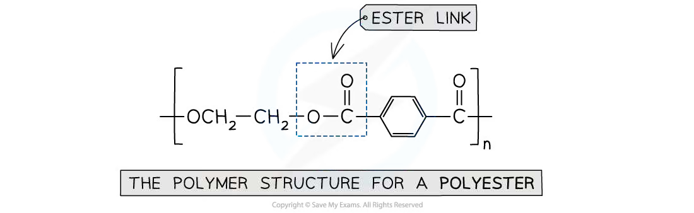
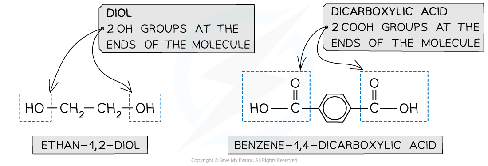
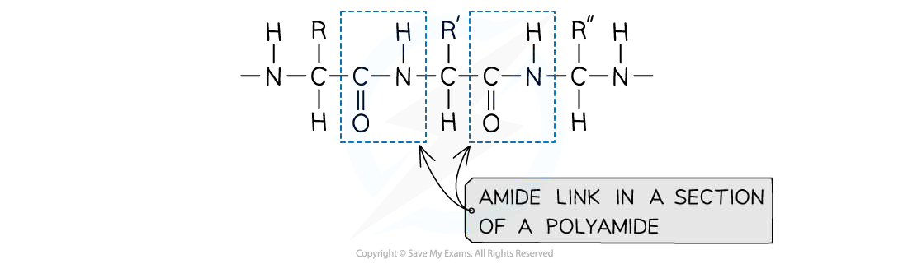
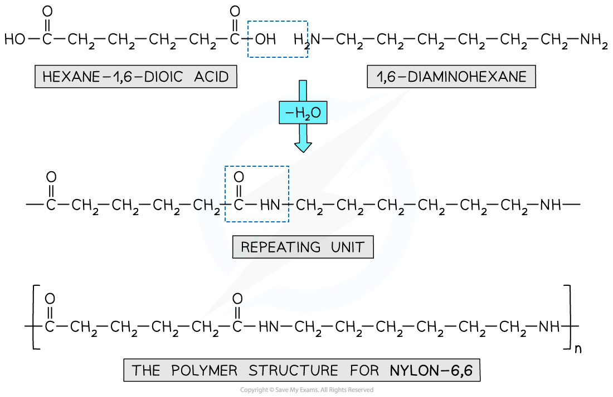
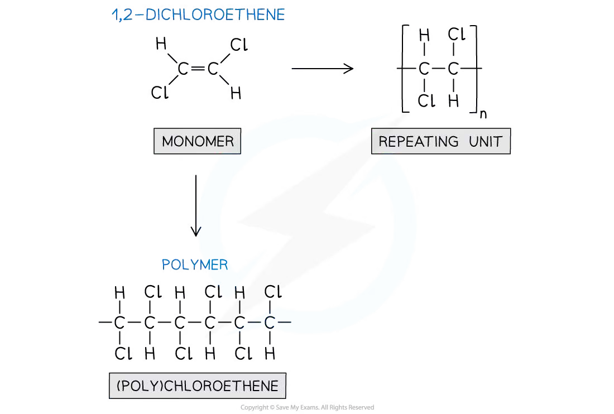
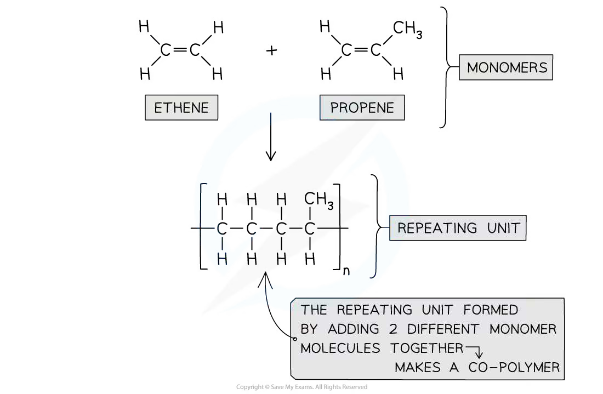
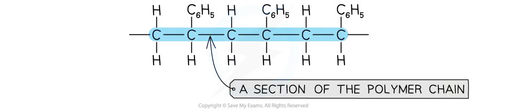
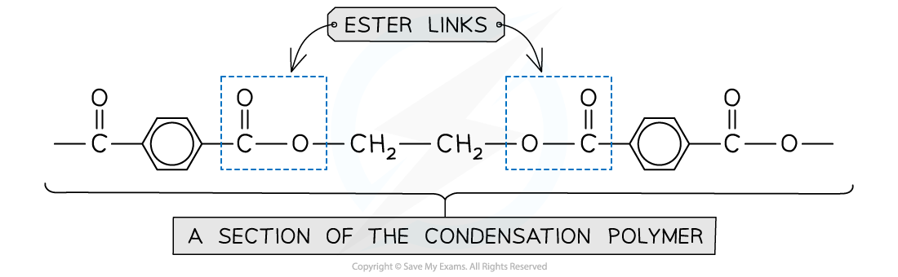
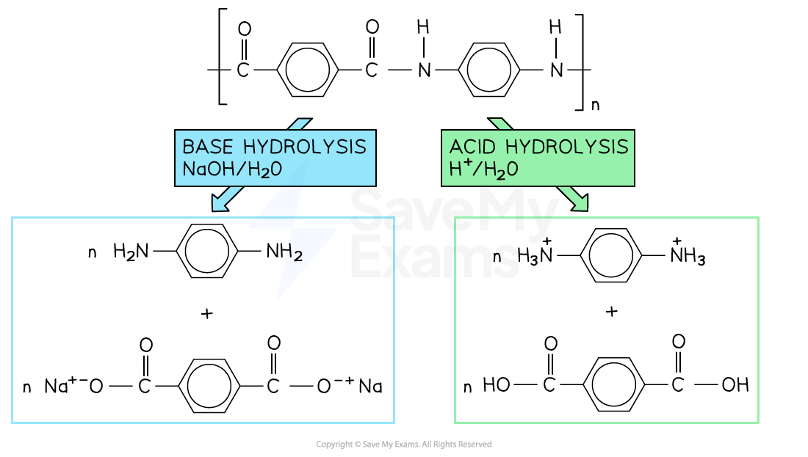
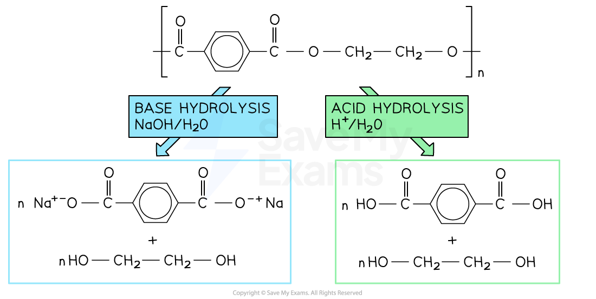

# 35 Polymerisation

本章对应 CIE 9701 2025–2027 syllabus 的 **35.1 Condensation Polymerisation**、**35.2 Predicting the Type of Polymerisation** 与 **35.3 Degradable Polymers**。题目部分对应专题题包 **7.7 Polymerisation (A Level Only)**；所有题目和答案见本页底部的 Structured Questions 页面。

## Learning objectives

学完本章后，你应该能够：

- identify the monomers and repeat units of condensation polymers;
- explain how polyesters, polyamides and polyurethanes are formed;
- distinguish addition polymerisation from condensation polymerisation;
- predict the type of polymerisation from the functional groups in the monomers or repeat unit;
- explain why many polyalkenes are difficult to biodegrade;
- describe acid and alkaline hydrolysis of polyesters and polyamides;
- identify structural features that make a polymer photodegradable or biodegradable.

## 35.1 Condensation Polymerisation

::: {.study-card}
### What is condensation polymerisation?

**Condensation polymerisation is a reaction in which monomers join together and a small molecule is eliminated each time a new link is formed.** In the examples required here, the small molecule is usually water, although HCl is eliminated when acyl chlorides are used.

The monomers must have two functional groups, or two different functional groups which can react together, so that the chain can continue to grow. Typical monomer classes include:

- **diols**, with two $-$OH groups;
- **dicarboxylic acids**, with two $-$COOH groups;
- **dioyl chlorides**, with two $-$COCl groups;
- **diamines**, with two $-$NH$_2$ groups;
- **amino acids**, containing both $-$NH$_2$ and $-$COOH groups.

The two key linkages are:

$$\text{carboxylic acid/acyl chloride} + \text{alcohol} \longrightarrow \text{ester link}$$

$$\text{carboxylic acid/acyl chloride} + \text{amine} \longrightarrow \text{amide link}$$

The polymer chain must be drawn with continuation bonds at both ends. The $-$OH and $-$COOH groups are not left complete inside a repeat unit because they have reacted to form the ester link.

{.concept-figure fig-alt="A polyester chain showing the ester link"}
:::

::: {.study-card}
### Polyesters

A polyester is formed when a **diol** reacts with a **dicarboxylic acid**. Each esterification eliminates one molecule of water:

$$\ce{HO-R'-OH + HOOC-R-COOH ->[-H2O] [-O-R'-O-C(O)-R-C(O)-]_{n}}$$

For example, ethane-1,2-diol and benzene-1,4-dicarboxylic acid form the polyester PET (terylene). The ester link is:

$$\ce{-O-C(=O)-}$$

To deduce the monomers from a repeat unit, break the chain through each ester link. Restore $-$OH to the oxygen-containing fragment and $-$COOH to the carbonyl-containing fragment.

{.concept-figure fig-alt="Ethane-1,2-diol and benzene-1,4-dicarboxylic acid as polyester monomers"}
:::

::: {.worked-example}
Worked example · Deducing a polyester repeat unit

### Ethane-1,2-diol and benzene-1,4-dicarboxylic acid

**The monomers ethane-1,2-diol and benzene-1,4-dicarboxylic acid react by condensation polymerisation. Draw one repeat unit of the polyester and identify the small molecule eliminated.**

1. Identify the two functional groups that react: $-$OH and $-$COOH.
2. Form an ester link, $\ce{-O-C(=O)-}$, between the two monomers.
3. Keep the ethane-1,2-diyl section, $\ce{-CH2CH2-}$, and the benzene-1,4-dicarbonyl section in the repeat unit.
4. The repeat unit is

   $$\ce{[-O-CH2-CH2-O-C(=O)-C6H4-C(=O)-]_{n}}$$

5. Each esterification eliminates **water, H$_2$O**.

:::

::: {.study-card}
### Polyamides

A polyamide is formed when a **diamine** reacts with a **dicarboxylic acid** or a **dioyl dichloride**. The new link is an amide link:

$$\ce{-C(=O)-NH-}$$

With a dicarboxylic acid, water is eliminated. With a dioyl dichloride, HCl is eliminated and the reaction is generally more vigorous. Nylon-6,6 is made from hexane-1,6-diamine and hexanedioic acid; Kevlar and Nomex are aromatic polyamides (aramids).

{.concept-figure fig-alt="An amide link in a section of a polyamide"}

{.concept-figure fig-alt="Repeat units of Nylon-6,6 and Kevlar"}

To identify an amide polymer's monomers, break the chain through each $\ce{C(=O)-N}$ bond. Add $-$COOH or $-$COCl to the carbonyl ends and $-$NH$_2$ to the nitrogen ends.
:::

::: {.worked-example}
Worked example · Deducing monomers from a polyamide

### Nylon-6,6

**A section of Nylon-6,6 is shown. Deduce the two monomers used to make the polymer and state the type of polymerisation.**

1. Break the chain through the amide links, $\ce{-C(=O)-NH-}$.
2. The nitrogen-containing fragment becomes **hexane-1,6-diamine**, $\ce{H2N-(CH2)6-NH2}$.
3. The carbonyl-containing fragment becomes **hexanedioic acid**, $\ce{HOOC-(CH2)4-COOH}$.
4. The reaction is **condensation polymerisation**, because a small molecule is eliminated as the amide links form.
5. The polymer is a **polyamide**.

:::

::: {.study-card}
### Polyurethanes

Polyurethanes are condensation polymers formed from a **diisocyanate** and a **diol**. The functional group $\ce{-N=C=O}$ reacts with $-$OH to form a urethane link:

$$\ce{O=C=N-R^1-N=C=O + HO-R^2-OH -> [-C(=O)-NH-R^1-NH-C(=O)-O-R^2-O-]_{n}}$$

The urethane link contains both $\ce{-NH-}$ and $\ce{-C(=O)-O-}$ groups. Consequently, polyurethane chains can have hydrogen bonding as well as permanent dipole–dipole attractions between chains. Lycra is a useful example of a polyurethane fibre.
:::

::: {.study-card}
### Amino acids, peptides and protein chains

An amino acid contains both an amino group and a carboxylic acid group. Two amino acids can join by condensation to form a peptide (amide) link:

$$\ce{-NH2 + HOOC- ->[-H2O] -NH-C(=O)-}$$

The product of two amino acids is a **dipeptide**; repeated condensation gives a **polypeptide**. Hydrolysis reverses this process and breaks the peptide links back into amino acids.

The side chain $R$ varies between amino acids, so the same amide link occurs in proteins even though the side chains are different.
:::

::: {.worked-example}
Worked example · Amino-acid condensation

### Forming a dipeptide

**Two amino acids react to form a dipeptide. Explain which atoms are removed as water and identify the new link.**

1. The hydroxyl group from the carboxylic acid group is removed.
2. One hydrogen atom from the amino group is removed.
3. These atoms form one molecule of water, H$_2$O.
4. The remaining fragments are joined by a **peptide bond**, which is an amide link: $\ce{-C(=O)-NH-}$.
5. Because the monomers have complementary functional groups, further amino acids can join to extend the polypeptide chain.

:::

## 35.2 Predicting the Type of Polymerisation

::: {.study-card}
### Addition polymerisation

Addition polymerisation uses monomers containing a carbon–carbon double bond, usually an alkene. The $\pi$ bond opens and the monomers join without eliminating a small molecule.

For example, 1,2-dichloroethene forms poly(chloroethene) with the repeat unit:

$$\ce{n CHCl=CHCl -> [-CHCl-CHCl-]_{n}}$$

The polymer contains only carbon–carbon and carbon–hydrogen bonds along its backbone. The atoms originally attached to the double bond remain as side groups.

{.concept-figure fig-alt="1,2-dichloroethene forming an addition polymer"}

When two different alkene monomers are used, the product is a **co-polymer**. The repeat pattern and the side groups must be read from the monomers rather than guessed from the name.

{.concept-figure fig-alt="A copolymer formed by adding ethene and propene"}
:::

::: {.study-card}
### Condensation polymerisation versus addition polymerisation

Use the following decision process:

1. Does the monomer contain a C=C bond that can open? If yes, addition polymerisation is likely.
2. Do the monomers contain two functional groups such as $-$OH, $-$COOH, $-$COCl, $-$NH$_2$ or $-$NCO? If yes, condensation polymerisation is likely.
3. Is a small molecule such as H$_2$O or HCl eliminated? If yes, the reaction is condensation polymerisation.
4. Does the polymer backbone contain ester, amide or urethane links? If yes, it is a condensation polymer.
5. Does the backbone consist mainly of $\ce{-C-C-}$ bonds with side groups? If yes, it is an addition polymer.

{.concept-figure fig-alt="A section of a carbon-chain addition polymer"}

{.concept-figure fig-alt="Ester links in a section of a condensation polymer"}
:::

::: {.worked-example}
Worked example · Predicting the polymerisation type

### A polymer containing ester links

**A polymer chain contains repeated $\ce{-C(=O)-O-}$ links. Predict whether it was made by addition or condensation polymerisation and explain your answer.**

1. The repeated $\ce{-C(=O)-O-}$ group is an **ester link**.
2. Ester links form when a carboxylic acid or acyl chloride reacts with an alcohol group.
3. The monomers therefore need two functional groups so that the chain can continue.
4. A small molecule, usually water (or HCl when acyl chlorides are used), is eliminated.
5. The polymer was therefore made by **condensation polymerisation**, not addition polymerisation.

:::

## 35.3 Degradable Polymers

::: {.study-card}
### Why some polymers are difficult to biodegrade

Many addition polymers, including poly(alkenes), have a strong, chemically unreactive $\ce{-C-C-}$ backbone. They contain few polar functional groups for water or enzymes to attack, so they can persist in the environment for a long time.

Condensation polymers containing ester or amide links are more susceptible to hydrolysis. The link can be cleaved, producing smaller molecules that microorganisms can use more easily.

**Biodegradable** means that a material can be broken down by microorganisms through chemical and biological processes. Biodegradability is not determined by the word “polymer” alone: it depends on the bonds and functional groups in the chain.
:::

::: {.study-card}
### Photodegradable polymers

A photodegradable polymer contains structural features that allow ultraviolet light to break the chain, often by introducing carbonyl groups or weak links into an otherwise carbon-chain polymer. Chain scission lowers the relative molecular mass and produces smaller fragments.

Photodegradation is different from biodegradation:

- photodegradation is initiated by light;
- biodegradation is carried out by microorganisms and their enzymes;
- a photodegradable material is not automatically fully biodegradable.
:::

::: {.study-card}
### Hydrolysis of polyesters and polyamides

Hydrolysis is the **breaking of a chemical bond using water**. It is the reverse of condensation polymerisation.

For a polyester, acid hydrolysis uses aqueous acid and heat. The ester links are cleaved and the original alcohol and carboxylic acid monomers are formed:

$$\ce{-C(=O)-O- + H2O ->[H+][heat] -C(=O)-OH + HO-}$$

Base hydrolysis uses aqueous sodium hydroxide and heat. The carboxylic acid product is initially converted into its sodium carboxylate salt:

$$\ce{-C(=O)-O- + OH^- -> -C(=O)O^- + HO-}$$

For a polyamide, acid hydrolysis gives a carboxylic acid and an ammonium ion, while alkaline hydrolysis gives a carboxylate salt and an amine. The exact products depend on whether the starting polymer contains aromatic or aliphatic groups.

{.concept-figure fig-alt="Comparison of acid and base hydrolysis products of a polyamide"}

{.concept-figure fig-alt="Comparison of acid and base hydrolysis products of a polyester"}
:::

::: {.worked-example}
Worked example · Acid versus alkaline hydrolysis

### Predicting the products of polyester hydrolysis

**A polyester contains ester links. Outline the conditions for acid hydrolysis and state how the products differ from those formed by alkaline hydrolysis.**

1. For acid hydrolysis, heat the polymer with water and a dilute aqueous acid catalyst.
2. The ester links are cleaved, producing the original dicarboxylic acid and diol.
3. For alkaline hydrolysis, heat the polymer with aqueous sodium hydroxide.
4. The dicarboxylic acid is formed as its sodium carboxylate salt, while the diol is unchanged.
5. Acid hydrolysis gives $-$COOH groups; alkaline hydrolysis gives $-$COO$^-$ Na$^+$ groups.

:::

::: {.worked-example}
Worked example · Classifying a repeat unit

### Which polymers are likely to be biodegradable?

**A table contains four repeat units. One contains only a carbon–carbon backbone, two contain ester links and one contains amide links. State which polymers are most likely to be biodegradable and explain your choice.**

1. Look for hydrolysable polar links rather than only looking at the side groups.
2. Ester and amide links can be attacked by water or enzymes, so the polymers containing these links are more likely to degrade.
3. The polymer containing only a strong $\ce{-C-C-}$ backbone is the least likely to biodegrade.
4. The answer is a prediction based on structure: actual degradation also depends on crystallinity, molecular mass, temperature, moisture and the microorganisms present.

:::

## Chapter checklist

- [ ] I can identify diols, dicarboxylic acids, diamines, dioyl chlorides and amino acids as condensation-polymer monomers.
- [ ] I can draw a repeat unit and add continuation bonds at both ends.
- [ ] I can identify ester, amide and urethane links.
- [ ] I can work backwards from a repeat unit to the monomers.
- [ ] I can distinguish addition polymerisation from condensation polymerisation.
- [ ] I can explain why polyalkenes are often difficult to biodegrade.
- [ ] I can distinguish acid-hydrolysis products from alkaline-hydrolysis products.

### Practice questions



### Original question PDFs

- [7.7 Polymerisation (A Level Only) – Easy](https://raw.githubusercontent.com/nanoxsj/CIE-Chemistry-Study/main/resources/original-papers/polymerisation/35.7-polymerisation-easy.pdf)
- [7.7 Polymerisation (A Level Only) – Medium](https://raw.githubusercontent.com/nanoxsj/CIE-Chemistry-Study/main/resources/original-papers/polymerisation/35.7-polymerisation-medium.pdf)
- [7.7 Polymerisation (A Level Only) – Hard](https://raw.githubusercontent.com/nanoxsj/CIE-Chemistry-Study/main/resources/original-papers/polymerisation/35.7-polymerisation-hard.pdf)
