# 7.8 Organic Synthesis (A Level Only) - Structured Questions

本页保留 7.8 题包中的全部 Structured Questions：Easy 5 题、Medium 5 题和 Hard 4 题。题目保留完整英文题干、所有分问、原始分值和题目中需要的独立图；答案按 Model Answers 整理，结构题、路线题和机制题均给出完整解答步骤。

### 7.8 Organic Synthesis (A Level Only) - Easy

::: {.question-card}
### Example 1 · Morphine and heroin · 7.8 SQ Easy Q1

Morphine is a naturally occurring opiate found in opium from poppies. Heroin is a synthetic opiate that can be synthesised from morphine. Fig. 1.1 shows the chemical structure of morphine and heroin.

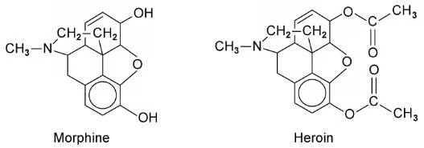{.question-figure fig-alt="Chemical structures of morphine and heroin"}

**(a)** What functional groups are found in morphine? `[2 marks]`

**(b)** Identify the functional group(s) present in heroin, but not in morphine. `[1 mark]`

**(c)** State the reagents and conditions needed to turn morphine into heroin. `[2 marks]`

**(d)** Predict and explain what you would see if morphine and heroin were separately reacted with warm acidified potassium dichromate solution. `[3 marks]`

Show mark scheme / model answer

- **(a)** Any two of: alcohol/hydroxyl, alkene/alkenyl, phenol, tertiary amine and ether. `[2]`
- **(b)** An **ester** group, specifically an ethanoate ester. `[1]`
- **(c)** React morphine with **ethanoic acid** or **ethanoic anhydride**, using a concentrated acid catalyst such as concentrated sulfuric acid, and heat. This is esterification/acylation of the alcohol groups. `[2]`
- **(d)** Morphine turns the acidified potassium dichromate solution from **orange to green** because it contains a secondary alcohol group that can be oxidised. Heroin gives **no change** and the solution remains orange because the corresponding alcohol groups have been converted into ester groups. `[3]`

:::

::: {.question-card}
### Example 2 · Farnesol and functional-group interconversion · 7.8 SQ Easy Q2

This question is about farnesol, a chemical found in essential oils and used in perfumes, especially in lilac perfumes. The structure of farnesol is shown in Fig. 2.1.

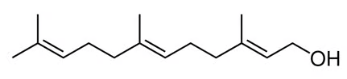{.question-figure fig-alt="Structure of farnesol showing an alkene and an alcohol group"}

**(a)** Identify two different functional groups found in farnesol and identify their locations in Fig. 2.1. `[2 marks]`

**(b)** Describe how you would expect farnesol to react if shaken with a little bromine water. `[1 mark]`

Fig. 2.2 shows a two-step synthesis of a compound made from farnesol.

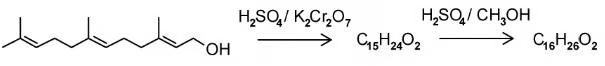{.question-figure fig-alt="Two-step synthesis of farnesol to an oxidised and esterified product"}

**(c)** Suggest a new functional group present in the product of the first step. `[1 mark]`

**(d)** Suggest a functional group present in the final product, but not in farnesol. `[1 mark]`

Show mark scheme / model answer

- **(a)** Farnesol contains an **alkene/alkenyl** group and a **primary alcohol/hydroxyl** group. The alkene groups are the carbon–carbon double bonds in the chain; the hydroxyl group is the terminal $\ce{-OH}$. `[2]`
- **(b)** The bromine water is **decolourised**, because bromine adds across the carbon–carbon double bond(s). `[1]`
- **(c)** A **carboxylic acid** group is formed when the primary alcohol is oxidised with acidified dichromate(VI). `[1]`
- **(d)** An **ester** group is present in the final product. The carboxylic acid formed in step 1 reacts with methanol in the presence of sulfuric acid. `[1]`

:::

::: {.question-card}
### Example 3 · Route to propan-1-ol · 7.8 SQ Easy Q3

The four-step synthesis to form propan-1-ol from a ketone is outlined in Fig. 3.1.

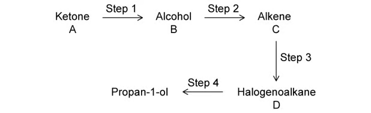{.question-figure fig-alt="Route involving a ketone, alcohol, alkene and halogenoalkane leading to propan-1-ol"}

**(a)(i)** Name a possible halogenoalkane, D, that undergoes nucleophilic substitution in step 4 to form propan-1-ol. `[1 mark]`

**(a)(ii)** Give the reagents and conditions for step 4. `[2 marks]`

**(b)** Deduce the identity of the alkene, C, in Fig. 3.1. `[1 mark]`

**(c)** Suggest why the electrophilic addition reaction in step 3 might not be favourable in an industrial multistep reaction. You should not include economic considerations. `[1 mark]`

Show mark scheme / model answer

- **(a)(i)** **1-chloropropane** or **1-bromopropane**. `[1]`
- **(a)(ii)** Heat the halogenoalkane under reflux with **aqueous sodium hydroxide**, $\ce{NaOH(aq)}$, or aqueous potassium hydroxide. Aqueous hydroxide favours nucleophilic substitution rather than elimination. `[2]`
- **(b)** The alkene is **propene**, $\ce{CH3CH=CH2}$. It must give a three-carbon chain and can be converted into a propyl halogenoalkane. `[1]`
- **(c)** Electrophilic addition to an unsymmetrical alkene can produce a **mixture of major and minor products**. The products would need to be separated, and the reaction can have poor atom economy because an unwanted product is formed. `[1]`

:::

::: {.question-card}
### Example 4 · Benzene derivatives and aromatic routes · 7.8 SQ Easy Q4

Benzene and its derivatives are used in various industrial applications, including the production of plastics, synthetic fibres, rubber, dyes and detergents. Fig. 4.1 shows three compounds, A, B and C, which are all derivatives of benzene.

{.question-figure fig-alt="Compound A, benzoic acid"}

{.question-figure fig-alt="Compound B, phenylamine"}

{.question-figure fig-alt="Compound C, 1,3-dimethylbenzene"}

**(a)** Give the systematic names of compounds A, B and C. `[3 marks]`

**(b)** State the positions that are activated for the following compounds in part (a):

- compound A;
- compound B. `[2 marks]`

Compounds A and B can be synthesised from benzene by the routes shown in Fig. 4.2.

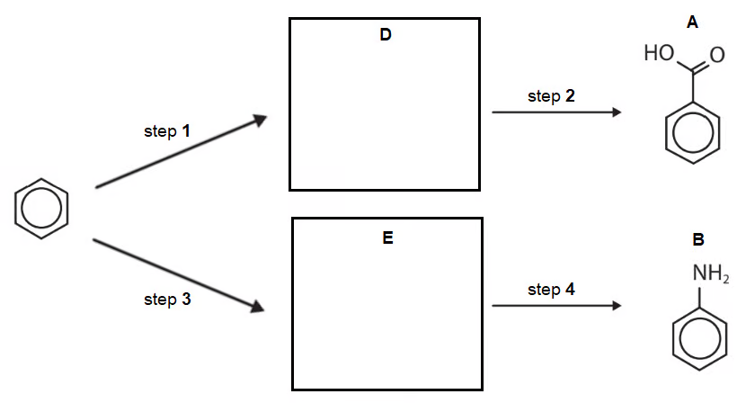{.question-figure fig-alt="Two synthetic routes from benzene to benzoic acid and phenylamine"}

**(c)(i)** Suggest the reagents for steps 1–4. `[4 marks]`

**(c)(ii)** Draw the structures of compounds D and E in the boxes. `[2 marks]`

The route shown in Fig. 4.3 is proposed for the synthesis of compound C.

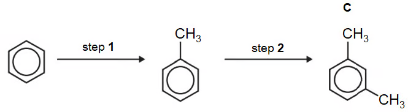{.question-figure fig-alt="Two Friedel-Crafts alkylation steps proposed to form 1,3-dimethylbenzene"}

**(d)(i)** Suggest one set of reagents and conditions that could be used for both steps. `[2 marks]`

**(d)(ii)** Suggest why step 2 is less likely to occur. `[1 mark]`

Show mark scheme / model answer

- **(a)** A is **benzoic acid**; B is **phenylamine** or aminobenzene; C is **1,3-dimethylbenzene**. `[3]`
- **(b)** The carboxylic acid group in A is electron-withdrawing and activates the **3- and 5-positions**. The amino group in B is electron-donating and activates the **2-, 4- and 6-positions**. `[2]`
- **(c)(i)**
  - Step 1: hot alkaline **potassium manganate(VII)**, $\ce{KMnO4}$, under reflux.
  - Step 2: dilute **hydrochloric acid**, to acidify the benzoate salt.
  - Step 3: concentrated **sulfuric acid and concentrated nitric acid**, for nitration.
  - Step 4: **tin and concentrated hydrochloric acid**, under reflux. `[4]`
- **(c)(ii)** D is **potassium benzoate**, $\ce{C6H5COOK}$, before acidification. E is **nitrobenzene**, $\ce{C6H5NO2}$, before reduction to phenylamine. `[2]`
- **(d)(i)** Use **chloromethane**, $\ce{CH3Cl}$, with an aluminium chloride catalyst, $\ce{AlCl3}$, for each Friedel–Crafts alkylation step. `[2]`
- **(d)(ii)** The methyl group already attached to the ring is electron-donating and activates the 2-, 4- and 6-positions, not the 3-position. Therefore formation of the 1,3-isomer in step 2 is less likely. `[1]`

:::

::: {.question-card}
### Example 5 · Synthesis of 1-(3-aminophenyl)ethanol · 7.8 SQ Easy Q5

1-(3-aminophenyl)ethanol can be synthesised from benzene by the route shown in Fig. 5.1.

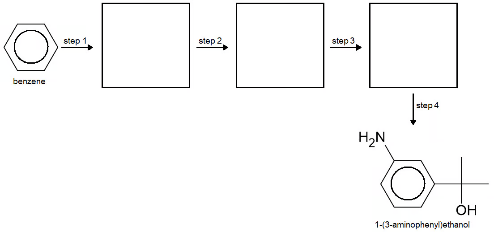{.question-figure fig-alt="Multi-step synthesis from benzene to 1-(3-aminophenyl)ethanol"}

Step 1 involves a reaction with concentrated nitric acid and concentrated sulfuric acid.

**(a)(i)** Name compound A and state the reaction conditions for step 1. `[2 marks]`

**(a)(ii)** Name the mechanism for the conversion of benzene into compound A and identify the specific species that reacts with benzene. `[2 marks]`

Step 2 is the reaction of compound A with ethanoyl chloride, $\ce{CH3COCl}$, in the presence of a suitable catalyst.

**(b)** Identify the catalyst required for this reaction and write an equation to show how the catalyst forms the electrophile for this reaction. `[1 mark]`

Step 3 is the reaction of compound B with tin and hydrochloric acid, converting a nitro group into an amino group.

**(c)** State two changes that occur to compound B during this reaction to show that reduction has taken place. `[1 mark]`

Step 4 is the reduction of compound C to 1-(3-aminophenyl)ethanol using $\ce{NaBH4}$. The structure of 1-(3-aminophenyl)ethanol is repeated in Fig. 5.2.

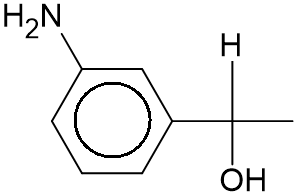{.question-figure fig-alt="Structure of 1-(3-aminophenyl)ethanol"}

**(d)(i)** Draw a circle around the aliphatic functional group that is formed after the reaction of compound C with $\ce{NaBH4}$. `[1 mark]`

**(d)(ii)** Draw the structure of compound C. `[1 mark]`

Show mark scheme / model answer

- **(a)(i)** A is **nitrobenzene**. Heat/reflux the benzene with concentrated nitric acid and concentrated sulfuric acid, typically at about $25$–$60\,^{\circ}\mathrm{C}$. `[2]`
- **(a)(ii)** The mechanism is **electrophilic substitution**. The attacking species is the **nitronium ion**, $\ce{NO2+}$. `[2]`
- **(b)** The catalyst is **aluminium chloride**, $\ce{AlCl3}$. It generates the acylium ion by:

  $$\ce{CH3COCl + AlCl3 -> CH3CO+ + AlCl4-}$$

  `[1]`
- **(c)** Oxygen is lost and hydrogen is gained when $\ce{-NO2}$ is converted into $\ce{-NH2}$. These are both evidence of reduction. `[1]`
- **(d)**
  - **(i)** The newly formed aliphatic functional group is the **secondary alcohol**, $\ce{-CH(OH)CH3}$.
  - **(ii)** C is the corresponding ketone, **1-(3-nitrophenyl)ethanone**, with condensed structure $\ce{3-NO2-C6H4-COCH3}$. $\ce{NaBH4}$ reduces the ketone group to the secondary alcohol. `[2]`

:::

### 7.8 Organic Synthesis (A Level Only) - Medium

::: {.question-card}
### Example 6 · Ibuprofen and paracetamol · 7.8 SQ Medium Q1

Ibuprofen and paracetamol are pain-relief drugs. Both contain the aryl (benzene) functional group.

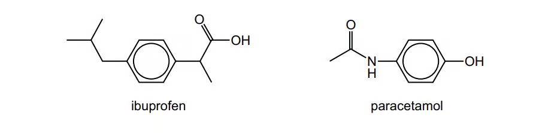{.question-figure fig-alt="Displayed structures of ibuprofen and paracetamol"}

**(a)** Name the other functional groups present in each molecule. `[2 marks]`

Ibuprofen contains a chiral centre and has two enantiomers.

**(b)(i)** State one similarity and one difference in the physical or chemical properties between the two enantiomers. `[1 mark]`

**(b)(ii)** Explain what is meant by racemic mixture. `[1 mark]`

Paracetamol reacts separately with the two reagents shown in the table. Complete the table by drawing the structures of the organic products formed and stating the types of reaction.

| Reagent | Organic product structure | Type of reaction |
|---|---|---|
| $\ce{LiAlH4}$ |  |  |
| an excess of $\ce{Br2(aq)}$ |  |  |

**(c)** `[3 marks]`

One of the steps in the manufacture of ibuprofen is shown in Fig. 8.2.

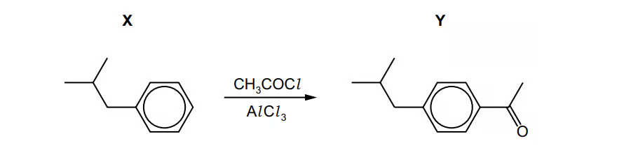{.question-figure fig-alt="Friedel-Crafts acylation of an aromatic compound"}

**(d)(i)** Write an equation to show how $\ce{AlCl3}$ generates the electrophile for the conversion of X into Y. `[1 mark]`

**(d)(ii)** Draw the mechanism for the conversion of X into Y. Include all necessary curly arrows and charges. `[3 marks]`

**(d)(iii)** Write an equation to show how the $\ce{AlCl3}$ is regenerated. `[1 mark]`

Show mark scheme / model answer

- **(a)** Ibuprofen contains a **carboxylic acid**. Paracetamol contains a **phenol** and a **secondary amide**. `[2]`
- **(b)(i)** Similarity: enantiomers have identical physical and chemical properties in an achiral environment. Difference: they rotate plane-polarised light in opposite directions and can have different biological activity. `[1]`
- **(b)(ii)** A racemic mixture contains **equal amounts of the two enantiomers**. `[1]`
- **(c)**
  - With excess $\ce{LiAlH4}$, the secondary amide is reduced to a secondary amine: the paracetamol acetamide group becomes $\ce{-NHCH3}$; this is **reduction**.
  - With excess aqueous bromine, the phenol ring undergoes substitution at the positions activated by $\ce{-OH}$. The available 2- and 4-positions are brominated, giving the corresponding 2,4-dibrominated product; this is **electrophilic substitution**. `[3]`
- **(d)(i)**

  $$\ce{CH3COCl + AlCl3 -> CH3CO+ + AlCl4-}$$

- **(d)(ii)** The benzene $\pi$ system attacks the positively charged carbon of the acylium ion. A sigma complex forms with a positive charge delocalised around the ring. A curly arrow from the C–H bond returns the electrons to the ring, restoring aromaticity and releasing $\ce{H+}$. `[3]`
- **(d)(iii)**

  $$\ce{H+ + AlCl4- -> HCl + AlCl3}$$

:::

::: {.question-card}
### Example 7 · Cuminyl alcohol synthesis · 7.8 SQ Medium Q2

Cuminyl alcohol can be synthesised from benzene by the route shown in Fig. 2.1.

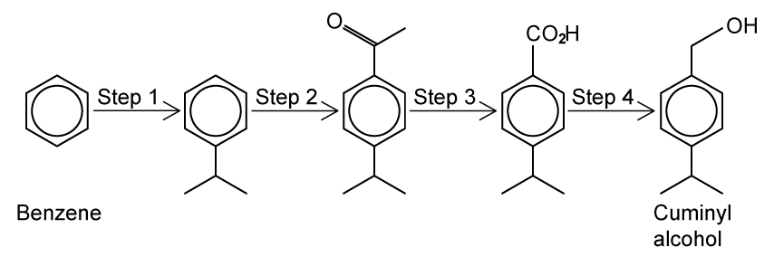{.question-figure fig-alt="Four-step synthesis route from benzene to cuminyl alcohol"}

**(a)** Suggest reagents and conditions for steps 1–4. `[4 marks]`

**(b)** Name the mechanism of step 2 and state the type of reaction in step 4. `[2 marks]`

**(c)** Draw the reaction mechanism for step 2. `[4 marks]`

**(d)** Deduce the number of peaks that would be present in the $^{13}\ce{C}$ NMR spectrum of cuminyl alcohol. `[1 mark]`

Show mark scheme / model answer

- **(a)** One suitable sequence is:
  - Step 1: propan-2-yl chloride with $\ce{AlCl3}$, heat; this installs the isopropyl group by Friedel–Crafts alkylation.
  - Step 2: ethanoyl chloride, $\ce{CH3COCl}$, with $\ce{AlCl3}$, heat; this is Friedel–Crafts acylation.
  - Step 3: alkaline iodine, $\ce{I2/NaOH}$, followed by acidification; this converts the methyl ketone side chain into a carboxylic acid.
  - Step 4: $\ce{LiAlH4}$ in dry ether, followed by hydrolysis; this reduces the carboxylic acid to a primary alcohol. `[4]`
- **(b)** Step 2 is **electrophilic aromatic substitution**. Step 4 is **reduction**. `[2]`
- **(c)** First generate the acylium ion:

  $$\ce{CH3COCl + AlCl3 -> CH3CO+ + AlCl4-}$$

  The benzene ring attacks the positively charged carbon of $\ce{CH3CO+}$, forming a sigma complex. The C–H bond then supplies electrons back to the ring, restoring aromaticity and producing the acylated arene. The catalyst is regenerated when $\ce{AlCl4-}$ accepts the proton. `[4]`
- **(d)** The spectrum has **seven peaks**, because symmetry makes several carbon atoms chemically equivalent. `[1]`

:::

::: {.question-card}
### Example 8 · Ethane to ethanal and a branched ester · 7.8 SQ Medium Q3

**(a)** Outline how ethanal can be synthesised from ethane in three steps.

$$\ce{ethane -> chloroethane -> ethanol -> ethanal}$$

State the reaction conditions and reagents and name the type of reaction taking place.

**(i)** Step 1 `[3 marks]`

**(ii)** Step 2 `[3 marks]`

**(iii)** Step 3 `[3 marks]`

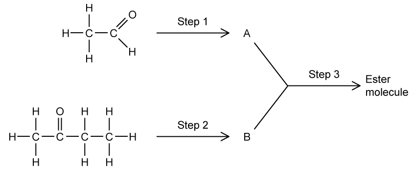{.question-figure fig-alt="Ethane to chloroethane to ethanol and a branched ester route"}

**(b)** The reaction pathway in Fig. 3.1 is used to produce compounds A and B, which when reacted together form a branched ester molecule, compound C. Suggest suitable reagents and conditions for the synthesis of compound A via step 1 and give the name for this type of reaction. `[3 marks]`

**(c)** The ketone in part (a) must be converted to compound B to produce the ester.

**(i)** Name the molecule produced from step 2. `[1 mark]`

**(ii)** Name the type of reaction involved in step 2 and suggest suitable reagents and conditions. `[2 marks]`

**(d)** Draw the skeletal formula of the ester formed from the reaction scheme. `[1 mark]`

Show mark scheme / model answer

- **(a)(i)** Use chlorine, $\ce{Cl2}$, in UV light or at high temperature. This is free-radical substitution/halogenation. `[3]`
- **(a)(ii)** Heat chloroethane under reflux with aqueous $\ce{NaOH}$ or $\ce{KOH}$. This is nucleophilic substitution/hydrolysis. `[3]`
- **(a)(iii)** Heat ethanol with acidified potassium dichromate(VI), then distil the ethanal as it forms. This is oxidation. `[3]`
- **(b)** Oxidise the aldehyde starting material using acidified potassium dichromate(VI) or acidified potassium manganate(VII), and heat/reflux. This is **oxidation** to a carboxylic acid. `[3]`
- **(c)(i)** The product is **butan-2-ol**. `[1]`
- **(c)(ii)** This is **reduction** of the ketone, using $\ce{LiAlH4}$ in dry ether or $\ce{NaBH4}$, followed by hydrolysis if needed. `[2]`
- **(d)** The ester is formed by esterification of the carboxylic acid A with the secondary alcohol B. The displayed structure must contain the acid-derived $\ce{-C(=O)O-}$ group and the branched butan-2-yl group from B. `[1]`

:::

::: {.question-card}
### Example 9 · Noradrenaline and nitrile synthesis · 7.8 SQ Medium Q4

Noradrenaline shown in Fig. 4.1 is a hormone and neurotransmitter, which is released during stress to stimulate the heart and increase blood pressure.

{.question-figure fig-alt="Structure of noradrenaline"}

**(a)** State the names of three functional groups in the noradrenaline molecule. `[3 marks]`

Consider the following two-step synthesis of noradrenaline from dihydroxybenzaldehyde in Fig. 4.2.

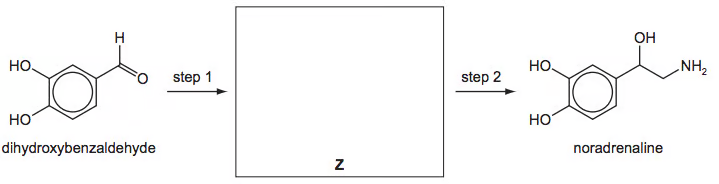{.question-figure fig-alt="Two-step synthesis from dihydroxybenzaldehyde to noradrenaline with intermediate Z"}

**(b)** Draw the structure of the intermediate Z in the box. Suggest reagents for steps 1 and 2. `[3 marks]`

Dihydroxybenzaldehyde reacts with $\ce{Br2(aq)}$.

**(c)** Describe what you would see during this reaction and draw the structure of the product. `[2 marks]`

Show mark scheme / model answer

- **(a)** Any three of: phenol, primary alcohol, amine and arene/benzene. `[3]`
- **(b)** Step 1 adds one carbon using $\ce{HCN}$ and $\ce{NaCN}$ or another basic cyanide system, forming the hydroxynitrile from the aldehyde. Step 2 reduces the nitrile using hydrogen and nickel, $\ce{LiAlH4}$ in dry ether, or sodium in ethanol. Z is the hydroxynitrile, containing the original aromatic ring, $\ce{-CH(OH)CN}$ and both phenolic $\ce{-OH}$ groups. `[3]`
- **(c)** Bromine water is decolourised, and a white precipitate forms. Electrophilic substitution occurs on the activated phenol ring; two or three bromine atoms may be shown at the available activated positions. `[2]`

:::

::: {.question-card}
### Example 10 · Raspberry compound and an azo dye · 7.8 SQ Medium Q5

Compound G is a naturally occurring aromatic compound that is present in raspberries.

{.question-figure fig-alt="Compound G containing a phenol and a ketone"}

**(a)** Identify the functional groups present in compound G. `[2 marks]`

**(b)** Complete Table 5.1 with information about the reactions of the three stated reagents with compound G.

| Reagent | Observation | Structure of organic product | Type of reaction |
|---|---|---|---|
| $\ce{Na(s)}$ |  |  |  |
| $\ce{Br2(aq)}$ |  |  |  |
| $\ce{I2/NaOH(aq)}$ |  |  |  |

`[9 marks]`

The dye H can be made from compound G by the route shown in Fig. 5.1.

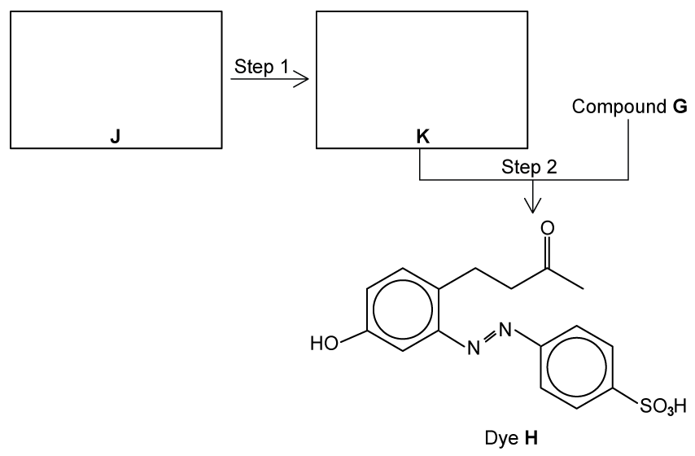{.question-figure fig-alt="Formation of an azo dye from compound G"}

**(c)(i)** Draw the structures of the amine J and the intermediate K in the boxes. `[2 marks]`

**(c)(ii)** Suggest reagents and conditions for steps 1 and 2. `[3 marks]`

**(d)** Explain why dye H is very stable. `[2 marks]`

Show mark scheme / model answer

- **(a)** Compound G contains a **phenol** and a **ketone**. `[2]`
- **(b)**
  - $\ce{Na(s)}$: effervescence as hydrogen is released; the phenol is converted into its sodium phenoxide salt; **redox**.
  - $\ce{Br2(aq)}$: bromine water is decolourised and a white precipitate forms; bromination at the available 2- and 6-positions of the phenol ring; **electrophilic substitution**.
  - $\ce{I2/NaOH(aq)}$: a yellow precipitate of iodoform, $\ce{CHI3}$, forms; the methyl ketone side chain undergoes the **iodoform oxidation/hydrolysis** reaction. `[9]`
- **(c)(i)** J is an aromatic amine that can be diazotised, and K is the corresponding **benzenediazonium salt**, $\ce{Ar-N2+Cl-}$. `[2]`
- **(c)(ii)** Step 1: react the amine with sodium nitrite and hydrochloric acid, generating nitrous acid in situ, at a temperature below $10\,^{\circ}\mathrm{C}$. Step 2: add K to compound G in aqueous sodium hydroxide; this couples the diazonium ion to the activated phenol ring. `[3]`
- **(d)** The two benzene rings and the $\ce{-N=N-}$ bridge form an extended delocalised $\pi$-electron system. Delocalisation across the azo linkage stabilises the dye. `[2]`

:::

### 7.8 Organic Synthesis (A Level Only) - Hard

::: {.question-card}
### Example 11 · Benzocaine synthesis and route choice · 7.8 SQ Hard Q1

Benzocaine is an ester-based compound that is used medicinally as a local anaesthetic in pain relievers and cough drops. One of the first industrial processes to manufacture benzocaine was the five-step reaction shown in Fig. 1.1.

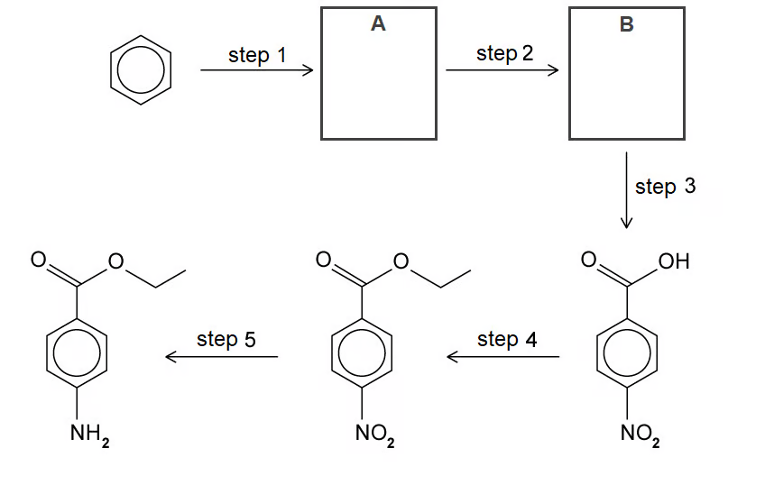{.question-figure fig-alt="Five-step synthesis of benzocaine"}

**(a)** Give the systematic name of benzocaine. `[1 mark]`

Step 1 involves the reaction of benzene with bromomethane.

**(b)(i)** State a suitable catalyst for step 1. `[1 mark]`

**(b)(ii)** Draw a mechanism for step 1. Include all necessary curly arrows, charges and the structure of A. `[3 marks]`

Concentrated sulfuric acid and concentrated nitric acid are used to form the ion required for step 2. The following equilibrium is the first step in the formation of the ion:

$$\ce{H2SO4 + HNO3 <=> HSO4- + H2NO3+}$$

**(c)(i)** State the roles of each acid in this reaction. `[2 marks]`

**(c)(ii)** Use your answer to part (i) to suggest the relative strengths of the acids. `[1 mark]`

**(c)(iii)** Different isomers with the molecular formula $\ce{C7H7NO2}$ can be formed during step 2. Draw the structure of isomer B and explain your answer. `[2 marks]`

**(d)** Suggest reagents and conditions for steps 3–5 of the synthesis. `[4 marks]`

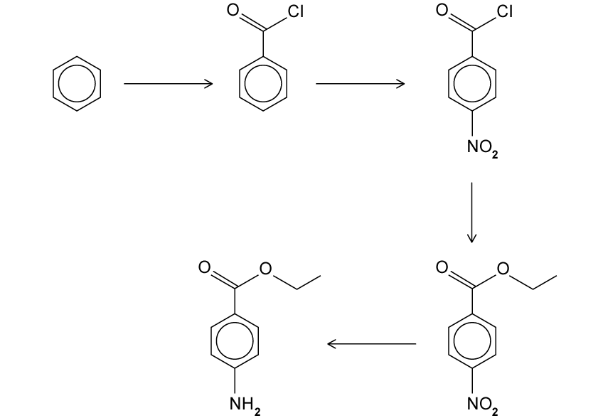{.question-figure fig-alt="Alternative route for the production of benzocaine"}

**(e)(i)** Suggest why this reaction scheme is an improvement. `[1 mark]`

**(e)(ii)** Suggest why this reaction scheme may not work. `[1 mark]`

Show mark scheme / model answer

- **(a)** **Ethyl 4-aminobenzoate**. `[1]`
- **(b)(i)** **Aluminium tribromide**, $\ce{AlBr3}$, or iron(III) bromide, $\ce{FeBr3}$. `[1]`
- **(b)(ii)** The catalyst forms the methyl electrophile:

  $$\ce{CH3Br + AlBr3 -> CH3+ + AlBr4-}$$

  The benzene $\pi$ system attacks $\ce{CH3+}$, forming a positively charged sigma complex. A curly arrow from the C–H bond restores the aromatic ring and gives methylbenzene, compound A. `[3]`
- **(c)(i)** Sulfuric acid donates a proton and is the Brønsted–Lowry acid. Nitric acid accepts a proton and is the Brønsted–Lowry base. `[2]`
- **(c)(ii)** Sulfuric acid is the stronger acid because it donates the proton to nitric acid. `[1]`
- **(c)(iii)** Methylbenzene is electron-donating and directs electrophilic substitution to the 2-, 4- and 6-positions. Isomer B is therefore **1-methyl-4-nitrobenzene** (4-nitrotoluene), with the nitro group para to the methyl group. `[2]`
- **(d)**
  - Step 3: hot alkaline $\ce{KMnO4}$ under reflux, then acidification, to oxidise the methyl side chain to a carboxylic acid.
  - Step 4: ethanol, warm, with concentrated sulfuric acid catalyst, to form the ethyl ester.
  - Step 5: tin and concentrated hydrochloric acid under reflux, or iron and concentrated hydrochloric acid under reflux, to reduce the nitro group to an amino group. `[4]`
- **(e)(i)** The alternative route has **fewer steps**, improving efficiency and usually atom economy. `[1]`
- **(e)(ii)** Nitration of benzoyl chloride is directed mainly to the **meta position** by the electron-withdrawing acyl chloride group, so the required para-nitro isomer is not formed preferentially. `[1]`

:::

::: {.question-card}
### Example 12 · Deduction of compounds A–E · 7.8 SQ Hard Q2

The carbon-13 ($^{13}\ce{C}$) NMR spectrum of compound A, $\ce{C3H8O}$, contains three peaks. Compound A reacts with acidified potassium dichromate to give a mixture of compounds B and C. Compound C reacts with thionyl chloride, $\ce{SOCl2}$, to form compound D. Compound D reacts with phenol to form compound E, $\ce{C9H10O2}$.

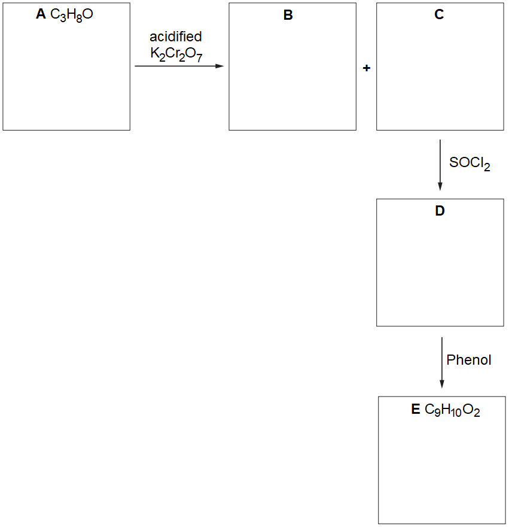{.question-figure fig-alt="Reaction scheme for deducing compounds A, B, C, D and E"}

**(a)** Draw the structures of compounds A, B, C, D and E in the boxes. `[5 marks]`

**(b)** A mixture of compound B and compound C is formed when compound A reacts with acidified potassium dichromate.

**(i)** Explain how the mixture can be separated into compounds B and C. `[2 marks]`

**(ii)** Suggest an improvement to the reaction with acidified potassium dichromate to ensure the production of compound C only. `[1 mark]`

**(c)** When heated in the presence of sodium hydroxide, compounds C and D can both react with phenol to form compound E.

**(i)** Draw a mechanism for the formation of compound E from compound D and an appropriate nucleophile. Include all necessary curly arrows and charges. `[3 marks]`

**(ii)** Under these conditions, the reaction of compound D with phenol is faster than the reaction of compound C. Suggest why. `[1 mark]`

Show mark scheme / model answer

- **(a)** A is **propan-1-ol**, $\ce{CH3CH2CH2OH}$. Controlled oxidation gives B, **propanal**, $\ce{CH3CH2CHO}$, while complete oxidation gives C, **propanoic acid**, $\ce{CH3CH2COOH}$. Reaction with $\ce{SOCl2}$ gives D, **propanoyl chloride**, $\ce{CH3CH2COCl}$. Reaction of D with phenol gives E, **phenyl propanoate**, $\ce{CH3CH2COOC6H5}$. `[5]`
- **(b)(i)** Separate the products by **distillation**. Propanoic acid has a higher boiling point than propanal because it forms strong hydrogen bonds; propanal has only dipole–dipole attractions. `[2]`
- **(b)(ii)** Reflux the alcohol with acidified potassium dichromate so that the primary alcohol is oxidised completely to the carboxylic acid rather than being distilled off as the aldehyde. `[1]`
- **(c)(i)** Sodium hydroxide deprotonates phenol to form phenoxide, $\ce{C6H5O-}$. The phenoxide oxygen attacks the partially positive carbonyl carbon of propanoyl chloride, the C=O electrons move onto oxygen, and a tetrahedral intermediate forms. The intermediate reforms the carbonyl and expels $\ce{Cl-}$, producing phenyl propanoate. `[3]`
- **(c)(ii)** The C–Cl bond in the acyl chloride is more strongly electron-withdrawing than the C–OH bond in the acid. The carbonyl carbon of D therefore has a larger partial positive charge and is more susceptible to attack by phenoxide. `[1]`

:::

::: {.question-card}
### Example 13 · 2-bromopropane to propanone · 7.8 SQ Hard Q3

Propanone can be synthesised from 2-bromopropane according to the reaction scheme shown in Fig. 3.1.

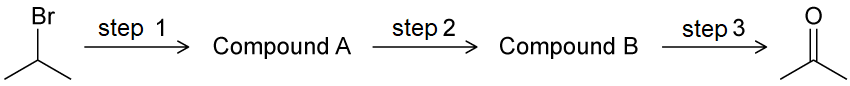{.question-figure fig-alt="Three-step synthesis from 2-bromopropane to propanone"}

Step 1 is not completed in acidic conditions.

**(a)** Suggest reagents and conditions for each of steps 1 to 3. `[5 marks]`

**(b)** Suggest one reaction, including reagents and conditions, to replace steps 1 and 2. `[2 marks]`

**(c)** Using structural formulae, write an equation for the reaction of compound B with an oxidising agent, $[\ce{O}]$, to form propanone. `[1 mark]`

Show mark scheme / model answer

- **(a)**
  - Step 1: heat 2-bromopropane under reflux with **ethanolic sodium hydroxide** or ethanolic potassium hydroxide. This is elimination to form propene.
  - Step 2: react propene with steam at about $300\,^{\circ}\mathrm{C}$ in the presence of concentrated sulfuric or phosphoric acid catalyst. This is hydration to form propan-2-ol.
  - Step 3: heat propan-2-ol with acidified potassium dichromate(VI), $\ce{K2Cr2O7}$, to oxidise it to propanone. `[5]`
- **(b)** Use aqueous sodium hydroxide, heated under reflux, to replace bromine directly by hydroxide. This is nucleophilic substitution and gives propan-2-ol in one step. `[2]`
- **(c)**

  $$\ce{CH3CH(OH)CH3 + [O] -> CH3COCH3 + H2O}$$

  `[1]`

:::

::: {.question-card}
### Example 14 · Ethene to 1-aminopropane · 7.8 SQ Hard Q4

Ethene is used in the radical-free synthesis of 1-aminopropane as shown:

$$\ce{ethene ->[step 1] compound\ A ->[step 2] compound\ B ->[step 3] propylamine}$$

**(a)** Identify which step of the reaction scheme could use hydrogen cyanide. Explain your answer. `[2 marks]`

**(b)** Draw the skeletal structure of compound A and state the reagents required for its formation. `[2 marks]`

**(c)** The final step of the reaction scheme forms 1-aminopropane from compound B. Name compound B and identify the type of reaction that compound B undergoes to form propylamine. Explain your answer. `[2 marks]`

Show mark scheme / model answer

- **(a)** Hydrogen cyanide is used in **step 2**. It cannot add directly to ethene because cyanide is a nucleophile and does not attack the electron-rich C=C bond. It also cannot be step 3 because reaction with cyanide forms a nitrile rather than an amine. `[2]`
- **(b)** Compound A is a one-carbon halogenoalkane, for example **chloroethane**, $\ce{CH3CH2Cl}$. Form it by reacting ethene with hydrogen chloride, $\ce{HCl}$, by electrophilic addition. A corresponding bromoalkane formed with $\ce{HBr}$ is also acceptable. `[2]`
- **(c)** B is **propanenitrile**, $\ce{CH3CH2CN}$. It undergoes **reduction** to form 1-aminopropane; the nitrile group gains hydrogen, for example with $\ce{LiAlH4}$ in dry ether followed by hydrolysis. `[2]`

:::
