# 36 Organic synthesis

本章对应 CIE 9701 2025–2027 syllabus 的 **36.1 Organic synthesis**。题目部分对应专题题包 **7.8 Organic Synthesis (A Level Only)**；完整 Easy、Medium、Hard Structured Questions 放在本页底部的 Structured Questions 页面。

## Learning objectives

学完本节后，你应该能够：

- identify functional groups in molecules containing more than one functional group;
- predict the properties and reactions of molecules containing several functional groups;
- devise a multi-step synthetic route to a target molecule;
- analyse a synthetic route by identifying the reaction type, reagents and conditions, and possible by-products;
- choose a route with appropriate selectivity, atom economy and separation requirements.

## 36.1 Organic synthesis

::: {.study-card}
### Identifying multiple functional groups

When a molecule contains several functional groups, identify each group independently before predicting its reactions. The same molecule may contain an **arene**, an **alkene**, an **alcohol**, a **phenol**, an **amine**, a **carbonyl group**, a **carboxylic acid**, an **ester**, an **amide** or a **nitrile**.

The functional group controls the characteristic reaction, while the other groups may alter the rate or position of reaction. For example, a phenolic $-$OH group activates the 2-, 4- and 6-positions of an aromatic ring, whereas a $-$COOH or $-$COCl group is electron-withdrawing and directs electrophilic substitution mainly to the 3- and 5-positions.

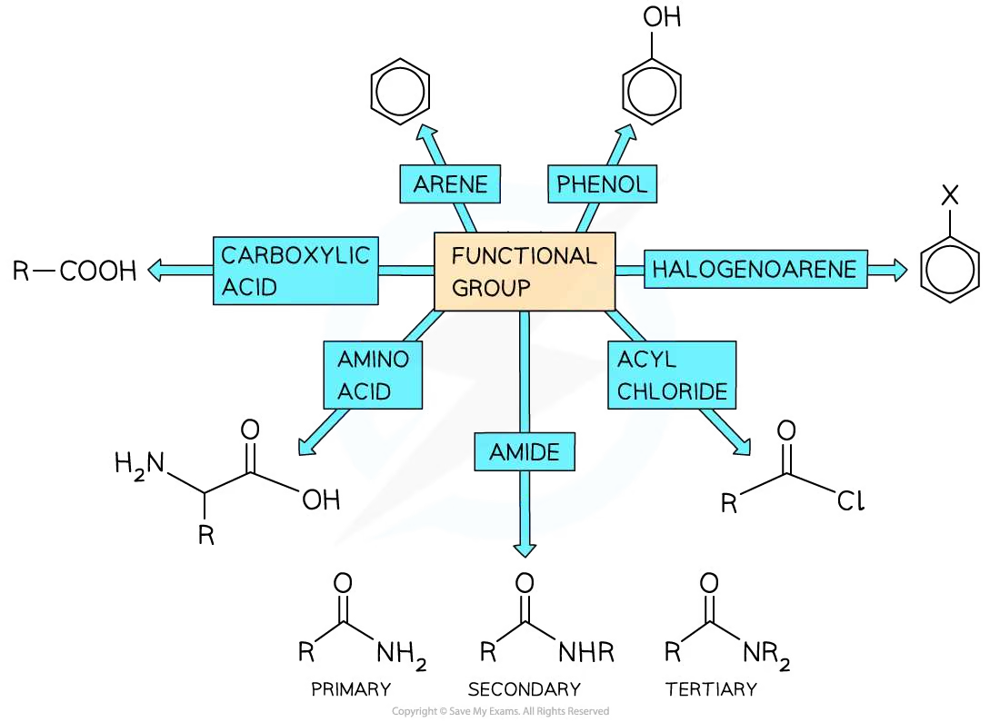{.concept-figure fig-alt="Examples of functional groups in organic molecules"}
:::

::: {.study-card}
### Benzoic acid and aromatic synthesis

Alkyl side chains attached to an aromatic ring can be oxidised completely to a carboxylic acid using hot alkaline potassium manganate(VII), followed by acidification. The carbon attached directly to the ring must have at least one hydrogen atom for this oxidation to occur.

$$\ce{Ar-CH3 ->[KMnO4(aq), OH-, heat][H+] Ar-COOH}$$

Benzoic acid is therefore a useful intermediate in a synthesis. Its carboxylic acid group is electron-withdrawing and directs later electrophilic substitution to the meta position.

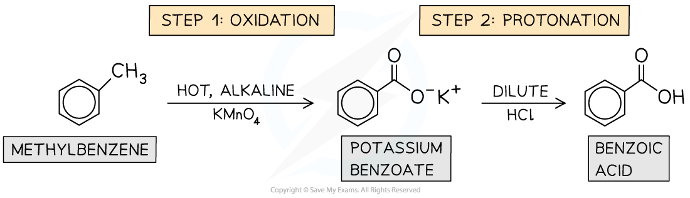{.concept-figure fig-alt="Preparation and reactions of benzoic acid"}
:::

::: {.study-card}
### Acyl chlorides and amides

Acyl chlorides are very reactive derivatives of carboxylic acids. They undergo nucleophilic addition–elimination with water, alcohols, ammonia and amines.

$$\ce{RCOCl + H2O -> RCOOH + HCl}$$

$$\ce{RCOCl + R'OH -> RCOOR' + HCl}$$

$$\ce{RCOCl + 2R'NH2 -> RCONHR' + R'NH3Cl}$$

An acyl chloride can be made from a carboxylic acid using thionyl chloride, $\ce{SOCl2}$, or phosphorus pentachloride. The reaction is useful in synthesis because it is rapid and usually gives a higher yield than direct esterification.

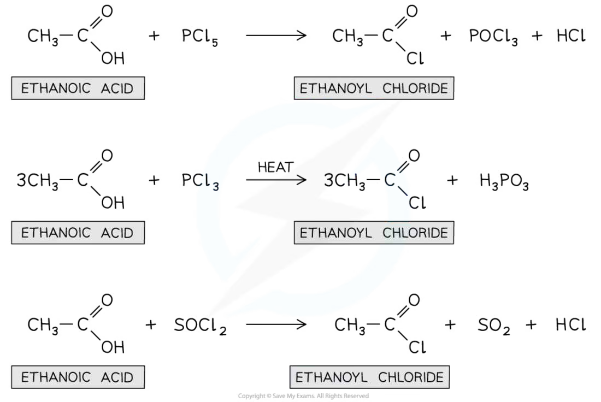{.concept-figure fig-alt="Nucleophilic addition-elimination reactions of acyl chlorides"}

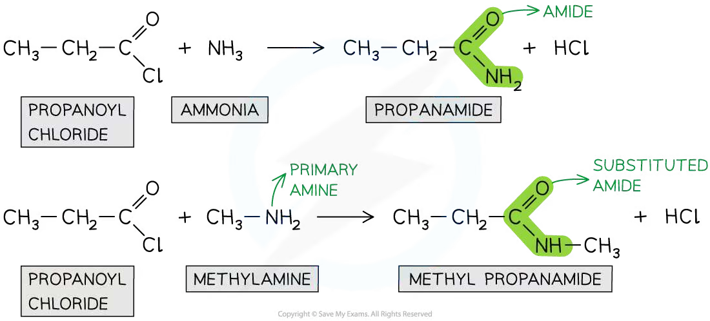{.concept-figure fig-alt="Formation and reactions of amides"}
:::

::: {.study-card}
### Electrophilic substitution of arenes

In electrophilic aromatic substitution, an electrophile attacks the delocalised $\pi$ system of an aromatic ring. A temporary positively charged intermediate forms, then loss of $\ce{H+}$ restores the delocalised ring.

For a Friedel–Crafts acylation:

$$\ce{CH3COCl + AlCl3 -> CH3CO+ + AlCl4-}$$

The acylium ion, $\ce{CH3CO+}$, is the electrophile. The catalyst is regenerated when the intermediate loses a proton.

Electron-donating groups such as $\ce{-CH3}$ and $\ce{-OH}$ activate the 2-, 4- and 6-positions. Electron-withdrawing groups such as $\ce{-COOH}$, $\ce{-COCl}$ and $\ce{-NO2}$ deactivate the ring and direct substitution mainly to the 3- and 5-positions.

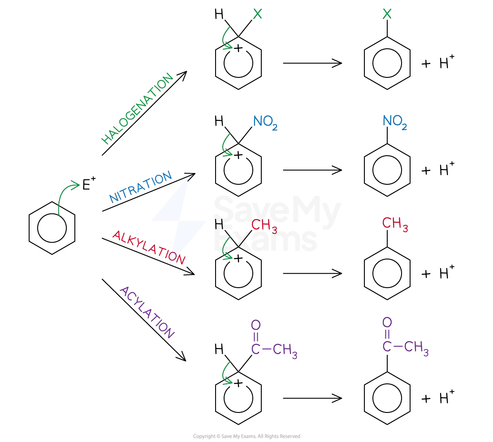{.concept-figure fig-alt="Electrophilic substitution and electrophile formation in arenes"}

{.concept-figure fig-alt="Hydrogenation of benzene to cyclohexane"}
:::

::: {.worked-example}
Worked example · Designing a multi-step synthesis

### Ethene to 1-aminopropane

**Suggest how the following synthesis could be carried out:**

**Ethene to 1-aminopropane**

1. Add HCl to ethene at room temperature to form chloroethane by electrophilic addition:

   $$\ce{CH2=CH2 + HCl -> CH3CH2Cl}$$

2. Heat chloroethane under reflux with ethanolic KCN or NaCN. Nucleophilic substitution adds one carbon atom and forms propanenitrile:

   $$\ce{CH3CH2Cl + CN- -> CH3CH2CN + Cl-}$$

3. Reduce propanenitrile using $\ce{LiAlH4}$ in dry ether, followed by hydrolysis, to form 1-aminopropane:

   $$\ce{CH3CH2CN + 2H2 ->[LiAlH4] CH3CH2CH2NH2}$$

The route uses three different transformations: electrophilic addition, nucleophilic substitution and reduction of a nitrile.

:::

::: {.study-card}
### Phenol: esterification, acid–base reactions and substitution

Phenol is less reactive than an aliphatic alcohol in some reactions, but its aromatic ring is strongly activated by the $\ce{-OH}$ group. Phenol reacts with acyl chlorides to form phenyl esters:

$$\ce{C6H5OH + CH3COCl -> C6H5OCOCH3 + HCl}$$

It is a weak acid. It reacts with sodium hydroxide to form sodium phenoxide, but it is not sufficiently acidic to react appreciably with aqueous sodium carbonate:

$$\ce{C6H5OH + NaOH -> C6H5ONa + H2O}$$

The activated ring undergoes bromination readily, often producing a 2,4,6-tribromophenol precipitate, and nitration can occur under milder conditions than for benzene.

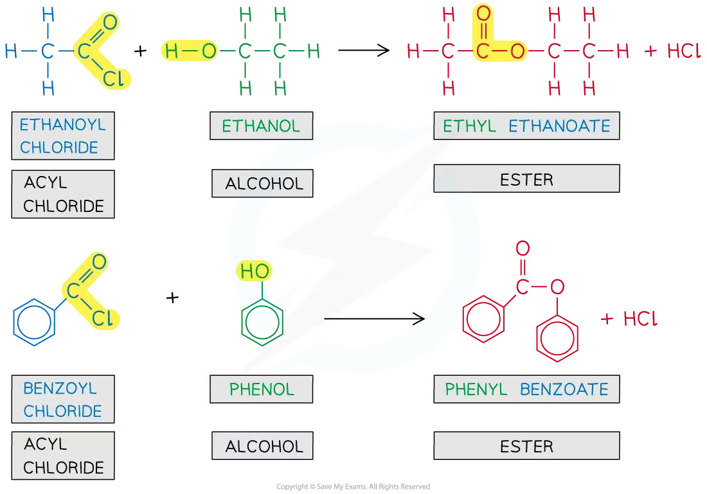{.concept-figure fig-alt="Formation of a phenyl ester from phenol and an acyl chloride"}

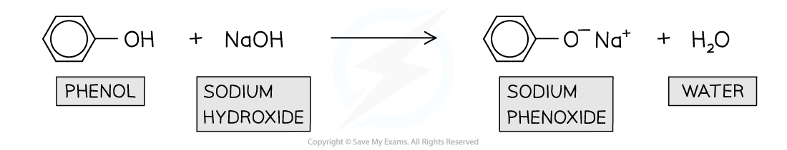{.concept-figure fig-alt="Acid-base reactions of phenol"}

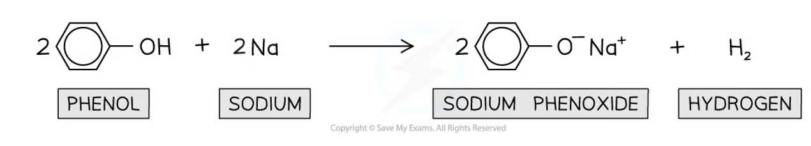{.concept-figure fig-alt="Electrophilic substitution reactions of phenol"}
:::

::: {.study-card}
### Building an aliphatic synthetic route

Common transformations that extend or modify an aliphatic carbon chain include:

- alkene + $\ce{HCl}$ or $\ce{HBr}$: electrophilic addition to form a halogenoalkane;
- halogenoalkane + aqueous $\ce{OH-}$: nucleophilic substitution to form an alcohol;
- halogenoalkane + ethanolic $\ce{CN-}$: nucleophilic substitution that increases the carbon chain by one carbon;
- primary alcohol + acidified dichromate(VI), distil: oxidation to an aldehyde;
- aldehyde + acidified dichromate(VI), reflux: oxidation to a carboxylic acid;
- ketone or carboxylic acid + $\ce{LiAlH4}$: reduction;
- nitrile + $\ce{LiAlH4}$: reduction to a primary amine.

The reagent, solvent, temperature and method of isolation must all be specified. For example, distillation removes an aldehyde as it forms, whereas reflux allows further oxidation to a carboxylic acid.

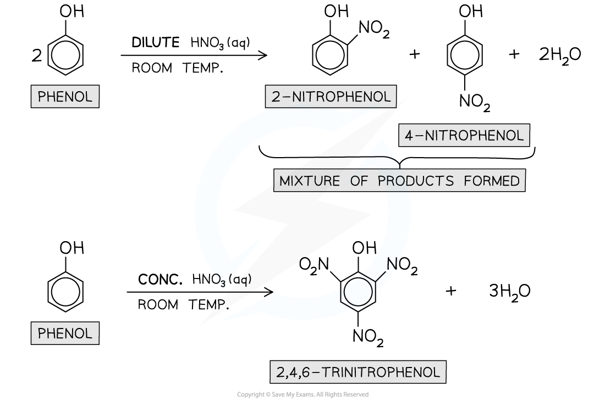{.concept-figure fig-alt="Aliphatic reaction pathways used in organic synthesis"}
:::

::: {.study-card}
### Building an aromatic synthetic route

An aromatic synthesis should be planned backwards from the target. Identify the last functional-group change first, then select an earlier intermediate that can be converted selectively.

Useful sequences include:

$$\ce{benzene ->[conc. HNO3/H2SO4] nitrobenzene ->[Sn/HCl, heat] phenylamine}$$

$$\ce{benzene ->[RCl/AlCl3] alkylbenzene ->[KMnO4, reflux][H+] benzoic\ acid}$$

$$\ce{benzene ->[RCOCl/AlCl3] aryl\ ketone ->[NaBH4] secondary\ alcohol}$$

The order matters. A methyl group activates the 2-, 4- and 6-positions, while a carbonyl-containing group such as $\ce{-COCl}$ directs substitution meta. A shorter route is not automatically better if it gives the wrong isomer or a mixture that is difficult to separate.

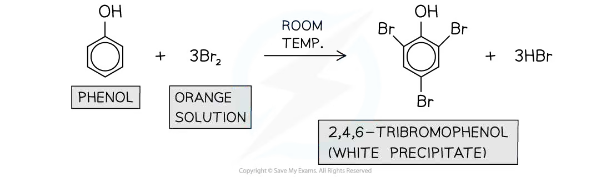{.concept-figure fig-alt="Aromatic reaction pathways and directing effects"}
:::

::: {.worked-example}
Worked example · Analysis of synthetic routes

### Reaction types, reagents, conditions and by-products

**Some reactions of compound A are shown below.**

**1. Give the structure of compound B and state the type of reaction by which this compound is formed from compound A.**

**2. What are the suitable reagents for reaction 2?**

**3. Suggest a more effective way to synthesise compound D from compound A.**

**4. What are the possible by-products of reaction 4?**

1. Reaction 1 is hydrogenation of the aromatic ring. Compound B is the corresponding cyclohexane derivative. The reaction is **reduction** (addition of hydrogen).
2. Oxidise the alkyl side chain using hot alkaline $\ce{KMnO4}$ under reflux, then acidify with dilute sulfuric acid. The side chain is converted into a carboxylic acid.
3. A more effective route is to convert the carboxylic acid into an acyl chloride using $\ce{SOCl2}$, then react the acyl chloride with the alcohol. This is faster and more complete than direct esterification with the carboxylic acid.
4. The acyl-chloride esterification produces **hydrogen chloride, HCl**. If direct esterification is used, the possible by-product is **water, H$_2$O**. Any unreacted starting material or hydrolysis product may also require separation.

The key route-analysis questions are: what bond changes, which reagent performs that change, what conditions give the desired selectivity, and what additional substances must be removed afterwards.

:::

::: {.study-card}
### Multi-step synthesis and route analysis

For a proposed route, analyse every arrow using four questions:

1. **What reaction type occurs?** For example, oxidation, reduction, nucleophilic substitution, electrophilic substitution, esterification or hydrolysis.
2. **Which reagent is required?** Give the actual laboratory reagent, not only the reactive ion.
3. **What conditions are needed?** Include solvent, catalyst, temperature, pressure, reflux or distillation where relevant.
4. **What can go wrong?** Consider competing products, regioisomers, over-oxidation, incomplete reaction, hydrolysis, low atom economy and difficult separation.

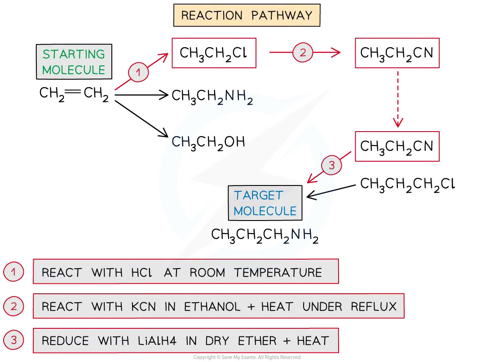{.concept-figure fig-alt="A multi-step organic synthesis route"}

The best route is usually one that gives the correct isomer in a small number of selective steps, uses readily available reagents, minimises waste and avoids difficult separations. A route with fewer arrows is not necessarily better if one step gives the wrong directing effect or a mixture of products.

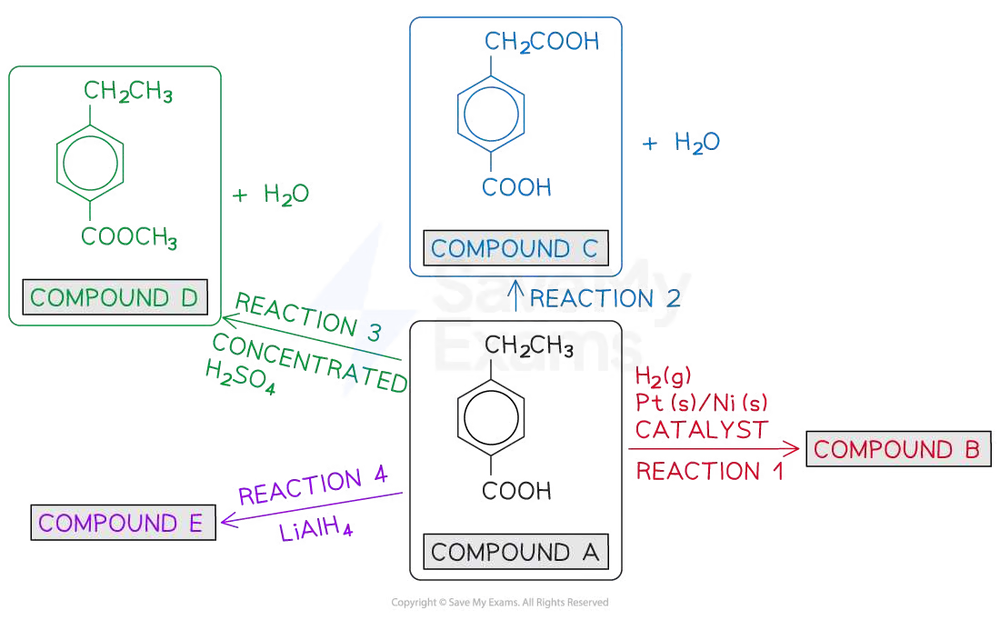{.concept-figure fig-alt="Analysis of reaction types and reagents in a synthetic route"}

{.concept-figure fig-alt="By-products and separation considerations in synthetic route analysis"}
:::

## Chapter checklist

- [ ] I can identify every functional group in a molecule containing several functional groups.
- [ ] I can predict how electron-donating and electron-withdrawing groups affect aromatic substitution.
- [ ] I can select reagents and conditions for oxidation, reduction, substitution, addition, esterification and hydrolysis.
- [ ] I can add one carbon to an aliphatic chain using a nitrile intermediate.
- [ ] I can design a multi-step route by working backwards from a target molecule.
- [ ] I can analyse by-products, competing reactions and separation requirements.

### Practice questions



### Original question PDFs

- [7.8 Organic Synthesis (A Level Only) – Easy](https://raw.githubusercontent.com/nanoxsj/CIE-Chemistry-Study/main/resources/original-papers/organic-synthesis/36.1-organic-synthesis-easy.pdf)
- [7.8 Organic Synthesis (A Level Only) – Medium](https://raw.githubusercontent.com/nanoxsj/CIE-Chemistry-Study/main/resources/original-papers/organic-synthesis/36.1-organic-synthesis-medium.pdf)
- [7.8 Organic Synthesis (A Level Only) – Hard](https://raw.githubusercontent.com/nanoxsj/CIE-Chemistry-Study/main/resources/original-papers/organic-synthesis/36.1-organic-synthesis-hard.pdf)
