# 8.1 Analytical Techniques (A Level Only) - Structured Questions

本页保留 8.1 题包中的全部 Structured Questions：Easy 3 题、Medium 7 题和 Hard 4 题。每题保留完整英文题干、所有分问、原始分值和题目中需要的独立图片；答案按 Model Answers 整理，并展示计算过程与解释步骤。

### 8.1 Analytical Techniques (A Level Only) - Easy

::: {.question-card}
### Example 1 · Gas chromatography · 8.1 SQ Easy Q1

This question is about gas chromatography.

**(a)** Name the three types of chemical that gas chromatography is used for. `[3 marks]`

**(b)** Silica and alumina are commonly used as the stationary phase in thin-layer chromatography. State the type of chemical that is commonly used as the stationary phase in gas chromatography. `[2 marks]`

**(c)** State the type of chemical that is used for the mobile phase in gas chromatography. You should include at least one specific example in your answer. `[2 marks]`

Results in gas chromatography are based on retention time.

**(d)(i)** Define the term retention time. `[1 mark]`

**(d)(ii)** State three factors that retention time depends upon. `[3 marks]`

**(e)** State what information the relative size or area under the peak on a gas chromatogram provides. `[1 mark]`

Gas chromatography is carried out using a polar stationary phase and argon as the carrier gas. Use the chromatogram in Fig. 1.1 to answer the following questions.

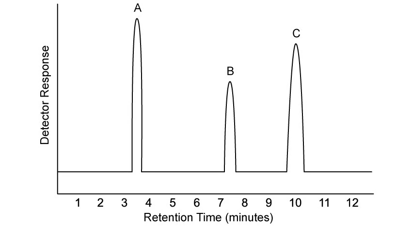{.question-figure fig-alt="Gas chromatogram used in Easy Question 1"}

**(f)(i)** State which compound has the lowest retention time. `[1 mark]`

**(f)(ii)** State which compound is the least polar. `[1 mark]`

**(f)(iii)** State which compound has the greatest interaction with the stationary phase. `[1 mark]`

Show mark scheme / model answer

- **(a)** The three types are **gases**, **volatile liquids** and **solids in their vapour form**. `[3]`
- **(b)** A **non-polar liquid on a solid support**, which is non-volatile or has a high boiling point. `[2]`
- **(c)** An inert carrier gas, for example **helium**, **nitrogen** or **argon**. `[2]`
- **(d)(i)** Retention time is the time taken for a component to travel through the column, or the time from injection until detection. `[1]`
- **(d)(ii)** Any three from: attraction to the stationary phase; attraction to the mobile phase; polarity; volatility; chemical structure/nature of the component. `[3]`
- **(e)** The relative concentration or amount of each component. `[1]`
- **(f)(i)** **A**, because its peak occurs first. `[1]`
- **(f)(ii)** **A**. With a polar stationary phase, the least polar component has the weakest attraction and the shortest retention time. `[1]`
- **(f)(iii)** **C**, because its retention time is greatest, so it is retained most strongly by the stationary phase. `[1]`

:::

::: {.question-card}
### Example 2 · NMR analysis of pentane isomers · 8.1 SQ Easy Q2

This question is about the NMR analysis of various organic compounds.

**(a)** Name and draw the structure of the chemical that is commonly used as a standard in NMR spectroscopy. `[2 marks]`

Fig. 2.1 shows the structures of compounds A, B and C. Compound A is pentane, $\ce{C5H12}$. Compound B is 2-methylbutane and compound C is 2,2-dimethylpropane; B and C are both isomers of pentane.

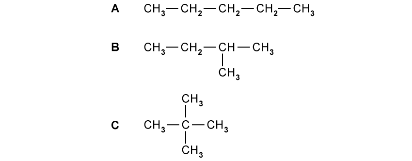{.question-figure fig-alt="Pentane isomers A, B and C"}

**(b)** State the number of hydrogen peaks expected in the low-resolution $^1$H NMR spectrum of each isomer. `[3 marks]`

More structural details can be deduced using high-resolution $^1$H NMR.

**(c)** Explain why the methyl groups in 2-methylbutane, compound B, give a doublet splitting pattern while the methyl groups in 2,2-dimethylpropane, compound C, give a singlet splitting pattern. `[3 marks]`

Carbon-13 NMR is also commonly used to distinguish chemicals.

**(d)** Predict the number of peaks in the carbon-13 NMR spectra of compounds A, B and C. `[3 marks]`

Show mark scheme / model answer

- **(a)** The standard is **tetramethylsilane**, TMS, with structural formula $\ce{Si(CH3)4}$. `[2]`
- **(b)** The number of $^1$H environments is: pentane A = **3**, 2-methylbutane B = **4**, and 2,2-dimethylpropane C = **1**. `[3]`
- **(c)** Splitting depends on neighbouring protons. In B, each methyl group is next to one proton on the adjacent $\ce{CH}$ group, so $n+1=1+1=2$: a **doublet**. In C, the methyl groups are next to a quaternary carbon with no hydrogen, so $n+1=0+1=1$: a **singlet**. `[3]`
- **(d)** The number of carbon environments is A = **3**, B = **4**, C = **2**. `[3]`

:::

::: {.question-card}
### Example 3 · Thin-layer chromatography · 8.1 SQ Easy Q3

This question is about thin-layer chromatography.

**(a)** Name the two phases of chromatography and give one example of a chemical used for each phase. `[4 marks]`

Thin-layer chromatography is used to check if an unknown food colouring contains a banned colouring.

**(b)** Draw a labelled diagram to show the experimental setup for this TLC analysis. `[3 marks]`

**(c)** State two factors that the rate of separation depends upon. `[2 marks]`

**(d)** State the equation used to calculate the unique retention factor of a compound. `[1 mark]`

**(e)** Calculate the $R_f$ value of the compound shown in the chromatogram below.

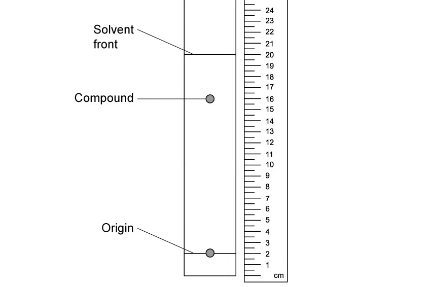{.question-figure fig-alt="TLC chromatogram used to calculate an Rf value"}

Show mark scheme / model answer

- **(a)** The mobile phase is a solvent, for example water, ethanol or hexane. The stationary phase is silica, $\ce{SiO2}$, or alumina, $\ce{Al2O3}$. `[4]`
- **(b)** The diagram should show a **TLC plate** in a covered beaker, a **pencil baseline**, known and unknown spots on the baseline, and the **solvent level below the baseline**. `[3]`
- **(c)** Separation depends on the solubility of each component in the mobile phase and its retention/interaction with the stationary phase. `[2]`
- **(d)**

  $$R_f=\frac{\text{distance travelled by component}}{\text{distance travelled by solvent front}}$$

  `[1]`
- **(e)** From the diagram, the compound has travelled 16 units and the solvent front has travelled 20 units:

  $$R_f=\frac{16}{20}=0.80$$

  `[3]`

:::

### 8.1 Analytical Techniques (A Level Only) - Medium

::: {.question-card}
### Example 4 · Verdigris and azurite analysis · 8.1 SQ Medium Q1

Verdigris is a green pigment that contains both copper(II) carbonate, $\ce{CuCO3}$, and copper(II) hydroxide, $\ce{Cu(OH)2}$, in varying amounts. Both copper compounds react with dilute hydrochloric acid:

$$\ce{CuCO3(s) + 2HCl(aq) -> CuCl2(aq) + CO2(g) + H2O(l)}$$

$$\ce{Cu(OH)2(s) + 2HCl(aq) -> CuCl2(aq) + 2H2O(l)}$$

You are to plan an experiment to determine the percentage of copper(II) carbonate in a sample of verdigris. Your method should involve the reaction of verdigris with excess dilute hydrochloric acid. You are provided with 0.494 g of verdigris, 10.0 mol dm$^{-3}$ hydrochloric acid and commonly available laboratory reagents and equipment. You may assume that any other material present in verdigris is unaffected by heating and is not acidic or basic.

**(a)(i)** A student suggests that finding the volume of dilute hydrochloric acid required to react with a known mass of verdigris would be a suitable method to determine the percentage of copper(II) carbonate. Suggest why this method would not work. `[1 mark]`

**(a)(ii)** The 10.0 mol dm$^{-3}$ HCl is too concentrated. Describe how to accurately prepare 250.0 cm$^3$ of 0.500 mol dm$^{-3}$ hydrochloric acid from the HCl provided. State the name and capacity of any apparatus used. `[3 marks]`

**(a)(iii)** The percentage can be determined by measuring the volume of gas produced when excess hydrochloric acid is added. Draw a diagram to show how to set up the apparatus and chemicals to measure the total volume of gas. Label your diagram. `[2 marks]`

**(a)(iv)** Sketch a graph to show how the volume of gas produced would change during the experiment. Put the independent variable on the x-axis, label both axes and extend the graph beyond the point at which the reaction is complete. `[2 marks]`

**(a)(v)** A student thinks that the 0.494 g sample contains only $\ce{CuCO3}$. Calculate the minimum volume, in cm$^3$, of 0.500 mol dm$^{-3}$ HCl needed to completely react with the sample. Show your working. $[M_r(\ce{CuCO3})=123.5]$ `[2 marks]`

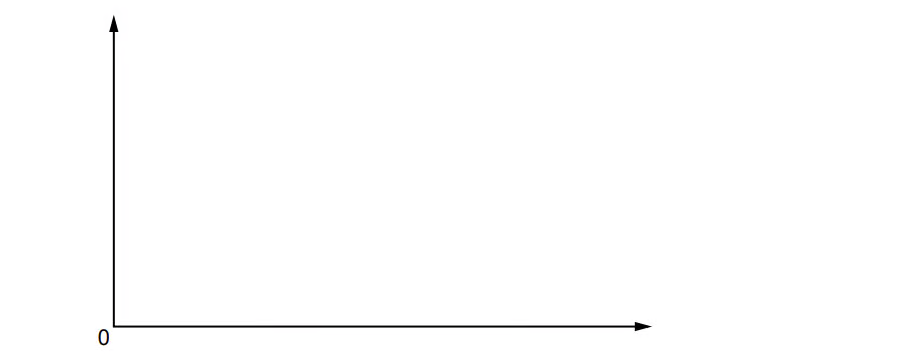{.question-figure fig-alt="Axes used for the verdigris gas-volume graph"}

Azurite is a blue copper-containing mineral. The copper compound in azurite has formula $\ce{Cu3(CO3)2(OH)2}$ and reacts with sulfuric acid:

$$\ce{Cu3(CO3)2(OH)2(s) + 3H2SO4(aq) -> 3CuSO4(aq) + 2CO2(g) + 4H2O(l)}$$

A student carries out titrations on 1.50 g samples of solid azurite using 0.400 mol dm$^{-3}$ sulfuric acid. The data are:

| Titration | Rough | 1 | 2 | 3 |
|---|---:|---:|---:|---:|
| Final reading / cm$^3$ | 25.55 | 23.90 | 48.30 | 28.10 |
| Initial reading / cm$^3$ | 0.00 | 0.00 | 23.90 | 3.95 |
| Titre / cm$^3$ |  |  |  |  |

The indicator is bromophenol blue, which is blue at pH 4.6 and yellow at pH 3.0.

**(b)(i)** Complete the table. `[1 mark]`

**(b)(ii)** Calculate the percentage uncertainty in titre 1. `[1 mark]`

**(b)(iii)** The student concludes that 24.15 cm$^3$ of 0.400 mol dm$^{-3}$ sulfuric acid completely reacts with 1.50 g of azurite. Calculate the percentage by mass of $\ce{Cu3(CO3)2(OH)2}$ in the sample. Give your answer to three significant figures. $[M_r=344.5]$ `[3 marks]`

**(b)(iv)** Identify two possible problems with the titration experiment and suggest improvements. `[4 marks]`

Show mark scheme / model answer

- **(a)(i)** The method cannot distinguish $\ce{CuCO3}$ from $\ce{Cu(OH)2}$ because both compounds react with HCl. `[1]`
- **(a)(ii)** Calculate the stock volume using $c_1V_1=c_2V_2$:

  $$V_1=\frac{0.500\times250.0}{10.0}=12.50\text{ cm}^3$$

  Use a burette or graduated pipette to transfer 12.50 cm$^3$ of the stock HCl into a 250.0 cm$^3$ volumetric flask. Add distilled water to the calibration mark, stopper and invert several times to mix. `[3]`
- **(a)(iii)** Use a divided conical flask or a flask in which the solid can be added without initial gas loss, connected by a tight bung and delivery tube to a gas syringe or an inverted measuring cylinder over water. The gas is carbon dioxide. `[2]`
- **(a)(iv)** Plot volume of gas against time. The curve starts at the origin, rises as carbon dioxide is produced, then reaches a horizontal plateau when the reaction is complete. `[2]`
- **(a)(v)**

  $$n(\ce{CuCO3})=\frac{0.494}{123.5}=0.00400\text{ mol}$$

  $$n(\ce{HCl})=2(0.00400)=0.00800\text{ mol}$$

  $$V=\frac{n}{c}=\frac{0.00800}{0.500}=0.0160\text{ dm}^3=16.0\text{ cm}^3$$

  `[2]`
- **(b)(i)** The titres are: rough = 25.55 cm$^3$, titre 1 = 23.90 cm$^3$, titre 2 = 24.40 cm$^3$, titre 3 = 24.15 cm$^3$. `[1]`
- **(b)(ii)**

  $$\%\text{ uncertainty}=\frac{0.05\times2}{23.90}\times100=0.42\%$$

  `[1]`
- **(b)(iii)**

  $$n(\ce{H2SO4})=0.400\times\frac{24.15}{1000}=9.66\times10^{-3}\text{ mol}$$

  The equation requires 3 mol of acid per mol of azurite:

  $$n(\ce{Cu3(CO3)2(OH)2})=\frac{9.66\times10^{-3}}{3}=3.22\times10^{-3}\text{ mol}$$

  $$m=3.22\times10^{-3}\times344.5=1.11\text{ g}$$

  $$\%\text{ by mass}=\frac{1.11}{1.50}\times100=74.0\%$$

- **(b)(iv)** The titres are not concordant, so repeat until two titres agree within about 0.10 cm$^3$. The colour change of bromophenol blue is difficult to judge, so use a more suitable indicator or another endpoint method. `[4]`

:::

::: {.question-card}
### Example 5 · Adsorption by activated charcoal · 8.1 SQ Medium Q2

Activated charcoal is a form of carbon with a very high surface area. It can remove impurities from mixtures by adsorption, where particles of the impurity bond to the charcoal surface. The relationship is:

$$\log\left(\frac{D}{m}\right)=A+b\log[X]$$

where $D$ is the difference in dye concentration before and after adsorption, $m$ is the mass of activated charcoal, $[X]$ is the final dye concentration, and $A$ and $b$ are constants.

A student places 50.0 cm$^3$ of a 25.00 g dm$^{-3}$ blue-dye solution in a conical flask, adds a weighed mass of activated charcoal, stirs for three minutes, leaves the mixture for one hour, filters it and determines $[X]$. The procedure is repeated using different masses.

**(a)(i)** Process the results to complete the table. Record data to two decimal places.

| $m$ / g | Initial concentration / g dm$^{-3}$ | Final concentration $[X]$ / g dm$^{-3}$ | $D$ / g dm$^{-3}$ | $D/m$ | $\log(D/m)$ | $\log[X]$ |
|---:|---:|---:|---:|---:|---:|---:|
| 0.20 | 25.00 | 0.96 |  |  |  |  |
| 0.25 | 25.00 | 0.69 |  |  |  |  |
| 0.30 | 25.00 | 0.60 |  |  |  |  |
| 0.35 | 25.00 | 0.41 |  |  |  |  |
| 0.40 | 25.00 | 0.33 |  |  |  |  |
| 0.45 | 25.00 | 0.27 |  |  |  |  |
| 0.50 | 25.00 | 0.23 |  |  |  |  |
| 0.55 | 25.00 | 0.20 |  |  |  |  |
| 0.60 | 25.00 | 0.17 |  |  |  |  |

`[2 marks]`

**(a)(ii)** Identify the dependent variable in this experiment. `[1 mark]`

**(a)(iii)** State and explain the effect, if any, of increasing the mass of activated charcoal on the amount of adsorption. `[2 marks]`

**(b)** Plot a graph on the grid to show the relationship between $\log(D/m)$ and $\log[X]$. Use a cross to plot each data point and draw the straight line of best fit. `[2 marks]`

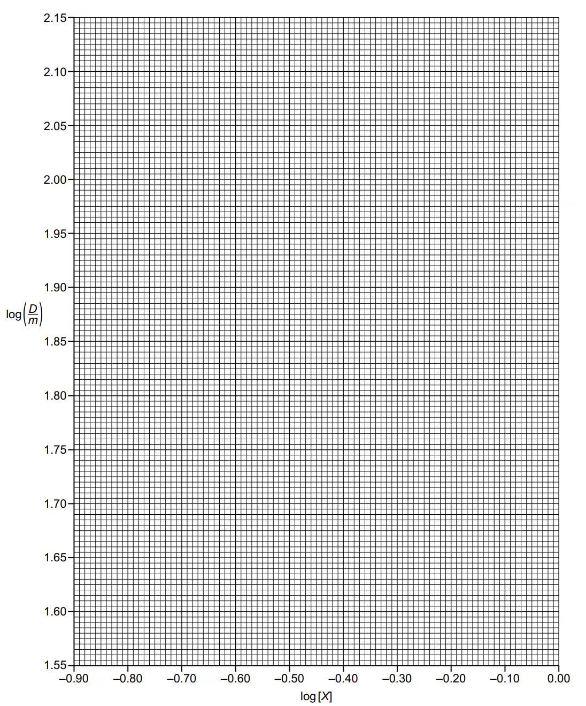{.question-figure fig-alt="Graph grid for activated charcoal adsorption"}

{.question-figure fig-alt="Additional graph grid for activated charcoal adsorption"}

**(c)** Circle the most anomalous point on the graph. Suggest why this anomaly may have happened during the experimental procedure. `[1 mark]`

**(d)(i)** Use the graph to determine the gradient of the line of best fit. State the coordinates of both points used. These must be selected from the line of best fit. Give the gradient to three significant figures. `[2 marks]`

**(d)(ii)** Use the graph to determine a value for $A$. `[1 mark]`

Show mark scheme / model answer

- **(a)(i)** The completed values are:

  | $m$ / g | $D$ | $D/m$ | $\log(D/m)$ | $\log[X]$ |
  |---:|---:|---:|---:|---:|
  | 0.20 | 24.04 | 120.20 | 2.08 | −0.02 |
  | 0.25 | 24.31 | 97.24 | 1.99 | −0.16 |
  | 0.30 | 24.40 | 81.33 | 1.91 | −0.22 |
  | 0.35 | 24.59 | 70.26 | 1.85 | −0.39 |
  | 0.40 | 24.67 | 61.68 | 1.79 | −0.48 |
  | 0.45 | 24.73 | 54.96 | 1.74 | −0.57 |
  | 0.50 | 24.77 | 49.54 | 1.69 | −0.64 |
  | 0.55 | 24.80 | 45.09 | 1.65 | −0.70 |
  | 0.60 | 24.83 | 41.38 | 1.62 | −0.77 |

  `[2]`
- **(a)(ii)** The dependent variable is the final concentration of blue dye, $[X]$. `[1]`
- **(a)(iii)** Increasing the mass of charcoal decreases the final dye concentration and increases adsorption because more charcoal provides a greater surface area and more adsorption sites. `[2]`
- **(b)** Plot all nine points and draw a straight line of best fit with approximately equal numbers of points on either side. `[2]`
- **(c)** The most anomalous point is approximately $(-0.22,1.91)$. A lower-than-expected adsorption result could result from insufficient stirring, too little charcoal, coagulated/bulkier particles, insufficient contact time or a surface area that was too low. `[1]`
- **(d)(i)** Choose two well-separated points on the best-fit line. A suitable result is:

  $$\text{gradient}=\frac{\Delta y}{\Delta x}\approx0.625$$

  `[2]`
- **(d)(ii)** The intercept on the $y$-axis gives $A$, approximately **2.09–2.10**. `[1]`

:::

::: {.question-card}
### Example 6 · Gas chromatography · 8.1 SQ Medium Q3

Column chromatography is a variation of thin-layer chromatography. Column chromatography and gas chromatography work by the same principles of components travelling through the column at different rates.

**(a)** State the difference between the mobile phases involved in column chromatography and gas-liquid chromatography. `[1 mark]`

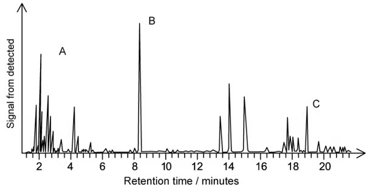{.question-figure fig-alt="Gas chromatogram used in Medium Question 3"}

**(b)** Three compounds, A, B and C, of similar volatility are mixed together. The mixture is analysed in a gas chromatograph using the chromatogram shown. State which compound has the greatest affinity for the solid phase. Explain your reasoning. `[2 marks]`

**(c)** Use the chromatogram to identify the most abundant compound in the mixture. Explain your answer. `[1 mark]`

**(d)** An oil tanker is travelling through the English Channel. The tanker has a slight leak, and some oil is noticed on a beach. Suggest how gas chromatography could be used to identify the tanker as the source of the crude-oil pollution. `[2 marks]`

Show mark scheme / model answer

- **(a)** Column chromatography uses a **liquid** mobile phase, whereas gas-liquid chromatography uses a **gas** mobile phase. `[1]`
- **(b)** **Compound C** has the greatest affinity for the solid/stationary phase because it has the **longest retention time**; it remains in the column for longer. `[2]`
- **(c)** **Compound B** is the most abundant because it has the highest/largest peak. The area under a chromatogram peak is proportional to the amount of that component. `[1]`
- **(d)** Perform gas chromatography on a sample of oil from the tanker and a sample of oil from the beach. Compare the chromatograms; matching patterns/retention times would support the conclusion that the tanker is the source. `[2]`

:::

::: {.question-card}
### Example 7 · Thin-layer chromatography and dinitrobenzene · 8.1 SQ Medium Q4

**(a)** Draw a labelled apparatus that would be used to identify the number of compounds in a mixture by thin-layer chromatography. `[2 marks]`

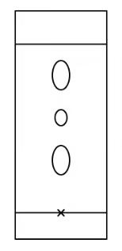{.question-figure fig-alt="TLC plate for identifying components in a mixture"}

**(b)** State the steps that a student should perform to determine the identity of the compounds using $R_f$ values. `[4 marks]`

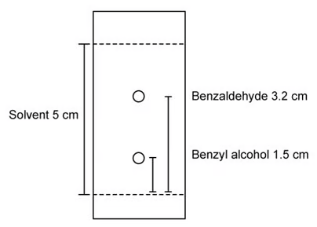{.question-figure fig-alt="Measurements from a TLC plate used for Rf values"}

**(c)** Suggest an improved method to locate the centre of each spot. `[2 marks]`

**(d)** Calculate the $R_f$ values for benzaldehyde and benzyl alcohol in the chromatogram. The solvent front travelled 5.0 cm; the benzaldehyde spot travelled 3.2 cm and the benzyl alcohol spot travelled 1.5 cm. `[2 marks]`

**(e)** Explain why the maximum $R_f$ value of a compound cannot exceed 1. `[2 marks]`

Show mark scheme / model answer

- **(a)** Show a covered beaker containing a TLC plate, with the solvent level below the pencil baseline. `[2]`
- **(b)** Measure the distance travelled by the solvent front; measure the distance travelled by each spot; calculate each $R_f$ value; compare the values with data for known compounds. `[4]`
- **(c)** Measure to the top and bottom of each spot and use the mean:

  $$\text{centre}=\frac{\text{distance to top}+\text{distance to bottom}}{2}$$

  `[2]`
- **(d)**

  $$R_f(\text{benzaldehyde})=\frac{3.2}{5.0}=0.64$$

  $$R_f(\text{benzyl alcohol})=\frac{1.5}{5.0}=0.30$$

- **(e)**

  $$R_f=\frac{\text{distance travelled by compound}}{\text{distance travelled by solvent}}$$

  The spot cannot travel further than the solvent front, so the numerator cannot be larger than the denominator. An $R_f$ of 1 means the component travelled exactly as far as the solvent front. `[2]`

:::

::: {.question-card}
### Example 8 · NMR reference standards and carbon environments · 8.1 SQ Medium Q5

During the production of an NMR spectrum, tetramethylsilane (TMS) is mixed with the sample.

**(a)(i)** Give the structural formula of the standard reference chemical used for $^1$H NMR spectroscopy. `[1 mark]`

**(a)(ii)** Explain why tetramethylsilane is used as the standard reference chemical. `[2 marks]`

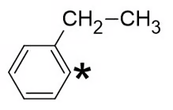{.question-figure fig-alt="Ethylbenzene used for carbon-13 NMR environment counting"}

**(b)** State the number of peaks in the carbon-13 NMR spectrum of 1,3-dichlorobenzene. `[1 mark]`

**(c)(i)** State the number of peaks in the carbon-13 NMR spectrum of ethylbenzene. `[1 mark]`

**(c)(ii)** State the carbon-13 chemical-shift range for the carbon marked with an asterisk in the question figure. `[1 mark]`

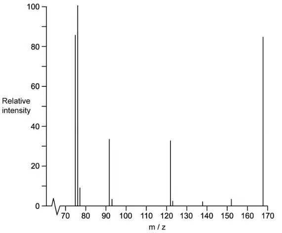{.question-figure fig-alt="Mass spectrum used to identify a dinitrobenzene molecular ion"}

**(d)(i)** The mass spectrum of compound A has a peak at $m/e=76$. Identify the molecular ion responsible for this peak. `[1 mark]`

**(d)(ii)** Draw the three possible isomers of compound A containing a benzene ring. `[3 marks]`

**(d)(iii)** The carbon-13 NMR spectrum of compound A has four peaks. Identify the structure of A. Explain your reasoning by labelling the different carbon environments in all the structures drawn in part (d)(ii). `[3 marks]`

Show mark scheme / model answer

- **(a)(i)** $\ce{Si(CH3)4}$, tetramethylsilane. `[1]`
- **(a)(ii)** TMS is inert, volatile, gives one sharp signal and has its signal assigned to $\delta=0$ ppm, well separated from most organic signals. Any two correct reasons earn the marks. `[2]`
- **(b)** **Four** peaks. The ring carbons form four different environments because of symmetry. `[1]`
- **(c)(i)** **Six** peaks: four aromatic environments and two different ethyl-group carbons. `[1]`
- **(c)(ii)** The aromatic carbon is in the range **110–160 ppm**. `[1]`
- **(d)(i)** The peak at $m/e=76$ is due to the benzene-ring fragment ion **$\ce{C6H4+}$** because $6(12.0)+4(1.0)=76$. It is a positively charged fragment ion, not the molecular ion of dinitrobenzene. `[1]`
- **(d)(ii)** The three positional isomers are **1,2-dinitrobenzene**, **1,3-dinitrobenzene** and **1,4-dinitrobenzene**. `[3]`
- **(d)(iii)** Compound A is **1,3-dinitrobenzene**. It gives four carbon-13 environments, whereas 1,2-dinitrobenzene gives three and 1,4-dinitrobenzene gives two. `[3]`

:::

::: {.question-card}
### Example 9 · Methyl cinnamate and proton NMR · 8.1 SQ Medium Q6

Methyl cinnamate, $\ce{C10H10O2}$, is a white crystalline solid used in the perfume industry. The proton NMR spectrum of methyl cinnamate in the solvent $\ce{CDCl3}$ is shown in Fig. 6.1.

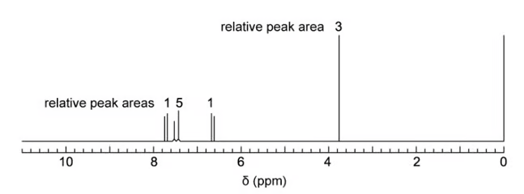{.question-figure fig-alt="Proton NMR spectrum of methyl cinnamate"}

**(a)(i)** Explain why $\ce{CDCl3}$ is used as a solvent instead of $\ce{CHCl3}$. `[1 mark]`

**(a)(ii)** Explain why TMS is added to give the small peak at chemical shift $\delta=0$. `[1 mark]`

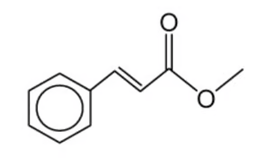{.question-figure fig-alt="Methyl cinnamate structure"}

**(b)** The spectrum has a peak at $\delta=3.8$ ppm. Identify the proton environment, state its splitting pattern and use the integration to explain your answer. `[3 marks]`

**(c)** Draw the two esters with formula $\ce{C6H12O2}$ that each have only two peaks, both singlets, in their $^1$H NMR spectra. `[2 marks]`

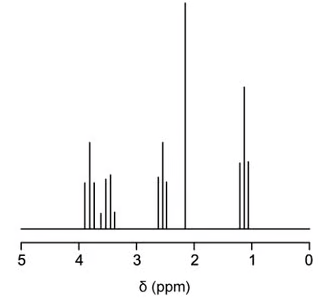{.question-figure fig-alt="Proton NMR integration and splitting question"}

**(d)(i)** State the simplest ratio of protons in each environment. `[1 mark]`

**(d)(ii)** Describe and explain the splitting patterns of the peaks at $\delta=3.5$ and $\delta=1.2$. `[4 marks]`

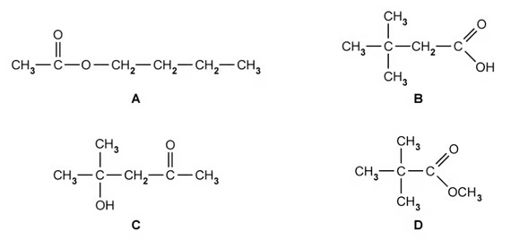{.question-figure fig-alt="Possible ester isomers for proton NMR analysis"}

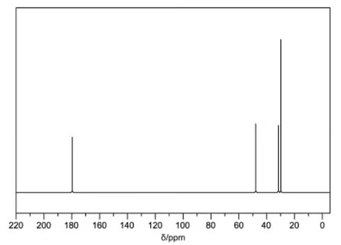{.question-figure fig-alt="Carbon-13 NMR spectrum for ester isomers"}

**(e)** Which isomer produced the spectrum in Fig. 6.5? `[1 mark]`

Show mark scheme / model answer

- **(a)(i)** $\ce{CDCl3}$ is deuterated and does not give an interfering proton peak, whereas $\ce{CHCl3}$ would give a signal. `[1]`
- **(a)(ii)** TMS provides the reference signal at $\delta=0$ so that the chemical shifts of the sample can be measured relative to it. `[1]`
- **(b)** The signal at $\delta=3.8$ ppm is the methyl group in $\ce{-OCH3}$. It is a singlet because there are no adjacent protons on the atom next to the methyl group. Its integration of 3 corresponds to three protons. `[3]`
- **(c)** The two esters are:

  $$\ce{(CH3)3CCOOCH3}$$

  and

  $$\ce{CH3COOC(CH3)3}$$

  Each has two proton environments with areas 9:3, and both are singlets because there are no neighbouring protons across the ester linkage. `[2]`
- **(d)(i)** The simplest integration ratio is **2:2:2:3:3**. `[1]`
- **(d)(ii)** The $\delta=3.5$ signal is from a $\ce{CH2}$ group next to oxygen, $\ce{-OCH2-}$. It is a quartet because it has three neighbouring protons on an adjacent $\ce{CH3}$ group. The $\delta=1.2$ signal is from a methyl group next to $\ce{CH2}$ and is a triplet because it has two neighbouring protons. `[4]`
- **(e)** The isomer is **B**, as its number of carbon environments and chemical-shift assignments match the spectrum. `[1]`

:::

::: {.question-card}
### Example 10 · MS, IR and NMR comparison · 8.1 SQ Medium Q7

Ethane-1,2-diol, $\ce{C2H6O2}$, can be distinguished from ethanedioic acid, $\ce{C2H2O4}$, by several analytical techniques including MS, IR and NMR.

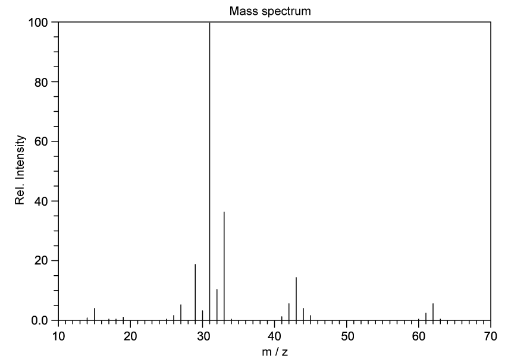{.question-figure fig-alt="Mass spectrum A for the ethane-1,2-diol and ethanedioic-acid comparison"}

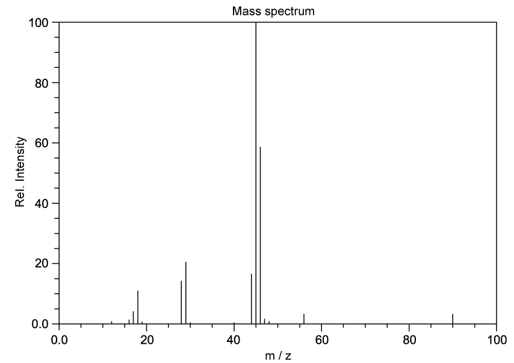{.question-figure fig-alt="Mass spectrum B for the ethane-1,2-diol and ethanedioic-acid comparison"}

**(a)** Complete the table to suggest which compound is responsible for each mass spectrum and explain your answer.

| Spectrum | Organic compound | Explanation |
|---|---|---|
| A |  |  |
| B |  |  |

`[2 marks]`

The IR spectra of ethane-1,2-diol and ethanedioic acid dihydrate are shown below. Use the data in the question to complete the table.

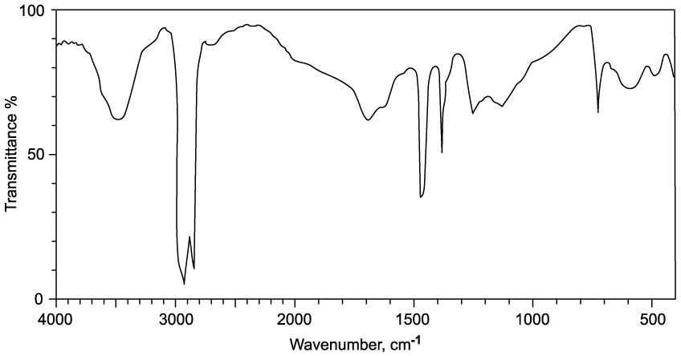{.question-figure fig-alt="IR spectrum C"}

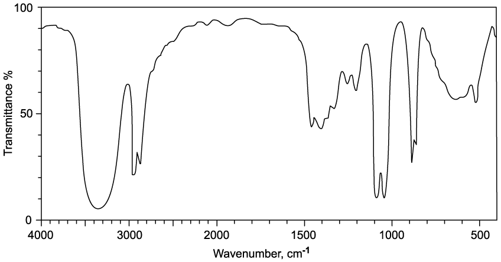{.question-figure fig-alt="IR spectrum D"}

| Spectrum | Organic compound | Explanation |
|---|---|---|
| C |  |  |
| D |  |  |

`[2 marks]`

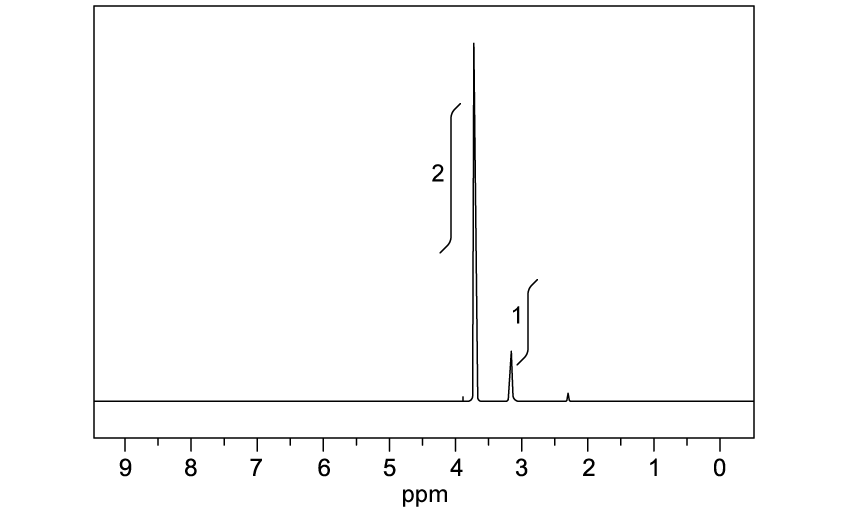{.question-figure fig-alt="Proton NMR spectrum used in the comparison"}

**(c)** Explain the number of peaks and integration ratio in the proton NMR spectrum of ethane-1,2-diol. `[3 marks]`

**(d)** State the number of peaks and splitting pattern expected for ethanedioic acid. `[2 marks]`

Show mark scheme / model answer

- **(a)** Spectrum A is **ethane-1,2-diol** because its molecular ion is at $m/e=62$, which is $M_r(\ce{C2H6O2})$. Spectrum B is **ethanedioic acid** because its molecular ion is at $m/e=90$, which is $M_r(\ce{C2H2O4})$. `[2]`
- **(b)** Spectrum C is **ethanedioic acid** because it contains a strong $\ce{C=O}$ absorption at about 1700–1750 cm$^{-1}$. Spectrum D is **ethane-1,2-diol** because it has a broad alcohol $\ce{O-H}$ absorption around 3200–3600 cm$^{-1}$. `[2]`
- **(c)** Ethane-1,2-diol gives two proton environments. The two $\ce{CH2}$ groups are equivalent and account for four protons; the two $\ce{OH}$ protons account for two protons. The integration ratio is therefore **2:1**. `[3]`
- **(d)** Ethanedioic acid gives **one** proton signal and it is a **singlet**, because the two acidic protons are equivalent and do not split each other. `[2]`

:::

### 8.1 Analytical Techniques (A Level Only) - Hard

::: {.question-card}
### Example 11 · Identifying an ester P · 8.1 SQ Hard Q1

Compound P is a naturally occurring chemical found in strawberries, apples and Parmesan cheese. Its percentage composition by mass is carbon 58.82%, hydrogen 9.80% and oxygen 31.38%. The mass spectrum of compound P is shown.

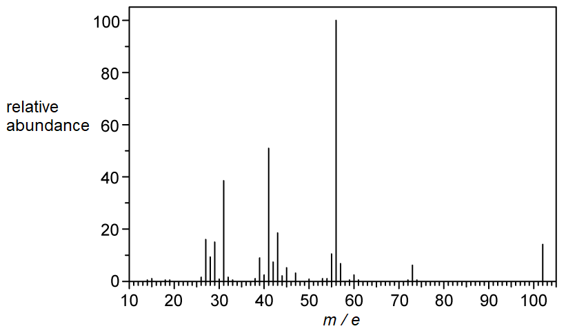{.question-figure fig-alt="Mass spectrum of unknown compound P"}

**(a)** Determine the molecular formula of compound P. Show your working. `[3 marks]`

Qualitative tests give the following results: addition of water forms separate layers; sodium carbonate solution gives no visible change; 2,4-DNPH gives no visible change; Tollens' reagent gives no visible change.

**(b)** Analyse the potential functional groups in compound P and explain your answers. `[4 marks]`

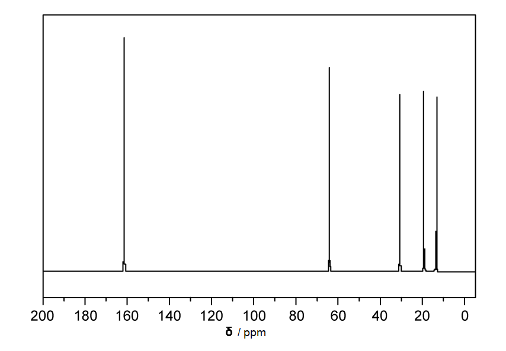{.question-figure fig-alt="Carbon-13 NMR spectrum of compound P"}

**(c)** Identify the functional group(s) present in compound P using your answer in (b) and the carbon-13 NMR spectrum. Explain your answer. `[3 marks]`

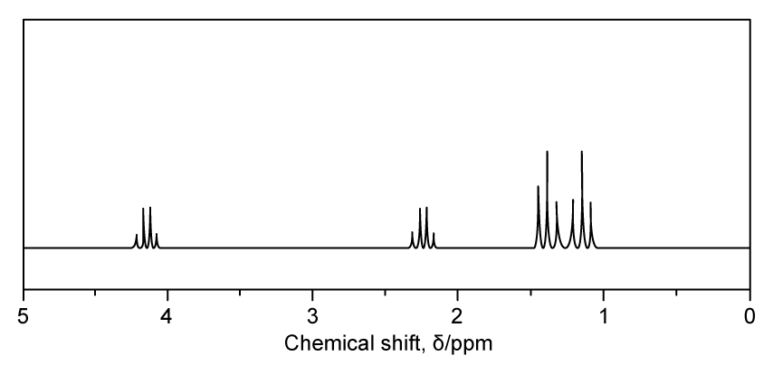{.question-figure fig-alt="High-resolution proton NMR spectrum of compound P"}

**(d)** Suggest the structure of compound P using all the information. Explain your answer. `[3 marks]`

Show mark scheme / model answer

- **(a)**

  $$\frac{58.82}{12.0}:\frac{9.80}{1.0}:\frac{31.38}{16.0}=4.90:9.80:1.96\approx5:10:2$$

  The empirical and molecular formula is $\ce{C5H10O2}$, with $M_r=102$, matching the molecular-ion peak at $m/e=102$. `[3]`
- **(b)** No reaction with $\ce{Na2CO3}$ means no carboxylic acid. A negative 2,4-DNPH test means no aldehyde or ketone. A negative Tollens' test means no aldehyde. With two oxygen atoms and no positive test for these groups, an ester is a strong possibility, although an insoluble diol cannot be completely excluded at this stage. `[4]`
- **(c)** The functional group is an **ester**. A signal near $\delta=162$ ppm is consistent with an ester carbonyl, while a signal near $\delta=63$ ppm is consistent with a carbon attached to oxygen. `[3]`
- **(d)** The structure is **ethyl propanoate**, $\ce{CH3CH2COOCH2CH3}$. The proton spectrum contains two quartets and two triplets; each quartet/triplet pair indicates an ethyl group, and the two ethyl groups are non-identical. `[3]`

:::

::: {.question-card}
### Example 12 · Isomers of $\ce{C8H10}$ · 8.1 SQ Hard Q2

Three hydrocarbons, L, M and N, have molecular formula $\ce{C8H10}$. Information about the number of peaks in their carbon-13 NMR spectra is given in Table 2.1.

**(a)** Suggest structures for compounds L, M and N. `[3 marks]`

**(b)** Complete the table to give details of the proton NMR spectra for isomers L, M and N.

| Isomer | Number of peaks | Relative peak area |
|---|---:|---|
| L |  |  |
| M |  |  |
| N |  |  |

`[3 marks]`

**(c)** Explain which of the three isomers, L, M or N, has the highest melting point. `[2 marks]`

Show mark scheme / model answer

- **(a)** The compounds are the three dimethylbenzene positional isomers: L = **1,4-dimethylbenzene (para-xylene)**, M = **1,3-dimethylbenzene (meta-xylene)**, N = **1,2-dimethylbenzene (ortho-xylene)**. `[3]`
- **(b)**

  | Isomer | Number of peaks | Relative peak area |
  |---|---:|---|
  | L | 2 | 3:2 |
  | M | 4 | 6:1:2:1 |
  | N | 3 | 3:1:1 |

  `[3]`
- **(c)** **L**, the para isomer, has the highest melting point. Its greater symmetry allows more regular crystal packing and stronger effective intermolecular attractions in the solid. `[2]`

:::

::: {.question-card}
### Example 13 · GC-MS of hydrocarbon isomers · 8.1 SQ Hard Q3

Gas chromatography is often connected to mass spectroscopy to analyse each compound as it exits the column. The combined technique is GC-MS. The gas chromatogram of an organic mixture is shown; the stationary phase is a polar, high-boiling-point liquid on a solid support.

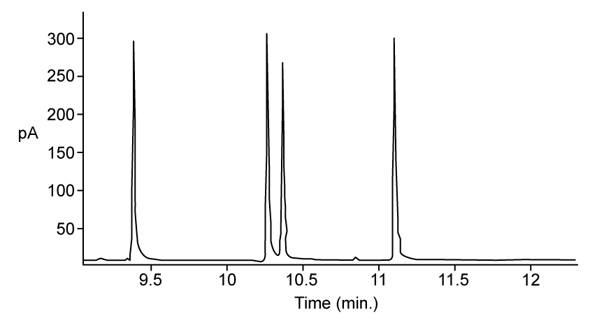{.question-figure fig-alt="GC chromatogram in Hard Question 3"}

**(a)(i)** Name an appropriate mobile phase. `[1 mark]`

**(a)(ii)** Identify the number of compounds present and explain how to identify the most polar compound. `[2 marks]`

Two compounds in the mixture are hydrocarbons with similar retention times. Their mass spectra show the same molecular formula but structural isomerism. Both give no colour change with bromine water.

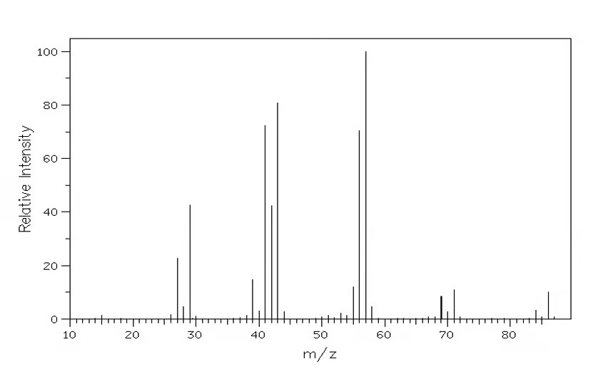{.question-figure fig-alt="Mass spectrum used to identify the hydrocarbon"}

**(b)(i)** Identify the molar mass and molecular formula of the isomers. `[2 marks]`

**(b)(ii)** Identify the fragments at $m/z=29$, 43 and 57. `[3 marks]`

**(b)(iii)** Suggest the most likely structure of the isomer responsible for the spectrum. `[1 mark]`

**(c)(i)** Explain the small additional peak at $m/e=87$. `[1 mark]`

**(c)(ii)** State the type of molecules for which the additional peak becomes more pronounced and explain why. `[2 marks]`

One other isomer is 2,3-dimethylbutane.

**(d)(i)** Suggest one way in which its mass spectrum differs from the spectrum in part (b). `[1 mark]`

**(d)(ii)** Suggest an alternative spectroscopic technique for distinguishing the two isomers. `[1 mark]`

**(d)(iii)** Predict which isomer has the longest retention time and explain your answer. `[2 marks]`

Show mark scheme / model answer

- **(a)(i)** Helium, nitrogen or argon. `[1]`
- **(a)(ii)** There are **four** compounds, shown by four peaks. The most polar component has the longest retention time; in this chromatogram it is the component at about 11.1 minutes. `[2]`
- **(b)(i)** $M_r=86$ g mol$^{-1}$ and the molecular formula is $\ce{C6H14}$. The orange bromine water confirms that the hydrocarbon is saturated. `[2]`
- **(b)(ii)** $m/z=29=\ce{C2H5+}$, $m/z=43=\ce{C3H7+}$ and $m/z=57=\ce{C4H9+}$. `[3]`
- **(b)(iii)** The most likely structure is **hexane**, $\ce{CH3CH2CH2CH2CH2CH3}$, because the $\ce{C4H9+}$ fragment supports a straight chain. `[1]`
- **(c)(i)** The peak at 87 is due to an $M+1$ ion containing one $^{13}\ce{C}$ atom. `[1]`
- **(c)(ii)** It is more pronounced for molecules with more carbon atoms because the probability of one carbon being $^{13}\ce{C}$ increases with the number of carbon atoms. `[2]`
- **(d)(i)** 2,3-dimethylbutane has no or only a very small $m/e=57$ peak; it may show a peak at $m/e=27$ instead. `[1]`
- **(d)(ii)** Carbon-13 NMR or proton NMR. `[1]`
- **(d)(iii)** 2,3-dimethylbutane has the longer retention time in the supplied model answer because its branching can cause stronger interaction or snagging with the stationary phase. `[2]`

:::

::: {.question-card}
### Example 14 · Dinitrobenzene positional isomers and TLC · 8.1 SQ Hard Q4

Dinitrobenzene has molecular formula $\ce{C6H4N2O4}$.

**(a)** Draw the isomers of dinitrobenzene and name the type of isomerism. `[2 marks]`

**(b)** State the factors that determine the distance travelled by a spot in thin-layer chromatography. `[1 mark]`

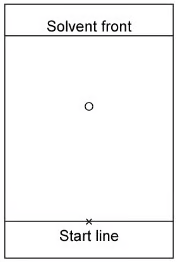{.question-figure fig-alt="TLC plate used to compare dinitrobenzene isomers"}

**(c)** Fig. 4.1 shows the chromatogram with the spot for 1,4-dinitrobenzene. Draw the expected position of the spot for 1,2-dinitrobenzene. Explain your answer. `[3 marks]`

**(d)** Explain what the student could do to reverse the relative positions of the 1,2-dinitrobenzene and 1,4-dinitrobenzene spots. `[2 marks]`

Show mark scheme / model answer

- **(a)** Draw 1,2-, 1,3- and 1,4-dinitrobenzene. They are **positional isomers**. `[2]`
- **(b)** The distance depends on the compound's solubility/affinity for the mobile phase and its retention/interaction with the stationary phase. `[1]`
- **(c)** Place the 1,2-dinitrobenzene spot below the existing 1,4-dinitrobenzene spot. Silica is polar and hexane is non-polar; 1,2-dinitrobenzene is more polar because the nitro groups are adjacent, so it interacts more strongly with silica and travels less far. `[3]`
- **(d)** Replace hexane with a more polar solvent. The more polar 1,2-dinitrobenzene will then have greater affinity for the mobile phase and travel further, reversing the relative positions. `[2]`

:::
